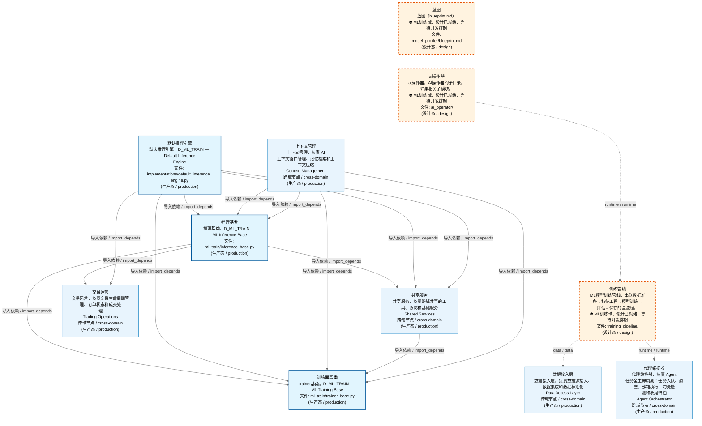
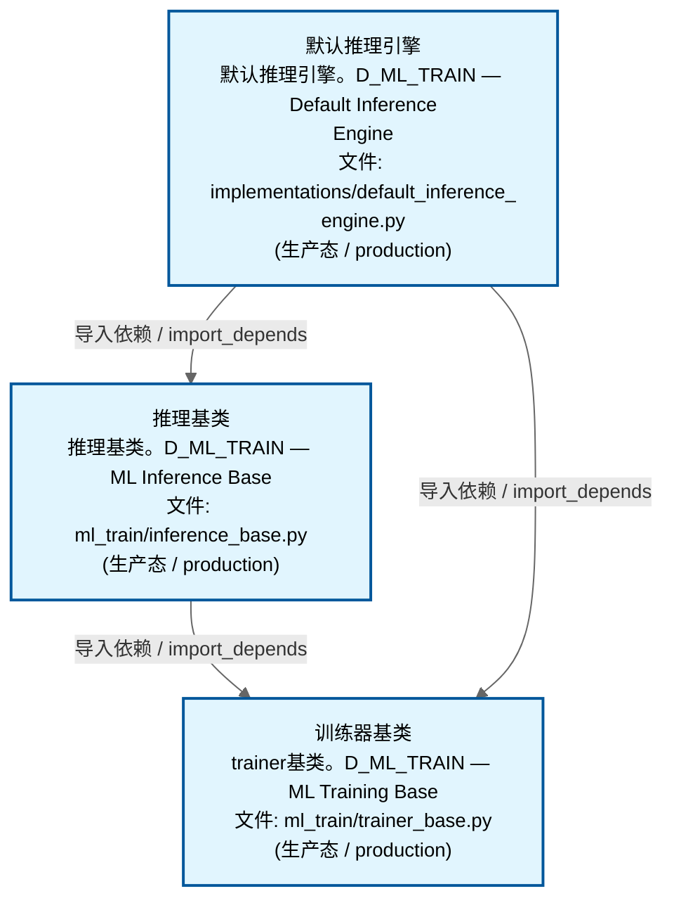
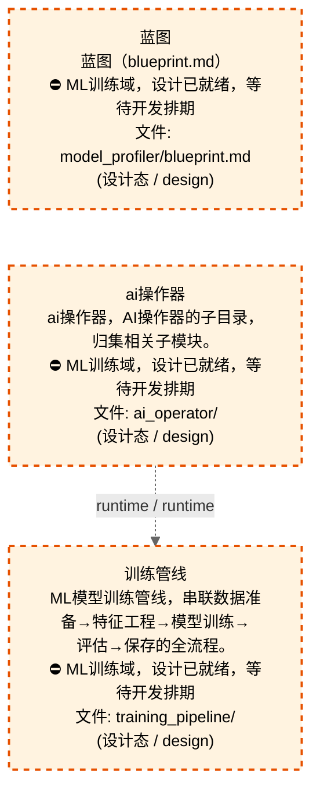
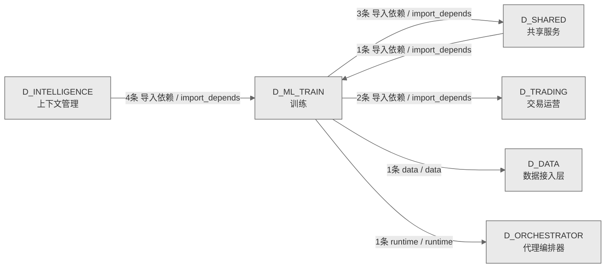

# 61_d_ml_train / 训练域 / Training

> **功能简介 / Overview**: 训练，负责模型训练、特征工程和模型评估

> **文档作用 / Purpose**: 展示 训练（D_ML_TRAIN）功能域的域内依赖关系、跨域依赖关系，模块信息（成熟度/中英文名/大白话/文件路径）内嵌于 Mermaid 节点，供架构审查和域治理参考。

> 本文档由 generate_domain_doc.py 从 depgraph (PostgreSQL) 自动生成
> 数据源: depgraph (PostgreSQL) nodes表 + edges表

> **[可缩放 HTML 版 / Zoomable HTML](http://localhost:8765/docs/02_enterprise_architecture/02_domain_architecture_docs/_zoomable_html/61_d_ml_train.html)** — Ctrl+滚轮缩放 ｜ 双击重置 ｜ Ctrl+Shift+D 切换拖动/选择模式

## 域基本信息 / Domain Overview

| 字段 | 值 | Field | Value |
|------|------|-------|-------|
| 编号 | 61 | Number | 61 |
| 域ID | D_ML_TRAIN | Domain ID | D_ML_TRAIN |
| 域名称 | 训练 | Domain Name | Training |
| 层级 | L2 业务域层 | Layer | L2 Domain |
| 模块数 | 6 | Module Count | 6 |
| 域内依赖 | 4 | Internal Dependencies | 4 |
| 跨域入边 | 5 | Cross-domain Incoming | 5 |
| 跨域出边 | 7 | Cross-domain Outgoing | 7 |
| 设计态模块 | 3 | Design Modules | 3 |
| 生产态模块 | 3 | Production Modules | 3 |
| 容量 | 3/150 (正常) | Capacity | 3/150 (正常) |
| 描述 | 模型能力考试 | Description | 模型能力考试 |

## 域内依赖图 / Internal Dependency Diagram

> 依赖图内嵌在本文档中，IDE 可直接渲染；网页版可 Ctrl+滚轮缩放 + 拖动平移查看细节。
>
> **图例说明 / Legend**：
> - 🟦 **蓝色 = 运营态模块**（production，已上线运行）
> - 🟧 **橙色虚线 = 设计态模块**（design，蓝图阶段，代码未写）
> - **实线箭头 = 运营态依赖**（已生效的依赖关系）
> - **虚线箭头 = 非运营态依赖**（计划中/验证中的依赖关系）

### 全景图（全部模块，颜色区分运营态/设计态）

> 展示全部 6 个模块（生产态 3 + 设计态 3），含跨域依赖外部节点。节点含成熟度+名称+大白话/简介+文件路径。

### 运营态的图（仅 design_maturity=production 的模块和域内依赖）

> 仅展示已上线运行的模块（共 3 个），不含跨域外部节点。跨域依赖见下方跨域依赖章节。

### 设计态的图（仅 design_maturity=design 的模块和域内依赖）

> 仅展示蓝图阶段、代码未写的设计态模块（共 3 个），不含跨域外部节点。

## 跨域依赖 / Cross-domain Dependencies

### 本域依赖的其他域（出边）/ Depends On

| # | 本域模块 / Source Module | → | 外部域-目标模块 / Target Module | 依赖类型 / Type |
|:--:|---------|:--:|---------|---------|
| 1 | 训练管线 (training_pipeline/) | → | D_DATA 数据接入层: pit查询 / pit_query (data/pit_query.py) | data / data |
| 2 | 训练管线 (training_pipeline/) | → | D_ORCHESTRATOR 代理编排器: 模型注册表 / model_registry (governance/model_registry.py) | runtime / runtime |
| 3 | 默认推理引擎 / D_ML_TRAIN — Default Inference Engine (im... | → | D_SHARED 共享服务: 模型服务响应 / model_serving_response (experiment/model_s... | 导入依赖 / import_depends |
| 4 | 默认推理引擎 / D_ML_TRAIN — Default Inference Engine (im... | → | D_SHARED 共享服务: paths.py — 项目路径常量 SSoT（Single Source of  / paths ... | 导入依赖 / import_depends |
| 5 | 推理基类 / D_ML_TRAIN — ML Inference Base (ml_train/infe... | → | D_SHARED 共享服务: 模型服务响应 / model_serving_response (experiment/model_s... | 导入依赖 / import_depends |
| 6 | 默认推理引擎 / D_ML_TRAIN — Default Inference Engine (im... | → | D_TRADING 交易运营: 模型服务请求 / model_serving_request (execution/model_ser... | 导入依赖 / import_depends |
| 7 | 推理基类 / D_ML_TRAIN — ML Inference Base (ml_train/infe... | → | D_TRADING 交易运营: 模型服务请求 / model_serving_request (execution/model_ser... | 导入依赖 / import_depends |

### 依赖本域的其他域（入边）/ Depended By

| # | 外部域-源模块 / Source Module | → | 本域模块 / Target Module | 依赖类型 / Type |
|:--:|---------|:--:|---------|---------|
| 1 | D_INTELLIGENCE 上下文管理: 默认推理引擎 / D_ML_TRAIN — Default Inference Engine (im... | → | 推理基类 / D_ML_TRAIN — ML Inference Base (ml_train/infe... | 导入依赖 / import_depends |
| 2 | D_INTELLIGENCE 上下文管理: 默认推理引擎 / D_ML_TRAIN — Default Inference Engine (im... | → | 训练器基类 / D_ML_TRAIN — ML Training Base (ml_train/tra... | 导入依赖 / import_depends |
| 3 | D_INTELLIGENCE 上下文管理: 推理基类 / inference_base (model_evaluation/inference_bas... | → | 推理基类 / D_ML_TRAIN — ML Inference Base (ml_train/infe... | 导入依赖 / import_depends |
| 4 | D_INTELLIGENCE 上下文管理: 推理基类 / inference_base (model_evaluation/inference_bas... | → | 训练器基类 / D_ML_TRAIN — ML Training Base (ml_train/tra... | 导入依赖 / import_depends |
| 5 | D_SHARED 共享服务: 机器学习实验管线 / ml_experiment_pipeline (_cross_layer/m... | → | 训练器基类 / D_ML_TRAIN — ML Training Base (ml_train/tra... | 导入依赖 / import_depends |

### 跨域依赖图 / Cross-domain Dependency Diagram

> 本域与 5 个外部域直接连接（出边 7 条 + 入边 5 条 = 12 条）。只显示直接连接的域，不展开具体节点。

## 说明 / Notes

- **数据源 / Data Source**: `depgraph (PostgreSQL)` 的 `nodes`、`edges`、`domains` 表
- **生成器 / Generator**: `generate_domain_doc.py`（G2+G10 合并）
- **维护方式 / Maintenance**: 自动生成，全景图更新时刷新
- **文件名规则 / File Naming**: `{编号:02d}_{域ID小写}.md`，如 `16_d_trading.md`
- **图例说明 / Legend**: `[production]`=已上线 / `[design]`=设计中 / `[unknown]`=未知
