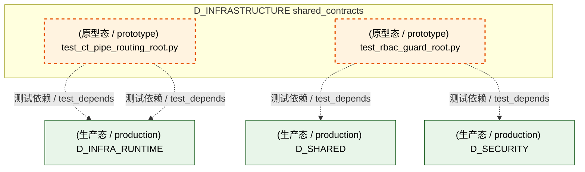
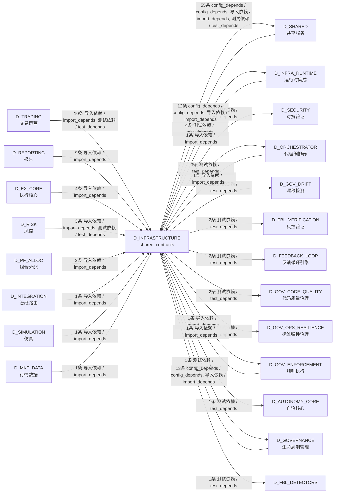

# 62_d_infrastructure / shared_contracts / shared_contracts / D_INFRASTRUCTURE

> **文档作用 / Purpose**: 展示 shared_contracts（D_INFRASTRUCTURE）功能域的模块清单、域内依赖关系、跨域依赖关系、架构分层视图，供架构审查和域治理参考。

> 本文档由 generate_domain_doc.py 从 depgraph (PostgreSQL) 自动生成
> 最后更新: 2026-07-17 01:44:15
> 数据源: depgraph (PostgreSQL) nodes表 + edges表

## 域基本信息 / Domain Overview

| 字段 | 值 | Field | Value |
|------|------|-------|-------|
| 编号 | 62 | Number | 62 |
| 域ID | D_INFRASTRUCTURE | Domain ID | D_INFRASTRUCTURE |
| 域名称 | shared_contracts | Domain Name | D_INFRASTRUCTURE |
| 层级 |  | Layer |  |
| 模块数 | 62 | Module Count | 62 |
| 域内依赖 | 11 | Internal Dependencies | 11 |
| 跨域入边 | 59 | Cross-domain Incoming | 59 |
| 跨域出边 | 78 | Cross-domain Outgoing | 78 |
| 设计态模块 | 0 | Design Modules | 0 |
| 原型态模块 | 53 | Prototype Modules | 53 |
| 生产态模块 | 9 | Production Modules | 9 |
| 容量 | 9/150 (正常) | Capacity | 9/150 (正常) |
| 描述 | 跨层契约数据类(CTR-001 NormalizedMarketData 等) | Description | 跨层契约数据类(CTR-001 NormalizedMarketData 等) |

## 模块分层清单 / Module Layered List

> 按 architecture_layer 分组的模块清单（共 62 个模块 / 62 modules）。

### L0 基础设施层 / Infrastructure Layer (2 modules)

| # | 模块路径 / Module Path | 模块名称 / Module Name (功能简介 / Description) | 成熟度 / Maturity | 蓝图 / Blueprint |
|:--:|---------|---------|:---:|:---:|
| 1 | src/zephyr/infrastructure/config/__init__.py | ZephyrAlpha — 基础设施 Infrastructure Layer —... | 生产态 / production | [MOD-INF-002](../../03_modules/_domain_infrastructure_runtime/runtime_integration/blueprint.md) |
| 2 | src/zephyr/infrastructure/config/app_config.py | app_config.py — 应用配置数据类与加载/热重载逻辑 | 原型态 / prototype | [MOD-INF-002](../../03_modules/_domain_infrastructure_runtime/runtime_integration/blueprint.md) |

### L1 基础层 / Foundation Layer (35 modules)

| # | 模块路径 / Module Path | 模块名称 / Module Name (功能简介 / Description) | 成熟度 / Maturity | 蓝图 / Blueprint |
|:--:|---------|---------|:---:|:---:|
| 1 | src/zephyr/shared/contracts/__init__.py | ZephyrAlpha — shared/contracts/ | 原型态 / prototype | [MOD-INF-016](../../03_modules/_cross_layer/shared_core/blueprint.md) |
| 2 | src/zephyr/shared/contracts/backpressure/__init__.py | Auto-generated contracts package — backpressure | 原型态 / prototype |  |
| 3 | src/zephyr/shared/contracts/capital_allocation_result.py | capital_allocation_result.py | 原型态 / prototype | [MOD-INF-016](../../03_modules/_cross_layer/shared_core/blueprint.md) |
| 4 | src/zephyr/shared/contracts/compliance_rule.py | compliance_rule.py | 原型态 / prototype | [MOD-INF-016](../../03_modules/_cross_layer/shared_core/blueprint.md) |
| 5 | src/zephyr/shared/contracts/core/__init__.py | shared.contracts.core — auto-generated package... | 原型态 / prototype | [MOD-INF-002](../../03_modules/_domain_infrastructure_runtime/runtime_integration/blueprint.md) |
| 6 | src/zephyr/shared/contracts/errors/__init__.py | Auto-generated contracts package — errors | 原型态 / prototype |  |
| 7 | src/zephyr/shared/contracts/escalation/__init__.py | __init__.py | 原型态 / prototype | [MOD-INF-016](../../03_modules/_cross_layer/shared_core/blueprint.md) |
| 8 | src/zephyr/shared/contracts/execution/__init__.py | Backward-compat shim — canonical location is z... | 原型态 / prototype | [MOD-INF-016](../../03_modules/_cross_layer/shared_core/blueprint.md) |
| 9 | src/zephyr/shared/contracts/execution_report.py | execution_report.py | 原型态 / prototype | [MOD-INF-016](../../03_modules/_cross_layer/shared_core/blueprint.md) |
| 10 | src/zephyr/shared/contracts/experiment/__init__.py | shared.contracts.experiment — auto-generated p... | 原型态 / prototype | [MOD-INF-016](../../03_modules/_cross_layer/shared_core/blueprint.md) |
| 11 | src/zephyr/shared/contracts/experiment_result.py | experiment_result.py | 生产态 / production | [MOD-INF-016](../../03_modules/_cross_layer/shared_core/blueprint.md) |
| 12 | src/zephyr/shared/contracts/external/__init__.py | Auto-generated contracts package — external | 原型态 / prototype | [MOD-INF-016](../../03_modules/_cross_layer/shared_core/blueprint.md) |
| 13 | src/zephyr/shared/contracts/factor_monitor_report.py | factor_monitor_report.py | 生产态 / production | [MOD-INF-016](../../03_modules/_cross_layer/shared_core/blueprint.md) |
| 14 | src/zephyr/shared/contracts/factor_signal.py | factor_signal.py | 原型态 / prototype | [MOD-INF-016](../../03_modules/_cross_layer/shared_core/blueprint.md) |
| 15 | src/zephyr/shared/contracts/fill.py | fill.py | 原型态 / prototype | [MOD-INF-016](../../03_modules/_cross_layer/shared_core/blueprint.md) |
| 16 | src/zephyr/shared/contracts/identity/__init__.py | __init__.py | 原型态 / prototype | [MOD-INF-016](../../03_modules/_cross_layer/shared_core/blueprint.md) |
| 17 | src/zephyr/shared/contracts/macro_factor_signal.py | macro_factor_signal.py | 生产态 / production | [MOD-INF-016](../../03_modules/_cross_layer/shared_core/blueprint.md) |
| 18 | src/zephyr/shared/contracts/market/__init__.py | Backward-compat shim — canonical location is z... | 原型态 / prototype | [MOD-INF-016](../../03_modules/_cross_layer/shared_core/blueprint.md) |
| 19 | src/zephyr/shared/contracts/market_data.py | market_data.py | 原型态 / prototype | [MOD-INF-016](../../03_modules/_cross_layer/shared_core/blueprint.md) |
| 20 | src/zephyr/shared/contracts/model_serving_request.py | model_serving_request.py | 原型态 / prototype | [MOD-INF-016](../../03_modules/_cross_layer/shared_core/blueprint.md) |
| 21 | src/zephyr/shared/contracts/model_serving_response.py | model_serving_response.py | 生产态 / production | [MOD-INF-016](../../03_modules/_cross_layer/shared_core/blueprint.md) |
| 22 | src/zephyr/shared/contracts/order.py | order.py | 原型态 / prototype | [MOD-INF-016](../../03_modules/_cross_layer/shared_core/blueprint.md) |
| 23 | src/zephyr/shared/contracts/performance_attribution_repor... | performance_attribution_report.py | 生产态 / production | [MOD-INF-016](../../03_modules/_cross_layer/shared_core/blueprint.md) |
| 24 | src/zephyr/shared/contracts/portfolio/__init__.py | shared.contracts.portfolio — auto-generated pa... | 原型态 / prototype | [MOD-INF-016](../../03_modules/_cross_layer/shared_core/blueprint.md) |
| 25 | src/zephyr/shared/contracts/position.py | position.py | 原型态 / prototype | [MOD-INF-016](../../03_modules/_cross_layer/shared_core/blueprint.md) |
| 26 | src/zephyr/shared/contracts/risk/__init__.py | Backward-compat shim — canonical location is z... | 原型态 / prototype | [MOD-INF-016](../../03_modules/_cross_layer/shared_core/blueprint.md) |
| 27 | src/zephyr/shared/contracts/risk_dashboard_snapshot.py | risk_dashboard_snapshot.py | 原型态 / prototype | [MOD-INF-016](../../03_modules/_cross_layer/shared_core/blueprint.md) |
| 28 | src/zephyr/shared/contracts/risk_limits.py | risk_limits.py | 生产态 / production | [MOD-INF-016](../../03_modules/_cross_layer/shared_core/blueprint.md) |
| 29 | src/zephyr/shared/contracts/risk_metrics.py | risk_metrics.py | 原型态 / prototype | [MOD-INF-016](../../03_modules/_cross_layer/shared_core/blueprint.md) |
| 30 | src/zephyr/shared/contracts/security/__init__.py | __init__.py | 原型态 / prototype | [MOD-INF-016](../../03_modules/_cross_layer/shared_core/blueprint.md) |
| 31 | src/zephyr/shared/contracts/strategy_lifecycle_event.py | strategy_lifecycle_event.py | 生产态 / production | [MOD-INF-016](../../03_modules/_cross_layer/shared_core/blueprint.md) |
| 32 | src/zephyr/shared/contracts/synthesized_signal.py | synthesized_signal.py | 原型态 / prototype | [MOD-INF-016](../../03_modules/_cross_layer/shared_core/blueprint.md) |
| 33 | src/zephyr/shared/contracts/system_configuration.py | system_configuration.py | 原型态 / prototype | [MOD-INF-016](../../03_modules/_cross_layer/shared_core/blueprint.md) |
| 34 | src/zephyr/shared/contracts/telemetry_emitter.py | telemetry_emitter.py | 生产态 / production | [MOD-INF-016](../../03_modules/_cross_layer/shared_core/blueprint.md) |
| 35 | src/zephyr/shared/contracts/trace_context.py | trace_context.py | 原型态 / prototype | [MOD-INF-016](../../03_modules/_cross_layer/shared_core/blueprint.md) |

### L2 领域层 / Domain Layer (24 modules)

| # | 模块路径 / Module Path | 模块名称 / Module Name (功能简介 / Description) | 成熟度 / Maturity | 蓝图 / Blueprint |
|:--:|---------|---------|:---:|:---:|
| 1 | tests/config/test_config_complexity_budget.py | test_config_complexity_budget.py | 原型态 / prototype | [MOD-GATE_ENGINE](../../03_modules/_cross_layer/gate_engine/blueprint.md) |
| 2 | tests/config/test_config_consistency.py | test_config_consistency.py | 原型态 / prototype | [MOD-INF-033](../../03_modules/_cross_layer/behavioral_auditor/blueprint.md) |
| 3 | tests/config/test_config_drift.py | test_config_drift.py | 原型态 / prototype | [MOD-FEEDBACK_LOOP](../../03_modules/_cross_layer/feedback_loop/blueprint.md) |
| 4 | tests/config/test_config_fixer.py | test_config_fixer.py | 原型态 / prototype | [MOD-INF-031](../../03_modules/_cross_layer/auto_fix_engine/blueprint.md) |
| 5 | tests/config/test_config_governance.py | test_config_governance.py | 原型态 / prototype | [MOD-GATE_ENGINE](../../03_modules/_cross_layer/gate_engine/blueprint.md) |
| 6 | tests/config/test_config_hot_reload_guard.py | test_config_hot_reload_guard.py | 原型态 / prototype | [MOD-FEEDBACK_LOOP](../../03_modules/_cross_layer/feedback_loop/blueprint.md) |
| 7 | tests/config/test_config_root.py | test_config_root.py | 原型态 / prototype | [MOD-INF-017](../../03_modules/_domain_governance/code_dedup_engine/blueprint.md) |
| 8 | tests/config/test_config_safety_guard.py | test_config_safety_guard.py | 原型态 / prototype | [MOD-CONTEXT_ENGINE](../../03_modules/_cross_layer/context_engine/blueprint.md) |
| 9 | tests/config/test_config_scanner.py | test_config_scanner.py | 原型态 / prototype | [MOD-INF-021](../../03_modules/_domain_autonomy_core/rollback_system/blueprint.md) |
| 10 | tests/config/test_config_validator.py | test_config_validator.py | 原型态 / prototype | [MOD-INF-002](../../03_modules/_domain_infrastructure_runtime/runtime_integration/blueprint.md) |
| 11 | tests/contracts/_meta/__init__.py | __init__.py | 原型态 / prototype |  |
| 12 | tests/contracts/test_abac_guard_root.py | test_abac_guard_root.py | 原型态 / prototype | [MOD-INF-018](../../03_modules/_domain_autonomy_core/agent_role_based_access_control/blueprint.md) |
| 13 | tests/contracts/test_alerts_bridge.py | test_alerts_bridge.py | 原型态 / prototype | [MOD-INF-024](../../03_modules/_domain_autonomy_perm/budget_enforcer/blueprint.md) |
| 14 | tests/contracts/test_api_version_contract.py | test_api_version_contract.py | 原型态 / prototype | [MOD-FEEDBACK_LOOP](../../03_modules/_cross_layer/feedback_loop/blueprint.md) |
| 15 | tests/contracts/test_contract_bus.py | test_contract_bus.py | 原型态 / prototype | [MOD-INF-001](../../03_modules/_domain_infrastructure_operations/capacity_assurance/blueprint.md) |
| 16 | tests/contracts/test_contract_consistency_checker.py | test_contract_consistency_checker.py | 原型态 / prototype | [MOD-INF-017](../../03_modules/_domain_governance/code_dedup_engine/blueprint.md) |
| 17 | tests/contracts/test_contract_drift_detector.py | test_contract_drift_detector.py | 原型态 / prototype | [MOD-INF-033](../../03_modules/_cross_layer/behavioral_auditor/blueprint.md) |
| 18 | tests/contracts/test_contract_metrics_root.py | test_contract_metrics_root.py | 原型态 / prototype | [MOD-INF-015](../../03_modules/_domain_infrastructure_operations/system_telemetry/blueprint.md) |
| 19 | tests/contracts/test_contract_registry_root.py | test_contract_registry_root.py | 原型态 / prototype | [MOD-INF-039](../../03_modules/_cross_layer/agent_orchestrator/blueprint.md) |
| 20 | tests/contracts/test_contract_router_root.py | test_contract_router_root.py | 原型态 / prototype | [MOD-INF-039](../../03_modules/_cross_layer/agent_orchestrator/blueprint.md) |
| 21 | tests/contracts/test_contract_tester.py | test_contract_tester.py | 原型态 / prototype | [MOD-INF-002](../../03_modules/_domain_infrastructure_runtime/runtime_integration/blueprint.md) |
| 22 | tests/contracts/test_contract_verifier.py | test_contract_verifier.py | 原型态 / prototype | [MOD-INF-018](../../03_modules/_domain_autonomy_core/agent_role_based_access_control/blueprint.md) |
| 23 | tests/contracts/test_ct_pipe_routing_root.py | test_ct_pipe_routing_root.py | 原型态 / prototype | [MOD-INF-009](../../03_modules/_cross_layer/pipeline/blueprint.md) |
| 24 | tests/contracts/test_rbac_guard_root.py | test_rbac_guard_root.py | 原型态 / prototype | [MOD-INF-018](../../03_modules/_domain_autonomy_core/agent_role_based_access_control/blueprint.md) |

### L3 应用层 / Application Layer (1 modules)

| # | 模块路径 / Module Path | 模块名称 / Module Name (功能简介 / Description) | 成熟度 / Maturity | 蓝图 / Blueprint |
|:--:|---------|---------|:---:|:---:|
| 1 | scripts/backup/backup_reconciler.py | backup_reconciler.py — 灾备备份系统事件触发器... | 原型态 / prototype | [MOD-INF-027](../../03_modules/_cross_layer/audit_orchestrator/blueprint.md) |

## 域内依赖图 / Internal Dependency Diagram

> 依赖图内嵌在本文档中，IDE 可直接渲染显示。参考 decision_index.md 设计，分四个视图：合并全景图、运营态子图、设计态子图、原型态子图（按 design_maturity 实际值拆分）。
>
> **图例说明 / Legend**：
> - **实线边框 = 运营态模块**（production，已上线运行）
> - **虚线边框 = 设计态模块**（design，蓝图阶段，代码未写）
> - **虚线边框 = 原型态模块**（prototype，代码已写，验证中未稳定上线）
> - **实线箭头 = 运营态依赖**（已生效的依赖关系）
> - **虚线箭头 = 非运营态依赖**（计划中/验证中的依赖关系）

### 合并全景图（全部模块，标签标注成熟度）

> 展示全部 62 个模块（生产态 9 + 设计态 0 + 原型态 53），标签标注成熟度。

#### 第 1 页 / 共 3 页

```mermaid
graph TD
    subgraph D_INFRASTRUCTURE["D_INFRASTRUCTURE shared_contracts"]
        scripts_backup_backup_reconciler_py["(原型态 / prototype) backup_reconciler.py — 灾备备份系统事件触发器...<br/>文件: backup_reconciler.py"]
        src_zephyr_infrastructure_config_init_py["(生产态 / production) ZephyrAlpha — 基础设施 Infrastructure Layer —...<br/>文件: __init__.py"]
        src_zephyr_infrastructure_config_app_config_py["(原型态 / prototype) app_config.py — 应用配置数据类与加载/热重载逻辑<br/>文件: app_config.py"]
        src_zephyr_shared_contracts_init_py["(原型态 / prototype) ZephyrAlpha — shared/contracts/<br/>文件: __init__.py"]
        src_zephyr_shared_contracts_backpressure_init_py["(原型态 / prototype) Auto-generated contracts package — backpressure<br/>文件: __init__.py"]
        src_zephyr_shared_contracts_capital_allocation_result_py["(原型态 / prototype) capital_allocation_result.py"]
        src_zephyr_shared_contracts_compliance_rule_py["(原型态 / prototype) compliance_rule.py"]
        src_zephyr_shared_contracts_core_init_py["(原型态 / prototype) shared.contracts.core — auto-generated package...<br/>文件: __init__.py"]
        src_zephyr_shared_contracts_errors_init_py["(原型态 / prototype) Auto-generated contracts package — errors<br/>文件: __init__.py"]
        src_zephyr_shared_contracts_escalation_init_py["(原型态 / prototype) __init__.py"]
        src_zephyr_shared_contracts_execution_init_py["(原型态 / prototype) Backward-compat shim — canonical location is z...<br/>文件: __init__.py"]
        src_zephyr_shared_contracts_execution_report_py["(原型态 / prototype) execution_report.py"]
        src_zephyr_shared_contracts_experiment_init_py["(原型态 / prototype) shared.contracts.experiment — auto-generated p...<br/>文件: __init__.py"]
        src_zephyr_shared_contracts_experiment_result_py["(生产态 / production) experiment_result.py"]
        src_zephyr_shared_contracts_external_init_py["(原型态 / prototype) Auto-generated contracts package — external<br/>文件: __init__.py"]
        src_zephyr_shared_contracts_factor_monitor_report_py["(生产态 / production) factor_monitor_report.py"]
        src_zephyr_shared_contracts_factor_signal_py["(原型态 / prototype) factor_signal.py"]
        src_zephyr_shared_contracts_fill_py["(原型态 / prototype) fill.py"]
        src_zephyr_shared_contracts_identity_init_py["(原型态 / prototype) __init__.py"]
        src_zephyr_shared_contracts_macro_factor_signal_py["(生产态 / production) macro_factor_signal.py"]
        src_zephyr_shared_contracts_market_init_py["(原型态 / prototype) Backward-compat shim — canonical location is z...<br/>文件: __init__.py"]
        src_zephyr_shared_contracts_market_data_py["(原型态 / prototype) market_data.py"]
        src_zephyr_shared_contracts_model_serving_request_py["(原型态 / prototype) model_serving_request.py"]
        src_zephyr_shared_contracts_model_serving_response_py["(生产态 / production) model_serving_response.py"]
        src_zephyr_shared_contracts_order_py["(原型态 / prototype) order.py"]
        src_zephyr_shared_contracts_performance_attribution_report_py["(生产态 / production) performance_attribution_report.py"]
        src_zephyr_shared_contracts_portfolio_init_py["(原型态 / prototype) shared.contracts.portfolio — auto-generated pa...<br/>文件: __init__.py"]
        src_zephyr_shared_contracts_position_py["(原型态 / prototype) position.py"]
        src_zephyr_shared_contracts_risk_init_py["(原型态 / prototype) Backward-compat shim — canonical location is z...<br/>文件: __init__.py"]
        src_zephyr_shared_contracts_risk_dashboard_snapshot_py["(原型态 / prototype) risk_dashboard_snapshot.py"]
    end
    src_zephyr_infrastructure_config_init_py -.->|导入依赖 / import_depends| src_zephyr_infrastructure_config_app_config_py
    src_zephyr_shared_contracts_capital_allocation_result_py -.->|config_depends / config_depends| src_zephyr_shared_contracts_init_py
    src_zephyr_shared_contracts_risk_dashboard_snapshot_py -.->|config_depends / config_depends| src_zephyr_shared_contracts_init_py
    src_zephyr_shared_contracts_init_py -.->|导入依赖 / import_depends| src_zephyr_shared_contracts_backpressure_init_py
    src_zephyr_shared_contracts_init_py -.->|导入依赖 / import_depends| src_zephyr_shared_contracts_errors_init_py
    src_zephyr_shared_contracts_init_py -.->|导入依赖 / import_depends| src_zephyr_shared_contracts_escalation_init_py
    src_zephyr_shared_contracts_init_py -.->|导入依赖 / import_depends| src_zephyr_shared_contracts_identity_init_py
    D_SHARED["(生产态 / production) D_SHARED"]
    src_zephyr_shared_contracts_fill_py -.->|导入依赖 / import_depends| D_SHARED
    src_zephyr_shared_contracts_factor_signal_py -.->|导入依赖 / import_depends| D_SHARED
    src_zephyr_shared_contracts_market_data_py -.->|导入依赖 / import_depends| D_SHARED
    src_zephyr_shared_contracts_order_py -.->|导入依赖 / import_depends| D_SHARED
    src_zephyr_shared_contracts_order_py -.->|导入依赖 / import_depends| D_SHARED
    src_zephyr_shared_contracts_position_py -.->|导入依赖 / import_depends| D_SHARED
    src_zephyr_shared_contracts_init_py -.->|导入依赖 / import_depends| D_SHARED
    src_zephyr_shared_contracts_init_py -.->|导入依赖 / import_depends| D_SHARED
    src_zephyr_shared_contracts_init_py -.->|导入依赖 / import_depends| D_SHARED
    src_zephyr_shared_contracts_init_py -.->|导入依赖 / import_depends| D_SHARED
    src_zephyr_shared_contracts_init_py -.->|导入依赖 / import_depends| D_SHARED
    src_zephyr_shared_contracts_init_py -.->|导入依赖 / import_depends| D_SHARED
    src_zephyr_shared_contracts_init_py -.->|导入依赖 / import_depends| D_SHARED
    src_zephyr_shared_contracts_init_py -.->|导入依赖 / import_depends| D_SHARED
    src_zephyr_shared_contracts_init_py -.->|导入依赖 / import_depends| D_SHARED
    D_GOV_ENFORCEMENT["(原型态 / prototype) D_GOV_ENFORCEMENT"]
    D_GOV_ENFORCEMENT -.->|导入依赖 / import_depends| src_zephyr_shared_contracts_compliance_rule_py
    D_REPORTING["(原型态 / prototype) D_REPORTING"]
    D_REPORTING -.->|导入依赖 / import_depends| src_zephyr_shared_contracts_execution_report_py
    D_REPORTING -.->|导入依赖 / import_depends| src_zephyr_shared_contracts_execution_report_py
    D_GOVERNANCE["(原型态 / prototype) D_GOVERNANCE"]
    D_GOVERNANCE -.->|导入依赖 / import_depends| src_zephyr_shared_contracts_fill_py
    D_GOVERNANCE -.->|导入依赖 / import_depends| src_zephyr_shared_contracts_fill_py
    D_EX_CORE["(生产态 / production) D_EX_CORE"]
    D_EX_CORE -.->|导入依赖 / import_depends| src_zephyr_shared_contracts_fill_py
    D_REPORTING -.->|导入依赖 / import_depends| src_zephyr_shared_contracts_fill_py
    D_REPORTING -.->|导入依赖 / import_depends| src_zephyr_shared_contracts_fill_py
    D_TRADING["(生产态 / production) D_TRADING"]
    D_TRADING -.->|导入依赖 / import_depends| src_zephyr_shared_contracts_fill_py
    D_GOVERNANCE -.->|导入依赖 / import_depends| src_zephyr_shared_contracts_factor_signal_py
    D_GOVERNANCE -.->|导入依赖 / import_depends| src_zephyr_shared_contracts_model_serving_request_py
    D_MKT_DATA["(原型态 / prototype) D_MKT_DATA"]
    D_MKT_DATA -.->|导入依赖 / import_depends| src_zephyr_shared_contracts_market_data_py
    D_EX_CORE -.->|导入依赖 / import_depends| src_zephyr_shared_contracts_order_py
    D_REPORTING -.->|导入依赖 / import_depends| src_zephyr_shared_contracts_order_py
    D_GOVERNANCE -.->|导入依赖 / import_depends| src_zephyr_shared_contracts_order_py
    classDef production fill:#e1f5fe,stroke:#01579b,stroke-width:2px,color:#000
    classDef design fill:#fff3e0,stroke:#e65100,stroke-width:2px,color:#000,stroke-dasharray: 5 5
    classDef external_prod fill:#e8f5e9,stroke:#1b5e20,stroke-width:1px,color:#000
    classDef external_design fill:#fce4ec,stroke:#880e4f,stroke-width:1px,color:#000,stroke-dasharray: 5 5
    class src_zephyr_infrastructure_config_init_py,src_zephyr_shared_contracts_experiment_result_py,src_zephyr_shared_contracts_factor_monitor_report_py,src_zephyr_shared_contracts_macro_factor_signal_py,src_zephyr_shared_contracts_model_serving_response_py,src_zephyr_shared_contracts_performance_attribution_report_py production
    class scripts_backup_backup_reconciler_py,src_zephyr_infrastructure_config_app_config_py,src_zephyr_shared_contracts_init_py,src_zephyr_shared_contracts_backpressure_init_py,src_zephyr_shared_contracts_capital_allocation_result_py,src_zephyr_shared_contracts_compliance_rule_py,src_zephyr_shared_contracts_core_init_py,src_zephyr_shared_contracts_errors_init_py,src_zephyr_shared_contracts_escalation_init_py,src_zephyr_shared_contracts_execution_init_py,src_zephyr_shared_contracts_execution_report_py,src_zephyr_shared_contracts_experiment_init_py,src_zephyr_shared_contracts_external_init_py,src_zephyr_shared_contracts_factor_signal_py,src_zephyr_shared_contracts_fill_py,src_zephyr_shared_contracts_identity_init_py,src_zephyr_shared_contracts_market_init_py,src_zephyr_shared_contracts_market_data_py,src_zephyr_shared_contracts_model_serving_request_py,src_zephyr_shared_contracts_order_py,src_zephyr_shared_contracts_portfolio_init_py,src_zephyr_shared_contracts_position_py,src_zephyr_shared_contracts_risk_init_py,src_zephyr_shared_contracts_risk_dashboard_snapshot_py design
    class D_SHARED,D_EX_CORE,D_TRADING external_prod
    class D_GOV_ENFORCEMENT,D_REPORTING,D_GOVERNANCE,D_MKT_DATA external_design
```

#### 第 2 页 / 共 3 页

```mermaid
graph TD
    subgraph D_INFRASTRUCTURE["D_INFRASTRUCTURE shared_contracts"]
        src_zephyr_shared_contracts_risk_limits_py["(生产态 / production) risk_limits.py"]
        src_zephyr_shared_contracts_risk_metrics_py["(原型态 / prototype) risk_metrics.py"]
        src_zephyr_shared_contracts_security_init_py["(原型态 / prototype) __init__.py"]
        src_zephyr_shared_contracts_strategy_lifecycle_event_py["(生产态 / production) strategy_lifecycle_event.py"]
        src_zephyr_shared_contracts_synthesized_signal_py["(原型态 / prototype) synthesized_signal.py"]
        src_zephyr_shared_contracts_system_configuration_py["(原型态 / prototype) system_configuration.py"]
        src_zephyr_shared_contracts_telemetry_emitter_py["(生产态 / production) telemetry_emitter.py"]
        src_zephyr_shared_contracts_trace_context_py["(原型态 / prototype) trace_context.py"]
        tests_config_test_config_complexity_budget_py["(原型态 / prototype) test_config_complexity_budget.py"]
        tests_config_test_config_consistency_py["(原型态 / prototype) test_config_consistency.py"]
        tests_config_test_config_drift_py["(原型态 / prototype) test_config_drift.py"]
        tests_config_test_config_fixer_py["(原型态 / prototype) test_config_fixer.py"]
        tests_config_test_config_governance_py["(原型态 / prototype) test_config_governance.py"]
        tests_config_test_config_hot_reload_guard_py["(原型态 / prototype) test_config_hot_reload_guard.py"]
        tests_config_test_config_root_py["(原型态 / prototype) test_config_root.py"]
        tests_config_test_config_safety_guard_py["(原型态 / prototype) test_config_safety_guard.py"]
        tests_config_test_config_scanner_py["(原型态 / prototype) test_config_scanner.py"]
        tests_config_test_config_validator_py["(原型态 / prototype) test_config_validator.py"]
        tests_contracts_meta_init_py["(原型态 / prototype) __init__.py"]
        tests_contracts_test_abac_guard_root_py["(原型态 / prototype) test_abac_guard_root.py"]
        tests_contracts_test_alerts_bridge_py["(原型态 / prototype) test_alerts_bridge.py"]
        tests_contracts_test_api_version_contract_py["(原型态 / prototype) test_api_version_contract.py"]
        tests_contracts_test_contract_bus_py["(原型态 / prototype) test_contract_bus.py"]
        tests_contracts_test_contract_consistency_checker_py["(原型态 / prototype) test_contract_consistency_checker.py"]
        tests_contracts_test_contract_drift_detector_py["(原型态 / prototype) test_contract_drift_detector.py"]
        tests_contracts_test_contract_metrics_root_py["(原型态 / prototype) test_contract_metrics_root.py"]
        tests_contracts_test_contract_registry_root_py["(原型态 / prototype) test_contract_registry_root.py"]
        tests_contracts_test_contract_router_root_py["(原型态 / prototype) test_contract_router_root.py"]
        tests_contracts_test_contract_tester_py["(原型态 / prototype) test_contract_tester.py"]
        tests_contracts_test_contract_verifier_py["(原型态 / prototype) test_contract_verifier.py"]
    end
    D_SHARED["(生产态 / production) D_SHARED"]
    src_zephyr_shared_contracts_risk_limits_py -->|导入依赖 / import_depends| D_SHARED
    src_zephyr_shared_contracts_synthesized_signal_py -.->|导入依赖 / import_depends| D_SHARED
    src_zephyr_shared_contracts_security_init_py -.->|导入依赖 / import_depends| D_SHARED
    D_FBL_VERIFICATION["(生产态 / production) D_FBL_VERIFICATION"]
    tests_config_test_config_complexity_budget_py -.->|测试依赖 / test_depends| D_FBL_VERIFICATION
    tests_config_test_config_governance_py -.->|测试依赖 / test_depends| D_FBL_VERIFICATION
    D_FBL_DETECTORS["(生产态 / production) D_FBL_DETECTORS"]
    tests_config_test_config_drift_py -.->|测试依赖 / test_depends| D_FBL_DETECTORS
    D_FEEDBACK_LOOP["(生产态 / production) D_FEEDBACK_LOOP"]
    tests_config_test_config_hot_reload_guard_py -.->|测试依赖 / test_depends| D_FEEDBACK_LOOP
    D_AUTONOMY_CORE["(生产态 / production) D_AUTONOMY_CORE"]
    tests_config_test_config_safety_guard_py -.->|测试依赖 / test_depends| D_AUTONOMY_CORE
    D_GOV_DRIFT["(生产态 / production) D_GOV_DRIFT"]
    tests_config_test_config_consistency_py -.->|测试依赖 / test_depends| D_GOV_DRIFT
    D_GOV_OPS_RESILIENCE["(生产态 / production) D_GOV_OPS_RESILIENCE"]
    tests_config_test_config_scanner_py -.->|测试依赖 / test_depends| D_GOV_OPS_RESILIENCE
    D_GOV_CODE_QUALITY["(生产态 / production) D_GOV_CODE_QUALITY"]
    tests_config_test_config_root_py -.->|测试依赖 / test_depends| D_GOV_CODE_QUALITY
    D_INFRA_RUNTIME["(生产态 / production) D_INFRA_RUNTIME"]
    tests_config_test_config_validator_py -.->|测试依赖 / test_depends| D_INFRA_RUNTIME
    D_SECURITY["(生产态 / production) D_SECURITY"]
    tests_contracts_test_abac_guard_root_py -.->|测试依赖 / test_depends| D_SECURITY
    tests_contracts_test_abac_guard_root_py -.->|测试依赖 / test_depends| D_SHARED
    tests_contracts_test_api_version_contract_py -.->|测试依赖 / test_depends| D_FEEDBACK_LOOP
    D_GOVERNANCE["(原型态 / prototype) D_GOVERNANCE"]
    D_GOVERNANCE -.->|导入依赖 / import_depends| src_zephyr_shared_contracts_risk_limits_py
    D_RISK["(生产态 / production) D_RISK"]
    D_RISK -->|导入依赖 / import_depends| src_zephyr_shared_contracts_risk_limits_py
    D_EX_CORE["(生产态 / production) D_EX_CORE"]
    D_EX_CORE -->|导入依赖 / import_depends| src_zephyr_shared_contracts_risk_limits_py
    D_RISK -.->|测试依赖 / test_depends| src_zephyr_shared_contracts_risk_limits_py
    D_RISK -->|导入依赖 / import_depends| src_zephyr_shared_contracts_risk_limits_py
    D_TRADING["(生产态 / production) D_TRADING"]
    D_TRADING -->|导入依赖 / import_depends| src_zephyr_shared_contracts_risk_limits_py
    D_TRADING -.->|导入依赖 / import_depends| src_zephyr_shared_contracts_trace_context_py
    D_INFRA_RUNTIME -->|导入依赖 / import_depends| src_zephyr_shared_contracts_telemetry_emitter_py
    D_ORCHESTRATOR["(生产态 / production) D_ORCHESTRATOR"]
    D_ORCHESTRATOR -.->|导入依赖 / import_depends| src_zephyr_shared_contracts_security_init_py
    D_INTEGRATION["(生产态 / production) D_INTEGRATION"]
    D_INTEGRATION -.->|导入依赖 / import_depends| src_zephyr_shared_contracts_security_init_py
    D_TRADING -.->|导入依赖 / import_depends| src_zephyr_shared_contracts_strategy_lifecycle_event_py
    D_PF_ALLOC["(原型态 / prototype) D_PF_ALLOC"]
    D_PF_ALLOC -.->|导入依赖 / import_depends| src_zephyr_shared_contracts_strategy_lifecycle_event_py
    classDef production fill:#e1f5fe,stroke:#01579b,stroke-width:2px,color:#000
    classDef design fill:#fff3e0,stroke:#e65100,stroke-width:2px,color:#000,stroke-dasharray: 5 5
    classDef external_prod fill:#e8f5e9,stroke:#1b5e20,stroke-width:1px,color:#000
    classDef external_design fill:#fce4ec,stroke:#880e4f,stroke-width:1px,color:#000,stroke-dasharray: 5 5
    class src_zephyr_shared_contracts_risk_limits_py,src_zephyr_shared_contracts_strategy_lifecycle_event_py,src_zephyr_shared_contracts_telemetry_emitter_py production
    class src_zephyr_shared_contracts_risk_metrics_py,src_zephyr_shared_contracts_security_init_py,src_zephyr_shared_contracts_synthesized_signal_py,src_zephyr_shared_contracts_system_configuration_py,src_zephyr_shared_contracts_trace_context_py,tests_config_test_config_complexity_budget_py,tests_config_test_config_consistency_py,tests_config_test_config_drift_py,tests_config_test_config_fixer_py,tests_config_test_config_governance_py,tests_config_test_config_hot_reload_guard_py,tests_config_test_config_root_py,tests_config_test_config_safety_guard_py,tests_config_test_config_scanner_py,tests_config_test_config_validator_py,tests_contracts_meta_init_py,tests_contracts_test_abac_guard_root_py,tests_contracts_test_alerts_bridge_py,tests_contracts_test_api_version_contract_py,tests_contracts_test_contract_bus_py,tests_contracts_test_contract_consistency_checker_py,tests_contracts_test_contract_drift_detector_py,tests_contracts_test_contract_metrics_root_py,tests_contracts_test_contract_registry_root_py,tests_contracts_test_contract_router_root_py,tests_contracts_test_contract_tester_py,tests_contracts_test_contract_verifier_py design
    class D_SHARED,D_FBL_VERIFICATION,D_FBL_DETECTORS,D_FEEDBACK_LOOP,D_AUTONOMY_CORE,D_GOV_DRIFT,D_GOV_OPS_RESILIENCE,D_GOV_CODE_QUALITY,D_INFRA_RUNTIME,D_SECURITY,D_RISK,D_EX_CORE,D_TRADING,D_ORCHESTRATOR,D_INTEGRATION external_prod
    class D_GOVERNANCE,D_PF_ALLOC external_design
```

#### 第 3 页 / 共 3 页

### 运营态子图（仅 design_maturity=production 的模块和依赖）

> 仅展示已上线运行的模块（共 9 个，0 条域内依赖）。

```mermaid
graph TD
    subgraph D_INFRASTRUCTURE["D_INFRASTRUCTURE shared_contracts"]
        src_zephyr_infrastructure_config_init_py["(生产态 / production) ZephyrAlpha — 基础设施 Infrastructure Layer —...<br/>文件: __init__.py"]
        src_zephyr_shared_contracts_experiment_result_py["(生产态 / production) experiment_result.py"]
        src_zephyr_shared_contracts_factor_monitor_report_py["(生产态 / production) factor_monitor_report.py"]
        src_zephyr_shared_contracts_macro_factor_signal_py["(生产态 / production) macro_factor_signal.py"]
        src_zephyr_shared_contracts_model_serving_response_py["(生产态 / production) model_serving_response.py"]
        src_zephyr_shared_contracts_performance_attribution_report_py["(生产态 / production) performance_attribution_report.py"]
        src_zephyr_shared_contracts_risk_limits_py["(生产态 / production) risk_limits.py"]
        src_zephyr_shared_contracts_strategy_lifecycle_event_py["(生产态 / production) strategy_lifecycle_event.py"]
        src_zephyr_shared_contracts_telemetry_emitter_py["(生产态 / production) telemetry_emitter.py"]
    end
    D_SHARED["(生产态 / production) D_SHARED"]
    src_zephyr_shared_contracts_risk_limits_py -->|导入依赖 / import_depends| D_SHARED
    src_zephyr_shared_contracts_experiment_result_py -->|导入依赖 / import_depends| D_SHARED
    D_TRADING["(生产态 / production) D_TRADING"]
    D_TRADING -->|导入依赖 / import_depends| src_zephyr_shared_contracts_risk_limits_py
    D_INFRA_RUNTIME["(生产态 / production) D_INFRA_RUNTIME"]
    D_INFRA_RUNTIME -->|导入依赖 / import_depends| src_zephyr_shared_contracts_telemetry_emitter_py
    D_RISK["(生产态 / production) D_RISK"]
    D_RISK -->|导入依赖 / import_depends| src_zephyr_shared_contracts_risk_limits_py
    D_PF_ALLOC["(原型态 / prototype) D_PF_ALLOC"]
    D_PF_ALLOC -.->|导入依赖 / import_depends| src_zephyr_shared_contracts_strategy_lifecycle_event_py
    D_SIMULATION["(生产态 / production) D_SIMULATION"]
    D_SIMULATION -->|导入依赖 / import_depends| src_zephyr_shared_contracts_experiment_result_py
    D_TRADING -.->|导入依赖 / import_depends| src_zephyr_shared_contracts_strategy_lifecycle_event_py
    D_RISK -.->|测试依赖 / test_depends| src_zephyr_shared_contracts_risk_limits_py
    D_EX_CORE["(生产态 / production) D_EX_CORE"]
    D_EX_CORE -->|导入依赖 / import_depends| src_zephyr_shared_contracts_risk_limits_py
    D_SHARED -.->|导入依赖 / import_depends| src_zephyr_shared_contracts_performance_attribution_report_py
    D_REPORTING["(原型态 / prototype) D_REPORTING"]
    D_REPORTING -.->|导入依赖 / import_depends| src_zephyr_shared_contracts_performance_attribution_report_py
    D_RISK -->|导入依赖 / import_depends| src_zephyr_shared_contracts_risk_limits_py
    D_TRADING -.->|测试依赖 / test_depends| src_zephyr_shared_contracts_performance_attribution_report_py
    D_TRADING -.->|导入依赖 / import_depends| src_zephyr_shared_contracts_performance_attribution_report_py
    D_REPORTING -.->|导入依赖 / import_depends| src_zephyr_shared_contracts_performance_attribution_report_py
    D_GOVERNANCE["(原型态 / prototype) D_GOVERNANCE"]
    D_GOVERNANCE -.->|导入依赖 / import_depends| src_zephyr_infrastructure_config_init_py
    classDef production fill:#e1f5fe,stroke:#01579b,stroke-width:2px,color:#000
    classDef design fill:#fff3e0,stroke:#e65100,stroke-width:2px,color:#000,stroke-dasharray: 5 5
    classDef external_prod fill:#e8f5e9,stroke:#1b5e20,stroke-width:1px,color:#000
    classDef external_design fill:#fce4ec,stroke:#880e4f,stroke-width:1px,color:#000,stroke-dasharray: 5 5
    class src_zephyr_infrastructure_config_init_py,src_zephyr_shared_contracts_experiment_result_py,src_zephyr_shared_contracts_factor_monitor_report_py,src_zephyr_shared_contracts_macro_factor_signal_py,src_zephyr_shared_contracts_model_serving_response_py,src_zephyr_shared_contracts_performance_attribution_report_py,src_zephyr_shared_contracts_risk_limits_py,src_zephyr_shared_contracts_strategy_lifecycle_event_py,src_zephyr_shared_contracts_telemetry_emitter_py production
    class D_SHARED,D_TRADING,D_INFRA_RUNTIME,D_RISK,D_SIMULATION,D_EX_CORE external_prod
    class D_PF_ALLOC,D_REPORTING,D_GOVERNANCE external_design
```

### 设计态子图（仅 design_maturity=design 的模块和依赖）

> 仅展示蓝图阶段、代码未写的设计态模块（共 0 个，0 条域内依赖）。

> （无设计态模块 / No design modules）

### 原型态子图（仅 design_maturity=prototype 的模块和依赖）

> 仅展示代码已写、验证中未稳定上线的原型态模块（共 53 个，8 条域内依赖）。

```mermaid
graph TD
    subgraph D_INFRASTRUCTURE["D_INFRASTRUCTURE shared_contracts"]
        scripts_backup_backup_reconciler_py["(原型态 / prototype) backup_reconciler.py — 灾备备份系统事件触发器...<br/>文件: backup_reconciler.py"]
        src_zephyr_infrastructure_config_app_config_py["(原型态 / prototype) app_config.py — 应用配置数据类与加载/热重载逻辑<br/>文件: app_config.py"]
        src_zephyr_shared_contracts_init_py["(原型态 / prototype) ZephyrAlpha — shared/contracts/<br/>文件: __init__.py"]
        src_zephyr_shared_contracts_backpressure_init_py["(原型态 / prototype) Auto-generated contracts package — backpressure<br/>文件: __init__.py"]
        src_zephyr_shared_contracts_capital_allocation_result_py["(原型态 / prototype) capital_allocation_result.py"]
        src_zephyr_shared_contracts_compliance_rule_py["(原型态 / prototype) compliance_rule.py"]
        src_zephyr_shared_contracts_core_init_py["(原型态 / prototype) shared.contracts.core — auto-generated package...<br/>文件: __init__.py"]
        src_zephyr_shared_contracts_errors_init_py["(原型态 / prototype) Auto-generated contracts package — errors<br/>文件: __init__.py"]
        src_zephyr_shared_contracts_escalation_init_py["(原型态 / prototype) __init__.py"]
        src_zephyr_shared_contracts_execution_init_py["(原型态 / prototype) Backward-compat shim — canonical location is z...<br/>文件: __init__.py"]
        src_zephyr_shared_contracts_execution_report_py["(原型态 / prototype) execution_report.py"]
        src_zephyr_shared_contracts_experiment_init_py["(原型态 / prototype) shared.contracts.experiment — auto-generated p...<br/>文件: __init__.py"]
        src_zephyr_shared_contracts_external_init_py["(原型态 / prototype) Auto-generated contracts package — external<br/>文件: __init__.py"]
        src_zephyr_shared_contracts_factor_signal_py["(原型态 / prototype) factor_signal.py"]
        src_zephyr_shared_contracts_fill_py["(原型态 / prototype) fill.py"]
        src_zephyr_shared_contracts_identity_init_py["(原型态 / prototype) __init__.py"]
        src_zephyr_shared_contracts_market_init_py["(原型态 / prototype) Backward-compat shim — canonical location is z...<br/>文件: __init__.py"]
        src_zephyr_shared_contracts_market_data_py["(原型态 / prototype) market_data.py"]
        src_zephyr_shared_contracts_model_serving_request_py["(原型态 / prototype) model_serving_request.py"]
        src_zephyr_shared_contracts_order_py["(原型态 / prototype) order.py"]
        src_zephyr_shared_contracts_portfolio_init_py["(原型态 / prototype) shared.contracts.portfolio — auto-generated pa...<br/>文件: __init__.py"]
        src_zephyr_shared_contracts_position_py["(原型态 / prototype) position.py"]
        src_zephyr_shared_contracts_risk_init_py["(原型态 / prototype) Backward-compat shim — canonical location is z...<br/>文件: __init__.py"]
        src_zephyr_shared_contracts_risk_dashboard_snapshot_py["(原型态 / prototype) risk_dashboard_snapshot.py"]
        src_zephyr_shared_contracts_risk_metrics_py["(原型态 / prototype) risk_metrics.py"]
        src_zephyr_shared_contracts_security_init_py["(原型态 / prototype) __init__.py"]
        src_zephyr_shared_contracts_synthesized_signal_py["(原型态 / prototype) synthesized_signal.py"]
        src_zephyr_shared_contracts_system_configuration_py["(原型态 / prototype) system_configuration.py"]
        src_zephyr_shared_contracts_trace_context_py["(原型态 / prototype) trace_context.py"]
        tests_config_test_config_complexity_budget_py["(原型态 / prototype) test_config_complexity_budget.py"]
        tests_config_test_config_consistency_py["(原型态 / prototype) test_config_consistency.py"]
        tests_config_test_config_drift_py["(原型态 / prototype) test_config_drift.py"]
        tests_config_test_config_fixer_py["(原型态 / prototype) test_config_fixer.py"]
        tests_config_test_config_governance_py["(原型态 / prototype) test_config_governance.py"]
        tests_config_test_config_hot_reload_guard_py["(原型态 / prototype) test_config_hot_reload_guard.py"]
        tests_config_test_config_root_py["(原型态 / prototype) test_config_root.py"]
        tests_config_test_config_safety_guard_py["(原型态 / prototype) test_config_safety_guard.py"]
        tests_config_test_config_scanner_py["(原型态 / prototype) test_config_scanner.py"]
        tests_config_test_config_validator_py["(原型态 / prototype) test_config_validator.py"]
        tests_contracts_meta_init_py["(原型态 / prototype) __init__.py"]
        tests_contracts_test_abac_guard_root_py["(原型态 / prototype) test_abac_guard_root.py"]
        tests_contracts_test_alerts_bridge_py["(原型态 / prototype) test_alerts_bridge.py"]
        tests_contracts_test_api_version_contract_py["(原型态 / prototype) test_api_version_contract.py"]
        tests_contracts_test_contract_bus_py["(原型态 / prototype) test_contract_bus.py"]
        tests_contracts_test_contract_consistency_checker_py["(原型态 / prototype) test_contract_consistency_checker.py"]
        tests_contracts_test_contract_drift_detector_py["(原型态 / prototype) test_contract_drift_detector.py"]
        tests_contracts_test_contract_metrics_root_py["(原型态 / prototype) test_contract_metrics_root.py"]
        tests_contracts_test_contract_registry_root_py["(原型态 / prototype) test_contract_registry_root.py"]
        tests_contracts_test_contract_router_root_py["(原型态 / prototype) test_contract_router_root.py"]
        tests_contracts_test_contract_tester_py["(原型态 / prototype) test_contract_tester.py"]
        tests_contracts_test_contract_verifier_py["(原型态 / prototype) test_contract_verifier.py"]
        tests_contracts_test_ct_pipe_routing_root_py["(原型态 / prototype) test_ct_pipe_routing_root.py"]
        tests_contracts_test_rbac_guard_root_py["(原型态 / prototype) test_rbac_guard_root.py"]
    end
    src_zephyr_shared_contracts_capital_allocation_result_py -.->|config_depends / config_depends| src_zephyr_shared_contracts_init_py
    src_zephyr_shared_contracts_risk_dashboard_snapshot_py -.->|config_depends / config_depends| src_zephyr_shared_contracts_init_py
    src_zephyr_shared_contracts_risk_metrics_py -.->|config_depends / config_depends| src_zephyr_shared_contracts_init_py
    src_zephyr_shared_contracts_system_configuration_py -.->|config_depends / config_depends| src_zephyr_shared_contracts_init_py
    src_zephyr_shared_contracts_init_py -.->|导入依赖 / import_depends| src_zephyr_shared_contracts_backpressure_init_py
    src_zephyr_shared_contracts_init_py -.->|导入依赖 / import_depends| src_zephyr_shared_contracts_errors_init_py
    src_zephyr_shared_contracts_init_py -.->|导入依赖 / import_depends| src_zephyr_shared_contracts_escalation_init_py
    src_zephyr_shared_contracts_init_py -.->|导入依赖 / import_depends| src_zephyr_shared_contracts_identity_init_py
    D_GOV_ENFORCEMENT["(原型态 / prototype) D_GOV_ENFORCEMENT"]
    scripts_backup_backup_reconciler_py -.->|导入依赖 / import_depends| D_GOV_ENFORCEMENT
    D_SHARED["(生产态 / production) D_SHARED"]
    src_zephyr_shared_contracts_identity_init_py -.->|导入依赖 / import_depends| D_SHARED
    D_ORCHESTRATOR["(生产态 / production) D_ORCHESTRATOR"]
    tests_contracts_test_contract_registry_root_py -.->|测试依赖 / test_depends| D_ORCHESTRATOR
    src_zephyr_shared_contracts_init_py -.->|导入依赖 / import_depends| D_SHARED
    D_FBL_VERIFICATION["(生产态 / production) D_FBL_VERIFICATION"]
    tests_config_test_config_complexity_budget_py -.->|测试依赖 / test_depends| D_FBL_VERIFICATION
    D_GOV_DRIFT["(生产态 / production) D_GOV_DRIFT"]
    tests_config_test_config_consistency_py -.->|测试依赖 / test_depends| D_GOV_DRIFT
    src_zephyr_shared_contracts_security_init_py -.->|导入依赖 / import_depends| D_SHARED
    src_zephyr_shared_contracts_errors_init_py -.->|导入依赖 / import_depends| D_SHARED
    src_zephyr_shared_contracts_risk_init_py -.->|导入依赖 / import_depends| D_SHARED
    src_zephyr_shared_contracts_order_py -.->|导入依赖 / import_depends| D_SHARED
    tests_contracts_test_contract_drift_detector_py -.->|测试依赖 / test_depends| D_GOV_DRIFT
    src_zephyr_shared_contracts_init_py -.->|导入依赖 / import_depends| D_SHARED
    src_zephyr_shared_contracts_market_init_py -.->|导入依赖 / import_depends| D_SHARED
    src_zephyr_shared_contracts_risk_init_py -.->|导入依赖 / import_depends| D_SHARED
    src_zephyr_shared_contracts_market_init_py -.->|导入依赖 / import_depends| D_SHARED
    D_GOVERNANCE["(原型态 / prototype) D_GOVERNANCE"]
    D_GOVERNANCE -.->|config_depends / config_depends| scripts_backup_backup_reconciler_py
    D_GOVERNANCE -.->|config_depends / config_depends| scripts_backup_backup_reconciler_py
    D_GOVERNANCE -.->|config_depends / config_depends| scripts_backup_backup_reconciler_py
    D_TRADING["(生产态 / production) D_TRADING"]
    D_TRADING -.->|导入依赖 / import_depends| src_zephyr_shared_contracts_fill_py
    D_TRADING -.->|导入依赖 / import_depends| src_zephyr_shared_contracts_order_py
    D_TRADING -.->|导入依赖 / import_depends| src_zephyr_shared_contracts_position_py
    D_SHARED -.->|config_depends / config_depends| src_zephyr_shared_contracts_external_init_py
    D_PF_ALLOC["(生产态 / production) D_PF_ALLOC"]
    D_PF_ALLOC -.->|导入依赖 / import_depends| src_zephyr_shared_contracts_order_py
    D_MKT_DATA["(原型态 / prototype) D_MKT_DATA"]
    D_MKT_DATA -.->|导入依赖 / import_depends| src_zephyr_shared_contracts_market_data_py
    D_REPORTING["(原型态 / prototype) D_REPORTING"]
    D_REPORTING -.->|导入依赖 / import_depends| src_zephyr_shared_contracts_fill_py
    D_REPORTING -.->|导入依赖 / import_depends| src_zephyr_shared_contracts_fill_py
    D_GOVERNANCE -.->|导入依赖 / import_depends| src_zephyr_shared_contracts_model_serving_request_py
    D_GOVERNANCE -.->|导入依赖 / import_depends| src_zephyr_shared_contracts_factor_signal_py
    D_SHARED -.->|config_depends / config_depends| src_zephyr_shared_contracts_execution_init_py
    D_SHARED -.->|config_depends / config_depends| src_zephyr_shared_contracts_execution_init_py
    classDef production fill:#e1f5fe,stroke:#01579b,stroke-width:2px,color:#000
    classDef design fill:#fff3e0,stroke:#e65100,stroke-width:2px,color:#000,stroke-dasharray: 5 5
    classDef external_prod fill:#e8f5e9,stroke:#1b5e20,stroke-width:1px,color:#000
    classDef external_design fill:#fce4ec,stroke:#880e4f,stroke-width:1px,color:#000,stroke-dasharray: 5 5
    class scripts_backup_backup_reconciler_py,src_zephyr_infrastructure_config_app_config_py,src_zephyr_shared_contracts_init_py,src_zephyr_shared_contracts_backpressure_init_py,src_zephyr_shared_contracts_capital_allocation_result_py,src_zephyr_shared_contracts_compliance_rule_py,src_zephyr_shared_contracts_core_init_py,src_zephyr_shared_contracts_errors_init_py,src_zephyr_shared_contracts_escalation_init_py,src_zephyr_shared_contracts_execution_init_py,src_zephyr_shared_contracts_execution_report_py,src_zephyr_shared_contracts_experiment_init_py,src_zephyr_shared_contracts_external_init_py,src_zephyr_shared_contracts_factor_signal_py,src_zephyr_shared_contracts_fill_py,src_zephyr_shared_contracts_identity_init_py,src_zephyr_shared_contracts_market_init_py,src_zephyr_shared_contracts_market_data_py,src_zephyr_shared_contracts_model_serving_request_py,src_zephyr_shared_contracts_order_py,src_zephyr_shared_contracts_portfolio_init_py,src_zephyr_shared_contracts_position_py,src_zephyr_shared_contracts_risk_init_py,src_zephyr_shared_contracts_risk_dashboard_snapshot_py,src_zephyr_shared_contracts_risk_metrics_py,src_zephyr_shared_contracts_security_init_py,src_zephyr_shared_contracts_synthesized_signal_py,src_zephyr_shared_contracts_system_configuration_py,src_zephyr_shared_contracts_trace_context_py,tests_config_test_config_complexity_budget_py,tests_config_test_config_consistency_py,tests_config_test_config_drift_py,tests_config_test_config_fixer_py,tests_config_test_config_governance_py,tests_config_test_config_hot_reload_guard_py,tests_config_test_config_root_py,tests_config_test_config_safety_guard_py,tests_config_test_config_scanner_py,tests_config_test_config_validator_py,tests_contracts_meta_init_py,tests_contracts_test_abac_guard_root_py,tests_contracts_test_alerts_bridge_py,tests_contracts_test_api_version_contract_py,tests_contracts_test_contract_bus_py,tests_contracts_test_contract_consistency_checker_py,tests_contracts_test_contract_drift_detector_py,tests_contracts_test_contract_metrics_root_py,tests_contracts_test_contract_registry_root_py,tests_contracts_test_contract_router_root_py,tests_contracts_test_contract_tester_py,tests_contracts_test_contract_verifier_py,tests_contracts_test_ct_pipe_routing_root_py,tests_contracts_test_rbac_guard_root_py design
    class D_SHARED,D_ORCHESTRATOR,D_FBL_VERIFICATION,D_GOV_DRIFT,D_TRADING,D_PF_ALLOC external_prod
    class D_GOV_ENFORCEMENT,D_GOVERNANCE,D_MKT_DATA,D_REPORTING external_design
```

## 跨域依赖 / Cross-domain Dependencies

### 本域依赖的其他域（出边）/ Depends On

| # | 本域模块 / Source Module | → | 外部域-目标模块 / Target Module | 依赖类型 / Type |
|:--:|---------|:--:|---------|---------|
| 1 | test_config_safety_guard.py | → | D_AUTONOMY_CORE 自治核心: config_safety_guard.py — 配置自毁防护 (B16, DD... | 测试依赖 / test_depends |
| 2 | test_config_drift.py | → | D_FBL_DETECTORS: Config Drift Detector — v0.13.0 R182 (config_d... | 测试依赖 / test_depends |
| 3 | test_config_complexity_budget.py | → | D_FBL_VERIFICATION 反馈验证: Config Complexity Budget — v0.16.0 R227 (confi... | 测试依赖 / test_depends |
| 4 | test_config_governance.py | → | D_FBL_VERIFICATION 反馈验证: Config Governance — v0.3.0 R8 (config_governan... | 测试依赖 / test_depends |
| 5 | test_config_hot_reload_guard.py | → | D_FEEDBACK_LOOP 反馈循环引擎: Config Hot-Reload Guard — v0.40.0 R498 (config... | 测试依赖 / test_depends |
| 6 | test_api_version_contract.py | → | D_FEEDBACK_LOOP 反馈循环引擎: API Version Contract — v0.14.0 R188 (api_versi... | 测试依赖 / test_depends |
| 7 | test_alerts_bridge.py | → | D_GOVERNANCE 生命周期管理: G-CT-006 — BudgetAlert re-exported from shared... | 测试依赖 / test_depends |
| 8 | test_config_root.py | → | D_GOV_CODE_QUALITY 代码质量治理: 配置管理 — 策略树 YAML 加载 + 项目规模感知四 T... | 测试依赖 / test_depends |
| 9 | test_contract_consistency_checker.py | → | D_GOV_CODE_QUALITY 代码质量治理: API契约一致性检查器 — 存在性·行为·契约三维. ... | 测试依赖 / test_depends |
| 10 | test_config_consistency.py | → | D_GOV_DRIFT 漂移检测: Config Consistency Checker — 配置多源一致性 D-... | 测试依赖 / test_depends |
| 11 | test_contract_drift_detector.py | → | D_GOV_DRIFT 漂移检测: contract_drift_detector — 契约漂移检测器。 (co... | 测试依赖 / test_depends |
| 12 | backup_reconciler.py — 灾备备份系统事件触发器.... | → | D_GOV_ENFORCEMENT 规则执行: gov_enforcement package — 执行治理域（D_GOV_EN... | 导入依赖 / import_depends |
| 13 | test_config_scanner.py | → | D_GOV_OPS_RESILIENCE 运维弹性治理: Config Scanner — v0.9.0 AI配置文件注入扫描器: ... | 测试依赖 / test_depends |
| 14 | test_config_validator.py | → | D_INFRA_RUNTIME 运行时集成: M-12 ConfigValidator — 配置参数校验器 (config_... | 测试依赖 / test_depends |
| 15 | test_contract_tester.py | → | D_INFRA_RUNTIME 运行时集成: M-11 ContractTester — 契约测试框架 (contract_t... | 测试依赖 / test_depends |
| 16 | test_ct_pipe_routing_root.py | → | D_INFRA_RUNTIME 运行时集成: CT-PIPE-ORC-001 — TaskCard -> 管线入口节点路由... | 测试依赖 / test_depends |
| 17 | test_ct_pipe_routing_root.py | → | D_INFRA_RUNTIME 运行时集成: Pipeline 数据模型 (models.py) | 测试依赖 / test_depends |
| 18 | test_contract_registry_root.py | → | D_ORCHESTRATOR 代理编排器: 集成契约注册表（Contract Registry） (contract_r... | 测试依赖 / test_depends |
| 19 | test_contract_router_root.py | → | D_ORCHESTRATOR 代理编排器: 集成契约注册表（Contract Registry） (contract_r... | 测试依赖 / test_depends |
| 20 | test_contract_router_root.py | → | D_ORCHESTRATOR 代理编排器: 契约路由（Contract Router） (contract_router.py) | 测试依赖 / test_depends |
| 21 | test_abac_guard_root.py | → | D_SECURITY 对抗验证: ABACGuard — 基于属性的权限守卫. (abac_guard.py) | 测试依赖 / test_depends |
| 22 | test_contract_verifier.py | → | D_SECURITY 对抗验证: ContractVerifier — 契约验证器. (contract_verif... | 测试依赖 / test_depends |
| 23 | test_rbac_guard_root.py | → | D_SECURITY 对抗验证: RBACGuard — 基于角色的权限守卫. (rbac_guard.py) | 测试依赖 / test_depends |
| 24 | ZephyrAlpha — shared/contracts/ (__init__.py) | → | D_SHARED 共享服务: ZephyrAlpha — shared/contracts/enforcer.py (en... | 导入依赖 / import_depends |
| 25 | ZephyrAlpha — shared/contracts/ (__init__.py) | → | D_SHARED 共享服务: shared/contracts/factories.py — 跨层数据契约工... | 导入依赖 / import_depends |
| 26 | ZephyrAlpha — shared/contracts/ (__init__.py) | → | D_SHARED 共享服务: ZephyrAlpha — shared/contracts/registry.py (re... | 导入依赖 / import_depends |
| 27 | ZephyrAlpha — shared/contracts/ (__init__.py) | → | D_SHARED 共享服务: ZephyrAlpha — shared/contracts/runtime_plane_t... | 导入依赖 / import_depends |
| 28 | ZephyrAlpha — shared/contracts/ (__init__.py) | → | D_SHARED 共享服务: system_configuration.py | 导入依赖 / import_depends |
| 29 | ZephyrAlpha — shared/contracts/ (__init__.py) | → | D_SHARED 共享服务: ZephyrAlpha — shared/contracts/timestamp.py (t... | 导入依赖 / import_depends |
| 30 | ZephyrAlpha — shared/contracts/ (__init__.py) | → | D_SHARED 共享服务: trace_context.py | 导入依赖 / import_depends |
| 31 | ZephyrAlpha — shared/contracts/ (__init__.py) | → | D_SHARED 共享服务: experiment_result.py | 导入依赖 / import_depends |
| 32 | ZephyrAlpha — shared/contracts/ (__init__.py) | → | D_SHARED 共享服务: model_serving_response.py | 导入依赖 / import_depends |
| 33 | ZephyrAlpha — shared/contracts/ (__init__.py) | → | D_SHARED 共享服务: LLMGatewayProtocol — LLM 网关抽象接口 (llm_gat... | 导入依赖 / import_depends |
| 34 | ZephyrAlpha — shared/contracts/ (__init__.py) | → | D_SHARED 共享服务: orchestration_protocol.py | 导入依赖 / import_depends |
| 35 | ZephyrAlpha — shared/contracts/ (__init__.py) | → | D_SHARED 共享服务: money.py | 导入依赖 / import_depends |
| 36 | ZephyrAlpha — shared/contracts/ (__init__.py) | → | D_SHARED 共享服务: Re-export shim — 真源已收敛至 zephyr.shared.co... | 导入依赖 / import_depends |
| 37 | ZephyrAlpha — shared/contracts/ (__init__.py) | → | D_SHARED 共享服务: skill_protocol.py | 导入依赖 / import_depends |
| 38 | ZephyrAlpha — shared/contracts/ (__init__.py) | → | D_SHARED 共享服务: TaskRepositoryProtocol — TaskRepository 的 Pro... | 导入依赖 / import_depends |
| 39 | Auto-generated contracts package — backpressur... | → | D_SHARED 共享服务: pause.py | 导入依赖 / import_depends |
| 40 | Auto-generated contracts package — backpressur... | → | D_SHARED 共享服务: resume.py | 导入依赖 / import_depends |
| 41 | Auto-generated contracts package — backpressur... | → | D_SHARED 共享服务: throttle.py | 导入依赖 / import_depends |
| 42 | shared.contracts.core — auto-generated package... | → | D_SHARED 共享服务: BaseEvent — 跨层事件基类 (base_event.py) | 导入依赖 / import_depends |
| 43 | shared.contracts.core — auto-generated package... | → | D_SHARED 共享服务: gate_types.py | 导入依赖 / import_depends |
| 44 | Auto-generated contracts package — errors (__i... | → | D_SHARED 共享服务: contract_violation_error.py | 导入依赖 / import_depends |
| 45 | Auto-generated contracts package — errors (__i... | → | D_SHARED 共享服务: CTR-ERR-001: DataQualityError / 行情质量门禁不.... | 导入依赖 / import_depends |
| 46 | Auto-generated contracts package — errors (__i... | → | D_SHARED 共享服务: execution_rejection_error.py | 导入依赖 / import_depends |
| 47 | Auto-generated contracts package — errors (__i... | → | D_SHARED 共享服务: CTR-ERR-002: FactorComputationError / 因子计算.... | 导入依赖 / import_depends |
| 48 | Auto-generated contracts package — errors (__i... | → | D_SHARED 共享服务: risk_limit_violation_error.py | 导入依赖 / import_depends |
| 49 | Auto-generated contracts package — errors (__i... | → | D_SHARED 共享服务: signal_degradation_warning.py | 导入依赖 / import_depends |
| 50 | __init__.py | → | D_SHARED 共享服务: budget_alert.py | 导入依赖 / import_depends |
| 51 | shared.contracts.experiment — auto-generated p... | → | D_SHARED 共享服务: model_serving_response.py | config_depends / config_depends |
| 52 | experiment_result.py | → | D_SHARED 共享服务: trace_context.py | 导入依赖 / import_depends |
| 53 | factor_signal.py | → | D_SHARED 共享服务: trace_context.py | 导入依赖 / import_depends |
| 54 | fill.py | → | D_SHARED 共享服务: trace_context.py | 导入依赖 / import_depends |
| 55 | __init__.py | → | D_SHARED 共享服务: agent_identity.py | 导入依赖 / import_depends |
| 56 | __init__.py | → | D_SHARED 共享服务: permission.py | 导入依赖 / import_depends |
| 57 | Backward-compat shim — canonical location is z... | → | D_SHARED 共享服务: Backward-compat shim — canonical location is z... | 导入依赖 / import_depends |
| 58 | Backward-compat shim — canonical location is z... | → | D_SHARED 共享服务: Backward-compat shim — canonical location is z... | 导入依赖 / import_depends |
| 59 | Backward-compat shim — canonical location is z... | → | D_SHARED 共享服务: Backward-compat shim — canonical location is z... | 导入依赖 / import_depends |
| 60 | Backward-compat shim — canonical location is z... | → | D_SHARED 共享服务: Backward-compat shim — canonical location is z... | 导入依赖 / import_depends |
| 61 | Backward-compat shim — canonical location is z... | → | D_SHARED 共享服务: Backward-compat shim — canonical location is z... | 导入依赖 / import_depends |
| 62 | Backward-compat shim — canonical location is z... | → | D_SHARED 共享服务: Backward-compat shim — canonical location is z... | 导入依赖 / import_depends |
| 63 | market_data.py | → | D_SHARED 共享服务: trace_context.py | 导入依赖 / import_depends |
| 64 | order.py | → | D_SHARED 共享服务: trace_context.py | 导入依赖 / import_depends |
| 65 | order.py | → | D_SHARED 共享服务: OrderSide/OrderStatus/OrderType — 交易枚举真源... | 导入依赖 / import_depends |
| 66 | shared.contracts.portfolio — auto-generated pa... | → | D_SHARED 共享服务: Backward-compat shim — canonical location is z... | 导入依赖 / import_depends |
| 67 | position.py | → | D_SHARED 共享服务: trace_context.py | 导入依赖 / import_depends |
| 68 | Backward-compat shim — canonical location is z... | → | D_SHARED 共享服务: Backward-compat shim — canonical location is z... | 导入依赖 / import_depends |
| 69 | Backward-compat shim — canonical location is z... | → | D_SHARED 共享服务: Backward-compat shim — canonical location is z... | 导入依赖 / import_depends |
| 70 | Backward-compat shim — canonical location is z... | → | D_SHARED 共享服务: Backward-compat shim — canonical location is z... | 导入依赖 / import_depends |
| 71 | Backward-compat shim — canonical location is z... | → | D_SHARED 共享服务: Backward-compat shim — canonical location is z... | 导入依赖 / import_depends |
| 72 | Backward-compat shim — canonical location is z... | → | D_SHARED 共享服务: Backward-compat shim — canonical location is z... | 导入依赖 / import_depends |
| 73 | risk_limits.py | → | D_SHARED 共享服务: trace_context.py | 导入依赖 / import_depends |
| 74 | __init__.py | → | D_SHARED 共享服务: security_decision.py | 导入依赖 / import_depends |
| 75 | synthesized_signal.py | → | D_SHARED 共享服务: trace_context.py | 导入依赖 / import_depends |
| 76 | test_abac_guard_root.py | → | D_SHARED 共享服务: agent_identity.py | 测试依赖 / test_depends |
| 77 | test_alerts_bridge.py | → | D_SHARED 共享服务: budget_alert.py | 测试依赖 / test_depends |
| 78 | test_rbac_guard_root.py | → | D_SHARED 共享服务: agent_identity.py | 测试依赖 / test_depends |

### 依赖本域的其他域（入边）/ Depended By

| # | 外部域-源模块 / Source Module | → | 本域模块 / Target Module | 依赖类型 / Type |
|:--:|---------|:--:|---------|---------|
| 1 | D_EX_CORE 执行核心: D_EXECUTION_CORE — Execution Engine (execution... | → | order.py | 导入依赖 / import_depends |
| 2 | D_EX_CORE 执行核心: D_EXECUTION_CORE — Execution Engine (execution... | → | risk_limits.py | 导入依赖 / import_depends |
| 3 | D_EX_CORE 执行核心: D_EXECUTION_CORE — Order Manager (order_manage... | → | fill.py | 导入依赖 / import_depends |
| 4 | D_EX_CORE 执行核心: D_EXECUTION_CORE — Order Manager (order_manage... | → | order.py | 导入依赖 / import_depends |
| 5 | D_GOVERNANCE 生命周期管理: A2A Protocol 全链路满分验证脚本 (a2a_full_verif... | → | ZephyrAlpha — 基础设施 Infrastructure Layer —... | 导入依赖 / import_depends |
| 6 | D_GOVERNANCE 生命周期管理: backup.ps1 | → | backup_reconciler.py — 灾备备份系统事件触发器.... | config_depends / config_depends |
| 7 | D_GOVERNANCE 生命周期管理: backup_config.yaml | → | backup_reconciler.py — 灾备备份系统事件触发器.... | config_depends / config_depends |
| 8 | D_GOVERNANCE 生命周期管理: restore.ps1 | → | backup_reconciler.py — 灾备备份系统事件触发器.... | config_depends / config_depends |
| 9 | D_GOVERNANCE 生命周期管理: local_layer_daemon.py — L2 本地模型层守护进程.... | → | ZephyrAlpha — 基础设施 Infrastructure Layer —... | 导入依赖 / import_depends |
| 10 | D_GOVERNANCE 生命周期管理: C-track 端到端演示 —— 全流水线一次性运行 (dem... | → | factor_signal.py | 导入依赖 / import_depends |
| 11 | D_GOVERNANCE 生命周期管理: C-track 端到端演示 —— 全流水线一次性运行 (dem... | → | fill.py | 导入依赖 / import_depends |
| 12 | D_GOVERNANCE 生命周期管理: C-track 端到端演示 —— 全流水线一次性运行 (dem... | → | model_serving_request.py | 导入依赖 / import_depends |
| 13 | D_GOVERNANCE 生命周期管理: C-track 端到端演示 —— 全流水线一次性运行 (dem... | → | order.py | 导入依赖 / import_depends |
| 14 | D_GOVERNANCE 生命周期管理: D_EXECUTION_CORE — Risk Validation Bridge (DW-... | → | risk_limits.py | 导入依赖 / import_depends |
| 15 | D_GOVERNANCE 生命周期管理: D_EXECUTION_CORE — Simulation Broker Adapter (... | → | fill.py | 导入依赖 / import_depends |
| 16 | D_GOVERNANCE 生命周期管理: D_EXECUTION_CORE — Simulation Broker Adapter (... | → | order.py | 导入依赖 / import_depends |
| 17 | D_GOVERNANCE 生命周期管理: D_EXECUTION_CORE — Simulation Broker Adapter (... | → | position.py | 导入依赖 / import_depends |
| 18 | D_GOV_ENFORCEMENT 规则执行: Re-export shim — ComplianceRule 真源已合并至 z... | → | compliance_rule.py | 导入依赖 / import_depends |
| 19 | D_INFRA_RUNTIME 运行时集成: HealthMonitor — 健康监控 + 自愈 (health_monito... | → | telemetry_emitter.py | 导入依赖 / import_depends |
| 20 | D_INTEGRATION 管线路由: PipelineOrchestrator — M1-M11 管线协调器 (pipe... | → | __init__.py | 导入依赖 / import_depends |
| 21 | D_MKT_DATA 行情数据: __init__.py | → | market_data.py | 导入依赖 / import_depends |
| 22 | D_ORCHESTRATOR 代理编排器: AgentOrchestrator · 多角色 Agent 路由、工具链.... | → | __init__.py | 导入依赖 / import_depends |
| 23 | D_PF_ALLOC 组合分配: strategy_lifecycle_event.py | → | strategy_lifecycle_event.py | 导入依赖 / import_depends |
| 24 | D_PF_ALLOC 组合分配: D_PORTFOLIO_CORE — Default Equity Long-Only St... | → | order.py | 导入依赖 / import_depends |
| 25 | D_REPORTING 报告: D_REPORTING Post-Trade Analytics (__init__.py) | → | performance_attribution_report.py | 导入依赖 / import_depends |
| 26 | D_REPORTING 报告: D_REPORTING — Post-Trade Analytics Layer (anal... | → | execution_report.py | 导入依赖 / import_depends |
| 27 | D_REPORTING 报告: D_REPORTING — Post-Trade Analytics Layer (anal... | → | fill.py | 导入依赖 / import_depends |
| 28 | D_REPORTING 报告: D_REPORTING — Post-Trade Analytics Layer (anal... | → | order.py | 导入依赖 / import_depends |
| 29 | D_REPORTING 报告: D_REPORTING — Post-Trade Analytics Layer (anal... | → | performance_attribution_report.py | 导入依赖 / import_depends |
| 30 | D_REPORTING 报告: D_REPORTING — Default Attribution Engine (defa... | → | performance_attribution_report.py | 导入依赖 / import_depends |
| 31 | D_REPORTING 报告: D_REPORTING — Default TCA Engine (default_tca_... | → | execution_report.py | 导入依赖 / import_depends |
| 32 | D_REPORTING 报告: D_REPORTING — Default TCA Engine (default_tca_... | → | fill.py | 导入依赖 / import_depends |
| 33 | D_REPORTING 报告: D_REPORTING — Default TCA Engine (default_tca_... | → | order.py | 导入依赖 / import_depends |
| 34 | D_RISK 风控: D_RISK — Risk Limits Calculator (risk_limits.py) | → | risk_limits.py | 导入依赖 / import_depends |
| 35 | D_RISK 风控: ZephyrAlpha — D_RISK Risk Management Layer — ... | → | risk_limits.py | 导入依赖 / import_depends |
| 36 | D_RISK 风控: test_l04_risk_management.py | → | risk_limits.py | 测试依赖 / test_depends |
| 37 | D_SHARED 共享服务: ContractBus — 跨层通信抽象 + Pydantic v2 Schem... | → | ZephyrAlpha — shared/contracts/ (__init__.py) | config_depends / config_depends |
| 38 | D_SHARED 共享服务: ContractTester — 契约测试框架 (contract_tester.py) | → | ZephyrAlpha — shared/contracts/ (__init__.py) | config_depends / config_depends |
| 39 | D_SHARED 共享服务: Backward-compat shim — canonical location is z... | → | Backward-compat shim — canonical location is z... | config_depends / config_depends |
| 40 | D_SHARED 共享服务: Backward-compat shim — canonical location is z... | → | Backward-compat shim — canonical location is z... | config_depends / config_depends |
| 41 | D_SHARED 共享服务: Backward-compat shim — canonical location is z... | → | Backward-compat shim — canonical location is z... | config_depends / config_depends |
| 42 | D_SHARED 共享服务: Backward-compat shim — canonical location is z... | → | Backward-compat shim — canonical location is z... | config_depends / config_depends |
| 43 | D_SHARED 共享服务: Backward-compat shim — canonical location is z... | → | Backward-compat shim — canonical location is z... | config_depends / config_depends |
| 44 | D_SHARED 共享服务: ext_001.py | → | Auto-generated contracts package — external (_... | config_depends / config_depends |
| 45 | D_SHARED 共享服务: ext_002.py | → | Auto-generated contracts package — external (_... | config_depends / config_depends |
| 46 | D_SHARED 共享服务: ext_003.py | → | Auto-generated contracts package — external (_... | config_depends / config_depends |
| 47 | D_SHARED 共享服务: ext_004.py | → | Auto-generated contracts package — external (_... | config_depends / config_depends |
| 48 | D_SHARED 共享服务: Re-export shim — 真源已收敛至 zephyr.shared.co... | → | performance_attribution_report.py | 导入依赖 / import_depends |
| 49 | D_SIMULATION 仿真: 实验 — Experimentation Pipeline Layer (pipelin... | → | experiment_result.py | 导入依赖 / import_depends |
| 50 | D_TRADING 交易运营: zephyr.trading.trading_contracts — trading-dom... | → | performance_attribution_report.py | 导入依赖 / import_depends |
| 51 | D_TRADING 交易运营: D_EXECUTION_CORE — BrokerInterface (broker_int... | → | fill.py | 导入依赖 / import_depends |
| 52 | D_TRADING 交易运营: D_EXECUTION_CORE — BrokerInterface (broker_int... | → | order.py | 导入依赖 / import_depends |
| 53 | D_TRADING 交易运营: D_EXECUTION_CORE — BrokerInterface (broker_int... | → | position.py | 导入依赖 / import_depends |
| 54 | D_TRADING 交易运营: __init__.py | → | performance_attribution_report.py | 导入依赖 / import_depends |
| 55 | D_TRADING 交易运营: Re-export shim — 真源已收敛至 zephyr.shared.co... | → | performance_attribution_report.py | 导入依赖 / import_depends |
| 56 | D_TRADING 交易运营: strategy_lifecycle_event.py | → | strategy_lifecycle_event.py | 导入依赖 / import_depends |
| 57 | D_TRADING 交易运营: risk_limit_violation_error.py | → | trace_context.py | 导入依赖 / import_depends |
| 58 | D_TRADING 交易运营: risk_validator_protocol.py | → | risk_limits.py | 导入依赖 / import_depends |
| 59 | D_TRADING 交易运营: test_l07_post_trade_analytics.py | → | performance_attribution_report.py | 测试依赖 / test_depends |

### 跨域依赖图 / Cross-domain Dependency Diagram

> 本域与 21 个外部域直接连接（出边 78 条 + 入边 59 条 = 137 条）。只显示直接连接的域，不展开具体节点。

## 说明 / Notes

- **数据源 / Data Source**: `depgraph (PostgreSQL)` 的 `nodes`、`edges`、`domains` 表
- **生成器 / Generator**: `generate_domain_doc.py`（G2+G10 合并）
- **维护方式 / Maintenance**: 自动生成，全景图更新时刷新
- **文件名规则 / File Naming**: `{编号:02d}_{域ID小写}.md`，如 `16_d_trading.md`
- **图例说明 / Legend**: `[production]`=已上线 / `[design]`=设计中 / `[prototype]`=原型 / `[unknown]`=未知
