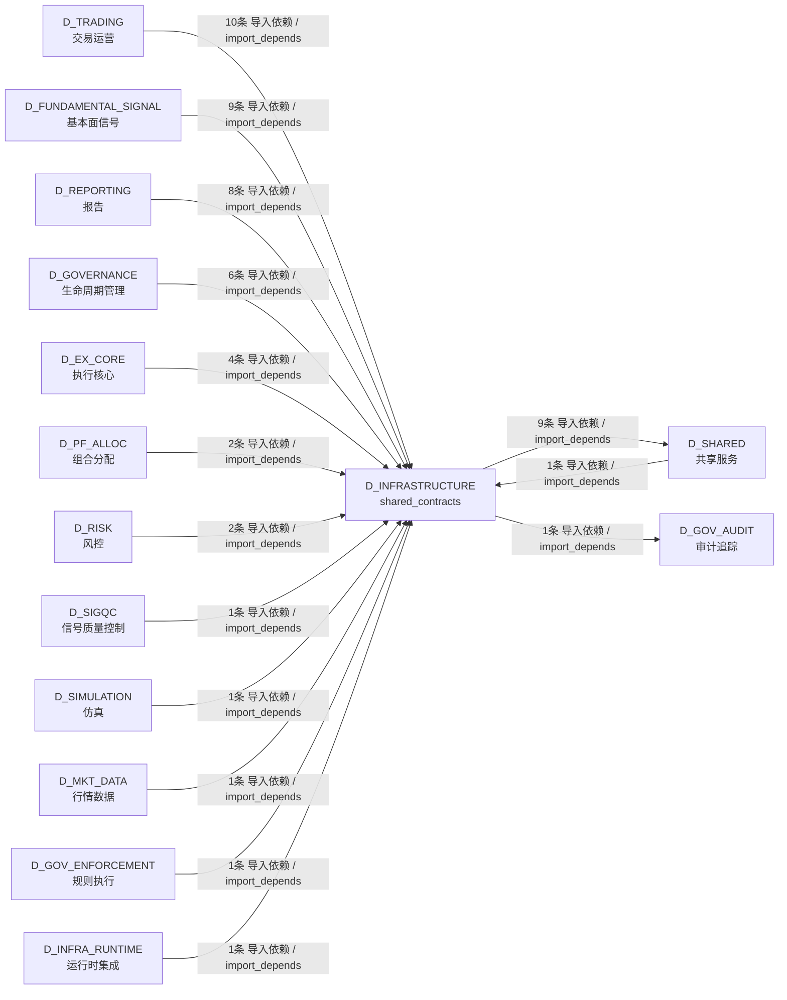

# 62_d_infrastructure / shared_contracts / shared_contracts / D_INFRASTRUCTURE

> **文档作用 / Purpose**: 展示 shared_contracts（D_INFRASTRUCTURE）功能域的模块清单、域内依赖关系、跨域依赖关系、架构分层视图，供架构审查和域治理参考。

> 本文档由 generate_domain_doc.py 从 depgraph (PostgreSQL) 自动生成
> 数据源: depgraph (PostgreSQL) nodes表 + edges表

## 域基本信息 / Domain Overview

| 字段 | 值 | Field | Value |
|------|------|-------|-------|
| 编号 | 62 | Number | 62 |
| 域ID | D_INFRASTRUCTURE | Domain ID | D_INFRASTRUCTURE |
| 域名称 | shared_contracts | Domain Name | D_INFRASTRUCTURE |
| 层级 |  | Layer |  |
| 模块数 | 26 | Module Count | 26 |
| 域内依赖 | 2 | Internal Dependencies | 2 |
| 跨域入边 | 47 | Cross-domain Incoming | 47 |
| 跨域出边 | 10 | Cross-domain Outgoing | 10 |
| 设计态模块 | 0 | Design Modules | 0 |
| 原型态模块 | 14 | Prototype Modules | 14 |
| 生产态模块 | 12 | Production Modules | 12 |
| 容量 | 12/150 (正常) | Capacity | 12/150 (正常) |
| 描述 | 跨层契约数据类(CTR-001 NormalizedMarketData 等) | Description | 跨层契约数据类(CTR-001 NormalizedMarketData 等) |

## 模块分层清单 / Module Layered List

> 按 architecture_layer 分组的模块清单（共 26 个模块 / 26 modules）。

### L3 应用层 / Application Layer (26 modules)

| # | 模块路径 / Module Path | 模块名称 / Module Name (功能简介 / Description) | 成熟度 / Maturity | 蓝图 / Blueprint |
|:--:|---------|---------|:---:|:---:|
| 1 | scripts/backup/backup_reconciler.py | backup_reconciler.py — 灾备备份系统事件触发器... | 原型态 / prototype | [MOD-INF-043](../../03_modules/_domain_infrastructure_operations/disaster_recovery_backup/blueprint.md) |
| 2 | scripts/backup/minio_tcp_relay.py | TCP relay: expose localhost-only MinIO to the C... | 原型态 / prototype | [MOD-INF-043](../../03_modules/_domain_infrastructure_operations/disaster_recovery_backup/blueprint.md) |
| 3 | src/zephyr/infrastructure/config/__init__.py | ZephyrAlpha — 基础设施 Infrastructure Layer —... | 生产态 / production | [MOD-INF-002](../../03_modules/_domain_infrastructure_runtime/runtime_integration/blueprint.md) |
| 4 | src/zephyr/infrastructure/config/app_config.py | app_config.py — 应用配置数据类与加载/热重载逻辑 | 原型态 / prototype | [MOD-INF-002](../../03_modules/_domain_infrastructure_runtime/runtime_integration/blueprint.md) |
| 5 | src/zephyr/shared/contracts/capital_allocation_result.py | capital_allocation_result.py | 原型态 / prototype | [MOD-INF-016](../../03_modules/_cross_layer/shared_core/blueprint.md) |
| 6 | src/zephyr/shared/contracts/compliance_rule.py | compliance_rule.py | 原型态 / prototype | [MOD-INF-016](../../03_modules/_cross_layer/shared_core/blueprint.md) |
| 7 | src/zephyr/shared/contracts/execution_report.py | execution_report.py | 原型态 / prototype | [MOD-INF-016](../../03_modules/_cross_layer/shared_core/blueprint.md) |
| 8 | src/zephyr/shared/contracts/experiment_result.py | experiment_result.py | 生产态 / production | [MOD-INF-016](../../03_modules/_cross_layer/shared_core/blueprint.md) |
| 9 | src/zephyr/shared/contracts/factor_monitor_report.py | factor_monitor_report.py | 生产态 / production | [MOD-INF-016](../../03_modules/_cross_layer/shared_core/blueprint.md) |
| 10 | src/zephyr/shared/contracts/factor_signal.py | factor_signal.py | 生产态 / production | [MOD-INF-016](../../03_modules/_cross_layer/shared_core/blueprint.md) |
| 11 | src/zephyr/shared/contracts/fill.py | fill.py | 原型态 / prototype | [MOD-INF-016](../../03_modules/_cross_layer/shared_core/blueprint.md) |
| 12 | src/zephyr/shared/contracts/macro_factor_signal.py | macro_factor_signal.py | 生产态 / production | [MOD-INF-016](../../03_modules/_cross_layer/shared_core/blueprint.md) |
| 13 | src/zephyr/shared/contracts/market_data.py | market_data.py | 生产态 / production | [MOD-INF-016](../../03_modules/_cross_layer/shared_core/blueprint.md) |
| 14 | src/zephyr/shared/contracts/model_serving_request.py | model_serving_request.py | 原型态 / prototype | [MOD-INF-016](../../03_modules/_cross_layer/shared_core/blueprint.md) |
| 15 | src/zephyr/shared/contracts/model_serving_response.py | model_serving_response.py | 生产态 / production | [MOD-INF-016](../../03_modules/_cross_layer/shared_core/blueprint.md) |
| 16 | src/zephyr/shared/contracts/order.py | order.py | 原型态 / prototype | [MOD-INF-016](../../03_modules/_cross_layer/shared_core/blueprint.md) |
| 17 | src/zephyr/shared/contracts/performance_attribution_repor... | performance_attribution_report.py | 生产态 / production | [MOD-INF-016](../../03_modules/_cross_layer/shared_core/blueprint.md) |
| 18 | src/zephyr/shared/contracts/position.py | position.py | 原型态 / prototype | [MOD-INF-016](../../03_modules/_cross_layer/shared_core/blueprint.md) |
| 19 | src/zephyr/shared/contracts/risk_dashboard_snapshot.py | risk_dashboard_snapshot.py | 原型态 / prototype | [MOD-INF-016](../../03_modules/_cross_layer/shared_core/blueprint.md) |
| 20 | src/zephyr/shared/contracts/risk_limits.py | risk_limits.py | 生产态 / production | [MOD-INF-016](../../03_modules/_cross_layer/shared_core/blueprint.md) |
| 21 | src/zephyr/shared/contracts/risk_metrics.py | risk_metrics.py | 原型态 / prototype | [MOD-INF-016](../../03_modules/_cross_layer/shared_core/blueprint.md) |
| 22 | src/zephyr/shared/contracts/strategy_lifecycle_event.py | strategy_lifecycle_event.py | 生产态 / production | [MOD-INF-016](../../03_modules/_cross_layer/shared_core/blueprint.md) |
| 23 | src/zephyr/shared/contracts/synthesized_signal.py | synthesized_signal.py | 生产态 / production | [MOD-INF-016](../../03_modules/_cross_layer/shared_core/blueprint.md) |
| 24 | src/zephyr/shared/contracts/system_configuration.py | system_configuration.py | 原型态 / prototype | [MOD-INF-016](../../03_modules/_cross_layer/shared_core/blueprint.md) |
| 25 | src/zephyr/shared/contracts/telemetry_emitter.py | telemetry_emitter.py | 生产态 / production | [MOD-INF-016](../../03_modules/_cross_layer/shared_core/blueprint.md) |
| 26 | src/zephyr/shared/contracts/trace_context.py | trace_context.py | 原型态 / prototype | [MOD-INF-016](../../03_modules/_cross_layer/shared_core/blueprint.md) |

## 域内依赖图 / Internal Dependency Diagram

> 依赖图内嵌在本文档中，IDE 可直接渲染显示。参考 decision_index.md 设计，分四个视图：合并全景图、运营态子图、设计态子图、原型态子图（按 design_maturity 实际值拆分）。
>
> **图例说明 / Legend**：
> - **实线边框 = 运营态模块**（production，已上线运行）
> - **虚线边框 = 设计态模块**（design，蓝图阶段，代码未写）
> - **虚线边框 = 原型态模块**（prototype，代码已写，验证中未稳定上线）
> - **实线箭头 = 运营态依赖**（已生效的依赖关系）
> - **虚线箭头 = 非运营态依赖**（计划中/验证中的依赖关系）

### 合并全景图（全部模块，标签标注成熟度）

> 展示全部 26 个模块（生产态 12 + 设计态 0 + 原型态 14），标签标注成熟度。

```mermaid
graph TD
    subgraph D_INFRASTRUCTURE["D_INFRASTRUCTURE shared_contracts"]
        scripts_backup_backup_reconciler_py["(原型态 / prototype) backup_reconciler.py — 灾备备份系统事件触发器...<br/>文件: backup_reconciler.py"]
        scripts_backup_minio_tcp_relay_py["(原型态 / prototype) TCP relay: expose localhost-only MinIO to the C...<br/>文件: minio_tcp_relay.py"]
        src_zephyr_infrastructure_config_init_py["(生产态 / production) ZephyrAlpha — 基础设施 Infrastructure Layer —...<br/>文件: __init__.py"]
        src_zephyr_infrastructure_config_app_config_py["(原型态 / prototype) app_config.py — 应用配置数据类与加载/热重载逻辑<br/>文件: app_config.py"]
        src_zephyr_shared_contracts_capital_allocation_result_py["(原型态 / prototype) capital_allocation_result.py"]
        src_zephyr_shared_contracts_compliance_rule_py["(原型态 / prototype) compliance_rule.py"]
        src_zephyr_shared_contracts_execution_report_py["(原型态 / prototype) execution_report.py"]
        src_zephyr_shared_contracts_experiment_result_py["(生产态 / production) experiment_result.py"]
        src_zephyr_shared_contracts_factor_monitor_report_py["(生产态 / production) factor_monitor_report.py"]
        src_zephyr_shared_contracts_factor_signal_py["(生产态 / production) factor_signal.py"]
        src_zephyr_shared_contracts_fill_py["(原型态 / prototype) fill.py"]
        src_zephyr_shared_contracts_macro_factor_signal_py["(生产态 / production) macro_factor_signal.py"]
        src_zephyr_shared_contracts_market_data_py["(生产态 / production) market_data.py"]
        src_zephyr_shared_contracts_model_serving_request_py["(原型态 / prototype) model_serving_request.py"]
        src_zephyr_shared_contracts_model_serving_response_py["(生产态 / production) model_serving_response.py"]
        src_zephyr_shared_contracts_order_py["(原型态 / prototype) order.py"]
        src_zephyr_shared_contracts_performance_attribution_report_py["(生产态 / production) performance_attribution_report.py"]
        src_zephyr_shared_contracts_position_py["(原型态 / prototype) position.py"]
        src_zephyr_shared_contracts_risk_dashboard_snapshot_py["(原型态 / prototype) risk_dashboard_snapshot.py"]
        src_zephyr_shared_contracts_risk_limits_py["(生产态 / production) risk_limits.py"]
        src_zephyr_shared_contracts_risk_metrics_py["(原型态 / prototype) risk_metrics.py"]
        src_zephyr_shared_contracts_strategy_lifecycle_event_py["(生产态 / production) strategy_lifecycle_event.py"]
        src_zephyr_shared_contracts_synthesized_signal_py["(生产态 / production) synthesized_signal.py"]
        src_zephyr_shared_contracts_system_configuration_py["(原型态 / prototype) system_configuration.py"]
        src_zephyr_shared_contracts_telemetry_emitter_py["(生产态 / production) telemetry_emitter.py"]
        src_zephyr_shared_contracts_trace_context_py["(原型态 / prototype) trace_context.py"]
    end
    src_zephyr_infrastructure_config_init_py -.->|导入依赖 / import_depends| src_zephyr_infrastructure_config_app_config_py
    scripts_backup_minio_tcp_relay_py -.->|config_depends / config_depends| scripts_backup_backup_reconciler_py
    D_SHARED["(生产态 / production) D_SHARED"]
    src_zephyr_shared_contracts_fill_py -.->|导入依赖 / import_depends| D_SHARED
    src_zephyr_shared_contracts_market_data_py -->|导入依赖 / import_depends| D_SHARED
    src_zephyr_shared_contracts_factor_signal_py -->|导入依赖 / import_depends| D_SHARED
    src_zephyr_shared_contracts_order_py -.->|导入依赖 / import_depends| D_SHARED
    src_zephyr_shared_contracts_order_py -.->|导入依赖 / import_depends| D_SHARED
    D_GOV_AUDIT["(生产态 / production) D_GOV_AUDIT"]
    scripts_backup_backup_reconciler_py -.->|导入依赖 / import_depends| D_GOV_AUDIT
    src_zephyr_shared_contracts_synthesized_signal_py -->|导入依赖 / import_depends| D_SHARED
    src_zephyr_shared_contracts_experiment_result_py -->|导入依赖 / import_depends| D_SHARED
    src_zephyr_shared_contracts_position_py -.->|导入依赖 / import_depends| D_SHARED
    src_zephyr_shared_contracts_risk_limits_py -->|导入依赖 / import_depends| D_SHARED
    D_REPORTING["(原型态 / prototype) D_REPORTING"]
    D_REPORTING -.->|导入依赖 / import_depends| src_zephyr_shared_contracts_execution_report_py
    D_GOVERNANCE["(原型态 / prototype) D_GOVERNANCE"]
    D_GOVERNANCE -.->|导入依赖 / import_depends| src_zephyr_infrastructure_config_init_py
    D_TRADING["(生产态 / production) D_TRADING"]
    D_TRADING -->|导入依赖 / import_depends| src_zephyr_shared_contracts_risk_limits_py
    D_TRADING -.->|导入依赖 / import_depends| src_zephyr_shared_contracts_factor_signal_py
    D_EX_CORE["(生产态 / production) D_EX_CORE"]
    D_EX_CORE -.->|导入依赖 / import_depends| src_zephyr_shared_contracts_order_py
    D_TRADING -.->|导入依赖 / import_depends| src_zephyr_shared_contracts_synthesized_signal_py
    D_GOVERNANCE -.->|导入依赖 / import_depends| src_zephyr_infrastructure_config_init_py
    D_PF_ALLOC["(生产态 / production) D_PF_ALLOC"]
    D_PF_ALLOC -.->|导入依赖 / import_depends| src_zephyr_shared_contracts_order_py
    D_TRADING -.->|导入依赖 / import_depends| src_zephyr_shared_contracts_trace_context_py
    D_SHARED -.->|导入依赖 / import_depends| src_zephyr_shared_contracts_performance_attribution_report_py
    D_REPORTING -.->|导入依赖 / import_depends| src_zephyr_shared_contracts_fill_py
    D_FUNDAMENTAL_SIGNAL["(原型态 / prototype) D_FUNDAMENTAL_SIGNAL"]
    D_FUNDAMENTAL_SIGNAL -.->|导入依赖 / import_depends| src_zephyr_shared_contracts_factor_signal_py
    D_RISK["(生产态 / production) D_RISK"]
    D_RISK -->|导入依赖 / import_depends| src_zephyr_shared_contracts_risk_limits_py
    D_FUNDAMENTAL_SIGNAL -->|导入依赖 / import_depends| src_zephyr_shared_contracts_factor_signal_py
    D_RISK -->|导入依赖 / import_depends| src_zephyr_shared_contracts_risk_limits_py
    classDef production fill:#e1f5fe,stroke:#01579b,stroke-width:2px,color:#000
    classDef design fill:#fff3e0,stroke:#e65100,stroke-width:2px,color:#000,stroke-dasharray: 5 5
    classDef external_prod fill:#e8f5e9,stroke:#1b5e20,stroke-width:1px,color:#000
    classDef external_design fill:#fce4ec,stroke:#880e4f,stroke-width:1px,color:#000,stroke-dasharray: 5 5
    class src_zephyr_infrastructure_config_init_py,src_zephyr_shared_contracts_experiment_result_py,src_zephyr_shared_contracts_factor_monitor_report_py,src_zephyr_shared_contracts_factor_signal_py,src_zephyr_shared_contracts_macro_factor_signal_py,src_zephyr_shared_contracts_market_data_py,src_zephyr_shared_contracts_model_serving_response_py,src_zephyr_shared_contracts_performance_attribution_report_py,src_zephyr_shared_contracts_risk_limits_py,src_zephyr_shared_contracts_strategy_lifecycle_event_py,src_zephyr_shared_contracts_synthesized_signal_py,src_zephyr_shared_contracts_telemetry_emitter_py production
    class scripts_backup_backup_reconciler_py,scripts_backup_minio_tcp_relay_py,src_zephyr_infrastructure_config_app_config_py,src_zephyr_shared_contracts_capital_allocation_result_py,src_zephyr_shared_contracts_compliance_rule_py,src_zephyr_shared_contracts_execution_report_py,src_zephyr_shared_contracts_fill_py,src_zephyr_shared_contracts_model_serving_request_py,src_zephyr_shared_contracts_order_py,src_zephyr_shared_contracts_position_py,src_zephyr_shared_contracts_risk_dashboard_snapshot_py,src_zephyr_shared_contracts_risk_metrics_py,src_zephyr_shared_contracts_system_configuration_py,src_zephyr_shared_contracts_trace_context_py design
    class D_SHARED,D_GOV_AUDIT,D_TRADING,D_EX_CORE,D_PF_ALLOC,D_RISK external_prod
    class D_REPORTING,D_GOVERNANCE,D_FUNDAMENTAL_SIGNAL external_design
```

### 运营态子图（仅 design_maturity=production 的模块和依赖）

> 仅展示已上线运行的模块（共 12 个，0 条域内依赖）。

```mermaid
graph TD
    subgraph D_INFRASTRUCTURE["D_INFRASTRUCTURE shared_contracts"]
        src_zephyr_infrastructure_config_init_py["(生产态 / production) ZephyrAlpha — 基础设施 Infrastructure Layer —...<br/>文件: __init__.py"]
        src_zephyr_shared_contracts_experiment_result_py["(生产态 / production) experiment_result.py"]
        src_zephyr_shared_contracts_factor_monitor_report_py["(生产态 / production) factor_monitor_report.py"]
        src_zephyr_shared_contracts_factor_signal_py["(生产态 / production) factor_signal.py"]
        src_zephyr_shared_contracts_macro_factor_signal_py["(生产态 / production) macro_factor_signal.py"]
        src_zephyr_shared_contracts_market_data_py["(生产态 / production) market_data.py"]
        src_zephyr_shared_contracts_model_serving_response_py["(生产态 / production) model_serving_response.py"]
        src_zephyr_shared_contracts_performance_attribution_report_py["(生产态 / production) performance_attribution_report.py"]
        src_zephyr_shared_contracts_risk_limits_py["(生产态 / production) risk_limits.py"]
        src_zephyr_shared_contracts_strategy_lifecycle_event_py["(生产态 / production) strategy_lifecycle_event.py"]
        src_zephyr_shared_contracts_synthesized_signal_py["(生产态 / production) synthesized_signal.py"]
        src_zephyr_shared_contracts_telemetry_emitter_py["(生产态 / production) telemetry_emitter.py"]
    end
    D_SHARED["(生产态 / production) D_SHARED"]
    src_zephyr_shared_contracts_synthesized_signal_py -->|导入依赖 / import_depends| D_SHARED
    src_zephyr_shared_contracts_experiment_result_py -->|导入依赖 / import_depends| D_SHARED
    src_zephyr_shared_contracts_factor_signal_py -->|导入依赖 / import_depends| D_SHARED
    src_zephyr_shared_contracts_market_data_py -->|导入依赖 / import_depends| D_SHARED
    src_zephyr_shared_contracts_risk_limits_py -->|导入依赖 / import_depends| D_SHARED
    D_GOVERNANCE["(原型态 / prototype) D_GOVERNANCE"]
    D_GOVERNANCE -.->|导入依赖 / import_depends| src_zephyr_infrastructure_config_init_py
    D_TRADING["(生产态 / production) D_TRADING"]
    D_TRADING -->|导入依赖 / import_depends| src_zephyr_shared_contracts_risk_limits_py
    D_TRADING -.->|导入依赖 / import_depends| src_zephyr_shared_contracts_factor_signal_py
    D_TRADING -.->|导入依赖 / import_depends| src_zephyr_shared_contracts_synthesized_signal_py
    D_GOVERNANCE -.->|导入依赖 / import_depends| src_zephyr_infrastructure_config_init_py
    D_SHARED -.->|导入依赖 / import_depends| src_zephyr_shared_contracts_performance_attribution_report_py
    D_FUNDAMENTAL_SIGNAL["(原型态 / prototype) D_FUNDAMENTAL_SIGNAL"]
    D_FUNDAMENTAL_SIGNAL -.->|导入依赖 / import_depends| src_zephyr_shared_contracts_factor_signal_py
    D_RISK["(生产态 / production) D_RISK"]
    D_RISK -->|导入依赖 / import_depends| src_zephyr_shared_contracts_risk_limits_py
    D_FUNDAMENTAL_SIGNAL -->|导入依赖 / import_depends| src_zephyr_shared_contracts_factor_signal_py
    D_RISK -->|导入依赖 / import_depends| src_zephyr_shared_contracts_risk_limits_py
    D_FUNDAMENTAL_SIGNAL -->|导入依赖 / import_depends| src_zephyr_shared_contracts_synthesized_signal_py
    D_FUNDAMENTAL_SIGNAL -->|导入依赖 / import_depends| src_zephyr_shared_contracts_synthesized_signal_py
    D_FUNDAMENTAL_SIGNAL -->|导入依赖 / import_depends| src_zephyr_shared_contracts_factor_signal_py
    D_FUNDAMENTAL_SIGNAL -->|导入依赖 / import_depends| src_zephyr_shared_contracts_synthesized_signal_py
    D_SIGQC["(原型态 / prototype) D_SIGQC"]
    D_SIGQC -.->|导入依赖 / import_depends| src_zephyr_shared_contracts_synthesized_signal_py
    classDef production fill:#e1f5fe,stroke:#01579b,stroke-width:2px,color:#000
    classDef design fill:#fff3e0,stroke:#e65100,stroke-width:2px,color:#000,stroke-dasharray: 5 5
    classDef external_prod fill:#e8f5e9,stroke:#1b5e20,stroke-width:1px,color:#000
    classDef external_design fill:#fce4ec,stroke:#880e4f,stroke-width:1px,color:#000,stroke-dasharray: 5 5
    class src_zephyr_infrastructure_config_init_py,src_zephyr_shared_contracts_experiment_result_py,src_zephyr_shared_contracts_factor_monitor_report_py,src_zephyr_shared_contracts_factor_signal_py,src_zephyr_shared_contracts_macro_factor_signal_py,src_zephyr_shared_contracts_market_data_py,src_zephyr_shared_contracts_model_serving_response_py,src_zephyr_shared_contracts_performance_attribution_report_py,src_zephyr_shared_contracts_risk_limits_py,src_zephyr_shared_contracts_strategy_lifecycle_event_py,src_zephyr_shared_contracts_synthesized_signal_py,src_zephyr_shared_contracts_telemetry_emitter_py production
    class D_SHARED,D_TRADING,D_RISK external_prod
    class D_GOVERNANCE,D_FUNDAMENTAL_SIGNAL,D_SIGQC external_design
```

### 设计态子图（仅 design_maturity=design 的模块和依赖）

> 仅展示蓝图阶段、代码未写的设计态模块（共 0 个，0 条域内依赖）。

> （无设计态模块 / No design modules）

### 原型态子图（仅 design_maturity=prototype 的模块和依赖）

> 仅展示代码已写、验证中未稳定上线的原型态模块（共 14 个，1 条域内依赖）。

```mermaid
graph TD
    subgraph D_INFRASTRUCTURE["D_INFRASTRUCTURE shared_contracts"]
        scripts_backup_backup_reconciler_py["(原型态 / prototype) backup_reconciler.py — 灾备备份系统事件触发器...<br/>文件: backup_reconciler.py"]
        scripts_backup_minio_tcp_relay_py["(原型态 / prototype) TCP relay: expose localhost-only MinIO to the C...<br/>文件: minio_tcp_relay.py"]
        src_zephyr_infrastructure_config_app_config_py["(原型态 / prototype) app_config.py — 应用配置数据类与加载/热重载逻辑<br/>文件: app_config.py"]
        src_zephyr_shared_contracts_capital_allocation_result_py["(原型态 / prototype) capital_allocation_result.py"]
        src_zephyr_shared_contracts_compliance_rule_py["(原型态 / prototype) compliance_rule.py"]
        src_zephyr_shared_contracts_execution_report_py["(原型态 / prototype) execution_report.py"]
        src_zephyr_shared_contracts_fill_py["(原型态 / prototype) fill.py"]
        src_zephyr_shared_contracts_model_serving_request_py["(原型态 / prototype) model_serving_request.py"]
        src_zephyr_shared_contracts_order_py["(原型态 / prototype) order.py"]
        src_zephyr_shared_contracts_position_py["(原型态 / prototype) position.py"]
        src_zephyr_shared_contracts_risk_dashboard_snapshot_py["(原型态 / prototype) risk_dashboard_snapshot.py"]
        src_zephyr_shared_contracts_risk_metrics_py["(原型态 / prototype) risk_metrics.py"]
        src_zephyr_shared_contracts_system_configuration_py["(原型态 / prototype) system_configuration.py"]
        src_zephyr_shared_contracts_trace_context_py["(原型态 / prototype) trace_context.py"]
    end
    scripts_backup_minio_tcp_relay_py -.->|config_depends / config_depends| scripts_backup_backup_reconciler_py
    D_SHARED["(生产态 / production) D_SHARED"]
    src_zephyr_shared_contracts_fill_py -.->|导入依赖 / import_depends| D_SHARED
    src_zephyr_shared_contracts_order_py -.->|导入依赖 / import_depends| D_SHARED
    src_zephyr_shared_contracts_order_py -.->|导入依赖 / import_depends| D_SHARED
    src_zephyr_shared_contracts_position_py -.->|导入依赖 / import_depends| D_SHARED
    D_GOV_AUDIT["(生产态 / production) D_GOV_AUDIT"]
    scripts_backup_backup_reconciler_py -.->|导入依赖 / import_depends| D_GOV_AUDIT
    D_REPORTING["(原型态 / prototype) D_REPORTING"]
    D_REPORTING -.->|导入依赖 / import_depends| src_zephyr_shared_contracts_execution_report_py
    D_EX_CORE["(生产态 / production) D_EX_CORE"]
    D_EX_CORE -.->|导入依赖 / import_depends| src_zephyr_shared_contracts_order_py
    D_PF_ALLOC["(生产态 / production) D_PF_ALLOC"]
    D_PF_ALLOC -.->|导入依赖 / import_depends| src_zephyr_shared_contracts_order_py
    D_TRADING["(生产态 / production) D_TRADING"]
    D_TRADING -.->|导入依赖 / import_depends| src_zephyr_shared_contracts_trace_context_py
    D_REPORTING -.->|导入依赖 / import_depends| src_zephyr_shared_contracts_fill_py
    D_REPORTING -.->|导入依赖 / import_depends| src_zephyr_shared_contracts_order_py
    D_GOVERNANCE["(原型态 / prototype) D_GOVERNANCE"]
    D_GOVERNANCE -.->|导入依赖 / import_depends| src_zephyr_shared_contracts_position_py
    D_REPORTING -.->|导入依赖 / import_depends| src_zephyr_shared_contracts_fill_py
    D_TRADING -.->|导入依赖 / import_depends| src_zephyr_shared_contracts_order_py
    D_TRADING -.->|导入依赖 / import_depends| src_zephyr_shared_contracts_fill_py
    D_GOVERNANCE -.->|导入依赖 / import_depends| src_zephyr_shared_contracts_order_py
    D_TRADING -.->|导入依赖 / import_depends| src_zephyr_shared_contracts_order_py
    D_TRADING -.->|导入依赖 / import_depends| src_zephyr_shared_contracts_position_py
    D_EX_CORE -.->|导入依赖 / import_depends| src_zephyr_shared_contracts_fill_py
    D_GOVERNANCE -.->|导入依赖 / import_depends| src_zephyr_shared_contracts_fill_py
    classDef production fill:#e1f5fe,stroke:#01579b,stroke-width:2px,color:#000
    classDef design fill:#fff3e0,stroke:#e65100,stroke-width:2px,color:#000,stroke-dasharray: 5 5
    classDef external_prod fill:#e8f5e9,stroke:#1b5e20,stroke-width:1px,color:#000
    classDef external_design fill:#fce4ec,stroke:#880e4f,stroke-width:1px,color:#000,stroke-dasharray: 5 5
    class scripts_backup_backup_reconciler_py,scripts_backup_minio_tcp_relay_py,src_zephyr_infrastructure_config_app_config_py,src_zephyr_shared_contracts_capital_allocation_result_py,src_zephyr_shared_contracts_compliance_rule_py,src_zephyr_shared_contracts_execution_report_py,src_zephyr_shared_contracts_fill_py,src_zephyr_shared_contracts_model_serving_request_py,src_zephyr_shared_contracts_order_py,src_zephyr_shared_contracts_position_py,src_zephyr_shared_contracts_risk_dashboard_snapshot_py,src_zephyr_shared_contracts_risk_metrics_py,src_zephyr_shared_contracts_system_configuration_py,src_zephyr_shared_contracts_trace_context_py design
    class D_SHARED,D_GOV_AUDIT,D_EX_CORE,D_PF_ALLOC,D_TRADING external_prod
    class D_REPORTING,D_GOVERNANCE external_design
```

## 跨域依赖 / Cross-domain Dependencies

### 本域依赖的其他域（出边）/ Depends On

| # | 本域模块 / Source Module | → | 外部域-目标模块 / Target Module | 依赖类型 / Type |
|:--:|---------|:--:|---------|---------|
| 1 | backup_reconciler.py — 灾备备份系统事件触发器.... | → | D_GOV_AUDIT 审计追踪: reconciliation_registry.py — GitCommitGateway ... | 导入依赖 / import_depends |
| 2 | experiment_result.py | → | D_SHARED 共享服务: trace_context.py | 导入依赖 / import_depends |
| 3 | factor_signal.py | → | D_SHARED 共享服务: trace_context.py | 导入依赖 / import_depends |
| 4 | fill.py | → | D_SHARED 共享服务: trace_context.py | 导入依赖 / import_depends |
| 5 | market_data.py | → | D_SHARED 共享服务: trace_context.py | 导入依赖 / import_depends |
| 6 | order.py | → | D_SHARED 共享服务: trace_context.py | 导入依赖 / import_depends |
| 7 | order.py | → | D_SHARED 共享服务: OrderSide/OrderStatus/OrderType — 交易枚举真源... | 导入依赖 / import_depends |
| 8 | position.py | → | D_SHARED 共享服务: trace_context.py | 导入依赖 / import_depends |
| 9 | risk_limits.py | → | D_SHARED 共享服务: trace_context.py | 导入依赖 / import_depends |
| 10 | synthesized_signal.py | → | D_SHARED 共享服务: trace_context.py | 导入依赖 / import_depends |

### 依赖本域的其他域（入边）/ Depended By

| # | 外部域-源模块 / Source Module | → | 本域模块 / Target Module | 依赖类型 / Type |
|:--:|---------|:--:|---------|---------|
| 1 | D_EX_CORE 执行核心: D_EXECUTION_CORE — Execution Engine (execution... | → | order.py | 导入依赖 / import_depends |
| 2 | D_EX_CORE 执行核心: D_EXECUTION_CORE — Execution Engine (execution... | → | risk_limits.py | 导入依赖 / import_depends |
| 3 | D_EX_CORE 执行核心: D_EXECUTION_CORE — Order Manager (order_manage... | → | fill.py | 导入依赖 / import_depends |
| 4 | D_EX_CORE 执行核心: D_EXECUTION_CORE — Order Manager (order_manage... | → | order.py | 导入依赖 / import_depends |
| 5 | D_FUNDAMENTAL_SIGNAL 基本面信号: D_SIGNAL — Signal Generation Layer (aggregator... | → | factor_signal.py | 导入依赖 / import_depends |
| 6 | D_FUNDAMENTAL_SIGNAL 基本面信号: D_SIGNAL — Signal Generation Layer (aggregator... | → | synthesized_signal.py | 导入依赖 / import_depends |
| 7 | D_FUNDAMENTAL_SIGNAL 基本面信号: D_SIGNAL — Default Signal Aggregator (default_... | → | factor_signal.py | 导入依赖 / import_depends |
| 8 | D_FUNDAMENTAL_SIGNAL 基本面信号: D_SIGNAL — Default Signal Aggregator (default_... | → | synthesized_signal.py | 导入依赖 / import_depends |
| 9 | D_FUNDAMENTAL_SIGNAL 基本面信号: AlphaSignalPipeline D_FACTOR->D_SIGNAL跨层集成... | → | factor_signal.py | 导入依赖 / import_depends |
| 10 | D_FUNDAMENTAL_SIGNAL 基本面信号: AlphaSignalPipeline D_FACTOR->D_SIGNAL跨层集成... | → | synthesized_signal.py | 导入依赖 / import_depends |
| 11 | D_FUNDAMENTAL_SIGNAL 基本面信号: D_SIGNAL — Default Capital Allocator (default_... | → | synthesized_signal.py | 导入依赖 / import_depends |
| 12 | D_FUNDAMENTAL_SIGNAL 基本面信号: D_SIGNAL — Signal Synthesizer (signal_synthesi... | → | factor_signal.py | 导入依赖 / import_depends |
| 13 | D_FUNDAMENTAL_SIGNAL 基本面信号: D_SIGNAL — Signal Synthesizer (signal_synthesi... | → | synthesized_signal.py | 导入依赖 / import_depends |
| 14 | D_GOVERNANCE 生命周期管理: A2A Protocol 全链路满分验证脚本 (a2a_full_verif... | → | ZephyrAlpha — 基础设施 Infrastructure Layer —... | 导入依赖 / import_depends |
| 15 | D_GOVERNANCE 生命周期管理: local_layer_daemon.py — L2 本地模型层守护进程.... | → | ZephyrAlpha — 基础设施 Infrastructure Layer —... | 导入依赖 / import_depends |
| 16 | D_GOVERNANCE 生命周期管理: D_EXECUTION_CORE — Risk Validation Bridge (DW-... | → | risk_limits.py | 导入依赖 / import_depends |
| 17 | D_GOVERNANCE 生命周期管理: D_EXECUTION_CORE — Simulation Broker Adapter (... | → | fill.py | 导入依赖 / import_depends |
| 18 | D_GOVERNANCE 生命周期管理: D_EXECUTION_CORE — Simulation Broker Adapter (... | → | order.py | 导入依赖 / import_depends |
| 19 | D_GOVERNANCE 生命周期管理: D_EXECUTION_CORE — Simulation Broker Adapter (... | → | position.py | 导入依赖 / import_depends |
| 20 | D_GOV_ENFORCEMENT 规则执行: Re-export shim — ComplianceRule 真源已合并至 z... | → | compliance_rule.py | 导入依赖 / import_depends |
| 21 | D_INFRA_RUNTIME 运行时集成: HealthMonitor — 健康监控 + 自愈 (health_monito... | → | telemetry_emitter.py | 导入依赖 / import_depends |
| 22 | D_MKT_DATA 行情数据: __init__.py | → | market_data.py | 导入依赖 / import_depends |
| 23 | D_PF_ALLOC 组合分配: strategy_lifecycle_event.py | → | strategy_lifecycle_event.py | 导入依赖 / import_depends |
| 24 | D_PF_ALLOC 组合分配: D_PORTFOLIO_CORE — Default Equity Long-Only St... | → | order.py | 导入依赖 / import_depends |
| 25 | D_REPORTING 报告: D_REPORTING — Post-Trade Analytics Layer (anal... | → | execution_report.py | 导入依赖 / import_depends |
| 26 | D_REPORTING 报告: D_REPORTING — Post-Trade Analytics Layer (anal... | → | fill.py | 导入依赖 / import_depends |
| 27 | D_REPORTING 报告: D_REPORTING — Post-Trade Analytics Layer (anal... | → | order.py | 导入依赖 / import_depends |
| 28 | D_REPORTING 报告: D_REPORTING — Post-Trade Analytics Layer (anal... | → | performance_attribution_report.py | 导入依赖 / import_depends |
| 29 | D_REPORTING 报告: D_REPORTING — Default Attribution Engine (defa... | → | performance_attribution_report.py | 导入依赖 / import_depends |
| 30 | D_REPORTING 报告: D_REPORTING — Default TCA Engine (default_tca_... | → | execution_report.py | 导入依赖 / import_depends |
| 31 | D_REPORTING 报告: D_REPORTING — Default TCA Engine (default_tca_... | → | fill.py | 导入依赖 / import_depends |
| 32 | D_REPORTING 报告: D_REPORTING — Default TCA Engine (default_tca_... | → | order.py | 导入依赖 / import_depends |
| 33 | D_RISK 风控: D_RISK — Risk Limits Calculator (risk_limits.py) | → | risk_limits.py | 导入依赖 / import_depends |
| 34 | D_RISK 风控: ZephyrAlpha — D_RISK Risk Management Layer — ... | → | risk_limits.py | 导入依赖 / import_depends |
| 35 | D_SHARED 共享服务: Re-export shim — 真源已收敛至 zephyr.shared.co... | → | performance_attribution_report.py | 导入依赖 / import_depends |
| 36 | D_SIGQC 信号质量控制: D_SIGQC — Signal Quality Degradation Monitor B... | → | synthesized_signal.py | 导入依赖 / import_depends |
| 37 | D_SIMULATION 仿真: 实验 — Experimentation Pipeline Layer (pipelin... | → | experiment_result.py | 导入依赖 / import_depends |
| 38 | D_TRADING 交易运营: D_EXECUTION_CORE — BrokerInterface (broker_int... | → | fill.py | 导入依赖 / import_depends |
| 39 | D_TRADING 交易运营: D_EXECUTION_CORE — BrokerInterface (broker_int... | → | order.py | 导入依赖 / import_depends |
| 40 | D_TRADING 交易运营: D_EXECUTION_CORE — BrokerInterface (broker_int... | → | position.py | 导入依赖 / import_depends |
| 41 | D_TRADING 交易运营: Re-export wrapper: Order 真源在 zephyr.shared.c... | → | order.py | 导入依赖 / import_depends |
| 42 | D_TRADING 交易运营: trading-contracts/factories.py — 交易域数据契.... | → | factor_signal.py | 导入依赖 / import_depends |
| 43 | D_TRADING 交易运营: trading-contracts/factories.py — 交易域数据契.... | → | synthesized_signal.py | 导入依赖 / import_depends |
| 44 | D_TRADING 交易运营: Re-export shim — 真源已收敛至 zephyr.shared.co... | → | performance_attribution_report.py | 导入依赖 / import_depends |
| 45 | D_TRADING 交易运营: strategy_lifecycle_event.py | → | strategy_lifecycle_event.py | 导入依赖 / import_depends |
| 46 | D_TRADING 交易运营: risk_limit_violation_error.py | → | trace_context.py | 导入依赖 / import_depends |
| 47 | D_TRADING 交易运营: risk_validator_protocol.py | → | risk_limits.py | 导入依赖 / import_depends |

### 跨域依赖图 / Cross-domain Dependency Diagram

> 本域与 14 个外部域直接连接（出边 10 条 + 入边 47 条 = 57 条）。只显示直接连接的域，不展开具体节点。

## 说明 / Notes

- **数据源 / Data Source**: `depgraph (PostgreSQL)` 的 `nodes`、`edges`、`domains` 表
- **生成器 / Generator**: `generate_domain_doc.py`（G2+G10 合并）
- **维护方式 / Maintenance**: 自动生成，全景图更新时刷新
- **文件名规则 / File Naming**: `{编号:02d}_{域ID小写}.md`，如 `16_d_trading.md`
- **图例说明 / Legend**: `[production]`=已上线 / `[design]`=设计中 / `[prototype]`=原型 / `[unknown]`=未知
