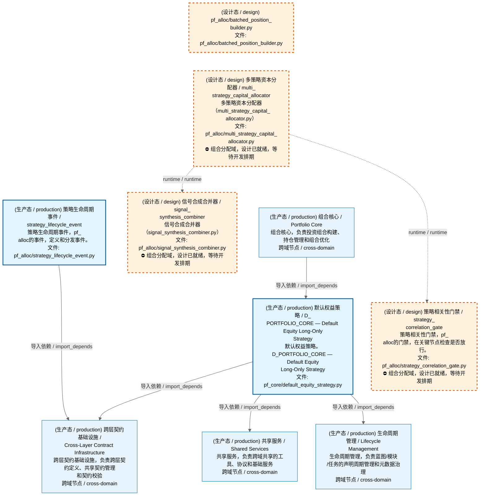
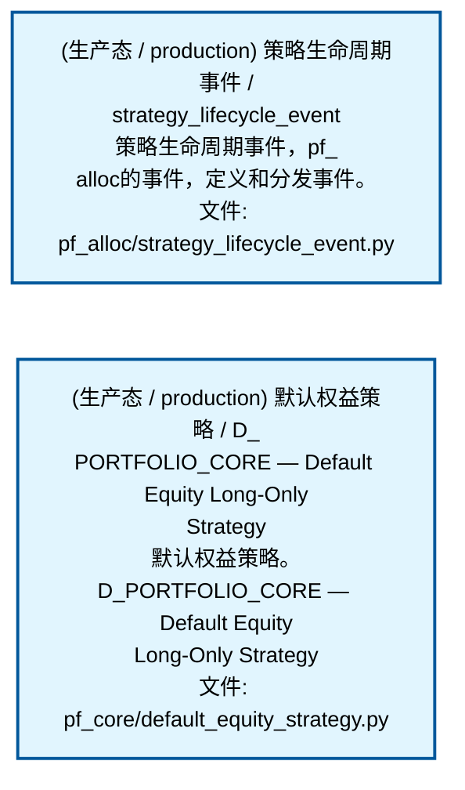
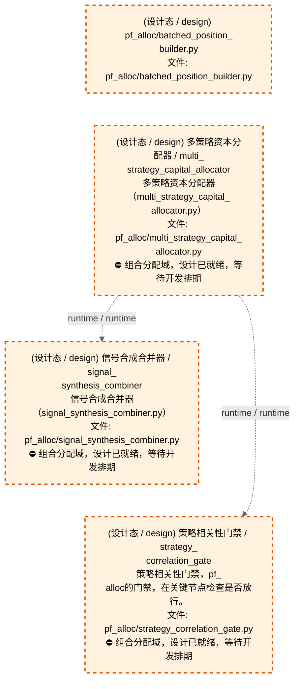
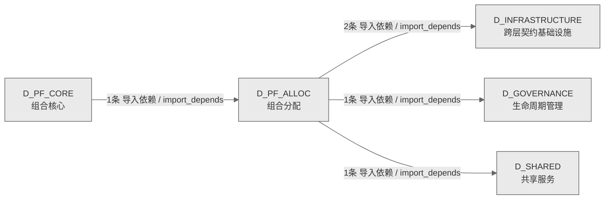

# 62_d_pf_alloc / 组合分配域 / Portfolio Allocation

> **功能简介 / Overview**: 组合分配，负责资产配置、权重分配和再平衡

> **文档作用 / Purpose**: 展示 组合分配（D_PF_ALLOC）功能域的域内依赖关系、跨域依赖关系，模块信息（成熟度/中英文名/大白话/文件路径）内嵌于 Mermaid 节点，供架构审查和域治理参考。

> 本文档由 generate_domain_doc.py 从 depgraph (PostgreSQL) 自动生成
> 数据源: depgraph (PostgreSQL) nodes表 + edges表

> **[可缩放 HTML 版 / Zoomable HTML](http://localhost:8765/docs/02_enterprise_architecture/02_domain_architecture_docs/_zoomable_html/62_d_pf_alloc.html)** — Ctrl+滚轮缩放 ｜ 双击重置 ｜ Ctrl+Shift+D 切换拖动/选择模式

## 域基本信息 / Domain Overview

| 字段 | 值 | Field | Value |
|------|------|-------|-------|
| 编号 | 62 | Number | 62 |
| 域ID | D_PF_ALLOC | Domain ID | D_PF_ALLOC |
| 域名称 | 组合分配 | Domain Name | Portfolio Allocation |
| 层级 | L2 业务域层 | Layer | L2 Domain |
| 模块数 | 6 | Module Count | 6 |
| 域内依赖 | 2 | Internal Dependencies | 2 |
| 跨域入边 | 1 | Cross-domain Incoming | 1 |
| 跨域出边 | 4 | Cross-domain Outgoing | 4 |
| 设计态模块 | 4 | Design Modules | 4 |
| 生产态模块 | 2 | Production Modules | 2 |
| 容量 | 2/150 (正常) | Capacity | 2/150 (正常) |
| 描述 | 组合分配，负责资产配置、权重分配和再平衡 | Description | 组合分配，负责资产配置、权重分配和再平衡 |

## 域内依赖图 / Internal Dependency Diagram

> 依赖图内嵌在本文档中，IDE 可直接渲染；网页版可 Ctrl+滚轮缩放 + 拖动平移查看细节。
>
> **图例说明 / Legend**：
> - 🟦 **蓝色 = 运营态模块**（production，已上线运行）
> - 🟧 **橙色虚线 = 设计态模块**（design，蓝图阶段，代码未写）
> - **实线箭头 = 运营态依赖**（已生效的依赖关系）
> - **虚线箭头 = 非运营态依赖**（计划中/验证中的依赖关系）

### 全景图（全部模块，颜色区分运营态/设计态）

> 展示全部 6 个模块（生产态 2 + 设计态 4），含跨域依赖外部节点。节点含成熟度+名称+大白话/简介+文件路径。

### 运营态的图（仅 design_maturity=production 的模块和域内依赖）

> 仅展示已上线运行的模块（共 2 个），不含跨域外部节点。跨域依赖见下方跨域依赖章节。

### 设计态的图（仅 design_maturity=design 的模块和域内依赖）

> 仅展示蓝图阶段、代码未写的设计态模块（共 4 个），不含跨域外部节点。

## 跨域依赖 / Cross-domain Dependencies

### 本域依赖的其他域（出边）/ Depends On

| # | 本域模块 / Source Module | → | 外部域-目标模块 / Target Module | 依赖类型 / Type |
|:--:|---------|:--:|---------|---------|
| 1 | 默认权益策略 / D_PORTFOLIO_CORE — Default Equity Long-On... | → | D_GOVERNANCE 生命周期管理: 策略基类 / D_PORTFOLIO_CORE — StrategyBase + StrategyMet... | 导入依赖 / import_depends |
| 2 | 策略生命周期事件 / strategy_lifecycle_event (pf_alloc/str... | → | D_INFRASTRUCTURE 跨层契约基础设施: 策略生命周期事件 / strategy_lifecycle_event (contracts/st... | 导入依赖 / import_depends |
| 3 | 默认权益策略 / D_PORTFOLIO_CORE — Default Equity Long-On... | → | D_INFRASTRUCTURE 跨层契约基础设施: 订单 / order (contracts/order.py) | 导入依赖 / import_depends |
| 4 | 默认权益策略 / D_PORTFOLIO_CORE — Default Equity Long-On... | → | D_SHARED 共享服务: 订单枚举 / order_enums (enums/order_enums.py) | 导入依赖 / import_depends |

### 依赖本域的其他域（入边）/ Depended By

| # | 外部域-源模块 / Source Module | → | 本域模块 / Target Module | 依赖类型 / Type |
|:--:|---------|:--:|---------|---------|
| 1 | D_PF_CORE 组合核心: 包入口 / D_PORTFOLIO_CORE — Portfolio Construction Strat... | → | 默认权益策略 / D_PORTFOLIO_CORE — Default Equity Long-On... | 导入依赖 / import_depends |

### 跨域依赖图 / Cross-domain Dependency Diagram

> 本域与 4 个外部域直接连接（出边 4 条 + 入边 1 条 = 5 条）。只显示直接连接的域，不展开具体节点。

## 说明 / Notes

- **数据源 / Data Source**: `depgraph (PostgreSQL)` 的 `nodes`、`edges`、`domains` 表
- **生成器 / Generator**: `generate_domain_doc.py`（G2+G10 合并）
- **维护方式 / Maintenance**: 自动生成，全景图更新时刷新
- **文件名规则 / File Naming**: `{编号:02d}_{域ID小写}.md`，如 `16_d_trading.md`
- **图例说明 / Legend**: `[production]`=已上线 / `[design]`=设计中 / `[unknown]`=未知
