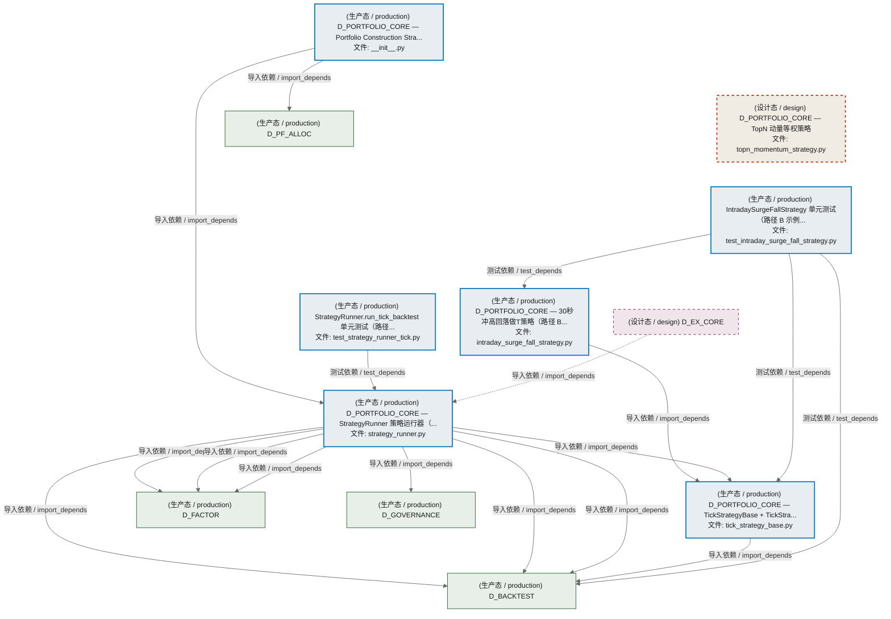
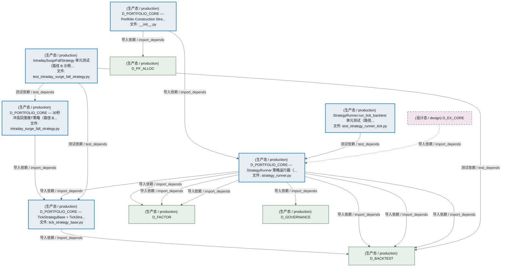
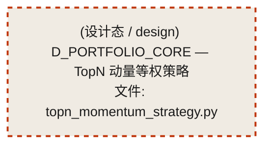

# 63_d_pf_core / 组合核心 / Portfolio Core

> **功能简介 / Overview**: 组合核心，负责投资组合构建、持仓管理和组合优化

> **文档作用 / Purpose**: 展示 组合核心（D_PF_CORE）功能域的模块清单、域内依赖关系、跨域依赖关系、架构分层视图，供架构审查和域治理参考。

> 本文档由 generate_domain_doc.py 从 depgraph (PostgreSQL) 自动生成
> 数据源: depgraph (PostgreSQL) nodes表 + edges表

## 域基本信息 / Domain Overview

| 字段 | 值 | Field | Value |
|------|------|-------|-------|
| 编号 | 63 | Number | 63 |
| 域ID | D_PF_CORE | Domain ID | D_PF_CORE |
| 域名称 | 组合核心 | Domain Name | Portfolio Core |
| 层级 | L2 业务域层 | Layer | L2 Domain |
| 模块数 | 7 | Module Count | 7 |
| 域内依赖 | 6 | Internal Dependencies | 6 |
| 跨域入边 | 1 | Cross-domain Incoming | 1 |
| 跨域出边 | 12 | Cross-domain Outgoing | 12 |
| 设计态模块 | 1 | Design Modules | 1 |
| 生产态模块 | 6 | Production Modules | 6 |
| 容量 | 6/150 (正常) | Capacity | 6/150 (正常) |
| 描述 | 组合核心，负责投资组合构建、持仓管理和组合优化 | Description | 组合核心，负责投资组合构建、持仓管理和组合优化 |

## 模块分层清单 / Module Layered List

> 按 architecture_layer 分组的模块清单（共 7 个模块 / 7 modules）。

### L0 基础设施层 / Infrastructure Layer (4 modules)

| # | 模块路径 / Module Path | 模块名称 / Module Name (功能简介 / Description) | 成熟度 / Maturity | 蓝图 / Blueprint |
|:--:|---------|---------|:---:|:---:|
| 1 | src/zephyr/pf_core/intraday_surge_fall_strategy.py | D_PORTFOLIO_CORE — 30秒冲高回落做T策略（路径 B... | 生产态 / production |  |
| 2 | src/zephyr/pf_core/strategy_engine/__init__.py | D_PORTFOLIO_CORE — Portfolio Construction Stra... | 生产态 / production |  |
| 3 | src/zephyr/pf_core/strategy_engine/strategy_runner.py | D_PORTFOLIO_CORE — StrategyRunner 策略运行器（... | 生产态 / production |  |
| 4 | src/zephyr/pf_core/strategy_engine/tick_strategy_base.py | D_PORTFOLIO_CORE — TickStrategyBase + TickStra... | 生产态 / production |  |

### L2 领域层 / Domain Layer (3 modules)

| # | 模块路径 / Module Path | 模块名称 / Module Name (功能简介 / Description) | 成熟度 / Maturity | 蓝图 / Blueprint |
|:--:|---------|---------|:---:|:---:|
| 1 | src/zephyr/pf_core/topn_momentum_strategy.py | D_PORTFOLIO_CORE — TopN 动量等权策略 | 设计态 / design |  |
| 2 | tests/pf_core/test_intraday_surge_fall_strategy.py | IntradaySurgeFallStrategy 单元测试（路径 B 示例... | 生产态 / production |  |
| 3 | tests/pf_core/test_strategy_runner_tick.py | StrategyRunner.run_tick_backtest 单元测试（路径... | 生产态 / production |  |

## 域内依赖图 / Internal Dependency Diagram

> 依赖图内嵌在本文档中，IDE 可直接渲染显示。参考 decision_index.md 设计，分三个视图：合并全景图、运营态子图、设计态子图（按 design_maturity 实际值拆分）。
>
> **图例说明 / Legend**：
> - **实线边框 = 运营态模块**（production，已上线运行）
> - **虚线边框 = 设计态模块**（design，蓝图阶段，代码未写）
> - **实线箭头 = 运营态依赖**（已生效的依赖关系）
> - **虚线箭头 = 非运营态依赖**（计划中/验证中的依赖关系）

### 合并全景图（全部模块，标签标注成熟度）

> 展示全部 7 个模块（生产态 6 + 设计态 1），标签标注成熟度。

### 运营态子图（仅 design_maturity=production 的模块和依赖）

> 仅展示已上线运行的模块（共 6 个，6 条域内依赖）。

### 设计态子图（仅 design_maturity=design 的模块和依赖）

> 仅展示蓝图阶段、代码未写的设计态模块（共 1 个，0 条域内依赖）。

## 跨域依赖 / Cross-domain Dependencies

### 本域依赖的其他域（出边）/ Depends On

| # | 本域模块 / Source Module | → | 外部域-目标模块 / Target Module | 依赖类型 / Type |
|:--:|---------|:--:|---------|---------|
| 1 | D_PORTFOLIO_CORE — StrategyRunner 策略运行器（... | → | D_BACKTEST 回测: L_BACKTEST — Backtest Engine Layer (engine_bas... | 导入依赖 / import_depends |
| 2 | D_PORTFOLIO_CORE — StrategyRunner 策略运行器（... | → | D_BACKTEST 回测: 事件驱动回测引擎（v1.1.0 新增，Tick 级回测核心... | 导入依赖 / import_depends |
| 3 | D_PORTFOLIO_CORE — StrategyRunner 策略运行器（... | → | D_BACKTEST 回测: L_BACKTEST — Vectorized Backtest Engine (vecto... | 导入依赖 / import_depends |
| 4 | D_PORTFOLIO_CORE — TickStrategyBase + TickStra... | → | D_BACKTEST 回测: Tick 回放引擎模块（v1.1.0 新增，秒级做T专用） (... | 导入依赖 / import_depends |
| 5 | IntradaySurgeFallStrategy 单元测试（路径 B 示例... | → | D_BACKTEST 回测: 共享撮合逻辑模块（回测=实盘一致性核心） (matchi... | 测试依赖 / test_depends |
| 6 | D_PORTFOLIO_CORE — StrategyRunner 策略运行器（... | → | D_FACTOR 因子: D-FACTOR-ANA-10 多因子合成——将多个因子值合成.... | 导入依赖 / import_depends |
| 7 | D_PORTFOLIO_CORE — StrategyRunner 策略运行器（... | → | D_FACTOR 因子: D-FACTOR-03 因子评估回测运行器——端到端因子评... | 导入依赖 / import_depends |
| 8 | D_PORTFOLIO_CORE — StrategyRunner 策略运行器（... | → | D_FACTOR 因子: ZephyrAlpha — D_FACTOR Alpha Factor Layer (fac... | 导入依赖 / import_depends |
| 9 | D_PORTFOLIO_CORE — StrategyRunner 策略运行器（... | → | D_GOVERNANCE 生命周期管理: D_PORTFOLIO_CORE — StrategyBase + StrategyMeta... | 导入依赖 / import_depends |
| 10 | D_PORTFOLIO_CORE — Portfolio Construction Stra... | → | D_PF_ALLOC 组合分配: D_PORTFOLIO_CORE — Default Equity Long-Only St... | 导入依赖 / import_depends |

### 依赖本域的其他域（入边）/ Depended By

| # | 外部域-源模块 / Source Module | → | 本域模块 / Target Module | 依赖类型 / Type |
|:--:|---------|:--:|---------|---------|
| 1 | D_EX_CORE 执行核心: D_EXECUTION_CORE — TradingSession 盘中实时调仓... | → | D_PORTFOLIO_CORE — StrategyRunner 策略运行器（... | 导入依赖 / import_depends |

### 跨域依赖图 / Cross-domain Dependency Diagram

> 本域与 7 个外部域直接连接（出边 12 条 + 入边 1 条 = 13 条）。只显示直接连接的域，不展开具体节点。

## 说明 / Notes

- **数据源 / Data Source**: `depgraph (PostgreSQL)` 的 `nodes`、`edges`、`domains` 表
- **生成器 / Generator**: `generate_domain_doc.py`（G2+G10 合并）
- **维护方式 / Maintenance**: 自动生成，全景图更新时刷新
- **文件名规则 / File Naming**: `{编号:02d}_{域ID小写}.md`，如 `16_d_trading.md`
- **图例说明 / Legend**: `[production]`=已上线 / `[design]`=设计中 / `[unknown]`=未知
