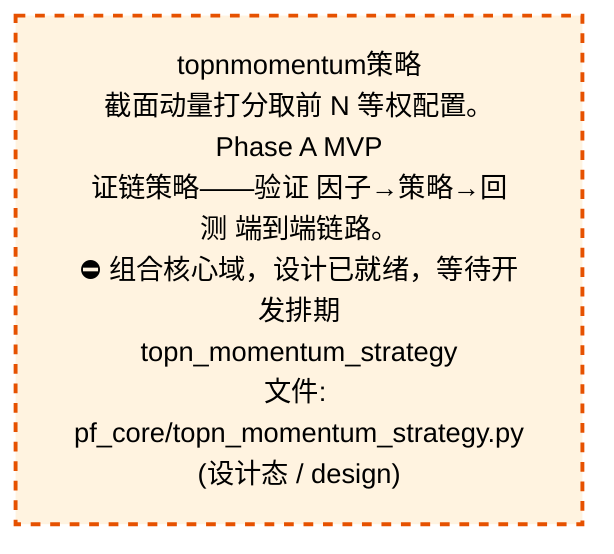
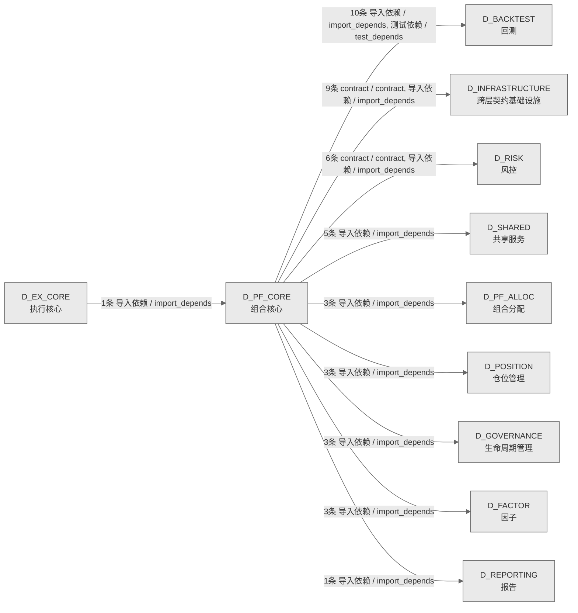

# 63_d_pf_core / 组合核心域 / Portfolio Core

> **功能简介 / Overview**: 组合核心，负责投资组合构建、持仓管理和组合优化

> **文档作用 / Purpose**: 展示 组合核心（D_PF_CORE）功能域的域内依赖关系、跨域依赖关系，模块信息（成熟度/中英文名/大白话/文件路径）内嵌于 Mermaid 节点，供架构审查和域治理参考。

> 本文档由 generate_domain_doc.py 从 depgraph (PostgreSQL) 自动生成
> 数据源: depgraph (PostgreSQL) nodes表 + edges表

> **[可缩放 HTML 版 / Zoomable HTML](http://localhost:8765/docs/02_enterprise_architecture/02_domain_architecture_docs/_zoomable_html/63_d_pf_core.html)** — Ctrl+滚轮缩放 ｜ 双击重置 ｜ Ctrl+Shift+D 切换拖动/选择模式

## 域基本信息 / Domain Overview

| 字段 | 值 | Field | Value |
|------|------|-------|-------|
| 编号 | 63 | Number | 63 |
| 域ID | D_PF_CORE | Domain ID | D_PF_CORE |
| 域名称 | 组合核心 | Domain Name | Portfolio Core |
| 层级 | L2 业务域层 | Layer | L2 Domain |
| 模块数 | 16 | Module Count | 16 |
| 域内依赖 | 22 | Internal Dependencies | 22 |
| 跨域入边 | 1 | Cross-domain Incoming | 1 |
| 跨域出边 | 43 | Cross-domain Outgoing | 43 |
| 设计态模块 | 1 | Design Modules | 1 |
| 生产态模块 | 15 | Production Modules | 15 |
| 容量 | 15/150 (正常) | Capacity | 15/150 (正常) |
| 描述 | 组合核心，负责投资组合构建、持仓管理和组合优化 | Description | 组合核心，负责投资组合构建、持仓管理和组合优化 |

## 域内依赖图 / Internal Dependency Diagram

> 依赖图内嵌在本文档中，IDE 可直接渲染；网页版可 Ctrl+滚轮缩放 + 拖动平移查看细节。
>
> **图例说明 / Legend**：
> - 🟦 **蓝色 = 运营态模块**（production，已上线运行）
> - 🟧 **橙色虚线 = 设计态模块**（design，蓝图阶段，代码未写）
> - **实线箭头 = 运营态依赖**（已生效的依赖关系）
> - **虚线箭头 = 非运营态依赖**（计划中/验证中的依赖关系）

### 全景图（全部模块，颜色区分运营态/设计态）

> 展示全部 16 个模块（生产态 15 + 设计态 1），含跨域依赖外部节点。节点含成熟度+名称+大白话/简介+文件路径。

```mermaid
%%{init: {'theme': 'base', 'themeVariables': {'primaryColor': '#eaeaea', 'primaryTextColor': '#333333', 'primaryBorderColor': '#666666', 'lineColor': '#666666', 'secondaryColor': '#eaeaea', 'tertiaryColor': '#eaeaea', 'fontSize': '14px'}}}%%
flowchart TD
    src_zephyr_pf_core_core_performance_attribution_engine_py["绩效归因引擎<br/>将组合收益分解为配置效应选择效应交互效应Brinson<br/>三因子，供报告和审计消费<br/>文件: core/performance_attribution_engine.py<br/>(生产态 / production)"]
    src_zephyr_pf_core_core_rebalance_scheduler_py["再平衡调度器<br/>组合级再平衡调度决定是否重跑组合优化器，四触发源<br/>漂移日历事件压力任一满足即触发<br/>文件: core/rebalance_scheduler.py<br/>(生产态 / production)"]
    src_zephyr_pf_core_topn_momentum_strategy_py["topnmomentum策略<br/>截面动量打分取前 N 等权配置。Phase A MVP<br/>证链策略——验证 因子→策略→回测 端到端链路。<br/>⛔ 组合核心域，设计已就绪，等待开发排期<br/>topn_momentum_strategy<br/>文件: pf_core/topn_momentum_strategy.py<br/>(设计态 / design)"]
    tests_pf_core_test_intraday_surge_fall_strategy_py["测试intradaysurgefall策略<br/>IntradaySurgeFallStrategy 单元测试（路径 B<br/>示例策略）。<br/>test_intraday_surge_fall_strategy<br/>文件: pf_core<br/>/test_intraday_surge_fall_strategy.py<br/>(生产态 / production)"]
    tests_pf_core_test_orderbook_imbalance_strategy_py["测试orderbookimbalance策略<br/>OrderBookImbalanceStrategy 单元测试（路径 B<br/>盘口失衡反转策略）。<br/>test_orderbook_imbalance_strategy<br/>文件: pf_core<br/>/test_orderbook_imbalance_strategy.py<br/>(生产态 / production)"]
    tests_pf_core_test_strategy_runner_tick_py["测试策略运行器逐笔<br/>run_tick_backtest 单元测试（路径 A：日频信号 ×<br/>tick 撮合）<br/>test_strategy_runner_tick<br/>文件: pf_core/test_strategy_runner_tick.py<br/>(生产态 / production)"]
    tests_pf_core_test_vwap_reversion_strategy_py["测试vwapreversion策略<br/>VWAPReversionStrategy 单元测试（路径 B<br/>均值回归策略）。<br/>test_vwap_reversion_strategy<br/>文件: pf_core/test_vwap_reversion_strategy.py<br/>(生产态 / production)"]
    src_zephyr_pf_core_core_performance_attribution_engine_py ~~~ src_zephyr_pf_core_core_rebalance_scheduler_py
    src_zephyr_pf_core_core_rebalance_scheduler_py ~~~ src_zephyr_pf_core_topn_momentum_strategy_py
    src_zephyr_pf_core_topn_momentum_strategy_py ~~~ tests_pf_core_test_intraday_surge_fall_strategy_py
    tests_pf_core_test_intraday_surge_fall_strategy_py ~~~ tests_pf_core_test_orderbook_imbalance_strategy_py
    tests_pf_core_test_orderbook_imbalance_strategy_py ~~~ tests_pf_core_test_strategy_runner_tick_py
    tests_pf_core_test_strategy_runner_tick_py ~~~ tests_pf_core_test_vwap_reversion_strategy_py
    src_zephyr_pf_core_core_portfolio_optimizer_py["组合优化器<br/>将策略目标权重加风险限额加协方差矩阵转化为合规目<br/>标组合，支持风险预算和均值方差优化<br/>文件: core/portfolio_optimizer.py<br/>(生产态 / production)"]
    src_zephyr_pf_core_core_constraint_solver_py["约束求解器<br/>将风险限额和拥挤检测转化为可执行权重约束，7约束<br/>链迭代投影法求解（行业/市值/MDD/相关性/风格<br/>/仓位），供组合优化器消费<br/>文件: core/constraint_solver.py<br/>(生产态 / production)"]
    src_zephyr_pf_core_core_strategy_engine_py["策略引擎<br/>策略生命周期管理加冷启动协议加四维决策聚合，作为<br/>策略扩展点的运行时宿主<br/>文件: core/strategy_engine.py<br/>(生产态 / production)"]
    src_zephyr_pf_core_strategy_engine_init_py["pf_core/strategy_engine 包入口<br/>策略引擎包：策略运行器 + 具体策略实现。<br/>文件: strategy_engine/__init__.py<br/>(生产态 / production)"]
    src_zephyr_pf_core_core_constraint_solver_py ~~~ src_zephyr_pf_core_core_strategy_engine_py
    src_zephyr_pf_core_core_strategy_engine_py ~~~ src_zephyr_pf_core_strategy_engine_init_py
    src_zephyr_pf_core_strategy_engine_strategy_runner_py["策略运行器<br/>D_PORTFOLIO_CORE — StrategyRunner 策略运行器<br/>（胶水层）<br/>strategy_runner<br/>文件: strategy_engine/strategy_runner.py<br/>(生产态 / production)"]
    src_zephyr_pf_core_intraday_surge_fall_strategy_py["DCORE — 30秒冲高回落做T策略（路径 B 示例策略<br/>D_PORTFOLIO_CORE — 30秒冲高回落做T策略（路径 B<br/>示例策略）<br/>intraday_surge_fall_strategy<br/>文件: pf_core/intraday_surge_fall_strategy.py<br/>(生产态 / production)"]
    src_zephyr_pf_core_orderbook_imbalance_strategy_py["DCORE — 盘口失衡反转做T策略（路径 B 策略）<br/>D_PORTFOLIO_CORE — 盘口失衡反转做T策略（路径 B<br/>策略）<br/>orderbook_imbalance_strategy<br/>文件: pf_core/orderbook_imbalance_strategy.py<br/>(生产态 / production)"]
    src_zephyr_pf_core_vwap_reversion_strategy_py["DCORE — VWAP 回归做T策略（路径 B 策略）<br/>D_PORTFOLIO_CORE — VWAP 回归做T策略（路径 B<br/>策略）<br/>vwap_reversion_strategy<br/>文件: pf_core/vwap_reversion_strategy.py<br/>(生产态 / production)"]
    src_zephyr_pf_core_intraday_surge_fall_strategy_py ~~~ src_zephyr_pf_core_orderbook_imbalance_strategy_py
    src_zephyr_pf_core_orderbook_imbalance_strategy_py ~~~ src_zephyr_pf_core_vwap_reversion_strategy_py
    src_zephyr_pf_core_strategy_engine_tick_strategy_base_py["逐笔策略基类<br/>与 StrategyBase<br/>（日频截面，signals=dict(str,float)）正交。本基<br/>类的策略每个 tick<br/>tick_strategy_base<br/>文件: strategy_engine/tick_strategy_base.py<br/>(生产态 / production)"]
    src_zephyr_pf_core_vwap_reversion_strategy_py -->|导入依赖 / import_depends| src_zephyr_pf_core_strategy_engine_tick_strategy_base_py
    src_zephyr_pf_core_orderbook_imbalance_strategy_py -->|导入依赖 / import_depends| src_zephyr_pf_core_strategy_engine_tick_strategy_base_py
    src_zephyr_pf_core_core_rebalance_scheduler_py -->|导入依赖 / import_depends| src_zephyr_pf_core_core_portfolio_optimizer_py
    src_zephyr_pf_core_core_rebalance_scheduler_py -->|import / import| src_zephyr_pf_core_core_portfolio_optimizer_py
    src_zephyr_pf_core_core_rebalance_scheduler_py -->|import / import| src_zephyr_pf_core_core_strategy_engine_py
    src_zephyr_pf_core_intraday_surge_fall_strategy_py -->|导入依赖 / import_depends| src_zephyr_pf_core_strategy_engine_tick_strategy_base_py
    src_zephyr_pf_core_core_portfolio_optimizer_py -->|import / import| src_zephyr_pf_core_core_constraint_solver_py
    src_zephyr_pf_core_core_portfolio_optimizer_py -->|导入依赖 / import_depends| src_zephyr_pf_core_core_constraint_solver_py
    src_zephyr_pf_core_core_portfolio_optimizer_py -->|import / import| src_zephyr_pf_core_core_strategy_engine_py
    src_zephyr_pf_core_core_portfolio_optimizer_py -->|导入依赖 / import_depends| src_zephyr_pf_core_strategy_engine_init_py
    src_zephyr_pf_core_strategy_engine_init_py -->|导入依赖 / import_depends| src_zephyr_pf_core_strategy_engine_strategy_runner_py
    src_zephyr_pf_core_strategy_engine_strategy_runner_py -->|导入依赖 / import_depends| src_zephyr_pf_core_vwap_reversion_strategy_py
    src_zephyr_pf_core_strategy_engine_strategy_runner_py -->|导入依赖 / import_depends| src_zephyr_pf_core_orderbook_imbalance_strategy_py
    src_zephyr_pf_core_strategy_engine_strategy_runner_py -->|导入依赖 / import_depends| src_zephyr_pf_core_intraday_surge_fall_strategy_py
    src_zephyr_pf_core_strategy_engine_strategy_runner_py -->|导入依赖 / import_depends| src_zephyr_pf_core_strategy_engine_tick_strategy_base_py
    tests_pf_core_test_intraday_surge_fall_strategy_py -->|测试依赖 / test_depends| src_zephyr_pf_core_intraday_surge_fall_strategy_py
    tests_pf_core_test_intraday_surge_fall_strategy_py -->|测试依赖 / test_depends| src_zephyr_pf_core_strategy_engine_tick_strategy_base_py
    tests_pf_core_test_orderbook_imbalance_strategy_py -->|测试依赖 / test_depends| src_zephyr_pf_core_orderbook_imbalance_strategy_py
    tests_pf_core_test_orderbook_imbalance_strategy_py -->|测试依赖 / test_depends| src_zephyr_pf_core_strategy_engine_tick_strategy_base_py
    tests_pf_core_test_strategy_runner_tick_py -->|测试依赖 / test_depends| src_zephyr_pf_core_strategy_engine_strategy_runner_py
    tests_pf_core_test_vwap_reversion_strategy_py -->|测试依赖 / test_depends| src_zephyr_pf_core_vwap_reversion_strategy_py
    tests_pf_core_test_vwap_reversion_strategy_py -->|测试依赖 / test_depends| src_zephyr_pf_core_strategy_engine_tick_strategy_base_py
    D_POSITION["仓位管理<br/>仓位管理，负责持仓跟踪、仓位计算和盈亏分析<br/>Position Management<br/>跨域节点 / cross-domain<br/>(生产态 / production)"]
    src_zephyr_pf_core_core_rebalance_scheduler_py -->|导入依赖 / import_depends| D_POSITION
    D_RISK["风控<br/>风控，负责风险指标计算、风险限额管理和风险预警<br/>Risk Control<br/>跨域节点 / cross-domain<br/>(生产态 / production)"]
    src_zephyr_pf_core_core_strategy_engine_py -->|导入依赖 / import_depends| D_RISK
    src_zephyr_pf_core_core_constraint_solver_py -->|contract / contract| D_RISK
    D_INFRASTRUCTURE["跨层契约基础设施<br/>跨层契约基础设施，负责跨层契约定义、共享契约管理<br/>和契约校验<br/>Cross-Layer Contract Infrastructure<br/>跨域节点 / cross-domain<br/>(生产态 / production)"]
    src_zephyr_pf_core_core_strategy_engine_py -->|contract / contract| D_INFRASTRUCTURE
    src_zephyr_pf_core_core_portfolio_optimizer_py -->|contract / contract| D_INFRASTRUCTURE
    D_PF_ALLOC["组合分配<br/>组合分配，负责资产配置、权重分配和再平衡<br/>Portfolio Allocation<br/>跨域节点 / cross-domain<br/>(生产态 / production)"]
    src_zephyr_pf_core_core_constraint_solver_py -->|导入依赖 / import_depends| D_PF_ALLOC
    src_zephyr_pf_core_core_portfolio_optimizer_py -->|导入依赖 / import_depends| D_RISK
    src_zephyr_pf_core_core_rebalance_scheduler_py -->|导入依赖 / import_depends| D_POSITION
    src_zephyr_pf_core_core_rebalance_scheduler_py -->|导入依赖 / import_depends| D_POSITION
    src_zephyr_pf_core_core_strategy_engine_py -->|导入依赖 / import_depends| D_INFRASTRUCTURE
    D_SHARED["共享服务<br/>共享服务，负责跨域共享的工具、协议和基础服务<br/>Shared Services<br/>跨域节点 / cross-domain<br/>(生产态 / production)"]
    src_zephyr_pf_core_core_constraint_solver_py -->|导入依赖 / import_depends| D_SHARED
    src_zephyr_pf_core_core_portfolio_optimizer_py -->|导入依赖 / import_depends| D_INFRASTRUCTURE
    src_zephyr_pf_core_core_performance_attribution_engine_py -->|导入依赖 / import_depends| D_PF_ALLOC
    src_zephyr_pf_core_core_performance_attribution_engine_py -->|导入依赖 / import_depends| D_INFRASTRUCTURE
    D_GOVERNANCE["生命周期管理<br/>生命周期管理，负责蓝图/模块<br/>/任务的声明周期管理和元数据治理<br/>Lifecycle Management<br/>跨域节点 / cross-domain<br/>(生产态 / production)"]
    src_zephyr_pf_core_core_strategy_engine_py -->|导入依赖 / import_depends| D_GOVERNANCE
    D_EX_CORE["执行核心<br/>执行核心，负责订单执行引擎、执行策略和执行管理<br/>Execution Core<br/>跨域节点 / cross-domain<br/>(生产态 / production)"]
    D_EX_CORE -->|导入依赖 / import_depends| src_zephyr_pf_core_strategy_engine_strategy_runner_py
    classDef production fill:#e1f5fe,stroke:#01579b,stroke-width:2px,color:#000
    classDef design fill:#fff3e0,stroke:#e65100,stroke-width:2px,color:#000,stroke-dasharray: 5 5
    classDef external_prod fill:#e8f4fd,stroke:#0277bd,stroke-width:1px,color:#000
    classDef external_design fill:#fff8e7,stroke:#ef6c00,stroke-width:1px,color:#000,stroke-dasharray: 5 5
    class src_zephyr_pf_core_core_constraint_solver_py,src_zephyr_pf_core_core_performance_attribution_engine_py,src_zephyr_pf_core_core_portfolio_optimizer_py,src_zephyr_pf_core_core_rebalance_scheduler_py,src_zephyr_pf_core_core_strategy_engine_py,src_zephyr_pf_core_intraday_surge_fall_strategy_py,src_zephyr_pf_core_orderbook_imbalance_strategy_py,src_zephyr_pf_core_strategy_engine_init_py,src_zephyr_pf_core_strategy_engine_strategy_runner_py,src_zephyr_pf_core_strategy_engine_tick_strategy_base_py,src_zephyr_pf_core_vwap_reversion_strategy_py,tests_pf_core_test_intraday_surge_fall_strategy_py,tests_pf_core_test_orderbook_imbalance_strategy_py,tests_pf_core_test_strategy_runner_tick_py,tests_pf_core_test_vwap_reversion_strategy_py production
    class src_zephyr_pf_core_topn_momentum_strategy_py design
    class D_POSITION,D_RISK,D_INFRASTRUCTURE,D_PF_ALLOC,D_SHARED,D_GOVERNANCE,D_EX_CORE external_prod
```

### 运营态的图（仅 design_maturity=production 的模块和域内依赖）

> 仅展示已上线运行的模块（共 15 个），不含跨域外部节点。跨域依赖见下方跨域依赖章节。

```mermaid
%%{init: {'theme': 'base', 'themeVariables': {'primaryColor': '#eaeaea', 'primaryTextColor': '#333333', 'primaryBorderColor': '#666666', 'lineColor': '#666666', 'secondaryColor': '#eaeaea', 'tertiaryColor': '#eaeaea', 'fontSize': '14px'}}}%%
flowchart TD
    src_zephyr_pf_core_core_performance_attribution_engine_py["绩效归因引擎<br/>将组合收益分解为配置效应选择效应交互效应Brinson<br/>三因子，供报告和审计消费<br/>文件: core/performance_attribution_engine.py<br/>(生产态 / production)"]
    src_zephyr_pf_core_core_rebalance_scheduler_py["再平衡调度器<br/>组合级再平衡调度决定是否重跑组合优化器，四触发源<br/>漂移日历事件压力任一满足即触发<br/>文件: core/rebalance_scheduler.py<br/>(生产态 / production)"]
    tests_pf_core_test_intraday_surge_fall_strategy_py["测试intradaysurgefall策略<br/>IntradaySurgeFallStrategy 单元测试（路径 B<br/>示例策略）。<br/>test_intraday_surge_fall_strategy<br/>文件: pf_core<br/>/test_intraday_surge_fall_strategy.py<br/>(生产态 / production)"]
    tests_pf_core_test_orderbook_imbalance_strategy_py["测试orderbookimbalance策略<br/>OrderBookImbalanceStrategy 单元测试（路径 B<br/>盘口失衡反转策略）。<br/>test_orderbook_imbalance_strategy<br/>文件: pf_core<br/>/test_orderbook_imbalance_strategy.py<br/>(生产态 / production)"]
    tests_pf_core_test_strategy_runner_tick_py["测试策略运行器逐笔<br/>run_tick_backtest 单元测试（路径 A：日频信号 ×<br/>tick 撮合）<br/>test_strategy_runner_tick<br/>文件: pf_core/test_strategy_runner_tick.py<br/>(生产态 / production)"]
    tests_pf_core_test_vwap_reversion_strategy_py["测试vwapreversion策略<br/>VWAPReversionStrategy 单元测试（路径 B<br/>均值回归策略）。<br/>test_vwap_reversion_strategy<br/>文件: pf_core/test_vwap_reversion_strategy.py<br/>(生产态 / production)"]
    src_zephyr_pf_core_core_performance_attribution_engine_py ~~~ src_zephyr_pf_core_core_rebalance_scheduler_py
    src_zephyr_pf_core_core_rebalance_scheduler_py ~~~ tests_pf_core_test_intraday_surge_fall_strategy_py
    tests_pf_core_test_intraday_surge_fall_strategy_py ~~~ tests_pf_core_test_orderbook_imbalance_strategy_py
    tests_pf_core_test_orderbook_imbalance_strategy_py ~~~ tests_pf_core_test_strategy_runner_tick_py
    tests_pf_core_test_strategy_runner_tick_py ~~~ tests_pf_core_test_vwap_reversion_strategy_py
    src_zephyr_pf_core_core_portfolio_optimizer_py["组合优化器<br/>将策略目标权重加风险限额加协方差矩阵转化为合规目<br/>标组合，支持风险预算和均值方差优化<br/>文件: core/portfolio_optimizer.py<br/>(生产态 / production)"]
    src_zephyr_pf_core_core_constraint_solver_py["约束求解器<br/>将风险限额和拥挤检测转化为可执行权重约束，7约束<br/>链迭代投影法求解（行业/市值/MDD/相关性/风格<br/>/仓位），供组合优化器消费<br/>文件: core/constraint_solver.py<br/>(生产态 / production)"]
    src_zephyr_pf_core_core_strategy_engine_py["策略引擎<br/>策略生命周期管理加冷启动协议加四维决策聚合，作为<br/>策略扩展点的运行时宿主<br/>文件: core/strategy_engine.py<br/>(生产态 / production)"]
    src_zephyr_pf_core_strategy_engine_init_py["pf_core/strategy_engine 包入口<br/>策略引擎包：策略运行器 + 具体策略实现。<br/>文件: strategy_engine/__init__.py<br/>(生产态 / production)"]
    src_zephyr_pf_core_core_constraint_solver_py ~~~ src_zephyr_pf_core_core_strategy_engine_py
    src_zephyr_pf_core_core_strategy_engine_py ~~~ src_zephyr_pf_core_strategy_engine_init_py
    src_zephyr_pf_core_strategy_engine_strategy_runner_py["策略运行器<br/>D_PORTFOLIO_CORE — StrategyRunner 策略运行器<br/>（胶水层）<br/>strategy_runner<br/>文件: strategy_engine/strategy_runner.py<br/>(生产态 / production)"]
    src_zephyr_pf_core_intraday_surge_fall_strategy_py["DCORE — 30秒冲高回落做T策略（路径 B 示例策略<br/>D_PORTFOLIO_CORE — 30秒冲高回落做T策略（路径 B<br/>示例策略）<br/>intraday_surge_fall_strategy<br/>文件: pf_core/intraday_surge_fall_strategy.py<br/>(生产态 / production)"]
    src_zephyr_pf_core_orderbook_imbalance_strategy_py["DCORE — 盘口失衡反转做T策略（路径 B 策略）<br/>D_PORTFOLIO_CORE — 盘口失衡反转做T策略（路径 B<br/>策略）<br/>orderbook_imbalance_strategy<br/>文件: pf_core/orderbook_imbalance_strategy.py<br/>(生产态 / production)"]
    src_zephyr_pf_core_vwap_reversion_strategy_py["DCORE — VWAP 回归做T策略（路径 B 策略）<br/>D_PORTFOLIO_CORE — VWAP 回归做T策略（路径 B<br/>策略）<br/>vwap_reversion_strategy<br/>文件: pf_core/vwap_reversion_strategy.py<br/>(生产态 / production)"]
    src_zephyr_pf_core_intraday_surge_fall_strategy_py ~~~ src_zephyr_pf_core_orderbook_imbalance_strategy_py
    src_zephyr_pf_core_orderbook_imbalance_strategy_py ~~~ src_zephyr_pf_core_vwap_reversion_strategy_py
    src_zephyr_pf_core_strategy_engine_tick_strategy_base_py["逐笔策略基类<br/>与 StrategyBase<br/>（日频截面，signals=dict(str,float)）正交。本基<br/>类的策略每个 tick<br/>tick_strategy_base<br/>文件: strategy_engine/tick_strategy_base.py<br/>(生产态 / production)"]
    src_zephyr_pf_core_vwap_reversion_strategy_py -->|导入依赖 / import_depends| src_zephyr_pf_core_strategy_engine_tick_strategy_base_py
    src_zephyr_pf_core_orderbook_imbalance_strategy_py -->|导入依赖 / import_depends| src_zephyr_pf_core_strategy_engine_tick_strategy_base_py
    src_zephyr_pf_core_core_rebalance_scheduler_py -->|导入依赖 / import_depends| src_zephyr_pf_core_core_portfolio_optimizer_py
    src_zephyr_pf_core_core_rebalance_scheduler_py -->|import / import| src_zephyr_pf_core_core_portfolio_optimizer_py
    src_zephyr_pf_core_core_rebalance_scheduler_py -->|import / import| src_zephyr_pf_core_core_strategy_engine_py
    src_zephyr_pf_core_intraday_surge_fall_strategy_py -->|导入依赖 / import_depends| src_zephyr_pf_core_strategy_engine_tick_strategy_base_py
    src_zephyr_pf_core_core_portfolio_optimizer_py -->|import / import| src_zephyr_pf_core_core_constraint_solver_py
    src_zephyr_pf_core_core_portfolio_optimizer_py -->|导入依赖 / import_depends| src_zephyr_pf_core_core_constraint_solver_py
    src_zephyr_pf_core_core_portfolio_optimizer_py -->|import / import| src_zephyr_pf_core_core_strategy_engine_py
    src_zephyr_pf_core_core_portfolio_optimizer_py -->|导入依赖 / import_depends| src_zephyr_pf_core_strategy_engine_init_py
    src_zephyr_pf_core_strategy_engine_init_py -->|导入依赖 / import_depends| src_zephyr_pf_core_strategy_engine_strategy_runner_py
    src_zephyr_pf_core_strategy_engine_strategy_runner_py -->|导入依赖 / import_depends| src_zephyr_pf_core_vwap_reversion_strategy_py
    src_zephyr_pf_core_strategy_engine_strategy_runner_py -->|导入依赖 / import_depends| src_zephyr_pf_core_orderbook_imbalance_strategy_py
    src_zephyr_pf_core_strategy_engine_strategy_runner_py -->|导入依赖 / import_depends| src_zephyr_pf_core_intraday_surge_fall_strategy_py
    src_zephyr_pf_core_strategy_engine_strategy_runner_py -->|导入依赖 / import_depends| src_zephyr_pf_core_strategy_engine_tick_strategy_base_py
    tests_pf_core_test_intraday_surge_fall_strategy_py -->|测试依赖 / test_depends| src_zephyr_pf_core_intraday_surge_fall_strategy_py
    tests_pf_core_test_intraday_surge_fall_strategy_py -->|测试依赖 / test_depends| src_zephyr_pf_core_strategy_engine_tick_strategy_base_py
    tests_pf_core_test_orderbook_imbalance_strategy_py -->|测试依赖 / test_depends| src_zephyr_pf_core_orderbook_imbalance_strategy_py
    tests_pf_core_test_orderbook_imbalance_strategy_py -->|测试依赖 / test_depends| src_zephyr_pf_core_strategy_engine_tick_strategy_base_py
    tests_pf_core_test_strategy_runner_tick_py -->|测试依赖 / test_depends| src_zephyr_pf_core_strategy_engine_strategy_runner_py
    tests_pf_core_test_vwap_reversion_strategy_py -->|测试依赖 / test_depends| src_zephyr_pf_core_vwap_reversion_strategy_py
    tests_pf_core_test_vwap_reversion_strategy_py -->|测试依赖 / test_depends| src_zephyr_pf_core_strategy_engine_tick_strategy_base_py
    classDef production fill:#e1f5fe,stroke:#01579b,stroke-width:2px,color:#000
    classDef design fill:#fff3e0,stroke:#e65100,stroke-width:2px,color:#000,stroke-dasharray: 5 5
    classDef external_prod fill:#e8f4fd,stroke:#0277bd,stroke-width:1px,color:#000
    classDef external_design fill:#fff8e7,stroke:#ef6c00,stroke-width:1px,color:#000,stroke-dasharray: 5 5
    class src_zephyr_pf_core_core_constraint_solver_py,src_zephyr_pf_core_core_performance_attribution_engine_py,src_zephyr_pf_core_core_portfolio_optimizer_py,src_zephyr_pf_core_core_rebalance_scheduler_py,src_zephyr_pf_core_core_strategy_engine_py,src_zephyr_pf_core_intraday_surge_fall_strategy_py,src_zephyr_pf_core_orderbook_imbalance_strategy_py,src_zephyr_pf_core_strategy_engine_init_py,src_zephyr_pf_core_strategy_engine_strategy_runner_py,src_zephyr_pf_core_strategy_engine_tick_strategy_base_py,src_zephyr_pf_core_vwap_reversion_strategy_py,tests_pf_core_test_intraday_surge_fall_strategy_py,tests_pf_core_test_orderbook_imbalance_strategy_py,tests_pf_core_test_strategy_runner_tick_py,tests_pf_core_test_vwap_reversion_strategy_py production
```

### 设计态的图（仅 design_maturity=design 的模块和域内依赖）

> 仅展示蓝图阶段、代码未写的设计态模块（共 1 个），不含跨域外部节点。

## 跨域依赖 / Cross-domain Dependencies

### 本域依赖的其他域（出边）/ Depends On

| # | 本域模块 / Source Module | → | 外部域-目标模块 / Target Module | 依赖类型 / Type |
|:--:|---------|:--:|---------|---------|
| 1 | DCORE — 30秒冲高回落做T策略（路径 B 示例策略 / intraday_... | → | D_BACKTEST 回测: 逐笔replay / tick_replay (core/tick_replay.py) | 导入依赖 / import_depends |
| 2 | DCORE — 盘口失衡反转做T策略（路径 B 策略） / orderbook_i... | → | D_BACKTEST 回测: 逐笔replay / tick_replay (core/tick_replay.py) | 导入依赖 / import_depends |
| 3 | 策略运行器 / strategy_runner (strategy_engine/strategy_ru... | → | D_BACKTEST 回测: 引擎基类 / L_BACKTEST — Backtest Engine Layer (core/engi... | 导入依赖 / import_depends |
| 4 | 策略运行器 / strategy_runner (strategy_engine/strategy_ru... | → | D_BACKTEST 回测: 事件driven引擎 / event_driven_engine (implementations/eve... | 导入依赖 / import_depends |
| 5 | 策略运行器 / strategy_runner (strategy_engine/strategy_ru... | → | D_BACKTEST 回测: vectorized引擎 / L_BACKTEST — Vectorized Backtest Engine... | 导入依赖 / import_depends |
| 6 | 逐笔策略基类 / tick_strategy_base (strategy_engine/tick_s... | → | D_BACKTEST 回测: 逐笔replay / tick_replay (core/tick_replay.py) | 导入依赖 / import_depends |
| 7 | DCORE — VWAP 回归做T策略（路径 B 策略） / vwap_reversion... | → | D_BACKTEST 回测: 逐笔replay / tick_replay (core/tick_replay.py) | 导入依赖 / import_depends |
| 8 | 测试intradaysurgefall策略 / test_intraday_surge_fall_stra... | → | D_BACKTEST 回测: 共享撮合逻辑模块（回测=实盘一致性核心） / matching_logic ... | 测试依赖 / test_depends |
| 9 | 测试orderbookimbalance策略 / test_orderbook_imbalance_str... | → | D_BACKTEST 回测: 共享撮合逻辑模块（回测=实盘一致性核心） / matching_logic ... | 测试依赖 / test_depends |
| 10 | 测试vwapreversion策略 / test_vwap_reversion_strategy (pf_... | → | D_BACKTEST 回测: 共享撮合逻辑模块（回测=实盘一致性核心） / matching_logic ... | 测试依赖 / test_depends |
| 11 | 策略运行器 / strategy_runner (strategy_engine/strategy_ru... | → | D_FACTOR 因子: D-FACTOR-ANA-10 多因子合成——将多个因子值合成为综合信号... | 导入依赖 / import_depends |
| 12 | 策略运行器 / strategy_runner (strategy_engine/strategy_ru... | → | D_FACTOR 因子: D-FACTOR-03 因子评估回测运行器——端到端因子评估。 / back... | 导入依赖 / import_depends |
| 13 | 策略运行器 / strategy_runner (strategy_engine/strategy_ru... | → | D_FACTOR 因子: 因子基类 / ZephyrAlpha — D_FACTOR Alpha Factor Layer (fa... | 导入依赖 / import_depends |
| 14 | 策略引擎 (core/strategy_engine.py) | → | D_GOVERNANCE 生命周期管理: 策略基类 / D_PORTFOLIO_CORE — StrategyBase + StrategyMet... | 导入依赖 / import_depends |
| 15 | 策略引擎 (core/strategy_engine.py) | → | D_GOVERNANCE 生命周期管理: 策略基类 / D_PORTFOLIO_CORE — StrategyBase + StrategyMet... | 导入依赖 / import_depends |
| 16 | 策略运行器 / strategy_runner (strategy_engine/strategy_ru... | → | D_GOVERNANCE 生命周期管理: 策略基类 / D_PORTFOLIO_CORE — StrategyBase + StrategyMet... | 导入依赖 / import_depends |
| 17 | 约束求解器 (core/constraint_solver.py) | → | D_INFRASTRUCTURE 跨层契约基础设施: 风险limits / risk_limits (contracts/risk_limits.py) | 导入依赖 / import_depends |
| 18 | 绩效归因引擎 (core/performance_attribution_engine.py) | → | D_INFRASTRUCTURE 跨层契约基础设施: 绩效attribution报告 / performance_attribution_report (con... | 导入依赖 / import_depends |
| 19 | 组合优化器 (core/portfolio_optimizer.py) | → | D_INFRASTRUCTURE 跨层契约基础设施: 风险limits / risk_limits (contracts/risk_limits.py) | 导入依赖 / import_depends |
| 20 | 组合优化器 (core/portfolio_optimizer.py) | → | D_INFRASTRUCTURE 跨层契约基础设施: 目标组合契约 / TargetPortfolio (contracts/target_portfoli... | 导入依赖 / import_depends |
| 21 | 组合优化器 (core/portfolio_optimizer.py) | → | D_INFRASTRUCTURE 跨层契约基础设施: 目标组合契约 / TargetPortfolio (contracts/target_portfoli... | contract / contract |
| 22 | 再平衡调度器 (core/rebalance_scheduler.py) | → | D_INFRASTRUCTURE 跨层契约基础设施: 风险limits / risk_limits (contracts/risk_limits.py) | 导入依赖 / import_depends |
| 23 | 再平衡调度器 (core/rebalance_scheduler.py) | → | D_INFRASTRUCTURE 跨层契约基础设施: 目标组合契约 / TargetPortfolio (contracts/target_portfoli... | 导入依赖 / import_depends |
| 24 | 策略引擎 (core/strategy_engine.py) | → | D_INFRASTRUCTURE 跨层契约基础设施: 策略生命周期事件 / strategy_lifecycle_event (contracts/st... | contract / contract |
| 25 | 策略引擎 (core/strategy_engine.py) | → | D_INFRASTRUCTURE 跨层契约基础设施: 策略生命周期事件 / strategy_lifecycle_event (contracts/st... | 导入依赖 / import_depends |
| 26 | 约束求解器 (core/constraint_solver.py) | → | D_PF_ALLOC 组合分配: 策略相关性门禁 / Strategy Correlation Gate (core/strategy... | 导入依赖 / import_depends |
| 27 | 绩效归因引擎 (core/performance_attribution_engine.py) | → | D_PF_ALLOC 组合分配: 策略相关性门禁 / Strategy Correlation Gate (core/strategy... | 导入依赖 / import_depends |
| 28 | 包入口 / D_PORTFOLIO_CORE — Portfolio Construction Strat... | → | D_PF_ALLOC 组合分配: 默认权益策略 / D_PORTFOLIO_CORE — Default Equity Long-On... | 导入依赖 / import_depends |
| 29 | 再平衡调度器 (core/rebalance_scheduler.py) | → | D_POSITION 仓位管理: 持仓漂移监控 / position_drift_monitor (core/position_drif... | 导入依赖 / import_depends |
| 30 | 再平衡调度器 (core/rebalance_scheduler.py) | → | D_POSITION 仓位管理: rebalance引擎 / rebalance_engine (core/rebalance_engine.py) | 导入依赖 / import_depends |
| 31 | 再平衡调度器 (core/rebalance_scheduler.py) | → | D_POSITION 仓位管理: 持仓协调器 / position_reconciler (position/position_recon... | 导入依赖 / import_depends |
| 32 | 绩效归因引擎 (core/performance_attribution_engine.py) | → | D_REPORTING 报告: analytics基类 / D_REPORTING — Post-Trade Analytics Layer... | 导入依赖 / import_depends |
| 33 | 约束求解器 (core/constraint_solver.py) | → | D_RISK 风控: 风险limits / D_RISK — Risk Limits Calculator (risk/risk_... | contract / contract |
| 34 | 绩效归因引擎 (core/performance_attribution_engine.py) | → | D_RISK 风控: 风险分解引擎 (core/risk_decomposition.py) | 导入依赖 / import_depends |
| 35 | 组合优化器 (core/portfolio_optimizer.py) | → | D_RISK 风控: 风险预算分配器 (core/risk_budget_allocator.py) | 导入依赖 / import_depends |
| 36 | 组合优化器 (core/portfolio_optimizer.py) | → | D_RISK 风控: 风险预算分配器 (core/risk_budget_allocator.py) | 导入依赖 / import_depends |
| 37 | 组合优化器 (core/portfolio_optimizer.py) | → | D_RISK 风控: 风险分解引擎 (core/risk_decomposition.py) | 导入依赖 / import_depends |
| 38 | 策略引擎 (core/strategy_engine.py) | → | D_RISK 风控: 风险limits / D_RISK — Risk Limits Calculator (risk/risk_... | 导入依赖 / import_depends |
| 39 | 约束求解器 (core/constraint_solver.py) | → | D_SHARED 共享服务: 错误 / errors (foundation/errors.py) | 导入依赖 / import_depends |
| 40 | 绩效归因引擎 (core/performance_attribution_engine.py) | → | D_SHARED 共享服务: 错误 / errors (foundation/errors.py) | 导入依赖 / import_depends |
| 41 | 组合优化器 (core/portfolio_optimizer.py) | → | D_SHARED 共享服务: 错误 / errors (foundation/errors.py) | 导入依赖 / import_depends |
| 42 | 再平衡调度器 (core/rebalance_scheduler.py) | → | D_SHARED 共享服务: 错误 / errors (foundation/errors.py) | 导入依赖 / import_depends |
| 43 | 策略引擎 (core/strategy_engine.py) | → | D_SHARED 共享服务: 错误 / errors (foundation/errors.py) | 导入依赖 / import_depends |

### 依赖本域的其他域（入边）/ Depended By

| # | 外部域-源模块 / Source Module | → | 本域模块 / Target Module | 依赖类型 / Type |
|:--:|---------|:--:|---------|---------|
| 1 | D_EX_CORE 执行核心: 交易会话 / trading_session (ex_core/trading_session.py) | → | 策略运行器 / strategy_runner (strategy_engine/strategy_ru... | 导入依赖 / import_depends |

### 跨域依赖图 / Cross-domain Dependency Diagram

> 本域与 10 个外部域直接连接（出边 43 条 + 入边 1 条 = 44 条）。只显示直接连接的域，不展开具体节点。

## 说明 / Notes

- **数据源 / Data Source**: `depgraph (PostgreSQL)` 的 `nodes`、`edges`、`domains` 表
- **生成器 / Generator**: `generate_domain_doc.py`（G2+G10 合并）
- **维护方式 / Maintenance**: 自动生成，全景图更新时刷新
- **文件名规则 / File Naming**: `{编号:02d}_{域ID小写}.md`，如 `16_d_trading.md`
- **图例说明 / Legend**: `[production]`=已上线 / `[design]`=设计中 / `[unknown]`=未知
