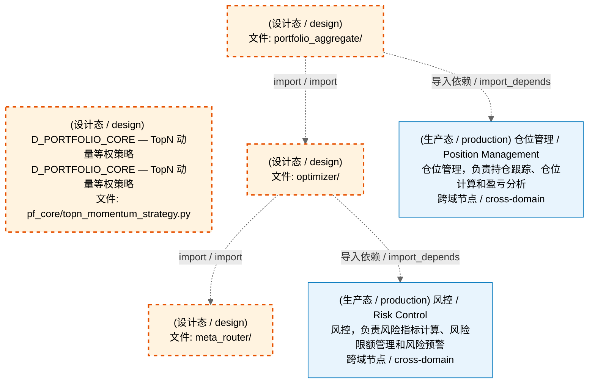
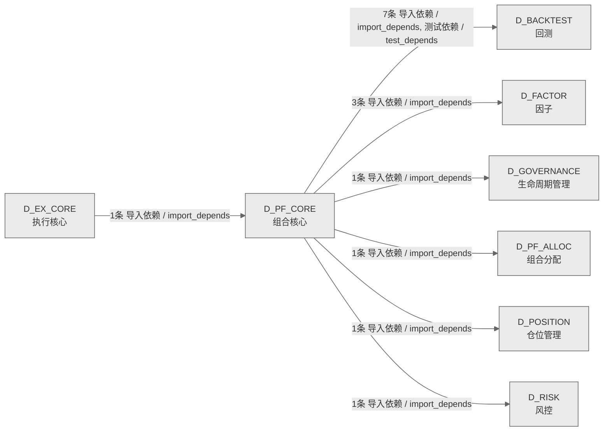

# 63_d_pf_core / 组合核心域 / Portfolio Core

> **功能简介 / Overview**: 组合核心，负责投资组合构建、持仓管理和组合优化

> **文档作用 / Purpose**: 展示 组合核心（D_PF_CORE）功能域的域内依赖关系、跨域依赖关系，模块信息（成熟度/中英文名/大白话/文件路径）内嵌于 Mermaid 节点，供架构审查和域治理参考。

> 本文档由 generate_domain_doc.py 从 depgraph (PostgreSQL) 自动生成
> 数据源: depgraph (PostgreSQL) nodes表 + edges表

> **[可缩放 HTML 版 / Zoomable HTML](http://localhost:8765/docs/02_enterprise_architecture/02_domain_architecture_docs/_zoomable_html/63_d_pf_core.html)** — Ctrl+滚轮缩放 ｜ 双击重置 ｜ Ctrl+Shift+D 切换拖动/选择模式

## 域基本信息 / Domain Overview

| 字段 | 值 | Field | Value |
|------|------|-------|-------|
| 编号 | 63 | Number | 63 |
| 域ID | D_PF_CORE | Domain ID | D_PF_CORE |
| 域名称 | 组合核心 | Domain Name | Portfolio Core |
| 层级 | L2 业务域层 | Layer | L2 Domain |
| 模块数 | 14 | Module Count | 14 |
| 域内依赖 | 18 | Internal Dependencies | 18 |
| 跨域入边 | 1 | Cross-domain Incoming | 1 |
| 跨域出边 | 14 | Cross-domain Outgoing | 14 |
| 设计态模块 | 4 | Design Modules | 4 |
| 生产态模块 | 10 | Production Modules | 10 |
| 容量 | 10/150 (正常) | Capacity | 10/150 (正常) |
| 描述 | 组合核心，负责投资组合构建、持仓管理和组合优化 | Description | 组合核心，负责投资组合构建、持仓管理和组合优化 |

## 域内依赖图 / Internal Dependency Diagram

> 依赖图内嵌在本文档中，共三个图：全景图、运营态图、设计态图。大图在 MD 预览可能渲染失败，请用可缩放 HTML 版查看（已放开渲染上限，浏览器可正常渲染 + Ctrl+滚轮缩放 + 拖动平移）。
>
> **图例说明 / Legend**：
> - 🟦 **蓝色 = 运营态模块**（production，已上线运行）
> - 🟧 **橙色虚线 = 设计态模块**（design，蓝图阶段，代码未写）
> - **实线箭头 = 运营态依赖**（已生效的依赖关系）
> - **虚线箭头 = 非运营态依赖**（计划中/验证中的依赖关系）

### 全景图（全部模块）

> 展示全部 14 个模块（生产态 10 + 设计态 4），节点含成熟度+中英文名+大白话+文件路径。

```mermaid
%%{init: {'theme': 'base', 'themeVariables': {'primaryColor': '#eaeaea', 'primaryTextColor': '#333333', 'primaryBorderColor': '#666666', 'lineColor': '#666666', 'secondaryColor': '#eaeaea', 'tertiaryColor': '#eaeaea', 'fontSize': '14px'}}}%%
flowchart TD
    src_zephyr_pf_core_portfolio_aggregate["(设计态 / design)<br/>文件: portfolio_aggregate/"]
    src_zephyr_pf_core_topn_momentum_strategy_py["(设计态 / design) D_PORTFOLIO_CORE — TopN 动量等权策略<br/>D_PORTFOLIO_CORE — TopN 动量等权策略<br/>文件: pf_core/topn_momentum_strategy.py"]
    tests_pf_core_test_intraday_surge_fall_strategy_py["(生产态 / production) IntradaySurgeFallStrategy 单元测试（路径 B 示例策略）。<br/>IntradaySurgeFallStrategy 单元测试（路径 B 示例策略）。<br/>文件: pf_core/test_intraday_surge_fall_strategy.py"]
    tests_pf_core_test_orderbook_imbalance_strategy_py["(生产态 / production) OrderBookImbalanceStrategy 单元测试（路径 B 盘口失衡反转策略）。<br/>OrderBookImbalanceStrategy 单元测试（路径 B 盘口失衡反转策略）。<br/>文件: pf_core/test_orderbook_imbalance_strategy.py"]
    tests_pf_core_test_strategy_runner_tick_py["(生产态 / production) StrategyRunner.run_tick_backtest 单元测试（路径 A：日频信号 × tick 撮合）。<br/>StrategyRunner.run_tick_backtest 单元测试（路径 A：日频信号 × tick 撮合）。<br/>文件: pf_core/test_strategy_runner_tick.py"]
    tests_pf_core_test_vwap_reversion_strategy_py["(生产态 / production) VWAPReversionStrategy 单元测试（路径 B 均值回归策略）。<br/>VWAPReversionStrategy 单元测试（路径 B 均值回归策略）。<br/>文件: pf_core/test_vwap_reversion_strategy.py"]
    src_zephyr_pf_core_portfolio_aggregate ~~~ src_zephyr_pf_core_topn_momentum_strategy_py
    src_zephyr_pf_core_topn_momentum_strategy_py ~~~ tests_pf_core_test_intraday_surge_fall_strategy_py
    tests_pf_core_test_intraday_surge_fall_strategy_py ~~~ tests_pf_core_test_orderbook_imbalance_strategy_py
    tests_pf_core_test_orderbook_imbalance_strategy_py ~~~ tests_pf_core_test_strategy_runner_tick_py
    tests_pf_core_test_strategy_runner_tick_py ~~~ tests_pf_core_test_vwap_reversion_strategy_py
    src_zephyr_pf_core_optimizer["(设计态 / design)<br/>文件: optimizer/"]
    src_zephyr_pf_core_meta_router["(设计态 / design)<br/>文件: meta_router/"]
    src_zephyr_pf_core_strategy_engine_init_py["(生产态 / production) D_PORTFOLIO_CORE — Portfolio Construction Strategies<br/>D_PORTFOLIO_CORE — Portfolio Construction Strategies<br/>文件: strategy_engine/__init__.py"]
    src_zephyr_pf_core_strategy_engine_strategy_runner_py["(生产态 / production) D_PORTFOLIO_CORE — StrategyRunner 策略运行器（胶水层）<br/>D_PORTFOLIO_CORE — StrategyRunner 策略运行器（胶水层）<br/>文件: strategy_engine/strategy_runner.py"]
    src_zephyr_pf_core_intraday_surge_fall_strategy_py["(生产态 / production) D_PORTFOLIO_CORE — 30秒冲高回落做T策略（路径 B 示例策略）<br/>D_PORTFOLIO_CORE — 30秒冲高回落做T策略（路径 B 示例策略）<br/>文件: pf_core/intraday_surge_fall_strategy.py"]
    src_zephyr_pf_core_orderbook_imbalance_strategy_py["(生产态 / production) D_PORTFOLIO_CORE — 盘口失衡反转做T策略（路径 B 策略）<br/>D_PORTFOLIO_CORE — 盘口失衡反转做T策略（路径 B 策略）<br/>文件: pf_core/orderbook_imbalance_strategy.py"]
    src_zephyr_pf_core_vwap_reversion_strategy_py["(生产态 / production) D_PORTFOLIO_CORE — VWAP 回归做T策略（路径 B 策略）<br/>D_PORTFOLIO_CORE — VWAP 回归做T策略（路径 B 策略）<br/>文件: pf_core/vwap_reversion_strategy.py"]
    src_zephyr_pf_core_intraday_surge_fall_strategy_py ~~~ src_zephyr_pf_core_orderbook_imbalance_strategy_py
    src_zephyr_pf_core_orderbook_imbalance_strategy_py ~~~ src_zephyr_pf_core_vwap_reversion_strategy_py
    src_zephyr_pf_core_strategy_engine_tick_strategy_base_py["(生产态 / production) D_PORTFOLIO_CORE — TickStrategyBase + TickStrategyRegistry（路径 B：tick 级...<br/>D_PORTFOLIO_CORE — TickStrategyBase + TickStrategyRegistry（路径 B：tick 级...<br/>文件: strategy_engine/tick_strategy_base.py"]
    src_zephyr_pf_core_optimizer -.->|import / import| src_zephyr_pf_core_meta_router
    src_zephyr_pf_core_meta_router -.->|导入依赖 / import_depends| src_zephyr_pf_core_strategy_engine_init_py
    src_zephyr_pf_core_portfolio_aggregate -.->|import / import| src_zephyr_pf_core_optimizer
    src_zephyr_pf_core_intraday_surge_fall_strategy_py -->|导入依赖 / import_depends| src_zephyr_pf_core_strategy_engine_tick_strategy_base_py
    src_zephyr_pf_core_vwap_reversion_strategy_py -->|导入依赖 / import_depends| src_zephyr_pf_core_strategy_engine_tick_strategy_base_py
    src_zephyr_pf_core_orderbook_imbalance_strategy_py -->|导入依赖 / import_depends| src_zephyr_pf_core_strategy_engine_tick_strategy_base_py
    src_zephyr_pf_core_strategy_engine_init_py -->|导入依赖 / import_depends| src_zephyr_pf_core_strategy_engine_strategy_runner_py
    src_zephyr_pf_core_strategy_engine_strategy_runner_py -->|导入依赖 / import_depends| src_zephyr_pf_core_intraday_surge_fall_strategy_py
    src_zephyr_pf_core_strategy_engine_strategy_runner_py -->|导入依赖 / import_depends| src_zephyr_pf_core_vwap_reversion_strategy_py
    src_zephyr_pf_core_strategy_engine_strategy_runner_py -->|导入依赖 / import_depends| src_zephyr_pf_core_orderbook_imbalance_strategy_py
    src_zephyr_pf_core_strategy_engine_strategy_runner_py -->|导入依赖 / import_depends| src_zephyr_pf_core_strategy_engine_tick_strategy_base_py
    tests_pf_core_test_intraday_surge_fall_strategy_py -->|测试依赖 / test_depends| src_zephyr_pf_core_intraday_surge_fall_strategy_py
    tests_pf_core_test_intraday_surge_fall_strategy_py -->|测试依赖 / test_depends| src_zephyr_pf_core_strategy_engine_tick_strategy_base_py
    tests_pf_core_test_orderbook_imbalance_strategy_py -->|测试依赖 / test_depends| src_zephyr_pf_core_orderbook_imbalance_strategy_py
    tests_pf_core_test_orderbook_imbalance_strategy_py -->|测试依赖 / test_depends| src_zephyr_pf_core_strategy_engine_tick_strategy_base_py
    tests_pf_core_test_strategy_runner_tick_py -->|测试依赖 / test_depends| src_zephyr_pf_core_strategy_engine_strategy_runner_py
    tests_pf_core_test_vwap_reversion_strategy_py -->|测试依赖 / test_depends| src_zephyr_pf_core_vwap_reversion_strategy_py
    tests_pf_core_test_vwap_reversion_strategy_py -->|测试依赖 / test_depends| src_zephyr_pf_core_strategy_engine_tick_strategy_base_py
    D_POSITION["(生产态 / production) 仓位管理 / Position Management<br/>仓位管理，负责持仓跟踪、仓位计算和盈亏分析<br/>跨域节点 / cross-domain"]
    src_zephyr_pf_core_portfolio_aggregate -.->|导入依赖 / import_depends| D_POSITION
    D_RISK["(生产态 / production) 风控 / Risk Control<br/>风控，负责风险指标计算、风险限额管理和风险预警<br/>跨域节点 / cross-domain"]
    src_zephyr_pf_core_optimizer -.->|导入依赖 / import_depends| D_RISK
    D_GOVERNANCE["(生产态 / production) 生命周期管理 / Lifecycle Management<br/>生命周期管理，负责蓝图/模块/任务的声明周期管理和元数据治理<br/>跨域节点 / cross-domain"]
    src_zephyr_pf_core_strategy_engine_strategy_runner_py -->|导入依赖 / import_depends| D_GOVERNANCE
    D_BACKTEST["(生产态 / production) 回测 / Backtest<br/>回测，负责历史数据回测、回测引擎和回测报告<br/>跨域节点 / cross-domain"]
    tests_pf_core_test_orderbook_imbalance_strategy_py -->|测试依赖 / test_depends| D_BACKTEST
    D_FACTOR["(生产态 / production) 因子 / Factor<br/>因子，负责因子计算、因子库管理和因子评价<br/>跨域节点 / cross-domain"]
    src_zephyr_pf_core_strategy_engine_strategy_runner_py -->|导入依赖 / import_depends| D_FACTOR
    src_zephyr_pf_core_strategy_engine_tick_strategy_base_py -->|导入依赖 / import_depends| D_BACKTEST
    src_zephyr_pf_core_strategy_engine_strategy_runner_py -->|导入依赖 / import_depends| D_FACTOR
    tests_pf_core_test_vwap_reversion_strategy_py -->|测试依赖 / test_depends| D_BACKTEST
    tests_pf_core_test_intraday_surge_fall_strategy_py -->|测试依赖 / test_depends| D_BACKTEST
    src_zephyr_pf_core_strategy_engine_strategy_runner_py -->|导入依赖 / import_depends| D_BACKTEST
    src_zephyr_pf_core_strategy_engine_strategy_runner_py -->|导入依赖 / import_depends| D_FACTOR
    src_zephyr_pf_core_strategy_engine_strategy_runner_py -->|导入依赖 / import_depends| D_BACKTEST
    src_zephyr_pf_core_strategy_engine_strategy_runner_py -->|导入依赖 / import_depends| D_BACKTEST
    D_PF_ALLOC["(生产态 / production) 组合分配 / Portfolio Allocation<br/>组合分配，负责资产配置、权重分配和再平衡<br/>跨域节点 / cross-domain"]
    src_zephyr_pf_core_strategy_engine_init_py -->|导入依赖 / import_depends| D_PF_ALLOC
    D_EX_CORE["(设计态 / design) 执行核心 / Execution Core<br/>执行核心，负责订单执行引擎、执行策略和执行管理<br/>跨域节点 / cross-domain"]
    D_EX_CORE -.->|导入依赖 / import_depends| src_zephyr_pf_core_strategy_engine_strategy_runner_py
    classDef production fill:#e1f5fe,stroke:#01579b,stroke-width:2px,color:#000
    classDef design fill:#fff3e0,stroke:#e65100,stroke-width:2px,color:#000,stroke-dasharray: 5 5
    classDef external_prod fill:#e8f4fd,stroke:#0277bd,stroke-width:1px,color:#000
    classDef external_design fill:#fff8e7,stroke:#ef6c00,stroke-width:1px,color:#000,stroke-dasharray: 5 5
    class src_zephyr_pf_core_intraday_surge_fall_strategy_py,src_zephyr_pf_core_orderbook_imbalance_strategy_py,src_zephyr_pf_core_strategy_engine_init_py,src_zephyr_pf_core_strategy_engine_strategy_runner_py,src_zephyr_pf_core_strategy_engine_tick_strategy_base_py,src_zephyr_pf_core_vwap_reversion_strategy_py,tests_pf_core_test_intraday_surge_fall_strategy_py,tests_pf_core_test_orderbook_imbalance_strategy_py,tests_pf_core_test_strategy_runner_tick_py,tests_pf_core_test_vwap_reversion_strategy_py production
    class src_zephyr_pf_core_meta_router,src_zephyr_pf_core_optimizer,src_zephyr_pf_core_portfolio_aggregate,src_zephyr_pf_core_topn_momentum_strategy_py design
    class D_POSITION,D_RISK,D_GOVERNANCE,D_BACKTEST,D_FACTOR,D_PF_ALLOC external_prod
    class D_EX_CORE external_design
```

### 运营态图（仅 production 模块）

> 仅展示已上线运行的模块（共 10 个，15 条域内依赖）。

```mermaid
%%{init: {'theme': 'base', 'themeVariables': {'primaryColor': '#eaeaea', 'primaryTextColor': '#333333', 'primaryBorderColor': '#666666', 'lineColor': '#666666', 'secondaryColor': '#eaeaea', 'tertiaryColor': '#eaeaea', 'fontSize': '14px'}}}%%
flowchart TD
    src_zephyr_pf_core_strategy_engine_init_py["(生产态 / production) D_PORTFOLIO_CORE — Portfolio Construction Strategies<br/>D_PORTFOLIO_CORE — Portfolio Construction Strategies<br/>文件: strategy_engine/__init__.py"]
    tests_pf_core_test_intraday_surge_fall_strategy_py["(生产态 / production) IntradaySurgeFallStrategy 单元测试（路径 B 示例策略）。<br/>IntradaySurgeFallStrategy 单元测试（路径 B 示例策略）。<br/>文件: pf_core/test_intraday_surge_fall_strategy.py"]
    tests_pf_core_test_orderbook_imbalance_strategy_py["(生产态 / production) OrderBookImbalanceStrategy 单元测试（路径 B 盘口失衡反转策略）。<br/>OrderBookImbalanceStrategy 单元测试（路径 B 盘口失衡反转策略）。<br/>文件: pf_core/test_orderbook_imbalance_strategy.py"]
    tests_pf_core_test_strategy_runner_tick_py["(生产态 / production) StrategyRunner.run_tick_backtest 单元测试（路径 A：日频信号 × tick 撮合）。<br/>StrategyRunner.run_tick_backtest 单元测试（路径 A：日频信号 × tick 撮合）。<br/>文件: pf_core/test_strategy_runner_tick.py"]
    tests_pf_core_test_vwap_reversion_strategy_py["(生产态 / production) VWAPReversionStrategy 单元测试（路径 B 均值回归策略）。<br/>VWAPReversionStrategy 单元测试（路径 B 均值回归策略）。<br/>文件: pf_core/test_vwap_reversion_strategy.py"]
    src_zephyr_pf_core_strategy_engine_init_py ~~~ tests_pf_core_test_intraday_surge_fall_strategy_py
    tests_pf_core_test_intraday_surge_fall_strategy_py ~~~ tests_pf_core_test_orderbook_imbalance_strategy_py
    tests_pf_core_test_orderbook_imbalance_strategy_py ~~~ tests_pf_core_test_strategy_runner_tick_py
    tests_pf_core_test_strategy_runner_tick_py ~~~ tests_pf_core_test_vwap_reversion_strategy_py
    src_zephyr_pf_core_strategy_engine_strategy_runner_py["(生产态 / production) D_PORTFOLIO_CORE — StrategyRunner 策略运行器（胶水层）<br/>D_PORTFOLIO_CORE — StrategyRunner 策略运行器（胶水层）<br/>文件: strategy_engine/strategy_runner.py"]
    src_zephyr_pf_core_intraday_surge_fall_strategy_py["(生产态 / production) D_PORTFOLIO_CORE — 30秒冲高回落做T策略（路径 B 示例策略）<br/>D_PORTFOLIO_CORE — 30秒冲高回落做T策略（路径 B 示例策略）<br/>文件: pf_core/intraday_surge_fall_strategy.py"]
    src_zephyr_pf_core_orderbook_imbalance_strategy_py["(生产态 / production) D_PORTFOLIO_CORE — 盘口失衡反转做T策略（路径 B 策略）<br/>D_PORTFOLIO_CORE — 盘口失衡反转做T策略（路径 B 策略）<br/>文件: pf_core/orderbook_imbalance_strategy.py"]
    src_zephyr_pf_core_vwap_reversion_strategy_py["(生产态 / production) D_PORTFOLIO_CORE — VWAP 回归做T策略（路径 B 策略）<br/>D_PORTFOLIO_CORE — VWAP 回归做T策略（路径 B 策略）<br/>文件: pf_core/vwap_reversion_strategy.py"]
    src_zephyr_pf_core_intraday_surge_fall_strategy_py ~~~ src_zephyr_pf_core_orderbook_imbalance_strategy_py
    src_zephyr_pf_core_orderbook_imbalance_strategy_py ~~~ src_zephyr_pf_core_vwap_reversion_strategy_py
    src_zephyr_pf_core_strategy_engine_tick_strategy_base_py["(生产态 / production) D_PORTFOLIO_CORE — TickStrategyBase + TickStrategyRegistry（路径 B：tick 级...<br/>D_PORTFOLIO_CORE — TickStrategyBase + TickStrategyRegistry（路径 B：tick 级...<br/>文件: strategy_engine/tick_strategy_base.py"]
    src_zephyr_pf_core_intraday_surge_fall_strategy_py -->|导入依赖 / import_depends| src_zephyr_pf_core_strategy_engine_tick_strategy_base_py
    src_zephyr_pf_core_vwap_reversion_strategy_py -->|导入依赖 / import_depends| src_zephyr_pf_core_strategy_engine_tick_strategy_base_py
    src_zephyr_pf_core_orderbook_imbalance_strategy_py -->|导入依赖 / import_depends| src_zephyr_pf_core_strategy_engine_tick_strategy_base_py
    src_zephyr_pf_core_strategy_engine_init_py -->|导入依赖 / import_depends| src_zephyr_pf_core_strategy_engine_strategy_runner_py
    src_zephyr_pf_core_strategy_engine_strategy_runner_py -->|导入依赖 / import_depends| src_zephyr_pf_core_intraday_surge_fall_strategy_py
    src_zephyr_pf_core_strategy_engine_strategy_runner_py -->|导入依赖 / import_depends| src_zephyr_pf_core_vwap_reversion_strategy_py
    src_zephyr_pf_core_strategy_engine_strategy_runner_py -->|导入依赖 / import_depends| src_zephyr_pf_core_orderbook_imbalance_strategy_py
    src_zephyr_pf_core_strategy_engine_strategy_runner_py -->|导入依赖 / import_depends| src_zephyr_pf_core_strategy_engine_tick_strategy_base_py
    tests_pf_core_test_intraday_surge_fall_strategy_py -->|测试依赖 / test_depends| src_zephyr_pf_core_intraday_surge_fall_strategy_py
    tests_pf_core_test_intraday_surge_fall_strategy_py -->|测试依赖 / test_depends| src_zephyr_pf_core_strategy_engine_tick_strategy_base_py
    tests_pf_core_test_orderbook_imbalance_strategy_py -->|测试依赖 / test_depends| src_zephyr_pf_core_orderbook_imbalance_strategy_py
    tests_pf_core_test_orderbook_imbalance_strategy_py -->|测试依赖 / test_depends| src_zephyr_pf_core_strategy_engine_tick_strategy_base_py
    tests_pf_core_test_strategy_runner_tick_py -->|测试依赖 / test_depends| src_zephyr_pf_core_strategy_engine_strategy_runner_py
    tests_pf_core_test_vwap_reversion_strategy_py -->|测试依赖 / test_depends| src_zephyr_pf_core_vwap_reversion_strategy_py
    tests_pf_core_test_vwap_reversion_strategy_py -->|测试依赖 / test_depends| src_zephyr_pf_core_strategy_engine_tick_strategy_base_py
    D_GOVERNANCE["(生产态 / production) 生命周期管理 / Lifecycle Management<br/>生命周期管理，负责蓝图/模块/任务的声明周期管理和元数据治理<br/>跨域节点 / cross-domain"]
    src_zephyr_pf_core_strategy_engine_strategy_runner_py -->|导入依赖 / import_depends| D_GOVERNANCE
    D_BACKTEST["(生产态 / production) 回测 / Backtest<br/>回测，负责历史数据回测、回测引擎和回测报告<br/>跨域节点 / cross-domain"]
    tests_pf_core_test_orderbook_imbalance_strategy_py -->|测试依赖 / test_depends| D_BACKTEST
    D_FACTOR["(生产态 / production) 因子 / Factor<br/>因子，负责因子计算、因子库管理和因子评价<br/>跨域节点 / cross-domain"]
    src_zephyr_pf_core_strategy_engine_strategy_runner_py -->|导入依赖 / import_depends| D_FACTOR
    src_zephyr_pf_core_strategy_engine_tick_strategy_base_py -->|导入依赖 / import_depends| D_BACKTEST
    src_zephyr_pf_core_strategy_engine_strategy_runner_py -->|导入依赖 / import_depends| D_FACTOR
    tests_pf_core_test_vwap_reversion_strategy_py -->|测试依赖 / test_depends| D_BACKTEST
    tests_pf_core_test_intraday_surge_fall_strategy_py -->|测试依赖 / test_depends| D_BACKTEST
    src_zephyr_pf_core_strategy_engine_strategy_runner_py -->|导入依赖 / import_depends| D_BACKTEST
    src_zephyr_pf_core_strategy_engine_strategy_runner_py -->|导入依赖 / import_depends| D_FACTOR
    src_zephyr_pf_core_strategy_engine_strategy_runner_py -->|导入依赖 / import_depends| D_BACKTEST
    src_zephyr_pf_core_strategy_engine_strategy_runner_py -->|导入依赖 / import_depends| D_BACKTEST
    D_PF_ALLOC["(生产态 / production) 组合分配 / Portfolio Allocation<br/>组合分配，负责资产配置、权重分配和再平衡<br/>跨域节点 / cross-domain"]
    src_zephyr_pf_core_strategy_engine_init_py -->|导入依赖 / import_depends| D_PF_ALLOC
    D_EX_CORE["(设计态 / design) 执行核心 / Execution Core<br/>执行核心，负责订单执行引擎、执行策略和执行管理<br/>跨域节点 / cross-domain"]
    D_EX_CORE -.->|导入依赖 / import_depends| src_zephyr_pf_core_strategy_engine_strategy_runner_py
    classDef production fill:#e1f5fe,stroke:#01579b,stroke-width:2px,color:#000
    classDef design fill:#fff3e0,stroke:#e65100,stroke-width:2px,color:#000,stroke-dasharray: 5 5
    classDef external_prod fill:#e8f4fd,stroke:#0277bd,stroke-width:1px,color:#000
    classDef external_design fill:#fff8e7,stroke:#ef6c00,stroke-width:1px,color:#000,stroke-dasharray: 5 5
    class src_zephyr_pf_core_intraday_surge_fall_strategy_py,src_zephyr_pf_core_orderbook_imbalance_strategy_py,src_zephyr_pf_core_strategy_engine_init_py,src_zephyr_pf_core_strategy_engine_strategy_runner_py,src_zephyr_pf_core_strategy_engine_tick_strategy_base_py,src_zephyr_pf_core_vwap_reversion_strategy_py,tests_pf_core_test_intraday_surge_fall_strategy_py,tests_pf_core_test_orderbook_imbalance_strategy_py,tests_pf_core_test_strategy_runner_tick_py,tests_pf_core_test_vwap_reversion_strategy_py production
    class D_GOVERNANCE,D_BACKTEST,D_FACTOR,D_PF_ALLOC external_prod
    class D_EX_CORE external_design
```

### 设计态图（仅 design 模块）

> 仅展示蓝图阶段、代码未写的设计态模块（共 4 个，2 条域内依赖）。

## 跨域依赖 / Cross-domain Dependencies

### 本域依赖的其他域（出边）/ Depends On

| # | 本域模块 / Source Module | → | 外部域-目标模块 / Target Module | 依赖类型 / Type |
|:--:|---------|:--:|---------|---------|
| 1 | D_PORTFOLIO_CORE — StrategyRunner 策略运行器（胶水层） (... | → | D_BACKTEST 回测: L_BACKTEST — Backtest Engine Layer (core/engine_base.py) | 导入依赖 / import_depends |
| 2 | D_PORTFOLIO_CORE — StrategyRunner 策略运行器（胶水层） (... | → | D_BACKTEST 回测: 事件驱动回测引擎（v1.1.0 新增，Tick 级回测核心） (impleme... | 导入依赖 / import_depends |
| 3 | D_PORTFOLIO_CORE — StrategyRunner 策略运行器（胶水层） (... | → | D_BACKTEST 回测: L_BACKTEST — Vectorized Backtest Engine (implementations... | 导入依赖 / import_depends |
| 4 | D_PORTFOLIO_CORE — TickStrategyBase + TickStrategyRegist... | → | D_BACKTEST 回测: Tick 回放引擎模块（v1.1.0 新增，秒级做T专用） (core/tick_... | 导入依赖 / import_depends |
| 5 | IntradaySurgeFallStrategy 单元测试（路径 B 示例策略）。 (... | → | D_BACKTEST 回测: 共享撮合逻辑模块（回测=实盘一致性核心） (core/matching_lo... | 测试依赖 / test_depends |
| 6 | OrderBookImbalanceStrategy 单元测试（路径 B 盘口失衡反转... | → | D_BACKTEST 回测: 共享撮合逻辑模块（回测=实盘一致性核心） (core/matching_lo... | 测试依赖 / test_depends |
| 7 | VWAPReversionStrategy 单元测试（路径 B 均值回归策略）。 (... | → | D_BACKTEST 回测: 共享撮合逻辑模块（回测=实盘一致性核心） (core/matching_lo... | 测试依赖 / test_depends |
| 8 | D_PORTFOLIO_CORE — StrategyRunner 策略运行器（胶水层） (... | → | D_FACTOR 因子: D-FACTOR-ANA-10 多因子合成——将多个因子值合成为综合信号... | 导入依赖 / import_depends |
| 9 | D_PORTFOLIO_CORE — StrategyRunner 策略运行器（胶水层） (... | → | D_FACTOR 因子: D-FACTOR-03 因子评估回测运行器——端到端因子评估。 (evalu... | 导入依赖 / import_depends |
| 10 | D_PORTFOLIO_CORE — StrategyRunner 策略运行器（胶水层） (... | → | D_FACTOR 因子: ZephyrAlpha — D_FACTOR Alpha Factor Layer (factor/factor... | 导入依赖 / import_depends |
| 11 | D_PORTFOLIO_CORE — StrategyRunner 策略运行器（胶水层） (... | → | D_GOVERNANCE 生命周期管理: D_PORTFOLIO_CORE — StrategyBase + StrategyMeta + Strateg... | 导入依赖 / import_depends |
| 12 | D_PORTFOLIO_CORE — Portfolio Construction Strategies (st... | → | D_PF_ALLOC 组合分配: D_PORTFOLIO_CORE — Default Equity Long-Only Strategy (pf... | 导入依赖 / import_depends |

### 依赖本域的其他域（入边）/ Depended By

| # | 外部域-源模块 / Source Module | → | 本域模块 / Target Module | 依赖类型 / Type |
|:--:|---------|:--:|---------|---------|
| 1 | D_EX_CORE 执行核心: D_EXECUTION_CORE — TradingSession 盘中实时调仓编排器 (ex... | → | D_PORTFOLIO_CORE — StrategyRunner 策略运行器（胶水层） (... | 导入依赖 / import_depends |

### 跨域依赖图 / Cross-domain Dependency Diagram

> 本域与 7 个外部域直接连接（出边 14 条 + 入边 1 条 = 15 条）。只显示直接连接的域，不展开具体节点。

## 说明 / Notes

- **数据源 / Data Source**: `depgraph (PostgreSQL)` 的 `nodes`、`edges`、`domains` 表
- **生成器 / Generator**: `generate_domain_doc.py`（G2+G10 合并）
- **维护方式 / Maintenance**: 自动生成，全景图更新时刷新
- **文件名规则 / File Naming**: `{编号:02d}_{域ID小写}.md`，如 `16_d_trading.md`
- **图例说明 / Legend**: `[production]`=已上线 / `[design]`=设计中 / `[unknown]`=未知
