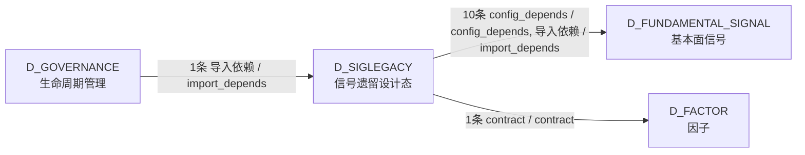

# 63_d_siglegacy / signal_legacy / 信号遗留设计态 / Signal Legacy (Design)

> **功能简介 / Overview**: 信号遗留设计态，负责旧版信号系统的设计态维护和迁移规划

> **文档作用 / Purpose**: 展示 信号遗留设计态（D_SIGLEGACY）功能域的模块清单、域内依赖关系、跨域依赖关系、架构分层视图，供架构审查和域治理参考。

> 本文档由 generate_domain_doc.py 从 depgraph (PostgreSQL) 自动生成
> 最后更新: 2026-07-17 03:24:23
> 数据源: depgraph (PostgreSQL) nodes表 + edges表

## 域基本信息 / Domain Overview

| 字段 | 值 | Field | Value |
|------|------|-------|-------|
| 编号 | 63 | Number | 63 |
| 域ID | D_SIGLEGACY | Domain ID | D_SIGLEGACY |
| 域名称 | 信号遗留设计态 | Domain Name | Signal Legacy (Design) |
| 层级 |  | Layer |  |
| 模块数 | 15 | Module Count | 15 |
| 域内依赖 | 0 | Internal Dependencies | 0 |
| 跨域入边 | 1 | Cross-domain Incoming | 1 |
| 跨域出边 | 11 | Cross-domain Outgoing | 11 |
| 设计态模块 | 0 | Design Modules | 0 |
| 原型态模块 | 15 | Prototype Modules | 15 |
| 生产态模块 | 0 | Production Modules | 0 |
| 容量 | 0/150 (正常) | Capacity | 0/150 (正常) |
| 描述 | 旧版信号管线（裁定#204改名D-SIGNAL→D_SIGLEGACY） | Description | 旧版信号管线（裁定#204改名D-SIGNAL→D_SIGLEGACY） |

## 模块分层清单 / Module Layered List

> 按 architecture_layer 分组的模块清单（共 15 个模块 / 15 modules）。

### L2 领域层 / Domain Layer (15 modules)

| # | 模块路径 / Module Path | 模块名称 / Module Name (功能简介 / Description) | 成熟度 / Maturity | 蓝图 / Blueprint |
|:--:|---------|---------|:---:|:---:|
| 1 | src/zephyr/signal_fundamental/__init__.py | D_SIGNAL Signal Domain | 原型态 / prototype | [MOD-L03-001](../../03_modules/_domain_signal/blueprint.md) |
| 2 | src/zephyr/signal_fundamental/_extensions/__init__.py | __init__.py | 原型态 / prototype |  |
| 3 | src/zephyr/signal_fundamental/api/__init__.py | __init__.py | 原型态 / prototype |  |
| 4 | src/zephyr/signal_fundamental/capital/__init__.py | Signal Capital Allocation sub-package | 原型态 / prototype | [MOD-L03-001](../../03_modules/_domain_signal/blueprint.md) |
| 5 | src/zephyr/signal_fundamental/combiner/__init__.py | __init__.py | 原型态 / prototype | [MOD-L03-001](../../03_modules/_domain_signal/blueprint.md) |
| 6 | src/zephyr/signal_fundamental/combiner/impl/__init__.py | D_SIGNAL — Signal Combiner Concrete Implementa... | 原型态 / prototype | [MOD-L03-001](../../03_modules/_domain_signal/blueprint.md) |
| 7 | src/zephyr/signal_fundamental/core/__init__.py | __init__.py | 原型态 / prototype |  |
| 8 | src/zephyr/signal_fundamental/gen/__init__.py | Signal Generation sub-package | 原型态 / prototype | [MOD-L03-001](../../03_modules/_domain_signal/blueprint.md) |
| 9 | src/zephyr/signal_fundamental/gen/implementations/__init_... | D_SIGNAL — Signal Generation Concrete Implemen... | 原型态 / prototype | [MOD-L03-001](../../03_modules/_domain_signal/blueprint.md) |
| 10 | src/zephyr/signal_fundamental/infrastructure/__init__.py | __init__.py | 原型态 / prototype |  |
| 11 | src/zephyr/signal_fundamental/models/__init__.py | __init__.py | 原型态 / prototype |  |
| 12 | src/zephyr/signal_fundamental/services/__init__.py | __init__.py | 原型态 / prototype |  |
| 13 | src/zephyr/signal_fundamental/strategy/__init__.py | Signal Strategy sub-package | 原型态 / prototype | [MOD-L03-001](../../03_modules/_domain_signal/blueprint.md) |
| 14 | src/zephyr/signal_fundamental/strategy/implementations/__... | Signal Strategy Concrete Implementations | 原型态 / prototype | [MOD-L03-001](../../03_modules/_domain_signal/blueprint.md) |
| 15 | src/zephyr/signal_fundamental/synth/__init__.py | Signal Synthesis sub-package | 原型态 / prototype | [MOD-L03-001](../../03_modules/_domain_signal/blueprint.md) |

## 域内依赖图 / Internal Dependency Diagram

> 依赖图内嵌在本文档中，IDE 可直接渲染显示。参考 decision_index.md 设计，分四个视图：合并全景图、运营态子图、设计态子图、原型态子图（按 design_maturity 实际值拆分）。
>
> **图例说明 / Legend**：
> - **实线边框 = 运营态模块**（production，已上线运行）
> - **虚线边框 = 设计态模块**（design，蓝图阶段，代码未写）
> - **虚线边框 = 原型态模块**（prototype，代码已写，验证中未稳定上线）
> - **实线箭头 = 运营态依赖**（已生效的依赖关系）
> - **虚线箭头 = 非运营态依赖**（计划中/验证中的依赖关系）

### 合并全景图（全部模块，标签标注成熟度）

> 展示全部 15 个模块（生产态 0 + 设计态 0 + 原型态 15），标签标注成熟度。

### 运营态子图（仅 design_maturity=production 的模块和依赖）

> 仅展示已上线运行的模块（共 0 个，0 条域内依赖）。

> （无运营态模块 / No production modules）

### 设计态子图（仅 design_maturity=design 的模块和依赖）

> 仅展示蓝图阶段、代码未写的设计态模块（共 0 个，0 条域内依赖）。

> （无设计态模块 / No design modules）

### 原型态子图（仅 design_maturity=prototype 的模块和依赖）

> 仅展示代码已写、验证中未稳定上线的原型态模块（共 15 个，0 条域内依赖）。

```mermaid
graph TD
    subgraph D_SIGLEGACY["D_SIGLEGACY 信号遗留设计态"]
        src_zephyr_signal_fundamental_init_py["(原型态 / prototype) D_SIGNAL Signal Domain<br/>文件: __init__.py"]
        src_zephyr_signal_fundamental_extensions_init_py["(原型态 / prototype) __init__.py"]
        src_zephyr_signal_fundamental_api_init_py["(原型态 / prototype) __init__.py"]
        src_zephyr_signal_fundamental_capital_init_py["(原型态 / prototype) Signal Capital Allocation sub-package<br/>文件: __init__.py"]
        src_zephyr_signal_fundamental_combiner_init_py["(原型态 / prototype) __init__.py"]
        src_zephyr_signal_fundamental_combiner_impl_init_py["(原型态 / prototype) D_SIGNAL — Signal Combiner Concrete Implementa...<br/>文件: __init__.py"]
        src_zephyr_signal_fundamental_core_init_py["(原型态 / prototype) __init__.py"]
        src_zephyr_signal_fundamental_gen_init_py["(原型态 / prototype) Signal Generation sub-package<br/>文件: __init__.py"]
        src_zephyr_signal_fundamental_gen_implementations_init_py["(原型态 / prototype) D_SIGNAL — Signal Generation Concrete Implemen...<br/>文件: __init__.py"]
        src_zephyr_signal_fundamental_infrastructure_init_py["(原型态 / prototype) __init__.py"]
        src_zephyr_signal_fundamental_models_init_py["(原型态 / prototype) __init__.py"]
        src_zephyr_signal_fundamental_services_init_py["(原型态 / prototype) __init__.py"]
        src_zephyr_signal_fundamental_strategy_init_py["(原型态 / prototype) Signal Strategy sub-package<br/>文件: __init__.py"]
        src_zephyr_signal_fundamental_strategy_implementations_init_py["(原型态 / prototype) Signal Strategy Concrete Implementations<br/>文件: __init__.py"]
        src_zephyr_signal_fundamental_synth_init_py["(原型态 / prototype) Signal Synthesis sub-package<br/>文件: __init__.py"]
    end
    D_FACTOR["(生产态 / production) D_FACTOR"]
    src_zephyr_signal_fundamental_init_py -.->|contract / contract| D_FACTOR
    D_FUNDAMENTAL_SIGNAL["(原型态 / prototype) D_FUNDAMENTAL_SIGNAL"]
    src_zephyr_signal_fundamental_combiner_impl_init_py -.->|导入依赖 / import_depends| D_FUNDAMENTAL_SIGNAL
    src_zephyr_signal_fundamental_combiner_impl_init_py -.->|导入依赖 / import_depends| D_FUNDAMENTAL_SIGNAL
    src_zephyr_signal_fundamental_gen_implementations_init_py -.->|导入依赖 / import_depends| D_FUNDAMENTAL_SIGNAL
    src_zephyr_signal_fundamental_strategy_init_py -.->|导入依赖 / import_depends| D_FUNDAMENTAL_SIGNAL
    src_zephyr_signal_fundamental_strategy_implementations_init_py -.->|导入依赖 / import_depends| D_FUNDAMENTAL_SIGNAL
    src_zephyr_signal_fundamental_synth_init_py -.->|导入依赖 / import_depends| D_FUNDAMENTAL_SIGNAL
    src_zephyr_signal_fundamental_gen_init_py -.->|config_depends / config_depends| D_FUNDAMENTAL_SIGNAL
    src_zephyr_signal_fundamental_capital_init_py -.->|导入依赖 / import_depends| D_FUNDAMENTAL_SIGNAL
    src_zephyr_signal_fundamental_capital_init_py -.->|导入依赖 / import_depends| D_FUNDAMENTAL_SIGNAL
    src_zephyr_signal_fundamental_capital_init_py -.->|导入依赖 / import_depends| D_FUNDAMENTAL_SIGNAL
    D_GOVERNANCE["(原型态 / prototype) D_GOVERNANCE"]
    D_GOVERNANCE -.->|导入依赖 / import_depends| src_zephyr_signal_fundamental_init_py
    classDef production fill:#e1f5fe,stroke:#01579b,stroke-width:2px,color:#000
    classDef design fill:#fff3e0,stroke:#e65100,stroke-width:2px,color:#000,stroke-dasharray: 5 5
    classDef external_prod fill:#e8f5e9,stroke:#1b5e20,stroke-width:1px,color:#000
    classDef external_design fill:#fce4ec,stroke:#880e4f,stroke-width:1px,color:#000,stroke-dasharray: 5 5
    class src_zephyr_signal_fundamental_init_py,src_zephyr_signal_fundamental_extensions_init_py,src_zephyr_signal_fundamental_api_init_py,src_zephyr_signal_fundamental_capital_init_py,src_zephyr_signal_fundamental_combiner_init_py,src_zephyr_signal_fundamental_combiner_impl_init_py,src_zephyr_signal_fundamental_core_init_py,src_zephyr_signal_fundamental_gen_init_py,src_zephyr_signal_fundamental_gen_implementations_init_py,src_zephyr_signal_fundamental_infrastructure_init_py,src_zephyr_signal_fundamental_models_init_py,src_zephyr_signal_fundamental_services_init_py,src_zephyr_signal_fundamental_strategy_init_py,src_zephyr_signal_fundamental_strategy_implementations_init_py,src_zephyr_signal_fundamental_synth_init_py design
    class D_FACTOR external_prod
    class D_FUNDAMENTAL_SIGNAL,D_GOVERNANCE external_design
```

## 跨域依赖 / Cross-domain Dependencies

### 本域依赖的其他域（出边）/ Depends On

| # | 本域模块 / Source Module | → | 外部域-目标模块 / Target Module | 依赖类型 / Type |
|:--:|---------|:--:|---------|---------|
| 1 | D_SIGNAL Signal Domain (__init__.py) | → | D_FACTOR 因子: bus_factor_defense.py | contract / contract |
| 2 | Signal Capital Allocation sub-package (__init__... | → | D_FUNDAMENTAL_SIGNAL 基本面信号: D_FUNDAMENTAL_SIGNAL — CapitalAllocationResult... | 导入依赖 / import_depends |
| 3 | Signal Capital Allocation sub-package (__init__... | → | D_FUNDAMENTAL_SIGNAL 基本面信号: D_SIGNAL — Capital Allocator（兼容 re-export s... | 导入依赖 / import_depends |
| 4 | Signal Capital Allocation sub-package (__init__... | → | D_FUNDAMENTAL_SIGNAL 基本面信号: D_SIGNAL — Default Capital Allocator（兼容 re-... | 导入依赖 / import_depends |
| 5 | D_SIGNAL — Signal Combiner Concrete Implementa... | → | D_FUNDAMENTAL_SIGNAL 基本面信号: default_signal_aggregator.py | 导入依赖 / import_depends |
| 6 | D_SIGNAL — Signal Combiner Concrete Implementa... | → | D_FUNDAMENTAL_SIGNAL 基本面信号: default_capital_allocator.py | 导入依赖 / import_depends |
| 7 | Signal Generation sub-package (__init__.py) | → | D_FUNDAMENTAL_SIGNAL 基本面信号: aggregator_base.py | config_depends / config_depends |
| 8 | D_SIGNAL — Signal Generation Concrete Implemen... | → | D_FUNDAMENTAL_SIGNAL 基本面信号: default_signal_aggregator.py | 导入依赖 / import_depends |
| 9 | Signal Strategy sub-package (__init__.py) | → | D_FUNDAMENTAL_SIGNAL 基本面信号: D_FUNDAMENTAL_SIGNAL — Capital Allocator（兼容... | 导入依赖 / import_depends |
| 10 | Signal Strategy Concrete Implementations (__ini... | → | D_FUNDAMENTAL_SIGNAL 基本面信号: default_capital_allocator.py | 导入依赖 / import_depends |
| 11 | Signal Synthesis sub-package (__init__.py) | → | D_FUNDAMENTAL_SIGNAL 基本面信号: signal_synthesizer.py | 导入依赖 / import_depends |

### 依赖本域的其他域（入边）/ Depended By

| # | 外部域-源模块 / Source Module | → | 本域模块 / Target Module | 依赖类型 / Type |
|:--:|---------|:--:|---------|---------|
| 1 | D_GOVERNANCE 生命周期管理: C-track 端到端演示 —— 全流水线一次性运行 (dem... | → | D_SIGNAL Signal Domain (__init__.py) | 导入依赖 / import_depends |

### 跨域依赖图 / Cross-domain Dependency Diagram

> 本域与 3 个外部域直接连接（出边 11 条 + 入边 1 条 = 12 条）。只显示直接连接的域，不展开具体节点。

## 说明 / Notes

- **数据源 / Data Source**: `depgraph (PostgreSQL)` 的 `nodes`、`edges`、`domains` 表
- **生成器 / Generator**: `generate_domain_doc.py`（G2+G10 合并）
- **维护方式 / Maintenance**: 自动生成，全景图更新时刷新
- **文件名规则 / File Naming**: `{编号:02d}_{域ID小写}.md`，如 `16_d_trading.md`
- **图例说明 / Legend**: `[production]`=已上线 / `[design]`=设计中 / `[prototype]`=原型 / `[unknown]`=未知
