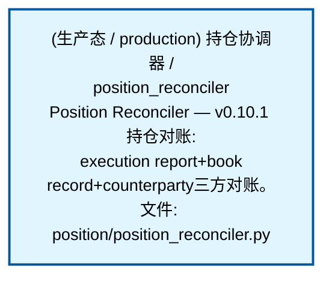
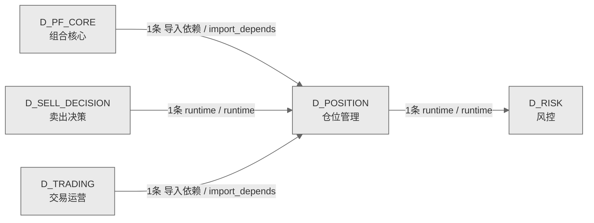

# 64_d_position / 仓位管理域 / Position Management

> **功能简介 / Overview**: 仓位管理，负责持仓跟踪、仓位计算和盈亏分析

> **文档作用 / Purpose**: 展示 仓位管理（D_POSITION）功能域的域内依赖关系、跨域依赖关系，模块信息（成熟度/中英文名/大白话/文件路径）内嵌于 Mermaid 节点，供架构审查和域治理参考。

> 本文档由 generate_domain_doc.py 从 depgraph (PostgreSQL) 自动生成
> 数据源: depgraph (PostgreSQL) nodes表 + edges表

> **[可缩放 HTML 版 / Zoomable HTML](http://localhost:8765/docs/02_enterprise_architecture/02_domain_architecture_docs/_zoomable_html/64_d_position.html)** — Ctrl+滚轮缩放 ｜ 双击重置 ｜ Ctrl+Shift+D 切换拖动/选择模式

## 域基本信息 / Domain Overview

| 字段 | 值 | Field | Value |
|------|------|-------|-------|
| 编号 | 64 | Number | 64 |
| 域ID | D_POSITION | Domain ID | D_POSITION |
| 域名称 | 仓位管理 | Domain Name | Position Management |
| 层级 | L2 业务域层 | Layer | L2 Domain |
| 模块数 | 11 | Module Count | 11 |
| 域内依赖 | 9 | Internal Dependencies | 9 |
| 跨域入边 | 3 | Cross-domain Incoming | 3 |
| 跨域出边 | 1 | Cross-domain Outgoing | 1 |
| 设计态模块 | 10 | Design Modules | 10 |
| 生产态模块 | 1 | Production Modules | 1 |
| 容量 | 1/150 (正常) | Capacity | 1/150 (正常) |
| 描述 | 仓位管理，负责持仓跟踪、仓位计算和盈亏分析 | Description | 仓位管理，负责持仓跟踪、仓位计算和盈亏分析 |

## 域内依赖图 / Internal Dependency Diagram

> 依赖图内嵌在本文档中，IDE 可直接渲染；网页版可 Ctrl+滚轮缩放 + 拖动平移查看细节。
>
> **图例说明 / Legend**：
> - 🟦 **蓝色 = 运营态模块**（production，已上线运行）
> - 🟧 **橙色虚线 = 设计态模块**（design，蓝图阶段，代码未写）
> - **实线箭头 = 运营态依赖**（已生效的依赖关系）
> - **虚线箭头 = 非运营态依赖**（计划中/验证中的依赖关系）

### 全景图（全部模块，颜色区分运营态/设计态）

> 展示全部 11 个模块（生产态 1 + 设计态 10），含跨域依赖外部节点。节点含成熟度+名称+大白话/简介+文件路径。

```mermaid
%%{init: {'theme': 'base', 'themeVariables': {'primaryColor': '#eaeaea', 'primaryTextColor': '#333333', 'primaryBorderColor': '#666666', 'lineColor': '#666666', 'secondaryColor': '#eaeaea', 'tertiaryColor': '#eaeaea', 'fontSize': '14px'}}}%%
flowchart TD
    src_zephyr_position_core_sell_position_link_py["(设计态 / design) 卖出持仓链接 / sell_<br/>position_link<br/>卖出持仓链接（sell_position_link.py）<br/>文件: core/sell_position_link.py<br/>⛔ 持仓管理域，设计已就绪，等待开发排期"]
    src_zephyr_position_position_reconciler_py["(生产态 / production) 持仓协调器 /<br/>position_reconciler<br/>Position Reconciler — v0.10.1 持仓对账:<br/>execution report+book<br/>record+counterparty三方对账。<br/>文件: position/position_reconciler.py"]
    src_zephyr_position_services_position_audit_logger_py["(设计态 / design) 持仓审计日志器 /<br/>position_audit_logger<br/>持仓审计日志器，持仓的日志器，记录运行日<br/>志。<br/>文件: services/position_audit_logger.py<br/>⛔ 持仓管理域，设计已就绪，等待开发排期"]
    src_zephyr_position_core_sell_position_link_py ~~~ src_zephyr_position_position_reconciler_py
    src_zephyr_position_position_reconciler_py ~~~ src_zephyr_position_services_position_audit_logger_py
    src_zephyr_position_core_rebalance_engine_py["(设计态 / design) rebalance引擎 /<br/>rebalance_engine<br/>rebalance引擎，持仓的引擎，执行核心逻辑<br/>的处理引擎。<br/>文件: core/rebalance_engine.py<br/>⛔ 持仓管理域，设计已就绪，等待开发排期"]
    src_zephyr_position_core_position_drift_monitor_py["(设计态 / design) 持仓漂移监控 /<br/>position_drift_monitor<br/>持仓漂移监控，持仓的监控器，持续监视某项<br/>指标，异常时上报。<br/>文件: core/position_drift_monitor.py<br/>⛔ 持仓管理域，设计已就绪，等待开发排期"]
    src_zephyr_position_core_position_state_machine_py["(设计态 / design) 持仓状态machine /<br/>position_state_machine<br/>持仓状态machine，持仓的状态机，管理状态<br/>流转。<br/>文件: core/position_state_machine.py<br/>⛔ 持仓管理域，设计已就绪，等待开发排期"]
    src_zephyr_position_core_position_sizing_engine_py["(设计态 / design) 持仓sizing引擎 /<br/>position_sizing_engine<br/>持仓sizing引擎，持仓的引擎，执行核心逻辑<br/>的处理引擎。<br/>文件: core/position_sizing_engine.py<br/>⛔ 持仓管理域，设计已就绪，等待开发排期"]
    src_zephyr_position_core_calendar_position_constraint_py["(设计态 / design) 日历持仓约束 /<br/>calendar_position_constraint<br/>calendar持仓constraint，持仓的常量，定义<br/>模块级常量。<br/>文件: core/calendar_position_<br/>constraint.py<br/>⛔ 持仓管理域，设计已就绪，等待开发排期"]
    src_zephyr_position_core_capital_curve_manager_py["(设计态 / design) 资本curve管理器 /<br/>capital_curve_manager<br/>资本curve管理器，持仓的管理器，统一管理<br/>一类资源的生命周期。<br/>文件: core/capital_curve_manager.py<br/>⛔ 持仓管理域，设计已就绪，等待开发排期"]
    src_zephyr_position_services_cash_manager_py["(设计态 / design) cash管理器 / cash_<br/>manager<br/>cash管理器，持仓的管理器，统一管理一类资<br/>源的生命周期。<br/>文件: services/cash_manager.py<br/>⛔ 持仓管理域，设计已就绪，等待开发排期"]
    src_zephyr_position_core_calendar_position_constraint_py ~~~ src_zephyr_position_core_capital_curve_manager_py
    src_zephyr_position_core_capital_curve_manager_py ~~~ src_zephyr_position_services_cash_manager_py
    src_zephyr_position_core_drawdown_controller_py["(设计态 / design) 回撤控制器 / drawdown_<br/>controller<br/>回撤控制器，持仓的控制器，协调各组件按流<br/>程执行。<br/>文件: core/drawdown_controller.py<br/>⛔ 持仓管理域，设计已就绪，等待开发排期"]
    src_zephyr_position_core_position_sizing_engine_py -.->|runtime / runtime| src_zephyr_position_services_cash_manager_py
    src_zephyr_position_core_position_sizing_engine_py -.->|runtime / runtime| src_zephyr_position_core_capital_curve_manager_py
    src_zephyr_position_core_position_sizing_engine_py -.->|runtime / runtime| src_zephyr_position_core_calendar_position_constraint_py
    src_zephyr_position_core_position_state_machine_py -.->|runtime / runtime| src_zephyr_position_core_position_sizing_engine_py
    src_zephyr_position_core_position_drift_monitor_py -.->|runtime / runtime| src_zephyr_position_core_position_state_machine_py
    src_zephyr_position_core_rebalance_engine_py -.->|event / event| src_zephyr_position_core_position_drift_monitor_py
    src_zephyr_position_core_capital_curve_manager_py -.->|runtime / runtime| src_zephyr_position_core_drawdown_controller_py
    src_zephyr_position_services_position_audit_logger_py -.->|event / event| src_zephyr_position_core_position_sizing_engine_py
    src_zephyr_position_services_position_audit_logger_py -.->|event / event| src_zephyr_position_core_rebalance_engine_py
    D_RISK["(设计态 / design) 风控 / Risk Control<br/>风控，负责风险指标计算、风险限额管理和风<br/>险预警<br/>跨域节点 / cross-domain"]
    src_zephyr_position_core_position_sizing_engine_py -.->|runtime / runtime| D_RISK
    D_TRADING["(设计态 / design) 交易运营 / Trading<br/>Operations<br/>交易运营，负责交易生命周期管理、订单状态<br/>和成交处理<br/>跨域节点 / cross-domain"]
    D_TRADING -.->|导入依赖 / import_depends| src_zephyr_position_position_reconciler_py
    D_PF_CORE["(设计态 / design) 组合核心 / Portfolio<br/>Core<br/>组合核心，负责投资组合构建、持仓管理和组<br/>合优化<br/>跨域节点 / cross-domain"]
    D_PF_CORE -.->|导入依赖 / import_depends| src_zephyr_position_position_reconciler_py
    D_SELL_DECISION["(设计态 / design) 卖出决策 / Sell<br/>Decision<br/>卖出决策，负责卖出信号生成、卖出时机判断<br/>和退出策略<br/>跨域节点 / cross-domain"]
    D_SELL_DECISION -.->|runtime / runtime| src_zephyr_position_core_sell_position_link_py
    classDef production fill:#e1f5fe,stroke:#01579b,stroke-width:2px,color:#000
    classDef design fill:#fff3e0,stroke:#e65100,stroke-width:2px,color:#000,stroke-dasharray: 5 5
    classDef external_prod fill:#e8f4fd,stroke:#0277bd,stroke-width:1px,color:#000
    classDef external_design fill:#fff8e7,stroke:#ef6c00,stroke-width:1px,color:#000,stroke-dasharray: 5 5
    class src_zephyr_position_position_reconciler_py production
    class src_zephyr_position_core_calendar_position_constraint_py,src_zephyr_position_core_capital_curve_manager_py,src_zephyr_position_core_drawdown_controller_py,src_zephyr_position_core_position_drift_monitor_py,src_zephyr_position_core_position_sizing_engine_py,src_zephyr_position_core_position_state_machine_py,src_zephyr_position_core_rebalance_engine_py,src_zephyr_position_core_sell_position_link_py,src_zephyr_position_services_cash_manager_py,src_zephyr_position_services_position_audit_logger_py design
    class D_RISK,D_TRADING,D_PF_CORE,D_SELL_DECISION external_design
```

### 运营态的图（仅 design_maturity=production 的模块和域内依赖）

> 仅展示已上线运行的模块（共 1 个），不含跨域外部节点。跨域依赖见下方跨域依赖章节。

### 设计态的图（仅 design_maturity=design 的模块和域内依赖）

> 仅展示蓝图阶段、代码未写的设计态模块（共 10 个），不含跨域外部节点。

```mermaid
%%{init: {'theme': 'base', 'themeVariables': {'primaryColor': '#eaeaea', 'primaryTextColor': '#333333', 'primaryBorderColor': '#666666', 'lineColor': '#666666', 'secondaryColor': '#eaeaea', 'tertiaryColor': '#eaeaea', 'fontSize': '14px'}}}%%
flowchart TD
    src_zephyr_position_core_sell_position_link_py["(设计态 / design) 卖出持仓链接 / sell_<br/>position_link<br/>卖出持仓链接（sell_position_link.py）<br/>文件: core/sell_position_link.py<br/>⛔ 持仓管理域，设计已就绪，等待开发排期"]
    src_zephyr_position_services_position_audit_logger_py["(设计态 / design) 持仓审计日志器 /<br/>position_audit_logger<br/>持仓审计日志器，持仓的日志器，记录运行日<br/>志。<br/>文件: services/position_audit_logger.py<br/>⛔ 持仓管理域，设计已就绪，等待开发排期"]
    src_zephyr_position_core_sell_position_link_py ~~~ src_zephyr_position_services_position_audit_logger_py
    src_zephyr_position_core_rebalance_engine_py["(设计态 / design) rebalance引擎 /<br/>rebalance_engine<br/>rebalance引擎，持仓的引擎，执行核心逻辑<br/>的处理引擎。<br/>文件: core/rebalance_engine.py<br/>⛔ 持仓管理域，设计已就绪，等待开发排期"]
    src_zephyr_position_core_position_drift_monitor_py["(设计态 / design) 持仓漂移监控 /<br/>position_drift_monitor<br/>持仓漂移监控，持仓的监控器，持续监视某项<br/>指标，异常时上报。<br/>文件: core/position_drift_monitor.py<br/>⛔ 持仓管理域，设计已就绪，等待开发排期"]
    src_zephyr_position_core_position_state_machine_py["(设计态 / design) 持仓状态machine /<br/>position_state_machine<br/>持仓状态machine，持仓的状态机，管理状态<br/>流转。<br/>文件: core/position_state_machine.py<br/>⛔ 持仓管理域，设计已就绪，等待开发排期"]
    src_zephyr_position_core_position_sizing_engine_py["(设计态 / design) 持仓sizing引擎 /<br/>position_sizing_engine<br/>持仓sizing引擎，持仓的引擎，执行核心逻辑<br/>的处理引擎。<br/>文件: core/position_sizing_engine.py<br/>⛔ 持仓管理域，设计已就绪，等待开发排期"]
    src_zephyr_position_core_calendar_position_constraint_py["(设计态 / design) 日历持仓约束 /<br/>calendar_position_constraint<br/>calendar持仓constraint，持仓的常量，定义<br/>模块级常量。<br/>文件: core/calendar_position_<br/>constraint.py<br/>⛔ 持仓管理域，设计已就绪，等待开发排期"]
    src_zephyr_position_core_capital_curve_manager_py["(设计态 / design) 资本curve管理器 /<br/>capital_curve_manager<br/>资本curve管理器，持仓的管理器，统一管理<br/>一类资源的生命周期。<br/>文件: core/capital_curve_manager.py<br/>⛔ 持仓管理域，设计已就绪，等待开发排期"]
    src_zephyr_position_services_cash_manager_py["(设计态 / design) cash管理器 / cash_<br/>manager<br/>cash管理器，持仓的管理器，统一管理一类资<br/>源的生命周期。<br/>文件: services/cash_manager.py<br/>⛔ 持仓管理域，设计已就绪，等待开发排期"]
    src_zephyr_position_core_calendar_position_constraint_py ~~~ src_zephyr_position_core_capital_curve_manager_py
    src_zephyr_position_core_capital_curve_manager_py ~~~ src_zephyr_position_services_cash_manager_py
    src_zephyr_position_core_drawdown_controller_py["(设计态 / design) 回撤控制器 / drawdown_<br/>controller<br/>回撤控制器，持仓的控制器，协调各组件按流<br/>程执行。<br/>文件: core/drawdown_controller.py<br/>⛔ 持仓管理域，设计已就绪，等待开发排期"]
    src_zephyr_position_core_position_sizing_engine_py -.->|runtime / runtime| src_zephyr_position_services_cash_manager_py
    src_zephyr_position_core_position_sizing_engine_py -.->|runtime / runtime| src_zephyr_position_core_capital_curve_manager_py
    src_zephyr_position_core_position_sizing_engine_py -.->|runtime / runtime| src_zephyr_position_core_calendar_position_constraint_py
    src_zephyr_position_core_position_state_machine_py -.->|runtime / runtime| src_zephyr_position_core_position_sizing_engine_py
    src_zephyr_position_core_position_drift_monitor_py -.->|runtime / runtime| src_zephyr_position_core_position_state_machine_py
    src_zephyr_position_core_rebalance_engine_py -.->|event / event| src_zephyr_position_core_position_drift_monitor_py
    src_zephyr_position_core_capital_curve_manager_py -.->|runtime / runtime| src_zephyr_position_core_drawdown_controller_py
    src_zephyr_position_services_position_audit_logger_py -.->|event / event| src_zephyr_position_core_position_sizing_engine_py
    src_zephyr_position_services_position_audit_logger_py -.->|event / event| src_zephyr_position_core_rebalance_engine_py
    classDef production fill:#e1f5fe,stroke:#01579b,stroke-width:2px,color:#000
    classDef design fill:#fff3e0,stroke:#e65100,stroke-width:2px,color:#000,stroke-dasharray: 5 5
    classDef external_prod fill:#e8f4fd,stroke:#0277bd,stroke-width:1px,color:#000
    classDef external_design fill:#fff8e7,stroke:#ef6c00,stroke-width:1px,color:#000,stroke-dasharray: 5 5
    class src_zephyr_position_core_calendar_position_constraint_py,src_zephyr_position_core_capital_curve_manager_py,src_zephyr_position_core_drawdown_controller_py,src_zephyr_position_core_position_drift_monitor_py,src_zephyr_position_core_position_sizing_engine_py,src_zephyr_position_core_position_state_machine_py,src_zephyr_position_core_rebalance_engine_py,src_zephyr_position_core_sell_position_link_py,src_zephyr_position_services_cash_manager_py,src_zephyr_position_services_position_audit_logger_py design
```

## 跨域依赖 / Cross-domain Dependencies

### 本域依赖的其他域（出边）/ Depends On

| # | 本域模块 / Source Module | → | 外部域-目标模块 / Target Module | 依赖类型 / Type |
|:--:|---------|:--:|---------|---------|
| 1 | 持仓sizing引擎 / position_sizing_engine (core/position_si... | → | D_RISK 风控: 回撤追踪器 (drawdown_tracker/) | runtime / runtime |

### 依赖本域的其他域（入边）/ Depended By

| # | 外部域-源模块 / Source Module | → | 本域模块 / Target Module | 依赖类型 / Type |
|:--:|---------|:--:|---------|---------|
| 1 | D_PF_CORE 组合核心: 组合聚合 (portfolio_aggregate/) | → | 持仓协调器 / position_reconciler (position/position_recon... | 导入依赖 / import_depends |
| 2 | D_SELL_DECISION 卖出决策: 卖信号融合引擎 / sell_signal_fusion_engine (core/sell_sig... | → | 卖出持仓链接 / sell_position_link (core/sell_position_lin... | runtime / runtime |
| 3 | D_TRADING 交易运营: 盈亏计算器 (pnl_calculator/) | → | 持仓协调器 / position_reconciler (position/position_recon... | 导入依赖 / import_depends |

### 跨域依赖图 / Cross-domain Dependency Diagram

> 本域与 4 个外部域直接连接（出边 1 条 + 入边 3 条 = 4 条）。只显示直接连接的域，不展开具体节点。

## 说明 / Notes

- **数据源 / Data Source**: `depgraph (PostgreSQL)` 的 `nodes`、`edges`、`domains` 表
- **生成器 / Generator**: `generate_domain_doc.py`（G2+G10 合并）
- **维护方式 / Maintenance**: 自动生成，全景图更新时刷新
- **文件名规则 / File Naming**: `{编号:02d}_{域ID小写}.md`，如 `16_d_trading.md`
- **图例说明 / Legend**: `[production]`=已上线 / `[design]`=设计中 / `[unknown]`=未知
