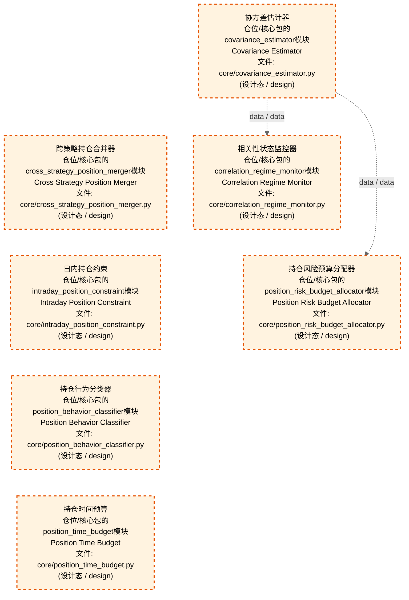
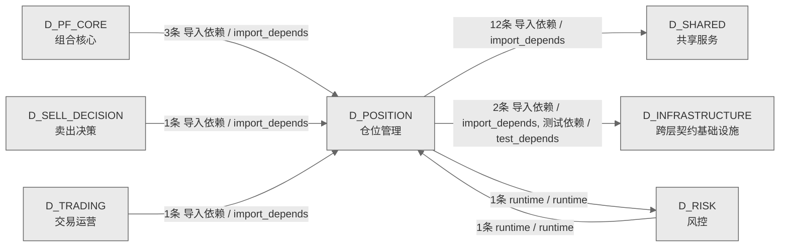

# 64_d_position / 仓位管理域 / Position Management

> **功能简介 / Overview**: 仓位管理，负责持仓跟踪、仓位计算和盈亏分析

> **文档作用 / Purpose**: 展示 仓位管理（D_POSITION）功能域的域内依赖关系、跨域依赖关系，模块信息（成熟度/中英文名/大白话/文件路径）内嵌于 Mermaid 节点，供架构审查和域治理参考。

> 本文档由 generate_domain_doc.py 从 depgraph (PostgreSQL) 自动生成
> 数据源: depgraph (PostgreSQL) nodes表 + edges表

> **[可缩放 HTML 版 / Zoomable HTML](http://localhost:8765/docs/02_enterprise_architecture/02_domain_architecture_docs/_zoomable_html/64_d_position.html)** — Ctrl+滚轮缩放 ｜ 双击重置 ｜ Ctrl+Shift+D 切换拖动/选择模式

## 域基本信息 / Domain Overview

| 字段 | 值 | Field | Value |
|------|------|-------|-------|
| 编号 | 64 | Number | 64 |
| 域ID | D_POSITION | Domain ID | D_POSITION |
| 域名称 | 仓位管理 | Domain Name | Position Management |
| 层级 | L2 业务域层 | Layer | L2 Domain |
| 模块数 | 22 | Module Count | 22 |
| 域内依赖 | 26 | Internal Dependencies | 26 |
| 跨域入边 | 6 | Cross-domain Incoming | 6 |
| 跨域出边 | 15 | Cross-domain Outgoing | 15 |
| 设计态模块 | 7 | Design Modules | 7 |
| 生产态模块 | 15 | Production Modules | 15 |
| 容量 | 15/150 (正常) | Capacity | 15/150 (正常) |
| 描述 | 仓位管理，负责持仓跟踪、仓位计算和盈亏分析 | Description | 仓位管理，负责持仓跟踪、仓位计算和盈亏分析 |

## 域内依赖图 / Internal Dependency Diagram

> 依赖图内嵌在本文档中，IDE 可直接渲染；网页版可 Ctrl+滚轮缩放 + 拖动平移查看细节。
>
> **图例说明 / Legend**：
> - 🟦 **蓝色 = 运营态模块**（production，已上线运行）
> - 🟧 **橙色虚线 = 设计态模块**（design，蓝图阶段，代码未写）
> - **实线箭头 = 运营态依赖**（已生效的依赖关系）
> - **虚线箭头 = 非运营态依赖**（计划中/验证中的依赖关系）

### 全景图（全部模块，颜色区分运营态/设计态）

> 展示全部 22 个模块（生产态 15 + 设计态 7），含跨域依赖外部节点。节点含成熟度+名称+大白话/简介+文件路径。

```mermaid
%%{init: {'theme': 'base', 'themeVariables': {'primaryColor': '#eaeaea', 'primaryTextColor': '#333333', 'primaryBorderColor': '#666666', 'lineColor': '#666666', 'secondaryColor': '#eaeaea', 'tertiaryColor': '#eaeaea', 'fontSize': '14px'}}}%%
flowchart TD
    src_zephyr_position_core_covariance_estimator_py["协方差估计器<br/>仓位/核心包的covariance_estimator模块<br/>Covariance Estimator<br/>文件: core/covariance_estimator.py<br/>(设计态 / design)"]
    src_zephyr_position_core_cross_strategy_position_merger_py["跨策略持仓合并器<br/>仓位/核心包的cross_strategy_position_merger模块<br/>Cross Strategy Position Merger<br/>文件: core/cross_strategy_position_merger.py<br/>(设计态 / design)"]
    src_zephyr_position_core_intraday_position_constraint_py["日内持仓约束<br/>仓位/核心包的intraday_position_constraint模块<br/>Intraday Position Constraint<br/>文件: core/intraday_position_constraint.py<br/>(设计态 / design)"]
    src_zephyr_position_core_position_behavior_classifier_py["持仓行为分类器<br/>仓位/核心包的position_behavior_classifier模块<br/>Position Behavior Classifier<br/>文件: core/position_behavior_classifier.py<br/>(设计态 / design)"]
    src_zephyr_position_core_position_time_budget_py["持仓时间预算<br/>仓位/核心包的position_time_budget模块<br/>Position Time Budget<br/>文件: core/position_time_budget.py<br/>(设计态 / design)"]
    src_zephyr_position_core_sell_position_link_py["仓位盈亏状态<br/>Sell-Position Bidirectional Link —<br/>卖出-仓位双向链接 (MOD-POS-016)<br/>Sell Position Link<br/>文件: core/sell_position_link.py<br/>(生产态 / production)"]
    src_zephyr_position_position_reconciler_py["—事件驱动<br/>Position Reconciler — v0.10.1 持仓对账:<br/>execution report+book record+counter...<br/>文件: position/position_reconciler.py<br/>(生产态 / production)"]
    src_zephyr_position_services_init_py["position/services 包入口<br/>管理position.services子包的加载和懒导入<br/>Init<br/>文件: services/__init__.py<br/>(生产态 / production)"]
    tests_position_test_position_audit_logger_py["持仓审计日志器测试<br/>Position Audit Logger 测试 — MOD-POS-009<br/>Test Position Audit Logger<br/>文件: position/test_position_audit_logger.py<br/>(生产态 / production)"]
    tests_position_test_position_sizing_engine_py["Position Sizing Engine 测试<br/>(MOD-POS-001 阶段1)<br/>Test Position Sizing Engine<br/>文件: position/test_position_sizing_engine.py<br/>(生产态 / production)"]
    src_zephyr_position_core_covariance_estimator_py ~~~ src_zephyr_position_core_cross_strategy_position_merger_py
    src_zephyr_position_core_cross_strategy_position_merger_py ~~~ src_zephyr_position_core_intraday_position_constraint_py
    src_zephyr_position_core_intraday_position_constraint_py ~~~ src_zephyr_position_core_position_behavior_classifier_py
    src_zephyr_position_core_position_behavior_classifier_py ~~~ src_zephyr_position_core_position_time_budget_py
    src_zephyr_position_core_position_time_budget_py ~~~ src_zephyr_position_core_sell_position_link_py
    src_zephyr_position_core_sell_position_link_py ~~~ src_zephyr_position_position_reconciler_py
    src_zephyr_position_position_reconciler_py ~~~ src_zephyr_position_services_init_py
    src_zephyr_position_services_init_py ~~~ tests_position_test_position_audit_logger_py
    tests_position_test_position_audit_logger_py ~~~ tests_position_test_position_sizing_engine_py
    src_zephyr_position_core_correlation_regime_monitor_py["相关性状态监控器<br/>仓位/核心包的correlation_regime_monitor模块<br/>Correlation Regime Monitor<br/>文件: core/correlation_regime_monitor.py<br/>(设计态 / design)"]
    src_zephyr_position_core_position_limit_enforcer_py["持仓动作<br/>Position Limit Enforcer — 限仓执行器<br/>(MOD-POS-010)<br/>文件: core/position_limit_enforcer.py<br/>(生产态 / production)"]
    src_zephyr_position_core_position_risk_budget_allocator_py["持仓风险预算分配器<br/>仓位/核心包的position_risk_budget_allocator模块<br/>Position Risk Budget Allocator<br/>文件: core/position_risk_budget_allocator.py<br/>(设计态 / design)"]
    src_zephyr_position_services_position_audit_logger_py["仓位审计记录器<br/>Position Audit Logger — 仓位审计记录器<br/>(MOD-POS-009)<br/>文件: services/position_audit_logger.py<br/>(生产态 / production)"]
    src_zephyr_position_core_correlation_regime_monitor_py ~~~ src_zephyr_position_core_position_limit_enforcer_py
    src_zephyr_position_core_position_limit_enforcer_py ~~~ src_zephyr_position_core_position_risk_budget_allocator_py
    src_zephyr_position_core_position_risk_budget_allocator_py ~~~ src_zephyr_position_services_position_audit_logger_py
    src_zephyr_position_core_rebalance_engine_py["再平衡触发类型<br/>Rebalance Engine — 再平衡引擎 (MOD-POS-004)<br/>文件: core/rebalance_engine.py<br/>(生产态 / production)"]
    src_zephyr_position_core_position_drift_monitor_py["漂移检测范围<br/>Position Drift Monitor — 仓位漂移监控器<br/>(MOD-POS-003)<br/>文件: core/position_drift_monitor.py<br/>(生产态 / production)"]
    src_zephyr_position_core_position_state_machine_py["仓位生命周期状态<br/>Position State Machine — 仓位状态机<br/>(MOD-POS-002)<br/>文件: core/position_state_machine.py<br/>(生产态 / production)"]
    src_zephyr_position_core_position_sizing_engine_py["仓位决策市场状态 ①~⑫<br/>Position Sizing Engine — 仓位决策引擎<br/>(MOD-POS-001)<br/>文件: core/position_sizing_engine.py<br/>(生产态 / production)"]
    src_zephyr_position_core_calendar_position_constraint_py["A股风险日历事件类型<br/>Calendar Position Constraint — 日历仓位约束<br/>(MOD-POS-017)<br/>文件: core/calendar_position_constraint.py<br/>(生产态 / production)"]
    src_zephyr_position_core_capital_curve_manager_py["回撤分级<br/>Capital Curve Manager — 资金曲线管理器<br/>(MOD-POS-007)<br/>文件: core/capital_curve_manager.py<br/>(生产态 / production)"]
    src_zephyr_position_core_cash_manager_py["资金流水类型<br/>Cash Manager — 资金管理器 (MOD-POS-006)<br/>文件: core/cash_manager.py<br/>(生产态 / production)"]
    src_zephyr_position_core_calendar_position_constraint_py ~~~ src_zephyr_position_core_capital_curve_manager_py
    src_zephyr_position_core_capital_curve_manager_py ~~~ src_zephyr_position_core_cash_manager_py
    src_zephyr_position_core_drawdown_controller_py["系统性风险 5 级<br/>Drawdown Controller — 回撤控制器 (MOD-POS-008)<br/>文件: core/drawdown_controller.py<br/>(生产态 / production)"]
    src_zephyr_position_core_cross_strategy_position_merger_py -.->|data / data| src_zephyr_position_core_position_sizing_engine_py
    src_zephyr_position_core_covariance_estimator_py -.->|data / data| src_zephyr_position_core_correlation_regime_monitor_py
    src_zephyr_position_core_covariance_estimator_py -.->|data / data| src_zephyr_position_core_position_risk_budget_allocator_py
    src_zephyr_position_core_correlation_regime_monitor_py -.->|data / data| src_zephyr_position_core_position_sizing_engine_py
    src_zephyr_position_core_position_risk_budget_allocator_py -.->|data / data| src_zephyr_position_core_position_sizing_engine_py
    src_zephyr_position_core_intraday_position_constraint_py -.->|data / data| src_zephyr_position_core_position_limit_enforcer_py
    src_zephyr_position_core_position_behavior_classifier_py -.->|data / data| src_zephyr_position_core_position_sizing_engine_py
    src_zephyr_position_core_capital_curve_manager_py -->|runtime / runtime| src_zephyr_position_core_drawdown_controller_py
    src_zephyr_position_core_position_drift_monitor_py -->|runtime / runtime| src_zephyr_position_core_position_state_machine_py
    src_zephyr_position_core_rebalance_engine_py -->|event / event| src_zephyr_position_core_position_drift_monitor_py
    src_zephyr_position_core_rebalance_engine_py -->|导入依赖 / import_depends| src_zephyr_position_core_position_drift_monitor_py
    src_zephyr_position_core_position_sizing_engine_py -->|runtime / runtime| src_zephyr_position_core_calendar_position_constraint_py
    src_zephyr_position_core_position_sizing_engine_py -->|runtime / runtime| src_zephyr_position_core_capital_curve_manager_py
    src_zephyr_position_core_position_sizing_engine_py -->|runtime / runtime| src_zephyr_position_core_cash_manager_py
    src_zephyr_position_core_position_state_machine_py -->|runtime / runtime| src_zephyr_position_core_position_sizing_engine_py
    src_zephyr_position_services_init_py -->|导入依赖 / import_depends| src_zephyr_position_services_position_audit_logger_py
    src_zephyr_position_services_position_audit_logger_py -->|导入依赖 / import_depends| src_zephyr_position_core_position_drift_monitor_py
    src_zephyr_position_services_position_audit_logger_py -->|导入依赖 / import_depends| src_zephyr_position_core_rebalance_engine_py
    src_zephyr_position_services_position_audit_logger_py -->|导入依赖 / import_depends| src_zephyr_position_core_position_sizing_engine_py
    src_zephyr_position_services_position_audit_logger_py -->|导入依赖 / import_depends| src_zephyr_position_core_position_state_machine_py
    tests_position_test_position_audit_logger_py -->|测试依赖 / test_depends| src_zephyr_position_core_position_drift_monitor_py
    tests_position_test_position_audit_logger_py -->|测试依赖 / test_depends| src_zephyr_position_core_rebalance_engine_py
    tests_position_test_position_audit_logger_py -->|测试依赖 / test_depends| src_zephyr_position_core_position_sizing_engine_py
    tests_position_test_position_audit_logger_py -->|测试依赖 / test_depends| src_zephyr_position_core_position_state_machine_py
    tests_position_test_position_audit_logger_py -->|测试依赖 / test_depends| src_zephyr_position_services_position_audit_logger_py
    tests_position_test_position_sizing_engine_py -->|测试依赖 / test_depends| src_zephyr_position_core_position_sizing_engine_py
    D_RISK["风控<br/>风控，负责风险指标计算、风险限额管理和风险预警<br/>Risk Control<br/>跨域节点 / cross-domain<br/>(生产态 / production)"]
    src_zephyr_position_core_position_sizing_engine_py -->|runtime / runtime| D_RISK
    D_SHARED["共享服务<br/>共享服务，负责跨域共享的工具、协议和基础服务<br/>Shared Services<br/>跨域节点 / cross-domain<br/>(生产态 / production)"]
    src_zephyr_position_core_drawdown_controller_py -->|导入依赖 / import_depends| D_SHARED
    src_zephyr_position_core_position_sizing_engine_py -->|导入依赖 / import_depends| D_SHARED
    src_zephyr_position_core_calendar_position_constraint_py -->|导入依赖 / import_depends| D_SHARED
    src_zephyr_position_core_cash_manager_py -->|导入依赖 / import_depends| D_SHARED
    src_zephyr_position_core_capital_curve_manager_py -->|导入依赖 / import_depends| D_SHARED
    D_INFRASTRUCTURE["跨层契约基础设施<br/>跨层契约基础设施，负责跨层契约定义、共享契约管理<br/>和契约校验<br/>Cross-Layer Contract Infrastructure<br/>跨域节点 / cross-domain<br/>(生产态 / production)"]
    tests_position_test_position_sizing_engine_py -->|测试依赖 / test_depends| D_INFRASTRUCTURE
    src_zephyr_position_services_position_audit_logger_py -->|导入依赖 / import_depends| D_SHARED
    src_zephyr_position_core_position_sizing_engine_py -->|导入依赖 / import_depends| D_INFRASTRUCTURE
    src_zephyr_position_core_position_state_machine_py -->|导入依赖 / import_depends| D_SHARED
    src_zephyr_position_core_position_limit_enforcer_py -->|导入依赖 / import_depends| D_SHARED
    src_zephyr_position_core_position_drift_monitor_py -->|导入依赖 / import_depends| D_SHARED
    src_zephyr_position_core_rebalance_engine_py -->|导入依赖 / import_depends| D_SHARED
    src_zephyr_position_core_sell_position_link_py -->|导入依赖 / import_depends| D_SHARED
    src_zephyr_position_core_position_state_machine_py -->|导入依赖 / import_depends| D_SHARED
    D_SELL_DECISION["卖出决策<br/>卖出决策，负责卖出信号生成、卖出时机判断和退出策<br/>略<br/>Sell Decision<br/>跨域节点 / cross-domain<br/>(设计态 / design)"]
    D_SELL_DECISION -.->|导入依赖 / import_depends| src_zephyr_position_core_position_sizing_engine_py
    D_RISK -->|runtime / runtime| src_zephyr_position_core_drawdown_controller_py
    D_TRADING["交易运营<br/>交易运营，负责交易生命周期管理、订单状态和成交处<br/>理<br/>Trading Operations<br/>跨域节点 / cross-domain<br/>(生产态 / production)"]
    D_TRADING -->|导入依赖 / import_depends| src_zephyr_position_position_reconciler_py
    D_PF_CORE["组合核心<br/>组合核心，负责投资组合构建、持仓管理和组合优化<br/>Portfolio Core<br/>跨域节点 / cross-domain<br/>(生产态 / production)"]
    D_PF_CORE -->|导入依赖 / import_depends| src_zephyr_position_position_reconciler_py
    D_PF_CORE -->|导入依赖 / import_depends| src_zephyr_position_core_position_drift_monitor_py
    D_PF_CORE -->|导入依赖 / import_depends| src_zephyr_position_core_rebalance_engine_py
    classDef production fill:#e1f5fe,stroke:#01579b,stroke-width:2px,color:#000
    classDef design fill:#fff3e0,stroke:#e65100,stroke-width:2px,color:#000,stroke-dasharray: 5 5
    classDef external_prod fill:#e8f4fd,stroke:#0277bd,stroke-width:1px,color:#000
    classDef external_design fill:#fff8e7,stroke:#ef6c00,stroke-width:1px,color:#000,stroke-dasharray: 5 5
    class src_zephyr_position_core_calendar_position_constraint_py,src_zephyr_position_core_capital_curve_manager_py,src_zephyr_position_core_cash_manager_py,src_zephyr_position_core_drawdown_controller_py,src_zephyr_position_core_position_drift_monitor_py,src_zephyr_position_core_position_limit_enforcer_py,src_zephyr_position_core_position_sizing_engine_py,src_zephyr_position_core_position_state_machine_py,src_zephyr_position_core_rebalance_engine_py,src_zephyr_position_core_sell_position_link_py,src_zephyr_position_position_reconciler_py,src_zephyr_position_services_init_py,src_zephyr_position_services_position_audit_logger_py,tests_position_test_position_audit_logger_py,tests_position_test_position_sizing_engine_py production
    class src_zephyr_position_core_correlation_regime_monitor_py,src_zephyr_position_core_covariance_estimator_py,src_zephyr_position_core_cross_strategy_position_merger_py,src_zephyr_position_core_intraday_position_constraint_py,src_zephyr_position_core_position_behavior_classifier_py,src_zephyr_position_core_position_risk_budget_allocator_py,src_zephyr_position_core_position_time_budget_py design
    class D_RISK,D_SHARED,D_INFRASTRUCTURE,D_TRADING,D_PF_CORE external_prod
    class D_SELL_DECISION external_design
```

### 运营态的图（仅 design_maturity=production 的模块和域内依赖）

> 仅展示已上线运行的模块（共 15 个），不含跨域外部节点。跨域依赖见下方跨域依赖章节。

```mermaid
%%{init: {'theme': 'base', 'themeVariables': {'primaryColor': '#eaeaea', 'primaryTextColor': '#333333', 'primaryBorderColor': '#666666', 'lineColor': '#666666', 'secondaryColor': '#eaeaea', 'tertiaryColor': '#eaeaea', 'fontSize': '14px'}}}%%
flowchart TD
    src_zephyr_position_core_position_limit_enforcer_py["持仓动作<br/>Position Limit Enforcer — 限仓执行器<br/>(MOD-POS-010)<br/>文件: core/position_limit_enforcer.py<br/>(生产态 / production)"]
    src_zephyr_position_core_sell_position_link_py["仓位盈亏状态<br/>Sell-Position Bidirectional Link —<br/>卖出-仓位双向链接 (MOD-POS-016)<br/>Sell Position Link<br/>文件: core/sell_position_link.py<br/>(生产态 / production)"]
    src_zephyr_position_position_reconciler_py["—事件驱动<br/>Position Reconciler — v0.10.1 持仓对账:<br/>execution report+book record+counter...<br/>文件: position/position_reconciler.py<br/>(生产态 / production)"]
    src_zephyr_position_services_init_py["position/services 包入口<br/>管理position.services子包的加载和懒导入<br/>Init<br/>文件: services/__init__.py<br/>(生产态 / production)"]
    tests_position_test_position_audit_logger_py["持仓审计日志器测试<br/>Position Audit Logger 测试 — MOD-POS-009<br/>Test Position Audit Logger<br/>文件: position/test_position_audit_logger.py<br/>(生产态 / production)"]
    tests_position_test_position_sizing_engine_py["Position Sizing Engine 测试<br/>(MOD-POS-001 阶段1)<br/>Test Position Sizing Engine<br/>文件: position/test_position_sizing_engine.py<br/>(生产态 / production)"]
    src_zephyr_position_core_position_limit_enforcer_py ~~~ src_zephyr_position_core_sell_position_link_py
    src_zephyr_position_core_sell_position_link_py ~~~ src_zephyr_position_position_reconciler_py
    src_zephyr_position_position_reconciler_py ~~~ src_zephyr_position_services_init_py
    src_zephyr_position_services_init_py ~~~ tests_position_test_position_audit_logger_py
    tests_position_test_position_audit_logger_py ~~~ tests_position_test_position_sizing_engine_py
    src_zephyr_position_services_position_audit_logger_py["仓位审计记录器<br/>Position Audit Logger — 仓位审计记录器<br/>(MOD-POS-009)<br/>文件: services/position_audit_logger.py<br/>(生产态 / production)"]
    src_zephyr_position_core_rebalance_engine_py["再平衡触发类型<br/>Rebalance Engine — 再平衡引擎 (MOD-POS-004)<br/>文件: core/rebalance_engine.py<br/>(生产态 / production)"]
    src_zephyr_position_core_position_drift_monitor_py["漂移检测范围<br/>Position Drift Monitor — 仓位漂移监控器<br/>(MOD-POS-003)<br/>文件: core/position_drift_monitor.py<br/>(生产态 / production)"]
    src_zephyr_position_core_position_state_machine_py["仓位生命周期状态<br/>Position State Machine — 仓位状态机<br/>(MOD-POS-002)<br/>文件: core/position_state_machine.py<br/>(生产态 / production)"]
    src_zephyr_position_core_position_sizing_engine_py["仓位决策市场状态 ①~⑫<br/>Position Sizing Engine — 仓位决策引擎<br/>(MOD-POS-001)<br/>文件: core/position_sizing_engine.py<br/>(生产态 / production)"]
    src_zephyr_position_core_calendar_position_constraint_py["A股风险日历事件类型<br/>Calendar Position Constraint — 日历仓位约束<br/>(MOD-POS-017)<br/>文件: core/calendar_position_constraint.py<br/>(生产态 / production)"]
    src_zephyr_position_core_capital_curve_manager_py["回撤分级<br/>Capital Curve Manager — 资金曲线管理器<br/>(MOD-POS-007)<br/>文件: core/capital_curve_manager.py<br/>(生产态 / production)"]
    src_zephyr_position_core_cash_manager_py["资金流水类型<br/>Cash Manager — 资金管理器 (MOD-POS-006)<br/>文件: core/cash_manager.py<br/>(生产态 / production)"]
    src_zephyr_position_core_calendar_position_constraint_py ~~~ src_zephyr_position_core_capital_curve_manager_py
    src_zephyr_position_core_capital_curve_manager_py ~~~ src_zephyr_position_core_cash_manager_py
    src_zephyr_position_core_drawdown_controller_py["系统性风险 5 级<br/>Drawdown Controller — 回撤控制器 (MOD-POS-008)<br/>文件: core/drawdown_controller.py<br/>(生产态 / production)"]
    src_zephyr_position_core_capital_curve_manager_py -->|runtime / runtime| src_zephyr_position_core_drawdown_controller_py
    src_zephyr_position_core_position_drift_monitor_py -->|runtime / runtime| src_zephyr_position_core_position_state_machine_py
    src_zephyr_position_core_rebalance_engine_py -->|event / event| src_zephyr_position_core_position_drift_monitor_py
    src_zephyr_position_core_rebalance_engine_py -->|导入依赖 / import_depends| src_zephyr_position_core_position_drift_monitor_py
    src_zephyr_position_core_position_sizing_engine_py -->|runtime / runtime| src_zephyr_position_core_calendar_position_constraint_py
    src_zephyr_position_core_position_sizing_engine_py -->|runtime / runtime| src_zephyr_position_core_capital_curve_manager_py
    src_zephyr_position_core_position_sizing_engine_py -->|runtime / runtime| src_zephyr_position_core_cash_manager_py
    src_zephyr_position_core_position_state_machine_py -->|runtime / runtime| src_zephyr_position_core_position_sizing_engine_py
    src_zephyr_position_services_init_py -->|导入依赖 / import_depends| src_zephyr_position_services_position_audit_logger_py
    src_zephyr_position_services_position_audit_logger_py -->|导入依赖 / import_depends| src_zephyr_position_core_position_drift_monitor_py
    src_zephyr_position_services_position_audit_logger_py -->|导入依赖 / import_depends| src_zephyr_position_core_rebalance_engine_py
    src_zephyr_position_services_position_audit_logger_py -->|导入依赖 / import_depends| src_zephyr_position_core_position_sizing_engine_py
    src_zephyr_position_services_position_audit_logger_py -->|导入依赖 / import_depends| src_zephyr_position_core_position_state_machine_py
    tests_position_test_position_audit_logger_py -->|测试依赖 / test_depends| src_zephyr_position_core_position_drift_monitor_py
    tests_position_test_position_audit_logger_py -->|测试依赖 / test_depends| src_zephyr_position_core_rebalance_engine_py
    tests_position_test_position_audit_logger_py -->|测试依赖 / test_depends| src_zephyr_position_core_position_sizing_engine_py
    tests_position_test_position_audit_logger_py -->|测试依赖 / test_depends| src_zephyr_position_core_position_state_machine_py
    tests_position_test_position_audit_logger_py -->|测试依赖 / test_depends| src_zephyr_position_services_position_audit_logger_py
    tests_position_test_position_sizing_engine_py -->|测试依赖 / test_depends| src_zephyr_position_core_position_sizing_engine_py
    classDef production fill:#e1f5fe,stroke:#01579b,stroke-width:2px,color:#000
    classDef design fill:#fff3e0,stroke:#e65100,stroke-width:2px,color:#000,stroke-dasharray: 5 5
    classDef external_prod fill:#e8f4fd,stroke:#0277bd,stroke-width:1px,color:#000
    classDef external_design fill:#fff8e7,stroke:#ef6c00,stroke-width:1px,color:#000,stroke-dasharray: 5 5
    class src_zephyr_position_core_calendar_position_constraint_py,src_zephyr_position_core_capital_curve_manager_py,src_zephyr_position_core_cash_manager_py,src_zephyr_position_core_drawdown_controller_py,src_zephyr_position_core_position_drift_monitor_py,src_zephyr_position_core_position_limit_enforcer_py,src_zephyr_position_core_position_sizing_engine_py,src_zephyr_position_core_position_state_machine_py,src_zephyr_position_core_rebalance_engine_py,src_zephyr_position_core_sell_position_link_py,src_zephyr_position_position_reconciler_py,src_zephyr_position_services_init_py,src_zephyr_position_services_position_audit_logger_py,tests_position_test_position_audit_logger_py,tests_position_test_position_sizing_engine_py production
```

### 设计态的图（仅 design_maturity=design 的模块和域内依赖）

> 仅展示蓝图阶段、代码未写的设计态模块（共 7 个），不含跨域外部节点。

## 跨域依赖 / Cross-domain Dependencies

### 本域依赖的其他域（出边）/ Depends On

| # | 本域模块 / Source Module | → | 外部域-目标模块 / Target Module | 依赖类型 / Type |
|:--:|---------|:--:|---------|---------|
| 1 | 仓位决策市场状态 ①~⑫ / Position Sizing Engine (core/pos... | → | D_INFRASTRUCTURE 跨层契约基础设施: 风险Limits / Risk Limits (contracts/risk_limits.py) | 导入依赖 / import_depends |
| 2 | Position Sizing Engine 测试 / Test Position Sizing Engine... | → | D_INFRASTRUCTURE 跨层契约基础设施: 风险Limits / Risk Limits (contracts/risk_limits.py) | 测试依赖 / test_depends |
| 3 | 仓位决策市场状态 ①~⑫ / Position Sizing Engine (core/pos... | → | D_RISK 风控: 风险Limits / Risk Limits (risk/risk_limits.py) | runtime / runtime |
| 4 | A股风险日历事件类型 / Calendar Position Constraint (core/... | → | D_SHARED 共享服务: ZephyrAlpha 所有业务异常的根 / Errors (foundation/errors.py) | 导入依赖 / import_depends |
| 5 | 回撤分级 / Capital Curve Manager (core/capital_curve_mana... | → | D_SHARED 共享服务: ZephyrAlpha 所有业务异常的根 / Errors (foundation/errors.py) | 导入依赖 / import_depends |
| 6 | 资金流水类型 / Cash Manager (core/cash_manager.py) | → | D_SHARED 共享服务: ZephyrAlpha 所有业务异常的根 / Errors (foundation/errors.py) | 导入依赖 / import_depends |
| 7 | 系统性风险 5 级 / Drawdown Controller (core/drawdown_cont... | → | D_SHARED 共享服务: ZephyrAlpha 所有业务异常的根 / Errors (foundation/errors.py) | 导入依赖 / import_depends |
| 8 | 漂移检测范围 / Position Drift Monitor (core/position_drif... | → | D_SHARED 共享服务: ZephyrAlpha 所有业务异常的根 / Errors (foundation/errors.py) | 导入依赖 / import_depends |
| 9 | 持仓动作 / Position Limit Enforcer (core/position_limit_e... | → | D_SHARED 共享服务: ZephyrAlpha 所有业务异常的根 / Errors (foundation/errors.py) | 导入依赖 / import_depends |
| 10 | 仓位决策市场状态 ①~⑫ / Position Sizing Engine (core/pos... | → | D_SHARED 共享服务: ZephyrAlpha 所有业务异常的根 / Errors (foundation/errors.py) | 导入依赖 / import_depends |
| 11 | 仓位生命周期状态 / Position State Machine (core/position_... | → | D_SHARED 共享服务: ZephyrAlpha 所有业务异常的根 / Errors (foundation/errors.py) | 导入依赖 / import_depends |
| 12 | 仓位生命周期状态 / Position State Machine (core/position_... | → | D_SHARED 共享服务: 状态Machine / State Machine (lifecycle/state_machine.py) | 导入依赖 / import_depends |
| 13 | 再平衡触发类型 / Rebalance Engine (core/rebalance_engine.py) | → | D_SHARED 共享服务: ZephyrAlpha 所有业务异常的根 / Errors (foundation/errors.py) | 导入依赖 / import_depends |
| 14 | 仓位盈亏状态 / Sell Position Link (core/sell_position_lin... | → | D_SHARED 共享服务: ZephyrAlpha 所有业务异常的根 / Errors (foundation/errors.py) | 导入依赖 / import_depends |
| 15 | 仓位审计记录器 / Position Audit Logger (services/position... | → | D_SHARED 共享服务: ZephyrAlpha 所有业务异常的根 / Errors (foundation/errors.py) | 导入依赖 / import_depends |

### 依赖本域的其他域（入边）/ Depended By

| # | 外部域-源模块 / Source Module | → | 本域模块 / Target Module | 依赖类型 / Type |
|:--:|---------|:--:|---------|---------|
| 1 | D_PF_CORE 组合核心: Rebalance调度器 / Rebalance Scheduler (core/rebalance_sch... | → | 漂移检测范围 / Position Drift Monitor (core/position_drif... | 导入依赖 / import_depends |
| 2 | D_PF_CORE 组合核心: Rebalance调度器 / Rebalance Scheduler (core/rebalance_sch... | → | 再平衡触发类型 / Rebalance Engine (core/rebalance_engine.py) | 导入依赖 / import_depends |
| 3 | D_PF_CORE 组合核心: Rebalance调度器 / Rebalance Scheduler (core/rebalance_sch... | → | 事件驱动 / Position Reconciler (position/position_reconci... | 导入依赖 / import_depends |
| 4 | D_RISK 风控: 风险Limits / Risk Limits (risk/risk_limits.py) | → | 系统性风险 5 级 / Drawdown Controller (core/drawdown_cont... | runtime / runtime |
| 5 | D_SELL_DECISION 卖出决策: T交易协调器 / T Trade Coordinator (core/t_trade_coordinat... | → | 仓位决策市场状态 ①~⑫ / Position Sizing Engine (core/pos... | 导入依赖 / import_depends |
| 6 | D_TRADING 交易运营: Pnl计算器 / Pnl Calculator (trading/pnl_calculator.py) | → | 事件驱动 / Position Reconciler (position/position_reconci... | 导入依赖 / import_depends |

### 跨域依赖图 / Cross-domain Dependency Diagram

> 本域与 6 个外部域直接连接（出边 15 条 + 入边 6 条 = 21 条）。只显示直接连接的域，不展开具体节点。

## 说明 / Notes

- **数据源 / Data Source**: `depgraph (PostgreSQL)` 的 `nodes`、`edges`、`domains` 表
- **生成器 / Generator**: `generate_domain_doc.py`（G2+G10 合并）
- **维护方式 / Maintenance**: 自动生成，全景图更新时刷新
- **文件名规则 / File Naming**: `{编号:02d}_{域ID小写}.md`，如 `16_d_trading.md`
- **图例说明 / Legend**: `[production]`=已上线 / `[design]`=设计中 / `[unknown]`=未知
