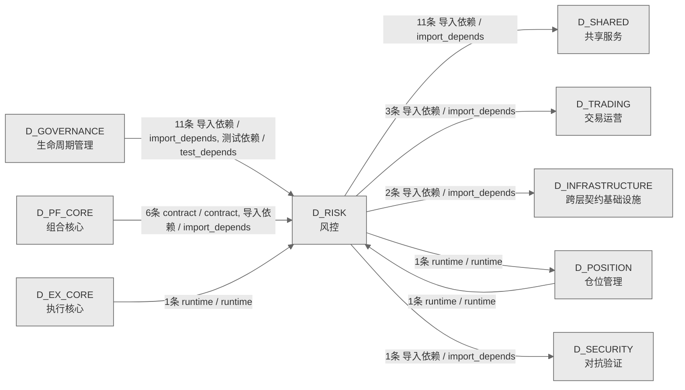

# 65_d_risk / 风控域 / Risk Control

> **功能简介 / Overview**: 风控，负责风险指标计算、风险限额管理和风险预警

> **文档作用 / Purpose**: 展示 风控（D_RISK）功能域的域内依赖关系、跨域依赖关系，模块信息（成熟度/中英文名/大白话/文件路径）内嵌于 Mermaid 节点，供架构审查和域治理参考。

> 本文档由 generate_domain_doc.py 从 depgraph (PostgreSQL) 自动生成
> 数据源: depgraph (PostgreSQL) nodes表 + edges表

> **[可缩放 HTML 版 / Zoomable HTML](http://localhost:8765/docs/02_enterprise_architecture/02_domain_architecture_docs/_zoomable_html/65_d_risk.html)** — Ctrl+滚轮缩放 ｜ 双击重置 ｜ Ctrl+Shift+D 切换拖动/选择模式

## 域基本信息 / Domain Overview

| 字段 | 值 | Field | Value |
|------|------|-------|-------|
| 编号 | 65 | Number | 65 |
| 域ID | D_RISK | Domain ID | D_RISK |
| 域名称 | 风控 | Domain Name | Risk Control |
| 层级 | L2 业务域层 | Layer | L2 Domain |
| 模块数 | 21 | Module Count | 21 |
| 域内依赖 | 24 | Internal Dependencies | 24 |
| 跨域入边 | 19 | Cross-domain Incoming | 19 |
| 跨域出边 | 18 | Cross-domain Outgoing | 18 |
| 设计态模块 | 0 | Design Modules | 0 |
| 生产态模块 | 21 | Production Modules | 21 |
| 容量 | 21/150 (正常) | Capacity | 21/150 (正常) |
| 描述 | 风控，负责风险指标计算、风险限额管理和风险预警 | Description | 风控，负责风险指标计算、风险限额管理和风险预警 |

## 域内依赖图 / Internal Dependency Diagram

> 依赖图内嵌在本文档中，IDE 可直接渲染；网页版可 Ctrl+滚轮缩放 + 拖动平移查看细节。
>
> **图例说明 / Legend**：
> - 🟦 **蓝色 = 运营态模块**（production，已上线运行）
> - 🟧 **橙色虚线 = 设计态模块**（design，蓝图阶段，代码未写）
> - **实线箭头 = 运营态依赖**（已生效的依赖关系）
> - **虚线箭头 = 非运营态依赖**（计划中/验证中的依赖关系）

### 全景图（全部模块，颜色区分运营态/设计态）

> 展示全部 21 个模块（生产态 21 + 设计态 0），含跨域依赖外部节点。节点含成熟度+名称+大白话/简介+文件路径。

```mermaid
%%{init: {'theme': 'base', 'themeVariables': {'primaryColor': '#eaeaea', 'primaryTextColor': '#333333', 'primaryBorderColor': '#666666', 'lineColor': '#666666', 'secondaryColor': '#eaeaea', 'tertiaryColor': '#eaeaea', 'fontSize': '14px'}}}%%
flowchart TD
    src_zephyr_risk_core_ashare_stop_loss_engine_py["core/ashare_stop_loss_engine<br/>A-Share Stop-Loss Rule Engine — A股止损规则引擎<br/>(MOD-RK-09)<br/>文件: core/ashare_stop_loss_engine.py<br/>(生产态 / production)"]
    src_zephyr_risk_core_ashare_systemic_risk_detector_py["core/ashare_systemic_risk_detector<br/>A-Share Systemic Risk Detector —<br/>A股系统性风险检测器 (MOD-RK-10)<br/>文件: core/ashare_systemic_risk_detector.py<br/>(生产态 / production)"]
    src_zephyr_risk_core_concentration_monitor_py["core/concentration_monitor<br/>Concentration Risk Monitor — 集中度风险监控器<br/>(MOD-RK-07)<br/>文件: core/concentration_monitor.py<br/>(生产态 / production)"]
    src_zephyr_risk_core_drawdown_tracker_py["core/drawdown_tracker<br/>Drawdown Real-Time Tracker — 回撤实时追踪器<br/>(MOD-RK-011)<br/>文件: core/drawdown_tracker.py<br/>(生产态 / production)"]
    src_zephyr_risk_core_risk_budget_allocator_py["core/risk_budget_allocator<br/>Risk Budget Allocator — 风险预算分配器<br/>(MOD-RK-08)<br/>文件: core/risk_budget_allocator.py<br/>(生产态 / production)"]
    src_zephyr_risk_cross_asset_cross_market_data_adapter_ml_experiment_pipeline_py["cross_market_data_adapter/ml_experiment_pipeline<br/>风险/cross market data<br/>adapter包的ml_experiment_pipeline模块<br/>文件: cross_market_data_adapter<br/>/ml_experiment_pipeline.py<br/>(生产态 / production)"]
    src_zephyr_risk_implementations_default_risk_manager_orchestrator_py["implementations<br/>/default_risk_manager_orchestrator<br/>D_RISK — Default Risk Manager Orchestrator<br/>文件: implementations<br/>/default_risk_manager_orchestrator.py<br/>(生产态 / production)"]
    src_zephyr_risk_core_ashare_stop_loss_engine_py ~~~ src_zephyr_risk_core_ashare_systemic_risk_detector_py
    src_zephyr_risk_core_ashare_systemic_risk_detector_py ~~~ src_zephyr_risk_core_concentration_monitor_py
    src_zephyr_risk_core_concentration_monitor_py ~~~ src_zephyr_risk_core_drawdown_tracker_py
    src_zephyr_risk_core_drawdown_tracker_py ~~~ src_zephyr_risk_core_risk_budget_allocator_py
    src_zephyr_risk_core_risk_budget_allocator_py ~~~ src_zephyr_risk_cross_asset_cross_market_data_adapter_ml_experiment_pipeline_py
    src_zephyr_risk_cross_asset_cross_market_data_adapter_ml_experiment_pipeline_py ~~~ src_zephyr_risk_implementations_default_risk_manager_orchestrator_py
    src_zephyr_risk_core_risk_decomposition_py["core/risk_decomposition<br/>Risk Decomposition Engine — 风险分解引擎<br/>(MOD-RK-16)<br/>文件: core/risk_decomposition.py<br/>(生产态 / production)"]
    src_zephyr_risk_implementations_default_position_limit_checker_py["implementations/default_position_limit_checker<br/>D_RISK — Default Position Limit Checker<br/>文件: implementations<br/>/default_position_limit_checker.py<br/>(生产态 / production)"]
    src_zephyr_risk_implementations_default_risk_limits_calculator_py["implementations/default_risk_limits_calculator<br/>D_RISK — Default Risk Limits Calculator<br/>文件: implementations<br/>/default_risk_limits_calculator.py<br/>(生产态 / production)"]
    src_zephyr_risk_implementations_default_risk_validator_py["implementations/default_risk_validator<br/>D_RISK — Default Risk Validator<br/>文件: implementations/default_risk_validator.py<br/>(生产态 / production)"]
    src_zephyr_risk_stop_loss_py["risk/stop_loss<br/>D_RISK — Stop-Loss & Kill Switch 兼容层<br/>文件: risk/stop_loss.py<br/>(生产态 / production)"]
    src_zephyr_risk_core_risk_decomposition_py ~~~ src_zephyr_risk_implementations_default_position_limit_checker_py
    src_zephyr_risk_implementations_default_position_limit_checker_py ~~~ src_zephyr_risk_implementations_default_risk_limits_calculator_py
    src_zephyr_risk_implementations_default_risk_limits_calculator_py ~~~ src_zephyr_risk_implementations_default_risk_validator_py
    src_zephyr_risk_implementations_default_risk_validator_py ~~~ src_zephyr_risk_stop_loss_py
    src_zephyr_risk_implementations_default_stop_loss_engine_py["implementations/default_stop_loss_engine<br/>D_RISK — Default Stop-Loss Engine<br/>文件: implementations<br/>/default_stop_loss_engine.py<br/>(生产态 / production)"]
    src_zephyr_risk_risk_limits_py["risk/risk_limits<br/>D_RISK — Risk Limits Calculator<br/>文件: risk/risk_limits.py<br/>(生产态 / production)"]
    src_zephyr_risk_risk_manager_py["risk/risk_manager<br/>ZephyrAlpha — D_RISK Risk Management Layer —<br/>风控管理器接口<br/>文件: risk/risk_manager.py<br/>(生产态 / production)"]
    src_zephyr_risk_risk_validator_py["risk/risk_validator<br/>D_RISK — Risk Validator<br/>文件: risk/risk_validator.py<br/>(生产态 / production)"]
    src_zephyr_risk_implementations_default_stop_loss_engine_py ~~~ src_zephyr_risk_risk_limits_py
    src_zephyr_risk_risk_limits_py ~~~ src_zephyr_risk_risk_manager_py
    src_zephyr_risk_risk_manager_py ~~~ src_zephyr_risk_risk_validator_py
    src_zephyr_risk_core_daily_auditor_py["core/daily_auditor<br/>Post-Trade Daily Auditor — 日终审计器<br/>(MOD-RK-20)<br/>文件: core/daily_auditor.py<br/>(生产态 / production)"]
    src_zephyr_risk_risk_manager_base_py["risk/risk_manager_base<br/>D_RISK — Risk Management Layer Skeleton<br/>文件: risk/risk_manager_base.py<br/>(生产态 / production)"]
    src_zephyr_risk_core_daily_auditor_py ~~~ src_zephyr_risk_risk_manager_base_py
    src_zephyr_risk_core_stress_test_engine_py["core/stress_test_engine<br/>Stress Test Engine — 压力测试引擎 (MOD-RK-12)<br/>文件: core/stress_test_engine.py<br/>(生产态 / production)"]
    src_zephyr_risk_core_tail_risk_monitor_py["core/tail_risk_monitor<br/>Tail Risk Monitor — 尾部风险监控器 (MOD-RK-15)<br/>文件: core/tail_risk_monitor.py<br/>(生产态 / production)"]
    src_zephyr_risk_core_var_calculator_py["core/var_calculator<br/>VaR Calculator — 风险价值计算器 (MOD-RK-05,<br/>Phase 1)<br/>文件: core/var_calculator.py<br/>(生产态 / production)"]
    src_zephyr_risk_core_stress_test_engine_py ~~~ src_zephyr_risk_core_tail_risk_monitor_py
    src_zephyr_risk_core_tail_risk_monitor_py ~~~ src_zephyr_risk_core_var_calculator_py
    src_zephyr_risk_risk_limits_py -->|导入依赖 / import_depends| src_zephyr_risk_core_daily_auditor_py
    src_zephyr_risk_stop_loss_py -->|导入依赖 / import_depends| src_zephyr_risk_implementations_default_stop_loss_engine_py
    src_zephyr_risk_core_ashare_stop_loss_engine_py -->|导入依赖 / import_depends| src_zephyr_risk_stop_loss_py
    src_zephyr_risk_core_risk_decomposition_py -->|导入依赖 / import_depends| src_zephyr_risk_core_daily_auditor_py
    src_zephyr_risk_core_risk_decomposition_py -->|import / import| src_zephyr_risk_core_var_calculator_py
    src_zephyr_risk_core_daily_auditor_py -->|导入依赖 / import_depends| src_zephyr_risk_core_risk_decomposition_py
    src_zephyr_risk_core_risk_budget_allocator_py -->|导入依赖 / import_depends| src_zephyr_risk_core_risk_decomposition_py
    src_zephyr_risk_core_risk_budget_allocator_py -->|import / import| src_zephyr_risk_core_risk_decomposition_py
    src_zephyr_risk_core_var_calculator_py -->|导入依赖 / import_depends| src_zephyr_risk_core_stress_test_engine_py
    src_zephyr_risk_core_var_calculator_py -->|导入依赖 / import_depends| src_zephyr_risk_core_tail_risk_monitor_py
    src_zephyr_risk_implementations_default_position_limit_checker_py -->|导入依赖 / import_depends| src_zephyr_risk_risk_manager_py
    src_zephyr_risk_implementations_default_position_limit_checker_py -->|导入依赖 / import_depends| src_zephyr_risk_risk_manager_base_py
    src_zephyr_risk_implementations_default_position_limit_checker_py -->|导入依赖 / import_depends| src_zephyr_risk_core_daily_auditor_py
    src_zephyr_risk_implementations_default_risk_manager_orchestrator_py -->|导入依赖 / import_depends| src_zephyr_risk_risk_manager_py
    src_zephyr_risk_implementations_default_risk_manager_orchestrator_py -->|导入依赖 / import_depends| src_zephyr_risk_risk_manager_base_py
    src_zephyr_risk_implementations_default_risk_manager_orchestrator_py -->|导入依赖 / import_depends| src_zephyr_risk_implementations_default_position_limit_checker_py
    src_zephyr_risk_implementations_default_risk_manager_orchestrator_py -->|导入依赖 / import_depends| src_zephyr_risk_implementations_default_risk_limits_calculator_py
    src_zephyr_risk_implementations_default_risk_manager_orchestrator_py -->|导入依赖 / import_depends| src_zephyr_risk_implementations_default_stop_loss_engine_py
    src_zephyr_risk_implementations_default_risk_manager_orchestrator_py -->|导入依赖 / import_depends| src_zephyr_risk_implementations_default_risk_validator_py
    src_zephyr_risk_implementations_default_risk_limits_calculator_py -->|导入依赖 / import_depends| src_zephyr_risk_risk_limits_py
    src_zephyr_risk_implementations_default_risk_limits_calculator_py -->|导入依赖 / import_depends| src_zephyr_risk_risk_manager_py
    src_zephyr_risk_implementations_default_stop_loss_engine_py -->|导入依赖 / import_depends| src_zephyr_risk_risk_manager_base_py
    src_zephyr_risk_implementations_default_risk_validator_py -->|导入依赖 / import_depends| src_zephyr_risk_risk_manager_py
    src_zephyr_risk_implementations_default_risk_validator_py -->|导入依赖 / import_depends| src_zephyr_risk_risk_validator_py
    D_POSITION["仓位管理<br/>仓位管理，负责持仓跟踪、仓位计算和盈亏分析<br/>Position Management<br/>跨域节点 / cross-domain<br/>(生产态 / production)"]
    src_zephyr_risk_risk_limits_py -->|runtime / runtime| D_POSITION
    D_SECURITY["对抗验证<br/>对抗验证，负责系统安全对抗测试、漏洞扫描和攻防验<br/>证<br/>Adversarial Validation<br/>跨域节点 / cross-domain<br/>(生产态 / production)"]
    src_zephyr_risk_core_ashare_systemic_risk_detector_py -->|导入依赖 / import_depends| D_SECURITY
    D_SHARED["共享服务<br/>共享服务，负责跨域共享的工具、协议和基础服务<br/>Shared Services<br/>跨域节点 / cross-domain<br/>(生产态 / production)"]
    src_zephyr_risk_cross_asset_cross_market_data_adapter_ml_experiment_pipeline_py -->|导入依赖 / import_depends| D_SHARED
    src_zephyr_risk_core_risk_decomposition_py -->|导入依赖 / import_depends| D_SHARED
    src_zephyr_risk_core_var_calculator_py -->|导入依赖 / import_depends| D_SHARED
    src_zephyr_risk_core_ashare_systemic_risk_detector_py -->|导入依赖 / import_depends| D_SHARED
    src_zephyr_risk_core_ashare_stop_loss_engine_py -->|导入依赖 / import_depends| D_SHARED
    src_zephyr_risk_core_drawdown_tracker_py -->|导入依赖 / import_depends| D_SHARED
    D_TRADING["交易运营<br/>交易运营，负责交易生命周期管理、订单状态和成交处<br/>理<br/>Trading Operations<br/>跨域节点 / cross-domain<br/>(生产态 / production)"]
    src_zephyr_risk_risk_manager_py -->|导入依赖 / import_depends| D_TRADING
    src_zephyr_risk_risk_manager_py -->|导入依赖 / import_depends| D_TRADING
    D_INFRASTRUCTURE["跨层契约基础设施<br/>跨层契约基础设施，负责跨层契约定义、共享契约管理<br/>和契约校验<br/>Cross-Layer Contract Infrastructure<br/>跨域节点 / cross-domain<br/>(生产态 / production)"]
    src_zephyr_risk_risk_limits_py -->|导入依赖 / import_depends| D_INFRASTRUCTURE
    src_zephyr_risk_risk_manager_py -->|导入依赖 / import_depends| D_TRADING
    src_zephyr_risk_risk_manager_py -->|导入依赖 / import_depends| D_INFRASTRUCTURE
    src_zephyr_risk_core_tail_risk_monitor_py -->|导入依赖 / import_depends| D_SHARED
    src_zephyr_risk_core_daily_auditor_py -->|导入依赖 / import_depends| D_SHARED
    D_PF_CORE["组合核心<br/>组合核心，负责投资组合构建、持仓管理和组合优化<br/>Portfolio Core<br/>跨域节点 / cross-domain<br/>(生产态 / production)"]
    D_PF_CORE -->|导入依赖 / import_depends| src_zephyr_risk_risk_limits_py
    D_POSITION -->|runtime / runtime| src_zephyr_risk_risk_limits_py
    D_EX_CORE["执行核心<br/>执行核心，负责订单执行引擎、执行策略和执行管理<br/>Execution Core<br/>跨域节点 / cross-domain<br/>(设计态 / design)"]
    D_EX_CORE -.->|runtime / runtime| src_zephyr_risk_risk_validator_py
    D_PF_CORE -->|contract / contract| src_zephyr_risk_risk_limits_py
    D_PF_CORE -->|导入依赖 / import_depends| src_zephyr_risk_core_risk_decomposition_py
    D_GOVERNANCE["生命周期管理<br/>生命周期管理，负责蓝图/模块<br/>/任务的声明周期管理和元数据治理<br/>Lifecycle Management<br/>跨域节点 / cross-domain<br/>(生产态 / production)"]
    D_GOVERNANCE -->|导入依赖 / import_depends| src_zephyr_risk_risk_manager_py
    D_GOVERNANCE -->|测试依赖 / test_depends| src_zephyr_risk_implementations_default_risk_manager_orchestrator_py
    D_GOVERNANCE -->|测试依赖 / test_depends| src_zephyr_risk_implementations_default_risk_validator_py
    D_GOVERNANCE -->|测试依赖 / test_depends| src_zephyr_risk_risk_manager_py
    D_GOVERNANCE -->|测试依赖 / test_depends| src_zephyr_risk_stop_loss_py
    D_GOVERNANCE -->|测试依赖 / test_depends| src_zephyr_risk_implementations_default_risk_validator_py
    D_GOVERNANCE -->|测试依赖 / test_depends| src_zephyr_risk_risk_manager_py
    D_PF_CORE -->|导入依赖 / import_depends| src_zephyr_risk_core_risk_budget_allocator_py
    D_PF_CORE -->|导入依赖 / import_depends| src_zephyr_risk_core_risk_budget_allocator_py
    D_GOVERNANCE -->|测试依赖 / test_depends| src_zephyr_risk_implementations_default_risk_limits_calculator_py
    classDef production fill:#e1f5fe,stroke:#01579b,stroke-width:2px,color:#000
    classDef design fill:#fff3e0,stroke:#e65100,stroke-width:2px,color:#000,stroke-dasharray: 5 5
    classDef external_prod fill:#e8f4fd,stroke:#0277bd,stroke-width:1px,color:#000
    classDef external_design fill:#fff8e7,stroke:#ef6c00,stroke-width:1px,color:#000,stroke-dasharray: 5 5
    class src_zephyr_risk_core_ashare_stop_loss_engine_py,src_zephyr_risk_core_ashare_systemic_risk_detector_py,src_zephyr_risk_core_concentration_monitor_py,src_zephyr_risk_core_daily_auditor_py,src_zephyr_risk_core_drawdown_tracker_py,src_zephyr_risk_core_risk_budget_allocator_py,src_zephyr_risk_core_risk_decomposition_py,src_zephyr_risk_core_stress_test_engine_py,src_zephyr_risk_core_tail_risk_monitor_py,src_zephyr_risk_core_var_calculator_py,src_zephyr_risk_cross_asset_cross_market_data_adapter_ml_experiment_pipeline_py,src_zephyr_risk_implementations_default_position_limit_checker_py,src_zephyr_risk_implementations_default_risk_limits_calculator_py,src_zephyr_risk_implementations_default_risk_manager_orchestrator_py,src_zephyr_risk_implementations_default_risk_validator_py,src_zephyr_risk_implementations_default_stop_loss_engine_py,src_zephyr_risk_risk_limits_py,src_zephyr_risk_risk_manager_py,src_zephyr_risk_risk_manager_base_py,src_zephyr_risk_risk_validator_py,src_zephyr_risk_stop_loss_py production
    class D_POSITION,D_SECURITY,D_SHARED,D_TRADING,D_INFRASTRUCTURE,D_PF_CORE,D_GOVERNANCE external_prod
    class D_EX_CORE external_design
```

### 运营态的图（仅 design_maturity=production 的模块和域内依赖）

> 仅展示已上线运行的模块（共 21 个），不含跨域外部节点。跨域依赖见下方跨域依赖章节。

```mermaid
%%{init: {'theme': 'base', 'themeVariables': {'primaryColor': '#eaeaea', 'primaryTextColor': '#333333', 'primaryBorderColor': '#666666', 'lineColor': '#666666', 'secondaryColor': '#eaeaea', 'tertiaryColor': '#eaeaea', 'fontSize': '14px'}}}%%
flowchart TD
    src_zephyr_risk_core_ashare_stop_loss_engine_py["core/ashare_stop_loss_engine<br/>A-Share Stop-Loss Rule Engine — A股止损规则引擎<br/>(MOD-RK-09)<br/>文件: core/ashare_stop_loss_engine.py<br/>(生产态 / production)"]
    src_zephyr_risk_core_ashare_systemic_risk_detector_py["core/ashare_systemic_risk_detector<br/>A-Share Systemic Risk Detector —<br/>A股系统性风险检测器 (MOD-RK-10)<br/>文件: core/ashare_systemic_risk_detector.py<br/>(生产态 / production)"]
    src_zephyr_risk_core_concentration_monitor_py["core/concentration_monitor<br/>Concentration Risk Monitor — 集中度风险监控器<br/>(MOD-RK-07)<br/>文件: core/concentration_monitor.py<br/>(生产态 / production)"]
    src_zephyr_risk_core_drawdown_tracker_py["core/drawdown_tracker<br/>Drawdown Real-Time Tracker — 回撤实时追踪器<br/>(MOD-RK-011)<br/>文件: core/drawdown_tracker.py<br/>(生产态 / production)"]
    src_zephyr_risk_core_risk_budget_allocator_py["core/risk_budget_allocator<br/>Risk Budget Allocator — 风险预算分配器<br/>(MOD-RK-08)<br/>文件: core/risk_budget_allocator.py<br/>(生产态 / production)"]
    src_zephyr_risk_cross_asset_cross_market_data_adapter_ml_experiment_pipeline_py["cross_market_data_adapter/ml_experiment_pipeline<br/>风险/cross market data<br/>adapter包的ml_experiment_pipeline模块<br/>文件: cross_market_data_adapter<br/>/ml_experiment_pipeline.py<br/>(生产态 / production)"]
    src_zephyr_risk_implementations_default_risk_manager_orchestrator_py["implementations<br/>/default_risk_manager_orchestrator<br/>D_RISK — Default Risk Manager Orchestrator<br/>文件: implementations<br/>/default_risk_manager_orchestrator.py<br/>(生产态 / production)"]
    src_zephyr_risk_core_ashare_stop_loss_engine_py ~~~ src_zephyr_risk_core_ashare_systemic_risk_detector_py
    src_zephyr_risk_core_ashare_systemic_risk_detector_py ~~~ src_zephyr_risk_core_concentration_monitor_py
    src_zephyr_risk_core_concentration_monitor_py ~~~ src_zephyr_risk_core_drawdown_tracker_py
    src_zephyr_risk_core_drawdown_tracker_py ~~~ src_zephyr_risk_core_risk_budget_allocator_py
    src_zephyr_risk_core_risk_budget_allocator_py ~~~ src_zephyr_risk_cross_asset_cross_market_data_adapter_ml_experiment_pipeline_py
    src_zephyr_risk_cross_asset_cross_market_data_adapter_ml_experiment_pipeline_py ~~~ src_zephyr_risk_implementations_default_risk_manager_orchestrator_py
    src_zephyr_risk_core_risk_decomposition_py["core/risk_decomposition<br/>Risk Decomposition Engine — 风险分解引擎<br/>(MOD-RK-16)<br/>文件: core/risk_decomposition.py<br/>(生产态 / production)"]
    src_zephyr_risk_implementations_default_position_limit_checker_py["implementations/default_position_limit_checker<br/>D_RISK — Default Position Limit Checker<br/>文件: implementations<br/>/default_position_limit_checker.py<br/>(生产态 / production)"]
    src_zephyr_risk_implementations_default_risk_limits_calculator_py["implementations/default_risk_limits_calculator<br/>D_RISK — Default Risk Limits Calculator<br/>文件: implementations<br/>/default_risk_limits_calculator.py<br/>(生产态 / production)"]
    src_zephyr_risk_implementations_default_risk_validator_py["implementations/default_risk_validator<br/>D_RISK — Default Risk Validator<br/>文件: implementations/default_risk_validator.py<br/>(生产态 / production)"]
    src_zephyr_risk_stop_loss_py["risk/stop_loss<br/>D_RISK — Stop-Loss & Kill Switch 兼容层<br/>文件: risk/stop_loss.py<br/>(生产态 / production)"]
    src_zephyr_risk_core_risk_decomposition_py ~~~ src_zephyr_risk_implementations_default_position_limit_checker_py
    src_zephyr_risk_implementations_default_position_limit_checker_py ~~~ src_zephyr_risk_implementations_default_risk_limits_calculator_py
    src_zephyr_risk_implementations_default_risk_limits_calculator_py ~~~ src_zephyr_risk_implementations_default_risk_validator_py
    src_zephyr_risk_implementations_default_risk_validator_py ~~~ src_zephyr_risk_stop_loss_py
    src_zephyr_risk_implementations_default_stop_loss_engine_py["implementations/default_stop_loss_engine<br/>D_RISK — Default Stop-Loss Engine<br/>文件: implementations<br/>/default_stop_loss_engine.py<br/>(生产态 / production)"]
    src_zephyr_risk_risk_limits_py["risk/risk_limits<br/>D_RISK — Risk Limits Calculator<br/>文件: risk/risk_limits.py<br/>(生产态 / production)"]
    src_zephyr_risk_risk_manager_py["risk/risk_manager<br/>ZephyrAlpha — D_RISK Risk Management Layer —<br/>风控管理器接口<br/>文件: risk/risk_manager.py<br/>(生产态 / production)"]
    src_zephyr_risk_risk_validator_py["risk/risk_validator<br/>D_RISK — Risk Validator<br/>文件: risk/risk_validator.py<br/>(生产态 / production)"]
    src_zephyr_risk_implementations_default_stop_loss_engine_py ~~~ src_zephyr_risk_risk_limits_py
    src_zephyr_risk_risk_limits_py ~~~ src_zephyr_risk_risk_manager_py
    src_zephyr_risk_risk_manager_py ~~~ src_zephyr_risk_risk_validator_py
    src_zephyr_risk_core_daily_auditor_py["core/daily_auditor<br/>Post-Trade Daily Auditor — 日终审计器<br/>(MOD-RK-20)<br/>文件: core/daily_auditor.py<br/>(生产态 / production)"]
    src_zephyr_risk_risk_manager_base_py["risk/risk_manager_base<br/>D_RISK — Risk Management Layer Skeleton<br/>文件: risk/risk_manager_base.py<br/>(生产态 / production)"]
    src_zephyr_risk_core_daily_auditor_py ~~~ src_zephyr_risk_risk_manager_base_py
    src_zephyr_risk_core_stress_test_engine_py["core/stress_test_engine<br/>Stress Test Engine — 压力测试引擎 (MOD-RK-12)<br/>文件: core/stress_test_engine.py<br/>(生产态 / production)"]
    src_zephyr_risk_core_tail_risk_monitor_py["core/tail_risk_monitor<br/>Tail Risk Monitor — 尾部风险监控器 (MOD-RK-15)<br/>文件: core/tail_risk_monitor.py<br/>(生产态 / production)"]
    src_zephyr_risk_core_var_calculator_py["core/var_calculator<br/>VaR Calculator — 风险价值计算器 (MOD-RK-05,<br/>Phase 1)<br/>文件: core/var_calculator.py<br/>(生产态 / production)"]
    src_zephyr_risk_core_stress_test_engine_py ~~~ src_zephyr_risk_core_tail_risk_monitor_py
    src_zephyr_risk_core_tail_risk_monitor_py ~~~ src_zephyr_risk_core_var_calculator_py
    src_zephyr_risk_risk_limits_py -->|导入依赖 / import_depends| src_zephyr_risk_core_daily_auditor_py
    src_zephyr_risk_stop_loss_py -->|导入依赖 / import_depends| src_zephyr_risk_implementations_default_stop_loss_engine_py
    src_zephyr_risk_core_ashare_stop_loss_engine_py -->|导入依赖 / import_depends| src_zephyr_risk_stop_loss_py
    src_zephyr_risk_core_risk_decomposition_py -->|导入依赖 / import_depends| src_zephyr_risk_core_daily_auditor_py
    src_zephyr_risk_core_risk_decomposition_py -->|import / import| src_zephyr_risk_core_var_calculator_py
    src_zephyr_risk_core_daily_auditor_py -->|导入依赖 / import_depends| src_zephyr_risk_core_risk_decomposition_py
    src_zephyr_risk_core_risk_budget_allocator_py -->|导入依赖 / import_depends| src_zephyr_risk_core_risk_decomposition_py
    src_zephyr_risk_core_risk_budget_allocator_py -->|import / import| src_zephyr_risk_core_risk_decomposition_py
    src_zephyr_risk_core_var_calculator_py -->|导入依赖 / import_depends| src_zephyr_risk_core_stress_test_engine_py
    src_zephyr_risk_core_var_calculator_py -->|导入依赖 / import_depends| src_zephyr_risk_core_tail_risk_monitor_py
    src_zephyr_risk_implementations_default_position_limit_checker_py -->|导入依赖 / import_depends| src_zephyr_risk_risk_manager_py
    src_zephyr_risk_implementations_default_position_limit_checker_py -->|导入依赖 / import_depends| src_zephyr_risk_risk_manager_base_py
    src_zephyr_risk_implementations_default_position_limit_checker_py -->|导入依赖 / import_depends| src_zephyr_risk_core_daily_auditor_py
    src_zephyr_risk_implementations_default_risk_manager_orchestrator_py -->|导入依赖 / import_depends| src_zephyr_risk_risk_manager_py
    src_zephyr_risk_implementations_default_risk_manager_orchestrator_py -->|导入依赖 / import_depends| src_zephyr_risk_risk_manager_base_py
    src_zephyr_risk_implementations_default_risk_manager_orchestrator_py -->|导入依赖 / import_depends| src_zephyr_risk_implementations_default_position_limit_checker_py
    src_zephyr_risk_implementations_default_risk_manager_orchestrator_py -->|导入依赖 / import_depends| src_zephyr_risk_implementations_default_risk_limits_calculator_py
    src_zephyr_risk_implementations_default_risk_manager_orchestrator_py -->|导入依赖 / import_depends| src_zephyr_risk_implementations_default_stop_loss_engine_py
    src_zephyr_risk_implementations_default_risk_manager_orchestrator_py -->|导入依赖 / import_depends| src_zephyr_risk_implementations_default_risk_validator_py
    src_zephyr_risk_implementations_default_risk_limits_calculator_py -->|导入依赖 / import_depends| src_zephyr_risk_risk_limits_py
    src_zephyr_risk_implementations_default_risk_limits_calculator_py -->|导入依赖 / import_depends| src_zephyr_risk_risk_manager_py
    src_zephyr_risk_implementations_default_stop_loss_engine_py -->|导入依赖 / import_depends| src_zephyr_risk_risk_manager_base_py
    src_zephyr_risk_implementations_default_risk_validator_py -->|导入依赖 / import_depends| src_zephyr_risk_risk_manager_py
    src_zephyr_risk_implementations_default_risk_validator_py -->|导入依赖 / import_depends| src_zephyr_risk_risk_validator_py
    classDef production fill:#e1f5fe,stroke:#01579b,stroke-width:2px,color:#000
    classDef design fill:#fff3e0,stroke:#e65100,stroke-width:2px,color:#000,stroke-dasharray: 5 5
    classDef external_prod fill:#e8f4fd,stroke:#0277bd,stroke-width:1px,color:#000
    classDef external_design fill:#fff8e7,stroke:#ef6c00,stroke-width:1px,color:#000,stroke-dasharray: 5 5
    class src_zephyr_risk_core_ashare_stop_loss_engine_py,src_zephyr_risk_core_ashare_systemic_risk_detector_py,src_zephyr_risk_core_concentration_monitor_py,src_zephyr_risk_core_daily_auditor_py,src_zephyr_risk_core_drawdown_tracker_py,src_zephyr_risk_core_risk_budget_allocator_py,src_zephyr_risk_core_risk_decomposition_py,src_zephyr_risk_core_stress_test_engine_py,src_zephyr_risk_core_tail_risk_monitor_py,src_zephyr_risk_core_var_calculator_py,src_zephyr_risk_cross_asset_cross_market_data_adapter_ml_experiment_pipeline_py,src_zephyr_risk_implementations_default_position_limit_checker_py,src_zephyr_risk_implementations_default_risk_limits_calculator_py,src_zephyr_risk_implementations_default_risk_manager_orchestrator_py,src_zephyr_risk_implementations_default_risk_validator_py,src_zephyr_risk_implementations_default_stop_loss_engine_py,src_zephyr_risk_risk_limits_py,src_zephyr_risk_risk_manager_py,src_zephyr_risk_risk_manager_base_py,src_zephyr_risk_risk_validator_py,src_zephyr_risk_stop_loss_py production
```

### 设计态的图（仅 design_maturity=design 的模块和域内依赖）

> 仅展示蓝图阶段、代码未写的设计态模块（共 0 个），不含跨域外部节点。

> （无模块 / No modules）

## 跨域依赖 / Cross-domain Dependencies

### 本域依赖的其他域（出边）/ Depends On

| # | 本域模块 / Source Module | → | 外部域-目标模块 / Target Module | 依赖类型 / Type |
|:--:|---------|:--:|---------|---------|
| 1 | D_RISK — Risk Limits Calculator (risk/risk_limits.py) | → | D_INFRASTRUCTURE 跨层契约基础设施: contracts/risk_limits.py | 导入依赖 / import_depends |
| 2 | ZephyrAlpha — D_RISK Risk Management Layer — 风控管理器... | → | D_INFRASTRUCTURE 跨层契约基础设施: contracts/risk_limits.py | 导入依赖 / import_depends |
| 3 | D_RISK — Risk Limits Calculator (risk/risk_limits.py) | → | D_POSITION 仓位管理: Drawdown Controller — 回撤控制器 (MOD-POS-008) (core/dra... | runtime / runtime |
| 4 | A-Share Systemic Risk Detector — A股系统性风险检测器 (MO... | → | D_SECURITY 对抗验证: KillSwitch — 熔断器. (access_control/kill_switch.py) | 导入依赖 / import_depends |
| 5 | A-Share Stop-Loss Rule Engine — A股止损规则引擎 (MOD-RK-... | → | D_SHARED 共享服务: errors.py —— ZephyrAlpha 统一错误层次（Traditional Exce... | 导入依赖 / import_depends |
| 6 | A-Share Systemic Risk Detector — A股系统性风险检测器 (MO... | → | D_SHARED 共享服务: errors.py —— ZephyrAlpha 统一错误层次（Traditional Exce... | 导入依赖 / import_depends |
| 7 | Concentration Risk Monitor — 集中度风险监控器 (MOD-RK-07... | → | D_SHARED 共享服务: errors.py —— ZephyrAlpha 统一错误层次（Traditional Exce... | 导入依赖 / import_depends |
| 8 | Post-Trade Daily Auditor — 日终审计器 (MOD-RK-20) (core/... | → | D_SHARED 共享服务: errors.py —— ZephyrAlpha 统一错误层次（Traditional Exce... | 导入依赖 / import_depends |
| 9 | Drawdown Real-Time Tracker — 回撤实时追踪器 (MOD-RK-011)... | → | D_SHARED 共享服务: errors.py —— ZephyrAlpha 统一错误层次（Traditional Exce... | 导入依赖 / import_depends |
| 10 | Risk Budget Allocator — 风险预算分配器 (MOD-RK-08) (core... | → | D_SHARED 共享服务: errors.py —— ZephyrAlpha 统一错误层次（Traditional Exce... | 导入依赖 / import_depends |
| 11 | Risk Decomposition Engine — 风险分解引擎 (MOD-RK-16) (co... | → | D_SHARED 共享服务: errors.py —— ZephyrAlpha 统一错误层次（Traditional Exce... | 导入依赖 / import_depends |
| 12 | Stress Test Engine — 压力测试引擎 (MOD-RK-12) (core/stre... | → | D_SHARED 共享服务: errors.py —— ZephyrAlpha 统一错误层次（Traditional Exce... | 导入依赖 / import_depends |
| 13 | Tail Risk Monitor — 尾部风险监控器 (MOD-RK-15) (core/tai... | → | D_SHARED 共享服务: errors.py —— ZephyrAlpha 统一错误层次（Traditional Exce... | 导入依赖 / import_depends |
| 14 | VaR Calculator — 风险价值计算器 (MOD-RK-05, Phase 1) (co... | → | D_SHARED 共享服务: errors.py —— ZephyrAlpha 统一错误层次（Traditional Exce... | 导入依赖 / import_depends |
| 15 | cross_market_data_adapter/ml_experiment_pipeline.py | → | D_SHARED 共享服务: MLExperimentPipeline D_ML_TRAIN->实验跨层集成管道 (_cross... | 导入依赖 / import_depends |
| 16 | ZephyrAlpha — D_RISK Risk Management Layer — 风控管理器... | → | D_TRADING 交易运营: risk/risk_dashboard_snapshot.py | 导入依赖 / import_depends |
| 17 | ZephyrAlpha — D_RISK Risk Management Layer — 风控管理器... | → | D_TRADING 交易运营: risk/risk_limit_violation_error.py | 导入依赖 / import_depends |
| 18 | ZephyrAlpha — D_RISK Risk Management Layer — 风控管理器... | → | D_TRADING 交易运营: risk/risk_metrics.py | 导入依赖 / import_depends |

### 依赖本域的其他域（入边）/ Depended By

| # | 外部域-源模块 / Source Module | → | 本域模块 / Target Module | 依赖类型 / Type |
|:--:|---------|:--:|---------|---------|
| 1 | D_EX_CORE 执行核心: 实盘仿真切换器 / live_simulation_switcher (ex_core/live_s... | → | D_RISK — Risk Validator (risk/risk_validator.py) | runtime / runtime |
| 2 | D_GOVERNANCE 生命周期管理: demoe2e管线 / demo_e2e_pipeline (construction/demo_e2e_pi... | → | ZephyrAlpha — D_RISK Risk Management Layer — 风控管理器... | 导入依赖 / import_depends |
| 3 | D_GOVERNANCE 生命周期管理: demoe2e管线 / demo_e2e_pipeline (construction/demo_e2e_pi... | → | D_RISK — Stop-Loss & Kill Switch 兼容层 (risk/stop_loss.py) | 导入依赖 / import_depends |
| 4 | D_GOVERNANCE 生命周期管理: Phase E — Akshare 真实数据端到端测试 (data_layer/test_ak... | → | D_RISK — Default Risk Validator (implementations/default... | 测试依赖 / test_depends |
| 5 | D_GOVERNANCE 生命周期管理: Phase E — Akshare 真实数据端到端测试 (data_layer/test_ak... | → | ZephyrAlpha — D_RISK Risk Management Layer — 风控管理器... | 测试依赖 / test_depends |
| 6 | D_GOVERNANCE 生命周期管理: E2E 集成测试：全流水线贯通测试 (trading/test_e2e_pipeline... | → | D_RISK — Default Risk Limits Calculator (implementations... | 测试依赖 / test_depends |
| 7 | D_GOVERNANCE 生命周期管理: E2E 集成测试：全流水线贯通测试 (trading/test_e2e_pipeline... | → | D_RISK — Default Risk Manager Orchestrator (implementati... | 测试依赖 / test_depends |
| 8 | D_GOVERNANCE 生命周期管理: E2E 集成测试：全流水线贯通测试 (trading/test_e2e_pipeline... | → | D_RISK — Default Risk Validator (implementations/default... | 测试依赖 / test_depends |
| 9 | D_GOVERNANCE 生命周期管理: E2E 集成测试：全流水线贯通测试 (trading/test_e2e_pipeline... | → | ZephyrAlpha — D_RISK Risk Management Layer — 风控管理器... | 测试依赖 / test_depends |
| 10 | D_GOVERNANCE 生命周期管理: E2E 集成测试：全流水线贯通测试 (trading/test_e2e_pipeline... | → | D_RISK — Stop-Loss & Kill Switch 兼容层 (risk/stop_loss.py) | 测试依赖 / test_depends |
| 11 | D_GOVERNANCE 生命周期管理: Phase E — Main Data Flow End-to-End Test (trading/test_p... | → | D_RISK — Default Risk Validator (implementations/default... | 测试依赖 / test_depends |
| 12 | D_GOVERNANCE 生命周期管理: Phase E — Main Data Flow End-to-End Test (trading/test_p... | → | ZephyrAlpha — D_RISK Risk Management Layer — 风控管理器... | 测试依赖 / test_depends |
| 13 | D_PF_CORE 组合核心: Constraint Solver — 约束求解器 (MOD-PF-006) (core/constr... | → | D_RISK — Risk Limits Calculator (risk/risk_limits.py) | contract / contract |
| 14 | D_PF_CORE 组合核心: Performance Attribution Engine — 绩效归因引擎 (MOD-PF-00... | → | Risk Decomposition Engine — 风险分解引擎 (MOD-RK-16) (co... | 导入依赖 / import_depends |
| 15 | D_PF_CORE 组合核心: Portfolio Optimizer — 组合优化器 (MOD-PF-002) (core/port... | → | Risk Budget Allocator — 风险预算分配器 (MOD-RK-08) (core... | 导入依赖 / import_depends |
| 16 | D_PF_CORE 组合核心: Portfolio Optimizer — 组合优化器 (MOD-PF-002) (core/port... | → | Risk Budget Allocator — 风险预算分配器 (MOD-RK-08) (core... | 导入依赖 / import_depends |
| 17 | D_PF_CORE 组合核心: Portfolio Optimizer — 组合优化器 (MOD-PF-002) (core/port... | → | Risk Decomposition Engine — 风险分解引擎 (MOD-RK-16) (co... | 导入依赖 / import_depends |
| 18 | D_PF_CORE 组合核心: Strategy Engine — 策略引擎 (MOD-PF-001) (core/strategy_e... | → | D_RISK — Risk Limits Calculator (risk/risk_limits.py) | 导入依赖 / import_depends |
| 19 | D_POSITION 仓位管理: Position Sizing Engine — 仓位决策引擎 (MOD-POS-001) (cor... | → | D_RISK — Risk Limits Calculator (risk/risk_limits.py) | runtime / runtime |

### 跨域依赖图 / Cross-domain Dependency Diagram

> 本域与 8 个外部域直接连接（出边 18 条 + 入边 19 条 = 37 条）。只显示直接连接的域，不展开具体节点。

## 说明 / Notes

- **数据源 / Data Source**: `depgraph (PostgreSQL)` 的 `nodes`、`edges`、`domains` 表
- **生成器 / Generator**: `generate_domain_doc.py`（G2+G10 合并）
- **维护方式 / Maintenance**: 自动生成，全景图更新时刷新
- **文件名规则 / File Naming**: `{编号:02d}_{域ID小写}.md`，如 `16_d_trading.md`
- **图例说明 / Legend**: `[production]`=已上线 / `[design]`=设计中 / `[unknown]`=未知
