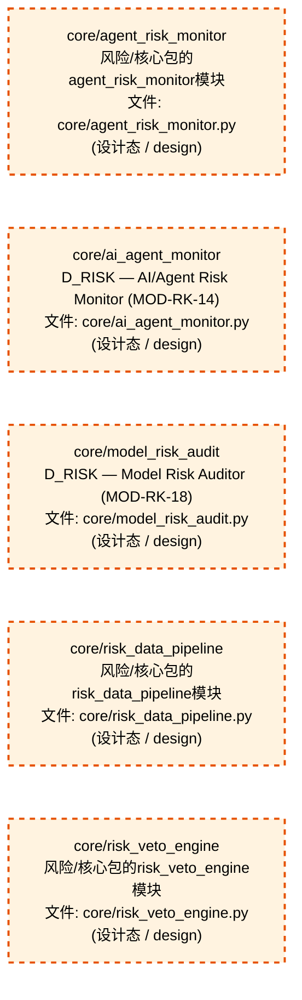
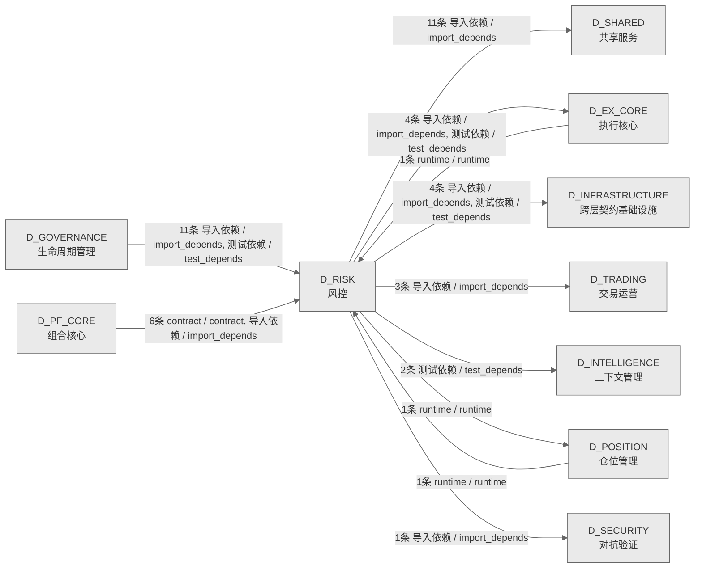

# 65_d_risk / 风控域 / Risk Control

> **功能简介 / Overview**: 风控，负责风险指标计算、风险限额管理和风险预警

> **文档作用 / Purpose**: 展示 风控（D_RISK）功能域的域内依赖关系、跨域依赖关系，模块信息（成熟度/中英文名/大白话/文件路径）内嵌于 Mermaid 节点，供架构审查和域治理参考。

> 本文档由 generate_domain_doc.py 从 depgraph (PostgreSQL) 自动生成
> 数据源: depgraph (PostgreSQL) nodes表 + edges表

> **[可缩放 HTML 版 / Zoomable HTML](http://localhost:8765/docs/02_enterprise_architecture/02_domain_architecture_docs/_zoomable_html/65_d_risk.html)** — Ctrl+滚轮缩放 ｜ 双击重置 ｜ Ctrl+Shift+D 切换拖动/选择模式

## 域基本信息 / Domain Overview

| 字段 | 值 | Field | Value |
|------|------|-------|-------|
| 编号 | 65 | Number | 65 |
| 域ID | D_RISK | Domain ID | D_RISK |
| 域名称 | 风控 | Domain Name | Risk Control |
| 层级 | L2 业务域层 | Layer | L2 Domain |
| 模块数 | 40 | Module Count | 40 |
| 域内依赖 | 56 | Internal Dependencies | 56 |
| 跨域入边 | 19 | Cross-domain Incoming | 19 |
| 跨域出边 | 26 | Cross-domain Outgoing | 26 |
| 设计态模块 | 5 | Design Modules | 5 |
| 生产态模块 | 35 | Production Modules | 35 |
| 容量 | 35/150 (正常) | Capacity | 35/150 (正常) |
| 描述 | 风控，负责风险指标计算、风险限额管理和风险预警 | Description | 风控，负责风险指标计算、风险限额管理和风险预警 |

## 域内依赖图 / Internal Dependency Diagram

> 依赖图内嵌在本文档中，IDE 可直接渲染；网页版可 Ctrl+滚轮缩放 + 拖动平移查看细节。
>
> **图例说明 / Legend**：
> - 🟦 **蓝色 = 运营态模块**（production，已上线运行）
> - 🟧 **橙色虚线 = 设计态模块**（design，蓝图阶段，代码未写）
> - **实线箭头 = 运营态依赖**（已生效的依赖关系）
> - **虚线箭头 = 非运营态依赖**（计划中/验证中的依赖关系）

### 全景图（全部模块，颜色区分运营态/设计态）

> 展示全部 40 个模块（生产态 35 + 设计态 5），含跨域依赖外部节点。节点含成熟度+名称+大白话/简介+文件路径。

```mermaid
%%{init: {'theme': 'base', 'themeVariables': {'primaryColor': '#eaeaea', 'primaryTextColor': '#333333', 'primaryBorderColor': '#666666', 'lineColor': '#666666', 'secondaryColor': '#eaeaea', 'tertiaryColor': '#eaeaea', 'fontSize': '14px'}}}%%
flowchart TD
    src_zephyr_risk_core_agent_risk_monitor_py["core/agent_risk_monitor<br/>风险/核心包的agent_risk_monitor模块<br/>文件: core/agent_risk_monitor.py<br/>(设计态 / design)"]
    src_zephyr_risk_core_ai_agent_monitor_py["core/ai_agent_monitor<br/>D_RISK — AI/Agent Risk Monitor (MOD-RK-14)<br/>文件: core/ai_agent_monitor.py<br/>(设计态 / design)"]
    src_zephyr_risk_core_ashare_stop_loss_engine_py["A股止损规则引擎输入数据非法<br/>A-Share Stop-Loss Rule Engine — A股止损规则引擎<br/>(MOD-RK-09)<br/>Ashare Stop Loss Engine<br/>文件: core/ashare_stop_loss_engine.py<br/>(生产态 / production)"]
    src_zephyr_risk_core_ashare_systemic_risk_detector_py["A股系统性风险检测器输入数据非法<br/>A-Share Systemic Risk Detector —<br/>A股系统性风险检测器 (MOD-RK-10)<br/>Ashare Systemic Risk Detector<br/>文件: core/ashare_systemic_risk_detector.py<br/>(生产态 / production)"]
    src_zephyr_risk_core_concentration_monitor_py["集中度告警级别<br/>Concentration Risk Monitor — 集中度风险监控器<br/>(MOD-RK-07)<br/>Concentration Monitor<br/>文件: core/concentration_monitor.py<br/>(生产态 / production)"]
    src_zephyr_risk_core_drawdown_tracker_py["回撤告警级别<br/>Drawdown Real-Time Tracker — 回撤实时追踪器<br/>(MOD-RK-011)<br/>Drawdown Tracker<br/>文件: core/drawdown_tracker.py<br/>(生产态 / production)"]
    src_zephyr_risk_core_model_risk_audit_py["core/model_risk_audit<br/>D_RISK — Model Risk Auditor (MOD-RK-18)<br/>文件: core/model_risk_audit.py<br/>(设计态 / design)"]
    src_zephyr_risk_core_risk_budget_allocator_py["风险预算输入数据非法<br/>Risk Budget Allocator — 风险预算分配器<br/>(MOD-RK-08)<br/>文件: core/risk_budget_allocator.py<br/>(生产态 / production)"]
    src_zephyr_risk_core_risk_data_pipeline_py["core/risk_data_pipeline<br/>风险/核心包的risk_data_pipeline模块<br/>文件: core/risk_data_pipeline.py<br/>(设计态 / design)"]
    src_zephyr_risk_core_risk_veto_engine_py["core/risk_veto_engine<br/>风险/核心包的risk_veto_engine模块<br/>文件: core/risk_veto_engine.py<br/>(设计态 / design)"]
    src_zephyr_risk_cross_asset_cross_market_data_adapter_ml_experiment_pipeline_py["Ml实验管道<br/>风险/cross market data<br/>adapter包的ml_experiment_pipeline模块<br/>Ml Experiment Pipeline<br/>文件: cross_market_data_adapter<br/>/ml_experiment_pipeline.py<br/>(生产态 / production)"]
    tests_risk_core_test_ai_agent_monitor_py["core/test_ai_agent_monitor<br/>G3 单元测试: AiAgentMonitor — 涌现行为/轨迹异常<br/>/指纹偏差综合评分。<br/>文件: core/test_ai_agent_monitor.py<br/>(生产态 / production)"]
    tests_risk_core_test_alert_generator_py["core/test_alert_generator<br/>MOD-RK-06 Alert Generator 单元测试.<br/>文件: core/test_alert_generator.py<br/>(生产态 / production)"]
    tests_risk_core_test_crowding_monitor_py["core/test_crowding_monitor<br/>MOD-RK-13 Crowding Monitor 单元测试.<br/>文件: core/test_crowding_monitor.py<br/>(生产态 / production)"]
    tests_risk_core_test_liquidity_monitor_py["core/test_liquidity_monitor<br/>MOD-RK-08 Liquidity Monitor 单元测试.<br/>文件: core/test_liquidity_monitor.py<br/>(生产态 / production)"]
    tests_risk_core_test_model_risk_audit_py["core/test_model_risk_audit<br/>G5 单元测试: ModelRiskAuditor — 漂移检测 + IC<br/>衰减综合审计。<br/>文件: core/test_model_risk_audit.py<br/>(生产态 / production)"]
    tests_risk_core_test_operational_risk_monitor_py["core/test_operational_risk_monitor<br/>G6 单元测试: OperationalRiskMonitor —<br/>阈值解释层。<br/>文件: core/test_operational_risk_monitor.py<br/>(生产态 / production)"]
    tests_risk_core_test_orchestrator_alert_integration_py["core/test_orchestrator_alert_integration<br/>G1-S6 集成测试: DefaultRiskManagerOrchestrator<br/>↔ AlertGenerator.<br/>文件: core<br/>/test_orchestrator_alert_integration.py<br/>(生产态 / production)"]
    tests_risk_core_test_orchestrator_crowding_integration_py["core/test_orchestrator_crowding_integration<br/>G4-S6 集成测试: 拥挤度监控 → 编排器 → 告警管道<br/>（G1↔G4 端到端）.<br/>文件: core<br/>/test_orchestrator_crowding_integration.py<br/>(生产态 / production)"]
    tests_risk_core_test_orchestrator_g3g5g6_integration_py["core/test_orchestrator_g3g5g6_integration<br/>G3/G5/G6 集成测试: 监控器 → 编排器 → 告警管道<br/>（端到端）.<br/>文件: core<br/>/test_orchestrator_g3g5g6_integration.py<br/>(生产态 / production)"]
    tests_risk_core_test_orchestrator_liquidity_integration_py["core/test_orchestrator_liquidity_integration<br/>G2-S6 集成测试: 流动性监控 → 编排器 → 告警管道<br/>（G1↔G2 端到端）.<br/>文件: core<br/>/test_orchestrator_liquidity_integration.py<br/>(生产态 / production)"]
    src_zephyr_risk_core_agent_risk_monitor_py ~~~ src_zephyr_risk_core_ai_agent_monitor_py
    src_zephyr_risk_core_ai_agent_monitor_py ~~~ src_zephyr_risk_core_ashare_stop_loss_engine_py
    src_zephyr_risk_core_ashare_stop_loss_engine_py ~~~ src_zephyr_risk_core_ashare_systemic_risk_detector_py
    src_zephyr_risk_core_ashare_systemic_risk_detector_py ~~~ src_zephyr_risk_core_concentration_monitor_py
    src_zephyr_risk_core_concentration_monitor_py ~~~ src_zephyr_risk_core_drawdown_tracker_py
    src_zephyr_risk_core_drawdown_tracker_py ~~~ src_zephyr_risk_core_model_risk_audit_py
    src_zephyr_risk_core_model_risk_audit_py ~~~ src_zephyr_risk_core_risk_budget_allocator_py
    src_zephyr_risk_core_risk_budget_allocator_py ~~~ src_zephyr_risk_core_risk_data_pipeline_py
    src_zephyr_risk_core_risk_data_pipeline_py ~~~ src_zephyr_risk_core_risk_veto_engine_py
    src_zephyr_risk_core_risk_veto_engine_py ~~~ src_zephyr_risk_cross_asset_cross_market_data_adapter_ml_experiment_pipeline_py
    src_zephyr_risk_cross_asset_cross_market_data_adapter_ml_experiment_pipeline_py ~~~ tests_risk_core_test_ai_agent_monitor_py
    tests_risk_core_test_ai_agent_monitor_py ~~~ tests_risk_core_test_alert_generator_py
    tests_risk_core_test_alert_generator_py ~~~ tests_risk_core_test_crowding_monitor_py
    tests_risk_core_test_crowding_monitor_py ~~~ tests_risk_core_test_liquidity_monitor_py
    tests_risk_core_test_liquidity_monitor_py ~~~ tests_risk_core_test_model_risk_audit_py
    tests_risk_core_test_model_risk_audit_py ~~~ tests_risk_core_test_operational_risk_monitor_py
    tests_risk_core_test_operational_risk_monitor_py ~~~ tests_risk_core_test_orchestrator_alert_integration_py
    tests_risk_core_test_orchestrator_alert_integration_py ~~~ tests_risk_core_test_orchestrator_crowding_integration_py
    tests_risk_core_test_orchestrator_crowding_integration_py ~~~ tests_risk_core_test_orchestrator_g3g5g6_integration_py
    tests_risk_core_test_orchestrator_g3g5g6_integration_py ~~~ tests_risk_core_test_orchestrator_liquidity_integration_py
    src_zephyr_risk_core_risk_decomposition_py["风险分解输入数据非法<br/>Risk Decomposition Engine — 风险分解引擎<br/>(MOD-RK-16)<br/>文件: core/risk_decomposition.py<br/>(生产态 / production)"]
    src_zephyr_risk_implementations_default_risk_manager_orchestrator_py["默认风险管理器编排器<br/>D_RISK — Default Risk Manager Orchestrator<br/>文件: implementations<br/>/default_risk_manager_orchestrator.py<br/>(生产态 / production)"]
    src_zephyr_risk_stop_loss_py["Stop-Loss & Kill Switch 兼容层<br/>D_RISK — Stop-Loss & Kill Switch 兼容层<br/>Stop Loss<br/>文件: risk/stop_loss.py<br/>(生产态 / production)"]
    src_zephyr_risk_core_risk_decomposition_py ~~~ src_zephyr_risk_implementations_default_risk_manager_orchestrator_py
    src_zephyr_risk_implementations_default_risk_manager_orchestrator_py ~~~ src_zephyr_risk_stop_loss_py
    src_zephyr_risk_core_alert_generator_py["告警生成器<br/>把风控报告里的违规项按严重程度分成黄橙红三级，再<br/>按级别推送到不同通道（日志/邮件/微信）<br/>文件: core/alert_generator.py<br/>(生产态 / production)"]
    src_zephyr_risk_core_crowding_monitor_py["拥挤度监控器<br/>检测多个策略是否挤在同一个因子或同一批股票上，计<br/>算持仓重叠度和方向一致性<br/>文件: core/crowding_monitor.py<br/>(生产态 / production)"]
    src_zephyr_risk_core_liquidity_monitor_py["流动性监控器<br/>计算Amihud非流动性指标和成交量萎缩比率，判断市场<br/>流动性是否恶化<br/>文件: core/liquidity_monitor.py<br/>(生产态 / production)"]
    src_zephyr_risk_core_operational_risk_monitor_py["core/operational_risk_monitor<br/>D_RISK — Operational Risk Monitor (MOD-RK-19)<br/>文件: core/operational_risk_monitor.py<br/>(生产态 / production)"]
    src_zephyr_risk_implementations_default_position_limit_checker_py["默认持仓Limit检查器<br/>D_RISK — Default Position Limit Checker<br/>文件: implementations<br/>/default_position_limit_checker.py<br/>(生产态 / production)"]
    src_zephyr_risk_implementations_default_risk_limits_calculator_py["默认风险Limits计算器<br/>D_RISK — Default Risk Limits Calculator<br/>文件: implementations<br/>/default_risk_limits_calculator.py<br/>(生产态 / production)"]
    src_zephyr_risk_implementations_default_risk_validator_py["默认风险验证器<br/>D_RISK — Default Risk Validator<br/>文件: implementations/default_risk_validator.py<br/>(生产态 / production)"]
    src_zephyr_risk_implementations_default_stop_loss_engine_py["默认止损亏损引擎<br/>D_RISK — Default Stop-Loss Engine<br/>Default Stop Loss Engine<br/>文件: implementations<br/>/default_stop_loss_engine.py<br/>(生产态 / production)"]
    src_zephyr_risk_core_alert_generator_py ~~~ src_zephyr_risk_core_crowding_monitor_py
    src_zephyr_risk_core_crowding_monitor_py ~~~ src_zephyr_risk_core_liquidity_monitor_py
    src_zephyr_risk_core_liquidity_monitor_py ~~~ src_zephyr_risk_core_operational_risk_monitor_py
    src_zephyr_risk_core_operational_risk_monitor_py ~~~ src_zephyr_risk_implementations_default_position_limit_checker_py
    src_zephyr_risk_implementations_default_position_limit_checker_py ~~~ src_zephyr_risk_implementations_default_risk_limits_calculator_py
    src_zephyr_risk_implementations_default_risk_limits_calculator_py ~~~ src_zephyr_risk_implementations_default_risk_validator_py
    src_zephyr_risk_implementations_default_risk_validator_py ~~~ src_zephyr_risk_implementations_default_stop_loss_engine_py
    src_zephyr_risk_risk_limits_py["风险Limits<br/>D_RISK — Risk Limits Calculator<br/>文件: risk/risk_limits.py<br/>(生产态 / production)"]
    src_zephyr_risk_risk_manager_py["校验单标的权重是否合规<br/>ZephyrAlpha — D_RISK Risk Management Layer —<br/>风控管理器接口<br/>Risk Manager<br/>文件: risk/risk_manager.py<br/>(生产态 / production)"]
    src_zephyr_risk_risk_manager_base_py["单次风控检查结果'''<br/>D_RISK — Risk Management Layer Skeleton<br/>Risk Manager Base<br/>文件: risk/risk_manager_base.py<br/>(生产态 / production)"]
    src_zephyr_risk_risk_validator_py["风险验证器<br/>D_RISK — Risk Validator<br/>文件: risk/risk_validator.py<br/>(生产态 / production)"]
    src_zephyr_risk_risk_limits_py ~~~ src_zephyr_risk_risk_manager_py
    src_zephyr_risk_risk_manager_py ~~~ src_zephyr_risk_risk_manager_base_py
    src_zephyr_risk_risk_manager_base_py ~~~ src_zephyr_risk_risk_validator_py
    src_zephyr_risk_core_daily_auditor_py["日终审计输入数据非法<br/>Post-Trade Daily Auditor — 日终审计器<br/>(MOD-RK-20)<br/>文件: core/daily_auditor.py<br/>(生产态 / production)"]
    src_zephyr_risk_core_stress_test_engine_py["压力测试输入数据非法<br/>Stress Test Engine — 压力测试引擎 (MOD-RK-12)<br/>文件: core/stress_test_engine.py<br/>(生产态 / production)"]
    src_zephyr_risk_core_tail_risk_monitor_py["尾部风险监控输入数据非法<br/>Tail Risk Monitor — 尾部风险监控器 (MOD-RK-15)<br/>文件: core/tail_risk_monitor.py<br/>(生产态 / production)"]
    src_zephyr_risk_core_var_calculator_py["VaR 计算方法<br/>VaR Calculator — 风险价值计算器 (MOD-RK-05,<br/>Phase 1)<br/>文件: core/var_calculator.py<br/>(生产态 / production)"]
    src_zephyr_risk_core_stress_test_engine_py ~~~ src_zephyr_risk_core_tail_risk_monitor_py
    src_zephyr_risk_core_tail_risk_monitor_py ~~~ src_zephyr_risk_core_var_calculator_py
    src_zephyr_risk_risk_limits_py -->|导入依赖 / import_depends| src_zephyr_risk_core_daily_auditor_py
    src_zephyr_risk_stop_loss_py -->|导入依赖 / import_depends| src_zephyr_risk_implementations_default_stop_loss_engine_py
    src_zephyr_risk_core_alert_generator_py -->|导入依赖 / import_depends| src_zephyr_risk_risk_manager_base_py
    src_zephyr_risk_core_alert_generator_py -->|导入依赖 / import_depends| src_zephyr_risk_risk_manager_base_py
    src_zephyr_risk_core_ashare_stop_loss_engine_py -->|导入依赖 / import_depends| src_zephyr_risk_stop_loss_py
    src_zephyr_risk_core_crowding_monitor_py -->|导入依赖 / import_depends| src_zephyr_risk_risk_manager_base_py
    src_zephyr_risk_core_crowding_monitor_py -->|导入依赖 / import_depends| src_zephyr_risk_risk_manager_base_py
    src_zephyr_risk_core_daily_auditor_py -->|导入依赖 / import_depends| src_zephyr_risk_core_risk_decomposition_py
    src_zephyr_risk_core_liquidity_monitor_py -->|导入依赖 / import_depends| src_zephyr_risk_risk_manager_base_py
    src_zephyr_risk_core_liquidity_monitor_py -->|导入依赖 / import_depends| src_zephyr_risk_risk_manager_base_py
    src_zephyr_risk_core_risk_budget_allocator_py -->|导入依赖 / import_depends| src_zephyr_risk_core_risk_decomposition_py
    src_zephyr_risk_core_risk_budget_allocator_py -->|import / import| src_zephyr_risk_core_risk_decomposition_py
    src_zephyr_risk_core_risk_decomposition_py -->|导入依赖 / import_depends| src_zephyr_risk_core_daily_auditor_py
    src_zephyr_risk_core_risk_decomposition_py -->|import / import| src_zephyr_risk_core_var_calculator_py
    src_zephyr_risk_core_var_calculator_py -->|导入依赖 / import_depends| src_zephyr_risk_core_stress_test_engine_py
    src_zephyr_risk_core_var_calculator_py -->|导入依赖 / import_depends| src_zephyr_risk_core_tail_risk_monitor_py
    src_zephyr_risk_implementations_default_risk_limits_calculator_py -->|导入依赖 / import_depends| src_zephyr_risk_risk_limits_py
    src_zephyr_risk_implementations_default_risk_limits_calculator_py -->|导入依赖 / import_depends| src_zephyr_risk_risk_manager_py
    src_zephyr_risk_implementations_default_position_limit_checker_py -->|导入依赖 / import_depends| src_zephyr_risk_risk_manager_py
    src_zephyr_risk_implementations_default_position_limit_checker_py -->|导入依赖 / import_depends| src_zephyr_risk_risk_manager_base_py
    src_zephyr_risk_implementations_default_position_limit_checker_py -->|导入依赖 / import_depends| src_zephyr_risk_core_daily_auditor_py
    src_zephyr_risk_implementations_default_risk_validator_py -->|导入依赖 / import_depends| src_zephyr_risk_risk_validator_py
    src_zephyr_risk_implementations_default_risk_validator_py -->|导入依赖 / import_depends| src_zephyr_risk_risk_manager_py
    src_zephyr_risk_implementations_default_stop_loss_engine_py -->|导入依赖 / import_depends| src_zephyr_risk_risk_manager_base_py
    src_zephyr_risk_core_operational_risk_monitor_py -->|导入依赖 / import_depends| src_zephyr_risk_risk_manager_base_py
    src_zephyr_risk_implementations_default_risk_manager_orchestrator_py -->|导入依赖 / import_depends| src_zephyr_risk_risk_manager_py
    src_zephyr_risk_implementations_default_risk_manager_orchestrator_py -->|导入依赖 / import_depends| src_zephyr_risk_risk_manager_base_py
    src_zephyr_risk_implementations_default_risk_manager_orchestrator_py -->|导入依赖 / import_depends| src_zephyr_risk_core_alert_generator_py
    src_zephyr_risk_implementations_default_risk_manager_orchestrator_py -->|导入依赖 / import_depends| src_zephyr_risk_core_alert_generator_py
    src_zephyr_risk_implementations_default_risk_manager_orchestrator_py -->|导入依赖 / import_depends| src_zephyr_risk_core_crowding_monitor_py
    src_zephyr_risk_implementations_default_risk_manager_orchestrator_py -->|导入依赖 / import_depends| src_zephyr_risk_core_crowding_monitor_py
    src_zephyr_risk_implementations_default_risk_manager_orchestrator_py -->|导入依赖 / import_depends| src_zephyr_risk_core_liquidity_monitor_py
    src_zephyr_risk_implementations_default_risk_manager_orchestrator_py -->|导入依赖 / import_depends| src_zephyr_risk_core_liquidity_monitor_py
    src_zephyr_risk_implementations_default_risk_manager_orchestrator_py -->|导入依赖 / import_depends| src_zephyr_risk_implementations_default_risk_limits_calculator_py
    src_zephyr_risk_implementations_default_risk_manager_orchestrator_py -->|导入依赖 / import_depends| src_zephyr_risk_implementations_default_position_limit_checker_py
    src_zephyr_risk_implementations_default_risk_manager_orchestrator_py -->|导入依赖 / import_depends| src_zephyr_risk_implementations_default_risk_validator_py
    src_zephyr_risk_implementations_default_risk_manager_orchestrator_py -->|导入依赖 / import_depends| src_zephyr_risk_implementations_default_stop_loss_engine_py
    src_zephyr_risk_implementations_default_risk_manager_orchestrator_py -->|导入依赖 / import_depends| src_zephyr_risk_core_operational_risk_monitor_py
    tests_risk_core_test_crowding_monitor_py -->|测试依赖 / test_depends| src_zephyr_risk_core_crowding_monitor_py
    tests_risk_core_test_liquidity_monitor_py -->|测试依赖 / test_depends| src_zephyr_risk_risk_manager_base_py
    tests_risk_core_test_liquidity_monitor_py -->|测试依赖 / test_depends| src_zephyr_risk_core_liquidity_monitor_py
    tests_risk_core_test_alert_generator_py -->|测试依赖 / test_depends| src_zephyr_risk_risk_manager_base_py
    tests_risk_core_test_alert_generator_py -->|测试依赖 / test_depends| src_zephyr_risk_core_alert_generator_py
    tests_risk_core_test_orchestrator_crowding_integration_py -->|测试依赖 / test_depends| src_zephyr_risk_core_alert_generator_py
    tests_risk_core_test_orchestrator_crowding_integration_py -->|测试依赖 / test_depends| src_zephyr_risk_core_crowding_monitor_py
    tests_risk_core_test_orchestrator_crowding_integration_py -->|测试依赖 / test_depends| src_zephyr_risk_implementations_default_risk_manager_orchestrator_py
    tests_risk_core_test_orchestrator_liquidity_integration_py -->|测试依赖 / test_depends| src_zephyr_risk_core_alert_generator_py
    tests_risk_core_test_orchestrator_liquidity_integration_py -->|测试依赖 / test_depends| src_zephyr_risk_core_liquidity_monitor_py
    tests_risk_core_test_orchestrator_liquidity_integration_py -->|测试依赖 / test_depends| src_zephyr_risk_implementations_default_risk_manager_orchestrator_py
    tests_risk_core_test_orchestrator_alert_integration_py -->|测试依赖 / test_depends| src_zephyr_risk_risk_manager_base_py
    tests_risk_core_test_orchestrator_alert_integration_py -->|测试依赖 / test_depends| src_zephyr_risk_core_alert_generator_py
    tests_risk_core_test_orchestrator_alert_integration_py -->|测试依赖 / test_depends| src_zephyr_risk_implementations_default_risk_manager_orchestrator_py
    tests_risk_core_test_operational_risk_monitor_py -->|测试依赖 / test_depends| src_zephyr_risk_core_operational_risk_monitor_py
    tests_risk_core_test_orchestrator_g3g5g6_integration_py -->|测试依赖 / test_depends| src_zephyr_risk_core_alert_generator_py
    tests_risk_core_test_orchestrator_g3g5g6_integration_py -->|测试依赖 / test_depends| src_zephyr_risk_core_operational_risk_monitor_py
    tests_risk_core_test_orchestrator_g3g5g6_integration_py -->|测试依赖 / test_depends| src_zephyr_risk_implementations_default_risk_manager_orchestrator_py
    D_POSITION["仓位管理<br/>仓位管理，负责持仓跟踪、仓位计算和盈亏分析<br/>Position Management<br/>跨域节点 / cross-domain<br/>(生产态 / production)"]
    src_zephyr_risk_risk_limits_py -->|runtime / runtime| D_POSITION
    D_SECURITY["对抗验证<br/>对抗验证，负责系统安全对抗测试、漏洞扫描和攻防验<br/>证<br/>Adversarial Validation<br/>跨域节点 / cross-domain<br/>(生产态 / production)"]
    src_zephyr_risk_core_ashare_systemic_risk_detector_py -->|导入依赖 / import_depends| D_SECURITY
    D_EX_CORE["执行核心<br/>执行核心，负责订单执行引擎、执行策略和执行管理<br/>Execution Core<br/>跨域节点 / cross-domain<br/>(生产态 / production)"]
    src_zephyr_risk_core_operational_risk_monitor_py -->|导入依赖 / import_depends| D_EX_CORE
    src_zephyr_risk_implementations_default_risk_manager_orchestrator_py -->|导入依赖 / import_depends| D_EX_CORE
    D_INTELLIGENCE["上下文管理<br/>上下文管理，负责 AI<br/>上下文窗口管理、记忆检索和上下文压缩<br/>Context Management<br/>跨域节点 / cross-domain<br/>(生产态 / production)"]
    tests_risk_core_test_model_risk_audit_py -->|测试依赖 / test_depends| D_INTELLIGENCE
    tests_risk_core_test_operational_risk_monitor_py -->|测试依赖 / test_depends| D_EX_CORE
    tests_risk_core_test_orchestrator_g3g5g6_integration_py -->|测试依赖 / test_depends| D_EX_CORE
    tests_risk_core_test_orchestrator_g3g5g6_integration_py -->|测试依赖 / test_depends| D_INTELLIGENCE
    D_TRADING["交易运营<br/>交易运营，负责交易生命周期管理、订单状态和成交处<br/>理<br/>Trading Operations<br/>跨域节点 / cross-domain<br/>(生产态 / production)"]
    src_zephyr_risk_risk_manager_py -->|导入依赖 / import_depends| D_TRADING
    D_INFRASTRUCTURE["跨层契约基础设施<br/>跨层契约基础设施，负责跨层契约定义、共享契约管理<br/>和契约校验<br/>Cross-Layer Contract Infrastructure<br/>跨域节点 / cross-domain<br/>(生产态 / production)"]
    tests_risk_core_test_orchestrator_liquidity_integration_py -->|测试依赖 / test_depends| D_INFRASTRUCTURE
    tests_risk_core_test_orchestrator_alert_integration_py -->|测试依赖 / test_depends| D_INFRASTRUCTURE
    D_SHARED["共享服务<br/>共享服务，负责跨域共享的工具、协议和基础服务<br/>Shared Services<br/>跨域节点 / cross-domain<br/>(生产态 / production)"]
    src_zephyr_risk_core_drawdown_tracker_py -->|导入依赖 / import_depends| D_SHARED
    src_zephyr_risk_core_tail_risk_monitor_py -->|导入依赖 / import_depends| D_SHARED
    src_zephyr_risk_cross_asset_cross_market_data_adapter_ml_experiment_pipeline_py -->|导入依赖 / import_depends| D_SHARED
    src_zephyr_risk_risk_manager_py -->|导入依赖 / import_depends| D_TRADING
    D_PF_CORE["组合核心<br/>组合核心，负责投资组合构建、持仓管理和组合优化<br/>Portfolio Core<br/>跨域节点 / cross-domain<br/>(生产态 / production)"]
    D_PF_CORE -->|导入依赖 / import_depends| src_zephyr_risk_risk_limits_py
    D_POSITION -->|runtime / runtime| src_zephyr_risk_risk_limits_py
    D_EX_CORE -.->|runtime / runtime| src_zephyr_risk_risk_validator_py
    D_PF_CORE -->|contract / contract| src_zephyr_risk_risk_limits_py
    D_PF_CORE -->|导入依赖 / import_depends| src_zephyr_risk_core_risk_decomposition_py
    D_GOVERNANCE["生命周期管理<br/>生命周期管理，负责蓝图/模块<br/>/任务的声明周期管理和元数据治理<br/>Lifecycle Management<br/>跨域节点 / cross-domain<br/>(生产态 / production)"]
    D_GOVERNANCE -->|测试依赖 / test_depends| src_zephyr_risk_risk_manager_py
    D_GOVERNANCE -->|测试依赖 / test_depends| src_zephyr_risk_implementations_default_risk_validator_py
    D_GOVERNANCE -->|测试依赖 / test_depends| src_zephyr_risk_implementations_default_risk_limits_calculator_py
    D_GOVERNANCE -->|测试依赖 / test_depends| src_zephyr_risk_implementations_default_risk_manager_orchestrator_py
    D_GOVERNANCE -->|测试依赖 / test_depends| src_zephyr_risk_risk_manager_py
    D_GOVERNANCE -->|导入依赖 / import_depends| src_zephyr_risk_risk_manager_py
    D_GOVERNANCE -->|测试依赖 / test_depends| src_zephyr_risk_stop_loss_py
    D_GOVERNANCE -->|测试依赖 / test_depends| src_zephyr_risk_implementations_default_risk_validator_py
    D_GOVERNANCE -->|测试依赖 / test_depends| src_zephyr_risk_implementations_default_risk_validator_py
    D_PF_CORE -->|导入依赖 / import_depends| src_zephyr_risk_core_risk_decomposition_py
    classDef production fill:#e1f5fe,stroke:#01579b,stroke-width:2px,color:#000
    classDef design fill:#fff3e0,stroke:#e65100,stroke-width:2px,color:#000,stroke-dasharray: 5 5
    classDef external_prod fill:#e8f4fd,stroke:#0277bd,stroke-width:1px,color:#000
    classDef external_design fill:#fff8e7,stroke:#ef6c00,stroke-width:1px,color:#000,stroke-dasharray: 5 5
    class src_zephyr_risk_core_alert_generator_py,src_zephyr_risk_core_ashare_stop_loss_engine_py,src_zephyr_risk_core_ashare_systemic_risk_detector_py,src_zephyr_risk_core_concentration_monitor_py,src_zephyr_risk_core_crowding_monitor_py,src_zephyr_risk_core_daily_auditor_py,src_zephyr_risk_core_drawdown_tracker_py,src_zephyr_risk_core_liquidity_monitor_py,src_zephyr_risk_core_operational_risk_monitor_py,src_zephyr_risk_core_risk_budget_allocator_py,src_zephyr_risk_core_risk_decomposition_py,src_zephyr_risk_core_stress_test_engine_py,src_zephyr_risk_core_tail_risk_monitor_py,src_zephyr_risk_core_var_calculator_py,src_zephyr_risk_cross_asset_cross_market_data_adapter_ml_experiment_pipeline_py,src_zephyr_risk_implementations_default_position_limit_checker_py,src_zephyr_risk_implementations_default_risk_limits_calculator_py,src_zephyr_risk_implementations_default_risk_manager_orchestrator_py,src_zephyr_risk_implementations_default_risk_validator_py,src_zephyr_risk_implementations_default_stop_loss_engine_py,src_zephyr_risk_risk_limits_py,src_zephyr_risk_risk_manager_py,src_zephyr_risk_risk_manager_base_py,src_zephyr_risk_risk_validator_py,src_zephyr_risk_stop_loss_py,tests_risk_core_test_ai_agent_monitor_py,tests_risk_core_test_alert_generator_py,tests_risk_core_test_crowding_monitor_py,tests_risk_core_test_liquidity_monitor_py,tests_risk_core_test_model_risk_audit_py,tests_risk_core_test_operational_risk_monitor_py,tests_risk_core_test_orchestrator_alert_integration_py,tests_risk_core_test_orchestrator_crowding_integration_py,tests_risk_core_test_orchestrator_g3g5g6_integration_py,tests_risk_core_test_orchestrator_liquidity_integration_py production
    class src_zephyr_risk_core_agent_risk_monitor_py,src_zephyr_risk_core_ai_agent_monitor_py,src_zephyr_risk_core_model_risk_audit_py,src_zephyr_risk_core_risk_data_pipeline_py,src_zephyr_risk_core_risk_veto_engine_py design
    class D_POSITION,D_SECURITY,D_EX_CORE,D_INTELLIGENCE,D_TRADING,D_INFRASTRUCTURE,D_SHARED,D_PF_CORE,D_GOVERNANCE external_prod
```

### 运营态的图（仅 design_maturity=production 的模块和域内依赖）

> 仅展示已上线运行的模块（共 35 个），不含跨域外部节点。跨域依赖见下方跨域依赖章节。

```mermaid
%%{init: {'theme': 'base', 'themeVariables': {'primaryColor': '#eaeaea', 'primaryTextColor': '#333333', 'primaryBorderColor': '#666666', 'lineColor': '#666666', 'secondaryColor': '#eaeaea', 'tertiaryColor': '#eaeaea', 'fontSize': '14px'}}}%%
flowchart TD
    src_zephyr_risk_core_ashare_stop_loss_engine_py["A股止损规则引擎输入数据非法<br/>A-Share Stop-Loss Rule Engine — A股止损规则引擎<br/>(MOD-RK-09)<br/>Ashare Stop Loss Engine<br/>文件: core/ashare_stop_loss_engine.py<br/>(生产态 / production)"]
    src_zephyr_risk_core_ashare_systemic_risk_detector_py["A股系统性风险检测器输入数据非法<br/>A-Share Systemic Risk Detector —<br/>A股系统性风险检测器 (MOD-RK-10)<br/>Ashare Systemic Risk Detector<br/>文件: core/ashare_systemic_risk_detector.py<br/>(生产态 / production)"]
    src_zephyr_risk_core_concentration_monitor_py["集中度告警级别<br/>Concentration Risk Monitor — 集中度风险监控器<br/>(MOD-RK-07)<br/>Concentration Monitor<br/>文件: core/concentration_monitor.py<br/>(生产态 / production)"]
    src_zephyr_risk_core_drawdown_tracker_py["回撤告警级别<br/>Drawdown Real-Time Tracker — 回撤实时追踪器<br/>(MOD-RK-011)<br/>Drawdown Tracker<br/>文件: core/drawdown_tracker.py<br/>(生产态 / production)"]
    src_zephyr_risk_core_risk_budget_allocator_py["风险预算输入数据非法<br/>Risk Budget Allocator — 风险预算分配器<br/>(MOD-RK-08)<br/>文件: core/risk_budget_allocator.py<br/>(生产态 / production)"]
    src_zephyr_risk_cross_asset_cross_market_data_adapter_ml_experiment_pipeline_py["Ml实验管道<br/>风险/cross market data<br/>adapter包的ml_experiment_pipeline模块<br/>Ml Experiment Pipeline<br/>文件: cross_market_data_adapter<br/>/ml_experiment_pipeline.py<br/>(生产态 / production)"]
    tests_risk_core_test_ai_agent_monitor_py["core/test_ai_agent_monitor<br/>G3 单元测试: AiAgentMonitor — 涌现行为/轨迹异常<br/>/指纹偏差综合评分。<br/>文件: core/test_ai_agent_monitor.py<br/>(生产态 / production)"]
    tests_risk_core_test_alert_generator_py["core/test_alert_generator<br/>MOD-RK-06 Alert Generator 单元测试.<br/>文件: core/test_alert_generator.py<br/>(生产态 / production)"]
    tests_risk_core_test_crowding_monitor_py["core/test_crowding_monitor<br/>MOD-RK-13 Crowding Monitor 单元测试.<br/>文件: core/test_crowding_monitor.py<br/>(生产态 / production)"]
    tests_risk_core_test_liquidity_monitor_py["core/test_liquidity_monitor<br/>MOD-RK-08 Liquidity Monitor 单元测试.<br/>文件: core/test_liquidity_monitor.py<br/>(生产态 / production)"]
    tests_risk_core_test_model_risk_audit_py["core/test_model_risk_audit<br/>G5 单元测试: ModelRiskAuditor — 漂移检测 + IC<br/>衰减综合审计。<br/>文件: core/test_model_risk_audit.py<br/>(生产态 / production)"]
    tests_risk_core_test_operational_risk_monitor_py["core/test_operational_risk_monitor<br/>G6 单元测试: OperationalRiskMonitor —<br/>阈值解释层。<br/>文件: core/test_operational_risk_monitor.py<br/>(生产态 / production)"]
    tests_risk_core_test_orchestrator_alert_integration_py["core/test_orchestrator_alert_integration<br/>G1-S6 集成测试: DefaultRiskManagerOrchestrator<br/>↔ AlertGenerator.<br/>文件: core<br/>/test_orchestrator_alert_integration.py<br/>(生产态 / production)"]
    tests_risk_core_test_orchestrator_crowding_integration_py["core/test_orchestrator_crowding_integration<br/>G4-S6 集成测试: 拥挤度监控 → 编排器 → 告警管道<br/>（G1↔G4 端到端）.<br/>文件: core<br/>/test_orchestrator_crowding_integration.py<br/>(生产态 / production)"]
    tests_risk_core_test_orchestrator_g3g5g6_integration_py["core/test_orchestrator_g3g5g6_integration<br/>G3/G5/G6 集成测试: 监控器 → 编排器 → 告警管道<br/>（端到端）.<br/>文件: core<br/>/test_orchestrator_g3g5g6_integration.py<br/>(生产态 / production)"]
    tests_risk_core_test_orchestrator_liquidity_integration_py["core/test_orchestrator_liquidity_integration<br/>G2-S6 集成测试: 流动性监控 → 编排器 → 告警管道<br/>（G1↔G2 端到端）.<br/>文件: core<br/>/test_orchestrator_liquidity_integration.py<br/>(生产态 / production)"]
    src_zephyr_risk_core_ashare_stop_loss_engine_py ~~~ src_zephyr_risk_core_ashare_systemic_risk_detector_py
    src_zephyr_risk_core_ashare_systemic_risk_detector_py ~~~ src_zephyr_risk_core_concentration_monitor_py
    src_zephyr_risk_core_concentration_monitor_py ~~~ src_zephyr_risk_core_drawdown_tracker_py
    src_zephyr_risk_core_drawdown_tracker_py ~~~ src_zephyr_risk_core_risk_budget_allocator_py
    src_zephyr_risk_core_risk_budget_allocator_py ~~~ src_zephyr_risk_cross_asset_cross_market_data_adapter_ml_experiment_pipeline_py
    src_zephyr_risk_cross_asset_cross_market_data_adapter_ml_experiment_pipeline_py ~~~ tests_risk_core_test_ai_agent_monitor_py
    tests_risk_core_test_ai_agent_monitor_py ~~~ tests_risk_core_test_alert_generator_py
    tests_risk_core_test_alert_generator_py ~~~ tests_risk_core_test_crowding_monitor_py
    tests_risk_core_test_crowding_monitor_py ~~~ tests_risk_core_test_liquidity_monitor_py
    tests_risk_core_test_liquidity_monitor_py ~~~ tests_risk_core_test_model_risk_audit_py
    tests_risk_core_test_model_risk_audit_py ~~~ tests_risk_core_test_operational_risk_monitor_py
    tests_risk_core_test_operational_risk_monitor_py ~~~ tests_risk_core_test_orchestrator_alert_integration_py
    tests_risk_core_test_orchestrator_alert_integration_py ~~~ tests_risk_core_test_orchestrator_crowding_integration_py
    tests_risk_core_test_orchestrator_crowding_integration_py ~~~ tests_risk_core_test_orchestrator_g3g5g6_integration_py
    tests_risk_core_test_orchestrator_g3g5g6_integration_py ~~~ tests_risk_core_test_orchestrator_liquidity_integration_py
    src_zephyr_risk_core_risk_decomposition_py["风险分解输入数据非法<br/>Risk Decomposition Engine — 风险分解引擎<br/>(MOD-RK-16)<br/>文件: core/risk_decomposition.py<br/>(生产态 / production)"]
    src_zephyr_risk_implementations_default_risk_manager_orchestrator_py["默认风险管理器编排器<br/>D_RISK — Default Risk Manager Orchestrator<br/>文件: implementations<br/>/default_risk_manager_orchestrator.py<br/>(生产态 / production)"]
    src_zephyr_risk_stop_loss_py["Stop-Loss & Kill Switch 兼容层<br/>D_RISK — Stop-Loss & Kill Switch 兼容层<br/>Stop Loss<br/>文件: risk/stop_loss.py<br/>(生产态 / production)"]
    src_zephyr_risk_core_risk_decomposition_py ~~~ src_zephyr_risk_implementations_default_risk_manager_orchestrator_py
    src_zephyr_risk_implementations_default_risk_manager_orchestrator_py ~~~ src_zephyr_risk_stop_loss_py
    src_zephyr_risk_core_alert_generator_py["告警生成器<br/>把风控报告里的违规项按严重程度分成黄橙红三级，再<br/>按级别推送到不同通道（日志/邮件/微信）<br/>文件: core/alert_generator.py<br/>(生产态 / production)"]
    src_zephyr_risk_core_crowding_monitor_py["拥挤度监控器<br/>检测多个策略是否挤在同一个因子或同一批股票上，计<br/>算持仓重叠度和方向一致性<br/>文件: core/crowding_monitor.py<br/>(生产态 / production)"]
    src_zephyr_risk_core_liquidity_monitor_py["流动性监控器<br/>计算Amihud非流动性指标和成交量萎缩比率，判断市场<br/>流动性是否恶化<br/>文件: core/liquidity_monitor.py<br/>(生产态 / production)"]
    src_zephyr_risk_core_operational_risk_monitor_py["core/operational_risk_monitor<br/>D_RISK — Operational Risk Monitor (MOD-RK-19)<br/>文件: core/operational_risk_monitor.py<br/>(生产态 / production)"]
    src_zephyr_risk_implementations_default_position_limit_checker_py["默认持仓Limit检查器<br/>D_RISK — Default Position Limit Checker<br/>文件: implementations<br/>/default_position_limit_checker.py<br/>(生产态 / production)"]
    src_zephyr_risk_implementations_default_risk_limits_calculator_py["默认风险Limits计算器<br/>D_RISK — Default Risk Limits Calculator<br/>文件: implementations<br/>/default_risk_limits_calculator.py<br/>(生产态 / production)"]
    src_zephyr_risk_implementations_default_risk_validator_py["默认风险验证器<br/>D_RISK — Default Risk Validator<br/>文件: implementations/default_risk_validator.py<br/>(生产态 / production)"]
    src_zephyr_risk_implementations_default_stop_loss_engine_py["默认止损亏损引擎<br/>D_RISK — Default Stop-Loss Engine<br/>Default Stop Loss Engine<br/>文件: implementations<br/>/default_stop_loss_engine.py<br/>(生产态 / production)"]
    src_zephyr_risk_core_alert_generator_py ~~~ src_zephyr_risk_core_crowding_monitor_py
    src_zephyr_risk_core_crowding_monitor_py ~~~ src_zephyr_risk_core_liquidity_monitor_py
    src_zephyr_risk_core_liquidity_monitor_py ~~~ src_zephyr_risk_core_operational_risk_monitor_py
    src_zephyr_risk_core_operational_risk_monitor_py ~~~ src_zephyr_risk_implementations_default_position_limit_checker_py
    src_zephyr_risk_implementations_default_position_limit_checker_py ~~~ src_zephyr_risk_implementations_default_risk_limits_calculator_py
    src_zephyr_risk_implementations_default_risk_limits_calculator_py ~~~ src_zephyr_risk_implementations_default_risk_validator_py
    src_zephyr_risk_implementations_default_risk_validator_py ~~~ src_zephyr_risk_implementations_default_stop_loss_engine_py
    src_zephyr_risk_risk_limits_py["风险Limits<br/>D_RISK — Risk Limits Calculator<br/>文件: risk/risk_limits.py<br/>(生产态 / production)"]
    src_zephyr_risk_risk_manager_py["校验单标的权重是否合规<br/>ZephyrAlpha — D_RISK Risk Management Layer —<br/>风控管理器接口<br/>Risk Manager<br/>文件: risk/risk_manager.py<br/>(生产态 / production)"]
    src_zephyr_risk_risk_manager_base_py["单次风控检查结果'''<br/>D_RISK — Risk Management Layer Skeleton<br/>Risk Manager Base<br/>文件: risk/risk_manager_base.py<br/>(生产态 / production)"]
    src_zephyr_risk_risk_validator_py["风险验证器<br/>D_RISK — Risk Validator<br/>文件: risk/risk_validator.py<br/>(生产态 / production)"]
    src_zephyr_risk_risk_limits_py ~~~ src_zephyr_risk_risk_manager_py
    src_zephyr_risk_risk_manager_py ~~~ src_zephyr_risk_risk_manager_base_py
    src_zephyr_risk_risk_manager_base_py ~~~ src_zephyr_risk_risk_validator_py
    src_zephyr_risk_core_daily_auditor_py["日终审计输入数据非法<br/>Post-Trade Daily Auditor — 日终审计器<br/>(MOD-RK-20)<br/>文件: core/daily_auditor.py<br/>(生产态 / production)"]
    src_zephyr_risk_core_stress_test_engine_py["压力测试输入数据非法<br/>Stress Test Engine — 压力测试引擎 (MOD-RK-12)<br/>文件: core/stress_test_engine.py<br/>(生产态 / production)"]
    src_zephyr_risk_core_tail_risk_monitor_py["尾部风险监控输入数据非法<br/>Tail Risk Monitor — 尾部风险监控器 (MOD-RK-15)<br/>文件: core/tail_risk_monitor.py<br/>(生产态 / production)"]
    src_zephyr_risk_core_var_calculator_py["VaR 计算方法<br/>VaR Calculator — 风险价值计算器 (MOD-RK-05,<br/>Phase 1)<br/>文件: core/var_calculator.py<br/>(生产态 / production)"]
    src_zephyr_risk_core_stress_test_engine_py ~~~ src_zephyr_risk_core_tail_risk_monitor_py
    src_zephyr_risk_core_tail_risk_monitor_py ~~~ src_zephyr_risk_core_var_calculator_py
    src_zephyr_risk_risk_limits_py -->|导入依赖 / import_depends| src_zephyr_risk_core_daily_auditor_py
    src_zephyr_risk_stop_loss_py -->|导入依赖 / import_depends| src_zephyr_risk_implementations_default_stop_loss_engine_py
    src_zephyr_risk_core_alert_generator_py -->|导入依赖 / import_depends| src_zephyr_risk_risk_manager_base_py
    src_zephyr_risk_core_alert_generator_py -->|导入依赖 / import_depends| src_zephyr_risk_risk_manager_base_py
    src_zephyr_risk_core_ashare_stop_loss_engine_py -->|导入依赖 / import_depends| src_zephyr_risk_stop_loss_py
    src_zephyr_risk_core_crowding_monitor_py -->|导入依赖 / import_depends| src_zephyr_risk_risk_manager_base_py
    src_zephyr_risk_core_crowding_monitor_py -->|导入依赖 / import_depends| src_zephyr_risk_risk_manager_base_py
    src_zephyr_risk_core_daily_auditor_py -->|导入依赖 / import_depends| src_zephyr_risk_core_risk_decomposition_py
    src_zephyr_risk_core_liquidity_monitor_py -->|导入依赖 / import_depends| src_zephyr_risk_risk_manager_base_py
    src_zephyr_risk_core_liquidity_monitor_py -->|导入依赖 / import_depends| src_zephyr_risk_risk_manager_base_py
    src_zephyr_risk_core_risk_budget_allocator_py -->|导入依赖 / import_depends| src_zephyr_risk_core_risk_decomposition_py
    src_zephyr_risk_core_risk_budget_allocator_py -->|import / import| src_zephyr_risk_core_risk_decomposition_py
    src_zephyr_risk_core_risk_decomposition_py -->|导入依赖 / import_depends| src_zephyr_risk_core_daily_auditor_py
    src_zephyr_risk_core_risk_decomposition_py -->|import / import| src_zephyr_risk_core_var_calculator_py
    src_zephyr_risk_core_var_calculator_py -->|导入依赖 / import_depends| src_zephyr_risk_core_stress_test_engine_py
    src_zephyr_risk_core_var_calculator_py -->|导入依赖 / import_depends| src_zephyr_risk_core_tail_risk_monitor_py
    src_zephyr_risk_implementations_default_risk_limits_calculator_py -->|导入依赖 / import_depends| src_zephyr_risk_risk_limits_py
    src_zephyr_risk_implementations_default_risk_limits_calculator_py -->|导入依赖 / import_depends| src_zephyr_risk_risk_manager_py
    src_zephyr_risk_implementations_default_position_limit_checker_py -->|导入依赖 / import_depends| src_zephyr_risk_risk_manager_py
    src_zephyr_risk_implementations_default_position_limit_checker_py -->|导入依赖 / import_depends| src_zephyr_risk_risk_manager_base_py
    src_zephyr_risk_implementations_default_position_limit_checker_py -->|导入依赖 / import_depends| src_zephyr_risk_core_daily_auditor_py
    src_zephyr_risk_implementations_default_risk_validator_py -->|导入依赖 / import_depends| src_zephyr_risk_risk_validator_py
    src_zephyr_risk_implementations_default_risk_validator_py -->|导入依赖 / import_depends| src_zephyr_risk_risk_manager_py
    src_zephyr_risk_implementations_default_stop_loss_engine_py -->|导入依赖 / import_depends| src_zephyr_risk_risk_manager_base_py
    src_zephyr_risk_core_operational_risk_monitor_py -->|导入依赖 / import_depends| src_zephyr_risk_risk_manager_base_py
    src_zephyr_risk_implementations_default_risk_manager_orchestrator_py -->|导入依赖 / import_depends| src_zephyr_risk_risk_manager_py
    src_zephyr_risk_implementations_default_risk_manager_orchestrator_py -->|导入依赖 / import_depends| src_zephyr_risk_risk_manager_base_py
    src_zephyr_risk_implementations_default_risk_manager_orchestrator_py -->|导入依赖 / import_depends| src_zephyr_risk_core_alert_generator_py
    src_zephyr_risk_implementations_default_risk_manager_orchestrator_py -->|导入依赖 / import_depends| src_zephyr_risk_core_alert_generator_py
    src_zephyr_risk_implementations_default_risk_manager_orchestrator_py -->|导入依赖 / import_depends| src_zephyr_risk_core_crowding_monitor_py
    src_zephyr_risk_implementations_default_risk_manager_orchestrator_py -->|导入依赖 / import_depends| src_zephyr_risk_core_crowding_monitor_py
    src_zephyr_risk_implementations_default_risk_manager_orchestrator_py -->|导入依赖 / import_depends| src_zephyr_risk_core_liquidity_monitor_py
    src_zephyr_risk_implementations_default_risk_manager_orchestrator_py -->|导入依赖 / import_depends| src_zephyr_risk_core_liquidity_monitor_py
    src_zephyr_risk_implementations_default_risk_manager_orchestrator_py -->|导入依赖 / import_depends| src_zephyr_risk_implementations_default_risk_limits_calculator_py
    src_zephyr_risk_implementations_default_risk_manager_orchestrator_py -->|导入依赖 / import_depends| src_zephyr_risk_implementations_default_position_limit_checker_py
    src_zephyr_risk_implementations_default_risk_manager_orchestrator_py -->|导入依赖 / import_depends| src_zephyr_risk_implementations_default_risk_validator_py
    src_zephyr_risk_implementations_default_risk_manager_orchestrator_py -->|导入依赖 / import_depends| src_zephyr_risk_implementations_default_stop_loss_engine_py
    src_zephyr_risk_implementations_default_risk_manager_orchestrator_py -->|导入依赖 / import_depends| src_zephyr_risk_core_operational_risk_monitor_py
    tests_risk_core_test_crowding_monitor_py -->|测试依赖 / test_depends| src_zephyr_risk_core_crowding_monitor_py
    tests_risk_core_test_liquidity_monitor_py -->|测试依赖 / test_depends| src_zephyr_risk_risk_manager_base_py
    tests_risk_core_test_liquidity_monitor_py -->|测试依赖 / test_depends| src_zephyr_risk_core_liquidity_monitor_py
    tests_risk_core_test_alert_generator_py -->|测试依赖 / test_depends| src_zephyr_risk_risk_manager_base_py
    tests_risk_core_test_alert_generator_py -->|测试依赖 / test_depends| src_zephyr_risk_core_alert_generator_py
    tests_risk_core_test_orchestrator_crowding_integration_py -->|测试依赖 / test_depends| src_zephyr_risk_core_alert_generator_py
    tests_risk_core_test_orchestrator_crowding_integration_py -->|测试依赖 / test_depends| src_zephyr_risk_core_crowding_monitor_py
    tests_risk_core_test_orchestrator_crowding_integration_py -->|测试依赖 / test_depends| src_zephyr_risk_implementations_default_risk_manager_orchestrator_py
    tests_risk_core_test_orchestrator_liquidity_integration_py -->|测试依赖 / test_depends| src_zephyr_risk_core_alert_generator_py
    tests_risk_core_test_orchestrator_liquidity_integration_py -->|测试依赖 / test_depends| src_zephyr_risk_core_liquidity_monitor_py
    tests_risk_core_test_orchestrator_liquidity_integration_py -->|测试依赖 / test_depends| src_zephyr_risk_implementations_default_risk_manager_orchestrator_py
    tests_risk_core_test_orchestrator_alert_integration_py -->|测试依赖 / test_depends| src_zephyr_risk_risk_manager_base_py
    tests_risk_core_test_orchestrator_alert_integration_py -->|测试依赖 / test_depends| src_zephyr_risk_core_alert_generator_py
    tests_risk_core_test_orchestrator_alert_integration_py -->|测试依赖 / test_depends| src_zephyr_risk_implementations_default_risk_manager_orchestrator_py
    tests_risk_core_test_operational_risk_monitor_py -->|测试依赖 / test_depends| src_zephyr_risk_core_operational_risk_monitor_py
    tests_risk_core_test_orchestrator_g3g5g6_integration_py -->|测试依赖 / test_depends| src_zephyr_risk_core_alert_generator_py
    tests_risk_core_test_orchestrator_g3g5g6_integration_py -->|测试依赖 / test_depends| src_zephyr_risk_core_operational_risk_monitor_py
    tests_risk_core_test_orchestrator_g3g5g6_integration_py -->|测试依赖 / test_depends| src_zephyr_risk_implementations_default_risk_manager_orchestrator_py
    classDef production fill:#e1f5fe,stroke:#01579b,stroke-width:2px,color:#000
    classDef design fill:#fff3e0,stroke:#e65100,stroke-width:2px,color:#000,stroke-dasharray: 5 5
    classDef external_prod fill:#e8f4fd,stroke:#0277bd,stroke-width:1px,color:#000
    classDef external_design fill:#fff8e7,stroke:#ef6c00,stroke-width:1px,color:#000,stroke-dasharray: 5 5
    class src_zephyr_risk_core_alert_generator_py,src_zephyr_risk_core_ashare_stop_loss_engine_py,src_zephyr_risk_core_ashare_systemic_risk_detector_py,src_zephyr_risk_core_concentration_monitor_py,src_zephyr_risk_core_crowding_monitor_py,src_zephyr_risk_core_daily_auditor_py,src_zephyr_risk_core_drawdown_tracker_py,src_zephyr_risk_core_liquidity_monitor_py,src_zephyr_risk_core_operational_risk_monitor_py,src_zephyr_risk_core_risk_budget_allocator_py,src_zephyr_risk_core_risk_decomposition_py,src_zephyr_risk_core_stress_test_engine_py,src_zephyr_risk_core_tail_risk_monitor_py,src_zephyr_risk_core_var_calculator_py,src_zephyr_risk_cross_asset_cross_market_data_adapter_ml_experiment_pipeline_py,src_zephyr_risk_implementations_default_position_limit_checker_py,src_zephyr_risk_implementations_default_risk_limits_calculator_py,src_zephyr_risk_implementations_default_risk_manager_orchestrator_py,src_zephyr_risk_implementations_default_risk_validator_py,src_zephyr_risk_implementations_default_stop_loss_engine_py,src_zephyr_risk_risk_limits_py,src_zephyr_risk_risk_manager_py,src_zephyr_risk_risk_manager_base_py,src_zephyr_risk_risk_validator_py,src_zephyr_risk_stop_loss_py,tests_risk_core_test_ai_agent_monitor_py,tests_risk_core_test_alert_generator_py,tests_risk_core_test_crowding_monitor_py,tests_risk_core_test_liquidity_monitor_py,tests_risk_core_test_model_risk_audit_py,tests_risk_core_test_operational_risk_monitor_py,tests_risk_core_test_orchestrator_alert_integration_py,tests_risk_core_test_orchestrator_crowding_integration_py,tests_risk_core_test_orchestrator_g3g5g6_integration_py,tests_risk_core_test_orchestrator_liquidity_integration_py production
```

### 设计态的图（仅 design_maturity=design 的模块和域内依赖）

> 仅展示蓝图阶段、代码未写的设计态模块（共 5 个），不含跨域外部节点。



## 跨域依赖 / Cross-domain Dependencies

### 本域依赖的其他域（出边）/ Depends On

| # | 本域模块 / Source Module | → | 外部域-目标模块 / Target Module | 依赖类型 / Type |
|:--:|---------|:--:|---------|---------|
| 1 | D_RISK — Operational Risk Monitor (MOD-RK-19) (core/oper... | → | D_EX_CORE 执行核心: 执行审计记录器 / Auditor (audit_journal/auditor.py) | 导入依赖 / import_depends |
| 2 | 默认风险管理器编排器 / Default Risk Manager Orchestrator ... | → | D_EX_CORE 执行核心: 执行审计记录器 / Auditor (audit_journal/auditor.py) | 导入依赖 / import_depends |
| 3 | G6 单元测试: OperationalRiskMonitor — 阈值解释层。 (core... | → | D_EX_CORE 执行核心: 执行审计记录器 / Auditor (audit_journal/auditor.py) | 测试依赖 / test_depends |
| 4 | G3/G5/G6 集成测试: 监控器 → 编排器 → 告警管道（端到端）... | → | D_EX_CORE 执行核心: 执行审计记录器 / Auditor (audit_journal/auditor.py) | 测试依赖 / test_depends |
| 5 | 风险Limits / Risk Limits (risk/risk_limits.py) | → | D_INFRASTRUCTURE 跨层契约基础设施: 风险Limits / Risk Limits (contracts/risk_limits.py) | 导入依赖 / import_depends |
| 6 | 校验单标的权重是否合规 / Risk Manager (risk/risk_manager.py) | → | D_INFRASTRUCTURE 跨层契约基础设施: 风险Limits / Risk Limits (contracts/risk_limits.py) | 导入依赖 / import_depends |
| 7 | G1-S6 集成测试: DefaultRiskManagerOrchestrator ↔ AlertGe... | → | D_INFRASTRUCTURE 跨层契约基础设施: 风险Limits / Risk Limits (contracts/risk_limits.py) | 测试依赖 / test_depends |
| 8 | G2-S6 集成测试: 流动性监控 → 编排器 → 告警管道（G1↔G2 ... | → | D_INFRASTRUCTURE 跨层契约基础设施: 风险Limits / Risk Limits (contracts/risk_limits.py) | 测试依赖 / test_depends |
| 9 | G5 单元测试: ModelRiskAuditor — 漂移检测 + IC 衰减综合审... | → | D_INTELLIGENCE 上下文管理: 项目根路径 / Model Drift Detector (intelligence/model_dri... | 测试依赖 / test_depends |
| 10 | G3/G5/G6 集成测试: 监控器 → 编排器 → 告警管道（端到端）... | → | D_INTELLIGENCE 上下文管理: 项目根路径 / Model Drift Detector (intelligence/model_dri... | 测试依赖 / test_depends |
| 11 | 风险Limits / Risk Limits (risk/risk_limits.py) | → | D_POSITION 仓位管理: 系统性风险 5 级 / Drawdown Controller (core/drawdown_cont... | runtime / runtime |
| 12 | A股系统性风险检测器输入数据非法 / Ashare Systemic Risk De... | → | D_SECURITY 对抗验证: 熔断器. / Kill Switch (access_control/kill_switch.py) | 导入依赖 / import_depends |
| 13 | A股止损规则引擎输入数据非法 / Ashare Stop Loss Engine (co... | → | D_SHARED 共享服务: ZephyrAlpha 所有业务异常的根 / Errors (foundation/errors.py) | 导入依赖 / import_depends |
| 14 | A股系统性风险检测器输入数据非法 / Ashare Systemic Risk De... | → | D_SHARED 共享服务: ZephyrAlpha 所有业务异常的根 / Errors (foundation/errors.py) | 导入依赖 / import_depends |
| 15 | 集中度告警级别 / Concentration Monitor (core/concentratio... | → | D_SHARED 共享服务: ZephyrAlpha 所有业务异常的根 / Errors (foundation/errors.py) | 导入依赖 / import_depends |
| 16 | 日终审计输入数据非法 / Daily Auditor (core/daily_auditor.py) | → | D_SHARED 共享服务: ZephyrAlpha 所有业务异常的根 / Errors (foundation/errors.py) | 导入依赖 / import_depends |
| 17 | 回撤告警级别 / Drawdown Tracker (core/drawdown_tracker.py) | → | D_SHARED 共享服务: ZephyrAlpha 所有业务异常的根 / Errors (foundation/errors.py) | 导入依赖 / import_depends |
| 18 | 风险预算输入数据非法 / Risk Budget Allocator (core/risk_b... | → | D_SHARED 共享服务: ZephyrAlpha 所有业务异常的根 / Errors (foundation/errors.py) | 导入依赖 / import_depends |
| 19 | 风险分解输入数据非法 / Risk Decomposition (core/risk_deco... | → | D_SHARED 共享服务: ZephyrAlpha 所有业务异常的根 / Errors (foundation/errors.py) | 导入依赖 / import_depends |
| 20 | 压力测试输入数据非法 / Stress Test Engine (core/stress_te... | → | D_SHARED 共享服务: ZephyrAlpha 所有业务异常的根 / Errors (foundation/errors.py) | 导入依赖 / import_depends |
| 21 | 尾部风险监控输入数据非法 / Tail Risk Monitor (core/tail_r... | → | D_SHARED 共享服务: ZephyrAlpha 所有业务异常的根 / Errors (foundation/errors.py) | 导入依赖 / import_depends |
| 22 | VaR 计算方法 / Var Calculator (core/var_calculator.py) | → | D_SHARED 共享服务: ZephyrAlpha 所有业务异常的根 / Errors (foundation/errors.py) | 导入依赖 / import_depends |
| 23 | Ml实验管道 / Ml Experiment Pipeline (cross_market_data_ad... | → | D_SHARED 共享服务: MLExperimentPipeline D_ML_TRAIN->实验跨层集成管道 / Ml Ex... | 导入依赖 / import_depends |
| 24 | 校验单标的权重是否合规 / Risk Manager (risk/risk_manager.py) | → | D_TRADING 交易运营: 风险仪表盘快照 / Risk Dashboard Snapshot (risk/risk_dashb... | 导入依赖 / import_depends |
| 25 | 校验单标的权重是否合规 / Risk Manager (risk/risk_manager.py) | → | D_TRADING 交易运营: 风险LimitViolationError / Risk Limit Violation Error (ris... | 导入依赖 / import_depends |
| 26 | 校验单标的权重是否合规 / Risk Manager (risk/risk_manager.py) | → | D_TRADING 交易运营: 风险指标 / Risk Metrics (risk/risk_metrics.py) | 导入依赖 / import_depends |

### 依赖本域的其他域（入边）/ Depended By

| # | 外部域-源模块 / Source Module | → | 本域模块 / Target Module | 依赖类型 / Type |
|:--:|---------|:--:|---------|---------|
| 1 | D_EX_CORE 执行核心: 实盘仿真切换器 / live_simulation_switcher (ex_core/live_s... | → | 风险验证器 / Risk Validator (risk/risk_validator.py) | runtime / runtime |
| 2 | D_GOVERNANCE 生命周期管理: demoe2e管线 / demo_e2e_pipeline (construction/demo_e2e_pi... | → | 校验单标的权重是否合规 / Risk Manager (risk/risk_manager.py) | 导入依赖 / import_depends |
| 3 | D_GOVERNANCE 生命周期管理: demoe2e管线 / demo_e2e_pipeline (construction/demo_e2e_pi... | → | Stop-Loss & Kill Switch 兼容层 / Stop Loss (risk/stop_los... | 导入依赖 / import_depends |
| 4 | D_GOVERNANCE 生命周期管理: Akshare 真实数据端到端测试 / Test Akshare Real Data (data... | → | 默认风险验证器 / Default Risk Validator (implementations/... | 测试依赖 / test_depends |
| 5 | D_GOVERNANCE 生命周期管理: Akshare 真实数据端到端测试 / Test Akshare Real Data (data... | → | 校验单标的权重是否合规 / Risk Manager (risk/risk_manager.py) | 测试依赖 / test_depends |
| 6 | D_GOVERNANCE 生命周期管理: 端到端管道测试 / Test E2e Pipeline (trading/test_e2e_pipe... | → | 默认风险Limits计算器 / Default Risk Limits Calculator (im... | 测试依赖 / test_depends |
| 7 | D_GOVERNANCE 生命周期管理: 端到端管道测试 / Test E2e Pipeline (trading/test_e2e_pipe... | → | 默认风险管理器编排器 / Default Risk Manager Orchestrator ... | 测试依赖 / test_depends |
| 8 | D_GOVERNANCE 生命周期管理: 端到端管道测试 / Test E2e Pipeline (trading/test_e2e_pipe... | → | 默认风险验证器 / Default Risk Validator (implementations/... | 测试依赖 / test_depends |
| 9 | D_GOVERNANCE 生命周期管理: 端到端管道测试 / Test E2e Pipeline (trading/test_e2e_pipe... | → | 校验单标的权重是否合规 / Risk Manager (risk/risk_manager.py) | 测试依赖 / test_depends |
| 10 | D_GOVERNANCE 生命周期管理: 端到端管道测试 / Test E2e Pipeline (trading/test_e2e_pipe... | → | Stop-Loss & Kill Switch 兼容层 / Stop Loss (risk/stop_los... | 测试依赖 / test_depends |
| 11 | D_GOVERNANCE 生命周期管理: 阶段EMain流测试 / Test Phase E Main Flow (trading/test_ph... | → | 默认风险验证器 / Default Risk Validator (implementations/... | 测试依赖 / test_depends |
| 12 | D_GOVERNANCE 生命周期管理: 阶段EMain流测试 / Test Phase E Main Flow (trading/test_ph... | → | 校验单标的权重是否合规 / Risk Manager (risk/risk_manager.py) | 测试依赖 / test_depends |
| 13 | D_PF_CORE 组合核心: 约束不可满足 / Constraint Solver (core/constraint_solver.py) | → | 风险Limits / Risk Limits (risk/risk_limits.py) | contract / contract |
| 14 | D_PF_CORE 组合核心: 性能Attribution引擎 / Performance Attribution Engine (cor... | → | 风险分解输入数据非法 / Risk Decomposition (core/risk_deco... | 导入依赖 / import_depends |
| 15 | D_PF_CORE 组合核心: 组合优化方法 / Portfolio Optimizer (core/portfolio_optimi... | → | 风险预算输入数据非法 / Risk Budget Allocator (core/risk_b... | 导入依赖 / import_depends |
| 16 | D_PF_CORE 组合核心: 组合优化方法 / Portfolio Optimizer (core/portfolio_optimi... | → | 风险预算输入数据非法 / Risk Budget Allocator (core/risk_b... | 导入依赖 / import_depends |
| 17 | D_PF_CORE 组合核心: 组合优化方法 / Portfolio Optimizer (core/portfolio_optimi... | → | 风险分解输入数据非法 / Risk Decomposition (core/risk_deco... | 导入依赖 / import_depends |
| 18 | D_PF_CORE 组合核心: 策略生命周期状态 / Strategy Engine (core/strategy_engine.py) | → | 风险Limits / Risk Limits (risk/risk_limits.py) | 导入依赖 / import_depends |
| 19 | D_POSITION 仓位管理: 仓位决策市场状态 ①~⑫ / Position Sizing Engine (core/pos... | → | 风险Limits / Risk Limits (risk/risk_limits.py) | runtime / runtime |

### 跨域依赖图 / Cross-domain Dependency Diagram

> 本域与 9 个外部域直接连接（出边 26 条 + 入边 19 条 = 45 条）。只显示直接连接的域，不展开具体节点。



## 说明 / Notes

- **数据源 / Data Source**: `depgraph (PostgreSQL)` 的 `nodes`、`edges`、`domains` 表
- **生成器 / Generator**: `generate_domain_doc.py`（G2+G10 合并）
- **维护方式 / Maintenance**: 自动生成，全景图更新时刷新
- **文件名规则 / File Naming**: `{编号:02d}_{域ID小写}.md`，如 `16_d_trading.md`
- **图例说明 / Legend**: `[production]`=已上线 / `[design]`=设计中 / `[unknown]`=未知
