# 66_d_sec_scripts / 安全治理脚本 / D_SEC_SCRIPTS

> **文档作用 / Purpose**: 展示 安全治理脚本（D_SEC_SCRIPTS）功能域的模块清单、域内依赖关系、跨域依赖关系、架构分层视图，供架构审查和域治理参考。

> 本文档由 generate_domain_doc.py 从 depgraph (PostgreSQL) 自动生成
> 数据源: depgraph (PostgreSQL) nodes表 + edges表

## 域基本信息 / Domain Overview

| 字段 | 值 | Field | Value |
|------|------|-------|-------|
| 编号 | 66 | Number | 66 |
| 域ID | D_SEC_SCRIPTS | Domain ID | D_SEC_SCRIPTS |
| 域名称 | 安全治理脚本 | Domain Name | D_SEC_SCRIPTS |
| 层级 | L2 业务域层 | Layer | L2 Domain |
| 模块数 | 14 | Module Count | 14 |
| 域内依赖 | 0 | Internal Dependencies | 0 |
| 跨域入边 | 0 | Cross-domain Incoming | 0 |
| 跨域出边 | 0 | Cross-domain Outgoing | 0 |
| 设计态模块 | 0 | Design Modules | 0 |
| 生产态模块 | 14 | Production Modules | 14 |
| 容量 | 0/150 (正常) | Capacity | 0/150 (正常) |
| 描述 | 安全治理脚本（d6_security） | Description | 安全治理脚本（d6_security） |

## 模块分层清单 / Module Layered List

> 按 architecture_layer 分组的模块清单（共 14 个模块 / 14 modules）。

### L2 领域层 / Domain Layer (14 modules)

| # | 模块路径 / Module Path | 模块名称 / Module Name (功能简介 / Description) | 成熟度 / Maturity | 蓝图 / Blueprint |
|:--:|---------|---------|:---:|:---:|
| 1 | scripts/governance/d6_security/check_protected_paths.py | check_protected_paths.py — 受保护路径写入检查... | 生产态 / production |  |
| 2 | scripts/governance/d6_security/detect_anchor_file_deletio... | detect_anchor_file_deletion.py — 锚点文件删除检测 | 生产态 / production |  |
| 3 | scripts/governance/d6_security/detect_git_dangerous.py | detect_git_dangerous.py — 危险 Git 命令检测 | 生产态 / production |  |
| 4 | scripts/governance/d6_security/detect_keywords_in_logs.py | detect_keywords_in_logs.py — 日志输出敏感关键... | 生产态 / production |  |
| 5 | scripts/governance/d6_security/detect_permanent_file_dele... | detect_permanent_file_deletion.py — 永久文件删... | 生产态 / production |  |
| 6 | scripts/governance/d6_security/detect_secrets.py | detect_secrets.py — 密钥/Token/凭证硬编码检测 | 生产态 / production |  |
| 7 | scripts/governance/d6_security/detect_shell_dangerous.py | detect_shell_dangerous.py — 危险 Shell 命令检测 | 生产态 / production |  |
| 8 | scripts/governance/d6_security/detect_shell_true.py | detect_shell_true.py — shell=True 调用检测 | 生产态 / production |  |
| 9 | scripts/governance/d6_security/detect_threading_lock.py | detect_threading_lock.py — threading.Lock 导入检测 | 生产态 / production |  |
| 10 | scripts/governance/d6_security/detect_vague_terms.py | detect_vague_terms.py — 模糊/不确定术语检测 | 生产态 / production |  |
| 11 | scripts/governance/d6_security/run_adversarial_checks.py | CI Entry: Adversarial Validation — Red-Blue Dr... | 生产态 / production |  |
| 12 | scripts/governance/d6_security/scan_runtime_log_secrets.py | 对标 architecture_principles.md §2bis R2 安全... | 生产态 / production |  |
| 13 | scripts/governance/d6_security/scan_secret_leak.py | 对标 06-security_architecture.md §6.3 L3-Audit： | 生产态 / production |  |
| 14 | scripts/governance/d6_security/validate_gate_discipline.py | validate_gate_discipline.py — 门禁纪律校验 | 生产态 / production |  |

## 域内依赖图 / Internal Dependency Diagram

> 依赖图内嵌在本文档中，IDE 可直接渲染显示。参考 decision_index.md 设计，分三个视图：合并全景图、运营态子图、设计态子图（按 design_maturity 实际值拆分）。
>
> **图例说明 / Legend**：
> - **实线边框 = 运营态模块**（production，已上线运行）
> - **虚线边框 = 设计态模块**（design，蓝图阶段，代码未写）
> - **实线箭头 = 运营态依赖**（已生效的依赖关系）
> - **虚线箭头 = 非运营态依赖**（计划中/验证中的依赖关系）

### 合并全景图（全部模块，标签标注成熟度）

> 展示全部 14 个模块（生产态 14 + 设计态 0），标签标注成熟度。

### 运营态子图（仅 design_maturity=production 的模块和依赖）

> 仅展示已上线运行的模块（共 14 个，0 条域内依赖）。

```mermaid
graph TD
    subgraph D_SEC_SCRIPTS["D_SEC_SCRIPTS 安全治理脚本"]
        scripts_governance_d6_security_check_protected_paths_py["(生产态 / production) check_protected_paths.py — 受保护路径写入检查...<br/>文件: check_protected_paths.py"]
        scripts_governance_d6_security_detect_anchor_file_deletion_py["(生产态 / production) detect_anchor_file_deletion.py — 锚点文件删除检测<br/>文件: detect_anchor_file_deletion.py"]
        scripts_governance_d6_security_detect_git_dangerous_py["(生产态 / production) detect_git_dangerous.py — 危险 Git 命令检测<br/>文件: detect_git_dangerous.py"]
        scripts_governance_d6_security_detect_keywords_in_logs_py["(生产态 / production) detect_keywords_in_logs.py — 日志输出敏感关键...<br/>文件: detect_keywords_in_logs.py"]
        scripts_governance_d6_security_detect_permanent_file_deletion_py["(生产态 / production) detect_permanent_file_deletion.py — 永久文件删...<br/>文件: detect_permanent_file_deletion.py"]
        scripts_governance_d6_security_detect_secrets_py["(生产态 / production) detect_secrets.py — 密钥/Token/凭证硬编码检测<br/>文件: detect_secrets.py"]
        scripts_governance_d6_security_detect_shell_dangerous_py["(生产态 / production) detect_shell_dangerous.py — 危险 Shell 命令检测<br/>文件: detect_shell_dangerous.py"]
        scripts_governance_d6_security_detect_shell_true_py["(生产态 / production) detect_shell_true.py — shell=True 调用检测<br/>文件: detect_shell_true.py"]
        scripts_governance_d6_security_detect_threading_lock_py["(生产态 / production) detect_threading_lock.py — threading.Lock 导入检测<br/>文件: detect_threading_lock.py"]
        scripts_governance_d6_security_detect_vague_terms_py["(生产态 / production) detect_vague_terms.py — 模糊/不确定术语检测<br/>文件: detect_vague_terms.py"]
        scripts_governance_d6_security_run_adversarial_checks_py["(生产态 / production) CI Entry: Adversarial Validation — Red-Blue Dr...<br/>文件: run_adversarial_checks.py"]
        scripts_governance_d6_security_scan_runtime_log_secrets_py["(生产态 / production) 对标 architecture_principles.md §2bis R2 安全...<br/>文件: scan_runtime_log_secrets.py"]
        scripts_governance_d6_security_scan_secret_leak_py["(生产态 / production) 对标 06-security_architecture.md §6.3 L3-Audit：<br/>文件: scan_secret_leak.py"]
        scripts_governance_d6_security_validate_gate_discipline_py["(生产态 / production) validate_gate_discipline.py — 门禁纪律校验<br/>文件: validate_gate_discipline.py"]
    end
    classDef production fill:#e1f5fe,stroke:#01579b,stroke-width:2px,color:#000
    classDef design fill:#fff3e0,stroke:#e65100,stroke-width:2px,color:#000,stroke-dasharray: 5 5
    classDef external_prod fill:#e8f5e9,stroke:#1b5e20,stroke-width:1px,color:#000
    classDef external_design fill:#fce4ec,stroke:#880e4f,stroke-width:1px,color:#000,stroke-dasharray: 5 5
    class scripts_governance_d6_security_check_protected_paths_py,scripts_governance_d6_security_detect_anchor_file_deletion_py,scripts_governance_d6_security_detect_git_dangerous_py,scripts_governance_d6_security_detect_keywords_in_logs_py,scripts_governance_d6_security_detect_permanent_file_deletion_py,scripts_governance_d6_security_detect_secrets_py,scripts_governance_d6_security_detect_shell_dangerous_py,scripts_governance_d6_security_detect_shell_true_py,scripts_governance_d6_security_detect_threading_lock_py,scripts_governance_d6_security_detect_vague_terms_py,scripts_governance_d6_security_run_adversarial_checks_py,scripts_governance_d6_security_scan_runtime_log_secrets_py,scripts_governance_d6_security_scan_secret_leak_py,scripts_governance_d6_security_validate_gate_discipline_py production
```

### 设计态子图（仅 design_maturity=design 的模块和依赖）

> 仅展示蓝图阶段、代码未写的设计态模块（共 0 个，0 条域内依赖）。

> （无设计态模块 / No design modules）

## 跨域依赖 / Cross-domain Dependencies

### 本域依赖的其他域（出边）/ Depends On

无跨域出边依赖 / No cross-domain outgoing dependencies

### 依赖本域的其他域（入边）/ Depended By

无跨域入边依赖 / No cross-domain incoming dependencies

### 跨域依赖图 / Cross-domain Dependency Diagram

> 本域与 0 个外部域直接连接（出边 0 条 + 入边 0 条 = 0 条）。只显示直接连接的域，不展开具体节点。

> （无跨域依赖 / No cross-domain dependencies）

## 说明 / Notes

- **数据源 / Data Source**: `depgraph (PostgreSQL)` 的 `nodes`、`edges`、`domains` 表
- **生成器 / Generator**: `generate_domain_doc.py`（G2+G10 合并）
- **维护方式 / Maintenance**: 自动生成，全景图更新时刷新
- **文件名规则 / File Naming**: `{编号:02d}_{域ID小写}.md`，如 `16_d_trading.md`
- **图例说明 / Legend**: `[production]`=已上线 / `[design]`=设计中 / `[unknown]`=未知
