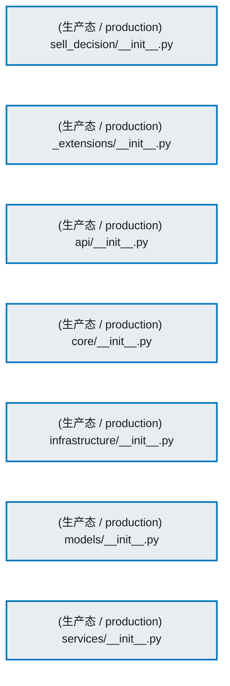
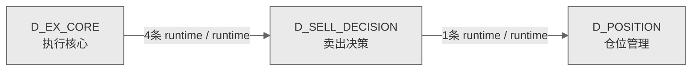

# 67_d_sell_decision / 卖出决策 / Sell Decision

> **功能简介 / Overview**: 卖出决策，负责卖出信号生成、卖出时机判断和退出策略

> **文档作用 / Purpose**: 展示 卖出决策（D_SELL_DECISION）功能域的模块清单、域内依赖关系、跨域依赖关系、架构分层视图，供架构审查和域治理参考。

> 本文档由 generate_domain_doc.py 从 depgraph (PostgreSQL) 自动生成
> 数据源: depgraph (PostgreSQL) nodes表 + edges表

> **[可缩放 HTML 版 / Zoomable HTML](http://localhost:8765/docs/02_enterprise_architecture/02_domain_architecture_docs/67_d_sell_decision.html)** — Ctrl+滚轮缩放 ｜ 双击重置 ｜ Ctrl+Shift+D 切换拖动/选择模式

## 域基本信息 / Domain Overview

| 字段 | 值 | Field | Value |
|------|------|-------|-------|
| 编号 | 67 | Number | 67 |
| 域ID | D_SELL_DECISION | Domain ID | D_SELL_DECISION |
| 域名称 | 卖出决策 | Domain Name | Sell Decision |
| 层级 | L2 业务域层 | Layer | L2 Domain |
| 模块数 | 7 | Module Count | 7 |
| 域内依赖 | 0 | Internal Dependencies | 0 |
| 跨域入边 | 4 | Cross-domain Incoming | 4 |
| 跨域出边 | 1 | Cross-domain Outgoing | 1 |
| 设计态模块 | 0 | Design Modules | 0 |
| 生产态模块 | 7 | Production Modules | 7 |
| 容量 | 7/150 (正常) | Capacity | 7/150 (正常) |
| 描述 | 卖出决策，负责卖出信号生成、卖出时机判断和退出策略 | Description | 卖出决策，负责卖出信号生成、卖出时机判断和退出策略 |

## 模块分层清单 / Module Layered List

> 按 architecture_layer 分组的模块清单（共 7 个模块 / 7 modules）。

### L2 领域层 / Domain Layer (7 modules)

| # | 模块路径 / Module Path | 模块名称 / Module Name (功能简介 / Description) | 成熟度 / Maturity | 蓝图 / Blueprint |
|:--:|---------|---------|:---:|:---:|
| 1 | src/zephyr/sell_decision/__init__.py | sell_decision/__init__.py | 生产态 / production |  |
| 2 | src/zephyr/sell_decision/_extensions/__init__.py | _extensions/__init__.py | 生产态 / production |  |
| 3 | src/zephyr/sell_decision/api/__init__.py | api/__init__.py | 生产态 / production |  |
| 4 | src/zephyr/sell_decision/core/__init__.py | core/__init__.py | 生产态 / production |  |
| 5 | src/zephyr/sell_decision/infrastructure/__init__.py | infrastructure/__init__.py | 生产态 / production |  |
| 6 | src/zephyr/sell_decision/models/__init__.py | models/__init__.py | 生产态 / production |  |
| 7 | src/zephyr/sell_decision/services/__init__.py | services/__init__.py | 生产态 / production |  |

## 域内依赖图 / Internal Dependency Diagram

> 依赖图内嵌在本文档中，IDE 可直接渲染显示。参考 decision_index.md 设计，分三个视图：合并全景图、运营态子图、设计态子图（按 design_maturity 实际值拆分）。
>
> **图例说明 / Legend**：
> - **实线边框 = 运营态模块**（production，已上线运行）
> - **虚线边框 = 设计态模块**（design，蓝图阶段，代码未写）
> - **实线箭头 = 运营态依赖**（已生效的依赖关系）
> - **虚线箭头 = 非运营态依赖**（计划中/验证中的依赖关系）

### 合并全景图（全部模块，标签标注成熟度）

> 展示全部 7 个模块（生产态 7 + 设计态 0），标签标注成熟度。

### 运营态子图（仅 design_maturity=production 的模块和依赖）

> 仅展示已上线运行的模块（共 7 个，0 条域内依赖）。

### 设计态子图（仅 design_maturity=design 的模块和依赖）

> 仅展示蓝图阶段、代码未写的设计态模块（共 0 个，0 条域内依赖）。

> （无设计态模块 / No design modules）

## 跨域依赖 / Cross-domain Dependencies

### 本域依赖的其他域（出边）/ Depends On

无跨域出边依赖 / No cross-domain outgoing dependencies

### 依赖本域的其他域（入边）/ Depended By

无跨域入边依赖 / No cross-domain incoming dependencies

### 跨域依赖图 / Cross-domain Dependency Diagram

> 本域与 2 个外部域直接连接（出边 1 条 + 入边 4 条 = 5 条）。只显示直接连接的域，不展开具体节点。

## 说明 / Notes

- **数据源 / Data Source**: `depgraph (PostgreSQL)` 的 `nodes`、`edges`、`domains` 表
- **生成器 / Generator**: `generate_domain_doc.py`（G2+G10 合并）
- **维护方式 / Maintenance**: 自动生成，全景图更新时刷新
- **文件名规则 / File Naming**: `{编号:02d}_{域ID小写}.md`，如 `16_d_trading.md`
- **图例说明 / Legend**: `[production]`=已上线 / `[design]`=设计中 / `[unknown]`=未知
