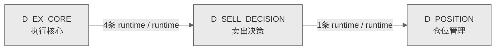

# 67_d_sell_decision / 卖出决策域 / Sell Decision

> **功能简介 / Overview**: 卖出决策，负责卖出信号生成、卖出时机判断和退出策略

> **文档作用 / Purpose**: 展示 卖出决策（D_SELL_DECISION）功能域的域内依赖关系、跨域依赖关系，模块信息（成熟度/中英文名/大白话/文件路径）内嵌于 Mermaid 节点，供架构审查和域治理参考。

> 本文档由 generate_domain_doc.py 从 depgraph (PostgreSQL) 自动生成
> 数据源: depgraph (PostgreSQL) nodes表 + edges表

> **[可缩放 HTML 版 / Zoomable HTML](http://localhost:8765/docs/02_enterprise_architecture/02_domain_architecture_docs/_zoomable_html/67_d_sell_decision.html)** — Ctrl+滚轮缩放 ｜ 双击重置 ｜ Ctrl+Shift+D 切换拖动/选择模式

## 域基本信息 / Domain Overview

| 字段 | 值 | Field | Value |
|------|------|-------|-------|
| 编号 | 67 | Number | 67 |
| 域ID | D_SELL_DECISION | Domain ID | D_SELL_DECISION |
| 域名称 | 卖出决策 | Domain Name | Sell Decision |
| 层级 | L2 业务域层 | Layer | L2 Domain |
| 模块数 | 21 | Module Count | 21 |
| 域内依赖 | 13 | Internal Dependencies | 13 |
| 跨域入边 | 4 | Cross-domain Incoming | 4 |
| 跨域出边 | 1 | Cross-domain Outgoing | 1 |
| 设计态模块 | 14 | Design Modules | 14 |
| 生产态模块 | 7 | Production Modules | 7 |
| 容量 | 7/150 (正常) | Capacity | 7/150 (正常) |
| 描述 | 卖出决策，负责卖出信号生成、卖出时机判断和退出策略 | Description | 卖出决策，负责卖出信号生成、卖出时机判断和退出策略 |

## 域内依赖图 / Internal Dependency Diagram

> 依赖图内嵌在本文档中，IDE 可直接渲染；网页版可 Ctrl+滚轮缩放 + 拖动平移查看细节。
>
> **图例说明 / Legend**：
> - 🟦 **蓝色 = 运营态模块**（production，已上线运行）
> - 🟧 **橙色虚线 = 设计态模块**（design，蓝图阶段，代码未写）
> - **实线箭头 = 运营态依赖**（已生效的依赖关系）
> - **虚线箭头 = 非运营态依赖**（计划中/验证中的依赖关系）

### 全景图（全部模块，颜色区分运营态/设计态）

> 展示全部 21 个模块（生产态 7 + 设计态 14），含跨域依赖外部节点。节点含成熟度+名称+大白话/简介+文件路径。

```mermaid
%%{init: {'theme': 'base', 'themeVariables': {'primaryColor': '#eaeaea', 'primaryTextColor': '#333333', 'primaryBorderColor': '#666666', 'lineColor': '#666666', 'secondaryColor': '#eaeaea', 'tertiaryColor': '#eaeaea', 'fontSize': '14px'}}}%%
flowchart TD
    src_zephyr_sell_decision_init_py["(生产态 / production) 包入口 / __init__<br/>sell_decision的包入口，把这一层的子模块归到一起<br/>统一管理，用到谁才加载谁，避免一次性全加载拖慢启<br/>动。<br/>文件: sell_decision/__init__.py"]
    src_zephyr_sell_decision_extensions_init_py["(生产态 / production) 包入口 / __init__<br/>_extensions的包入口，把这一层的子模块归到一起统<br/>一管理，用到谁才加载谁，避免一次性全加载拖慢启动<br/>。<br/>文件: _extensions/__init__.py"]
    src_zephyr_sell_decision_api_init_py["(生产态 / production) 包入口 / __init__<br/>接口的包入口，把这一层的子模块归到一起统一管理，<br/>用到谁才加载谁，避免一次性全加载拖慢启动。<br/>文件: api/__init__.py"]
    src_zephyr_sell_decision_core_init_py["(生产态 / production) 包入口 / __init__<br/>core的包入口，把这一层的子模块归到一起统一管理，<br/>用到谁才加载谁，避免一次性全加载拖慢启动。<br/>文件: core/__init__.py"]
    src_zephyr_sell_decision_core_breakout_failure_detector_py["(设计态 / design) 突破故障检测器 / breakout_<br/>failure_detector<br/>突破failure检测器，core的检测器，检测特定模式或<br/>异常情况。<br/>文件: core/breakout_failure_detector.py<br/>⛔ 卖出决策域，设计已就绪，等待开发排期"]
    src_zephyr_sell_decision_core_position_triage_py["(设计态 / design) 持仓分诊 / position_triage<br/>持仓分诊（position_triage.py）<br/>文件: core/position_triage.py<br/>⛔ 卖出决策域，设计已就绪，等待开发排期"]
    src_zephyr_sell_decision_core_replacement_rebalance_sell_py["(设计态 / design) replacementrebalance卖出 /<br/>replacement_rebalance_sell<br/>replacementrebalance卖出（replacement_rebalance_<br/>sell.py）<br/>文件: core/replacement_rebalance_sell.py<br/>⛔ 卖出决策域，设计已就绪，等待开发排期"]
    src_zephyr_sell_decision_core_sell_urgency_scorer_py["(设计态 / design) 卖出urgency评分器 / sell_<br/>urgency_scorer<br/>卖出urgency评分器（sell_urgency_scorer.py）<br/>文件: core/sell_urgency_scorer.py<br/>⛔ 卖出决策域，设计已就绪，等待开发排期"]
    src_zephyr_sell_decision_core_strategy_specific_stop_framework_py["(设计态 / design) 策略specific止损framework /<br/>strategy_specific_stop_framework<br/>策略specific止损framework（strategy_specific_<br/>stop_framework.py）<br/>文件: core/strategy_specific_stop_framework.py<br/>⛔ 卖出决策域，设计已就绪，等待开发排期"]
    src_zephyr_sell_decision_core_take_profit_strategy_py["(设计态 / design) 止盈利润策略 / take_profit_<br/>strategy<br/>止盈利润策略（take_profit_strategy.py）<br/>文件: core/take_profit_strategy.py<br/>⛔ 卖出决策域，设计已就绪，等待开发排期"]
    src_zephyr_sell_decision_infrastructure_init_py["(生产态 / production) 包入口 / __init__<br/>基础设施的包入口，把这一层的子模块归到一起统一管<br/>理，用到谁才加载谁，避免一次性全加载拖慢启动。<br/>文件: infrastructure/__init__.py"]
    src_zephyr_sell_decision_models_init_py["(生产态 / production) 包入口 / __init__<br/>模型的包入口，把这一层的子模块归到一起统一管理，<br/>用到谁才加载谁，避免一次性全加载拖慢启动。<br/>文件: models/__init__.py"]
    src_zephyr_sell_decision_services_init_py["(生产态 / production) 包入口 / __init__<br/>services的包入口，把这一层的子模块归到一起统一管<br/>理，用到谁才加载谁，避免一次性全加载拖慢启动。<br/>文件: services/__init__.py"]
    src_zephyr_sell_decision_init_py ~~~ src_zephyr_sell_decision_extensions_init_py
    src_zephyr_sell_decision_extensions_init_py ~~~ src_zephyr_sell_decision_api_init_py
    src_zephyr_sell_decision_api_init_py ~~~ src_zephyr_sell_decision_core_init_py
    src_zephyr_sell_decision_core_init_py ~~~ src_zephyr_sell_decision_core_breakout_failure_detector_py
    src_zephyr_sell_decision_core_breakout_failure_detector_py ~~~ src_zephyr_sell_decision_core_position_triage_py
    src_zephyr_sell_decision_core_position_triage_py ~~~ src_zephyr_sell_decision_core_replacement_rebalance_sell_py
    src_zephyr_sell_decision_core_replacement_rebalance_sell_py ~~~ src_zephyr_sell_decision_core_sell_urgency_scorer_py
    src_zephyr_sell_decision_core_sell_urgency_scorer_py ~~~ src_zephyr_sell_decision_core_strategy_specific_stop_framework_py
    src_zephyr_sell_decision_core_strategy_specific_stop_framework_py ~~~ src_zephyr_sell_decision_core_take_profit_strategy_py
    src_zephyr_sell_decision_core_take_profit_strategy_py ~~~ src_zephyr_sell_decision_infrastructure_init_py
    src_zephyr_sell_decision_infrastructure_init_py ~~~ src_zephyr_sell_decision_models_init_py
    src_zephyr_sell_decision_models_init_py ~~~ src_zephyr_sell_decision_services_init_py
    src_zephyr_sell_decision_core_buy_sell_conflict_arbitrator_py["(设计态 / design) 买入卖出冲突仲裁器 / buy_sell_<br/>conflict_arbitrator<br/>买入卖出冲突仲裁器（buy_sell_conflict_<br/>arbitrator.py）<br/>文件: core/buy_sell_conflict_arbitrator.py<br/>⛔ 卖出决策域，设计已就绪，等待开发排期"]
    src_zephyr_sell_decision_core_exit_scenario_planner_py["(设计态 / design) 退出场景规划器 / exit_<br/>scenario_planner<br/>退出场景规划器，卖出决策的规划器，规划执行方案。<br/>文件: core/exit_scenario_planner.py<br/>⛔ 卖出决策域，设计已就绪，等待开发排期"]
    src_zephyr_sell_decision_core_scaling_out_architect_py["(设计态 / design) scaling出architect / scaling_<br/>out_architect<br/>scaling出architect（scaling_out_architect.py）<br/>文件: core/scaling_out_architect.py<br/>⛔ 卖出决策域，设计已就绪，等待开发排期"]
    src_zephyr_sell_decision_core_stop_loss_strategy_py["(设计态 / design) 停止亏损策略 / stop_loss_<br/>strategy<br/>停止亏损策略（stop_loss_strategy.py）<br/>文件: core/stop_loss_strategy.py<br/>⛔ 卖出决策域，设计已就绪，等待开发排期"]
    src_zephyr_sell_decision_core_buy_sell_conflict_arbitrator_py ~~~ src_zephyr_sell_decision_core_exit_scenario_planner_py
    src_zephyr_sell_decision_core_exit_scenario_planner_py ~~~ src_zephyr_sell_decision_core_scaling_out_architect_py
    src_zephyr_sell_decision_core_scaling_out_architect_py ~~~ src_zephyr_sell_decision_core_stop_loss_strategy_py
    src_zephyr_sell_decision_core_sell_signal_fusion_engine_py["(设计态 / design) 卖信号融合引擎 / sell_signal_<br/>fusion_engine<br/>卖信号融合引擎，core的引擎，执行核心逻辑的处理引<br/>擎。<br/>文件: core/sell_signal_fusion_engine.py<br/>⛔ 卖出决策域，设计已就绪，等待开发排期"]
    src_zephyr_sell_decision_core_sell_signal_scorer_py["(设计态 / design) 卖信号评分器 / sell_signal_<br/>scorer<br/>卖信号评分器（sell_signal_scorer.py）<br/>文件: core/sell_signal_scorer.py<br/>⛔ 卖出决策域，设计已就绪，等待开发排期"]
    src_zephyr_sell_decision_core_t_trade_coordinator_py["(设计态 / design) t交易协调器 / t_trade_<br/>coordinator<br/>t交易协调器（t_trade_coordinator.py）<br/>文件: core/t_trade_coordinator.py<br/>⛔ 卖出决策域，设计已就绪，等待开发排期"]
    src_zephyr_sell_decision_core_sell_signal_scorer_py ~~~ src_zephyr_sell_decision_core_t_trade_coordinator_py
    src_zephyr_sell_decision_core_sell_signal_collector_py["(设计态 / design) 卖信号收集器 / sell_signal_<br/>collector<br/>卖信号收集器，core的采集器，从多处收集数据。<br/>文件: core/sell_signal_collector.py<br/>⛔ 卖出决策域，设计已就绪，等待开发排期"]
    src_zephyr_sell_decision_core_position_triage_py -.->|event / event| src_zephyr_sell_decision_core_sell_signal_fusion_engine_py
    src_zephyr_sell_decision_core_position_triage_py -.->|data / data| src_zephyr_sell_decision_core_exit_scenario_planner_py
    src_zephyr_sell_decision_core_sell_signal_scorer_py -.->|runtime / runtime| src_zephyr_sell_decision_core_sell_signal_collector_py
    src_zephyr_sell_decision_core_breakout_failure_detector_py -.->|data / data| src_zephyr_sell_decision_core_sell_signal_scorer_py
    src_zephyr_sell_decision_core_take_profit_strategy_py -.->|runtime / runtime| src_zephyr_sell_decision_core_sell_signal_scorer_py
    src_zephyr_sell_decision_core_stop_loss_strategy_py -.->|runtime / runtime| src_zephyr_sell_decision_core_sell_signal_scorer_py
    src_zephyr_sell_decision_core_replacement_rebalance_sell_py -.->|data / data| src_zephyr_sell_decision_core_sell_signal_fusion_engine_py
    src_zephyr_sell_decision_core_sell_signal_fusion_engine_py -.->|runtime / runtime| src_zephyr_sell_decision_core_sell_signal_scorer_py
    src_zephyr_sell_decision_core_sell_signal_fusion_engine_py -.->|data / data| src_zephyr_sell_decision_core_t_trade_coordinator_py
    src_zephyr_sell_decision_core_buy_sell_conflict_arbitrator_py -.->|runtime / runtime| src_zephyr_sell_decision_core_sell_signal_fusion_engine_py
    src_zephyr_sell_decision_core_sell_urgency_scorer_py -.->|runtime / runtime| src_zephyr_sell_decision_core_buy_sell_conflict_arbitrator_py
    src_zephyr_sell_decision_core_sell_urgency_scorer_py -.->|data / data| src_zephyr_sell_decision_core_scaling_out_architect_py
    src_zephyr_sell_decision_core_strategy_specific_stop_framework_py -.->|data / data| src_zephyr_sell_decision_core_stop_loss_strategy_py
    D_POSITION["(设计态 / design) 仓位管理 / Position Management<br/>仓位管理，负责持仓跟踪、仓位计算和盈亏分析<br/>跨域节点 / cross-domain"]
    src_zephyr_sell_decision_core_sell_signal_fusion_engine_py -.->|runtime / runtime| D_POSITION
    D_EX_CORE["(设计态 / design) 执行核心 / Execution Core<br/>执行核心，负责订单执行引擎、执行策略和执行管理<br/>跨域节点 / cross-domain"]
    D_EX_CORE -.->|runtime / runtime| src_zephyr_sell_decision_core_position_triage_py
    D_EX_CORE -.->|runtime / runtime| src_zephyr_sell_decision_core_position_triage_py
    D_EX_CORE -.->|runtime / runtime| src_zephyr_sell_decision_core_position_triage_py
    D_EX_CORE -.->|runtime / runtime| src_zephyr_sell_decision_core_position_triage_py
    classDef production fill:#e1f5fe,stroke:#01579b,stroke-width:2px,color:#000
    classDef design fill:#fff3e0,stroke:#e65100,stroke-width:2px,color:#000,stroke-dasharray: 5 5
    classDef external_prod fill:#e8f4fd,stroke:#0277bd,stroke-width:1px,color:#000
    classDef external_design fill:#fff8e7,stroke:#ef6c00,stroke-width:1px,color:#000,stroke-dasharray: 5 5
    class src_zephyr_sell_decision_init_py,src_zephyr_sell_decision_extensions_init_py,src_zephyr_sell_decision_api_init_py,src_zephyr_sell_decision_core_init_py,src_zephyr_sell_decision_infrastructure_init_py,src_zephyr_sell_decision_models_init_py,src_zephyr_sell_decision_services_init_py production
    class src_zephyr_sell_decision_core_breakout_failure_detector_py,src_zephyr_sell_decision_core_buy_sell_conflict_arbitrator_py,src_zephyr_sell_decision_core_exit_scenario_planner_py,src_zephyr_sell_decision_core_position_triage_py,src_zephyr_sell_decision_core_replacement_rebalance_sell_py,src_zephyr_sell_decision_core_scaling_out_architect_py,src_zephyr_sell_decision_core_sell_signal_collector_py,src_zephyr_sell_decision_core_sell_signal_fusion_engine_py,src_zephyr_sell_decision_core_sell_signal_scorer_py,src_zephyr_sell_decision_core_sell_urgency_scorer_py,src_zephyr_sell_decision_core_stop_loss_strategy_py,src_zephyr_sell_decision_core_strategy_specific_stop_framework_py,src_zephyr_sell_decision_core_t_trade_coordinator_py,src_zephyr_sell_decision_core_take_profit_strategy_py design
    class D_POSITION,D_EX_CORE external_design
```

### 运营态的图（仅 design_maturity=production 的模块和域内依赖）

> 仅展示已上线运行的模块（共 7 个），不含跨域外部节点。跨域依赖见下方跨域依赖章节。

```mermaid
%%{init: {'theme': 'base', 'themeVariables': {'primaryColor': '#eaeaea', 'primaryTextColor': '#333333', 'primaryBorderColor': '#666666', 'lineColor': '#666666', 'secondaryColor': '#eaeaea', 'tertiaryColor': '#eaeaea', 'fontSize': '14px'}}}%%
flowchart TD
    src_zephyr_sell_decision_init_py["(生产态 / production) 包入口 / __init__<br/>sell_decision的包入口，把这一层的子模块归到一起<br/>统一管理，用到谁才加载谁，避免一次性全加载拖慢启<br/>动。<br/>文件: sell_decision/__init__.py"]
    src_zephyr_sell_decision_extensions_init_py["(生产态 / production) 包入口 / __init__<br/>_extensions的包入口，把这一层的子模块归到一起统<br/>一管理，用到谁才加载谁，避免一次性全加载拖慢启动<br/>。<br/>文件: _extensions/__init__.py"]
    src_zephyr_sell_decision_api_init_py["(生产态 / production) 包入口 / __init__<br/>接口的包入口，把这一层的子模块归到一起统一管理，<br/>用到谁才加载谁，避免一次性全加载拖慢启动。<br/>文件: api/__init__.py"]
    src_zephyr_sell_decision_core_init_py["(生产态 / production) 包入口 / __init__<br/>core的包入口，把这一层的子模块归到一起统一管理，<br/>用到谁才加载谁，避免一次性全加载拖慢启动。<br/>文件: core/__init__.py"]
    src_zephyr_sell_decision_infrastructure_init_py["(生产态 / production) 包入口 / __init__<br/>基础设施的包入口，把这一层的子模块归到一起统一管<br/>理，用到谁才加载谁，避免一次性全加载拖慢启动。<br/>文件: infrastructure/__init__.py"]
    src_zephyr_sell_decision_models_init_py["(生产态 / production) 包入口 / __init__<br/>模型的包入口，把这一层的子模块归到一起统一管理，<br/>用到谁才加载谁，避免一次性全加载拖慢启动。<br/>文件: models/__init__.py"]
    src_zephyr_sell_decision_services_init_py["(生产态 / production) 包入口 / __init__<br/>services的包入口，把这一层的子模块归到一起统一管<br/>理，用到谁才加载谁，避免一次性全加载拖慢启动。<br/>文件: services/__init__.py"]
    src_zephyr_sell_decision_init_py ~~~ src_zephyr_sell_decision_extensions_init_py
    src_zephyr_sell_decision_extensions_init_py ~~~ src_zephyr_sell_decision_api_init_py
    src_zephyr_sell_decision_api_init_py ~~~ src_zephyr_sell_decision_core_init_py
    src_zephyr_sell_decision_core_init_py ~~~ src_zephyr_sell_decision_infrastructure_init_py
    src_zephyr_sell_decision_infrastructure_init_py ~~~ src_zephyr_sell_decision_models_init_py
    src_zephyr_sell_decision_models_init_py ~~~ src_zephyr_sell_decision_services_init_py
    classDef production fill:#e1f5fe,stroke:#01579b,stroke-width:2px,color:#000
    classDef design fill:#fff3e0,stroke:#e65100,stroke-width:2px,color:#000,stroke-dasharray: 5 5
    classDef external_prod fill:#e8f4fd,stroke:#0277bd,stroke-width:1px,color:#000
    classDef external_design fill:#fff8e7,stroke:#ef6c00,stroke-width:1px,color:#000,stroke-dasharray: 5 5
    class src_zephyr_sell_decision_init_py,src_zephyr_sell_decision_extensions_init_py,src_zephyr_sell_decision_api_init_py,src_zephyr_sell_decision_core_init_py,src_zephyr_sell_decision_infrastructure_init_py,src_zephyr_sell_decision_models_init_py,src_zephyr_sell_decision_services_init_py production
```

### 设计态的图（仅 design_maturity=design 的模块和域内依赖）

> 仅展示蓝图阶段、代码未写的设计态模块（共 14 个），不含跨域外部节点。

```mermaid
%%{init: {'theme': 'base', 'themeVariables': {'primaryColor': '#eaeaea', 'primaryTextColor': '#333333', 'primaryBorderColor': '#666666', 'lineColor': '#666666', 'secondaryColor': '#eaeaea', 'tertiaryColor': '#eaeaea', 'fontSize': '14px'}}}%%
flowchart TD
    src_zephyr_sell_decision_core_breakout_failure_detector_py["(设计态 / design) 突破故障检测器 / breakout_<br/>failure_detector<br/>突破failure检测器，core的检测器，检测特定模式或<br/>异常情况。<br/>文件: core/breakout_failure_detector.py<br/>⛔ 卖出决策域，设计已就绪，等待开发排期"]
    src_zephyr_sell_decision_core_position_triage_py["(设计态 / design) 持仓分诊 / position_triage<br/>持仓分诊（position_triage.py）<br/>文件: core/position_triage.py<br/>⛔ 卖出决策域，设计已就绪，等待开发排期"]
    src_zephyr_sell_decision_core_replacement_rebalance_sell_py["(设计态 / design) replacementrebalance卖出 /<br/>replacement_rebalance_sell<br/>replacementrebalance卖出（replacement_rebalance_<br/>sell.py）<br/>文件: core/replacement_rebalance_sell.py<br/>⛔ 卖出决策域，设计已就绪，等待开发排期"]
    src_zephyr_sell_decision_core_sell_urgency_scorer_py["(设计态 / design) 卖出urgency评分器 / sell_<br/>urgency_scorer<br/>卖出urgency评分器（sell_urgency_scorer.py）<br/>文件: core/sell_urgency_scorer.py<br/>⛔ 卖出决策域，设计已就绪，等待开发排期"]
    src_zephyr_sell_decision_core_strategy_specific_stop_framework_py["(设计态 / design) 策略specific止损framework /<br/>strategy_specific_stop_framework<br/>策略specific止损framework（strategy_specific_<br/>stop_framework.py）<br/>文件: core/strategy_specific_stop_framework.py<br/>⛔ 卖出决策域，设计已就绪，等待开发排期"]
    src_zephyr_sell_decision_core_take_profit_strategy_py["(设计态 / design) 止盈利润策略 / take_profit_<br/>strategy<br/>止盈利润策略（take_profit_strategy.py）<br/>文件: core/take_profit_strategy.py<br/>⛔ 卖出决策域，设计已就绪，等待开发排期"]
    src_zephyr_sell_decision_core_breakout_failure_detector_py ~~~ src_zephyr_sell_decision_core_position_triage_py
    src_zephyr_sell_decision_core_position_triage_py ~~~ src_zephyr_sell_decision_core_replacement_rebalance_sell_py
    src_zephyr_sell_decision_core_replacement_rebalance_sell_py ~~~ src_zephyr_sell_decision_core_sell_urgency_scorer_py
    src_zephyr_sell_decision_core_sell_urgency_scorer_py ~~~ src_zephyr_sell_decision_core_strategy_specific_stop_framework_py
    src_zephyr_sell_decision_core_strategy_specific_stop_framework_py ~~~ src_zephyr_sell_decision_core_take_profit_strategy_py
    src_zephyr_sell_decision_core_buy_sell_conflict_arbitrator_py["(设计态 / design) 买入卖出冲突仲裁器 / buy_sell_<br/>conflict_arbitrator<br/>买入卖出冲突仲裁器（buy_sell_conflict_<br/>arbitrator.py）<br/>文件: core/buy_sell_conflict_arbitrator.py<br/>⛔ 卖出决策域，设计已就绪，等待开发排期"]
    src_zephyr_sell_decision_core_exit_scenario_planner_py["(设计态 / design) 退出场景规划器 / exit_<br/>scenario_planner<br/>退出场景规划器，卖出决策的规划器，规划执行方案。<br/>文件: core/exit_scenario_planner.py<br/>⛔ 卖出决策域，设计已就绪，等待开发排期"]
    src_zephyr_sell_decision_core_scaling_out_architect_py["(设计态 / design) scaling出architect / scaling_<br/>out_architect<br/>scaling出architect（scaling_out_architect.py）<br/>文件: core/scaling_out_architect.py<br/>⛔ 卖出决策域，设计已就绪，等待开发排期"]
    src_zephyr_sell_decision_core_stop_loss_strategy_py["(设计态 / design) 停止亏损策略 / stop_loss_<br/>strategy<br/>停止亏损策略（stop_loss_strategy.py）<br/>文件: core/stop_loss_strategy.py<br/>⛔ 卖出决策域，设计已就绪，等待开发排期"]
    src_zephyr_sell_decision_core_buy_sell_conflict_arbitrator_py ~~~ src_zephyr_sell_decision_core_exit_scenario_planner_py
    src_zephyr_sell_decision_core_exit_scenario_planner_py ~~~ src_zephyr_sell_decision_core_scaling_out_architect_py
    src_zephyr_sell_decision_core_scaling_out_architect_py ~~~ src_zephyr_sell_decision_core_stop_loss_strategy_py
    src_zephyr_sell_decision_core_sell_signal_fusion_engine_py["(设计态 / design) 卖信号融合引擎 / sell_signal_<br/>fusion_engine<br/>卖信号融合引擎，core的引擎，执行核心逻辑的处理引<br/>擎。<br/>文件: core/sell_signal_fusion_engine.py<br/>⛔ 卖出决策域，设计已就绪，等待开发排期"]
    src_zephyr_sell_decision_core_sell_signal_scorer_py["(设计态 / design) 卖信号评分器 / sell_signal_<br/>scorer<br/>卖信号评分器（sell_signal_scorer.py）<br/>文件: core/sell_signal_scorer.py<br/>⛔ 卖出决策域，设计已就绪，等待开发排期"]
    src_zephyr_sell_decision_core_t_trade_coordinator_py["(设计态 / design) t交易协调器 / t_trade_<br/>coordinator<br/>t交易协调器（t_trade_coordinator.py）<br/>文件: core/t_trade_coordinator.py<br/>⛔ 卖出决策域，设计已就绪，等待开发排期"]
    src_zephyr_sell_decision_core_sell_signal_scorer_py ~~~ src_zephyr_sell_decision_core_t_trade_coordinator_py
    src_zephyr_sell_decision_core_sell_signal_collector_py["(设计态 / design) 卖信号收集器 / sell_signal_<br/>collector<br/>卖信号收集器，core的采集器，从多处收集数据。<br/>文件: core/sell_signal_collector.py<br/>⛔ 卖出决策域，设计已就绪，等待开发排期"]
    src_zephyr_sell_decision_core_position_triage_py -.->|event / event| src_zephyr_sell_decision_core_sell_signal_fusion_engine_py
    src_zephyr_sell_decision_core_position_triage_py -.->|data / data| src_zephyr_sell_decision_core_exit_scenario_planner_py
    src_zephyr_sell_decision_core_sell_signal_scorer_py -.->|runtime / runtime| src_zephyr_sell_decision_core_sell_signal_collector_py
    src_zephyr_sell_decision_core_breakout_failure_detector_py -.->|data / data| src_zephyr_sell_decision_core_sell_signal_scorer_py
    src_zephyr_sell_decision_core_take_profit_strategy_py -.->|runtime / runtime| src_zephyr_sell_decision_core_sell_signal_scorer_py
    src_zephyr_sell_decision_core_stop_loss_strategy_py -.->|runtime / runtime| src_zephyr_sell_decision_core_sell_signal_scorer_py
    src_zephyr_sell_decision_core_replacement_rebalance_sell_py -.->|data / data| src_zephyr_sell_decision_core_sell_signal_fusion_engine_py
    src_zephyr_sell_decision_core_sell_signal_fusion_engine_py -.->|runtime / runtime| src_zephyr_sell_decision_core_sell_signal_scorer_py
    src_zephyr_sell_decision_core_sell_signal_fusion_engine_py -.->|data / data| src_zephyr_sell_decision_core_t_trade_coordinator_py
    src_zephyr_sell_decision_core_buy_sell_conflict_arbitrator_py -.->|runtime / runtime| src_zephyr_sell_decision_core_sell_signal_fusion_engine_py
    src_zephyr_sell_decision_core_sell_urgency_scorer_py -.->|runtime / runtime| src_zephyr_sell_decision_core_buy_sell_conflict_arbitrator_py
    src_zephyr_sell_decision_core_sell_urgency_scorer_py -.->|data / data| src_zephyr_sell_decision_core_scaling_out_architect_py
    src_zephyr_sell_decision_core_strategy_specific_stop_framework_py -.->|data / data| src_zephyr_sell_decision_core_stop_loss_strategy_py
    classDef production fill:#e1f5fe,stroke:#01579b,stroke-width:2px,color:#000
    classDef design fill:#fff3e0,stroke:#e65100,stroke-width:2px,color:#000,stroke-dasharray: 5 5
    classDef external_prod fill:#e8f4fd,stroke:#0277bd,stroke-width:1px,color:#000
    classDef external_design fill:#fff8e7,stroke:#ef6c00,stroke-width:1px,color:#000,stroke-dasharray: 5 5
    class src_zephyr_sell_decision_core_breakout_failure_detector_py,src_zephyr_sell_decision_core_buy_sell_conflict_arbitrator_py,src_zephyr_sell_decision_core_exit_scenario_planner_py,src_zephyr_sell_decision_core_position_triage_py,src_zephyr_sell_decision_core_replacement_rebalance_sell_py,src_zephyr_sell_decision_core_scaling_out_architect_py,src_zephyr_sell_decision_core_sell_signal_collector_py,src_zephyr_sell_decision_core_sell_signal_fusion_engine_py,src_zephyr_sell_decision_core_sell_signal_scorer_py,src_zephyr_sell_decision_core_sell_urgency_scorer_py,src_zephyr_sell_decision_core_stop_loss_strategy_py,src_zephyr_sell_decision_core_strategy_specific_stop_framework_py,src_zephyr_sell_decision_core_t_trade_coordinator_py,src_zephyr_sell_decision_core_take_profit_strategy_py design
```

## 跨域依赖 / Cross-domain Dependencies

### 本域依赖的其他域（出边）/ Depends On

| # | 本域模块 / Source Module | → | 外部域-目标模块 / Target Module | 依赖类型 / Type |
|:--:|---------|:--:|---------|---------|
| 1 | 卖信号融合引擎 / sell_signal_fusion_engine (core/sell_sig... | → | D_POSITION 仓位管理: 卖出持仓链接 / sell_position_link (core/sell_position_lin... | runtime / runtime |

### 依赖本域的其他域（入边）/ Depended By

| # | 外部域-源模块 / Source Module | → | 本域模块 / Target Module | 依赖类型 / Type |
|:--:|---------|:--:|---------|---------|
| 1 | D_EX_CORE 执行核心: 卖出优先级调度器 / sell_priority_scheduler (ex_core/sell_... | → | 持仓分诊 / position_triage (core/position_triage.py) | runtime / runtime |
| 2 | D_EX_CORE 执行核心: 卖出优先级调度器 / sell_priority_scheduler (ex_core/sell_... | → | 持仓分诊 / position_triage (core/position_triage.py) | runtime / runtime |
| 3 | D_EX_CORE 执行核心: 停止亏损止盈利润执行器 / stop_loss_take_profit_executor (... | → | 持仓分诊 / position_triage (core/position_triage.py) | runtime / runtime |
| 4 | D_EX_CORE 执行核心: 停止亏损止盈利润执行器 / stop_loss_take_profit_executor (... | → | 持仓分诊 / position_triage (core/position_triage.py) | runtime / runtime |

### 跨域依赖图 / Cross-domain Dependency Diagram

> 本域与 2 个外部域直接连接（出边 1 条 + 入边 4 条 = 5 条）。只显示直接连接的域，不展开具体节点。

## 说明 / Notes

- **数据源 / Data Source**: `depgraph (PostgreSQL)` 的 `nodes`、`edges`、`domains` 表
- **生成器 / Generator**: `generate_domain_doc.py`（G2+G10 合并）
- **维护方式 / Maintenance**: 自动生成，全景图更新时刷新
- **文件名规则 / File Naming**: `{编号:02d}_{域ID小写}.md`，如 `16_d_trading.md`
- **图例说明 / Legend**: `[production]`=已上线 / `[design]`=设计中 / `[unknown]`=未知
