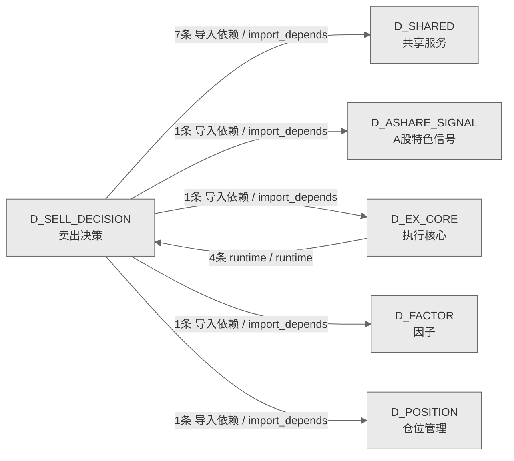

# 67_d_sell_decision / 卖出决策域 / Sell Decision

> **功能简介 / Overview**: 卖出决策，负责卖出信号生成、卖出时机判断和退出策略

> **文档作用 / Purpose**: 展示 卖出决策（D_SELL_DECISION）功能域的域内依赖关系、跨域依赖关系，模块信息（成熟度/中英文名/大白话/文件路径）内嵌于 Mermaid 节点，供架构审查和域治理参考。

> 本文档由 generate_domain_doc.py 从 depgraph (PostgreSQL) 自动生成
> 数据源: depgraph (PostgreSQL) nodes表 + edges表

> **[可缩放 HTML 版 / Zoomable HTML](http://localhost:8765/docs/02_enterprise_architecture/02_domain_architecture_docs/_zoomable_html/67_d_sell_decision.html)** — Ctrl+滚轮缩放 ｜ 双击重置 ｜ Ctrl+Shift+D 切换拖动/选择模式

## 域基本信息 / Domain Overview

| 字段 | 值 | Field | Value |
|------|------|-------|-------|
| 编号 | 67 | Number | 67 |
| 域ID | D_SELL_DECISION | Domain ID | D_SELL_DECISION |
| 域名称 | 卖出决策 | Domain Name | Sell Decision |
| 层级 | L2 业务域层 | Layer | L2 Domain |
| 模块数 | 25 | Module Count | 25 |
| 域内依赖 | 13 | Internal Dependencies | 13 |
| 跨域入边 | 4 | Cross-domain Incoming | 4 |
| 跨域出边 | 11 | Cross-domain Outgoing | 11 |
| 设计态模块 | 12 | Design Modules | 12 |
| 生产态模块 | 13 | Production Modules | 13 |
| 容量 | 13/150 (正常) | Capacity | 13/150 (正常) |
| 描述 | 卖出决策，负责卖出信号生成、卖出时机判断和退出策略 | Description | 卖出决策，负责卖出信号生成、卖出时机判断和退出策略 |

## 域内依赖图 / Internal Dependency Diagram

> 依赖图内嵌在本文档中，IDE 可直接渲染；网页版可 Ctrl+滚轮缩放 + 拖动平移查看细节。
>
> **图例说明 / Legend**：
> - 🟦 **蓝色 = 运营态模块**（production，已上线运行）
> - 🟧 **橙色虚线 = 设计态模块**（design，蓝图阶段，代码未写）
> - **实线箭头 = 运营态依赖**（已生效的依赖关系）
> - **虚线箭头 = 非运营态依赖**（计划中/验证中的依赖关系）

### 全景图（全部模块，颜色区分运营态/设计态）

> 展示全部 25 个模块（生产态 13 + 设计态 12），含跨域依赖外部节点。节点含成熟度+名称+大白话/简介+文件路径。

```mermaid
%%{init: {'theme': 'base', 'themeVariables': {'primaryColor': '#eaeaea', 'primaryTextColor': '#333333', 'primaryBorderColor': '#666666', 'lineColor': '#666666', 'secondaryColor': '#eaeaea', 'tertiaryColor': '#eaeaea', 'fontSize': '14px'}}}%%
flowchart TD
    src_zephyr_sell_decision_init_py["zephyr/sell_decision 包入口<br/>管理zephyr.sell_decision子包的加载和懒导入<br/>Init<br/>文件: sell_decision/__init__.py<br/>(生产态 / production)"]
    src_zephyr_sell_decision_extensions_init_py["sell_decision/_extensions 包入口<br/>管理sell_decision._extensions子包的加载和懒导入<br/>Init<br/>文件: _extensions/__init__.py<br/>(生产态 / production)"]
    src_zephyr_sell_decision_api_init_py["sell_decision/api 包入口<br/>管理sell_decision.api子包的加载和懒导入<br/>Init<br/>文件: api/__init__.py<br/>(生产态 / production)"]
    src_zephyr_sell_decision_core_breakout_failure_detector_py["突破成败状态<br/>Breakout Failure Detector — 突破成败检测器<br/>(MOD-SELL-003)<br/>文件: core/breakout_failure_detector.py<br/>(生产态 / production)"]
    src_zephyr_sell_decision_core_position_triage_py["持仓Triage<br/>卖出决策/核心包的position_triage模块<br/>⛔ 卖出决策域，设计已就绪，等待开发排期<br/>Position Triage<br/>文件: core/position_triage.py<br/>(设计态 / design)"]
    src_zephyr_sell_decision_core_replacement_rebalance_sell_py["ReplacementRebalance卖<br/>卖出决策/核心包的replacement_rebalance_sell模块<br/>⛔ 卖出决策域，设计已就绪，等待开发排期<br/>Replacement Rebalance Sell<br/>文件: core/replacement_rebalance_sell.py<br/>(设计态 / design)"]
    src_zephyr_sell_decision_core_replacement_rebalance_seller_py["置换/再平衡卖出类型<br/>Replacement & Rebalance Seller —<br/>置换与再平衡卖出 (MOD-SELL-006)<br/>Replacement Rebalance Seller<br/>文件: core/replacement_rebalance_seller.py<br/>(生产态 / production)"]
    src_zephyr_sell_decision_core_scaling_out_architect_py["缩放出架构师<br/>卖出决策/核心包的scaling_out_architect模块<br/>⛔ 卖出决策域，设计已就绪，等待开发排期<br/>Scaling Out Architect<br/>文件: core/scaling_out_architect.py<br/>(设计态 / design)"]
    src_zephyr_sell_decision_core_sell_signal_accuracy_monitor_py["卖信号Accuracy监控器<br/>卖出决策/核心包的sell_signal_accuracy_monitor模<br/>块<br/>⛔ 卖出决策域，设计已就绪，等待开发排期<br/>Sell Signal Accuracy Monitor<br/>文件: core/sell_signal_accuracy_monitor.py<br/>(设计态 / design)"]
    src_zephyr_sell_decision_core_sell_signal_fusion_engine_py["融合算法<br/>Sell Signal Fusion Engine — 卖出信号融合引擎<br/>(MOD-SELL-007)<br/>文件: core/sell_signal_fusion_engine.py<br/>(生产态 / production)"]
    src_zephyr_sell_decision_core_sell_urgency_scorer_py["紧迫度等级<br/>Sell Urgency Scorer — 卖出紧迫度评分器<br/>(MOD-SELL-009)<br/>文件: core/sell_urgency_scorer.py<br/>(生产态 / production)"]
    src_zephyr_sell_decision_core_stop_hunting_protector_py["止损位偏移方向<br/>Stop-Hunting Protector — 止损猎杀防护器<br/>(MOD-SELL-015)<br/>Stop Hunting Protector<br/>文件: core/stop_hunting_protector.py<br/>(生产态 / production)"]
    src_zephyr_sell_decision_core_strategy_specific_stop_framework_py["策略Specific止损Framework<br/>卖出决策/核心包的strategy_specific_stop_framewor<br/>k模块<br/>⛔ 卖出决策域，设计已就绪，等待开发排期<br/>Strategy Specific Stop Framework<br/>文件: core/strategy_specific_stop_framework.py<br/>(设计态 / design)"]
    src_zephyr_sell_decision_core_t_trade_coordinator_py["T交易协调器<br/>卖出决策/核心包的t_trade_coordinator模块<br/>⛔ 卖出决策域，设计已就绪，等待开发排期<br/>T Trade Coordinator<br/>文件: core/t_trade_coordinator.py<br/>(设计态 / design)"]
    src_zephyr_sell_decision_core_take_profit_strategy_py["止盈止盈策略<br/>卖出决策/核心包的take_profit_strategy模块<br/>⛔ 卖出决策域，设计已就绪，等待开发排期<br/>Take Profit Strategy<br/>文件: core/take_profit_strategy.py<br/>(设计态 / design)"]
    src_zephyr_sell_decision_infrastructure_init_py["sell_decision/infrastructure 包入口<br/>管理sell_decision.infrastructure子包的加载和懒导<br/>入<br/>Init<br/>文件: infrastructure/__init__.py<br/>(生产态 / production)"]
    src_zephyr_sell_decision_models_init_py["sell_decision/models 包入口<br/>管理sell_decision.models子包的加载和懒导入<br/>Init<br/>文件: models/__init__.py<br/>(生产态 / production)"]
    src_zephyr_sell_decision_services_init_py["sell_decision/services 包入口<br/>管理sell_decision.services子包的加载和懒导入<br/>Init<br/>文件: services/__init__.py<br/>(生产态 / production)"]
    src_zephyr_sell_decision_init_py ~~~ src_zephyr_sell_decision_extensions_init_py
    src_zephyr_sell_decision_extensions_init_py ~~~ src_zephyr_sell_decision_api_init_py
    src_zephyr_sell_decision_api_init_py ~~~ src_zephyr_sell_decision_core_breakout_failure_detector_py
    src_zephyr_sell_decision_core_breakout_failure_detector_py ~~~ src_zephyr_sell_decision_core_position_triage_py
    src_zephyr_sell_decision_core_position_triage_py ~~~ src_zephyr_sell_decision_core_replacement_rebalance_sell_py
    src_zephyr_sell_decision_core_replacement_rebalance_sell_py ~~~ src_zephyr_sell_decision_core_replacement_rebalance_seller_py
    src_zephyr_sell_decision_core_replacement_rebalance_seller_py ~~~ src_zephyr_sell_decision_core_scaling_out_architect_py
    src_zephyr_sell_decision_core_scaling_out_architect_py ~~~ src_zephyr_sell_decision_core_sell_signal_accuracy_monitor_py
    src_zephyr_sell_decision_core_sell_signal_accuracy_monitor_py ~~~ src_zephyr_sell_decision_core_sell_signal_fusion_engine_py
    src_zephyr_sell_decision_core_sell_signal_fusion_engine_py ~~~ src_zephyr_sell_decision_core_sell_urgency_scorer_py
    src_zephyr_sell_decision_core_sell_urgency_scorer_py ~~~ src_zephyr_sell_decision_core_stop_hunting_protector_py
    src_zephyr_sell_decision_core_stop_hunting_protector_py ~~~ src_zephyr_sell_decision_core_strategy_specific_stop_framework_py
    src_zephyr_sell_decision_core_strategy_specific_stop_framework_py ~~~ src_zephyr_sell_decision_core_t_trade_coordinator_py
    src_zephyr_sell_decision_core_t_trade_coordinator_py ~~~ src_zephyr_sell_decision_core_take_profit_strategy_py
    src_zephyr_sell_decision_core_take_profit_strategy_py ~~~ src_zephyr_sell_decision_infrastructure_init_py
    src_zephyr_sell_decision_infrastructure_init_py ~~~ src_zephyr_sell_decision_models_init_py
    src_zephyr_sell_decision_models_init_py ~~~ src_zephyr_sell_decision_services_init_py
    src_zephyr_sell_decision_core_exit_scenario_planner_py["Exit场景Planner<br/>卖出决策/核心包的exit_scenario_planner模块<br/>⛔ 卖出决策域，设计已就绪，等待开发排期<br/>Exit Scenario Planner<br/>文件: core/exit_scenario_planner.py<br/>(设计态 / design)"]
    src_zephyr_sell_decision_core_sell_conflict_arbitrator_py["冲突等级<br/>Sell Conflict Arbitrator — 买卖冲突仲裁器<br/>(MOD-SELL-008)<br/>文件: core/sell_conflict_arbitrator.py<br/>(生产态 / production)"]
    src_zephyr_sell_decision_core_sell_execution_quality_tracker_py["卖执行Quality跟踪器<br/>卖出决策/核心包的sell_execution_quality_tracker<br/>模块<br/>⛔ 卖出决策域，设计已就绪，等待开发排期<br/>Sell Execution Quality Tracker<br/>文件: core/sell_execution_quality_tracker.py<br/>(设计态 / design)"]
    src_zephyr_sell_decision_core_sell_strategy_ab_tester_py["卖策略Ab测试器<br/>卖出决策/核心包的sell_strategy_ab_tester模块<br/>⛔ 卖出决策域，设计已就绪，等待开发排期<br/>Sell Strategy Ab Tester<br/>文件: core/sell_strategy_ab_tester.py<br/>(设计态 / design)"]
    src_zephyr_sell_decision_core_stop_loss_strategy_py["止损亏损策略<br/>卖出决策/核心包的stop_loss_strategy模块<br/>⛔ 卖出决策域，设计已就绪，等待开发排期<br/>Stop Loss Strategy<br/>文件: core/stop_loss_strategy.py<br/>(设计态 / design)"]
    src_zephyr_sell_decision_core_exit_scenario_planner_py ~~~ src_zephyr_sell_decision_core_sell_conflict_arbitrator_py
    src_zephyr_sell_decision_core_sell_conflict_arbitrator_py ~~~ src_zephyr_sell_decision_core_sell_execution_quality_tracker_py
    src_zephyr_sell_decision_core_sell_execution_quality_tracker_py ~~~ src_zephyr_sell_decision_core_sell_strategy_ab_tester_py
    src_zephyr_sell_decision_core_sell_strategy_ab_tester_py ~~~ src_zephyr_sell_decision_core_stop_loss_strategy_py
    src_zephyr_sell_decision_core_sell_signal_collector_py["—不可扩展)<br/>Sell Signal Collector — 卖出信号收集器<br/>(MOD-SELL-001)<br/>文件: core/sell_signal_collector.py<br/>(生产态 / production)"]
    src_zephyr_sell_decision_core_sell_signal_scorer_py["卖信号Scorer<br/>卖出决策/核心包的sell_signal_scorer模块<br/>⛔ 卖出决策域，设计已就绪，等待开发排期<br/>Sell Signal Scorer<br/>文件: core/sell_signal_scorer.py<br/>(设计态 / design)"]
    src_zephyr_sell_decision_core_sell_signal_collector_py ~~~ src_zephyr_sell_decision_core_sell_signal_scorer_py
    src_zephyr_sell_decision_core_position_triage_py -.->|data / data| src_zephyr_sell_decision_core_exit_scenario_planner_py
    src_zephyr_sell_decision_core_take_profit_strategy_py -.->|runtime / runtime| src_zephyr_sell_decision_core_sell_signal_scorer_py
    src_zephyr_sell_decision_core_stop_loss_strategy_py -.->|runtime / runtime| src_zephyr_sell_decision_core_sell_signal_scorer_py
    src_zephyr_sell_decision_core_strategy_specific_stop_framework_py -.->|data / data| src_zephyr_sell_decision_core_stop_loss_strategy_py
    src_zephyr_sell_decision_core_sell_signal_accuracy_monitor_py -.->|import / import| src_zephyr_sell_decision_core_sell_strategy_ab_tester_py
    src_zephyr_sell_decision_core_sell_signal_accuracy_monitor_py -.->|import / import| src_zephyr_sell_decision_core_sell_execution_quality_tracker_py
    src_zephyr_sell_decision_core_breakout_failure_detector_py -->|导入依赖 / import_depends| src_zephyr_sell_decision_core_sell_signal_collector_py
    src_zephyr_sell_decision_core_replacement_rebalance_seller_py -->|导入依赖 / import_depends| src_zephyr_sell_decision_core_sell_signal_collector_py
    src_zephyr_sell_decision_core_sell_signal_fusion_engine_py -->|导入依赖 / import_depends| src_zephyr_sell_decision_core_sell_signal_collector_py
    src_zephyr_sell_decision_core_sell_conflict_arbitrator_py -->|导入依赖 / import_depends| src_zephyr_sell_decision_core_sell_signal_collector_py
    src_zephyr_sell_decision_core_sell_urgency_scorer_py -->|导入依赖 / import_depends| src_zephyr_sell_decision_core_sell_signal_collector_py
    src_zephyr_sell_decision_core_sell_urgency_scorer_py -->|导入依赖 / import_depends| src_zephyr_sell_decision_core_sell_conflict_arbitrator_py
    src_zephyr_sell_decision_core_stop_hunting_protector_py -->|导入依赖 / import_depends| src_zephyr_sell_decision_core_sell_signal_collector_py
    D_EX_CORE["执行核心<br/>执行核心，负责订单执行引擎、执行策略和执行管理<br/>Execution Core<br/>跨域节点 / cross-domain<br/>(设计态 / design)"]
    src_zephyr_sell_decision_core_t_trade_coordinator_py -.->|导入依赖 / import_depends| D_EX_CORE
    D_POSITION["仓位管理<br/>仓位管理，负责持仓跟踪、仓位计算和盈亏分析<br/>Position Management<br/>跨域节点 / cross-domain<br/>(生产态 / production)"]
    src_zephyr_sell_decision_core_t_trade_coordinator_py -.->|导入依赖 / import_depends| D_POSITION
    D_FACTOR["因子<br/>因子，负责因子计算、因子库管理和因子评价<br/>Factor<br/>跨域节点 / cross-domain<br/>(生产态 / production)"]
    src_zephyr_sell_decision_core_t_trade_coordinator_py -.->|导入依赖 / import_depends| D_FACTOR
    D_ASHARE_SIGNAL["A股特色信号<br/>A 股特色信号，负责 A<br/>股市场特色交易信号的生成和管理<br/>A-Share Signal<br/>跨域节点 / cross-domain<br/>(生产态 / production)"]
    src_zephyr_sell_decision_core_t_trade_coordinator_py -.->|导入依赖 / import_depends| D_ASHARE_SIGNAL
    D_SHARED["共享服务<br/>共享服务，负责跨域共享的工具、协议和基础服务<br/>Shared Services<br/>跨域节点 / cross-domain<br/>(生产态 / production)"]
    src_zephyr_sell_decision_core_stop_hunting_protector_py -->|导入依赖 / import_depends| D_SHARED
    src_zephyr_sell_decision_core_sell_signal_collector_py -->|导入依赖 / import_depends| D_SHARED
    src_zephyr_sell_decision_core_sell_conflict_arbitrator_py -->|导入依赖 / import_depends| D_SHARED
    src_zephyr_sell_decision_core_breakout_failure_detector_py -->|导入依赖 / import_depends| D_SHARED
    src_zephyr_sell_decision_core_sell_signal_fusion_engine_py -->|导入依赖 / import_depends| D_SHARED
    src_zephyr_sell_decision_core_replacement_rebalance_seller_py -->|导入依赖 / import_depends| D_SHARED
    src_zephyr_sell_decision_core_sell_urgency_scorer_py -->|导入依赖 / import_depends| D_SHARED
    D_EX_CORE -.->|runtime / runtime| src_zephyr_sell_decision_core_position_triage_py
    D_EX_CORE -.->|runtime / runtime| src_zephyr_sell_decision_core_position_triage_py
    D_EX_CORE -.->|runtime / runtime| src_zephyr_sell_decision_core_position_triage_py
    D_EX_CORE -.->|runtime / runtime| src_zephyr_sell_decision_core_position_triage_py
    classDef production fill:#e1f5fe,stroke:#01579b,stroke-width:2px,color:#000
    classDef design fill:#fff3e0,stroke:#e65100,stroke-width:2px,color:#000,stroke-dasharray: 5 5
    classDef external_prod fill:#e8f4fd,stroke:#0277bd,stroke-width:1px,color:#000
    classDef external_design fill:#fff8e7,stroke:#ef6c00,stroke-width:1px,color:#000,stroke-dasharray: 5 5
    class src_zephyr_sell_decision_init_py,src_zephyr_sell_decision_extensions_init_py,src_zephyr_sell_decision_api_init_py,src_zephyr_sell_decision_core_breakout_failure_detector_py,src_zephyr_sell_decision_core_replacement_rebalance_seller_py,src_zephyr_sell_decision_core_sell_conflict_arbitrator_py,src_zephyr_sell_decision_core_sell_signal_collector_py,src_zephyr_sell_decision_core_sell_signal_fusion_engine_py,src_zephyr_sell_decision_core_sell_urgency_scorer_py,src_zephyr_sell_decision_core_stop_hunting_protector_py,src_zephyr_sell_decision_infrastructure_init_py,src_zephyr_sell_decision_models_init_py,src_zephyr_sell_decision_services_init_py production
    class src_zephyr_sell_decision_core_exit_scenario_planner_py,src_zephyr_sell_decision_core_position_triage_py,src_zephyr_sell_decision_core_replacement_rebalance_sell_py,src_zephyr_sell_decision_core_scaling_out_architect_py,src_zephyr_sell_decision_core_sell_execution_quality_tracker_py,src_zephyr_sell_decision_core_sell_signal_accuracy_monitor_py,src_zephyr_sell_decision_core_sell_signal_scorer_py,src_zephyr_sell_decision_core_sell_strategy_ab_tester_py,src_zephyr_sell_decision_core_stop_loss_strategy_py,src_zephyr_sell_decision_core_strategy_specific_stop_framework_py,src_zephyr_sell_decision_core_t_trade_coordinator_py,src_zephyr_sell_decision_core_take_profit_strategy_py design
    class D_POSITION,D_FACTOR,D_ASHARE_SIGNAL,D_SHARED external_prod
    class D_EX_CORE external_design
```

### 运营态的图（仅 design_maturity=production 的模块和域内依赖）

> 仅展示已上线运行的模块（共 13 个），不含跨域外部节点。跨域依赖见下方跨域依赖章节。

```mermaid
%%{init: {'theme': 'base', 'themeVariables': {'primaryColor': '#eaeaea', 'primaryTextColor': '#333333', 'primaryBorderColor': '#666666', 'lineColor': '#666666', 'secondaryColor': '#eaeaea', 'tertiaryColor': '#eaeaea', 'fontSize': '14px'}}}%%
flowchart TD
    src_zephyr_sell_decision_init_py["zephyr/sell_decision 包入口<br/>管理zephyr.sell_decision子包的加载和懒导入<br/>Init<br/>文件: sell_decision/__init__.py<br/>(生产态 / production)"]
    src_zephyr_sell_decision_extensions_init_py["sell_decision/_extensions 包入口<br/>管理sell_decision._extensions子包的加载和懒导入<br/>Init<br/>文件: _extensions/__init__.py<br/>(生产态 / production)"]
    src_zephyr_sell_decision_api_init_py["sell_decision/api 包入口<br/>管理sell_decision.api子包的加载和懒导入<br/>Init<br/>文件: api/__init__.py<br/>(生产态 / production)"]
    src_zephyr_sell_decision_core_breakout_failure_detector_py["突破成败状态<br/>Breakout Failure Detector — 突破成败检测器<br/>(MOD-SELL-003)<br/>文件: core/breakout_failure_detector.py<br/>(生产态 / production)"]
    src_zephyr_sell_decision_core_replacement_rebalance_seller_py["置换/再平衡卖出类型<br/>Replacement & Rebalance Seller —<br/>置换与再平衡卖出 (MOD-SELL-006)<br/>Replacement Rebalance Seller<br/>文件: core/replacement_rebalance_seller.py<br/>(生产态 / production)"]
    src_zephyr_sell_decision_core_sell_signal_fusion_engine_py["融合算法<br/>Sell Signal Fusion Engine — 卖出信号融合引擎<br/>(MOD-SELL-007)<br/>文件: core/sell_signal_fusion_engine.py<br/>(生产态 / production)"]
    src_zephyr_sell_decision_core_sell_urgency_scorer_py["紧迫度等级<br/>Sell Urgency Scorer — 卖出紧迫度评分器<br/>(MOD-SELL-009)<br/>文件: core/sell_urgency_scorer.py<br/>(生产态 / production)"]
    src_zephyr_sell_decision_core_stop_hunting_protector_py["止损位偏移方向<br/>Stop-Hunting Protector — 止损猎杀防护器<br/>(MOD-SELL-015)<br/>Stop Hunting Protector<br/>文件: core/stop_hunting_protector.py<br/>(生产态 / production)"]
    src_zephyr_sell_decision_infrastructure_init_py["sell_decision/infrastructure 包入口<br/>管理sell_decision.infrastructure子包的加载和懒导<br/>入<br/>Init<br/>文件: infrastructure/__init__.py<br/>(生产态 / production)"]
    src_zephyr_sell_decision_models_init_py["sell_decision/models 包入口<br/>管理sell_decision.models子包的加载和懒导入<br/>Init<br/>文件: models/__init__.py<br/>(生产态 / production)"]
    src_zephyr_sell_decision_services_init_py["sell_decision/services 包入口<br/>管理sell_decision.services子包的加载和懒导入<br/>Init<br/>文件: services/__init__.py<br/>(生产态 / production)"]
    src_zephyr_sell_decision_init_py ~~~ src_zephyr_sell_decision_extensions_init_py
    src_zephyr_sell_decision_extensions_init_py ~~~ src_zephyr_sell_decision_api_init_py
    src_zephyr_sell_decision_api_init_py ~~~ src_zephyr_sell_decision_core_breakout_failure_detector_py
    src_zephyr_sell_decision_core_breakout_failure_detector_py ~~~ src_zephyr_sell_decision_core_replacement_rebalance_seller_py
    src_zephyr_sell_decision_core_replacement_rebalance_seller_py ~~~ src_zephyr_sell_decision_core_sell_signal_fusion_engine_py
    src_zephyr_sell_decision_core_sell_signal_fusion_engine_py ~~~ src_zephyr_sell_decision_core_sell_urgency_scorer_py
    src_zephyr_sell_decision_core_sell_urgency_scorer_py ~~~ src_zephyr_sell_decision_core_stop_hunting_protector_py
    src_zephyr_sell_decision_core_stop_hunting_protector_py ~~~ src_zephyr_sell_decision_infrastructure_init_py
    src_zephyr_sell_decision_infrastructure_init_py ~~~ src_zephyr_sell_decision_models_init_py
    src_zephyr_sell_decision_models_init_py ~~~ src_zephyr_sell_decision_services_init_py
    src_zephyr_sell_decision_core_sell_conflict_arbitrator_py["冲突等级<br/>Sell Conflict Arbitrator — 买卖冲突仲裁器<br/>(MOD-SELL-008)<br/>文件: core/sell_conflict_arbitrator.py<br/>(生产态 / production)"]
    src_zephyr_sell_decision_core_sell_signal_collector_py["—不可扩展)<br/>Sell Signal Collector — 卖出信号收集器<br/>(MOD-SELL-001)<br/>文件: core/sell_signal_collector.py<br/>(生产态 / production)"]
    src_zephyr_sell_decision_core_breakout_failure_detector_py -->|导入依赖 / import_depends| src_zephyr_sell_decision_core_sell_signal_collector_py
    src_zephyr_sell_decision_core_replacement_rebalance_seller_py -->|导入依赖 / import_depends| src_zephyr_sell_decision_core_sell_signal_collector_py
    src_zephyr_sell_decision_core_sell_signal_fusion_engine_py -->|导入依赖 / import_depends| src_zephyr_sell_decision_core_sell_signal_collector_py
    src_zephyr_sell_decision_core_sell_conflict_arbitrator_py -->|导入依赖 / import_depends| src_zephyr_sell_decision_core_sell_signal_collector_py
    src_zephyr_sell_decision_core_sell_urgency_scorer_py -->|导入依赖 / import_depends| src_zephyr_sell_decision_core_sell_signal_collector_py
    src_zephyr_sell_decision_core_sell_urgency_scorer_py -->|导入依赖 / import_depends| src_zephyr_sell_decision_core_sell_conflict_arbitrator_py
    src_zephyr_sell_decision_core_stop_hunting_protector_py -->|导入依赖 / import_depends| src_zephyr_sell_decision_core_sell_signal_collector_py
    classDef production fill:#e1f5fe,stroke:#01579b,stroke-width:2px,color:#000
    classDef design fill:#fff3e0,stroke:#e65100,stroke-width:2px,color:#000,stroke-dasharray: 5 5
    classDef external_prod fill:#e8f4fd,stroke:#0277bd,stroke-width:1px,color:#000
    classDef external_design fill:#fff8e7,stroke:#ef6c00,stroke-width:1px,color:#000,stroke-dasharray: 5 5
    class src_zephyr_sell_decision_init_py,src_zephyr_sell_decision_extensions_init_py,src_zephyr_sell_decision_api_init_py,src_zephyr_sell_decision_core_breakout_failure_detector_py,src_zephyr_sell_decision_core_replacement_rebalance_seller_py,src_zephyr_sell_decision_core_sell_conflict_arbitrator_py,src_zephyr_sell_decision_core_sell_signal_collector_py,src_zephyr_sell_decision_core_sell_signal_fusion_engine_py,src_zephyr_sell_decision_core_sell_urgency_scorer_py,src_zephyr_sell_decision_core_stop_hunting_protector_py,src_zephyr_sell_decision_infrastructure_init_py,src_zephyr_sell_decision_models_init_py,src_zephyr_sell_decision_services_init_py production
```

### 设计态的图（仅 design_maturity=design 的模块和域内依赖）

> 仅展示蓝图阶段、代码未写的设计态模块（共 12 个），不含跨域外部节点。

```mermaid
%%{init: {'theme': 'base', 'themeVariables': {'primaryColor': '#eaeaea', 'primaryTextColor': '#333333', 'primaryBorderColor': '#666666', 'lineColor': '#666666', 'secondaryColor': '#eaeaea', 'tertiaryColor': '#eaeaea', 'fontSize': '14px'}}}%%
flowchart TD
    src_zephyr_sell_decision_core_position_triage_py["持仓Triage<br/>卖出决策/核心包的position_triage模块<br/>⛔ 卖出决策域，设计已就绪，等待开发排期<br/>Position Triage<br/>文件: core/position_triage.py<br/>(设计态 / design)"]
    src_zephyr_sell_decision_core_replacement_rebalance_sell_py["ReplacementRebalance卖<br/>卖出决策/核心包的replacement_rebalance_sell模块<br/>⛔ 卖出决策域，设计已就绪，等待开发排期<br/>Replacement Rebalance Sell<br/>文件: core/replacement_rebalance_sell.py<br/>(设计态 / design)"]
    src_zephyr_sell_decision_core_scaling_out_architect_py["缩放出架构师<br/>卖出决策/核心包的scaling_out_architect模块<br/>⛔ 卖出决策域，设计已就绪，等待开发排期<br/>Scaling Out Architect<br/>文件: core/scaling_out_architect.py<br/>(设计态 / design)"]
    src_zephyr_sell_decision_core_sell_signal_accuracy_monitor_py["卖信号Accuracy监控器<br/>卖出决策/核心包的sell_signal_accuracy_monitor模<br/>块<br/>⛔ 卖出决策域，设计已就绪，等待开发排期<br/>Sell Signal Accuracy Monitor<br/>文件: core/sell_signal_accuracy_monitor.py<br/>(设计态 / design)"]
    src_zephyr_sell_decision_core_strategy_specific_stop_framework_py["策略Specific止损Framework<br/>卖出决策/核心包的strategy_specific_stop_framewor<br/>k模块<br/>⛔ 卖出决策域，设计已就绪，等待开发排期<br/>Strategy Specific Stop Framework<br/>文件: core/strategy_specific_stop_framework.py<br/>(设计态 / design)"]
    src_zephyr_sell_decision_core_t_trade_coordinator_py["T交易协调器<br/>卖出决策/核心包的t_trade_coordinator模块<br/>⛔ 卖出决策域，设计已就绪，等待开发排期<br/>T Trade Coordinator<br/>文件: core/t_trade_coordinator.py<br/>(设计态 / design)"]
    src_zephyr_sell_decision_core_take_profit_strategy_py["止盈止盈策略<br/>卖出决策/核心包的take_profit_strategy模块<br/>⛔ 卖出决策域，设计已就绪，等待开发排期<br/>Take Profit Strategy<br/>文件: core/take_profit_strategy.py<br/>(设计态 / design)"]
    src_zephyr_sell_decision_core_position_triage_py ~~~ src_zephyr_sell_decision_core_replacement_rebalance_sell_py
    src_zephyr_sell_decision_core_replacement_rebalance_sell_py ~~~ src_zephyr_sell_decision_core_scaling_out_architect_py
    src_zephyr_sell_decision_core_scaling_out_architect_py ~~~ src_zephyr_sell_decision_core_sell_signal_accuracy_monitor_py
    src_zephyr_sell_decision_core_sell_signal_accuracy_monitor_py ~~~ src_zephyr_sell_decision_core_strategy_specific_stop_framework_py
    src_zephyr_sell_decision_core_strategy_specific_stop_framework_py ~~~ src_zephyr_sell_decision_core_t_trade_coordinator_py
    src_zephyr_sell_decision_core_t_trade_coordinator_py ~~~ src_zephyr_sell_decision_core_take_profit_strategy_py
    src_zephyr_sell_decision_core_exit_scenario_planner_py["Exit场景Planner<br/>卖出决策/核心包的exit_scenario_planner模块<br/>⛔ 卖出决策域，设计已就绪，等待开发排期<br/>Exit Scenario Planner<br/>文件: core/exit_scenario_planner.py<br/>(设计态 / design)"]
    src_zephyr_sell_decision_core_sell_execution_quality_tracker_py["卖执行Quality跟踪器<br/>卖出决策/核心包的sell_execution_quality_tracker<br/>模块<br/>⛔ 卖出决策域，设计已就绪，等待开发排期<br/>Sell Execution Quality Tracker<br/>文件: core/sell_execution_quality_tracker.py<br/>(设计态 / design)"]
    src_zephyr_sell_decision_core_sell_strategy_ab_tester_py["卖策略Ab测试器<br/>卖出决策/核心包的sell_strategy_ab_tester模块<br/>⛔ 卖出决策域，设计已就绪，等待开发排期<br/>Sell Strategy Ab Tester<br/>文件: core/sell_strategy_ab_tester.py<br/>(设计态 / design)"]
    src_zephyr_sell_decision_core_stop_loss_strategy_py["止损亏损策略<br/>卖出决策/核心包的stop_loss_strategy模块<br/>⛔ 卖出决策域，设计已就绪，等待开发排期<br/>Stop Loss Strategy<br/>文件: core/stop_loss_strategy.py<br/>(设计态 / design)"]
    src_zephyr_sell_decision_core_exit_scenario_planner_py ~~~ src_zephyr_sell_decision_core_sell_execution_quality_tracker_py
    src_zephyr_sell_decision_core_sell_execution_quality_tracker_py ~~~ src_zephyr_sell_decision_core_sell_strategy_ab_tester_py
    src_zephyr_sell_decision_core_sell_strategy_ab_tester_py ~~~ src_zephyr_sell_decision_core_stop_loss_strategy_py
    src_zephyr_sell_decision_core_sell_signal_scorer_py["卖信号Scorer<br/>卖出决策/核心包的sell_signal_scorer模块<br/>⛔ 卖出决策域，设计已就绪，等待开发排期<br/>Sell Signal Scorer<br/>文件: core/sell_signal_scorer.py<br/>(设计态 / design)"]
    src_zephyr_sell_decision_core_position_triage_py -.->|data / data| src_zephyr_sell_decision_core_exit_scenario_planner_py
    src_zephyr_sell_decision_core_take_profit_strategy_py -.->|runtime / runtime| src_zephyr_sell_decision_core_sell_signal_scorer_py
    src_zephyr_sell_decision_core_stop_loss_strategy_py -.->|runtime / runtime| src_zephyr_sell_decision_core_sell_signal_scorer_py
    src_zephyr_sell_decision_core_strategy_specific_stop_framework_py -.->|data / data| src_zephyr_sell_decision_core_stop_loss_strategy_py
    src_zephyr_sell_decision_core_sell_signal_accuracy_monitor_py -.->|import / import| src_zephyr_sell_decision_core_sell_strategy_ab_tester_py
    src_zephyr_sell_decision_core_sell_signal_accuracy_monitor_py -.->|import / import| src_zephyr_sell_decision_core_sell_execution_quality_tracker_py
    classDef production fill:#e1f5fe,stroke:#01579b,stroke-width:2px,color:#000
    classDef design fill:#fff3e0,stroke:#e65100,stroke-width:2px,color:#000,stroke-dasharray: 5 5
    classDef external_prod fill:#e8f4fd,stroke:#0277bd,stroke-width:1px,color:#000
    classDef external_design fill:#fff8e7,stroke:#ef6c00,stroke-width:1px,color:#000,stroke-dasharray: 5 5
    class src_zephyr_sell_decision_core_exit_scenario_planner_py,src_zephyr_sell_decision_core_position_triage_py,src_zephyr_sell_decision_core_replacement_rebalance_sell_py,src_zephyr_sell_decision_core_scaling_out_architect_py,src_zephyr_sell_decision_core_sell_execution_quality_tracker_py,src_zephyr_sell_decision_core_sell_signal_accuracy_monitor_py,src_zephyr_sell_decision_core_sell_signal_scorer_py,src_zephyr_sell_decision_core_sell_strategy_ab_tester_py,src_zephyr_sell_decision_core_stop_loss_strategy_py,src_zephyr_sell_decision_core_strategy_specific_stop_framework_py,src_zephyr_sell_decision_core_t_trade_coordinator_py,src_zephyr_sell_decision_core_take_profit_strategy_py design
```

## 跨域依赖 / Cross-domain Dependencies

### 本域依赖的其他域（出边）/ Depends On

| # | 本域模块 / Source Module | → | 外部域-目标模块 / Target Module | 依赖类型 / Type |
|:--:|---------|:--:|---------|---------|
| 1 | T交易协调器 / T Trade Coordinator (core/t_trade_coordinat... | → | D_ASHARE_SIGNAL A股特色信号: 机构行为分析器 / institutional_behavior_analyzer (signal_... | 导入依赖 / import_depends |
| 2 | T交易协调器 / T Trade Coordinator (core/t_trade_coordinat... | → | D_EX_CORE 执行核心: 实时组合 / live_portfolio (services/live_portfolio.py) | 导入依赖 / import_depends |
| 3 | T交易协调器 / T Trade Coordinator (core/t_trade_coordinat... | → | D_FACTOR 因子: 3秒拉 tick → DataFrame → DagExecutor → H1 Redis / Intr... | 导入依赖 / import_depends |
| 4 | T交易协调器 / T Trade Coordinator (core/t_trade_coordinat... | → | D_POSITION 仓位管理: 仓位决策市场状态 ①~⑫ / Position Sizing Engine (core/pos... | 导入依赖 / import_depends |
| 5 | 突破成败状态 / Breakout Failure Detector (core/breakout_f... | → | D_SHARED 共享服务: ZephyrAlpha 所有业务异常的根 / Errors (foundation/errors.py) | 导入依赖 / import_depends |
| 6 | 置换/再平衡卖出类型 / Replacement Rebalance Seller (core/... | → | D_SHARED 共享服务: ZephyrAlpha 所有业务异常的根 / Errors (foundation/errors.py) | 导入依赖 / import_depends |
| 7 | 冲突等级 / Sell Conflict Arbitrator (core/sell_conflict_a... | → | D_SHARED 共享服务: ZephyrAlpha 所有业务异常的根 / Errors (foundation/errors.py) | 导入依赖 / import_depends |
| 8 | 不可扩展) / Sell Signal Collector (core/sell_signal_colle... | → | D_SHARED 共享服务: ZephyrAlpha 所有业务异常的根 / Errors (foundation/errors.py) | 导入依赖 / import_depends |
| 9 | 融合算法 / Sell Signal Fusion Engine (core/sell_signal_fu... | → | D_SHARED 共享服务: ZephyrAlpha 所有业务异常的根 / Errors (foundation/errors.py) | 导入依赖 / import_depends |
| 10 | 紧迫度等级 / Sell Urgency Scorer (core/sell_urgency_score... | → | D_SHARED 共享服务: ZephyrAlpha 所有业务异常的根 / Errors (foundation/errors.py) | 导入依赖 / import_depends |
| 11 | 止损位偏移方向 / Stop Hunting Protector (core/stop_huntin... | → | D_SHARED 共享服务: ZephyrAlpha 所有业务异常的根 / Errors (foundation/errors.py) | 导入依赖 / import_depends |

### 依赖本域的其他域（入边）/ Depended By

| # | 外部域-源模块 / Source Module | → | 本域模块 / Target Module | 依赖类型 / Type |
|:--:|---------|:--:|---------|---------|
| 1 | D_EX_CORE 执行核心: 卖出优先级调度器 / sell_priority_scheduler (ex_core/sell_... | → | 持仓Triage / Position Triage (core/position_triage.py) | runtime / runtime |
| 2 | D_EX_CORE 执行核心: 卖出优先级调度器 / sell_priority_scheduler (ex_core/sell_... | → | 持仓Triage / Position Triage (core/position_triage.py) | runtime / runtime |
| 3 | D_EX_CORE 执行核心: 停止亏损止盈利润执行器 / stop_loss_take_profit_executor (... | → | 持仓Triage / Position Triage (core/position_triage.py) | runtime / runtime |
| 4 | D_EX_CORE 执行核心: 停止亏损止盈利润执行器 / stop_loss_take_profit_executor (... | → | 持仓Triage / Position Triage (core/position_triage.py) | runtime / runtime |

### 跨域依赖图 / Cross-domain Dependency Diagram

> 本域与 5 个外部域直接连接（出边 11 条 + 入边 4 条 = 15 条）。只显示直接连接的域，不展开具体节点。

## 说明 / Notes

- **数据源 / Data Source**: `depgraph (PostgreSQL)` 的 `nodes`、`edges`、`domains` 表
- **生成器 / Generator**: `generate_domain_doc.py`（G2+G10 合并）
- **维护方式 / Maintenance**: 自动生成，全景图更新时刷新
- **文件名规则 / File Naming**: `{编号:02d}_{域ID小写}.md`，如 `16_d_trading.md`
- **图例说明 / Legend**: `[production]`=已上线 / `[design]`=设计中 / `[unknown]`=未知
