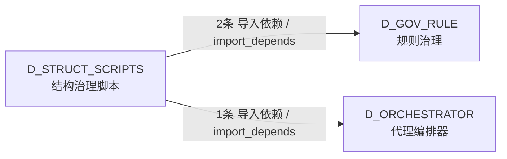

# 71_d_struct_scripts / 结构治理脚本 / D_STRUCT_SCRIPTS

> **文档作用 / Purpose**: 展示 结构治理脚本（D_STRUCT_SCRIPTS）功能域的模块清单、域内依赖关系、跨域依赖关系、架构分层视图，供架构审查和域治理参考。

> 本文档由 generate_domain_doc.py 从 depgraph (PostgreSQL) 自动生成
> 数据源: depgraph (PostgreSQL) nodes表 + edges表

## 域基本信息 / Domain Overview

| 字段 | 值 | Field | Value |
|------|------|-------|-------|
| 编号 | 71 | Number | 71 |
| 域ID | D_STRUCT_SCRIPTS | Domain ID | D_STRUCT_SCRIPTS |
| 域名称 | 结构治理脚本 | Domain Name | D_STRUCT_SCRIPTS |
| 层级 | L2 业务域层 | Layer | L2 Domain |
| 模块数 | 25 | Module Count | 25 |
| 域内依赖 | 0 | Internal Dependencies | 0 |
| 跨域入边 | 0 | Cross-domain Incoming | 0 |
| 跨域出边 | 3 | Cross-domain Outgoing | 3 |
| 设计态模块 | 0 | Design Modules | 0 |
| 生产态模块 | 25 | Production Modules | 25 |
| 容量 | 0/150 (正常) | Capacity | 0/150 (正常) |
| 描述 | 结构治理脚本（d1_structure） | Description | 结构治理脚本（d1_structure） |

## 模块分层清单 / Module Layered List

> 按 architecture_layer 分组的模块清单（共 25 个模块 / 25 modules）。

### L2 领域层 / Domain Layer (25 modules)

| # | 模块路径 / Module Path | 模块名称 / Module Name (功能简介 / Description) | 成熟度 / Maturity | 蓝图 / Blueprint |
|:--:|---------|---------|:---:|:---:|
| 1 | scripts/governance/d1_structure/archive_drafts_zone.py | 草稿区生命周期归档器——扫描 arbitrated 草稿，... | 生产态 / production |  |
| 2 | scripts/governance/d1_structure/audit_config_format.py | audit_config_format.py — config/ 目录格式/注释... | 生产态 / production |  |
| 3 | scripts/governance/d1_structure/audit_directory_integrity.py | audit_directory_integrity.py — 01_policies_and... | 生产态 / production |  |
| 4 | scripts/governance/d1_structure/audit_directory_scalabili... | audit_directory_scalability.py -- 物理结构可扩... | 生产态 / production |  |
| 5 | scripts/governance/d1_structure/audit_findings_by_scope.py | audit_findings_by_scope.py — 按目录范围筛选 Fi... | 生产态 / production |  |
| 6 | scripts/governance/d1_structure/batch_create_index_md.py | Batch create index.md for all directories under... | 生产态 / production |  |
| 7 | scripts/governance/d1_structure/cbg_reset.py | CBG 熔断器重置 CLI (CircuitBreakerGateway Reset... | 生产态 / production |  |
| 8 | scripts/governance/d1_structure/check_directory_contract.py | GATE-DIRECTORY-CONTRACT: Directory Contract val... | 生产态 / production |  |
| 9 | scripts/governance/d1_structure/check_handoff_manifests.py | check_handoff_manifests.py — AI Session Handof... | 生产态 / production |  |
| 10 | scripts/governance/d1_structure/check_index_integrity.py | check_index_integrity.py — 索引完整性校验 | 生产态 / production |  |
| 11 | scripts/governance/d1_structure/cleanup_stash.py | cleanup_stash.py — git stash 堆积治理（OPS-202... | 生产态 / production |  |
| 12 | scripts/governance/d1_structure/detect_orphan_py.py | detect_orphan_py.py — 项目根目录孤儿 .py 文件检测 | 生产态 / production |  |
| 13 | scripts/governance/d1_structure/detect_residual_files.py | detect_residual_files.py — 残留物检测 | 生产态 / production |  |
| 14 | scripts/governance/d1_structure/detect_temp_files.py | Module docstring — see module-level docstring ... | 生产态 / production |  |
| 15 | scripts/governance/d1_structure/drafts_zone_archiver.py | 草稿区生命周期归档器 (Drafts Zone Lifecycle Arc... | 生产态 / production |  |
| 16 | scripts/governance/d1_structure/generate_missing_index_md.py | generate_missing_index_md.py — 扫描目录树，为... | 生产态 / production |  |
| 17 | scripts/governance/d1_structure/reset_cbg.py | CBG 熔断器重置 CLI (CircuitBreakerGateway Reset... | 生产态 / production |  |
| 18 | scripts/governance/d1_structure/run_script_smoke_test.py | run_script_smoke_test.py — 治理脚本冒烟测试运行器 | 生产态 / production |  |
| 19 | scripts/governance/d1_structure/sync_index_from_manifest.py | sync_index_from_manifest.py — 从 script_manife... | 生产态 / production |  |
| 20 | scripts/governance/d1_structure/sync_policies_index.py | sync_policies_index.py — 从磁盘实际扫描，自动... | 生产态 / production |  |
| 21 | scripts/governance/d1_structure/validate_config_integrity.py | validate_config_integrity.py — 运行时配置完整... | 生产态 / production |  |
| 22 | scripts/governance/d1_structure/validate_d1_output_sanity.py | validate_d1_output_sanity.py — D1 产出物合理性... | 生产态 / production |  |
| 23 | scripts/governance/d1_structure/validate_immutable_core.py | validate_immutable_core.py — immutable_core 文... | 生产态 / production |  |
| 24 | scripts/governance/d1_structure/validate_index_reality.py | Module docstring — see module-level docstring ... | 生产态 / production |  |
| 25 | scripts/governance/d1_structure/validate_read_before_writ... | validate_read_before_write.py — 先读后写校验（... | 生产态 / production |  |

## 域内依赖图 / Internal Dependency Diagram

> 依赖图内嵌在本文档中，IDE 可直接渲染显示。参考 decision_index.md 设计，分三个视图：合并全景图、运营态子图、设计态子图（按 design_maturity 实际值拆分）。
>
> **图例说明 / Legend**：
> - **实线边框 = 运营态模块**（production，已上线运行）
> - **虚线边框 = 设计态模块**（design，蓝图阶段，代码未写）
> - **实线箭头 = 运营态依赖**（已生效的依赖关系）
> - **虚线箭头 = 非运营态依赖**（计划中/验证中的依赖关系）

### 合并全景图（全部模块，标签标注成熟度）

> 展示全部 25 个模块（生产态 25 + 设计态 0），标签标注成熟度。

### 运营态子图（仅 design_maturity=production 的模块和依赖）

> 仅展示已上线运行的模块（共 25 个，0 条域内依赖）。

### 设计态子图（仅 design_maturity=design 的模块和依赖）

> 仅展示蓝图阶段、代码未写的设计态模块（共 0 个，0 条域内依赖）。

> （无设计态模块 / No design modules）

## 跨域依赖 / Cross-domain Dependencies

### 本域依赖的其他域（出边）/ Depends On

| # | 本域模块 / Source Module | → | 外部域-目标模块 / Target Module | 依赖类型 / Type |
|:--:|---------|:--:|---------|---------|
| 1 | CBG 熔断器重置 CLI (CircuitBreakerGateway Reset... | → | D_GOV_RULE 规则治理: CircuitBreakerGateway (CBG) — 模块间调用单向熔... | 导入依赖 / import_depends |
| 2 | CBG 熔断器重置 CLI (CircuitBreakerGateway Reset... | → | D_GOV_RULE 规则治理: CircuitBreakerGateway (CBG) — 模块间调用单向熔... | 导入依赖 / import_depends |
| 3 | check_handoff_manifests.py — AI Session Handof... | → | D_ORCHESTRATOR 代理编排器: 集成契约注册表（Contract Registry） (contract_r... | 导入依赖 / import_depends |

### 依赖本域的其他域（入边）/ Depended By

无跨域入边依赖 / No cross-domain incoming dependencies

### 跨域依赖图 / Cross-domain Dependency Diagram

> 本域与 2 个外部域直接连接（出边 3 条 + 入边 0 条 = 3 条）。只显示直接连接的域，不展开具体节点。

## 说明 / Notes

- **数据源 / Data Source**: `depgraph (PostgreSQL)` 的 `nodes`、`edges`、`domains` 表
- **生成器 / Generator**: `generate_domain_doc.py`（G2+G10 合并）
- **维护方式 / Maintenance**: 自动生成，全景图更新时刷新
- **文件名规则 / File Naming**: `{编号:02d}_{域ID小写}.md`，如 `16_d_trading.md`
- **图例说明 / Legend**: `[production]`=已上线 / `[design]`=设计中 / `[unknown]`=未知
