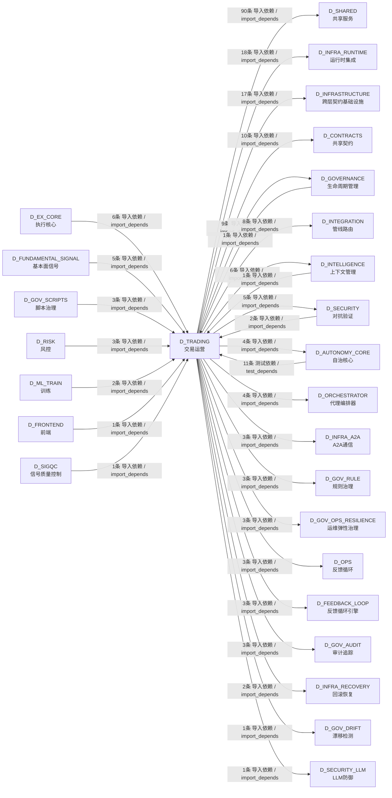

# 72_d_trading / 交易运营 / Trading Operations

> **功能简介 / Overview**: 交易运营，负责交易生命周期管理、订单状态和成交处理

> **文档作用 / Purpose**: 展示 交易运营（D_TRADING）功能域的模块清单、域内依赖关系、跨域依赖关系、架构分层视图，供架构审查和域治理参考。

> 本文档由 generate_domain_doc.py 从 depgraph (PostgreSQL) 自动生成
> 数据源: depgraph (PostgreSQL) nodes表 + edges表

## 域基本信息 / Domain Overview

| 字段 | 值 | Field | Value |
|------|------|-------|-------|
| 编号 | 72 | Number | 72 |
| 域ID | D_TRADING | Domain ID | D_TRADING |
| 域名称 | 交易运营 | Domain Name | Trading Operations |
| 层级 | L2 业务域层 | Layer | L2 Domain |
| 模块数 | 69 | Module Count | 69 |
| 域内依赖 | 78 | Internal Dependencies | 78 |
| 跨域入边 | 36 | Cross-domain Incoming | 36 |
| 跨域出边 | 193 | Cross-domain Outgoing | 193 |
| 设计态模块 | 0 | Design Modules | 0 |
| 生产态模块 | 69 | Production Modules | 69 |
| 容量 | 37/150 (正常) | Capacity | 37/150 (正常) |
| 描述 | 交易运营，负责交易生命周期管理、订单状态和成交处理 | Description | 交易运营，负责交易生命周期管理、订单状态和成交处理 |

## 模块分层清单 / Module Layered List

> 按 architecture_layer 分组的模块清单（共 69 个模块 / 69 modules）。

### L0 基础设施层 / Infrastructure Layer (33 modules)

| # | 模块路径 / Module Path | 模块名称 / Module Name (功能简介 / Description) | 成熟度 / Maturity | 蓝图 / Blueprint |
|:--:|---------|---------|:---:|:---:|
| 1 | src/zephyr/trading/__main__.py | python -m zephyr.trading — AutoRuntime Core 入口 | 生产态 / production |  |
| 2 | src/zephyr/trading/action_dispatcher.py | ActionDispatcher --- 大脑的"手" v2.0 (Phase 2) | 生产态 / production |  |
| 3 | src/zephyr/trading/ai_audit_logger.py | AiAuditLogger — AI 行为审计日志 | 生产态 / production |  |
| 4 | src/zephyr/trading/auto_integrator.py | AutoIntegrator — 自动接入器 | 生产态 / production |  |
| 5 | src/zephyr/trading/auto_runtime_core.py | AutoRuntimeCore — 三层运行时运营中心（系统大脑） | 生产态 / production |  |
| 6 | src/zephyr/trading/auto_task_generator.py | AutoTaskGenerator — 自动任务生成器 | 生产态 / production |  |
| 7 | src/zephyr/trading/boot_hooks.py | boot_hooks.py | 生产态 / production |  |
| 8 | src/zephyr/trading/capability_card.py | CapabilityCard — 能力卡片数据模型 | 生产态 / production |  |
| 9 | src/zephyr/trading/capability_registry.py | CapabilityRegistry — 能力注册中心 | 生产态 / production |  |
| 10 | src/zephyr/trading/capability_sync.py | capability_sync.py | 生产态 / production |  |
| 11 | src/zephyr/trading/dream_cycle.py | DreamCycle — 知识固化引擎 | 生产态 / production |  |
| 12 | src/zephyr/trading/finalizer.py | Finalizer — 优雅清理器 | 生产态 / production |  |
| 13 | src/zephyr/trading/health_monitor.py | HealthMonitor — 健康监控 + 自愈 | 生产态 / production |  |
| 14 | src/zephyr/trading/integration_registry.py | IntegrationRegistry — 集成注册表 | 生产态 / production |  |
| 15 | src/zephyr/trading/lifecycle_manager.py | lifecycle_manager.py | 生产态 / production |  |
| 16 | src/zephyr/trading/module_onboarding_scanner.py | ModuleOnboardingScanner — 模块接入扫描器 | 生产态 / production |  |
| 17 | src/zephyr/trading/night_shift_queue.py | NightShiftQueue — 夜班登记表持久化 | 生产态 / production |  |
| 18 | src/zephyr/trading/orphan_detector.py | OrphanDetector — 孤儿检测器 | 生产态 / production |  |
| 19 | src/zephyr/trading/ports.py | Protocol-based interface layer for runtime->pip... | 生产态 / production |  |
| 20 | src/zephyr/trading/resource_optimization.py | resource_optimization.py - MAPE-K autonomic res... | 生产态 / production |  |
| 21 | src/zephyr/trading/runtime_config.py | runtime_config.py | 生产态 / production |  |
| 22 | src/zephyr/trading/staging_area.py | StagingArea — 多AI并发草稿写入+提交+冲突检测模... | 生产态 / production |  |
| 23 | src/zephyr/trading/status_dashboard.py | StatusDashboard — 实时状态面板 | 生产态 / production |  |
| 24 | src/zephyr/trading/stop_gate.py | StopGate — 质量闸门 | 生产态 / production |  |
| 25 | src/zephyr/trading/task_gate.py | TaskGate --- 任务门控 | 生产态 / production |  |
| 26 | src/zephyr/trading/trading_contracts/broker_interface.py | D_EXECUTION_CORE — BrokerInterface | 生产态 / production |  |
| 27 | src/zephyr/trading/trading_contracts/portfolio/contracts/... | 过渡兼容层（DEPRECATED）—— Money 契约 canonic... | 生产态 / production |  |
| 28 | src/zephyr/trading/trading_contracts/portfolio/contracts/... | Re-export shim — 真源已收敛至 zephyr.shared.co... | 生产态 / production |  |
| 29 | src/zephyr/trading/trading_contracts/portfolio/contracts/... | strategy_lifecycle_event.py | 生产态 / production |  |
| 30 | src/zephyr/trading/windows_service.py | WindowsService — Windows Service 包装器 | 生产态 / production |  |
| 31 | src/zephyr/trading/work_dag.py | WorkDAG + WorkItem — 工作编排数据模型 | 生产态 / production |  |
| 32 | src/zephyr/trading/work_orchestrator.py | work_orchestrator.py | 生产态 / production |  |
| 33 | src/zephyr/trading/zombie_scanner.py | zombie_scanner.py — 僵尸 Python 进程检测与自动处置 | 生产态 / production |  |

### L1 基础层 / Foundation Layer (3 modules)

| # | 模块路径 / Module Path | 模块名称 / Module Name (功能简介 / Description) | 成熟度 / Maturity | 蓝图 / Blueprint |
|:--:|---------|---------|:---:|:---:|
| 1 | src/zephyr/integration/behavioral_admission/admission_res... | admission_response.py | 生产态 / production |  |
| 2 | src/zephyr/integration/local_model/local_model_scheduler.py | LocalModelScheduler — L2 本地模型 24/7 调度循环 | 生产态 / production |  |
| 3 | src/zephyr/integration/pipeline_orchestrator.py | PipelineOrchestrator — M1-M11 管线协调器 | 生产态 / production |  |

### L2 领域层 / Domain Layer (33 modules)

| # | 模块路径 / Module Path | 模块名称 / Module Name (功能简介 / Description) | 成熟度 / Maturity | 蓝图 / Blueprint |
|:--:|---------|---------|:---:|:---:|
| 1 | src/zephyr/trading/action_dispatcher/__init__.py | __init__.py | 生产态 / production |  |
| 2 | src/zephyr/trading/action_dispatcher/_annotation_writer.py | 注释注解写入器（从 ActionDispatcher._annotate_p... | 生产态 / production |  |
| 3 | src/zephyr/trading/action_dispatcher/_audit_log_writer.py | 审计日志写入器（从 ActionDispatcher._write_tria... | 生产态 / production |  |
| 4 | src/zephyr/trading/action_dispatcher/_file_lifecycle_mana... | 文件生命周期管理器（从 ActionDispatcher._create... | 生产态 / production |  |
| 5 | src/zephyr/trading/action_dispatcher/_search_replace_engi... | 搜索替换引擎（从 ActionDispatcher._search_repla... | 生产态 / production |  |
| 6 | src/zephyr/trading/admission_controller.py | admission_controller.py | 生产态 / production |  |
| 7 | src/zephyr/trading/auto_dispatcher.py | AutoDispatcher — 守护进程内的轻量 PipelineDisp... | 生产态 / production |  |
| 8 | src/zephyr/trading/autopilot.py | AutoPilot — AI session 自动找活干、认领任务。 | 生产态 / production |  |
| 9 | src/zephyr/trading/conductor.py | Conductor — AI session 全自动指挥官。 | 生产态 / production |  |
| 10 | src/zephyr/trading/gpu_consensus_scheduler.py | gpu_consensus_scheduler.py | 生产态 / production |  |
| 11 | src/zephyr/trading/gpu_monitor.py | gpu_monitor.py — NVIDIA GPU 状态采集器 | 生产态 / production |  |
| 12 | src/zephyr/trading/ide_health_daemon.py | ide_health_daemon.py — TRAE IDE 幽灵窗口守护线程 | 生产态 / production |  |
| 13 | src/zephyr/trading/protection_index.py | protection_index.py | 生产态 / production |  |
| 14 | src/zephyr/trading/runtime/async_runtime.py | async_runtime.py | 生产态 / production |  |
| 15 | src/zephyr/trading/speed_baseline_checker.py | speed_baseline_checker.py | 生产态 / production |  |
| 16 | src/zephyr/trading/trading_contracts/execution/capital_al... | capital_allocation_result.py | 生产态 / production |  |
| 17 | src/zephyr/trading/trading_contracts/execution/execution_... | execution_rejection_error.py | 生产态 / production |  |
| 18 | src/zephyr/trading/trading_contracts/execution/execution_... | Re-export wrapper: ExecutionReport 真源在 zephy... | 生产态 / production |  |
| 19 | src/zephyr/trading/trading_contracts/execution/fill.py | Re-export wrapper: Fill 真源在 zephyr.shared.co... | 生产态 / production |  |
| 20 | src/zephyr/trading/trading_contracts/execution/model_serv... | model_serving_request.py | 生产态 / production |  |
| 21 | src/zephyr/trading/trading_contracts/execution/order.py | Re-export wrapper: Order 真源在 zephyr.shared.c... | 生产态 / production |  |
| 22 | src/zephyr/trading/trading_contracts/execution/position.py | Re-export wrapper: PositionSnapshot 真源在 zeph... | 生产态 / production |  |
| 23 | src/zephyr/trading/trading_contracts/factories.py | trading-contracts/factories.py — 交易域数据契... | 生产态 / production |  |
| 24 | src/zephyr/trading/trading_contracts/market/instrument.py | instrument.py | 生产态 / production |  |
| 25 | src/zephyr/trading/trading_contracts/market/signal_degrad... | signal_degradation_warning.py | 生产态 / production |  |
| 26 | src/zephyr/trading/trading_contracts/risk/compliance_rule.py | compliance_rule.py | 生产态 / production |  |
| 27 | src/zephyr/trading/trading_contracts/risk/risk_dashboard_... | risk_dashboard_snapshot.py | 生产态 / production |  |
| 28 | src/zephyr/trading/trading_contracts/risk/risk_limit_viol... | risk_limit_violation_error.py | 生产态 / production |  |
| 29 | src/zephyr/trading/trading_contracts/risk/risk_limits.py | risk_limits.py | 生产态 / production |  |
| 30 | src/zephyr/trading/trading_contracts/risk/risk_metrics.py | risk_metrics.py | 生产态 / production |  |
| 31 | src/zephyr/trading/trading_contracts/risk/risk_validator_... | risk_validator_protocol.py | 生产态 / production |  |
| 32 | src/zephyr/trading/trading_contracts/risk/trading_kill_sw... | trading_kill_switch.py | 生产态 / production |  |
| 33 | src/zephyr/trading/verdict_engine.py | verdict_engine.py | 生产态 / production |  |

## 域内依赖图 / Internal Dependency Diagram

> 依赖图内嵌在本文档中，IDE 可直接渲染显示。参考 decision_index.md 设计，分三个视图：合并全景图、运营态子图、设计态子图（按 design_maturity 实际值拆分）。
>
> **图例说明 / Legend**：
> - **实线边框 = 运营态模块**（production，已上线运行）
> - **虚线边框 = 设计态模块**（design，蓝图阶段，代码未写）
> - **实线箭头 = 运营态依赖**（已生效的依赖关系）
> - **虚线箭头 = 非运营态依赖**（计划中/验证中的依赖关系）

### 合并全景图（全部模块，标签标注成熟度）

> 展示全部 69 个模块（生产态 69 + 设计态 0），标签标注成熟度。

#### 第 1 页 / 共 3 页

```mermaid
graph TD
    subgraph D_TRADING["D_TRADING 交易运营"]
        src_zephyr_integration_behavioral_admission_admission_response_py["(生产态 / production) admission_response.py"]
        src_zephyr_integration_local_model_local_model_scheduler_py["(生产态 / production) LocalModelScheduler — L2 本地模型 24/7 调度循环<br/>文件: local_model_scheduler.py"]
        src_zephyr_integration_pipeline_orchestrator_py["(生产态 / production) PipelineOrchestrator — M1-M11 管线协调器<br/>文件: pipeline_orchestrator.py"]
        src_zephyr_trading_main_py["(生产态 / production) python -m zephyr.trading — AutoRuntime Core 入口<br/>文件: __main__.py"]
        src_zephyr_trading_action_dispatcher_py["(生产态 / production) ActionDispatcher --- 大脑的'手' v2.0 (Phase 2)<br/>文件: action_dispatcher.py"]
        src_zephyr_trading_action_dispatcher_init_py["(生产态 / production) __init__.py"]
        src_zephyr_trading_action_dispatcher_annotation_writer_py["(生产态 / production) 注释注解写入器（从 ActionDispatcher._annotate_p...<br/>文件: _annotation_writer.py"]
        src_zephyr_trading_action_dispatcher_audit_log_writer_py["(生产态 / production) 审计日志写入器（从 ActionDispatcher._write_tria...<br/>文件: _audit_log_writer.py"]
        src_zephyr_trading_action_dispatcher_file_lifecycle_manager_py["(生产态 / production) 文件生命周期管理器（从 ActionDispatcher._create...<br/>文件: _file_lifecycle_manager.py"]
        src_zephyr_trading_action_dispatcher_search_replace_engine_py["(生产态 / production) 搜索替换引擎（从 ActionDispatcher._search_repla...<br/>文件: _search_replace_engine.py"]
        src_zephyr_trading_admission_controller_py["(生产态 / production) admission_controller.py"]
        src_zephyr_trading_ai_audit_logger_py["(生产态 / production) AiAuditLogger — AI 行为审计日志<br/>文件: ai_audit_logger.py"]
        src_zephyr_trading_auto_dispatcher_py["(生产态 / production) AutoDispatcher — 守护进程内的轻量 PipelineDisp...<br/>文件: auto_dispatcher.py"]
        src_zephyr_trading_auto_integrator_py["(生产态 / production) AutoIntegrator — 自动接入器<br/>文件: auto_integrator.py"]
        src_zephyr_trading_auto_runtime_core_py["(生产态 / production) AutoRuntimeCore — 三层运行时运营中心（系统大脑）<br/>文件: auto_runtime_core.py"]
        src_zephyr_trading_auto_task_generator_py["(生产态 / production) AutoTaskGenerator — 自动任务生成器<br/>文件: auto_task_generator.py"]
        src_zephyr_trading_autopilot_py["(生产态 / production) AutoPilot — AI session 自动找活干、认领任务。<br/>文件: autopilot.py"]
        src_zephyr_trading_boot_hooks_py["(生产态 / production) boot_hooks.py"]
        src_zephyr_trading_capability_card_py["(生产态 / production) CapabilityCard — 能力卡片数据模型<br/>文件: capability_card.py"]
        src_zephyr_trading_capability_registry_py["(生产态 / production) CapabilityRegistry — 能力注册中心<br/>文件: capability_registry.py"]
        src_zephyr_trading_capability_sync_py["(生产态 / production) capability_sync.py"]
        src_zephyr_trading_conductor_py["(生产态 / production) Conductor — AI session 全自动指挥官。<br/>文件: conductor.py"]
        src_zephyr_trading_dream_cycle_py["(生产态 / production) DreamCycle — 知识固化引擎<br/>文件: dream_cycle.py"]
        src_zephyr_trading_finalizer_py["(生产态 / production) Finalizer — 优雅清理器<br/>文件: finalizer.py"]
        src_zephyr_trading_gpu_consensus_scheduler_py["(生产态 / production) gpu_consensus_scheduler.py"]
        src_zephyr_trading_gpu_monitor_py["(生产态 / production) gpu_monitor.py — NVIDIA GPU 状态采集器<br/>文件: gpu_monitor.py"]
        src_zephyr_trading_health_monitor_py["(生产态 / production) HealthMonitor — 健康监控 + 自愈<br/>文件: health_monitor.py"]
        src_zephyr_trading_ide_health_daemon_py["(生产态 / production) ide_health_daemon.py — TRAE IDE 幽灵窗口守护线程<br/>文件: ide_health_daemon.py"]
        src_zephyr_trading_integration_registry_py["(生产态 / production) IntegrationRegistry — 集成注册表<br/>文件: integration_registry.py"]
        src_zephyr_trading_lifecycle_manager_py["(生产态 / production) lifecycle_manager.py"]
    end
    src_zephyr_integration_pipeline_orchestrator_py -->|导入依赖 / import_depends| src_zephyr_integration_local_model_local_model_scheduler_py
    src_zephyr_integration_behavioral_admission_admission_response_py -->|导入依赖 / import_depends| src_zephyr_trading_admission_controller_py
    src_zephyr_trading_auto_integrator_py -->|导入依赖 / import_depends| src_zephyr_trading_capability_registry_py
    src_zephyr_trading_auto_integrator_py -->|导入依赖 / import_depends| src_zephyr_trading_capability_card_py
    src_zephyr_trading_auto_runtime_core_py -->|导入依赖 / import_depends| src_zephyr_integration_pipeline_orchestrator_py
    src_zephyr_trading_auto_runtime_core_py -->|导入依赖 / import_depends| src_zephyr_integration_local_model_local_model_scheduler_py
    src_zephyr_trading_auto_runtime_core_py -->|导入依赖 / import_depends| src_zephyr_trading_ai_audit_logger_py
    src_zephyr_trading_auto_runtime_core_py -->|导入依赖 / import_depends| src_zephyr_trading_auto_integrator_py
    src_zephyr_trading_auto_runtime_core_py -->|导入依赖 / import_depends| src_zephyr_trading_capability_sync_py
    src_zephyr_trading_auto_runtime_core_py -->|导入依赖 / import_depends| src_zephyr_trading_dream_cycle_py
    src_zephyr_trading_auto_runtime_core_py -->|导入依赖 / import_depends| src_zephyr_trading_boot_hooks_py
    src_zephyr_trading_auto_runtime_core_py -->|导入依赖 / import_depends| src_zephyr_trading_capability_registry_py
    src_zephyr_trading_auto_runtime_core_py -->|导入依赖 / import_depends| src_zephyr_trading_integration_registry_py
    src_zephyr_trading_auto_runtime_core_py -->|导入依赖 / import_depends| src_zephyr_trading_finalizer_py
    src_zephyr_trading_auto_runtime_core_py -->|导入依赖 / import_depends| src_zephyr_trading_lifecycle_manager_py
    src_zephyr_trading_auto_runtime_core_py -->|导入依赖 / import_depends| src_zephyr_trading_health_monitor_py
    src_zephyr_trading_auto_task_generator_py -->|导入依赖 / import_depends| src_zephyr_integration_local_model_local_model_scheduler_py
    src_zephyr_trading_capability_sync_py -->|导入依赖 / import_depends| src_zephyr_trading_capability_registry_py
    src_zephyr_trading_capability_sync_py -->|导入依赖 / import_depends| src_zephyr_trading_capability_card_py
    src_zephyr_trading_boot_hooks_py -->|导入依赖 / import_depends| src_zephyr_trading_finalizer_py
    src_zephyr_trading_boot_hooks_py -->|导入依赖 / import_depends| src_zephyr_trading_ide_health_daemon_py
    src_zephyr_trading_capability_registry_py -->|导入依赖 / import_depends| src_zephyr_trading_capability_card_py
    src_zephyr_trading_conductor_py -->|导入依赖 / import_depends| src_zephyr_trading_autopilot_py
    src_zephyr_trading_lifecycle_manager_py -->|导入依赖 / import_depends| src_zephyr_trading_ai_audit_logger_py
    src_zephyr_trading_lifecycle_manager_py -->|导入依赖 / import_depends| src_zephyr_trading_dream_cycle_py
    src_zephyr_trading_lifecycle_manager_py -->|导入依赖 / import_depends| src_zephyr_trading_capability_registry_py
    src_zephyr_trading_lifecycle_manager_py -->|导入依赖 / import_depends| src_zephyr_trading_integration_registry_py
    src_zephyr_trading_lifecycle_manager_py -->|导入依赖 / import_depends| src_zephyr_trading_finalizer_py
    src_zephyr_trading_lifecycle_manager_py -->|导入依赖 / import_depends| src_zephyr_trading_health_monitor_py
    src_zephyr_trading_action_dispatcher_annotation_writer_py -->|导入依赖 / import_depends| src_zephyr_trading_action_dispatcher_py
    src_zephyr_trading_action_dispatcher_audit_log_writer_py -->|导入依赖 / import_depends| src_zephyr_trading_action_dispatcher_py
    src_zephyr_trading_main_py -->|导入依赖 / import_depends| src_zephyr_trading_auto_runtime_core_py
    src_zephyr_trading_action_dispatcher_file_lifecycle_manager_py -->|导入依赖 / import_depends| src_zephyr_trading_action_dispatcher_py
    src_zephyr_trading_action_dispatcher_init_py -->|导入依赖 / import_depends| src_zephyr_trading_action_dispatcher_annotation_writer_py
    src_zephyr_trading_action_dispatcher_init_py -->|导入依赖 / import_depends| src_zephyr_trading_action_dispatcher_audit_log_writer_py
    src_zephyr_trading_action_dispatcher_init_py -->|导入依赖 / import_depends| src_zephyr_trading_action_dispatcher_file_lifecycle_manager_py
    src_zephyr_trading_action_dispatcher_init_py -->|导入依赖 / import_depends| src_zephyr_trading_action_dispatcher_search_replace_engine_py
    src_zephyr_trading_action_dispatcher_search_replace_engine_py -->|导入依赖 / import_depends| src_zephyr_trading_action_dispatcher_py
    D_INFRA_RECOVERY["(生产态 / production) D_INFRA_RECOVERY"]
    src_zephyr_integration_pipeline_orchestrator_py -->|导入依赖 / import_depends| D_INFRA_RECOVERY
    D_INFRA_RUNTIME["(生产态 / production) D_INFRA_RUNTIME"]
    src_zephyr_integration_pipeline_orchestrator_py -->|导入依赖 / import_depends| D_INFRA_RUNTIME
    D_SHARED["(生产态 / production) D_SHARED"]
    src_zephyr_integration_pipeline_orchestrator_py -->|导入依赖 / import_depends| D_SHARED
    D_INTEGRATION["(生产态 / production) D_INTEGRATION"]
    src_zephyr_integration_pipeline_orchestrator_py -->|导入依赖 / import_depends| D_INTEGRATION
    D_CONTRACTS["(生产态 / production) D_CONTRACTS"]
    src_zephyr_integration_pipeline_orchestrator_py -->|导入依赖 / import_depends| D_CONTRACTS
    D_INTELLIGENCE["(生产态 / production) D_INTELLIGENCE"]
    src_zephyr_integration_pipeline_orchestrator_py -->|导入依赖 / import_depends| D_INTELLIGENCE
    src_zephyr_integration_pipeline_orchestrator_py -->|导入依赖 / import_depends| D_SHARED
    src_zephyr_integration_pipeline_orchestrator_py -->|导入依赖 / import_depends| D_INFRA_RUNTIME
    D_AUTONOMY_CORE["(生产态 / production) D_AUTONOMY_CORE"]
    src_zephyr_integration_pipeline_orchestrator_py -->|导入依赖 / import_depends| D_AUTONOMY_CORE
    src_zephyr_integration_pipeline_orchestrator_py -->|导入依赖 / import_depends| D_SHARED
    src_zephyr_integration_pipeline_orchestrator_py -->|导入依赖 / import_depends| D_INFRA_RUNTIME
    src_zephyr_integration_pipeline_orchestrator_py -->|导入依赖 / import_depends| D_SHARED
    src_zephyr_integration_pipeline_orchestrator_py -->|导入依赖 / import_depends| D_INTELLIGENCE
    src_zephyr_integration_pipeline_orchestrator_py -->|导入依赖 / import_depends| D_SHARED
    src_zephyr_integration_pipeline_orchestrator_py -->|导入依赖 / import_depends| D_INFRA_RUNTIME
    D_GOV_SCRIPTS["(生产态 / production) D_GOV_SCRIPTS"]
    D_GOV_SCRIPTS -->|导入依赖 / import_depends| src_zephyr_integration_local_model_local_model_scheduler_py
    D_SECURITY["(生产态 / production) D_SECURITY"]
    D_SECURITY -->|导入依赖 / import_depends| src_zephyr_trading_capability_registry_py
    D_AUTONOMY_CORE -->|测试依赖 / test_depends| src_zephyr_trading_dream_cycle_py
    D_AUTONOMY_CORE -->|测试依赖 / test_depends| src_zephyr_trading_health_monitor_py
    D_GOV_SCRIPTS -->|导入依赖 / import_depends| src_zephyr_trading_auto_runtime_core_py
    D_AUTONOMY_CORE -->|测试依赖 / test_depends| src_zephyr_trading_auto_runtime_core_py
    D_AUTONOMY_CORE -->|测试依赖 / test_depends| src_zephyr_trading_capability_registry_py
    D_AUTONOMY_CORE -->|测试依赖 / test_depends| src_zephyr_trading_dream_cycle_py
    D_AUTONOMY_CORE -->|测试依赖 / test_depends| src_zephyr_trading_health_monitor_py
    D_GOV_SCRIPTS -->|导入依赖 / import_depends| src_zephyr_trading_auto_task_generator_py
    classDef production fill:#e1f5fe,stroke:#01579b,stroke-width:2px,color:#000
    classDef design fill:#fff3e0,stroke:#e65100,stroke-width:2px,color:#000,stroke-dasharray: 5 5
    classDef external_prod fill:#e8f5e9,stroke:#1b5e20,stroke-width:1px,color:#000
    classDef external_design fill:#fce4ec,stroke:#880e4f,stroke-width:1px,color:#000,stroke-dasharray: 5 5
    class src_zephyr_integration_behavioral_admission_admission_response_py,src_zephyr_integration_local_model_local_model_scheduler_py,src_zephyr_integration_pipeline_orchestrator_py,src_zephyr_trading_main_py,src_zephyr_trading_action_dispatcher_py,src_zephyr_trading_action_dispatcher_init_py,src_zephyr_trading_action_dispatcher_annotation_writer_py,src_zephyr_trading_action_dispatcher_audit_log_writer_py,src_zephyr_trading_action_dispatcher_file_lifecycle_manager_py,src_zephyr_trading_action_dispatcher_search_replace_engine_py,src_zephyr_trading_admission_controller_py,src_zephyr_trading_ai_audit_logger_py,src_zephyr_trading_auto_dispatcher_py,src_zephyr_trading_auto_integrator_py,src_zephyr_trading_auto_runtime_core_py,src_zephyr_trading_auto_task_generator_py,src_zephyr_trading_autopilot_py,src_zephyr_trading_boot_hooks_py,src_zephyr_trading_capability_card_py,src_zephyr_trading_capability_registry_py,src_zephyr_trading_capability_sync_py,src_zephyr_trading_conductor_py,src_zephyr_trading_dream_cycle_py,src_zephyr_trading_finalizer_py,src_zephyr_trading_gpu_consensus_scheduler_py,src_zephyr_trading_gpu_monitor_py,src_zephyr_trading_health_monitor_py,src_zephyr_trading_ide_health_daemon_py,src_zephyr_trading_integration_registry_py,src_zephyr_trading_lifecycle_manager_py production
    class D_INFRA_RECOVERY,D_INFRA_RUNTIME,D_SHARED,D_INTEGRATION,D_CONTRACTS,D_INTELLIGENCE,D_AUTONOMY_CORE,D_GOV_SCRIPTS,D_SECURITY external_prod
```



#### 第 2 页 / 共 3 页

```mermaid
graph TD
    subgraph D_TRADING["D_TRADING 交易运营"]
        src_zephyr_trading_module_onboarding_scanner_py["(生产态 / production) ModuleOnboardingScanner — 模块接入扫描器<br/>文件: module_onboarding_scanner.py"]
        src_zephyr_trading_night_shift_queue_py["(生产态 / production) NightShiftQueue — 夜班登记表持久化<br/>文件: night_shift_queue.py"]
        src_zephyr_trading_orphan_detector_py["(生产态 / production) OrphanDetector — 孤儿检测器<br/>文件: orphan_detector.py"]
        src_zephyr_trading_ports_py["(生产态 / production) Protocol-based interface layer for runtime->pip...<br/>文件: ports.py"]
        src_zephyr_trading_protection_index_py["(生产态 / production) protection_index.py"]
        src_zephyr_trading_resource_optimization_py["(生产态 / production) resource_optimization.py - MAPE-K autonomic res...<br/>文件: resource_optimization.py"]
        src_zephyr_trading_runtime_async_runtime_py["(生产态 / production) async_runtime.py"]
        src_zephyr_trading_runtime_config_py["(生产态 / production) runtime_config.py"]
        src_zephyr_trading_speed_baseline_checker_py["(生产态 / production) speed_baseline_checker.py"]
        src_zephyr_trading_staging_area_py["(生产态 / production) StagingArea — 多AI并发草稿写入+提交+冲突检测模...<br/>文件: staging_area.py"]
        src_zephyr_trading_status_dashboard_py["(生产态 / production) StatusDashboard — 实时状态面板<br/>文件: status_dashboard.py"]
        src_zephyr_trading_stop_gate_py["(生产态 / production) StopGate — 质量闸门<br/>文件: stop_gate.py"]
        src_zephyr_trading_task_gate_py["(生产态 / production) TaskGate --- 任务门控<br/>文件: task_gate.py"]
        src_zephyr_trading_trading_contracts_broker_interface_py["(生产态 / production) D_EXECUTION_CORE — BrokerInterface<br/>文件: broker_interface.py"]
        src_zephyr_trading_trading_contracts_execution_capital_allocation_result_py["(生产态 / production) capital_allocation_result.py"]
        src_zephyr_trading_trading_contracts_execution_execution_rejection_error_py["(生产态 / production) execution_rejection_error.py"]
        src_zephyr_trading_trading_contracts_execution_execution_report_py["(生产态 / production) Re-export wrapper: ExecutionReport 真源在 zephy...<br/>文件: execution_report.py"]
        src_zephyr_trading_trading_contracts_execution_fill_py["(生产态 / production) Re-export wrapper: Fill 真源在 zephyr.shared.co...<br/>文件: fill.py"]
        src_zephyr_trading_trading_contracts_execution_model_serving_request_py["(生产态 / production) model_serving_request.py"]
        src_zephyr_trading_trading_contracts_execution_order_py["(生产态 / production) Re-export wrapper: Order 真源在 zephyr.shared.c...<br/>文件: order.py"]
        src_zephyr_trading_trading_contracts_execution_position_py["(生产态 / production) Re-export wrapper: PositionSnapshot 真源在 zeph...<br/>文件: position.py"]
        src_zephyr_trading_trading_contracts_factories_py["(生产态 / production) trading-contracts/factories.py — 交易域数据契...<br/>文件: factories.py"]
        src_zephyr_trading_trading_contracts_market_instrument_py["(生产态 / production) instrument.py"]
        src_zephyr_trading_trading_contracts_market_signal_degradation_warning_py["(生产态 / production) signal_degradation_warning.py"]
        src_zephyr_trading_trading_contracts_portfolio_contracts_money_py["(生产态 / production) 过渡兼容层（DEPRECATED）—— Money 契约 canonic...<br/>文件: money.py"]
        src_zephyr_trading_trading_contracts_portfolio_contracts_performance_attribution_report_py["(生产态 / production) Re-export shim — 真源已收敛至 zephyr.shared.co...<br/>文件: performance_attribution_report.py"]
        src_zephyr_trading_trading_contracts_portfolio_contracts_strategy_lifecycle_event_py["(生产态 / production) strategy_lifecycle_event.py"]
        src_zephyr_trading_trading_contracts_risk_compliance_rule_py["(生产态 / production) compliance_rule.py"]
        src_zephyr_trading_trading_contracts_risk_risk_dashboard_snapshot_py["(生产态 / production) risk_dashboard_snapshot.py"]
        src_zephyr_trading_trading_contracts_risk_risk_limit_violation_error_py["(生产态 / production) risk_limit_violation_error.py"]
    end
    src_zephyr_trading_orphan_detector_py -->|导入依赖 / import_depends| src_zephyr_trading_module_onboarding_scanner_py
    src_zephyr_trading_status_dashboard_py -->|导入依赖 / import_depends| src_zephyr_trading_night_shift_queue_py
    src_zephyr_trading_status_dashboard_py -->|导入依赖 / import_depends| src_zephyr_trading_orphan_detector_py
    src_zephyr_trading_trading_contracts_factories_py -->|导入依赖 / import_depends| src_zephyr_trading_trading_contracts_execution_order_py
    src_zephyr_trading_trading_contracts_factories_py -->|导入依赖 / import_depends| src_zephyr_trading_trading_contracts_risk_risk_dashboard_snapshot_py
    D_SHARED["(生产态 / production) D_SHARED"]
    src_zephyr_trading_night_shift_queue_py -->|导入依赖 / import_depends| D_SHARED
    src_zephyr_trading_night_shift_queue_py -->|导入依赖 / import_depends| D_SHARED
    src_zephyr_trading_night_shift_queue_py -->|导入依赖 / import_depends| D_SHARED
    src_zephyr_trading_ports_py -->|导入依赖 / import_depends| D_SHARED
    src_zephyr_trading_resource_optimization_py -->|导入依赖 / import_depends| D_SHARED
    src_zephyr_trading_resource_optimization_py -->|导入依赖 / import_depends| D_SHARED
    src_zephyr_trading_resource_optimization_py -->|导入依赖 / import_depends| D_SHARED
    src_zephyr_trading_resource_optimization_py -->|导入依赖 / import_depends| D_SHARED
    src_zephyr_trading_resource_optimization_py -->|导入依赖 / import_depends| D_SHARED
    src_zephyr_trading_resource_optimization_py -->|导入依赖 / import_depends| D_SHARED
    src_zephyr_trading_resource_optimization_py -->|导入依赖 / import_depends| D_SHARED
    src_zephyr_trading_resource_optimization_py -->|导入依赖 / import_depends| D_SHARED
    src_zephyr_trading_resource_optimization_py -->|导入依赖 / import_depends| D_SHARED
    D_GOV_AUDIT["(生产态 / production) D_GOV_AUDIT"]
    src_zephyr_trading_resource_optimization_py -->|导入依赖 / import_depends| D_GOV_AUDIT
    src_zephyr_trading_resource_optimization_py -->|导入依赖 / import_depends| D_SHARED
    D_SECURITY["(生产态 / production) D_SECURITY"]
    D_SECURITY -->|导入依赖 / import_depends| src_zephyr_trading_module_onboarding_scanner_py
    D_ML_TRAIN["(生产态 / production) D_ML_TRAIN"]
    D_ML_TRAIN -->|导入依赖 / import_depends| src_zephyr_trading_trading_contracts_execution_model_serving_request_py
    D_FUNDAMENTAL_SIGNAL["(生产态 / production) D_FUNDAMENTAL_SIGNAL"]
    D_FUNDAMENTAL_SIGNAL -->|导入依赖 / import_depends| src_zephyr_trading_trading_contracts_execution_capital_allocation_result_py
    D_ML_TRAIN -->|导入依赖 / import_depends| src_zephyr_trading_trading_contracts_execution_model_serving_request_py
    D_FUNDAMENTAL_SIGNAL -->|导入依赖 / import_depends| src_zephyr_trading_trading_contracts_market_signal_degradation_warning_py
    D_GOVERNANCE["(生产态 / production) D_GOVERNANCE"]
    D_GOVERNANCE -->|导入依赖 / import_depends| src_zephyr_trading_trading_contracts_broker_interface_py
    D_FUNDAMENTAL_SIGNAL -->|导入依赖 / import_depends| src_zephyr_trading_trading_contracts_execution_capital_allocation_result_py
    D_EX_CORE["(生产态 / production) D_EX_CORE"]
    D_EX_CORE -->|导入依赖 / import_depends| src_zephyr_trading_trading_contracts_broker_interface_py
    D_RISK["(生产态 / production) D_RISK"]
    D_RISK -->|导入依赖 / import_depends| src_zephyr_trading_trading_contracts_risk_risk_limit_violation_error_py
    D_RISK -->|导入依赖 / import_depends| src_zephyr_trading_trading_contracts_risk_risk_dashboard_snapshot_py
    D_FUNDAMENTAL_SIGNAL -->|导入依赖 / import_depends| src_zephyr_trading_trading_contracts_execution_capital_allocation_result_py
    D_EX_CORE -->|导入依赖 / import_depends| src_zephyr_trading_trading_contracts_execution_position_py
    D_EX_CORE -->|导入依赖 / import_depends| src_zephyr_trading_trading_contracts_execution_fill_py
    D_AUTONOMY_CORE["(生产态 / production) D_AUTONOMY_CORE"]
    D_AUTONOMY_CORE -->|测试依赖 / test_depends| src_zephyr_trading_runtime_config_py
    D_INTELLIGENCE["(生产态 / production) D_INTELLIGENCE"]
    D_INTELLIGENCE -->|导入依赖 / import_depends| src_zephyr_trading_trading_contracts_execution_model_serving_request_py
    classDef production fill:#e1f5fe,stroke:#01579b,stroke-width:2px,color:#000
    classDef design fill:#fff3e0,stroke:#e65100,stroke-width:2px,color:#000,stroke-dasharray: 5 5
    classDef external_prod fill:#e8f5e9,stroke:#1b5e20,stroke-width:1px,color:#000
    classDef external_design fill:#fce4ec,stroke:#880e4f,stroke-width:1px,color:#000,stroke-dasharray: 5 5
    class src_zephyr_trading_module_onboarding_scanner_py,src_zephyr_trading_night_shift_queue_py,src_zephyr_trading_orphan_detector_py,src_zephyr_trading_ports_py,src_zephyr_trading_protection_index_py,src_zephyr_trading_resource_optimization_py,src_zephyr_trading_runtime_async_runtime_py,src_zephyr_trading_runtime_config_py,src_zephyr_trading_speed_baseline_checker_py,src_zephyr_trading_staging_area_py,src_zephyr_trading_status_dashboard_py,src_zephyr_trading_stop_gate_py,src_zephyr_trading_task_gate_py,src_zephyr_trading_trading_contracts_broker_interface_py,src_zephyr_trading_trading_contracts_execution_capital_allocation_result_py,src_zephyr_trading_trading_contracts_execution_execution_rejection_error_py,src_zephyr_trading_trading_contracts_execution_execution_report_py,src_zephyr_trading_trading_contracts_execution_fill_py,src_zephyr_trading_trading_contracts_execution_model_serving_request_py,src_zephyr_trading_trading_contracts_execution_order_py,src_zephyr_trading_trading_contracts_execution_position_py,src_zephyr_trading_trading_contracts_factories_py,src_zephyr_trading_trading_contracts_market_instrument_py,src_zephyr_trading_trading_contracts_market_signal_degradation_warning_py,src_zephyr_trading_trading_contracts_portfolio_contracts_money_py,src_zephyr_trading_trading_contracts_portfolio_contracts_performance_attribution_report_py,src_zephyr_trading_trading_contracts_portfolio_contracts_strategy_lifecycle_event_py,src_zephyr_trading_trading_contracts_risk_compliance_rule_py,src_zephyr_trading_trading_contracts_risk_risk_dashboard_snapshot_py,src_zephyr_trading_trading_contracts_risk_risk_limit_violation_error_py production
    class D_SHARED,D_GOV_AUDIT,D_SECURITY,D_ML_TRAIN,D_FUNDAMENTAL_SIGNAL,D_GOVERNANCE,D_EX_CORE,D_RISK,D_AUTONOMY_CORE,D_INTELLIGENCE external_prod
```



#### 第 3 页 / 共 3 页

```mermaid
graph TD
    subgraph D_TRADING["D_TRADING 交易运营"]
        src_zephyr_trading_trading_contracts_risk_risk_limits_py["(生产态 / production) risk_limits.py"]
        src_zephyr_trading_trading_contracts_risk_risk_metrics_py["(生产态 / production) risk_metrics.py"]
        src_zephyr_trading_trading_contracts_risk_risk_validator_protocol_py["(生产态 / production) risk_validator_protocol.py"]
        src_zephyr_trading_trading_contracts_risk_trading_kill_switch_py["(生产态 / production) trading_kill_switch.py"]
        src_zephyr_trading_verdict_engine_py["(生产态 / production) verdict_engine.py"]
        src_zephyr_trading_windows_service_py["(生产态 / production) WindowsService — Windows Service 包装器<br/>文件: windows_service.py"]
        src_zephyr_trading_work_dag_py["(生产态 / production) WorkDAG + WorkItem — 工作编排数据模型<br/>文件: work_dag.py"]
        src_zephyr_trading_work_orchestrator_py["(生产态 / production) work_orchestrator.py"]
        src_zephyr_trading_zombie_scanner_py["(生产态 / production) zombie_scanner.py — 僵尸 Python 进程检测与自动处置<br/>文件: zombie_scanner.py"]
    end
    src_zephyr_trading_work_orchestrator_py -->|导入依赖 / import_depends| src_zephyr_trading_work_dag_py
    D_SHARED["(生产态 / production) D_SHARED"]
    src_zephyr_trading_zombie_scanner_py -->|导入依赖 / import_depends| D_SHARED
    D_GOV_RULE["(生产态 / production) D_GOV_RULE"]
    src_zephyr_trading_work_orchestrator_py -->|导入依赖 / import_depends| D_GOV_RULE
    src_zephyr_trading_work_orchestrator_py -->|导入依赖 / import_depends| D_SHARED
    D_INFRASTRUCTURE["(生产态 / production) D_INFRASTRUCTURE"]
    src_zephyr_trading_trading_contracts_risk_risk_limits_py -->|导入依赖 / import_depends| D_INFRASTRUCTURE
    src_zephyr_trading_work_dag_py -->|导入依赖 / import_depends| D_SHARED
    src_zephyr_trading_trading_contracts_risk_risk_validator_protocol_py -->|导入依赖 / import_depends| D_INFRASTRUCTURE
    src_zephyr_trading_work_orchestrator_py -->|导入依赖 / import_depends| D_SHARED
    D_GOV_AUDIT["(生产态 / production) D_GOV_AUDIT"]
    src_zephyr_trading_verdict_engine_py -->|导入依赖 / import_depends| D_GOV_AUDIT
    D_AUTONOMY_CORE["(生产态 / production) D_AUTONOMY_CORE"]
    D_AUTONOMY_CORE -->|测试依赖 / test_depends| src_zephyr_trading_work_dag_py
    D_AUTONOMY_CORE -->|测试依赖 / test_depends| src_zephyr_trading_work_orchestrator_py
    D_AUTONOMY_CORE -->|测试依赖 / test_depends| src_zephyr_trading_work_orchestrator_py
    D_AUTONOMY_CORE -->|测试依赖 / test_depends| src_zephyr_trading_work_dag_py
    D_RISK["(生产态 / production) D_RISK"]
    D_RISK -->|导入依赖 / import_depends| src_zephyr_trading_trading_contracts_risk_risk_metrics_py
    classDef production fill:#e1f5fe,stroke:#01579b,stroke-width:2px,color:#000
    classDef design fill:#fff3e0,stroke:#e65100,stroke-width:2px,color:#000,stroke-dasharray: 5 5
    classDef external_prod fill:#e8f5e9,stroke:#1b5e20,stroke-width:1px,color:#000
    classDef external_design fill:#fce4ec,stroke:#880e4f,stroke-width:1px,color:#000,stroke-dasharray: 5 5
    class src_zephyr_trading_trading_contracts_risk_risk_limits_py,src_zephyr_trading_trading_contracts_risk_risk_metrics_py,src_zephyr_trading_trading_contracts_risk_risk_validator_protocol_py,src_zephyr_trading_trading_contracts_risk_trading_kill_switch_py,src_zephyr_trading_verdict_engine_py,src_zephyr_trading_windows_service_py,src_zephyr_trading_work_dag_py,src_zephyr_trading_work_orchestrator_py,src_zephyr_trading_zombie_scanner_py production
    class D_SHARED,D_GOV_RULE,D_INFRASTRUCTURE,D_GOV_AUDIT,D_AUTONOMY_CORE,D_RISK external_prod
```



### 运营态子图（仅 design_maturity=production 的模块和依赖）

> 仅展示已上线运行的模块（共 69 个，78 条域内依赖）。

```mermaid
graph TD
    subgraph D_TRADING["D_TRADING 交易运营"]
        src_zephyr_integration_behavioral_admission_admission_response_py["(生产态 / production) admission_response.py"]
        src_zephyr_integration_local_model_local_model_scheduler_py["(生产态 / production) LocalModelScheduler — L2 本地模型 24/7 调度循环<br/>文件: local_model_scheduler.py"]
        src_zephyr_integration_pipeline_orchestrator_py["(生产态 / production) PipelineOrchestrator — M1-M11 管线协调器<br/>文件: pipeline_orchestrator.py"]
        src_zephyr_trading_main_py["(生产态 / production) python -m zephyr.trading — AutoRuntime Core 入口<br/>文件: __main__.py"]
        src_zephyr_trading_action_dispatcher_py["(生产态 / production) ActionDispatcher --- 大脑的'手' v2.0 (Phase 2)<br/>文件: action_dispatcher.py"]
        src_zephyr_trading_action_dispatcher_init_py["(生产态 / production) __init__.py"]
        src_zephyr_trading_action_dispatcher_annotation_writer_py["(生产态 / production) 注释注解写入器（从 ActionDispatcher._annotate_p...<br/>文件: _annotation_writer.py"]
        src_zephyr_trading_action_dispatcher_audit_log_writer_py["(生产态 / production) 审计日志写入器（从 ActionDispatcher._write_tria...<br/>文件: _audit_log_writer.py"]
        src_zephyr_trading_action_dispatcher_file_lifecycle_manager_py["(生产态 / production) 文件生命周期管理器（从 ActionDispatcher._create...<br/>文件: _file_lifecycle_manager.py"]
        src_zephyr_trading_action_dispatcher_search_replace_engine_py["(生产态 / production) 搜索替换引擎（从 ActionDispatcher._search_repla...<br/>文件: _search_replace_engine.py"]
        src_zephyr_trading_admission_controller_py["(生产态 / production) admission_controller.py"]
        src_zephyr_trading_ai_audit_logger_py["(生产态 / production) AiAuditLogger — AI 行为审计日志<br/>文件: ai_audit_logger.py"]
        src_zephyr_trading_auto_dispatcher_py["(生产态 / production) AutoDispatcher — 守护进程内的轻量 PipelineDisp...<br/>文件: auto_dispatcher.py"]
        src_zephyr_trading_auto_integrator_py["(生产态 / production) AutoIntegrator — 自动接入器<br/>文件: auto_integrator.py"]
        src_zephyr_trading_auto_runtime_core_py["(生产态 / production) AutoRuntimeCore — 三层运行时运营中心（系统大脑）<br/>文件: auto_runtime_core.py"]
        src_zephyr_trading_auto_task_generator_py["(生产态 / production) AutoTaskGenerator — 自动任务生成器<br/>文件: auto_task_generator.py"]
        src_zephyr_trading_autopilot_py["(生产态 / production) AutoPilot — AI session 自动找活干、认领任务。<br/>文件: autopilot.py"]
        src_zephyr_trading_boot_hooks_py["(生产态 / production) boot_hooks.py"]
        src_zephyr_trading_capability_card_py["(生产态 / production) CapabilityCard — 能力卡片数据模型<br/>文件: capability_card.py"]
        src_zephyr_trading_capability_registry_py["(生产态 / production) CapabilityRegistry — 能力注册中心<br/>文件: capability_registry.py"]
        src_zephyr_trading_capability_sync_py["(生产态 / production) capability_sync.py"]
        src_zephyr_trading_conductor_py["(生产态 / production) Conductor — AI session 全自动指挥官。<br/>文件: conductor.py"]
        src_zephyr_trading_dream_cycle_py["(生产态 / production) DreamCycle — 知识固化引擎<br/>文件: dream_cycle.py"]
        src_zephyr_trading_finalizer_py["(生产态 / production) Finalizer — 优雅清理器<br/>文件: finalizer.py"]
        src_zephyr_trading_gpu_consensus_scheduler_py["(生产态 / production) gpu_consensus_scheduler.py"]
        src_zephyr_trading_gpu_monitor_py["(生产态 / production) gpu_monitor.py — NVIDIA GPU 状态采集器<br/>文件: gpu_monitor.py"]
        src_zephyr_trading_health_monitor_py["(生产态 / production) HealthMonitor — 健康监控 + 自愈<br/>文件: health_monitor.py"]
        src_zephyr_trading_ide_health_daemon_py["(生产态 / production) ide_health_daemon.py — TRAE IDE 幽灵窗口守护线程<br/>文件: ide_health_daemon.py"]
        src_zephyr_trading_integration_registry_py["(生产态 / production) IntegrationRegistry — 集成注册表<br/>文件: integration_registry.py"]
        src_zephyr_trading_lifecycle_manager_py["(生产态 / production) lifecycle_manager.py"]
        src_zephyr_trading_module_onboarding_scanner_py["(生产态 / production) ModuleOnboardingScanner — 模块接入扫描器<br/>文件: module_onboarding_scanner.py"]
        src_zephyr_trading_night_shift_queue_py["(生产态 / production) NightShiftQueue — 夜班登记表持久化<br/>文件: night_shift_queue.py"]
        src_zephyr_trading_orphan_detector_py["(生产态 / production) OrphanDetector — 孤儿检测器<br/>文件: orphan_detector.py"]
        src_zephyr_trading_ports_py["(生产态 / production) Protocol-based interface layer for runtime->pip...<br/>文件: ports.py"]
        src_zephyr_trading_protection_index_py["(生产态 / production) protection_index.py"]
        src_zephyr_trading_resource_optimization_py["(生产态 / production) resource_optimization.py - MAPE-K autonomic res...<br/>文件: resource_optimization.py"]
        src_zephyr_trading_runtime_async_runtime_py["(生产态 / production) async_runtime.py"]
        src_zephyr_trading_runtime_config_py["(生产态 / production) runtime_config.py"]
        src_zephyr_trading_speed_baseline_checker_py["(生产态 / production) speed_baseline_checker.py"]
        src_zephyr_trading_staging_area_py["(生产态 / production) StagingArea — 多AI并发草稿写入+提交+冲突检测模...<br/>文件: staging_area.py"]
        src_zephyr_trading_status_dashboard_py["(生产态 / production) StatusDashboard — 实时状态面板<br/>文件: status_dashboard.py"]
        src_zephyr_trading_stop_gate_py["(生产态 / production) StopGate — 质量闸门<br/>文件: stop_gate.py"]
        src_zephyr_trading_task_gate_py["(生产态 / production) TaskGate --- 任务门控<br/>文件: task_gate.py"]
        src_zephyr_trading_trading_contracts_broker_interface_py["(生产态 / production) D_EXECUTION_CORE — BrokerInterface<br/>文件: broker_interface.py"]
        src_zephyr_trading_trading_contracts_execution_capital_allocation_result_py["(生产态 / production) capital_allocation_result.py"]
        src_zephyr_trading_trading_contracts_execution_execution_rejection_error_py["(生产态 / production) execution_rejection_error.py"]
        src_zephyr_trading_trading_contracts_execution_execution_report_py["(生产态 / production) Re-export wrapper: ExecutionReport 真源在 zephy...<br/>文件: execution_report.py"]
        src_zephyr_trading_trading_contracts_execution_fill_py["(生产态 / production) Re-export wrapper: Fill 真源在 zephyr.shared.co...<br/>文件: fill.py"]
        src_zephyr_trading_trading_contracts_execution_model_serving_request_py["(生产态 / production) model_serving_request.py"]
        src_zephyr_trading_trading_contracts_execution_order_py["(生产态 / production) Re-export wrapper: Order 真源在 zephyr.shared.c...<br/>文件: order.py"]
        src_zephyr_trading_trading_contracts_execution_position_py["(生产态 / production) Re-export wrapper: PositionSnapshot 真源在 zeph...<br/>文件: position.py"]
        src_zephyr_trading_trading_contracts_factories_py["(生产态 / production) trading-contracts/factories.py — 交易域数据契...<br/>文件: factories.py"]
        src_zephyr_trading_trading_contracts_market_instrument_py["(生产态 / production) instrument.py"]
        src_zephyr_trading_trading_contracts_market_signal_degradation_warning_py["(生产态 / production) signal_degradation_warning.py"]
        src_zephyr_trading_trading_contracts_portfolio_contracts_money_py["(生产态 / production) 过渡兼容层（DEPRECATED）—— Money 契约 canonic...<br/>文件: money.py"]
        src_zephyr_trading_trading_contracts_portfolio_contracts_performance_attribution_report_py["(生产态 / production) Re-export shim — 真源已收敛至 zephyr.shared.co...<br/>文件: performance_attribution_report.py"]
        src_zephyr_trading_trading_contracts_portfolio_contracts_strategy_lifecycle_event_py["(生产态 / production) strategy_lifecycle_event.py"]
        src_zephyr_trading_trading_contracts_risk_compliance_rule_py["(生产态 / production) compliance_rule.py"]
        src_zephyr_trading_trading_contracts_risk_risk_dashboard_snapshot_py["(生产态 / production) risk_dashboard_snapshot.py"]
        src_zephyr_trading_trading_contracts_risk_risk_limit_violation_error_py["(生产态 / production) risk_limit_violation_error.py"]
        src_zephyr_trading_trading_contracts_risk_risk_limits_py["(生产态 / production) risk_limits.py"]
        src_zephyr_trading_trading_contracts_risk_risk_metrics_py["(生产态 / production) risk_metrics.py"]
        src_zephyr_trading_trading_contracts_risk_risk_validator_protocol_py["(生产态 / production) risk_validator_protocol.py"]
        src_zephyr_trading_trading_contracts_risk_trading_kill_switch_py["(生产态 / production) trading_kill_switch.py"]
        src_zephyr_trading_verdict_engine_py["(生产态 / production) verdict_engine.py"]
        src_zephyr_trading_windows_service_py["(生产态 / production) WindowsService — Windows Service 包装器<br/>文件: windows_service.py"]
        src_zephyr_trading_work_dag_py["(生产态 / production) WorkDAG + WorkItem — 工作编排数据模型<br/>文件: work_dag.py"]
        src_zephyr_trading_work_orchestrator_py["(生产态 / production) work_orchestrator.py"]
        src_zephyr_trading_zombie_scanner_py["(生产态 / production) zombie_scanner.py — 僵尸 Python 进程检测与自动处置<br/>文件: zombie_scanner.py"]
    end
    src_zephyr_integration_pipeline_orchestrator_py -->|导入依赖 / import_depends| src_zephyr_integration_local_model_local_model_scheduler_py
    src_zephyr_integration_behavioral_admission_admission_response_py -->|导入依赖 / import_depends| src_zephyr_trading_admission_controller_py
    src_zephyr_integration_local_model_local_model_scheduler_py -->|导入依赖 / import_depends| src_zephyr_trading_resource_optimization_py
    src_zephyr_trading_auto_integrator_py -->|导入依赖 / import_depends| src_zephyr_trading_capability_registry_py
    src_zephyr_trading_auto_integrator_py -->|导入依赖 / import_depends| src_zephyr_trading_capability_card_py
    src_zephyr_trading_auto_integrator_py -->|导入依赖 / import_depends| src_zephyr_trading_module_onboarding_scanner_py
    src_zephyr_trading_auto_runtime_core_py -->|导入依赖 / import_depends| src_zephyr_integration_pipeline_orchestrator_py
    src_zephyr_trading_auto_runtime_core_py -->|导入依赖 / import_depends| src_zephyr_integration_local_model_local_model_scheduler_py
    src_zephyr_trading_auto_runtime_core_py -->|导入依赖 / import_depends| src_zephyr_trading_ai_audit_logger_py
    src_zephyr_trading_auto_runtime_core_py -->|导入依赖 / import_depends| src_zephyr_trading_auto_integrator_py
    src_zephyr_trading_auto_runtime_core_py -->|导入依赖 / import_depends| src_zephyr_trading_capability_sync_py
    src_zephyr_trading_auto_runtime_core_py -->|导入依赖 / import_depends| src_zephyr_trading_dream_cycle_py
    src_zephyr_trading_auto_runtime_core_py -->|导入依赖 / import_depends| src_zephyr_trading_boot_hooks_py
    src_zephyr_trading_auto_runtime_core_py -->|导入依赖 / import_depends| src_zephyr_trading_capability_registry_py
    src_zephyr_trading_auto_runtime_core_py -->|导入依赖 / import_depends| src_zephyr_trading_integration_registry_py
    src_zephyr_trading_auto_runtime_core_py -->|导入依赖 / import_depends| src_zephyr_trading_finalizer_py
    src_zephyr_trading_auto_runtime_core_py -->|导入依赖 / import_depends| src_zephyr_trading_lifecycle_manager_py
    src_zephyr_trading_auto_runtime_core_py -->|导入依赖 / import_depends| src_zephyr_trading_health_monitor_py
    src_zephyr_trading_auto_runtime_core_py -->|导入依赖 / import_depends| src_zephyr_trading_module_onboarding_scanner_py
    src_zephyr_trading_auto_runtime_core_py -->|导入依赖 / import_depends| src_zephyr_trading_night_shift_queue_py
    src_zephyr_trading_auto_runtime_core_py -->|导入依赖 / import_depends| src_zephyr_trading_orphan_detector_py
    src_zephyr_trading_auto_runtime_core_py -->|导入依赖 / import_depends| src_zephyr_trading_runtime_config_py
    src_zephyr_trading_auto_runtime_core_py -->|导入依赖 / import_depends| src_zephyr_trading_resource_optimization_py
    src_zephyr_trading_auto_runtime_core_py -->|导入依赖 / import_depends| src_zephyr_trading_work_dag_py
    src_zephyr_trading_auto_runtime_core_py -->|导入依赖 / import_depends| src_zephyr_trading_stop_gate_py
    src_zephyr_trading_auto_runtime_core_py -->|导入依赖 / import_depends| src_zephyr_trading_work_orchestrator_py
    src_zephyr_trading_auto_runtime_core_py -->|导入依赖 / import_depends| src_zephyr_trading_status_dashboard_py
    src_zephyr_trading_auto_task_generator_py -->|导入依赖 / import_depends| src_zephyr_integration_local_model_local_model_scheduler_py
    src_zephyr_trading_capability_sync_py -->|导入依赖 / import_depends| src_zephyr_trading_capability_registry_py
    src_zephyr_trading_capability_sync_py -->|导入依赖 / import_depends| src_zephyr_trading_capability_card_py
    src_zephyr_trading_boot_hooks_py -->|导入依赖 / import_depends| src_zephyr_trading_finalizer_py
    src_zephyr_trading_boot_hooks_py -->|导入依赖 / import_depends| src_zephyr_trading_ide_health_daemon_py
    src_zephyr_trading_capability_registry_py -->|导入依赖 / import_depends| src_zephyr_trading_capability_card_py
    src_zephyr_trading_conductor_py -->|导入依赖 / import_depends| src_zephyr_trading_autopilot_py
    src_zephyr_trading_gpu_consensus_scheduler_py -->|导入依赖 / import_depends| src_zephyr_trading_verdict_engine_py
    src_zephyr_trading_lifecycle_manager_py -->|导入依赖 / import_depends| src_zephyr_trading_ai_audit_logger_py
    src_zephyr_trading_lifecycle_manager_py -->|导入依赖 / import_depends| src_zephyr_trading_dream_cycle_py
    src_zephyr_trading_lifecycle_manager_py -->|导入依赖 / import_depends| src_zephyr_trading_capability_registry_py
    src_zephyr_trading_lifecycle_manager_py -->|导入依赖 / import_depends| src_zephyr_trading_integration_registry_py
    src_zephyr_trading_lifecycle_manager_py -->|导入依赖 / import_depends| src_zephyr_trading_finalizer_py
    src_zephyr_trading_lifecycle_manager_py -->|导入依赖 / import_depends| src_zephyr_trading_health_monitor_py
    src_zephyr_trading_lifecycle_manager_py -->|导入依赖 / import_depends| src_zephyr_trading_night_shift_queue_py
    src_zephyr_trading_lifecycle_manager_py -->|导入依赖 / import_depends| src_zephyr_trading_runtime_config_py
    src_zephyr_trading_lifecycle_manager_py -->|导入依赖 / import_depends| src_zephyr_trading_stop_gate_py
    src_zephyr_trading_lifecycle_manager_py -->|导入依赖 / import_depends| src_zephyr_trading_work_orchestrator_py
    src_zephyr_trading_health_monitor_py -->|导入依赖 / import_depends| src_zephyr_trading_resource_optimization_py
    src_zephyr_trading_module_onboarding_scanner_py -->|导入依赖 / import_depends| src_zephyr_trading_capability_registry_py
    src_zephyr_trading_orphan_detector_py -->|导入依赖 / import_depends| src_zephyr_trading_capability_registry_py
    src_zephyr_trading_orphan_detector_py -->|导入依赖 / import_depends| src_zephyr_trading_module_onboarding_scanner_py
    src_zephyr_trading_resource_optimization_py -->|导入依赖 / import_depends| src_zephyr_trading_gpu_monitor_py
    src_zephyr_trading_resource_optimization_py -->|导入依赖 / import_depends| src_zephyr_trading_ide_health_daemon_py
    src_zephyr_trading_protection_index_py -->|导入依赖 / import_depends| src_zephyr_trading_verdict_engine_py
    src_zephyr_trading_verdict_engine_py -->|导入依赖 / import_depends| src_zephyr_integration_local_model_local_model_scheduler_py
    src_zephyr_trading_verdict_engine_py -->|导入依赖 / import_depends| src_zephyr_trading_protection_index_py
    src_zephyr_trading_work_orchestrator_py -->|导入依赖 / import_depends| src_zephyr_trading_capability_registry_py
    src_zephyr_trading_work_orchestrator_py -->|导入依赖 / import_depends| src_zephyr_trading_work_dag_py
    src_zephyr_trading_status_dashboard_py -->|导入依赖 / import_depends| src_zephyr_trading_capability_registry_py
    src_zephyr_trading_status_dashboard_py -->|导入依赖 / import_depends| src_zephyr_trading_health_monitor_py
    src_zephyr_trading_status_dashboard_py -->|导入依赖 / import_depends| src_zephyr_trading_night_shift_queue_py
    src_zephyr_trading_status_dashboard_py -->|导入依赖 / import_depends| src_zephyr_trading_orphan_detector_py
    src_zephyr_trading_status_dashboard_py -->|导入依赖 / import_depends| src_zephyr_trading_work_orchestrator_py
    src_zephyr_trading_windows_service_py -->|导入依赖 / import_depends| src_zephyr_trading_auto_runtime_core_py
    src_zephyr_trading_windows_service_py -->|导入依赖 / import_depends| src_zephyr_trading_runtime_config_py
    src_zephyr_trading_windows_service_py -->|导入依赖 / import_depends| src_zephyr_trading_main_py
    src_zephyr_trading_action_dispatcher_annotation_writer_py -->|导入依赖 / import_depends| src_zephyr_trading_action_dispatcher_py
    src_zephyr_trading_action_dispatcher_audit_log_writer_py -->|导入依赖 / import_depends| src_zephyr_trading_action_dispatcher_py
    src_zephyr_trading_main_py -->|导入依赖 / import_depends| src_zephyr_trading_auto_runtime_core_py
    src_zephyr_trading_main_py -->|导入依赖 / import_depends| src_zephyr_trading_runtime_config_py
    src_zephyr_trading_action_dispatcher_file_lifecycle_manager_py -->|导入依赖 / import_depends| src_zephyr_trading_action_dispatcher_py
    src_zephyr_trading_action_dispatcher_init_py -->|导入依赖 / import_depends| src_zephyr_trading_action_dispatcher_annotation_writer_py
    src_zephyr_trading_action_dispatcher_init_py -->|导入依赖 / import_depends| src_zephyr_trading_action_dispatcher_audit_log_writer_py
    src_zephyr_trading_action_dispatcher_init_py -->|导入依赖 / import_depends| src_zephyr_trading_action_dispatcher_file_lifecycle_manager_py
    src_zephyr_trading_action_dispatcher_init_py -->|导入依赖 / import_depends| src_zephyr_trading_action_dispatcher_search_replace_engine_py
    src_zephyr_trading_action_dispatcher_search_replace_engine_py -->|导入依赖 / import_depends| src_zephyr_trading_action_dispatcher_py
    src_zephyr_trading_trading_contracts_factories_py -->|导入依赖 / import_depends| src_zephyr_trading_trading_contracts_execution_order_py
    src_zephyr_trading_trading_contracts_factories_py -->|导入依赖 / import_depends| src_zephyr_trading_trading_contracts_risk_risk_limits_py
    src_zephyr_trading_trading_contracts_factories_py -->|导入依赖 / import_depends| src_zephyr_trading_trading_contracts_risk_risk_dashboard_snapshot_py
    src_zephyr_trading_trading_contracts_factories_py -->|导入依赖 / import_depends| src_zephyr_trading_trading_contracts_risk_risk_metrics_py
    D_INFRA_RECOVERY["(生产态 / production) D_INFRA_RECOVERY"]
    src_zephyr_integration_pipeline_orchestrator_py -->|导入依赖 / import_depends| D_INFRA_RECOVERY
    D_INFRA_RUNTIME["(生产态 / production) D_INFRA_RUNTIME"]
    src_zephyr_integration_pipeline_orchestrator_py -->|导入依赖 / import_depends| D_INFRA_RUNTIME
    D_SHARED["(生产态 / production) D_SHARED"]
    src_zephyr_integration_pipeline_orchestrator_py -->|导入依赖 / import_depends| D_SHARED
    D_INTEGRATION["(生产态 / production) D_INTEGRATION"]
    src_zephyr_integration_pipeline_orchestrator_py -->|导入依赖 / import_depends| D_INTEGRATION
    D_CONTRACTS["(生产态 / production) D_CONTRACTS"]
    src_zephyr_integration_pipeline_orchestrator_py -->|导入依赖 / import_depends| D_CONTRACTS
    D_INTELLIGENCE["(生产态 / production) D_INTELLIGENCE"]
    src_zephyr_integration_pipeline_orchestrator_py -->|导入依赖 / import_depends| D_INTELLIGENCE
    src_zephyr_integration_pipeline_orchestrator_py -->|导入依赖 / import_depends| D_SHARED
    src_zephyr_integration_pipeline_orchestrator_py -->|导入依赖 / import_depends| D_INFRA_RUNTIME
    D_AUTONOMY_CORE["(生产态 / production) D_AUTONOMY_CORE"]
    src_zephyr_integration_pipeline_orchestrator_py -->|导入依赖 / import_depends| D_AUTONOMY_CORE
    src_zephyr_integration_pipeline_orchestrator_py -->|导入依赖 / import_depends| D_SHARED
    src_zephyr_integration_pipeline_orchestrator_py -->|导入依赖 / import_depends| D_INFRA_RUNTIME
    src_zephyr_integration_pipeline_orchestrator_py -->|导入依赖 / import_depends| D_SHARED
    src_zephyr_integration_pipeline_orchestrator_py -->|导入依赖 / import_depends| D_INTELLIGENCE
    src_zephyr_integration_pipeline_orchestrator_py -->|导入依赖 / import_depends| D_SHARED
    src_zephyr_integration_pipeline_orchestrator_py -->|导入依赖 / import_depends| D_INFRA_RUNTIME
    D_GOV_SCRIPTS["(生产态 / production) D_GOV_SCRIPTS"]
    D_GOV_SCRIPTS -->|导入依赖 / import_depends| src_zephyr_integration_local_model_local_model_scheduler_py
    D_SECURITY["(生产态 / production) D_SECURITY"]
    D_SECURITY -->|导入依赖 / import_depends| src_zephyr_trading_capability_registry_py
    D_AUTONOMY_CORE -->|测试依赖 / test_depends| src_zephyr_trading_dream_cycle_py
    D_AUTONOMY_CORE -->|测试依赖 / test_depends| src_zephyr_trading_health_monitor_py
    D_SECURITY -->|导入依赖 / import_depends| src_zephyr_trading_module_onboarding_scanner_py
    D_AUTONOMY_CORE -->|测试依赖 / test_depends| src_zephyr_trading_work_dag_py
    D_ML_TRAIN["(生产态 / production) D_ML_TRAIN"]
    D_ML_TRAIN -->|导入依赖 / import_depends| src_zephyr_trading_trading_contracts_execution_model_serving_request_py
    D_AUTONOMY_CORE -->|测试依赖 / test_depends| src_zephyr_trading_work_orchestrator_py
    D_FUNDAMENTAL_SIGNAL["(生产态 / production) D_FUNDAMENTAL_SIGNAL"]
    D_FUNDAMENTAL_SIGNAL -->|导入依赖 / import_depends| src_zephyr_trading_trading_contracts_execution_capital_allocation_result_py
    D_GOV_SCRIPTS -->|导入依赖 / import_depends| src_zephyr_trading_auto_runtime_core_py
    D_ML_TRAIN -->|导入依赖 / import_depends| src_zephyr_trading_trading_contracts_execution_model_serving_request_py
    D_FUNDAMENTAL_SIGNAL -->|导入依赖 / import_depends| src_zephyr_trading_trading_contracts_market_signal_degradation_warning_py
    D_AUTONOMY_CORE -->|测试依赖 / test_depends| src_zephyr_trading_auto_runtime_core_py
    D_GOVERNANCE["(生产态 / production) D_GOVERNANCE"]
    D_GOVERNANCE -->|导入依赖 / import_depends| src_zephyr_trading_trading_contracts_broker_interface_py
    D_AUTONOMY_CORE -->|测试依赖 / test_depends| src_zephyr_trading_work_orchestrator_py
    classDef production fill:#e1f5fe,stroke:#01579b,stroke-width:2px,color:#000
    classDef design fill:#fff3e0,stroke:#e65100,stroke-width:2px,color:#000,stroke-dasharray: 5 5
    classDef external_prod fill:#e8f5e9,stroke:#1b5e20,stroke-width:1px,color:#000
    classDef external_design fill:#fce4ec,stroke:#880e4f,stroke-width:1px,color:#000,stroke-dasharray: 5 5
    class src_zephyr_integration_behavioral_admission_admission_response_py,src_zephyr_integration_local_model_local_model_scheduler_py,src_zephyr_integration_pipeline_orchestrator_py,src_zephyr_trading_main_py,src_zephyr_trading_action_dispatcher_py,src_zephyr_trading_action_dispatcher_init_py,src_zephyr_trading_action_dispatcher_annotation_writer_py,src_zephyr_trading_action_dispatcher_audit_log_writer_py,src_zephyr_trading_action_dispatcher_file_lifecycle_manager_py,src_zephyr_trading_action_dispatcher_search_replace_engine_py,src_zephyr_trading_admission_controller_py,src_zephyr_trading_ai_audit_logger_py,src_zephyr_trading_auto_dispatcher_py,src_zephyr_trading_auto_integrator_py,src_zephyr_trading_auto_runtime_core_py,src_zephyr_trading_auto_task_generator_py,src_zephyr_trading_autopilot_py,src_zephyr_trading_boot_hooks_py,src_zephyr_trading_capability_card_py,src_zephyr_trading_capability_registry_py,src_zephyr_trading_capability_sync_py,src_zephyr_trading_conductor_py,src_zephyr_trading_dream_cycle_py,src_zephyr_trading_finalizer_py,src_zephyr_trading_gpu_consensus_scheduler_py,src_zephyr_trading_gpu_monitor_py,src_zephyr_trading_health_monitor_py,src_zephyr_trading_ide_health_daemon_py,src_zephyr_trading_integration_registry_py,src_zephyr_trading_lifecycle_manager_py,src_zephyr_trading_module_onboarding_scanner_py,src_zephyr_trading_night_shift_queue_py,src_zephyr_trading_orphan_detector_py,src_zephyr_trading_ports_py,src_zephyr_trading_protection_index_py,src_zephyr_trading_resource_optimization_py,src_zephyr_trading_runtime_async_runtime_py,src_zephyr_trading_runtime_config_py,src_zephyr_trading_speed_baseline_checker_py,src_zephyr_trading_staging_area_py,src_zephyr_trading_status_dashboard_py,src_zephyr_trading_stop_gate_py,src_zephyr_trading_task_gate_py,src_zephyr_trading_trading_contracts_broker_interface_py,src_zephyr_trading_trading_contracts_execution_capital_allocation_result_py,src_zephyr_trading_trading_contracts_execution_execution_rejection_error_py,src_zephyr_trading_trading_contracts_execution_execution_report_py,src_zephyr_trading_trading_contracts_execution_fill_py,src_zephyr_trading_trading_contracts_execution_model_serving_request_py,src_zephyr_trading_trading_contracts_execution_order_py,src_zephyr_trading_trading_contracts_execution_position_py,src_zephyr_trading_trading_contracts_factories_py,src_zephyr_trading_trading_contracts_market_instrument_py,src_zephyr_trading_trading_contracts_market_signal_degradation_warning_py,src_zephyr_trading_trading_contracts_portfolio_contracts_money_py,src_zephyr_trading_trading_contracts_portfolio_contracts_performance_attribution_report_py,src_zephyr_trading_trading_contracts_portfolio_contracts_strategy_lifecycle_event_py,src_zephyr_trading_trading_contracts_risk_compliance_rule_py,src_zephyr_trading_trading_contracts_risk_risk_dashboard_snapshot_py,src_zephyr_trading_trading_contracts_risk_risk_limit_violation_error_py,src_zephyr_trading_trading_contracts_risk_risk_limits_py,src_zephyr_trading_trading_contracts_risk_risk_metrics_py,src_zephyr_trading_trading_contracts_risk_risk_validator_protocol_py,src_zephyr_trading_trading_contracts_risk_trading_kill_switch_py,src_zephyr_trading_verdict_engine_py,src_zephyr_trading_windows_service_py,src_zephyr_trading_work_dag_py,src_zephyr_trading_work_orchestrator_py,src_zephyr_trading_zombie_scanner_py production
    class D_INFRA_RECOVERY,D_INFRA_RUNTIME,D_SHARED,D_INTEGRATION,D_CONTRACTS,D_INTELLIGENCE,D_AUTONOMY_CORE,D_GOV_SCRIPTS,D_SECURITY,D_ML_TRAIN,D_FUNDAMENTAL_SIGNAL,D_GOVERNANCE external_prod
```

### 设计态子图（仅 design_maturity=design 的模块和依赖）

> 仅展示蓝图阶段、代码未写的设计态模块（共 0 个，0 条域内依赖）。

> （无设计态模块 / No design modules）

## 跨域依赖 / Cross-domain Dependencies

### 本域依赖的其他域（出边）/ Depends On

| # | 本域模块 / Source Module | → | 外部域-目标模块 / Target Module | 依赖类型 / Type |
|:--:|---------|:--:|---------|---------|
| 1 | PipelineOrchestrator — M1-M11 管线协调器 (pipe... | → | D_AUTONOMY_CORE 自治核心: PipelineSkillBridge — Agent Spec -> Pipeline .... | 导入依赖 / import_depends |
| 2 | PipelineOrchestrator — M1-M11 管线协调器 (pipe... | → | D_AUTONOMY_CORE 自治核心: MOD-INF-019: Agent Spec — Skill Feedback Loop ... | 导入依赖 / import_depends |
| 3 | boot_hooks.py | → | D_AUTONOMY_CORE 自治核心: MOD-INF-019: Agent Spec — Skill Freshness Exte... | 导入依赖 / import_depends |
| 4 | boot_hooks.py | → | D_AUTONOMY_CORE 自治核心: MOD-INF-019: Agent Spec — Skill Lifecycle (ski... | 导入依赖 / import_depends |
| 5 | PipelineOrchestrator — M1-M11 管线协调器 (pipe... | → | D_CONTRACTS 共享契约: LLMGatewayProtocol — LLM 网关抽象接口 (llm_gat... | 导入依赖 / import_depends |
| 6 | PipelineOrchestrator — M1-M11 管线协调器 (pipe... | → | D_CONTRACTS 共享契约: TaskRepositoryProtocol — TaskRepository 的 Pro... | 导入依赖 / import_depends |
| 7 | AutoDispatcher — 守护进程内的轻量 PipelineDisp... | → | D_CONTRACTS 共享契约: TaskRepositoryProtocol — TaskRepository 的 Pro... | 导入依赖 / import_depends |
| 8 | AutoRuntimeCore — 三层运行时运营中心（系统大脑... | → | D_CONTRACTS 共享契约: system_configuration.py | 导入依赖 / import_depends |
| 9 | AutoRuntimeCore — 三层运行时运营中心（系统大脑... | → | D_CONTRACTS 共享契约: TaskRepositoryProtocol — TaskRepository 的 Pro... | 导入依赖 / import_depends |
| 10 | AutoPilot — AI session 自动找活干、认领任务。 ... | → | D_CONTRACTS 共享契约: TaskRepositoryProtocol — TaskRepository 的 Pro... | 导入依赖 / import_depends |
| 11 | boot_hooks.py | → | D_CONTRACTS 共享契约: TaskRepositoryProtocol — TaskRepository 的 Pro... | 导入依赖 / import_depends |
| 12 | ide_health_daemon.py — TRAE IDE 幽灵窗口守护线... | → | D_CONTRACTS 共享契约: TaskRepositoryProtocol — TaskRepository 的 Pro... | 导入依赖 / import_depends |
| 13 | Re-export wrapper: Order 真源在 zephyr.shared.c... | → | D_CONTRACTS 共享契约: OrderSide/OrderStatus/OrderType — 交易枚举真源... | 导入依赖 / import_depends |
| 14 | 过渡兼容层（DEPRECATED）—— Money 契约 canonic... | → | D_CONTRACTS 共享契约: money.py | 导入依赖 / import_depends |
| 15 | AutoRuntimeCore — 三层运行时运营中心（系统大脑... | → | D_FEEDBACK_LOOP 反馈循环引擎: Feedback Loop Engine — MOD-FEEDBACK_LOOP. (__i... | 导入依赖 / import_depends |
| 16 | AutoRuntimeCore — 三层运行时运营中心（系统大脑... | → | D_FEEDBACK_LOOP 反馈循环引擎: FLE 全链路调度器 —— collect->detect->diagnose... | 导入依赖 / import_depends |
| 17 | lifecycle_manager.py | → | D_FEEDBACK_LOOP 反馈循环引擎: Feedback Loop Engine — MOD-FEEDBACK_LOOP. (__i... | 导入依赖 / import_depends |
| 18 | PipelineOrchestrator — M1-M11 管线协调器 (pipe... | → | D_GOVERNANCE 生命周期管理: G-CT-007 契约：Budget -> RBAC 配额限制. (rbac_b... | 导入依赖 / import_depends |
| 19 | AutoDispatcher — 守护进程内的轻量 PipelineDisp... | → | D_GOVERNANCE 生命周期管理: TaskRepository — 任务登记表 CRUD + 状态机（T-1... | 导入依赖 / import_depends |
| 20 | AutoRuntimeCore — 三层运行时运营中心（系统大脑... | → | D_GOVERNANCE 生命周期管理: model_router.py | 导入依赖 / import_depends |
| 21 | AutoRuntimeCore — 三层运行时运营中心（系统大脑... | → | D_GOVERNANCE 生命周期管理: TaskRepository — 任务登记表 CRUD + 状态机（T-1... | 导入依赖 / import_depends |
| 22 | AutoRuntimeCore — 三层运行时运营中心（系统大脑... | → | D_GOVERNANCE 生命周期管理: Escalation Adapter — MOD-INF-022 统一集成入口.... | 导入依赖 / import_depends |
| 23 | AutoPilot — AI session 自动找活干、认领任务。 ... | → | D_GOVERNANCE 生命周期管理: TaskRepository — 任务登记表 CRUD + 状态机（T-1... | 导入依赖 / import_depends |
| 24 | boot_hooks.py | → | D_GOVERNANCE 生命周期管理: TaskRepository — 任务登记表 CRUD + 状态机（T-1... | 导入依赖 / import_depends |
| 25 | Conductor — AI session 全自动指挥官。 (conduct... | → | D_GOVERNANCE 生命周期管理: TaskRepository — 任务登记表 CRUD + 状态机（T-1... | 导入依赖 / import_depends |
| 26 | ide_health_daemon.py — TRAE IDE 幽灵窗口守护线... | → | D_GOVERNANCE 生命周期管理: TaskRepository — 任务登记表 CRUD + 状态机（T-1... | 导入依赖 / import_depends |
| 27 | PipelineOrchestrator — M1-M11 管线协调器 (pipe... | → | D_GOV_AUDIT 审计追踪: writer.py | 导入依赖 / import_depends |
| 28 | resource_optimization.py - MAPE-K autonomic res... | → | D_GOV_AUDIT 审计追踪: bridge.py | 导入依赖 / import_depends |
| 29 | verdict_engine.py | → | D_GOV_AUDIT 审计追踪: models.py | 导入依赖 / import_depends |
| 30 | lifecycle_manager.py | → | D_GOV_DRIFT 漂移检测: self_monitor.py | 导入依赖 / import_depends |
| 31 | AutoRuntimeCore — 三层运行时运营中心（系统大脑... | → | D_GOV_OPS_RESILIENCE 运维弹性治理: Coldstart Manager — v0.7.0 冷启动管理器: escal... | 导入依赖 / import_depends |
| 32 | boot_hooks.py | → | D_GOV_OPS_RESILIENCE 运维弹性治理: F5BootIntegration — F5 自动启动/关闭集成 (MOD-... | 导入依赖 / import_depends |
| 33 | boot_hooks.py | → | D_GOV_OPS_RESILIENCE 运维弹性治理: F5ShutdownManager — F5 自动关闭/状态持久化/信.... | 导入依赖 / import_depends |
| 34 | AutoRuntimeCore — 三层运行时运营中心（系统大脑... | → | D_GOV_RULE 规则治理: G-TRIPLE-ALIGN: 蓝图↔代码↔依赖图三方对齐门禁 ... | 导入依赖 / import_depends |
| 35 | boot_hooks.py | → | D_GOV_RULE 规则治理: G-TRIPLE-ALIGN: 蓝图↔代码↔依赖图三方对齐门禁 ... | 导入依赖 / import_depends |
| 36 | work_orchestrator.py | → | D_GOV_RULE 规则治理: task_types.py | 导入依赖 / import_depends |
| 37 | HealthMonitor — 健康监控 + 自愈 (health_monito... | → | D_INFRASTRUCTURE 跨层契约基础设施: telemetry_emitter.py | 导入依赖 / import_depends |
| 38 | D_EXECUTION_CORE — BrokerInterface (broker_int... | → | D_INFRASTRUCTURE 跨层契约基础设施: fill.py | 导入依赖 / import_depends |
| 39 | D_EXECUTION_CORE — BrokerInterface (broker_int... | → | D_INFRASTRUCTURE 跨层契约基础设施: order.py | 导入依赖 / import_depends |
| 40 | D_EXECUTION_CORE — BrokerInterface (broker_int... | → | D_INFRASTRUCTURE 跨层契约基础设施: position.py | 导入依赖 / import_depends |
| 41 | execution_rejection_error.py | → | D_INFRASTRUCTURE 跨层契约基础设施: trace_context.py | 导入依赖 / import_depends |
| 42 | Re-export wrapper: ExecutionReport 真源在 zephy... | → | D_INFRASTRUCTURE 跨层契约基础设施: execution_report.py | 导入依赖 / import_depends |
| 43 | Re-export wrapper: Fill 真源在 zephyr.shared.co... | → | D_INFRASTRUCTURE 跨层契约基础设施: fill.py | 导入依赖 / import_depends |
| 44 | Re-export wrapper: Order 真源在 zephyr.shared.c... | → | D_INFRASTRUCTURE 跨层契约基础设施: order.py | 导入依赖 / import_depends |
| 45 | Re-export wrapper: PositionSnapshot 真源在 zeph... | → | D_INFRASTRUCTURE 跨层契约基础设施: position.py | 导入依赖 / import_depends |
| 46 | trading-contracts/factories.py — 交易域数据契.... | → | D_INFRASTRUCTURE 跨层契约基础设施: factor_signal.py | 导入依赖 / import_depends |
| 47 | trading-contracts/factories.py — 交易域数据契.... | → | D_INFRASTRUCTURE 跨层契约基础设施: synthesized_signal.py | 导入依赖 / import_depends |
| 48 | signal_degradation_warning.py | → | D_INFRASTRUCTURE 跨层契约基础设施: trace_context.py | 导入依赖 / import_depends |
| 49 | Re-export shim — 真源已收敛至 zephyr.shared.co... | → | D_INFRASTRUCTURE 跨层契约基础设施: performance_attribution_report.py | 导入依赖 / import_depends |
| 50 | strategy_lifecycle_event.py | → | D_INFRASTRUCTURE 跨层契约基础设施: strategy_lifecycle_event.py | 导入依赖 / import_depends |
| 51 | risk_limit_violation_error.py | → | D_INFRASTRUCTURE 跨层契约基础设施: trace_context.py | 导入依赖 / import_depends |
| 52 | risk_limits.py | → | D_INFRASTRUCTURE 跨层契约基础设施: trace_context.py | 导入依赖 / import_depends |
| 53 | risk_validator_protocol.py | → | D_INFRASTRUCTURE 跨层契约基础设施: risk_limits.py | 导入依赖 / import_depends |
| 54 | AutoRuntimeCore — 三层运行时运营中心（系统大脑... | → | D_INFRA_A2A A2A通信: A2A Card Registry — 全局 Agent Card 注册单例 (... | 导入依赖 / import_depends |
| 55 | AutoRuntimeCore — 三层运行时运营中心（系统大脑... | → | D_INFRA_A2A A2A通信: A2A 协议网关 — Agent 间请求分发与协议转换 (a2a... | 导入依赖 / import_depends |
| 56 | capability_sync.py | → | D_INFRA_A2A A2A通信: A2A Registry — Agent Card 注册与发现 (a2a_regi... | 导入依赖 / import_depends |
| 57 | PipelineOrchestrator — M1-M11 管线协调器 (pipe... | → | D_INFRA_RECOVERY 回滚恢复: CT-RBK-GATE-001 集成契约落地——Rollback System... | 导入依赖 / import_depends |
| 58 | boot_hooks.py | → | D_INFRA_RECOVERY 回滚恢复: RollbackBootIntegration — 回滚系统自动启动/关.... | 导入依赖 / import_depends |
| 59 | PipelineOrchestrator — M1-M11 管线协调器 (pipe... | → | D_INFRA_RUNTIME 运行时集成: CircuitBreakerManager -- standalone circuit bre... | 导入依赖 / import_depends |
| 60 | PipelineOrchestrator — M1-M11 管线协调器 (pipe... | → | D_INFRA_RUNTIME 运行时集成: CostTracker —— LLM 调用成本追踪器（SRC-0025）... | 导入依赖 / import_depends |
| 61 | PipelineOrchestrator — M1-M11 管线协调器 (pipe... | → | D_INFRA_RUNTIME 运行时集成: CT-PIPE-ORC-001 — TaskCard -> 管线入口节点路由... | 导入依赖 / import_depends |
| 62 | PipelineOrchestrator — M1-M11 管线协调器 (pipe... | → | D_INFRA_RUNTIME 运行时集成: DeadLetterQueue — 死信队列 (dead_letter_queue.py) | 导入依赖 / import_depends |
| 63 | PipelineOrchestrator — M1-M11 管线协调器 (pipe... | → | D_INFRA_RUNTIME 运行时集成: ModelRouter — 模型路由与降级链管理 (model_rout... | 导入依赖 / import_depends |
| 64 | PipelineOrchestrator — M1-M11 管线协调器 (pipe... | → | D_INFRA_RUNTIME 运行时集成: Pipeline 数据模型 (models.py) | 导入依赖 / import_depends |
| 65 | PipelineOrchestrator — M1-M11 管线协调器 (pipe... | → | D_INFRA_RUNTIME 运行时集成: Pipeline -> Agent Bridge — 双编排器桥接层 (pip... | 导入依赖 / import_depends |
| 66 | PipelineOrchestrator — M1-M11 管线协调器 (pipe... | → | D_INFRA_RUNTIME 运行时集成: Pipeline Lock — 双管线并发锁 (pipeline_lock.py) | 导入依赖 / import_depends |
| 67 | PipelineOrchestrator — M1-M11 管线协调器 (pipe... | → | D_INFRA_RUNTIME 运行时集成: PreemptionManager -- 优先级抢占管理器 (preempti... | 导入依赖 / import_depends |
| 68 | PipelineOrchestrator — M1-M11 管线协调器 (pipe... | → | D_INFRA_RUNTIME 运行时集成: Pipeline Routing Plugin System — K8s Schedulin... | 导入依赖 / import_depends |
| 69 | ActionDispatcher --- 大脑的"手" v2.0 (Phase 2) ... | → | D_INFRA_RUNTIME 运行时集成: Task Scheduler — 任务调度器。 (task_scheduler.py) | 导入依赖 / import_depends |
| 70 | __init__.py | → | D_INFRA_RUNTIME 运行时集成: Task Scheduler — 任务调度器。 (task_scheduler.py) | 导入依赖 / import_depends |
| 71 | AutoRuntimeCore — 三层运行时运营中心（系统大脑... | → | D_INFRA_RUNTIME 运行时集成: file_watcher.py | 导入依赖 / import_depends |
| 72 | AutoRuntimeCore — 三层运行时运营中心（系统大脑... | → | D_INFRA_RUNTIME 运行时集成: Task Queue — 后台任务队列 + 自动 Dispatch。 (t... | 导入依赖 / import_depends |
| 73 | boot_hooks.py | → | D_INFRA_RUNTIME 运行时集成: Notifier — 多渠道 Owner 通知。 (notifier.py) | 导入依赖 / import_depends |
| 74 | boot_hooks.py | → | D_INFRA_RUNTIME 运行时集成: Rollback->Gate 协调器 — freeze_all / thaw_all ... | 导入依赖 / import_depends |
| 75 | boot_hooks.py | → | D_INFRA_RUNTIME 运行时集成: SLA Monitor — 服务等级协议 (SLA) 监控 RTO/RPO... | 导入依赖 / import_depends |
| 76 | boot_hooks.py | → | D_INFRA_RUNTIME 运行时集成: 健康聚合器（Health Aggregator） (health_aggrega... | 导入依赖 / import_depends |
| 77 | LocalModelScheduler — L2 本地模型 24/7 调度循... | → | D_INTEGRATION 管线路由: EmbeddingRouter — MOD-INF-011 双嵌入维度路由 (... | 导入依赖 / import_depends |
| 78 | LocalModelScheduler — L2 本地模型 24/7 调度循... | → | D_INTEGRATION 管线路由: OllamaChat — 通过 Ollama HTTP API 进行本地 LLM... | 导入依赖 / import_depends |
| 79 | PipelineOrchestrator — M1-M11 管线协调器 (pipe... | → | D_INTEGRATION 管线路由: EmbeddingRouter — MOD-INF-011 双嵌入维度路由 (... | 导入依赖 / import_depends |
| 80 | PipelineOrchestrator — M1-M11 管线协调器 (pipe... | → | D_INTEGRATION 管线路由: Structural Protocol interfaces for cross-module... | 导入依赖 / import_depends |
| 81 | AutoRuntimeCore — 三层运行时运营中心（系统大脑... | → | D_INTEGRATION 管线路由: EmbeddingRouter — MOD-INF-011 双嵌入维度路由 (... | 导入依赖 / import_depends |
| 82 | AutoRuntimeCore — 三层运行时运营中心（系统大脑... | → | D_INTEGRATION 管线路由: OllamaChat — 通过 Ollama HTTP API 进行本地 LLM... | 导入依赖 / import_depends |
| 83 | AutoRuntimeCore — 三层运行时运营中心（系统大脑... | → | D_INTEGRATION 管线路由: InProcessVectorMemory — MOD-INF-011 VMS 统一入... | 导入依赖 / import_depends |
| 84 | runtime_config.py | → | D_INTEGRATION 管线路由: runtime_types.py | 导入依赖 / import_depends |
| 85 | PipelineOrchestrator — M1-M11 管线协调器 (pipe... | → | D_INTELLIGENCE 上下文管理: Cross-Encoder 重排序层 — BGE-reranker-v2-m3 (r... | 导入依赖 / import_depends |
| 86 | PipelineOrchestrator — M1-M11 管线协调器 (pipe... | → | D_INTELLIGENCE 上下文管理: ModelProfiler — 核心性能分析引擎 (profiler.py) | 导入依赖 / import_depends |
| 87 | PipelineOrchestrator — M1-M11 管线协调器 (pipe... | → | D_INTELLIGENCE 上下文管理: Results Writer — 持久化 benchmark 结果，支持历... | 导入依赖 / import_depends |
| 88 | AutoRuntimeCore — 三层运行时运营中心（系统大脑... | → | D_INTELLIGENCE 上下文管理: Results Writer — 持久化 benchmark 结果，支持历... | 导入依赖 / import_depends |
| 89 | AutoRuntimeCore — 三层运行时运营中心（系统大脑... | → | D_INTELLIGENCE 上下文管理: ModelTaskMatrix — 任务×模型性能学习引擎 (task... | 导入依赖 / import_depends |
| 90 | TaskGate --- 任务门控 (task_gate.py) | → | D_INTELLIGENCE 上下文管理: CapabilityPassport --- AI 模型能力护照 (capabil... | 导入依赖 / import_depends |
| 91 | PipelineOrchestrator — M1-M11 管线协调器 (pipe... | → | D_OPS 反馈循环: Budget Enforcer core engine — MOD-INF-024 (bud... | 导入依赖 / import_depends |
| 92 | PipelineOrchestrator — M1-M11 管线协调器 (pipe... | → | D_OPS 反馈循环: Budget Enforcer data models — MOD-INF-024 (bud... | 导入依赖 / import_depends |
| 93 | boot_hooks.py | → | D_OPS 反馈循环: Budget Enforcer core engine — MOD-INF-024 (bud... | 导入依赖 / import_depends |
| 94 | AutoDispatcher — 守护进程内的轻量 PipelineDisp... | → | D_ORCHESTRATOR 代理编排器: ActiveTaskQueue — 后台任务轮询与自动分发 (task... | 导入依赖 / import_depends |
| 95 | AutoDispatcher — 守护进程内的轻量 PipelineDisp... | → | D_ORCHESTRATOR 代理编排器: Orc->CE 上下文桥接 — request_context() 生产者 ... | 导入依赖 / import_depends |
| 96 | AutoDispatcher — 守护进程内的轻量 PipelineDisp... | → | D_ORCHESTRATOR 代理编排器: Orc->Script 脚本执行器 — run_audit() 生产者 (s... | 导入依赖 / import_depends |
| 97 | boot_hooks.py | → | D_ORCHESTRATOR 代理编排器: Orc->VMS 记忆写入器 (memory_writer.py) | 导入依赖 / import_depends |
| 98 | AutoRuntimeCore — 三层运行时运营中心（系统大脑... | → | D_SECURITY 对抗验证: GenesisBootstrap — RBAC系统启动引导器. (genesi... | 导入依赖 / import_depends |
| 99 | boot_hooks.py | → | D_SECURITY 对抗验证: GenesisBootstrap — RBAC系统启动引导器. (genesi... | 导入依赖 / import_depends |
| 100 | boot_hooks.py | → | D_SECURITY 对抗验证: KillSwitch — 熔断器. (kill_switch.py) | 导入依赖 / import_depends |
| 101 | boot_hooks.py | → | D_SECURITY 对抗验证: NonRepudiation — 不可抵赖性审计签名. (non_repu... | 导入依赖 / import_depends |
| 102 | boot_hooks.py | → | D_SECURITY 对抗验证: CommitTrigger — 事件驱动红蓝对抗触发器 (MOD-IN... | 导入依赖 / import_depends |
| 103 | PipelineOrchestrator — M1-M11 管线协调器 (pipe... | → | D_SECURITY_LLM LLM防御: gateway.py | 导入依赖 / import_depends |
| 104 | PipelineOrchestrator — M1-M11 管线协调器 (pipe... | → | D_SHARED 共享服务: EventBus — 事件总线（带背压控制）(M-07) (event... | 导入依赖 / import_depends |
| 105 | PipelineOrchestrator — M1-M11 管线协调器 (pipe... | → | D_SHARED 共享服务: ZephyrAlpha 任务系统核心数据模型 (models.py) | 导入依赖 / import_depends |
| 106 | PipelineOrchestrator — M1-M11 管线协调器 (pipe... | → | D_SHARED 共享服务: Zero-dependency Observer pattern (subscribe/emi... | 导入依赖 / import_depends |
| 107 | PipelineOrchestrator — M1-M11 管线协调器 (pipe... | → | D_SHARED 共享服务: paths.py — 项目路径常量 SSoT（Single Source of... | 导入依赖 / import_depends |
| 108 | PipelineOrchestrator — M1-M11 管线协调器 (pipe... | → | D_SHARED 共享服务: hooks.py —— 模块生命周期钩子（Phase 2 新增 | ... | 导入依赖 / import_depends |
| 109 | PipelineOrchestrator — M1-M11 管线协调器 (pipe... | → | D_SHARED 共享服务: ports — D-DATA 服务的 Protocol 定义 (ports.py) | 导入依赖 / import_depends |
| 110 | PipelineOrchestrator — M1-M11 管线协调器 (pipe... | → | D_SHARED 共享服务: task_types — 任务系统核心类型 re-export 层 (ta... | 导入依赖 / import_depends |
| 111 | PipelineOrchestrator — M1-M11 管线协调器 (pipe... | → | D_SHARED 共享服务: async_utils.py — async/sync 边界桥接（5.12.8 .... | 导入依赖 / import_depends |
| 112 | PipelineOrchestrator — M1-M11 管线协调器 (pipe... | → | D_SHARED 共享服务: time_utils.py —— 时间/日期工具（Phase 9 新增 ... | 导入依赖 / import_depends |
| 113 | ActionDispatcher --- 大脑的"手" v2.0 (Phase 2) ... | → | D_SHARED 共享服务: process_pool.py - Shared process pool for MCP s... | 导入依赖 / import_depends |
| 114 | ActionDispatcher --- 大脑的"手" v2.0 (Phase 2) ... | → | D_SHARED 共享服务: paths.py — 项目路径常量 SSoT（Single Source of... | 导入依赖 / import_depends |
| 115 | ActionDispatcher --- 大脑的"手" v2.0 (Phase 2) ... | → | D_SHARED 共享服务: serialization.py —— 统一序列化/反序列化基础设... | 导入依赖 / import_depends |
| 116 | ActionDispatcher --- 大脑的"手" v2.0 (Phase 2) ... | → | D_SHARED 共享服务: task_types — 任务系统核心类型 re-export 层 (ta... | 导入依赖 / import_depends |
| 117 | __init__.py | → | D_SHARED 共享服务: process_pool.py - Shared process pool for MCP s... | 导入依赖 / import_depends |
| 118 | __init__.py | → | D_SHARED 共享服务: paths.py — 项目路径常量 SSoT（Single Source of... | 导入依赖 / import_depends |
| 119 | __init__.py | → | D_SHARED 共享服务: serialization.py —— 统一序列化/反序列化基础设... | 导入依赖 / import_depends |
| 120 | __init__.py | → | D_SHARED 共享服务: task_types — 任务系统核心类型 re-export 层 (ta... | 导入依赖 / import_depends |
| 121 | AiAuditLogger — AI 行为审计日志 (ai_audit_logg... | → | D_SHARED 共享服务: serialization.py —— 统一序列化/反序列化基础设... | 导入依赖 / import_depends |
| 122 | AiAuditLogger — AI 行为审计日志 (ai_audit_logg... | → | D_SHARED 共享服务: schemas.py | 导入依赖 / import_depends |
| 123 | AiAuditLogger — AI 行为审计日志 (ai_audit_logg... | → | D_SHARED 共享服务: time_utils.py —— 时间/日期工具（Phase 9 新增 ... | 导入依赖 / import_depends |
| 124 | AutoDispatcher — 守护进程内的轻量 PipelineDisp... | → | D_SHARED 共享服务: constants.py —— 共享枚举 & 常量集中 re-export... | 导入依赖 / import_depends |
| 125 | AutoIntegrator — 自动接入器 (auto_integrator.py) | → | D_SHARED 共享服务: time_utils.py —— 时间/日期工具（Phase 9 新增 ... | 导入依赖 / import_depends |
| 126 | AutoRuntimeCore — 三层运行时运营中心（系统大脑... | → | D_SHARED 共享服务: EventBus — 事件总线（带背压控制）(M-07) (event... | 导入依赖 / import_depends |
| 127 | AutoRuntimeCore — 三层运行时运营中心（系统大脑... | → | D_SHARED 共享服务: constants.py —— 共享枚举 & 常量集中 re-export... | 导入依赖 / import_depends |
| 128 | AutoRuntimeCore — 三层运行时运营中心（系统大脑... | → | D_SHARED 共享服务: paths.py — 项目路径常量 SSoT（Single Source of... | 导入依赖 / import_depends |
| 129 | AutoRuntimeCore — 三层运行时运营中心（系统大脑... | → | D_SHARED 共享服务: A2A Registry and Agent Card contracts — discov... | 导入依赖 / import_depends |
| 130 | AutoTaskGenerator — 自动任务生成器 (auto_task_... | → | D_SHARED 共享服务: EventBus — 事件总线（带背压控制）(M-07) (event... | 导入依赖 / import_depends |
| 131 | AutoTaskGenerator — 自动任务生成器 (auto_task_... | → | D_SHARED 共享服务: paths.py — 项目路径常量 SSoT（Single Source of... | 导入依赖 / import_depends |
| 132 | AutoPilot — AI session 自动找活干、认领任务。 ... | → | D_SHARED 共享服务: EventBus — 事件总线（带背压控制）(M-07) (event... | 导入依赖 / import_depends |
| 133 | AutoPilot — AI session 自动找活干、认领任务。 ... | → | D_SHARED 共享服务: constants.py —— 共享枚举 & 常量集中 re-export... | 导入依赖 / import_depends |
| 134 | AutoPilot — AI session 自动找活干、认领任务。 ... | → | D_SHARED 共享服务: ZephyrAlpha 任务系统核心数据模型 (models.py) | 导入依赖 / import_depends |
| 135 | boot_hooks.py | → | D_SHARED 共享服务: EventBus — 事件总线（带背压控制）(M-07) (event... | 导入依赖 / import_depends |
| 136 | boot_hooks.py | → | D_SHARED 共享服务: constants.py —— 共享枚举 & 常量集中 re-export... | 导入依赖 / import_depends |
| 137 | boot_hooks.py | → | D_SHARED 共享服务: paths.py — 项目路径常量 SSoT（Single Source of... | 导入依赖 / import_depends |
| 138 | boot_hooks.py | → | D_SHARED 共享服务: health.py —— ZephyrAlpha 聚合健康检查 (health.py) | 导入依赖 / import_depends |
| 139 | boot_hooks.py | → | D_SHARED 共享服务: CT-HEALTH-001: System-wide Health Discovery Reg... | 导入依赖 / import_depends |
| 140 | boot_hooks.py | → | D_SHARED 共享服务: Healthcheck Service — 运行时健康检查服务。 (he... | 导入依赖 / import_depends |
| 141 | boot_hooks.py | → | D_SHARED 共享服务: longevity_monitor.py | 导入依赖 / import_depends |
| 142 | boot_hooks.py | → | D_SHARED 共享服务: Autonomy Monitor — AI 自主等级监控与降级。 (au... | 导入依赖 / import_depends |
| 143 | boot_hooks.py | → | D_SHARED 共享服务: metrics.py —— 轻量级 Metrics 收集基础设施（Ph... | 导入依赖 / import_depends |
| 144 | CapabilityCard — 能力卡片数据模型 (capability_... | → | D_SHARED 共享服务: schemas.py | 导入依赖 / import_depends |
| 145 | CapabilityCard — 能力卡片数据模型 (capability_... | → | D_SHARED 共享服务: time_utils.py —— 时间/日期工具（Phase 9 新增 ... | 导入依赖 / import_depends |
| 146 | CapabilityRegistry — 能力注册中心 (capability_... | → | D_SHARED 共享服务: serialization.py —— 统一序列化/反序列化基础设... | 导入依赖 / import_depends |
| 147 | Conductor — AI session 全自动指挥官。 (conduct... | → | D_SHARED 共享服务: constants.py —— 共享枚举 & 常量集中 re-export... | 导入依赖 / import_depends |
| 148 | Conductor — AI session 全自动指挥官。 (conduct... | → | D_SHARED 共享服务: ZephyrAlpha 任务系统核心数据模型 (models.py) | 导入依赖 / import_depends |
| 149 | DreamCycle — 知识固化引擎 (dream_cycle.py) | → | D_SHARED 共享服务: schemas.py | 导入依赖 / import_depends |
| 150 | DreamCycle — 知识固化引擎 (dream_cycle.py) | → | D_SHARED 共享服务: time_utils.py —— 时间/日期工具（Phase 9 新增 ... | 导入依赖 / import_depends |
| 151 | Finalizer — 优雅清理器 (finalizer.py) | → | D_SHARED 共享服务: health.py —— ZephyrAlpha 聚合健康检查 (health.py) | 导入依赖 / import_depends |
| 152 | Finalizer — 优雅清理器 (finalizer.py) | → | D_SHARED 共享服务: metrics.py —— 轻量级 Metrics 收集基础设施（Ph... | 导入依赖 / import_depends |
| 153 | gpu_consensus_scheduler.py | → | D_SHARED 共享服务: constants.py —— 共享枚举 & 常量集中 re-export... | 导入依赖 / import_depends |
| 154 | gpu_monitor.py — NVIDIA GPU 状态采集器 (gpu_mo... | → | D_SHARED 共享服务: process_pool.py - Shared process pool for MCP s... | 导入依赖 / import_depends |
| 155 | HealthMonitor — 健康监控 + 自愈 (health_monito... | → | D_SHARED 共享服务: EventBus — 事件总线（带背压控制）(M-07) (event... | 导入依赖 / import_depends |
| 156 | HealthMonitor — 健康监控 + 自愈 (health_monito... | → | D_SHARED 共享服务: paths.py — 项目路径常量 SSoT（Single Source of... | 导入依赖 / import_depends |
| 157 | HealthMonitor — 健康监控 + 自愈 (health_monito... | → | D_SHARED 共享服务: Healthcheck Service — 运行时健康检查服务。 (he... | 导入依赖 / import_depends |
| 158 | HealthMonitor — 健康监控 + 自愈 (health_monito... | → | D_SHARED 共享服务: longevity_monitor.py | 导入依赖 / import_depends |
| 159 | HealthMonitor — 健康监控 + 自愈 (health_monito... | → | D_SHARED 共享服务: metrics.py —— 轻量级 Metrics 收集基础设施（Ph... | 导入依赖 / import_depends |
| 160 | HealthMonitor — 健康监控 + 自愈 (health_monito... | → | D_SHARED 共享服务: schemas.py | 导入依赖 / import_depends |
| 161 | HealthMonitor — 健康监控 + 自愈 (health_monito... | → | D_SHARED 共享服务: time_utils.py —— 时间/日期工具（Phase 9 新增 ... | 导入依赖 / import_depends |
| 162 | ide_health_daemon.py — TRAE IDE 幽灵窗口守护线... | → | D_SHARED 共享服务: EventBus — 事件总线（带背压控制）(M-07) (event... | 导入依赖 / import_depends |
| 163 | ide_health_daemon.py — TRAE IDE 幽灵窗口守护线... | → | D_SHARED 共享服务: constants.py —— 共享枚举 & 常量集中 re-export... | 导入依赖 / import_depends |
| 164 | ide_health_daemon.py — TRAE IDE 幽灵窗口守护线... | → | D_SHARED 共享服务: process_pool.py - Shared process pool for MCP s... | 导入依赖 / import_depends |
| 165 | ide_health_daemon.py — TRAE IDE 幽灵窗口守护线... | → | D_SHARED 共享服务: daemon_registry.py - unified daemon thread regi... | 导入依赖 / import_depends |
| 166 | ide_health_daemon.py — TRAE IDE 幽灵窗口守护线... | → | D_SHARED 共享服务: time_utils.py —— 时间/日期工具（Phase 9 新增 ... | 导入依赖 / import_depends |
| 167 | IntegrationRegistry — 集成注册表 (integration_... | → | D_SHARED 共享服务: schemas.py | 导入依赖 / import_depends |
| 168 | lifecycle_manager.py | → | D_SHARED 共享服务: paths.py — 项目路径常量 SSoT（Single Source of... | 导入依赖 / import_depends |
| 169 | NightShiftQueue — 夜班登记表持久化 (night_shif... | → | D_SHARED 共享服务: serialization.py —— 统一序列化/反序列化基础设... | 导入依赖 / import_depends |
| 170 | NightShiftQueue — 夜班登记表持久化 (night_shif... | → | D_SHARED 共享服务: schemas.py | 导入依赖 / import_depends |
| 171 | NightShiftQueue — 夜班登记表持久化 (night_shif... | → | D_SHARED 共享服务: time_utils.py —— 时间/日期工具（Phase 9 新增 ... | 导入依赖 / import_depends |
| 172 | Protocol-based interface layer for runtime->pip... | → | D_SHARED 共享服务: task_types — 任务系统核心类型 re-export 层 (ta... | 导入依赖 / import_depends |
| 173 | resource_optimization.py - MAPE-K autonomic res... | → | D_SHARED 共享服务: capacity_calibrator.py | 导入依赖 / import_depends |
| 174 | resource_optimization.py - MAPE-K autonomic res... | → | D_SHARED 共享服务: capacity_digital_twin.py | 导入依赖 / import_depends |
| 175 | resource_optimization.py - MAPE-K autonomic res... | → | D_SHARED 共享服务: capacity_fingerprint.py | 导入依赖 / import_depends |
| 176 | resource_optimization.py - MAPE-K autonomic res... | → | D_SHARED 共享服务: capacity_governance_loop.py | 导入依赖 / import_depends |
| 177 | resource_optimization.py - MAPE-K autonomic res... | → | D_SHARED 共享服务: capacity_runbook_generator.py | 导入依赖 / import_depends |
| 178 | resource_optimization.py - MAPE-K autonomic res... | → | D_SHARED 共享服务: model_capacity_probe.py | 导入依赖 / import_depends |
| 179 | resource_optimization.py - MAPE-K autonomic res... | → | D_SHARED 共享服务: EventBus — 事件总线（带背压控制）(M-07) (event... | 导入依赖 / import_depends |
| 180 | resource_optimization.py - MAPE-K autonomic res... | → | D_SHARED 共享服务: process_pool.py - Shared process pool for MCP s... | 导入依赖 / import_depends |
| 181 | resource_optimization.py - MAPE-K autonomic res... | → | D_SHARED 共享服务: io_cache.py - File-level I/O cache with LRU evi... | 导入依赖 / import_depends |
| 182 | resource_optimization.py - MAPE-K autonomic res... | → | D_SHARED 共享服务: daemon_registry.py - unified daemon thread regi... | 导入依赖 / import_depends |
| 183 | resource_optimization.py - MAPE-K autonomic res... | → | D_SHARED 共享服务: lazy_loader.py - Lazy module loading registry (... | 导入依赖 / import_depends |
| 184 | resource_optimization.py - MAPE-K autonomic res... | → | D_SHARED 共享服务: models.py - Pydantic data models for resource o... | 导入依赖 / import_depends |
| 185 | async_runtime.py | → | D_SHARED 共享服务: async_utils.py — async/sync 边界桥接（5.12.8 .... | 导入依赖 / import_depends |
| 186 | speed_baseline_checker.py | → | D_SHARED 共享服务: paths.py — 项目路径常量 SSoT（Single Source of... | 导入依赖 / import_depends |
| 187 | StagingArea — 多AI并发草稿写入+提交+冲突检测模... | → | D_SHARED 共享服务: lock.py —— 分布式锁抽象（Phase 10 新增 | 盲点... | 导入依赖 / import_depends |
| 188 | StatusDashboard — 实时状态面板 (status_dashboa... | → | D_SHARED 共享服务: time_utils.py —— 时间/日期工具（Phase 9 新增 ... | 导入依赖 / import_depends |
| 189 | StopGate — 质量闸门 (stop_gate.py) | → | D_SHARED 共享服务: time_utils.py —— 时间/日期工具（Phase 9 新增 ... | 导入依赖 / import_depends |
| 190 | WorkDAG + WorkItem — 工作编排数据模型 (work_da... | → | D_SHARED 共享服务: schemas.py | 导入依赖 / import_depends |
| 191 | work_orchestrator.py | → | D_SHARED 共享服务: serialization.py —— 统一序列化/反序列化基础设... | 导入依赖 / import_depends |
| 192 | work_orchestrator.py | → | D_SHARED 共享服务: time_utils.py —— 时间/日期工具（Phase 9 新增 ... | 导入依赖 / import_depends |
| 193 | zombie_scanner.py — 僵尸 Python 进程检测与自动... | → | D_SHARED 共享服务: paths.py — 项目路径常量 SSoT（Single Source of... | 导入依赖 / import_depends |

### 依赖本域的其他域（入边）/ Depended By

| # | 外部域-源模块 / Source Module | → | 本域模块 / Target Module | 依赖类型 / Type |
|:--:|---------|:--:|---------|---------|
| 1 | D_AUTONOMY_CORE 自治核心: F1 AutoRuntimeCore 非mock端到端集成测试 (test_a... | → | AutoRuntimeCore — 三层运行时运营中心（系统大脑... | 测试依赖 / test_depends |
| 2 | D_AUTONOMY_CORE 自治核心: F1 AutoRuntimeCore 非mock端到端集成测试 (test_a... | → | CapabilityRegistry — 能力注册中心 (capability_... | 测试依赖 / test_depends |
| 3 | D_AUTONOMY_CORE 自治核心: F1 AutoRuntimeCore 非mock端到端集成测试 (test_a... | → | DreamCycle — 知识固化引擎 (dream_cycle.py) | 测试依赖 / test_depends |
| 4 | D_AUTONOMY_CORE 自治核心: F1 AutoRuntimeCore 非mock端到端集成测试 (test_a... | → | HealthMonitor — 健康监控 + 自愈 (health_monito... | 测试依赖 / test_depends |
| 5 | D_AUTONOMY_CORE 自治核心: F1 AutoRuntimeCore 非mock端到端集成测试 (test_a... | → | runtime_config.py | 测试依赖 / test_depends |
| 6 | D_AUTONOMY_CORE 自治核心: F1 AutoRuntimeCore 非mock端到端集成测试 (test_a... | → | WorkDAG + WorkItem — 工作编排数据模型 (work_da... | 测试依赖 / test_depends |
| 7 | D_AUTONOMY_CORE 自治核心: F1 AutoRuntimeCore 非mock端到端集成测试 (test_a... | → | work_orchestrator.py | 测试依赖 / test_depends |
| 8 | D_AUTONOMY_CORE 自治核心: F1 自动驾驶/运行时大脑 — 红蓝对抗端到端极端测... | → | DreamCycle — 知识固化引擎 (dream_cycle.py) | 测试依赖 / test_depends |
| 9 | D_AUTONOMY_CORE 自治核心: F1 自动驾驶/运行时大脑 — 红蓝对抗端到端极端测... | → | HealthMonitor — 健康监控 + 自愈 (health_monito... | 测试依赖 / test_depends |
| 10 | D_AUTONOMY_CORE 自治核心: F1 自动驾驶/运行时大脑 — 红蓝对抗端到端极端测... | → | WorkDAG + WorkItem — 工作编排数据模型 (work_da... | 测试依赖 / test_depends |
| 11 | D_AUTONOMY_CORE 自治核心: F1 自动驾驶/运行时大脑 — 红蓝对抗端到端极端测... | → | work_orchestrator.py | 测试依赖 / test_depends |
| 12 | D_EX_CORE 执行核心: D_EX_CORE adapters — 券商/风控适配器 re-export... | → | D_EXECUTION_CORE — BrokerInterface (broker_int... | 导入依赖 / import_depends |
| 13 | D_EX_CORE 执行核心: MiniQMT 实盘券商适配器（对接 xttrader，A股实盘.... | → | D_EXECUTION_CORE — BrokerInterface (broker_int... | 导入依赖 / import_depends |
| 14 | D_EX_CORE 执行核心: MiniQMT 实盘券商适配器（对接 xttrader，A股实盘.... | → | Re-export wrapper: Fill 真源在 zephyr.shared.co... | 导入依赖 / import_depends |
| 15 | D_EX_CORE 执行核心: MiniQMT 实盘券商适配器（对接 xttrader，A股实盘.... | → | Re-export wrapper: Order 真源在 zephyr.shared.c... | 导入依赖 / import_depends |
| 16 | D_EX_CORE 执行核心: MiniQMT 实盘券商适配器（对接 xttrader，A股实盘.... | → | Re-export wrapper: PositionSnapshot 真源在 zeph... | 导入依赖 / import_depends |
| 17 | D_EX_CORE 执行核心: D_EXECUTION_CORE — Order Manager (order_manage... | → | D_EXECUTION_CORE — BrokerInterface (broker_int... | 导入依赖 / import_depends |
| 18 | D_FRONTEND 前端: trade_panel · 实盘交易面板组件（v3.0.0 Panel+H... | → | Re-export wrapper: Order 真源在 zephyr.shared.c... | 导入依赖 / import_depends |
| 19 | D_FUNDAMENTAL_SIGNAL 基本面信号: D_FUNDAMENTAL_SIGNAL — CapitalAllocationResult... | → | capital_allocation_result.py | 导入依赖 / import_depends |
| 20 | D_FUNDAMENTAL_SIGNAL 基本面信号: D_SIGNAL — Signal Generation Layer (aggregator... | → | capital_allocation_result.py | 导入依赖 / import_depends |
| 21 | D_FUNDAMENTAL_SIGNAL 基本面信号: D_SIGNAL — Signal Generation Layer (aggregator... | → | signal_degradation_warning.py | 导入依赖 / import_depends |
| 22 | D_FUNDAMENTAL_SIGNAL 基本面信号: D_FUNDAMENTAL_SIGNAL — Capital Allocator（兼容... | → | capital_allocation_result.py | 导入依赖 / import_depends |
| 23 | D_FUNDAMENTAL_SIGNAL 基本面信号: D_SIGNAL — Default Capital Allocator (default_... | → | capital_allocation_result.py | 导入依赖 / import_depends |
| 24 | D_GOVERNANCE 生命周期管理: D_EXECUTION_CORE — Simulation Broker Adapter (... | → | D_EXECUTION_CORE — BrokerInterface (broker_int... | 导入依赖 / import_depends |
| 25 | D_GOV_SCRIPTS 脚本治理: local_layer_daemon.py — L2 本地模型层守护进程.... | → | LocalModelScheduler — L2 本地模型 24/7 调度循... | 导入依赖 / import_depends |
| 26 | D_GOV_SCRIPTS 脚本治理: start_brain.py — ZephyrAlpha 系统大脑一键启动 ... | → | AutoRuntimeCore — 三层运行时运营中心（系统大脑... | 导入依赖 / import_depends |
| 27 | D_GOV_SCRIPTS 脚本治理: start_brain.py — ZephyrAlpha 系统大脑一键启动 ... | → | AutoTaskGenerator — 自动任务生成器 (auto_task_... | 导入依赖 / import_depends |
| 28 | D_INTELLIGENCE 上下文管理: D_ML_TRAIN — Default Inference Engine (default... | → | model_serving_request.py | 导入依赖 / import_depends |
| 29 | D_ML_TRAIN 训练: D_ML_TRAIN — Default Inference Engine (default... | → | model_serving_request.py | 导入依赖 / import_depends |
| 30 | D_ML_TRAIN 训练: D_ML_TRAIN — ML Inference Base (inference_base.py) | → | model_serving_request.py | 导入依赖 / import_depends |
| 31 | D_RISK 风控: ZephyrAlpha — D_RISK Risk Management Layer — ... | → | risk_dashboard_snapshot.py | 导入依赖 / import_depends |
| 32 | D_RISK 风控: ZephyrAlpha — D_RISK Risk Management Layer — ... | → | risk_limit_violation_error.py | 导入依赖 / import_depends |
| 33 | D_RISK 风控: ZephyrAlpha — D_RISK Risk Management Layer — ... | → | risk_metrics.py | 导入依赖 / import_depends |
| 34 | D_SECURITY 对抗验证: [INVARIANTS] 蓝图 §4 文件清单与代码双向对齐 (o... | → | CapabilityRegistry — 能力注册中心 (capability_... | 导入依赖 / import_depends |
| 35 | D_SECURITY 对抗验证: [INVARIANTS] 蓝图 §4 文件清单与代码双向对齐 (o... | → | ModuleOnboardingScanner — 模块接入扫描器 (modu... | 导入依赖 / import_depends |
| 36 | D_SIGQC 信号质量控制: D_SIGQC — Signal Quality Degradation Monitor B... | → | signal_degradation_warning.py | 导入依赖 / import_depends |

### 跨域依赖图 / Cross-domain Dependency Diagram

> 本域与 26 个外部域直接连接（出边 193 条 + 入边 36 条 = 229 条）。只显示直接连接的域，不展开具体节点。



## 说明 / Notes

- **数据源 / Data Source**: `depgraph (PostgreSQL)` 的 `nodes`、`edges`、`domains` 表
- **生成器 / Generator**: `generate_domain_doc.py`（G2+G10 合并）
- **维护方式 / Maintenance**: 自动生成，全景图更新时刷新
- **文件名规则 / File Naming**: `{编号:02d}_{域ID小写}.md`，如 `16_d_trading.md`
- **图例说明 / Legend**: `[production]`=已上线 / `[design]`=设计中 / `[unknown]`=未知
