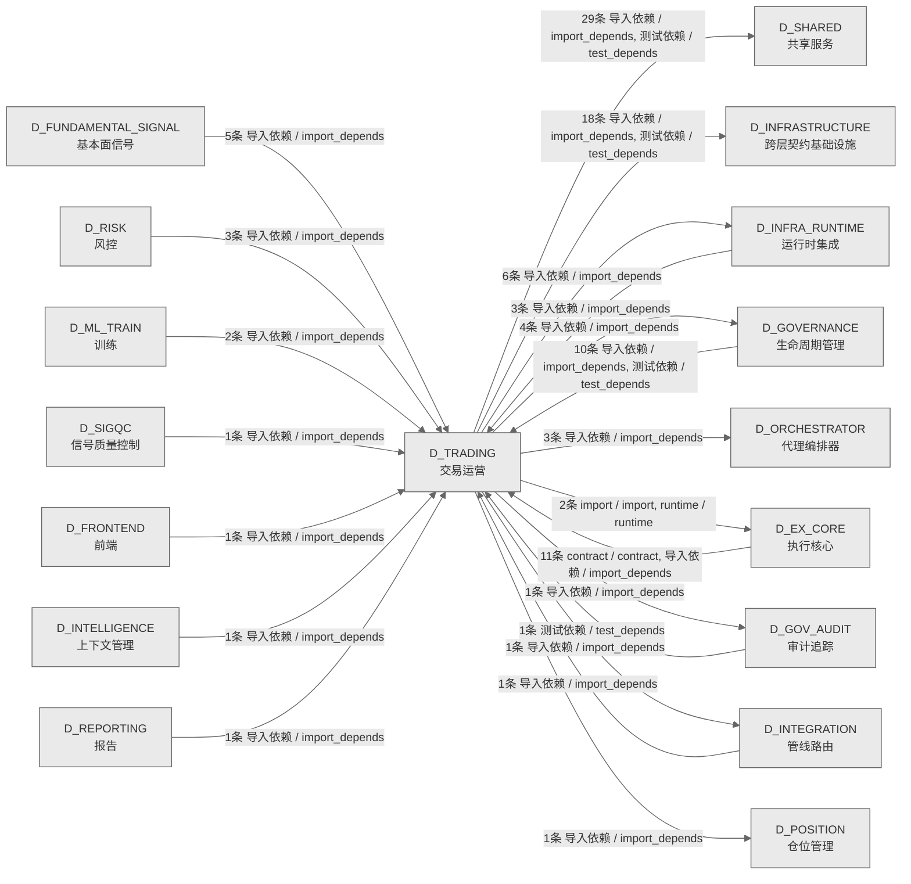

# 72_d_trading / 交易运营域 / Trading Operations

> **功能简介 / Overview**: 交易运营，负责交易生命周期管理、订单状态和成交处理

> **文档作用 / Purpose**: 展示 交易运营（D_TRADING）功能域的域内依赖关系、跨域依赖关系，模块信息（成熟度/中英文名/大白话/文件路径）内嵌于 Mermaid 节点，供架构审查和域治理参考。

> 本文档由 generate_domain_doc.py 从 depgraph (PostgreSQL) 自动生成
> 数据源: depgraph (PostgreSQL) nodes表 + edges表

> **[可缩放 HTML 版 / Zoomable HTML](http://localhost:8765/docs/02_enterprise_architecture/02_domain_architecture_docs/_zoomable_html/72_d_trading.html)** — Ctrl+滚轮缩放 ｜ 双击重置 ｜ Ctrl+Shift+D 切换拖动/选择模式

## 域基本信息 / Domain Overview

| 字段 | 值 | Field | Value |
|------|------|-------|-------|
| 编号 | 72 | Number | 72 |
| 域ID | D_TRADING | Domain ID | D_TRADING |
| 域名称 | 交易运营 | Domain Name | Trading Operations |
| 层级 | L2 业务域层 | Layer | L2 Domain |
| 模块数 | 42 | Module Count | 42 |
| 域内依赖 | 15 | Internal Dependencies | 15 |
| 跨域入边 | 40 | Cross-domain Incoming | 40 |
| 跨域出边 | 65 | Cross-domain Outgoing | 65 |
| 设计态模块 | 0 | Design Modules | 0 |
| 生产态模块 | 42 | Production Modules | 42 |
| 容量 | 42/150 (正常) | Capacity | 42/150 (正常) |
| 描述 | 交易运营，负责交易生命周期管理、订单状态和成交处理 | Description | 交易运营，负责交易生命周期管理、订单状态和成交处理 |

## 域内依赖图 / Internal Dependency Diagram

> 依赖图内嵌在本文档中，IDE 可直接渲染；网页版可 Ctrl+滚轮缩放 + 拖动平移查看细节。
>
> **图例说明 / Legend**：
> - 🟦 **蓝色 = 运营态模块**（production，已上线运行）
> - 🟧 **橙色虚线 = 设计态模块**（design，蓝图阶段，代码未写）
> - **实线箭头 = 运营态依赖**（已生效的依赖关系）
> - **虚线箭头 = 非运营态依赖**（计划中/验证中的依赖关系）

### 全景图（全部模块，颜色区分运营态/设计态）

> 展示全部 42 个模块（生产态 42 + 设计态 0），含跨域依赖外部节点。节点含成熟度+名称+大白话/简介+文件路径。

```mermaid
%%{init: {'theme': 'base', 'themeVariables': {'primaryColor': '#eaeaea', 'primaryTextColor': '#333333', 'primaryBorderColor': '#666666', 'lineColor': '#666666', 'secondaryColor': '#eaeaea', 'tertiaryColor': '#eaeaea', 'fontSize': '14px'}}}%%
flowchart TD
    src_zephyr_trading_action_dispatcher_init_py["推理结果 -> 直接回写源文件<br/>管理trading.action_dispatcher子包的加载和懒导入<br/>Init<br/>文件: action_dispatcher/__init__.py<br/>(生产态 / production)"]
    src_zephyr_trading_admission_controller_py["Any) Any 滥用——定义 VerdictEvent Protocol<br/>交易包的admission_controller模块<br/>Admission Controller<br/>文件: trading/admission_controller.py<br/>(生产态 / production)"]
    src_zephyr_trading_auto_dispatcher_py["执行 TaskCard 并触发整条基础设施管道<br/>AutoDispatcher — 守护进程内的轻量<br/>PipelineDispatcher<br/>Auto Dispatcher<br/>文件: trading/auto_dispatcher.py<br/>(生产态 / production)"]
    src_zephyr_trading_conductor_py["— 认领 + 冲突检测 + 并行分组 + 状态管理<br/>Conductor — AI session 全自动指挥官。<br/>文件: trading/conductor.py<br/>(生产态 / production)"]
    src_zephyr_trading_gpu_consensus_scheduler_py["Gpu Consensus Scheduler<br/>交易包的gpu_consensus_scheduler模块<br/>文件: trading/gpu_consensus_scheduler.py<br/>(生产态 / production)"]
    src_zephyr_trading_gpu_monitor_py["Gpu Monitor<br/>gpu_monitor.py — NVIDIA GPU 状态采集器<br/>文件: trading/gpu_monitor.py<br/>(生产态 / production)"]
    src_zephyr_trading_ide_health_daemon_py["无窗口 subprocess.run wrapper<br/>ide_health_daemon.py — TRAE IDE 幽灵窗口守护线程<br/>Ide Health Daemon<br/>文件: trading/ide_health_daemon.py<br/>(生产态 / production)"]
    src_zephyr_trading_runtime_async_runtime_py["事件循环引导 + run_in_executor 桥接<br/>交易/运行时包的async_runtime模块<br/>Async Runtime<br/>文件: runtime/async_runtime.py<br/>(生产态 / production)"]
    src_zephyr_trading_speed_baseline_checker_py["Speed Baseline Checker<br/>交易包的speed_baseline_checker模块<br/>文件: trading/speed_baseline_checker.py<br/>(生产态 / production)"]
    src_zephyr_trading_trading_contracts_broker_interface_py["BrokerInterface<br/>D_EXECUTION_CORE — BrokerInterface<br/>Broker Interface<br/>文件: trading_contracts/broker_interface.py<br/>(生产态 / production)"]
    src_zephyr_trading_trading_contracts_execution_capital_allocation_result_py["Capital Allocation Result<br/>交易/执行包的capital_allocation_result模块<br/>文件: execution/capital_allocation_result.py<br/>(生产态 / production)"]
    src_zephyr_trading_trading_contracts_execution_execution_rejection_error_py["Execution Rejection Error<br/>交易/执行包的execution_rejection_error模块<br/>文件: execution/execution_rejection_error.py<br/>(生产态 / production)"]
    src_zephyr_trading_trading_contracts_execution_execution_report_py["ExecutionReport 真源在<br/>zephyr.shared.contracts.execution_report<br/>Re-export wrapper: ExecutionReport 真源在<br/>zephyr.shared.contracts.execution_r...<br/>Execution Report<br/>文件: execution/execution_report.py<br/>(生产态 / production)"]
    src_zephyr_trading_trading_contracts_execution_fill_py["Fill 真源在 zephyr.shared.contracts.fill<br/>Re-export wrapper: Fill 真源在<br/>zephyr.shared.contracts.fill（CTR-005 codegen）<br/>文件: execution/fill.py<br/>(生产态 / production)"]
    src_zephyr_trading_trading_contracts_execution_model_serving_request_py["Model Serving Request<br/>交易/执行包的model_serving_request模块<br/>文件: execution/model_serving_request.py<br/>(生产态 / production)"]
    src_zephyr_trading_trading_contracts_execution_position_py["PositionSnapshot 真源在<br/>zephyr.shared.contracts.position<br/>Re-export wrapper: PositionSnapshot 真源在<br/>zephyr.shared.contracts.position（...<br/>文件: execution/position.py<br/>(生产态 / production)"]
    src_zephyr_trading_trading_contracts_factories_py["交易域数据契约工厂方法<br/>trading-contracts/factories.py —<br/>交易域数据契约工厂方法<br/>文件: trading_contracts/factories.py<br/>(生产态 / production)"]
    src_zephyr_trading_trading_contracts_market_instrument_py["标的契约<br/>交易/market包的instrument模块<br/>文件: market/instrument.py<br/>(生产态 / production)"]
    src_zephyr_trading_trading_contracts_market_signal_degradation_warning_py["Signal Degradation Warning<br/>交易/market包的signal_degradation_warning模块<br/>文件: market/signal_degradation_warning.py<br/>(生产态 / production)"]
    src_zephyr_trading_trading_contracts_portfolio_contracts_money_py["货币契约<br/>过渡兼容层（DEPRECATED）—— Money 契约 canonical<br/>真源已收敛至 shared 侧。<br/>文件: contracts/money.py<br/>(生产态 / production)"]
    src_zephyr_trading_trading_contracts_portfolio_contracts_strategy_lifecycle_event_py["Strategy Lifecycle Event<br/>交易/契约包的strategy_lifecycle_event模块<br/>文件: contracts/strategy_lifecycle_event.py<br/>(生产态 / production)"]
    src_zephyr_trading_trading_contracts_risk_compliance_rule_py["Compliance Rule<br/>交易/风险包的compliance_rule模块<br/>文件: risk/compliance_rule.py<br/>(生产态 / production)"]
    src_zephyr_trading_trading_contracts_risk_risk_limit_violation_error_py["Risk Limit Violation Error<br/>交易/风险包的risk_limit_violation_error模块<br/>文件: risk/risk_limit_violation_error.py<br/>(生产态 / production)"]
    src_zephyr_trading_trading_contracts_risk_risk_validator_protocol_py["Risk Validator Protocol<br/>交易/风险包的risk_validator_protocol模块<br/>文件: risk/risk_validator_protocol.py<br/>(生产态 / production)"]
    src_zephyr_trading_trading_contracts_risk_trading_kill_switch_py["Trading Kill Switch<br/>交易/风险包的trading_kill_switch模块<br/>文件: risk/trading_kill_switch.py<br/>(生产态 / production)"]
    tests_trading_test_corporate_action_processor_py["MOD-TRADING-004 Corporate Action Processor<br/>单元测试.<br/>交易包的test_corporate_action_processor模块<br/>Test Corporate Action Processor<br/>文件: trading/test_corporate_action_processor.py<br/>(生产态 / production)"]
    tests_trading_test_pnl_calculator_py["MOD-TRADING-002 PnL Calculator 单元测试.<br/>交易包的test_pnl_calculator模块<br/>Test Pnl Calculator<br/>文件: trading/test_pnl_calculator.py<br/>(生产态 / production)"]
    tests_trading_test_settlement_reconciliation_py["MOD-TRADING-003 Settlement & Reconciliation<br/>Engine 单元测试.<br/>交易包的test_settlement_reconciliation模块<br/>Test Settlement Reconciliation<br/>文件: trading/test_settlement_reconciliation.py<br/>(生产态 / production)"]
    src_zephyr_trading_action_dispatcher_init_py ~~~ src_zephyr_trading_admission_controller_py
    src_zephyr_trading_admission_controller_py ~~~ src_zephyr_trading_auto_dispatcher_py
    src_zephyr_trading_auto_dispatcher_py ~~~ src_zephyr_trading_conductor_py
    src_zephyr_trading_conductor_py ~~~ src_zephyr_trading_gpu_consensus_scheduler_py
    src_zephyr_trading_gpu_consensus_scheduler_py ~~~ src_zephyr_trading_gpu_monitor_py
    src_zephyr_trading_gpu_monitor_py ~~~ src_zephyr_trading_ide_health_daemon_py
    src_zephyr_trading_ide_health_daemon_py ~~~ src_zephyr_trading_runtime_async_runtime_py
    src_zephyr_trading_runtime_async_runtime_py ~~~ src_zephyr_trading_speed_baseline_checker_py
    src_zephyr_trading_speed_baseline_checker_py ~~~ src_zephyr_trading_trading_contracts_broker_interface_py
    src_zephyr_trading_trading_contracts_broker_interface_py ~~~ src_zephyr_trading_trading_contracts_execution_capital_allocation_result_py
    src_zephyr_trading_trading_contracts_execution_capital_allocation_result_py ~~~ src_zephyr_trading_trading_contracts_execution_execution_rejection_error_py
    src_zephyr_trading_trading_contracts_execution_execution_rejection_error_py ~~~ src_zephyr_trading_trading_contracts_execution_execution_report_py
    src_zephyr_trading_trading_contracts_execution_execution_report_py ~~~ src_zephyr_trading_trading_contracts_execution_fill_py
    src_zephyr_trading_trading_contracts_execution_fill_py ~~~ src_zephyr_trading_trading_contracts_execution_model_serving_request_py
    src_zephyr_trading_trading_contracts_execution_model_serving_request_py ~~~ src_zephyr_trading_trading_contracts_execution_position_py
    src_zephyr_trading_trading_contracts_execution_position_py ~~~ src_zephyr_trading_trading_contracts_factories_py
    src_zephyr_trading_trading_contracts_factories_py ~~~ src_zephyr_trading_trading_contracts_market_instrument_py
    src_zephyr_trading_trading_contracts_market_instrument_py ~~~ src_zephyr_trading_trading_contracts_market_signal_degradation_warning_py
    src_zephyr_trading_trading_contracts_market_signal_degradation_warning_py ~~~ src_zephyr_trading_trading_contracts_portfolio_contracts_money_py
    src_zephyr_trading_trading_contracts_portfolio_contracts_money_py ~~~ src_zephyr_trading_trading_contracts_portfolio_contracts_strategy_lifecycle_event_py
    src_zephyr_trading_trading_contracts_portfolio_contracts_strategy_lifecycle_event_py ~~~ src_zephyr_trading_trading_contracts_risk_compliance_rule_py
    src_zephyr_trading_trading_contracts_risk_compliance_rule_py ~~~ src_zephyr_trading_trading_contracts_risk_risk_limit_violation_error_py
    src_zephyr_trading_trading_contracts_risk_risk_limit_violation_error_py ~~~ src_zephyr_trading_trading_contracts_risk_risk_validator_protocol_py
    src_zephyr_trading_trading_contracts_risk_risk_validator_protocol_py ~~~ src_zephyr_trading_trading_contracts_risk_trading_kill_switch_py
    src_zephyr_trading_trading_contracts_risk_trading_kill_switch_py ~~~ tests_trading_test_corporate_action_processor_py
    tests_trading_test_corporate_action_processor_py ~~~ tests_trading_test_pnl_calculator_py
    tests_trading_test_pnl_calculator_py ~~~ tests_trading_test_settlement_reconciliation_py
    src_zephyr_trading_action_dispatcher_annotation_writer_py["注释注解写入器<br/>（从 ActionDispatcher._annotate_py_file<br/>/_tag_module/_annotate_b<br/>Annotation Writer<br/>文件: action_dispatcher/_annotation_writer.py<br/>(生产态 / production)"]
    src_zephyr_trading_action_dispatcher_audit_log_writer_py["审计日志写入器<br/>（从 ActionDispatcher._write_triage_log 提取）<br/>Audit Log Writer<br/>文件: action_dispatcher/_audit_log_writer.py<br/>(生产态 / production)"]
    src_zephyr_trading_action_dispatcher_file_lifecycle_manager_py["文件生命周期管理器<br/>（从 ActionDispatcher._create_file /<br/>_delete_file / _versio<br/>File Lifecycle Manager<br/>文件: action_dispatcher<br/>/_file_lifecycle_manager.py<br/>(生产态 / production)"]
    src_zephyr_trading_action_dispatcher_search_replace_engine_py["搜索替换引擎<br/>（从 ActionDispatcher._search_replace_file<br/>及两个底层方法提取）<br/>Search Replace Engine<br/>文件: action_dispatcher<br/>/_search_replace_engine.py<br/>(生产态 / production)"]
    src_zephyr_trading_autopilot_py["AI session 自动找活干、认领任务<br/>AutoPilot — AI session 自动找活干、认领任务。<br/>文件: trading/autopilot.py<br/>(生产态 / production)"]
    src_zephyr_trading_corporate_action_processor_py["Corporate Action & Fee Processor<br/>D_TRADING — Corporate Action & Fee Processor<br/>(公司行动处理器)<br/>Corporate Action Processor<br/>文件: trading/corporate_action_processor.py<br/>(生产态 / production)"]
    src_zephyr_trading_pnl_calculator_py["PnL Calculator<br/>D_TRADING — PnL Calculator (盈亏计算器)<br/>文件: trading/pnl_calculator.py<br/>(生产态 / production)"]
    src_zephyr_trading_settlement_reconciliation_py["Settlement & Reconciliation Engine<br/>D_TRADING — Settlement & Reconciliation Engine<br/>(结算对账器)<br/>Settlement Reconciliation<br/>文件: trading/settlement_reconciliation.py<br/>(生产态 / production)"]
    src_zephyr_trading_trading_contracts_execution_order_py["Order 真源在 zephyr.shared.contracts.order<br/>Re-export wrapper: Order 真源在<br/>zephyr.shared.contracts.order（CTR-004 codegen）<br/>文件: execution/order.py<br/>(生产态 / production)"]
    src_zephyr_trading_trading_contracts_risk_risk_dashboard_snapshot_py["Risk Dashboard Snapshot<br/>交易/风险包的risk_dashboard_snapshot模块<br/>文件: risk/risk_dashboard_snapshot.py<br/>(生产态 / production)"]
    src_zephyr_trading_trading_contracts_risk_risk_limits_py["Risk Limits<br/>交易/风险包的risk_limits模块<br/>文件: risk/risk_limits.py<br/>(生产态 / production)"]
    src_zephyr_trading_trading_contracts_risk_risk_metrics_py["Risk Metrics<br/>交易/风险包的risk_metrics模块<br/>文件: risk/risk_metrics.py<br/>(生产态 / production)"]
    src_zephyr_trading_verdict_engine_py["Verdict Engine<br/>交易包的verdict_engine模块<br/>文件: trading/verdict_engine.py<br/>(生产态 / production)"]
    src_zephyr_trading_action_dispatcher_annotation_writer_py ~~~ src_zephyr_trading_action_dispatcher_audit_log_writer_py
    src_zephyr_trading_action_dispatcher_audit_log_writer_py ~~~ src_zephyr_trading_action_dispatcher_file_lifecycle_manager_py
    src_zephyr_trading_action_dispatcher_file_lifecycle_manager_py ~~~ src_zephyr_trading_action_dispatcher_search_replace_engine_py
    src_zephyr_trading_action_dispatcher_search_replace_engine_py ~~~ src_zephyr_trading_autopilot_py
    src_zephyr_trading_autopilot_py ~~~ src_zephyr_trading_corporate_action_processor_py
    src_zephyr_trading_corporate_action_processor_py ~~~ src_zephyr_trading_pnl_calculator_py
    src_zephyr_trading_pnl_calculator_py ~~~ src_zephyr_trading_settlement_reconciliation_py
    src_zephyr_trading_settlement_reconciliation_py ~~~ src_zephyr_trading_trading_contracts_execution_order_py
    src_zephyr_trading_trading_contracts_execution_order_py ~~~ src_zephyr_trading_trading_contracts_risk_risk_dashboard_snapshot_py
    src_zephyr_trading_trading_contracts_risk_risk_dashboard_snapshot_py ~~~ src_zephyr_trading_trading_contracts_risk_risk_limits_py
    src_zephyr_trading_trading_contracts_risk_risk_limits_py ~~~ src_zephyr_trading_trading_contracts_risk_risk_metrics_py
    src_zephyr_trading_trading_contracts_risk_risk_metrics_py ~~~ src_zephyr_trading_verdict_engine_py
    src_zephyr_trading_protection_index_py["Protection Index<br/>交易包的protection_index模块<br/>文件: trading/protection_index.py<br/>(生产态 / production)"]
    src_zephyr_trading_conductor_py -->|导入依赖 / import_depends| src_zephyr_trading_autopilot_py
    src_zephyr_trading_gpu_consensus_scheduler_py -->|导入依赖 / import_depends| src_zephyr_trading_verdict_engine_py
    src_zephyr_trading_protection_index_py -->|导入依赖 / import_depends| src_zephyr_trading_verdict_engine_py
    src_zephyr_trading_verdict_engine_py -->|导入依赖 / import_depends| src_zephyr_trading_protection_index_py
    src_zephyr_trading_action_dispatcher_init_py -->|导入依赖 / import_depends| src_zephyr_trading_action_dispatcher_audit_log_writer_py
    src_zephyr_trading_action_dispatcher_init_py -->|导入依赖 / import_depends| src_zephyr_trading_action_dispatcher_annotation_writer_py
    src_zephyr_trading_action_dispatcher_init_py -->|导入依赖 / import_depends| src_zephyr_trading_action_dispatcher_search_replace_engine_py
    src_zephyr_trading_action_dispatcher_init_py -->|导入依赖 / import_depends| src_zephyr_trading_action_dispatcher_file_lifecycle_manager_py
    src_zephyr_trading_trading_contracts_factories_py -->|导入依赖 / import_depends| src_zephyr_trading_trading_contracts_execution_order_py
    src_zephyr_trading_trading_contracts_factories_py -->|导入依赖 / import_depends| src_zephyr_trading_trading_contracts_risk_risk_limits_py
    src_zephyr_trading_trading_contracts_factories_py -->|导入依赖 / import_depends| src_zephyr_trading_trading_contracts_risk_risk_dashboard_snapshot_py
    src_zephyr_trading_trading_contracts_factories_py -->|导入依赖 / import_depends| src_zephyr_trading_trading_contracts_risk_risk_metrics_py
    tests_trading_test_corporate_action_processor_py -->|测试依赖 / test_depends| src_zephyr_trading_corporate_action_processor_py
    tests_trading_test_pnl_calculator_py -->|测试依赖 / test_depends| src_zephyr_trading_pnl_calculator_py
    tests_trading_test_settlement_reconciliation_py -->|测试依赖 / test_depends| src_zephyr_trading_settlement_reconciliation_py
    D_POSITION["仓位管理<br/>仓位管理，负责持仓跟踪、仓位计算和盈亏分析<br/>Position Management<br/>跨域节点 / cross-domain<br/>(生产态 / production)"]
    src_zephyr_trading_pnl_calculator_py -->|导入依赖 / import_depends| D_POSITION
    D_EX_CORE["执行核心<br/>执行核心，负责订单执行引擎、执行策略和执行管理<br/>Execution Core<br/>跨域节点 / cross-domain<br/>(生产态 / production)"]
    src_zephyr_trading_settlement_reconciliation_py -->|runtime / runtime| D_EX_CORE
    src_zephyr_trading_pnl_calculator_py -->|import / import| D_EX_CORE
    D_SHARED["共享服务<br/>共享服务，负责跨域共享的工具、协议和基础服务<br/>Shared Services<br/>跨域节点 / cross-domain<br/>(生产态 / production)"]
    src_zephyr_trading_gpu_monitor_py -->|导入依赖 / import_depends| D_SHARED
    D_INFRASTRUCTURE["跨层契约基础设施<br/>跨层契约基础设施，负责跨层契约定义、共享契约管理<br/>和契约校验<br/>Cross-Layer Contract Infrastructure<br/>跨域节点 / cross-domain<br/>(生产态 / production)"]
    src_zephyr_trading_trading_contracts_risk_risk_limits_py -->|导入依赖 / import_depends| D_INFRASTRUCTURE
    tests_trading_test_pnl_calculator_py -->|测试依赖 / test_depends| D_SHARED
    src_zephyr_trading_action_dispatcher_init_py -->|导入依赖 / import_depends| D_SHARED
    src_zephyr_trading_trading_contracts_broker_interface_py -->|导入依赖 / import_depends| D_INFRASTRUCTURE
    src_zephyr_trading_action_dispatcher_init_py -->|导入依赖 / import_depends| D_SHARED
    src_zephyr_trading_corporate_action_processor_py -->|导入依赖 / import_depends| D_SHARED
    src_zephyr_trading_trading_contracts_broker_interface_py -->|导入依赖 / import_depends| D_INFRASTRUCTURE
    src_zephyr_trading_trading_contracts_execution_order_py -->|导入依赖 / import_depends| D_INFRASTRUCTURE
    src_zephyr_trading_gpu_consensus_scheduler_py -->|导入依赖 / import_depends| D_SHARED
    src_zephyr_trading_trading_contracts_portfolio_contracts_strategy_lifecycle_event_py -->|导入依赖 / import_depends| D_INFRASTRUCTURE
    src_zephyr_trading_settlement_reconciliation_py -->|导入依赖 / import_depends| D_INFRASTRUCTURE
    D_EX_CORE -.->|导入依赖 / import_depends| src_zephyr_trading_trading_contracts_execution_position_py
    D_EX_CORE -.->|导入依赖 / import_depends| src_zephyr_trading_trading_contracts_risk_risk_limits_py
    D_EX_CORE -->|contract / contract| src_zephyr_trading_trading_contracts_broker_interface_py
    D_EX_CORE -->|导入依赖 / import_depends| src_zephyr_trading_trading_contracts_execution_order_py
    D_GOVERNANCE["生命周期管理<br/>生命周期管理，负责蓝图/模块<br/>/任务的声明周期管理和元数据治理<br/>Lifecycle Management<br/>跨域节点 / cross-domain<br/>(生产态 / production)"]
    D_GOVERNANCE -->|测试依赖 / test_depends| src_zephyr_trading_trading_contracts_execution_fill_py
    D_GOVERNANCE -->|测试依赖 / test_depends| src_zephyr_trading_trading_contracts_execution_order_py
    D_GOVERNANCE -->|测试依赖 / test_depends| src_zephyr_trading_trading_contracts_execution_position_py
    D_INTELLIGENCE["上下文管理<br/>上下文管理，负责 AI<br/>上下文窗口管理、记忆检索和上下文压缩<br/>Context Management<br/>跨域节点 / cross-domain<br/>(生产态 / production)"]
    D_INTELLIGENCE -->|导入依赖 / import_depends| src_zephyr_trading_trading_contracts_execution_model_serving_request_py
    D_EX_CORE -->|导入依赖 / import_depends| src_zephyr_trading_trading_contracts_broker_interface_py
    D_ML_TRAIN["训练<br/>训练，负责模型训练、特征工程和模型评估<br/>Training<br/>跨域节点 / cross-domain<br/>(生产态 / production)"]
    D_ML_TRAIN -->|导入依赖 / import_depends| src_zephyr_trading_trading_contracts_execution_model_serving_request_py
    D_EX_CORE -->|导入依赖 / import_depends| src_zephyr_trading_trading_contracts_execution_fill_py
    D_INTEGRATION["管线路由<br/>管线路由，负责跨域数据流路由、管道编排和集成适配<br/>Pipeline Routing<br/>跨域节点 / cross-domain<br/>(生产态 / production)"]
    D_INTEGRATION -->|导入依赖 / import_depends| src_zephyr_trading_admission_controller_py
    D_INFRA_RUNTIME["运行时集成<br/>运行时集成，负责组件生命周期编排、启动钩子和运行<br/>时上下文管理<br/>Runtime Integration<br/>跨域节点 / cross-domain<br/>(生产态 / production)"]
    D_INFRA_RUNTIME -->|导入依赖 / import_depends| src_zephyr_trading_gpu_monitor_py
    D_RISK["风控<br/>风控，负责风险指标计算、风险限额管理和风险预警<br/>Risk Control<br/>跨域节点 / cross-domain<br/>(生产态 / production)"]
    D_RISK -->|导入依赖 / import_depends| src_zephyr_trading_trading_contracts_risk_risk_dashboard_snapshot_py
    D_EX_CORE -->|导入依赖 / import_depends| src_zephyr_trading_trading_contracts_execution_position_py
    classDef production fill:#e1f5fe,stroke:#01579b,stroke-width:2px,color:#000
    classDef design fill:#fff3e0,stroke:#e65100,stroke-width:2px,color:#000,stroke-dasharray: 5 5
    classDef external_prod fill:#e8f4fd,stroke:#0277bd,stroke-width:1px,color:#000
    classDef external_design fill:#fff8e7,stroke:#ef6c00,stroke-width:1px,color:#000,stroke-dasharray: 5 5
    class src_zephyr_trading_action_dispatcher_init_py,src_zephyr_trading_action_dispatcher_annotation_writer_py,src_zephyr_trading_action_dispatcher_audit_log_writer_py,src_zephyr_trading_action_dispatcher_file_lifecycle_manager_py,src_zephyr_trading_action_dispatcher_search_replace_engine_py,src_zephyr_trading_admission_controller_py,src_zephyr_trading_auto_dispatcher_py,src_zephyr_trading_autopilot_py,src_zephyr_trading_conductor_py,src_zephyr_trading_corporate_action_processor_py,src_zephyr_trading_gpu_consensus_scheduler_py,src_zephyr_trading_gpu_monitor_py,src_zephyr_trading_ide_health_daemon_py,src_zephyr_trading_pnl_calculator_py,src_zephyr_trading_protection_index_py,src_zephyr_trading_runtime_async_runtime_py,src_zephyr_trading_settlement_reconciliation_py,src_zephyr_trading_speed_baseline_checker_py,src_zephyr_trading_trading_contracts_broker_interface_py,src_zephyr_trading_trading_contracts_execution_capital_allocation_result_py,src_zephyr_trading_trading_contracts_execution_execution_rejection_error_py,src_zephyr_trading_trading_contracts_execution_execution_report_py,src_zephyr_trading_trading_contracts_execution_fill_py,src_zephyr_trading_trading_contracts_execution_model_serving_request_py,src_zephyr_trading_trading_contracts_execution_order_py,src_zephyr_trading_trading_contracts_execution_position_py,src_zephyr_trading_trading_contracts_factories_py,src_zephyr_trading_trading_contracts_market_instrument_py,src_zephyr_trading_trading_contracts_market_signal_degradation_warning_py,src_zephyr_trading_trading_contracts_portfolio_contracts_money_py,src_zephyr_trading_trading_contracts_portfolio_contracts_strategy_lifecycle_event_py,src_zephyr_trading_trading_contracts_risk_compliance_rule_py,src_zephyr_trading_trading_contracts_risk_risk_dashboard_snapshot_py,src_zephyr_trading_trading_contracts_risk_risk_limit_violation_error_py,src_zephyr_trading_trading_contracts_risk_risk_limits_py,src_zephyr_trading_trading_contracts_risk_risk_metrics_py,src_zephyr_trading_trading_contracts_risk_risk_validator_protocol_py,src_zephyr_trading_trading_contracts_risk_trading_kill_switch_py,src_zephyr_trading_verdict_engine_py,tests_trading_test_corporate_action_processor_py,tests_trading_test_pnl_calculator_py,tests_trading_test_settlement_reconciliation_py production
    class D_POSITION,D_EX_CORE,D_SHARED,D_INFRASTRUCTURE,D_GOVERNANCE,D_INTELLIGENCE,D_ML_TRAIN,D_INTEGRATION,D_INFRA_RUNTIME,D_RISK external_prod
```

### 运营态的图（仅 design_maturity=production 的模块和域内依赖）

> 仅展示已上线运行的模块（共 42 个），不含跨域外部节点。跨域依赖见下方跨域依赖章节。

```mermaid
%%{init: {'theme': 'base', 'themeVariables': {'primaryColor': '#eaeaea', 'primaryTextColor': '#333333', 'primaryBorderColor': '#666666', 'lineColor': '#666666', 'secondaryColor': '#eaeaea', 'tertiaryColor': '#eaeaea', 'fontSize': '14px'}}}%%
flowchart TD
    src_zephyr_trading_action_dispatcher_init_py["推理结果 -> 直接回写源文件<br/>管理trading.action_dispatcher子包的加载和懒导入<br/>Init<br/>文件: action_dispatcher/__init__.py<br/>(生产态 / production)"]
    src_zephyr_trading_admission_controller_py["Any) Any 滥用——定义 VerdictEvent Protocol<br/>交易包的admission_controller模块<br/>Admission Controller<br/>文件: trading/admission_controller.py<br/>(生产态 / production)"]
    src_zephyr_trading_auto_dispatcher_py["执行 TaskCard 并触发整条基础设施管道<br/>AutoDispatcher — 守护进程内的轻量<br/>PipelineDispatcher<br/>Auto Dispatcher<br/>文件: trading/auto_dispatcher.py<br/>(生产态 / production)"]
    src_zephyr_trading_conductor_py["— 认领 + 冲突检测 + 并行分组 + 状态管理<br/>Conductor — AI session 全自动指挥官。<br/>文件: trading/conductor.py<br/>(生产态 / production)"]
    src_zephyr_trading_gpu_consensus_scheduler_py["Gpu Consensus Scheduler<br/>交易包的gpu_consensus_scheduler模块<br/>文件: trading/gpu_consensus_scheduler.py<br/>(生产态 / production)"]
    src_zephyr_trading_gpu_monitor_py["Gpu Monitor<br/>gpu_monitor.py — NVIDIA GPU 状态采集器<br/>文件: trading/gpu_monitor.py<br/>(生产态 / production)"]
    src_zephyr_trading_ide_health_daemon_py["无窗口 subprocess.run wrapper<br/>ide_health_daemon.py — TRAE IDE 幽灵窗口守护线程<br/>Ide Health Daemon<br/>文件: trading/ide_health_daemon.py<br/>(生产态 / production)"]
    src_zephyr_trading_runtime_async_runtime_py["事件循环引导 + run_in_executor 桥接<br/>交易/运行时包的async_runtime模块<br/>Async Runtime<br/>文件: runtime/async_runtime.py<br/>(生产态 / production)"]
    src_zephyr_trading_speed_baseline_checker_py["Speed Baseline Checker<br/>交易包的speed_baseline_checker模块<br/>文件: trading/speed_baseline_checker.py<br/>(生产态 / production)"]
    src_zephyr_trading_trading_contracts_broker_interface_py["BrokerInterface<br/>D_EXECUTION_CORE — BrokerInterface<br/>Broker Interface<br/>文件: trading_contracts/broker_interface.py<br/>(生产态 / production)"]
    src_zephyr_trading_trading_contracts_execution_capital_allocation_result_py["Capital Allocation Result<br/>交易/执行包的capital_allocation_result模块<br/>文件: execution/capital_allocation_result.py<br/>(生产态 / production)"]
    src_zephyr_trading_trading_contracts_execution_execution_rejection_error_py["Execution Rejection Error<br/>交易/执行包的execution_rejection_error模块<br/>文件: execution/execution_rejection_error.py<br/>(生产态 / production)"]
    src_zephyr_trading_trading_contracts_execution_execution_report_py["ExecutionReport 真源在<br/>zephyr.shared.contracts.execution_report<br/>Re-export wrapper: ExecutionReport 真源在<br/>zephyr.shared.contracts.execution_r...<br/>Execution Report<br/>文件: execution/execution_report.py<br/>(生产态 / production)"]
    src_zephyr_trading_trading_contracts_execution_fill_py["Fill 真源在 zephyr.shared.contracts.fill<br/>Re-export wrapper: Fill 真源在<br/>zephyr.shared.contracts.fill（CTR-005 codegen）<br/>文件: execution/fill.py<br/>(生产态 / production)"]
    src_zephyr_trading_trading_contracts_execution_model_serving_request_py["Model Serving Request<br/>交易/执行包的model_serving_request模块<br/>文件: execution/model_serving_request.py<br/>(生产态 / production)"]
    src_zephyr_trading_trading_contracts_execution_position_py["PositionSnapshot 真源在<br/>zephyr.shared.contracts.position<br/>Re-export wrapper: PositionSnapshot 真源在<br/>zephyr.shared.contracts.position（...<br/>文件: execution/position.py<br/>(生产态 / production)"]
    src_zephyr_trading_trading_contracts_factories_py["交易域数据契约工厂方法<br/>trading-contracts/factories.py —<br/>交易域数据契约工厂方法<br/>文件: trading_contracts/factories.py<br/>(生产态 / production)"]
    src_zephyr_trading_trading_contracts_market_instrument_py["标的契约<br/>交易/market包的instrument模块<br/>文件: market/instrument.py<br/>(生产态 / production)"]
    src_zephyr_trading_trading_contracts_market_signal_degradation_warning_py["Signal Degradation Warning<br/>交易/market包的signal_degradation_warning模块<br/>文件: market/signal_degradation_warning.py<br/>(生产态 / production)"]
    src_zephyr_trading_trading_contracts_portfolio_contracts_money_py["货币契约<br/>过渡兼容层（DEPRECATED）—— Money 契约 canonical<br/>真源已收敛至 shared 侧。<br/>文件: contracts/money.py<br/>(生产态 / production)"]
    src_zephyr_trading_trading_contracts_portfolio_contracts_strategy_lifecycle_event_py["Strategy Lifecycle Event<br/>交易/契约包的strategy_lifecycle_event模块<br/>文件: contracts/strategy_lifecycle_event.py<br/>(生产态 / production)"]
    src_zephyr_trading_trading_contracts_risk_compliance_rule_py["Compliance Rule<br/>交易/风险包的compliance_rule模块<br/>文件: risk/compliance_rule.py<br/>(生产态 / production)"]
    src_zephyr_trading_trading_contracts_risk_risk_limit_violation_error_py["Risk Limit Violation Error<br/>交易/风险包的risk_limit_violation_error模块<br/>文件: risk/risk_limit_violation_error.py<br/>(生产态 / production)"]
    src_zephyr_trading_trading_contracts_risk_risk_validator_protocol_py["Risk Validator Protocol<br/>交易/风险包的risk_validator_protocol模块<br/>文件: risk/risk_validator_protocol.py<br/>(生产态 / production)"]
    src_zephyr_trading_trading_contracts_risk_trading_kill_switch_py["Trading Kill Switch<br/>交易/风险包的trading_kill_switch模块<br/>文件: risk/trading_kill_switch.py<br/>(生产态 / production)"]
    tests_trading_test_corporate_action_processor_py["MOD-TRADING-004 Corporate Action Processor<br/>单元测试.<br/>交易包的test_corporate_action_processor模块<br/>Test Corporate Action Processor<br/>文件: trading/test_corporate_action_processor.py<br/>(生产态 / production)"]
    tests_trading_test_pnl_calculator_py["MOD-TRADING-002 PnL Calculator 单元测试.<br/>交易包的test_pnl_calculator模块<br/>Test Pnl Calculator<br/>文件: trading/test_pnl_calculator.py<br/>(生产态 / production)"]
    tests_trading_test_settlement_reconciliation_py["MOD-TRADING-003 Settlement & Reconciliation<br/>Engine 单元测试.<br/>交易包的test_settlement_reconciliation模块<br/>Test Settlement Reconciliation<br/>文件: trading/test_settlement_reconciliation.py<br/>(生产态 / production)"]
    src_zephyr_trading_action_dispatcher_init_py ~~~ src_zephyr_trading_admission_controller_py
    src_zephyr_trading_admission_controller_py ~~~ src_zephyr_trading_auto_dispatcher_py
    src_zephyr_trading_auto_dispatcher_py ~~~ src_zephyr_trading_conductor_py
    src_zephyr_trading_conductor_py ~~~ src_zephyr_trading_gpu_consensus_scheduler_py
    src_zephyr_trading_gpu_consensus_scheduler_py ~~~ src_zephyr_trading_gpu_monitor_py
    src_zephyr_trading_gpu_monitor_py ~~~ src_zephyr_trading_ide_health_daemon_py
    src_zephyr_trading_ide_health_daemon_py ~~~ src_zephyr_trading_runtime_async_runtime_py
    src_zephyr_trading_runtime_async_runtime_py ~~~ src_zephyr_trading_speed_baseline_checker_py
    src_zephyr_trading_speed_baseline_checker_py ~~~ src_zephyr_trading_trading_contracts_broker_interface_py
    src_zephyr_trading_trading_contracts_broker_interface_py ~~~ src_zephyr_trading_trading_contracts_execution_capital_allocation_result_py
    src_zephyr_trading_trading_contracts_execution_capital_allocation_result_py ~~~ src_zephyr_trading_trading_contracts_execution_execution_rejection_error_py
    src_zephyr_trading_trading_contracts_execution_execution_rejection_error_py ~~~ src_zephyr_trading_trading_contracts_execution_execution_report_py
    src_zephyr_trading_trading_contracts_execution_execution_report_py ~~~ src_zephyr_trading_trading_contracts_execution_fill_py
    src_zephyr_trading_trading_contracts_execution_fill_py ~~~ src_zephyr_trading_trading_contracts_execution_model_serving_request_py
    src_zephyr_trading_trading_contracts_execution_model_serving_request_py ~~~ src_zephyr_trading_trading_contracts_execution_position_py
    src_zephyr_trading_trading_contracts_execution_position_py ~~~ src_zephyr_trading_trading_contracts_factories_py
    src_zephyr_trading_trading_contracts_factories_py ~~~ src_zephyr_trading_trading_contracts_market_instrument_py
    src_zephyr_trading_trading_contracts_market_instrument_py ~~~ src_zephyr_trading_trading_contracts_market_signal_degradation_warning_py
    src_zephyr_trading_trading_contracts_market_signal_degradation_warning_py ~~~ src_zephyr_trading_trading_contracts_portfolio_contracts_money_py
    src_zephyr_trading_trading_contracts_portfolio_contracts_money_py ~~~ src_zephyr_trading_trading_contracts_portfolio_contracts_strategy_lifecycle_event_py
    src_zephyr_trading_trading_contracts_portfolio_contracts_strategy_lifecycle_event_py ~~~ src_zephyr_trading_trading_contracts_risk_compliance_rule_py
    src_zephyr_trading_trading_contracts_risk_compliance_rule_py ~~~ src_zephyr_trading_trading_contracts_risk_risk_limit_violation_error_py
    src_zephyr_trading_trading_contracts_risk_risk_limit_violation_error_py ~~~ src_zephyr_trading_trading_contracts_risk_risk_validator_protocol_py
    src_zephyr_trading_trading_contracts_risk_risk_validator_protocol_py ~~~ src_zephyr_trading_trading_contracts_risk_trading_kill_switch_py
    src_zephyr_trading_trading_contracts_risk_trading_kill_switch_py ~~~ tests_trading_test_corporate_action_processor_py
    tests_trading_test_corporate_action_processor_py ~~~ tests_trading_test_pnl_calculator_py
    tests_trading_test_pnl_calculator_py ~~~ tests_trading_test_settlement_reconciliation_py
    src_zephyr_trading_action_dispatcher_annotation_writer_py["注释注解写入器<br/>（从 ActionDispatcher._annotate_py_file<br/>/_tag_module/_annotate_b<br/>Annotation Writer<br/>文件: action_dispatcher/_annotation_writer.py<br/>(生产态 / production)"]
    src_zephyr_trading_action_dispatcher_audit_log_writer_py["审计日志写入器<br/>（从 ActionDispatcher._write_triage_log 提取）<br/>Audit Log Writer<br/>文件: action_dispatcher/_audit_log_writer.py<br/>(生产态 / production)"]
    src_zephyr_trading_action_dispatcher_file_lifecycle_manager_py["文件生命周期管理器<br/>（从 ActionDispatcher._create_file /<br/>_delete_file / _versio<br/>File Lifecycle Manager<br/>文件: action_dispatcher<br/>/_file_lifecycle_manager.py<br/>(生产态 / production)"]
    src_zephyr_trading_action_dispatcher_search_replace_engine_py["搜索替换引擎<br/>（从 ActionDispatcher._search_replace_file<br/>及两个底层方法提取）<br/>Search Replace Engine<br/>文件: action_dispatcher<br/>/_search_replace_engine.py<br/>(生产态 / production)"]
    src_zephyr_trading_autopilot_py["AI session 自动找活干、认领任务<br/>AutoPilot — AI session 自动找活干、认领任务。<br/>文件: trading/autopilot.py<br/>(生产态 / production)"]
    src_zephyr_trading_corporate_action_processor_py["Corporate Action & Fee Processor<br/>D_TRADING — Corporate Action & Fee Processor<br/>(公司行动处理器)<br/>Corporate Action Processor<br/>文件: trading/corporate_action_processor.py<br/>(生产态 / production)"]
    src_zephyr_trading_pnl_calculator_py["PnL Calculator<br/>D_TRADING — PnL Calculator (盈亏计算器)<br/>文件: trading/pnl_calculator.py<br/>(生产态 / production)"]
    src_zephyr_trading_settlement_reconciliation_py["Settlement & Reconciliation Engine<br/>D_TRADING — Settlement & Reconciliation Engine<br/>(结算对账器)<br/>Settlement Reconciliation<br/>文件: trading/settlement_reconciliation.py<br/>(生产态 / production)"]
    src_zephyr_trading_trading_contracts_execution_order_py["Order 真源在 zephyr.shared.contracts.order<br/>Re-export wrapper: Order 真源在<br/>zephyr.shared.contracts.order（CTR-004 codegen）<br/>文件: execution/order.py<br/>(生产态 / production)"]
    src_zephyr_trading_trading_contracts_risk_risk_dashboard_snapshot_py["Risk Dashboard Snapshot<br/>交易/风险包的risk_dashboard_snapshot模块<br/>文件: risk/risk_dashboard_snapshot.py<br/>(生产态 / production)"]
    src_zephyr_trading_trading_contracts_risk_risk_limits_py["Risk Limits<br/>交易/风险包的risk_limits模块<br/>文件: risk/risk_limits.py<br/>(生产态 / production)"]
    src_zephyr_trading_trading_contracts_risk_risk_metrics_py["Risk Metrics<br/>交易/风险包的risk_metrics模块<br/>文件: risk/risk_metrics.py<br/>(生产态 / production)"]
    src_zephyr_trading_verdict_engine_py["Verdict Engine<br/>交易包的verdict_engine模块<br/>文件: trading/verdict_engine.py<br/>(生产态 / production)"]
    src_zephyr_trading_action_dispatcher_annotation_writer_py ~~~ src_zephyr_trading_action_dispatcher_audit_log_writer_py
    src_zephyr_trading_action_dispatcher_audit_log_writer_py ~~~ src_zephyr_trading_action_dispatcher_file_lifecycle_manager_py
    src_zephyr_trading_action_dispatcher_file_lifecycle_manager_py ~~~ src_zephyr_trading_action_dispatcher_search_replace_engine_py
    src_zephyr_trading_action_dispatcher_search_replace_engine_py ~~~ src_zephyr_trading_autopilot_py
    src_zephyr_trading_autopilot_py ~~~ src_zephyr_trading_corporate_action_processor_py
    src_zephyr_trading_corporate_action_processor_py ~~~ src_zephyr_trading_pnl_calculator_py
    src_zephyr_trading_pnl_calculator_py ~~~ src_zephyr_trading_settlement_reconciliation_py
    src_zephyr_trading_settlement_reconciliation_py ~~~ src_zephyr_trading_trading_contracts_execution_order_py
    src_zephyr_trading_trading_contracts_execution_order_py ~~~ src_zephyr_trading_trading_contracts_risk_risk_dashboard_snapshot_py
    src_zephyr_trading_trading_contracts_risk_risk_dashboard_snapshot_py ~~~ src_zephyr_trading_trading_contracts_risk_risk_limits_py
    src_zephyr_trading_trading_contracts_risk_risk_limits_py ~~~ src_zephyr_trading_trading_contracts_risk_risk_metrics_py
    src_zephyr_trading_trading_contracts_risk_risk_metrics_py ~~~ src_zephyr_trading_verdict_engine_py
    src_zephyr_trading_protection_index_py["Protection Index<br/>交易包的protection_index模块<br/>文件: trading/protection_index.py<br/>(生产态 / production)"]
    src_zephyr_trading_conductor_py -->|导入依赖 / import_depends| src_zephyr_trading_autopilot_py
    src_zephyr_trading_gpu_consensus_scheduler_py -->|导入依赖 / import_depends| src_zephyr_trading_verdict_engine_py
    src_zephyr_trading_protection_index_py -->|导入依赖 / import_depends| src_zephyr_trading_verdict_engine_py
    src_zephyr_trading_verdict_engine_py -->|导入依赖 / import_depends| src_zephyr_trading_protection_index_py
    src_zephyr_trading_action_dispatcher_init_py -->|导入依赖 / import_depends| src_zephyr_trading_action_dispatcher_audit_log_writer_py
    src_zephyr_trading_action_dispatcher_init_py -->|导入依赖 / import_depends| src_zephyr_trading_action_dispatcher_annotation_writer_py
    src_zephyr_trading_action_dispatcher_init_py -->|导入依赖 / import_depends| src_zephyr_trading_action_dispatcher_search_replace_engine_py
    src_zephyr_trading_action_dispatcher_init_py -->|导入依赖 / import_depends| src_zephyr_trading_action_dispatcher_file_lifecycle_manager_py
    src_zephyr_trading_trading_contracts_factories_py -->|导入依赖 / import_depends| src_zephyr_trading_trading_contracts_execution_order_py
    src_zephyr_trading_trading_contracts_factories_py -->|导入依赖 / import_depends| src_zephyr_trading_trading_contracts_risk_risk_limits_py
    src_zephyr_trading_trading_contracts_factories_py -->|导入依赖 / import_depends| src_zephyr_trading_trading_contracts_risk_risk_dashboard_snapshot_py
    src_zephyr_trading_trading_contracts_factories_py -->|导入依赖 / import_depends| src_zephyr_trading_trading_contracts_risk_risk_metrics_py
    tests_trading_test_corporate_action_processor_py -->|测试依赖 / test_depends| src_zephyr_trading_corporate_action_processor_py
    tests_trading_test_pnl_calculator_py -->|测试依赖 / test_depends| src_zephyr_trading_pnl_calculator_py
    tests_trading_test_settlement_reconciliation_py -->|测试依赖 / test_depends| src_zephyr_trading_settlement_reconciliation_py
    classDef production fill:#e1f5fe,stroke:#01579b,stroke-width:2px,color:#000
    classDef design fill:#fff3e0,stroke:#e65100,stroke-width:2px,color:#000,stroke-dasharray: 5 5
    classDef external_prod fill:#e8f4fd,stroke:#0277bd,stroke-width:1px,color:#000
    classDef external_design fill:#fff8e7,stroke:#ef6c00,stroke-width:1px,color:#000,stroke-dasharray: 5 5
    class src_zephyr_trading_action_dispatcher_init_py,src_zephyr_trading_action_dispatcher_annotation_writer_py,src_zephyr_trading_action_dispatcher_audit_log_writer_py,src_zephyr_trading_action_dispatcher_file_lifecycle_manager_py,src_zephyr_trading_action_dispatcher_search_replace_engine_py,src_zephyr_trading_admission_controller_py,src_zephyr_trading_auto_dispatcher_py,src_zephyr_trading_autopilot_py,src_zephyr_trading_conductor_py,src_zephyr_trading_corporate_action_processor_py,src_zephyr_trading_gpu_consensus_scheduler_py,src_zephyr_trading_gpu_monitor_py,src_zephyr_trading_ide_health_daemon_py,src_zephyr_trading_pnl_calculator_py,src_zephyr_trading_protection_index_py,src_zephyr_trading_runtime_async_runtime_py,src_zephyr_trading_settlement_reconciliation_py,src_zephyr_trading_speed_baseline_checker_py,src_zephyr_trading_trading_contracts_broker_interface_py,src_zephyr_trading_trading_contracts_execution_capital_allocation_result_py,src_zephyr_trading_trading_contracts_execution_execution_rejection_error_py,src_zephyr_trading_trading_contracts_execution_execution_report_py,src_zephyr_trading_trading_contracts_execution_fill_py,src_zephyr_trading_trading_contracts_execution_model_serving_request_py,src_zephyr_trading_trading_contracts_execution_order_py,src_zephyr_trading_trading_contracts_execution_position_py,src_zephyr_trading_trading_contracts_factories_py,src_zephyr_trading_trading_contracts_market_instrument_py,src_zephyr_trading_trading_contracts_market_signal_degradation_warning_py,src_zephyr_trading_trading_contracts_portfolio_contracts_money_py,src_zephyr_trading_trading_contracts_portfolio_contracts_strategy_lifecycle_event_py,src_zephyr_trading_trading_contracts_risk_compliance_rule_py,src_zephyr_trading_trading_contracts_risk_risk_dashboard_snapshot_py,src_zephyr_trading_trading_contracts_risk_risk_limit_violation_error_py,src_zephyr_trading_trading_contracts_risk_risk_limits_py,src_zephyr_trading_trading_contracts_risk_risk_metrics_py,src_zephyr_trading_trading_contracts_risk_risk_validator_protocol_py,src_zephyr_trading_trading_contracts_risk_trading_kill_switch_py,src_zephyr_trading_verdict_engine_py,tests_trading_test_corporate_action_processor_py,tests_trading_test_pnl_calculator_py,tests_trading_test_settlement_reconciliation_py production
```

### 设计态的图（仅 design_maturity=design 的模块和域内依赖）

> 仅展示蓝图阶段、代码未写的设计态模块（共 0 个），不含跨域外部节点。

> （无模块 / No modules）

## 跨域依赖 / Cross-domain Dependencies

### 本域依赖的其他域（出边）/ Depends On

| # | 本域模块 / Source Module | → | 外部域-目标模块 / Target Module | 依赖类型 / Type |
|:--:|---------|:--:|---------|---------|
| 1 | Pnl Calculator (trading/pnl_calculator.py) | → | D_EX_CORE 执行核心: 部分成交处理器 (ex_core/fill_handler.py) | import / import |
| 2 | Settlement Reconciliation (trading/settlement_reconciliat... | → | D_EX_CORE 执行核心: 订单管理器 / D_EXECUTION_CORE — Order Manager (ex_core/o... | runtime / runtime |
| 3 | 执行 TaskCard 并触发整条基础设施管道 / Auto Dispatcher (t... | → | D_GOVERNANCE 生命周期管理: 任务repo / task_repo (persistence/task_repo.py) | 导入依赖 / import_depends |
| 4 | AI session 自动找活干、认领任务 / Autopilot (trading/auto... | → | D_GOVERNANCE 生命周期管理: 任务repo / task_repo (persistence/task_repo.py) | 导入依赖 / import_depends |
| 5 | 认领 + 冲突检测 + 并行分组 + 状态管理 / Conductor (tradin... | → | D_GOVERNANCE 生命周期管理: 任务repo / task_repo (persistence/task_repo.py) | 导入依赖 / import_depends |
| 6 | 无窗口 subprocess.run wrapper / Ide Health Daemon (tradin... | → | D_GOVERNANCE 生命周期管理: 任务repo / task_repo (persistence/task_repo.py) | 导入依赖 / import_depends |
| 7 | Verdict Engine (trading/verdict_engine.py) | → | D_GOV_AUDIT 审计追踪: 审计事件类型枚举——治本（裁定#18 G2）：转为真 Enu / mode... | 导入依赖 / import_depends |
| 8 | Pnl Calculator (trading/pnl_calculator.py) | → | D_INFRASTRUCTURE 跨层契约基础设施: Fill (contracts/fill.py) | 导入依赖 / import_depends |
| 9 | Settlement Reconciliation (trading/settlement_reconciliat... | → | D_INFRASTRUCTURE 跨层契约基础设施: Fill (contracts/fill.py) | 导入依赖 / import_depends |
| 10 | Broker Interface (trading_contracts/broker_interface.py) | → | D_INFRASTRUCTURE 跨层契约基础设施: Fill (contracts/fill.py) | 导入依赖 / import_depends |
| 11 | Broker Interface (trading_contracts/broker_interface.py) | → | D_INFRASTRUCTURE 跨层契约基础设施: Order (contracts/order.py) | 导入依赖 / import_depends |
| 12 | Broker Interface (trading_contracts/broker_interface.py) | → | D_INFRASTRUCTURE 跨层契约基础设施: Position (contracts/position.py) | 导入依赖 / import_depends |
| 13 | Execution Rejection Error (execution/execution_rejection_... | → | D_INFRASTRUCTURE 跨层契约基础设施: Trace Context (contracts/trace_context.py) | 导入依赖 / import_depends |
| 14 | ExecutionReport 真源在 zephyr.shared.contracts.execution_... | → | D_INFRASTRUCTURE 跨层契约基础设施: Execution Report (contracts/execution_report.py) | 导入依赖 / import_depends |
| 15 | Fill 真源在 zephyr.shared.contracts.fill / Fill (executio... | → | D_INFRASTRUCTURE 跨层契约基础设施: Fill (contracts/fill.py) | 导入依赖 / import_depends |
| 16 | Order 真源在 zephyr.shared.contracts.order / Order (execu... | → | D_INFRASTRUCTURE 跨层契约基础设施: Order (contracts/order.py) | 导入依赖 / import_depends |
| 17 | PositionSnapshot 真源在 zephyr.shared.contracts.position ... | → | D_INFRASTRUCTURE 跨层契约基础设施: Position (contracts/position.py) | 导入依赖 / import_depends |
| 18 | 交易域数据契约工厂方法 / Factories (trading_contracts/fac... | → | D_INFRASTRUCTURE 跨层契约基础设施: Factor Signal (contracts/factor_signal.py) | 导入依赖 / import_depends |
| 19 | 交易域数据契约工厂方法 / Factories (trading_contracts/fac... | → | D_INFRASTRUCTURE 跨层契约基础设施: Synthesized Signal (contracts/synthesized_signal.py) | 导入依赖 / import_depends |
| 20 | Strategy Lifecycle Event (contracts/strategy_lifecycle_ev... | → | D_INFRASTRUCTURE 跨层契约基础设施: Strategy Lifecycle Event (contracts/strategy_lifecycle_ev... | 导入依赖 / import_depends |
| 21 | Risk Limit Violation Error (risk/risk_limit_violation_err... | → | D_INFRASTRUCTURE 跨层契约基础设施: Trace Context (contracts/trace_context.py) | 导入依赖 / import_depends |
| 22 | Risk Limits (risk/risk_limits.py) | → | D_INFRASTRUCTURE 跨层契约基础设施: Trace Context (contracts/trace_context.py) | 导入依赖 / import_depends |
| 23 | Risk Validator Protocol (risk/risk_validator_protocol.py) | → | D_INFRASTRUCTURE 跨层契约基础设施: Risk Limits (contracts/risk_limits.py) | 导入依赖 / import_depends |
| 24 | MOD-TRADING-002 PnL Calculator 单元测试. / Test Pnl Calcu... | → | D_INFRASTRUCTURE 跨层契约基础设施: Fill (contracts/fill.py) | 测试依赖 / test_depends |
| 25 | MOD-TRADING-003 Settlement & Reconciliation Engine 单元测... | → | D_INFRASTRUCTURE 跨层契约基础设施: Fill (contracts/fill.py) | 测试依赖 / test_depends |
| 26 | 推理结果 -> 直接回写源文件 / Init (action_dispatcher/__in... | → | D_INFRA_RUNTIME 运行时集成: 只读：data_dir / Task Scheduler (queue/task_scheduler.py) | 导入依赖 / import_depends |
| 27 | 注释注解写入器 / Annotation Writer (action_dispatcher/_an... | → | D_INFRA_RUNTIME 运行时集成: Action Dispatcher (trading/action_dispatcher.py) | 导入依赖 / import_depends |
| 28 | 审计日志写入器 / Audit Log Writer (action_dispatcher/_aud... | → | D_INFRA_RUNTIME 运行时集成: Action Dispatcher (trading/action_dispatcher.py) | 导入依赖 / import_depends |
| 29 | 文件生命周期管理器 / File Lifecycle Manager (action_dispa... | → | D_INFRA_RUNTIME 运行时集成: Action Dispatcher (trading/action_dispatcher.py) | 导入依赖 / import_depends |
| 30 | 搜索替换引擎 / Search Replace Engine (action_dispatcher/_... | → | D_INFRA_RUNTIME 运行时集成: Action Dispatcher (trading/action_dispatcher.py) | 导入依赖 / import_depends |
| 31 | 无窗口 subprocess.run wrapper / Ide Health Daemon (tradin... | → | D_INFRA_RUNTIME 运行时集成: Daemon Registry (lifecycle/daemon_registry.py) | 导入依赖 / import_depends |
| 32 | Verdict Engine (trading/verdict_engine.py) | → | D_INTEGRATION 管线路由: Local Model Scheduler (local_model/local_model_scheduler.py) | 导入依赖 / import_depends |
| 33 | 执行 TaskCard 并触发整条基础设施管道 / Auto Dispatcher (t... | → | D_ORCHESTRATOR 代理编排器: 打破 pipeline↔orchestrator 循环依赖的协议接口 / Task Que... | 导入依赖 / import_depends |
| 34 | 执行 TaskCard 并触发整条基础设施管道 / Auto Dispatcher (t... | → | D_ORCHESTRATOR 代理编排器: Context Bridge (execution/context_bridge.py) | 导入依赖 / import_depends |
| 35 | 执行 TaskCard 并触发整条基础设施管道 / Auto Dispatcher (t... | → | D_ORCHESTRATOR 代理编排器: Script Runner (execution/script_runner.py) | 导入依赖 / import_depends |
| 36 | Pnl Calculator (trading/pnl_calculator.py) | → | D_POSITION 仓位管理: 事件驱动 / Position Reconciler (position/position_reconci... | 导入依赖 / import_depends |
| 37 | 推理结果 -> 直接回写源文件 / Init (action_dispatcher/__in... | → | D_SHARED 共享服务: 返回 Windows 无窗口 creationflags；POSIX 返回 0 / Process... | 导入依赖 / import_depends |
| 38 | 推理结果 -> 直接回写源文件 / Init (action_dispatcher/__in... | → | D_SHARED 共享服务: 从当前文件向上查找项目根目录 / Paths (io/paths.py) | 导入依赖 / import_depends |
| 39 | 推理结果 -> 直接回写源文件 / Init (action_dispatcher/__in... | → | D_SHARED 共享服务: 序列化/反序列化过程中类型不兼容或格式错误 / Serialization... | 导入依赖 / import_depends |
| 40 | 推理结果 -> 直接回写源文件 / Init (action_dispatcher/__in... | → | D_SHARED 共享服务: Task Types (schema/task_types.py) | 导入依赖 / import_depends |
| 41 | 执行 TaskCard 并触发整条基础设施管道 / Auto Dispatcher (t... | → | D_SHARED 共享服务: D-ORCH / D-GOV / D-RESILIENCE 通过此接口访问任务持久化 / ... | 导入依赖 / import_depends |
| 42 | 执行 TaskCard 并触发整条基础设施管道 / Auto Dispatcher (t... | → | D_SHARED 共享服务: Constants (foundation/constants.py) | 导入依赖 / import_depends |
| 43 | AI session 自动找活干、认领任务 / Autopilot (trading/auto... | → | D_SHARED 共享服务: D-ORCH / D-GOV / D-RESILIENCE 通过此接口访问任务持久化 / ... | 导入依赖 / import_depends |
| 44 | AI session 自动找活干、认领任务 / Autopilot (trading/auto... | → | D_SHARED 共享服务: 任务生命周期事件类型 / Event Bus (shared/event_bus.py) | 导入依赖 / import_depends |
| 45 | AI session 自动找活干、认领任务 / Autopilot (trading/auto... | → | D_SHARED 共享服务: Constants (foundation/constants.py) | 导入依赖 / import_depends |
| 46 | AI session 自动找活干、认领任务 / Autopilot (trading/auto... | → | D_SHARED 共享服务: 蓝图 MOD-TASK_SYSTEM §3.2.2 / Models (foundation/models.py) | 导入依赖 / import_depends |
| 47 | 认领 + 冲突检测 + 并行分组 + 状态管理 / Conductor (tradin... | → | D_SHARED 共享服务: Constants (foundation/constants.py) | 导入依赖 / import_depends |
| 48 | 认领 + 冲突检测 + 并行分组 + 状态管理 / Conductor (tradin... | → | D_SHARED 共享服务: 蓝图 MOD-TASK_SYSTEM §3.2.2 / Models (foundation/models.py) | 导入依赖 / import_depends |
| 49 | Corporate Action Processor (trading/corporate_action_proc... | → | D_SHARED 共享服务: ZephyrAlpha 所有业务异常的根 / Errors (foundation/errors.py) | 导入依赖 / import_depends |
| 50 | Gpu Consensus Scheduler (trading/gpu_consensus_scheduler.py) | → | D_SHARED 共享服务: Constants (foundation/constants.py) | 导入依赖 / import_depends |
| 51 | Gpu Monitor (trading/gpu_monitor.py) | → | D_SHARED 共享服务: 返回 Windows 无窗口 creationflags；POSIX 返回 0 / Process... | 导入依赖 / import_depends |
| 52 | 无窗口 subprocess.run wrapper / Ide Health Daemon (tradin... | → | D_SHARED 共享服务: D-ORCH / D-GOV / D-RESILIENCE 通过此接口访问任务持久化 / ... | 导入依赖 / import_depends |
| 53 | 无窗口 subprocess.run wrapper / Ide Health Daemon (tradin... | → | D_SHARED 共享服务: 任务生命周期事件类型 / Event Bus (shared/event_bus.py) | 导入依赖 / import_depends |
| 54 | 无窗口 subprocess.run wrapper / Ide Health Daemon (tradin... | → | D_SHARED 共享服务: Constants (foundation/constants.py) | 导入依赖 / import_depends |
| 55 | 无窗口 subprocess.run wrapper / Ide Health Daemon (tradin... | → | D_SHARED 共享服务: 返回 Windows 无窗口 creationflags；POSIX 返回 0 / Process... | 导入依赖 / import_depends |
| 56 | 无窗口 subprocess.run wrapper / Ide Health Daemon (tradin... | → | D_SHARED 共享服务: 注册 datetime/date→sqlite3 str 适配器 / Time Utils (util... | 导入依赖 / import_depends |
| 57 | Pnl Calculator (trading/pnl_calculator.py) | → | D_SHARED 共享服务: 交易枚举真源 / Order Enums (enums/order_enums.py) | 导入依赖 / import_depends |
| 58 | Pnl Calculator (trading/pnl_calculator.py) | → | D_SHARED 共享服务: ZephyrAlpha 所有业务异常的根 / Errors (foundation/errors.py) | 导入依赖 / import_depends |
| 59 | 事件循环引导 + run_in_executor 桥接 / Async Runtime (runt... | → | D_SHARED 共享服务: async/sync 边界桥接 / Async Utils (utils/async_utils.py) | 导入依赖 / import_depends |
| 60 | Settlement Reconciliation (trading/settlement_reconciliat... | → | D_SHARED 共享服务: ZephyrAlpha 所有业务异常的根 / Errors (foundation/errors.py) | 导入依赖 / import_depends |
| 61 | Speed Baseline Checker (trading/speed_baseline_checker.py) | → | D_SHARED 共享服务: 从当前文件向上查找项目根目录 / Paths (io/paths.py) | 导入依赖 / import_depends |
| 62 | Order 真源在 zephyr.shared.contracts.order / Order (execu... | → | D_SHARED 共享服务: 交易枚举真源 / Order Enums (enums/order_enums.py) | 导入依赖 / import_depends |
| 63 | Signal Degradation Warning (market/signal_degradation_war... | → | D_SHARED 共享服务: Trace Context (core/trace_context.py) | 导入依赖 / import_depends |
| 64 | 货币契约 / Money (contracts/money.py) | → | D_SHARED 共享服务: 货币契约 / Money (portfolio/money.py) | 导入依赖 / import_depends |
| 65 | MOD-TRADING-002 PnL Calculator 单元测试. / Test Pnl Calcu... | → | D_SHARED 共享服务: 交易枚举真源 / Order Enums (enums/order_enums.py) | 测试依赖 / test_depends |

### 依赖本域的其他域（入边）/ Depended By

| # | 外部域-源模块 / Source Module | → | 本域模块 / Target Module | 依赖类型 / Type |
|:--:|---------|:--:|---------|---------|
| 1 | D_EX_CORE 执行核心: 包入口 / __init__ (adapters/__init__.py) | → | Broker Interface (trading_contracts/broker_interface.py) | 导入依赖 / import_depends |
| 2 | D_EX_CORE 执行核心: miniqmt券商 / miniqmt_broker (adapters/miniqmt_broker.py) | → | Broker Interface (trading_contracts/broker_interface.py) | 导入依赖 / import_depends |
| 3 | D_EX_CORE 执行核心: miniqmt券商 / miniqmt_broker (adapters/miniqmt_broker.py) | → | Fill 真源在 zephyr.shared.contracts.fill / Fill (executio... | 导入依赖 / import_depends |
| 4 | D_EX_CORE 执行核心: miniqmt券商 / miniqmt_broker (adapters/miniqmt_broker.py) | → | Order 真源在 zephyr.shared.contracts.order / Order (execu... | 导入依赖 / import_depends |
| 5 | D_EX_CORE 执行核心: miniqmt券商 / miniqmt_broker (adapters/miniqmt_broker.py) | → | PositionSnapshot 真源在 zephyr.shared.contracts.position ... | 导入依赖 / import_depends |
| 6 | D_EX_CORE 执行核心: 下单执行 Saga 编排器 / Order Execution Saga (ex_core/orde... | → | Broker Interface (trading_contracts/broker_interface.py) | 导入依赖 / import_depends |
| 7 | D_EX_CORE 执行核心: 订单管理器 / D_EXECUTION_CORE — Order Manager (ex_core/o... | → | Broker Interface (trading_contracts/broker_interface.py) | 导入依赖 / import_depends |
| 8 | D_EX_CORE 执行核心: 实时组合 / live_portfolio (services/live_portfolio.py) | → | PositionSnapshot 真源在 zephyr.shared.contracts.position ... | 导入依赖 / import_depends |
| 9 | D_EX_CORE 执行核心: 实时组合 / live_portfolio (services/live_portfolio.py) | → | Risk Limits (risk/risk_limits.py) | 导入依赖 / import_depends |
| 10 | D_EX_CORE 执行核心: 交易会话 / trading_session (ex_core/trading_session.py) | → | Broker Interface (trading_contracts/broker_interface.py) | contract / contract |
| 11 | D_EX_CORE 执行核心: 交易会话 / trading_session (ex_core/trading_session.py) | → | Broker Interface (trading_contracts/broker_interface.py) | 导入依赖 / import_depends |
| 12 | D_FRONTEND 前端: 交易面板 / trade_panel (components/trade_panel.py) | → | Order 真源在 zephyr.shared.contracts.order / Order (execu... | 导入依赖 / import_depends |
| 13 | D_FUNDAMENTAL_SIGNAL 基本面信号: 资本分配结果（兼容导出） / Capital Allocation Result (com... | → | Capital Allocation Result (execution/capital_allocation_r... | 导入依赖 / import_depends |
| 14 | D_FUNDAMENTAL_SIGNAL 基本面信号: 信号生成聚合基类 / Signal Generation Aggregator Base (gen... | → | Capital Allocation Result (execution/capital_allocation_r... | 导入依赖 / import_depends |
| 15 | D_FUNDAMENTAL_SIGNAL 基本面信号: 信号生成聚合基类 / Signal Generation Aggregator Base (gen... | → | Signal Degradation Warning (market/signal_degradation_war... | 导入依赖 / import_depends |
| 16 | D_FUNDAMENTAL_SIGNAL 基本面信号: 策略资本分配器 / Strategy Capital Allocator (strategy/cap... | → | Capital Allocation Result (execution/capital_allocation_r... | 导入依赖 / import_depends |
| 17 | D_FUNDAMENTAL_SIGNAL 基本面信号: 策略默认资本分配器 / Strategy Default Capital Allocator (... | → | Capital Allocation Result (execution/capital_allocation_r... | 导入依赖 / import_depends |
| 18 | D_GOVERNANCE 生命周期管理: 仿真经纪人 / D_EXECUTION_CORE — Simulation Broker Adapte... | → | Broker Interface (trading_contracts/broker_interface.py) | 导入依赖 / import_depends |
| 19 | D_GOVERNANCE 生命周期管理: AutoPilot 端到端测试 / Test Autopilot (integration/test_a... | → | AI session 自动找活干、认领任务 / Autopilot (trading/auto... | 测试依赖 / test_depends |
| 20 | D_GOVERNANCE 生命周期管理: Test E2e Pipeline (trading/test_e2e_pipeline.py) | → | Capital Allocation Result (execution/capital_allocation_r... | 测试依赖 / test_depends |
| 21 | D_GOVERNANCE 生命周期管理: Test E2e Pipeline (trading/test_e2e_pipeline.py) | → | Fill 真源在 zephyr.shared.contracts.fill / Fill (executio... | 测试依赖 / test_depends |
| 22 | D_GOVERNANCE 生命周期管理: Test E2e Pipeline (trading/test_e2e_pipeline.py) | → | Model Serving Request (execution/model_serving_request.py) | 测试依赖 / test_depends |
| 23 | D_GOVERNANCE 生命周期管理: Test E2e Pipeline (trading/test_e2e_pipeline.py) | → | Order 真源在 zephyr.shared.contracts.order / Order (execu... | 测试依赖 / test_depends |
| 24 | D_GOVERNANCE 生命周期管理: Test Phase E Main Flow (trading/test_phase_e_main_flow.py) | → | ExecutionReport 真源在 zephyr.shared.contracts.execution_... | 测试依赖 / test_depends |
| 25 | D_GOVERNANCE 生命周期管理: Test Phase E Main Flow (trading/test_phase_e_main_flow.py) | → | Fill 真源在 zephyr.shared.contracts.fill / Fill (executio... | 测试依赖 / test_depends |
| 26 | D_GOVERNANCE 生命周期管理: Test Phase E Main Flow (trading/test_phase_e_main_flow.py) | → | Order 真源在 zephyr.shared.contracts.order / Order (execu... | 测试依赖 / test_depends |
| 27 | D_GOVERNANCE 生命周期管理: Test Phase E Main Flow (trading/test_phase_e_main_flow.py) | → | PositionSnapshot 真源在 zephyr.shared.contracts.position ... | 测试依赖 / test_depends |
| 28 | D_GOV_AUDIT 审计追踪: Test Verdict Engine (audit/test_verdict_engine.py) | → | Verdict Engine (trading/verdict_engine.py) | 测试依赖 / test_depends |
| 29 | D_INFRA_RUNTIME 运行时集成: 从 TaskRepository 查询 task 的 source_blueprint，失败返回... | → | 无窗口 subprocess.run wrapper / Ide Health Daemon (tradin... | 导入依赖 / import_depends |
| 30 | D_INFRA_RUNTIME 运行时集成: Resource Optimization (trading/resource_optimization.py) | → | Gpu Monitor (trading/gpu_monitor.py) | 导入依赖 / import_depends |
| 31 | D_INFRA_RUNTIME 运行时集成: Resource Optimization (trading/resource_optimization.py) | → | 无窗口 subprocess.run wrapper / Ide Health Daemon (tradin... | 导入依赖 / import_depends |
| 32 | D_INTEGRATION 管线路由: Admission Response (behavioral_admission/admission_respon... | → | Any) Any 滥用——定义 VerdictEvent Protocol / Admission C... | 导入依赖 / import_depends |
| 33 | D_INTELLIGENCE 上下文管理: Default Inference Engine (implementations/default_inferen... | → | Model Serving Request (execution/model_serving_request.py) | 导入依赖 / import_depends |
| 34 | D_ML_TRAIN 训练: Default Inference Engine (implementations/default_inferen... | → | Model Serving Request (execution/model_serving_request.py) | 导入依赖 / import_depends |
| 35 | D_ML_TRAIN 训练: 模型推理：请求 -> 响应 / Inference Base (ml_train/inferen... | → | Model Serving Request (execution/model_serving_request.py) | 导入依赖 / import_depends |
| 36 | D_REPORTING 报告: Realtime Pnl Dashboard (reporting/realtime_pnl_dashboard.py) | → | Pnl Calculator (trading/pnl_calculator.py) | 导入依赖 / import_depends |
| 37 | D_RISK 风控: 校验单标的权重是否合规 / Risk Manager (risk/risk_manager.py) | → | Risk Dashboard Snapshot (risk/risk_dashboard_snapshot.py) | 导入依赖 / import_depends |
| 38 | D_RISK 风控: 校验单标的权重是否合规 / Risk Manager (risk/risk_manager.py) | → | Risk Limit Violation Error (risk/risk_limit_violation_err... | 导入依赖 / import_depends |
| 39 | D_RISK 风控: 校验单标的权重是否合规 / Risk Manager (risk/risk_manager.py) | → | Risk Metrics (risk/risk_metrics.py) | 导入依赖 / import_depends |
| 40 | D_SIGQC 信号质量控制: Degradation Monitor Base (signal_quality/degradation_moni... | → | Signal Degradation Warning (market/signal_degradation_war... | 导入依赖 / import_depends |

### 跨域依赖图 / Cross-domain Dependency Diagram

> 本域与 16 个外部域直接连接（出边 65 条 + 入边 40 条 = 105 条）。只显示直接连接的域，不展开具体节点。



## 说明 / Notes

- **数据源 / Data Source**: `depgraph (PostgreSQL)` 的 `nodes`、`edges`、`domains` 表
- **生成器 / Generator**: `generate_domain_doc.py`（G2+G10 合并）
- **维护方式 / Maintenance**: 自动生成，全景图更新时刷新
- **文件名规则 / File Naming**: `{编号:02d}_{域ID小写}.md`，如 `16_d_trading.md`
- **图例说明 / Legend**: `[production]`=已上线 / `[design]`=设计中 / `[unknown]`=未知
