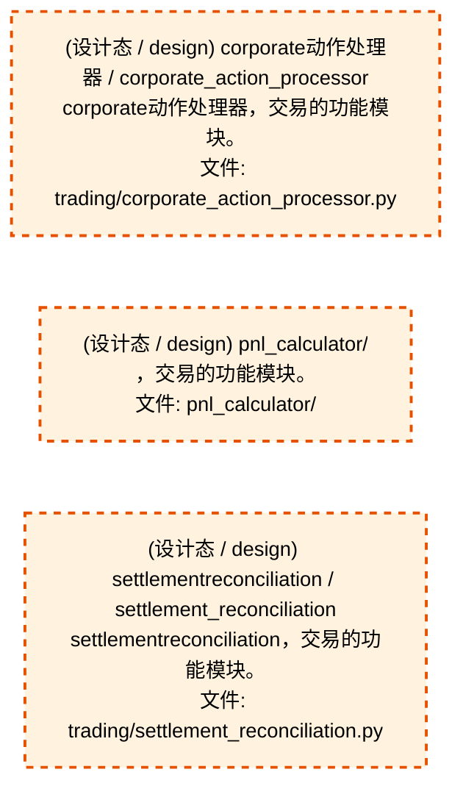
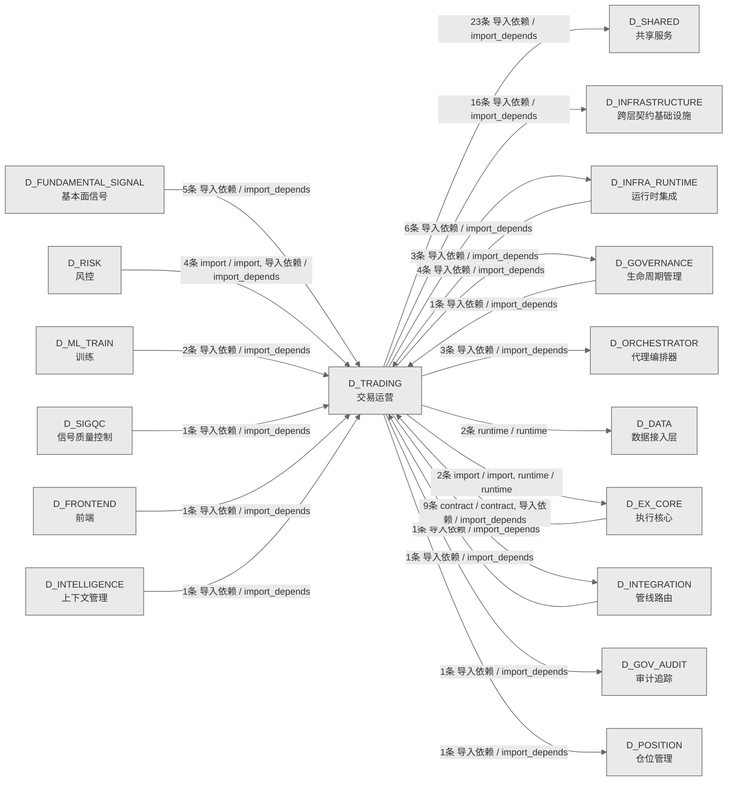

# 72_d_trading / 交易运营域 / Trading Operations

> **功能简介 / Overview**: 交易运营，负责交易生命周期管理、订单状态和成交处理

> **文档作用 / Purpose**: 展示 交易运营（D_TRADING）功能域的域内依赖关系、跨域依赖关系，模块信息（成熟度/中英文名/大白话/文件路径）内嵌于 Mermaid 节点，供架构审查和域治理参考。

> 本文档由 generate_domain_doc.py 从 depgraph (PostgreSQL) 自动生成
> 数据源: depgraph (PostgreSQL) nodes表 + edges表

> **[可缩放 HTML 版 / Zoomable HTML](http://localhost:8765/docs/02_enterprise_architecture/02_domain_architecture_docs/_zoomable_html/72_d_trading.html)** — Ctrl+滚轮缩放 ｜ 双击重置 ｜ Ctrl+Shift+D 切换拖动/选择模式

## 域基本信息 / Domain Overview

| 字段 | 值 | Field | Value |
|------|------|-------|-------|
| 编号 | 72 | Number | 72 |
| 域ID | D_TRADING | Domain ID | D_TRADING |
| 域名称 | 交易运营 | Domain Name | Trading Operations |
| 层级 | L2 业务域层 | Layer | L2 Domain |
| 模块数 | 40 | Module Count | 40 |
| 域内依赖 | 12 | Internal Dependencies | 12 |
| 跨域入边 | 28 | Cross-domain Incoming | 28 |
| 跨域出边 | 59 | Cross-domain Outgoing | 59 |
| 设计态模块 | 3 | Design Modules | 3 |
| 生产态模块 | 37 | Production Modules | 37 |
| 容量 | 37/150 (正常) | Capacity | 37/150 (正常) |
| 描述 | 交易运营，负责交易生命周期管理、订单状态和成交处理 | Description | 交易运营，负责交易生命周期管理、订单状态和成交处理 |

## 域内依赖图 / Internal Dependency Diagram

> 依赖图内嵌在本文档中，IDE 可直接渲染；网页版可 Ctrl+滚轮缩放 + 拖动平移查看细节。
>
> **图例说明 / Legend**：
> - 🟦 **蓝色 = 运营态模块**（production，已上线运行）
> - 🟧 **橙色虚线 = 设计态模块**（design，蓝图阶段，代码未写）
> - **实线箭头 = 运营态依赖**（已生效的依赖关系）
> - **虚线箭头 = 非运营态依赖**（计划中/验证中的依赖关系）

### 全景图（全部模块，颜色区分运营态/设计态）

> 展示全部 40 个模块（生产态 37 + 设计态 3），含跨域依赖外部节点。节点含成熟度+名称+大白话/简介+文件路径。

```mermaid
%%{init: {'theme': 'base', 'themeVariables': {'primaryColor': '#eaeaea', 'primaryTextColor': '#333333', 'primaryBorderColor': '#666666', 'lineColor': '#666666', 'secondaryColor': '#eaeaea', 'tertiaryColor': '#eaeaea', 'fontSize': '14px'}}}%%
flowchart TD
    src_zephyr_trading_action_dispatcher_init_py["(生产态 / production) BRAIN 注释块文本编辑器（ActionDispatche / __init__<br/>BRAIN 注释块文本编辑器（ActionDispatcher 协作者，职责簇：纯文本块构建/插入/更新，无 I/O 无状态）。<br/>文件: action_dispatcher/__init__.py"]
    src_zephyr_trading_admission_controller_py["(生产态 / production) 5.171 修复：admit(event: Any) Any / admission_controller<br/>5.171 修复：admit(event: Any) Any 滥用——定义 VerdictEvent Protocol<br/>文件: trading/admission_controller.py"]
    src_zephyr_trading_auto_dispatcher_py["(生产态 / production) AutoDispatcher — 守护进程内的轻量 PipelineDispat / auto_dispatcher<br/>AutoDispatcher — 守护进程内的轻量 PipelineDispatcher<br/>文件: trading/auto_dispatcher.py"]
    src_zephyr_trading_conductor_py["(生产态 / production) Conductor — AI session 全自动指挥官。 / conductor<br/>Conductor — AI session 全自动指挥官。<br/>文件: trading/conductor.py"]
    src_zephyr_trading_corporate_action_processor_py["(设计态 / design) corporate动作处理器 / corporate_action_processor<br/>corporate动作处理器，交易的功能模块。<br/>文件: trading/corporate_action_processor.py"]
    src_zephyr_trading_gpu_consensus_scheduler_py["(生产态 / production) GPU共识调度器 / gpu_consensus_scheduler<br/>GPU共识调度器，交易的功能模块。<br/>文件: trading/gpu_consensus_scheduler.py"]
    src_zephyr_trading_gpu_monitor_py["(生产态 / production) GPUmonitor.py — NVIDIA GPU 状态采集器 / gpu_monitor<br/>NVIDIA GPU 状态采集器<br/>文件: trading/gpu_monitor.py"]
    src_zephyr_trading_ide_health_daemon_py["(生产态 / production) ide健康daemon.py — TRAE IDE 幽灵窗口守护线程 / ide_health_daemon<br/>TRAE IDE 幽灵窗口守护线程<br/>文件: trading/ide_health_daemon.py"]
    src_zephyr_trading_pnl_calculator["(设计态 / design) pnl_calculator/<br/>，交易的功能模块。<br/>文件: pnl_calculator/"]
    src_zephyr_trading_runtime_async_runtime_py["(生产态 / production) 事件循环引导 + run入executor 桥接。 / async_runtime<br/>事件循环引导 + run_in_executor 桥接。<br/>文件: runtime/async_runtime.py"]
    src_zephyr_trading_settlement_reconciliation_py["(设计态 / design) settlementreconciliation / settlement_reconciliation<br/>settlementreconciliation，交易的功能模块。<br/>文件: trading/settlement_reconciliation.py"]
    src_zephyr_trading_speed_baseline_checker_py["(生产态 / production) speed基线检查器 / speed_baseline_checker<br/>speed基线检查器，交易的功能模块。<br/>文件: trading/speed_baseline_checker.py"]
    src_zephyr_trading_trading_contracts_broker_interface_py["(生产态 / production) 经纪人接口 / D_EXECUTION_CORE — BrokerInterface<br/>经纪人接口。D_EXECUTION_CORE — BrokerInterface<br/>文件: trading_contracts/broker_interface.py"]
    src_zephyr_trading_trading_contracts_execution_capital_allocation_result_py["(生产态 / production) 资本allocation结果 / capital_allocation_result<br/>资本allocation结果，执行的结果，封装操作结果的数据结构。<br/>文件: execution/capital_allocation_result.py"]
    src_zephyr_trading_trading_contracts_execution_execution_rejection_error_py["(生产态 / production) 执行拒绝错误 / execution_rejection_error<br/>执行拒绝错误，执行的异常，定义本模块的异常类型。<br/>文件: execution/execution_rejection_error.py"]
    src_zephyr_trading_trading_contracts_execution_execution_report_py["(生产态 / production) Re-export wrapper: ExecutionReport 真源在 z / execution_report<br/>Re-export wrapper: ExecutionReport 真源在 zephyr.shared.contracts.execution_report（CTR-P1-007 codegen）<br/>文件: execution/execution_report.py"]
    src_zephyr_trading_trading_contracts_execution_fill_py["(生产态 / production) Re-export wrapper: Fill 真源在 zephyr.share / fill<br/>Re-export wrapper: Fill 真源在 zephyr.shared.contracts.fill（CTR-005 codegen）<br/>文件: execution/fill.py"]
    src_zephyr_trading_trading_contracts_execution_model_serving_request_py["(生产态 / production) 模型服务请求 / model_serving_request<br/>模型服务请求，执行的模型，定义数据结构和字段。<br/>文件: execution/model_serving_request.py"]
    src_zephyr_trading_trading_contracts_execution_position_py["(生产态 / production) Re-export wrapper: PositionSnapshot 真源在  / position<br/>Re-export wrapper: PositionSnapshot 真源在 zephyr.shared.contracts.position（CTR-006 codegen）<br/>文件: execution/position.py"]
    src_zephyr_trading_trading_contracts_factories_py["(生产态 / production) trading-contracts/factories.py — 交易域数据契约 / factories<br/>trading-contracts/factories.py — 交易域数据契约工厂方法<br/>文件: trading_contracts/factories.py"]
    src_zephyr_trading_trading_contracts_market_instrument_py["(生产态 / production) instrument / instrument<br/>instrument，行情的功能模块。<br/>文件: market/instrument.py"]
    src_zephyr_trading_trading_contracts_market_signal_degradation_warning_py["(生产态 / production) 信号退化警告 / signal_degradation_warning<br/>信号退化警告，行情的功能模块。<br/>文件: market/signal_degradation_warning.py"]
    src_zephyr_trading_trading_contracts_portfolio_contracts_money_py["(生产态 / production) 过渡兼容层（DEPRECATED）—— Money 契约 canonical 真 / money<br/>过渡兼容层（DEPRECATED）—— Money 契约 canonical 真源已收敛至 shared 侧。<br/>文件: contracts/money.py"]
    src_zephyr_trading_trading_contracts_portfolio_contracts_performance_attribution_report_py["(生产态 / production) Re-export shim — 真源已收敛至 zephyr.shared.co / performance_attribution_report<br/>Re-export shim — 真源已收敛至 zephyr.shared.contracts.performance_attribution_report.<br/>文件: contracts/performance_attribution_report.py"]
    src_zephyr_trading_trading_contracts_portfolio_contracts_strategy_lifecycle_event_py["(生产态 / production) 策略生命周期事件 / strategy_lifecycle_event<br/>策略生命周期事件，组合的事件，定义和分发事件。<br/>文件: contracts/strategy_lifecycle_event.py"]
    src_zephyr_trading_trading_contracts_risk_compliance_rule_py["(生产态 / production) 合规规则 / compliance_rule<br/>合规规则，风控的功能模块。<br/>文件: risk/compliance_rule.py"]
    src_zephyr_trading_trading_contracts_risk_risk_limit_violation_error_py["(生产态 / production) 风险限制违规错误 / risk_limit_violation_error<br/>风险限制违规错误，风控的异常，定义本模块的异常类型。<br/>文件: risk/risk_limit_violation_error.py"]
    src_zephyr_trading_trading_contracts_risk_risk_validator_protocol_py["(生产态 / production) 风险校验器协议 / risk_validator_protocol<br/>风险校验器协议，风控的功能模块。<br/>文件: risk/risk_validator_protocol.py"]
    src_zephyr_trading_trading_contracts_risk_trading_kill_switch_py["(生产态 / production) 交易终止开关 / trading_kill_switch<br/>交易终止开关，风控的功能模块。<br/>文件: risk/trading_kill_switch.py"]
    src_zephyr_trading_action_dispatcher_init_py ~~~ src_zephyr_trading_admission_controller_py
    src_zephyr_trading_admission_controller_py ~~~ src_zephyr_trading_auto_dispatcher_py
    src_zephyr_trading_auto_dispatcher_py ~~~ src_zephyr_trading_conductor_py
    src_zephyr_trading_conductor_py ~~~ src_zephyr_trading_corporate_action_processor_py
    src_zephyr_trading_corporate_action_processor_py ~~~ src_zephyr_trading_gpu_consensus_scheduler_py
    src_zephyr_trading_gpu_consensus_scheduler_py ~~~ src_zephyr_trading_gpu_monitor_py
    src_zephyr_trading_gpu_monitor_py ~~~ src_zephyr_trading_ide_health_daemon_py
    src_zephyr_trading_ide_health_daemon_py ~~~ src_zephyr_trading_pnl_calculator
    src_zephyr_trading_pnl_calculator ~~~ src_zephyr_trading_runtime_async_runtime_py
    src_zephyr_trading_runtime_async_runtime_py ~~~ src_zephyr_trading_settlement_reconciliation_py
    src_zephyr_trading_settlement_reconciliation_py ~~~ src_zephyr_trading_speed_baseline_checker_py
    src_zephyr_trading_speed_baseline_checker_py ~~~ src_zephyr_trading_trading_contracts_broker_interface_py
    src_zephyr_trading_trading_contracts_broker_interface_py ~~~ src_zephyr_trading_trading_contracts_execution_capital_allocation_result_py
    src_zephyr_trading_trading_contracts_execution_capital_allocation_result_py ~~~ src_zephyr_trading_trading_contracts_execution_execution_rejection_error_py
    src_zephyr_trading_trading_contracts_execution_execution_rejection_error_py ~~~ src_zephyr_trading_trading_contracts_execution_execution_report_py
    src_zephyr_trading_trading_contracts_execution_execution_report_py ~~~ src_zephyr_trading_trading_contracts_execution_fill_py
    src_zephyr_trading_trading_contracts_execution_fill_py ~~~ src_zephyr_trading_trading_contracts_execution_model_serving_request_py
    src_zephyr_trading_trading_contracts_execution_model_serving_request_py ~~~ src_zephyr_trading_trading_contracts_execution_position_py
    src_zephyr_trading_trading_contracts_execution_position_py ~~~ src_zephyr_trading_trading_contracts_factories_py
    src_zephyr_trading_trading_contracts_factories_py ~~~ src_zephyr_trading_trading_contracts_market_instrument_py
    src_zephyr_trading_trading_contracts_market_instrument_py ~~~ src_zephyr_trading_trading_contracts_market_signal_degradation_warning_py
    src_zephyr_trading_trading_contracts_market_signal_degradation_warning_py ~~~ src_zephyr_trading_trading_contracts_portfolio_contracts_money_py
    src_zephyr_trading_trading_contracts_portfolio_contracts_money_py ~~~ src_zephyr_trading_trading_contracts_portfolio_contracts_performance_attribution_report_py
    src_zephyr_trading_trading_contracts_portfolio_contracts_performance_attribution_report_py ~~~ src_zephyr_trading_trading_contracts_portfolio_contracts_strategy_lifecycle_event_py
    src_zephyr_trading_trading_contracts_portfolio_contracts_strategy_lifecycle_event_py ~~~ src_zephyr_trading_trading_contracts_risk_compliance_rule_py
    src_zephyr_trading_trading_contracts_risk_compliance_rule_py ~~~ src_zephyr_trading_trading_contracts_risk_risk_limit_violation_error_py
    src_zephyr_trading_trading_contracts_risk_risk_limit_violation_error_py ~~~ src_zephyr_trading_trading_contracts_risk_risk_validator_protocol_py
    src_zephyr_trading_trading_contracts_risk_risk_validator_protocol_py ~~~ src_zephyr_trading_trading_contracts_risk_trading_kill_switch_py
    src_zephyr_trading_action_dispatcher_annotation_writer_py["(生产态 / production) 注释注解写入器（从 ActionDispatcher.annotatepy / _annotation_writer<br/>注释注解写入器（从 ActionDispatcher._annotate_py_file/_tag_module/_annotate_blueprint 提取）。<br/>文件: action_dispatcher/_annotation_writer.py"]
    src_zephyr_trading_action_dispatcher_audit_log_writer_py["(生产态 / production) 审计日志写入器（从 ActionDispatcher.writetriage / _audit_log_writer<br/>审计日志写入器（从 ActionDispatcher._write_triage_log 提取）。<br/>文件: action_dispatcher/_audit_log_writer.py"]
    src_zephyr_trading_action_dispatcher_file_lifecycle_manager_py["(生产态 / production) 文件生命周期管理器（从 ActionDispatcher.创建fil / _file_lifecycle_manager<br/>文件生命周期管理器（从 ActionDispatcher._create_file / _delete_file / _version_backup 提取）。<br/>文件: action_dispatcher/_file_lifecycle_manager.py"]
    src_zephyr_trading_action_dispatcher_search_replace_engine_py["(生产态 / production) 搜索替换引擎（从 ActionDispatcher.searchreplac / _search_replace_engine<br/>搜索替换引擎（从 ActionDispatcher._search_replace_file 及两个底层方法提取）。<br/>文件: action_dispatcher/_search_replace_engine.py"]
    src_zephyr_trading_autopilot_py["(生产态 / production) AutoPilot — AI session 自动找活干、认领任务。 / autopilot<br/>AutoPilot — AI session 自动找活干、认领任务。<br/>文件: trading/autopilot.py"]
    src_zephyr_trading_trading_contracts_execution_order_py["(生产态 / production) Re-export wrapper: Order 真源在 zephyr.shar / order<br/>Re-export wrapper: Order 真源在 zephyr.shared.contracts.order（CTR-004 codegen）<br/>文件: execution/order.py"]
    src_zephyr_trading_trading_contracts_risk_risk_dashboard_snapshot_py["(生产态 / production) 风险仪表盘快照 / risk_dashboard_snapshot<br/>风险仪表盘快照，风控的功能模块。<br/>文件: risk/risk_dashboard_snapshot.py"]
    src_zephyr_trading_trading_contracts_risk_risk_limits_py["(生产态 / production) 风险limits / risk_limits<br/>风险limits，风控的功能模块。<br/>文件: risk/risk_limits.py"]
    src_zephyr_trading_trading_contracts_risk_risk_metrics_py["(生产态 / production) 风险指标 / risk_metrics<br/>风险指标，风控的报告器，汇总数据生成报告。<br/>文件: risk/risk_metrics.py"]
    src_zephyr_trading_verdict_engine_py["(生产态 / production) verdict引擎 / verdict_engine<br/>verdict引擎，交易的事件，定义和分发事件。<br/>文件: trading/verdict_engine.py"]
    src_zephyr_trading_action_dispatcher_annotation_writer_py ~~~ src_zephyr_trading_action_dispatcher_audit_log_writer_py
    src_zephyr_trading_action_dispatcher_audit_log_writer_py ~~~ src_zephyr_trading_action_dispatcher_file_lifecycle_manager_py
    src_zephyr_trading_action_dispatcher_file_lifecycle_manager_py ~~~ src_zephyr_trading_action_dispatcher_search_replace_engine_py
    src_zephyr_trading_action_dispatcher_search_replace_engine_py ~~~ src_zephyr_trading_autopilot_py
    src_zephyr_trading_autopilot_py ~~~ src_zephyr_trading_trading_contracts_execution_order_py
    src_zephyr_trading_trading_contracts_execution_order_py ~~~ src_zephyr_trading_trading_contracts_risk_risk_dashboard_snapshot_py
    src_zephyr_trading_trading_contracts_risk_risk_dashboard_snapshot_py ~~~ src_zephyr_trading_trading_contracts_risk_risk_limits_py
    src_zephyr_trading_trading_contracts_risk_risk_limits_py ~~~ src_zephyr_trading_trading_contracts_risk_risk_metrics_py
    src_zephyr_trading_trading_contracts_risk_risk_metrics_py ~~~ src_zephyr_trading_verdict_engine_py
    src_zephyr_trading_protection_index_py["(生产态 / production) 保护索引 / protection_index<br/>保护索引，交易的功能模块。<br/>文件: trading/protection_index.py"]
    src_zephyr_trading_conductor_py -->|导入依赖 / import_depends| src_zephyr_trading_autopilot_py
    src_zephyr_trading_gpu_consensus_scheduler_py -->|导入依赖 / import_depends| src_zephyr_trading_verdict_engine_py
    src_zephyr_trading_protection_index_py -->|导入依赖 / import_depends| src_zephyr_trading_verdict_engine_py
    src_zephyr_trading_verdict_engine_py -->|导入依赖 / import_depends| src_zephyr_trading_protection_index_py
    src_zephyr_trading_action_dispatcher_init_py -->|导入依赖 / import_depends| src_zephyr_trading_action_dispatcher_annotation_writer_py
    src_zephyr_trading_action_dispatcher_init_py -->|导入依赖 / import_depends| src_zephyr_trading_action_dispatcher_file_lifecycle_manager_py
    src_zephyr_trading_action_dispatcher_init_py -->|导入依赖 / import_depends| src_zephyr_trading_action_dispatcher_search_replace_engine_py
    src_zephyr_trading_action_dispatcher_init_py -->|导入依赖 / import_depends| src_zephyr_trading_action_dispatcher_audit_log_writer_py
    src_zephyr_trading_trading_contracts_factories_py -->|导入依赖 / import_depends| src_zephyr_trading_trading_contracts_execution_order_py
    src_zephyr_trading_trading_contracts_factories_py -->|导入依赖 / import_depends| src_zephyr_trading_trading_contracts_risk_risk_dashboard_snapshot_py
    src_zephyr_trading_trading_contracts_factories_py -->|导入依赖 / import_depends| src_zephyr_trading_trading_contracts_risk_risk_metrics_py
    src_zephyr_trading_trading_contracts_factories_py -->|导入依赖 / import_depends| src_zephyr_trading_trading_contracts_risk_risk_limits_py
    D_EX_CORE["(设计态 / design) 执行核心 / Execution Core<br/>执行核心，负责订单执行引擎、执行策略和执行管理<br/>跨域节点 / cross-domain"]
    src_zephyr_trading_pnl_calculator -.->|import / import| D_EX_CORE
    D_POSITION["(生产态 / production) 仓位管理 / Position Management<br/>仓位管理，负责持仓跟踪、仓位计算和盈亏分析<br/>跨域节点 / cross-domain"]
    src_zephyr_trading_pnl_calculator -.->|导入依赖 / import_depends| D_POSITION
    src_zephyr_trading_settlement_reconciliation_py -.->|runtime / runtime| D_EX_CORE
    D_DATA["(设计态 / design) 数据接入层 / Data Access Layer<br/>数据接入层，负责数据源接入、数据集成和数据标准化<br/>跨域节点 / cross-domain"]
    src_zephyr_trading_corporate_action_processor_py -.->|runtime / runtime| D_DATA
    src_zephyr_trading_corporate_action_processor_py -.->|runtime / runtime| D_DATA
    D_GOVERNANCE["(生产态 / production) 生命周期管理 / Lifecycle Management<br/>生命周期管理，负责蓝图/模块/任务的声明周期管理和元数据治理<br/>跨域节点 / cross-domain"]
    src_zephyr_trading_autopilot_py -->|导入依赖 / import_depends| D_GOVERNANCE
    D_ORCHESTRATOR["(生产态 / production) 代理编排器 / Agent Orchestrator<br/>代理编排器，负责 Agent 任务全生命周期：任务入队、调度、沙箱执行、幻觉检测和收尾归档<br/>跨域节点 / cross-domain"]
    src_zephyr_trading_auto_dispatcher_py -->|导入依赖 / import_depends| D_ORCHESTRATOR
    D_GOV_AUDIT["(生产态 / production) 审计追踪 / Audit Trail<br/>审计追踪，负责变更审计追踪和操作日志管理<br/>跨域节点 / cross-domain"]
    src_zephyr_trading_verdict_engine_py -->|导入依赖 / import_depends| D_GOV_AUDIT
    D_INFRASTRUCTURE["(生产态 / production) 跨层契约基础设施 / Cross-Layer Contract Infrastructure<br/>跨层契约基础设施，负责跨层契约定义、共享契约管理和契约校验<br/>跨域节点 / cross-domain"]
    src_zephyr_trading_trading_contracts_broker_interface_py -->|导入依赖 / import_depends| D_INFRASTRUCTURE
    D_SHARED["(生产态 / production) 共享服务 / Shared Services<br/>共享服务，负责跨域共享的工具、协议和基础服务<br/>跨域节点 / cross-domain"]
    src_zephyr_trading_gpu_monitor_py -->|导入依赖 / import_depends| D_SHARED
    src_zephyr_trading_speed_baseline_checker_py -->|导入依赖 / import_depends| D_SHARED
    src_zephyr_trading_ide_health_daemon_py -->|导入依赖 / import_depends| D_SHARED
    src_zephyr_trading_action_dispatcher_init_py -->|导入依赖 / import_depends| D_SHARED
    src_zephyr_trading_ide_health_daemon_py -->|导入依赖 / import_depends| D_SHARED
    src_zephyr_trading_action_dispatcher_init_py -->|导入依赖 / import_depends| D_SHARED
    D_EX_CORE -.->|导入依赖 / import_depends| src_zephyr_trading_trading_contracts_risk_risk_limits_py
    D_EX_CORE -.->|导入依赖 / import_depends| src_zephyr_trading_trading_contracts_execution_position_py
    D_EX_CORE -.->|contract / contract| src_zephyr_trading_trading_contracts_broker_interface_py
    D_RISK["(设计态 / design) 风控 / Risk Control<br/>风控，负责风险指标计算、风险限额管理和风险预警<br/>跨域节点 / cross-domain"]
    D_RISK -.->|import / import| src_zephyr_trading_pnl_calculator
    D_RISK -->|导入依赖 / import_depends| src_zephyr_trading_trading_contracts_risk_risk_limit_violation_error_py
    D_FUNDAMENTAL_SIGNAL["(生产态 / production) 基本面信号 / Fundamental Signal<br/>基本面信号，负责基于财务数据的基本面信号生成<br/>跨域节点 / cross-domain"]
    D_FUNDAMENTAL_SIGNAL -->|导入依赖 / import_depends| src_zephyr_trading_trading_contracts_execution_capital_allocation_result_py
    D_RISK -->|导入依赖 / import_depends| src_zephyr_trading_trading_contracts_risk_risk_dashboard_snapshot_py
    D_INFRA_RUNTIME["(生产态 / production) 运行时集成 / Runtime Integration<br/>运行时集成，负责组件生命周期编排、启动钩子和运行时上下文管理<br/>跨域节点 / cross-domain"]
    D_INFRA_RUNTIME -->|导入依赖 / import_depends| src_zephyr_trading_ide_health_daemon_py
    D_EX_CORE -->|导入依赖 / import_depends| src_zephyr_trading_trading_contracts_broker_interface_py
    D_FUNDAMENTAL_SIGNAL -->|导入依赖 / import_depends| src_zephyr_trading_trading_contracts_execution_capital_allocation_result_py
    D_ML_TRAIN["(生产态 / production) 训练 / Training<br/>训练，负责模型训练、特征工程和模型评估<br/>跨域节点 / cross-domain"]
    D_ML_TRAIN -->|导入依赖 / import_depends| src_zephyr_trading_trading_contracts_execution_model_serving_request_py
    D_GOVERNANCE -->|导入依赖 / import_depends| src_zephyr_trading_trading_contracts_broker_interface_py
    D_EX_CORE -->|导入依赖 / import_depends| src_zephyr_trading_trading_contracts_execution_position_py
    D_INFRA_RUNTIME -->|导入依赖 / import_depends| src_zephyr_trading_ide_health_daemon_py
    D_FUNDAMENTAL_SIGNAL -->|导入依赖 / import_depends| src_zephyr_trading_trading_contracts_market_signal_degradation_warning_py
    classDef production fill:#e1f5fe,stroke:#01579b,stroke-width:2px,color:#000
    classDef design fill:#fff3e0,stroke:#e65100,stroke-width:2px,color:#000,stroke-dasharray: 5 5
    classDef external_prod fill:#e8f4fd,stroke:#0277bd,stroke-width:1px,color:#000
    classDef external_design fill:#fff8e7,stroke:#ef6c00,stroke-width:1px,color:#000,stroke-dasharray: 5 5
    class src_zephyr_trading_action_dispatcher_init_py,src_zephyr_trading_action_dispatcher_annotation_writer_py,src_zephyr_trading_action_dispatcher_audit_log_writer_py,src_zephyr_trading_action_dispatcher_file_lifecycle_manager_py,src_zephyr_trading_action_dispatcher_search_replace_engine_py,src_zephyr_trading_admission_controller_py,src_zephyr_trading_auto_dispatcher_py,src_zephyr_trading_autopilot_py,src_zephyr_trading_conductor_py,src_zephyr_trading_gpu_consensus_scheduler_py,src_zephyr_trading_gpu_monitor_py,src_zephyr_trading_ide_health_daemon_py,src_zephyr_trading_protection_index_py,src_zephyr_trading_runtime_async_runtime_py,src_zephyr_trading_speed_baseline_checker_py,src_zephyr_trading_trading_contracts_broker_interface_py,src_zephyr_trading_trading_contracts_execution_capital_allocation_result_py,src_zephyr_trading_trading_contracts_execution_execution_rejection_error_py,src_zephyr_trading_trading_contracts_execution_execution_report_py,src_zephyr_trading_trading_contracts_execution_fill_py,src_zephyr_trading_trading_contracts_execution_model_serving_request_py,src_zephyr_trading_trading_contracts_execution_order_py,src_zephyr_trading_trading_contracts_execution_position_py,src_zephyr_trading_trading_contracts_factories_py,src_zephyr_trading_trading_contracts_market_instrument_py,src_zephyr_trading_trading_contracts_market_signal_degradation_warning_py,src_zephyr_trading_trading_contracts_portfolio_contracts_money_py,src_zephyr_trading_trading_contracts_portfolio_contracts_performance_attribution_report_py,src_zephyr_trading_trading_contracts_portfolio_contracts_strategy_lifecycle_event_py,src_zephyr_trading_trading_contracts_risk_compliance_rule_py,src_zephyr_trading_trading_contracts_risk_risk_dashboard_snapshot_py,src_zephyr_trading_trading_contracts_risk_risk_limit_violation_error_py,src_zephyr_trading_trading_contracts_risk_risk_limits_py,src_zephyr_trading_trading_contracts_risk_risk_metrics_py,src_zephyr_trading_trading_contracts_risk_risk_validator_protocol_py,src_zephyr_trading_trading_contracts_risk_trading_kill_switch_py,src_zephyr_trading_verdict_engine_py production
    class src_zephyr_trading_corporate_action_processor_py,src_zephyr_trading_pnl_calculator,src_zephyr_trading_settlement_reconciliation_py design
    class D_POSITION,D_GOVERNANCE,D_ORCHESTRATOR,D_GOV_AUDIT,D_INFRASTRUCTURE,D_SHARED,D_FUNDAMENTAL_SIGNAL,D_INFRA_RUNTIME,D_ML_TRAIN external_prod
    class D_EX_CORE,D_DATA,D_RISK external_design
```

### 运营态的图（仅 design_maturity=production 的模块和域内依赖）

> 仅展示已上线运行的模块（共 37 个），不含跨域外部节点。跨域依赖见下方跨域依赖章节。

```mermaid
%%{init: {'theme': 'base', 'themeVariables': {'primaryColor': '#eaeaea', 'primaryTextColor': '#333333', 'primaryBorderColor': '#666666', 'lineColor': '#666666', 'secondaryColor': '#eaeaea', 'tertiaryColor': '#eaeaea', 'fontSize': '14px'}}}%%
flowchart TD
    src_zephyr_trading_action_dispatcher_init_py["(生产态 / production) BRAIN 注释块文本编辑器（ActionDispatche / __init__<br/>BRAIN 注释块文本编辑器（ActionDispatcher 协作者，职责簇：纯文本块构建/插入/更新，无 I/O 无状态）。<br/>文件: action_dispatcher/__init__.py"]
    src_zephyr_trading_admission_controller_py["(生产态 / production) 5.171 修复：admit(event: Any) Any / admission_controller<br/>5.171 修复：admit(event: Any) Any 滥用——定义 VerdictEvent Protocol<br/>文件: trading/admission_controller.py"]
    src_zephyr_trading_auto_dispatcher_py["(生产态 / production) AutoDispatcher — 守护进程内的轻量 PipelineDispat / auto_dispatcher<br/>AutoDispatcher — 守护进程内的轻量 PipelineDispatcher<br/>文件: trading/auto_dispatcher.py"]
    src_zephyr_trading_conductor_py["(生产态 / production) Conductor — AI session 全自动指挥官。 / conductor<br/>Conductor — AI session 全自动指挥官。<br/>文件: trading/conductor.py"]
    src_zephyr_trading_gpu_consensus_scheduler_py["(生产态 / production) GPU共识调度器 / gpu_consensus_scheduler<br/>GPU共识调度器，交易的功能模块。<br/>文件: trading/gpu_consensus_scheduler.py"]
    src_zephyr_trading_gpu_monitor_py["(生产态 / production) GPUmonitor.py — NVIDIA GPU 状态采集器 / gpu_monitor<br/>NVIDIA GPU 状态采集器<br/>文件: trading/gpu_monitor.py"]
    src_zephyr_trading_ide_health_daemon_py["(生产态 / production) ide健康daemon.py — TRAE IDE 幽灵窗口守护线程 / ide_health_daemon<br/>TRAE IDE 幽灵窗口守护线程<br/>文件: trading/ide_health_daemon.py"]
    src_zephyr_trading_runtime_async_runtime_py["(生产态 / production) 事件循环引导 + run入executor 桥接。 / async_runtime<br/>事件循环引导 + run_in_executor 桥接。<br/>文件: runtime/async_runtime.py"]
    src_zephyr_trading_speed_baseline_checker_py["(生产态 / production) speed基线检查器 / speed_baseline_checker<br/>speed基线检查器，交易的功能模块。<br/>文件: trading/speed_baseline_checker.py"]
    src_zephyr_trading_trading_contracts_broker_interface_py["(生产态 / production) 经纪人接口 / D_EXECUTION_CORE — BrokerInterface<br/>经纪人接口。D_EXECUTION_CORE — BrokerInterface<br/>文件: trading_contracts/broker_interface.py"]
    src_zephyr_trading_trading_contracts_execution_capital_allocation_result_py["(生产态 / production) 资本allocation结果 / capital_allocation_result<br/>资本allocation结果，执行的结果，封装操作结果的数据结构。<br/>文件: execution/capital_allocation_result.py"]
    src_zephyr_trading_trading_contracts_execution_execution_rejection_error_py["(生产态 / production) 执行拒绝错误 / execution_rejection_error<br/>执行拒绝错误，执行的异常，定义本模块的异常类型。<br/>文件: execution/execution_rejection_error.py"]
    src_zephyr_trading_trading_contracts_execution_execution_report_py["(生产态 / production) Re-export wrapper: ExecutionReport 真源在 z / execution_report<br/>Re-export wrapper: ExecutionReport 真源在 zephyr.shared.contracts.execution_report（CTR-P1-007 codegen）<br/>文件: execution/execution_report.py"]
    src_zephyr_trading_trading_contracts_execution_fill_py["(生产态 / production) Re-export wrapper: Fill 真源在 zephyr.share / fill<br/>Re-export wrapper: Fill 真源在 zephyr.shared.contracts.fill（CTR-005 codegen）<br/>文件: execution/fill.py"]
    src_zephyr_trading_trading_contracts_execution_model_serving_request_py["(生产态 / production) 模型服务请求 / model_serving_request<br/>模型服务请求，执行的模型，定义数据结构和字段。<br/>文件: execution/model_serving_request.py"]
    src_zephyr_trading_trading_contracts_execution_position_py["(生产态 / production) Re-export wrapper: PositionSnapshot 真源在  / position<br/>Re-export wrapper: PositionSnapshot 真源在 zephyr.shared.contracts.position（CTR-006 codegen）<br/>文件: execution/position.py"]
    src_zephyr_trading_trading_contracts_factories_py["(生产态 / production) trading-contracts/factories.py — 交易域数据契约 / factories<br/>trading-contracts/factories.py — 交易域数据契约工厂方法<br/>文件: trading_contracts/factories.py"]
    src_zephyr_trading_trading_contracts_market_instrument_py["(生产态 / production) instrument / instrument<br/>instrument，行情的功能模块。<br/>文件: market/instrument.py"]
    src_zephyr_trading_trading_contracts_market_signal_degradation_warning_py["(生产态 / production) 信号退化警告 / signal_degradation_warning<br/>信号退化警告，行情的功能模块。<br/>文件: market/signal_degradation_warning.py"]
    src_zephyr_trading_trading_contracts_portfolio_contracts_money_py["(生产态 / production) 过渡兼容层（DEPRECATED）—— Money 契约 canonical 真 / money<br/>过渡兼容层（DEPRECATED）—— Money 契约 canonical 真源已收敛至 shared 侧。<br/>文件: contracts/money.py"]
    src_zephyr_trading_trading_contracts_portfolio_contracts_performance_attribution_report_py["(生产态 / production) Re-export shim — 真源已收敛至 zephyr.shared.co / performance_attribution_report<br/>Re-export shim — 真源已收敛至 zephyr.shared.contracts.performance_attribution_report.<br/>文件: contracts/performance_attribution_report.py"]
    src_zephyr_trading_trading_contracts_portfolio_contracts_strategy_lifecycle_event_py["(生产态 / production) 策略生命周期事件 / strategy_lifecycle_event<br/>策略生命周期事件，组合的事件，定义和分发事件。<br/>文件: contracts/strategy_lifecycle_event.py"]
    src_zephyr_trading_trading_contracts_risk_compliance_rule_py["(生产态 / production) 合规规则 / compliance_rule<br/>合规规则，风控的功能模块。<br/>文件: risk/compliance_rule.py"]
    src_zephyr_trading_trading_contracts_risk_risk_limit_violation_error_py["(生产态 / production) 风险限制违规错误 / risk_limit_violation_error<br/>风险限制违规错误，风控的异常，定义本模块的异常类型。<br/>文件: risk/risk_limit_violation_error.py"]
    src_zephyr_trading_trading_contracts_risk_risk_validator_protocol_py["(生产态 / production) 风险校验器协议 / risk_validator_protocol<br/>风险校验器协议，风控的功能模块。<br/>文件: risk/risk_validator_protocol.py"]
    src_zephyr_trading_trading_contracts_risk_trading_kill_switch_py["(生产态 / production) 交易终止开关 / trading_kill_switch<br/>交易终止开关，风控的功能模块。<br/>文件: risk/trading_kill_switch.py"]
    src_zephyr_trading_action_dispatcher_init_py ~~~ src_zephyr_trading_admission_controller_py
    src_zephyr_trading_admission_controller_py ~~~ src_zephyr_trading_auto_dispatcher_py
    src_zephyr_trading_auto_dispatcher_py ~~~ src_zephyr_trading_conductor_py
    src_zephyr_trading_conductor_py ~~~ src_zephyr_trading_gpu_consensus_scheduler_py
    src_zephyr_trading_gpu_consensus_scheduler_py ~~~ src_zephyr_trading_gpu_monitor_py
    src_zephyr_trading_gpu_monitor_py ~~~ src_zephyr_trading_ide_health_daemon_py
    src_zephyr_trading_ide_health_daemon_py ~~~ src_zephyr_trading_runtime_async_runtime_py
    src_zephyr_trading_runtime_async_runtime_py ~~~ src_zephyr_trading_speed_baseline_checker_py
    src_zephyr_trading_speed_baseline_checker_py ~~~ src_zephyr_trading_trading_contracts_broker_interface_py
    src_zephyr_trading_trading_contracts_broker_interface_py ~~~ src_zephyr_trading_trading_contracts_execution_capital_allocation_result_py
    src_zephyr_trading_trading_contracts_execution_capital_allocation_result_py ~~~ src_zephyr_trading_trading_contracts_execution_execution_rejection_error_py
    src_zephyr_trading_trading_contracts_execution_execution_rejection_error_py ~~~ src_zephyr_trading_trading_contracts_execution_execution_report_py
    src_zephyr_trading_trading_contracts_execution_execution_report_py ~~~ src_zephyr_trading_trading_contracts_execution_fill_py
    src_zephyr_trading_trading_contracts_execution_fill_py ~~~ src_zephyr_trading_trading_contracts_execution_model_serving_request_py
    src_zephyr_trading_trading_contracts_execution_model_serving_request_py ~~~ src_zephyr_trading_trading_contracts_execution_position_py
    src_zephyr_trading_trading_contracts_execution_position_py ~~~ src_zephyr_trading_trading_contracts_factories_py
    src_zephyr_trading_trading_contracts_factories_py ~~~ src_zephyr_trading_trading_contracts_market_instrument_py
    src_zephyr_trading_trading_contracts_market_instrument_py ~~~ src_zephyr_trading_trading_contracts_market_signal_degradation_warning_py
    src_zephyr_trading_trading_contracts_market_signal_degradation_warning_py ~~~ src_zephyr_trading_trading_contracts_portfolio_contracts_money_py
    src_zephyr_trading_trading_contracts_portfolio_contracts_money_py ~~~ src_zephyr_trading_trading_contracts_portfolio_contracts_performance_attribution_report_py
    src_zephyr_trading_trading_contracts_portfolio_contracts_performance_attribution_report_py ~~~ src_zephyr_trading_trading_contracts_portfolio_contracts_strategy_lifecycle_event_py
    src_zephyr_trading_trading_contracts_portfolio_contracts_strategy_lifecycle_event_py ~~~ src_zephyr_trading_trading_contracts_risk_compliance_rule_py
    src_zephyr_trading_trading_contracts_risk_compliance_rule_py ~~~ src_zephyr_trading_trading_contracts_risk_risk_limit_violation_error_py
    src_zephyr_trading_trading_contracts_risk_risk_limit_violation_error_py ~~~ src_zephyr_trading_trading_contracts_risk_risk_validator_protocol_py
    src_zephyr_trading_trading_contracts_risk_risk_validator_protocol_py ~~~ src_zephyr_trading_trading_contracts_risk_trading_kill_switch_py
    src_zephyr_trading_action_dispatcher_annotation_writer_py["(生产态 / production) 注释注解写入器（从 ActionDispatcher.annotatepy / _annotation_writer<br/>注释注解写入器（从 ActionDispatcher._annotate_py_file/_tag_module/_annotate_blueprint 提取）。<br/>文件: action_dispatcher/_annotation_writer.py"]
    src_zephyr_trading_action_dispatcher_audit_log_writer_py["(生产态 / production) 审计日志写入器（从 ActionDispatcher.writetriage / _audit_log_writer<br/>审计日志写入器（从 ActionDispatcher._write_triage_log 提取）。<br/>文件: action_dispatcher/_audit_log_writer.py"]
    src_zephyr_trading_action_dispatcher_file_lifecycle_manager_py["(生产态 / production) 文件生命周期管理器（从 ActionDispatcher.创建fil / _file_lifecycle_manager<br/>文件生命周期管理器（从 ActionDispatcher._create_file / _delete_file / _version_backup 提取）。<br/>文件: action_dispatcher/_file_lifecycle_manager.py"]
    src_zephyr_trading_action_dispatcher_search_replace_engine_py["(生产态 / production) 搜索替换引擎（从 ActionDispatcher.searchreplac / _search_replace_engine<br/>搜索替换引擎（从 ActionDispatcher._search_replace_file 及两个底层方法提取）。<br/>文件: action_dispatcher/_search_replace_engine.py"]
    src_zephyr_trading_autopilot_py["(生产态 / production) AutoPilot — AI session 自动找活干、认领任务。 / autopilot<br/>AutoPilot — AI session 自动找活干、认领任务。<br/>文件: trading/autopilot.py"]
    src_zephyr_trading_trading_contracts_execution_order_py["(生产态 / production) Re-export wrapper: Order 真源在 zephyr.shar / order<br/>Re-export wrapper: Order 真源在 zephyr.shared.contracts.order（CTR-004 codegen）<br/>文件: execution/order.py"]
    src_zephyr_trading_trading_contracts_risk_risk_dashboard_snapshot_py["(生产态 / production) 风险仪表盘快照 / risk_dashboard_snapshot<br/>风险仪表盘快照，风控的功能模块。<br/>文件: risk/risk_dashboard_snapshot.py"]
    src_zephyr_trading_trading_contracts_risk_risk_limits_py["(生产态 / production) 风险limits / risk_limits<br/>风险limits，风控的功能模块。<br/>文件: risk/risk_limits.py"]
    src_zephyr_trading_trading_contracts_risk_risk_metrics_py["(生产态 / production) 风险指标 / risk_metrics<br/>风险指标，风控的报告器，汇总数据生成报告。<br/>文件: risk/risk_metrics.py"]
    src_zephyr_trading_verdict_engine_py["(生产态 / production) verdict引擎 / verdict_engine<br/>verdict引擎，交易的事件，定义和分发事件。<br/>文件: trading/verdict_engine.py"]
    src_zephyr_trading_action_dispatcher_annotation_writer_py ~~~ src_zephyr_trading_action_dispatcher_audit_log_writer_py
    src_zephyr_trading_action_dispatcher_audit_log_writer_py ~~~ src_zephyr_trading_action_dispatcher_file_lifecycle_manager_py
    src_zephyr_trading_action_dispatcher_file_lifecycle_manager_py ~~~ src_zephyr_trading_action_dispatcher_search_replace_engine_py
    src_zephyr_trading_action_dispatcher_search_replace_engine_py ~~~ src_zephyr_trading_autopilot_py
    src_zephyr_trading_autopilot_py ~~~ src_zephyr_trading_trading_contracts_execution_order_py
    src_zephyr_trading_trading_contracts_execution_order_py ~~~ src_zephyr_trading_trading_contracts_risk_risk_dashboard_snapshot_py
    src_zephyr_trading_trading_contracts_risk_risk_dashboard_snapshot_py ~~~ src_zephyr_trading_trading_contracts_risk_risk_limits_py
    src_zephyr_trading_trading_contracts_risk_risk_limits_py ~~~ src_zephyr_trading_trading_contracts_risk_risk_metrics_py
    src_zephyr_trading_trading_contracts_risk_risk_metrics_py ~~~ src_zephyr_trading_verdict_engine_py
    src_zephyr_trading_protection_index_py["(生产态 / production) 保护索引 / protection_index<br/>保护索引，交易的功能模块。<br/>文件: trading/protection_index.py"]
    src_zephyr_trading_conductor_py -->|导入依赖 / import_depends| src_zephyr_trading_autopilot_py
    src_zephyr_trading_gpu_consensus_scheduler_py -->|导入依赖 / import_depends| src_zephyr_trading_verdict_engine_py
    src_zephyr_trading_protection_index_py -->|导入依赖 / import_depends| src_zephyr_trading_verdict_engine_py
    src_zephyr_trading_verdict_engine_py -->|导入依赖 / import_depends| src_zephyr_trading_protection_index_py
    src_zephyr_trading_action_dispatcher_init_py -->|导入依赖 / import_depends| src_zephyr_trading_action_dispatcher_annotation_writer_py
    src_zephyr_trading_action_dispatcher_init_py -->|导入依赖 / import_depends| src_zephyr_trading_action_dispatcher_file_lifecycle_manager_py
    src_zephyr_trading_action_dispatcher_init_py -->|导入依赖 / import_depends| src_zephyr_trading_action_dispatcher_search_replace_engine_py
    src_zephyr_trading_action_dispatcher_init_py -->|导入依赖 / import_depends| src_zephyr_trading_action_dispatcher_audit_log_writer_py
    src_zephyr_trading_trading_contracts_factories_py -->|导入依赖 / import_depends| src_zephyr_trading_trading_contracts_execution_order_py
    src_zephyr_trading_trading_contracts_factories_py -->|导入依赖 / import_depends| src_zephyr_trading_trading_contracts_risk_risk_dashboard_snapshot_py
    src_zephyr_trading_trading_contracts_factories_py -->|导入依赖 / import_depends| src_zephyr_trading_trading_contracts_risk_risk_metrics_py
    src_zephyr_trading_trading_contracts_factories_py -->|导入依赖 / import_depends| src_zephyr_trading_trading_contracts_risk_risk_limits_py
    classDef production fill:#e1f5fe,stroke:#01579b,stroke-width:2px,color:#000
    classDef design fill:#fff3e0,stroke:#e65100,stroke-width:2px,color:#000,stroke-dasharray: 5 5
    classDef external_prod fill:#e8f4fd,stroke:#0277bd,stroke-width:1px,color:#000
    classDef external_design fill:#fff8e7,stroke:#ef6c00,stroke-width:1px,color:#000,stroke-dasharray: 5 5
    class src_zephyr_trading_action_dispatcher_init_py,src_zephyr_trading_action_dispatcher_annotation_writer_py,src_zephyr_trading_action_dispatcher_audit_log_writer_py,src_zephyr_trading_action_dispatcher_file_lifecycle_manager_py,src_zephyr_trading_action_dispatcher_search_replace_engine_py,src_zephyr_trading_admission_controller_py,src_zephyr_trading_auto_dispatcher_py,src_zephyr_trading_autopilot_py,src_zephyr_trading_conductor_py,src_zephyr_trading_gpu_consensus_scheduler_py,src_zephyr_trading_gpu_monitor_py,src_zephyr_trading_ide_health_daemon_py,src_zephyr_trading_protection_index_py,src_zephyr_trading_runtime_async_runtime_py,src_zephyr_trading_speed_baseline_checker_py,src_zephyr_trading_trading_contracts_broker_interface_py,src_zephyr_trading_trading_contracts_execution_capital_allocation_result_py,src_zephyr_trading_trading_contracts_execution_execution_rejection_error_py,src_zephyr_trading_trading_contracts_execution_execution_report_py,src_zephyr_trading_trading_contracts_execution_fill_py,src_zephyr_trading_trading_contracts_execution_model_serving_request_py,src_zephyr_trading_trading_contracts_execution_order_py,src_zephyr_trading_trading_contracts_execution_position_py,src_zephyr_trading_trading_contracts_factories_py,src_zephyr_trading_trading_contracts_market_instrument_py,src_zephyr_trading_trading_contracts_market_signal_degradation_warning_py,src_zephyr_trading_trading_contracts_portfolio_contracts_money_py,src_zephyr_trading_trading_contracts_portfolio_contracts_performance_attribution_report_py,src_zephyr_trading_trading_contracts_portfolio_contracts_strategy_lifecycle_event_py,src_zephyr_trading_trading_contracts_risk_compliance_rule_py,src_zephyr_trading_trading_contracts_risk_risk_dashboard_snapshot_py,src_zephyr_trading_trading_contracts_risk_risk_limit_violation_error_py,src_zephyr_trading_trading_contracts_risk_risk_limits_py,src_zephyr_trading_trading_contracts_risk_risk_metrics_py,src_zephyr_trading_trading_contracts_risk_risk_validator_protocol_py,src_zephyr_trading_trading_contracts_risk_trading_kill_switch_py,src_zephyr_trading_verdict_engine_py production
```



### 设计态的图（仅 design_maturity=design 的模块和域内依赖）

> 仅展示蓝图阶段、代码未写的设计态模块（共 3 个），不含跨域外部节点。



## 跨域依赖 / Cross-domain Dependencies

### 本域依赖的其他域（出边）/ Depends On

| # | 本域模块 / Source Module | → | 外部域-目标模块 / Target Module | 依赖类型 / Type |
|:--:|---------|:--:|---------|---------|
| 1 | corporate动作处理器 / corporate_action_processor (trading... | → | D_DATA 数据接入层: pit_query.py/ | runtime / runtime |
| 2 | corporate动作处理器 / corporate_action_processor (trading... | → | D_DATA 数据接入层: pit_query.py/ | runtime / runtime |
| 3 | pnl_calculator/ | → | D_EX_CORE 执行核心: 成交处理器 / fill_handler (ex_core/fill_handler.py) | import / import |
| 4 | settlementreconciliation / settlement_reconciliation (tra... | → | D_EX_CORE 执行核心: 订单管理器 / D_EXECUTION_CORE — Order Manager (ex_core/o... | runtime / runtime |
| 5 | AutoDispatcher — 守护进程内的轻量 PipelineDispat / auto_... | → | D_GOVERNANCE 生命周期管理: TaskRepository — 任务登记表 CRUD + 状态机（T-1-04 / task... | 导入依赖 / import_depends |
| 6 | AutoPilot — AI session 自动找活干、认领任务。 / autopilo... | → | D_GOVERNANCE 生命周期管理: TaskRepository — 任务登记表 CRUD + 状态机（T-1-04 / task... | 导入依赖 / import_depends |
| 7 | Conductor — AI session 全自动指挥官。 / conductor (tradi... | → | D_GOVERNANCE 生命周期管理: TaskRepository — 任务登记表 CRUD + 状态机（T-1-04 / task... | 导入依赖 / import_depends |
| 8 | ide健康daemon.py — TRAE IDE 幽灵窗口守护线程 / ide_healt... | → | D_GOVERNANCE 生命周期管理: TaskRepository — 任务登记表 CRUD + 状态机（T-1-04 / task... | 导入依赖 / import_depends |
| 9 | verdict引擎 / verdict_engine (trading/verdict_engine.py) | → | D_GOV_AUDIT 审计追踪: 审计事件类型枚举——治本（裁定#18 G2）：转为真 Enu / mode... | 导入依赖 / import_depends |
| 10 | 经纪人接口 / D_EXECUTION_CORE — BrokerInterface (trading... | → | D_INFRASTRUCTURE 跨层契约基础设施: 成交 / fill (contracts/fill.py) | 导入依赖 / import_depends |
| 11 | 经纪人接口 / D_EXECUTION_CORE — BrokerInterface (trading... | → | D_INFRASTRUCTURE 跨层契约基础设施: 订单 / order (contracts/order.py) | 导入依赖 / import_depends |
| 12 | 经纪人接口 / D_EXECUTION_CORE — BrokerInterface (trading... | → | D_INFRASTRUCTURE 跨层契约基础设施: 持仓 / position (contracts/position.py) | 导入依赖 / import_depends |
| 13 | 执行拒绝错误 / execution_rejection_error (execution/execu... | → | D_INFRASTRUCTURE 跨层契约基础设施: 追踪上下文 / trace_context (contracts/trace_context.py) | 导入依赖 / import_depends |
| 14 | Re-export wrapper: ExecutionReport 真源在 z / execution_r... | → | D_INFRASTRUCTURE 跨层契约基础设施: 执行报告 / execution_report (contracts/execution_report.py) | 导入依赖 / import_depends |
| 15 | Re-export wrapper: Fill 真源在 zephyr.share / fill (execu... | → | D_INFRASTRUCTURE 跨层契约基础设施: 成交 / fill (contracts/fill.py) | 导入依赖 / import_depends |
| 16 | Re-export wrapper: Order 真源在 zephyr.shar / order (exec... | → | D_INFRASTRUCTURE 跨层契约基础设施: 订单 / order (contracts/order.py) | 导入依赖 / import_depends |
| 17 | Re-export wrapper: PositionSnapshot 真源在  / position (e... | → | D_INFRASTRUCTURE 跨层契约基础设施: 持仓 / position (contracts/position.py) | 导入依赖 / import_depends |
| 18 | trading-contracts/factories.py — 交易域数据契约 / factor... | → | D_INFRASTRUCTURE 跨层契约基础设施: 因子信号 / factor_signal (contracts/factor_signal.py) | 导入依赖 / import_depends |
| 19 | trading-contracts/factories.py — 交易域数据契约 / factor... | → | D_INFRASTRUCTURE 跨层契约基础设施: synthesized信号 / synthesized_signal (contracts/synthesiz... | 导入依赖 / import_depends |
| 20 | 信号退化警告 / signal_degradation_warning (market/signal_... | → | D_INFRASTRUCTURE 跨层契约基础设施: 追踪上下文 / trace_context (contracts/trace_context.py) | 导入依赖 / import_depends |
| 21 | Re-export shim — 真源已收敛至 zephyr.shared.co / perform... | → | D_INFRASTRUCTURE 跨层契约基础设施: 绩效attribution报告 / performance_attribution_report (con... | 导入依赖 / import_depends |
| 22 | 策略生命周期事件 / strategy_lifecycle_event (contracts/st... | → | D_INFRASTRUCTURE 跨层契约基础设施: 策略生命周期事件 / strategy_lifecycle_event (contracts/st... | 导入依赖 / import_depends |
| 23 | 风险限制违规错误 / risk_limit_violation_error (risk/risk_... | → | D_INFRASTRUCTURE 跨层契约基础设施: 追踪上下文 / trace_context (contracts/trace_context.py) | 导入依赖 / import_depends |
| 24 | 风险limits / risk_limits (risk/risk_limits.py) | → | D_INFRASTRUCTURE 跨层契约基础设施: 追踪上下文 / trace_context (contracts/trace_context.py) | 导入依赖 / import_depends |
| 25 | 风险校验器协议 / risk_validator_protocol (risk/risk_valid... | → | D_INFRASTRUCTURE 跨层契约基础设施: 风险limits / risk_limits (contracts/risk_limits.py) | 导入依赖 / import_depends |
| 26 | BRAIN 注释块文本编辑器（ActionDispatche / __init__ (actio... | → | D_INFRA_RUNTIME 运行时集成: Task Scheduler — 任务调度器。 / task_scheduler (queue/ta... | 导入依赖 / import_depends |
| 27 | 注释注解写入器（从 ActionDispatcher.annotatepy / _annotat... | → | D_INFRA_RUNTIME 运行时集成: ActionDispatcher --- 大脑的"手" v2.0 (Phase  / action_dis... | 导入依赖 / import_depends |
| 28 | 审计日志写入器（从 ActionDispatcher.writetriage / _audit_... | → | D_INFRA_RUNTIME 运行时集成: ActionDispatcher --- 大脑的"手" v2.0 (Phase  / action_dis... | 导入依赖 / import_depends |
| 29 | 文件生命周期管理器（从 ActionDispatcher.创建fil / _file_l... | → | D_INFRA_RUNTIME 运行时集成: ActionDispatcher --- 大脑的"手" v2.0 (Phase  / action_dis... | 导入依赖 / import_depends |
| 30 | 搜索替换引擎（从 ActionDispatcher.searchreplac / _search_... | → | D_INFRA_RUNTIME 运行时集成: ActionDispatcher --- 大脑的"手" v2.0 (Phase  / action_dis... | 导入依赖 / import_depends |
| 31 | ide健康daemon.py — TRAE IDE 幽灵窗口守护线程 / ide_healt... | → | D_INFRA_RUNTIME 运行时集成: daemon注册表 / daemon_registry.py - unified daemon thread... | 导入依赖 / import_depends |
| 32 | verdict引擎 / verdict_engine (trading/verdict_engine.py) | → | D_INTEGRATION 管线路由: LocalModelScheduler — L2 本地模型 24/7 调度循环 / local_... | 导入依赖 / import_depends |
| 33 | AutoDispatcher — 守护进程内的轻量 PipelineDispat / auto_... | → | D_ORCHESTRATOR 代理编排器: ActiveTaskQueue — 后台任务轮询与自动分发 / task_queue (c... | 导入依赖 / import_depends |
| 34 | AutoDispatcher — 守护进程内的轻量 PipelineDispat / auto_... | → | D_ORCHESTRATOR 代理编排器: Orc->CE 上下文桥接 — requestcontext() 生产者 / context_b... | 导入依赖 / import_depends |
| 35 | AutoDispatcher — 守护进程内的轻量 PipelineDispat / auto_... | → | D_ORCHESTRATOR 代理编排器: Orc->Script 脚本执行器 — runaudit() 生产者 / script_runn... | 导入依赖 / import_depends |
| 36 | pnl_calculator/ | → | D_POSITION 仓位管理: Position Reconciler — v0.10.1 持仓对账: exec / position_... | 导入依赖 / import_depends |
| 37 | BRAIN 注释块文本编辑器（ActionDispatche / __init__ (actio... | → | D_SHARED 共享服务: 进程池 / process_pool.py - Shared process pool for MCP se... | 导入依赖 / import_depends |
| 38 | BRAIN 注释块文本编辑器（ActionDispatche / __init__ (actio... | → | D_SHARED 共享服务: paths.py — 项目路径常量 SSoT（Single Source of  / paths ... | 导入依赖 / import_depends |
| 39 | BRAIN 注释块文本编辑器（ActionDispatche / __init__ (actio... | → | D_SHARED 共享服务: serialization.py —— 统一序列化/反序列化基础设施（Phase ... | 导入依赖 / import_depends |
| 40 | BRAIN 注释块文本编辑器（ActionDispatche / __init__ (actio... | → | D_SHARED 共享服务: 任务types — 任务系统核心类型 re-export 层 / task_types (... | 导入依赖 / import_depends |
| 41 | AutoDispatcher — 守护进程内的轻量 PipelineDispat / auto_... | → | D_SHARED 共享服务: TaskRepositoryProtocol — TaskRepository  / task_reposito... | 导入依赖 / import_depends |
| 42 | AutoDispatcher — 守护进程内的轻量 PipelineDispat / auto_... | → | D_SHARED 共享服务: constants.py —— 共享枚举 & 常量集中 re-export（Si / con... | 导入依赖 / import_depends |
| 43 | AutoPilot — AI session 自动找活干、认领任务。 / autopilo... | → | D_SHARED 共享服务: TaskRepositoryProtocol — TaskRepository  / task_reposito... | 导入依赖 / import_depends |
| 44 | AutoPilot — AI session 自动找活干、认领任务。 / autopilo... | → | D_SHARED 共享服务: EventBus — 事件总线（带背压控制）(M-07) / event_bus (sha... | 导入依赖 / import_depends |
| 45 | AutoPilot — AI session 自动找活干、认领任务。 / autopilo... | → | D_SHARED 共享服务: constants.py —— 共享枚举 & 常量集中 re-export（Si / con... | 导入依赖 / import_depends |
| 46 | AutoPilot — AI session 自动找活干、认领任务。 / autopilo... | → | D_SHARED 共享服务: ZephyrAlpha 任务系统核心数据模型 / models (foundation/mod... | 导入依赖 / import_depends |
| 47 | Conductor — AI session 全自动指挥官。 / conductor (tradi... | → | D_SHARED 共享服务: constants.py —— 共享枚举 & 常量集中 re-export（Si / con... | 导入依赖 / import_depends |
| 48 | Conductor — AI session 全自动指挥官。 / conductor (tradi... | → | D_SHARED 共享服务: ZephyrAlpha 任务系统核心数据模型 / models (foundation/mod... | 导入依赖 / import_depends |
| 49 | GPU共识调度器 / gpu_consensus_scheduler (trading/gpu_cons... | → | D_SHARED 共享服务: constants.py —— 共享枚举 & 常量集中 re-export（Si / con... | 导入依赖 / import_depends |
| 50 | GPUmonitor.py — NVIDIA GPU 状态采集器 / gpu_monitor (tra... | → | D_SHARED 共享服务: 进程池 / process_pool.py - Shared process pool for MCP se... | 导入依赖 / import_depends |
| 51 | ide健康daemon.py — TRAE IDE 幽灵窗口守护线程 / ide_healt... | → | D_SHARED 共享服务: TaskRepositoryProtocol — TaskRepository  / task_reposito... | 导入依赖 / import_depends |
| 52 | ide健康daemon.py — TRAE IDE 幽灵窗口守护线程 / ide_healt... | → | D_SHARED 共享服务: EventBus — 事件总线（带背压控制）(M-07) / event_bus (sha... | 导入依赖 / import_depends |
| 53 | ide健康daemon.py — TRAE IDE 幽灵窗口守护线程 / ide_healt... | → | D_SHARED 共享服务: constants.py —— 共享枚举 & 常量集中 re-export（Si / con... | 导入依赖 / import_depends |
| 54 | ide健康daemon.py — TRAE IDE 幽灵窗口守护线程 / ide_healt... | → | D_SHARED 共享服务: 进程池 / process_pool.py - Shared process pool for MCP se... | 导入依赖 / import_depends |
| 55 | ide健康daemon.py — TRAE IDE 幽灵窗口守护线程 / ide_healt... | → | D_SHARED 共享服务: 时间utils.py —— 时间/日期工具（Phase 9 新增 | 盲点 / ti... | 导入依赖 / import_depends |
| 56 | 事件循环引导 + run入executor 桥接。 / async_runtime (runt... | → | D_SHARED 共享服务: 异步utils.py — async/sync 边界桥接（5.12.8  / async_util... | 导入依赖 / import_depends |
| 57 | speed基线检查器 / speed_baseline_checker (trading/speed_b... | → | D_SHARED 共享服务: paths.py — 项目路径常量 SSoT（Single Source of  / paths ... | 导入依赖 / import_depends |
| 58 | Re-export wrapper: Order 真源在 zephyr.shar / order (exec... | → | D_SHARED 共享服务: OrderSide/OrderStatus/OrderType — 交易枚举真源 / order_e... | 导入依赖 / import_depends |
| 59 | 过渡兼容层（DEPRECATED）—— Money 契约 canonical 真 / mo... | → | D_SHARED 共享服务: 金额精度错误（如试图用 float 构造 Money）。 / money (port... | 导入依赖 / import_depends |

### 依赖本域的其他域（入边）/ Depended By

| # | 外部域-源模块 / Source Module | → | 本域模块 / Target Module | 依赖类型 / Type |
|:--:|---------|:--:|---------|---------|
| 1 | D_EX_CORE 执行核心: DEXCORE adapters — 券商/风控适配器 re-export  / __init__... | → | 经纪人接口 / D_EXECUTION_CORE — BrokerInterface (trading... | 导入依赖 / import_depends |
| 2 | D_EX_CORE 执行核心: MiniQMT 实盘券商适配器（对接 xttrader，A股实盘交易） / mi... | → | 经纪人接口 / D_EXECUTION_CORE — BrokerInterface (trading... | 导入依赖 / import_depends |
| 3 | D_EX_CORE 执行核心: MiniQMT 实盘券商适配器（对接 xttrader，A股实盘交易） / mi... | → | Re-export wrapper: Fill 真源在 zephyr.share / fill (execu... | 导入依赖 / import_depends |
| 4 | D_EX_CORE 执行核心: MiniQMT 实盘券商适配器（对接 xttrader，A股实盘交易） / mi... | → | Re-export wrapper: Order 真源在 zephyr.shar / order (exec... | 导入依赖 / import_depends |
| 5 | D_EX_CORE 执行核心: MiniQMT 实盘券商适配器（对接 xttrader，A股实盘交易） / mi... | → | Re-export wrapper: PositionSnapshot 真源在  / position (e... | 导入依赖 / import_depends |
| 6 | D_EX_CORE 执行核心: 订单管理器 / D_EXECUTION_CORE — Order Manager (ex_core/o... | → | 经纪人接口 / D_EXECUTION_CORE — BrokerInterface (trading... | 导入依赖 / import_depends |
| 7 | D_EX_CORE 执行核心: 实时组合 / live_portfolio (services/live_portfolio.py) | → | Re-export wrapper: PositionSnapshot 真源在  / position (e... | 导入依赖 / import_depends |
| 8 | D_EX_CORE 执行核心: 实时组合 / live_portfolio (services/live_portfolio.py) | → | 风险limits / risk_limits (risk/risk_limits.py) | 导入依赖 / import_depends |
| 9 | D_EX_CORE 执行核心: DCORE — TradingSession 盘中实时调仓 / trading_session (e... | → | 经纪人接口 / D_EXECUTION_CORE — BrokerInterface (trading... | contract / contract |
| 10 | D_FRONTEND 前端: 成交panel · 实盘交易面板组件（v3.0.0 Panel+Holo / trade_... | → | Re-export wrapper: Order 真源在 zephyr.shar / order (exec... | 导入依赖 / import_depends |
| 11 | D_FUNDAMENTAL_SIGNAL 基本面信号: 资本分配结果（兼容导出） / Capital Allocation Result (com... | → | 资本allocation结果 / capital_allocation_result (execution... | 导入依赖 / import_depends |
| 12 | D_FUNDAMENTAL_SIGNAL 基本面信号: 信号生成聚合基类 / Signal Generation Aggregator Base (gen... | → | 资本allocation结果 / capital_allocation_result (execution... | 导入依赖 / import_depends |
| 13 | D_FUNDAMENTAL_SIGNAL 基本面信号: 信号生成聚合基类 / Signal Generation Aggregator Base (gen... | → | 信号退化警告 / signal_degradation_warning (market/signal_... | 导入依赖 / import_depends |
| 14 | D_FUNDAMENTAL_SIGNAL 基本面信号: 策略资本分配器 / Strategy Capital Allocator (strategy/cap... | → | 资本allocation结果 / capital_allocation_result (execution... | 导入依赖 / import_depends |
| 15 | D_FUNDAMENTAL_SIGNAL 基本面信号: 策略默认资本分配器 / Strategy Default Capital Allocator (... | → | 资本allocation结果 / capital_allocation_result (execution... | 导入依赖 / import_depends |
| 16 | D_GOVERNANCE 生命周期管理: 仿真经纪人 / D_EXECUTION_CORE — Simulation Broker Adapte... | → | 经纪人接口 / D_EXECUTION_CORE — BrokerInterface (trading... | 导入依赖 / import_depends |
| 17 | D_INFRA_RUNTIME 运行时集成: 从 TaskRepository 查询 task 的 sou / boot_hooks (trading/... | → | ide健康daemon.py — TRAE IDE 幽灵窗口守护线程 / ide_healt... | 导入依赖 / import_depends |
| 18 | D_INFRA_RUNTIME 运行时集成: resourceoptimization / resource_optimization.py - MAPE-K ... | → | GPUmonitor.py — NVIDIA GPU 状态采集器 / gpu_monitor (tra... | 导入依赖 / import_depends |
| 19 | D_INFRA_RUNTIME 运行时集成: resourceoptimization / resource_optimization.py - MAPE-K ... | → | ide健康daemon.py — TRAE IDE 幽灵窗口守护线程 / ide_healt... | 导入依赖 / import_depends |
| 20 | D_INTEGRATION 管线路由: 准入响应 / admission_response (behavioral_admission/admis... | → | 5.171 修复：admit(event: Any) Any / admission_controller ... | 导入依赖 / import_depends |
| 21 | D_INTELLIGENCE 上下文管理: 默认推理引擎 / D_ML_TRAIN — Default Inference Engine (im... | → | 模型服务请求 / model_serving_request (execution/model_ser... | 导入依赖 / import_depends |
| 22 | D_ML_TRAIN 训练: 默认推理引擎 / D_ML_TRAIN — Default Inference Engine (im... | → | 模型服务请求 / model_serving_request (execution/model_ser... | 导入依赖 / import_depends |
| 23 | D_ML_TRAIN 训练: 推理基类 / D_ML_TRAIN — ML Inference Base (ml_train/infe... | → | 模型服务请求 / model_serving_request (execution/model_ser... | 导入依赖 / import_depends |
| 24 | D_RISK 风控: drawdown_tracker/ | → | pnl_calculator/ | import / import |
| 25 | D_RISK 风控: ZephyrAlpha — D_RISK Risk Management Lay / risk_manager ... | → | 风险仪表盘快照 / risk_dashboard_snapshot (risk/risk_dashb... | 导入依赖 / import_depends |
| 26 | D_RISK 风控: ZephyrAlpha — D_RISK Risk Management Lay / risk_manager ... | → | 风险限制违规错误 / risk_limit_violation_error (risk/risk_... | 导入依赖 / import_depends |
| 27 | D_RISK 风控: ZephyrAlpha — D_RISK Risk Management Lay / risk_manager ... | → | 风险指标 / risk_metrics (risk/risk_metrics.py) | 导入依赖 / import_depends |
| 28 | D_SIGQC 信号质量控制: 退化监控基类 / D_SIGQC — Signal Quality Degradation Moni... | → | 信号退化警告 / signal_degradation_warning (market/signal_... | 导入依赖 / import_depends |

### 跨域依赖图 / Cross-domain Dependency Diagram

> 本域与 16 个外部域直接连接（出边 59 条 + 入边 28 条 = 87 条）。只显示直接连接的域，不展开具体节点。



## 说明 / Notes

- **数据源 / Data Source**: `depgraph (PostgreSQL)` 的 `nodes`、`edges`、`domains` 表
- **生成器 / Generator**: `generate_domain_doc.py`（G2+G10 合并）
- **维护方式 / Maintenance**: 自动生成，全景图更新时刷新
- **文件名规则 / File Naming**: `{编号:02d}_{域ID小写}.md`，如 `16_d_trading.md`
- **图例说明 / Legend**: `[production]`=已上线 / `[design]`=设计中 / `[unknown]`=未知
