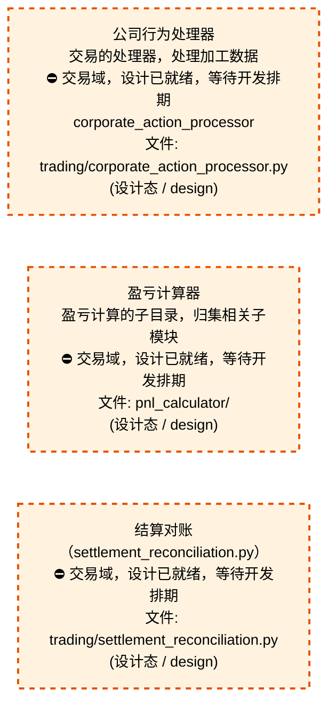
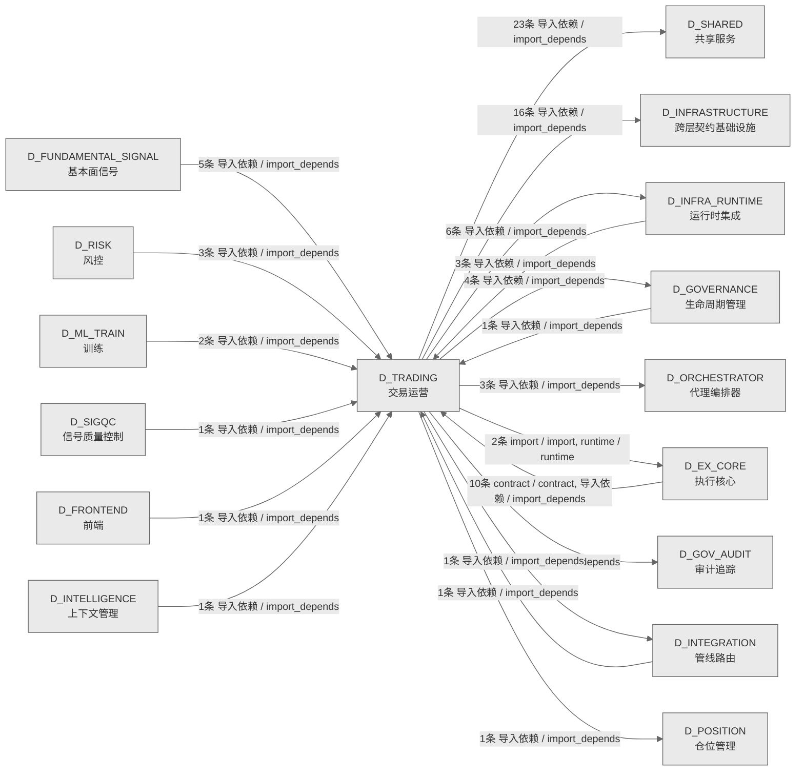

# 72_d_trading / 交易运营域 / Trading Operations

> **功能简介 / Overview**: 交易运营，负责交易生命周期管理、订单状态和成交处理

> **文档作用 / Purpose**: 展示 交易运营（D_TRADING）功能域的域内依赖关系、跨域依赖关系，模块信息（成熟度/中英文名/大白话/文件路径）内嵌于 Mermaid 节点，供架构审查和域治理参考。

> 本文档由 generate_domain_doc.py 从 depgraph (PostgreSQL) 自动生成
> 数据源: depgraph (PostgreSQL) nodes表 + edges表

> **[可缩放 HTML 版 / Zoomable HTML](http://localhost:8765/docs/02_enterprise_architecture/02_domain_architecture_docs/_zoomable_html/72_d_trading.html)** — Ctrl+滚轮缩放 ｜ 双击重置 ｜ Ctrl+Shift+D 切换拖动/选择模式

## 域基本信息 / Domain Overview

| 字段 | 值 | Field | Value |
|------|------|-------|-------|
| 编号 | 72 | Number | 72 |
| 域ID | D_TRADING | Domain ID | D_TRADING |
| 域名称 | 交易运营 | Domain Name | Trading Operations |
| 层级 | L2 业务域层 | Layer | L2 Domain |
| 模块数 | 40 | Module Count | 40 |
| 域内依赖 | 12 | Internal Dependencies | 12 |
| 跨域入边 | 28 | Cross-domain Incoming | 28 |
| 跨域出边 | 57 | Cross-domain Outgoing | 57 |
| 设计态模块 | 3 | Design Modules | 3 |
| 生产态模块 | 37 | Production Modules | 37 |
| 容量 | 37/150 (正常) | Capacity | 37/150 (正常) |
| 描述 | 交易运营，负责交易生命周期管理、订单状态和成交处理 | Description | 交易运营，负责交易生命周期管理、订单状态和成交处理 |

## 域内依赖图 / Internal Dependency Diagram

> 依赖图内嵌在本文档中，IDE 可直接渲染；网页版可 Ctrl+滚轮缩放 + 拖动平移查看细节。
>
> **图例说明 / Legend**：
> - 🟦 **蓝色 = 运营态模块**（production，已上线运行）
> - 🟧 **橙色虚线 = 设计态模块**（design，蓝图阶段，代码未写）
> - **实线箭头 = 运营态依赖**（已生效的依赖关系）
> - **虚线箭头 = 非运营态依赖**（计划中/验证中的依赖关系）

### 全景图（全部模块，颜色区分运营态/设计态）

> 展示全部 40 个模块（生产态 37 + 设计态 3），含跨域依赖外部节点。节点含成熟度+名称+大白话/简介+文件路径。

```mermaid
%%{init: {'theme': 'base', 'themeVariables': {'primaryColor': '#eaeaea', 'primaryTextColor': '#333333', 'primaryBorderColor': '#666666', 'lineColor': '#666666', 'secondaryColor': '#eaeaea', 'tertiaryColor': '#eaeaea', 'fontSize': '14px'}}}%%
flowchart TD
    src_zephyr_trading_action_dispatcher_init_py["trading/action_dispatcher 包入口<br/>BRAIN 注释块文本编辑器（ActionDispatcher<br/>协作者，职责簇：纯文本块构建/插入/更新，无 I/O<br/>无状态）。<br/>文件: action_dispatcher/__init__.py<br/>(生产态 / production)"]
    src_zephyr_trading_admission_controller_py["准入控制器<br/>5.171 修复：admit(event: Any) Any 滥用——定义<br/>VerdictEvent Protocol<br/>admission_controller<br/>文件: trading/admission_controller.py<br/>(生产态 / production)"]
    src_zephyr_trading_auto_dispatcher_py["自动分发器<br/>AutoDispatcher — 守护进程内的轻量<br/>PipelineDispatcher<br/>auto_dispatcher<br/>文件: trading/auto_dispatcher.py<br/>(生产态 / production)"]
    src_zephyr_trading_conductor_py["Conductor — AI session 全自动指挥官。<br/>交易包的conductor模块<br/>文件: trading/conductor.py<br/>(生产态 / production)"]
    src_zephyr_trading_corporate_action_processor_py["公司行为处理器<br/>交易的处理器，处理加工数据<br/>⛔ 交易域，设计已就绪，等待开发排期<br/>corporate_action_processor<br/>文件: trading/corporate_action_processor.py<br/>(设计态 / design)"]
    src_zephyr_trading_gpu_consensus_scheduler_py["GPU共识调度器<br/>交易的调度器，按时间或优先级安排任务<br/>gpu_consensus_scheduler<br/>文件: trading/gpu_consensus_scheduler.py<br/>(生产态 / production)"]
    src_zephyr_trading_gpu_monitor_py["GPU监控<br/>NVIDIA GPU 状态采集器<br/>gpu_monitor<br/>文件: trading/gpu_monitor.py<br/>(生产态 / production)"]
    src_zephyr_trading_ide_health_daemon_py["ide健康daemon<br/>TRAE IDE 幽灵窗口守护线程<br/>ide_health_daemon<br/>文件: trading/ide_health_daemon.py<br/>(生产态 / production)"]
    src_zephyr_trading_pnl_calculator["盈亏计算器<br/>盈亏计算的子目录，归集相关子模块<br/>⛔ 交易域，设计已就绪，等待开发排期<br/>文件: pnl_calculator/<br/>(设计态 / design)"]
    src_zephyr_trading_runtime_async_runtime_py["异步运行时<br/>事件循环引导 + run_in_executor 桥接。<br/>async_runtime<br/>文件: runtime/async_runtime.py<br/>(生产态 / production)"]
    src_zephyr_trading_settlement_reconciliation_py["结算对账<br/>（settlement_reconciliation.py）<br/>⛔ 交易域，设计已就绪，等待开发排期<br/>文件: trading/settlement_reconciliation.py<br/>(设计态 / design)"]
    src_zephyr_trading_speed_baseline_checker_py["测速基线检查器<br/>speed基线检查器，交易的检查器，检查条件是否满足<br/>。<br/>speed_baseline_checker<br/>文件: trading/speed_baseline_checker.py<br/>(生产态 / production)"]
    src_zephyr_trading_trading_contracts_broker_interface_py["经纪人接口<br/>D_EXECUTION_CORE — BrokerInterface<br/>文件: trading_contracts/broker_interface.py<br/>(生产态 / production)"]
    src_zephyr_trading_trading_contracts_execution_capital_allocation_result_py["资本分配结果<br/>资本allocation结果，执行的结果，封装操作结果的数<br/>据结构。<br/>capital_allocation_result<br/>文件: execution/capital_allocation_result.py<br/>(生产态 / production)"]
    src_zephyr_trading_trading_contracts_execution_execution_rejection_error_py["执行拒绝错误<br/>执行的异常，定义本模块的异常类型<br/>execution_rejection_error<br/>文件: execution/execution_rejection_error.py<br/>(生产态 / production)"]
    src_zephyr_trading_trading_contracts_execution_execution_report_py["执行报告<br/>Re-export wrapper: ExecutionReport 真源在<br/>zephyr.shared.contracts.execution_report<br/>（CTR-P1-007 codegen）<br/>文件: execution/execution_report.py<br/>(生产态 / production)"]
    src_zephyr_trading_trading_contracts_execution_fill_py["成交<br/>Re-export wrapper: Fill 真源在<br/>zephyr.shared.contracts.fill（CTR-005 codegen）<br/>文件: execution/fill.py<br/>(生产态 / production)"]
    src_zephyr_trading_trading_contracts_execution_model_serving_request_py["模型服务请求<br/>执行的模型，定义数据结构和字段<br/>model_serving_request<br/>文件: execution/model_serving_request.py<br/>(生产态 / production)"]
    src_zephyr_trading_trading_contracts_execution_position_py["持仓<br/>Re-export wrapper: PositionSnapshot 真源在<br/>zephyr.shared.contracts.position（CTR-006<br/>codegen）<br/>文件: execution/position.py<br/>(生产态 / production)"]
    src_zephyr_trading_trading_contracts_factories_py["工厂<br/>py — 交易域数据契约工厂方法<br/>factories<br/>文件: trading_contracts/factories.py<br/>(生产态 / production)"]
    src_zephyr_trading_trading_contracts_market_instrument_py["market/instrument<br/>交易/market包的instrument模块<br/>文件: market/instrument.py<br/>(生产态 / production)"]
    src_zephyr_trading_trading_contracts_market_signal_degradation_warning_py["信号退化警告<br/>供signal; risk; pf_core使用<br/>signal_degradation_warning<br/>文件: market/signal_degradation_warning.py<br/>(生产态 / production)"]
    src_zephyr_trading_trading_contracts_portfolio_contracts_money_py["过渡兼容层（DEPRECATED）—— Money 契约 canonical<br/>真<br/>源已收敛至 shared 侧<br/>文件: contracts/money.py<br/>(生产态 / production)"]
    src_zephyr_trading_trading_contracts_portfolio_contracts_performance_attribution_report_py["绩效attribution报告<br/>交易/契约包的performance_attribution_report模块<br/>文件: contracts<br/>/performance_attribution_report.py<br/>(生产态 / production)"]
    src_zephyr_trading_trading_contracts_portfolio_contracts_strategy_lifecycle_event_py["策略生命周期事件<br/>组合的事件，定义和分发事件<br/>strategy_lifecycle_event<br/>文件: contracts/strategy_lifecycle_event.py<br/>(生产态 / production)"]
    src_zephyr_trading_trading_contracts_risk_compliance_rule_py["合规规则<br/>供l10-compliance使用<br/>compliance_rule<br/>文件: risk/compliance_rule.py<br/>(生产态 / production)"]
    src_zephyr_trading_trading_contracts_risk_risk_limit_violation_error_py["风险限制违规错误<br/>风控的异常，定义本模块的异常类型<br/>risk_limit_violation_error<br/>文件: risk/risk_limit_violation_error.py<br/>(生产态 / production)"]
    src_zephyr_trading_trading_contracts_risk_risk_validator_protocol_py["风险校验器协议<br/>风控的校验器，检查输入是否符合规则<br/>risk_validator_protocol<br/>文件: risk/risk_validator_protocol.py<br/>(生产态 / production)"]
    src_zephyr_trading_trading_contracts_risk_trading_kill_switch_py["交易终止开关<br/>供MOD-INF-022 ; MOD-INF-020使用<br/>trading_kill_switch<br/>文件: risk/trading_kill_switch.py<br/>(生产态 / production)"]
    src_zephyr_trading_action_dispatcher_init_py ~~~ src_zephyr_trading_admission_controller_py
    src_zephyr_trading_admission_controller_py ~~~ src_zephyr_trading_auto_dispatcher_py
    src_zephyr_trading_auto_dispatcher_py ~~~ src_zephyr_trading_conductor_py
    src_zephyr_trading_conductor_py ~~~ src_zephyr_trading_corporate_action_processor_py
    src_zephyr_trading_corporate_action_processor_py ~~~ src_zephyr_trading_gpu_consensus_scheduler_py
    src_zephyr_trading_gpu_consensus_scheduler_py ~~~ src_zephyr_trading_gpu_monitor_py
    src_zephyr_trading_gpu_monitor_py ~~~ src_zephyr_trading_ide_health_daemon_py
    src_zephyr_trading_ide_health_daemon_py ~~~ src_zephyr_trading_pnl_calculator
    src_zephyr_trading_pnl_calculator ~~~ src_zephyr_trading_runtime_async_runtime_py
    src_zephyr_trading_runtime_async_runtime_py ~~~ src_zephyr_trading_settlement_reconciliation_py
    src_zephyr_trading_settlement_reconciliation_py ~~~ src_zephyr_trading_speed_baseline_checker_py
    src_zephyr_trading_speed_baseline_checker_py ~~~ src_zephyr_trading_trading_contracts_broker_interface_py
    src_zephyr_trading_trading_contracts_broker_interface_py ~~~ src_zephyr_trading_trading_contracts_execution_capital_allocation_result_py
    src_zephyr_trading_trading_contracts_execution_capital_allocation_result_py ~~~ src_zephyr_trading_trading_contracts_execution_execution_rejection_error_py
    src_zephyr_trading_trading_contracts_execution_execution_rejection_error_py ~~~ src_zephyr_trading_trading_contracts_execution_execution_report_py
    src_zephyr_trading_trading_contracts_execution_execution_report_py ~~~ src_zephyr_trading_trading_contracts_execution_fill_py
    src_zephyr_trading_trading_contracts_execution_fill_py ~~~ src_zephyr_trading_trading_contracts_execution_model_serving_request_py
    src_zephyr_trading_trading_contracts_execution_model_serving_request_py ~~~ src_zephyr_trading_trading_contracts_execution_position_py
    src_zephyr_trading_trading_contracts_execution_position_py ~~~ src_zephyr_trading_trading_contracts_factories_py
    src_zephyr_trading_trading_contracts_factories_py ~~~ src_zephyr_trading_trading_contracts_market_instrument_py
    src_zephyr_trading_trading_contracts_market_instrument_py ~~~ src_zephyr_trading_trading_contracts_market_signal_degradation_warning_py
    src_zephyr_trading_trading_contracts_market_signal_degradation_warning_py ~~~ src_zephyr_trading_trading_contracts_portfolio_contracts_money_py
    src_zephyr_trading_trading_contracts_portfolio_contracts_money_py ~~~ src_zephyr_trading_trading_contracts_portfolio_contracts_performance_attribution_report_py
    src_zephyr_trading_trading_contracts_portfolio_contracts_performance_attribution_report_py ~~~ src_zephyr_trading_trading_contracts_portfolio_contracts_strategy_lifecycle_event_py
    src_zephyr_trading_trading_contracts_portfolio_contracts_strategy_lifecycle_event_py ~~~ src_zephyr_trading_trading_contracts_risk_compliance_rule_py
    src_zephyr_trading_trading_contracts_risk_compliance_rule_py ~~~ src_zephyr_trading_trading_contracts_risk_risk_limit_violation_error_py
    src_zephyr_trading_trading_contracts_risk_risk_limit_violation_error_py ~~~ src_zephyr_trading_trading_contracts_risk_risk_validator_protocol_py
    src_zephyr_trading_trading_contracts_risk_risk_validator_protocol_py ~~~ src_zephyr_trading_trading_contracts_risk_trading_kill_switch_py
    src_zephyr_trading_action_dispatcher_annotation_writer_py["annotation写入器<br/>注释注解写入器（从<br/>ActionDispatcher._annotate_py_file/_tag_module<br/>/_annotate_blueprint 提取）。<br/>_annotation_writer<br/>文件: action_dispatcher/_annotation_writer.py<br/>(生产态 / production)"]
    src_zephyr_trading_action_dispatcher_audit_log_writer_py["审计日志写入器<br/>（从 ActionDispatcher._write_triage_log 提取）<br/>_audit_log_writer<br/>文件: action_dispatcher/_audit_log_writer.py<br/>(生产态 / production)"]
    src_zephyr_trading_action_dispatcher_file_lifecycle_manager_py["文件生命周期管理器<br/>（从 ActionDispatcher._create_file /<br/>_delete_file / _version_backup 提取）<br/>_file_lifecycle_manager<br/>文件: action_dispatcher<br/>/_file_lifecycle_manager.py<br/>(生产态 / production)"]
    src_zephyr_trading_action_dispatcher_search_replace_engine_py["searchreplace引擎<br/>搜索替换引擎（从<br/>ActionDispatcher._search_replace_file<br/>及两个底层方法提取）。<br/>_search_replace_engine<br/>文件: action_dispatcher<br/>/_search_replace_engine.py<br/>(生产态 / production)"]
    src_zephyr_trading_autopilot_py["AutoPilot — AI session 自动找活干、认领任务。<br/>交易包的autopilot模块<br/>文件: trading/autopilot.py<br/>(生产态 / production)"]
    src_zephyr_trading_trading_contracts_execution_order_py["订单<br/>Re-export wrapper: Order 真源在<br/>zephyr.shared.contracts.order（CTR-004 codegen）<br/>文件: execution/order.py<br/>(生产态 / production)"]
    src_zephyr_trading_trading_contracts_risk_risk_dashboard_snapshot_py["风险仪表盘快照<br/>供risk; ops使用<br/>risk_dashboard_snapshot<br/>文件: risk/risk_dashboard_snapshot.py<br/>(生产态 / production)"]
    src_zephyr_trading_trading_contracts_risk_risk_limits_py["风险limits<br/>供risk; pf_core使用<br/>risk_limits<br/>文件: risk/risk_limits.py<br/>(生产态 / production)"]
    src_zephyr_trading_trading_contracts_risk_risk_metrics_py["风险指标<br/>风控的报告器，汇总数据生成报告<br/>risk_metrics<br/>文件: risk/risk_metrics.py<br/>(生产态 / production)"]
    src_zephyr_trading_verdict_engine_py["裁定引擎<br/>verdict引擎，交易的事件，定义和分发事件。<br/>verdict_engine<br/>文件: trading/verdict_engine.py<br/>(生产态 / production)"]
    src_zephyr_trading_action_dispatcher_annotation_writer_py ~~~ src_zephyr_trading_action_dispatcher_audit_log_writer_py
    src_zephyr_trading_action_dispatcher_audit_log_writer_py ~~~ src_zephyr_trading_action_dispatcher_file_lifecycle_manager_py
    src_zephyr_trading_action_dispatcher_file_lifecycle_manager_py ~~~ src_zephyr_trading_action_dispatcher_search_replace_engine_py
    src_zephyr_trading_action_dispatcher_search_replace_engine_py ~~~ src_zephyr_trading_autopilot_py
    src_zephyr_trading_autopilot_py ~~~ src_zephyr_trading_trading_contracts_execution_order_py
    src_zephyr_trading_trading_contracts_execution_order_py ~~~ src_zephyr_trading_trading_contracts_risk_risk_dashboard_snapshot_py
    src_zephyr_trading_trading_contracts_risk_risk_dashboard_snapshot_py ~~~ src_zephyr_trading_trading_contracts_risk_risk_limits_py
    src_zephyr_trading_trading_contracts_risk_risk_limits_py ~~~ src_zephyr_trading_trading_contracts_risk_risk_metrics_py
    src_zephyr_trading_trading_contracts_risk_risk_metrics_py ~~~ src_zephyr_trading_verdict_engine_py
    src_zephyr_trading_protection_index_py["保护索引<br/>供zephyr.trading.verdict_engine;使用<br/>protection_index<br/>文件: trading/protection_index.py<br/>(生产态 / production)"]
    src_zephyr_trading_conductor_py -->|导入依赖 / import_depends| src_zephyr_trading_autopilot_py
    src_zephyr_trading_gpu_consensus_scheduler_py -->|导入依赖 / import_depends| src_zephyr_trading_verdict_engine_py
    src_zephyr_trading_protection_index_py -->|导入依赖 / import_depends| src_zephyr_trading_verdict_engine_py
    src_zephyr_trading_verdict_engine_py -->|导入依赖 / import_depends| src_zephyr_trading_protection_index_py
    src_zephyr_trading_action_dispatcher_init_py -->|导入依赖 / import_depends| src_zephyr_trading_action_dispatcher_annotation_writer_py
    src_zephyr_trading_action_dispatcher_init_py -->|导入依赖 / import_depends| src_zephyr_trading_action_dispatcher_audit_log_writer_py
    src_zephyr_trading_action_dispatcher_init_py -->|导入依赖 / import_depends| src_zephyr_trading_action_dispatcher_file_lifecycle_manager_py
    src_zephyr_trading_action_dispatcher_init_py -->|导入依赖 / import_depends| src_zephyr_trading_action_dispatcher_search_replace_engine_py
    src_zephyr_trading_trading_contracts_factories_py -->|导入依赖 / import_depends| src_zephyr_trading_trading_contracts_execution_order_py
    src_zephyr_trading_trading_contracts_factories_py -->|导入依赖 / import_depends| src_zephyr_trading_trading_contracts_risk_risk_dashboard_snapshot_py
    src_zephyr_trading_trading_contracts_factories_py -->|导入依赖 / import_depends| src_zephyr_trading_trading_contracts_risk_risk_limits_py
    src_zephyr_trading_trading_contracts_factories_py -->|导入依赖 / import_depends| src_zephyr_trading_trading_contracts_risk_risk_metrics_py
    D_EX_CORE["执行核心<br/>执行核心，负责订单执行引擎、执行策略和执行管理<br/>Execution Core<br/>跨域节点 / cross-domain<br/>(设计态 / design)"]
    src_zephyr_trading_pnl_calculator -.->|import / import| D_EX_CORE
    D_SHARED["共享服务<br/>共享服务，负责跨域共享的工具、协议和基础服务<br/>Shared Services<br/>跨域节点 / cross-domain<br/>(生产态 / production)"]
    src_zephyr_trading_autopilot_py -->|导入依赖 / import_depends| D_SHARED
    D_POSITION["仓位管理<br/>仓位管理，负责持仓跟踪、仓位计算和盈亏分析<br/>Position Management<br/>跨域节点 / cross-domain<br/>(生产态 / production)"]
    src_zephyr_trading_pnl_calculator -.->|导入依赖 / import_depends| D_POSITION
    src_zephyr_trading_settlement_reconciliation_py -.->|runtime / runtime| D_EX_CORE
    D_GOVERNANCE["生命周期管理<br/>生命周期管理，负责蓝图/模块<br/>/任务的声明周期管理和元数据治理<br/>Lifecycle Management<br/>跨域节点 / cross-domain<br/>(生产态 / production)"]
    src_zephyr_trading_autopilot_py -->|导入依赖 / import_depends| D_GOVERNANCE
    D_ORCHESTRATOR["代理编排器<br/>代理编排器，负责 Agent<br/>任务全生命周期：任务入队、调度、沙箱执行、幻觉检<br/>测和收尾归档<br/>Agent Orchestrator<br/>跨域节点 / cross-domain<br/>(生产态 / production)"]
    src_zephyr_trading_auto_dispatcher_py -->|导入依赖 / import_depends| D_ORCHESTRATOR
    D_GOV_AUDIT["审计追踪<br/>审计追踪，负责变更审计追踪和操作日志管理<br/>Audit Trail<br/>跨域节点 / cross-domain<br/>(生产态 / production)"]
    src_zephyr_trading_verdict_engine_py -->|导入依赖 / import_depends| D_GOV_AUDIT
    src_zephyr_trading_speed_baseline_checker_py -->|导入依赖 / import_depends| D_SHARED
    D_INFRASTRUCTURE["跨层契约基础设施<br/>跨层契约基础设施，负责跨层契约定义、共享契约管理<br/>和契约校验<br/>Cross-Layer Contract Infrastructure<br/>跨域节点 / cross-domain<br/>(生产态 / production)"]
    src_zephyr_trading_trading_contracts_broker_interface_py -->|导入依赖 / import_depends| D_INFRASTRUCTURE
    src_zephyr_trading_ide_health_daemon_py -->|导入依赖 / import_depends| D_SHARED
    src_zephyr_trading_gpu_monitor_py -->|导入依赖 / import_depends| D_SHARED
    src_zephyr_trading_autopilot_py -->|导入依赖 / import_depends| D_SHARED
    src_zephyr_trading_ide_health_daemon_py -->|导入依赖 / import_depends| D_SHARED
    src_zephyr_trading_action_dispatcher_init_py -->|导入依赖 / import_depends| D_SHARED
    D_INFRA_RUNTIME["运行时集成<br/>运行时集成，负责组件生命周期编排、启动钩子和运行<br/>时上下文管理<br/>Runtime Integration<br/>跨域节点 / cross-domain<br/>(生产态 / production)"]
    src_zephyr_trading_action_dispatcher_file_lifecycle_manager_py -->|导入依赖 / import_depends| D_INFRA_RUNTIME
    D_EX_CORE -->|导入依赖 / import_depends| src_zephyr_trading_trading_contracts_broker_interface_py
    D_EX_CORE -.->|导入依赖 / import_depends| src_zephyr_trading_trading_contracts_risk_risk_limits_py
    D_EX_CORE -.->|导入依赖 / import_depends| src_zephyr_trading_trading_contracts_execution_position_py
    D_EX_CORE -->|contract / contract| src_zephyr_trading_trading_contracts_broker_interface_py
    D_EX_CORE -->|导入依赖 / import_depends| src_zephyr_trading_trading_contracts_broker_interface_py
    D_RISK["风控<br/>风控，负责风险指标计算、风险限额管理和风险预警<br/>Risk Control<br/>跨域节点 / cross-domain<br/>(生产态 / production)"]
    D_RISK -->|导入依赖 / import_depends| src_zephyr_trading_trading_contracts_risk_risk_limit_violation_error_py
    D_RISK -->|导入依赖 / import_depends| src_zephyr_trading_trading_contracts_risk_risk_dashboard_snapshot_py
    D_INFRA_RUNTIME -->|导入依赖 / import_depends| src_zephyr_trading_ide_health_daemon_py
    D_FUNDAMENTAL_SIGNAL["基本面信号<br/>基本面信号，负责基于财务数据的基本面信号生成<br/>Fundamental Signal<br/>跨域节点 / cross-domain<br/>(生产态 / production)"]
    D_FUNDAMENTAL_SIGNAL -->|导入依赖 / import_depends| src_zephyr_trading_trading_contracts_execution_capital_allocation_result_py
    D_EX_CORE -->|导入依赖 / import_depends| src_zephyr_trading_trading_contracts_broker_interface_py
    D_FUNDAMENTAL_SIGNAL -->|导入依赖 / import_depends| src_zephyr_trading_trading_contracts_execution_capital_allocation_result_py
    D_ML_TRAIN["训练<br/>训练，负责模型训练、特征工程和模型评估<br/>Training<br/>跨域节点 / cross-domain<br/>(生产态 / production)"]
    D_ML_TRAIN -->|导入依赖 / import_depends| src_zephyr_trading_trading_contracts_execution_model_serving_request_py
    D_GOVERNANCE -->|导入依赖 / import_depends| src_zephyr_trading_trading_contracts_broker_interface_py
    D_FUNDAMENTAL_SIGNAL -->|导入依赖 / import_depends| src_zephyr_trading_trading_contracts_market_signal_degradation_warning_py
    D_INFRA_RUNTIME -->|导入依赖 / import_depends| src_zephyr_trading_ide_health_daemon_py
    classDef production fill:#e1f5fe,stroke:#01579b,stroke-width:2px,color:#000
    classDef design fill:#fff3e0,stroke:#e65100,stroke-width:2px,color:#000,stroke-dasharray: 5 5
    classDef external_prod fill:#e8f4fd,stroke:#0277bd,stroke-width:1px,color:#000
    classDef external_design fill:#fff8e7,stroke:#ef6c00,stroke-width:1px,color:#000,stroke-dasharray: 5 5
    class src_zephyr_trading_action_dispatcher_init_py,src_zephyr_trading_action_dispatcher_annotation_writer_py,src_zephyr_trading_action_dispatcher_audit_log_writer_py,src_zephyr_trading_action_dispatcher_file_lifecycle_manager_py,src_zephyr_trading_action_dispatcher_search_replace_engine_py,src_zephyr_trading_admission_controller_py,src_zephyr_trading_auto_dispatcher_py,src_zephyr_trading_autopilot_py,src_zephyr_trading_conductor_py,src_zephyr_trading_gpu_consensus_scheduler_py,src_zephyr_trading_gpu_monitor_py,src_zephyr_trading_ide_health_daemon_py,src_zephyr_trading_protection_index_py,src_zephyr_trading_runtime_async_runtime_py,src_zephyr_trading_speed_baseline_checker_py,src_zephyr_trading_trading_contracts_broker_interface_py,src_zephyr_trading_trading_contracts_execution_capital_allocation_result_py,src_zephyr_trading_trading_contracts_execution_execution_rejection_error_py,src_zephyr_trading_trading_contracts_execution_execution_report_py,src_zephyr_trading_trading_contracts_execution_fill_py,src_zephyr_trading_trading_contracts_execution_model_serving_request_py,src_zephyr_trading_trading_contracts_execution_order_py,src_zephyr_trading_trading_contracts_execution_position_py,src_zephyr_trading_trading_contracts_factories_py,src_zephyr_trading_trading_contracts_market_instrument_py,src_zephyr_trading_trading_contracts_market_signal_degradation_warning_py,src_zephyr_trading_trading_contracts_portfolio_contracts_money_py,src_zephyr_trading_trading_contracts_portfolio_contracts_performance_attribution_report_py,src_zephyr_trading_trading_contracts_portfolio_contracts_strategy_lifecycle_event_py,src_zephyr_trading_trading_contracts_risk_compliance_rule_py,src_zephyr_trading_trading_contracts_risk_risk_dashboard_snapshot_py,src_zephyr_trading_trading_contracts_risk_risk_limit_violation_error_py,src_zephyr_trading_trading_contracts_risk_risk_limits_py,src_zephyr_trading_trading_contracts_risk_risk_metrics_py,src_zephyr_trading_trading_contracts_risk_risk_validator_protocol_py,src_zephyr_trading_trading_contracts_risk_trading_kill_switch_py,src_zephyr_trading_verdict_engine_py production
    class src_zephyr_trading_corporate_action_processor_py,src_zephyr_trading_pnl_calculator,src_zephyr_trading_settlement_reconciliation_py design
    class D_SHARED,D_POSITION,D_GOVERNANCE,D_ORCHESTRATOR,D_GOV_AUDIT,D_INFRASTRUCTURE,D_INFRA_RUNTIME,D_RISK,D_FUNDAMENTAL_SIGNAL,D_ML_TRAIN external_prod
    class D_EX_CORE external_design
```

### 运营态的图（仅 design_maturity=production 的模块和域内依赖）

> 仅展示已上线运行的模块（共 37 个），不含跨域外部节点。跨域依赖见下方跨域依赖章节。

```mermaid
%%{init: {'theme': 'base', 'themeVariables': {'primaryColor': '#eaeaea', 'primaryTextColor': '#333333', 'primaryBorderColor': '#666666', 'lineColor': '#666666', 'secondaryColor': '#eaeaea', 'tertiaryColor': '#eaeaea', 'fontSize': '14px'}}}%%
flowchart TD
    src_zephyr_trading_action_dispatcher_init_py["trading/action_dispatcher 包入口<br/>BRAIN 注释块文本编辑器（ActionDispatcher<br/>协作者，职责簇：纯文本块构建/插入/更新，无 I/O<br/>无状态）。<br/>文件: action_dispatcher/__init__.py<br/>(生产态 / production)"]
    src_zephyr_trading_admission_controller_py["准入控制器<br/>5.171 修复：admit(event: Any) Any 滥用——定义<br/>VerdictEvent Protocol<br/>admission_controller<br/>文件: trading/admission_controller.py<br/>(生产态 / production)"]
    src_zephyr_trading_auto_dispatcher_py["自动分发器<br/>AutoDispatcher — 守护进程内的轻量<br/>PipelineDispatcher<br/>auto_dispatcher<br/>文件: trading/auto_dispatcher.py<br/>(生产态 / production)"]
    src_zephyr_trading_conductor_py["Conductor — AI session 全自动指挥官。<br/>交易包的conductor模块<br/>文件: trading/conductor.py<br/>(生产态 / production)"]
    src_zephyr_trading_gpu_consensus_scheduler_py["GPU共识调度器<br/>交易的调度器，按时间或优先级安排任务<br/>gpu_consensus_scheduler<br/>文件: trading/gpu_consensus_scheduler.py<br/>(生产态 / production)"]
    src_zephyr_trading_gpu_monitor_py["GPU监控<br/>NVIDIA GPU 状态采集器<br/>gpu_monitor<br/>文件: trading/gpu_monitor.py<br/>(生产态 / production)"]
    src_zephyr_trading_ide_health_daemon_py["ide健康daemon<br/>TRAE IDE 幽灵窗口守护线程<br/>ide_health_daemon<br/>文件: trading/ide_health_daemon.py<br/>(生产态 / production)"]
    src_zephyr_trading_runtime_async_runtime_py["异步运行时<br/>事件循环引导 + run_in_executor 桥接。<br/>async_runtime<br/>文件: runtime/async_runtime.py<br/>(生产态 / production)"]
    src_zephyr_trading_speed_baseline_checker_py["测速基线检查器<br/>speed基线检查器，交易的检查器，检查条件是否满足<br/>。<br/>speed_baseline_checker<br/>文件: trading/speed_baseline_checker.py<br/>(生产态 / production)"]
    src_zephyr_trading_trading_contracts_broker_interface_py["经纪人接口<br/>D_EXECUTION_CORE — BrokerInterface<br/>文件: trading_contracts/broker_interface.py<br/>(生产态 / production)"]
    src_zephyr_trading_trading_contracts_execution_capital_allocation_result_py["资本分配结果<br/>资本allocation结果，执行的结果，封装操作结果的数<br/>据结构。<br/>capital_allocation_result<br/>文件: execution/capital_allocation_result.py<br/>(生产态 / production)"]
    src_zephyr_trading_trading_contracts_execution_execution_rejection_error_py["执行拒绝错误<br/>执行的异常，定义本模块的异常类型<br/>execution_rejection_error<br/>文件: execution/execution_rejection_error.py<br/>(生产态 / production)"]
    src_zephyr_trading_trading_contracts_execution_execution_report_py["执行报告<br/>Re-export wrapper: ExecutionReport 真源在<br/>zephyr.shared.contracts.execution_report<br/>（CTR-P1-007 codegen）<br/>文件: execution/execution_report.py<br/>(生产态 / production)"]
    src_zephyr_trading_trading_contracts_execution_fill_py["成交<br/>Re-export wrapper: Fill 真源在<br/>zephyr.shared.contracts.fill（CTR-005 codegen）<br/>文件: execution/fill.py<br/>(生产态 / production)"]
    src_zephyr_trading_trading_contracts_execution_model_serving_request_py["模型服务请求<br/>执行的模型，定义数据结构和字段<br/>model_serving_request<br/>文件: execution/model_serving_request.py<br/>(生产态 / production)"]
    src_zephyr_trading_trading_contracts_execution_position_py["持仓<br/>Re-export wrapper: PositionSnapshot 真源在<br/>zephyr.shared.contracts.position（CTR-006<br/>codegen）<br/>文件: execution/position.py<br/>(生产态 / production)"]
    src_zephyr_trading_trading_contracts_factories_py["工厂<br/>py — 交易域数据契约工厂方法<br/>factories<br/>文件: trading_contracts/factories.py<br/>(生产态 / production)"]
    src_zephyr_trading_trading_contracts_market_instrument_py["market/instrument<br/>交易/market包的instrument模块<br/>文件: market/instrument.py<br/>(生产态 / production)"]
    src_zephyr_trading_trading_contracts_market_signal_degradation_warning_py["信号退化警告<br/>供signal; risk; pf_core使用<br/>signal_degradation_warning<br/>文件: market/signal_degradation_warning.py<br/>(生产态 / production)"]
    src_zephyr_trading_trading_contracts_portfolio_contracts_money_py["过渡兼容层（DEPRECATED）—— Money 契约 canonical<br/>真<br/>源已收敛至 shared 侧<br/>文件: contracts/money.py<br/>(生产态 / production)"]
    src_zephyr_trading_trading_contracts_portfolio_contracts_performance_attribution_report_py["绩效attribution报告<br/>交易/契约包的performance_attribution_report模块<br/>文件: contracts<br/>/performance_attribution_report.py<br/>(生产态 / production)"]
    src_zephyr_trading_trading_contracts_portfolio_contracts_strategy_lifecycle_event_py["策略生命周期事件<br/>组合的事件，定义和分发事件<br/>strategy_lifecycle_event<br/>文件: contracts/strategy_lifecycle_event.py<br/>(生产态 / production)"]
    src_zephyr_trading_trading_contracts_risk_compliance_rule_py["合规规则<br/>供l10-compliance使用<br/>compliance_rule<br/>文件: risk/compliance_rule.py<br/>(生产态 / production)"]
    src_zephyr_trading_trading_contracts_risk_risk_limit_violation_error_py["风险限制违规错误<br/>风控的异常，定义本模块的异常类型<br/>risk_limit_violation_error<br/>文件: risk/risk_limit_violation_error.py<br/>(生产态 / production)"]
    src_zephyr_trading_trading_contracts_risk_risk_validator_protocol_py["风险校验器协议<br/>风控的校验器，检查输入是否符合规则<br/>risk_validator_protocol<br/>文件: risk/risk_validator_protocol.py<br/>(生产态 / production)"]
    src_zephyr_trading_trading_contracts_risk_trading_kill_switch_py["交易终止开关<br/>供MOD-INF-022 ; MOD-INF-020使用<br/>trading_kill_switch<br/>文件: risk/trading_kill_switch.py<br/>(生产态 / production)"]
    src_zephyr_trading_action_dispatcher_init_py ~~~ src_zephyr_trading_admission_controller_py
    src_zephyr_trading_admission_controller_py ~~~ src_zephyr_trading_auto_dispatcher_py
    src_zephyr_trading_auto_dispatcher_py ~~~ src_zephyr_trading_conductor_py
    src_zephyr_trading_conductor_py ~~~ src_zephyr_trading_gpu_consensus_scheduler_py
    src_zephyr_trading_gpu_consensus_scheduler_py ~~~ src_zephyr_trading_gpu_monitor_py
    src_zephyr_trading_gpu_monitor_py ~~~ src_zephyr_trading_ide_health_daemon_py
    src_zephyr_trading_ide_health_daemon_py ~~~ src_zephyr_trading_runtime_async_runtime_py
    src_zephyr_trading_runtime_async_runtime_py ~~~ src_zephyr_trading_speed_baseline_checker_py
    src_zephyr_trading_speed_baseline_checker_py ~~~ src_zephyr_trading_trading_contracts_broker_interface_py
    src_zephyr_trading_trading_contracts_broker_interface_py ~~~ src_zephyr_trading_trading_contracts_execution_capital_allocation_result_py
    src_zephyr_trading_trading_contracts_execution_capital_allocation_result_py ~~~ src_zephyr_trading_trading_contracts_execution_execution_rejection_error_py
    src_zephyr_trading_trading_contracts_execution_execution_rejection_error_py ~~~ src_zephyr_trading_trading_contracts_execution_execution_report_py
    src_zephyr_trading_trading_contracts_execution_execution_report_py ~~~ src_zephyr_trading_trading_contracts_execution_fill_py
    src_zephyr_trading_trading_contracts_execution_fill_py ~~~ src_zephyr_trading_trading_contracts_execution_model_serving_request_py
    src_zephyr_trading_trading_contracts_execution_model_serving_request_py ~~~ src_zephyr_trading_trading_contracts_execution_position_py
    src_zephyr_trading_trading_contracts_execution_position_py ~~~ src_zephyr_trading_trading_contracts_factories_py
    src_zephyr_trading_trading_contracts_factories_py ~~~ src_zephyr_trading_trading_contracts_market_instrument_py
    src_zephyr_trading_trading_contracts_market_instrument_py ~~~ src_zephyr_trading_trading_contracts_market_signal_degradation_warning_py
    src_zephyr_trading_trading_contracts_market_signal_degradation_warning_py ~~~ src_zephyr_trading_trading_contracts_portfolio_contracts_money_py
    src_zephyr_trading_trading_contracts_portfolio_contracts_money_py ~~~ src_zephyr_trading_trading_contracts_portfolio_contracts_performance_attribution_report_py
    src_zephyr_trading_trading_contracts_portfolio_contracts_performance_attribution_report_py ~~~ src_zephyr_trading_trading_contracts_portfolio_contracts_strategy_lifecycle_event_py
    src_zephyr_trading_trading_contracts_portfolio_contracts_strategy_lifecycle_event_py ~~~ src_zephyr_trading_trading_contracts_risk_compliance_rule_py
    src_zephyr_trading_trading_contracts_risk_compliance_rule_py ~~~ src_zephyr_trading_trading_contracts_risk_risk_limit_violation_error_py
    src_zephyr_trading_trading_contracts_risk_risk_limit_violation_error_py ~~~ src_zephyr_trading_trading_contracts_risk_risk_validator_protocol_py
    src_zephyr_trading_trading_contracts_risk_risk_validator_protocol_py ~~~ src_zephyr_trading_trading_contracts_risk_trading_kill_switch_py
    src_zephyr_trading_action_dispatcher_annotation_writer_py["annotation写入器<br/>注释注解写入器（从<br/>ActionDispatcher._annotate_py_file/_tag_module<br/>/_annotate_blueprint 提取）。<br/>_annotation_writer<br/>文件: action_dispatcher/_annotation_writer.py<br/>(生产态 / production)"]
    src_zephyr_trading_action_dispatcher_audit_log_writer_py["审计日志写入器<br/>（从 ActionDispatcher._write_triage_log 提取）<br/>_audit_log_writer<br/>文件: action_dispatcher/_audit_log_writer.py<br/>(生产态 / production)"]
    src_zephyr_trading_action_dispatcher_file_lifecycle_manager_py["文件生命周期管理器<br/>（从 ActionDispatcher._create_file /<br/>_delete_file / _version_backup 提取）<br/>_file_lifecycle_manager<br/>文件: action_dispatcher<br/>/_file_lifecycle_manager.py<br/>(生产态 / production)"]
    src_zephyr_trading_action_dispatcher_search_replace_engine_py["searchreplace引擎<br/>搜索替换引擎（从<br/>ActionDispatcher._search_replace_file<br/>及两个底层方法提取）。<br/>_search_replace_engine<br/>文件: action_dispatcher<br/>/_search_replace_engine.py<br/>(生产态 / production)"]
    src_zephyr_trading_autopilot_py["AutoPilot — AI session 自动找活干、认领任务。<br/>交易包的autopilot模块<br/>文件: trading/autopilot.py<br/>(生产态 / production)"]
    src_zephyr_trading_trading_contracts_execution_order_py["订单<br/>Re-export wrapper: Order 真源在<br/>zephyr.shared.contracts.order（CTR-004 codegen）<br/>文件: execution/order.py<br/>(生产态 / production)"]
    src_zephyr_trading_trading_contracts_risk_risk_dashboard_snapshot_py["风险仪表盘快照<br/>供risk; ops使用<br/>risk_dashboard_snapshot<br/>文件: risk/risk_dashboard_snapshot.py<br/>(生产态 / production)"]
    src_zephyr_trading_trading_contracts_risk_risk_limits_py["风险limits<br/>供risk; pf_core使用<br/>risk_limits<br/>文件: risk/risk_limits.py<br/>(生产态 / production)"]
    src_zephyr_trading_trading_contracts_risk_risk_metrics_py["风险指标<br/>风控的报告器，汇总数据生成报告<br/>risk_metrics<br/>文件: risk/risk_metrics.py<br/>(生产态 / production)"]
    src_zephyr_trading_verdict_engine_py["裁定引擎<br/>verdict引擎，交易的事件，定义和分发事件。<br/>verdict_engine<br/>文件: trading/verdict_engine.py<br/>(生产态 / production)"]
    src_zephyr_trading_action_dispatcher_annotation_writer_py ~~~ src_zephyr_trading_action_dispatcher_audit_log_writer_py
    src_zephyr_trading_action_dispatcher_audit_log_writer_py ~~~ src_zephyr_trading_action_dispatcher_file_lifecycle_manager_py
    src_zephyr_trading_action_dispatcher_file_lifecycle_manager_py ~~~ src_zephyr_trading_action_dispatcher_search_replace_engine_py
    src_zephyr_trading_action_dispatcher_search_replace_engine_py ~~~ src_zephyr_trading_autopilot_py
    src_zephyr_trading_autopilot_py ~~~ src_zephyr_trading_trading_contracts_execution_order_py
    src_zephyr_trading_trading_contracts_execution_order_py ~~~ src_zephyr_trading_trading_contracts_risk_risk_dashboard_snapshot_py
    src_zephyr_trading_trading_contracts_risk_risk_dashboard_snapshot_py ~~~ src_zephyr_trading_trading_contracts_risk_risk_limits_py
    src_zephyr_trading_trading_contracts_risk_risk_limits_py ~~~ src_zephyr_trading_trading_contracts_risk_risk_metrics_py
    src_zephyr_trading_trading_contracts_risk_risk_metrics_py ~~~ src_zephyr_trading_verdict_engine_py
    src_zephyr_trading_protection_index_py["保护索引<br/>供zephyr.trading.verdict_engine;使用<br/>protection_index<br/>文件: trading/protection_index.py<br/>(生产态 / production)"]
    src_zephyr_trading_conductor_py -->|导入依赖 / import_depends| src_zephyr_trading_autopilot_py
    src_zephyr_trading_gpu_consensus_scheduler_py -->|导入依赖 / import_depends| src_zephyr_trading_verdict_engine_py
    src_zephyr_trading_protection_index_py -->|导入依赖 / import_depends| src_zephyr_trading_verdict_engine_py
    src_zephyr_trading_verdict_engine_py -->|导入依赖 / import_depends| src_zephyr_trading_protection_index_py
    src_zephyr_trading_action_dispatcher_init_py -->|导入依赖 / import_depends| src_zephyr_trading_action_dispatcher_annotation_writer_py
    src_zephyr_trading_action_dispatcher_init_py -->|导入依赖 / import_depends| src_zephyr_trading_action_dispatcher_audit_log_writer_py
    src_zephyr_trading_action_dispatcher_init_py -->|导入依赖 / import_depends| src_zephyr_trading_action_dispatcher_file_lifecycle_manager_py
    src_zephyr_trading_action_dispatcher_init_py -->|导入依赖 / import_depends| src_zephyr_trading_action_dispatcher_search_replace_engine_py
    src_zephyr_trading_trading_contracts_factories_py -->|导入依赖 / import_depends| src_zephyr_trading_trading_contracts_execution_order_py
    src_zephyr_trading_trading_contracts_factories_py -->|导入依赖 / import_depends| src_zephyr_trading_trading_contracts_risk_risk_dashboard_snapshot_py
    src_zephyr_trading_trading_contracts_factories_py -->|导入依赖 / import_depends| src_zephyr_trading_trading_contracts_risk_risk_limits_py
    src_zephyr_trading_trading_contracts_factories_py -->|导入依赖 / import_depends| src_zephyr_trading_trading_contracts_risk_risk_metrics_py
    classDef production fill:#e1f5fe,stroke:#01579b,stroke-width:2px,color:#000
    classDef design fill:#fff3e0,stroke:#e65100,stroke-width:2px,color:#000,stroke-dasharray: 5 5
    classDef external_prod fill:#e8f4fd,stroke:#0277bd,stroke-width:1px,color:#000
    classDef external_design fill:#fff8e7,stroke:#ef6c00,stroke-width:1px,color:#000,stroke-dasharray: 5 5
    class src_zephyr_trading_action_dispatcher_init_py,src_zephyr_trading_action_dispatcher_annotation_writer_py,src_zephyr_trading_action_dispatcher_audit_log_writer_py,src_zephyr_trading_action_dispatcher_file_lifecycle_manager_py,src_zephyr_trading_action_dispatcher_search_replace_engine_py,src_zephyr_trading_admission_controller_py,src_zephyr_trading_auto_dispatcher_py,src_zephyr_trading_autopilot_py,src_zephyr_trading_conductor_py,src_zephyr_trading_gpu_consensus_scheduler_py,src_zephyr_trading_gpu_monitor_py,src_zephyr_trading_ide_health_daemon_py,src_zephyr_trading_protection_index_py,src_zephyr_trading_runtime_async_runtime_py,src_zephyr_trading_speed_baseline_checker_py,src_zephyr_trading_trading_contracts_broker_interface_py,src_zephyr_trading_trading_contracts_execution_capital_allocation_result_py,src_zephyr_trading_trading_contracts_execution_execution_rejection_error_py,src_zephyr_trading_trading_contracts_execution_execution_report_py,src_zephyr_trading_trading_contracts_execution_fill_py,src_zephyr_trading_trading_contracts_execution_model_serving_request_py,src_zephyr_trading_trading_contracts_execution_order_py,src_zephyr_trading_trading_contracts_execution_position_py,src_zephyr_trading_trading_contracts_factories_py,src_zephyr_trading_trading_contracts_market_instrument_py,src_zephyr_trading_trading_contracts_market_signal_degradation_warning_py,src_zephyr_trading_trading_contracts_portfolio_contracts_money_py,src_zephyr_trading_trading_contracts_portfolio_contracts_performance_attribution_report_py,src_zephyr_trading_trading_contracts_portfolio_contracts_strategy_lifecycle_event_py,src_zephyr_trading_trading_contracts_risk_compliance_rule_py,src_zephyr_trading_trading_contracts_risk_risk_dashboard_snapshot_py,src_zephyr_trading_trading_contracts_risk_risk_limit_violation_error_py,src_zephyr_trading_trading_contracts_risk_risk_limits_py,src_zephyr_trading_trading_contracts_risk_risk_metrics_py,src_zephyr_trading_trading_contracts_risk_risk_validator_protocol_py,src_zephyr_trading_trading_contracts_risk_trading_kill_switch_py,src_zephyr_trading_verdict_engine_py production
```



### 设计态的图（仅 design_maturity=design 的模块和域内依赖）

> 仅展示蓝图阶段、代码未写的设计态模块（共 3 个），不含跨域外部节点。



## 跨域依赖 / Cross-domain Dependencies

### 本域依赖的其他域（出边）/ Depends On

| # | 本域模块 / Source Module | → | 外部域-目标模块 / Target Module | 依赖类型 / Type |
|:--:|---------|:--:|---------|---------|
| 1 | 盈亏计算器 (pnl_calculator/) | → | D_EX_CORE 执行核心: 成交处理器 / fill_handler (ex_core/fill_handler.py) | import / import |
| 2 | 结算对账 / settlement_reconciliation (trading/settlement_... | → | D_EX_CORE 执行核心: 订单管理器 / D_EXECUTION_CORE — Order Manager (ex_core/o... | runtime / runtime |
| 3 | 自动分发器 / auto_dispatcher (trading/auto_dispatcher.py) | → | D_GOVERNANCE 生命周期管理: 任务repo / task_repo (persistence/task_repo.py) | 导入依赖 / import_depends |
| 4 | AutoPilot — AI session 自动找活干、认领任务。 / autopilo... | → | D_GOVERNANCE 生命周期管理: 任务repo / task_repo (persistence/task_repo.py) | 导入依赖 / import_depends |
| 5 | Conductor — AI session 全自动指挥官。 / conductor (tradi... | → | D_GOVERNANCE 生命周期管理: 任务repo / task_repo (persistence/task_repo.py) | 导入依赖 / import_depends |
| 6 | ide健康daemon / ide_health_daemon (trading/ide_health_dae... | → | D_GOVERNANCE 生命周期管理: 任务repo / task_repo (persistence/task_repo.py) | 导入依赖 / import_depends |
| 7 | 裁定引擎 / verdict_engine (trading/verdict_engine.py) | → | D_GOV_AUDIT 审计追踪: 审计事件类型枚举——治本（裁定#18 G2）：转为真 Enu / mode... | 导入依赖 / import_depends |
| 8 | 经纪人接口 / D_EXECUTION_CORE — BrokerInterface (trading... | → | D_INFRASTRUCTURE 跨层契约基础设施: 成交 / fill (contracts/fill.py) | 导入依赖 / import_depends |
| 9 | 经纪人接口 / D_EXECUTION_CORE — BrokerInterface (trading... | → | D_INFRASTRUCTURE 跨层契约基础设施: 订单 / order (contracts/order.py) | 导入依赖 / import_depends |
| 10 | 经纪人接口 / D_EXECUTION_CORE — BrokerInterface (trading... | → | D_INFRASTRUCTURE 跨层契约基础设施: 持仓 / position (contracts/position.py) | 导入依赖 / import_depends |
| 11 | 执行拒绝错误 / execution_rejection_error (execution/execu... | → | D_INFRASTRUCTURE 跨层契约基础设施: 追踪上下文 / trace_context (contracts/trace_context.py) | 导入依赖 / import_depends |
| 12 | 执行报告 / execution_report (execution/execution_report.py) | → | D_INFRASTRUCTURE 跨层契约基础设施: 执行报告 / execution_report (contracts/execution_report.py) | 导入依赖 / import_depends |
| 13 | 成交 / fill (execution/fill.py) | → | D_INFRASTRUCTURE 跨层契约基础设施: 成交 / fill (contracts/fill.py) | 导入依赖 / import_depends |
| 14 | 订单 / order (execution/order.py) | → | D_INFRASTRUCTURE 跨层契约基础设施: 订单 / order (contracts/order.py) | 导入依赖 / import_depends |
| 15 | 持仓 / position (execution/position.py) | → | D_INFRASTRUCTURE 跨层契约基础设施: 持仓 / position (contracts/position.py) | 导入依赖 / import_depends |
| 16 | 工厂 / factories (trading_contracts/factories.py) | → | D_INFRASTRUCTURE 跨层契约基础设施: 因子信号 / factor_signal (contracts/factor_signal.py) | 导入依赖 / import_depends |
| 17 | 工厂 / factories (trading_contracts/factories.py) | → | D_INFRASTRUCTURE 跨层契约基础设施: synthesized信号 / synthesized_signal (contracts/synthesiz... | 导入依赖 / import_depends |
| 18 | 信号退化警告 / signal_degradation_warning (market/signal_... | → | D_INFRASTRUCTURE 跨层契约基础设施: 追踪上下文 / trace_context (contracts/trace_context.py) | 导入依赖 / import_depends |
| 19 | 绩效attribution报告 / performance_attribution_report (con... | → | D_INFRASTRUCTURE 跨层契约基础设施: 绩效attribution报告 / performance_attribution_report (con... | 导入依赖 / import_depends |
| 20 | 策略生命周期事件 / strategy_lifecycle_event (contracts/st... | → | D_INFRASTRUCTURE 跨层契约基础设施: 策略生命周期事件 / strategy_lifecycle_event (contracts/st... | 导入依赖 / import_depends |
| 21 | 风险限制违规错误 / risk_limit_violation_error (risk/risk_... | → | D_INFRASTRUCTURE 跨层契约基础设施: 追踪上下文 / trace_context (contracts/trace_context.py) | 导入依赖 / import_depends |
| 22 | 风险limits / risk_limits (risk/risk_limits.py) | → | D_INFRASTRUCTURE 跨层契约基础设施: 追踪上下文 / trace_context (contracts/trace_context.py) | 导入依赖 / import_depends |
| 23 | 风险校验器协议 / risk_validator_protocol (risk/risk_valid... | → | D_INFRASTRUCTURE 跨层契约基础设施: 风险limits / risk_limits (contracts/risk_limits.py) | 导入依赖 / import_depends |
| 24 | 包入口 / __init__ (action_dispatcher/__init__.py) | → | D_INFRA_RUNTIME 运行时集成: 任务调度器 / task_scheduler (queue/task_scheduler.py) | 导入依赖 / import_depends |
| 25 | annotation写入器 / _annotation_writer (action_dispatcher/... | → | D_INFRA_RUNTIME 运行时集成: 行为分发器 / action_dispatcher (trading/action_dispatcher... | 导入依赖 / import_depends |
| 26 | 审计日志写入器 / _audit_log_writer (action_dispatcher/_au... | → | D_INFRA_RUNTIME 运行时集成: 行为分发器 / action_dispatcher (trading/action_dispatcher... | 导入依赖 / import_depends |
| 27 | 文件生命周期管理器 / _file_lifecycle_manager (action_disp... | → | D_INFRA_RUNTIME 运行时集成: 行为分发器 / action_dispatcher (trading/action_dispatcher... | 导入依赖 / import_depends |
| 28 | searchreplace引擎 / _search_replace_engine (action_dispat... | → | D_INFRA_RUNTIME 运行时集成: 行为分发器 / action_dispatcher (trading/action_dispatcher... | 导入依赖 / import_depends |
| 29 | ide健康daemon / ide_health_daemon (trading/ide_health_dae... | → | D_INFRA_RUNTIME 运行时集成: daemon注册表 / daemon_registry.py - unified daemon thread... | 导入依赖 / import_depends |
| 30 | 裁定引擎 / verdict_engine (trading/verdict_engine.py) | → | D_INTEGRATION 管线路由: 本地模型调度器 / local_model_scheduler (local_model/local... | 导入依赖 / import_depends |
| 31 | 自动分发器 / auto_dispatcher (trading/auto_dispatcher.py) | → | D_ORCHESTRATOR 代理编排器: 任务队列 / task_queue (core/task_queue.py) | 导入依赖 / import_depends |
| 32 | 自动分发器 / auto_dispatcher (trading/auto_dispatcher.py) | → | D_ORCHESTRATOR 代理编排器: 上下文桥接 / context_bridge (execution/context_bridge.py) | 导入依赖 / import_depends |
| 33 | 自动分发器 / auto_dispatcher (trading/auto_dispatcher.py) | → | D_ORCHESTRATOR 代理编排器: script运行器 / script_runner (execution/script_runner.py) | 导入依赖 / import_depends |
| 34 | 盈亏计算器 (pnl_calculator/) | → | D_POSITION 仓位管理: 持仓协调器 / position_reconciler (position/position_recon... | 导入依赖 / import_depends |
| 35 | 包入口 / __init__ (action_dispatcher/__init__.py) | → | D_SHARED 共享服务: 进程池 / process_pool.py - Shared process pool for MCP se... | 导入依赖 / import_depends |
| 36 | 包入口 / __init__ (action_dispatcher/__init__.py) | → | D_SHARED 共享服务: paths.py — 项目路径常量 SSoT（Single Source of  / paths ... | 导入依赖 / import_depends |
| 37 | 包入口 / __init__ (action_dispatcher/__init__.py) | → | D_SHARED 共享服务: serialization.py —— 统一序列化/反序列化基础设施（Phase ... | 导入依赖 / import_depends |
| 38 | 包入口 / __init__ (action_dispatcher/__init__.py) | → | D_SHARED 共享服务: 任务类型定义 / task_types (schema/task_types.py) | 导入依赖 / import_depends |
| 39 | 自动分发器 / auto_dispatcher (trading/auto_dispatcher.py) | → | D_SHARED 共享服务: 任务仓库协议 / task_repository_protocol (contracts/task_r... | 导入依赖 / import_depends |
| 40 | 自动分发器 / auto_dispatcher (trading/auto_dispatcher.py) | → | D_SHARED 共享服务: 常量 / constants (foundation/constants.py) | 导入依赖 / import_depends |
| 41 | AutoPilot — AI session 自动找活干、认领任务。 / autopilo... | → | D_SHARED 共享服务: 任务仓库协议 / task_repository_protocol (contracts/task_r... | 导入依赖 / import_depends |
| 42 | AutoPilot — AI session 自动找活干、认领任务。 / autopilo... | → | D_SHARED 共享服务: 事件总线 / event_bus (shared/event_bus.py) | 导入依赖 / import_depends |
| 43 | AutoPilot — AI session 自动找活干、认领任务。 / autopilo... | → | D_SHARED 共享服务: 常量 / constants (foundation/constants.py) | 导入依赖 / import_depends |
| 44 | AutoPilot — AI session 自动找活干、认领任务。 / autopilo... | → | D_SHARED 共享服务: 模型 / models (foundation/models.py) | 导入依赖 / import_depends |
| 45 | Conductor — AI session 全自动指挥官。 / conductor (tradi... | → | D_SHARED 共享服务: 常量 / constants (foundation/constants.py) | 导入依赖 / import_depends |
| 46 | Conductor — AI session 全自动指挥官。 / conductor (tradi... | → | D_SHARED 共享服务: 模型 / models (foundation/models.py) | 导入依赖 / import_depends |
| 47 | GPU共识调度器 / gpu_consensus_scheduler (trading/gpu_cons... | → | D_SHARED 共享服务: 常量 / constants (foundation/constants.py) | 导入依赖 / import_depends |
| 48 | GPU监控 / gpu_monitor (trading/gpu_monitor.py) | → | D_SHARED 共享服务: 进程池 / process_pool.py - Shared process pool for MCP se... | 导入依赖 / import_depends |
| 49 | ide健康daemon / ide_health_daemon (trading/ide_health_dae... | → | D_SHARED 共享服务: 任务仓库协议 / task_repository_protocol (contracts/task_r... | 导入依赖 / import_depends |
| 50 | ide健康daemon / ide_health_daemon (trading/ide_health_dae... | → | D_SHARED 共享服务: 事件总线 / event_bus (shared/event_bus.py) | 导入依赖 / import_depends |
| 51 | ide健康daemon / ide_health_daemon (trading/ide_health_dae... | → | D_SHARED 共享服务: 常量 / constants (foundation/constants.py) | 导入依赖 / import_depends |
| 52 | ide健康daemon / ide_health_daemon (trading/ide_health_dae... | → | D_SHARED 共享服务: 进程池 / process_pool.py - Shared process pool for MCP se... | 导入依赖 / import_depends |
| 53 | ide健康daemon / ide_health_daemon (trading/ide_health_dae... | → | D_SHARED 共享服务: 时间工具 / time_utils (utils/time_utils.py) | 导入依赖 / import_depends |
| 54 | 异步运行时 / async_runtime (runtime/async_runtime.py) | → | D_SHARED 共享服务: 异步工具 / async_utils (utils/async_utils.py) | 导入依赖 / import_depends |
| 55 | 测速基线检查器 / speed_baseline_checker (trading/speed_ba... | → | D_SHARED 共享服务: paths.py — 项目路径常量 SSoT（Single Source of  / paths ... | 导入依赖 / import_depends |
| 56 | 订单 / order (execution/order.py) | → | D_SHARED 共享服务: 订单枚举 / order_enums (enums/order_enums.py) | 导入依赖 / import_depends |
| 57 | 过渡兼容层（DEPRECATED）—— Money 契约 canonical 真 / mo... | → | D_SHARED 共享服务: 金额精度错误（如试图用 float 构造 Money）。 / money (port... | 导入依赖 / import_depends |

### 依赖本域的其他域（入边）/ Depended By

| # | 外部域-源模块 / Source Module | → | 本域模块 / Target Module | 依赖类型 / Type |
|:--:|---------|:--:|---------|---------|
| 1 | D_EX_CORE 执行核心: 包入口 / __init__ (adapters/__init__.py) | → | 经纪人接口 / D_EXECUTION_CORE — BrokerInterface (trading... | 导入依赖 / import_depends |
| 2 | D_EX_CORE 执行核心: miniqmt券商 / miniqmt_broker (adapters/miniqmt_broker.py) | → | 经纪人接口 / D_EXECUTION_CORE — BrokerInterface (trading... | 导入依赖 / import_depends |
| 3 | D_EX_CORE 执行核心: miniqmt券商 / miniqmt_broker (adapters/miniqmt_broker.py) | → | 成交 / fill (execution/fill.py) | 导入依赖 / import_depends |
| 4 | D_EX_CORE 执行核心: miniqmt券商 / miniqmt_broker (adapters/miniqmt_broker.py) | → | 订单 / order (execution/order.py) | 导入依赖 / import_depends |
| 5 | D_EX_CORE 执行核心: miniqmt券商 / miniqmt_broker (adapters/miniqmt_broker.py) | → | 持仓 / position (execution/position.py) | 导入依赖 / import_depends |
| 6 | D_EX_CORE 执行核心: 订单管理器 / D_EXECUTION_CORE — Order Manager (ex_core/o... | → | 经纪人接口 / D_EXECUTION_CORE — BrokerInterface (trading... | 导入依赖 / import_depends |
| 7 | D_EX_CORE 执行核心: 实时组合 / live_portfolio (services/live_portfolio.py) | → | 持仓 / position (execution/position.py) | 导入依赖 / import_depends |
| 8 | D_EX_CORE 执行核心: 实时组合 / live_portfolio (services/live_portfolio.py) | → | 风险limits / risk_limits (risk/risk_limits.py) | 导入依赖 / import_depends |
| 9 | D_EX_CORE 执行核心: 交易会话 / trading_session (ex_core/trading_session.py) | → | 经纪人接口 / D_EXECUTION_CORE — BrokerInterface (trading... | 导入依赖 / import_depends |
| 10 | D_EX_CORE 执行核心: 交易会话 / trading_session (ex_core/trading_session.py) | → | 经纪人接口 / D_EXECUTION_CORE — BrokerInterface (trading... | contract / contract |
| 11 | D_FRONTEND 前端: 交易面板 / trade_panel (components/trade_panel.py) | → | 订单 / order (execution/order.py) | 导入依赖 / import_depends |
| 12 | D_FUNDAMENTAL_SIGNAL 基本面信号: 资本分配结果（兼容导出） / Capital Allocation Result (com... | → | 资本分配结果 / capital_allocation_result (execution/capit... | 导入依赖 / import_depends |
| 13 | D_FUNDAMENTAL_SIGNAL 基本面信号: 信号生成聚合基类 / Signal Generation Aggregator Base (gen... | → | 资本分配结果 / capital_allocation_result (execution/capit... | 导入依赖 / import_depends |
| 14 | D_FUNDAMENTAL_SIGNAL 基本面信号: 信号生成聚合基类 / Signal Generation Aggregator Base (gen... | → | 信号退化警告 / signal_degradation_warning (market/signal_... | 导入依赖 / import_depends |
| 15 | D_FUNDAMENTAL_SIGNAL 基本面信号: 策略资本分配器 / Strategy Capital Allocator (strategy/cap... | → | 资本分配结果 / capital_allocation_result (execution/capit... | 导入依赖 / import_depends |
| 16 | D_FUNDAMENTAL_SIGNAL 基本面信号: 策略默认资本分配器 / Strategy Default Capital Allocator (... | → | 资本分配结果 / capital_allocation_result (execution/capit... | 导入依赖 / import_depends |
| 17 | D_GOVERNANCE 生命周期管理: 仿真经纪人 / D_EXECUTION_CORE — Simulation Broker Adapte... | → | 经纪人接口 / D_EXECUTION_CORE — BrokerInterface (trading... | 导入依赖 / import_depends |
| 18 | D_INFRA_RUNTIME 运行时集成: 启动钩子 / boot_hooks (trading/boot_hooks.py) | → | ide健康daemon / ide_health_daemon (trading/ide_health_dae... | 导入依赖 / import_depends |
| 19 | D_INFRA_RUNTIME 运行时集成: 资源优化 / resource_optimization.py - MAPE-K autonomic re... | → | GPU监控 / gpu_monitor (trading/gpu_monitor.py) | 导入依赖 / import_depends |
| 20 | D_INFRA_RUNTIME 运行时集成: 资源优化 / resource_optimization.py - MAPE-K autonomic re... | → | ide健康daemon / ide_health_daemon (trading/ide_health_dae... | 导入依赖 / import_depends |
| 21 | D_INTEGRATION 管线路由: 准入响应 / admission_response (behavioral_admission/admis... | → | 准入控制器 / admission_controller (trading/admission_cont... | 导入依赖 / import_depends |
| 22 | D_INTELLIGENCE 上下文管理: 默认推理引擎 / D_ML_TRAIN — Default Inference Engine (im... | → | 模型服务请求 / model_serving_request (execution/model_ser... | 导入依赖 / import_depends |
| 23 | D_ML_TRAIN 训练: 默认推理引擎 / D_ML_TRAIN — Default Inference Engine (im... | → | 模型服务请求 / model_serving_request (execution/model_ser... | 导入依赖 / import_depends |
| 24 | D_ML_TRAIN 训练: 推理基类 / D_ML_TRAIN — ML Inference Base (ml_train/infe... | → | 模型服务请求 / model_serving_request (execution/model_ser... | 导入依赖 / import_depends |
| 25 | D_RISK 风控: 风控管理器 / risk_manager (risk/risk_manager.py) | → | 风险仪表盘快照 / risk_dashboard_snapshot (risk/risk_dashb... | 导入依赖 / import_depends |
| 26 | D_RISK 风控: 风控管理器 / risk_manager (risk/risk_manager.py) | → | 风险限制违规错误 / risk_limit_violation_error (risk/risk_... | 导入依赖 / import_depends |
| 27 | D_RISK 风控: 风控管理器 / risk_manager (risk/risk_manager.py) | → | 风险指标 / risk_metrics (risk/risk_metrics.py) | 导入依赖 / import_depends |
| 28 | D_SIGQC 信号质量控制: 退化监控基类 / D_SIGQC — Signal Quality Degradation Moni... | → | 信号退化警告 / signal_degradation_warning (market/signal_... | 导入依赖 / import_depends |

### 跨域依赖图 / Cross-domain Dependency Diagram

> 本域与 15 个外部域直接连接（出边 57 条 + 入边 28 条 = 85 条）。只显示直接连接的域，不展开具体节点。



## 说明 / Notes

- **数据源 / Data Source**: `depgraph (PostgreSQL)` 的 `nodes`、`edges`、`domains` 表
- **生成器 / Generator**: `generate_domain_doc.py`（G2+G10 合并）
- **维护方式 / Maintenance**: 自动生成，全景图更新时刷新
- **文件名规则 / File Naming**: `{编号:02d}_{域ID小写}.md`，如 `16_d_trading.md`
- **图例说明 / Legend**: `[production]`=已上线 / `[design]`=设计中 / `[unknown]`=未知
