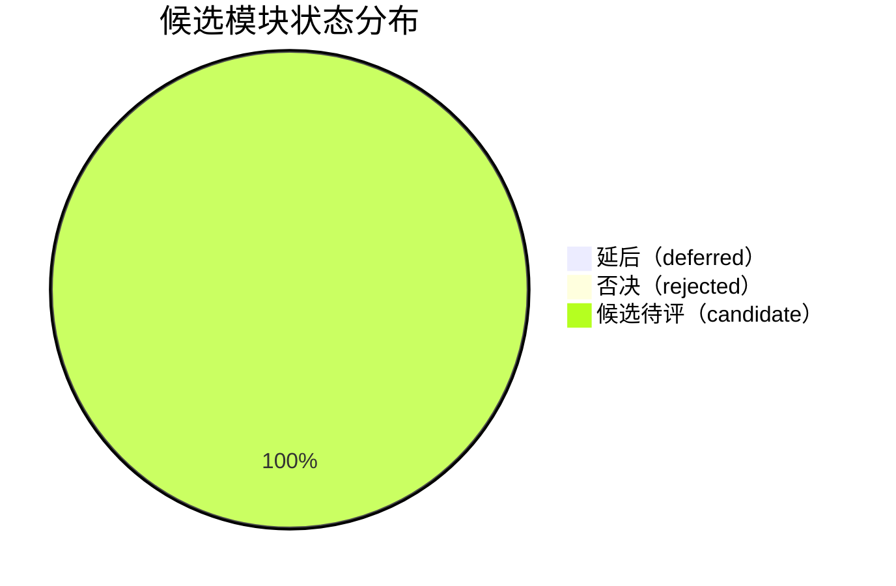
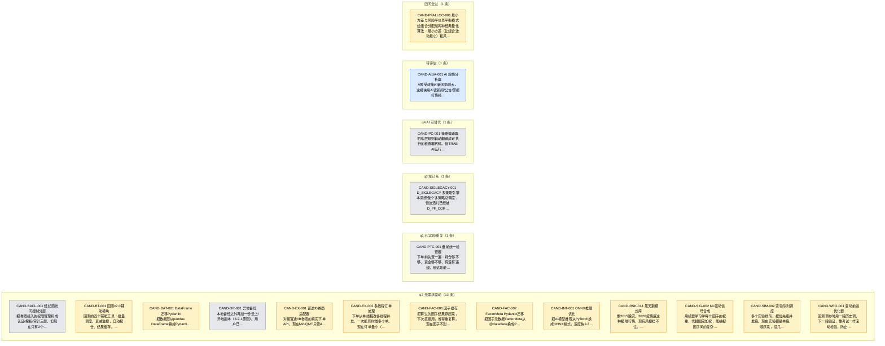

# 候选模块清单报告（索引）

> **文档作用 / Purpose**: 展示候选模块登记表中储备的未开发/过度工程候选模块清单，按状态、四问卡点、优先级、域分类，使其可检索、可定位、可追溯。与 design_vs_production 互补——后者看已进 depgraph 设计态的待开发模块，本报告看四问未全过、尚未进入设计态的储备点子。

> 本索引由 generate_candidate_module_report.py 从 candidate_module_registry.yaml 自动生成
> 最后更新以 git log 为准
> 数据源: candidate_module_registry.yaml（规则数据真源，TRAE-062：候选库是治理注册表，真源为 YAML，不进 PostgreSQL。本报告与 03_governance_reports 其他 depgraph 数据源报告不同）
> 真源文件: docs/01_policies_and_standards/_registry/catalogs/candidate_module_registry.yaml

> **分片结构**（治本 2026-08-01：单文件 5301 条卡死 IDE → 按域分文件）: 本索引含总览统计 + 全景图 + harvest 概览 + 域索引表；各域候选清单见同目录下 `{域名}.md` 文件。

## 统计概览

| 指标 / Metric | 值 / Value |
|------|-----|
| 候选总数 | 5301 |
| 涉及域数 | 37 |

### 按状态分布

| 状态 / Status | 数量 / Count | 占比 / Ratio |
|------|:---:|:---:|
| 延后（deferred） | 12 | 0.2% |
| 否决（rejected） | 5 | 0.1% |
| 候选待评（candidate） | 5284 | 99.7% |

### 按四问卡点分布

| 卡点 / Blocking | 数量 / Count | 占比 / Ratio |
|------|:---:|:---:|
| q1 已实现/重复 | 1 | 0.0% |
| q2 无需求驱动 | 13 | 0.2% |
| q3 域已死 | 1 | 0.0% |
| q4 AI 可替代 | 1 | 0.0% |
| 待评估 | 5284 | 99.7% |
| 四问全过 | 1 | 0.0% |

### 按优先级分布

| 优先级 / Priority | 数量 / Count |
|------|:---:|
| P1 | 6 |
| P2 | 5295 |

### 按域分布

| 域 / Domain | 数量 / Count |
|------|:---:|
| D_ALT_DATA | 49 |
| D_AUTONOMY_CORE | 321 |
| D_AUTONOMY_PERM | 98 |
| D_BACKTEST | 3 |
| D_COMPLIANCE | 511 |
| D_CROSS_ASSET | 45 |
| D_DATA | 1 |
| D_DATA_ENG | 93 |
| D_DATA_GOV | 19 |
| D_DATA_SEC | 3 |
| D_EX_CORE | 63 |
| D_EX_SOR | 84 |
| D_FACTOR | 199 |
| D_FRONTEND | 146 |
| D_GOVERNANCE | 337 |
| D_GOV_RULE | 1 |
| D_INFRA_OPS | 353 |
| D_INFRA_RECOVERY | 1 |
| D_INFRA_RUNTIME | 348 |
| D_INTEGRATION | 165 |
| D_INTELLIGENCE | 188 |
| D_KNOWLEDGE | 91 |
| D_MKT_DATA | 142 |
| D_ML_SERVE | 36 |
| D_ML_TRAIN | 78 |
| D_OPS | 233 |
| D_PF_ALLOC | 82 |
| D_PF_CORE | 139 |
| D_POSITION | 24 |
| D_REPORTING | 82 |
| D_RISK | 499 |
| D_SECURITY | 394 |
| D_SELL_DECISION | 27 |
| D_SIGLEGACY | 1 |
| D_SIGNAL | 323 |
| D_SIMULATION | 94 |
| D_TRADING | 28 |

## 状态说明

| 状态 | 含义 | 数量 |
|------|------|:---:|
| deferred（延后） | 四问未全过但域活着、功能有价值——等触发信号命中再重新过四问晋升到 depgraph 设计态 | 12 |
| rejected（否决） | 四问否决或用户推翻，登记仅为防误重新设计 | 5 |
| candidate（候选待评） | 四问仍在 pending，未拍板 | 5284 |

## 候选模块全景

### 状态分布

### 按四问卡点分布（受限原因 · 颜色=状态，节点含大白话简述）

> 仅展示原有候选 18 条；harvest 候选见下方「Harvest 候选概览」。

## Harvest 候选概览（场外草稿抓取）

> 从场外草稿 CSV 抓取的候选，共 5283 条，status=candidate，四问 pending 待评估。
> 去重四态（区分运营态/设计态）：likely_new(真候选) / likely_implemented(运营态已有) / likely_planned(设计态已有) / likely_misplaced(域错标已校准)。
> 各域 harvest 候选清单见同目录下对应 `{域名}.md` 文件。

### 按 likely_status 分布

| likely_status | 含义 | 数量 |
|------|------|:---:|
| likely_new | 该域 depgraph 无 path 命中，疑真候选 | 2931 |
| likely_implemented | 该域**运营态**(stable/generated)path 命中，疑已实现 | 1842 |
| likely_planned | 该域**设计态**(planned)path 命中，已在 depgraph 设计管道，勿重复登记 | 346 |
| likely_misplaced | 含 infra 通用词且域错标，已校准到 D_INFRA_RUNTIME | 71 |
| uncertain | 无法提取关键词（如纯中文能力名），待人工判定 | 93 |

### 按域分布（含域校准结果）

| 域 | 数量 |
|------|:---:|
| [D_COMPLIANCE](D_COMPLIANCE.md) | 511 |
| [D_RISK](D_RISK.md) | 497 |
| [D_SECURITY](D_SECURITY.md) | 394 |
| [D_INFRA_OPS](D_INFRA_OPS.md) | 353 |
| [D_INFRA_RUNTIME](D_INFRA_RUNTIME.md) | 348 |
| [D_GOVERNANCE](D_GOVERNANCE.md) | 337 |
| [D_SIGNAL](D_SIGNAL.md) | 322 |
| [D_AUTONOMY_CORE](D_AUTONOMY_CORE.md) | 321 |
| [D_OPS](D_OPS.md) | 233 |
| [D_FACTOR](D_FACTOR.md) | 197 |
| [D_INTELLIGENCE](D_INTELLIGENCE.md) | 187 |
| [D_INTEGRATION](D_INTEGRATION.md) | 163 |
| [D_FRONTEND](D_FRONTEND.md) | 146 |
| [D_MKT_DATA](D_MKT_DATA.md) | 142 |
| [D_PF_CORE](D_PF_CORE.md) | 139 |
| [D_AUTONOMY_PERM](D_AUTONOMY_PERM.md) | 98 |
| [D_SIMULATION](D_SIMULATION.md) | 93 |
| [D_DATA_ENG](D_DATA_ENG.md) | 93 |
| [D_KNOWLEDGE](D_KNOWLEDGE.md) | 91 |
| [D_EX_SOR](D_EX_SOR.md) | 84 |
| [D_REPORTING](D_REPORTING.md) | 82 |
| [D_PF_ALLOC](D_PF_ALLOC.md) | 81 |
| [D_ML_TRAIN](D_ML_TRAIN.md) | 78 |
| [D_EX_CORE](D_EX_CORE.md) | 61 |
| [D_ALT_DATA](D_ALT_DATA.md) | 49 |
| [D_CROSS_ASSET](D_CROSS_ASSET.md) | 45 |
| [D_ML_SERVE](D_ML_SERVE.md) | 36 |
| [D_TRADING](D_TRADING.md) | 28 |
| [D_SELL_DECISION](D_SELL_DECISION.md) | 27 |
| [D_POSITION](D_POSITION.md) | 24 |
| [D_DATA_GOV](D_DATA_GOV.md) | 19 |
| [D_DATA_SEC](D_DATA_SEC.md) | 3 |
| [D_BACKTEST](D_BACKTEST.md) | 1 |

## 域索引

> 点击域名跳转到该域的候选清单文件。

| 域 / Domain | 候选总数 | 其中 harvest | 域文件 |
|------|:---:|:---:|------|
| D_COMPLIANCE | 511 | 511 | [D_COMPLIANCE.md](D_COMPLIANCE.md) |
| D_RISK | 499 | 497 | [D_RISK.md](D_RISK.md) |
| D_SECURITY | 394 | 394 | [D_SECURITY.md](D_SECURITY.md) |
| D_INFRA_OPS | 353 | 353 | [D_INFRA_OPS.md](D_INFRA_OPS.md) |
| D_INFRA_RUNTIME | 348 | 348 | [D_INFRA_RUNTIME.md](D_INFRA_RUNTIME.md) |
| D_GOVERNANCE | 337 | 337 | [D_GOVERNANCE.md](D_GOVERNANCE.md) |
| D_SIGNAL | 323 | 322 | [D_SIGNAL.md](D_SIGNAL.md) |
| D_AUTONOMY_CORE | 321 | 321 | [D_AUTONOMY_CORE.md](D_AUTONOMY_CORE.md) |
| D_OPS | 233 | 233 | [D_OPS.md](D_OPS.md) |
| D_FACTOR | 199 | 197 | [D_FACTOR.md](D_FACTOR.md) |
| D_INTELLIGENCE | 188 | 187 | [D_INTELLIGENCE.md](D_INTELLIGENCE.md) |
| D_INTEGRATION | 165 | 163 | [D_INTEGRATION.md](D_INTEGRATION.md) |
| D_FRONTEND | 146 | 146 | [D_FRONTEND.md](D_FRONTEND.md) |
| D_MKT_DATA | 142 | 142 | [D_MKT_DATA.md](D_MKT_DATA.md) |
| D_PF_CORE | 139 | 139 | [D_PF_CORE.md](D_PF_CORE.md) |
| D_AUTONOMY_PERM | 98 | 98 | [D_AUTONOMY_PERM.md](D_AUTONOMY_PERM.md) |
| D_SIMULATION | 94 | 93 | [D_SIMULATION.md](D_SIMULATION.md) |
| D_DATA_ENG | 93 | 93 | [D_DATA_ENG.md](D_DATA_ENG.md) |
| D_KNOWLEDGE | 91 | 91 | [D_KNOWLEDGE.md](D_KNOWLEDGE.md) |
| D_EX_SOR | 84 | 84 | [D_EX_SOR.md](D_EX_SOR.md) |
| D_PF_ALLOC | 82 | 81 | [D_PF_ALLOC.md](D_PF_ALLOC.md) |
| D_REPORTING | 82 | 82 | [D_REPORTING.md](D_REPORTING.md) |
| D_ML_TRAIN | 78 | 78 | [D_ML_TRAIN.md](D_ML_TRAIN.md) |
| D_EX_CORE | 63 | 61 | [D_EX_CORE.md](D_EX_CORE.md) |
| D_ALT_DATA | 49 | 49 | [D_ALT_DATA.md](D_ALT_DATA.md) |
| D_CROSS_ASSET | 45 | 45 | [D_CROSS_ASSET.md](D_CROSS_ASSET.md) |
| D_ML_SERVE | 36 | 36 | [D_ML_SERVE.md](D_ML_SERVE.md) |
| D_TRADING | 28 | 28 | [D_TRADING.md](D_TRADING.md) |
| D_SELL_DECISION | 27 | 27 | [D_SELL_DECISION.md](D_SELL_DECISION.md) |
| D_POSITION | 24 | 24 | [D_POSITION.md](D_POSITION.md) |
| D_DATA_GOV | 19 | 19 | [D_DATA_GOV.md](D_DATA_GOV.md) |
| D_BACKTEST | 3 | 1 | [D_BACKTEST.md](D_BACKTEST.md) |
| D_DATA_SEC | 3 | 3 | [D_DATA_SEC.md](D_DATA_SEC.md) |
| D_SIGLEGACY | 1 | 0 | [D_SIGLEGACY.md](D_SIGLEGACY.md) |
| D_GOV_RULE | 1 | 0 | [D_GOV_RULE.md](D_GOV_RULE.md) |
| D_INFRA_RECOVERY | 1 | 0 | [D_INFRA_RECOVERY.md](D_INFRA_RECOVERY.md) |
| D_DATA | 1 | 0 | [D_DATA.md](D_DATA.md) |
