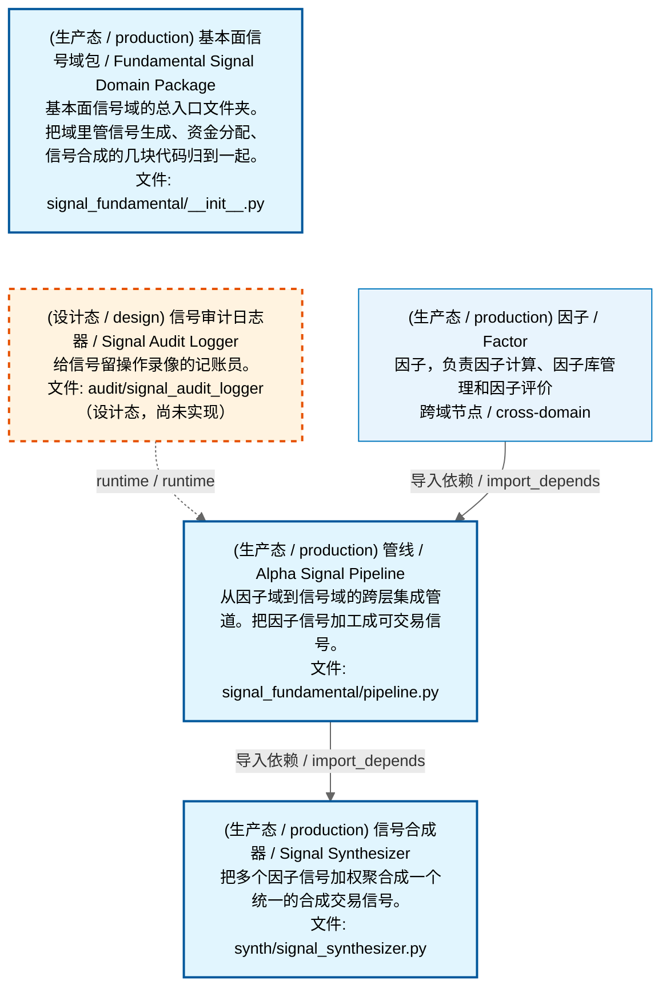

# 可视化视图模板规范（三视图 + 可缩放 HTML）

> **版本**：V1.6 | 2026-08-07
> **读者**：项目 Owner + AI 开发 Agent + 架构治理人员
> **写法**：大白话为主，配完整代码模板和验收清单。变更历史见 git log。

> **文档责任范围**：本文档定义 ZephyrAlpha 项目所有"依赖类可视化视图"的统一模板规范——
> 包括域架构文档的三视图、全景图（依赖路径全景图、交易流全景图等）的可视化呈现。
> 任何需要用 Mermaid 依赖图 + 可缩放 HTML 展示模块/域/流程关系的文档，**必须遵循本模板**。
> 实现真源：`scripts/governance/d5_architecture/generators/generate_domain_doc.py`（生成器）+
> `scripts/governance/d5_architecture/generators/zoomable_html.py`（HTML 生成器）。

---

## 一、为什么需要这个模板？

AI 开发有个老毛病：每个 AI 对话各画各的图，颜色不一样、节点格式不一样、有的能缩放有的不能、有的有中文名有的只有英文。

**本模板解决**：把"怎么画依赖图"固化成一套标准，后面所有全景图、域文档、流程图的可视化都照着做，保证：

| 要保证的事 | 怎么保证 |
|-----------|---------|
| **看得到** | MD 里内嵌 Mermaid（IDE 直接渲染）+ HTML 网页版（Ctrl+滚轮无限缩放）双产物 |
| **看得懂** | 每个节点都有中文名 + 英文名 + 大白话简介 + 文件路径，四要素齐全 |
| **分得清** | 运营态（蓝色实线）、设计态（橙色虚线）颜色区分，一眼看出哪些已造哪些没造 |
| **能跳转** | MD 顶部有 HTML 链接，点开就是可交互网页 |
| **统一风格** | 灰色主题 + 拓扑分层竖排 + 统一图例，所有图长一个样 |

---

## 二、总体架构：MD + HTML 双产物

每份可视化文档产出**两个文件**：

```
docs/…/你的文档.md                    ← MD（内嵌 Mermaid，IDE 可渲染）
docs/…/_zoomable_html/你的文档.html   ← HTML（浏览器打开，可缩放交互）
```

- **MD 文件**：给人快速浏览，IDE（如 VS Code）能直接渲染 Mermaid 图。MD 里渲染失败可以接受。
- **HTML 文件**：给需要看细节的人，浏览器打开后可以 Ctrl+滚轮无限缩放、拖动平移。**HTML 里必须渲染成功**。
- **关系**：MD 生成后**联动生成** HTML，输出到 MD 同级目录的 `_zoomable_html/` 子文件夹。
- **链接**：MD 顶部放 HTML 的访问链接，点击直接跳转到网页版。

### 2.1 产物生成流程

```
数据源(depgraph DB) → generate_domain_doc.py → .md 文件
                                           → zoomable_html.emit_zoomable_html() → _zoomable_html/.html
```

- 生成器从 `depgraph` (PostgreSQL) 读取 nodes + edges。
- 节点标签数据从 `module_translation_registry.yaml`（翻译真源）读取中英文名和大白话。
- 生成 MD 后自动调用 `emit_zoomable_html()` 生成 HTML，无需手动两步。

---

## 三、MD 文档结构规范

一份完整的可视化 MD 文档**必须包含以下章节**，顺序固定：

### 3.1 完整骨架

```markdown
---
doc_type: architecture_view
title: <域中文名 / Panorama Name> 架构文档
version: "1.0"
status: active
date: 2026-08-01
owner: auto-generator
ttl: permanent
---

# <编号>_<域名小写> / <域中文名> / <域英文名>

> **功能简介 / Overview**: <域功能描述>

> **文档作用 / Purpose**: 展示 <域中文名>（<DOMAIN_ID>）功能域的域内依赖关系、跨域依赖关系，
> 模块信息（成熟度/中英文名/大白话/文件路径）内嵌于 Mermaid 节点，供架构审查和域治理参考。

> 本文档由 generate_domain_doc.py 从 depgraph (PostgreSQL) 自动生成
> 数据源: depgraph (PostgreSQL) nodes表 + edges表

> **[可缩放 HTML 版 / Zoomable HTML](http://localhost:8765/<路径>/_zoomable_html/<文件名>.html)**
> — Ctrl+滚轮缩放 ｜ 双击重置 ｜ Ctrl+Shift+D 切换拖动/选择模式

## 域基本信息 / Domain Overview

| 字段 | 值 | Field | Value |
|------|------|-------|-------|
| 编号 | <N> | Number | <N> |
| 域ID | <DOMAIN_ID> | Domain ID | <DOMAIN_ID> |
| 域名称 | <中文名> | Domain Name | <English> |
| ...（模块数/依赖数/设计态/生产态/容量/描述）... | | | |

## 域内依赖图 / Internal Dependency Diagram

> 依赖图内嵌在本文档中，IDE 可直接渲染；网页版可 Ctrl+滚轮缩放 + 拖动平移查看细节。
>
> **图例说明 / Legend**：
> - 🟦 **蓝色 = 运营态模块**（production，已上线运行）
> - 🟧 **橙色虚线 = 设计态模块**（design，蓝图阶段，代码未写）
> - **实线箭头 = 运营态依赖**（已生效的依赖关系）
> - **虚线箭头 = 非运营态依赖**（计划中/验证中的依赖关系）

### 全景图（全部模块，颜色区分运营态/设计态）

> 展示全部 <N> 个模块（生产态 <P> + 设计态 <D>），含跨域依赖外部节点。节点含成熟度+名称+大白话/简介+文件路径。

```mermaid
<Mermaid 代码>
```

### 运营态的图（仅 design_maturity=production 的模块和域内依赖）

> 仅展示已上线运行的模块（共 <P> 个），不含跨域外部节点。跨域依赖见下方跨域依赖章节。

```mermaid
<Mermaid 代码>
```

### 设计态的图（仅 design_maturity=design 的模块和域内依赖）

> 仅展示蓝图阶段、代码未写的设计态模块（共 <D> 个），不含跨域外部节点。

```mermaid
<Mermaid 代码>
```

## 跨域依赖 / Cross-domain Dependencies

### 本域依赖的其他域（出边）/ Depends On
（表格：本域模块 → 外部域目标模块 + 依赖类型）

### 依赖本域的其他域（入边）/ Dependents
（表格：外部域源模块 → 本域模块 + 依赖类型）
```

### 3.2 三视图铁律

> **铁律**：三视图顺序固定为 **全景图 → 运营态的图 → 设计态的图**，每个图必须有 `### 小标题`，禁止分页标注页数。

| 视图 | 标题格式 | 内容 | 跨域节点 |
|------|---------|------|---------|
| **全景图** | `### 全景图（全部模块，颜色区分运营态/设计态）` | 全部模块（production + design）+ 全部域内依赖 + 跨域外部节点 | ✅ 含 |
| **运营态图** | `### 运营态的图（仅 design_maturity=production 的模块和域内依赖）` | 仅 production 模块 + production↔production 依赖 | ❌ 不含 |
| **设计态图** | `### 设计态的图（仅 design_maturity=design 的模块和域内依赖）` | 仅 design 模块 + design↔design 依赖 | ❌ 不含 |

**空视图处理**：某视图无模块时，不输出空 Mermaid 块，改用占位说明：

```markdown
### 设计态的图（仅 design_maturity=design 的模块和域内依赖）

> （无模块 / No modules）
```

---

## 四、Mermaid 代码规范

### 4.1 主题头（必须，固定）

每个 Mermaid 代码块**第一行**必须是灰色主题初始化：

```mermaid
%%{init: {'theme': 'base', 'themeVariables': {'primaryColor': '#eaeaea', 'primaryTextColor': '#333333', 'primaryBorderColor': '#666666', 'lineColor': '#666666', 'secondaryColor': '#eaeaea', 'tertiaryColor': '#eaeaea', 'fontSize': '14px'}}}%%
```

> 灰色主题让节点背景统一为浅灰（`#eaeaea`），状态色（蓝/橙）通过 classDef 覆盖，两者协调不冲突。

### 4.2 图类型（固定 flowchart TD）

```mermaid
flowchart TD
```

- **TD（Top-Down）**：从上到下竖排，强制拓扑分层。
- **禁止用 LR**（左到右）——竖排才能看清依赖链路从上层到下层流动。

### 4.3 节点定义格式

#### 域内节点（四要素 + 设计态第五行 ⛔ 受限原因，`<br/>` 分隔）

```
    <节点ID>["(成熟度) 中文名 / English<br/>大白话简介<br/>文件: 父目录/文件名"]
```

**设计态节点**（`design_maturity=design` 且 DB `gate_reason` 非空）追加第五行：

```
    <节点ID>["(设计态 / design) 中文名 / English<br/>大白话简介<br/>文件: 父目录/文件名<br/>⛔ 受限原因"]
```

**完整示例**：

```
    src_zephyr_signal_fundamental_pipeline_py["(生产态 / production) 管线 / Alpha Signal Pipeline<br/>从因子域到信号域的跨层集成管道。把因子信号一路加工成可交易信号，是整个信号生成流程的总调度。<br/>文件: signal_fundamental/pipeline.py"]
    src_zephyr_pf_alloc_signal_synthesis_combiner_py["(设计态 / design) 信号合成合并器 / signal_synthesis_combiner<br/>信号合成合并器（signal_synthesis_combiner.py）<br/>文件: pf_alloc/signal_synthesis_combiner.py<br/>⛔ 组合分配域，设计已就绪，等待开发排期"]
```

**四要素说明**：

| 要素 | 格式 | 来源 | 示例 |
|------|------|------|------|
| ① 成熟度 | `(生产态 / production)` 或 `(设计态 / design)` | DB `design_maturity` 字段 | `(生产态 / production)` |
| ② 双语名称 | `中文名 / English` | 翻译真源 `name_zh` + `name_en` | `管线 / Alpha Signal Pipeline` |
| ③ 大白话 | 日常语言说"做什么/解决什么" | 翻译真源 `plain_zh` | `从因子域到信号域的跨层集成管道...` |
| ④ 文件路径 | `文件: 父目录/文件名` | 节点 `path` 取最后两段 | `文件: signal_fundamental/pipeline.py` |
| ⑤ ⛔ 受限原因 | `⛔ <gate_reason>`（仅设计态+非空） | DB `nodes.gate_reason` 字段 | `⛔ 受限：需Level-2逐笔成交数据(GATE-27-01)` |

> **四要素铁律**：每个节点必须有中文名 + 大白话简介。禁止只有英文名无中文，禁止只有名字无简介。

> **⛔ 受限原因铁律**：设计态节点的 `gate_reason` 非空时**必须**显示 ⛔ 行。
> 这是"为什么这个设计没施工"的唯一可见出口——不显示的话，未来看到设计态模块就会反复问
> "这东西为什么没做"，造成误判（以为是漏了，实际是受限暂缓）。受限原因消失（条件满足）时
> 由数据侧清空 `gate_reason`，⛔ 行自动消失，生成器无需改动。

#### 跨域外部节点（代表"另一个域"）

```
    <域ID>["(成熟度) 域中文名 / Domain English<br/>域功能简介<br/>跨域节点 / cross-domain"]
```

**示例**：

```
    D_FACTOR["(生产态 / production) 因子 / Factor<br/>因子，负责因子计算、因子库管理和因子评价<br/>跨域节点 / cross-domain"]
```


#### 作战地图节点格式（【】包裹 + 成熟度放最后，2026-08-03 V1.5）

作战地图（battle_map）的节点标签格式与域文档**不同**，采用【】包裹中英文名、
成熟度放最后、⛔受限原因放最前的顺序，便于快速识别环节身份：

```
    <节点ID>["⛔ 受限原因（仅设计态+gate_reason非空）<br/>【step_id 中文名】<br/>大白话简介<br/>(成熟度 / maturity)<br/>acquisition徽标（可选）<br/>标记（⚠无锚点 / 🟡候选承载，可选）<br/>【English Name】"]
```

**行顺序铁律**（从上到下）：

| 行序 | 内容 | 必填 | 说明 |
|------|------|------|------|
| ① | `⛔ 受限原因` | 可选 | 仅设计态+`gate_reason`非空时显示，**放最前面** |
| ② | `【step_id 中文名】` | 必填 | step_id + 中文名，用【】包裹 |
| ③ | 大白话简介 | 必填 | 日常语言说"做什么" |
| ④ | `(成熟度 / maturity)` | 必填 | 五态之一：生产态/设计态/弃用态/缺失态/候选态 |
| ⑤ | acquisition 徽标 | 可选 | `（🔴自建）`/`（🟢开源）`/`（🟡借鉴）`/`（⬜弃用）`，仅设计态有 depgraph 锚点的环节显示（§4.13） |
| ⑥ | 标记 | 可选 | `⚠无锚点` / `🟡候选承载` / `🟧设计态子环节` |
| ⑦ | `【English Name】` | 可选 | 英文名，用【】包裹，**放最后** |

> **阶段标识说明**：节点标签中**不显示**环节所属 flow_stage（如"买入阶段 / buy_flow"），
> 因为文档标题已标明阶段（如 `battle_map_02_buy_flow.md`），图内每个节点都属同一阶段，
> 重复显示无信息量。阶段信息仅在详情表格中保留。

**完整示例**：

```
    BM_BUY_02["【BM-BUY-02 四轨融合】<br/>把逻辑驱动、数据驱动、人工指令、应急保命四路信号<br/>按优先级融成一条决策流——应急永远最优先。<br/>(生产态 / production)<br/>【Four-Track Fusion (MTF)】"]
    BM_BUY_05["⛔ 卖出决策域，设计已就绪，等待开发排期<br/>【BM-BUY-05 做T日内套利】<br/>A股T+1约束下的日内套利——每天扫全部持仓...<br/>(设计态 / design)<br/>（🔴自建）<br/>【Intraday T+0 Arbitrage】"]
    BM_MT_01["⛔ ML训练域，设计已就绪，等待开发排期<br/>【BM-MT-01 训练流水线】<br/>把研究出的因子和特征喂给模型训练...<br/>(设计态 / design)<br/>（🟡借鉴）<br/>【Training Pipeline】"]
```

> **【】括号说明**：中英文名用全角【】包裹，视觉上突出环节身份。Mermaid 节点标签用双引号
> 包裹时，全角【】是纯文本字符不会与节点语法冲突（§4.9 转义规则仅针对半角 `[]`）。
> 若【】不显示，可替换为 `〔〕` / `『』` / `「」` / `〖〗` / `《》`。

> **与域文档格式的区别**：域文档节点是"成熟度在最前 + 文件路径在最后"（§4.3 域内节点格式），
> 作战地图节点是"⛔在最前 + 成熟度在最后 + 英文名在最后"。两者不混用——域文档用域文档格式，
> 作战地图用作战地图格式。

### 4.4 节点 ID 规范

节点 ID 由文件路径转换而来（`sanitize_node_id`）：

- 只保留字母、数字、下划线，其他字符替换为 `_`
- 连续 `_` 合并为一个，首尾 `_` 去除
- 跨域节点 ID 直接用域 ID（如 `D_FACTOR`、`D_TRADING`）
- 同名 ID 冲突时追加 `_1`、`_2` 后缀

**示例**：`src/zephyr/signal_fundamental/pipeline.py` → `src_zephyr_signal_fundamental_pipeline_py`

### 4.5 边定义格式

#### 域内依赖边

```
    <from_ID> <箭头>|<依赖类型>| <to_ID>
```

**箭头规则**：

| 箭头 | 含义 | 条件 |
|------|------|------|
| `-->` | 实线箭头 = 运营态依赖 | from 和 to **都是** production |
| `-.->` | 虚线箭头 = 非运营态依赖 | 其他情况（含 design、混合） |

**依赖类型**（中英双语）：

| dep_type | 显示 |
|----------|------|
| `import_depends` | `导入依赖 / import_depends` |
| `test_depends` | `测试依赖 / test_depends` |
| `contract_depends` | `契约依赖 / contract_depends` |
| `event_depends` | `事件依赖 / event_depends` |

**示例**：

```
    src_zephyr_signal_fundamental_pipeline_py -->|导入依赖 / import_depends| src_zephyr_signal_fundamental_synth_signal_synthesizer_py
    src_zephyr_signal_fundamental_router_signal_priority_router_py -.->|runtime / runtime| src_zephyr_signal_fundamental_router_signal_conflict_resolver_py
```

#### 跨域边

跨域出边（本域 → 外部域）和入边（外部域 → 本域）格式相同：

```
    <本域节点ID> <箭头>|<依赖类型>| <外部域ID>
    <外部域ID> <箭头>|<依赖类型>| <本域节点ID>
```

### 4.6 拓扑分层（强制竖排）

为了让图从上到下分层流动（而非 dagre 默认的横向铺开），使用 **Kahn 算法**计算拓扑层级，同层节点用**不可见边 `~~~`** 串联强制同 rank：

```
    <节点A> ~~~ <节点B>
    <节点B> ~~~ <节点C>
```

- layer 0 = 入度为 0 的节点（最上层）
- layer(node) = max(layer(前驱)) + 1
- 环内节点统一放最大层 + 1
- 同层节点横向排列，层间纵向流动

### 4.7 classDef 样式定义（域文档四类 + 作战地图五态）

域文档每个 Mermaid 图**末尾**必须定义四类样式（作战地图扩展为五态，见下方注释）：

```
    classDef production fill:#e1f5fe,stroke:#01579b,stroke-width:2px,color:#000
    classDef design fill:#fff3e0,stroke:#e65100,stroke-width:2px,color:#000,stroke-dasharray: 5 5
    classDef external_prod fill:#e8f4fd,stroke:#0277bd,stroke-width:1px,color:#000
    classDef external_design fill:#fff8e7,stroke:#ef6c00,stroke-width:1px,color:#000,stroke-dasharray: 5 5
```

| 类名 | 颜色 | 含义 | 边框 |
|------|------|------|------|
| `production` | 浅蓝填充 `#e1f5fe` + 深蓝边框 `#01579b` | 运营态域内节点 | 2px 实线 |
| `design` | 浅橙填充 `#fff3e0` + 深橙边框 `#e65100` | 设计态域内节点 | 2px **虚线**（`stroke-dasharray: 5 5`） |
| `external_prod` | 更浅蓝 `#e8f4fd` + 中蓝边框 `#0277bd` | 运营态跨域节点 | 1px 实线（更细，区分内外） |
| `external_design` | 更浅橙 `#fff8e7` + 中橙边框 `#ef6c00` | 设计态跨域节点 | 1px **虚线** |

> **作战地图 5 态扩展**（`generate_battle_map_diagram.py`）：域文档用上述 4 类 classDef；
> 作战地图在此基础上**替换为 5 态**（panorama §九），适配"环节↔模块"五态生命周期：
>
> ```
> classDef production  fill:#e1f5fe,stroke:#01579b,stroke-width:2px,color:#000
> classDef design      fill:#fff3e0,stroke:#e65100,stroke-width:2px,color:#000,stroke-dasharray: 5 5
> classDef deprecated  fill:#ffebee,stroke:#c62828,stroke-width:2px,color:#000
> classDef missing     fill:#eeeeee,stroke:#9e9e9e,stroke-width:2px,color:#000
> classDef candidate   fill:#fffde7,stroke:#f9a825,stroke-width:2px,color:#000,stroke-dasharray: 5 5
> ```
>
> | 状态 | 颜色 | 含义 | 推导来源 |
> |------|------|------|---------|
> | `production` | 浅蓝 | 运营态（锚点模块 stable/generated/testing） | depgraph `build_status` |
> | `design` | 浅橙虚线 | 设计态（锚点模块 planned） | depgraph `build_status` |
> | `deprecated` | 浅红 | 弃用态 | depgraph `build_status=deprecated` |
> | `missing` | 浅灰 | 缺失态（环节无锚点，BM-INV-001 违例） | 无锚点 |
> | `candidate` | 浅黄虚线 | 候选态（承载模块在候选池） | `battle_map_anchors.target_graph=candidate` |
>
> 状态推导优先级：primary depgraph 锚点 > 其他 depgraph 锚点 > candidate 锚点 > missing。

### 4.8 class 应用（把样式绑到节点）

```
    class <节点ID1>,<节点ID2>,... production
    class <节点ID3>,<节点ID4>,... design
    class <外部域ID1>,<外部域ID2>,... external_prod
    class <外部域ID3>,... external_design
```

> 按 `design_maturity` 字段分组：production 节点绑 `production` 类，其他绑 `design` 类；跨域节点同理按成熟度绑 `external_prod` 或 `external_design`。

### 4.9 标签特殊字符转义

Mermaid 标签中的特殊字符必须替换（`_sanitize_mermaid_label`）：

| 原字符 | 替换为 | 原因 |
|--------|--------|------|
| `[` | `（` | 方括号会破坏 Mermaid 节点语法，替换为全角括号 |
| `]` | `）` | 同上 |
| `(` | `（` | 半角括号在边标签 `\|...\|` 中被 Mermaid 误解析为节点形状（如 `node(text)`），导致 Parse error |
| `)` | `）` | 同上 |
| `"` | `'` | 双引号会闭合节点标签 |
| `\|` | `/` | 管道符会破坏边标签语法 |

### 4.10 标签预折行铁律（防文字被节点框裁剪，2026-08-01 治本）

> **这是历史上反复踩坑、多个 AI 都做错的一条，务必逐字理解。**

**症状**：HTML 里节点文字被框**上下裁掉**（最后一行只显示一半），或英文词被拦腰截断错位
（如 `multi_strategy_capital_allocato r`）。

**根因（第一性原理）**：Mermaid 渲染节点时，先**测量标签文本的行数**算出节点框的宽高，
再画框、再填文字。如果生成端把整段长文本塞进一行，指望 HTML 渲染层的 CSS `max-width`
去折行——那么 Mermaid 测量时数到 1 行、最终渲染时 CSS 折成 3 行，**渲染行数 > 测量行数，
框高不够，文字就被裁掉**。CSS 折行发生在 Mermaid 量完框之后，永远无法影响框的大小。

**治本铁律**：**所有节点标签的每一行，在生成端就必须用 `_wrap_label_text()` 预折行**
（`<br/>` 显式断行），禁止把"超过约 24 个汉字宽度"的文本整段放进一行。
预折行后，Mermaid 测量到的行数 = 最终渲染行数，框高永远算得准。

```python
# generate_domain_doc.py 真源实现（完整可复制，其他生成器直接复用）
def _wrap_label_text(text: str, max_units: int = 48) -> str:
    """将长节点标签文本按显示宽度预折行（Mermaid 节点内显示用）。

    折行规则：显示宽度（CJK=2/ASCII=1）超 max_units 断行（48 ≈ 24 个汉字）；
    优先在空格/下划线之后、左括号/斜杠之前软断（保持英文词完整），否则硬断。
    """
    if not text:
        return ""
    lines: list[str] = []
    remaining = text.strip()
    while remaining:
        width = 0
        cut = 0
        soft = -1  # 软断点（断在空格/_之后，或（(/之前）
        for i, ch in enumerate(remaining):
            u = 2 if ord(ch) > 0x2E7F else 1
            if width + u > max_units:
                break
            width += u
            cut = i + 1
            if ch in " _":
                soft = i + 1
            elif ch in "（(/":
                soft = i if i > 0 else -1
        if cut >= len(remaining):
            lines.append(remaining)
            break
        if soft >= 8:  # 软断点至少留 8 单位，避免碎片行
            cut = soft
        line = remaining[:cut].rstrip()
        if line:
            lines.append(line)
        remaining = remaining[cut:].lstrip(" ")
    return "<br/>".join(lines)

# 用法：节点标签的每一行都过一遍，再用 <br/> 拼接
label = "<br/>".join(_wrap_label_text(p) for p in parts)
```

> **其他生成器注意**（如 `generate_battle_map_diagram.py` 等）：把上面函数**原样复制**到自己的
> 生成器里，节点标签每一行都过 `_wrap_label_text()`。不要自己发明折行逻辑，也不要省略
> 软断点规则——`multi_strategy_capital_allocato r` 这种英文词拦腰截断就是硬断造成的。

**配套 CSS 纪律**（zoomable_html.py）：

| 配置 | 值 | 纪律 |
|------|-----|------|
| 主题 `fontSize`（init 主题头） | `14px` | 这是**测量字号**——Mermaid 按它量框 |
| CSS `font-size`（渲染字号） | `11px` | 必须**小于**测量字号 → 渲染比测量更窄更矮，只可能宽松、不可能溢出 |
| CSS `max-width` | `560px` | 仅异常兜底。预折行正常约 ≤260px，**远低于 560px 不触发二次折行**；若调小到会触发二次折行的值，裁剪问题立刻复发 |

> **铁律一句话**：折行只能发生在**生成端**（`<br/>`），CSS 只负责"不溢出"，
> 绝不能让 CSS 决定折行位置。渲染字号必须 ≤ 测量字号。

**自查方法**：生成的 HTML 里任意节点，数它的 `<br/>` 段数，应等于浏览器里实际显示的行数。
若实际行数更多 → 说明有长行漏了预折行，或 CSS max-width 被调太小。

### 4.11 节点标签简介质量铁律（2026-08-02 治本）

> **这是和 §4.10 预折行同等重要的铁律。** 预折行解决"文字被裁剪"的显示问题；
> 本铁律解决"简介本身就是坏值"的内容问题——显示再完美，内容是垃圾照样看不懂。

**一句话铁律**：每个节点的 `plain_zh` 必须用日常语言回答三问——**是什么 / 干什么 / 解决什么问题**，
且不以模块名开头（避免被前缀剥离逻辑切成残句）。

**五类坏简介**（生成器能过滤但无法自动修复，必须人工补齐）：

| 坏类型 | 症状 | 反例 |
|--------|------|------|
| ① 模板话 | 多模块共用一句模板 | `IO的控制器，协调组件按流程执行` |
| ② 截断代码片段 | docstring 被错误截取 | `<path> <head>``。在 Windows 14 万文件` |
| ③ 消费者引用 | 只说给谁用不说干什么 | `审批，供zephyr.governance.services.ada使用` |
| ④ 技术术语堆砌 | 英文+编号无中文说明 | `SLO契约。SLO-Driven Escalation Contract — D-022-12.` |
| ⑤ 名称重复 | plain_zh == name_zh | name=`审批`，plain=`审批` |

> 生成器有自动兜底链（`plain_zh → desc_zh → docstring → 路径派生`）和五道过滤
> （`_is_placeholder` / `is_generic_plain_zh` / `is_generic_plain_suffix` /
> `_is_name_plus_trivial` / `_clean_intro_text`），但**只能过滤坏值+派生唯一值，
> 不能凭空写出好简介**。坏简介的根治只能靠人工读源码后写入 YAML 真源。
> **完整规范、正反例、审计脚本、补齐 SOP 见 §十七。**

---


### 4.12 父子嵌套关系（仅作战地图，2026-08-03 V1.5）

> **适用范围铁律**：父子嵌套（subgraph + 嵌套边）**仅适用于作战地图（battle_map）**，
> 其他四个全景图（依赖全景图、数据流全景图、决策流全景图、域文档三视图）**不使用**此机制。
> 原因：作战地图的"环节"是复合结构（如"四轨融合"由4个子轨组成），需要父子层级表达；
> 其他全景图的节点是扁平的模块/实体，无嵌套需求。

#### 4.12.1 数据模型

`battle_map_steps` 表新增两字段（V0.4.0）：

| 字段 | 类型 | 说明 |
|------|------|------|
| `parent_step_id` | TEXT FK | 父环节 step_id，NULL=根环节 |
| `depth` | INTEGER | 层级深度，0=根 / 1=子 / 2=孙 / 3=曾孙（上限3，V0.6.0 扩展） |

#### 4.12.2 Mermaid 渲染规则

有子环节的父环节用 **subgraph** 包裹，子环节在 subgraph 内渲染，父→子用**虚线嵌套边**连接：

```
    subgraph sg_<父ID> ["父环节名"]
        <父ID>["节点标签..."]
        <子ID_1>["节点标签..."]
        <子ID_2>["节点标签..."]
        <父ID> -.->|嵌套| <子ID_1>
        <父ID> -.->|嵌套| <子ID_2>
    end
```

**两类边视觉区分**（图大了也能一眼看出关系类型）：

| 边类型 | 箭头 | 标签 | 含义 | 适用 |
|--------|------|------|------|------|
| 数据流边 | `-->` 实线 | `数据流 / data_flow` 等 | 环节间流转 | 所有图 |
| 嵌套边 | `-.->` 虚线 | `嵌套` | 父子组成关系 | **仅作战地图** |

**完整示例**：

```
    subgraph sg_BM_BUY_02 ["四轨融合"]
        BM_BUY_02["【BM-BUY-02 四轨融合】<br/>把逻辑驱动、数据驱动、人工指令、应急保命四路信号...<br/>(生产态 / production)<br/>【Four-Track Fusion (MTF)】"]
        BM_BUY_02_A["【BM-BUY-02-A 逻辑驱动轨】<br/>四轨融合的第一轨——基于8态预测和策略库算出的自动买入预案...<br/>(生产态 / production)<br/>【Logic-Driven Track】"]
        BM_BUY_02_B["【BM-BUY-02-B 数据驱动轨】<br/>四轨融合的第二轨——AI Discovery实时从数据中发现机会...<br/>(生产态 / production)<br/>【Data-Driven Track (AI Discovery)】"]
        BM_BUY_02 -.->|嵌套| BM_BUY_02_A
        BM_BUY_02 -.->|嵌套| BM_BUY_02_B
    end
```

#### 4.12.3 子环节状态继承

子环节通常无独立锚点（锚点挂在父环节上）。生成器对齐器豁免子环节的孤儿检查
（父环节有锚点则子环节不算孤儿），生成器着色时子环节**继承父环节的 `_effective_status`**
（如父=production，子也=production，不显示"⚠无锚点"）。父环节状态变化时子环节自动跟随。

#### 4.12.4 不变量 BM-INV-006

| 不变量 | 规则 | 校验点 |
|--------|------|--------|
| 父环节存在 | `parent_step_id` 必须指向已存在的 step | `apply_battle_map.py` 写入时校验 |
| 同阶段嵌套 | 子环节 `flow_stage` 必须与父一致（防跨阶段嵌套） | `apply_battle_map.py` 写入时校验 |
| depth 上限 | `depth ≤ 3`（根→子→孙→曾孙） | `align_battle_map.py` 检测 |
| 无环 | parent 链不能成环（A→B→A） | `align_battle_map.py` 检测 |
| depth 一致 | `depth` 值与 parent 链长度一致 | `align_battle_map.py` 检测 |

> **实现真源**：`generate_battle_map_diagram.py` 的 `_build_children_map()` +
> `_emit_nodes_with_subgraphs()` 函数；`align_battle_map.py` 的
> `_check_parent_child_consistency()` 函数。

### 4.13 acquisition 徽标（作战地图专属，2026-08-07 V1.6）

> **适用范围**：仅作战地图（battle_map）。域文档/依赖全景图不显示 acquisition 徽标
> （域文档节点是已建模块，无"怎么搞到手"问题）。

#### 4.13.1 什么是 acquisition 徽标

每个设计态环节在节点卡成熟度行 `（设计态 / design）` 下方显示一个 acquisition 徽标，
回答"这个模块怎么搞到手"——AI 施工时一眼就知道该找开源还是自己造：

| 徽标 | acquisition_method | 大白话 | 数据来源 |
|------|-------------------|--------|---------|
| `（🔴自建）` | `self_build` | 自己车间造（核心 alpha / A 股特色 / 合规硬约束） | depgraph `nodes_metadata.acquisition_method` |
| `（🟢开源）` | `opensource` | 网上有现成货，搬来直接用 | 同上 |
| `（🟡借鉴）` | `borrow` | 自建为主，局部复用开源组件 | 同上 |
| `（⬜弃用）` | `deprecate` | 暂不做 | 同上 |

> **半角→全角**：徽标定义用半角 `[]`（如 `[🔴自建]`），经 `_sanitize` 转义后显示为全角
> `（🔴自建）`（§4.9 转义规则：`[`→`（`、`]`→`）`）。emoji 不受转义影响，正常显示。

#### 4.13.2 显示规则

| 环节状态 | 显示徽标？ | 原因 |
|---------|-----------|------|
| **设计态**（design，有 depgraph 锚点） | ✅ 显示 | 施工前必须知道"怎么搞到手" |
| **生产态**（production） | ❌ 不显示 | 已建成，acquisition 已完成 |
| **弃用态**（deprecated） | ✅ 显示（⬜弃用） | 标明弃用决策 |
| **缺失态**（missing，无锚点） | ❌ 不显示 | 无锚点模块，acquisition 未定义 |
| **候选态**（candidate） | ❌ 不显示 | 候选池 acquisition 存于 YAML 不上图 |

> **设计依据**：acquisition 是模块级属性（depgraph `nodes_metadata`），不是步骤级。
> 运营态模块已施工完成，acquisition 自然不需要；候选态 acquisition 存于
> `candidate_module_registry.yaml`（候选池草稿层），晋升到设计态时迁移到 depgraph。

#### 4.13.3 详情区"获取方式"行

除节点卡内的徽标外，每个环节的详情区（`### BM-xxx` 小节）标题下方还有一行
**完整 acquisition 标记**（不带 source 详情，避免污染展示层）：

```markdown
### BM-MT-01 训练流水线 / Training Pipeline

> **大白话**：把研究出的因子和特征喂给模型训练...

> **获取方式**：[🟡借鉴]

**机制说明**：
...
```

> 完整 acquisition_source（如 `Kedro / PyTorch Lightning`）不渲染到展示层，
> 存于 depgraph `nodes_metadata.acquisition_source` 字段，可通过
> `apply_depgraph.py --update-module-metadata` 查询/修改。

#### 4.13.4 数据真源与写入方式

| 层级 | 真源 | 字段 | 写入方式 |
|------|------|------|---------|
| **设计态**（depgraph） | PostgreSQL `nodes_metadata` | `acquisition_method` + `acquisition_source` | `apply_depgraph.py --update-module-metadata <path> acquisition_method=xxx acquisition_source=yyy` |
| **候选态**（candidate pool） | `candidate_module_registry.yaml` | `acquisition_method` + `acquisition_source` | YAML 直接编辑（草稿层，可随意修改） |
| **晋升**（候选→设计态） | 候选 YAML → depgraph | 字段迁移 | `apply_depgraph.py --add-design-node` 后跟 `--update-module-metadata` |

> **分层 SSoT**：候选池是工作草稿（可随意修改），设计态是施工真源（AI 施工前必读）。
> 运营态不加 acquisition——已施工完成，自然不需要。

> **实现真源**：`generate_battle_map_diagram.py` 的 `_node_label()` 函数（节点卡徽标）+
> `_format_step_detail()` 函数（详情区"获取方式"行）+ `_ACQUISITION_BADGE` 映射常量。

## 五、完整 Mermaid 代码示例

以下是一个完整的三视图 Mermaid 代码块（全景图），包含所有要素：



---

## 六、可缩放 HTML 规范

### 6.1 HTML 骨架结构

```html
<!DOCTYPE html>
<html lang="zh-CN">
<head>
  <meta charset="UTF-8">
  <meta name="viewport" content="width=device-width, initial-scale=1.0">
  <title>文档标题（取 MD 的 H1）</title>
  <style>
    /* 见 6.3 CSS 规范 */
  </style>
</head>
<body>
  <div class="header-bar">
    <h1>文档标题</h1>
    <div class="hint">
      缩放：<kbd>Ctrl</kbd> + <kbd>滚轮</kbd> ｜ 模式：<kbd>Ctrl</kbd>+<kbd>Shift</kbd>+<kbd>D</kbd> 切换 ...
    </div>
  </div>
  <!-- 每个 Mermaid 块对应一个 .diagram -->
  <div class="diagram">
    <span class="zoom-badge">100%</span>
    <h2><span class="num">#1</span> 全景图（全部模块，颜色区分运营态/设计态）</h2>
    <pre class="mermaid">Mermaid 代码（转义后）</pre>
  </div>
  <div class="diagram">...</div>
  <!-- mermaid.js（内嵌或 CDN）-->
  <script src="mermaid.min.js 或 CDN URL"></script>
  <script>
    /* mermaid 初始化 + renderAll + 缩放交互，见 6.4-6.6 */
  </script>
</body>
</html>
```

### 6.2 mermaid.js 加载策略

| 环境 | 策略 | 说明 |
|------|------|------|
| Dev（仓库根 `tmp/mermaid.min.js` 存在） | **内嵌**离线自包含 | HTML 大但无需网络，打开即用 |
| CI / 他人 clone（无 `tmp/mermaid.min.js`） | **CDN** 降级 | HTML 小，需网络加载 `https://cdn.jsdelivr.net/npm/mermaid@11/dist/mermaid.min.js` |

```javascript
// 内嵌模式
<script>/* mermaid.min.js 全文 */</script>

// CDN 模式
<script src="https://cdn.jsdelivr.net/npm/mermaid@11/dist/mermaid.min.js"></script>
```

### 6.3 CSS 规范（核心样式）

```css
body {
  font-family: -apple-system, BlinkMacSystemFont, "Segoe UI", "Microsoft YaHei", sans-serif;
  margin: 24px; background: #fafafa; color: #333;
}
/* 顶栏 sticky：滚动时常驻可见 */
.header-bar {
  position: sticky; top: 0; z-index: 100; background: #fafafa;
  padding: 10px 0 8px; border-bottom: 1px solid #e0e0e0;
  box-shadow: 0 2px 4px rgba(0,0,0,0.05);
}
/* 每个图区块 */
.diagram {
  background: #fff; border: 1px solid #e0e0e0; border-radius: 8px;
  padding: 16px 20px; margin: 20px 0; overflow: hidden; position: relative;
  cursor: grab;
}
/* 缩放百分比徽章（右上角） */
.zoom-badge {
  position: absolute; top: 12px; right: 16px; background: #0277bd; color: #fff;
  font-size: 12px; padding: 2px 8px; border-radius: 10px; z-index: 10;
  pointer-events: none; opacity: 0.85;
}
/* .mermaid 是固定高度可滚动视口：整图一屏可见，放大后内部滚动 */
.mermaid {
  display: block; height: calc(100vh - 170px); min-height: 220px; overflow: auto;
  background: #fff; border-radius: 4px;
}
.mermaid svg { max-width: none !important; display: block; margin: 0 auto; }
/* 节点标签换行：生成端已用 _wrap_label_text 预折行（<br/>），测量行数=渲染行数，
   节点框高度算得准、文字不被裁剪。max-width 仅作异常兜底（预折行正常约≤260px，
   远低于 560px，不会触发二次折行）；font-size 11px 小于主题测量字号 14px，
   渲染比测量更窄更矮，只可能更宽松、不可能溢出（框大字小，正是目标效果）。
   纪律详见 §4.10 预折行铁律。 */
.mermaid .nodeLabel, .mermaid .edgeLabel, .mermaid foreignObject div, .mermaid foreignObject span {
  white-space: normal !important;
  overflow-wrap: anywhere;
  word-break: break-word;
  max-width: 560px;
  font-size: 11px;
  line-height: 1.3;
}
```

> **关键**：`.mermaid` 固定高度 `calc(100vh - 170px)` + `overflow: auto`，让每个图"一屏可见"，放大后视口内滚动（拖动平移 = 滚动视口），页面整体不超高。

### 6.4 mermaid 初始化配置（放开渲染上限）

```javascript
mermaid.initialize({
  startOnLoad: false,      // 关闭自动加载，改为 renderAll() 手动逐个渲染
  securityLevel: 'loose',
  suppressErrors: false,
  // 放开渲染上限：默认 maxTextSize=50000 + maxEdges=500，大域（如 385 节点 ~11万字符）
  // 会触发 "Edge limit exceeded" 拒绝渲染。提到 1亿/1万让浏览器能渲染任意大图。
  maxTextSize: 100000000,
  maxEdges: 10000,
  flowchart: { useMaxWidth: false, htmlLabels: true, nodeSpacing: 30, rankSpacing: 35 }
});
```

> **铁律**：`maxTextSize` 和 `maxEdges` 必须放开，否则大图（节点多、字符长）渲染失败。

### 6.5 渲染逻辑（小图优先，逐个渲染）

```javascript
async function renderAll() {
  var pres = Array.prototype.slice.call(document.querySelectorAll('.diagram pre.mermaid'));
  var items = pres.map(function(p, i) {
    return { pre: p, idx: i, code: p.textContent, size: p.textContent.length };
  });
  // 先替换为"渲染中"占位
  items.forEach(function(it) {
    it.pre.innerHTML = '<div style="color:#999;padding:12px;">⏳ 渲染中…（大图可能需要数十秒）</div>';
  });
  // 按代码长度升序：小图先渲染立即可见，大图后渲染不阻塞
  items.sort(function(a, b) { return a.size - b.size; });
  for (var k = 0; k < items.length; k++) {
    var it = items[k];
    try {
      var res = await mermaid.render('mmd-svg-' + it.idx, it.code);
      it.pre.innerHTML = res.svg;
      if (res.bindFunctions) { try { res.bindFunctions(it.pre); } catch (e) {} }
    } catch (err) {
      it.pre.innerHTML = '<div style="color:#c00;">⚠ 渲染失败: ' + String(err && err.message || err) + '</div>';
    }
    var diagram = it.pre.closest('.diagram');
    if (diagram) bindZoomToDiagram(diagram);  // 渲染完立即绑定缩放
    await new Promise(function(r) { setTimeout(r, 30); });  // 让浏览器喘息
  }
}
renderAll();
```

> **为什么小图优先**：大图（如全景图 385 节点）dagre 布局慢（数十秒），先渲染小图让用户立即可见，大图后台慢慢渲染。

### 6.6 交互功能（四项操作）

#### ① Ctrl + 滚轮缩放（每个图独立）

```javascript
diagram.addEventListener('wheel', function(e) {
  if (!e.ctrlKey) return;       // 必须 Ctrl 才缩放，否则正常滚动页面
  e.preventDefault();
  zoomLevel = Math.max(0.2, Math.min(30, zoomLevel * (e.deltaY < 0 ? 1.15 : 1/1.15)));
  applyZoom();  // 改 SVG width/height
}, { passive: false });
```

- 缩放范围：0.2x ~ 30x
- 每次滚轮放大/缩小 1.15 倍
- 改 SVG 的 width/height 属性（矢量清晰，不依赖浏览器原生 zoom）

#### ② 鼠标拖动平移

```javascript
var dragging = false, startX = 0, startY = 0, startSL = 0, startST = 0;
diagram.addEventListener('mousedown', function(e) {
  if (!dragEnabled || !vp) return;
  dragging = true;
  startX = e.clientX; startY = e.clientY;
  startSL = vp.scrollLeft; startST = vp.scrollTop;
  diagram.style.cursor = 'grabbing';
  e.preventDefault();
});
document.addEventListener('mousemove', function(e) {
  if (!dragging) return;
  vp.scrollLeft = startSL - (e.clientX - startX);
  vp.scrollTop = startST - (e.clientY - startY);
});
document.addEventListener('mouseup', function() {
  if (dragging) { dragging = false; diagram.style.cursor = dragEnabled ? 'grab' : 'text'; }
});
```

- 拖动 = 滚动视口（放大后超出的部分通过滚动查看）
- 光标提示：`grab`（悬停）→ `grabbing`（按下拖动）

#### ③ 双击重置（回到一屏自适应）

```javascript
diagram.addEventListener('dblclick', function() {
  zoomLevel = 1;
  if (vp) { vp.scrollLeft = 0; vp.scrollTop = 0; }
  applyZoom();
});
```

#### ④ Ctrl + Shift + D 切换模式（拖动 / 选择）

```javascript
var dragEnabled = true;  // true=拖动平移，false=选中复制文字
document.addEventListener('keydown', function(e) {
  if (e.ctrlKey && e.shiftKey && (e.key === 'D' || e.key === 'd')) {
    e.preventDefault();
    dragEnabled = !dragEnabled;
    updateModeUI();  // 更新光标和模式徽章
  }
});
```

| 模式 | 光标 | 行为 |
|------|------|------|
| 拖动模式（默认） | `grab` / `grabbing` | 鼠标拖动平移视图 |
| 选择模式 | `text` | 鼠标可选中复制节点文字 |

### 6.7 自适应（一屏可见 + 窗口变化重算）

```javascript
function fitToViewport() {
  var s = diagram.querySelector('svg');
  if (!s) return;
  // 记录原始尺寸
  if (!natW || !natH) {
    var bb = s.getBBox(); natW = bb.width; natH = bb.height;
    s.setAttribute('viewBox', '0 0 ' + natW + ' ' + natH);
  }
  // 计算刚好塞进视口的缩放
  var fit = Math.min((vp.clientWidth - 24) / natW, (vp.clientHeight - 24) / natH, 1);
  if (fit > 0 && isFinite(fit)) { fitScale = fit; zoomLevel = 1; applyZoom(); }
}
// 窗口尺寸变化时重新自适应
window.addEventListener('resize', function() {
  diagramFitters.forEach(function(f) { f(); });
});
```

---

## 七、数据真源规范

### 7.1 模块翻译真源

节点标签的中英文名和大白话**必须来自翻译真源**，禁止在生成器代码里硬编码：

| 字段 | 真源文件 | YAML key | 用途 |
|------|---------|----------|------|
| 中文名 | `docs/01_policies_and_standards/_registry/catalogs/module_translation_registry.yaml` | `name_zh` | 节点标签第 2 行"中文名" |
| 英文名 | 同上 | `name_en` | 节点标签第 2 行"English" |
| 大白话 | 同上 | `plain_zh` | 节点标签第 3 行 |
| 功能简介 | 同上 | `desc_zh` | 跨域依赖表格 |

> **铁律**：每个模块必须有中文名和大白话。未登记的模块回退到 docstring 首行，但最终必须补齐到 YAML 真源。

### 7.2 域映射真源

跨域节点的域中文名/英文名/简介来自域映射：

| 字段 | 来源 | 示例 |
|------|------|------|
| 域中文名 | `domain_name_mapping`（DB 优先 + 硬编码真源） | `因子` |
| 域英文名 | 同上 | `Factor` |
| 域功能简介 | 同上 | `因子，负责因子计算、因子库管理和因子评价` |

### 7.3 成熟度取值

| design_maturity | 显示 | 含义 |
|-----------------|------|------|
| `production` | `生产态 / production` | 已上线运行 |
| `design` | `设计态 / design` | 蓝图阶段，代码未写 |
| `unknown` / 空 | `未知 / unknown` | 未标记 |

### 7.4 设计态受限原因真源（gate_reason）

⛔ 行的文本**必须来自 depgraph (PostgreSQL) `nodes.gate_reason` 字段**，禁止在生成器里硬编码原因：

| 项 | 内容 |
|----|------|
| 存储 | `nodes.gate_reason`（TEXT，空串=无受限） |
| 查询 | `get_domain_nodes()` SELECT 时带上 `n.gate_reason` |
| 写入方 | `register_deferred_modules.py`（暂缓模块登记）、`apply_depgraph.py`（蓝图失效标记）、backfill 脚本 |
| 显示规则 | 仅 `design_maturity=design` 且 `gate_reason` 非空时追加 `⛔ <gate_reason>` 行 |
| 消失规则 | 受限条件满足 → 数据侧把 `gate_reason` 清空 → ⛔ 行自动消失，生成器零改动 |

> **为什么放 DB 不放 YAML**：`gate_reason` 是架构数据（随节点状态变化），按 SSoT 真源分类铁律，
> 架构数据真源在 depgraph (PostgreSQL)，由 `apply_depgraph.py` 等写入，禁止写 YAML。

### 7.5 acquisition 获取方式真源（2026-08-07 V1.6）

acquisition 徽标的 `acquisition_method` / `acquisition_source` **分层存储**：

| 层级 | 真源 | 表/文件 | 字段 | 枚举 |
|------|------|---------|------|------|
| 设计态 | PostgreSQL | `nodes_metadata` | `acquisition_method` | `self_build` / `opensource` / `borrow` / `deprecate`（DDL CHECK 约束） |
| 设计态 | PostgreSQL | `nodes_metadata` | `acquisition_source` | TEXT，开源候选名/借鉴组件名（如 `Kedro`、`MLflow`、`hmmlearn`） |
| 候选态 | YAML | `candidate_module_registry.yaml` | `acquisition_method` + `acquisition_source` | 同枚举（草稿层，与 depgraph DDL CHECK 对齐） |

| 项 | 内容 |
|----|------|
| 查询 | `BattleMapReader` 取锚点模块的 `nodes_metadata.acquisition_method`，enrich 到 `step["_acquisition_method"]` |
| 写入（设计态） | `apply_depgraph.py --update-module-metadata <path> acquisition_method=xxx acquisition_source=yyy` |
| 写入（候选态） | YAML 直接编辑；批量导入用 `load_acquisition_decisions.py` / `register_candidate_acquisitions.py` |
| 晋升迁移 | 候选→设计态时从 YAML 迁移到 depgraph（`--add-design-node` 后跟 `--update-module-metadata`） |
| 显示 | 节点卡成熟度行下方徽标（§4.13）+ 详情区"获取方式"行 |

> **warn 门禁**（君子协定不阻断）：`apply_depgraph.py --add-design-node` 时若未登记
> `acquisition_method`，打印 WARN 提示施工前须明确"怎么搞到手"。候选晋升时从 YAML 自动迁移。

---

## 八、生成器调用方式

### 8.1 生成单个域文档

```bash
python scripts/governance/d5_architecture/generators/generate_domain_doc.py D_FUNDAMENTAL_SIGNAL
```

### 8.2 生成所有域文档

```bash
python scripts/governance/d5_architecture/generators/generate_domain_doc.py --all
```

### 8.3 从任意 MD 生成 HTML（CLI wrapper）

```bash
python tmp/md_to_mermaid_html.py <md文件路径>
```

### 8.4 生成器联动逻辑

`generate_domain_doc.py` 生成 MD 后，自动调用：

```python
from scripts.governance.d5_architecture.generators.zoomable_html import emit_zoomable_html
html_path = emit_zoomable_html(md_path, md_content, output_dir)
# 输出到 md_path.parent / "_zoomable_html" / f"{md_path.stem}.html"
```

---

## 九、适用于其他全景图的扩展指南

本模板不仅用于域文档，**所有依赖类全景图**（如 `dependency_path_panorama.md`、`trading_flow_panorama.md`）都应遵循：

### 9.1 必须遵循的规则（所有可视化文档）

1. **MD + HTML 双产物**：生成 MD 后联动生成 `_zoomable_html/*.html`
2. **MD 顶部放 HTML 链接**：`> **[可缩放 HTML 版](#)**`
3. **Mermaid 灰色主题头** + `flowchart TD`
4. **节点四要素**：成熟度 + 双语名称 + 大白话 + 文件路径/标识
5. **设计态 ⛔ 受限原因**：`gate_reason` 非空的设计态节点必须追加 `⛔` 行（§4.3 要素⑤）
6. **标签预折行**：所有标签行经 `_wrap_label_text()` 预折行（§4.10 铁律），禁止依赖 CSS max-width 折行
7. **颜色规范**：production 蓝、design 橙虚线、external 区分；作战地图扩展为 5 态（+deprecated 红/missing 灰/candidate 黄，§4.7）
8. **箭头规范**：production→production 实线，其他虚线
9. **HTML 交互**：Ctrl+滚轮缩放、拖动平移、双击重置、Ctrl+Shift+D 切换模式
10. **mermaid 配置**：`maxTextSize: 100000000, maxEdges: 10000`
11. **渲染逻辑**：小图优先逐个渲染
12. **CSS 纪律**：渲染字号（11px）≤ 测量字号（主题 14px）；max-width 560px 仅兜底
13. **acquisition 徽标**（仅作战地图）：设计态环节节点卡成熟度行下方显示 `（🔴自建）`/`（🟢开源）`/`（🟡借鉴）`/`（⬜弃用）` 徽标 + 详情区"获取方式"行（§4.13）；生产态/缺失态/候选态不显示

### 9.2 可调整的部分

| 可调整项 | 域文档默认 | 全景图可改为 |
|---------|-----------|-------------|
| 视图数量 | 固定三视图（全景/运营态/设计态） | 按需（如流程图可能只有一个总视图，或多维度视图） |
| 节点粒度 | 模块级（.py 文件） | 域级、子系统级、流程步骤级 |
| 分层算法 | 拓扑分层（Kahn） | 按业务流程顺序分层、按层级分层 |
| 跨域节点 | 代表"另一个域" | 可代表"另一个流程阶段"、"另一个子系统" |

### 9.3 全景图适配示例

#### 9.3.1 域文档 / 依赖全景图（扁平节点，成熟度在最前）

```
    src_zephyr_signal_fundamental_pipeline_py["(生产态 / production) 管线 / Alpha Signal Pipeline<br/>从因子计算到可交易信号的生成环节<br/>文件: signal_fundamental/pipeline.py"]
    src_zephyr_signal_fundamental_pipeline_py -->|导入依赖 / import_depends| src_zephyr_signal_fundamental_synth_signal_synthesizer_py
```

#### 9.3.2 作战地图（【】包裹 + 父子嵌套，见 §4.3 作战地图格式 + §4.12 父子嵌套）

```
    subgraph sg_BM_BUY_02 ["四轨融合"]
        BM_BUY_02["【BM-BUY-02 四轨融合】<br/>把逻辑驱动、数据驱动、人工指令、应急保命四路信号...<br/>(生产态 / production)<br/>【Four-Track Fusion (MTF)】"]
        BM_BUY_02_A["【BM-BUY-02-A 逻辑驱动轨】<br/>四轨融合的第一轨——基于8态预测和策略库算出的自动买入预案...<br/>(生产态 / production)<br/>【Logic-Driven Track】"]
        BM_BUY_02 -.->|嵌套| BM_BUY_02_A
    end
    BM_BUY_01 -->|买入预案 / data_flow| BM_BUY_02
    BM_BUY_04["⛔ 买入决策域，设计已就绪，等待开发排期<br/>【BM-BUY-04 分批建仓】<br/>A股特色——分批建仓降低择时风险...<br/>(设计态 / design)<br/>（🔴自建）<br/>【Batched Position Builder】"]
```

> **格式选择铁律**：域文档/依赖全景图用"成熟度在最前"格式（§4.3 域内节点），
> 作战地图用"【】包裹+成熟度在最后"格式（§4.3 作战地图节点格式）。
> **不混用**——每种图的节点格式由其生成器决定，模板只定义规范。

---

## 十、验收清单

生成任何可视化文档后，**逐项检查**：

### 10.1 MD 文档验收

- [ ] frontmatter 含 `doc_type: architecture_view`
- [ ] H1 标题含编号 + 中文名 + 英文名
- [ ] 顶部有 HTML 跳转链接（`http://localhost:8765/...`）
- [ ] 有"域基本信息"表格（模块数/依赖数/设计态/生产态/容量）
- [ ] 有"图例说明"（蓝/橙/实线/虚线四种）
- [ ] **三视图齐全**：全景图 → 运营态的图 → 设计态的图，各有 `### 小标题`
- [ ] 空视图用"（无模块 / No modules）"占位，无空 Mermaid 块
- [ ] 每个 Mermaid 块第一行是灰色主题头
- [ ] 每个 Mermaid 块第二行是 `flowchart TD`
- [ ] 节点标签四要素齐全（成熟度 + 双语名称 + 大白话 + 文件路径）
- [ ] 设计态节点（`gate_reason` 非空）有 `⛔ 受限原因` 行
- [ ] **作战地图**：设计态环节节点卡有 acquisition 徽标（`（🔴自建）`/`（🟢开源）`/`（🟡借鉴）`/`（⬜弃用）`）在成熟度行下方（§4.13）；生产态/缺失态/候选态无徽标
- [ ] **作战地图**：每个有 depgraph 锚点的环节详情区有 `> **获取方式**：[徽标]` 行
- [ ] 标签长行已预折行（单行显示宽度 ≤48，约 24 汉字；`<br/>` 显式断行）
- [ ] **简介无五类坏值**（§4.11/§十七）：无模板话、无截断代码片段、无"供X使用"消费者引用、无纯技术术语堆砌、plain_zh ≠ name_zh
- [ ] 节点标签无 `[` `]` `"` `|` 特殊字符（已转义）
- [ ] 边用 `-->`（production 间）或 `-.->`（其他）
- [ ] 末尾有 classDef + class 应用（域文档四类 / 作战地图五态，§4.7）
- [ ] 有跨域依赖表格（出边 + 入边）
- [ ] **0 个"待补充"**（所有模块都有中文名和大白话）

### 10.2 HTML 文档验收

- [ ] HTML 输出到 `_zoomable_html/` 子文件夹
- [ ] 顶栏 sticky，含标题 + 操作提示
- [ ] 每个 Mermaid 块对应一个 `.diagram`，含 `zoom-badge` + `h2` 标题
- [ ] mermaid.js 内嵌（dev）或 CDN（CI）
- [ ] `mermaid.initialize` 含 `maxTextSize: 100000000, maxEdges: 10000`
- [ ] `startOnLoad: false` + 手动 `renderAll()`
- [ ] 渲染按代码长度升序（小图优先）
- [ ] 渲染失败显示错误信息（不白屏）
- [ ] Ctrl+滚轮缩放可用（0.2x~30x）
- [ ] 鼠标拖动平移可用
- [ ] 双击重置可用
- [ ] Ctrl+Shift+D 切换模式可用
- [ ] 节点标签 CSS：`max-width: 560px`（仅兜底）+ `font-size: 11px`（< 主题测量字号 14px）
- [ ] **节点文字无裁剪**：任意节点 `<br/>` 段数 = 浏览器实际显示行数（§4.10 自查法）
- [ ] `.mermaid` 固定高度 + `overflow: auto`
- [ ] **大图渲染成功**（无 "Edge limit exceeded"）

### 10.3 数据质量验收

- [ ] 所有节点有中文名（`name_zh` 非空）
- [ ] 所有节点有大白话（`plain_zh` 非空、无"待补充"）
- [ ] 所有节点有英文名（`name_en` 非空，且不是 docstring 片段如 `G-CT-004 — Backward-compat...`）
- [ ] **plain_zh 合格**：回答三问（是什么/干什么/解决什么问题）、≥6 个汉字、不以 name_zh 开头、不含"供X使用"消费者引用
- [ ] **运行简介质量审计**：`python scripts/governance/d5_architecture/checkers/check_node_label_quality.py <域文档.md>`，问题节点数 = 0（§十七.4）
- [ ] 设计态模块（`design_maturity=design`）未被幽灵文件过滤误删
- [ ] 跨域节点有域中文名和功能简介

---

## 十一、常见问题与治本

| 问题 | 原因 | 治本 |
|------|------|------|
| 大图渲染失败 "Edge limit exceeded" | mermaid 默认 maxEdges=500 | `maxEdges: 10000` |
| 大图渲染失败 "Syntax error" | mermaid 默认 maxTextSize=50000 | `maxTextSize: 100000000` |
| 节点只显示英文名无中文 | 翻译真源未登记 | 补齐 `module_translation_registry.yaml` |
| 节点无大白话简介 | 翻译真源 `plain_zh` 为空 | 补齐 `plain_zh` 字段（§十七 三问法） |
| 简介是模板话（多模块共用一句，如"IO的控制器，协调组件按流程执行"） | 批量自动生成时套用模板，未读源码 | 人工读源码后重写，每模块独立简介（§十七.3 坏类型①） |
| 简介是截断代码片段（如 `<path> <head>``。在 Windows 14 万`） | docstring 跨行被错误截取首行 | 人工读源码后重写（§十七.3 坏类型②） |
| 简介只写"供X使用"消费者引用 | 自动提取误把 CONSUMERS 头部当简介 | 人工读源码后重写，说"干什么"而非"给谁用"（§十七.3 坏类型③） |
| 简介是技术术语堆砌（如 `SLO契约。SLO-Driven Escalation Contract — D-022-12.`） | docstring 直译，无中文说明 | 人工翻译为大白话（§十七.3 坏类型④） |
| 简介与名称完全相同（plain_zh == name_zh） | 占位填充，未写实质内容 | 人工补齐实质说明（§十七.3 坏类型⑤） |
| name_en 是 docstring 片段（如 `G-CT-004 — Backward-compat re-export...`） | 自动提取把 docstring 当 name_en | YAML 手动改为简短英文标识符（如 `approval`） |
| plain_zh 改好了但文档仍显示旧值 | 只改了 plain_zh 没同步改 desc_zh，生成器 plain_zh 被过滤后回退到旧 desc_zh | **plain_zh 和 desc_zh 必须一起改**（§十七.5 SOP 步骤4） |
| 审计脚本误报"技术/过短" | 预折行把一句好简介拆成多段，旧脚本只查首段（汉字少）误报 | 用重建完整简介的审计脚本（§十七.5，拼含中文段直到纯英文段停止） |
| 提交报 LOCK_TIMEOUT | 另一 session 正持全局提交锁 | 检查 `.ailocks/git_commit_global.lock` age，等释放后重试（§十七.6） |
| 提交报 DOC-REF-BROKEN | 其他 session 暂存的 blueprint 引用断裂连累全库 | `git reset HEAD <他人文件>` 取消暂存，提交后再让其重暂存（§十七.6） |
| 设计态模块消失 | `_is_ghost` 误过滤 | `design_maturity=design` 时跳过幽灵检查 |
| 图横向铺开太宽 | dagre 默认横向 | 拓扑分层 + `~~~` 不可见边强制同 rank 竖排 |
| 节点标签被裁剪（上下裁掉/英文拦腰截断） | CSS max-width 二次折行：渲染行数 > Mermaid 测量行数，框高不够 | **生成端 `_wrap_label_text()` 预折行**（§4.10），CSS max-width 保持 560px 仅兜底、渲染字号 11px < 测量字号 14px。**禁止**靠调小 CSS max-width 解决 |
| 设计态节点 ⛔ 受限原因不显示 | `get_domain_nodes` 没 SELECT `gate_reason`，或 DB 字段为空 | 查询带 `n.gate_reason`；数据侧用 `register_deferred_modules.py`/`apply_depgraph.py` 写入 |
| 三视图变成一个图 | 生成器重构时合并了视图 | 恢复 `_emit_internal_view` 三次调用 |
| HTML 里图空白 | mermaid.js 未加载 | 检查内嵌/CDN 策略，看控制台报错 |
| YAML 修复后文档仍显示旧值 | 文档未重新生成 | `python generate_domain_doc.py <DOMAIN_ID>` 重新生成（§十七.5 SOP 步骤4） |
| 修改 YAML 后被回退、提交丢失 | 直接 `git commit` 被 pre-commit 钩子阻断 / 并发 session 干扰 / reconciler 回退 | 走 `scripts/git_commit.py`（GitCommitGateway），见 §十七.6 |
| 作战地图 acquisition 徽标不显示 | `nodes_metadata.acquisition_method` 为空（未导入决策）；或环节无 depgraph 锚点（缺失态/候选态不显示） | 用 `apply_depgraph.py --update-module-metadata` 写入；候选态写入 `candidate_module_registry.yaml`（§4.13/§7.5） |
| HTML 打不开"无法显示网页" | localhost:8765 本地文档 HTTP 服务未启动 | `python -m http.server 8765 --bind 127.0.0.1`（在仓库根运行，§14 HTML 链接依赖此服务） |

---

## 十二、版本历史

| 版本 | 日期 | 变更 |
|------|------|------|
| V1.0 | 2026-08-01 | 初版：从 generate_domain_doc.py + zoomable_html.py 提取为统一模板规范 |
| V1.1 | 2026-08-01 | ①新增 §4.10 标签预折行铁律（治本节点文字裁剪：生成端 `_wrap_label_text` 预折行，禁止 CSS max-width 二次折行）；②§4.3 节点新增要素⑤ ⛔ 受限原因行（设计态+`gate_reason` 非空）；③§7.4 gate_reason 数据真源（DB `nodes.gate_reason`）；④§6.3 CSS 更新：max-width 340→560px 仅兜底 + font-size 11px < 测量字号 14px；⑤§9.1/§10 验收清单同步 |

---

## 十三、Subgraph/Cluster 背景与边框陷阱（2026-08-01 治本）

> **这是交易流全景图（00_panorama.md）踩过的连环坑，其他图没有 subgraph 所以从未暴露。**

### 13.1 问题现象

| 症状 | 场景 |
|------|------|
| subgraph 背景是白色/浅蓝白色，不是灰色 | 用 `subgraph` 分组的大图（如交易流全景图 141 节点按 6 阶段分组） |
| subgraph 有黑色/灰色边框，其他分图没有 | 同上 |
| 改了 `clusterBkg` 颜色没变化 | 所有 Mermaid 版本 |
| 改了 `style` 命令颜色还是没变化 | 部分 Mermaid 版本 |
| `setAttribute('fill', ...)` 设置后颜色不变 | 所有 Mermaid 版本 |

### 13.2 根因（第一性原理）

Mermaid 渲染 subgraph 时，**背景色不在 `fill` attribute 里，而在 CSS `computed fill` 里**（`rgb(247, 249, 255)`）。三层防线可能全部失效：

| 方法 | 原理 | 为什么失效 |
|------|------|-----------|
| `themeVariables.clusterBkg` | Mermaid 官方主题参数 | 部分版本/渲染器不生效（IDE 预览、旧版 mermaid.js） |
| `style S_xxx fill:...` | Mermaid 显式样式命令 | 部分版本不生效，且只在 `data-look="neo"` 时有效 |
| `setAttribute('fill', ...)` | JS 修改 SVG attribute | Mermaid 把 fill 写在 CSS 里不在 attribute 里，设置 attribute 无效 |

### 13.3 唯一可靠的解决方案：JS `style.fill` 后处理

**必须在 HTML 的 JS 渲染逻辑里，Mermaid 渲染完成后，用 `element.style.fill = ...` 直接修改 DOM：**

```javascript
// zoomable_html.py 真源实现（renderAll 函数内，Mermaid 渲染完成后）
it.pre.innerHTML = res.svg;
// 强制 subgraph/cluster 背景透明（Mermaid 默认浅蓝白，与无 subgraph 的分图白色背景保持一致）
it.pre.querySelectorAll('.cluster rect').forEach(function(r) {
    r.style.fill = 'transparent';      // 必须用 style.fill，setAttribute('fill') 无效
    r.style.stroke = 'transparent';    // 边框也透明，与分图完全一致
});
```

**配套 CSS**（`zoomable_html.py`）：

```css
/* subgraph/cluster 背景和边框透明：Mermaid 默认浅蓝白+边框，强制透明与分图白色背景保持一致。
   无 subgraph 的图（域文档等）无 .cluster 元素，此规则零影响。 */
.mermaid .cluster rect { fill: transparent !important; stroke: transparent !important; }
```

**配套 themeVariables**（生成器）：

```python
_MERMAID_THEME = (
    "%%{init: {'theme': 'base', 'themeVariables': {'primaryColor': '#eaeaea', "
    "'primaryTextColor': '#333333', 'primaryBorderColor': '#666666', "
    "'lineColor': '#666666', 'secondaryColor': '#eaeaea', 'tertiaryColor': '#eaeaea', "
    "'clusterBkg': 'transparent', 'clusterBorder': 'transparent', "  # 透明，与分图一致
    "'fontSize': '14px'}}}%%"
)
```

### 13.4 关键认知

| 认知 | 说明 |
|------|------|
| **CSS 优先级 < JS 后处理** | Mermaid 内部 CSS 优先级很高，`!important` 可能不够，必须用 JS 直接改 DOM |
| **`style.fill` ≠ `setAttribute('fill')`** | Mermaid 的 fill 在 CSS 里，不在 SVG attribute 里 |
| **透明 > 灰色** | 有 subgraph 的大图（总指挥图）和无 subgraph 的小图（分阶段图）背景必须一致，透明最保险 |
| **IDE 预览 ≠ 浏览器渲染** | IDE 的 Mermaid 渲染器可能不支持 JS 后处理，IDE 里显示的颜色可能和浏览器不同 |

---

## 十四、HTML 链接格式陷阱（2026-08-01 治本）

> **交易流全景图 MD 点击无法跳转到 HTML 的坑。**

### 14.1 问题现象

MD 文件顶部有 HTML 跳转链接，但点击后：
- **相对路径**（`_zoomable_html/xxx.html`）：IDE 在编辑器内打开 HTML 源码，无法渲染
- **`file:///` 协议**：部分浏览器拦截，无法打开

### 14.2 根因

Trae/VSCode 的预览面板对 `file:///` 和相对路径链接会在编辑器内打开源码，**只有 `http://` 链接会交给外部浏览器渲染**。

### 14.3 正确格式

```markdown
> **[可缩放 HTML 版 / Zoomable HTML](http://localhost:8765/docs/02_enterprise_architecture/07_trading_decision_architecture/_zoomable_html/00_panorama.html)** — Ctrl+滚轮缩放 ｜ 双击重置 ｜ Ctrl+Shift+D 切换拖动/选择模式
```

**必须满足**：
- `http://localhost:8765/` 前缀（本地 doc HTTP server）
- 绝对路径（从仓库根开始）
- 链接和说明**合并为一行**（域文档标准格式）

---

## 十五、候选库污染防护（2026-08-01 治本）

> **交易流索引附录被 5283 条未审核候选污染的坑。**

### 15.1 问题现象

`trading_flow_index.md` 从 72 行暴涨到 5383 行（614KB），因为候选模块注册表被批量塞入 5283 条 `CAND-HARVEST-*` 条目（无 candidate_id、无 target_track、未经审核）。

### 15.2 防护措施

索引附录**禁止铺开全部候选**，改为：
- 显示**汇总计数**（如"共 5291 条"）
- 显示**前 10 条样例**（供快速浏览）
- 指向**注册表文件**查看完整清单

```python
# 生成器防护逻辑
if len(cross_cutting) > 20:
    lines.append(f"> 共 {len(cross_cutting)} 条跨阶段候选，前 10 条样例：")
    lines.append(_format_candidate_table(cross_cutting[:10]))
    lines.append(f"> 完整清单见 `candidate_module_registry.yaml`")
else:
    lines.append(_format_candidate_table(cross_cutting))
```

---

## 十六、Reconciler 回退应对策略（2026-08-01 治本）

> **后台 reconciler 自动回退 AI 修改的坑。**

### 16.1 问题现象

修改生成器文件后，后台 reconciler 检测到未提交变更，自动 commit 回退到已提交版本，导致修改丢失。

### 16.2 应对策略

| 策略 | 操作 |
|------|------|
| **立即运行生成器** | 修改生成器后**立即运行**，在 reconciler 回退前完成生成 |
| **立即提交** | 生成器修改 + 生成结果**一起提交**，不要分开 |
| **检查回退** | 如果生成结果不对，先检查生成器文件是否被回退（`git diff`） |

---

## 十七、节点标签简介质量规范与审计（2026-08-02 治本）

> **这是 V1.3 的核心新增。** 起因：D_GOV_ENFORCEMENT 域 42 个模块里 21 个简介是坏的，
> 用户点开图发现"有些有简介有些没有、有的是什么意思？它有什么作用？完全看不懂"。
> 根因不是显示问题（§4.10 已解决），而是 **YAML 真源里的 `plain_zh` 本身就是坏值**。
> 本节把"什么是好简介、什么是坏简介、怎么修、怎么验、怎么提交"一次性讲透，
> 避免后续每个 AI 都要从头踩这个坑。

### 17.1 合格 plain_zh 的标准（三问法）

每条 `plain_zh` 必须用**日常语言**回答三问，缺一不可：

| 问题 | 要回答 | 判定 |
|------|--------|------|
| **是什么** | 这东西在系统里扮演什么角色 | 一句话说清身份 |
| **干什么** | 它具体做什么操作 | 有动词、有对象 |
| **解决什么问题** | 没有它会怎样 | 点出痛点/风险 |

**格式要求**：

| 要求 | 原因 |
|------|------|
| ≥ 6 个汉字 | 防过短无信息量 |
| **不以 `name_zh` 开头** | 生成器有前缀剥离逻辑（`_strip_prefix`），以名称开头会被切成残句 |
| 不含"供X使用"消费者引用 | 那是说"给谁用"，不是"干什么" |
| 不含英文编号引用（如 `D-022-12`、`CTR-ERR-001`） | 架构编号对看图的人无意义，放 blueprint 里 |
| 不含 docstring 代码片段 | `<path>`、`` ` ``、`Args:` 等是代码不是人话 |
| 每模块独立、不与其他模块共用同一句 | 模板话等于没说（生成器 `is_generic_plain_zh` 会过滤但仍需源头治本） |

### 17.2 正反例对照

| module_path | name_zh | ❌ 坏 plain_zh | ✅ 好 plain_zh |
|-------------|---------|---------------|---------------|
| `rule_enforcement/approval.py` | 审批 | `审批，供zephyr.governance.services.ada使用` | `兼容转发层，真正的审批类型已搬到共享契约层，这里保留旧入口转发引用，老代码不用改。` |
| `rule_enforcement/slo_contract.py` | SLO契约 | `SLO契约。SLO-Driven Escalation Contract — D-022-12.` | `服务等级契约引擎，实时盯住服务质量指标和目标的差距，按错误预算消耗速度决定是否升级处理，防止服务质量偷偷下滑没人管。` |
| `behavioral_admission/admission_controller.py` | 准入控制器 | `IO的控制器，协调组件按流程执行` | `用令牌桶限流（每秒50次）加熔断器把控请求进出，请求太快就排队、连续失败就熔断，防止AI把系统冲垮。` |
| `rule_bridge/worktree_pool.py` | worktree池 | `<path> <head>``。在 Windows 14 万文件工作区` | `工作树预创建池，提前批量创建git worktree放着，AI开新会话时直接从池里领一个用，省掉每次启动都要等git worktree add的两到五秒，加快会话启动。` |
| `commit_gates/stash_accumulation_gate.py` | stash堆积门禁 | `stash 堆积阈值检测门禁` | `提交前数一下git stash积了多少条，超过阈值就拦住并提示先清理，防止stash越堆越多撑爆git对象库、还让AI误判有未提交工作。` |

> **好简介的共同点**：有具体数字/阈值、有"防止X"的痛点描述、读完知道这东西为什么存在。
> **坏简介的共同点**：把名称复述一遍、堆英文编号、贴代码片段、只说给谁用。

### 17.3 五类坏简介详解

| # | 坏类型 | 症状 | 根因 | 生成器能否拦截 |
|---|--------|------|------|---------------|
| ① | **模板话** | 多个模块共用同一句（如"IO的控制器，协调组件按流程执行"） | 批量自动生成时套模板，未读源码 | `is_generic_plain_zh` 能检测通用值并跳过，但跳过后走路径派生兜底，派生值也是模板化的——**源头必须人工写** |
| ② | **截断代码片段** | 简介是 docstring 的半句话（如 `<path> <head>``。在 Windows 14 万`） | docstring 跨行，自动提取只取首行且未清洗 | `_clean_intro_text` 能清洗部分，但跨行截断无法还原——**必须人工读完整 docstring 重写** |
| ③ | **消费者引用** | `审批，供zephyr.governance.services.ada使用` | 自动提取误把 `[CONSUMERS]` 头部当简介 | `_clean_intro_text` 能清洗"供X使用"，但清洗后剩"审批"=名称，无信息——**必须人工补实质内容** |
| ④ | **技术术语堆砌** | `SLO契约。SLO-Driven Escalation Contract — D-022-12.` | docstring 直译，英文+编号无中文说明 | 无法自动翻译——**必须人工翻译为大白话** |
| ⑤ | **名称重复** | plain_zh == name_zh（如 name=`审批`，plain=`审批`） | 占位填充 | `_is_name_plus_trivial` 能检测并跳过，但跳过后无简介——**必须人工写** |

> **结论**：生成器的五道过滤（`_is_placeholder` / `is_generic_plain_zh` / `is_generic_plain_suffix` /
> `_is_name_plus_trivial` / `_clean_intro_text`）只能**过滤坏值 + 派生唯一占位**，
> **不能凭空写出好简介**。坏简介的根治 100% 靠人工读源码后写入 YAML 真源。

### 17.4 生成器自动兜底链（已实现，了解即可）

`_node_mermaid_label` 构造中文简介时的候选链（`generate_domain_doc.py`）：

```
plain_zh (YAML)  ──过滤──→  desc_zh (YAML)  ──过滤──→  docstring (源码)  ──过滤──→  路径派生兜底
     │                            │                          │                        │
     ▼                            ▼                          ▼                        ▼
  _is_placeholder             同 plain                  yaml_sources_generic      _path_derived_desc
  is_generic_plain_zh         过滤逻辑                  → 跳过 docstring           (确保非空唯一)
  is_generic_plain_suffix
  _is_name_plus_trivial
  _clean_intro_text
```

| 过滤函数 | 位置 | 作用 |
|---------|------|------|
| `_is_placeholder(text)` | generate_domain_doc.py | 检测"待补充"、"TODO"等占位符 |
| `is_generic_plain_zh(plain)` | module_translation_loader.py | 检测被多模块共用的模板话 |
| `is_generic_desc_zh(desc)` | 同上 | 同上，针对 desc_zh |
| `is_generic_plain_suffix(plain, name_zh)` | 同上 | 检测"名称前缀唯一 + 后缀通用"的隐藏模板 |
| `_is_name_plus_trivial(candidate, name)` | generate_domain_doc.py | 检测"名称+两三个字"的无信息简介 |
| `_clean_intro_text(text)` | 同上 | 清洗"供X使用"消费者引用、"Module docstring — see..."占位符 |
| `_path_derived_desc(path, name_zh)` | 同上 | 兜底：从路径派生唯一简介（最后防线，确保非空） |

> **AI 开发者注意**：不要试图改生成器让它"自动写好简介"——这是 NLP 问题不是模板问题。
> 正确做法是人工补 YAML，生成器只负责"过滤坏值 + 派生兜底"。

### 17.5 人工补齐 SOP（标准操作流程）

发现某域文档节点简介质量差时，按此流程**循环至问题清零**：

```
步骤1：审计  ──→  python scripts/governance/d5_architecture/checkers/check_node_label_quality.py <域文档.md>
                   （检测五类坏简介，输出问题模块清单）

步骤2：读源码  ──→  对每个问题模块，读 .py 文件的 module docstring + 首个 class/func docstring
                   （理解它真正干什么）

步骤3：编写   ──→  用三问法（是什么/干什么/解决什么问题）写 plain_zh
                   （≥6 汉字、不以 name_zh 开头、无消费者引用、无英文编号）

步骤4：写入   ──→  定向替换 module_translation_registry.yaml 的 plain_zh + desc_zh 行
                   （用 Python 脚本做 block 级替换，避免破坏 YAML 其余结构）

步骤5：重生成  ──→  python scripts/governance/d5_architecture/generators/generate_domain_doc.py <DOMAIN_ID>

步骤6：复审计  ──→  再跑步骤1的审计脚本，确认问题节点数 = 0
                   （不为 0 则回到步骤2，直到清零）
```

**审计脚本**（已落地为 committed 治理脚本 + warn-only pre-commit gate `GATE-NODE-LABEL-QUALITY`）：

- **权威真源**：[`scripts/governance/d5_architecture/checkers/check_node_label_quality.py`](file:///d:/ZephyrAlpha/scripts/governance/d5_architecture/checkers/check_node_label_quality.py)
- **用法**：`python scripts/governance/d5_architecture/checkers/check_node_label_quality.py [--warn-only|--ci] [<域文档.md>...]`（无参数扫描 `docs/02_enterprise_architecture/02_domain_architecture_docs/` 全部 .md）
- **模式**：`--warn-only` 仅报告（观察期，当前 pre-commit gate 用此模式）；`--ci` 有问题 exit 1（存量清零后转此模式）
- **退出码**：0=PASS/干净或 warn-only，1=FINDINGS（--ci 且有问题），2=ERROR

> 以下为检测逻辑摘要（权威实现以 committed 脚本为准，勿再复制 tmp/ 版本——tmp/ 被 gitignore，fresh checkout 不可用）：

```python
# -*- coding: utf-8 -*-
"""审计域文档 Mermaid 节点标签的简介质量，检测五类坏简介。"""
import re, sys

DOC = sys.argv[1] if len(sys.argv) > 1 else "docs/.../你的文档.md"
text = open(DOC, encoding="utf-8").read()

# 提取所有节点定义  <id>["label"]
nodes = re.findall(r'^\s*[a-z0-9_]+\["([^"]*)"\]', text, re.M)

# ①②③ 类坏模式
BAD_PATTERNS = ["供zephyr", "供GovernanceServer", "供behavioral",
                "Re-export shim", "Backward-compat", "<path>", ".py —",
                "SLO-Driven", "D-022", "CTR-ERR", "in-process"]

bad = []
for label in nodes:
    parts = label.split("<br/>")
    if len(parts) < 2:
        bad.append(("无简介行", label[:50])); continue
    name = parts[0].strip()

    # 重建完整简介：拼含中文的段，遇到纯英文段（name_en/desc_en）停止
    # 治本：旧版只查 parts[1] 首段，预折行后首段可能只有几个汉字导致误报
    intro_parts = []
    for p in parts[1:]:
        p = p.strip()
        if p.startswith("文件:") or p.startswith("(") or p.startswith("⛔"):
            break
        has_cjk = bool(re.search(r"[\u4e00-\u9fff]", p))
        if not has_cjk and intro_parts:
            break  # 已有中文段，遇到纯英文段→停止
        intro_parts.append(p)
    full_intro = "".join(intro_parts).strip()

    if not full_intro:
        bad.append(("简介缺失", name)); continue
    if full_intro == name:
        bad.append(("名称重复", name)); continue
    cjk = len(re.findall(r"[\u4e00-\u9fff]", full_intro))
    if cjk < 6:
        bad.append(("技术/过短", name + " | " + full_intro[:60])); continue
    for p in BAD_PATTERNS:
        if p in full_intro:
            bad.append(("含模板/术语: " + p, name + " | " + full_intro[:60])); break

print("节点数: %d, 问题节点: %d" % (len(nodes), len(bad)))
for flag, name in bad:
    print("  [%s] %s" % (flag, name))
```

> **审计脚本防误报要点**（2026-08-02 踩坑治本）：
> - **必须重建完整简介**——预折行会把一句简介拆成多段 `<br/>`，只查 `parts[1]` 首段
>   会因首段汉字太少（如"自动校对 README"只有 4 个汉字）误报"技术/过短"。
>   正确做法：从 `parts[1]` 开始拼含中文的段，遇到纯英文段（name_en/desc_en）停止。
> - **"reconciler"等英文术语在中文句子里不算坏**——只有当完整简介汉字 < 6 时
>   才判定为"技术/过短"。不要把中文句子里出现的英文词当坏模式。

> **循环铁律**：步骤1→6 不是一次性的。修一批后重生成可能暴露新的坏简介（之前被通用值
> 检测跳过的、现在兜底成路径派生的）。**必须循环到审计脚本输出"问题节点: 0"为止。**

### 17.6 提交注意事项（GitCommitGateway）

修改 `module_translation_registry.yaml` 后提交，**不要用裸 `git commit`**，原因：

| 坑 | 现象 | 根因 |
|----|------|------|
| pre-commit 钩子阻断 | `git commit` 报 GATE-NAMING 失败、files modified | 项目装了 pre-commit 框架，钩子扫全库报已存在的命名违规 |
| 修改被回退 | 提交失败后 YAML 改动消失、回到 HEAD | 失败的 commit + 并发 session 干扰清掉了暂存区 |
| FOREIGN_CHANGE_VIOLATION | `scripts/git_commit.py` 报"目标文件有外来变更" | 搭便车防护——直接编辑文件（没走 session claim）被当外来变更 |
| LOCK_TIMEOUT | `scripts/git_commit.py` 报"internal error" | 另一 session 正持全局提交锁（`.ailocks/git_commit_global.lock`，TTL=1800s），需等它完成 |
| DOC-REF-BROKEN 阻断 | 其他 session 暂存的 blueprint 引用断裂，导致全库提交被阻断 | 门禁扫描已暂存文件，其他 session 的坏 blueprint 连累你的提交 |

**正确提交方式**：

```bash
# 1. 用项目 sanctioned 入口（GitCommitGateway），不用裸 git commit
python scripts/git_commit.py \
  --session <your-session-id> \
  --files "docs/01_policies_and_standards/_registry/catalogs/module_translation_registry.yaml" \
  --message-file tmp/_commit_msg.txt \
  --allow-overlap   # 若遇 FOREIGN_CHANGE_VIOLATION 误报，加此参数放行（已落审计）
```

| 要点 | 说明 |
|------|------|
| `--message-file` | 用文件传 message，避免 PowerShell 中文/特殊字符编码问题 |
| `--allow-overlap` | 仅在搭便车防护误报时用（直接编辑文件场景），会追加 `[GW:<sid>:overlap]` 标记并落审计 |
| `--no-verify` 内置 | GitCommitGateway 自带 in-process 门禁，按设计跳过 pre-commit 框架钩子 |
| LOCK_TIMEOUT 应对 | 检查 `.ailocks/git_commit_global.lock` 是否存在及 age；等另一 session 完成后重试；锁 TTL=1800s 会自动过期 |
| DOC-REF-BROKEN 应对 | 若其他 session 暂存的 blueprint 引用断裂连累你，先 `git reset HEAD <他人文件>` 取消暂存，提交后再让其重暂存 |
| 提交后验证 | `git log --oneline -1` 确认 commit 在；`python -c "import yaml..."` 确认 plain_zh 在 HEAD 中 |
| 重新生成文档 | MD 文件改动可能被 post-commit reconciler 自动提交，YAML 改动需主动走 gateway |

> **铁律**：YAML 真源修改 + 域文档重生成 + 提交，三步要紧凑完成。
> 拖太久会被并发 session / reconciler 干扰。详见 §十六 Reconciler 回退应对策略。

---

## 十八、版本历史（更新）

| 版本 | 日期 | 变更 |
|------|------|------|
| V1.0 | 2026-08-01 | 初版：从 generate_domain_doc.py + zoomable_html.py 提取为统一模板规范 |
| V1.1 | 2026-08-01 | ①新增 §4.10 标签预折行铁律；②§4.3 节点新增要素⑤ ⛔ 受限原因行；③§7.4 gate_reason 数据真源；④§6.3 CSS 更新；⑤§9.1/§10 验收清单同步 |
| V1.2 | 2026-08-01 | ①新增 §13 subgraph/cluster 背景与边框陷阱（clusterBkg 不生效、style 命令失效、JS setAttribute 无效 → 必须用 `style.fill` 后处理）；②新增 §14 HTML 链接格式陷阱（http:// 绝对链接 vs 相对路径）；③新增 §15 候选库污染防护（索引附录汇总计数）；④新增 §16 Reconciler 回退应对策略 |
| V1.3 | 2026-08-02 | ①新增 §4.11 节点标签简介质量铁律（五类坏简介概览 + 指向 §十七）；②新增 §十七 节点标签简介质量规范与审计（三问法标准、正反例对照、五类坏简介详解、生成器兜底链、人工补齐 SOP 含审计脚本、GitCommitGateway 提交注意事项）；③§十 验收清单新增"简介无五类坏值"+"运行审计脚本问题=0"+"name_en 非 docstring 片段"检查项；④§十一 常见问题表新增 12 行（五类坏简介+name_en 片段+desc_zh 未同步+审计误报+LOCK_TIMEOUT+DOC-REF-BROKEN+文档未重生成+提交被回退）；⑤§17.5 审计脚本更新为防误报版（重建完整简介、遇纯英文段停止）；⑥§17.6 提交坑表新增 LOCK_TIMEOUT + DOC-REF-BROKEN 两个坑及应对；⑦起因：D_GOV_ENFORCEMENT 域 42 模块中 21 个 plain_zh 是坏值（模板话/截断片段/消费者引用/术语堆砌/名称重复），用户反馈"看不懂有什么作用" |
| V1.4 | 2026-08-02 | ①审计脚本从 tmp/（gitignored）提升为 committed 治理脚本 `scripts/governance/d5_architecture/checkers/check_node_label_quality.py`；②新增 GATE-NODE-LABEL-QUALITY pre-commit gate（warn-only 观察期，与 TRANSLATION-COVERAGE 互补——后者管 plain_zh 存在性，本 gate 管质量）；③§17.5 审计脚本引用从 `tmp/_audit_doc_labels.py` 改为 committed 路径；④脚本泛化：无参数扫描全部域文档 + `--warn-only`/`--ci` 双模式 + `__manifest__` 块（script_manifest.yaml 自动登记）；⑤起因：tmp/ 被 gitignore，pre-commit hook 指向 tmp/ 在 fresh checkout/CI 不可用——治本为 committed 脚本 |
| V1.5 | 2026-08-03 | ①§4.3 新增「作战地图节点格式」子节（【】包裹中英文名 + 行顺序铁律：⛔最前→【step_id中文名】→大白话→作战环节→成熟度→标记→【英文名】最后）；②§4.12 新增父子嵌套关系章节（仅作战地图适用，subgraph+嵌套虚线边，BM-INV-006 不变量，子环节状态继承）；③§9.3 全景图适配示例拆分为域文档格式 vs 作战地图格式两种；④起因：作战地图 V0.4.0 父子嵌套功能落地（BM-BUY-02 四轨融合→4子环节），需同步更新模板规范 |
| V1.6 | 2026-08-07 | ①§4.3 作战地图行顺序铁律新增行⑤ acquisition 徽标（成熟度下方，`（🔴自建）`/`（🟢开源）`/`（🟡借鉴）`/`（⬜弃用）`），行序扩展为 7 行；②§4.7 新增作战地图 5 态 classDef 扩展（production/design/deprecated/missing/candidate，替代域文档 4 类）；③§4.13 新增 acquisition 徽标章节（显示规则、半角→全角转义、详情区"获取方式"行、分层 SSoT 数据真源、warn 门禁）；④§7.5 新增 acquisition 数据真源（depgraph `nodes_metadata` + candidate YAML 分层存储，DDL CHECK 枚举对齐）；⑤§9.1 规则清单新增第 13 条 acquisition 徽标；⑥§10 验收清单新增 acquisition 徽标 + 详情区"获取方式"行检查项；⑦起因：107 决策表 acquisition 字段全量导入候选池+设计态，节点卡需可视化"怎么搞到手" |

---

> **本模板是所有可视化视图的铁律标准**。后续任何全景图、域文档、流程图的可视化，必须遵循本模板。
> 实现真源以 `scripts/governance/d5_architecture/generators/` 下的生成器代码为准，本模板与代码保持同步。
