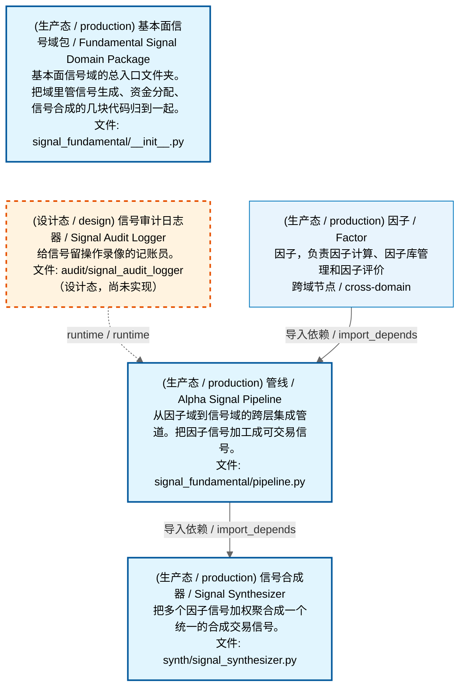

# 可视化视图模板规范（三视图 + 可缩放 HTML）

> **版本**：V1.0 | 2026-08-01
> **读者**：项目 Owner + AI 开发 Agent + 架构治理人员
> **写法**：大白话为主，配完整代码模板和验收清单。变更历史见 git log。

> **文档责任范围**：本文档定义 ZephyrAlpha 项目所有"依赖类可视化视图"的统一模板规范——
> 包括域架构文档的三视图、全景图（依赖路径全景图、交易流全景图等）的可视化呈现。
> 任何需要用 Mermaid 依赖图 + 可缩放 HTML 展示模块/域/流程关系的文档，**必须遵循本模板**。
> 实现真源：`scripts/governance/d5_architecture/generators/generate_domain_doc.py`（生成器）+
> `scripts/governance/d5_architecture/generators/zoomable_html.py`（HTML 生成器）。

---

## 一、为什么需要这个模板？

AI 开发有个老毛病：每个 AI 对话各画各的图，颜色不一样、节点格式不一样、有的能缩放有的不能、有的有中文名有的只有英文。

**本模板解决**：把"怎么画依赖图"固化成一套标准，后面所有全景图、域文档、流程图的可视化都照着做，保证：

| 要保证的事 | 怎么保证 |
|-----------|---------|
| **看得到** | MD 里内嵌 Mermaid（IDE 直接渲染）+ HTML 网页版（Ctrl+滚轮无限缩放）双产物 |
| **看得懂** | 每个节点都有中文名 + 英文名 + 大白话简介 + 文件路径，四要素齐全 |
| **分得清** | 运营态（蓝色实线）、设计态（橙色虚线）颜色区分，一眼看出哪些已造哪些没造 |
| **能跳转** | MD 顶部有 HTML 链接，点开就是可交互网页 |
| **统一风格** | 灰色主题 + 拓扑分层竖排 + 统一图例，所有图长一个样 |

---

## 二、总体架构：MD + HTML 双产物

每份可视化文档产出**两个文件**：

```
docs/…/你的文档.md                    ← MD（内嵌 Mermaid，IDE 可渲染）
docs/…/_zoomable_html/你的文档.html   ← HTML（浏览器打开，可缩放交互）
```

- **MD 文件**：给人快速浏览，IDE（如 VS Code）能直接渲染 Mermaid 图。MD 里渲染失败可以接受。
- **HTML 文件**：给需要看细节的人，浏览器打开后可以 Ctrl+滚轮无限缩放、拖动平移。**HTML 里必须渲染成功**。
- **关系**：MD 生成后**联动生成** HTML，输出到 MD 同级目录的 `_zoomable_html/` 子文件夹。
- **链接**：MD 顶部放 HTML 的访问链接，点击直接跳转到网页版。

### 2.1 产物生成流程

```
数据源(depgraph DB) → generate_domain_doc.py → .md 文件
                                           → zoomable_html.emit_zoomable_html() → _zoomable_html/.html
```

- 生成器从 `depgraph` (PostgreSQL) 读取 nodes + edges。
- 节点标签数据从 `module_translation_registry.yaml`（翻译真源）读取中英文名和大白话。
- 生成 MD 后自动调用 `emit_zoomable_html()` 生成 HTML，无需手动两步。

---

## 三、MD 文档结构规范

一份完整的可视化 MD 文档**必须包含以下章节**，顺序固定：

### 3.1 完整骨架

```markdown
---
doc_type: architecture_view
title: <域中文名 / Panorama Name> 架构文档
version: "1.0"
status: active
date: 2026-08-01
owner: auto-generator
ttl: permanent
---

# <编号>_<域名小写> / <域中文名> / <域英文名>

> **功能简介 / Overview**: <域功能描述>

> **文档作用 / Purpose**: 展示 <域中文名>（<DOMAIN_ID>）功能域的域内依赖关系、跨域依赖关系，
> 模块信息（成熟度/中英文名/大白话/文件路径）内嵌于 Mermaid 节点，供架构审查和域治理参考。

> 本文档由 generate_domain_doc.py 从 depgraph (PostgreSQL) 自动生成
> 数据源: depgraph (PostgreSQL) nodes表 + edges表

> **[可缩放 HTML 版 / Zoomable HTML](http://localhost:8765/<路径>/_zoomable_html/<文件名>.html)**
> — Ctrl+滚轮缩放 ｜ 双击重置 ｜ Ctrl+Shift+D 切换拖动/选择模式

## 域基本信息 / Domain Overview

| 字段 | 值 | Field | Value |
|------|------|-------|-------|
| 编号 | <N> | Number | <N> |
| 域ID | <DOMAIN_ID> | Domain ID | <DOMAIN_ID> |
| 域名称 | <中文名> | Domain Name | <English> |
| ...（模块数/依赖数/设计态/生产态/容量/描述）... | | | |

## 域内依赖图 / Internal Dependency Diagram

> 依赖图内嵌在本文档中，IDE 可直接渲染；网页版可 Ctrl+滚轮缩放 + 拖动平移查看细节。
>
> **图例说明 / Legend**：
> - 🟦 **蓝色 = 运营态模块**（production，已上线运行）
> - 🟧 **橙色虚线 = 设计态模块**（design，蓝图阶段，代码未写）
> - **实线箭头 = 运营态依赖**（已生效的依赖关系）
> - **虚线箭头 = 非运营态依赖**（计划中/验证中的依赖关系）

### 全景图（全部模块，颜色区分运营态/设计态）

> 展示全部 <N> 个模块（生产态 <P> + 设计态 <D>），含跨域依赖外部节点。节点含成熟度+名称+大白话/简介+文件路径。

```mermaid
<Mermaid 代码>
```

### 运营态的图（仅 design_maturity=production 的模块和域内依赖）

> 仅展示已上线运行的模块（共 <P> 个），不含跨域外部节点。跨域依赖见下方跨域依赖章节。

```mermaid
<Mermaid 代码>
```

### 设计态的图（仅 design_maturity=design 的模块和域内依赖）

> 仅展示蓝图阶段、代码未写的设计态模块（共 <D> 个），不含跨域外部节点。

```mermaid
<Mermaid 代码>
```

## 跨域依赖 / Cross-domain Dependencies

### 本域依赖的其他域（出边）/ Depends On
（表格：本域模块 → 外部域目标模块 + 依赖类型）

### 依赖本域的其他域（入边）/ Dependents
（表格：外部域源模块 → 本域模块 + 依赖类型）
```

### 3.2 三视图铁律

> **铁律**：三视图顺序固定为 **全景图 → 运营态的图 → 设计态的图**，每个图必须有 `### 小标题`，禁止分页标注页数。

| 视图 | 标题格式 | 内容 | 跨域节点 |
|------|---------|------|---------|
| **全景图** | `### 全景图（全部模块，颜色区分运营态/设计态）` | 全部模块（production + design）+ 全部域内依赖 + 跨域外部节点 | ✅ 含 |
| **运营态图** | `### 运营态的图（仅 design_maturity=production 的模块和域内依赖）` | 仅 production 模块 + production↔production 依赖 | ❌ 不含 |
| **设计态图** | `### 设计态的图（仅 design_maturity=design 的模块和域内依赖）` | 仅 design 模块 + design↔design 依赖 | ❌ 不含 |

**空视图处理**：某视图无模块时，不输出空 Mermaid 块，改用占位说明：

```markdown
### 设计态的图（仅 design_maturity=design 的模块和域内依赖）

> （无模块 / No modules）
```

---

## 四、Mermaid 代码规范

### 4.1 主题头（必须，固定）

每个 Mermaid 代码块**第一行**必须是灰色主题初始化：

```mermaid
%%{init: {'theme': 'base', 'themeVariables': {'primaryColor': '#eaeaea', 'primaryTextColor': '#333333', 'primaryBorderColor': '#666666', 'lineColor': '#666666', 'secondaryColor': '#eaeaea', 'tertiaryColor': '#eaeaea', 'fontSize': '14px'}}}%%
```

> 灰色主题让节点背景统一为浅灰（`#eaeaea`），状态色（蓝/橙）通过 classDef 覆盖，两者协调不冲突。

### 4.2 图类型（固定 flowchart TD）

```mermaid
flowchart TD
```

- **TD（Top-Down）**：从上到下竖排，强制拓扑分层。
- **禁止用 LR**（左到右）——竖排才能看清依赖链路从上层到下层流动。

### 4.3 节点定义格式

#### 域内节点（四要素，`<br/>` 分隔三行）

```
    <节点ID>["(成熟度) 中文名 / English<br/>大白话简介<br/>文件: 父目录/文件名"]
```

**完整示例**：

```
    src_zephyr_signal_fundamental_pipeline_py["(生产态 / production) 管线 / Alpha Signal Pipeline<br/>从因子域到信号域的跨层集成管道。把因子信号一路加工成可交易信号，是整个信号生成流程的总调度。<br/>文件: signal_fundamental/pipeline.py"]
```

**四要素说明**：

| 要素 | 格式 | 来源 | 示例 |
|------|------|------|------|
| ① 成熟度 | `(生产态 / production)` 或 `(设计态 / design)` | DB `design_maturity` 字段 | `(生产态 / production)` |
| ② 双语名称 | `中文名 / English` | 翻译真源 `name_zh` + `name_en` | `管线 / Alpha Signal Pipeline` |
| ③ 大白话 | 日常语言说"做什么/解决什么" | 翻译真源 `plain_zh` | `从因子域到信号域的跨层集成管道...` |
| ④ 文件路径 | `文件: 父目录/文件名` | 节点 `path` 取最后两段 | `文件: signal_fundamental/pipeline.py` |

> **四要素铁律**：每个节点必须有中文名 + 大白话简介。禁止只有英文名无中文，禁止只有名字无简介。

#### 跨域外部节点（代表"另一个域"）

```
    <域ID>["(成熟度) 域中文名 / Domain English<br/>域功能简介<br/>跨域节点 / cross-domain"]
```

**示例**：

```
    D_FACTOR["(生产态 / production) 因子 / Factor<br/>因子，负责因子计算、因子库管理和因子评价<br/>跨域节点 / cross-domain"]
```

### 4.4 节点 ID 规范

节点 ID 由文件路径转换而来（`sanitize_node_id`）：

- 只保留字母、数字、下划线，其他字符替换为 `_`
- 连续 `_` 合并为一个，首尾 `_` 去除
- 跨域节点 ID 直接用域 ID（如 `D_FACTOR`、`D_TRADING`）
- 同名 ID 冲突时追加 `_1`、`_2` 后缀

**示例**：`src/zephyr/signal_fundamental/pipeline.py` → `src_zephyr_signal_fundamental_pipeline_py`

### 4.5 边定义格式

#### 域内依赖边

```
    <from_ID> <箭头>|<依赖类型>| <to_ID>
```

**箭头规则**：

| 箭头 | 含义 | 条件 |
|------|------|------|
| `-->` | 实线箭头 = 运营态依赖 | from 和 to **都是** production |
| `-.->` | 虚线箭头 = 非运营态依赖 | 其他情况（含 design、混合） |

**依赖类型**（中英双语）：

| dep_type | 显示 |
|----------|------|
| `import_depends` | `导入依赖 / import_depends` |
| `test_depends` | `测试依赖 / test_depends` |
| `contract_depends` | `契约依赖 / contract_depends` |
| `event_depends` | `事件依赖 / event_depends` |

**示例**：

```
    src_zephyr_signal_fundamental_pipeline_py -->|导入依赖 / import_depends| src_zephyr_signal_fundamental_synth_signal_synthesizer_py
    src_zephyr_signal_fundamental_router_signal_priority_router_py -.->|runtime / runtime| src_zephyr_signal_fundamental_router_signal_conflict_resolver_py
```

#### 跨域边

跨域出边（本域 → 外部域）和入边（外部域 → 本域）格式相同：

```
    <本域节点ID> <箭头>|<依赖类型>| <外部域ID>
    <外部域ID> <箭头>|<依赖类型>| <本域节点ID>
```

### 4.6 拓扑分层（强制竖排）

为了让图从上到下分层流动（而非 dagre 默认的横向铺开），使用 **Kahn 算法**计算拓扑层级，同层节点用**不可见边 `~~~`** 串联强制同 rank：

```
    <节点A> ~~~ <节点B>
    <节点B> ~~~ <节点C>
```

- layer 0 = 入度为 0 的节点（最上层）
- layer(node) = max(layer(前驱)) + 1
- 环内节点统一放最大层 + 1
- 同层节点横向排列，层间纵向流动

### 4.7 classDef 样式定义（固定四类）

每个 Mermaid 图**末尾**必须定义四类样式：

```
    classDef production fill:#e1f5fe,stroke:#01579b,stroke-width:2px,color:#000
    classDef design fill:#fff3e0,stroke:#e65100,stroke-width:2px,color:#000,stroke-dasharray: 5 5
    classDef external_prod fill:#e8f4fd,stroke:#0277bd,stroke-width:1px,color:#000
    classDef external_design fill:#fff8e7,stroke:#ef6c00,stroke-width:1px,color:#000,stroke-dasharray: 5 5
```

| 类名 | 颜色 | 含义 | 边框 |
|------|------|------|------|
| `production` | 浅蓝填充 `#e1f5fe` + 深蓝边框 `#01579b` | 运营态域内节点 | 2px 实线 |
| `design` | 浅橙填充 `#fff3e0` + 深橙边框 `#e65100` | 设计态域内节点 | 2px **虚线**（`stroke-dasharray: 5 5`） |
| `external_prod` | 更浅蓝 `#e8f4fd` + 中蓝边框 `#0277bd` | 运营态跨域节点 | 1px 实线（更细，区分内外） |
| `external_design` | 更浅橙 `#fff8e7` + 中橙边框 `#ef6c00` | 设计态跨域节点 | 1px **虚线** |

### 4.8 class 应用（把样式绑到节点）

```
    class <节点ID1>,<节点ID2>,... production
    class <节点ID3>,<节点ID4>,... design
    class <外部域ID1>,<外部域ID2>,... external_prod
    class <外部域ID3>,... external_design
```

> 按 `design_maturity` 字段分组：production 节点绑 `production` 类，其他绑 `design` 类；跨域节点同理按成熟度绑 `external_prod` 或 `external_design`。

### 4.9 标签特殊字符转义

Mermaid 标签中的特殊字符必须替换（`_sanitize_mermaid_label`）：

| 原字符 | 替换为 | 原因 |
|--------|--------|------|
| `[` | `(` | 方括号会破坏 Mermaid 节点语法 |
| `]` | `)` | 同上 |
| `"` | `'` | 双引号会闭合节点标签 |
| `\|` | `/` | 管道符会破坏边标签语法 |

---

## 五、完整 Mermaid 代码示例

以下是一个完整的三视图 Mermaid 代码块（全景图），包含所有要素：



---

## 六、可缩放 HTML 规范

### 6.1 HTML 骨架结构

```html
<!DOCTYPE html>
<html lang="zh-CN">
<head>
  <meta charset="UTF-8">
  <meta name="viewport" content="width=device-width, initial-scale=1.0">
  <title>文档标题（取 MD 的 H1）</title>
  <style>
    /* 见 6.3 CSS 规范 */
  </style>
</head>
<body>
  <div class="header-bar">
    <h1>文档标题</h1>
    <div class="hint">
      缩放：<kbd>Ctrl</kbd> + <kbd>滚轮</kbd> ｜ 模式：<kbd>Ctrl</kbd>+<kbd>Shift</kbd>+<kbd>D</kbd> 切换 ...
    </div>
  </div>
  <!-- 每个 Mermaid 块对应一个 .diagram -->
  <div class="diagram">
    <span class="zoom-badge">100%</span>
    <h2><span class="num">#1</span> 全景图（全部模块，颜色区分运营态/设计态）</h2>
    <pre class="mermaid">Mermaid 代码（转义后）</pre>
  </div>
  <div class="diagram">...</div>
  <!-- mermaid.js（内嵌或 CDN）-->
  <script src="mermaid.min.js 或 CDN URL"></script>
  <script>
    /* mermaid 初始化 + renderAll + 缩放交互，见 6.4-6.6 */
  </script>
</body>
</html>
```

### 6.2 mermaid.js 加载策略

| 环境 | 策略 | 说明 |
|------|------|------|
| Dev（仓库根 `tmp/mermaid.min.js` 存在） | **内嵌**离线自包含 | HTML 大但无需网络，打开即用 |
| CI / 他人 clone（无 `tmp/mermaid.min.js`） | **CDN** 降级 | HTML 小，需网络加载 `https://cdn.jsdelivr.net/npm/mermaid@11/dist/mermaid.min.js` |

```javascript
// 内嵌模式
<script>/* mermaid.min.js 全文 */</script>

// CDN 模式
<script src="https://cdn.jsdelivr.net/npm/mermaid@11/dist/mermaid.min.js"></script>
```

### 6.3 CSS 规范（核心样式）

```css
body {
  font-family: -apple-system, BlinkMacSystemFont, "Segoe UI", "Microsoft YaHei", sans-serif;
  margin: 24px; background: #fafafa; color: #333;
}
/* 顶栏 sticky：滚动时常驻可见 */
.header-bar {
  position: sticky; top: 0; z-index: 100; background: #fafafa;
  padding: 10px 0 8px; border-bottom: 1px solid #e0e0e0;
  box-shadow: 0 2px 4px rgba(0,0,0,0.05);
}
/* 每个图区块 */
.diagram {
  background: #fff; border: 1px solid #e0e0e0; border-radius: 8px;
  padding: 16px 20px; margin: 20px 0; overflow: hidden; position: relative;
  cursor: grab;
}
/* 缩放百分比徽章（右上角） */
.zoom-badge {
  position: absolute; top: 12px; right: 16px; background: #0277bd; color: #fff;
  font-size: 12px; padding: 2px 8px; border-radius: 10px; z-index: 10;
  pointer-events: none; opacity: 0.85;
}
/* .mermaid 是固定高度可滚动视口：整图一屏可见，放大后内部滚动 */
.mermaid {
  display: block; height: calc(100vh - 170px); min-height: 220px; overflow: auto;
  background: #fff; border-radius: 4px;
}
.mermaid svg { max-width: none !important; display: block; margin: 0 auto; }
/* 节点标签自动换行：长大白话在节点内折行，避免节点过宽被裁剪 */
.mermaid .nodeLabel, .mermaid .edgeLabel, .mermaid foreignObject div, .mermaid foreignObject span {
  white-space: normal !important;
  overflow-wrap: anywhere;
  word-break: break-word;
  max-width: 340px;
  line-height: 1.35;
}
```

> **关键**：`.mermaid` 固定高度 `calc(100vh - 170px)` + `overflow: auto`，让每个图"一屏可见"，放大后视口内滚动（拖动平移 = 滚动视口），页面整体不超高。

### 6.4 mermaid 初始化配置（放开渲染上限）

```javascript
mermaid.initialize({
  startOnLoad: false,      // 关闭自动加载，改为 renderAll() 手动逐个渲染
  securityLevel: 'loose',
  suppressErrors: false,
  // 放开渲染上限：默认 maxTextSize=50000 + maxEdges=500，大域（如 385 节点 ~11万字符）
  // 会触发 "Edge limit exceeded" 拒绝渲染。提到 1亿/1万让浏览器能渲染任意大图。
  maxTextSize: 100000000,
  maxEdges: 10000,
  flowchart: { useMaxWidth: false, htmlLabels: true, nodeSpacing: 30, rankSpacing: 35 }
});
```

> **铁律**：`maxTextSize` 和 `maxEdges` 必须放开，否则大图（节点多、字符长）渲染失败。

### 6.5 渲染逻辑（小图优先，逐个渲染）

```javascript
async function renderAll() {
  var pres = Array.prototype.slice.call(document.querySelectorAll('.diagram pre.mermaid'));
  var items = pres.map(function(p, i) {
    return { pre: p, idx: i, code: p.textContent, size: p.textContent.length };
  });
  // 先替换为"渲染中"占位
  items.forEach(function(it) {
    it.pre.innerHTML = '<div style="color:#999;padding:12px;">⏳ 渲染中…（大图可能需要数十秒）</div>';
  });
  // 按代码长度升序：小图先渲染立即可见，大图后渲染不阻塞
  items.sort(function(a, b) { return a.size - b.size; });
  for (var k = 0; k < items.length; k++) {
    var it = items[k];
    try {
      var res = await mermaid.render('mmd-svg-' + it.idx, it.code);
      it.pre.innerHTML = res.svg;
      if (res.bindFunctions) { try { res.bindFunctions(it.pre); } catch (e) {} }
    } catch (err) {
      it.pre.innerHTML = '<div style="color:#c00;">⚠ 渲染失败: ' + String(err && err.message || err) + '</div>';
    }
    var diagram = it.pre.closest('.diagram');
    if (diagram) bindZoomToDiagram(diagram);  // 渲染完立即绑定缩放
    await new Promise(function(r) { setTimeout(r, 30); });  // 让浏览器喘息
  }
}
renderAll();
```

> **为什么小图优先**：大图（如全景图 385 节点）dagre 布局慢（数十秒），先渲染小图让用户立即可见，大图后台慢慢渲染。

### 6.6 交互功能（四项操作）

#### ① Ctrl + 滚轮缩放（每个图独立）

```javascript
diagram.addEventListener('wheel', function(e) {
  if (!e.ctrlKey) return;       // 必须 Ctrl 才缩放，否则正常滚动页面
  e.preventDefault();
  zoomLevel = Math.max(0.2, Math.min(30, zoomLevel * (e.deltaY < 0 ? 1.15 : 1/1.15)));
  applyZoom();  // 改 SVG width/height
}, { passive: false });
```

- 缩放范围：0.2x ~ 30x
- 每次滚轮放大/缩小 1.15 倍
- 改 SVG 的 width/height 属性（矢量清晰，不依赖浏览器原生 zoom）

#### ② 鼠标拖动平移

```javascript
var dragging = false, startX = 0, startY = 0, startSL = 0, startST = 0;
diagram.addEventListener('mousedown', function(e) {
  if (!dragEnabled || !vp) return;
  dragging = true;
  startX = e.clientX; startY = e.clientY;
  startSL = vp.scrollLeft; startST = vp.scrollTop;
  diagram.style.cursor = 'grabbing';
  e.preventDefault();
});
document.addEventListener('mousemove', function(e) {
  if (!dragging) return;
  vp.scrollLeft = startSL - (e.clientX - startX);
  vp.scrollTop = startST - (e.clientY - startY);
});
document.addEventListener('mouseup', function() {
  if (dragging) { dragging = false; diagram.style.cursor = dragEnabled ? 'grab' : 'text'; }
});
```

- 拖动 = 滚动视口（放大后超出的部分通过滚动查看）
- 光标提示：`grab`（悬停）→ `grabbing`（按下拖动）

#### ③ 双击重置（回到一屏自适应）

```javascript
diagram.addEventListener('dblclick', function() {
  zoomLevel = 1;
  if (vp) { vp.scrollLeft = 0; vp.scrollTop = 0; }
  applyZoom();
});
```

#### ④ Ctrl + Shift + D 切换模式（拖动 / 选择）

```javascript
var dragEnabled = true;  // true=拖动平移，false=选中复制文字
document.addEventListener('keydown', function(e) {
  if (e.ctrlKey && e.shiftKey && (e.key === 'D' || e.key === 'd')) {
    e.preventDefault();
    dragEnabled = !dragEnabled;
    updateModeUI();  // 更新光标和模式徽章
  }
});
```

| 模式 | 光标 | 行为 |
|------|------|------|
| 拖动模式（默认） | `grab` / `grabbing` | 鼠标拖动平移视图 |
| 选择模式 | `text` | 鼠标可选中复制节点文字 |

### 6.7 自适应（一屏可见 + 窗口变化重算）

```javascript
function fitToViewport() {
  var s = diagram.querySelector('svg');
  if (!s) return;
  // 记录原始尺寸
  if (!natW || !natH) {
    var bb = s.getBBox(); natW = bb.width; natH = bb.height;
    s.setAttribute('viewBox', '0 0 ' + natW + ' ' + natH);
  }
  // 计算刚好塞进视口的缩放
  var fit = Math.min((vp.clientWidth - 24) / natW, (vp.clientHeight - 24) / natH, 1);
  if (fit > 0 && isFinite(fit)) { fitScale = fit; zoomLevel = 1; applyZoom(); }
}
// 窗口尺寸变化时重新自适应
window.addEventListener('resize', function() {
  diagramFitters.forEach(function(f) { f(); });
});
```

---

## 七、数据真源规范

### 7.1 模块翻译真源

节点标签的中英文名和大白话**必须来自翻译真源**，禁止在生成器代码里硬编码：

| 字段 | 真源文件 | YAML key | 用途 |
|------|---------|----------|------|
| 中文名 | `docs/01_policies_and_standards/_registry/catalogs/module_translation_registry.yaml` | `name_zh` | 节点标签第 2 行"中文名" |
| 英文名 | 同上 | `name_en` | 节点标签第 2 行"English" |
| 大白话 | 同上 | `plain_zh` | 节点标签第 3 行 |
| 功能简介 | 同上 | `desc_zh` | 跨域依赖表格 |

> **铁律**：每个模块必须有中文名和大白话。未登记的模块回退到 docstring 首行，但最终必须补齐到 YAML 真源。

### 7.2 域映射真源

跨域节点的域中文名/英文名/简介来自域映射：

| 字段 | 来源 | 示例 |
|------|------|------|
| 域中文名 | `domain_name_mapping`（DB 优先 + 硬编码真源） | `因子` |
| 域英文名 | 同上 | `Factor` |
| 域功能简介 | 同上 | `因子，负责因子计算、因子库管理和因子评价` |

### 7.3 成熟度取值

| design_maturity | 显示 | 含义 |
|-----------------|------|------|
| `production` | `生产态 / production` | 已上线运行 |
| `design` | `设计态 / design` | 蓝图阶段，代码未写 |
| `unknown` / 空 | `未知 / unknown` | 未标记 |

---

## 八、生成器调用方式

### 8.1 生成单个域文档

```bash
python scripts/governance/d5_architecture/generators/generate_domain_doc.py D_FUNDAMENTAL_SIGNAL
```

### 8.2 生成所有域文档

```bash
python scripts/governance/d5_architecture/generators/generate_domain_doc.py --all
```

### 8.3 从任意 MD 生成 HTML（CLI wrapper）

```bash
python tmp/md_to_mermaid_html.py <md文件路径>
```

### 8.4 生成器联动逻辑

`generate_domain_doc.py` 生成 MD 后，自动调用：

```python
from scripts.governance.d5_architecture.generators.zoomable_html import emit_zoomable_html
html_path = emit_zoomable_html(md_path, md_content, output_dir)
# 输出到 md_path.parent / "_zoomable_html" / f"{md_path.stem}.html"
```

---

## 九、适用于其他全景图的扩展指南

本模板不仅用于域文档，**所有依赖类全景图**（如 `dependency_path_panorama.md`、`trading_flow_panorama.md`）都应遵循：

### 9.1 必须遵循的规则（所有可视化文档）

1. **MD + HTML 双产物**：生成 MD 后联动生成 `_zoomable_html/*.html`
2. **MD 顶部放 HTML 链接**：`> **[可缩放 HTML 版](#)**`
3. **Mermaid 灰色主题头** + `flowchart TD`
4. **节点四要素**：成熟度 + 双语名称 + 大白话 + 文件路径/标识
5. **颜色规范**：production 蓝、design 橙虚线、external 区分
6. **箭头规范**：production→production 实线，其他虚线
7. **HTML 交互**：Ctrl+滚轮缩放、拖动平移、双击重置、Ctrl+Shift+D 切换模式
8. **mermaid 配置**：`maxTextSize: 100000000, maxEdges: 10000`
9. **渲染逻辑**：小图优先逐个渲染

### 9.2 可调整的部分

| 可调整项 | 域文档默认 | 全景图可改为 |
|---------|-----------|-------------|
| 视图数量 | 固定三视图（全景/运营态/设计态） | 按需（如流程图可能只有一个总视图，或多维度视图） |
| 节点粒度 | 模块级（.py 文件） | 域级、子系统级、流程步骤级 |
| 分层算法 | 拓扑分层（Kahn） | 按业务流程顺序分层、按层级分层 |
| 跨域节点 | 代表"另一个域" | 可代表"另一个流程阶段"、"另一个子系统" |

### 9.3 全景图适配示例

以**交易流全景图**为例，节点改为"流程步骤"，但格式遵循本模板：

```
    step_signal_generation["(生产态 / production) 信号生成 / Signal Generation<br/>从因子计算到可交易信号的生成环节<br/>流程步骤 / process-step"]
    step_signal_generation -->|数据流 / data_flow| step_risk_check
```

---

## 十、验收清单

生成任何可视化文档后，**逐项检查**：

### 10.1 MD 文档验收

- [ ] frontmatter 含 `doc_type: architecture_view`
- [ ] H1 标题含编号 + 中文名 + 英文名
- [ ] 顶部有 HTML 跳转链接（`http://localhost:8765/...`）
- [ ] 有"域基本信息"表格（模块数/依赖数/设计态/生产态/容量）
- [ ] 有"图例说明"（蓝/橙/实线/虚线四种）
- [ ] **三视图齐全**：全景图 → 运营态的图 → 设计态的图，各有 `### 小标题`
- [ ] 空视图用"（无模块 / No modules）"占位，无空 Mermaid 块
- [ ] 每个 Mermaid 块第一行是灰色主题头
- [ ] 每个 Mermaid 块第二行是 `flowchart TD`
- [ ] 节点标签四要素齐全（成熟度 + 双语名称 + 大白话 + 文件路径）
- [ ] 节点标签无 `[` `]` `"` `|` 特殊字符（已转义）
- [ ] 边用 `-->`（production 间）或 `-.->`（其他）
- [ ] 末尾有四类 classDef + class 应用
- [ ] 有跨域依赖表格（出边 + 入边）
- [ ] **0 个"待补充"**（所有模块都有中文名和大白话）

### 10.2 HTML 文档验收

- [ ] HTML 输出到 `_zoomable_html/` 子文件夹
- [ ] 顶栏 sticky，含标题 + 操作提示
- [ ] 每个 Mermaid 块对应一个 `.diagram`，含 `zoom-badge` + `h2` 标题
- [ ] mermaid.js 内嵌（dev）或 CDN（CI）
- [ ] `mermaid.initialize` 含 `maxTextSize: 100000000, maxEdges: 10000`
- [ ] `startOnLoad: false` + 手动 `renderAll()`
- [ ] 渲染按代码长度升序（小图优先）
- [ ] 渲染失败显示错误信息（不白屏）
- [ ] Ctrl+滚轮缩放可用（0.2x~30x）
- [ ] 鼠标拖动平移可用
- [ ] 双击重置可用
- [ ] Ctrl+Shift+D 切换模式可用
- [ ] 节点标签自动换行（`max-width: 340px`）
- [ ] `.mermaid` 固定高度 + `overflow: auto`
- [ ] **大图渲染成功**（无 "Edge limit exceeded"）

### 10.3 数据质量验收

- [ ] 所有节点有中文名（`name_zh` 非空）
- [ ] 所有节点有大白话（`plain_zh` 非空、无"待补充"）
- [ ] 所有节点有英文名（`name_en` 非空）
- [ ] 设计态模块（`design_maturity=design`）未被幽灵文件过滤误删
- [ ] 跨域节点有域中文名和功能简介

---

## 十一、常见问题与治本

| 问题 | 原因 | 治本 |
|------|------|------|
| 大图渲染失败 "Edge limit exceeded" | mermaid 默认 maxEdges=500 | `maxEdges: 10000` |
| 大图渲染失败 "Syntax error" | mermaid 默认 maxTextSize=50000 | `maxTextSize: 100000000` |
| 节点只显示英文名无中文 | 翻译真源未登记 | 补齐 `module_translation_registry.yaml` |
| 节点无大白话简介 | 翻译真源 `plain_zh` 为空 | 补齐 `plain_zh` 字段 |
| 设计态模块消失 | `_is_ghost` 误过滤 | `design_maturity=design` 时跳过幽灵检查 |
| 图横向铺开太宽 | dagre 默认横向 | 拓扑分层 + `~~~` 不可见边强制同 rank 竖排 |
| 节点标签被裁剪 | SVG 视口太小 | CSS `max-width: 340px` + `word-break: break-word` |
| 三视图变成一个图 | 生成器重构时合并了视图 | 恢复 `_emit_internal_view` 三次调用 |
| HTML 里图空白 | mermaid.js 未加载 | 检查内嵌/CDN 策略，看控制台报错 |

---

## 十二、版本历史

| 版本 | 日期 | 变更 |
|------|------|------|
| V1.0 | 2026-08-01 | 初版：从 generate_domain_doc.py + zoomable_html.py 提取为统一模板规范 |

---

> **本模板是所有可视化视图的铁律标准**。后续任何全景图、域文档、流程图的可视化，必须遵循本模板。
> 实现真源以 `scripts/governance/d5_architecture/generators/` 下的生成器代码为准，本模板与代码保持同步。
