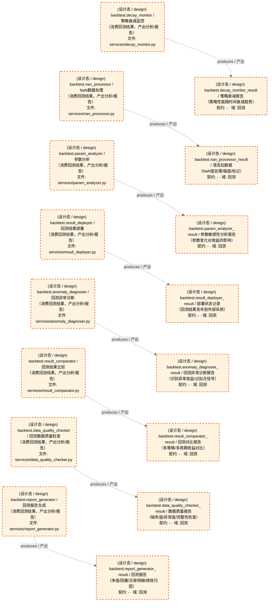

# 回测域-回测服务

> 生成时间: 2026-08-05T04:17:14
> 真源: `dataflow_graph_registry.yaml` → PostgreSQL `dataflow_*` 表
> 生成器: `generate_dataflow_diagram.py`（全文自动生成，禁止手工编辑）

> **[可缩放 HTML 版 / Zoomable HTML](http://localhost:8765/docs/02_enterprise_architecture/05_dataflow_architecture/_zoomable_html/d_backtest.html)** — Ctrl+滚轮缩放 ｜ 双击重置 ｜ Ctrl+Shift+D 切换拖动/选择模式

> **域职责 / Responsibility**: 回测分析服务——异常诊断/数据质量检查/衰减监控/NaN处理/参数分析/报告生成/结果对比/结果部署

## 域基本信息 / Overview

| 字段 | 值 | Field | Value |
|------|------|-------|-------|
| Dataset 数 | 13 | Datasets | 13 |
| Job 数 | 13 | Jobs | 13 |
| 运营态 Dataset | 5 | Production Datasets | 5 |
| 设计态 Dataset | 8 | Design Datasets | 8 |
| 运营态 Job | 5 | Production Jobs | 5 |
| 设计态 Job | 8 | Design Jobs | 8 |
| 跨域外部 Dataset | 1 | Cross-domain Datasets | 1 |

## 数据流图

> **图例说明 / Legend**：
>
> - 🟦 **蓝色 = 运营态节点**（production，已上线运行）
> - 🟧 **橙色虚线 = 设计态节点**（design，蓝图阶段，代码未写）
> - 🟦更浅蓝 = 跨域外部 Dataset（external_prod/external_design）
> - **实线箭头 ``-->`` = 运营态数据流**（两端均 production）
> - **虚线箭头 ``-.->`` = 非运营态数据流**（含 design、混合）
> - 矩形 = Dataset（数据集）/ 圆角矩形 = Job（作业）
> - ``JOB -->|produces / 产出| DS`` = Job 产出 Dataset
> - ``DS -->|consumed by / 被消费于| JOB`` = Job 消费 Dataset

### 全景图（全部模块，颜色区分运营态/设计态）

> 展示全部 26 个节点（Dataset 13 + Job 13），含 17 条边，含 1 个跨域外部 Dataset。颜色区分运营态（蓝）/设计态（橙虚线）。

```mermaid
%%{init: {'theme': 'base', 'themeVariables': {'primaryColor': '#eaeaea', 'primaryTextColor': '#333333', 'primaryBorderColor': '#666666', 'lineColor': '#666666', 'secondaryColor': '#eaeaea', 'tertiaryColor': '#eaeaea', 'clusterBkg': 'transparent', 'clusterBorder': 'transparent', 'fontSize': '14px'}}}%%
flowchart TD
    DS11245["(设计态 / design) backtest.anomaly_diagnoser_<br/>result / 回测异常诊断报告<br/>（识别异常收益/过拟合信号）<br/>契约: - · 域: 回测"]
    DS11246["(设计态 / design) backtest.data_quality_checker_<br/>result / 数据质量报告<br/>（缺失值/异常值/完整性检查）<br/>契约: - · 域: 回测"]
    DS11247["(设计态 / design) backtest.decay_monitor_result<br/>/ 策略衰减报告<br/>（策略性能随时间衰减趋势）<br/>契约: - · 域: 回测"]
    DS31199["(生产态 / production) backtest.fills /<br/>回测.模拟成交<br/>回测模拟成交（symbol/quantity/price/commission<br/>/slippage），撮合引擎产出<br/>契约: - · 域: 回测"]
    DS11248["(设计态 / design) backtest.nan_processor_result<br/>/ 清洗后数据<br/>（NaN值处理/插值/标记）<br/>契约: - · 域: 回测"]
    DS31200["(生产态 / production) backtest.nav_series /<br/>回测.净值序列<br/>回测净值序列（timestamp/nav/cash<br/>/positions），组合更新产出<br/>契约: - · 域: 回测"]
    DS11249["(设计态 / design) backtest.param_analyzer_<br/>result / 参数敏感性分析报告<br/>（参数变化对收益的影响）<br/>契约: - · 域: 回测"]
    DS11250["(设计态 / design) backtest.report_generator_<br/>result / 回测报告<br/>（净值/回撤/交易明细/绩效归因）<br/>契约: - · 域: 回测"]
    DS11251["(设计态 / design) backtest.result_comparator_<br/>result / 回测对比报告<br/>（多策略/多周期收益对比）<br/>契约: - · 域: 回测"]
    DS11252["(设计态 / design) backtest.result_deployer_<br/>result / 部署状态记录<br/>（回测结果发布到外部系统）<br/>契约: - · 域: 回测"]
    DS31198["(生产态 / production) backtest.target_weights /<br/>回测.目标权重<br/>回测目标权重（symbol/target_weight<br/>/timestamp），策略根据tick事件生成<br/>契约: - · 域: 回测"]
    DS31197["(生产态 / production) backtest.tick_event /<br/>回测.Tick事件<br/>回测Tick事件（历史tick重放，含timestamp/symbol<br/>/price/volume），回测内部类型<br/>契约: - · 域: 回测"]
    DS31196["(生产态 / production) backtest.result /<br/>回测.结果<br/>回测结果（nav_series/sharpe/max_drawdown<br/>/trades），CTR-P1-016 BacktestResult<br/>契约: CTR-P1-016 · 域: 回测"]
    JOB757609("(设计态 / design) backtest.anomaly_diagnoser /<br/>回测异常诊断<br/>（消费回测结果，产出分析/报告）<br/>文件: services/anomaly_diagnoser.py")
    JOB1154373("(生产态 / production) backtest.calc_metrics /<br/>回测.计算指标<br/>回测指标计算（Sharpe/MaxDrawdown<br/>/胜率等，含DSR修正+PIT校验），产出DS-010<br/>backtest.result<br/>文件: backtest/metrics.py")
    JOB757610("(设计态 / design) backtest.data_quality_checker<br/>/ 回测数据质量检查<br/>（消费回测结果，产出分析/报告）<br/>文件: services/data_quality_checker.py")
    JOB757611("(设计态 / design) backtest.decay_monitor /<br/>策略衰减监控<br/>（消费回测结果，产出分析/报告）<br/>文件: services/decay_monitor.py")
    JOB1154371("(生产态 / production) backtest.match_fills /<br/>回测.撮合成交<br/>回测撮合引擎（根据目标权重模拟成交，含滑点<br/>/手续费），产出DS-013 backtest.fills<br/>文件: backtest/matching_logic.py")
    JOB757612("(设计态 / design) backtest.nan_processor /<br/>NaN数据处理<br/>（消费回测结果，产出分析/报告）<br/>文件: services/nan_processor.py")
    JOB757613("(设计态 / design) backtest.param_analyzer /<br/>参数分析<br/>（消费回测结果，产出分析/报告）<br/>文件: services/param_analyzer.py")
    JOB1154369("(生产态 / production) backtest.replay_ticks /<br/>回测.Tick重放<br/>历史Tick重放<br/>（从DS-001读取历史tick，按时间顺序重放），产出DS<br/>-011 backtest.tick_event<br/>文件: backtest/tick_replay.py")
    JOB757614("(设计态 / design) backtest.report_generator /<br/>回测报告生成<br/>（消费回测结果，产出分析/报告）<br/>文件: services/report_generator.py")
    JOB757615("(设计态 / design) backtest.result_comparator /<br/>回测结果比较<br/>（消费回测结果，产出分析/报告）<br/>文件: services/result_comparator.py")
    JOB757616("(设计态 / design) backtest.result_deployer /<br/>回测结果部署<br/>（消费回测结果，产出分析/报告）<br/>文件: services/result_deployer.py")
    JOB1154370("(生产态 / production) backtest.run_event_driven<br/>/ 回测.事件驱动运行<br/>事件驱动回测引擎<br/>（消费tick事件，运行策略生成目标权重），产出DS-0<br/>12 backtest.target_weights<br/>文件: backtest/event_engine.py")
    JOB1154372("(生产态 / production) backtest.update_portfolio<br/>/ 回测.更新组合<br/>回测组合更新（根据成交更新持仓/现金<br/>/净值），产出DS-014 backtest.nav_series<br/>文件: backtest/portfolio.py")
    DS31187["(生产态 / production) market_data.tick /<br/>市场数据.Tick行情<br/>标准化Tick行情（symbol/timestamp/OHLCV/quality_<br/>score），CTR-001 NormalizedMarketData<br/>契约: CTR-001 · 域: 行情数据<br/>跨域节点 / cross-domain"]
    JOB1154373 -->|produces / 产出| DS31196
    JOB1154369 -->|produces / 产出| DS31197
    JOB1154370 -->|produces / 产出| DS31198
    JOB1154371 -->|produces / 产出| DS31199
    JOB1154372 -->|produces / 产出| DS31200
    JOB757609 -.->|produces / 产出| DS11245
    JOB757610 -.->|produces / 产出| DS11246
    JOB757611 -.->|produces / 产出| DS11247
    JOB757612 -.->|produces / 产出| DS11248
    JOB757613 -.->|produces / 产出| DS11249
    JOB757614 -.->|produces / 产出| DS11250
    JOB757615 -.->|produces / 产出| DS11251
    JOB757616 -.->|produces / 产出| DS11252
    DS31187 -.->|consumed by / 被消费于| JOB1154369
    DS31197 -->|consumed by / 被消费于| JOB1154370
    DS31198 -->|consumed by / 被消费于| JOB1154371
    DS31199 -->|consumed by / 被消费于| JOB1154372
    DS31200 -->|consumed by / 被消费于| JOB1154373
    JOB757611 ~~~ JOB757612
    JOB757612 ~~~ JOB757613
    JOB757613 ~~~ JOB757610
    JOB757610 ~~~ JOB757614
    JOB757614 ~~~ JOB757609
    JOB757609 ~~~ JOB757615
    JOB757615 ~~~ JOB1154369
    JOB1154369 ~~~ JOB757616
    DS11247 ~~~ DS11248
    DS11248 ~~~ DS11249
    DS11249 ~~~ DS11246
    DS11246 ~~~ DS11250
    DS11250 ~~~ DS11245
    DS11245 ~~~ DS11251
    DS11251 ~~~ DS31197
    DS31197 ~~~ DS11252
    classDef production fill:#e1f5fe,stroke:#01579b,stroke-width:2px,color:#000
    classDef design fill:#fff3e0,stroke:#e65100,stroke-width:2px,color:#000,stroke-dasharray: 5 5
    classDef external_prod fill:#e8f4fd,stroke:#0277bd,stroke-width:1px,color:#000
    classDef external_design fill:#fff8e7,stroke:#ef6c00,stroke-width:1px,color:#000,stroke-dasharray: 5 5
    class DS31199,DS31200,DS31198,DS31197,DS31196,JOB1154373,JOB1154371,JOB1154369,JOB1154370,JOB1154372 production
    class DS11245,DS11246,DS11247,DS11248,DS11249,DS11250,DS11251,DS11252,JOB757609,JOB757610,JOB757611,JOB757612,JOB757613,JOB757614,JOB757615,JOB757616 design
    class DS31187 external_prod
```

### 运营态的图（仅 design_maturity=production）

> 仅展示已实现稳定运行的节点（运营态：5 datasets / 数据集, 5 jobs / 作业, 9 edges / 边）。

```mermaid
%%{init: {'theme': 'base', 'themeVariables': {'primaryColor': '#eaeaea', 'primaryTextColor': '#333333', 'primaryBorderColor': '#666666', 'lineColor': '#666666', 'secondaryColor': '#eaeaea', 'tertiaryColor': '#eaeaea', 'clusterBkg': 'transparent', 'clusterBorder': 'transparent', 'fontSize': '14px'}}}%%
flowchart TD
    DS31199["(生产态 / production) backtest.fills /<br/>回测.模拟成交<br/>回测模拟成交（symbol/quantity/price/commission<br/>/slippage），撮合引擎产出<br/>契约: - · 域: 回测"]
    DS31200["(生产态 / production) backtest.nav_series /<br/>回测.净值序列<br/>回测净值序列（timestamp/nav/cash<br/>/positions），组合更新产出<br/>契约: - · 域: 回测"]
    DS31198["(生产态 / production) backtest.target_weights /<br/>回测.目标权重<br/>回测目标权重（symbol/target_weight<br/>/timestamp），策略根据tick事件生成<br/>契约: - · 域: 回测"]
    DS31197["(生产态 / production) backtest.tick_event /<br/>回测.Tick事件<br/>回测Tick事件（历史tick重放，含timestamp/symbol<br/>/price/volume），回测内部类型<br/>契约: - · 域: 回测"]
    DS31196["(生产态 / production) backtest.result /<br/>回测.结果<br/>回测结果（nav_series/sharpe/max_drawdown<br/>/trades），CTR-P1-016 BacktestResult<br/>契约: CTR-P1-016 · 域: 回测"]
    JOB1154373("(生产态 / production) backtest.calc_metrics /<br/>回测.计算指标<br/>回测指标计算（Sharpe/MaxDrawdown<br/>/胜率等，含DSR修正+PIT校验），产出DS-010<br/>backtest.result<br/>文件: backtest/metrics.py")
    JOB1154371("(生产态 / production) backtest.match_fills /<br/>回测.撮合成交<br/>回测撮合引擎（根据目标权重模拟成交，含滑点<br/>/手续费），产出DS-013 backtest.fills<br/>文件: backtest/matching_logic.py")
    JOB1154369("(生产态 / production) backtest.replay_ticks /<br/>回测.Tick重放<br/>历史Tick重放<br/>（从DS-001读取历史tick，按时间顺序重放），产出DS<br/>-011 backtest.tick_event<br/>文件: backtest/tick_replay.py")
    JOB1154370("(生产态 / production) backtest.run_event_driven<br/>/ 回测.事件驱动运行<br/>事件驱动回测引擎<br/>（消费tick事件，运行策略生成目标权重），产出DS-0<br/>12 backtest.target_weights<br/>文件: backtest/event_engine.py")
    JOB1154372("(生产态 / production) backtest.update_portfolio<br/>/ 回测.更新组合<br/>回测组合更新（根据成交更新持仓/现金<br/>/净值），产出DS-014 backtest.nav_series<br/>文件: backtest/portfolio.py")
    JOB1154373 -->|produces / 产出| DS31196
    JOB1154369 -->|produces / 产出| DS31197
    JOB1154370 -->|produces / 产出| DS31198
    JOB1154371 -->|produces / 产出| DS31199
    JOB1154372 -->|produces / 产出| DS31200
    DS31197 -->|consumed by / 被消费于| JOB1154370
    DS31198 -->|consumed by / 被消费于| JOB1154371
    DS31199 -->|consumed by / 被消费于| JOB1154372
    DS31200 -->|consumed by / 被消费于| JOB1154373
    classDef production fill:#e1f5fe,stroke:#01579b,stroke-width:2px,color:#000
    classDef design fill:#fff3e0,stroke:#e65100,stroke-width:2px,color:#000,stroke-dasharray: 5 5
    classDef external_prod fill:#e8f4fd,stroke:#0277bd,stroke-width:1px,color:#000
    classDef external_design fill:#fff8e7,stroke:#ef6c00,stroke-width:1px,color:#000,stroke-dasharray: 5 5
    class DS31199,DS31200,DS31198,DS31197,DS31196,JOB1154373,JOB1154371,JOB1154369,JOB1154370,JOB1154372 production
```

### 设计态的图（仅 design_maturity=design）

> 仅展示蓝图阶段、代码未写的设计态节点（设计态：8 datasets / 数据集, 8 jobs / 作业, 8 edges / 边）。

## Dataset 清单

| ID | entity_name / 实体名 | scope / 范围 | domain / 域 | design_maturity / 设计成熟度 | module_id / 蓝图 | 功能简述 |
|----|----------------------|--------------|------------|------------------------------|------------------|----------|
| DS-11245 | backtest.anomaly_diagnoser_result | backtest_internal / 回测内部 | D_BACKTEST / 回测 | design / 设计 | MOD-BT-023 | 回测异常诊断报告（识别异常收益/过拟合信号） |
| DS-11246 | backtest.data_quality_checker_result | backtest_internal / 回测内部 | D_BACKTEST / 回测 | design / 设计 | MOD-BT-022 | 数据质量报告（缺失值/异常值/完整性检查） |
| DS-11247 | backtest.decay_monitor_result | backtest_internal / 回测内部 | D_BACKTEST / 回测 | design / 设计 | MOD-BT-018 | 策略衰减报告（策略性能随时间衰减趋势） |
| DS-31199 | backtest.fills / 回测.模拟成交 | backtest_internal / 回测内部 | D_BACKTEST / 回测 | production / 生产 | MOD-BT-001 | 回测模拟成交（symbol/quantity/price/commission/slippage），撮合引擎产出 |
| DS-11248 | backtest.nan_processor_result | backtest_internal / 回测内部 | D_BACKTEST / 回测 | design / 设计 | MOD-BT-026 | 清洗后数据（NaN值处理/插值/标记） |
| DS-31200 | backtest.nav_series / 回测.净值序列 | backtest_internal / 回测内部 | D_BACKTEST / 回测 | production / 生产 | MOD-BT-001 | 回测净值序列（timestamp/nav/cash/positions），组合更新产出 |
| DS-11249 | backtest.param_analyzer_result | backtest_internal / 回测内部 | D_BACKTEST / 回测 | design / 设计 | MOD-BT-021 | 参数敏感性分析报告（参数变化对收益的影响） |
| DS-11250 | backtest.report_generator_result | backtest_internal / 回测内部 | D_BACKTEST / 回测 | design / 设计 | MOD-BT-019 | 回测报告（净值/回撤/交易明细/绩效归因） |
| DS-11251 | backtest.result_comparator_result | backtest_internal / 回测内部 | D_BACKTEST / 回测 | design / 设计 | MOD-BT-024 | 回测对比报告（多策略/多周期收益对比） |
| DS-11252 | backtest.result_deployer_result | backtest_internal / 回测内部 | D_BACKTEST / 回测 | design / 设计 | MOD-BT-025 | 部署状态记录（回测结果发布到外部系统） |
| DS-31198 | backtest.target_weights / 回测.目标权重 | backtest_internal / 回测内部 | D_BACKTEST / 回测 | production / 生产 | MOD-BT-001 | 回测目标权重（symbol/target_weight/timestamp），策略根据tick事件生成 |
| DS-31197 | backtest.tick_event / 回测.Tick事件 | backtest_internal / 回测内部 | D_BACKTEST / 回测 | production / 生产 | MOD-BT-001 | 回测Tick事件（历史tick重放，含timestamp/symbol/price/volume），回测内部类型 |
| DS-31196 | backtest.result / 回测.结果 | production / 生产 | D_BACKTEST / 回测 | production / 生产 | MOD-BT-001 | 回测结果（nav_series/sharpe/max_drawdown/trades），CTR-P1-016 BacktestResult |

## Job 清单

| ID | job_name / 作业名 | trigger_type / 触发类型 | design_maturity / 设计成熟度 | module_id / 蓝图 | 功能简述 |
|----|-------------------|----------------------------|------------------------------|------------------|----------|
| JOB-757609 | backtest.anomaly_diagnoser | manual / 手动 | design / 设计 | MOD-BT-023 | 回测异常诊断（消费回测结果，产出分析/报告） |
| JOB-1154373 | backtest.calc_metrics / 回测.计算指标 | manual / 手动 | production / 生产 | MOD-BT-001 | 回测指标计算（Sharpe/MaxDrawdown/胜率等，含DSR修正+PIT校验），产出DS-010 backtest.result |
| JOB-757610 | backtest.data_quality_checker | manual / 手动 | design / 设计 | MOD-BT-022 | 回测数据质量检查（消费回测结果，产出分析/报告） |
| JOB-757611 | backtest.decay_monitor | manual / 手动 | design / 设计 | MOD-BT-018 | 策略衰减监控（消费回测结果，产出分析/报告） |
| JOB-1154371 | backtest.match_fills / 回测.撮合成交 | event_driven / 事件驱动 | production / 生产 | MOD-BT-001 | 回测撮合引擎（根据目标权重模拟成交，含滑点/手续费），产出DS-013 backtest.fills |
| JOB-757612 | backtest.nan_processor | manual / 手动 | design / 设计 | MOD-BT-026 | NaN数据处理（消费回测结果，产出分析/报告） |
| JOB-757613 | backtest.param_analyzer | manual / 手动 | design / 设计 | MOD-BT-021 | 参数分析（消费回测结果，产出分析/报告） |
| JOB-1154369 | backtest.replay_ticks / 回测.Tick重放 | manual / 手动 | production / 生产 | MOD-BT-001 | 历史Tick重放（从DS-001读取历史tick，按时间顺序重放），产出DS-011 backtest.tick_event |
| JOB-757614 | backtest.report_generator | manual / 手动 | design / 设计 | MOD-BT-019 | 回测报告生成（消费回测结果，产出分析/报告） |
| JOB-757615 | backtest.result_comparator | manual / 手动 | design / 设计 | MOD-BT-024 | 回测结果比较（消费回测结果，产出分析/报告） |
| JOB-757616 | backtest.result_deployer | manual / 手动 | design / 设计 | MOD-BT-025 | 回测结果部署（消费回测结果，产出分析/报告） |
| JOB-1154370 | backtest.run_event_driven / 回测.事件驱动运行 | event_driven / 事件驱动 | production / 生产 | MOD-BT-001 | 事件驱动回测引擎（消费tick事件，运行策略生成目标权重），产出DS-012 backtest.target_weights |
| JOB-1154372 | backtest.update_portfolio / 回测.更新组合 | event_driven / 事件驱动 | production / 生产 | MOD-BT-001 | 回测组合更新（根据成交更新持仓/现金/净值），产出DS-014 backtest.nav_series |

## 跨域依赖 / Cross-domain Dependencies

### 依赖本域的外部 Dataset（入边）/ Consumed From

| 外部 Dataset | 域 | 成熟度 | 被本域 Job 消费 |
|-------------|------|--------|----------------|
| market_data.tick | D_MKT_DATA / 行情数据 | production / 生产 | backtest.replay_ticks |

[← 返回索引](dataflow_index.md)
