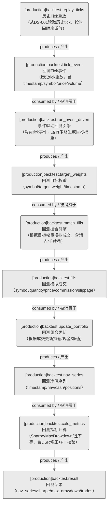

# 回测域-回测服务

> 生成时间: 2026-07-31T19:29:38
> 真源: `dataflow_graph_registry.yaml` → PostgreSQL `dataflow_*` 表
> 生成器: `generate_dataflow_diagram.py`（全文自动生成，禁止手工编辑）

> **域职责 / Responsibility**: 回测分析服务——异常诊断/数据质量检查/衰减监控/NaN处理/参数分析/报告生成/结果对比/结果部署

## 数据流图（全景：设计态+运营态合并）

> 节点数: 13 datasets / 数据集, 13 jobs / 作业, 17 edges / 边
>
> **图例**：🟦 蓝色 = 运营态（已实现）/ 🟧 橙色虚线 = 设计态（未实现）

```mermaid
%%{init: {'theme': 'base', 'themeVariables': {'primaryColor': '#eaeaea', 'primaryTextColor': '#333333', 'primaryBorderColor': '#666666', 'lineColor': '#666666', 'secondaryColor': '#eaeaea', 'tertiaryColor': '#eaeaea', 'fontSize': '14px'}}}%%
flowchart LR
    DS11245["[design]backtest.anomaly_diagnoser_result<br/>回测异常诊断报告<br/>（识别异常收益/过拟合信号）"]
    DS11246["[design]backtest.data_quality_checker_result<br/>数据质量报告<br/>（缺失值/异常值/完整性检查）"]
    DS11247["[design]backtest.decay_monitor_result<br/>策略衰减报告<br/>（策略性能随时间衰减趋势）"]
    DS12959["[production]backtest.fills<br/>回测模拟成交<br/>（symbol/quantity/price/commission/slippage）"]
    DS11248["[design]backtest.nan_processor_result<br/>清洗后数据<br/>（NaN值处理/插值/标记）"]
    DS12960["[production]backtest.nav_series<br/>回测净值序列<br/>（timestamp/nav/cash/positions）"]
    DS11249["[design]backtest.param_analyzer_result<br/>参数敏感性分析报告<br/>（参数变化对收益的影响）"]
    DS11250["[design]backtest.report_generator_result<br/>回测报告<br/>（净值/回撤/交易明细/绩效归因）"]
    DS11251["[design]backtest.result_comparator_result<br/>回测对比报告<br/>（多策略/多周期收益对比）"]
    DS11252["[design]backtest.result_deployer_result<br/>部署状态记录<br/>（回测结果发布到外部系统）"]
    DS12958["[production]backtest.target_weights<br/>回测目标权重<br/>（symbol/target_weight/timestamp）"]
    DS12957["[production]backtest.tick_event<br/>回测Tick事件<br/>（历史tick重放，含timestamp/symbol/price/volume）"]
    DS12956["[production]backtest.result<br/>回测结果<br/>（nav_series/sharpe/max_drawdown/trades）"]
    JOB757609("[design]backtest.anomaly_diagnoser<br/>回测异常诊断<br/>（消费回测结果，产出分析/报告）")
    JOB807126("[production]backtest.calc_metrics<br/>回测指标计算<br/>（Sharpe/MaxDrawdown/胜率等，含DSR修正+PIT校验）")
    JOB757610("[design]backtest.data_quality_checker<br/>回测数据质量检查<br/>（消费回测结果，产出分析/报告）")
    JOB757611("[design]backtest.decay_monitor<br/>策略衰减监控<br/>（消费回测结果，产出分析/报告）")
    JOB807124("[production]backtest.match_fills<br/>回测撮合引擎<br/>（根据目标权重模拟成交，含滑点/手续费）")
    JOB757612("[design]backtest.nan_processor<br/>NaN数据处理<br/>（消费回测结果，产出分析/报告）")
    JOB757613("[design]backtest.param_analyzer<br/>参数分析<br/>（消费回测结果，产出分析/报告）")
    JOB807122("[production]backtest.replay_ticks<br/>历史Tick重放<br/>（从DS-001读取历史tick，按时间顺序重放）")
    JOB757614("[design]backtest.report_generator<br/>回测报告生成<br/>（消费回测结果，产出分析/报告）")
    JOB757615("[design]backtest.result_comparator<br/>回测结果比较<br/>（消费回测结果，产出分析/报告）")
    JOB757616("[design]backtest.result_deployer<br/>回测结果部署<br/>（消费回测结果，产出分析/报告）")
    JOB807123("[production]backtest.run_event_driven<br/>事件驱动回测引擎<br/>（消费tick事件，运行策略生成目标权重）")
    JOB807125("[production]backtest.update_portfolio<br/>回测组合更新<br/>（根据成交更新持仓/现金/净值）")
    JOB757609 -->|produces / 产出| DS11245
    JOB757610 -->|produces / 产出| DS11246
    JOB757611 -->|produces / 产出| DS11247
    JOB757612 -->|produces / 产出| DS11248
    JOB757613 -->|produces / 产出| DS11249
    JOB757614 -->|produces / 产出| DS11250
    JOB757615 -->|produces / 产出| DS11251
    JOB757616 -->|produces / 产出| DS11252
    JOB807126 -->|produces / 产出| DS12956
    JOB807122 -->|produces / 产出| DS12957
    JOB807123 -->|produces / 产出| DS12958
    JOB807124 -->|produces / 产出| DS12959
    JOB807125 -->|produces / 产出| DS12960
    DS12957 -->|consumed by / 被消费于| JOB807123
    DS12958 -->|consumed by / 被消费于| JOB807124
    DS12959 -->|consumed by / 被消费于| JOB807125
    DS12960 -->|consumed by / 被消费于| JOB807126
    classDef design fill:#fff3e0,stroke:#e65100,stroke-width:2px,color:#000,stroke-dasharray: 5 5
    classDef production fill:#e1f5fe,stroke:#01579b,stroke-width:2px,color:#000
    class DS11245,DS11246,DS11247,DS11248,DS11249,DS11250,DS11251,DS11252,JOB757609,JOB757610,JOB757611,JOB757612,JOB757613,JOB757614,JOB757615,JOB757616 design
    class DS12959,DS12960,DS12958,DS12957,DS12956,JOB807126,JOB807124,JOB807122,JOB807123,JOB807125 production
```

## 数据流图（设计态）

> 节点数: 8 datasets / 数据集, 8 jobs / 作业, 8 edges / 边

```mermaid
%%{init: {'theme': 'base', 'themeVariables': {'primaryColor': '#eaeaea', 'primaryTextColor': '#333333', 'primaryBorderColor': '#666666', 'lineColor': '#666666', 'secondaryColor': '#eaeaea', 'tertiaryColor': '#eaeaea', 'fontSize': '14px'}}}%%
flowchart TD
    DS11245["[design]backtest.anomaly_diagnoser_result<br/>回测异常诊断报告<br/>（识别异常收益/过拟合信号）"]
    DS11246["[design]backtest.data_quality_checker_result<br/>数据质量报告<br/>（缺失值/异常值/完整性检查）"]
    DS11247["[design]backtest.decay_monitor_result<br/>策略衰减报告<br/>（策略性能随时间衰减趋势）"]
    DS11248["[design]backtest.nan_processor_result<br/>清洗后数据<br/>（NaN值处理/插值/标记）"]
    DS11249["[design]backtest.param_analyzer_result<br/>参数敏感性分析报告<br/>（参数变化对收益的影响）"]
    DS11250["[design]backtest.report_generator_result<br/>回测报告<br/>（净值/回撤/交易明细/绩效归因）"]
    DS11251["[design]backtest.result_comparator_result<br/>回测对比报告<br/>（多策略/多周期收益对比）"]
    DS11252["[design]backtest.result_deployer_result<br/>部署状态记录<br/>（回测结果发布到外部系统）"]
    JOB757609("[design]backtest.anomaly_diagnoser<br/>回测异常诊断<br/>（消费回测结果，产出分析/报告）")
    JOB757610("[design]backtest.data_quality_checker<br/>回测数据质量检查<br/>（消费回测结果，产出分析/报告）")
    JOB757611("[design]backtest.decay_monitor<br/>策略衰减监控<br/>（消费回测结果，产出分析/报告）")
    JOB757612("[design]backtest.nan_processor<br/>NaN数据处理<br/>（消费回测结果，产出分析/报告）")
    JOB757613("[design]backtest.param_analyzer<br/>参数分析<br/>（消费回测结果，产出分析/报告）")
    JOB757614("[design]backtest.report_generator<br/>回测报告生成<br/>（消费回测结果，产出分析/报告）")
    JOB757615("[design]backtest.result_comparator<br/>回测结果比较<br/>（消费回测结果，产出分析/报告）")
    JOB757616("[design]backtest.result_deployer<br/>回测结果部署<br/>（消费回测结果，产出分析/报告）")
    JOB757609 -->|produces / 产出| DS11245
    JOB757610 -->|produces / 产出| DS11246
    JOB757611 -->|produces / 产出| DS11247
    JOB757612 -->|produces / 产出| DS11248
    JOB757613 -->|produces / 产出| DS11249
    JOB757614 -->|produces / 产出| DS11250
    JOB757615 -->|produces / 产出| DS11251
    JOB757616 -->|produces / 产出| DS11252
    DS11245 ~~~ JOB757610
    DS11246 ~~~ JOB757611
    DS11247 ~~~ JOB757612
    DS11248 ~~~ JOB757613
    DS11249 ~~~ JOB757614
    DS11250 ~~~ JOB757615
    DS11251 ~~~ JOB757616
```

## 数据流图（运营态）

> 节点数: 5 datasets / 数据集, 5 jobs / 作业, 9 edges / 边

## Dataset 清单

| ID | entity_name / 实体名 | scope / 范围 | domain / 域 | design_maturity / 设计成熟度 | module_id / 蓝图 | 功能简述 |
|----|----------------------|--------------|------------|------------------------------|------------------|----------|
| DS-11245 | backtest.anomaly_diagnoser_result | backtest_internal / 回测内部 | D_BACKTEST / 回测 | design / 设计 | MOD-BT-023 | 回测异常诊断报告（识别异常收益/过拟合信号） |
| DS-11246 | backtest.data_quality_checker_result | backtest_internal / 回测内部 | D_BACKTEST / 回测 | design / 设计 | MOD-BT-022 | 数据质量报告（缺失值/异常值/完整性检查） |
| DS-11247 | backtest.decay_monitor_result | backtest_internal / 回测内部 | D_BACKTEST / 回测 | design / 设计 | MOD-BT-018 | 策略衰减报告（策略性能随时间衰减趋势） |
| DS-12959 | backtest.fills / 回测.模拟成交 | backtest_internal / 回测内部 | D_BACKTEST / 回测 | production / 生产 | MOD-BT-001 | 回测模拟成交（symbol/quantity/price/commission/slippage），撮合引擎产出 |
| DS-11248 | backtest.nan_processor_result | backtest_internal / 回测内部 | D_BACKTEST / 回测 | design / 设计 | MOD-BT-026 | 清洗后数据（NaN值处理/插值/标记） |
| DS-12960 | backtest.nav_series / 回测.净值序列 | backtest_internal / 回测内部 | D_BACKTEST / 回测 | production / 生产 | MOD-BT-001 | 回测净值序列（timestamp/nav/cash/positions），组合更新产出 |
| DS-11249 | backtest.param_analyzer_result | backtest_internal / 回测内部 | D_BACKTEST / 回测 | design / 设计 | MOD-BT-021 | 参数敏感性分析报告（参数变化对收益的影响） |
| DS-11250 | backtest.report_generator_result | backtest_internal / 回测内部 | D_BACKTEST / 回测 | design / 设计 | MOD-BT-019 | 回测报告（净值/回撤/交易明细/绩效归因） |
| DS-11251 | backtest.result_comparator_result | backtest_internal / 回测内部 | D_BACKTEST / 回测 | design / 设计 | MOD-BT-024 | 回测对比报告（多策略/多周期收益对比） |
| DS-11252 | backtest.result_deployer_result | backtest_internal / 回测内部 | D_BACKTEST / 回测 | design / 设计 | MOD-BT-025 | 部署状态记录（回测结果发布到外部系统） |
| DS-12958 | backtest.target_weights / 回测.目标权重 | backtest_internal / 回测内部 | D_BACKTEST / 回测 | production / 生产 | MOD-BT-001 | 回测目标权重（symbol/target_weight/timestamp），策略根据tick事件生成 |
| DS-12957 | backtest.tick_event / 回测.Tick事件 | backtest_internal / 回测内部 | D_BACKTEST / 回测 | production / 生产 | MOD-BT-001 | 回测Tick事件（历史tick重放，含timestamp/symbol/price/volume），回测内部类型 |
| DS-12956 | backtest.result / 回测.结果 | production / 生产 | D_BACKTEST / 回测 | production / 生产 | MOD-BT-001 | 回测结果（nav_series/sharpe/max_drawdown/trades），CTR-P1-016 BacktestResult |

## Job 清单

| ID | job_name / 作业名 | trigger_type / 触发类型 | design_maturity / 设计成熟度 | module_id / 蓝图 | 功能简述 |
|----|-------------------|----------------------------|------------------------------|------------------|----------|
| JOB-757609 | backtest.anomaly_diagnoser | manual / 手动 | design / 设计 | MOD-BT-023 | 回测异常诊断（消费回测结果，产出分析/报告） |
| JOB-807126 | backtest.calc_metrics / 回测.计算指标 | manual / 手动 | production / 生产 | MOD-BT-001 | 回测指标计算（Sharpe/MaxDrawdown/胜率等，含DSR修正+PIT校验），产出DS-010 backtest.result |
| JOB-757610 | backtest.data_quality_checker | manual / 手动 | design / 设计 | MOD-BT-022 | 回测数据质量检查（消费回测结果，产出分析/报告） |
| JOB-757611 | backtest.decay_monitor | manual / 手动 | design / 设计 | MOD-BT-018 | 策略衰减监控（消费回测结果，产出分析/报告） |
| JOB-807124 | backtest.match_fills / 回测.撮合成交 | event_driven / 事件驱动 | production / 生产 | MOD-BT-001 | 回测撮合引擎（根据目标权重模拟成交，含滑点/手续费），产出DS-013 backtest.fills |
| JOB-757612 | backtest.nan_processor | manual / 手动 | design / 设计 | MOD-BT-026 | NaN数据处理（消费回测结果，产出分析/报告） |
| JOB-757613 | backtest.param_analyzer | manual / 手动 | design / 设计 | MOD-BT-021 | 参数分析（消费回测结果，产出分析/报告） |
| JOB-807122 | backtest.replay_ticks / 回测.Tick重放 | manual / 手动 | production / 生产 | MOD-BT-001 | 历史Tick重放（从DS-001读取历史tick，按时间顺序重放），产出DS-011 backtest.tick_event |
| JOB-757614 | backtest.report_generator | manual / 手动 | design / 设计 | MOD-BT-019 | 回测报告生成（消费回测结果，产出分析/报告） |
| JOB-757615 | backtest.result_comparator | manual / 手动 | design / 设计 | MOD-BT-024 | 回测结果比较（消费回测结果，产出分析/报告） |
| JOB-757616 | backtest.result_deployer | manual / 手动 | design / 设计 | MOD-BT-025 | 回测结果部署（消费回测结果，产出分析/报告） |
| JOB-807123 | backtest.run_event_driven / 回测.事件驱动运行 | event_driven / 事件驱动 | production / 生产 | MOD-BT-001 | 事件驱动回测引擎（消费tick事件，运行策略生成目标权重），产出DS-012 backtest.target_weights |
| JOB-807125 | backtest.update_portfolio / 回测.更新组合 | event_driven / 事件驱动 | production / 生产 | MOD-BT-001 | 回测组合更新（根据成交更新持仓/现金/净值），产出DS-014 backtest.nav_series |

[← 返回索引](dataflow_index.md)
