# 回测域-回测服务（设计态）

> 生成时间: 2026-07-31T01:05:49
> 真源: `dataflow_graph_registry.yaml` → PostgreSQL `dataflow_*` 表
> 生成器: `generate_dataflow_diagram.py`（全文自动生成，禁止手工编辑）

## 数据流图（设计态）

> 节点数: 8 datasets / 数据集, 8 jobs / 作业, 8 edges / 边

```mermaid
%%{init: {'theme': 'base', 'themeVariables': {'primaryColor': '#eaeaea', 'primaryTextColor': '#333333', 'primaryBorderColor': '#666666', 'lineColor': '#666666', 'secondaryColor': '#eaeaea', 'tertiaryColor': '#eaeaea', 'fontSize': '14px'}}}%%
flowchart TD
    DS11245["[design]backtest.anomaly_diagnoser_result"]
    DS11246["[design]backtest.data_quality_checker_result"]
    DS11247["[design]backtest.decay_monitor_result"]
    DS11248["[design]backtest.nan_processor_result"]
    DS11249["[design]backtest.param_analyzer_result"]
    DS11250["[design]backtest.report_generator_result"]
    DS11251["[design]backtest.result_comparator_result"]
    DS11252["[design]backtest.result_deployer_result"]
    JOB757609("[design]backtest.anomaly_diagnoser")
    JOB757610("[design]backtest.data_quality_checker")
    JOB757611("[design]backtest.decay_monitor")
    JOB757612("[design]backtest.nan_processor")
    JOB757613("[design]backtest.param_analyzer")
    JOB757614("[design]backtest.report_generator")
    JOB757615("[design]backtest.result_comparator")
    JOB757616("[design]backtest.result_deployer")
    JOB757609 -->|produces / 产出| DS11245
    JOB757610 -->|produces / 产出| DS11246
    JOB757611 -->|produces / 产出| DS11247
    JOB757612 -->|produces / 产出| DS11248
    JOB757613 -->|produces / 产出| DS11249
    JOB757614 -->|produces / 产出| DS11250
    JOB757615 -->|produces / 产出| DS11251
    JOB757616 -->|produces / 产出| DS11252
```

## Dataset 清单

| ID | entity_name / 实体名 | scope / 范围 | domain / 域 | module_id / 蓝图 | 功能简述 |
|----|----------------------|--------------|------------|------------------|----------|
| DS-11245 | backtest.anomaly_diagnoser_result | backtest_internal / 回测内部 | D_BACKTEST / 回测 | MOD-BT-023 | 回测异常诊断报告（识别异常收益/过拟合信号） |
| DS-11246 | backtest.data_quality_checker_result | backtest_internal / 回测内部 | D_BACKTEST / 回测 | MOD-BT-022 | 数据质量报告（缺失值/异常值/完整性检查） |
| DS-11247 | backtest.decay_monitor_result | backtest_internal / 回测内部 | D_BACKTEST / 回测 | MOD-BT-018 | 策略衰减报告（策略性能随时间衰减趋势） |
| DS-11248 | backtest.nan_processor_result | backtest_internal / 回测内部 | D_BACKTEST / 回测 | MOD-BT-026 | 清洗后数据（NaN值处理/插值/标记） |
| DS-11249 | backtest.param_analyzer_result | backtest_internal / 回测内部 | D_BACKTEST / 回测 | MOD-BT-021 | 参数敏感性分析报告（参数变化对收益的影响） |
| DS-11250 | backtest.report_generator_result | backtest_internal / 回测内部 | D_BACKTEST / 回测 | MOD-BT-019 | 回测报告（净值/回撤/交易明细/绩效归因） |
| DS-11251 | backtest.result_comparator_result | backtest_internal / 回测内部 | D_BACKTEST / 回测 | MOD-BT-024 | 回测对比报告（多策略/多周期收益对比） |
| DS-11252 | backtest.result_deployer_result | backtest_internal / 回测内部 | D_BACKTEST / 回测 | MOD-BT-025 | 部署状态记录（回测结果发布到外部系统） |

## Job 清单

| ID | job_name / 作业名 | trigger_type / 触发类型 | module_id / 蓝图 | 功能简述 |
|----|-------------------|----------------------------|------------------|----------|
| JOB-757609 | backtest.anomaly_diagnoser | manual / 手动 | MOD-BT-023 | 回测异常诊断（消费回测结果，产出分析/报告） |
| JOB-757610 | backtest.data_quality_checker | manual / 手动 | MOD-BT-022 | 回测数据质量检查（消费回测结果，产出分析/报告） |
| JOB-757611 | backtest.decay_monitor | manual / 手动 | MOD-BT-018 | 策略衰减监控（消费回测结果，产出分析/报告） |
| JOB-757612 | backtest.nan_processor | manual / 手动 | MOD-BT-026 | NaN数据处理（消费回测结果，产出分析/报告） |
| JOB-757613 | backtest.param_analyzer | manual / 手动 | MOD-BT-021 | 参数分析（消费回测结果，产出分析/报告） |
| JOB-757614 | backtest.report_generator | manual / 手动 | MOD-BT-019 | 回测报告生成（消费回测结果，产出分析/报告） |
| JOB-757615 | backtest.result_comparator | manual / 手动 | MOD-BT-024 | 回测结果比较（消费回测结果，产出分析/报告） |
| JOB-757616 | backtest.result_deployer | manual / 手动 | MOD-BT-025 | 回测结果部署（消费回测结果，产出分析/报告） |

[← 返回索引](dataflow_index.md)
