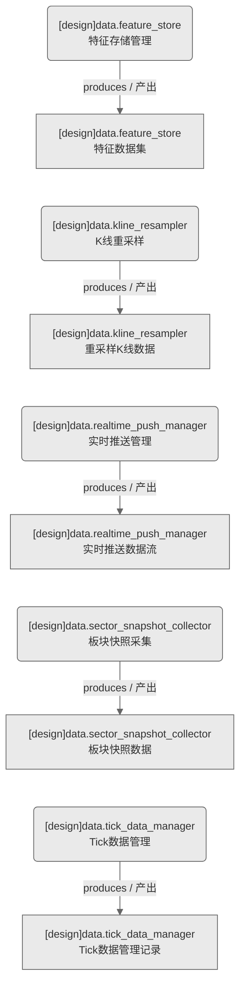

# 数据域-数据采集管理（设计态）

> 生成时间: 2026-07-31T16:17:50
> 真源: `dataflow_graph_registry.yaml` → PostgreSQL `dataflow_*` 表
> 生成器: `generate_dataflow_diagram.py`（全文自动生成，禁止手工编辑）

> **域职责 / Responsibility**: 数据采集与管理——特征存储/K线重采样/实时推送管理/板块快照采集/Tick数据管理

## 数据流图（设计态）

> 节点数: 5 datasets / 数据集, 5 jobs / 作业, 5 edges / 边

## Dataset 清单

| ID | entity_name / 实体名 | scope / 范围 | domain / 域 | module_id / 蓝图 | 功能简述 |
|----|----------------------|--------------|------------|------------------|----------|
| DS-11253 | data.feature_store | production / 生产 | D_DATA | MOD-L00-004 | 特征数据集（特征值/特征元数据/版本管理） |
| DS-11256 | data.kline_resampler | production / 生产 | D_DATA | MOD-L00-004 | 重采样K线数据（多周期K线/自定义周期重采样） |
| DS-11254 | data.realtime_push_manager | production / 生产 | D_DATA | MOD-L00-004 | 实时推送数据流（实时行情/交易推送） |
| DS-11257 | data.sector_snapshot_collector | production / 生产 | D_DATA | MOD-L00-004 | 板块快照数据（板块成分/权重/涨跌统计） |
| DS-11255 | data.tick_data_manager | production / 生产 | D_DATA | MOD-L00-004 | Tick数据管理记录（Tick数据生命周期/清理） |

## Job 清单

| ID | job_name / 作业名 | trigger_type / 触发类型 | module_id / 蓝图 | 功能简述 |
|----|-------------------|----------------------------|------------------|----------|
| JOB-757617 | data.feature_store | scheduled / 定时 | MOD-L00-004 | 特征存储管理（数据采集/管理服务） |
| JOB-757620 | data.kline_resampler | scheduled / 定时 | MOD-L00-004 | K线重采样（数据采集/管理服务） |
| JOB-757618 | data.realtime_push_manager | scheduled / 定时 | MOD-L00-004 | 实时推送管理（数据采集/管理服务） |
| JOB-757621 | data.sector_snapshot_collector | scheduled / 定时 | MOD-L00-004 | 板块快照采集（数据采集/管理服务） |
| JOB-757619 | data.tick_data_manager | scheduled / 定时 | MOD-L00-004 | Tick数据管理（数据采集/管理服务） |

[← 返回索引](dataflow_index.md)
