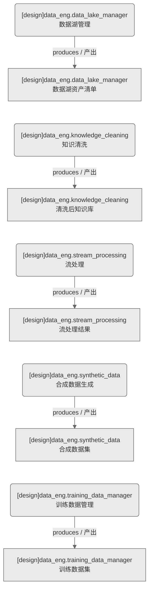

# 数据工程域-数据工程服务（设计态）

> 生成时间: 2026-07-31T16:17:50
> 真源: `dataflow_graph_registry.yaml` → PostgreSQL `dataflow_*` 表
> 生成器: `generate_dataflow_diagram.py`（全文自动生成，禁止手工编辑）

> **域职责 / Responsibility**: 数据工程服务——数据湖管理/知识清洗/流处理/合成数据生成/训练数据管理

## 数据流图（设计态）

> 节点数: 5 datasets / 数据集, 5 jobs / 作业, 5 edges / 边

## Dataset 清单

| ID | entity_name / 实体名 | scope / 范围 | domain / 域 | module_id / 蓝图 | 功能简述 |
|----|----------------------|--------------|------------|------------------|----------|
| DS-11258 | data_eng.data_lake_manager | production / 生产 | D_DATA_ENG | MOD-DATA_ENG | 数据湖资产清单（数据湖存储/分区/生命周期管理） |
| DS-11259 | data_eng.knowledge_cleaning | production / 生产 | D_DATA_ENG | MOD-DATA_ENG | 清洗后知识库（知识数据去重/纠错/标准化） |
| DS-11260 | data_eng.stream_processing | production / 生产 | D_DATA_ENG | MOD-DATA_ENG | 流处理结果（实时数据流计算/窗口聚合） |
| DS-11261 | data_eng.synthetic_data | production / 生产 | D_DATA_ENG | MOD-DATA_ENG | 合成数据集（模拟行情/场景生成数据） |
| DS-11262 | data_eng.training_data_manager | production / 生产 | D_DATA_ENG | MOD-DATA_ENG | 训练数据集（特征/标签/样本管理） |

## Job 清单

| ID | job_name / 作业名 | trigger_type / 触发类型 | module_id / 蓝图 | 功能简述 |
|----|-------------------|----------------------------|------------------|----------|
| JOB-757622 | data_eng.data_lake_manager | scheduled / 定时 | MOD-DATA_ENG | 数据湖管理（数据工程服务） |
| JOB-757623 | data_eng.knowledge_cleaning | scheduled / 定时 | MOD-DATA_ENG | 知识清洗（数据工程服务） |
| JOB-757624 | data_eng.stream_processing | scheduled / 定时 | MOD-DATA_ENG | 流处理（数据工程服务） |
| JOB-757625 | data_eng.synthetic_data | scheduled / 定时 | MOD-DATA_ENG | 合成数据生成（数据工程服务） |
| JOB-757626 | data_eng.training_data_manager | scheduled / 定时 | MOD-DATA_ENG | 训练数据管理（数据工程服务） |

[← 返回索引](dataflow_index.md)
