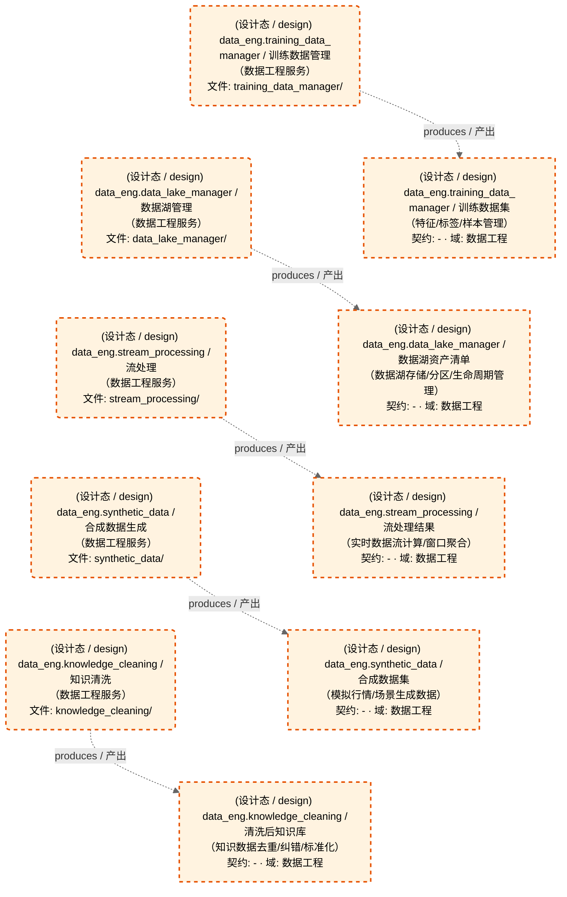

# 数据工程域-数据工程服务

> 生成时间: 2026-08-05T20:31:31
> 真源: `dataflow_graph_registry.yaml` → PostgreSQL `dataflow_*` 表
> 生成器: `generate_dataflow_diagram.py`（全文自动生成，禁止手工编辑）

> **[可缩放 HTML 版 / Zoomable HTML](http://localhost:8765/docs/02_enterprise_architecture/05_dataflow_architecture/_zoomable_html/d_data_eng.html)** — Ctrl+滚轮缩放 ｜ 双击重置 ｜ Ctrl+Shift+D 切换拖动/选择模式

> **域职责 / Responsibility**: 数据工程服务——数据湖管理/知识清洗/流处理/合成数据生成/训练数据管理

## 域基本信息 / Overview

| 字段 | 值 | Field | Value |
|------|------|-------|-------|
| Dataset 数 | 5 | Datasets | 5 |
| Job 数 | 5 | Jobs | 5 |
| 运营态 Dataset | 0 | Production Datasets | 0 |
| 设计态 Dataset | 5 | Design Datasets | 5 |
| 运营态 Job | 0 | Production Jobs | 0 |
| 设计态 Job | 5 | Design Jobs | 5 |

## 数据流图

> **图例说明 / Legend**：
>
> - 🟦 **蓝色 = 运营态节点**（production，已上线运行）
> - 🟧 **橙色虚线 = 设计态节点**（design，蓝图阶段，代码未写）
> - 🟦更浅蓝 = 跨域外部 Dataset（external_prod/external_design）
> - **实线箭头 ``-->`` = 运营态数据流**（两端均 production）
> - **虚线箭头 ``-.->`` = 非运营态数据流**（含 design、混合）
> - 矩形 = Dataset（数据集）/ 圆角矩形 = Job（作业）
> - ``JOB -->|produces / 产出| DS`` = Job 产出 Dataset
> - ``DS -->|consumed by / 被消费于| JOB`` = Job 消费 Dataset

### 全景图（全部模块，颜色区分运营态/设计态）

> 展示全部 10 个节点（Dataset 5 + Job 5），含 5 条边。颜色区分运营态（蓝）/设计态（橙虚线）。

### 运营态的图（仅 design_maturity=production）

> （无模块 / No modules）

### 设计态的图（仅 design_maturity=design）

> 仅展示蓝图阶段、代码未写的设计态节点（设计态：5 datasets / 数据集, 5 jobs / 作业, 5 edges / 边）。

## Dataset 清单

| ID | entity_name / 实体名 | scope / 范围 | domain / 域 | design_maturity / 设计成熟度 | module_id / 蓝图 | 功能简述 |
|----|----------------------|--------------|------------|------------------------------|------------------|----------|
| DS-11258 | data_eng.data_lake_manager | production / 生产 | D_DATA_ENG / 数据工程 | design / 设计 | MOD-DATA_ENG | 数据湖资产清单（数据湖存储/分区/生命周期管理） |
| DS-11259 | data_eng.knowledge_cleaning | production / 生产 | D_DATA_ENG / 数据工程 | design / 设计 | MOD-DATA_ENG | 清洗后知识库（知识数据去重/纠错/标准化） |
| DS-11260 | data_eng.stream_processing | production / 生产 | D_DATA_ENG / 数据工程 | design / 设计 | MOD-DATA_ENG | 流处理结果（实时数据流计算/窗口聚合） |
| DS-11261 | data_eng.synthetic_data | production / 生产 | D_DATA_ENG / 数据工程 | design / 设计 | MOD-DATA_ENG | 合成数据集（模拟行情/场景生成数据） |
| DS-11262 | data_eng.training_data_manager | production / 生产 | D_DATA_ENG / 数据工程 | design / 设计 | MOD-DATA_ENG | 训练数据集（特征/标签/样本管理） |

## Job 清单

| ID | job_name / 作业名 | trigger_type / 触发类型 | design_maturity / 设计成熟度 | module_id / 蓝图 | 功能简述 |
|----|-------------------|----------------------------|------------------------------|------------------|----------|
| JOB-757622 | data_eng.data_lake_manager | scheduled / 定时 | design / 设计 | MOD-DATA_ENG | 数据湖管理（数据工程服务） |
| JOB-757623 | data_eng.knowledge_cleaning | scheduled / 定时 | design / 设计 | MOD-DATA_ENG | 知识清洗（数据工程服务） |
| JOB-757624 | data_eng.stream_processing | scheduled / 定时 | design / 设计 | MOD-DATA_ENG | 流处理（数据工程服务） |
| JOB-757625 | data_eng.synthetic_data | scheduled / 定时 | design / 设计 | MOD-DATA_ENG | 合成数据生成（数据工程服务） |
| JOB-757626 | data_eng.training_data_manager | scheduled / 定时 | design / 设计 | MOD-DATA_ENG | 训练数据管理（数据工程服务） |

[← 返回索引](dataflow_index.md)
