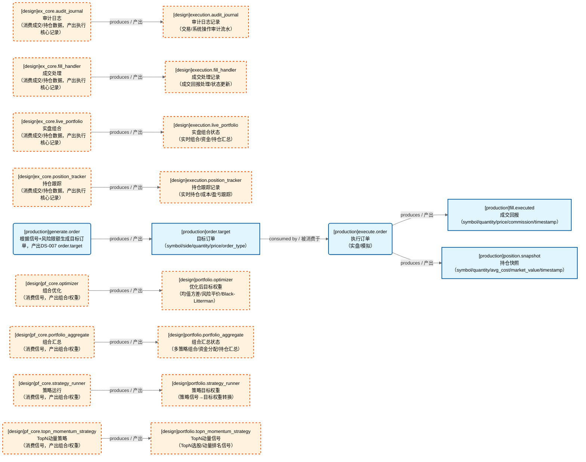
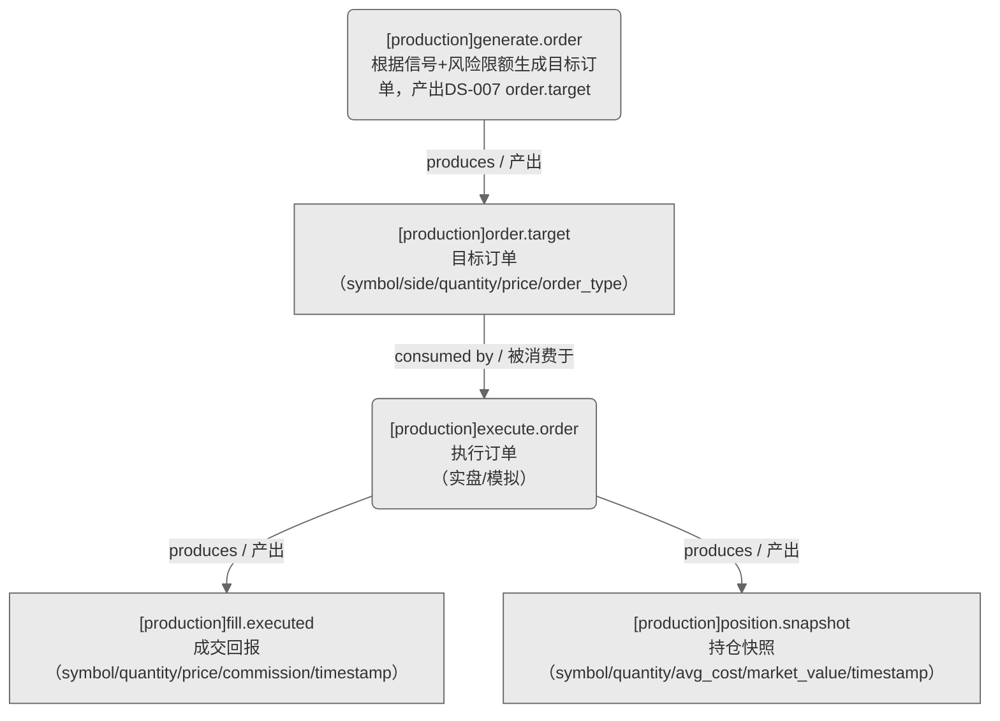

# 执行核心+组合核心域

> 生成时间: 2026-07-31T19:29:38
> 真源: `dataflow_graph_registry.yaml` → PostgreSQL `dataflow_*` 表
> 生成器: `generate_dataflow_diagram.py`（全文自动生成，禁止手工编辑）

> **域职责 / Responsibility**: 执行核心+组合核心——审计日志/成交处理/持仓跟踪/实盘组合 + 组合优化/汇总/策略运行/TopN动量策略

## 数据流图（全景：设计态+运营态合并）

> 节点数: 11 datasets / 数据集, 10 jobs / 作业, 12 edges / 边
>
> **图例**：🟦 蓝色 = 运营态（已实现）/ 🟧 橙色虚线 = 设计态（未实现）

## 数据流图（设计态）

> 节点数: 8 datasets / 数据集, 8 jobs / 作业, 8 edges / 边

```mermaid
%%{init: {'theme': 'base', 'themeVariables': {'primaryColor': '#eaeaea', 'primaryTextColor': '#333333', 'primaryBorderColor': '#666666', 'lineColor': '#666666', 'secondaryColor': '#eaeaea', 'tertiaryColor': '#eaeaea', 'fontSize': '14px'}}}%%
flowchart TD
    DS11263["[design]execution.audit_journal<br/>审计日志记录<br/>（交易/系统操作审计流水）"]
    DS11264["[design]execution.fill_handler<br/>成交处理记录<br/>（成交回报处理/状态更新）"]
    DS11266["[design]execution.live_portfolio<br/>实盘组合状态<br/>（实时组合/资金/持仓汇总）"]
    DS11265["[design]execution.position_tracker<br/>持仓跟踪记录<br/>（实时持仓/成本/盈亏跟踪）"]
    DS11267["[design]portfolio.optimizer<br/>优化后目标权重<br/>（均值方差/风险平价/Black-Litterman）"]
    DS11268["[design]portfolio.portfolio_aggregate<br/>组合汇总状态<br/>（多策略组合/资金分配/持仓汇总）"]
    DS11269["[design]portfolio.strategy_runner<br/>策略目标权重<br/>（策略信号→目标权重转换）"]
    DS11270["[design]portfolio.topn_momentum_strategy<br/>TopN动量信号<br/>（TopN选股/动量排名信号）"]
    JOB757627("[design]ex_core.audit_journal<br/>审计日志<br/>（消费成交/持仓数据，产出执行核心记录）")
    JOB757628("[design]ex_core.fill_handler<br/>成交处理<br/>（消费成交/持仓数据，产出执行核心记录）")
    JOB757630("[design]ex_core.live_portfolio<br/>实盘组合<br/>（消费成交/持仓数据，产出执行核心记录）")
    JOB757629("[design]ex_core.position_tracker<br/>持仓跟踪<br/>（消费成交/持仓数据，产出执行核心记录）")
    JOB757631("[design]pf_core.optimizer<br/>组合优化<br/>（消费信号，产出组合/权重）")
    JOB757632("[design]pf_core.portfolio_aggregate<br/>组合汇总<br/>（消费信号，产出组合/权重）")
    JOB757633("[design]pf_core.strategy_runner<br/>策略运行<br/>（消费信号，产出组合/权重）")
    JOB757634("[design]pf_core.topn_momentum_strategy<br/>TopN动量策略<br/>（消费信号，产出组合/权重）")
    JOB757627 -->|produces / 产出| DS11263
    JOB757628 -->|produces / 产出| DS11264
    JOB757629 -->|produces / 产出| DS11265
    JOB757630 -->|produces / 产出| DS11266
    JOB757631 -->|produces / 产出| DS11267
    JOB757632 -->|produces / 产出| DS11268
    JOB757633 -->|produces / 产出| DS11269
    JOB757634 -->|produces / 产出| DS11270
    DS11263 ~~~ JOB757628
    DS11264 ~~~ JOB757630
    DS11266 ~~~ JOB757629
    DS11265 ~~~ JOB757631
    DS11267 ~~~ JOB757632
    DS11268 ~~~ JOB757633
    DS11269 ~~~ JOB757634
```

## 数据流图（运营态）

> 节点数: 3 datasets / 数据集, 2 jobs / 作业, 4 edges / 边

## Dataset 清单

| ID | entity_name / 实体名 | scope / 范围 | domain / 域 | design_maturity / 设计成熟度 | module_id / 蓝图 | 功能简述 |
|----|----------------------|--------------|------------|------------------------------|------------------|----------|
| DS-11263 | execution.audit_journal | production / 生产 | D_EX_CORE / 执行核心 | design / 设计 | MOD-EX-003 | 审计日志记录（交易/系统操作审计流水） |
| DS-11264 | execution.fill_handler | production / 生产 | D_EX_CORE / 执行核心 | design / 设计 | MOD-EX-001 | 成交处理记录（成交回报处理/状态更新） |
| DS-11266 | execution.live_portfolio | production / 生产 | D_EX_CORE / 执行核心 | design / 设计 | MOD-L06-001 | 实盘组合状态（实时组合/资金/持仓汇总） |
| DS-11265 | execution.position_tracker | production / 生产 | D_EX_CORE / 执行核心 | design / 设计 | MOD-EX-002 | 持仓跟踪记录（实时持仓/成本/盈亏跟踪） |
| DS-12954 | fill.executed / 成交.已成交 | production / 生产 | D_EX_CORE / 执行核心 | production / 生产 | MOD-L06-001 | 成交回报（symbol/quantity/price/commission/timestamp），CTR-005 Fill |
| DS-12953 | order.target / 订单.目标订单 | production / 生产 | D_PF_CORE / 组合核心 | production / 生产 | MOD-L05-001 | 目标订单（symbol/side/quantity/price/order_type），CTR-004 Order |
| DS-11267 | portfolio.optimizer | production / 生产 | D_PF_CORE / 组合核心 | design / 设计 | MOD-PF-001 | 优化后目标权重（均值方差/风险平价/Black-Litterman） |
| DS-11268 | portfolio.portfolio_aggregate | production / 生产 | D_PF_CORE / 组合核心 | design / 设计 | MOD-PF-003 | 组合汇总状态（多策略组合/资金分配/持仓汇总） |
| DS-11269 | portfolio.strategy_runner | production / 生产 | D_PF_CORE / 组合核心 | design / 设计 | MOD-L05-001 | 策略目标权重（策略信号→目标权重转换） |
| DS-11270 | portfolio.topn_momentum_strategy | production / 生产 | D_PF_CORE / 组合核心 | design / 设计 | MOD-L05-001 | TopN动量信号（TopN选股/动量排名信号） |
| DS-12955 | position.snapshot / 持仓.快照 | production / 生产 | D_EX_CORE / 执行核心 | production / 生产 | MOD-L06-001 | 持仓快照（symbol/quantity/avg_cost/market_value/timestamp），CTR-006 PositionSnapshot |

## Job 清单

| ID | job_name / 作业名 | trigger_type / 触发类型 | design_maturity / 设计成熟度 | module_id / 蓝图 | 功能简述 |
|----|-------------------|----------------------------|------------------------------|------------------|----------|
| JOB-757627 | ex_core.audit_journal | event_driven / 事件驱动 | design / 设计 | MOD-EX-003 | 审计日志（消费成交/持仓数据，产出执行核心记录） |
| JOB-757628 | ex_core.fill_handler | event_driven / 事件驱动 | design / 设计 | MOD-EX-001 | 成交处理（消费成交/持仓数据，产出执行核心记录） |
| JOB-757630 | ex_core.live_portfolio | event_driven / 事件驱动 | design / 设计 | MOD-L06-001 | 实盘组合（消费成交/持仓数据，产出执行核心记录） |
| JOB-757629 | ex_core.position_tracker | event_driven / 事件驱动 | design / 设计 | MOD-EX-002 | 持仓跟踪（消费成交/持仓数据，产出执行核心记录） |
| JOB-807121 | execute.order / 执行.订单 | event_driven / 事件驱动 | production / 生产 | MOD-L06-001 | 执行订单（实盘/模拟），产出DS-008 fill.executed + DS-009 position.snapshot |
| JOB-807120 | generate.order / 生成.订单 | event_driven / 事件驱动 | production / 生产 | MOD-L05-001 | 根据信号+风险限额生成目标订单，产出DS-007 order.target |
| JOB-757631 | pf_core.optimizer | event_driven / 事件驱动 | design / 设计 | MOD-PF-001 | 组合优化（消费信号，产出组合/权重） |
| JOB-757632 | pf_core.portfolio_aggregate | event_driven / 事件驱动 | design / 设计 | MOD-PF-003 | 组合汇总（消费信号，产出组合/权重） |
| JOB-757633 | pf_core.strategy_runner | event_driven / 事件驱动 | design / 设计 | MOD-L05-001 | 策略运行（消费信号，产出组合/权重） |
| JOB-757634 | pf_core.topn_momentum_strategy | event_driven / 事件驱动 | design / 设计 | MOD-L05-001 | TopN动量策略（消费信号，产出组合/权重） |

[← 返回索引](dataflow_index.md)
