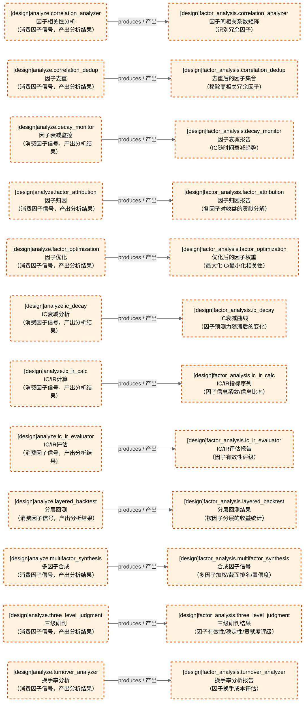

# 因子域-因子分析

> 生成时间: 2026-07-31T17:03:35
> 真源: `dataflow_graph_registry.yaml` → PostgreSQL `dataflow_*` 表
> 生成器: `generate_dataflow_diagram.py`（全文自动生成，禁止手工编辑）

> **域职责 / Responsibility**: 因子分析与评估——IC/IR计算评估、衰减监控、相关性去重、归因、优化、分层回测、多因子合成、三级研判、换手率分析

## 数据流图（全景：设计态+运营态合并）

> 节点数: 12 datasets / 数据集, 12 jobs / 作业, 12 edges / 边
>
> **图例**：🟦 蓝色 = 运营态（已实现）/ 🟧 橙色虚线 = 设计态（未实现）

## 数据流图（设计态）

> 节点数: 12 datasets / 数据集, 12 jobs / 作业, 12 edges / 边

```mermaid
%%{init: {'theme': 'base', 'themeVariables': {'primaryColor': '#eaeaea', 'primaryTextColor': '#333333', 'primaryBorderColor': '#666666', 'lineColor': '#666666', 'secondaryColor': '#eaeaea', 'tertiaryColor': '#eaeaea', 'fontSize': '14px'}}}%%
flowchart TD
    DS11227["[design]factor_analysis.correlation_analyzer<br/>因子间相关系数矩阵<br/>（识别冗余因子）"]
    DS11228["[design]factor_analysis.correlation_dedup<br/>去重后的因子集合<br/>（移除高相关冗余因子）"]
    DS11229["[design]factor_analysis.decay_monitor<br/>因子衰减报告<br/>（IC随时间衰减趋势）"]
    DS11230["[design]factor_analysis.factor_attribution<br/>因子归因报告<br/>（各因子对收益的贡献分解）"]
    DS11231["[design]factor_analysis.factor_optimization<br/>优化后的因子权重<br/>（最大化IC/最小化相关性）"]
    DS11232["[design]factor_analysis.ic_decay<br/>IC衰减曲线<br/>（因子预测力随滞后的变化）"]
    DS11233["[design]factor_analysis.ic_ir_calc<br/>IC/IR指标序列<br/>（因子信息系数/信息比率）"]
    DS11234["[design]factor_analysis.ic_ir_evaluator<br/>IC/IR评估报告<br/>（因子有效性评级）"]
    DS11235["[design]factor_analysis.layered_backtest<br/>分层回测结果<br/>（按因子分层的收益统计）"]
    DS11236["[design]factor_analysis.multifactor_synthesis<br/>合成因子信号<br/>（多因子加权/截面排名/置信度）"]
    DS11237["[design]factor_analysis.three_level_judgment<br/>三级研判结果<br/>（因子有效性/稳定性/贡献度评级）"]
    DS11238["[design]factor_analysis.turnover_analyzer<br/>换手率分析报告<br/>（因子换手成本评估）"]
    JOB757591("[design]analyze.correlation_analyzer<br/>因子相关性分析<br/>（消费因子信号，产出分析结果）")
    JOB757592("[design]analyze.correlation_dedup<br/>因子去重<br/>（消费因子信号，产出分析结果）")
    JOB757593("[design]analyze.decay_monitor<br/>因子衰减监控<br/>（消费因子信号，产出分析结果）")
    JOB757594("[design]analyze.factor_attribution<br/>因子归因<br/>（消费因子信号，产出分析结果）")
    JOB757595("[design]analyze.factor_optimization<br/>因子优化<br/>（消费因子信号，产出分析结果）")
    JOB757596("[design]analyze.ic_decay<br/>IC衰减分析<br/>（消费因子信号，产出分析结果）")
    JOB757597("[design]analyze.ic_ir_calc<br/>IC/IR计算<br/>（消费因子信号，产出分析结果）")
    JOB757598("[design]analyze.ic_ir_evaluator<br/>IC/IR评估<br/>（消费因子信号，产出分析结果）")
    JOB757599("[design]analyze.layered_backtest<br/>分层回测<br/>（消费因子信号，产出分析结果）")
    JOB757600("[design]analyze.multifactor_synthesis<br/>多因子合成<br/>（消费因子信号，产出分析结果）")
    JOB757601("[design]analyze.three_level_judgment<br/>三级研判<br/>（消费因子信号，产出分析结果）")
    JOB757602("[design]analyze.turnover_analyzer<br/>换手率分析<br/>（消费因子信号，产出分析结果）")
    JOB757591 -->|produces / 产出| DS11227
    JOB757592 -->|produces / 产出| DS11228
    JOB757593 -->|produces / 产出| DS11229
    JOB757594 -->|produces / 产出| DS11230
    JOB757595 -->|produces / 产出| DS11231
    JOB757596 -->|produces / 产出| DS11232
    JOB757597 -->|produces / 产出| DS11233
    JOB757598 -->|produces / 产出| DS11234
    JOB757599 -->|produces / 产出| DS11235
    JOB757600 -->|produces / 产出| DS11236
    JOB757601 -->|produces / 产出| DS11237
    JOB757602 -->|produces / 产出| DS11238
    DS11227 ~~~ JOB757592
    DS11228 ~~~ JOB757593
    DS11229 ~~~ JOB757594
    DS11230 ~~~ JOB757595
    DS11231 ~~~ JOB757596
    DS11232 ~~~ JOB757597
    DS11233 ~~~ JOB757598
    DS11234 ~~~ JOB757599
    DS11235 ~~~ JOB757600
    DS11236 ~~~ JOB757601
    DS11237 ~~~ JOB757602
```

## Dataset 清单

| ID | entity_name / 实体名 | scope / 范围 | domain / 域 | design_maturity / 设计成熟度 | module_id / 蓝图 | 功能简述 |
|----|----------------------|--------------|------------|------------------------------|------------------|----------|
| DS-11227 | factor_analysis.correlation_analyzer | production / 生产 | D_FACTOR / 因子 | design / 设计 | MOD-L02-001 | 因子间相关系数矩阵（识别冗余因子） |
| DS-11228 | factor_analysis.correlation_dedup | production / 生产 | D_FACTOR / 因子 | design / 设计 | MOD-L02-001 | 去重后的因子集合（移除高相关冗余因子） |
| DS-11229 | factor_analysis.decay_monitor | production / 生产 | D_FACTOR / 因子 | design / 设计 | MOD-L02-001 | 因子衰减报告（IC随时间衰减趋势） |
| DS-11230 | factor_analysis.factor_attribution | production / 生产 | D_FACTOR / 因子 | design / 设计 | MOD-L02-001 | 因子归因报告（各因子对收益的贡献分解） |
| DS-11231 | factor_analysis.factor_optimization | production / 生产 | D_FACTOR / 因子 | design / 设计 | MOD-L02-001 | 优化后的因子权重（最大化IC/最小化相关性） |
| DS-11232 | factor_analysis.ic_decay | production / 生产 | D_FACTOR / 因子 | design / 设计 | MOD-L02-001 | IC衰减曲线（因子预测力随滞后的变化） |
| DS-11233 | factor_analysis.ic_ir_calc | production / 生产 | D_FACTOR / 因子 | design / 设计 | MOD-L02-001 | IC/IR指标序列（因子信息系数/信息比率） |
| DS-11234 | factor_analysis.ic_ir_evaluator | production / 生产 | D_FACTOR / 因子 | design / 设计 | MOD-L02-001 | IC/IR评估报告（因子有效性评级） |
| DS-11235 | factor_analysis.layered_backtest | production / 生产 | D_FACTOR / 因子 | design / 设计 | MOD-L02-001 | 分层回测结果（按因子分层的收益统计） |
| DS-11236 | factor_analysis.multifactor_synthesis | production / 生产 | D_FACTOR / 因子 | design / 设计 | MOD-L02-001 | 合成因子信号（多因子加权/截面排名/置信度） |
| DS-11237 | factor_analysis.three_level_judgment | production / 生产 | D_FACTOR / 因子 | design / 设计 | MOD-L02-001 | 三级研判结果（因子有效性/稳定性/贡献度评级） |
| DS-11238 | factor_analysis.turnover_analyzer | production / 生产 | D_FACTOR / 因子 | design / 设计 | MOD-L02-001 | 换手率分析报告（因子换手成本评估） |

## Job 清单

| ID | job_name / 作业名 | trigger_type / 触发类型 | design_maturity / 设计成熟度 | module_id / 蓝图 | 功能简述 |
|----|-------------------|----------------------------|------------------------------|------------------|----------|
| JOB-757591 | analyze.correlation_analyzer | manual / 手动 | design / 设计 | MOD-L02-001 | 因子相关性分析（消费因子信号，产出分析结果） |
| JOB-757592 | analyze.correlation_dedup | manual / 手动 | design / 设计 | MOD-L02-001 | 因子去重（消费因子信号，产出分析结果） |
| JOB-757593 | analyze.decay_monitor | manual / 手动 | design / 设计 | MOD-L02-001 | 因子衰减监控（消费因子信号，产出分析结果） |
| JOB-757594 | analyze.factor_attribution | manual / 手动 | design / 设计 | MOD-L02-001 | 因子归因（消费因子信号，产出分析结果） |
| JOB-757595 | analyze.factor_optimization | manual / 手动 | design / 设计 | MOD-L02-001 | 因子优化（消费因子信号，产出分析结果） |
| JOB-757596 | analyze.ic_decay | manual / 手动 | design / 设计 | MOD-L02-001 | IC衰减分析（消费因子信号，产出分析结果） |
| JOB-757597 | analyze.ic_ir_calc | manual / 手动 | design / 设计 | MOD-L02-001 | IC/IR计算（消费因子信号，产出分析结果） |
| JOB-757598 | analyze.ic_ir_evaluator | manual / 手动 | design / 设计 | MOD-L02-001 | IC/IR评估（消费因子信号，产出分析结果） |
| JOB-757599 | analyze.layered_backtest | manual / 手动 | design / 设计 | MOD-L02-001 | 分层回测（消费因子信号，产出分析结果） |
| JOB-757600 | analyze.multifactor_synthesis | manual / 手动 | design / 设计 | MOD-L02-001 | 多因子合成（消费因子信号，产出分析结果） |
| JOB-757601 | analyze.three_level_judgment | manual / 手动 | design / 设计 | MOD-L02-001 | 三级研判（消费因子信号，产出分析结果） |
| JOB-757602 | analyze.turnover_analyzer | manual / 手动 | design / 设计 | MOD-L02-001 | 换手率分析（消费因子信号，产出分析结果） |

[← 返回索引](dataflow_index.md)
