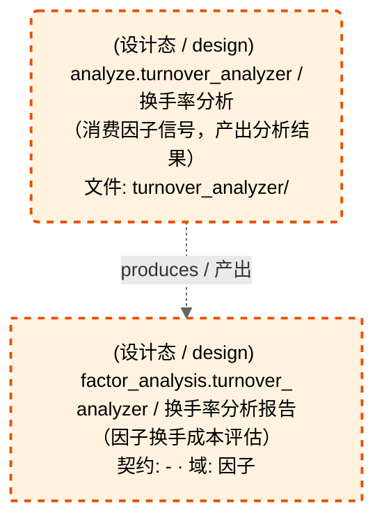

# 因子域-因子分析

> 生成时间: 2026-08-03T12:37:17
> 真源: `dataflow_graph_registry.yaml` → PostgreSQL `dataflow_*` 表
> 生成器: `generate_dataflow_diagram.py`（全文自动生成，禁止手工编辑）

> **[可缩放 HTML 版 / Zoomable HTML](http://localhost:8765/docs/02_enterprise_architecture/05_dataflow_architecture/_zoomable_html/d_factor_analysis.html)** — Ctrl+滚轮缩放 ｜ 双击重置 ｜ Ctrl+Shift+D 切换拖动/选择模式

> **域职责 / Responsibility**: 因子分析与评估——IC/IR计算评估、衰减监控、相关性去重、归因、优化、分层回测、多因子合成、三级研判、换手率分析

## 域基本信息 / Overview

| 字段 | 值 | Field | Value |
|------|------|-------|-------|
| Dataset 数 | 12 | Datasets | 12 |
| Job 数 | 12 | Jobs | 12 |
| 运营态 Dataset | 11 | Production Datasets | 11 |
| 设计态 Dataset | 1 | Design Datasets | 1 |
| 运营态 Job | 11 | Production Jobs | 11 |
| 设计态 Job | 1 | Design Jobs | 1 |

## 数据流图

> **图例说明 / Legend**：
>
> - 🟦 **蓝色 = 运营态节点**（production，已上线运行）
> - 🟧 **橙色虚线 = 设计态节点**（design，蓝图阶段，代码未写）
> - 🟦更浅蓝 = 跨域外部 Dataset（external_prod/external_design）
> - **实线箭头 ``-->`` = 运营态数据流**（两端均 production）
> - **虚线箭头 ``-.->`` = 非运营态数据流**（含 design、混合）
> - 矩形 = Dataset（数据集）/ 圆角矩形 = Job（作业）
> - ``JOB -->|produces / 产出| DS`` = Job 产出 Dataset
> - ``DS -->|consumed by / 被消费于| JOB`` = Job 消费 Dataset

### 全景图（全部模块，颜色区分运营态/设计态）

> 展示全部 24 个节点（Dataset 12 + Job 12），含 12 条边。颜色区分运营态（蓝）/设计态（橙虚线）。

```mermaid
%%{init: {'theme': 'base', 'themeVariables': {'primaryColor': '#eaeaea', 'primaryTextColor': '#333333', 'primaryBorderColor': '#666666', 'lineColor': '#666666', 'secondaryColor': '#eaeaea', 'tertiaryColor': '#eaeaea', 'clusterBkg': 'transparent', 'clusterBorder': 'transparent', 'fontSize': '14px'}}}%%
flowchart TD
    DS22779["(生产态 / production) factor_<br/>analysis.correlation_analyzer /<br/>因子间相关系数矩阵<br/>（识别冗余因子）<br/>契约: - · 域: 因子"]
    DS22780["(生产态 / production) factor_<br/>analysis.correlation_dedup / 去重后的因子集合<br/>（移除高相关冗余因子）<br/>契约: - · 域: 因子"]
    DS22781["(生产态 / production) factor_analysis.decay_<br/>monitor / 因子衰减报告<br/>（IC随时间衰减趋势）<br/>契约: - · 域: 因子"]
    DS22782["(生产态 / production) factor_analysis.factor_<br/>attribution / 因子归因报告<br/>（各因子对收益的贡献分解）<br/>契约: - · 域: 因子"]
    DS22783["(生产态 / production) factor_analysis.factor_<br/>optimization / 优化后的因子权重<br/>（最大化IC/最小化相关性）<br/>契约: - · 域: 因子"]
    DS22784["(生产态 / production) factor_analysis.ic_decay<br/>/ IC衰减曲线<br/>（因子预测力随滞后的变化）<br/>契约: - · 域: 因子"]
    DS22785["(生产态 / production) factor_analysis.ic_ir_<br/>calc / IC/IR指标序列<br/>（因子信息系数/信息比率）<br/>契约: - · 域: 因子"]
    DS22786["(生产态 / production) factor_analysis.ic_ir_<br/>evaluator / IC/IR评估报告<br/>（因子有效性评级）<br/>契约: - · 域: 因子"]
    DS22787["(生产态 / production) factor_analysis.layered_<br/>backtest / 分层回测结果<br/>（按因子分层的收益统计）<br/>契约: - · 域: 因子"]
    DS22788["(生产态 / production) factor_<br/>analysis.multifactor_synthesis / 合成因子信号<br/>（多因子加权/截面排名/置信度）<br/>契约: - · 域: 因子"]
    DS22789["(生产态 / production) factor_analysis.three_<br/>level_judgment / 三级研判结果<br/>（因子有效性/稳定性/贡献度评级）<br/>契约: - · 域: 因子"]
    DS11238["(设计态 / design) factor_analysis.turnover_<br/>analyzer / 换手率分析报告<br/>（因子换手成本评估）<br/>契约: - · 域: 因子"]
    JOB1023281("(生产态 / production) analyze.correlation_<br/>analyzer / 因子相关性分析<br/>（消费因子信号，产出分析结果）<br/>文件: analysis/correlation_analyzer.py")
    JOB1023282("(生产态 / production) analyze.correlation_dedup<br/>/ 因子去重<br/>（消费因子信号，产出分析结果）<br/>文件: analysis/correlation_dedup.py")
    JOB1023283("(生产态 / production) analyze.decay_monitor /<br/>因子衰减监控<br/>（消费因子信号，产出分析结果）<br/>文件: analysis/decay_monitor.py")
    JOB1023284("(生产态 / production) analyze.factor_<br/>attribution / 因子归因<br/>（消费因子信号，产出分析结果）<br/>文件: analysis/factor_attribution.py")
    JOB1023285("(生产态 / production) analyze.factor_<br/>optimization / 因子优化<br/>（消费因子信号，产出分析结果）<br/>文件: analysis/factor_optimization.py")
    JOB1023286("(生产态 / production) analyze.ic_decay /<br/>IC衰减分析<br/>（消费因子信号，产出分析结果）<br/>文件: analysis/ic_decay.py")
    JOB1023287("(生产态 / production) analyze.ic_ir_calc / IC<br/>/IR计算<br/>（消费因子信号，产出分析结果）<br/>文件: analysis/ic_ir_calc.py")
    JOB1023288("(生产态 / production) analyze.ic_ir_evaluator /<br/>IC/IR评估<br/>（消费因子信号，产出分析结果）<br/>文件: analysis/ic_ir_evaluator.py")
    JOB1023289("(生产态 / production) analyze.layered_backtest<br/>/ 分层回测<br/>（消费因子信号，产出分析结果）<br/>文件: analysis/layered_backtest.py")
    JOB1023290("(生产态 / production) analyze.multifactor_<br/>synthesis / 多因子合成<br/>（消费因子信号，产出分析结果）<br/>文件: analysis/multifactor_synthesis.py")
    JOB1023291("(生产态 / production) analyze.three_level_<br/>judgment / 三级研判<br/>（消费因子信号，产出分析结果）<br/>文件: analysis/three_level_judgment.py")
    JOB757602("(设计态 / design) analyze.turnover_analyzer /<br/>换手率分析<br/>（消费因子信号，产出分析结果）<br/>文件: turnover_analyzer/")
    JOB757602 -.->|produces / 产出| DS11238
    JOB1023281 -->|produces / 产出| DS22779
    JOB1023282 -->|produces / 产出| DS22780
    JOB1023283 -->|produces / 产出| DS22781
    JOB1023284 -->|produces / 产出| DS22782
    JOB1023285 -->|produces / 产出| DS22783
    JOB1023286 -->|produces / 产出| DS22784
    JOB1023287 -->|produces / 产出| DS22785
    JOB1023288 -->|produces / 产出| DS22786
    JOB1023289 -->|produces / 产出| DS22787
    JOB1023290 -->|produces / 产出| DS22788
    JOB1023291 -->|produces / 产出| DS22789
    JOB757602 ~~~ JOB1023286
    JOB1023286 ~~~ JOB1023282
    JOB1023282 ~~~ JOB1023287
    JOB1023287 ~~~ JOB1023285
    JOB1023285 ~~~ JOB1023283
    JOB1023283 ~~~ JOB1023291
    JOB1023291 ~~~ JOB1023281
    JOB1023281 ~~~ JOB1023290
    JOB1023290 ~~~ JOB1023288
    JOB1023288 ~~~ JOB1023289
    JOB1023289 ~~~ JOB1023284
    DS11238 ~~~ DS22784
    DS22784 ~~~ DS22780
    DS22780 ~~~ DS22785
    DS22785 ~~~ DS22783
    DS22783 ~~~ DS22781
    DS22781 ~~~ DS22789
    DS22789 ~~~ DS22779
    DS22779 ~~~ DS22788
    DS22788 ~~~ DS22786
    DS22786 ~~~ DS22787
    DS22787 ~~~ DS22782
    classDef production fill:#e1f5fe,stroke:#01579b,stroke-width:2px,color:#000
    classDef design fill:#fff3e0,stroke:#e65100,stroke-width:2px,color:#000,stroke-dasharray: 5 5
    classDef external_prod fill:#e8f4fd,stroke:#0277bd,stroke-width:1px,color:#000
    classDef external_design fill:#fff8e7,stroke:#ef6c00,stroke-width:1px,color:#000,stroke-dasharray: 5 5
    class DS22779,DS22780,DS22781,DS22782,DS22783,DS22784,DS22785,DS22786,DS22787,DS22788,DS22789,JOB1023281,JOB1023282,JOB1023283,JOB1023284,JOB1023285,JOB1023286,JOB1023287,JOB1023288,JOB1023289,JOB1023290,JOB1023291 production
    class DS11238,JOB757602 design
```

### 运营态的图（仅 design_maturity=production）

> 仅展示已实现稳定运行的节点（运营态：11 datasets / 数据集, 11 jobs / 作业, 11 edges / 边）。

```mermaid
%%{init: {'theme': 'base', 'themeVariables': {'primaryColor': '#eaeaea', 'primaryTextColor': '#333333', 'primaryBorderColor': '#666666', 'lineColor': '#666666', 'secondaryColor': '#eaeaea', 'tertiaryColor': '#eaeaea', 'clusterBkg': 'transparent', 'clusterBorder': 'transparent', 'fontSize': '14px'}}}%%
flowchart TD
    DS22779["(生产态 / production) factor_<br/>analysis.correlation_analyzer /<br/>因子间相关系数矩阵<br/>（识别冗余因子）<br/>契约: - · 域: 因子"]
    DS22780["(生产态 / production) factor_<br/>analysis.correlation_dedup / 去重后的因子集合<br/>（移除高相关冗余因子）<br/>契约: - · 域: 因子"]
    DS22781["(生产态 / production) factor_analysis.decay_<br/>monitor / 因子衰减报告<br/>（IC随时间衰减趋势）<br/>契约: - · 域: 因子"]
    DS22782["(生产态 / production) factor_analysis.factor_<br/>attribution / 因子归因报告<br/>（各因子对收益的贡献分解）<br/>契约: - · 域: 因子"]
    DS22783["(生产态 / production) factor_analysis.factor_<br/>optimization / 优化后的因子权重<br/>（最大化IC/最小化相关性）<br/>契约: - · 域: 因子"]
    DS22784["(生产态 / production) factor_analysis.ic_decay<br/>/ IC衰减曲线<br/>（因子预测力随滞后的变化）<br/>契约: - · 域: 因子"]
    DS22785["(生产态 / production) factor_analysis.ic_ir_<br/>calc / IC/IR指标序列<br/>（因子信息系数/信息比率）<br/>契约: - · 域: 因子"]
    DS22786["(生产态 / production) factor_analysis.ic_ir_<br/>evaluator / IC/IR评估报告<br/>（因子有效性评级）<br/>契约: - · 域: 因子"]
    DS22787["(生产态 / production) factor_analysis.layered_<br/>backtest / 分层回测结果<br/>（按因子分层的收益统计）<br/>契约: - · 域: 因子"]
    DS22788["(生产态 / production) factor_<br/>analysis.multifactor_synthesis / 合成因子信号<br/>（多因子加权/截面排名/置信度）<br/>契约: - · 域: 因子"]
    DS22789["(生产态 / production) factor_analysis.three_<br/>level_judgment / 三级研判结果<br/>（因子有效性/稳定性/贡献度评级）<br/>契约: - · 域: 因子"]
    JOB1023281("(生产态 / production) analyze.correlation_<br/>analyzer / 因子相关性分析<br/>（消费因子信号，产出分析结果）<br/>文件: analysis/correlation_analyzer.py")
    JOB1023282("(生产态 / production) analyze.correlation_dedup<br/>/ 因子去重<br/>（消费因子信号，产出分析结果）<br/>文件: analysis/correlation_dedup.py")
    JOB1023283("(生产态 / production) analyze.decay_monitor /<br/>因子衰减监控<br/>（消费因子信号，产出分析结果）<br/>文件: analysis/decay_monitor.py")
    JOB1023284("(生产态 / production) analyze.factor_<br/>attribution / 因子归因<br/>（消费因子信号，产出分析结果）<br/>文件: analysis/factor_attribution.py")
    JOB1023285("(生产态 / production) analyze.factor_<br/>optimization / 因子优化<br/>（消费因子信号，产出分析结果）<br/>文件: analysis/factor_optimization.py")
    JOB1023286("(生产态 / production) analyze.ic_decay /<br/>IC衰减分析<br/>（消费因子信号，产出分析结果）<br/>文件: analysis/ic_decay.py")
    JOB1023287("(生产态 / production) analyze.ic_ir_calc / IC<br/>/IR计算<br/>（消费因子信号，产出分析结果）<br/>文件: analysis/ic_ir_calc.py")
    JOB1023288("(生产态 / production) analyze.ic_ir_evaluator /<br/>IC/IR评估<br/>（消费因子信号，产出分析结果）<br/>文件: analysis/ic_ir_evaluator.py")
    JOB1023289("(生产态 / production) analyze.layered_backtest<br/>/ 分层回测<br/>（消费因子信号，产出分析结果）<br/>文件: analysis/layered_backtest.py")
    JOB1023290("(生产态 / production) analyze.multifactor_<br/>synthesis / 多因子合成<br/>（消费因子信号，产出分析结果）<br/>文件: analysis/multifactor_synthesis.py")
    JOB1023291("(生产态 / production) analyze.three_level_<br/>judgment / 三级研判<br/>（消费因子信号，产出分析结果）<br/>文件: analysis/three_level_judgment.py")
    JOB1023281 -->|produces / 产出| DS22779
    JOB1023282 -->|produces / 产出| DS22780
    JOB1023283 -->|produces / 产出| DS22781
    JOB1023284 -->|produces / 产出| DS22782
    JOB1023285 -->|produces / 产出| DS22783
    JOB1023286 -->|produces / 产出| DS22784
    JOB1023287 -->|produces / 产出| DS22785
    JOB1023288 -->|produces / 产出| DS22786
    JOB1023289 -->|produces / 产出| DS22787
    JOB1023290 -->|produces / 产出| DS22788
    JOB1023291 -->|produces / 产出| DS22789
    JOB1023286 ~~~ JOB1023282
    JOB1023282 ~~~ JOB1023287
    JOB1023287 ~~~ JOB1023285
    JOB1023285 ~~~ JOB1023283
    JOB1023283 ~~~ JOB1023291
    JOB1023291 ~~~ JOB1023281
    JOB1023281 ~~~ JOB1023290
    JOB1023290 ~~~ JOB1023288
    JOB1023288 ~~~ JOB1023289
    JOB1023289 ~~~ JOB1023284
    DS22784 ~~~ DS22780
    DS22780 ~~~ DS22785
    DS22785 ~~~ DS22783
    DS22783 ~~~ DS22781
    DS22781 ~~~ DS22789
    DS22789 ~~~ DS22779
    DS22779 ~~~ DS22788
    DS22788 ~~~ DS22786
    DS22786 ~~~ DS22787
    DS22787 ~~~ DS22782
    classDef production fill:#e1f5fe,stroke:#01579b,stroke-width:2px,color:#000
    classDef design fill:#fff3e0,stroke:#e65100,stroke-width:2px,color:#000,stroke-dasharray: 5 5
    classDef external_prod fill:#e8f4fd,stroke:#0277bd,stroke-width:1px,color:#000
    classDef external_design fill:#fff8e7,stroke:#ef6c00,stroke-width:1px,color:#000,stroke-dasharray: 5 5
    class DS22779,DS22780,DS22781,DS22782,DS22783,DS22784,DS22785,DS22786,DS22787,DS22788,DS22789,JOB1023281,JOB1023282,JOB1023283,JOB1023284,JOB1023285,JOB1023286,JOB1023287,JOB1023288,JOB1023289,JOB1023290,JOB1023291 production
```

### 设计态的图（仅 design_maturity=design）

> 仅展示蓝图阶段、代码未写的设计态节点（设计态：1 datasets / 数据集, 1 jobs / 作业, 1 edges / 边）。

## Dataset 清单

| ID | entity_name / 实体名 | scope / 范围 | domain / 域 | design_maturity / 设计成熟度 | module_id / 蓝图 | 功能简述 |
|----|----------------------|--------------|------------|------------------------------|------------------|----------|
| DS-22779 | factor_analysis.correlation_analyzer | production / 生产 | D_FACTOR / 因子 | production / 生产 | MOD-L02-005 | 因子间相关系数矩阵（识别冗余因子） |
| DS-22780 | factor_analysis.correlation_dedup | production / 生产 | D_FACTOR / 因子 | production / 生产 | MOD-L02-006 | 去重后的因子集合（移除高相关冗余因子） |
| DS-22781 | factor_analysis.decay_monitor | production / 生产 | D_FACTOR / 因子 | production / 生产 | MOD-L02-009 | 因子衰减报告（IC随时间衰减趋势） |
| DS-22782 | factor_analysis.factor_attribution | production / 生产 | D_FACTOR / 因子 | production / 生产 | MOD-L02-010 | 因子归因报告（各因子对收益的贡献分解） |
| DS-22783 | factor_analysis.factor_optimization | production / 生产 | D_FACTOR / 因子 | production / 生产 | MOD-L02-012 | 优化后的因子权重（最大化IC/最小化相关性） |
| DS-22784 | factor_analysis.ic_decay | production / 生产 | D_FACTOR / 因子 | production / 生产 | MOD-L02-004 | IC衰减曲线（因子预测力随滞后的变化） |
| DS-22785 | factor_analysis.ic_ir_calc | production / 生产 | D_FACTOR / 因子 | production / 生产 | MOD-L02-002 | IC/IR指标序列（因子信息系数/信息比率） |
| DS-22786 | factor_analysis.ic_ir_evaluator | production / 生产 | D_FACTOR / 因子 | production / 生产 | MOD-L02-003 | IC/IR评估报告（因子有效性评级） |
| DS-22787 | factor_analysis.layered_backtest | production / 生产 | D_FACTOR / 因子 | production / 生产 | MOD-L02-007 | 分层回测结果（按因子分层的收益统计） |
| DS-22788 | factor_analysis.multifactor_synthesis | production / 生产 | D_FACTOR / 因子 | production / 生产 | MOD-L02-011 | 合成因子信号（多因子加权/截面排名/置信度） |
| DS-22789 | factor_analysis.three_level_judgment | production / 生产 | D_FACTOR / 因子 | production / 生产 | MOD-L02-008 | 三级研判结果（因子有效性/稳定性/贡献度评级） |
| DS-11238 | factor_analysis.turnover_analyzer | production / 生产 | D_FACTOR / 因子 | design / 设计 | MOD-L02-001 | 换手率分析报告（因子换手成本评估） |

## Job 清单

| ID | job_name / 作业名 | trigger_type / 触发类型 | design_maturity / 设计成熟度 | module_id / 蓝图 | 功能简述 |
|----|-------------------|----------------------------|------------------------------|------------------|----------|
| JOB-1023281 | analyze.correlation_analyzer | manual / 手动 | production / 生产 | MOD-L02-005 | 因子相关性分析（消费因子信号，产出分析结果） |
| JOB-1023282 | analyze.correlation_dedup | manual / 手动 | production / 生产 | MOD-L02-006 | 因子去重（消费因子信号，产出分析结果） |
| JOB-1023283 | analyze.decay_monitor | manual / 手动 | production / 生产 | MOD-L02-009 | 因子衰减监控（消费因子信号，产出分析结果） |
| JOB-1023284 | analyze.factor_attribution | manual / 手动 | production / 生产 | MOD-L02-010 | 因子归因（消费因子信号，产出分析结果） |
| JOB-1023285 | analyze.factor_optimization | manual / 手动 | production / 生产 | MOD-L02-012 | 因子优化（消费因子信号，产出分析结果） |
| JOB-1023286 | analyze.ic_decay | manual / 手动 | production / 生产 | MOD-L02-004 | IC衰减分析（消费因子信号，产出分析结果） |
| JOB-1023287 | analyze.ic_ir_calc | manual / 手动 | production / 生产 | MOD-L02-002 | IC/IR计算（消费因子信号，产出分析结果） |
| JOB-1023288 | analyze.ic_ir_evaluator | manual / 手动 | production / 生产 | MOD-L02-003 | IC/IR评估（消费因子信号，产出分析结果） |
| JOB-1023289 | analyze.layered_backtest | manual / 手动 | production / 生产 | MOD-L02-007 | 分层回测（消费因子信号，产出分析结果） |
| JOB-1023290 | analyze.multifactor_synthesis | manual / 手动 | production / 生产 | MOD-L02-011 | 多因子合成（消费因子信号，产出分析结果） |
| JOB-1023291 | analyze.three_level_judgment | manual / 手动 | production / 生产 | MOD-L02-008 | 三级研判（消费因子信号，产出分析结果） |
| JOB-757602 | analyze.turnover_analyzer | manual / 手动 | design / 设计 | MOD-L02-001 | 换手率分析（消费因子信号，产出分析结果） |

[← 返回索引](dataflow_index.md)
