# 因子域-A股因子计算（设计态）

> 生成时间: 2026-07-31T16:17:50
> 真源: `dataflow_graph_registry.yaml` → PostgreSQL `dataflow_*` 表
> 生成器: `generate_dataflow_diagram.py`（全文自动生成，禁止手工编辑）

> **域职责 / Responsibility**: A股Alpha因子计算——Alpha87/资金流/跨市场/基本面/机构/日内/IRL/市场结构/微观结构/形态/PS流动性/板块/SMC/技术指标等14类截面因子信号

## 数据流图（设计态）

> 节点数: 14 datasets / 数据集, 14 jobs / 作业, 14 edges / 边

```mermaid
%%{init: {'theme': 'base', 'themeVariables': {'primaryColor': '#eaeaea', 'primaryTextColor': '#333333', 'primaryBorderColor': '#666666', 'lineColor': '#666666', 'secondaryColor': '#eaeaea', 'tertiaryColor': '#eaeaea', 'fontSize': '14px'}}}%%
flowchart TD
    DS11213["[design]factor.ashare_alpha87<br/>A股Alpha#87因子信号"]
    DS11214["[design]factor.ashare_capital_flow<br/>A股资金流向因子"]
    DS11215["[design]factor.ashare_cross_market<br/>A股跨市场因子"]
    DS11216["[design]factor.ashare_fundamental<br/>A股基本面因子"]
    DS11217["[design]factor.ashare_institutional<br/>A股机构持仓变动因子"]
    DS11218["[design]factor.ashare_intraday<br/>A股日内动量因子"]
    DS11219["[design]factor.ashare_irl<br/>A股IRL因子"]
    DS11220["[design]factor.ashare_market_structure<br/>A股市场结构因子"]
    DS11221["[design]factor.ashare_microstructure<br/>A股微观结构因子"]
    DS11222["[design]factor.ashare_pattern_signal<br/>A股K线形态因子"]
    DS11223["[design]factor.ashare_ps_liquidity<br/>A股PS流动性因子"]
    DS11224["[design]factor.ashare_sector<br/>A股板块轮动因子"]
    DS11225["[design]factor.ashare_smc<br/>A股SMC因子"]
    DS11226["[design]factor.ashare_technical_indicator<br/>A股技术指标因子"]
    JOB757577("[design]compute.ashare_alpha87<br/>计算Alpha#87因子")
    JOB757578("[design]compute.ashare_capital_flow<br/>计算资金流因子")
    JOB757579("[design]compute.ashare_cross_market<br/>计算跨市场因子")
    JOB757580("[design]compute.ashare_fundamental<br/>计算基本面因子")
    JOB757581("[design]compute.ashare_institutional<br/>计算机构行为因子")
    JOB757582("[design]compute.ashare_intraday<br/>计算日内因子")
    JOB757583("[design]compute.ashare_irl<br/>计算逆强化学习因子")
    JOB757584("[design]compute.ashare_market_structure<br/>计算市场结构因子")
    JOB757585("[design]compute.ashare_microstructure<br/>计算微观结构因子")
    JOB757586("[design]compute.ashare_pattern_signal<br/>计算形态信号因子")
    JOB757587("[design]compute.ashare_ps_liquidity<br/>计算流动性因子")
    JOB757588("[design]compute.ashare_sector<br/>计算板块因子")
    JOB757589("[design]compute.ashare_smc<br/>计算智能货币概念因子")
    JOB757590("[design]compute.ashare_technical_indicator<br/>计算技术指标因子")
    JOB757577 -->|produces / 产出| DS11213
    JOB757578 -->|produces / 产出| DS11214
    JOB757579 -->|produces / 产出| DS11215
    JOB757580 -->|produces / 产出| DS11216
    JOB757581 -->|produces / 产出| DS11217
    JOB757582 -->|produces / 产出| DS11218
    JOB757583 -->|produces / 产出| DS11219
    JOB757584 -->|produces / 产出| DS11220
    JOB757585 -->|produces / 产出| DS11221
    JOB757586 -->|produces / 产出| DS11222
    JOB757587 -->|produces / 产出| DS11223
    JOB757588 -->|produces / 产出| DS11224
    JOB757589 -->|produces / 产出| DS11225
    JOB757590 -->|produces / 产出| DS11226
    DS11213 ~~~ JOB757578
    DS11214 ~~~ JOB757579
    DS11215 ~~~ JOB757580
    DS11216 ~~~ JOB757581
    DS11217 ~~~ JOB757582
    DS11218 ~~~ JOB757583
    DS11219 ~~~ JOB757584
    DS11220 ~~~ JOB757585
    DS11221 ~~~ JOB757586
    DS11222 ~~~ JOB757587
    DS11223 ~~~ JOB757588
    DS11224 ~~~ JOB757589
    DS11225 ~~~ JOB757590
```

## Dataset 清单

| ID | entity_name / 实体名 | scope / 范围 | domain / 域 | module_id / 蓝图 | 功能简述 |
|----|----------------------|--------------|------------|------------------|----------|
| DS-11213 | factor.ashare_alpha87 | production / 生产 | D_FACTOR / 因子 | MOD-L02-001 | A股Alpha#87因子信号（多因子截面排名） |
| DS-11214 | factor.ashare_capital_flow | production / 生产 | D_FACTOR / 因子 | MOD-L02-001 | A股资金流向因子（主力资金净流入/流出） |
| DS-11215 | factor.ashare_cross_market | production / 生产 | D_FACTOR / 因子 | MOD-L02-001 | A股跨市场因子（AH股溢价/跨市套利信号） |
| DS-11216 | factor.ashare_fundamental | production / 生产 | D_FACTOR / 因子 | MOD-L02-001 | A股基本面因子（PE/PB/ROE/股息率等） |
| DS-11217 | factor.ashare_institutional | production / 生产 | D_FACTOR / 因子 | MOD-L02-001 | A股机构持仓变动因子（基金/外资持仓变化） |
| DS-11218 | factor.ashare_intraday | production / 生产 | D_FACTOR / 因子 | MOD-L02-001 | A股日内动量因子（开盘/尾盘效应） |
| DS-11219 | factor.ashare_irl | production / 生产 | D_FACTOR / 因子 | MOD-L02-001 | A股IRL因子（逆强化学习推导的交易偏好信号） |
| DS-11220 | factor.ashare_market_structure | production / 生产 | D_FACTOR / 因子 | MOD-L02-001 | A股市场结构因子（支撑压力/趋势结构） |
| DS-11221 | factor.ashare_microstructure | production / 生产 | D_FACTOR / 因子 | MOD-L02-001 | A股微观结构因子（订单簿不平衡/买卖价差） |
| DS-11222 | factor.ashare_pattern_signal | production / 生产 | D_FACTOR / 因子 | MOD-L02-001 | A股K线形态因子（技术形态识别信号） |
| DS-11223 | factor.ashare_ps_liquidity | production / 生产 | D_FACTOR / 因子 | MOD-L02-001 | A股PS流动性因子（换手率/成交额流动性指标） |
| DS-11224 | factor.ashare_sector | production / 生产 | D_FACTOR / 因子 | MOD-L02-001 | A股板块轮动因子（行业板块动量/资金流） |
| DS-11225 | factor.ashare_smc | production / 生产 | D_FACTOR / 因子 | MOD-L02-001 | A股SMC因子（智能货币概念/机构筹码分布） |
| DS-11226 | factor.ashare_technical_indicator | production / 生产 | D_FACTOR / 因子 | MOD-L02-001 | A股技术指标因子（MACD/RSI/KDJ等） |

## Job 清单

| ID | job_name / 作业名 | trigger_type / 触发类型 | module_id / 蓝图 | 功能简述 |
|----|-------------------|----------------------------|------------------|----------|
| JOB-757577 | compute.ashare_alpha87 | event_driven / 事件驱动 | MOD-L02-001 | 计算Alpha#87因子（消费OHLC K线，产出因子信号） |
| JOB-757578 | compute.ashare_capital_flow | event_driven / 事件驱动 | MOD-L02-001 | 计算资金流因子（消费OHLC K线，产出因子信号） |
| JOB-757579 | compute.ashare_cross_market | event_driven / 事件驱动 | MOD-L02-001 | 计算跨市场因子（消费OHLC K线，产出因子信号） |
| JOB-757580 | compute.ashare_fundamental | event_driven / 事件驱动 | MOD-L02-001 | 计算基本面因子（消费OHLC K线，产出因子信号） |
| JOB-757581 | compute.ashare_institutional | event_driven / 事件驱动 | MOD-L02-001 | 计算机构行为因子（消费OHLC K线，产出因子信号） |
| JOB-757582 | compute.ashare_intraday | event_driven / 事件驱动 | MOD-L02-001 | 计算日内因子（消费OHLC K线，产出因子信号） |
| JOB-757583 | compute.ashare_irl | event_driven / 事件驱动 | MOD-L02-001 | 计算逆强化学习因子（消费OHLC K线，产出因子信号） |
| JOB-757584 | compute.ashare_market_structure | event_driven / 事件驱动 | MOD-L02-001 | 计算市场结构因子（消费OHLC K线，产出因子信号） |
| JOB-757585 | compute.ashare_microstructure | event_driven / 事件驱动 | MOD-L02-001 | 计算微观结构因子（消费OHLC K线，产出因子信号） |
| JOB-757586 | compute.ashare_pattern_signal | event_driven / 事件驱动 | MOD-L02-001 | 计算形态信号因子（消费OHLC K线，产出因子信号） |
| JOB-757587 | compute.ashare_ps_liquidity | event_driven / 事件驱动 | MOD-L02-001 | 计算流动性因子（消费OHLC K线，产出因子信号） |
| JOB-757588 | compute.ashare_sector | event_driven / 事件驱动 | MOD-L02-001 | 计算板块因子（消费OHLC K线，产出因子信号） |
| JOB-757589 | compute.ashare_smc | event_driven / 事件驱动 | MOD-L02-001 | 计算智能货币概念因子（消费OHLC K线，产出因子信号） |
| JOB-757590 | compute.ashare_technical_indicator | event_driven / 事件驱动 | MOD-L02-001 | 计算技术指标因子（消费OHLC K线，产出因子信号） |

[← 返回索引](dataflow_index.md)
