# 因子域-A股因子计算

> 生成时间: 2026-08-01T22:21:37
> 真源: `dataflow_graph_registry.yaml` → PostgreSQL `dataflow_*` 表
> 生成器: `generate_dataflow_diagram.py`（全文自动生成，禁止手工编辑）

> **[可缩放 HTML 版 / Zoomable HTML](http://localhost:8765/docs/02_enterprise_architecture/05_dataflow_architecture/_zoomable_html/d_factor_ashare.html)** — Ctrl+滚轮缩放 ｜ 双击重置 ｜ Ctrl+Shift+D 切换拖动/选择模式

> **域职责 / Responsibility**: A股Alpha因子计算——Alpha87/资金流/跨市场/基本面/机构/日内/IRL/市场结构/微观结构/形态/PS流动性/板块/SMC/技术指标等14类截面因子信号

## 域基本信息 / Overview

| 字段 | 值 | Field | Value |
|------|------|-------|-------|
| Dataset 数 | 14 | Datasets | 14 |
| Job 数 | 14 | Jobs | 14 |
| 运营态 Dataset | 0 | Production Datasets | 0 |
| 设计态 Dataset | 14 | Design Datasets | 14 |
| 运营态 Job | 0 | Production Jobs | 0 |
| 设计态 Job | 14 | Design Jobs | 14 |

## 数据流图

> **图例说明 / Legend**：
>
> - 🟦 **蓝色 = 运营态节点**（production，已上线运行）
> - 🟧 **橙色虚线 = 设计态节点**（design，蓝图阶段，代码未写）
> - 🟦更浅蓝 = 跨域外部 Dataset（external_prod/external_design）
> - **实线箭头 ``-->`` = 运营态数据流**（两端均 production）
> - **虚线箭头 ``-.->`` = 非运营态数据流**（含 design、混合）
> - 矩形 = Dataset（数据集）/ 圆角矩形 = Job（作业）
> - ``JOB -->|produces / 产出| DS`` = Job 产出 Dataset
> - ``DS -->|consumed by / 被消费于| JOB`` = Job 消费 Dataset

### 全景图（全部模块，颜色区分运营态/设计态）

> 展示全部 28 个节点（Dataset 14 + Job 14），含 14 条边。颜色区分运营态（蓝）/设计态（橙虚线）。

### 运营态的图（仅 design_maturity=production）

> （无模块 / No modules）

### 设计态的图（仅 design_maturity=design）

> 仅展示蓝图阶段、代码未写的设计态节点（设计态：14 datasets / 数据集, 14 jobs / 作业, 14 edges / 边）。

```mermaid
%%{init: {'theme': 'base', 'themeVariables': {'primaryColor': '#eaeaea', 'primaryTextColor': '#333333', 'primaryBorderColor': '#666666', 'lineColor': '#666666', 'secondaryColor': '#eaeaea', 'tertiaryColor': '#eaeaea', 'clusterBkg': 'transparent', 'clusterBorder': 'transparent', 'fontSize': '14px'}}}%%
flowchart TD
    DS11213["(设计态 / design) factor.ashare_alpha87 /<br/>A股Alpha#87因子信号<br/>（多因子截面排名）<br/>契约: - · 域: 因子"]
    DS11214["(设计态 / design) factor.ashare_capital_flow /<br/>A股资金流向因子<br/>（主力资金净流入/流出）<br/>契约: - · 域: 因子"]
    DS11215["(设计态 / design) factor.ashare_cross_market /<br/>A股跨市场因子<br/>（AH股溢价/跨市套利信号）<br/>契约: - · 域: 因子"]
    DS11216["(设计态 / design) factor.ashare_fundamental /<br/>A股基本面因子<br/>（PE/PB/ROE/股息率等）<br/>契约: - · 域: 因子"]
    DS11217["(设计态 / design) factor.ashare_institutional /<br/>A股机构持仓变动因子<br/>（基金/外资持仓变化）<br/>契约: - · 域: 因子"]
    DS11218["(设计态 / design) factor.ashare_intraday /<br/>A股日内动量因子<br/>（开盘/尾盘效应）<br/>契约: - · 域: 因子"]
    DS11219["(设计态 / design) factor.ashare_irl / A股IRL因子<br/>（逆强化学习推导的交易偏好信号）<br/>契约: - · 域: 因子"]
    DS11220["(设计态 / design) factor.ashare_market_<br/>structure / A股市场结构因子<br/>（支撑压力/趋势结构）<br/>契约: - · 域: 因子"]
    DS11221["(设计态 / design) factor.ashare_microstructure<br/>/ A股微观结构因子<br/>（订单簿不平衡/买卖价差）<br/>契约: - · 域: 因子"]
    DS11222["(设计态 / design) factor.ashare_pattern_signal<br/>/ A股K线形态因子<br/>（技术形态识别信号）<br/>契约: - · 域: 因子"]
    DS11223["(设计态 / design) factor.ashare_ps_liquidity /<br/>A股PS流动性因子<br/>（换手率/成交额流动性指标）<br/>契约: - · 域: 因子"]
    DS11224["(设计态 / design) factor.ashare_sector /<br/>A股板块轮动因子<br/>（行业板块动量/资金流）<br/>契约: - · 域: 因子"]
    DS11225["(设计态 / design) factor.ashare_smc / A股SMC因子<br/>（智能货币概念/机构筹码分布）<br/>契约: - · 域: 因子"]
    DS11226["(设计态 / design) factor.ashare_technical_<br/>indicator / A股技术指标因子<br/>（MACD/RSI/KDJ等）<br/>契约: - · 域: 因子"]
    JOB757577("(设计态 / design) compute.ashare_alpha87 /<br/>计算Alpha#87因子<br/>（消费OHLC K线，产出因子信号）<br/>文件: alpha87/")
    JOB757578("(设计态 / design) compute.ashare_capital_flow /<br/>计算资金流因子<br/>（消费OHLC K线，产出因子信号）<br/>文件: capital_flow/")
    JOB757579("(设计态 / design) compute.ashare_cross_market /<br/>计算跨市场因子<br/>（消费OHLC K线，产出因子信号）<br/>文件: cross_market/")
    JOB757580("(设计态 / design) compute.ashare_fundamental /<br/>计算基本面因子<br/>（消费OHLC K线，产出因子信号）<br/>文件: fundamental/")
    JOB757581("(设计态 / design) compute.ashare_institutional<br/>/ 计算机构行为因子<br/>（消费OHLC K线，产出因子信号）<br/>文件: institutional/")
    JOB757582("(设计态 / design) compute.ashare_intraday /<br/>计算日内因子<br/>（消费OHLC K线，产出因子信号）<br/>文件: intraday/")
    JOB757583("(设计态 / design) compute.ashare_irl /<br/>计算逆强化学习因子<br/>（消费OHLC K线，产出因子信号）<br/>文件: irl/")
    JOB757584("(设计态 / design) compute.ashare_market_<br/>structure / 计算市场结构因子<br/>（消费OHLC K线，产出因子信号）<br/>文件: market_structure/")
    JOB757585("(设计态 / design) compute.ashare_microstructure<br/>/ 计算微观结构因子<br/>（消费OHLC K线，产出因子信号）<br/>文件: microstructure/")
    JOB757586("(设计态 / design) compute.ashare_pattern_signal<br/>/ 计算形态信号因子<br/>（消费OHLC K线，产出因子信号）<br/>文件: pattern_signal/")
    JOB757587("(设计态 / design) compute.ashare_ps_liquidity /<br/>计算流动性因子<br/>（消费OHLC K线，产出因子信号）<br/>文件: ps_liquidity/")
    JOB757588("(设计态 / design) compute.ashare_sector /<br/>计算板块因子<br/>（消费OHLC K线，产出因子信号）<br/>文件: sector/")
    JOB757589("(设计态 / design) compute.ashare_smc /<br/>计算智能货币概念因子<br/>（消费OHLC K线，产出因子信号）<br/>文件: smc/")
    JOB757590("(设计态 / design) compute.ashare_technical_<br/>indicator / 计算技术指标因子<br/>（消费OHLC K线，产出因子信号）<br/>文件: technical_indicator/")
    JOB757577 -.->|produces / 产出| DS11213
    JOB757578 -.->|produces / 产出| DS11214
    JOB757579 -.->|produces / 产出| DS11215
    JOB757580 -.->|produces / 产出| DS11216
    JOB757581 -.->|produces / 产出| DS11217
    JOB757582 -.->|produces / 产出| DS11218
    JOB757583 -.->|produces / 产出| DS11219
    JOB757584 -.->|produces / 产出| DS11220
    JOB757585 -.->|produces / 产出| DS11221
    JOB757586 -.->|produces / 产出| DS11222
    JOB757587 -.->|produces / 产出| DS11223
    JOB757588 -.->|produces / 产出| DS11224
    JOB757589 -.->|produces / 产出| DS11225
    JOB757590 -.->|produces / 产出| DS11226
    JOB757584 ~~~ JOB757582
    JOB757582 ~~~ JOB757589
    JOB757589 ~~~ JOB757580
    JOB757580 ~~~ JOB757581
    JOB757581 ~~~ JOB757586
    JOB757586 ~~~ JOB757588
    JOB757588 ~~~ JOB757590
    JOB757590 ~~~ JOB757579
    JOB757579 ~~~ JOB757585
    JOB757585 ~~~ JOB757587
    JOB757587 ~~~ JOB757578
    JOB757578 ~~~ JOB757577
    JOB757577 ~~~ JOB757583
    DS11220 ~~~ DS11218
    DS11218 ~~~ DS11225
    DS11225 ~~~ DS11216
    DS11216 ~~~ DS11217
    DS11217 ~~~ DS11222
    DS11222 ~~~ DS11224
    DS11224 ~~~ DS11226
    DS11226 ~~~ DS11215
    DS11215 ~~~ DS11221
    DS11221 ~~~ DS11223
    DS11223 ~~~ DS11214
    DS11214 ~~~ DS11213
    DS11213 ~~~ DS11219
    classDef production fill:#e1f5fe,stroke:#01579b,stroke-width:2px,color:#000
    classDef design fill:#fff3e0,stroke:#e65100,stroke-width:2px,color:#000,stroke-dasharray: 5 5
    classDef external_prod fill:#e8f4fd,stroke:#0277bd,stroke-width:1px,color:#000
    classDef external_design fill:#fff8e7,stroke:#ef6c00,stroke-width:1px,color:#000,stroke-dasharray: 5 5
    class DS11213,DS11214,DS11215,DS11216,DS11217,DS11218,DS11219,DS11220,DS11221,DS11222,DS11223,DS11224,DS11225,DS11226,JOB757577,JOB757578,JOB757579,JOB757580,JOB757581,JOB757582,JOB757583,JOB757584,JOB757585,JOB757586,JOB757587,JOB757588,JOB757589,JOB757590 design
```

## Dataset 清单

| ID | entity_name / 实体名 | scope / 范围 | domain / 域 | design_maturity / 设计成熟度 | module_id / 蓝图 | 功能简述 |
|----|----------------------|--------------|------------|------------------------------|------------------|----------|
| DS-11213 | factor.ashare_alpha87 | production / 生产 | D_FACTOR / 因子 | design / 设计 | MOD-L02-001 | A股Alpha#87因子信号（多因子截面排名） |
| DS-11214 | factor.ashare_capital_flow | production / 生产 | D_FACTOR / 因子 | design / 设计 | MOD-L02-001 | A股资金流向因子（主力资金净流入/流出） |
| DS-11215 | factor.ashare_cross_market | production / 生产 | D_FACTOR / 因子 | design / 设计 | MOD-L02-001 | A股跨市场因子（AH股溢价/跨市套利信号） |
| DS-11216 | factor.ashare_fundamental | production / 生产 | D_FACTOR / 因子 | design / 设计 | MOD-L02-001 | A股基本面因子（PE/PB/ROE/股息率等） |
| DS-11217 | factor.ashare_institutional | production / 生产 | D_FACTOR / 因子 | design / 设计 | MOD-L02-001 | A股机构持仓变动因子（基金/外资持仓变化） |
| DS-11218 | factor.ashare_intraday | production / 生产 | D_FACTOR / 因子 | design / 设计 | MOD-L02-001 | A股日内动量因子（开盘/尾盘效应） |
| DS-11219 | factor.ashare_irl | production / 生产 | D_FACTOR / 因子 | design / 设计 | MOD-L02-001 | A股IRL因子（逆强化学习推导的交易偏好信号） |
| DS-11220 | factor.ashare_market_structure | production / 生产 | D_FACTOR / 因子 | design / 设计 | MOD-L02-001 | A股市场结构因子（支撑压力/趋势结构） |
| DS-11221 | factor.ashare_microstructure | production / 生产 | D_FACTOR / 因子 | design / 设计 | MOD-L02-001 | A股微观结构因子（订单簿不平衡/买卖价差） |
| DS-11222 | factor.ashare_pattern_signal | production / 生产 | D_FACTOR / 因子 | design / 设计 | MOD-L02-001 | A股K线形态因子（技术形态识别信号） |
| DS-11223 | factor.ashare_ps_liquidity | production / 生产 | D_FACTOR / 因子 | design / 设计 | MOD-L02-001 | A股PS流动性因子（换手率/成交额流动性指标） |
| DS-11224 | factor.ashare_sector | production / 生产 | D_FACTOR / 因子 | design / 设计 | MOD-L02-001 | A股板块轮动因子（行业板块动量/资金流） |
| DS-11225 | factor.ashare_smc | production / 生产 | D_FACTOR / 因子 | design / 设计 | MOD-L02-001 | A股SMC因子（智能货币概念/机构筹码分布） |
| DS-11226 | factor.ashare_technical_indicator | production / 生产 | D_FACTOR / 因子 | design / 设计 | MOD-L02-001 | A股技术指标因子（MACD/RSI/KDJ等） |

## Job 清单

| ID | job_name / 作业名 | trigger_type / 触发类型 | design_maturity / 设计成熟度 | module_id / 蓝图 | 功能简述 |
|----|-------------------|----------------------------|------------------------------|------------------|----------|
| JOB-757577 | compute.ashare_alpha87 | event_driven / 事件驱动 | design / 设计 | MOD-L02-001 | 计算Alpha#87因子（消费OHLC K线，产出因子信号） |
| JOB-757578 | compute.ashare_capital_flow | event_driven / 事件驱动 | design / 设计 | MOD-L02-001 | 计算资金流因子（消费OHLC K线，产出因子信号） |
| JOB-757579 | compute.ashare_cross_market | event_driven / 事件驱动 | design / 设计 | MOD-L02-001 | 计算跨市场因子（消费OHLC K线，产出因子信号） |
| JOB-757580 | compute.ashare_fundamental | event_driven / 事件驱动 | design / 设计 | MOD-L02-001 | 计算基本面因子（消费OHLC K线，产出因子信号） |
| JOB-757581 | compute.ashare_institutional | event_driven / 事件驱动 | design / 设计 | MOD-L02-001 | 计算机构行为因子（消费OHLC K线，产出因子信号） |
| JOB-757582 | compute.ashare_intraday | event_driven / 事件驱动 | design / 设计 | MOD-L02-001 | 计算日内因子（消费OHLC K线，产出因子信号） |
| JOB-757583 | compute.ashare_irl | event_driven / 事件驱动 | design / 设计 | MOD-L02-001 | 计算逆强化学习因子（消费OHLC K线，产出因子信号） |
| JOB-757584 | compute.ashare_market_structure | event_driven / 事件驱动 | design / 设计 | MOD-L02-001 | 计算市场结构因子（消费OHLC K线，产出因子信号） |
| JOB-757585 | compute.ashare_microstructure | event_driven / 事件驱动 | design / 设计 | MOD-L02-001 | 计算微观结构因子（消费OHLC K线，产出因子信号） |
| JOB-757586 | compute.ashare_pattern_signal | event_driven / 事件驱动 | design / 设计 | MOD-L02-001 | 计算形态信号因子（消费OHLC K线，产出因子信号） |
| JOB-757587 | compute.ashare_ps_liquidity | event_driven / 事件驱动 | design / 设计 | MOD-L02-001 | 计算流动性因子（消费OHLC K线，产出因子信号） |
| JOB-757588 | compute.ashare_sector | event_driven / 事件驱动 | design / 设计 | MOD-L02-001 | 计算板块因子（消费OHLC K线，产出因子信号） |
| JOB-757589 | compute.ashare_smc | event_driven / 事件驱动 | design / 设计 | MOD-L02-001 | 计算智能货币概念因子（消费OHLC K线，产出因子信号） |
| JOB-757590 | compute.ashare_technical_indicator | event_driven / 事件驱动 | design / 设计 | MOD-L02-001 | 计算技术指标因子（消费OHLC K线，产出因子信号） |

[← 返回索引](dataflow_index.md)
