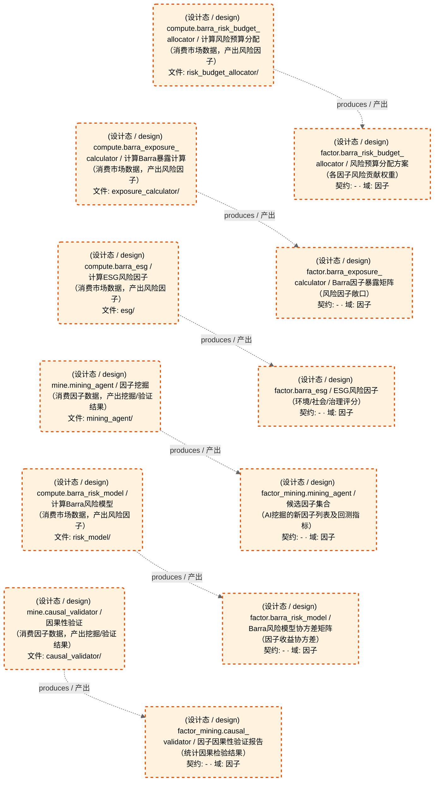

# 因子域-Barra风险模型与因子挖掘

> 生成时间: 2026-08-01T22:11:49
> 真源: `dataflow_graph_registry.yaml` → PostgreSQL `dataflow_*` 表
> 生成器: `generate_dataflow_diagram.py`（全文自动生成，禁止手工编辑）

> **[可缩放 HTML 版 / Zoomable HTML](http://localhost:8765/docs/02_enterprise_architecture/05_dataflow_architecture/_zoomable_html/d_factor_barra_mine.html)** — Ctrl+滚轮缩放 ｜ 双击重置 ｜ Ctrl+Shift+D 切换拖动/选择模式

> **域职责 / Responsibility**: Barra风险模型与因子挖掘——ESG/暴露计算/风险预算/协方差风险模型 + 因果性验证/AI因子挖掘Agent

## 域基本信息 / Overview

| 字段 | 值 | Field | Value |
|------|------|-------|-------|
| Dataset 数 | 6 | Datasets | 6 |
| Job 数 | 6 | Jobs | 6 |
| 运营态 Dataset | 0 | Production Datasets | 0 |
| 设计态 Dataset | 6 | Design Datasets | 6 |
| 运营态 Job | 0 | Production Jobs | 0 |
| 设计态 Job | 6 | Design Jobs | 6 |

## 数据流图

> **图例说明 / Legend**：
>
> - 🟦 **蓝色 = 运营态节点**（production，已上线运行）
> - 🟧 **橙色虚线 = 设计态节点**（design，蓝图阶段，代码未写）
> - 🟦更浅蓝 = 跨域外部 Dataset（external_prod/external_design）
> - **实线箭头 ``-->`` = 运营态数据流**（两端均 production）
> - **虚线箭头 ``-.->`` = 非运营态数据流**（含 design、混合）
> - 矩形 = Dataset（数据集）/ 圆角矩形 = Job（作业）
> - ``JOB -->|produces / 产出| DS`` = Job 产出 Dataset
> - ``DS -->|consumed by / 被消费于| JOB`` = Job 消费 Dataset

### 全景图（全部模块，颜色区分运营态/设计态）

> 展示全部 12 个节点（Dataset 6 + Job 6），含 6 条边。颜色区分运营态（蓝）/设计态（橙虚线）。

### 运营态的图（仅 design_maturity=production）

> （无模块 / No modules）

### 设计态的图（仅 design_maturity=design）

> 仅展示蓝图阶段、代码未写的设计态节点（设计态：6 datasets / 数据集, 6 jobs / 作业, 6 edges / 边）。

## Dataset 清单

| ID | entity_name / 实体名 | scope / 范围 | domain / 域 | design_maturity / 设计成熟度 | module_id / 蓝图 | 功能简述 |
|----|----------------------|--------------|------------|------------------------------|------------------|----------|
| DS-11239 | factor.barra_esg | production / 生产 | D_FACTOR / 因子 | design / 设计 | MOD-L02-001 | ESG风险因子（环境/社会/治理评分） |
| DS-11240 | factor.barra_exposure_calculator | production / 生产 | D_FACTOR / 因子 | design / 设计 | MOD-L02-001 | Barra因子暴露矩阵（风险因子敞口） |
| DS-11241 | factor.barra_risk_budget_allocator | production / 生产 | D_FACTOR / 因子 | design / 设计 | MOD-L02-001 | 风险预算分配方案（各因子风险贡献权重） |
| DS-11242 | factor.barra_risk_model | production / 生产 | D_FACTOR / 因子 | design / 设计 | MOD-L02-001 | Barra风险模型协方差矩阵（因子收益协方差） |
| DS-11243 | factor_mining.causal_validator | production / 生产 | D_FACTOR / 因子 | design / 设计 | MOD-L02-001 | 因子因果性验证报告（统计因果检验结果） |
| DS-11244 | factor_mining.mining_agent | production / 生产 | D_FACTOR / 因子 | design / 设计 | MOD-L02-001 | 候选因子集合（AI挖掘的新因子列表及回测指标） |

## Job 清单

| ID | job_name / 作业名 | trigger_type / 触发类型 | design_maturity / 设计成熟度 | module_id / 蓝图 | 功能简述 |
|----|-------------------|----------------------------|------------------------------|------------------|----------|
| JOB-757603 | compute.barra_esg | event_driven / 事件驱动 | design / 设计 | MOD-L02-001 | 计算ESG风险因子（消费市场数据，产出风险因子） |
| JOB-757604 | compute.barra_exposure_calculator | event_driven / 事件驱动 | design / 设计 | MOD-L02-001 | 计算Barra暴露计算（消费市场数据，产出风险因子） |
| JOB-757605 | compute.barra_risk_budget_allocator | event_driven / 事件驱动 | design / 设计 | MOD-L02-001 | 计算风险预算分配（消费市场数据，产出风险因子） |
| JOB-757606 | compute.barra_risk_model | event_driven / 事件驱动 | design / 设计 | MOD-L02-001 | 计算Barra风险模型（消费市场数据，产出风险因子） |
| JOB-757607 | mine.causal_validator | manual / 手动 | design / 设计 | MOD-L02-001 | 因果性验证（消费因子数据，产出挖掘/验证结果） |
| JOB-757608 | mine.mining_agent | manual / 手动 | design / 设计 | MOD-L02-001 | 因子挖掘（消费因子数据，产出挖掘/验证结果） |

[← 返回索引](dataflow_index.md)
