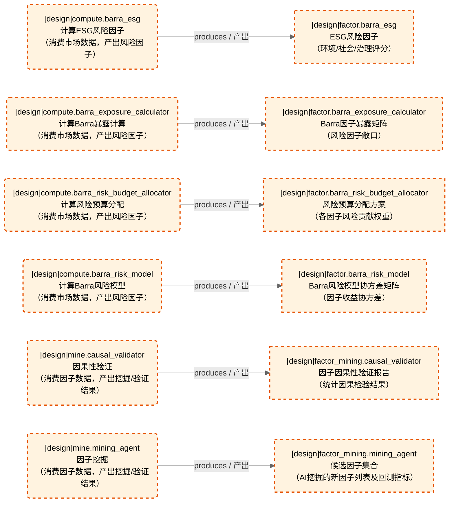
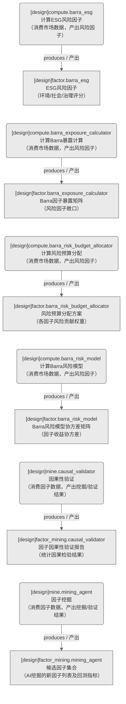

# 因子域-Barra风险模型与因子挖掘

> 生成时间: 2026-07-31T17:14:43
> 真源: `dataflow_graph_registry.yaml` → PostgreSQL `dataflow_*` 表
> 生成器: `generate_dataflow_diagram.py`（全文自动生成，禁止手工编辑）

> **域职责 / Responsibility**: Barra风险模型与因子挖掘——ESG/暴露计算/风险预算/协方差风险模型 + 因果性验证/AI因子挖掘Agent

## 数据流图（全景：设计态+运营态合并）

> 节点数: 6 datasets / 数据集, 6 jobs / 作业, 6 edges / 边
>
> **图例**：🟦 蓝色 = 运营态（已实现）/ 🟧 橙色虚线 = 设计态（未实现）

## 数据流图（设计态）

> 节点数: 6 datasets / 数据集, 6 jobs / 作业, 6 edges / 边

## Dataset 清单

| ID | entity_name / 实体名 | scope / 范围 | domain / 域 | design_maturity / 设计成熟度 | module_id / 蓝图 | 功能简述 |
|----|----------------------|--------------|------------|------------------------------|------------------|----------|
| DS-11239 | factor.barra_esg | production / 生产 | D_FACTOR / 因子 | design / 设计 | MOD-L02-001 | ESG风险因子（环境/社会/治理评分） |
| DS-11240 | factor.barra_exposure_calculator | production / 生产 | D_FACTOR / 因子 | design / 设计 | MOD-L02-001 | Barra因子暴露矩阵（风险因子敞口） |
| DS-11241 | factor.barra_risk_budget_allocator | production / 生产 | D_FACTOR / 因子 | design / 设计 | MOD-L02-001 | 风险预算分配方案（各因子风险贡献权重） |
| DS-11242 | factor.barra_risk_model | production / 生产 | D_FACTOR / 因子 | design / 设计 | MOD-L02-001 | Barra风险模型协方差矩阵（因子收益协方差） |
| DS-11243 | factor_mining.causal_validator | production / 生产 | D_FACTOR / 因子 | design / 设计 | MOD-L02-001 | 因子因果性验证报告（统计因果检验结果） |
| DS-11244 | factor_mining.mining_agent | production / 生产 | D_FACTOR / 因子 | design / 设计 | MOD-L02-001 | 候选因子集合（AI挖掘的新因子列表及回测指标） |

## Job 清单

| ID | job_name / 作业名 | trigger_type / 触发类型 | design_maturity / 设计成熟度 | module_id / 蓝图 | 功能简述 |
|----|-------------------|----------------------------|------------------------------|------------------|----------|
| JOB-757603 | compute.barra_esg | event_driven / 事件驱动 | design / 设计 | MOD-L02-001 | 计算ESG风险因子（消费市场数据，产出风险因子） |
| JOB-757604 | compute.barra_exposure_calculator | event_driven / 事件驱动 | design / 设计 | MOD-L02-001 | 计算Barra暴露计算（消费市场数据，产出风险因子） |
| JOB-757605 | compute.barra_risk_budget_allocator | event_driven / 事件驱动 | design / 设计 | MOD-L02-001 | 计算风险预算分配（消费市场数据，产出风险因子） |
| JOB-757606 | compute.barra_risk_model | event_driven / 事件驱动 | design / 设计 | MOD-L02-001 | 计算Barra风险模型（消费市场数据，产出风险因子） |
| JOB-757607 | mine.causal_validator | manual / 手动 | design / 设计 | MOD-L02-001 | 因果性验证（消费因子数据，产出挖掘/验证结果） |
| JOB-757608 | mine.mining_agent | manual / 手动 | design / 设计 | MOD-L02-001 | 因子挖掘（消费因子数据，产出挖掘/验证结果） |

[← 返回索引](dataflow_index.md)
