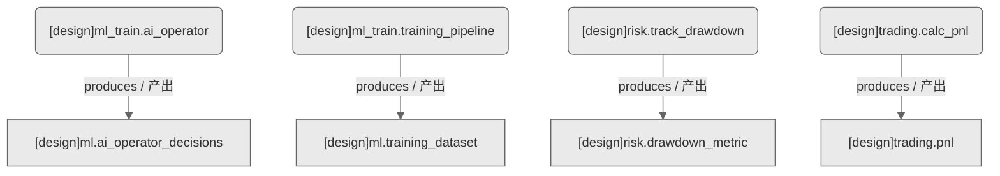

# 其他域-ML训练+风控+交易（设计态）

> 生成时间: 2026-07-31T01:05:49
> 真源: `dataflow_graph_registry.yaml` → PostgreSQL `dataflow_*` 表
> 生成器: `generate_dataflow_diagram.py`（全文自动生成，禁止手工编辑）

## 数据流图（设计态）

> 节点数: 4 datasets / 数据集, 4 jobs / 作业, 4 edges / 边

## Dataset 清单

| ID | entity_name / 实体名 | scope / 范围 | domain / 域 | module_id / 蓝图 | 功能简述 |
|----|----------------------|--------------|------------|------------------|----------|
| DS-11271 | ml.ai_operator_decisions | production / 生产 | D_ML_TRAIN | MOD-ML-002 | AI操作员决策记录（模型推理/决策建议/置信度） |
| DS-11272 | ml.training_dataset | production / 生产 | D_ML_TRAIN | MOD-ML-001 | 训练数据集（特征/标签/样本/版本管理） |
| DS-11273 | risk.drawdown_metric | production / 生产 | D_RISK / 风险 | MOD-RISK-001 | 回撤指标序列（最大回撤/当前回撤/恢复时间） |
| DS-11274 | trading.pnl | production / 生产 | D_TRADING | MOD-TRADING-002 | 盈亏序列（已实现/未实现盈亏/总盈亏） |

## Job 清单

| ID | job_name / 作业名 | trigger_type / 触发类型 | module_id / 蓝图 | 功能简述 |
|----|-------------------|----------------------------|------------------|----------|
| JOB-757635 | ml_train.ai_operator | event_driven / 事件驱动 | MOD-ML-002 | AI操作员决策（消费信号，产出AI辅助决策） |
| JOB-757636 | ml_train.training_pipeline | scheduled / 定时 | MOD-ML-001 | ML训练流水线（消费因子数据，产出训练数据集） |
| JOB-757637 | risk.track_drawdown | event_driven / 事件驱动 | MOD-RISK-001 | 回撤跟踪（消费持仓快照，产出回撤指标） |
| JOB-757638 | trading.calc_pnl | event_driven / 事件驱动 | MOD-TRADING-002 | PnL计算（消费成交数据，产出盈亏） |

[← 返回索引](dataflow_index.md)
