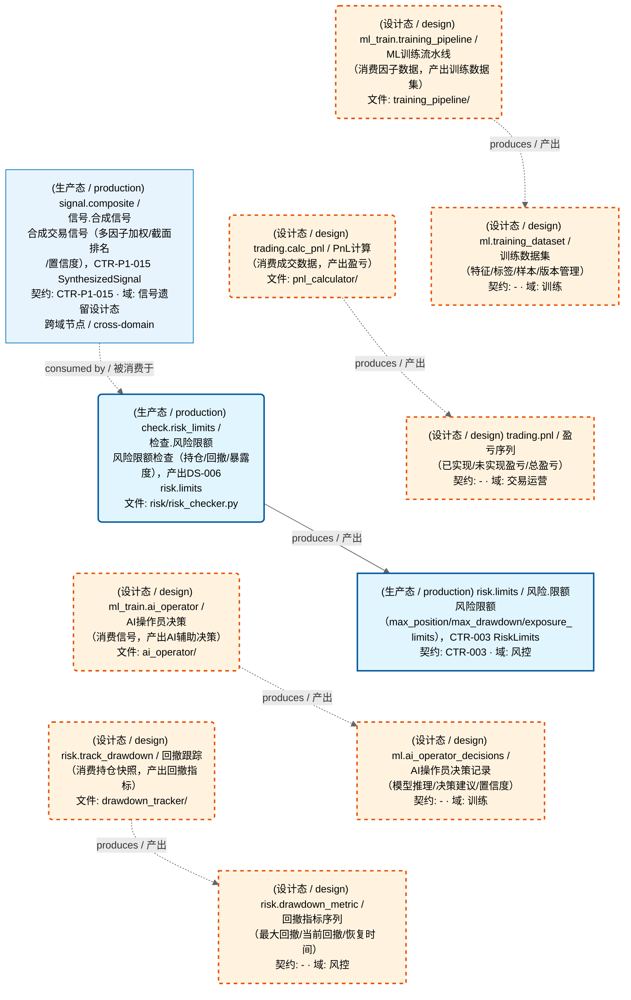
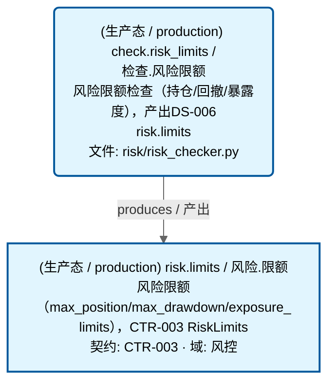
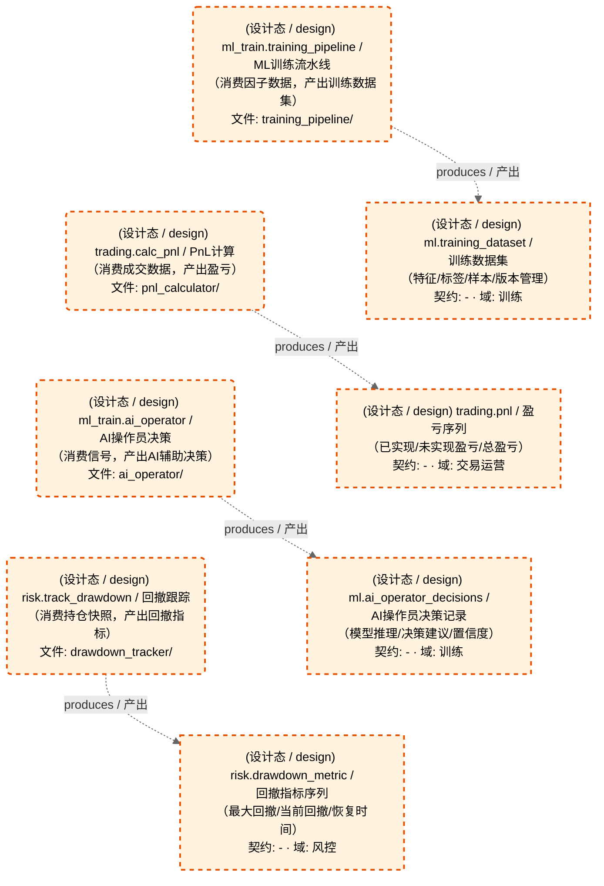

# 其他域-ML训练+风控+交易

> 生成时间: 2026-08-03T12:37:17
> 真源: `dataflow_graph_registry.yaml` → PostgreSQL `dataflow_*` 表
> 生成器: `generate_dataflow_diagram.py`（全文自动生成，禁止手工编辑）

> **[可缩放 HTML 版 / Zoomable HTML](http://localhost:8765/docs/02_enterprise_architecture/05_dataflow_architecture/_zoomable_html/d_others.html)** — Ctrl+滚轮缩放 ｜ 双击重置 ｜ Ctrl+Shift+D 切换拖动/选择模式

> **域职责 / Responsibility**: ML训练+风控+交易——AI操作员决策/训练流水线 + 回撤跟踪 + PnL计算

## 域基本信息 / Overview

| 字段 | 值 | Field | Value |
|------|------|-------|-------|
| Dataset 数 | 5 | Datasets | 5 |
| Job 数 | 5 | Jobs | 5 |
| 运营态 Dataset | 1 | Production Datasets | 1 |
| 设计态 Dataset | 4 | Design Datasets | 4 |
| 运营态 Job | 1 | Production Jobs | 1 |
| 设计态 Job | 4 | Design Jobs | 4 |
| 跨域外部 Dataset | 1 | Cross-domain Datasets | 1 |

## 数据流图

> **图例说明 / Legend**：
>
> - 🟦 **蓝色 = 运营态节点**（production，已上线运行）
> - 🟧 **橙色虚线 = 设计态节点**（design，蓝图阶段，代码未写）
> - 🟦更浅蓝 = 跨域外部 Dataset（external_prod/external_design）
> - **实线箭头 ``-->`` = 运营态数据流**（两端均 production）
> - **虚线箭头 ``-.->`` = 非运营态数据流**（含 design、混合）
> - 矩形 = Dataset（数据集）/ 圆角矩形 = Job（作业）
> - ``JOB -->|produces / 产出| DS`` = Job 产出 Dataset
> - ``DS -->|consumed by / 被消费于| JOB`` = Job 消费 Dataset

### 全景图（全部模块，颜色区分运营态/设计态）

> 展示全部 10 个节点（Dataset 5 + Job 5），含 5 条边，含 1 个跨域外部 Dataset。颜色区分运营态（蓝）/设计态（橙虚线）。

### 运营态的图（仅 design_maturity=production）

> 仅展示已实现稳定运行的节点（运营态：1 datasets / 数据集, 1 jobs / 作业, 1 edges / 边）。

### 设计态的图（仅 design_maturity=design）

> 仅展示蓝图阶段、代码未写的设计态节点（设计态：4 datasets / 数据集, 4 jobs / 作业, 4 edges / 边）。

## Dataset 清单

| ID | entity_name / 实体名 | scope / 范围 | domain / 域 | design_maturity / 设计成熟度 | module_id / 蓝图 | 功能简述 |
|----|----------------------|--------------|------------|------------------------------|------------------|----------|
| DS-11271 | ml.ai_operator_decisions | production / 生产 | D_ML_TRAIN / 训练 | design / 设计 | MOD-ML-002 | AI操作员决策记录（模型推理/决策建议/置信度） |
| DS-11272 | ml.training_dataset | production / 生产 | D_ML_TRAIN / 训练 | design / 设计 | MOD-ML-001 | 训练数据集（特征/标签/样本/版本管理） |
| DS-11273 | risk.drawdown_metric | production / 生产 | D_RISK / 风控 | design / 设计 | MOD-RISK-001 | 回撤指标序列（最大回撤/当前回撤/恢复时间） |
| DS-22756 | risk.limits / 风险.限额 | production / 生产 | D_RISK / 风控 | production / 生产 | MOD-L04-001 | 风险限额（max_position/max_drawdown/exposure_limits），CTR-003 RiskLimits |
| DS-11274 | trading.pnl | production / 生产 | D_TRADING / 交易运营 | design / 设计 | MOD-TRADING-002 | 盈亏序列（已实现/未实现盈亏/总盈亏） |

## Job 清单

| ID | job_name / 作业名 | trigger_type / 触发类型 | design_maturity / 设计成熟度 | module_id / 蓝图 | 功能简述 |
|----|-------------------|----------------------------|------------------------------|------------------|----------|
| JOB-1023259 | check.risk_limits / 检查.风险限额 | event_driven / 事件驱动 | production / 生产 | MOD-L04-001 | 风险限额检查（持仓/回撤/暴露度），产出DS-006 risk.limits |
| JOB-757635 | ml_train.ai_operator | event_driven / 事件驱动 | design / 设计 | MOD-ML-002 | AI操作员决策（消费信号，产出AI辅助决策） |
| JOB-757636 | ml_train.training_pipeline | scheduled / 定时 | design / 设计 | MOD-ML-001 | ML训练流水线（消费因子数据，产出训练数据集） |
| JOB-757637 | risk.track_drawdown | event_driven / 事件驱动 | design / 设计 | MOD-RISK-001 | 回撤跟踪（消费持仓快照，产出回撤指标） |
| JOB-757638 | trading.calc_pnl | event_driven / 事件驱动 | design / 设计 | MOD-TRADING-002 | PnL计算（消费成交数据，产出盈亏） |

## 跨域依赖 / Cross-domain Dependencies

### 依赖本域的外部 Dataset（入边）/ Consumed From

| 外部 Dataset | 域 | 成熟度 | 被本域 Job 消费 |
|-------------|------|--------|----------------|
| signal.composite | D_SIGLEGACY / 信号遗留设计态 | production / 生产 | check.risk_limits |

[← 返回索引](dataflow_index.md)
