# 未分类域

> 生成时间: 2026-08-01T22:21:37
> 真源: `dataflow_graph_registry.yaml` → PostgreSQL `dataflow_*` 表
> 生成器: `generate_dataflow_diagram.py`（全文自动生成，禁止手工编辑）

> **[可缩放 HTML 版 / Zoomable HTML](http://localhost:8765/docs/02_enterprise_architecture/05_dataflow_architecture/_zoomable_html/d_unknown.html)** — Ctrl+滚轮缩放 ｜ 双击重置 ｜ Ctrl+Shift+D 切换拖动/选择模式

## 域基本信息 / Overview

| 字段 | 值 | Field | Value |
|------|------|-------|-------|
| Dataset 数 | 5 | Datasets | 5 |
| Job 数 | 5 | Jobs | 5 |
| 运营态 Dataset | 5 | Production Datasets | 5 |
| 设计态 Dataset | 0 | Design Datasets | 0 |
| 运营态 Job | 5 | Production Jobs | 5 |
| 设计态 Job | 0 | Design Jobs | 0 |

## 数据流图

> **图例说明 / Legend**：
>
> - 🟦 **蓝色 = 运营态节点**（production，已上线运行）
> - 🟧 **橙色虚线 = 设计态节点**（design，蓝图阶段，代码未写）
> - 🟦更浅蓝 = 跨域外部 Dataset（external_prod/external_design）
> - **实线箭头 ``-->`` = 运营态数据流**（两端均 production）
> - **虚线箭头 ``-.->`` = 非运营态数据流**（含 design、混合）
> - 矩形 = Dataset（数据集）/ 圆角矩形 = Job（作业）
> - ``JOB -->|produces / 产出| DS`` = Job 产出 Dataset
> - ``DS -->|consumed by / 被消费于| JOB`` = Job 消费 Dataset

### 全景图（全部模块，颜色区分运营态/设计态）

> 展示全部 10 个节点（Dataset 5 + Job 5），含 10 条边。颜色区分运营态（蓝）/设计态（橙虚线）。

### 运营态的图（仅 design_maturity=production）

> 仅展示已实现稳定运行的节点（运营态：5 datasets / 数据集, 5 jobs / 作业, 10 edges / 边）。

```mermaid
%%{init: {'theme': 'base', 'themeVariables': {'primaryColor': '#eaeaea', 'primaryTextColor': '#333333', 'primaryBorderColor': '#666666', 'lineColor': '#666666', 'secondaryColor': '#eaeaea', 'tertiaryColor': '#eaeaea', 'clusterBkg': 'transparent', 'clusterBorder': 'transparent', 'fontSize': '14px'}}}%%
flowchart TD
    DS16902["(生产态 / production) factor.momentum_20d /<br/>因子.20日动量<br/>20日动量因子信号（factor_id/symbol/as_of_date<br/>/raw_value/rank_pct），CTR-002 FactorSignal<br/>契约: CTR-002 · 域: 因子"]
    DS16901["(生产态 / production) factor.value_factor /<br/>因子.价值因子<br/>价值因子信号（factor_id/symbol/as_of_date/raw_<br/>value/normalized_value），CTR-002 FactorSignal<br/>契约: CTR-002 · 域: 因子"]
    DS16900["(生产态 / production) market_data.ohlc_bar /<br/>市场数据.OHLC K线<br/>聚合OHLC K线（1m/5m/日线，由tick聚合），CTR-001<br/>derived<br/>契约: CTR-001 · 域: 行情数据"]
    DS16899["(生产态 / production) market_data.tick /<br/>市场数据.Tick行情<br/>标准化Tick行情（symbol/timestamp/OHLCV/quality_<br/>score），CTR-001 NormalizedMarketData<br/>契约: CTR-001 · 域: 行情数据"]
    DS16903["(生产态 / production) signal.composite /<br/>信号.合成信号<br/>合成交易信号（多因子加权/截面排名<br/>/置信度），CTR-P1-015 SynthesizedSignal<br/>契约: CTR-P1-015 · 域: 信号遗留设计态"]
    JOB866023("(生产态 / production) aggregate.ohlc_bar /<br/>聚合.OHLC K线<br/>将Tick数据聚合为OHLC K线（1m/5m<br/>/日线），产出DS-002 market_data.ohlc_bar<br/>文件: data/aggregator.py")
    JOB866025("(生产态 / production) compute.momentum_20d /<br/>计算.20日动量<br/>计算20日动量因子（收益率/相对强度），产出DS-004<br/>factor.momentum_20d<br/>文件: factor/momentum.py")
    JOB866024("(生产态 / production) compute.value_factor /<br/>计算.价值因子<br/>计算价值因子（PE/PB/股息率等），产出DS-003<br/>factor.value_factor<br/>文件: factor/value_factor.py")
    JOB866022("(生产态 / production) ingest.ifind_kline /<br/>采集.iFind行情<br/>从同花顺iFind THS_RQ接口采集K线<br/>/Tick行情数据，写入DS-001 market_data.tick<br/>文件: data/ingest_ifind.py")
    JOB866026("(生产态 / production) synthesize.signal /<br/>合成.信号<br/>合成多因子信号（加权/截面排名<br/>/置信度），产出DS-005 signal.composite<br/>文件: signal_ashare/synthesizer.py")
    JOB866022 -->|produces / 产出| DS16899
    JOB866023 -->|produces / 产出| DS16900
    JOB866024 -->|produces / 产出| DS16901
    JOB866025 -->|produces / 产出| DS16902
    JOB866026 -->|produces / 产出| DS16903
    DS16899 -->|consumed by / 被消费于| JOB866023
    DS16900 -->|consumed by / 被消费于| JOB866024
    DS16900 -->|consumed by / 被消费于| JOB866025
    DS16901 -->|consumed by / 被消费于| JOB866026
    DS16902 -->|consumed by / 被消费于| JOB866026
    JOB866024 ~~~ JOB866025
    DS16901 ~~~ DS16902
    classDef production fill:#e1f5fe,stroke:#01579b,stroke-width:2px,color:#000
    classDef design fill:#fff3e0,stroke:#e65100,stroke-width:2px,color:#000,stroke-dasharray: 5 5
    classDef external_prod fill:#e8f4fd,stroke:#0277bd,stroke-width:1px,color:#000
    classDef external_design fill:#fff8e7,stroke:#ef6c00,stroke-width:1px,color:#000,stroke-dasharray: 5 5
    class DS16902,DS16901,DS16900,DS16899,DS16903,JOB866023,JOB866025,JOB866024,JOB866022,JOB866026 production
```

### 设计态的图（仅 design_maturity=design）

> （无模块 / No modules）

## Dataset 清单

| ID | entity_name / 实体名 | scope / 范围 | domain / 域 | design_maturity / 设计成熟度 | module_id / 蓝图 | 功能简述 |
|----|----------------------|--------------|------------|------------------------------|------------------|----------|
| DS-16902 | factor.momentum_20d / 因子.20日动量 | production / 生产 | D_FACTOR / 因子 | production / 生产 | MOD-L02-001 | 20日动量因子信号（factor_id/symbol/as_of_date/raw_value/rank_pct），CTR-002 FactorSignal |
| DS-16901 | factor.value_factor / 因子.价值因子 | production / 生产 | D_FACTOR / 因子 | production / 生产 | MOD-L02-001 | 价值因子信号（factor_id/symbol/as_of_date/raw_value/normalized_value），CTR-002 FactorSignal |
| DS-16900 | market_data.ohlc_bar / 市场数据.OHLC K线 | production / 生产 | D_MKT_DATA / 行情数据 | production / 生产 | MOD-MKT_DATA | 聚合OHLC K线（1m/5m/日线，由tick聚合），CTR-001 derived |
| DS-16899 | market_data.tick / 市场数据.Tick行情 | production / 生产 | D_MKT_DATA / 行情数据 | production / 生产 | MOD-MKT_DATA | 标准化Tick行情（symbol/timestamp/OHLCV/quality_score），CTR-001 NormalizedMarketData |
| DS-16903 | signal.composite / 信号.合成信号 | production / 生产 | D_SIGLEGACY / 信号遗留设计态 | production / 生产 | - | 合成交易信号（多因子加权/截面排名/置信度），CTR-P1-015 SynthesizedSignal |

## Job 清单

| ID | job_name / 作业名 | trigger_type / 触发类型 | design_maturity / 设计成熟度 | module_id / 蓝图 | 功能简述 |
|----|-------------------|----------------------------|------------------------------|------------------|----------|
| JOB-866023 | aggregate.ohlc_bar / 聚合.OHLC K线 | event_driven / 事件驱动 | production / 生产 | MOD-MKT_DATA | 将Tick数据聚合为OHLC K线（1m/5m/日线），产出DS-002 market_data.ohlc_bar |
| JOB-866025 | compute.momentum_20d / 计算.20日动量 | event_driven / 事件驱动 | production / 生产 | MOD-L02-001 | 计算20日动量因子（收益率/相对强度），产出DS-004 factor.momentum_20d |
| JOB-866024 | compute.value_factor / 计算.价值因子 | event_driven / 事件驱动 | production / 生产 | MOD-L02-001 | 计算价值因子（PE/PB/股息率等），产出DS-003 factor.value_factor |
| JOB-866022 | ingest.ifind_kline / 采集.iFind行情 | scheduled / 定时 | production / 生产 | MOD-MKT_DATA | 从同花顺iFind THS_RQ接口采集K线/Tick行情数据，写入DS-001 market_data.tick |
| JOB-866026 | synthesize.signal / 合成.信号 | event_driven / 事件驱动 | production / 生产 | - | 合成多因子信号（加权/截面排名/置信度），产出DS-005 signal.composite |

[← 返回索引](dataflow_index.md)
