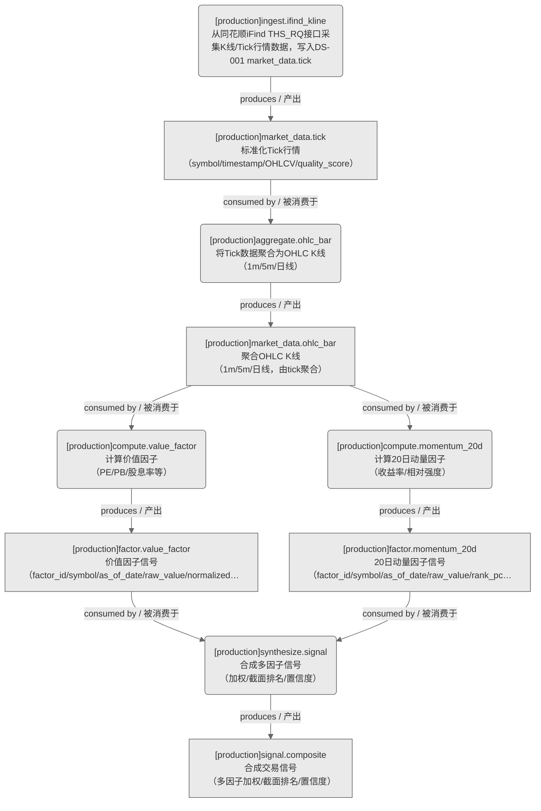

# 未分类域

> 生成时间: 2026-07-31T17:14:43
> 真源: `dataflow_graph_registry.yaml` → PostgreSQL `dataflow_*` 表
> 生成器: `generate_dataflow_diagram.py`（全文自动生成，禁止手工编辑）

## 数据流图（全景：设计态+运营态合并）

> 节点数: 5 datasets / 数据集, 5 jobs / 作业, 10 edges / 边
>
> **图例**：🟦 蓝色 = 运营态（已实现）/ 🟧 橙色虚线 = 设计态（未实现）

```mermaid
%%{init: {'theme': 'base', 'themeVariables': {'primaryColor': '#eaeaea', 'primaryTextColor': '#333333', 'primaryBorderColor': '#666666', 'lineColor': '#666666', 'secondaryColor': '#eaeaea', 'tertiaryColor': '#eaeaea', 'fontSize': '14px'}}}%%
flowchart LR
    DS11658["[production]factor.momentum_20d<br/>20日动量因子信号<br/>（factor_id/symbol/as_of_date/raw_value/rank_pc…"]
    DS11657["[production]factor.value_factor<br/>价值因子信号<br/>（factor_id/symbol/as_of_date/raw_value/normalized…"]
    DS11656["[production]market_data.ohlc_bar<br/>聚合OHLC K线<br/>（1m/5m/日线，由tick聚合）"]
    DS11655["[production]market_data.tick<br/>标准化Tick行情<br/>（symbol/timestamp/OHLCV/quality_score）"]
    DS11659["[production]signal.composite<br/>合成交易信号<br/>（多因子加权/截面排名/置信度）"]
    JOB784142("[production]aggregate.ohlc_bar<br/>将Tick数据聚合为OHLC K线<br/>（1m/5m/日线）")
    JOB784144("[production]compute.momentum_20d<br/>计算20日动量因子<br/>（收益率/相对强度）")
    JOB784143("[production]compute.value_factor<br/>计算价值因子<br/>（PE/PB/股息率等）")
    JOB784141("[production]ingest.ifind_kline<br/>从同花顺iFind THS_RQ接口采集K线/Tick行情数据，写入DS-001 market_data.tick")
    JOB784145("[production]synthesize.signal<br/>合成多因子信号<br/>（加权/截面排名/置信度）")
    JOB784141 -->|produces / 产出| DS11655
    JOB784142 -->|produces / 产出| DS11656
    JOB784143 -->|produces / 产出| DS11657
    JOB784144 -->|produces / 产出| DS11658
    JOB784145 -->|produces / 产出| DS11659
    DS11655 -->|consumed by / 被消费于| JOB784142
    DS11656 -->|consumed by / 被消费于| JOB784143
    DS11656 -->|consumed by / 被消费于| JOB784144
    DS11657 -->|consumed by / 被消费于| JOB784145
    DS11658 -->|consumed by / 被消费于| JOB784145
    classDef design fill:#fff3e0,stroke:#e65100,stroke-width:2px,color:#000,stroke-dasharray: 5 5
    classDef production fill:#e1f5fe,stroke:#01579b,stroke-width:2px,color:#000
    class DS11658,DS11657,DS11656,DS11655,DS11659,JOB784142,JOB784144,JOB784143,JOB784141,JOB784145 production
```

## 数据流图（运营态）

> 节点数: 5 datasets / 数据集, 5 jobs / 作业, 10 edges / 边

## Dataset 清单

| ID | entity_name / 实体名 | scope / 范围 | domain / 域 | design_maturity / 设计成熟度 | module_id / 蓝图 | 功能简述 |
|----|----------------------|--------------|------------|------------------------------|------------------|----------|
| DS-11658 | factor.momentum_20d / 因子.20日动量 | production / 生产 | D_FACTOR / 因子 | production / 生产 | MOD-L02-001 | 20日动量因子信号（factor_id/symbol/as_of_date/raw_value/rank_pct），CTR-002 FactorSignal |
| DS-11657 | factor.value_factor / 因子.价值因子 | production / 生产 | D_FACTOR / 因子 | production / 生产 | MOD-L02-001 | 价值因子信号（factor_id/symbol/as_of_date/raw_value/normalized_value），CTR-002 FactorSignal |
| DS-11656 | market_data.ohlc_bar / 市场数据.OHLC K线 | production / 生产 | D_MKT_DATA / 市场数据 | production / 生产 | MOD-MKT_DATA | 聚合OHLC K线（1m/5m/日线，由tick聚合），CTR-001 derived |
| DS-11655 | market_data.tick / 市场数据.Tick行情 | production / 生产 | D_MKT_DATA / 市场数据 | production / 生产 | MOD-MKT_DATA | 标准化Tick行情（symbol/timestamp/OHLCV/quality_score），CTR-001 NormalizedMarketData |
| DS-11659 | signal.composite / 信号.合成信号 | production / 生产 | D_SIGLEGACY / 信号(legacy) | production / 生产 | - | 合成交易信号（多因子加权/截面排名/置信度），CTR-P1-015 SynthesizedSignal |

## Job 清单

| ID | job_name / 作业名 | trigger_type / 触发类型 | design_maturity / 设计成熟度 | module_id / 蓝图 | 功能简述 |
|----|-------------------|----------------------------|------------------------------|------------------|----------|
| JOB-784142 | aggregate.ohlc_bar / 聚合.OHLC K线 | event_driven / 事件驱动 | production / 生产 | MOD-MKT_DATA | 将Tick数据聚合为OHLC K线（1m/5m/日线），产出DS-002 market_data.ohlc_bar |
| JOB-784144 | compute.momentum_20d / 计算.20日动量 | event_driven / 事件驱动 | production / 生产 | MOD-L02-001 | 计算20日动量因子（收益率/相对强度），产出DS-004 factor.momentum_20d |
| JOB-784143 | compute.value_factor / 计算.价值因子 | event_driven / 事件驱动 | production / 生产 | MOD-L02-001 | 计算价值因子（PE/PB/股息率等），产出DS-003 factor.value_factor |
| JOB-784141 | ingest.ifind_kline / 采集.iFind行情 | scheduled / 定时 | production / 生产 | MOD-MKT_DATA | 从同花顺iFind THS_RQ接口采集K线/Tick行情数据，写入DS-001 market_data.tick |
| JOB-784145 | synthesize.signal / 合成.信号 | event_driven / 事件驱动 | production / 生产 | - | 合成多因子信号（加权/截面排名/置信度），产出DS-005 signal.composite |

[← 返回索引](dataflow_index.md)
