# 数据采集流图 / Data Acquisition Flow

> **这个文档是给人看的**：用大白话说清楚「系统从哪些数据源、采了什么数据、灌到哪张表、什么时候采」。
> **真源是 [tasks.yaml](../../../src/zephyr/data/config/tasks.yaml)**，本文档是自动生成的派生产物，禁止手工编辑。
> **数据源连接和 API 细节**见 [data_source_operation_manual.md](../../03_modules/_domain_data/data_source_operation_manual.md)。
> **自动下载命令**：`python -m zephyr.data run <task_id>` 手动触发任务，`python -m zephyr.data start` 启动常驻调度（见 [cli.py](../../../src/zephyr/data/cli.py)）。

> **[可缩放 HTML 版 / Zoomable HTML](http://localhost:8765/docs/02_enterprise_architecture/05_dataflow_architecture/_zoomable_html/data_acquisition_flow.html)** — Ctrl+滚轮缩放 ｜ 双击重置 ｜ Ctrl+Shift+D 切换拖动/选择模式

---

## 一句话说清楚（自动生成 · 生成器: generate_data_acquisition_flow.py）

系统每天从 **15 个数据源**采集 **154 个任务**，灌进 ClickHouse 的 **2 个库**：

- `c1_market` — 行情库（K线、指数、期货、资金、估值等）
- `c3_fundamental` — 基本面库（财务报表、新闻、股东、分红等）

---

## 数据源分布总览（自动生成 · 生成器: generate_data_acquisition_flow.py）

| 数据源 | 任务数 | 主要采什么 |
|--------|--------|-----------|
| **miniqmt**（迅投QMT） | 61 | K线行情、财务报表、股东数据、期权可转债 |
| **akshare**（AKShare） | 61 | 估值、融资融券、龙虎榜、大宗交易、宏观 |
| **tdx**（通达信） | 6 | 板块分类、板块K线、板块成分股 |
| **tickflow**（TickFlow） | 4 | 美股K线、美股指数 |
| **tqcenter**（通达信tqcenter） | 4 | 板块K线、板块实时快照、板块成分股映射 |
| **tushare**（Tushare） | 3 | 新闻快讯、证券新闻 |
| fred | 3 | - |
| **rss**（RSS） | 2 | 财经新闻 |
| **baostock**（BaoStock） | 2 | 交易日历、沪深300成分股 |
| eia | 2 | - |
| qweather | 2 | - |
| **ifind**（同花顺iFind） | 1 | 资金流向、股权质押、行业分类 |
| cls | 1 | - |
| eastmoney_news | 1 | - |
| backfill | 1 | - |
| **合计** | **154** | |

---

## 各数据源详情（自动生成 · 生成器: generate_data_acquisition_flow.py）

### 1. miniqmt（迅投QMT）— 61 个任务，主力数据源

**一句话**：主力数据源，采 A股/港股/期货的 K线行情（日/周/月/分钟级）和财务报表、股东数据、期权可转债等。

**采集明细**：

| 任务 | 灌到哪张表 | 什么时候采 | 说明 |
|------|-----------|-----------|------|
| adj_factor_incremental | c1_market.adj_factor | 盘后 16:30 | 复权因子增量 |
| kline_cb_incremental | c1_market.kline_cb | 盘后 16:30 | 可转债日K线增量 |
| kline_daily_hfq_incremental | c1_market.kline_daily_hfq | 盘后 16:30 | 后复权日K线增量（依赖adj_factor_incremental） |
| kline_daily_incremental | c1_market.kline_daily | 盘后 16:30 | 不复权日K线增量 |
| kline_etf_daily_incremental | c1_market.kline_etf_daily | 盘后 16:30 | ETF 日K线增量 |
| kline_index_incremental | c1_market.kline_index | 盘后 16:30 | 指数日K线增量 |
| kline_monthly_hfq_incremental | c1_market.kline_monthly_hfq | 盘后 16:30 | 后复权月K线增量（依赖adj_factor_incremental） |
| kline_monthly_incremental | c1_market.kline_monthly | 盘后 16:30 | 月K线增量 |
| kline_weekly_hfq_incremental | c1_market.kline_weekly_hfq | 盘后 16:30 | 后复权周K线增量（依赖adj_factor_incremental） |
| kline_weekly_incremental | c1_market.kline_weekly | 盘后 16:30 | 周K线增量 |
| option_kline_incremental | c1_market.option_kline | 盘后 16:30 | 期权日K线增量 |
| block_trade_qmt_placeholder | c1_market.block_trade_qmt | 盘后 17:00 | 大宗交易-QMT占位（**已禁用**） |
| dragon_tiger_qmt_placeholder | c1_market.dragon_tiger_qmt | 盘后 17:00 | 龙虎榜-QMT占位（**已禁用**） |
| futures_kline_qmt_incremental | c1_market.futures_kline_qmt | 盘后 17:00 | 期货日K线增量-QMT专用表 |
| kline_futures_incremental | c1_market.kline_futures | 盘后 17:00 | 期货行情K线增量 |
| kline_us_daily_qmt_incremental | c1_market.kline_us_daily | 盘后 17:00 | 美股日K线增量-QMT源（**已禁用**） |
| margin_trading_qmt_placeholder | c1_market.margin_trading_qmt | 盘后 17:00 | 融资融券-QMT占位（**已禁用**） |
| dividend_incremental | c3_fundamental.dividend | 盘后 18:00 | 分红送股增量 |
| earnings_forecast_incremental | c3_fundamental.earnings_forecast | 盘后 18:00 | 盈利预测增量 |
| express_report_incremental | c3_fundamental.express_report | 盘后 18:00 | 业绩快报增量 |
| shareholder_incremental | c3_fundamental.shareholder_count | 盘后 18:00 | 股东数据增量 |
| index_weight_refresh | c1_market.index_weight | 月初 09:00 | 指数成分股权重全量刷新 |
| kline_5min_history_backfill | c1_market.kline_5min | 月初 09:00 | 5分钟K线历史回补（**已禁用**） |
| sector_list_refresh | c1_market.sector_list | 月初 09:00 | 板块成分股列表全量刷新 |
| stock_list_refresh | c1_market.stock_list | 月初 09:00 | 股票列表全量刷新 |
| auction_book_snapshot | c1_market.auction_book | auction_highfreq | 集合竞价盘口快照 |
| auction_data_snapshot | c1_market.auction_snapshot | auction_highfreq | 集合竞价数据快照 |
| balance_sheet_incremental | c3_fundamental.balance_sheet | nightly_financial | 资产负债表增量 |
| cashflow_statement_incremental | c3_fundamental.cashflow_statement | nightly_financial | 现金流量表增量 |
| convertible_bond_iv_incremental | c1_market.convertible_bond_iv | intraday_realtime | 可转债IV增量 |
| financial_indicator_incremental | c3_fundamental.financial_indicator | nightly_financial | 财务指标增量 |
| futures_term_structure_incremental | c1_market.futures_term_structure | intraday_realtime | 期货期限结构增量（依赖kline_futures_incremental） |
| hk_kline_full_refresh | c1_market.hk_kline | weekend_calibration | 港股日K线全量刷新 |
| hk_kline_incremental | c1_market.hk_kline | intraday_realtime | 港股日K线增量 |
| income_statement_incremental | c3_fundamental.income_statement | nightly_financial | 利润表增量 |
| index_quote_snapshot | c1_market.index_quote | intraday_realtime | 指数3秒实时行情快照 |
| kline_15min_incremental | c1_market.kline_15min | intraday_minute | 15分钟K线增量 |
| kline_1min_incremental | c1_market.kline_1min | intraday_minute | 1分钟K线增量 |
| kline_30min_incremental | c1_market.kline_30min | intraday_minute | 30分钟K线增量 |
| kline_5min_incremental | c1_market.kline_5min | intraday_minute | 5分钟K线增量 |
| kline_60min_incremental | c1_market.kline_60min | intraday_minute | 60分钟K线增量 |
| kline_cb_full_refresh | c1_market.kline_cb | weekend_calibration | 可转债日K线全量刷新 |
| kline_daily_full_refresh | c1_market.kline_daily | weekend_calibration | 日K线全量刷新 |
| kline_etf_15min_incremental | c1_market.kline_etf_15min | intraday_minute | ETF 15分钟K线增量 |
| kline_etf_1min_incremental | c1_market.kline_etf_1min | intraday_minute | ETF 1分钟K线增量 |
| kline_etf_30min_incremental | c1_market.kline_etf_30min | intraday_minute | ETF 30分钟K线增量 |
| kline_etf_5min_incremental | c1_market.kline_etf_5min | intraday_minute | ETF 5分钟K线增量 |
| kline_etf_60min_incremental | c1_market.kline_etf_60min | intraday_minute | ETF 60分钟K线增量 |
| kline_hk_daily_incremental | c1_market.kline_hk_daily | intraday_realtime | 港股日K线增量 |
| kline_lof_15min_incremental | c1_market.kline_lof_15min | intraday_minute | LOF 15分钟K线增量 |
| kline_lof_1min_incremental | c1_market.kline_lof_1min | intraday_minute | LOF 1分钟K线增量 |
| kline_lof_30min_incremental | c1_market.kline_lof_30min | intraday_minute | LOF 30分钟K线增量 |
| kline_lof_5min_incremental | c1_market.kline_lof_5min | intraday_minute | LOF 5分钟K线增量 |
| kline_lof_60min_incremental | c1_market.kline_lof_60min | intraday_minute | LOF 60分钟K线增量 |
| l2_tick_snapshot | c1_market.l2_tick | intraday_realtime | Level-2逐笔行情增量（**已禁用**） |
| main_business_incremental | c3_fundamental.main_business | nightly_financial | 主营业务增量 |
| money_flow_full_refresh | c1_market.money_flow | weekend_calibration | 资金流向全量刷新 |
| option_greeks_incremental | c1_market.option_greeks | intraday_realtime | 期权Greeks增量（依赖option_kline_incremental） |
| option_iv_surface_incremental | c1_market.option_iv_surface | intraday_realtime | 期权IV曲面增量 |
| option_kline_full_refresh | c1_market.option_kline | weekend_calibration | 期权日K线全量刷新 |
| tick_data_snapshot | c1_market.tick_data | intraday_realtime | QMT 3秒Tick增量 |

**注意**：
- `adj_factor_incremental`：每只约11秒，5204只约需16小时，建议夜间运行

---

### 2. akshare（AKShare）— 61 个任务

**一句话**：开源数据源，采估值、融资融券、龙虎榜、大宗交易、宏观数据、限售解禁等事件类数据。

**采集明细**：

| 任务 | 灌到哪张表 | 什么时候采 | 说明 |
|------|-----------|-----------|------|
| daily_valuation_incremental | c1_market.daily_valuation | 盘后 16:30 | 每日估值（PE/PB/PS/PCF）增量（依赖kline_daily_incremental） |
| etf_nav_refresh | c1_market.etf_nav | 盘后 16:30 | ETF基金净值增量 |
| sector_meta_refresh | c1_market.sector_meta | 盘后 16:30 | 通达信板块信息持续更新 |
| stock_indicator_incremental | c1_market.stock_indicator | 盘后 16:30 | AKShare指标数据增量 |
| block_trade_detail_incremental | c1_market.block_trade_detail | 盘后 17:00 | AKShare大宗交易每日统计增量 |
| block_trade_incremental | c1_market.block_trade | 盘后 17:00 | 大宗交易增量 |
| concept_board_refresh | c1_market.concept_board | 盘后 17:00 | AKShare概念板块及成分股刷新 |
| dragon_tiger_incremental | c1_market.dragon_tiger | 盘后 17:00 | 龙虎榜增量 |
| dragon_tiger_seat_incremental | c1_market.dragon_tiger_seat | 盘后 17:00 | 龙虎榜席位明细增量 |
| hk_connect_flow_full | c1_market.hk_connect_flow | 盘后 17:00 | AKShare沪深港通北向资金 |
| hk_connect_flow_incremental | c1_market.hk_connect_flow | 盘后 17:00 | 沪深港通资金历史 |
| money_flow_incremental | c1_market.money_flow | 盘后 17:00 | 资金流向增量 |
| restricted_shares_incremental | c3_fundamental.restricted_shares | 盘后 17:00 | AKShare限售股明细增量 |
| share_change_incremental | c3_fundamental.share_change | 盘后 17:00 | AKShare股本变动增量 |
| share_unlock_incremental | c3_fundamental.share_unlock | 盘后 17:00 | 限售解禁增量 |
| st_stock_list_refresh | c1_market.st_stock_list | 盘后 17:00 | AKShare ST股票列表刷新 |
| stock_hot_rank_incremental | c1_market.stock_hot_rank | 盘后 17:00 | 东财人气/关注排行 |
| analyst_forecast_incremental | c3_fundamental.analyst_forecast | 盘后 18:00 | 分析师一致预期增量 |
| audit_opinion_incremental | c3_fundamental.audit_opinion | 盘后 18:00 | 审计意见增量（**已禁用**） |
| disclosure_plan_incremental | c3_fundamental.disclosure_plan | 盘后 18:00 | 预约披露计划增量 |
| equity_pledge_incremental | c3_fundamental.equity_pledge_detail | 盘后 18:00 | 股权质押增量 |
| equity_pledge_summary_incremental | c3_fundamental.equity_pledge_summary | 盘后 18:00 | 股权质押摘要增量 |
| hog_futures_core_refresh | c1_market.hog_futures_core | 盘后 18:00 | 生猪期货核心价增量 |
| hog_province_spot_refresh | c1_market.hog_province_spot | 盘后 18:00 | 分省生猪现价快照 |
| hog_spot_index_refresh | c1_market.hog_spot_index | 盘后 18:00 | 生猪现货价格指数增量 |
| repurchase_refresh | c3_fundamental.repurchase | 盘后 18:00 | AKShare回购数据全量刷新 |
| rights_issue_incremental | c3_fundamental.rights_issue | 盘后 18:00 | 分红配股增量（**已禁用**） |
| concept_sector_refresh | c1_market.concept_sector | 月初 09:00 | 概念板块列表全量刷新 |
| convertible_bond_list_refresh | c1_market.convertible_bond_list | 月初 09:00 | 可转债列表全量刷新 |
| etf_benchmark_refresh | c1_market.etf_benchmark | 月初 09:00 | ETF基准列表全量刷新（依赖etf_list_refresh） |
| etf_list_refresh | c1_market.etf_list | 月初 09:00 | ETF基金列表全量刷新 |
| hk_stock_list_refresh | c1_market.hk_stock_list | 月初 09:00 | 港股列表全量刷新 |
| hk_trade_calendar_refresh | c1_market.hk_trade_calendar | 月初 09:00 | 港股交易日历全量刷新 |
| index_list_refresh | c1_market.index_list | 月初 09:00 | 指数列表全量刷新 |
| lof_list_refresh | c1_market.lof_list | 月初 09:00 | LOF基金列表全量刷新 |
| stock_list_delisted_refresh | c1_market.stock_list | 月初 09:00 | 退市股票列表刷新 |
| analyst_forecast_full_refresh | c3_fundamental.analyst_forecast | weekend_calibration | 分析师预期全量刷新 |
| block_trade_detail_full_refresh | c1_market.block_trade_detail | weekend_calibration | 大宗交易明细全量刷新 |
| daily_valuation_full_refresh | c1_market.daily_valuation | weekend_calibration | 估值数据全量刷新 |
| equity_pledge_full_refresh | c3_fundamental.equity_pledge_detail | weekend_calibration | 股权质押明细全量刷新 |
| etf_nav_full_refresh | c1_market.etf_nav | weekend_calibration | ETF净值全量刷新 |
| futures_position_incremental | c1_market.futures_position | intraday_realtime | 期货持仓增量（依赖kline_futures_incremental） |
| hog_futures_core_full_refresh | c1_market.hog_futures_core | weekend_calibration | 生猪期货核心价全量刷新 |
| hog_spot_index_full_refresh | c1_market.hog_spot_index | weekend_calibration | 生猪现货价格指数全量刷新 |
| kline_futures_full | c1_market.kline_futures | weekend_calibration | AKShare期货主力合约K线 |
| limit_up_down_full_refresh | c1_market.limit_up_down | weekend_calibration | 涨跌停全量刷新 |
| limit_up_down_incremental | c1_market.limit_up_down | intraday_realtime | AKShare涨跌停增量 |
| macro_data_full_refresh | c1_market.macro_data | weekend_calibration | 宏观数据全量刷新 |
| macro_data_incremental | c1_market.macro_data | event_driven | 宏观数据增量 |
| margin_trading_incremental | c1_market.margin_trading | nightly_financial | 融资融券增量 |
| news_baidu_incremental | c3_fundamental.news_data | event_driven | AKShare百度热搜新闻增量 |
| news_cctv_incremental | c3_fundamental.news_data | event_driven | AKShare央视新闻联播增量 |
| news_economic_baidu_incremental | c3_fundamental.news_data | event_driven | AKShare百度经济日历增量 |
| news_stock_em_incremental | c3_fundamental.news_data | news_slow | AKShare个股新闻增量 |
| news_stock_incremental | c3_fundamental.news_data | event_driven | AKShare股票新闻增量 |
| realtime_snapshot_incremental | c1_market.realtime_snapshot | intraday_realtime | 实时行情快照增量 |
| repurchase_full_refresh | c3_fundamental.repurchase | weekend_calibration | 回购数据全量刷新 |
| research_report_incremental | c3_fundamental.news_data | news_slow | AKShare东方财富个股研报增量 |
| stock_indicator_full_refresh | c1_market.stock_indicator | weekend_calibration | 技术指标全量刷新 |
| top10_circulating_shareholders_incremental | c3_fundamental.top10_circulating_shareholders | nightly_financial | 十大流通股东增量 |
| top10_shareholders_incremental | c3_fundamental.top10_shareholders | nightly_financial | 十大股东增量 |

**注意**：
- `daily_valuation_incremental`：百度股市通API高频返回空响应，每只休眠1秒

---

### 3. tdx（通达信）— 6 个任务

**一句话**：板块数据源，采通达信板块分类、板块K线、板块成分股。

**采集明细**：

| 任务 | 灌到哪张表 | 什么时候采 | 说明 |
|------|-----------|-----------|------|
| kline_sector_incremental | c1_market.kline_sector | 盘后 16:30 | 板块指数日K线增量（依赖industry_class_refresh） |
| kline_sector_15min_incremental | c1_market.kline_sector_intraday | intraday_sector | 880xxx板块15分钟K线增量 |
| kline_sector_1min_incremental | c1_market.kline_sector_intraday | intraday_sector | 880xxx板块1分钟K线增量 |
| kline_sector_30min_incremental | c1_market.kline_sector_intraday | intraday_sector | 880xxx板块30分钟K线增量 |
| kline_sector_5min_incremental | c1_market.kline_sector_intraday | intraday_sector | 880xxx板块5分钟K线增量 |
| kline_sector_60min_incremental | c1_market.kline_sector_intraday | intraday_sector | 880xxx板块60分钟K线增量 |

**注意**：
- `tdx板块 vs 东财/同花顺/申万`：通达信880xxx体系与其他分类不兼容，无法混用

---

### 4. tickflow（TickFlow）— 4 个任务

**一句话**：美股数据源，采美股日K线和美股指数（ETF替代）。

**采集明细**：

| 任务 | 灌到哪张表 | 什么时候采 | 说明 |
|------|-----------|-----------|------|
| kline_us_daily_incremental | c1_market.kline_us_daily | 盘后 17:00 | 美股日K线增量 |
| us_index_incremental | c1_market.us_index | 盘后 17:00 | 美股指数增量 |
| kline_us_daily_full_refresh | c1_market.kline_us_daily | weekend_calibration | 美股日K线全量刷新 |
| us_index_full_refresh | c1_market.us_index | weekend_calibration | 美股指数全量刷新 |

---

### 5. tqcenter（通达信tqcenter）— 4 个任务

**一句话**：880xxx板块数据源，采板块K线、板块实时快照、板块成分股映射；99只推送+584只轮询混合模式，动态5因子排名调整推送池。

**采集明细**：

| 任务 | 灌到哪张表 | 什么时候采 | 说明 |
|------|-----------|-----------|------|
| kline_sector_880_incremental | c1_market.kline_sector_880 | 盘后 16:30 | 880xxx板块指数日K线增量 |
| kline_sector_880_resample | c1_market.kline_sector_880 | 盘后 16:30 | 880xxx板块K线合成（依赖kline_sector_880_incremental） |
| sector_constituent_refresh | c1_market.sector_constituent | 月初 09:00 | 880xxx板块成分股映射全量刷新 |
| sector_snapshot_incremental | c1_market.sector_snapshot | intraday_realtime | 880xxx板块实时快照增量 |

**注意**：
- `kline_sector_880_incremental`：tqcenter SDK 需 E:\tdx\PYPlugins 专用路径，非 scheduler 自动调度，由独立脚本触发

---

### 6. tushare（Tushare）— 3 个任务

**一句话**：付费数据源，采新闻快讯和证券新闻。

**采集明细**：

| 任务 | 灌到哪张表 | 什么时候采 | 说明 |
|------|-----------|-----------|------|
| industry_class_suppl_refresh | c3_fundamental.industry_class_suppl | 月初 09:00 | 申万/中证行业分类全量刷新 |
| industry_class_refresh | c1_market.industry_class | weekend_calibration | 申万行业分类全量刷新 |
| news_tushare_incremental | c3_fundamental.news_data | event_driven | Tushare新闻增量（**已禁用**） |

---

### 7. fred（fred）— 3 个任务

**一句话**：（待补充）

**采集明细**：

| 任务 | 灌到哪张表 | 什么时候采 | 说明 |
|------|-----------|-----------|------|
| macro_fred_full_refresh | c1_market.macro_data | weekend_calibration | FRED宏观数据全量刷新 |
| macro_fred_incremental | c1_market.macro_data | event_driven | FRED宏观数据增量 |
| macro_worldbank_full_refresh | c1_market.macro_data | weekend_calibration | 世界银行国际宏观数据全量刷新 |

---

### 8. rss（RSS）— 2 个任务

**一句话**：RSS爬虫，采财经新闻。

**采集明细**：

| 任务 | 灌到哪张表 | 什么时候采 | 说明 |
|------|-----------|-----------|------|
| news_data_incremental | c3_fundamental.news_data | event_driven | 财经新闻增量 |
| news_rss_incremental | c3_fundamental.news_data | event_driven | RSS财经新闻增量 |

---

### 9. baostock（BaoStock）— 2 个任务

**一句话**：开源数据源，采交易日历和沪深300成分股。

**采集明细**：

| 任务 | 灌到哪张表 | 什么时候采 | 说明 |
|------|-----------|-----------|------|
| index_constituent_refresh | c1_market.index_constituent | 月初 09:00 | 沪深300成分股全量刷新 |
| trade_calendar_refresh | c1_market.trade_calendar | 月初 09:00 | 交易日历全量刷新 |

---

### 10. eia（eia）— 2 个任务

**一句话**：（待补充）

**采集明细**：

| 任务 | 灌到哪张表 | 什么时候采 | 说明 |
|------|-----------|-----------|------|
| eia_petroleum_incremental | c1_market.macro_data | 盘后 17:00 | EIA石油数据增量 |
| eia_full_refresh | c1_market.macro_data | weekend_calibration | EIA能源数据全量刷新 |

---

### 11. qweather（qweather）— 2 个任务

**一句话**：（待补充）

**采集明细**：

| 任务 | 灌到哪张表 | 什么时候采 | 说明 |
|------|-----------|-----------|------|
| qweather_forecast_incremental | c1_market.weather_data | 盘后 17:00 | 和风天气7天预报 |
| qweather_now_incremental | c1_market.weather_data | 盘后 17:00 | 和风天气实时数据 |

---

### 12. ifind（同花顺iFind）— 1 个任务

**一句话**：付费数据源，采资金流向、股权质押、行业分类等 iFind 独有数据。

**采集明细**：

| 任务 | 灌到哪张表 | 什么时候采 | 说明 |
|------|-----------|-----------|------|
| edb_data_incremental | c1_market.edb_data | event_driven | EDB宏观数据增量（**已禁用**） |

---

### 13. cls（cls）— 1 个任务

**一句话**：（待补充）

**采集明细**：

| 任务 | 灌到哪张表 | 什么时候采 | 说明 |
|------|-----------|-----------|------|
| news_cls_incremental | c3_fundamental.news_data | event_driven | 财联社电报增量 |

---

### 14. eastmoney_news（eastmoney_news）— 1 个任务

**一句话**：（待补充）

**采集明细**：

| 任务 | 灌到哪张表 | 什么时候采 | 说明 |
|------|-----------|-----------|------|
| news_eastmoney_incremental | c3_fundamental.news_data | event_driven | 东方财富7x24快讯增量 |

---

### 15. backfill（backfill）— 1 个任务

**一句话**：（待补充）

**采集明细**：

| 任务 | 灌到哪张表 | 什么时候采 | 说明 |
|------|-----------|-----------|------|
| tick_backfill_weekly | c1_market.tick_data | weekend_backfill | Tick数据周补下载——检测过去7天缺失日期并补下载 |

---

## 调度时段总览（自动生成 · 生成器: generate_data_acquisition_flow.py）

系统按 5 个时段调度，避免并发冲突：

| 调度时段 | 时间 | 任务数 | 说明 |
|---------|------|--------|------|
| 盘后 16:30 | 16:30 周一-五 | 18 | 日K线、周月K线、分钟K线、估值 |
| 盘后 17:00 | 17:00 周一-五 | 24 | 融资融券、龙虎榜、期货、美股、港股、资金流向 |
| 盘后 18:00 | 18:00 周一-五 | 14 | 新闻、股东、分红、质押、解禁、分析师预期 |
| 月初 09:00 | 月初 09:00 | 17 | 交易日历、股票列表、行业分类、全量刷新 |
| nightly_financial | nightly_financial | 8 | - |
| intraday_realtime | intraday_realtime | 13 | - |
| event_driven | event_driven | 12 | - |
| intraday_minute | intraday_minute | 15 | - |
| weekend_calibration | weekend_calibration | 23 | - |
| news_slow | news_slow | 2 | - |
| auction_highfreq | auction_highfreq | 2 | - |
| weekend_backfill | weekend_backfill | 1 | - |
| intraday_sector | intraday_sector | 5 | - |
| **合计** | | **154** | |

---

## 数据流向图（自动生成 · 生成器: generate_data_acquisition_flow.py）

> **图例说明 / Legend**：
>
> - 🟦 **蓝色 = 生产态节点**（production，ZephyrAlpha 内部 ClickHouse 库，已上线运行）
> - 🟦更浅蓝 = 外部数据源（external_prod，系统外部第三方数据提供方）
> - **实线箭头 ``-->`` = 数据流向**（数据源 → ClickHouse 库）
> - 节点含四要素：成熟度 + 双语名称 + 大白话简介 + 标识（模板 V1.2 §4.3）

```mermaid
%%{init: {'theme': 'base', 'themeVariables': {'primaryColor': '#eaeaea', 'primaryTextColor': '#333333', 'primaryBorderColor': '#666666', 'lineColor': '#666666', 'secondaryColor': '#eaeaea', 'tertiaryColor': '#eaeaea', 'clusterBkg': 'transparent', 'clusterBorder': 'transparent', 'fontSize': '14px'}}}%%
flowchart TD
    subgraph ext_sources["外部数据源 / External Data Sources"]
        S0["(生产态 / production) miniqmt / 迅投QMT<br/>主力数据源，采 A股/港股/期货的 K线行情（日/周<br/>/月/分钟级）和财务报表、股东数据、期权可转债等。<br/>数据源 / data-source（61任务）"]
        S1["(生产态 / production) akshare / AKShare<br/>开源数据源，采估值、融资融券、龙虎榜、大宗交易、<br/>宏观数据、限售解禁等事件类数据。<br/>数据源 / data-source（61任务）"]
        S2["(生产态 / production) tdx / 通达信<br/>板块数据源，采通达信板块分类、板块K线、板块成分<br/>股。<br/>数据源 / data-source（6任务）"]
        S3["(生产态 / production) tickflow / TickFlow<br/>美股数据源，采美股日K线和美股指数（ETF替代）。<br/>数据源 / data-source（4任务）"]
        S4["(生产态 / production) tqcenter / 通达信tqcenter<br/>880xxx板块数据源，采板块K线、板块实时快照、板块<br/>成分股映射；99只推送+584只轮询混合模式，动态5因<br/>子排名调整推送池。<br/>数据源 / data-source（4任务）"]
        S5["(生产态 / production) tushare / Tushare<br/>付费数据源，采新闻快讯和证券新闻。<br/>数据源 / data-source（3任务）"]
        S6["(生产态 / production) fred<br/>数据源 / data-source（3任务）"]
        S7["(生产态 / production) rss / RSS<br/>RSS爬虫，采财经新闻。<br/>数据源 / data-source（2任务）"]
        S8["(生产态 / production) baostock / BaoStock<br/>开源数据源，采交易日历和沪深300成分股。<br/>数据源 / data-source（2任务）"]
        S9["(生产态 / production) eia<br/>数据源 / data-source（2任务）"]
        S10["(生产态 / production) qweather<br/>数据源 / data-source（2任务）"]
        S11["(生产态 / production) ifind / 同花顺iFind<br/>付费数据源，采资金流向、股权质押、行业分类等<br/>iFind 独有数据。<br/>数据源 / data-source（1任务）"]
        S12["(生产态 / production) cls<br/>数据源 / data-source（1任务）"]
        S13["(生产态 / production) eastmoney_news<br/>数据源 / data-source（1任务）"]
        S14["(生产态 / production) backfill<br/>数据源 / data-source（1任务）"]
    end

    subgraph clickhouse["ClickHouse 数据库 / Databases"]
        D0["(生产态 / production) c1_market / 行情库<br/>K线、指数、期货、资金、估值等行情类数据<br/>ClickHouse库 / database"]
        D1["(生产态 / production) c3_fundamental / 基本面库<br/>财务报表、新闻、股东、分红等基本面类数据<br/>ClickHouse库 / database"]
    end

    S1 -->|采集 / ingests| D0
    S1 -->|采集 / ingests| D1
    S14 -->|采集 / ingests| D0
    S8 -->|采集 / ingests| D0
    S12 -->|采集 / ingests| D1
    S13 -->|采集 / ingests| D1
    S9 -->|采集 / ingests| D0
    S6 -->|采集 / ingests| D0
    S11 -->|采集 / ingests| D0
    S0 -->|采集 / ingests| D0
    S0 -->|采集 / ingests| D1
    S10 -->|采集 / ingests| D0
    S7 -->|采集 / ingests| D1
    S2 -->|采集 / ingests| D0
    S3 -->|采集 / ingests| D0
    S4 -->|采集 / ingests| D0
    S5 -->|采集 / ingests| D0
    S5 -->|采集 / ingests| D1
    classDef production fill:#e1f5fe,stroke:#01579b,stroke-width:2px,color:#000
    classDef design fill:#fff3e0,stroke:#e65100,stroke-width:2px,color:#000,stroke-dasharray: 5 5
    classDef external_prod fill:#e8f4fd,stroke:#0277bd,stroke-width:1px,color:#000
    classDef external_design fill:#fff8e7,stroke:#ef6c00,stroke-width:1px,color:#000,stroke-dasharray: 5 5
    class S0,S1,S2,S3,S4,S5,S6,S7,S8,S9,S10,S11,S12,S13,S14 external_prod
    class D0,D1 production
```

---

## 已知问题与注意事项（自动生成 · 生成器: generate_data_acquisition_flow.py）

| 问题 | 涉及任务 | 说明 |
|------|---------|------|
| **下载极慢** | adj_factor_incremental | 每只约11秒，5204只约需16小时，建议夜间运行 |
| **API限流** | daily_valuation_incremental | 百度股市通API高频返回空响应，每只休眠1秒 |
| **分类不兼容** | tdx板块 vs 东财/同花顺/申万 | 通达信880xxx体系与其他分类不兼容，无法混用 |
| **SDK路径依赖** | kline_sector_880_incremental | tqcenter SDK 需 E:\tdx\PYPlugins 专用路径，非 scheduler 自动调度，由独立脚本触发 |
| **已禁用** | audit_opinion_incremental | 审计意见增量 |
| **已禁用** | rights_issue_incremental | 分红配股增量 |
| **已禁用** | edb_data_incremental | EDB宏观数据增量 |
| **已禁用** | kline_5min_history_backfill | 5分钟K线历史回补 |
| **已禁用** | news_tushare_incremental | Tushare新闻增量 |
| **已禁用** | l2_tick_snapshot | Level-2逐笔行情增量 |
| **已禁用** | kline_us_daily_qmt_incremental | 美股日K线增量-QMT源 |
| **已禁用** | margin_trading_qmt_placeholder | 融资融券-QMT占位 |
| **已禁用** | dragon_tiger_qmt_placeholder | 龙虎榜-QMT占位 |
| **已禁用** | block_trade_qmt_placeholder | 大宗交易-QMT占位 |
