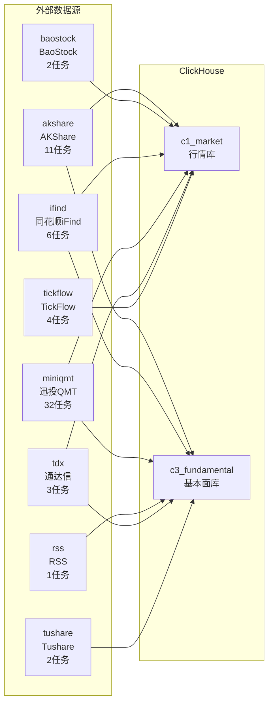

# 数据采集流图 / Data Acquisition Flow

> **这个文档是给人看的**：用大白话说清楚「系统从哪些数据源、采了什么数据、灌到哪张表、什么时候采」。
> **真源是 [tasks.yaml](../../../src/zephyr/data/config/tasks.yaml)**，本文档是自动生成的派生产物，禁止手工编辑。
> **数据源连接和 API 细节**见 [data_source_operation_manual.md](../../03_modules/_domain_data/data_source_operation_manual.md)。

---

## 一句话说清楚

系统每天从 **8 个数据源**采集 **61 个任务**，灌进 ClickHouse 的 **2 个库**：

- `c1_market` — 行情库（K线、指数、期货、资金、估值等）
- `c3_fundamental` — 基本面库（财务报表、新闻、股东、分红等）

---

## 数据源分布总览

| 数据源 | 任务数 | 主要采什么 |
|--------|--------|-----------|
| **miniqmt**（迅投QMT） | 32 | K线行情、财务报表、股东数据、期权可转债 |
| **akshare**（AKShare） | 11 | 估值、融资融券、龙虎榜、大宗交易、宏观 |
| **ifind**（同花顺iFind） | 6 | 资金流向、股权质押、行业分类 |
| **tickflow**（TickFlow） | 4 | 美股K线、美股指数 |
| **tdx**（通达信） | 3 | 板块分类、板块K线、板块成分股 |
| **tushare**（Tushare） | 2 | 新闻快讯、证券新闻 |
| **baostock**（BaoStock） | 2 | 交易日历、沪深300成分股 |
| **rss**（RSS） | 1 | 财经新闻 |
| **合计** | **61** | |

---

## 各数据源详情

### 1. miniqmt（迅投QMT）— 32 个任务，主力数据源

**一句话**：主力数据源，采 A股/港股/期货的 K线行情（日/周/月/分钟级）和财务报表、股东数据、期权可转债等。

**采集明细**：

| 任务 | 灌到哪张表 | 什么时候采 | 说明 |
|------|-----------|-----------|------|
| adj_factor_incremental | c1_market.adj_factor | 盘后 16:30 | 复权因子增量 |
| index_kline_incremental | c1_market.index_kline | 盘后 16:30 | 指数日K线增量 |
| kline_15min_incremental | c1_market.kline_15min | 盘后 16:30 | 15分钟K线增量 |
| kline_1min_incremental | c1_market.kline_1min | 盘后 16:30 | 1分钟K线增量 |
| kline_30min_incremental | c1_market.kline_30min | 盘后 16:30 | 30分钟K线增量 |
| kline_5min_incremental | c1_market.kline_5min | 盘后 16:30 | 5分钟K线增量 |
| kline_60min_incremental | c1_market.kline_60min | 盘后 16:30 | 60分钟K线增量 |
| kline_daily_hfq_incremental | c1_market.kline_daily_hfq | 盘后 16:30 | 后复权日K线增量（依赖adj_factor_incremental） |
| kline_daily_incremental | c1_market.kline_daily | 盘后 16:30 | 不复权日K线增量 |
| kline_monthly_incremental | c1_market.kline_monthly | 盘后 16:30 | 月K线增量 |
| kline_weekly_incremental | c1_market.kline_weekly | 盘后 16:30 | 周K线增量 |
| futures_kline_incremental | c1_market.futures_kline | 盘后 17:00 | 期货行情K线增量 |
| futures_position_incremental | c1_market.futures_position | 盘后 17:00 | 期货持仓增量（依赖futures_kline_incremental） |
| hk_daily_kline_incremental | c1_market.hk_daily_kline | 盘后 17:00 | 港股日K线增量 |
| dividend_incremental | c3_fundamental.dividend | 盘后 18:00 | 分红送股增量 |
| earnings_forecast_incremental | c3_fundamental.earnings_forecast | 盘后 18:00 | 盈利预测增量 |
| express_report_incremental | c3_fundamental.express_report | 盘后 18:00 | 业绩快报增量 |
| shareholder_incremental | c3_fundamental.shareholder | 盘后 18:00 | 股东数据增量 |
| auction_snapshot | c1_market.auction_snapshot | 周六 10:00 | 集合竞价快照 |
| balance_sheet_incremental | c3_fundamental.balance_sheet | 周六 10:00 | 资产负债表增量 |
| cashflow_statement_incremental | c3_fundamental.cashflow_statement | 周六 10:00 | 现金流量表增量 |
| convertible_bond_iv_incremental | c1_market.convertible_bond_iv | 周六 10:00 | 可转债IV增量 |
| financial_indicator_incremental | c3_fundamental.financial_indicator | 周六 10:00 | 财务指标增量 |
| futures_term_structure_incremental | c1_market.futures_term_structure | 周六 10:00 | 期货期限结构增量（依赖futures_kline_incremental） |
| income_statement_incremental | c3_fundamental.income_statement | 周六 10:00 | 利润表增量 |
| index_quote_snapshot | c1_market.index_quote | 周六 10:00 | 指数3秒实时行情快照 |
| main_business_incremental | c3_fundamental.main_business | 周六 10:00 | 主营业务增量 |
| option_iv_surface_incremental | c1_market.option_iv_surface | 周六 10:00 | 期权IV曲面增量 |
| tick_data_snapshot | c1_market.tick_data | 周六 10:00 | 3秒Tick快照 |
| kline_5min_history_backfill | c1_market.kline_5min | 月初 09:00 | 5分钟K线历史回补（**已禁用**） |
| kline_daily_full_refresh | c1_market.kline_daily | 月初 09:00 | 日K线全量刷新 |
| stock_list_refresh | c1_market.stock_list | 月初 09:00 | 股票列表全量刷新 |

**注意**：
- `adj_factor_incremental`：每只约11秒，5204只约需16小时，建议夜间运行

---

### 2. akshare（AKShare）— 11 个任务

**一句话**：开源数据源，采估值、融资融券、龙虎榜、大宗交易、宏观数据、限售解禁等事件类数据。

**采集明细**：

| 任务 | 灌到哪张表 | 什么时候采 | 说明 |
|------|-----------|-----------|------|
| daily_valuation_incremental | c1_market.daily_valuation | 盘后 16:30 | 每日估值（PE/PB）增量（依赖kline_daily_incremental） |
| block_trade_incremental | c1_market.block_trade | 盘后 17:00 | 大宗交易增量 |
| dragon_tiger_incremental | c1_market.dragon_tiger | 盘后 17:00 | 龙虎榜增量 |
| macro_data_incremental | c1_market.macro_data | 盘后 17:00 | 宏观数据增量 |
| margin_trading_incremental | c1_market.margin_trading | 盘后 17:00 | 融资融券增量 |
| analyst_forecast_incremental | c3_fundamental.analyst_forecast | 盘后 18:00 | 分析师一致预期增量 |
| audit_opinion_incremental | c3_fundamental.audit_opinion | 盘后 18:00 | 审计意见增量 |
| rights_issue_incremental | c3_fundamental.rights_issue | 盘后 18:00 | 分红配股增量 |
| share_unlock_incremental | c3_fundamental.share_unlock | 盘后 18:00 | 限售解禁增量 |
| daily_valuation_full_refresh | c1_market.daily_valuation | 月初 09:00 | 估值数据全量刷新 |
| macro_data_full_refresh | c1_market.macro_data | 月初 09:00 | 宏观数据全量刷新 |

**注意**：
- `daily_valuation_incremental`：百度股市通API高频返回空响应，每只休眠1秒

---

### 3. ifind（同花顺iFind）— 6 个任务

**一句话**：付费数据源，采资金流向、股权质押、行业分类等 iFind 独有数据。

**采集明细**：

| 任务 | 灌到哪张表 | 什么时候采 | 说明 |
|------|-----------|-----------|------|
| hk_connect_flow_incremental | c1_market.hk_connect_flow | 盘后 17:00 | 沪深港通资金增量（**已禁用**） |
| money_flow_incremental | c1_market.money_flow | 盘后 17:00 | 资金流向增量 |
| equity_pledge_incremental | c3_fundamental.equity_pledge | 盘后 18:00 | 股权质押增量 |
| equity_pledge_summary_incremental | c3_fundamental.equity_pledge_summary | 盘后 18:00 | 股权质押摘要增量 |
| industry_class_ifind_refresh | c3_fundamental.industry_class_ifind | 月初 09:00 | 申万/中证行业分类全量刷新 |
| money_flow_full_refresh | c1_market.money_flow | 月初 09:00 | 资金流向全量刷新 |

---

### 4. tickflow（TickFlow）— 4 个任务

**一句话**：美股数据源，采美股日K线和美股指数（ETF替代）。

**采集明细**：

| 任务 | 灌到哪张表 | 什么时候采 | 说明 |
|------|-----------|-----------|------|
| us_daily_kline_incremental | c1_market.us_daily_kline | 盘后 17:00 | 美股日K线增量 |
| us_index_incremental | c1_market.us_index | 盘后 17:00 | 美股指数增量 |
| us_daily_kline_full_refresh | c1_market.us_daily_kline | 月初 09:00 | 美股日K线全量刷新 |
| us_index_full_refresh | c1_market.us_index | 月初 09:00 | 美股指数全量刷新 |

---

### 5. tdx（通达信）— 3 个任务

**一句话**：板块数据源，采通达信板块分类、板块K线、板块成分股。

**采集明细**：

| 任务 | 灌到哪张表 | 什么时候采 | 说明 |
|------|-----------|-----------|------|
| industry_class_refresh | c3_fundamental.industry_class | 周六 10:00 | 板块分类全量刷新 |
| sector_kline_incremental | c1_market.sector_kline | 周六 10:00 | 板块指数K线增量（依赖industry_class_refresh） |
| sector_constituent_refresh | c3_fundamental.sector_constituent | 月初 09:00 | 板块成分股全量刷新 |

**注意**：
- `tdx板块 vs 东财/同花顺/申万`：通达信880xxx体系与其他分类不兼容，无法混用

---

### 6. tushare（Tushare）— 2 个任务

**一句话**：付费数据源，采新闻快讯和证券新闻。

**采集明细**：

| 任务 | 灌到哪张表 | 什么时候采 | 说明 |
|------|-----------|-----------|------|
| news_news_info_incremental | c3_fundamental.news_news_info | 盘后 18:00 | 新闻快讯增量 |
| news_security_incremental | c3_fundamental.news_security | 盘后 18:00 | 证券新闻增量 |

---

### 7. baostock（BaoStock）— 2 个任务

**一句话**：开源数据源，采交易日历和沪深300成分股。

**采集明细**：

| 任务 | 灌到哪张表 | 什么时候采 | 说明 |
|------|-----------|-----------|------|
| index_constituent_refresh | c1_market.index_constituent | 月初 09:00 | 沪深300成分股全量刷新 |
| trade_calendar_refresh | c1_market.trade_calendar | 月初 09:00 | 交易日历全量刷新 |

---

### 8. rss（RSS）— 1 个任务

**一句话**：RSS爬虫，采财经新闻。

**采集明细**：

| 任务 | 灌到哪张表 | 什么时候采 | 说明 |
|------|-----------|-----------|------|
| news_data_incremental | c3_fundamental.news_data | 盘后 18:00 | 财经新闻增量 |

---

## 调度时段总览

系统按 5 个时段调度，避免并发冲突：

| 调度时段 | 时间 | 任务数 | 说明 |
|---------|------|--------|------|
| 盘后 16:30 | 16:30 周一-五 | 12 | 日K线、周月K线、分钟K线、估值 |
| 盘后 17:00 | 17:00 周一-五 | 11 | 融资融券、龙虎榜、期货、美股、港股、资金流向 |
| 盘后 18:00 | 18:00 周一-五 | 13 | 新闻、股东、分红、质押、解禁、分析师预期 |
| 周六 10:00 | 周六 10:00 | 13 | 财务报表、板块、期权可转债、Tick快照 |
| 月初 09:00 | 月初 09:00 | 12 | 交易日历、股票列表、行业分类、全量刷新 |
| **合计** | | **61** | |

---

## 数据流向图

---

## 已知问题与注意事项

| 问题 | 涉及任务 | 说明 |
|------|---------|------|
| **下载极慢** | adj_factor_incremental | 每只约11秒，5204只约需16小时，建议夜间运行 |
| **API限流** | daily_valuation_incremental | 百度股市通API高频返回空响应，每只休眠1秒 |
| **分类不兼容** | tdx板块 vs 东财/同花顺/申万 | 通达信880xxx体系与其他分类不兼容，无法混用 |
| **已禁用** | hk_connect_flow_incremental | 沪深港通资金增量 |
| **已禁用** | kline_5min_history_backfill | 5分钟K线历史回补 |
