# 业务数据采集流图（data_acquisition_flow）

> 生成时间: 2026-07-06T09:59:11
> 运行日期: 2026-07-09
> 输入真源: `docs/03_modules/_domain_data/data_acquisition_matrix.md`（人类+扫描器维护）
> 输出: 本文档（自动派生产物，禁止手工编辑）

## 概述

本文档展示**业务数据库表的数据采集流**——即外部数据源通过哪个采集 Job 把数据灌进哪张业务表。

**与 [dataflow_index.md](dataflow_index.md) 的关系**：
- `dataflow_index.md` 画**运行时业务系统流**（tick → K线 → 因子 → 信号 → 订单 → 成交 → 持仓）
- 本文档画**数据采集流**（iFind/QMT/AKShare 等 → 采集 Job → ClickHouse 业务表）
- 两者正交互补，共同构成数据全景。

## 统计概览

| 指标 | 值 |
|------|-----|
| 采集任务总数 | 61 |
| 唯一业务表数 | 54 |
| 数据源数 | 8 |
| 调度时段数 | 5 |
| 数据库数 | 2 |

### 按状态统计

| 状态 | 任务数 | 占比 |
|------|--------|------|
| 已配置定时 | 44 | 72.1% |
| 已禁用 | 2 | 3.3% |
| 待接入(空表) | 15 | 24.6% |

### 按数据源统计

| 数据源 | 任务数 | 占比 |
|--------|--------|------|
| AKShare | 4 | 6.6% |
| BaoStock | 3 | 4.9% |
| 同花顺iFind | 19 | 31.1% |
| 迅投QMT | 25 | 41.0% |
| RSS | 1 | 1.6% |
| 通达信 | 3 | 4.9% |
| TickFlow | 4 | 6.6% |
| Tushare | 2 | 3.3% |

### 按调度时段统计

| 调度时段 | 任务数 | 占比 |
|----------|--------|------|
| 周末财务 / 10:00 周六 | 13 | 21.3% |
| 盘后事件 / 18:00 周一-五 | 13 | 21.3% |
| 盘后日K / 16:30 周一-五 | 12 | 19.7% |
| 盘后资金 / 17:00 周一-五 | 11 | 18.0% |
| 静态数据 / 09:00 月初 | 12 | 19.7% |

### 按数据库统计

| 数据库 | 任务数 | 唯一表数 |
|--------|--------|----------|
| c1_market | 40 | 33 |
| c3_fundamental | 21 | 21 |

### 数据新鲜度统计（基于最新日期 vs 运行日期）

| 新鲜度 | 任务数 | 说明 |
|--------|--------|------|
| 🟢 当日 | 0 | 滞后 ≤1 天 |
| 🟡 滞后1-3天 | 0 | 滞后 2-3 天 |
| 🟠 滞后4-7天 | 19 | 滞后 4-7 天 |
| 🔴 滞后>7天 | 9 | 滞后 >7 天 |
| ⚫ 未知 | 33 | 无最新日期 |

## Mermaid 图表

> **图例说明 / Legend**：
> - **绿色圆角矩形** = 采集 Job（jobNode）
> - **蓝色矩形** = 业务表 Dataset（dsNode）
> - **粉色圆角矩形** = 外部数据源（srcNode）
> - **黄色圆角矩形** = 调度时段内的 Job（按时段图）
> - 表节点前缀图标 🟢/🟡/🟠/🔴/⚫ = 数据新鲜度

### 图1：按数据源分组（外部源 → 采集Job → 业务表）

> 8 数据源 / 54 业务表 / 61 采集边

```mermaid
flowchart LR
    subgraph S_akshare["AKShare（4 任务）"]
        J10["macro_data_incremental"]:::jobNode
        J29["analyst_forecast_incremental"]:::jobNode
        J34["rights_issue_incremental"]:::jobNode
        J56["macro_data_full_refresh"]:::jobNode
    end
    subgraph S_baostock["BaoStock（3 任务）"]
        J50["trade_calendar_refresh"]:::jobNode
        J52["index_constituent_refresh"]:::jobNode
        J55["kline_daily_full_refresh"]:::jobNode
    end
    subgraph S_ifind["同花顺iFind（19 任务）"]
        J1["adj_factor_incremental"]:::jobNode
        J2["kline_daily_hfq_incremental"]:::jobNode
        J3["kline_daily_incremental"]:::jobNode
        J4["daily_valuation_incremental"]:::jobNode
        J5["index_kline_incremental"]:::jobNode
        J6["margin_trading_incremental"]:::jobNode
        J7["block_trade_incremental"]:::jobNode
        J8["dragon_tiger_incremental"]:::jobNode
        J11["money_flow_incremental"]:::jobNode
        J12["hk_connect_flow_incremental"]:::jobNode
        J17["kline_weekly_incremental"]:::jobNode
        J18["kline_monthly_incremental"]:::jobNode
        J27["share_unlock_incremental"]:::jobNode
        J32["audit_opinion_incremental"]:::jobNode
        J35["equity_pledge_incremental"]:::jobNode
        J36["equity_pledge_summary_incremental"]:::jobNode
        J53["industry_class_ifind_refresh"]:::jobNode
        J59["money_flow_full_refresh"]:::jobNode
        J60["daily_valuation_full_refresh"]:::jobNode
    end
    subgraph S_miniqmt["迅投QMT（25 任务）"]
        J9["hk_daily_kline_incremental"]:::jobNode
        J13["futures_kline_incremental"]:::jobNode
        J14["futures_position_incremental"]:::jobNode
        J19["kline_1min_incremental"]:::jobNode
        J20["kline_5min_incremental"]:::jobNode
        J21["kline_15min_incremental"]:::jobNode
        J22["kline_30min_incremental"]:::jobNode
        J23["kline_60min_incremental"]:::jobNode
        J28["shareholder_incremental"]:::jobNode
        J30["earnings_forecast_incremental"]:::jobNode
        J31["express_report_incremental"]:::jobNode
        J33["dividend_incremental"]:::jobNode
        J37["balance_sheet_incremental"]:::jobNode
        J38["income_statement_incremental"]:::jobNode
        J39["cashflow_statement_incremental"]:::jobNode
        J40["financial_indicator_incremental"]:::jobNode
        J41["main_business_incremental"]:::jobNode
        J44["option_iv_surface_incremental"]:::jobNode
        J45["convertible_bond_iv_incremental"]:::jobNode
        J46["futures_term_structure_incremental"]:::jobNode
        J47["tick_data_snapshot"]:::jobNode
        J48["auction_snapshot"]:::jobNode
        J49["index_quote_snapshot"]:::jobNode
        J51["stock_list_refresh"]:::jobNode
        J61["kline_5min_history_backfill"]:::jobNode
    end
    subgraph S_rss["RSS（1 任务）"]
        J24["news_data_incremental"]:::jobNode
    end
    subgraph S_tdx["通达信（3 任务）"]
        J42["industry_class_refresh"]:::jobNode
        J43["sector_kline_incremental"]:::jobNode
        J54["sector_constituent_refresh"]:::jobNode
    end
    subgraph S_tickflow["TickFlow（4 任务）"]
        J15["us_daily_kline_incremental"]:::jobNode
        J16["us_index_incremental"]:::jobNode
        J57["us_daily_kline_full_refresh"]:::jobNode
        J58["us_index_full_refresh"]:::jobNode
    end
    subgraph S_tushare["Tushare（2 任务）"]
        J25["news_news_info_incremental"]:::jobNode
        J26["news_security_incremental"]:::jobNode
    end
    subgraph DB_c1_market["c1_market（33 表）"]
        T_c1_market_adj_factor["🟠 c1_market.adj_factor<br/>1879.8万行<br/>2026-07-03"]:::dsNode
        T_c1_market_auction_snapshot["⚫ c1_market.auction_snapshot<br/>0行"]:::dsNode
        T_c1_market_block_trade["🔴 c1_market.block_trade<br/>16.2万行<br/>2026-06-30"]:::dsNode
        T_c1_market_convertible_bond_iv["⚫ c1_market.convertible_bond_iv<br/>0行"]:::dsNode
        T_c1_market_daily_valuation["🟠 c1_market.daily_valuation<br/>878.8万行<br/>2026-07-03"]:::dsNode
        T_c1_market_dragon_tiger["🟠 c1_market.dragon_tiger<br/>16.8万行<br/>2026-07-03"]:::dsNode
        T_c1_market_futures_kline["🟠 c1_market.futures_kline<br/>306.7万行<br/>2026-07-03"]:::dsNode
        T_c1_market_futures_position["⚫ c1_market.futures_position<br/>0行"]:::dsNode
        T_c1_market_futures_term_structure["⚫ c1_market.futures_term_structure<br/>0行"]:::dsNode
        T_c1_market_hk_connect_flow["⚫ c1_market.hk_connect_flow<br/>-行"]:::dsNode
        T_c1_market_hk_daily_kline["🟠 c1_market.hk_daily_kline<br/>146.0万行<br/>2026-07-03"]:::dsNode
        T_c1_market_index_constituent["🔴 c1_market.index_constituent<br/>6.0万行<br/>2026-06-30"]:::dsNode
        T_c1_market_index_kline["🟠 c1_market.index_kline<br/>306.6万行<br/>2026-07-03"]:::dsNode
        T_c1_market_index_quote["⚫ c1_market.index_quote<br/>0行"]:::dsNode
        T_c1_market_kline_15min["🟠 c1_market.kline_15min<br/>2.54亿行<br/>2026-07-02"]:::dsNode
        T_c1_market_kline_1min["🟠 c1_market.kline_1min<br/>38.31亿行<br/>2026-07-02"]:::dsNode
        T_c1_market_kline_30min["🟠 c1_market.kline_30min<br/>1.27亿行<br/>2026-07-02"]:::dsNode
        T_c1_market_kline_5min["⚫ c1_market.kline_5min<br/>9.76亿行"]:::dsNode
        T_c1_market_kline_60min["🟠 c1_market.kline_60min<br/>6357.8万行<br/>2026-07-02"]:::dsNode
        T_c1_market_kline_daily["🟠 c1_market.kline_daily<br/>1812.5万行<br/>2026-07-03"]:::dsNode
        T_c1_market_kline_daily_hfq["🟠 c1_market.kline_daily_hfq<br/>1811.9万行<br/>2026-07-02"]:::dsNode
        T_c1_market_kline_monthly["🔴 c1_market.kline_monthly<br/>89.9万行<br/>2026-06-30"]:::dsNode
        T_c1_market_kline_weekly["🔴 c1_market.kline_weekly<br/>376.9万行<br/>2026-06-26"]:::dsNode
        T_c1_market_macro_data["🔴 c1_market.macro_data<br/>5853行<br/>2026-06-30"]:::dsNode
        T_c1_market_margin_trading["🔴 c1_market.margin_trading<br/>109.6万行<br/>2026-06-30"]:::dsNode
        T_c1_market_money_flow["🟠 c1_market.money_flow<br/>49.5万行<br/>2026-07-03"]:::dsNode
        T_c1_market_option_iv_surface["⚫ c1_market.option_iv_surface<br/>0行"]:::dsNode
        T_c1_market_sector_kline["⚫ c1_market.sector_kline<br/>0行"]:::dsNode
        T_c1_market_stock_list["⚫ c1_market.stock_list<br/>5534行"]:::dsNode
        T_c1_market_tick_data["⚫ c1_market.tick_data<br/>0行"]:::dsNode
        T_c1_market_trade_calendar["⚫ c1_market.trade_calendar<br/>1.3万行"]:::dsNode
        T_c1_market_us_daily_kline["🔴 c1_market.us_daily_kline<br/>16.7万行<br/>2026-07-01"]:::dsNode
        T_c1_market_us_index["🟠 c1_market.us_index<br/>2.2万行<br/>2026-07-02"]:::dsNode
    end
    subgraph DB_c3_fundamental["c3_fundamental（21 表）"]
        T_c3_fundamental_analyst_forecast["⚫ c3_fundamental.analyst_forecast<br/>0行"]:::dsNode
        T_c3_fundamental_audit_opinion["⚫ c3_fundamental.audit_opinion<br/>9.6万行"]:::dsNode
        T_c3_fundamental_balance_sheet["⚫ c3_fundamental.balance_sheet<br/>33.5万行"]:::dsNode
        T_c3_fundamental_cashflow_statement["⚫ c3_fundamental.cashflow_statement<br/>30.5万行"]:::dsNode
        T_c3_fundamental_dividend["⚫ c3_fundamental.dividend<br/>11.5万行"]:::dsNode
        T_c3_fundamental_earnings_forecast["⚫ c3_fundamental.earnings_forecast<br/>12.6万行"]:::dsNode
        T_c3_fundamental_equity_pledge["⚫ c3_fundamental.equity_pledge<br/>0行"]:::dsNode
        T_c3_fundamental_equity_pledge_summary["🟠 c3_fundamental.equity_pledge_summary<br/>172.3万行<br/>2026-07-03"]:::dsNode
        T_c3_fundamental_express_report["⚫ c3_fundamental.express_report<br/>3.0万行"]:::dsNode
        T_c3_fundamental_financial_indicator["⚫ c3_fundamental.financial_indicator<br/>34.8万行"]:::dsNode
        T_c3_fundamental_income_statement["⚫ c3_fundamental.income_statement<br/>34.1万行"]:::dsNode
        T_c3_fundamental_industry_class["⚫ c3_fundamental.industry_class<br/>0行"]:::dsNode
        T_c3_fundamental_industry_class_ifind["⚫ c3_fundamental.industry_class_ifind<br/>0行"]:::dsNode
        T_c3_fundamental_main_business["⚫ c3_fundamental.main_business<br/>209.0万行"]:::dsNode
        T_c3_fundamental_news_data["⚫ c3_fundamental.news_data<br/>287行"]:::dsNode
        T_c3_fundamental_news_news_info["⚫ c3_fundamental.news_news_info<br/>960.9万行"]:::dsNode
        T_c3_fundamental_news_security["⚫ c3_fundamental.news_security<br/>372.9万行"]:::dsNode
        T_c3_fundamental_rights_issue["⚫ c3_fundamental.rights_issue<br/>8.1万行"]:::dsNode
        T_c3_fundamental_sector_constituent["⚫ c3_fundamental.sector_constituent<br/>0行"]:::dsNode
        T_c3_fundamental_share_unlock["⚫ c3_fundamental.share_unlock<br/>0行"]:::dsNode
        T_c3_fundamental_shareholder["⚫ c3_fundamental.shareholder<br/>0行"]:::dsNode
    end
    J1 --> T_c1_market_adj_factor
    J2 --> T_c1_market_kline_daily_hfq
    J3 --> T_c1_market_kline_daily
    J4 --> T_c1_market_daily_valuation
    J5 --> T_c1_market_index_kline
    J6 --> T_c1_market_margin_trading
    J7 --> T_c1_market_block_trade
    J8 --> T_c1_market_dragon_tiger
    J9 --> T_c1_market_hk_daily_kline
    J10 --> T_c1_market_macro_data
    J11 --> T_c1_market_money_flow
    J12 --> T_c1_market_hk_connect_flow
    J13 --> T_c1_market_futures_kline
    J14 --> T_c1_market_futures_position
    J15 --> T_c1_market_us_daily_kline
    J16 --> T_c1_market_us_index
    J17 --> T_c1_market_kline_weekly
    J18 --> T_c1_market_kline_monthly
    J19 --> T_c1_market_kline_1min
    J20 --> T_c1_market_kline_5min
    J21 --> T_c1_market_kline_15min
    J22 --> T_c1_market_kline_30min
    J23 --> T_c1_market_kline_60min
    J24 --> T_c3_fundamental_news_data
    J25 --> T_c3_fundamental_news_news_info
    J26 --> T_c3_fundamental_news_security
    J27 --> T_c3_fundamental_share_unlock
    J28 --> T_c3_fundamental_shareholder
    J29 --> T_c3_fundamental_analyst_forecast
    J30 --> T_c3_fundamental_earnings_forecast
    J31 --> T_c3_fundamental_express_report
    J32 --> T_c3_fundamental_audit_opinion
    J33 --> T_c3_fundamental_dividend
    J34 --> T_c3_fundamental_rights_issue
    J35 --> T_c3_fundamental_equity_pledge
    J36 --> T_c3_fundamental_equity_pledge_summary
    J37 --> T_c3_fundamental_balance_sheet
    J38 --> T_c3_fundamental_income_statement
    J39 --> T_c3_fundamental_cashflow_statement
    J40 --> T_c3_fundamental_financial_indicator
    J41 --> T_c3_fundamental_main_business
    J42 --> T_c3_fundamental_industry_class
    J43 --> T_c1_market_sector_kline
    J44 --> T_c1_market_option_iv_surface
    J45 --> T_c1_market_convertible_bond_iv
    J46 --> T_c1_market_futures_term_structure
    J47 --> T_c1_market_tick_data
    J48 --> T_c1_market_auction_snapshot
    J49 --> T_c1_market_index_quote
    J50 --> T_c1_market_trade_calendar
    J51 --> T_c1_market_stock_list
    J52 --> T_c1_market_index_constituent
    J53 --> T_c3_fundamental_industry_class_ifind
    J54 --> T_c3_fundamental_sector_constituent
    J55 --> T_c1_market_kline_daily
    J56 --> T_c1_market_macro_data
    J57 --> T_c1_market_us_daily_kline
    J58 --> T_c1_market_us_index
    J59 --> T_c1_market_money_flow
    J60 --> T_c1_market_daily_valuation
    J61 --> T_c1_market_kline_5min

    classDef jobNode fill:#c8e6c9,stroke:#2e7d32,stroke-width:2px,color:#1b5e20
    classDef dsNode fill:#bbdefb,stroke:#1565c0,stroke-width:2px,color:#0d47a1
```

### 图2：按调度时段分组（5档时段 → 采集Job → 业务表）

> 5 调度时段 / 61 采集边

```mermaid
flowchart LR
    subgraph SL________10_00_["周末财务 / 10:00 周六（13 任务）"]
        J37["balance_sheet_incremental"]:::jobNode
        J38["income_statement_incremental"]:::jobNode
        J39["cashflow_statement_incremental"]:::jobNode
        J40["financial_indicator_incremental"]:::jobNode
        J41["main_business_incremental"]:::jobNode
        J42["industry_class_refresh"]:::jobNode
        J43["sector_kline_incremental"]:::jobNode
        J44["option_iv_surface_incremental"]:::jobNode
        J45["convertible_bond_iv_incremental"]:::jobNode
        J46["futures_term_structure_incremental"]:::jobNode
        J47["tick_data_snapshot"]:::jobNode
        J48["auction_snapshot"]:::jobNode
        J49["index_quote_snapshot"]:::jobNode
    end
    subgraph SL______18_00_["盘后事件 / 18:00 周一-五（13 任务）"]
        J24["news_data_incremental"]:::jobNode
        J25["news_news_info_incremental"]:::jobNode
        J26["news_security_incremental"]:::jobNode
        J27["share_unlock_incremental"]:::jobNode
        J28["shareholder_incremental"]:::jobNode
        J29["analyst_forecast_incremental"]:::jobNode
        J30["earnings_forecast_incremental"]:::jobNode
        J31["express_report_incremental"]:::jobNode
        J32["audit_opinion_incremental"]:::jobNode
        J33["dividend_incremental"]:::jobNode
        J34["rights_issue_incremental"]:::jobNode
        J35["equity_pledge_incremental"]:::jobNode
        J36["equity_pledge_summary_incremental"]:::jobNode
    end
    subgraph SL____K_16_30_["盘后日K / 16:30 周一-五（12 任务）"]
        J1["adj_factor_incremental"]:::jobNode
        J2["kline_daily_hfq_incremental"]:::jobNode
        J3["kline_daily_incremental"]:::jobNode
        J4["daily_valuation_incremental"]:::jobNode
        J5["index_kline_incremental"]:::jobNode
        J17["kline_weekly_incremental"]:::jobNode
        J18["kline_monthly_incremental"]:::jobNode
        J19["kline_1min_incremental"]:::jobNode
        J20["kline_5min_incremental"]:::jobNode
        J21["kline_15min_incremental"]:::jobNode
        J22["kline_30min_incremental"]:::jobNode
        J23["kline_60min_incremental"]:::jobNode
    end
    subgraph SL______17_00_["盘后资金 / 17:00 周一-五（11 任务）"]
        J6["margin_trading_incremental"]:::jobNode
        J7["block_trade_incremental"]:::jobNode
        J8["dragon_tiger_incremental"]:::jobNode
        J9["hk_daily_kline_incremental"]:::jobNode
        J10["macro_data_incremental"]:::jobNode
        J11["money_flow_incremental"]:::jobNode
        J12["hk_connect_flow_incremental"]:::jobNode
        J13["futures_kline_incremental"]:::jobNode
        J14["futures_position_incremental"]:::jobNode
        J15["us_daily_kline_incremental"]:::jobNode
        J16["us_index_incremental"]:::jobNode
    end
    subgraph SL________09_00_["静态数据 / 09:00 月初（12 任务）"]
        J50["trade_calendar_refresh"]:::jobNode
        J51["stock_list_refresh"]:::jobNode
        J52["index_constituent_refresh"]:::jobNode
        J53["industry_class_ifind_refresh"]:::jobNode
        J54["sector_constituent_refresh"]:::jobNode
        J55["kline_daily_full_refresh"]:::jobNode
        J56["macro_data_full_refresh"]:::jobNode
        J57["us_daily_kline_full_refresh"]:::jobNode
        J58["us_index_full_refresh"]:::jobNode
        J59["money_flow_full_refresh"]:::jobNode
        J60["daily_valuation_full_refresh"]:::jobNode
        J61["kline_5min_history_backfill"]:::jobNode
    end
    T_c1_market_adj_factor["🟠 c1_market.adj_factor<br/>1879.8万行<br/>2026-07-03"]:::dsNode
    T_c1_market_kline_daily_hfq["🟠 c1_market.kline_daily_hfq<br/>1811.9万行<br/>2026-07-02"]:::dsNode
    T_c1_market_kline_daily["🟠 c1_market.kline_daily<br/>1812.5万行<br/>2026-07-03"]:::dsNode
    T_c1_market_daily_valuation["🟠 c1_market.daily_valuation<br/>878.8万行<br/>2026-07-03"]:::dsNode
    T_c1_market_index_kline["🟠 c1_market.index_kline<br/>306.6万行<br/>2026-07-03"]:::dsNode
    T_c1_market_margin_trading["🔴 c1_market.margin_trading<br/>109.6万行<br/>2026-06-30"]:::dsNode
    T_c1_market_block_trade["🔴 c1_market.block_trade<br/>16.2万行<br/>2026-06-30"]:::dsNode
    T_c1_market_dragon_tiger["🟠 c1_market.dragon_tiger<br/>16.8万行<br/>2026-07-03"]:::dsNode
    T_c1_market_hk_daily_kline["🟠 c1_market.hk_daily_kline<br/>146.0万行<br/>2026-07-03"]:::dsNode
    T_c1_market_macro_data["🔴 c1_market.macro_data<br/>5853行<br/>2026-06-30"]:::dsNode
    T_c1_market_money_flow["🟠 c1_market.money_flow<br/>49.5万行<br/>2026-07-03"]:::dsNode
    T_c1_market_hk_connect_flow["⚫ c1_market.hk_connect_flow<br/>-行"]:::dsNode
    T_c1_market_futures_kline["🟠 c1_market.futures_kline<br/>306.7万行<br/>2026-07-03"]:::dsNode
    T_c1_market_futures_position["⚫ c1_market.futures_position<br/>0行"]:::dsNode
    T_c1_market_us_daily_kline["🔴 c1_market.us_daily_kline<br/>16.7万行<br/>2026-07-01"]:::dsNode
    T_c1_market_us_index["🟠 c1_market.us_index<br/>2.2万行<br/>2026-07-02"]:::dsNode
    T_c1_market_kline_weekly["🔴 c1_market.kline_weekly<br/>376.9万行<br/>2026-06-26"]:::dsNode
    T_c1_market_kline_monthly["🔴 c1_market.kline_monthly<br/>89.9万行<br/>2026-06-30"]:::dsNode
    T_c1_market_kline_1min["🟠 c1_market.kline_1min<br/>38.31亿行<br/>2026-07-02"]:::dsNode
    T_c1_market_kline_5min["⚫ c1_market.kline_5min<br/>9.76亿行"]:::dsNode
    T_c1_market_kline_15min["🟠 c1_market.kline_15min<br/>2.54亿行<br/>2026-07-02"]:::dsNode
    T_c1_market_kline_30min["🟠 c1_market.kline_30min<br/>1.27亿行<br/>2026-07-02"]:::dsNode
    T_c1_market_kline_60min["🟠 c1_market.kline_60min<br/>6357.8万行<br/>2026-07-02"]:::dsNode
    T_c3_fundamental_news_data["⚫ c3_fundamental.news_data<br/>287行"]:::dsNode
    T_c3_fundamental_news_news_info["⚫ c3_fundamental.news_news_info<br/>960.9万行"]:::dsNode
    T_c3_fundamental_news_security["⚫ c3_fundamental.news_security<br/>372.9万行"]:::dsNode
    T_c3_fundamental_share_unlock["⚫ c3_fundamental.share_unlock<br/>0行"]:::dsNode
    T_c3_fundamental_shareholder["⚫ c3_fundamental.shareholder<br/>0行"]:::dsNode
    T_c3_fundamental_analyst_forecast["⚫ c3_fundamental.analyst_forecast<br/>0行"]:::dsNode
    T_c3_fundamental_earnings_forecast["⚫ c3_fundamental.earnings_forecast<br/>12.6万行"]:::dsNode
    T_c3_fundamental_express_report["⚫ c3_fundamental.express_report<br/>3.0万行"]:::dsNode
    T_c3_fundamental_audit_opinion["⚫ c3_fundamental.audit_opinion<br/>9.6万行"]:::dsNode
    T_c3_fundamental_dividend["⚫ c3_fundamental.dividend<br/>11.5万行"]:::dsNode
    T_c3_fundamental_rights_issue["⚫ c3_fundamental.rights_issue<br/>8.1万行"]:::dsNode
    T_c3_fundamental_equity_pledge["⚫ c3_fundamental.equity_pledge<br/>0行"]:::dsNode
    T_c3_fundamental_equity_pledge_summary["🟠 c3_fundamental.equity_pledge_summary<br/>172.3万行<br/>2026-07-03"]:::dsNode
    T_c3_fundamental_balance_sheet["⚫ c3_fundamental.balance_sheet<br/>33.5万行"]:::dsNode
    T_c3_fundamental_income_statement["⚫ c3_fundamental.income_statement<br/>34.1万行"]:::dsNode
    T_c3_fundamental_cashflow_statement["⚫ c3_fundamental.cashflow_statement<br/>30.5万行"]:::dsNode
    T_c3_fundamental_financial_indicator["⚫ c3_fundamental.financial_indicator<br/>34.8万行"]:::dsNode
    T_c3_fundamental_main_business["⚫ c3_fundamental.main_business<br/>209.0万行"]:::dsNode
    T_c3_fundamental_industry_class["⚫ c3_fundamental.industry_class<br/>0行"]:::dsNode
    T_c1_market_sector_kline["⚫ c1_market.sector_kline<br/>0行"]:::dsNode
    T_c1_market_option_iv_surface["⚫ c1_market.option_iv_surface<br/>0行"]:::dsNode
    T_c1_market_convertible_bond_iv["⚫ c1_market.convertible_bond_iv<br/>0行"]:::dsNode
    T_c1_market_futures_term_structure["⚫ c1_market.futures_term_structure<br/>0行"]:::dsNode
    T_c1_market_tick_data["⚫ c1_market.tick_data<br/>0行"]:::dsNode
    T_c1_market_auction_snapshot["⚫ c1_market.auction_snapshot<br/>0行"]:::dsNode
    T_c1_market_index_quote["⚫ c1_market.index_quote<br/>0行"]:::dsNode
    T_c1_market_trade_calendar["⚫ c1_market.trade_calendar<br/>1.3万行"]:::dsNode
    T_c1_market_stock_list["⚫ c1_market.stock_list<br/>5534行"]:::dsNode
    T_c1_market_index_constituent["🔴 c1_market.index_constituent<br/>6.0万行<br/>2026-06-30"]:::dsNode
    T_c3_fundamental_industry_class_ifind["⚫ c3_fundamental.industry_class_ifind<br/>0行"]:::dsNode
    T_c3_fundamental_sector_constituent["⚫ c3_fundamental.sector_constituent<br/>0行"]:::dsNode
    J1 --> T_c1_market_adj_factor
    J2 --> T_c1_market_kline_daily_hfq
    J3 --> T_c1_market_kline_daily
    J4 --> T_c1_market_daily_valuation
    J5 --> T_c1_market_index_kline
    J6 --> T_c1_market_margin_trading
    J7 --> T_c1_market_block_trade
    J8 --> T_c1_market_dragon_tiger
    J9 --> T_c1_market_hk_daily_kline
    J10 --> T_c1_market_macro_data
    J11 --> T_c1_market_money_flow
    J12 --> T_c1_market_hk_connect_flow
    J13 --> T_c1_market_futures_kline
    J14 --> T_c1_market_futures_position
    J15 --> T_c1_market_us_daily_kline
    J16 --> T_c1_market_us_index
    J17 --> T_c1_market_kline_weekly
    J18 --> T_c1_market_kline_monthly
    J19 --> T_c1_market_kline_1min
    J20 --> T_c1_market_kline_5min
    J21 --> T_c1_market_kline_15min
    J22 --> T_c1_market_kline_30min
    J23 --> T_c1_market_kline_60min
    J24 --> T_c3_fundamental_news_data
    J25 --> T_c3_fundamental_news_news_info
    J26 --> T_c3_fundamental_news_security
    J27 --> T_c3_fundamental_share_unlock
    J28 --> T_c3_fundamental_shareholder
    J29 --> T_c3_fundamental_analyst_forecast
    J30 --> T_c3_fundamental_earnings_forecast
    J31 --> T_c3_fundamental_express_report
    J32 --> T_c3_fundamental_audit_opinion
    J33 --> T_c3_fundamental_dividend
    J34 --> T_c3_fundamental_rights_issue
    J35 --> T_c3_fundamental_equity_pledge
    J36 --> T_c3_fundamental_equity_pledge_summary
    J37 --> T_c3_fundamental_balance_sheet
    J38 --> T_c3_fundamental_income_statement
    J39 --> T_c3_fundamental_cashflow_statement
    J40 --> T_c3_fundamental_financial_indicator
    J41 --> T_c3_fundamental_main_business
    J42 --> T_c3_fundamental_industry_class
    J43 --> T_c1_market_sector_kline
    J44 --> T_c1_market_option_iv_surface
    J45 --> T_c1_market_convertible_bond_iv
    J46 --> T_c1_market_futures_term_structure
    J47 --> T_c1_market_tick_data
    J48 --> T_c1_market_auction_snapshot
    J49 --> T_c1_market_index_quote
    J50 --> T_c1_market_trade_calendar
    J51 --> T_c1_market_stock_list
    J52 --> T_c1_market_index_constituent
    J53 --> T_c3_fundamental_industry_class_ifind
    J54 --> T_c3_fundamental_sector_constituent
    J55 --> T_c1_market_kline_daily
    J56 --> T_c1_market_macro_data
    J57 --> T_c1_market_us_daily_kline
    J58 --> T_c1_market_us_index
    J59 --> T_c1_market_money_flow
    J60 --> T_c1_market_daily_valuation
    J61 --> T_c1_market_kline_5min

    classDef jobNode fill:#fff9c4,stroke:#f9a825,stroke-width:2px,color:#f57f17
    classDef dsNode fill:#bbdefb,stroke:#1565c0,stroke-width:2px,color:#0d47a1
```

### 图3：按数据库分组（外部源 → ClickHouse 库 → 业务表）

> 2 数据库 / 55 源→表 边（去重）

## 交叉矩阵

### 数据源 × 调度时段

| 数据源 \ 调度时段 | 周末财务 / 10:00 周六 | 盘后事件 / 18:00 周一-五 | 盘后日K / 16:30 周一-五 | 盘后资金 / 17:00 周一-五 | 静态数据 / 09:00 月初 | 合计 |
|---|---|---|---|---|---|---|
| AKShare | - | 2 | - | 1 | 1 | 4 |
| BaoStock | - | - | - | - | 3 | 3 |
| 同花顺iFind | - | 4 | 7 | 5 | 3 | 19 |
| 迅投QMT | 11 | 4 | 5 | 3 | 2 | 25 |
| RSS | - | 1 | - | - | - | 1 |
| 通达信 | 2 | - | - | - | 1 | 3 |
| TickFlow | - | - | - | 2 | 2 | 4 |
| Tushare | - | 2 | - | - | - | 2 |
| **合计** | 13 | 13 | 12 | 11 | 12 | **61** |

### 数据源 × 状态

| 数据源 | 已配置定时 | 已禁用 | 待接入(空表) | 合计 |
|---|---|---|---|---|
| AKShare | 3 | - | 1 | 4 |
| BaoStock | 3 | - | - | 3 |
| 同花顺iFind | 15 | 1 | 3 | 19 |
| 迅投QMT | 16 | 1 | 8 | 25 |
| RSS | 1 | - | - | 1 |
| 通达信 | - | - | 3 | 3 |
| TickFlow | 4 | - | - | 4 |
| Tushare | 2 | - | - | 2 |

## 完整表清单

| # | task_id | 表名 | 数据库 | 数据源 | 调度时段 | 行数 | 最新日期 | 新鲜度 | 状态 |
|---|---------|------|--------|--------|---------|------|---------|--------|------|
| 1 | adj_factor_incremental | c1_market.adj_factor | c1_market | 同花顺iFind | 盘后日K / 16:30 周一-五 | 1879.8万 | 2026-07-03 | 🟠 滞后6天 | 已配置定时 |
| 2 | kline_daily_hfq_incremental | c1_market.kline_daily_hfq | c1_market | 同花顺iFind | 盘后日K / 16:30 周一-五 | 1811.9万 | 2026-07-02 | 🟠 滞后7天 | 已配置定时 |
| 3 | kline_daily_incremental | c1_market.kline_daily | c1_market | 同花顺iFind | 盘后日K / 16:30 周一-五 | 1812.5万 | 2026-07-03 | 🟠 滞后6天 | 已配置定时 |
| 4 | daily_valuation_incremental | c1_market.daily_valuation | c1_market | 同花顺iFind | 盘后日K / 16:30 周一-五 | 878.8万 | 2026-07-03 | 🟠 滞后6天 | 已配置定时 |
| 5 | index_kline_incremental | c1_market.index_kline | c1_market | 同花顺iFind | 盘后日K / 16:30 周一-五 | 306.6万 | 2026-07-03 | 🟠 滞后6天 | 已配置定时 |
| 6 | margin_trading_incremental | c1_market.margin_trading | c1_market | 同花顺iFind | 盘后资金 / 17:00 周一-五 | 109.6万 | 2026-06-30 | 🔴 滞后9天 | 已配置定时 |
| 7 | block_trade_incremental | c1_market.block_trade | c1_market | 同花顺iFind | 盘后资金 / 17:00 周一-五 | 16.2万 | 2026-06-30 | 🔴 滞后9天 | 已配置定时 |
| 8 | dragon_tiger_incremental | c1_market.dragon_tiger | c1_market | 同花顺iFind | 盘后资金 / 17:00 周一-五 | 16.8万 | 2026-07-03 | 🟠 滞后6天 | 已配置定时 |
| 9 | hk_daily_kline_incremental | c1_market.hk_daily_kline | c1_market | 迅投QMT | 盘后资金 / 17:00 周一-五 | 146.0万 | 2026-07-03 | 🟠 滞后6天 | 已配置定时 |
| 10 | macro_data_incremental | c1_market.macro_data | c1_market | AKShare | 盘后资金 / 17:00 周一-五 | 5853 | 2026-06-30 | 🔴 滞后9天 | 已配置定时 |
| 11 | money_flow_incremental | c1_market.money_flow | c1_market | 同花顺iFind | 盘后资金 / 17:00 周一-五 | 49.5万 | 2026-07-03 | 🟠 滞后6天 | 已配置定时 |
| 12 | hk_connect_flow_incremental | c1_market.hk_connect_flow | c1_market | 同花顺iFind | 盘后资金 / 17:00 周一-五 | - | - | ⚫ 未知(无日期) | 已禁用 |
| 13 | futures_kline_incremental | c1_market.futures_kline | c1_market | 迅投QMT | 盘后资金 / 17:00 周一-五 | 306.7万 | 2026-07-03 | 🟠 滞后6天 | 已配置定时 |
| 14 | futures_position_incremental | c1_market.futures_position | c1_market | 迅投QMT | 盘后资金 / 17:00 周一-五 | 0 | - | ⚫ 未知(无日期) | 待接入(空表) |
| 15 | us_daily_kline_incremental | c1_market.us_daily_kline | c1_market | TickFlow | 盘后资金 / 17:00 周一-五 | 16.7万 | 2026-07-01 | 🔴 滞后8天 | 已配置定时 |
| 16 | us_index_incremental | c1_market.us_index | c1_market | TickFlow | 盘后资金 / 17:00 周一-五 | 2.2万 | 2026-07-02 | 🟠 滞后7天 | 已配置定时 |
| 17 | kline_weekly_incremental | c1_market.kline_weekly | c1_market | 同花顺iFind | 盘后日K / 16:30 周一-五 | 376.9万 | 2026-06-26 | 🔴 滞后13天 | 已配置定时 |
| 18 | kline_monthly_incremental | c1_market.kline_monthly | c1_market | 同花顺iFind | 盘后日K / 16:30 周一-五 | 89.9万 | 2026-06-30 | 🔴 滞后9天 | 已配置定时 |
| 19 | kline_1min_incremental | c1_market.kline_1min | c1_market | 迅投QMT | 盘后日K / 16:30 周一-五 | 38.31亿 | 2026-07-02 | 🟠 滞后7天 | 已配置定时 |
| 20 | kline_5min_incremental | c1_market.kline_5min | c1_market | 迅投QMT | 盘后日K / 16:30 周一-五 | 9.76亿 | - | ⚫ 未知(无日期) | 已配置定时 |
| 21 | kline_15min_incremental | c1_market.kline_15min | c1_market | 迅投QMT | 盘后日K / 16:30 周一-五 | 2.54亿 | 2026-07-02 | 🟠 滞后7天 | 已配置定时 |
| 22 | kline_30min_incremental | c1_market.kline_30min | c1_market | 迅投QMT | 盘后日K / 16:30 周一-五 | 1.27亿 | 2026-07-02 | 🟠 滞后7天 | 已配置定时 |
| 23 | kline_60min_incremental | c1_market.kline_60min | c1_market | 迅投QMT | 盘后日K / 16:30 周一-五 | 6357.8万 | 2026-07-02 | 🟠 滞后7天 | 已配置定时 |
| 24 | news_data_incremental | c3_fundamental.news_data | c3_fundamental | RSS | 盘后事件 / 18:00 周一-五 | 287 | - | ⚫ 未知(无日期) | 已配置定时 |
| 25 | news_news_info_incremental | c3_fundamental.news_news_info | c3_fundamental | Tushare | 盘后事件 / 18:00 周一-五 | 960.9万 | - | ⚫ 未知(无日期) | 已配置定时 |
| 26 | news_security_incremental | c3_fundamental.news_security | c3_fundamental | Tushare | 盘后事件 / 18:00 周一-五 | 372.9万 | - | ⚫ 未知(无日期) | 已配置定时 |
| 27 | share_unlock_incremental | c3_fundamental.share_unlock | c3_fundamental | 同花顺iFind | 盘后事件 / 18:00 周一-五 | 0 | - | ⚫ 未知(无日期) | 待接入(空表) |
| 28 | shareholder_incremental | c3_fundamental.shareholder | c3_fundamental | 迅投QMT | 盘后事件 / 18:00 周一-五 | 0 | - | ⚫ 未知(无日期) | 待接入(空表) |
| 29 | analyst_forecast_incremental | c3_fundamental.analyst_forecast | c3_fundamental | AKShare | 盘后事件 / 18:00 周一-五 | 0 | - | ⚫ 未知(无日期) | 待接入(空表) |
| 30 | earnings_forecast_incremental | c3_fundamental.earnings_forecast | c3_fundamental | 迅投QMT | 盘后事件 / 18:00 周一-五 | 12.6万 | - | ⚫ 未知(无日期) | 已配置定时 |
| 31 | express_report_incremental | c3_fundamental.express_report | c3_fundamental | 迅投QMT | 盘后事件 / 18:00 周一-五 | 3.0万 | - | ⚫ 未知(无日期) | 已配置定时 |
| 32 | audit_opinion_incremental | c3_fundamental.audit_opinion | c3_fundamental | 同花顺iFind | 盘后事件 / 18:00 周一-五 | 9.6万 | - | ⚫ 未知(无日期) | 已配置定时 |
| 33 | dividend_incremental | c3_fundamental.dividend | c3_fundamental | 迅投QMT | 盘后事件 / 18:00 周一-五 | 11.5万 | - | ⚫ 未知(无日期) | 已配置定时 |
| 34 | rights_issue_incremental | c3_fundamental.rights_issue | c3_fundamental | AKShare | 盘后事件 / 18:00 周一-五 | 8.1万 | - | ⚫ 未知(无日期) | 已配置定时 |
| 35 | equity_pledge_incremental | c3_fundamental.equity_pledge | c3_fundamental | 同花顺iFind | 盘后事件 / 18:00 周一-五 | 0 | - | ⚫ 未知(无日期) | 待接入(空表) |
| 36 | equity_pledge_summary_incremental | c3_fundamental.equity_pledge_summary | c3_fundamental | 同花顺iFind | 盘后事件 / 18:00 周一-五 | 172.3万 | 2026-07-03 | 🟠 滞后6天 | 已配置定时 |
| 37 | balance_sheet_incremental | c3_fundamental.balance_sheet | c3_fundamental | 迅投QMT | 周末财务 / 10:00 周六 | 33.5万 | - | ⚫ 未知(无日期) | 已配置定时 |
| 38 | income_statement_incremental | c3_fundamental.income_statement | c3_fundamental | 迅投QMT | 周末财务 / 10:00 周六 | 34.1万 | - | ⚫ 未知(无日期) | 已配置定时 |
| 39 | cashflow_statement_incremental | c3_fundamental.cashflow_statement | c3_fundamental | 迅投QMT | 周末财务 / 10:00 周六 | 30.5万 | - | ⚫ 未知(无日期) | 已配置定时 |
| 40 | financial_indicator_incremental | c3_fundamental.financial_indicator | c3_fundamental | 迅投QMT | 周末财务 / 10:00 周六 | 34.8万 | - | ⚫ 未知(无日期) | 已配置定时 |
| 41 | main_business_incremental | c3_fundamental.main_business | c3_fundamental | 迅投QMT | 周末财务 / 10:00 周六 | 209.0万 | - | ⚫ 未知(无日期) | 已配置定时 |
| 42 | industry_class_refresh | c3_fundamental.industry_class | c3_fundamental | 通达信 | 周末财务 / 10:00 周六 | 0 | - | ⚫ 未知(无日期) | 待接入(空表) |
| 43 | sector_kline_incremental | c1_market.sector_kline | c1_market | 通达信 | 周末财务 / 10:00 周六 | 0 | - | ⚫ 未知(无日期) | 待接入(空表) |
| 44 | option_iv_surface_incremental | c1_market.option_iv_surface | c1_market | 迅投QMT | 周末财务 / 10:00 周六 | 0 | - | ⚫ 未知(无日期) | 待接入(空表) |
| 45 | convertible_bond_iv_incremental | c1_market.convertible_bond_iv | c1_market | 迅投QMT | 周末财务 / 10:00 周六 | 0 | - | ⚫ 未知(无日期) | 待接入(空表) |
| 46 | futures_term_structure_incremental | c1_market.futures_term_structure | c1_market | 迅投QMT | 周末财务 / 10:00 周六 | 0 | - | ⚫ 未知(无日期) | 待接入(空表) |
| 47 | tick_data_snapshot | c1_market.tick_data | c1_market | 迅投QMT | 周末财务 / 10:00 周六 | 0 | - | ⚫ 未知(无日期) | 待接入(空表) |
| 48 | auction_snapshot | c1_market.auction_snapshot | c1_market | 迅投QMT | 周末财务 / 10:00 周六 | 0 | - | ⚫ 未知(无日期) | 待接入(空表) |
| 49 | index_quote_snapshot | c1_market.index_quote | c1_market | 迅投QMT | 周末财务 / 10:00 周六 | 0 | - | ⚫ 未知(无日期) | 待接入(空表) |
| 50 | trade_calendar_refresh | c1_market.trade_calendar | c1_market | BaoStock | 静态数据 / 09:00 月初 | 1.3万 | - | ⚫ 未知(无日期) | 已配置定时 |
| 51 | stock_list_refresh | c1_market.stock_list | c1_market | 迅投QMT | 静态数据 / 09:00 月初 | 5534 | - | ⚫ 未知(无日期) | 已配置定时 |
| 52 | index_constituent_refresh | c1_market.index_constituent | c1_market | BaoStock | 静态数据 / 09:00 月初 | 6.0万 | 2026-06-30 | 🔴 滞后9天 | 已配置定时 |
| 53 | industry_class_ifind_refresh | c3_fundamental.industry_class_ifind | c3_fundamental | 同花顺iFind | 静态数据 / 09:00 月初 | 0 | - | ⚫ 未知(无日期) | 待接入(空表) |
| 54 | sector_constituent_refresh | c3_fundamental.sector_constituent | c3_fundamental | 通达信 | 静态数据 / 09:00 月初 | 0 | - | ⚫ 未知(无日期) | 待接入(空表) |
| 55 | kline_daily_full_refresh | c1_market.kline_daily | c1_market | BaoStock | 静态数据 / 09:00 月初 | 1812.5万 | 2026-07-03 | 🟠 滞后6天 | 已配置定时 |
| 56 | macro_data_full_refresh | c1_market.macro_data | c1_market | AKShare | 静态数据 / 09:00 月初 | 5853 | 2026-06-30 | 🔴 滞后9天 | 已配置定时 |
| 57 | us_daily_kline_full_refresh | c1_market.us_daily_kline | c1_market | TickFlow | 静态数据 / 09:00 月初 | 16.7万 | 2026-07-01 | 🔴 滞后8天 | 已配置定时 |
| 58 | us_index_full_refresh | c1_market.us_index | c1_market | TickFlow | 静态数据 / 09:00 月初 | 2.2万 | 2026-07-02 | 🟠 滞后7天 | 已配置定时 |
| 59 | money_flow_full_refresh | c1_market.money_flow | c1_market | 同花顺iFind | 静态数据 / 09:00 月初 | 49.5万 | 2026-07-03 | 🟠 滞后6天 | 已配置定时 |
| 60 | daily_valuation_full_refresh | c1_market.daily_valuation | c1_market | 同花顺iFind | 静态数据 / 09:00 月初 | 878.8万 | 2026-07-03 | 🟠 滞后6天 | 已配置定时 |
| 61 | kline_5min_history_backfill | c1_market.kline_5min | c1_market | 迅投QMT | 静态数据 / 09:00 月初 | 9.76亿 | - | ⚫ 未知(无日期) | 已禁用 |

## 变更历史

- **2026-07-09**: 初次生成（generate_data_acquisition_flow.py）

