# 数据流图（dataflowgraph）索引

> 生成时间: 2026-07-06T12:35:21
> 真源: `dataflow_graph_registry.yaml` → PostgreSQL `dataflow_*` 表（ARCH-051）
> 数据库: depgraph (PostgreSQL)

## 概述

数据流图（dataflowgraph）是与依赖图（depgraph）正交的第三维度全景图。
- depgraph 表达"谁依赖谁"（模块依赖）
- dataflowgraph 表达"数据从哪流到哪"（数据流向）
- 通过 `Job.source_code_ref` 引用 depgraph 模块 path，建立跨图关联

## 统计

| 类型 | 生产 (production) | 回测内部 (backtest_internal) | 合计 |
|------|-------------------|------------------------------|------|
| Dataset | 10 | 4 | 14 |
| Job | 8 | 5 | 13 |
| Edge | - | - | 28 |

## Mermaid 图表

> 图表内嵌在本文档中，IDE 可直接渲染显示。
>
> **图例说明 / Legend**：
> - **蓝色矩形** = 生产 Dataset（dsProd）
> - **橙色矩形** = 回测 Dataset（dsBacktest）
> - **绿色圆角矩形** = 生产 Job（jobProd）
> - **粉色圆角矩形** = 回测 Job（jobBacktest）
> - `JOB -->|produces| DS` = Job 产出 Dataset
> - `DS -->|consumed by| JOB` = Job 消费 Dataset

### 全景图

> 节点数: 14 datasets, 13 jobs, 28 edges

```mermaid
flowchart LR
    DS209["backtest.fills<br/>[D_BACKTEST]"]:::dsBacktest
    DS210["backtest.nav_series<br/>[D_BACKTEST]"]:::dsBacktest
    DS208["backtest.target_weights<br/>[D_BACKTEST]"]:::dsBacktest
    DS207["backtest.tick_event<br/>[D_BACKTEST]"]:::dsBacktest
    DS206["backtest.result<br/>CTR: CTR-P1-016<br/>[D_BACKTEST]"]:::dsProd
    DS200["factor.momentum_20d<br/>CTR: CTR-002<br/>[D_FACTOR]"]:::dsProd
    DS199["factor.value_factor<br/>CTR: CTR-002<br/>[D_FACTOR]"]:::dsProd
    DS204["fill.executed<br/>CTR: CTR-005<br/>[D_EX_CORE]"]:::dsProd
    DS198["market_data.ohlc_bar<br/>CTR: CTR-001<br/>[D_MKT_DATA]"]:::dsProd
    DS197["market_data.tick<br/>CTR: CTR-001<br/>[D_MKT_DATA]"]:::dsProd
    DS203["order.target<br/>CTR: CTR-004<br/>[D_PF_CORE]"]:::dsProd
    DS205["position.snapshot<br/>CTR: CTR-006<br/>[D_EX_CORE]"]:::dsProd
    DS202["risk.limits<br/>CTR: CTR-003<br/>[D_RISK]"]:::dsProd
    DS201["signal.composite<br/>CTR: CTR-P1-015<br/>[D_SIGLEGACY]"]:::dsProd
    JOB197("backtest.calc_metrics<br/>trigger: manual"):::jobBacktest
    JOB195("backtest.match_fills<br/>trigger: event_driven"):::jobBacktest
    JOB193("backtest.replay_ticks<br/>trigger: manual"):::jobBacktest
    JOB194("backtest.run_event_driven<br/>trigger: event_driven"):::jobBacktest
    JOB196("backtest.update_portfolio<br/>trigger: event_driven"):::jobBacktest
    JOB186("aggregate.ohlc_bar<br/>trigger: event_driven"):::jobProd
    JOB190("check.risk_limits<br/>trigger: event_driven"):::jobProd
    JOB188("compute.momentum_20d<br/>trigger: event_driven"):::jobProd
    JOB187("compute.value_factor<br/>trigger: event_driven"):::jobProd
    JOB192("execute.order<br/>trigger: event_driven"):::jobProd
    JOB191("generate.order<br/>trigger: event_driven"):::jobProd
    JOB185("ingest.ifind_kline<br/>trigger: scheduled"):::jobProd
    JOB189("synthesize.signal<br/>trigger: event_driven"):::jobProd
    JOB185 -->|produces| DS197
    JOB186 -->|produces| DS198
    JOB187 -->|produces| DS199
    JOB188 -->|produces| DS200
    JOB189 -->|produces| DS201
    JOB190 -->|produces| DS202
    JOB191 -->|produces| DS203
    JOB192 -->|produces| DS204
    JOB192 -->|produces| DS205
    JOB197 -->|produces| DS206
    JOB193 -->|produces| DS207
    JOB194 -->|produces| DS208
    JOB195 -->|produces| DS209
    JOB196 -->|produces| DS210
    DS197 -->|consumed by| JOB186
    DS197 -->|consumed by| JOB193
    DS198 -->|consumed by| JOB187
    DS198 -->|consumed by| JOB188
    DS199 -->|consumed by| JOB189
    DS200 -->|consumed by| JOB189
    DS201 -->|consumed by| JOB190
    DS201 -->|consumed by| JOB191
    DS202 -->|consumed by| JOB191
    DS203 -->|consumed by| JOB192
    DS207 -->|consumed by| JOB194
    DS208 -->|consumed by| JOB195
    DS209 -->|consumed by| JOB196
    DS210 -->|consumed by| JOB197

    classDef dsProd fill:#e1f5fe,stroke:#01579b,stroke-width:2px
    classDef dsBacktest fill:#fff3e0,stroke:#e65100,stroke-width:2px
    classDef jobProd fill:#f1f8e9,stroke:#33691e,stroke-width:2px
    classDef jobBacktest fill:#fce4ec,stroke:#880e4f,stroke-width:2px
```

### 生产数据流图（scope=production）

> 节点数: 10 datasets, 8 jobs, 18 edges

```mermaid
flowchart LR
    DS206["backtest.result<br/>CTR: CTR-P1-016<br/>[D_BACKTEST]"]:::dsProd
    DS200["factor.momentum_20d<br/>CTR: CTR-002<br/>[D_FACTOR]"]:::dsProd
    DS199["factor.value_factor<br/>CTR: CTR-002<br/>[D_FACTOR]"]:::dsProd
    DS204["fill.executed<br/>CTR: CTR-005<br/>[D_EX_CORE]"]:::dsProd
    DS198["market_data.ohlc_bar<br/>CTR: CTR-001<br/>[D_MKT_DATA]"]:::dsProd
    DS197["market_data.tick<br/>CTR: CTR-001<br/>[D_MKT_DATA]"]:::dsProd
    DS203["order.target<br/>CTR: CTR-004<br/>[D_PF_CORE]"]:::dsProd
    DS205["position.snapshot<br/>CTR: CTR-006<br/>[D_EX_CORE]"]:::dsProd
    DS202["risk.limits<br/>CTR: CTR-003<br/>[D_RISK]"]:::dsProd
    DS201["signal.composite<br/>CTR: CTR-P1-015<br/>[D_SIGLEGACY]"]:::dsProd
    JOB186("aggregate.ohlc_bar<br/>trigger: event_driven"):::jobProd
    JOB190("check.risk_limits<br/>trigger: event_driven"):::jobProd
    JOB188("compute.momentum_20d<br/>trigger: event_driven"):::jobProd
    JOB187("compute.value_factor<br/>trigger: event_driven"):::jobProd
    JOB192("execute.order<br/>trigger: event_driven"):::jobProd
    JOB191("generate.order<br/>trigger: event_driven"):::jobProd
    JOB185("ingest.ifind_kline<br/>trigger: scheduled"):::jobProd
    JOB189("synthesize.signal<br/>trigger: event_driven"):::jobProd
    JOB185 -->|produces| DS197
    JOB186 -->|produces| DS198
    JOB187 -->|produces| DS199
    JOB188 -->|produces| DS200
    JOB189 -->|produces| DS201
    JOB190 -->|produces| DS202
    JOB191 -->|produces| DS203
    JOB192 -->|produces| DS204
    JOB192 -->|produces| DS205
    DS197 -->|consumed by| JOB186
    DS198 -->|consumed by| JOB187
    DS198 -->|consumed by| JOB188
    DS199 -->|consumed by| JOB189
    DS200 -->|consumed by| JOB189
    DS201 -->|consumed by| JOB190
    DS201 -->|consumed by| JOB191
    DS202 -->|consumed by| JOB191
    DS203 -->|consumed by| JOB192

    classDef dsProd fill:#e1f5fe,stroke:#01579b,stroke-width:2px
    classDef dsBacktest fill:#fff3e0,stroke:#e65100,stroke-width:2px
    classDef jobProd fill:#f1f8e9,stroke:#33691e,stroke-width:2px
    classDef jobBacktest fill:#fce4ec,stroke:#880e4f,stroke-width:2px
```

### 回测内部数据流图（scope=backtest_internal）

> 节点数: 4 datasets, 5 jobs, 8 edges

```mermaid
flowchart LR
    DS209["backtest.fills<br/>[D_BACKTEST]"]:::dsBacktest
    DS210["backtest.nav_series<br/>[D_BACKTEST]"]:::dsBacktest
    DS208["backtest.target_weights<br/>[D_BACKTEST]"]:::dsBacktest
    DS207["backtest.tick_event<br/>[D_BACKTEST]"]:::dsBacktest
    JOB197("backtest.calc_metrics<br/>trigger: manual"):::jobBacktest
    JOB195("backtest.match_fills<br/>trigger: event_driven"):::jobBacktest
    JOB193("backtest.replay_ticks<br/>trigger: manual"):::jobBacktest
    JOB194("backtest.run_event_driven<br/>trigger: event_driven"):::jobBacktest
    JOB196("backtest.update_portfolio<br/>trigger: event_driven"):::jobBacktest
    JOB193 -->|produces| DS207
    JOB194 -->|produces| DS208
    JOB195 -->|produces| DS209
    JOB196 -->|produces| DS210
    DS207 -->|consumed by| JOB194
    DS208 -->|consumed by| JOB195
    DS209 -->|consumed by| JOB196
    DS210 -->|consumed by| JOB197

    classDef dsProd fill:#e1f5fe,stroke:#01579b,stroke-width:2px
    classDef dsBacktest fill:#fff3e0,stroke:#e65100,stroke-width:2px
    classDef jobProd fill:#f1f8e9,stroke:#33691e,stroke-width:2px
    classDef jobBacktest fill:#fce4ec,stroke:#880e4f,stroke-width:2px
```

## Dataset 清单

| ID | entity_name | scope | contract_ref | domain | pit_policy | build_status |
|----|-------------|-------|--------------|--------|------------|--------------|
| DS-209 | backtest.fills | backtest_internal | - | D_BACKTEST | strict | generated |
| DS-210 | backtest.nav_series | backtest_internal | - | D_BACKTEST | strict | generated |
| DS-208 | backtest.target_weights | backtest_internal | - | D_BACKTEST | strict | generated |
| DS-207 | backtest.tick_event | backtest_internal | - | D_BACKTEST | strict | generated |
| DS-206 | backtest.result | production | CTR-P1-016 | D_BACKTEST | strict | generated |
| DS-200 | factor.momentum_20d | production | CTR-002 | D_FACTOR | strict | generated |
| DS-199 | factor.value_factor | production | CTR-002 | D_FACTOR | strict | generated |
| DS-204 | fill.executed | production | CTR-005 | D_EX_CORE | strict | generated |
| DS-198 | market_data.ohlc_bar | production | CTR-001 | D_MKT_DATA | strict | generated |
| DS-197 | market_data.tick | production | CTR-001 | D_MKT_DATA | strict | generated |
| DS-203 | order.target | production | CTR-004 | D_PF_CORE | strict | generated |
| DS-205 | position.snapshot | production | CTR-006 | D_EX_CORE | strict | generated |
| DS-202 | risk.limits | production | CTR-003 | D_RISK | strict | generated |
| DS-201 | signal.composite | production | CTR-P1-015 | D_SIGLEGACY | strict | generated |

## Job 清单

| ID | job_name | scope | source_code_ref | trigger_type | run_context | build_status |
|----|----------|-------|-----------------|--------------|-------------|--------------|
| JOB-197 | backtest.calc_metrics | backtest_internal | src/zephyr/backtest/metrics.py | manual | backtest_tick | generated |
| JOB-195 | backtest.match_fills | backtest_internal | src/zephyr/backtest/matching_logic.py | event_driven | backtest_tick | generated |
| JOB-193 | backtest.replay_ticks | backtest_internal | src/zephyr/backtest/tick_replay.py | manual | backtest_tick | generated |
| JOB-194 | backtest.run_event_driven | backtest_internal | src/zephyr/backtest/event_engine.py | event_driven | backtest_tick | generated |
| JOB-196 | backtest.update_portfolio | backtest_internal | src/zephyr/backtest/portfolio.py | event_driven | backtest_tick | generated |
| JOB-186 | aggregate.ohlc_bar | production | src/zephyr/data/aggregator.py | event_driven | production | generated |
| JOB-190 | check.risk_limits | production | src/zephyr/risk/risk_checker.py | event_driven | production | generated |
| JOB-188 | compute.momentum_20d | production | src/zephyr/factor/momentum.py | event_driven | production | generated |
| JOB-187 | compute.value_factor | production | src/zephyr/factor/value_factor.py | event_driven | production | generated |
| JOB-192 | execute.order | production | src/zephyr/ex_core/executor.py | event_driven | production | generated |
| JOB-191 | generate.order | production | src/zephyr/pf_core/order_generator.py | event_driven | production | generated |
| JOB-185 | ingest.ifind_kline | production | src/zephyr/data/ingest_ifind.py | scheduled | production | generated |
| JOB-189 | synthesize.signal | production | src/zephyr/signal_ashare/synthesizer.py | event_driven | production | generated |
