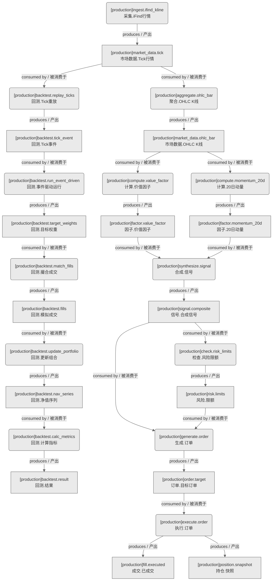
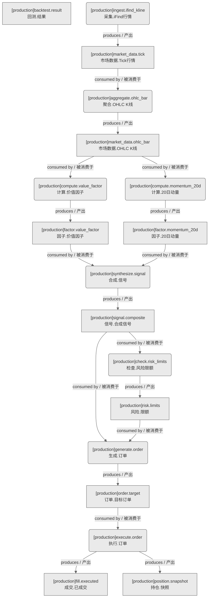
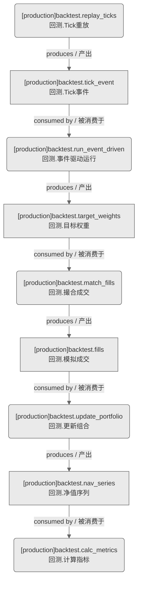

# 数据流图（dataflowgraph）索引

> 生成时间: 2026-07-30T23:51:35
> 真源: `dataflow_graph_registry.yaml`（13 个真实 Job/Dataset）→ PostgreSQL `dataflow_*` 表（ARCH-051）
> 注: `dataflow_jobs` 另含 `entity_type='module_placeholder'` 占位记录（`sync_panorama_module.py` 从 depgraph 模块派生，用于四图对齐 ARCH-056，非数据流作业，本文档不展示）
> 数据库: depgraph (PostgreSQL)
> 生成器: `scripts/governance/d5_architecture/generators/generate_dataflow_diagram.py`（全文自动生成，禁止手工编辑）

## 概述（自动生成 · 生成器: generate_dataflow_diagram.py）

数据流图（dataflowgraph）是与依赖图（depgraph）正交的第三维度全景图。
- depgraph 表达"谁依赖谁"（模块依赖）
- dataflowgraph 表达"数据从哪流到哪"（数据流向）
- 通过 `Job.source_code_ref` 引用 depgraph 模块 path，建立跨图关联

## 统计（自动生成 · 生成器: generate_dataflow_diagram.py）

| 类型 | 生产 (production) | 回测内部 (backtest_internal) | 合计 |
|------|-------------------|------------------------------|------|
| Dataset | 10 | 4 | 14 |
| Job | 8 | 5 | 13 |
| Edge | - | - | 28 |

### 设计态 / 运营态统计（design_maturity）

| 类型 | 运营态 (production) | 设计态 (design) | 合计 |
|------|---------------------|-----------------|------|
| Dataset | 14 | 0 | 14 |
| Job | 13 | 0 | 13 |

> **设计态 vs 运营态 / Design vs Production**：`design_maturity` 字段区分——`design`=蓝图规划（代码未写），`production`=实际代码已实现稳定运行。对标 depgraph 的设计态/运营态机制（decision_index.md）。

## Mermaid 图表（自动生成 · 生成器: generate_dataflow_diagram.py）

> 图表内嵌在本文档中，IDE 可直接渲染显示。视觉风格对齐 06_decision_architecture（灰色主题 + TD 竖向）。
>
> **图例说明 / Legend**：
>
> - **灰色矩形** = Dataset（数据集）
> - **灰色圆角矩形** = Job（作业）
> - 节点标签前缀 `[design]`/`[production]` 标注 design_maturity
> - `JOB -->|produces / 产出| DS` = Job 产出 Dataset
> - `DS -->|consumed by / 被消费于| JOB` = Job 消费 Dataset
> - 节点 label 仅含名称（2 行）；详细信息（CTR/域/蓝图/功能简述）见下方 Dataset/Job 清单表

### 全景图（设计态 + 运营态合并，标签标注 [design]/[production]）

> 节点数: 14 datasets / 数据集, 13 jobs / 作业, 28 edges / 边

### 运营态全景图（仅 design_maturity=production）

> 仅展示已实现稳定运行的节点（运营态：14 datasets / 数据集, 13 jobs / 作业, 28 edges / 边）。

### 生产数据流图（scope=production）

> 节点数: 10 datasets / 数据集, 8 jobs / 作业, 18 edges / 边

### 回测内部数据流图（scope=backtest_internal）

> 节点数: 4 datasets / 数据集, 5 jobs / 作业, 8 edges / 边

## Dataset 清单（自动生成 · 生成器: generate_dataflow_diagram.py）

| ID | entity_name / 实体名 | scope / 范围 | contract_ref / 契约引用 | domain / 域 | pit_policy / PIT策略 | module_id / 蓝图 | design_maturity / 设计成熟度 | build_status / 构建状态 | 功能简述 |
|----|----------------------|--------------|---------------------------|------------|------------------|------------------|---------------------------|--------------------|----------|
| DS-11127 | backtest.fills / 回测.模拟成交 | backtest_internal / 回测内部 | - | D_BACKTEST / 回测 | strict / 严格 | MOD-BT-001 | production / 生产 | generated / 已生成 | 回测模拟成交（symbol/quantity/price/commission/slippage），撮合引擎产出 |
| DS-11128 | backtest.nav_series / 回测.净值序列 | backtest_internal / 回测内部 | - | D_BACKTEST / 回测 | strict / 严格 | MOD-BT-001 | production / 生产 | generated / 已生成 | 回测净值序列（timestamp/nav/cash/positions），组合更新产出 |
| DS-11126 | backtest.target_weights / 回测.目标权重 | backtest_internal / 回测内部 | - | D_BACKTEST / 回测 | strict / 严格 | MOD-BT-001 | production / 生产 | generated / 已生成 | 回测目标权重（symbol/target_weight/timestamp），策略根据tick事件生成 |
| DS-11125 | backtest.tick_event / 回测.Tick事件 | backtest_internal / 回测内部 | - | D_BACKTEST / 回测 | strict / 严格 | MOD-BT-001 | production / 生产 | generated / 已生成 | 回测Tick事件（历史tick重放，含timestamp/symbol/price/volume），回测内部类型 |
| DS-11124 | backtest.result / 回测.结果 | production / 生产 | CTR-P1-016 | D_BACKTEST / 回测 | strict / 严格 | MOD-BT-001 | production / 生产 | generated / 已生成 | 回测结果（nav_series/sharpe/max_drawdown/trades），CTR-P1-016 BacktestResult |
| DS-11118 | factor.momentum_20d / 因子.20日动量 | production / 生产 | CTR-002 | D_FACTOR / 因子 | strict / 严格 | MOD-L02-001 | production / 生产 | generated / 已生成 | 20日动量因子信号（factor_id/symbol/as_of_date/raw_value/rank_pct），CTR-002 FactorSignal |
| DS-11117 | factor.value_factor / 因子.价值因子 | production / 生产 | CTR-002 | D_FACTOR / 因子 | strict / 严格 | MOD-L02-001 | production / 生产 | generated / 已生成 | 价值因子信号（factor_id/symbol/as_of_date/raw_value/normalized_value），CTR-002 FactorSignal |
| DS-11122 | fill.executed / 成交.已成交 | production / 生产 | CTR-005 | D_EX_CORE / 执行核心 | strict / 严格 | MOD-L06-001 | production / 生产 | generated / 已生成 | 成交回报（symbol/quantity/price/commission/timestamp），CTR-005 Fill |
| DS-11116 | market_data.ohlc_bar / 市场数据.OHLC K线 | production / 生产 | CTR-001 | D_MKT_DATA / 市场数据 | strict / 严格 | MOD-MKT_DATA | production / 生产 | generated / 已生成 | 聚合OHLC K线（1m/5m/日线，由tick聚合），CTR-001 derived |
| DS-11115 | market_data.tick / 市场数据.Tick行情 | production / 生产 | CTR-001 | D_MKT_DATA / 市场数据 | strict / 严格 | MOD-MKT_DATA | production / 生产 | generated / 已生成 | 标准化Tick行情（symbol/timestamp/OHLCV/quality_score），CTR-001 NormalizedMarketData |
| DS-11121 | order.target / 订单.目标订单 | production / 生产 | CTR-004 | D_PF_CORE / 持仓核心 | strict / 严格 | MOD-L05-001 | production / 生产 | generated / 已生成 | 目标订单（symbol/side/quantity/price/order_type），CTR-004 Order |
| DS-11123 | position.snapshot / 持仓.快照 | production / 生产 | CTR-006 | D_EX_CORE / 执行核心 | strict / 严格 | MOD-L06-001 | production / 生产 | generated / 已生成 | 持仓快照（symbol/quantity/avg_cost/market_value/timestamp），CTR-006 PositionSnapshot |
| DS-11120 | risk.limits / 风险.限额 | production / 生产 | CTR-003 | D_RISK / 风险 | strict / 严格 | MOD-L04-001 | production / 生产 | generated / 已生成 | 风险限额（max_position/max_drawdown/exposure_limits），CTR-003 RiskLimits |
| DS-11119 | signal.composite / 信号.合成信号 | production / 生产 | CTR-P1-015 | D_SIGLEGACY / 信号(legacy) | strict / 严格 | - | production / 生产 | generated / 已生成 | 合成交易信号（多因子加权/截面排名/置信度），CTR-P1-015 SynthesizedSignal |

## Job 清单（自动生成 · 生成器: generate_dataflow_diagram.py）

| ID | job_name / 作业名 | scope / 范围 | source_code_ref / 源码引用 | trigger_type / 触发类型 | run_context / 运行上下文 | module_id / 蓝图 | design_maturity / 设计成熟度 | build_status / 构建状态 | 功能简述 |
|----|-------------------|--------------|------------------------------|----------------------------|------------------------------|------------------|---------------------------|--------------------|----------|
| JOB-753037 | backtest.calc_metrics / 回测.计算指标 | backtest_internal / 回测内部 | src/zephyr/backtest/metrics.py | manual / 手动 | backtest_tick | MOD-BT-001 | production / 生产 | generated / 已生成 | 回测指标计算（Sharpe/MaxDrawdown/胜率等，含DSR修正+PIT校验），产出DS-010 backtest.result |
| JOB-753035 | backtest.match_fills / 回测.撮合成交 | backtest_internal / 回测内部 | src/zephyr/backtest/matching_logic.py | event_driven / 事件驱动 | backtest_tick | MOD-BT-001 | production / 生产 | generated / 已生成 | 回测撮合引擎（根据目标权重模拟成交，含滑点/手续费），产出DS-013 backtest.fills |
| JOB-753033 | backtest.replay_ticks / 回测.Tick重放 | backtest_internal / 回测内部 | src/zephyr/backtest/tick_replay.py | manual / 手动 | backtest_tick | MOD-BT-001 | production / 生产 | generated / 已生成 | 历史Tick重放（从DS-001读取历史tick，按时间顺序重放），产出DS-011 backtest.tick_event |
| JOB-753034 | backtest.run_event_driven / 回测.事件驱动运行 | backtest_internal / 回测内部 | src/zephyr/backtest/event_engine.py | event_driven / 事件驱动 | backtest_tick | MOD-BT-001 | production / 生产 | generated / 已生成 | 事件驱动回测引擎（消费tick事件，运行策略生成目标权重），产出DS-012 backtest.target_weights |
| JOB-753036 | backtest.update_portfolio / 回测.更新组合 | backtest_internal / 回测内部 | src/zephyr/backtest/portfolio.py | event_driven / 事件驱动 | backtest_tick | MOD-BT-001 | production / 生产 | generated / 已生成 | 回测组合更新（根据成交更新持仓/现金/净值），产出DS-014 backtest.nav_series |
| JOB-753026 | aggregate.ohlc_bar / 聚合.OHLC K线 | production / 生产 | src/zephyr/data/aggregator.py | event_driven / 事件驱动 | production / 生产 | MOD-MKT_DATA | production / 生产 | generated / 已生成 | 将Tick数据聚合为OHLC K线（1m/5m/日线），产出DS-002 market_data.ohlc_bar |
| JOB-753030 | check.risk_limits / 检查.风险限额 | production / 生产 | src/zephyr/risk/risk_checker.py | event_driven / 事件驱动 | production / 生产 | MOD-L04-001 | production / 生产 | generated / 已生成 | 风险限额检查（持仓/回撤/暴露度），产出DS-006 risk.limits |
| JOB-753028 | compute.momentum_20d / 计算.20日动量 | production / 生产 | src/zephyr/factor/momentum.py | event_driven / 事件驱动 | production / 生产 | MOD-L02-001 | production / 生产 | generated / 已生成 | 计算20日动量因子（收益率/相对强度），产出DS-004 factor.momentum_20d |
| JOB-753027 | compute.value_factor / 计算.价值因子 | production / 生产 | src/zephyr/factor/value_factor.py | event_driven / 事件驱动 | production / 生产 | MOD-L02-001 | production / 生产 | generated / 已生成 | 计算价值因子（PE/PB/股息率等），产出DS-003 factor.value_factor |
| JOB-753032 | execute.order / 执行.订单 | production / 生产 | src/zephyr/ex_core/executor.py | event_driven / 事件驱动 | production / 生产 | MOD-L06-001 | production / 生产 | generated / 已生成 | 执行订单（实盘/模拟），产出DS-008 fill.executed + DS-009 position.snapshot |
| JOB-753031 | generate.order / 生成.订单 | production / 生产 | src/zephyr/pf_core/order_generator.py | event_driven / 事件驱动 | production / 生产 | MOD-L05-001 | production / 生产 | generated / 已生成 | 根据信号+风险限额生成目标订单，产出DS-007 order.target |
| JOB-753025 | ingest.ifind_kline / 采集.iFind行情 | production / 生产 | src/zephyr/data/ingest_ifind.py | scheduled / 定时 | production / 生产 | MOD-MKT_DATA | production / 生产 | generated / 已生成 | 从同花顺iFind THS_RQ接口采集K线/Tick行情数据，写入DS-001 market_data.tick |
| JOB-753029 | synthesize.signal / 合成.信号 | production / 生产 | src/zephyr/signal_ashare/synthesizer.py | event_driven / 事件驱动 | production / 生产 | - | production / 生产 | generated / 已生成 | 合成多因子信号（加权/截面排名/置信度），产出DS-005 signal.composite |
