# 数据流图（dataflowgraph）索引

> 生成时间: 2026-07-06T16:37:31
> 真源: `dataflow_graph_registry.yaml` → PostgreSQL `dataflow_*` 表（ARCH-051）
> 数据库: depgraph (PostgreSQL)

## 概述

数据流图（dataflowgraph）是与依赖图（depgraph）正交的第三维度全景图。
- depgraph 表达"谁依赖谁"（模块依赖）
- dataflowgraph 表达"数据从哪流到哪"（数据流向）
- 通过 `Job.source_code_ref` 引用 depgraph 模块 path，建立跨图关联

## 统计

| 类型 | 生产 (production) | 回测内部 (backtest_internal) | 合计 |
|------|-------------------|------------------------------|------|
| Dataset | 10 | 4 | 14 |
| Job | 8 | 5 | 13 |
| Edge | - | - | 28 |

### 设计态 / 运营态统计（design_maturity）

| 类型 | 运营态 (production) | 设计态 (design) | 原型态 (prototype) | 合计 |
|------|---------------------|-----------------|---------------------|------|
| Dataset | 14 | 0 | 0 | 14 |
| Job | 13 | 0 | 0 | 13 |

> **设计态 vs 运营态 / Design vs Production**：`design_maturity` 字段区分——`design`=蓝图规划（代码未写），`production`=实际代码已实现稳定运行，`prototype`=原型验证中。对标 depgraph 的设计态/运营态机制（decision_index.md）。

## Mermaid 图表

> 图表内嵌在本文档中，IDE 可直接渲染显示。
>
> **图例说明 / Legend**：
>
> **设计态/原型态优先着色（design_maturity）**：
> - **紫色** = 设计态节点（design_maturity=design，蓝图规划，代码未写）
> - **黄色** = 原型态节点（design_maturity=prototype，原型验证中）
>
> **运营态按 scope 着色（design_maturity=production）**：
> - **蓝色矩形** = 生产 Dataset（dsProd）
> - **橙色矩形** = 回测 Dataset（dsBacktest）
> - **绿色圆角矩形** = 生产 Job（jobProd）
> - **粉色圆角矩形** = 回测 Job（jobBacktest）
>
> - `JOB -->|produces / 产出| DS` = Job 产出 Dataset
> - `DS -->|consumed by / 被消费于| JOB` = Job 消费 Dataset
> - 节点标签前缀 `[design]`/`[production]`/`[prototype]` 标注 design_maturity

### 全景图（设计态 + 运营态合并，标签标注 [design]/[production]/[prototype]）

> 节点数: 14 datasets / 数据集, 13 jobs / 作业, 28 edges / 边

### 运营态全景图（仅 design_maturity=production）

> 仅展示已实现稳定运行的节点（运营态：14 datasets / 数据集, 13 jobs / 作业, 28 edges / 边）。

```mermaid
flowchart LR
    DS364["[production]backtest.fills<br/>回测.模拟成交<br/>[D_BACKTEST / 回测]"]:::dsBacktest
    DS365["[production]backtest.nav_series<br/>回测.净值序列<br/>[D_BACKTEST / 回测]"]:::dsBacktest
    DS363["[production]backtest.target_weights<br/>回测.目标权重<br/>[D_BACKTEST / 回测]"]:::dsBacktest
    DS362["[production]backtest.tick_event<br/>回测.Tick事件<br/>[D_BACKTEST / 回测]"]:::dsBacktest
    DS361["[production]backtest.result<br/>回测.结果<br/>CTR: CTR-P1-016<br/>[D_BACKTEST / 回测]"]:::dsProd
    DS355["[production]factor.momentum_20d<br/>因子.20日动量<br/>CTR: CTR-002<br/>[D_FACTOR / 因子]"]:::dsProd
    DS354["[production]factor.value_factor<br/>因子.价值因子<br/>CTR: CTR-002<br/>[D_FACTOR / 因子]"]:::dsProd
    DS359["[production]fill.executed<br/>成交.已成交<br/>CTR: CTR-005<br/>[D_EX_CORE / 执行核心]"]:::dsProd
    DS353["[production]market_data.ohlc_bar<br/>市场数据.OHLC K线<br/>CTR: CTR-001<br/>[D_MKT_DATA / 市场数据]"]:::dsProd
    DS352["[production]market_data.tick<br/>市场数据.Tick行情<br/>CTR: CTR-001<br/>[D_MKT_DATA / 市场数据]"]:::dsProd
    DS358["[production]order.target<br/>订单.目标订单<br/>CTR: CTR-004<br/>[D_PF_CORE / 持仓核心]"]:::dsProd
    DS360["[production]position.snapshot<br/>持仓.快照<br/>CTR: CTR-006<br/>[D_EX_CORE / 执行核心]"]:::dsProd
    DS357["[production]risk.limits<br/>风险.限额<br/>CTR: CTR-003<br/>[D_RISK / 风险]"]:::dsProd
    DS356["[production]signal.composite<br/>信号.合成信号<br/>CTR: CTR-P1-015<br/>[D_SIGLEGACY / 信号(legacy)]"]:::dsProd
    JOB341("[production]backtest.calc_metrics<br/>回测.计算指标<br/>trigger: manual / 手动"):::jobBacktest
    JOB339("[production]backtest.match_fills<br/>回测.撮合成交<br/>trigger: event_driven / 事件驱动"):::jobBacktest
    JOB337("[production]backtest.replay_ticks<br/>回测.Tick重放<br/>trigger: manual / 手动"):::jobBacktest
    JOB338("[production]backtest.run_event_driven<br/>回测.事件驱动运行<br/>trigger: event_driven / 事件驱动"):::jobBacktest
    JOB340("[production]backtest.update_portfolio<br/>回测.更新组合<br/>trigger: event_driven / 事件驱动"):::jobBacktest
    JOB330("[production]aggregate.ohlc_bar<br/>聚合.OHLC K线<br/>trigger: event_driven / 事件驱动"):::jobProd
    JOB334("[production]check.risk_limits<br/>检查.风险限额<br/>trigger: event_driven / 事件驱动"):::jobProd
    JOB332("[production]compute.momentum_20d<br/>计算.20日动量<br/>trigger: event_driven / 事件驱动"):::jobProd
    JOB331("[production]compute.value_factor<br/>计算.价值因子<br/>trigger: event_driven / 事件驱动"):::jobProd
    JOB336("[production]execute.order<br/>执行.订单<br/>trigger: event_driven / 事件驱动"):::jobProd
    JOB335("[production]generate.order<br/>生成.订单<br/>trigger: event_driven / 事件驱动"):::jobProd
    JOB329("[production]ingest.ifind_kline<br/>采集.iFind行情<br/>trigger: scheduled / 定时"):::jobProd
    JOB333("[production]synthesize.signal<br/>合成.信号<br/>trigger: event_driven / 事件驱动"):::jobProd
    JOB329 -->|produces / 产出| DS352
    JOB330 -->|produces / 产出| DS353
    JOB331 -->|produces / 产出| DS354
    JOB332 -->|produces / 产出| DS355
    JOB333 -->|produces / 产出| DS356
    JOB334 -->|produces / 产出| DS357
    JOB335 -->|produces / 产出| DS358
    JOB336 -->|produces / 产出| DS359
    JOB336 -->|produces / 产出| DS360
    JOB341 -->|produces / 产出| DS361
    JOB337 -->|produces / 产出| DS362
    JOB338 -->|produces / 产出| DS363
    JOB339 -->|produces / 产出| DS364
    JOB340 -->|produces / 产出| DS365
    DS352 -->|consumed by / 被消费于| JOB330
    DS352 -->|consumed by / 被消费于| JOB337
    DS353 -->|consumed by / 被消费于| JOB331
    DS353 -->|consumed by / 被消费于| JOB332
    DS354 -->|consumed by / 被消费于| JOB333
    DS355 -->|consumed by / 被消费于| JOB333
    DS356 -->|consumed by / 被消费于| JOB334
    DS356 -->|consumed by / 被消费于| JOB335
    DS357 -->|consumed by / 被消费于| JOB335
    DS358 -->|consumed by / 被消费于| JOB336
    DS362 -->|consumed by / 被消费于| JOB338
    DS363 -->|consumed by / 被消费于| JOB339
    DS364 -->|consumed by / 被消费于| JOB340
    DS365 -->|consumed by / 被消费于| JOB341

    classDef dsProd fill:#bbdefb,stroke:#1565c0,stroke-width:2px,color:#0d47a1
    classDef dsBacktest fill:#ffe0b2,stroke:#ef6c00,stroke-width:2px,color:#e65100
    classDef jobProd fill:#c8e6c9,stroke:#2e7d32,stroke-width:2px,color:#1b5e20
    classDef jobBacktest fill:#ffcdd2,stroke:#c62828,stroke-width:2px,color:#b71c1c
    classDef dsDesign fill:#e1bee7,stroke:#7b1fa2,stroke-width:2px,color:#4a148c
    classDef jobDesign fill:#e1bee7,stroke:#7b1fa2,stroke-width:2px,color:#4a148c
    classDef dsProto fill:#fff9c4,stroke:#f9a825,stroke-width:2px,color:#f57f17
    classDef jobProto fill:#fff9c4,stroke:#f9a825,stroke-width:2px,color:#f57f17
```

### 生产数据流图（scope=production）

> 节点数: 10 datasets / 数据集, 8 jobs / 作业, 18 edges / 边

```mermaid
flowchart LR
    DS361["[production]backtest.result<br/>回测.结果<br/>CTR: CTR-P1-016<br/>[D_BACKTEST / 回测]"]:::dsProd
    DS355["[production]factor.momentum_20d<br/>因子.20日动量<br/>CTR: CTR-002<br/>[D_FACTOR / 因子]"]:::dsProd
    DS354["[production]factor.value_factor<br/>因子.价值因子<br/>CTR: CTR-002<br/>[D_FACTOR / 因子]"]:::dsProd
    DS359["[production]fill.executed<br/>成交.已成交<br/>CTR: CTR-005<br/>[D_EX_CORE / 执行核心]"]:::dsProd
    DS353["[production]market_data.ohlc_bar<br/>市场数据.OHLC K线<br/>CTR: CTR-001<br/>[D_MKT_DATA / 市场数据]"]:::dsProd
    DS352["[production]market_data.tick<br/>市场数据.Tick行情<br/>CTR: CTR-001<br/>[D_MKT_DATA / 市场数据]"]:::dsProd
    DS358["[production]order.target<br/>订单.目标订单<br/>CTR: CTR-004<br/>[D_PF_CORE / 持仓核心]"]:::dsProd
    DS360["[production]position.snapshot<br/>持仓.快照<br/>CTR: CTR-006<br/>[D_EX_CORE / 执行核心]"]:::dsProd
    DS357["[production]risk.limits<br/>风险.限额<br/>CTR: CTR-003<br/>[D_RISK / 风险]"]:::dsProd
    DS356["[production]signal.composite<br/>信号.合成信号<br/>CTR: CTR-P1-015<br/>[D_SIGLEGACY / 信号(legacy)]"]:::dsProd
    JOB330("[production]aggregate.ohlc_bar<br/>聚合.OHLC K线<br/>trigger: event_driven / 事件驱动"):::jobProd
    JOB334("[production]check.risk_limits<br/>检查.风险限额<br/>trigger: event_driven / 事件驱动"):::jobProd
    JOB332("[production]compute.momentum_20d<br/>计算.20日动量<br/>trigger: event_driven / 事件驱动"):::jobProd
    JOB331("[production]compute.value_factor<br/>计算.价值因子<br/>trigger: event_driven / 事件驱动"):::jobProd
    JOB336("[production]execute.order<br/>执行.订单<br/>trigger: event_driven / 事件驱动"):::jobProd
    JOB335("[production]generate.order<br/>生成.订单<br/>trigger: event_driven / 事件驱动"):::jobProd
    JOB329("[production]ingest.ifind_kline<br/>采集.iFind行情<br/>trigger: scheduled / 定时"):::jobProd
    JOB333("[production]synthesize.signal<br/>合成.信号<br/>trigger: event_driven / 事件驱动"):::jobProd
    JOB329 -->|produces / 产出| DS352
    JOB330 -->|produces / 产出| DS353
    JOB331 -->|produces / 产出| DS354
    JOB332 -->|produces / 产出| DS355
    JOB333 -->|produces / 产出| DS356
    JOB334 -->|produces / 产出| DS357
    JOB335 -->|produces / 产出| DS358
    JOB336 -->|produces / 产出| DS359
    JOB336 -->|produces / 产出| DS360
    DS352 -->|consumed by / 被消费于| JOB330
    DS353 -->|consumed by / 被消费于| JOB331
    DS353 -->|consumed by / 被消费于| JOB332
    DS354 -->|consumed by / 被消费于| JOB333
    DS355 -->|consumed by / 被消费于| JOB333
    DS356 -->|consumed by / 被消费于| JOB334
    DS356 -->|consumed by / 被消费于| JOB335
    DS357 -->|consumed by / 被消费于| JOB335
    DS358 -->|consumed by / 被消费于| JOB336

    classDef dsProd fill:#bbdefb,stroke:#1565c0,stroke-width:2px,color:#0d47a1
    classDef dsBacktest fill:#ffe0b2,stroke:#ef6c00,stroke-width:2px,color:#e65100
    classDef jobProd fill:#c8e6c9,stroke:#2e7d32,stroke-width:2px,color:#1b5e20
    classDef jobBacktest fill:#ffcdd2,stroke:#c62828,stroke-width:2px,color:#b71c1c
    classDef dsDesign fill:#e1bee7,stroke:#7b1fa2,stroke-width:2px,color:#4a148c
    classDef jobDesign fill:#e1bee7,stroke:#7b1fa2,stroke-width:2px,color:#4a148c
    classDef dsProto fill:#fff9c4,stroke:#f9a825,stroke-width:2px,color:#f57f17
    classDef jobProto fill:#fff9c4,stroke:#f9a825,stroke-width:2px,color:#f57f17
```

### 回测内部数据流图（scope=backtest_internal）

> 节点数: 4 datasets / 数据集, 5 jobs / 作业, 8 edges / 边

```mermaid
flowchart LR
    DS364["[production]backtest.fills<br/>回测.模拟成交<br/>[D_BACKTEST / 回测]"]:::dsBacktest
    DS365["[production]backtest.nav_series<br/>回测.净值序列<br/>[D_BACKTEST / 回测]"]:::dsBacktest
    DS363["[production]backtest.target_weights<br/>回测.目标权重<br/>[D_BACKTEST / 回测]"]:::dsBacktest
    DS362["[production]backtest.tick_event<br/>回测.Tick事件<br/>[D_BACKTEST / 回测]"]:::dsBacktest
    JOB341("[production]backtest.calc_metrics<br/>回测.计算指标<br/>trigger: manual / 手动"):::jobBacktest
    JOB339("[production]backtest.match_fills<br/>回测.撮合成交<br/>trigger: event_driven / 事件驱动"):::jobBacktest
    JOB337("[production]backtest.replay_ticks<br/>回测.Tick重放<br/>trigger: manual / 手动"):::jobBacktest
    JOB338("[production]backtest.run_event_driven<br/>回测.事件驱动运行<br/>trigger: event_driven / 事件驱动"):::jobBacktest
    JOB340("[production]backtest.update_portfolio<br/>回测.更新组合<br/>trigger: event_driven / 事件驱动"):::jobBacktest
    JOB337 -->|produces / 产出| DS362
    JOB338 -->|produces / 产出| DS363
    JOB339 -->|produces / 产出| DS364
    JOB340 -->|produces / 产出| DS365
    DS362 -->|consumed by / 被消费于| JOB338
    DS363 -->|consumed by / 被消费于| JOB339
    DS364 -->|consumed by / 被消费于| JOB340
    DS365 -->|consumed by / 被消费于| JOB341

    classDef dsProd fill:#bbdefb,stroke:#1565c0,stroke-width:2px,color:#0d47a1
    classDef dsBacktest fill:#ffe0b2,stroke:#ef6c00,stroke-width:2px,color:#e65100
    classDef jobProd fill:#c8e6c9,stroke:#2e7d32,stroke-width:2px,color:#1b5e20
    classDef jobBacktest fill:#ffcdd2,stroke:#c62828,stroke-width:2px,color:#b71c1c
    classDef dsDesign fill:#e1bee7,stroke:#7b1fa2,stroke-width:2px,color:#4a148c
    classDef jobDesign fill:#e1bee7,stroke:#7b1fa2,stroke-width:2px,color:#4a148c
    classDef dsProto fill:#fff9c4,stroke:#f9a825,stroke-width:2px,color:#f57f17
    classDef jobProto fill:#fff9c4,stroke:#f9a825,stroke-width:2px,color:#f57f17
```

## Dataset 清单

| ID | entity_name / 实体名 | scope / 范围 | contract_ref / 契约引用 | domain / 域 | pit_policy / PIT策略 | module_id / 蓝图 | design_maturity / 设计成熟度 | build_status / 构建状态 |
|----|----------------------|--------------|---------------------------|------------|------------------|------------------|---------------------------|--------------------|
| DS-364 | backtest.fills / 回测.模拟成交 | backtest_internal / 回测内部 | - | D_BACKTEST / 回测 | strict / 严格 | - | production / 生产 | generated / 已生成 |
| DS-365 | backtest.nav_series / 回测.净值序列 | backtest_internal / 回测内部 | - | D_BACKTEST / 回测 | strict / 严格 | - | production / 生产 | generated / 已生成 |
| DS-363 | backtest.target_weights / 回测.目标权重 | backtest_internal / 回测内部 | - | D_BACKTEST / 回测 | strict / 严格 | - | production / 生产 | generated / 已生成 |
| DS-362 | backtest.tick_event / 回测.Tick事件 | backtest_internal / 回测内部 | - | D_BACKTEST / 回测 | strict / 严格 | - | production / 生产 | generated / 已生成 |
| DS-361 | backtest.result / 回测.结果 | production / 生产 | CTR-P1-016 | D_BACKTEST / 回测 | strict / 严格 | - | production / 生产 | generated / 已生成 |
| DS-355 | factor.momentum_20d / 因子.20日动量 | production / 生产 | CTR-002 | D_FACTOR / 因子 | strict / 严格 | - | production / 生产 | generated / 已生成 |
| DS-354 | factor.value_factor / 因子.价值因子 | production / 生产 | CTR-002 | D_FACTOR / 因子 | strict / 严格 | - | production / 生产 | generated / 已生成 |
| DS-359 | fill.executed / 成交.已成交 | production / 生产 | CTR-005 | D_EX_CORE / 执行核心 | strict / 严格 | - | production / 生产 | generated / 已生成 |
| DS-353 | market_data.ohlc_bar / 市场数据.OHLC K线 | production / 生产 | CTR-001 | D_MKT_DATA / 市场数据 | strict / 严格 | - | production / 生产 | generated / 已生成 |
| DS-352 | market_data.tick / 市场数据.Tick行情 | production / 生产 | CTR-001 | D_MKT_DATA / 市场数据 | strict / 严格 | - | production / 生产 | generated / 已生成 |
| DS-358 | order.target / 订单.目标订单 | production / 生产 | CTR-004 | D_PF_CORE / 持仓核心 | strict / 严格 | - | production / 生产 | generated / 已生成 |
| DS-360 | position.snapshot / 持仓.快照 | production / 生产 | CTR-006 | D_EX_CORE / 执行核心 | strict / 严格 | - | production / 生产 | generated / 已生成 |
| DS-357 | risk.limits / 风险.限额 | production / 生产 | CTR-003 | D_RISK / 风险 | strict / 严格 | - | production / 生产 | generated / 已生成 |
| DS-356 | signal.composite / 信号.合成信号 | production / 生产 | CTR-P1-015 | D_SIGLEGACY / 信号(legacy) | strict / 严格 | - | production / 生产 | generated / 已生成 |

## Job 清单

| ID | job_name / 作业名 | scope / 范围 | source_code_ref / 源码引用 | trigger_type / 触发类型 | run_context / 运行上下文 | module_id / 蓝图 | design_maturity / 设计成熟度 | build_status / 构建状态 |
|----|-------------------|--------------|------------------------------|----------------------------|------------------------------|------------------|---------------------------|--------------------|
| JOB-341 | backtest.calc_metrics / 回测.计算指标 | backtest_internal / 回测内部 | src/zephyr/backtest/metrics.py | manual / 手动 | backtest_tick | - | production / 生产 | generated / 已生成 |
| JOB-339 | backtest.match_fills / 回测.撮合成交 | backtest_internal / 回测内部 | src/zephyr/backtest/matching_logic.py | event_driven / 事件驱动 | backtest_tick | - | production / 生产 | generated / 已生成 |
| JOB-337 | backtest.replay_ticks / 回测.Tick重放 | backtest_internal / 回测内部 | src/zephyr/backtest/tick_replay.py | manual / 手动 | backtest_tick | - | production / 生产 | generated / 已生成 |
| JOB-338 | backtest.run_event_driven / 回测.事件驱动运行 | backtest_internal / 回测内部 | src/zephyr/backtest/event_engine.py | event_driven / 事件驱动 | backtest_tick | - | production / 生产 | generated / 已生成 |
| JOB-340 | backtest.update_portfolio / 回测.更新组合 | backtest_internal / 回测内部 | src/zephyr/backtest/portfolio.py | event_driven / 事件驱动 | backtest_tick | - | production / 生产 | generated / 已生成 |
| JOB-330 | aggregate.ohlc_bar / 聚合.OHLC K线 | production / 生产 | src/zephyr/data/aggregator.py | event_driven / 事件驱动 | production / 生产 | - | production / 生产 | generated / 已生成 |
| JOB-334 | check.risk_limits / 检查.风险限额 | production / 生产 | src/zephyr/risk/risk_checker.py | event_driven / 事件驱动 | production / 生产 | - | production / 生产 | generated / 已生成 |
| JOB-332 | compute.momentum_20d / 计算.20日动量 | production / 生产 | src/zephyr/factor/momentum.py | event_driven / 事件驱动 | production / 生产 | - | production / 生产 | generated / 已生成 |
| JOB-331 | compute.value_factor / 计算.价值因子 | production / 生产 | src/zephyr/factor/value_factor.py | event_driven / 事件驱动 | production / 生产 | - | production / 生产 | generated / 已生成 |
| JOB-336 | execute.order / 执行.订单 | production / 生产 | src/zephyr/ex_core/executor.py | event_driven / 事件驱动 | production / 生产 | - | production / 生产 | generated / 已生成 |
| JOB-335 | generate.order / 生成.订单 | production / 生产 | src/zephyr/pf_core/order_generator.py | event_driven / 事件驱动 | production / 生产 | - | production / 生产 | generated / 已生成 |
| JOB-329 | ingest.ifind_kline / 采集.iFind行情 | production / 生产 | src/zephyr/data/ingest_ifind.py | scheduled / 定时 | production / 生产 | - | production / 生产 | generated / 已生成 |
| JOB-333 | synthesize.signal / 合成.信号 | production / 生产 | src/zephyr/signal_ashare/synthesizer.py | event_driven / 事件驱动 | production / 生产 | - | production / 生产 | generated / 已生成 |
