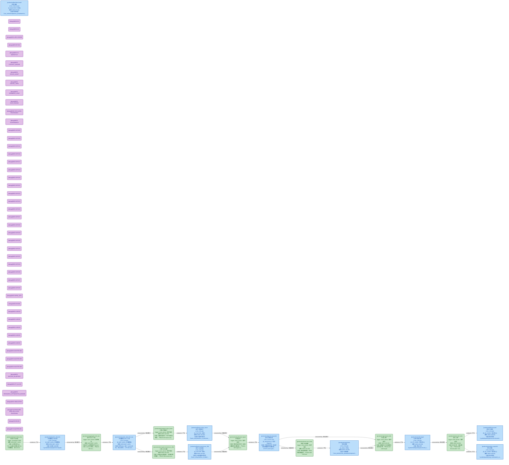

# 数据流图（dataflowgraph）索引

> 生成时间: 2026-07-13T05:29:58
> 真源: `dataflow_graph_registry.yaml` → PostgreSQL `dataflow_*` 表（ARCH-051）
> 数据库: depgraph (PostgreSQL)

## 概述

数据流图（dataflowgraph）是与依赖图（depgraph）正交的第三维度全景图。
- depgraph 表达"谁依赖谁"（模块依赖）
- dataflowgraph 表达"数据从哪流到哪"（数据流向）
- 通过 `Job.source_code_ref` 引用 depgraph 模块 path，建立跨图关联

## 统计

| 类型 | 生产 (production) | 回测内部 (backtest_internal) | 合计 |
|------|-------------------|------------------------------|------|
| Dataset | 10 | 4 | 14 |
| Job | 58 | 5 | 63 |
| Edge | - | - | 28 |

### 设计态 / 运营态统计（design_maturity）

| 类型 | 运营态 (production) | 设计态 (design) | 原型态 (prototype) | 合计 |
|------|---------------------|-----------------|---------------------|------|
| Dataset | 14 | 0 | 0 | 14 |
| Job | 13 | 50 | 0 | 63 |

> **设计态 vs 运营态 / Design vs Production**：`design_maturity` 字段区分——`design`=蓝图规划（代码未写），`production`=实际代码已实现稳定运行，`prototype`=原型验证中。对标 depgraph 的设计态/运营态机制（decision_index.md）。

## Mermaid 图表

> 图表内嵌在本文档中，IDE 可直接渲染显示。
>
> **图例说明 / Legend**：
>
> **设计态/原型态优先着色（design_maturity）**：
> - **紫色** = 设计态节点（design_maturity=design，蓝图规划，代码未写）
> - **黄色** = 原型态节点（design_maturity=prototype，原型验证中）
>
> **运营态按 scope 着色（design_maturity=production）**：
> - **蓝色矩形** = 生产 Dataset（dsProd）
> - **橙色矩形** = 回测 Dataset（dsBacktest）
> - **绿色圆角矩形** = 生产 Job（jobProd）
> - **粉色圆角矩形** = 回测 Job（jobBacktest）
>
> - `JOB -->|produces / 产出| DS` = Job 产出 Dataset
> - `DS -->|consumed by / 被消费于| JOB` = Job 消费 Dataset
> - 节点标签前缀 `[design]`/`[production]`/`[prototype]` 标注 design_maturity

### 全景图（设计态 + 运营态合并，标签标注 [design]/[production]/[prototype]）

> 节点数: 14 datasets / 数据集, 63 jobs / 作业, 28 edges / 边

```mermaid
flowchart LR
    DS1504["[production]backtest.fills<br/>回测.模拟成交<br/>[D_BACKTEST / 回测]<br/>蓝图: MOD-BT-001<br/>功能: 回测模拟成交（symbol/quantity/price/commission…"]:::dsBacktest
    DS1505["[production]backtest.nav_series<br/>回测.净值序列<br/>[D_BACKTEST / 回测]<br/>蓝图: MOD-BT-001<br/>功能: 回测净值序列（timestamp/nav/cash/positions），组合…"]:::dsBacktest
    DS1503["[production]backtest.target_weights<br/>回测.目标权重<br/>[D_BACKTEST / 回测]<br/>蓝图: MOD-BT-001<br/>功能: 回测目标权重（symbol/target_weight/timestamp），…"]:::dsBacktest
    DS1502["[production]backtest.tick_event<br/>回测.Tick事件<br/>[D_BACKTEST / 回测]<br/>蓝图: MOD-BT-001<br/>功能: 回测Tick事件（历史tick重放，含timestamp/symbol/pri…"]:::dsBacktest
    DS1501["[production]backtest.result<br/>回测.结果<br/>CTR: CTR-P1-016<br/>[D_BACKTEST / 回测]<br/>蓝图: MOD-BT-001<br/>功能: 回测结果（nav_series/sharpe/max_drawdown/tra…"]:::dsProd
    DS1495["[production]factor.momentum_20d<br/>因子.20日动量<br/>CTR: CTR-002<br/>[D_FACTOR / 因子]<br/>蓝图: MOD-L02-001<br/>功能: 20日动量因子信号（factor_id/symbol/as_of_date/r…"]:::dsProd
    DS1494["[production]factor.value_factor<br/>因子.价值因子<br/>CTR: CTR-002<br/>[D_FACTOR / 因子]<br/>蓝图: MOD-L02-001<br/>功能: 价值因子信号（factor_id/symbol/as_of_date/raw_…"]:::dsProd
    DS1499["[production]fill.executed<br/>成交.已成交<br/>CTR: CTR-005<br/>[D_EX_CORE / 执行核心]<br/>蓝图: MOD-L06-001<br/>功能: 成交回报（symbol/quantity/price/commission/t…"]:::dsProd
    DS1493["[production]market_data.ohlc_bar<br/>市场数据.OHLC K线<br/>CTR: CTR-001<br/>[D_MKT_DATA / 市场数据]<br/>蓝图: MOD-MKT_DATA<br/>功能: 聚合OHLC K线（1m/5m/日线，由tick聚合），CTR-001 der…"]:::dsProd
    DS1492["[production]market_data.tick<br/>市场数据.Tick行情<br/>CTR: CTR-001<br/>[D_MKT_DATA / 市场数据]<br/>蓝图: MOD-MKT_DATA<br/>功能: 标准化Tick行情（symbol/timestamp/OHLCV/qualit…"]:::dsProd
    DS1498["[production]order.target<br/>订单.目标订单<br/>CTR: CTR-004<br/>[D_PF_CORE / 持仓核心]<br/>蓝图: MOD-L05-001<br/>功能: 目标订单（symbol/side/quantity/price/order_t…"]:::dsProd
    DS1500["[production]position.snapshot<br/>持仓.快照<br/>CTR: CTR-006<br/>[D_EX_CORE / 执行核心]<br/>蓝图: MOD-L06-001<br/>功能: 持仓快照（symbol/quantity/avg_cost/market_va…"]:::dsProd
    DS1497["[production]risk.limits<br/>风险.限额<br/>CTR: CTR-003<br/>[D_RISK / 风险]<br/>蓝图: MOD-L04-001<br/>功能: 风险限额（max_position/max_drawdown/exposure…"]:::dsProd
    DS1496["[production]signal.composite<br/>信号.合成信号<br/>CTR: CTR-P1-015<br/>[D_SIGLEGACY / 信号(legacy)]<br/>功能: 合成交易信号（多因子加权/截面排名/置信度），CTR-P1-015 Synth…"]:::dsProd
    JOB21297("[production]backtest.calc_metrics<br/>回测.计算指标<br/>trigger: manual / 手动<br/>蓝图: MOD-BT-001<br/>功能: 回测指标计算（Sharpe/MaxDrawdown/胜率等，含DSR修正+PI…"):::jobBacktest
    JOB21295("[production]backtest.match_fills<br/>回测.撮合成交<br/>trigger: event_driven / 事件驱动<br/>蓝图: MOD-BT-001<br/>功能: 回测撮合引擎（根据目标权重模拟成交，含滑点/手续费），产出DS-013 bac…"):::jobBacktest
    JOB21293("[production]backtest.replay_ticks<br/>回测.Tick重放<br/>trigger: manual / 手动<br/>蓝图: MOD-BT-001<br/>功能: 历史Tick重放（从DS-001读取历史tick，按时间顺序重放），产出DS-…"):::jobBacktest
    JOB21294("[production]backtest.run_event_driven<br/>回测.事件驱动运行<br/>trigger: event_driven / 事件驱动<br/>蓝图: MOD-BT-001<br/>功能: 事件驱动回测引擎（消费tick事件，运行策略生成目标权重），产出DS-012 …"):::jobBacktest
    JOB21296("[production]backtest.update_portfolio<br/>回测.更新组合<br/>trigger: event_driven / 事件驱动<br/>蓝图: MOD-BT-001<br/>功能: 回测组合更新（根据成交更新持仓/现金/净值），产出DS-014 backtes…"):::jobBacktest
    JOB7237("[design]MOD-013"):::jobDesign
    JOB7238("[design]MOD-015"):::jobDesign
    JOB7241("[design]MOD-ARCH-BIZDB"):::jobDesign
    JOB1031("[design]MOD-BT-001"):::jobDesign
    JOB7242("[design]MOD-C1-MARKETCH"):::jobDesign
    JOB4416("[design]MOD-CONTEXT_ENGINE"):::jobDesign
    JOB1033("[design]MOD-CROSS_ASSET"):::jobDesign
    JOB1036("[design]MOD-DIGITAL_TWIN"):::jobDesign
    JOB1037("[design]MOD-FEEDBACK_LOOP"):::jobDesign
    JOB1038("[design]MOD-GATE_ENGINE"):::jobDesign
    JOB1040("[design]MOD-GOV-ALIGN-PANORAMAS"):::jobDesign
    JOB1085("[design]MOD-GOVERNANCE"):::jobDesign
    JOB1091("[design]MOD-INF-005"):::jobDesign
    JOB1092("[design]MOD-INF-009"):::jobDesign
    JOB1093("[design]MOD-INF-011"):::jobDesign
    JOB1096("[design]MOD-INF-016"):::jobDesign
    JOB1097("[design]MOD-INF-017"):::jobDesign
    JOB4481("[design]MOD-INF-019"):::jobDesign
    JOB4482("[design]MOD-INF-020"):::jobDesign
    JOB1101("[design]MOD-INF-021"):::jobDesign
    JOB4484("[design]MOD-INF-022"):::jobDesign
    JOB1103("[design]MOD-INF-023"):::jobDesign
    JOB1104("[design]MOD-INF-024"):::jobDesign
    JOB1107("[design]MOD-INF-027"):::jobDesign
    JOB1108("[design]MOD-INF-028"):::jobDesign
    JOB1109("[design]MOD-INF-029"):::jobDesign
    JOB1110("[design]MOD-INF-030"):::jobDesign
    JOB1111("[design]MOD-INF-031"):::jobDesign
    JOB1112("[design]MOD-INF-033"):::jobDesign
    JOB1113("[design]MOD-INF-034"):::jobDesign
    JOB1115("[design]MOD-INF-036"):::jobDesign
    JOB1116("[design]MOD-INF-037"):::jobDesign
    JOB2247("[design]MOD-INF-039"):::jobDesign
    JOB1121("[design]MOD-INFRA_OPS"):::jobDesign
    JOB1124("[design]MOD-KB-001"):::jobDesign
    JOB1125("[design]MOD-L00-001"):::jobDesign
    JOB7239("[design]MOD-L00-002"):::jobDesign
    JOB7240("[design]MOD-L00-003"):::jobDesign
    JOB4513("[design]MOD-L06-001"):::jobDesign
    JOB1133("[design]MOD-L08-001"):::jobDesign
    JOB7234("[design]MOD-MASTER-001"):::jobDesign
    JOB7235("[design]MOD-MASTER-002"):::jobDesign
    JOB7236("[design]MOD-MASTER-003"):::jobDesign
    JOB1139("[design]MOD-MASTER_BLUEPRINT"):::jobDesign
    JOB1141("[design]MOD-PF_ALLOC"):::jobDesign
    JOB1142("[design]MOD-RESOURCE_OPTIMIZATION_ENGINE"):::jobDesign
    JOB1151("[design]MOD-SIMULATION"):::jobDesign
    JOB1156("[design]PLACEHOLDER-MOD-GOV-SYNC-PANORAMA"):::jobDesign
    JOB1157("[design]SH-DB-001"):::jobDesign
    JOB7224("[design]SYS-MASTER-001"):::jobDesign
    JOB21286("[production]aggregate.ohlc_bar<br/>聚合.OHLC K线<br/>trigger: event_driven / 事件驱动<br/>蓝图: MOD-MKT_DATA<br/>功能: 将Tick数据聚合为OHLC K线（1m/5m/日线），产出DS-002 ma…"):::jobProd
    JOB21290("[production]check.risk_limits<br/>检查.风险限额<br/>trigger: event_driven / 事件驱动<br/>蓝图: MOD-L04-001<br/>功能: 风险限额检查（持仓/回撤/暴露度），产出DS-006 risk.limits"):::jobProd
    JOB21288("[production]compute.momentum_20d<br/>计算.20日动量<br/>trigger: event_driven / 事件驱动<br/>蓝图: MOD-L02-001<br/>功能: 计算20日动量因子（收益率/相对强度），产出DS-004 factor.mom…"):::jobProd
    JOB21287("[production]compute.value_factor<br/>计算.价值因子<br/>trigger: event_driven / 事件驱动<br/>蓝图: MOD-L02-001<br/>功能: 计算价值因子（PE/PB/股息率等），产出DS-003 factor.valu…"):::jobProd
    JOB21292("[production]execute.order<br/>执行.订单<br/>trigger: event_driven / 事件驱动<br/>蓝图: MOD-L06-001<br/>功能: 执行订单（实盘/模拟），产出DS-008 fill.executed + DS…"):::jobProd
    JOB21291("[production]generate.order<br/>生成.订单<br/>trigger: event_driven / 事件驱动<br/>蓝图: MOD-L05-001<br/>功能: 根据信号+风险限额生成目标订单，产出DS-007 order.target"):::jobProd
    JOB21285("[production]ingest.ifind_kline<br/>采集.iFind行情<br/>trigger: scheduled / 定时<br/>蓝图: MOD-MKT_DATA<br/>功能: 从同花顺iFind THS_RQ接口采集K线/Tick行情数据，写入DS-00…"):::jobProd
    JOB21289("[production]synthesize.signal<br/>合成.信号<br/>trigger: event_driven / 事件驱动<br/>功能: 合成多因子信号（加权/截面排名/置信度），产出DS-005 signal.co…"):::jobProd
    JOB21285 -->|produces / 产出| DS1492
    JOB21286 -->|produces / 产出| DS1493
    JOB21287 -->|produces / 产出| DS1494
    JOB21288 -->|produces / 产出| DS1495
    JOB21289 -->|produces / 产出| DS1496
    JOB21290 -->|produces / 产出| DS1497
    JOB21291 -->|produces / 产出| DS1498
    JOB21292 -->|produces / 产出| DS1499
    JOB21292 -->|produces / 产出| DS1500
    JOB21297 -->|produces / 产出| DS1501
    JOB21293 -->|produces / 产出| DS1502
    JOB21294 -->|produces / 产出| DS1503
    JOB21295 -->|produces / 产出| DS1504
    JOB21296 -->|produces / 产出| DS1505
    DS1492 -->|consumed by / 被消费于| JOB21286
    DS1492 -->|consumed by / 被消费于| JOB21293
    DS1493 -->|consumed by / 被消费于| JOB21287
    DS1493 -->|consumed by / 被消费于| JOB21288
    DS1494 -->|consumed by / 被消费于| JOB21289
    DS1495 -->|consumed by / 被消费于| JOB21289
    DS1496 -->|consumed by / 被消费于| JOB21290
    DS1496 -->|consumed by / 被消费于| JOB21291
    DS1497 -->|consumed by / 被消费于| JOB21291
    DS1498 -->|consumed by / 被消费于| JOB21292
    DS1502 -->|consumed by / 被消费于| JOB21294
    DS1503 -->|consumed by / 被消费于| JOB21295
    DS1504 -->|consumed by / 被消费于| JOB21296
    DS1505 -->|consumed by / 被消费于| JOB21297

    classDef dsProd fill:#bbdefb,stroke:#1565c0,stroke-width:2px,color:#0d47a1
    classDef dsBacktest fill:#ffe0b2,stroke:#ef6c00,stroke-width:2px,color:#e65100
    classDef jobProd fill:#c8e6c9,stroke:#2e7d32,stroke-width:2px,color:#1b5e20
    classDef jobBacktest fill:#ffcdd2,stroke:#c62828,stroke-width:2px,color:#b71c1c
    classDef dsDesign fill:#e1bee7,stroke:#7b1fa2,stroke-width:2px,color:#4a148c
    classDef jobDesign fill:#e1bee7,stroke:#7b1fa2,stroke-width:2px,color:#4a148c
    classDef dsProto fill:#fff9c4,stroke:#f9a825,stroke-width:2px,color:#f57f17
    classDef jobProto fill:#fff9c4,stroke:#f9a825,stroke-width:2px,color:#f57f17
```

### 运营态全景图（仅 design_maturity=production）

> 仅展示已实现稳定运行的节点（运营态：14 datasets / 数据集, 13 jobs / 作业, 28 edges / 边）。

```mermaid
flowchart LR
    DS10945["[production]backtest.fills<br/>回测.模拟成交<br/>[D_BACKTEST / 回测]<br/>蓝图: MOD-BT-001<br/>功能: 回测模拟成交（symbol/quantity/price/commission…"]:::dsBacktest
    DS10946["[production]backtest.nav_series<br/>回测.净值序列<br/>[D_BACKTEST / 回测]<br/>蓝图: MOD-BT-001<br/>功能: 回测净值序列（timestamp/nav/cash/positions），组合…"]:::dsBacktest
    DS10944["[production]backtest.target_weights<br/>回测.目标权重<br/>[D_BACKTEST / 回测]<br/>蓝图: MOD-BT-001<br/>功能: 回测目标权重（symbol/target_weight/timestamp），…"]:::dsBacktest
    DS10943["[production]backtest.tick_event<br/>回测.Tick事件<br/>[D_BACKTEST / 回测]<br/>蓝图: MOD-BT-001<br/>功能: 回测Tick事件（历史tick重放，含timestamp/symbol/pri…"]:::dsBacktest
    DS10942["[production]backtest.result<br/>回测.结果<br/>CTR: CTR-P1-016<br/>[D_BACKTEST / 回测]<br/>蓝图: MOD-BT-001<br/>功能: 回测结果（nav_series/sharpe/max_drawdown/tra…"]:::dsProd
    DS10936["[production]factor.momentum_20d<br/>因子.20日动量<br/>CTR: CTR-002<br/>[D_FACTOR / 因子]<br/>蓝图: MOD-L02-001<br/>功能: 20日动量因子信号（factor_id/symbol/as_of_date/r…"]:::dsProd
    DS10935["[production]factor.value_factor<br/>因子.价值因子<br/>CTR: CTR-002<br/>[D_FACTOR / 因子]<br/>蓝图: MOD-L02-001<br/>功能: 价值因子信号（factor_id/symbol/as_of_date/raw_…"]:::dsProd
    DS10940["[production]fill.executed<br/>成交.已成交<br/>CTR: CTR-005<br/>[D_EX_CORE / 执行核心]<br/>蓝图: MOD-L06-001<br/>功能: 成交回报（symbol/quantity/price/commission/t…"]:::dsProd
    DS10934["[production]market_data.ohlc_bar<br/>市场数据.OHLC K线<br/>CTR: CTR-001<br/>[D_MKT_DATA / 市场数据]<br/>蓝图: MOD-MKT_DATA<br/>功能: 聚合OHLC K线（1m/5m/日线，由tick聚合），CTR-001 der…"]:::dsProd
    DS10933["[production]market_data.tick<br/>市场数据.Tick行情<br/>CTR: CTR-001<br/>[D_MKT_DATA / 市场数据]<br/>蓝图: MOD-MKT_DATA<br/>功能: 标准化Tick行情（symbol/timestamp/OHLCV/qualit…"]:::dsProd
    DS10939["[production]order.target<br/>订单.目标订单<br/>CTR: CTR-004<br/>[D_PF_CORE / 持仓核心]<br/>蓝图: MOD-L05-001<br/>功能: 目标订单（symbol/side/quantity/price/order_t…"]:::dsProd
    DS10941["[production]position.snapshot<br/>持仓.快照<br/>CTR: CTR-006<br/>[D_EX_CORE / 执行核心]<br/>蓝图: MOD-L06-001<br/>功能: 持仓快照（symbol/quantity/avg_cost/market_va…"]:::dsProd
    DS10938["[production]risk.limits<br/>风险.限额<br/>CTR: CTR-003<br/>[D_RISK / 风险]<br/>蓝图: MOD-L04-001<br/>功能: 风险限额（max_position/max_drawdown/exposure…"]:::dsProd
    DS10937["[production]signal.composite<br/>信号.合成信号<br/>CTR: CTR-P1-015<br/>[D_SIGLEGACY / 信号(legacy)]<br/>功能: 合成交易信号（多因子加权/截面排名/置信度），CTR-P1-015 Synth…"]:::dsProd
    JOB707190("[production]backtest.calc_metrics<br/>回测.计算指标<br/>trigger: manual / 手动<br/>蓝图: MOD-BT-001<br/>功能: 回测指标计算（Sharpe/MaxDrawdown/胜率等，含DSR修正+PI…"):::jobBacktest
    JOB707188("[production]backtest.match_fills<br/>回测.撮合成交<br/>trigger: event_driven / 事件驱动<br/>蓝图: MOD-BT-001<br/>功能: 回测撮合引擎（根据目标权重模拟成交，含滑点/手续费），产出DS-013 bac…"):::jobBacktest
    JOB707186("[production]backtest.replay_ticks<br/>回测.Tick重放<br/>trigger: manual / 手动<br/>蓝图: MOD-BT-001<br/>功能: 历史Tick重放（从DS-001读取历史tick，按时间顺序重放），产出DS-…"):::jobBacktest
    JOB707187("[production]backtest.run_event_driven<br/>回测.事件驱动运行<br/>trigger: event_driven / 事件驱动<br/>蓝图: MOD-BT-001<br/>功能: 事件驱动回测引擎（消费tick事件，运行策略生成目标权重），产出DS-012 …"):::jobBacktest
    JOB707189("[production]backtest.update_portfolio<br/>回测.更新组合<br/>trigger: event_driven / 事件驱动<br/>蓝图: MOD-BT-001<br/>功能: 回测组合更新（根据成交更新持仓/现金/净值），产出DS-014 backtes…"):::jobBacktest
    JOB707179("[production]aggregate.ohlc_bar<br/>聚合.OHLC K线<br/>trigger: event_driven / 事件驱动<br/>蓝图: MOD-MKT_DATA<br/>功能: 将Tick数据聚合为OHLC K线（1m/5m/日线），产出DS-002 ma…"):::jobProd
    JOB707183("[production]check.risk_limits<br/>检查.风险限额<br/>trigger: event_driven / 事件驱动<br/>蓝图: MOD-L04-001<br/>功能: 风险限额检查（持仓/回撤/暴露度），产出DS-006 risk.limits"):::jobProd
    JOB707181("[production]compute.momentum_20d<br/>计算.20日动量<br/>trigger: event_driven / 事件驱动<br/>蓝图: MOD-L02-001<br/>功能: 计算20日动量因子（收益率/相对强度），产出DS-004 factor.mom…"):::jobProd
    JOB707180("[production]compute.value_factor<br/>计算.价值因子<br/>trigger: event_driven / 事件驱动<br/>蓝图: MOD-L02-001<br/>功能: 计算价值因子（PE/PB/股息率等），产出DS-003 factor.valu…"):::jobProd
    JOB707185("[production]execute.order<br/>执行.订单<br/>trigger: event_driven / 事件驱动<br/>蓝图: MOD-L06-001<br/>功能: 执行订单（实盘/模拟），产出DS-008 fill.executed + DS…"):::jobProd
    JOB707184("[production]generate.order<br/>生成.订单<br/>trigger: event_driven / 事件驱动<br/>蓝图: MOD-L05-001<br/>功能: 根据信号+风险限额生成目标订单，产出DS-007 order.target"):::jobProd
    JOB707178("[production]ingest.ifind_kline<br/>采集.iFind行情<br/>trigger: scheduled / 定时<br/>蓝图: MOD-MKT_DATA<br/>功能: 从同花顺iFind THS_RQ接口采集K线/Tick行情数据，写入DS-00…"):::jobProd
    JOB707182("[production]synthesize.signal<br/>合成.信号<br/>trigger: event_driven / 事件驱动<br/>功能: 合成多因子信号（加权/截面排名/置信度），产出DS-005 signal.co…"):::jobProd
    JOB707178 -->|produces / 产出| DS10933
    JOB707179 -->|produces / 产出| DS10934
    JOB707180 -->|produces / 产出| DS10935
    JOB707181 -->|produces / 产出| DS10936
    JOB707182 -->|produces / 产出| DS10937
    JOB707183 -->|produces / 产出| DS10938
    JOB707184 -->|produces / 产出| DS10939
    JOB707185 -->|produces / 产出| DS10940
    JOB707185 -->|produces / 产出| DS10941
    JOB707190 -->|produces / 产出| DS10942
    JOB707186 -->|produces / 产出| DS10943
    JOB707187 -->|produces / 产出| DS10944
    JOB707188 -->|produces / 产出| DS10945
    JOB707189 -->|produces / 产出| DS10946
    DS10933 -->|consumed by / 被消费于| JOB707179
    DS10933 -->|consumed by / 被消费于| JOB707186
    DS10934 -->|consumed by / 被消费于| JOB707180
    DS10934 -->|consumed by / 被消费于| JOB707181
    DS10935 -->|consumed by / 被消费于| JOB707182
    DS10936 -->|consumed by / 被消费于| JOB707182
    DS10937 -->|consumed by / 被消费于| JOB707183
    DS10937 -->|consumed by / 被消费于| JOB707184
    DS10938 -->|consumed by / 被消费于| JOB707184
    DS10939 -->|consumed by / 被消费于| JOB707185
    DS10943 -->|consumed by / 被消费于| JOB707187
    DS10944 -->|consumed by / 被消费于| JOB707188
    DS10945 -->|consumed by / 被消费于| JOB707189
    DS10946 -->|consumed by / 被消费于| JOB707190

    classDef dsProd fill:#bbdefb,stroke:#1565c0,stroke-width:2px,color:#0d47a1
    classDef dsBacktest fill:#ffe0b2,stroke:#ef6c00,stroke-width:2px,color:#e65100
    classDef jobProd fill:#c8e6c9,stroke:#2e7d32,stroke-width:2px,color:#1b5e20
    classDef jobBacktest fill:#ffcdd2,stroke:#c62828,stroke-width:2px,color:#b71c1c
    classDef dsDesign fill:#e1bee7,stroke:#7b1fa2,stroke-width:2px,color:#4a148c
    classDef jobDesign fill:#e1bee7,stroke:#7b1fa2,stroke-width:2px,color:#4a148c
```

### 生产数据流图（scope=production）

> 节点数: 10 datasets / 数据集, 58 jobs / 作业, 18 edges / 边

### 回测内部数据流图（scope=backtest_internal）

> 节点数: 4 datasets / 数据集, 5 jobs / 作业, 8 edges / 边

```mermaid
flowchart LR
    DS10945["[production]backtest.fills<br/>回测.模拟成交<br/>[D_BACKTEST / 回测]<br/>蓝图: MOD-BT-001<br/>功能: 回测模拟成交（symbol/quantity/price/commission…"]:::dsBacktest
    DS10946["[production]backtest.nav_series<br/>回测.净值序列<br/>[D_BACKTEST / 回测]<br/>蓝图: MOD-BT-001<br/>功能: 回测净值序列（timestamp/nav/cash/positions），组合…"]:::dsBacktest
    DS10944["[production]backtest.target_weights<br/>回测.目标权重<br/>[D_BACKTEST / 回测]<br/>蓝图: MOD-BT-001<br/>功能: 回测目标权重（symbol/target_weight/timestamp），…"]:::dsBacktest
    DS10943["[production]backtest.tick_event<br/>回测.Tick事件<br/>[D_BACKTEST / 回测]<br/>蓝图: MOD-BT-001<br/>功能: 回测Tick事件（历史tick重放，含timestamp/symbol/pri…"]:::dsBacktest
    JOB707190("[production]backtest.calc_metrics<br/>回测.计算指标<br/>trigger: manual / 手动<br/>蓝图: MOD-BT-001<br/>功能: 回测指标计算（Sharpe/MaxDrawdown/胜率等，含DSR修正+PI…"):::jobBacktest
    JOB707188("[production]backtest.match_fills<br/>回测.撮合成交<br/>trigger: event_driven / 事件驱动<br/>蓝图: MOD-BT-001<br/>功能: 回测撮合引擎（根据目标权重模拟成交，含滑点/手续费），产出DS-013 bac…"):::jobBacktest
    JOB707186("[production]backtest.replay_ticks<br/>回测.Tick重放<br/>trigger: manual / 手动<br/>蓝图: MOD-BT-001<br/>功能: 历史Tick重放（从DS-001读取历史tick，按时间顺序重放），产出DS-…"):::jobBacktest
    JOB707187("[production]backtest.run_event_driven<br/>回测.事件驱动运行<br/>trigger: event_driven / 事件驱动<br/>蓝图: MOD-BT-001<br/>功能: 事件驱动回测引擎（消费tick事件，运行策略生成目标权重），产出DS-012 …"):::jobBacktest
    JOB707189("[production]backtest.update_portfolio<br/>回测.更新组合<br/>trigger: event_driven / 事件驱动<br/>蓝图: MOD-BT-001<br/>功能: 回测组合更新（根据成交更新持仓/现金/净值），产出DS-014 backtes…"):::jobBacktest
    JOB707186 -->|produces / 产出| DS10943
    JOB707187 -->|produces / 产出| DS10944
    JOB707188 -->|produces / 产出| DS10945
    JOB707189 -->|produces / 产出| DS10946
    DS10943 -->|consumed by / 被消费于| JOB707187
    DS10944 -->|consumed by / 被消费于| JOB707188
    DS10945 -->|consumed by / 被消费于| JOB707189
    DS10946 -->|consumed by / 被消费于| JOB707190

    classDef dsProd fill:#bbdefb,stroke:#1565c0,stroke-width:2px,color:#0d47a1
    classDef dsBacktest fill:#ffe0b2,stroke:#ef6c00,stroke-width:2px,color:#e65100
    classDef jobProd fill:#c8e6c9,stroke:#2e7d32,stroke-width:2px,color:#1b5e20
    classDef jobBacktest fill:#ffcdd2,stroke:#c62828,stroke-width:2px,color:#b71c1c
    classDef dsDesign fill:#e1bee7,stroke:#7b1fa2,stroke-width:2px,color:#4a148c
    classDef jobDesign fill:#e1bee7,stroke:#7b1fa2,stroke-width:2px,color:#4a148c
```

## Dataset 清单

| ID | entity_name / 实体名 | scope / 范围 | contract_ref / 契约引用 | domain / 域 | pit_policy / PIT策略 | module_id / 蓝图 | design_maturity / 设计成熟度 | build_status / 构建状态 | 功能简述 |
|----|----------------------|--------------|---------------------------|------------|------------------|------------------|---------------------------|--------------------|----------|
| DS-1504 | backtest.fills / 回测.模拟成交 | backtest_internal / 回测内部 | - | D_BACKTEST / 回测 | strict / 严格 | MOD-BT-001 | production / 生产 | generated / 已生成 | 回测模拟成交（symbol/quantity/price/commission/slippage），撮合引擎产出 |
| DS-1505 | backtest.nav_series / 回测.净值序列 | backtest_internal / 回测内部 | - | D_BACKTEST / 回测 | strict / 严格 | MOD-BT-001 | production / 生产 | generated / 已生成 | 回测净值序列（timestamp/nav/cash/positions），组合更新产出 |
| DS-1503 | backtest.target_weights / 回测.目标权重 | backtest_internal / 回测内部 | - | D_BACKTEST / 回测 | strict / 严格 | MOD-BT-001 | production / 生产 | generated / 已生成 | 回测目标权重（symbol/target_weight/timestamp），策略根据tick事件生成 |
| DS-1502 | backtest.tick_event / 回测.Tick事件 | backtest_internal / 回测内部 | - | D_BACKTEST / 回测 | strict / 严格 | MOD-BT-001 | production / 生产 | generated / 已生成 | 回测Tick事件（历史tick重放，含timestamp/symbol/price/volume），回测内部类型 |
| DS-1501 | backtest.result / 回测.结果 | production / 生产 | CTR-P1-016 | D_BACKTEST / 回测 | strict / 严格 | MOD-BT-001 | production / 生产 | generated / 已生成 | 回测结果（nav_series/sharpe/max_drawdown/trades），CTR-P1-016 BacktestResult |
| DS-1495 | factor.momentum_20d / 因子.20日动量 | production / 生产 | CTR-002 | D_FACTOR / 因子 | strict / 严格 | MOD-L02-001 | production / 生产 | generated / 已生成 | 20日动量因子信号（factor_id/symbol/as_of_date/raw_value/rank_pct），CTR-002 FactorSignal |
| DS-1494 | factor.value_factor / 因子.价值因子 | production / 生产 | CTR-002 | D_FACTOR / 因子 | strict / 严格 | MOD-L02-001 | production / 生产 | generated / 已生成 | 价值因子信号（factor_id/symbol/as_of_date/raw_value/normalized_value），CTR-002 FactorSignal |
| DS-1499 | fill.executed / 成交.已成交 | production / 生产 | CTR-005 | D_EX_CORE / 执行核心 | strict / 严格 | MOD-L06-001 | production / 生产 | generated / 已生成 | 成交回报（symbol/quantity/price/commission/timestamp），CTR-005 Fill |
| DS-1493 | market_data.ohlc_bar / 市场数据.OHLC K线 | production / 生产 | CTR-001 | D_MKT_DATA / 市场数据 | strict / 严格 | MOD-MKT_DATA | production / 生产 | generated / 已生成 | 聚合OHLC K线（1m/5m/日线，由tick聚合），CTR-001 derived |
| DS-1492 | market_data.tick / 市场数据.Tick行情 | production / 生产 | CTR-001 | D_MKT_DATA / 市场数据 | strict / 严格 | MOD-MKT_DATA | production / 生产 | generated / 已生成 | 标准化Tick行情（symbol/timestamp/OHLCV/quality_score），CTR-001 NormalizedMarketData |
| DS-1498 | order.target / 订单.目标订单 | production / 生产 | CTR-004 | D_PF_CORE / 持仓核心 | strict / 严格 | MOD-L05-001 | production / 生产 | generated / 已生成 | 目标订单（symbol/side/quantity/price/order_type），CTR-004 Order |
| DS-1500 | position.snapshot / 持仓.快照 | production / 生产 | CTR-006 | D_EX_CORE / 执行核心 | strict / 严格 | MOD-L06-001 | production / 生产 | generated / 已生成 | 持仓快照（symbol/quantity/avg_cost/market_value/timestamp），CTR-006 PositionSnapshot |
| DS-1497 | risk.limits / 风险.限额 | production / 生产 | CTR-003 | D_RISK / 风险 | strict / 严格 | MOD-L04-001 | production / 生产 | generated / 已生成 | 风险限额（max_position/max_drawdown/exposure_limits），CTR-003 RiskLimits |
| DS-1496 | signal.composite / 信号.合成信号 | production / 生产 | CTR-P1-015 | D_SIGLEGACY / 信号(legacy) | strict / 严格 | - | production / 生产 | generated / 已生成 | 合成交易信号（多因子加权/截面排名/置信度），CTR-P1-015 SynthesizedSignal |

## Job 清单

| ID | job_name / 作业名 | scope / 范围 | source_code_ref / 源码引用 | trigger_type / 触发类型 | run_context / 运行上下文 | module_id / 蓝图 | design_maturity / 设计成熟度 | build_status / 构建状态 | 功能简述 |
|----|-------------------|--------------|------------------------------|----------------------------|------------------------------|------------------|---------------------------|--------------------|----------|
| JOB-21297 | backtest.calc_metrics / 回测.计算指标 | backtest_internal / 回测内部 | src/zephyr/backtest/metrics.py | manual / 手动 | backtest_tick | MOD-BT-001 | production / 生产 | generated / 已生成 | 回测指标计算（Sharpe/MaxDrawdown/胜率等，含DSR修正+PIT校验），产出DS-010 backtest.result |
| JOB-21295 | backtest.match_fills / 回测.撮合成交 | backtest_internal / 回测内部 | src/zephyr/backtest/matching_logic.py | event_driven / 事件驱动 | backtest_tick | MOD-BT-001 | production / 生产 | generated / 已生成 | 回测撮合引擎（根据目标权重模拟成交，含滑点/手续费），产出DS-013 backtest.fills |
| JOB-21293 | backtest.replay_ticks / 回测.Tick重放 | backtest_internal / 回测内部 | src/zephyr/backtest/tick_replay.py | manual / 手动 | backtest_tick | MOD-BT-001 | production / 生产 | generated / 已生成 | 历史Tick重放（从DS-001读取历史tick，按时间顺序重放），产出DS-011 backtest.tick_event |
| JOB-21294 | backtest.run_event_driven / 回测.事件驱动运行 | backtest_internal / 回测内部 | src/zephyr/backtest/event_engine.py | event_driven / 事件驱动 | backtest_tick | MOD-BT-001 | production / 生产 | generated / 已生成 | 事件驱动回测引擎（消费tick事件，运行策略生成目标权重），产出DS-012 backtest.target_weights |
| JOB-21296 | backtest.update_portfolio / 回测.更新组合 | backtest_internal / 回测内部 | src/zephyr/backtest/portfolio.py | event_driven / 事件驱动 | backtest_tick | MOD-BT-001 | production / 生产 | generated / 已生成 | 回测组合更新（根据成交更新持仓/现金/净值），产出DS-014 backtest.nav_series |
| JOB-7237 | MOD-013 | production / 生产 | - | - | - | MOD-013 | design / 设计 | planned | - |
| JOB-7238 | MOD-015 | production / 生产 | - | - | - | MOD-015 | design / 设计 | stable | - |
| JOB-7241 | MOD-ARCH-BIZDB | production / 生产 | - | - | - | MOD-ARCH-BIZDB | design / 设计 | planned | - |
| JOB-1031 | MOD-BT-001 | production / 生产 | - | - | - | MOD-BT-001 | design / 设计 | generated / 已生成 | - |
| JOB-7242 | MOD-C1-MARKETCH | production / 生产 | - | - | - | MOD-C1-MARKETCH | design / 设计 | planned | - |
| JOB-4416 | MOD-CONTEXT_ENGINE | production / 生产 | - | - | - | MOD-CONTEXT_ENGINE | design / 设计 | planned | - |
| JOB-1033 | MOD-CROSS_ASSET | production / 生产 | - | - | - | MOD-CROSS_ASSET | design / 设计 | planned | - |
| JOB-1036 | MOD-DIGITAL_TWIN | production / 生产 | - | - | - | MOD-DIGITAL_TWIN | design / 设计 | planned | - |
| JOB-1037 | MOD-FEEDBACK_LOOP | production / 生产 | - | - | - | MOD-FEEDBACK_LOOP | design / 设计 | planned | - |
| JOB-1038 | MOD-GATE_ENGINE | production / 生产 | - | - | - | MOD-GATE_ENGINE | design / 设计 | planned | - |
| JOB-1040 | MOD-GOV-ALIGN-PANORAMAS | production / 生产 | - | - | - | MOD-GOV-ALIGN-PANORAMAS | design / 设计 | stable | - |
| JOB-1085 | MOD-GOVERNANCE | production / 生产 | - | - | - | MOD-GOVERNANCE | design / 设计 | generated / 已生成 | - |
| JOB-1091 | MOD-INF-005 | production / 生产 | - | - | - | MOD-INF-005 | design / 设计 | planned | - |
| JOB-1092 | MOD-INF-009 | production / 生产 | - | - | - | MOD-INF-009 | design / 设计 | planned | - |
| JOB-1093 | MOD-INF-011 | production / 生产 | - | - | - | MOD-INF-011 | design / 设计 | planned | - |
| JOB-1096 | MOD-INF-016 | production / 生产 | - | - | - | MOD-INF-016 | design / 设计 | planned | - |
| JOB-1097 | MOD-INF-017 | production / 生产 | - | - | - | MOD-INF-017 | design / 设计 | planned | - |
| JOB-4481 | MOD-INF-019 | production / 生产 | - | - | - | MOD-INF-019 | design / 设计 | planned | - |
| JOB-4482 | MOD-INF-020 | production / 生产 | - | - | - | MOD-INF-020 | design / 设计 | planned | - |
| JOB-1101 | MOD-INF-021 | production / 生产 | - | - | - | MOD-INF-021 | design / 设计 | planned | - |
| JOB-4484 | MOD-INF-022 | production / 生产 | - | - | - | MOD-INF-022 | design / 设计 | planned | - |
| JOB-1103 | MOD-INF-023 | production / 生产 | - | - | - | MOD-INF-023 | design / 设计 | planned | - |
| JOB-1104 | MOD-INF-024 | production / 生产 | - | - | - | MOD-INF-024 | design / 设计 | generated / 已生成 | - |
| JOB-1107 | MOD-INF-027 | production / 生产 | - | - | - | MOD-INF-027 | design / 设计 | planned | - |
| JOB-1108 | MOD-INF-028 | production / 生产 | - | - | - | MOD-INF-028 | design / 设计 | planned | - |
| JOB-1109 | MOD-INF-029 | production / 生产 | - | - | - | MOD-INF-029 | design / 设计 | planned | - |
| JOB-1110 | MOD-INF-030 | production / 生产 | - | - | - | MOD-INF-030 | design / 设计 | planned | - |
| JOB-1111 | MOD-INF-031 | production / 生产 | - | - | - | MOD-INF-031 | design / 设计 | planned | - |
| JOB-1112 | MOD-INF-033 | production / 生产 | - | - | - | MOD-INF-033 | design / 设计 | planned | - |
| JOB-1113 | MOD-INF-034 | production / 生产 | - | - | - | MOD-INF-034 | design / 设计 | planned | - |
| JOB-1115 | MOD-INF-036 | production / 生产 | - | - | - | MOD-INF-036 | design / 设计 | planned | - |
| JOB-1116 | MOD-INF-037 | production / 生产 | - | - | - | MOD-INF-037 | design / 设计 | generated / 已生成 | - |
| JOB-2247 | MOD-INF-039 | production / 生产 | - | - | - | MOD-INF-039 | design / 设计 | planned | - |
| JOB-1121 | MOD-INFRA_OPS | production / 生产 | - | - | - | MOD-INFRA_OPS | design / 设计 | planned | - |
| JOB-1124 | MOD-KB-001 | production / 生产 | - | - | - | MOD-KB-001 | design / 设计 | planned | - |
| JOB-1125 | MOD-L00-001 | production / 生产 | - | - | - | MOD-L00-001 | design / 设计 | generated / 已生成 | - |
| JOB-7239 | MOD-L00-002 | production / 生产 | - | - | - | MOD-L00-002 | design / 设计 | stable | - |
| JOB-7240 | MOD-L00-003 | production / 生产 | - | - | - | MOD-L00-003 | design / 设计 | stable | - |
| JOB-4513 | MOD-L06-001 | production / 生产 | - | - | - | MOD-L06-001 | design / 设计 | generated / 已生成 | - |
| JOB-1133 | MOD-L08-001 | production / 生产 | - | - | - | MOD-L08-001 | design / 设计 | generated / 已生成 | - |
| JOB-7234 | MOD-MASTER-001 | production / 生产 | - | - | - | MOD-MASTER-001 | design / 设计 | stable | - |
| JOB-7235 | MOD-MASTER-002 | production / 生产 | - | - | - | MOD-MASTER-002 | design / 设计 | stable | - |
| JOB-7236 | MOD-MASTER-003 | production / 生产 | - | - | - | MOD-MASTER-003 | design / 设计 | planned | - |
| JOB-1139 | MOD-MASTER_BLUEPRINT | production / 生产 | - | - | - | MOD-MASTER_BLUEPRINT | design / 设计 | deprecated | - |
| JOB-1141 | MOD-PF_ALLOC | production / 生产 | - | - | - | MOD-PF_ALLOC | design / 设计 | planned | - |
| JOB-1142 | MOD-RESOURCE_OPTIMIZATION_ENGINE | production / 生产 | - | - | - | MOD-RESOURCE_OPTIMIZATION_ENGINE | design / 设计 | planned | - |
| JOB-1151 | MOD-SIMULATION | production / 生产 | - | - | - | MOD-SIMULATION | design / 设计 | planned | - |
| JOB-1156 | PLACEHOLDER-MOD-GOV-SYNC-PANORAMA | production / 生产 | - | - | - | PLACEHOLDER-MOD-GOV-SYNC-PANORAMA | design / 设计 | planned | - |
| JOB-1157 | SH-DB-001 | production / 生产 | - | - | - | SH-DB-001 | design / 设计 | planned | - |
| JOB-7224 | SYS-MASTER-001 | production / 生产 | - | - | - | SYS-MASTER-001 | design / 设计 | stable | - |
| JOB-21286 | aggregate.ohlc_bar / 聚合.OHLC K线 | production / 生产 | src/zephyr/data/aggregator.py | event_driven / 事件驱动 | production / 生产 | MOD-MKT_DATA | production / 生产 | generated / 已生成 | 将Tick数据聚合为OHLC K线（1m/5m/日线），产出DS-002 market_data.ohlc_bar |
| JOB-21290 | check.risk_limits / 检查.风险限额 | production / 生产 | src/zephyr/risk/risk_checker.py | event_driven / 事件驱动 | production / 生产 | MOD-L04-001 | production / 生产 | generated / 已生成 | 风险限额检查（持仓/回撤/暴露度），产出DS-006 risk.limits |
| JOB-21288 | compute.momentum_20d / 计算.20日动量 | production / 生产 | src/zephyr/factor/momentum.py | event_driven / 事件驱动 | production / 生产 | MOD-L02-001 | production / 生产 | generated / 已生成 | 计算20日动量因子（收益率/相对强度），产出DS-004 factor.momentum_20d |
| JOB-21287 | compute.value_factor / 计算.价值因子 | production / 生产 | src/zephyr/factor/value_factor.py | event_driven / 事件驱动 | production / 生产 | MOD-L02-001 | production / 生产 | generated / 已生成 | 计算价值因子（PE/PB/股息率等），产出DS-003 factor.value_factor |
| JOB-21292 | execute.order / 执行.订单 | production / 生产 | src/zephyr/ex_core/executor.py | event_driven / 事件驱动 | production / 生产 | MOD-L06-001 | production / 生产 | generated / 已生成 | 执行订单（实盘/模拟），产出DS-008 fill.executed + DS-009 position.snapshot |
| JOB-21291 | generate.order / 生成.订单 | production / 生产 | src/zephyr/pf_core/order_generator.py | event_driven / 事件驱动 | production / 生产 | MOD-L05-001 | production / 生产 | generated / 已生成 | 根据信号+风险限额生成目标订单，产出DS-007 order.target |
| JOB-21285 | ingest.ifind_kline / 采集.iFind行情 | production / 生产 | src/zephyr/data/ingest_ifind.py | scheduled / 定时 | production / 生产 | MOD-MKT_DATA | production / 生产 | generated / 已生成 | 从同花顺iFind THS_RQ接口采集K线/Tick行情数据，写入DS-001 market_data.tick |
| JOB-21289 | synthesize.signal / 合成.信号 | production / 生产 | src/zephyr/signal_ashare/synthesizer.py | event_driven / 事件驱动 | production / 生产 | - | production / 生产 | generated / 已生成 | 合成多因子信号（加权/截面排名/置信度），产出DS-005 signal.composite |
