# 数据流图（dataflowgraph）索引

> 生成时间: 2026-07-09T19:34:17
> 真源: `dataflow_graph_registry.yaml` → PostgreSQL `dataflow_*` 表（ARCH-051）
> 数据库: depgraph (PostgreSQL)

## 概述

数据流图（dataflowgraph）是与依赖图（depgraph）正交的第三维度全景图。
- depgraph 表达"谁依赖谁"（模块依赖）
- dataflowgraph 表达"数据从哪流到哪"（数据流向）
- 通过 `Job.source_code_ref` 引用 depgraph 模块 path，建立跨图关联

## 统计

| 类型 | 生产 (production) | 回测内部 (backtest_internal) | 合计 |
|------|-------------------|------------------------------|------|
| Dataset | 10 | 4 | 14 |
| Job | 148 | 5 | 153 |
| Edge | - | - | 28 |

### 设计态 / 运营态统计（design_maturity）

| 类型 | 运营态 (production) | 设计态 (design) | 原型态 (prototype) | 合计 |
|------|---------------------|-----------------|---------------------|------|
| Dataset | 14 | 0 | 0 | 14 |
| Job | 30 | 36 | 87 | 153 |

> **设计态 vs 运营态 / Design vs Production**：`design_maturity` 字段区分——`design`=蓝图规划（代码未写），`production`=实际代码已实现稳定运行，`prototype`=原型验证中。对标 depgraph 的设计态/运营态机制（decision_index.md）。

## Mermaid 图表

> 图表内嵌在本文档中，IDE 可直接渲染显示。
>
> **图例说明 / Legend**：
>
> **设计态/原型态优先着色（design_maturity）**：
> - **紫色** = 设计态节点（design_maturity=design，蓝图规划，代码未写）
> - **黄色** = 原型态节点（design_maturity=prototype，原型验证中）
>
> **运营态按 scope 着色（design_maturity=production）**：
> - **蓝色矩形** = 生产 Dataset（dsProd）
> - **橙色矩形** = 回测 Dataset（dsBacktest）
> - **绿色圆角矩形** = 生产 Job（jobProd）
> - **粉色圆角矩形** = 回测 Job（jobBacktest）
>
> - `JOB -->|produces / 产出| DS` = Job 产出 Dataset
> - `DS -->|consumed by / 被消费于| JOB` = Job 消费 Dataset
> - 节点标签前缀 `[design]`/`[production]`/`[prototype]` 标注 design_maturity

### 全景图（设计态 + 运营态合并，标签标注 [design]/[production]/[prototype]）

> 节点数: 14 datasets / 数据集, 153 jobs / 作业, 28 edges / 边

```mermaid
flowchart LR
    DS1140["[production]backtest.fills<br/>回测.模拟成交<br/>[D_BACKTEST / 回测]<br/>蓝图: MOD-BT-001<br/>功能: 回测模拟成交（symbol/quantity/price/commission…"]:::dsBacktest
    DS1141["[production]backtest.nav_series<br/>回测.净值序列<br/>[D_BACKTEST / 回测]<br/>蓝图: MOD-BT-001<br/>功能: 回测净值序列（timestamp/nav/cash/positions），组合…"]:::dsBacktest
    DS1139["[production]backtest.target_weights<br/>回测.目标权重<br/>[D_BACKTEST / 回测]<br/>蓝图: MOD-BT-001<br/>功能: 回测目标权重（symbol/target_weight/timestamp），…"]:::dsBacktest
    DS1138["[production]backtest.tick_event<br/>回测.Tick事件<br/>[D_BACKTEST / 回测]<br/>蓝图: MOD-BT-001<br/>功能: 回测Tick事件（历史tick重放，含timestamp/symbol/pri…"]:::dsBacktest
    DS1137["[production]backtest.result<br/>回测.结果<br/>CTR: CTR-P1-016<br/>[D_BACKTEST / 回测]<br/>蓝图: MOD-BT-001<br/>功能: 回测结果（nav_series/sharpe/max_drawdown/tra…"]:::dsProd
    DS1131["[production]factor.momentum_20d<br/>因子.20日动量<br/>CTR: CTR-002<br/>[D_FACTOR / 因子]<br/>蓝图: MOD-L02-001<br/>功能: 20日动量因子信号（factor_id/symbol/as_of_date/r…"]:::dsProd
    DS1130["[production]factor.value_factor<br/>因子.价值因子<br/>CTR: CTR-002<br/>[D_FACTOR / 因子]<br/>蓝图: MOD-L02-001<br/>功能: 价值因子信号（factor_id/symbol/as_of_date/raw_…"]:::dsProd
    DS1135["[production]fill.executed<br/>成交.已成交<br/>CTR: CTR-005<br/>[D_EX_CORE / 执行核心]<br/>蓝图: MOD-L06-001<br/>功能: 成交回报（symbol/quantity/price/commission/t…"]:::dsProd
    DS1129["[production]market_data.ohlc_bar<br/>市场数据.OHLC K线<br/>CTR: CTR-001<br/>[D_MKT_DATA / 市场数据]<br/>蓝图: MOD-MKT_DATA<br/>功能: 聚合OHLC K线（1m/5m/日线，由tick聚合），CTR-001 der…"]:::dsProd
    DS1128["[production]market_data.tick<br/>市场数据.Tick行情<br/>CTR: CTR-001<br/>[D_MKT_DATA / 市场数据]<br/>蓝图: MOD-MKT_DATA<br/>功能: 标准化Tick行情（symbol/timestamp/OHLCV/qualit…"]:::dsProd
    DS1134["[production]order.target<br/>订单.目标订单<br/>CTR: CTR-004<br/>[D_PF_CORE / 持仓核心]<br/>蓝图: MOD-L05-001<br/>功能: 目标订单（symbol/side/quantity/price/order_t…"]:::dsProd
    DS1136["[production]position.snapshot<br/>持仓.快照<br/>CTR: CTR-006<br/>[D_EX_CORE / 执行核心]<br/>蓝图: MOD-L06-001<br/>功能: 持仓快照（symbol/quantity/avg_cost/market_va…"]:::dsProd
    DS1133["[production]risk.limits<br/>风险.限额<br/>CTR: CTR-003<br/>[D_RISK / 风险]<br/>蓝图: MOD-L04-001<br/>功能: 风险限额（max_position/max_drawdown/exposure…"]:::dsProd
    DS1132["[production]signal.composite<br/>信号.合成信号<br/>CTR: CTR-P1-015<br/>[D_SIGLEGACY / 信号(legacy)]<br/>功能: 合成交易信号（多因子加权/截面排名/置信度），CTR-P1-015 Synth…"]:::dsProd
    JOB4402("[production]backtest.calc_metrics<br/>回测.计算指标<br/>trigger: manual / 手动<br/>蓝图: MOD-BT-001<br/>功能: 回测指标计算（Sharpe/MaxDrawdown/胜率等，含DSR修正+PI…"):::jobBacktest
    JOB4400("[production]backtest.match_fills<br/>回测.撮合成交<br/>trigger: event_driven / 事件驱动<br/>蓝图: MOD-BT-001<br/>功能: 回测撮合引擎（根据目标权重模拟成交，含滑点/手续费），产出DS-013 bac…"):::jobBacktest
    JOB4398("[production]backtest.replay_ticks<br/>回测.Tick重放<br/>trigger: manual / 手动<br/>蓝图: MOD-BT-001<br/>功能: 历史Tick重放（从DS-001读取历史tick，按时间顺序重放），产出DS-…"):::jobBacktest
    JOB4399("[production]backtest.run_event_driven<br/>回测.事件驱动运行<br/>trigger: event_driven / 事件驱动<br/>蓝图: MOD-BT-001<br/>功能: 事件驱动回测引擎（消费tick事件，运行策略生成目标权重），产出DS-012 …"):::jobBacktest
    JOB4401("[production]backtest.update_portfolio<br/>回测.更新组合<br/>trigger: event_driven / 事件驱动<br/>蓝图: MOD-BT-001<br/>功能: 回测组合更新（根据成交更新持仓/现金/净值），产出DS-014 backtes…"):::jobBacktest
    JOB4403("[production]CFG-rule-enforcement-registry<br/>蓝图: CFG-rule-enforcement-registry"):::jobProd
    JOB4404("[production]CFG-rule-registry-collection<br/>蓝图: CFG-rule-registry-collection"):::jobProd
    JOB4405("[production]CFG-scripts-registry<br/>蓝图: CFG-scripts-registry"):::jobProd
    JOB4406("[production]CFG-test-suite-registry<br/>蓝图: CFG-test-suite-registry"):::jobProd
    JOB4407("[production]INFRA-DB-001<br/>蓝图: INFRA-DB-001"):::jobProd
    JOB4408("[production]INFRA-DB-002<br/>蓝图: INFRA-DB-002"):::jobProd
    JOB4409("[production]INFRA-DB-003<br/>蓝图: INFRA-DB-003"):::jobProd
    JOB4410("[production]INFRA-DB-006<br/>蓝图: INFRA-DB-006"):::jobProd
    JOB4411("[production]MOD-014<br/>蓝图: MOD-014"):::jobProd
    JOB4412("[production]MOD-AUTONOMY_CORE<br/>蓝图: MOD-AUTONOMY_CORE"):::jobProd
    JOB4413("[prototype]MOD-AUTONOMY_PERM<br/>蓝图: MOD-AUTONOMY_PERM"):::jobProto
    JOB4414("[prototype]MOD-BIZ-002<br/>蓝图: MOD-BIZ-002"):::jobProto
    JOB1031("[design]MOD-BT-001"):::jobDesign
    JOB4416("[design]MOD-CONTEXT_ENGINE"):::jobDesign
    JOB1033("[design]MOD-CROSS_ASSET"):::jobDesign
    JOB4418("[prototype]MOD-D5-ARCH-TOOLS<br/>蓝图: MOD-D5-ARCH-TOOLS"):::jobProto
    JOB4419("[prototype]MOD-DATABASE<br/>蓝图: MOD-DATABASE"):::jobProto
    JOB1036("[design]MOD-DIGITAL_TWIN"):::jobDesign
    JOB1037("[design]MOD-FEEDBACK_LOOP"):::jobDesign
    JOB1038("[design]MOD-GATE_ENGINE"):::jobDesign
    JOB4423("[prototype]MOD-GOV-019<br/>蓝图: MOD-GOV-019"):::jobProto
    JOB1040("[design]MOD-GOV-ALIGN-PANORAMAS"):::jobDesign
    JOB4425("[production]MOD-GOV-DOCS<br/>蓝图: MOD-GOV-DOCS"):::jobProd
    JOB4426("[prototype]MOD-GOV-REPAIR<br/>蓝图: MOD-GOV-REPAIR"):::jobProto
    JOB4427("[prototype]MOD-GOV-SCRIPTS<br/>蓝图: MOD-GOV-SCRIPTS"):::jobProto
    JOB4428("[prototype]MOD-GOV-SCRIPTS-ARCH<br/>蓝图: MOD-GOV-SCRIPTS-ARCH"):::jobProto
    JOB4429("[prototype]MOD-GOV-SYNC-PANORAMA<br/>蓝图: MOD-GOV-SYNC-PANORAMA"):::jobProto
    JOB4430("[prototype]MOD-GOV-arch_reference_gate<br/>蓝图: MOD-GOV-arch_reference_gate"):::jobProto
    JOB4431("[prototype]MOD-GOV-bare_getenv_gate<br/>蓝图: MOD-GOV-bare_getenv_gate"):::jobProto
    JOB4432("[prototype]MOD-GOV-bare_sql_gate<br/>蓝图: MOD-GOV-bare_sql_gate"):::jobProto
    JOB4433("[prototype]MOD-GOV-capability_overlap_gate<br/>蓝图: MOD-GOV-capability_overlap_gate"):::jobProto
    JOB4434("[prototype]MOD-GOV-check_vocab_hardcode<br/>蓝图: MOD-GOV-check_vocab_hardcode"):::jobProto
    JOB4435("[prototype]MOD-GOV-claim_required_gate<br/>蓝图: MOD-GOV-claim_required_gate"):::jobProto
    JOB4436("[prototype]MOD-GOV-commit_gate_registry<br/>蓝图: MOD-GOV-commit_gate_registry"):::jobProto
    JOB4437("[prototype]MOD-GOV-commit_gates<br/>蓝图: MOD-GOV-commit_gates"):::jobProto
    JOB4438("[prototype]MOD-GOV-create_guard<br/>蓝图: MOD-GOV-create_guard"):::jobProto
    JOB4439("[prototype]MOD-GOV-dangling_reference_gate<br/>蓝图: MOD-GOV-dangling_reference_gate"):::jobProto
    JOB4440("[prototype]MOD-GOV-doc_ref_broken_gate<br/>蓝图: MOD-GOV-doc_ref_broken_gate"):::jobProto
    JOB4441("[prototype]MOD-GOV-empty_handler_gate<br/>蓝图: MOD-GOV-empty_handler_gate"):::jobProto
    JOB4442("[prototype]MOD-GOV-exempt_zone_frontmatter_gate<br/>蓝图: MOD-GOV-exempt_zone_frontmatter_gate"):::jobProto
    JOB4443("[prototype]MOD-GOV-file_copy_gate<br/>蓝图: MOD-GOV-file_copy_gate"):::jobProto
    JOB4444("[prototype]MOD-GOV-function_dup_gate<br/>蓝图: MOD-GOV-function_dup_gate"):::jobProto
    JOB4445("[prototype]MOD-GOV-god_class_gate<br/>蓝图: MOD-GOV-god_class_gate"):::jobProto
    JOB4446("[prototype]MOD-GOV-hardcoded_url_gate<br/>蓝图: MOD-GOV-hardcoded_url_gate"):::jobProto
    JOB4447("[prototype]MOD-GOV-held_overlap_gate<br/>蓝图: MOD-GOV-held_overlap_gate"):::jobProto
    JOB4448("[prototype]MOD-GOV-high_complexity_gate<br/>蓝图: MOD-GOV-high_complexity_gate"):::jobProto
    JOB4449("[prototype]MOD-GOV-id_uniqueness_gate<br/>蓝图: MOD-GOV-id_uniqueness_gate"):::jobProto
    JOB4450("[prototype]MOD-GOV-import_direction_gate<br/>蓝图: MOD-GOV-import_direction_gate"):::jobProto
    JOB4451("[prototype]MOD-GOV-long_param_list_gate<br/>蓝图: MOD-GOV-long_param_list_gate"):::jobProto
    JOB4452("[prototype]MOD-GOV-migrate_metadata<br/>蓝图: MOD-GOV-migrate_metadata"):::jobProto
    JOB4453("[prototype]MOD-GOV-module_id_consistency_gate<br/>蓝图: MOD-GOV-module_id_consistency_gate"):::jobProto
    JOB4454("[prototype]MOD-GOV-orphan_module_gate<br/>蓝图: MOD-GOV-orphan_module_gate"):::jobProto
    JOB4455("[prototype]MOD-GOV-panorama_alignment_gate<br/>蓝图: MOD-GOV-panorama_alignment_gate"):::jobProto
    JOB4456("[prototype]MOD-GOV-perm_trigger_gate<br/>蓝图: MOD-GOV-perm_trigger_gate"):::jobProto
    JOB4457("[prototype]MOD-GOV-pre_write_gate<br/>蓝图: MOD-GOV-pre_write_gate"):::jobProto
    JOB4458("[prototype]MOD-GOV-r5_digit_suffix_gate<br/>蓝图: MOD-GOV-r5_digit_suffix_gate"):::jobProto
    JOB4459("[prototype]MOD-GOV-rule_four_way_alignment_gate<br/>蓝图: MOD-GOV-rule_four_way_alignment_gate"):::jobProto
    JOB4460("[prototype]MOD-GOV-rule_patterns<br/>蓝图: MOD-GOV-rule_patterns"):::jobProto
    JOB4461("[prototype]MOD-GOV-session_claim<br/>蓝图: MOD-GOV-session_claim"):::jobProto
    JOB4462("[prototype]MOD-GOV-session_required_gate<br/>蓝图: MOD-GOV-session_required_gate"):::jobProto
    JOB4463("[prototype]MOD-GOV-session_worktree<br/>蓝图: MOD-GOV-session_worktree"):::jobProto
    JOB4464("[prototype]MOD-GOV-ssot_redefinition_gate<br/>蓝图: MOD-GOV-ssot_redefinition_gate"):::jobProto
    JOB4465("[prototype]MOD-GOV-vocab_hardcode_gate<br/>蓝图: MOD-GOV-vocab_hardcode_gate"):::jobProto
    JOB4466("[production]MOD-GOV-worktree_manager<br/>蓝图: MOD-GOV-worktree_manager"):::jobProd
    JOB1085("[design]MOD-GOVERNANCE"):::jobDesign
    JOB4468("[prototype]MOD-GOV_commit_gates<br/>蓝图: MOD-GOV_commit_gates"):::jobProto
    JOB4469("[prototype]MOD-GOV_resilience_governance<br/>蓝图: MOD-GOV_resilience_governance"):::jobProto
    JOB4470("[prototype]MOD-GOV_security_governance<br/>蓝图: MOD-GOV_security_governance"):::jobProto
    JOB4471("[prototype]MOD-INF-001<br/>蓝图: MOD-INF-001"):::jobProto
    JOB4472("[prototype]MOD-INF-002<br/>蓝图: MOD-INF-002"):::jobProto
    JOB1091("[design]MOD-INF-005"):::jobDesign
    JOB1092("[design]MOD-INF-009"):::jobDesign
    JOB1093("[design]MOD-INF-011"):::jobDesign
    JOB4476("[prototype]MOD-INF-013<br/>蓝图: MOD-INF-013"):::jobProto
    JOB4477("[prototype]MOD-INF-015<br/>蓝图: MOD-INF-015"):::jobProto
    JOB1096("[design]MOD-INF-016"):::jobDesign
    JOB1097("[design]MOD-INF-017"):::jobDesign
    JOB4480("[prototype]MOD-INF-018<br/>蓝图: MOD-INF-018"):::jobProto
    JOB4481("[production]MOD-INF-019<br/>蓝图: MOD-INF-019"):::jobProd
    JOB4482("[prototype]MOD-INF-020<br/>蓝图: MOD-INF-020"):::jobProto
    JOB1101("[design]MOD-INF-021"):::jobDesign
    JOB4484("[prototype]MOD-INF-022<br/>蓝图: MOD-INF-022"):::jobProto
    JOB1103("[design]MOD-INF-023"):::jobDesign
    JOB1104("[design]MOD-INF-024"):::jobDesign
    JOB4487("[prototype]MOD-INF-025<br/>蓝图: MOD-INF-025"):::jobProto
    JOB4488("[prototype]MOD-INF-026<br/>蓝图: MOD-INF-026"):::jobProto
    JOB1107("[design]MOD-INF-027"):::jobDesign
    JOB1108("[design]MOD-INF-028"):::jobDesign
    JOB1109("[design]MOD-INF-029"):::jobDesign
    JOB1110("[design]MOD-INF-030"):::jobDesign
    JOB1111("[design]MOD-INF-031"):::jobDesign
    JOB1112("[design]MOD-INF-033"):::jobDesign
    JOB1113("[design]MOD-INF-034"):::jobDesign
    JOB4496("[prototype]MOD-INF-035<br/>蓝图: MOD-INF-035"):::jobProto
    JOB1115("[design]MOD-INF-036"):::jobDesign
    JOB1116("[design]MOD-INF-037"):::jobDesign
    JOB4499("[prototype]MOD-INF-038<br/>蓝图: MOD-INF-038"):::jobProto
    JOB2247("[design]MOD-INF-039"):::jobDesign
    JOB4501("[prototype]MOD-INF-042<br/>蓝图: MOD-INF-042"):::jobProto
    JOB4502("[prototype]MOD-INF-GOV<br/>蓝图: MOD-INF-GOV"):::jobProto
    JOB1121("[design]MOD-INFRA_OPS"):::jobDesign
    JOB4504("[prototype]MOD-INFRA_RUNTIME<br/>蓝图: MOD-INFRA_RUNTIME"):::jobProto
    JOB4505("[prototype]MOD-INTEGRATION<br/>蓝图: MOD-INTEGRATION"):::jobProto
    JOB1124("[design]MOD-KB-001"):::jobDesign
    JOB1125("[design]MOD-L00-001"):::jobDesign
    JOB4508("[prototype]MOD-L00-004<br/>蓝图: MOD-L00-004"):::jobProto
    JOB4509("[prototype]MOD-L02-001<br/>蓝图: MOD-L02-001"):::jobProto
    JOB4510("[prototype]MOD-L03-001<br/>蓝图: MOD-L03-001"):::jobProto
    JOB4511("[prototype]MOD-L04-001<br/>蓝图: MOD-L04-001"):::jobProto
    JOB4512("[prototype]MOD-L05-001<br/>蓝图: MOD-L05-001"):::jobProto
    JOB4513("[prototype]MOD-L06-001<br/>蓝图: MOD-L06-001"):::jobProto
    JOB4514("[prototype]MOD-L07-001<br/>蓝图: MOD-L07-001"):::jobProto
    JOB1133("[design]MOD-L08-001"):::jobDesign
    JOB4516("[prototype]MOD-L09-001<br/>蓝图: MOD-L09-001"):::jobProto
    JOB4517("[prototype]MOD-L10-001<br/>蓝图: MOD-L10-001"):::jobProto
    JOB4518("[prototype]MOD-L11-001<br/>蓝图: MOD-L11-001"):::jobProto
    JOB4519("[prototype]MOD-L13-001<br/>蓝图: MOD-L13-001"):::jobProto
    JOB4520("[production]MOD-LLM_SECURITY<br/>蓝图: MOD-LLM_SECURITY"):::jobProd
    JOB1139("[design]MOD-MASTER_BLUEPRINT"):::jobDesign
    JOB4522("[prototype]MOD-MKT_DATA<br/>蓝图: MOD-MKT_DATA"):::jobProto
    JOB1141("[design]MOD-PF_ALLOC"):::jobDesign
    JOB1142("[design]MOD-RESOURCE_OPTIMIZATION_ENGINE"):::jobDesign
    JOB4525("[prototype]MOD-RULE_ENGINE<br/>蓝图: MOD-RULE_ENGINE"):::jobProto
    JOB4526("[prototype]MOD-SEC-030<br/>蓝图: MOD-SEC-030"):::jobProto
    JOB4527("[production]MOD-SECURITY<br/>蓝图: MOD-SECURITY"):::jobProd
    JOB4528("[production]MOD-SECURITY-LLM<br/>蓝图: MOD-SECURITY-LLM"):::jobProd
    JOB4529("[prototype]MOD-SHARED-001<br/>蓝图: MOD-SHARED-001"):::jobProto
    JOB4530("[prototype]MOD-SHARED-002<br/>蓝图: MOD-SHARED-002"):::jobProto
    JOB4531("[prototype]MOD-SHR-io-yaml<br/>蓝图: MOD-SHR-io-yaml"):::jobProto
    JOB4532("[prototype]MOD-SIGQC-001<br/>蓝图: MOD-SIGQC-001"):::jobProto
    JOB1151("[design]MOD-SIMULATION"):::jobDesign
    JOB4534("[prototype]MOD-TASK_SYSTEM<br/>蓝图: MOD-TASK_SYSTEM"):::jobProto
    JOB4535("[production]MOD-TRADING<br/>蓝图: MOD-TRADING"):::jobProd
    JOB4536("[prototype]MOD-TRADING-001<br/>蓝图: MOD-TRADING-001"):::jobProto
    JOB4537("[prototype]MOD-XLR-003<br/>蓝图: MOD-XLR-003"):::jobProto
    JOB1156("[design]PLACEHOLDER-MOD-GOV-SYNC-PANORAMA"):::jobDesign
    JOB1157("[design]SH-DB-001"):::jobDesign
    JOB4540("[prototype]SH-DB-002<br/>蓝图: SH-DB-002"):::jobProto
    JOB4541("[prototype]SH-GOV-003<br/>蓝图: SH-GOV-003"):::jobProto
    JOB4542("[prototype]SH-MAIN-001<br/>蓝图: SH-MAIN-001"):::jobProto
    JOB4391("[production]aggregate.ohlc_bar<br/>聚合.OHLC K线<br/>trigger: event_driven / 事件驱动<br/>蓝图: MOD-MKT_DATA<br/>功能: 将Tick数据聚合为OHLC K线（1m/5m/日线），产出DS-002 ma…"):::jobProd
    JOB4395("[production]check.risk_limits<br/>检查.风险限额<br/>trigger: event_driven / 事件驱动<br/>蓝图: MOD-L04-001<br/>功能: 风险限额检查（持仓/回撤/暴露度），产出DS-006 risk.limits"):::jobProd
    JOB4393("[production]compute.momentum_20d<br/>计算.20日动量<br/>trigger: event_driven / 事件驱动<br/>蓝图: MOD-L02-001<br/>功能: 计算20日动量因子（收益率/相对强度），产出DS-004 factor.mom…"):::jobProd
    JOB4392("[production]compute.value_factor<br/>计算.价值因子<br/>trigger: event_driven / 事件驱动<br/>蓝图: MOD-L02-001<br/>功能: 计算价值因子（PE/PB/股息率等），产出DS-003 factor.valu…"):::jobProd
    JOB4397("[production]execute.order<br/>执行.订单<br/>trigger: event_driven / 事件驱动<br/>蓝图: MOD-L06-001<br/>功能: 执行订单（实盘/模拟），产出DS-008 fill.executed + DS…"):::jobProd
    JOB4396("[production]generate.order<br/>生成.订单<br/>trigger: event_driven / 事件驱动<br/>蓝图: MOD-L05-001<br/>功能: 根据信号+风险限额生成目标订单，产出DS-007 order.target"):::jobProd
    JOB4390("[production]ingest.ifind_kline<br/>采集.iFind行情<br/>trigger: scheduled / 定时<br/>蓝图: MOD-MKT_DATA<br/>功能: 从同花顺iFind THS_RQ接口采集K线/Tick行情数据，写入DS-00…"):::jobProd
    JOB4394("[production]synthesize.signal<br/>合成.信号<br/>trigger: event_driven / 事件驱动<br/>功能: 合成多因子信号（加权/截面排名/置信度），产出DS-005 signal.co…"):::jobProd
    JOB4390 -->|produces / 产出| DS1128
    JOB4391 -->|produces / 产出| DS1129
    JOB4392 -->|produces / 产出| DS1130
    JOB4393 -->|produces / 产出| DS1131
    JOB4394 -->|produces / 产出| DS1132
    JOB4395 -->|produces / 产出| DS1133
    JOB4396 -->|produces / 产出| DS1134
    JOB4397 -->|produces / 产出| DS1135
    JOB4397 -->|produces / 产出| DS1136
    JOB4402 -->|produces / 产出| DS1137
    JOB4398 -->|produces / 产出| DS1138
    JOB4399 -->|produces / 产出| DS1139
    JOB4400 -->|produces / 产出| DS1140
    JOB4401 -->|produces / 产出| DS1141
    DS1128 -->|consumed by / 被消费于| JOB4391
    DS1128 -->|consumed by / 被消费于| JOB4398
    DS1129 -->|consumed by / 被消费于| JOB4392
    DS1129 -->|consumed by / 被消费于| JOB4393
    DS1130 -->|consumed by / 被消费于| JOB4394
    DS1131 -->|consumed by / 被消费于| JOB4394
    DS1132 -->|consumed by / 被消费于| JOB4395
    DS1132 -->|consumed by / 被消费于| JOB4396
    DS1133 -->|consumed by / 被消费于| JOB4396
    DS1134 -->|consumed by / 被消费于| JOB4397
    DS1138 -->|consumed by / 被消费于| JOB4399
    DS1139 -->|consumed by / 被消费于| JOB4400
    DS1140 -->|consumed by / 被消费于| JOB4401
    DS1141 -->|consumed by / 被消费于| JOB4402

    classDef dsProd fill:#bbdefb,stroke:#1565c0,stroke-width:2px,color:#0d47a1
    classDef dsBacktest fill:#ffe0b2,stroke:#ef6c00,stroke-width:2px,color:#e65100
    classDef jobProd fill:#c8e6c9,stroke:#2e7d32,stroke-width:2px,color:#1b5e20
    classDef jobBacktest fill:#ffcdd2,stroke:#c62828,stroke-width:2px,color:#b71c1c
    classDef dsDesign fill:#e1bee7,stroke:#7b1fa2,stroke-width:2px,color:#4a148c
    classDef jobDesign fill:#e1bee7,stroke:#7b1fa2,stroke-width:2px,color:#4a148c
    classDef dsProto fill:#fff9c4,stroke:#f9a825,stroke-width:2px,color:#f57f17
    classDef jobProto fill:#fff9c4,stroke:#f9a825,stroke-width:2px,color:#f57f17
```

### 运营态全景图（仅 design_maturity=production）

> 仅展示已实现稳定运行的节点（运营态：14 datasets / 数据集, 30 jobs / 作业, 28 edges / 边）。

```mermaid
flowchart LR
    DS1140["[production]backtest.fills<br/>回测.模拟成交<br/>[D_BACKTEST / 回测]<br/>蓝图: MOD-BT-001<br/>功能: 回测模拟成交（symbol/quantity/price/commission…"]:::dsBacktest
    DS1141["[production]backtest.nav_series<br/>回测.净值序列<br/>[D_BACKTEST / 回测]<br/>蓝图: MOD-BT-001<br/>功能: 回测净值序列（timestamp/nav/cash/positions），组合…"]:::dsBacktest
    DS1139["[production]backtest.target_weights<br/>回测.目标权重<br/>[D_BACKTEST / 回测]<br/>蓝图: MOD-BT-001<br/>功能: 回测目标权重（symbol/target_weight/timestamp），…"]:::dsBacktest
    DS1138["[production]backtest.tick_event<br/>回测.Tick事件<br/>[D_BACKTEST / 回测]<br/>蓝图: MOD-BT-001<br/>功能: 回测Tick事件（历史tick重放，含timestamp/symbol/pri…"]:::dsBacktest
    DS1137["[production]backtest.result<br/>回测.结果<br/>CTR: CTR-P1-016<br/>[D_BACKTEST / 回测]<br/>蓝图: MOD-BT-001<br/>功能: 回测结果（nav_series/sharpe/max_drawdown/tra…"]:::dsProd
    DS1131["[production]factor.momentum_20d<br/>因子.20日动量<br/>CTR: CTR-002<br/>[D_FACTOR / 因子]<br/>蓝图: MOD-L02-001<br/>功能: 20日动量因子信号（factor_id/symbol/as_of_date/r…"]:::dsProd
    DS1130["[production]factor.value_factor<br/>因子.价值因子<br/>CTR: CTR-002<br/>[D_FACTOR / 因子]<br/>蓝图: MOD-L02-001<br/>功能: 价值因子信号（factor_id/symbol/as_of_date/raw_…"]:::dsProd
    DS1135["[production]fill.executed<br/>成交.已成交<br/>CTR: CTR-005<br/>[D_EX_CORE / 执行核心]<br/>蓝图: MOD-L06-001<br/>功能: 成交回报（symbol/quantity/price/commission/t…"]:::dsProd
    DS1129["[production]market_data.ohlc_bar<br/>市场数据.OHLC K线<br/>CTR: CTR-001<br/>[D_MKT_DATA / 市场数据]<br/>蓝图: MOD-MKT_DATA<br/>功能: 聚合OHLC K线（1m/5m/日线，由tick聚合），CTR-001 der…"]:::dsProd
    DS1128["[production]market_data.tick<br/>市场数据.Tick行情<br/>CTR: CTR-001<br/>[D_MKT_DATA / 市场数据]<br/>蓝图: MOD-MKT_DATA<br/>功能: 标准化Tick行情（symbol/timestamp/OHLCV/qualit…"]:::dsProd
    DS1134["[production]order.target<br/>订单.目标订单<br/>CTR: CTR-004<br/>[D_PF_CORE / 持仓核心]<br/>蓝图: MOD-L05-001<br/>功能: 目标订单（symbol/side/quantity/price/order_t…"]:::dsProd
    DS1136["[production]position.snapshot<br/>持仓.快照<br/>CTR: CTR-006<br/>[D_EX_CORE / 执行核心]<br/>蓝图: MOD-L06-001<br/>功能: 持仓快照（symbol/quantity/avg_cost/market_va…"]:::dsProd
    DS1133["[production]risk.limits<br/>风险.限额<br/>CTR: CTR-003<br/>[D_RISK / 风险]<br/>蓝图: MOD-L04-001<br/>功能: 风险限额（max_position/max_drawdown/exposure…"]:::dsProd
    DS1132["[production]signal.composite<br/>信号.合成信号<br/>CTR: CTR-P1-015<br/>[D_SIGLEGACY / 信号(legacy)]<br/>功能: 合成交易信号（多因子加权/截面排名/置信度），CTR-P1-015 Synth…"]:::dsProd
    JOB4402("[production]backtest.calc_metrics<br/>回测.计算指标<br/>trigger: manual / 手动<br/>蓝图: MOD-BT-001<br/>功能: 回测指标计算（Sharpe/MaxDrawdown/胜率等，含DSR修正+PI…"):::jobBacktest
    JOB4400("[production]backtest.match_fills<br/>回测.撮合成交<br/>trigger: event_driven / 事件驱动<br/>蓝图: MOD-BT-001<br/>功能: 回测撮合引擎（根据目标权重模拟成交，含滑点/手续费），产出DS-013 bac…"):::jobBacktest
    JOB4398("[production]backtest.replay_ticks<br/>回测.Tick重放<br/>trigger: manual / 手动<br/>蓝图: MOD-BT-001<br/>功能: 历史Tick重放（从DS-001读取历史tick，按时间顺序重放），产出DS-…"):::jobBacktest
    JOB4399("[production]backtest.run_event_driven<br/>回测.事件驱动运行<br/>trigger: event_driven / 事件驱动<br/>蓝图: MOD-BT-001<br/>功能: 事件驱动回测引擎（消费tick事件，运行策略生成目标权重），产出DS-012 …"):::jobBacktest
    JOB4401("[production]backtest.update_portfolio<br/>回测.更新组合<br/>trigger: event_driven / 事件驱动<br/>蓝图: MOD-BT-001<br/>功能: 回测组合更新（根据成交更新持仓/现金/净值），产出DS-014 backtes…"):::jobBacktest
    JOB4403("[production]CFG-rule-enforcement-registry<br/>蓝图: CFG-rule-enforcement-registry"):::jobProd
    JOB4404("[production]CFG-rule-registry-collection<br/>蓝图: CFG-rule-registry-collection"):::jobProd
    JOB4405("[production]CFG-scripts-registry<br/>蓝图: CFG-scripts-registry"):::jobProd
    JOB4406("[production]CFG-test-suite-registry<br/>蓝图: CFG-test-suite-registry"):::jobProd
    JOB4407("[production]INFRA-DB-001<br/>蓝图: INFRA-DB-001"):::jobProd
    JOB4408("[production]INFRA-DB-002<br/>蓝图: INFRA-DB-002"):::jobProd
    JOB4409("[production]INFRA-DB-003<br/>蓝图: INFRA-DB-003"):::jobProd
    JOB4410("[production]INFRA-DB-006<br/>蓝图: INFRA-DB-006"):::jobProd
    JOB4411("[production]MOD-014<br/>蓝图: MOD-014"):::jobProd
    JOB4412("[production]MOD-AUTONOMY_CORE<br/>蓝图: MOD-AUTONOMY_CORE"):::jobProd
    JOB4425("[production]MOD-GOV-DOCS<br/>蓝图: MOD-GOV-DOCS"):::jobProd
    JOB4466("[production]MOD-GOV-worktree_manager<br/>蓝图: MOD-GOV-worktree_manager"):::jobProd
    JOB4481("[production]MOD-INF-019<br/>蓝图: MOD-INF-019"):::jobProd
    JOB4520("[production]MOD-LLM_SECURITY<br/>蓝图: MOD-LLM_SECURITY"):::jobProd
    JOB4527("[production]MOD-SECURITY<br/>蓝图: MOD-SECURITY"):::jobProd
    JOB4528("[production]MOD-SECURITY-LLM<br/>蓝图: MOD-SECURITY-LLM"):::jobProd
    JOB4535("[production]MOD-TRADING<br/>蓝图: MOD-TRADING"):::jobProd
    JOB4391("[production]aggregate.ohlc_bar<br/>聚合.OHLC K线<br/>trigger: event_driven / 事件驱动<br/>蓝图: MOD-MKT_DATA<br/>功能: 将Tick数据聚合为OHLC K线（1m/5m/日线），产出DS-002 ma…"):::jobProd
    JOB4395("[production]check.risk_limits<br/>检查.风险限额<br/>trigger: event_driven / 事件驱动<br/>蓝图: MOD-L04-001<br/>功能: 风险限额检查（持仓/回撤/暴露度），产出DS-006 risk.limits"):::jobProd
    JOB4393("[production]compute.momentum_20d<br/>计算.20日动量<br/>trigger: event_driven / 事件驱动<br/>蓝图: MOD-L02-001<br/>功能: 计算20日动量因子（收益率/相对强度），产出DS-004 factor.mom…"):::jobProd
    JOB4392("[production]compute.value_factor<br/>计算.价值因子<br/>trigger: event_driven / 事件驱动<br/>蓝图: MOD-L02-001<br/>功能: 计算价值因子（PE/PB/股息率等），产出DS-003 factor.valu…"):::jobProd
    JOB4397("[production]execute.order<br/>执行.订单<br/>trigger: event_driven / 事件驱动<br/>蓝图: MOD-L06-001<br/>功能: 执行订单（实盘/模拟），产出DS-008 fill.executed + DS…"):::jobProd
    JOB4396("[production]generate.order<br/>生成.订单<br/>trigger: event_driven / 事件驱动<br/>蓝图: MOD-L05-001<br/>功能: 根据信号+风险限额生成目标订单，产出DS-007 order.target"):::jobProd
    JOB4390("[production]ingest.ifind_kline<br/>采集.iFind行情<br/>trigger: scheduled / 定时<br/>蓝图: MOD-MKT_DATA<br/>功能: 从同花顺iFind THS_RQ接口采集K线/Tick行情数据，写入DS-00…"):::jobProd
    JOB4394("[production]synthesize.signal<br/>合成.信号<br/>trigger: event_driven / 事件驱动<br/>功能: 合成多因子信号（加权/截面排名/置信度），产出DS-005 signal.co…"):::jobProd
    JOB4390 -->|produces / 产出| DS1128
    JOB4391 -->|produces / 产出| DS1129
    JOB4392 -->|produces / 产出| DS1130
    JOB4393 -->|produces / 产出| DS1131
    JOB4394 -->|produces / 产出| DS1132
    JOB4395 -->|produces / 产出| DS1133
    JOB4396 -->|produces / 产出| DS1134
    JOB4397 -->|produces / 产出| DS1135
    JOB4397 -->|produces / 产出| DS1136
    JOB4402 -->|produces / 产出| DS1137
    JOB4398 -->|produces / 产出| DS1138
    JOB4399 -->|produces / 产出| DS1139
    JOB4400 -->|produces / 产出| DS1140
    JOB4401 -->|produces / 产出| DS1141
    DS1128 -->|consumed by / 被消费于| JOB4391
    DS1128 -->|consumed by / 被消费于| JOB4398
    DS1129 -->|consumed by / 被消费于| JOB4392
    DS1129 -->|consumed by / 被消费于| JOB4393
    DS1130 -->|consumed by / 被消费于| JOB4394
    DS1131 -->|consumed by / 被消费于| JOB4394
    DS1132 -->|consumed by / 被消费于| JOB4395
    DS1132 -->|consumed by / 被消费于| JOB4396
    DS1133 -->|consumed by / 被消费于| JOB4396
    DS1134 -->|consumed by / 被消费于| JOB4397
    DS1138 -->|consumed by / 被消费于| JOB4399
    DS1139 -->|consumed by / 被消费于| JOB4400
    DS1140 -->|consumed by / 被消费于| JOB4401
    DS1141 -->|consumed by / 被消费于| JOB4402

    classDef dsProd fill:#bbdefb,stroke:#1565c0,stroke-width:2px,color:#0d47a1
    classDef dsBacktest fill:#ffe0b2,stroke:#ef6c00,stroke-width:2px,color:#e65100
    classDef jobProd fill:#c8e6c9,stroke:#2e7d32,stroke-width:2px,color:#1b5e20
    classDef jobBacktest fill:#ffcdd2,stroke:#c62828,stroke-width:2px,color:#b71c1c
    classDef dsDesign fill:#e1bee7,stroke:#7b1fa2,stroke-width:2px,color:#4a148c
    classDef jobDesign fill:#e1bee7,stroke:#7b1fa2,stroke-width:2px,color:#4a148c
    classDef dsProto fill:#fff9c4,stroke:#f9a825,stroke-width:2px,color:#f57f17
    classDef jobProto fill:#fff9c4,stroke:#f9a825,stroke-width:2px,color:#f57f17
```



### 生产数据流图（scope=production）

> 节点数: 10 datasets / 数据集, 148 jobs / 作业, 18 edges / 边

```mermaid
flowchart LR
    DS1137["[production]backtest.result<br/>回测.结果<br/>CTR: CTR-P1-016<br/>[D_BACKTEST / 回测]<br/>蓝图: MOD-BT-001<br/>功能: 回测结果（nav_series/sharpe/max_drawdown/tra…"]:::dsProd
    DS1131["[production]factor.momentum_20d<br/>因子.20日动量<br/>CTR: CTR-002<br/>[D_FACTOR / 因子]<br/>蓝图: MOD-L02-001<br/>功能: 20日动量因子信号（factor_id/symbol/as_of_date/r…"]:::dsProd
    DS1130["[production]factor.value_factor<br/>因子.价值因子<br/>CTR: CTR-002<br/>[D_FACTOR / 因子]<br/>蓝图: MOD-L02-001<br/>功能: 价值因子信号（factor_id/symbol/as_of_date/raw_…"]:::dsProd
    DS1135["[production]fill.executed<br/>成交.已成交<br/>CTR: CTR-005<br/>[D_EX_CORE / 执行核心]<br/>蓝图: MOD-L06-001<br/>功能: 成交回报（symbol/quantity/price/commission/t…"]:::dsProd
    DS1129["[production]market_data.ohlc_bar<br/>市场数据.OHLC K线<br/>CTR: CTR-001<br/>[D_MKT_DATA / 市场数据]<br/>蓝图: MOD-MKT_DATA<br/>功能: 聚合OHLC K线（1m/5m/日线，由tick聚合），CTR-001 der…"]:::dsProd
    DS1128["[production]market_data.tick<br/>市场数据.Tick行情<br/>CTR: CTR-001<br/>[D_MKT_DATA / 市场数据]<br/>蓝图: MOD-MKT_DATA<br/>功能: 标准化Tick行情（symbol/timestamp/OHLCV/qualit…"]:::dsProd
    DS1134["[production]order.target<br/>订单.目标订单<br/>CTR: CTR-004<br/>[D_PF_CORE / 持仓核心]<br/>蓝图: MOD-L05-001<br/>功能: 目标订单（symbol/side/quantity/price/order_t…"]:::dsProd
    DS1136["[production]position.snapshot<br/>持仓.快照<br/>CTR: CTR-006<br/>[D_EX_CORE / 执行核心]<br/>蓝图: MOD-L06-001<br/>功能: 持仓快照（symbol/quantity/avg_cost/market_va…"]:::dsProd
    DS1133["[production]risk.limits<br/>风险.限额<br/>CTR: CTR-003<br/>[D_RISK / 风险]<br/>蓝图: MOD-L04-001<br/>功能: 风险限额（max_position/max_drawdown/exposure…"]:::dsProd
    DS1132["[production]signal.composite<br/>信号.合成信号<br/>CTR: CTR-P1-015<br/>[D_SIGLEGACY / 信号(legacy)]<br/>功能: 合成交易信号（多因子加权/截面排名/置信度），CTR-P1-015 Synth…"]:::dsProd
    JOB4403("[production]CFG-rule-enforcement-registry<br/>蓝图: CFG-rule-enforcement-registry"):::jobProd
    JOB4404("[production]CFG-rule-registry-collection<br/>蓝图: CFG-rule-registry-collection"):::jobProd
    JOB4405("[production]CFG-scripts-registry<br/>蓝图: CFG-scripts-registry"):::jobProd
    JOB4406("[production]CFG-test-suite-registry<br/>蓝图: CFG-test-suite-registry"):::jobProd
    JOB4407("[production]INFRA-DB-001<br/>蓝图: INFRA-DB-001"):::jobProd
    JOB4408("[production]INFRA-DB-002<br/>蓝图: INFRA-DB-002"):::jobProd
    JOB4409("[production]INFRA-DB-003<br/>蓝图: INFRA-DB-003"):::jobProd
    JOB4410("[production]INFRA-DB-006<br/>蓝图: INFRA-DB-006"):::jobProd
    JOB4411("[production]MOD-014<br/>蓝图: MOD-014"):::jobProd
    JOB4412("[production]MOD-AUTONOMY_CORE<br/>蓝图: MOD-AUTONOMY_CORE"):::jobProd
    JOB4413("[prototype]MOD-AUTONOMY_PERM<br/>蓝图: MOD-AUTONOMY_PERM"):::jobProto
    JOB4414("[prototype]MOD-BIZ-002<br/>蓝图: MOD-BIZ-002"):::jobProto
    JOB1031("[design]MOD-BT-001"):::jobDesign
    JOB4416("[design]MOD-CONTEXT_ENGINE"):::jobDesign
    JOB1033("[design]MOD-CROSS_ASSET"):::jobDesign
    JOB4418("[prototype]MOD-D5-ARCH-TOOLS<br/>蓝图: MOD-D5-ARCH-TOOLS"):::jobProto
    JOB4419("[prototype]MOD-DATABASE<br/>蓝图: MOD-DATABASE"):::jobProto
    JOB1036("[design]MOD-DIGITAL_TWIN"):::jobDesign
    JOB1037("[design]MOD-FEEDBACK_LOOP"):::jobDesign
    JOB1038("[design]MOD-GATE_ENGINE"):::jobDesign
    JOB4423("[prototype]MOD-GOV-019<br/>蓝图: MOD-GOV-019"):::jobProto
    JOB1040("[design]MOD-GOV-ALIGN-PANORAMAS"):::jobDesign
    JOB4425("[production]MOD-GOV-DOCS<br/>蓝图: MOD-GOV-DOCS"):::jobProd
    JOB4426("[prototype]MOD-GOV-REPAIR<br/>蓝图: MOD-GOV-REPAIR"):::jobProto
    JOB4427("[prototype]MOD-GOV-SCRIPTS<br/>蓝图: MOD-GOV-SCRIPTS"):::jobProto
    JOB4428("[prototype]MOD-GOV-SCRIPTS-ARCH<br/>蓝图: MOD-GOV-SCRIPTS-ARCH"):::jobProto
    JOB4429("[prototype]MOD-GOV-SYNC-PANORAMA<br/>蓝图: MOD-GOV-SYNC-PANORAMA"):::jobProto
    JOB4430("[prototype]MOD-GOV-arch_reference_gate<br/>蓝图: MOD-GOV-arch_reference_gate"):::jobProto
    JOB4431("[prototype]MOD-GOV-bare_getenv_gate<br/>蓝图: MOD-GOV-bare_getenv_gate"):::jobProto
    JOB4432("[prototype]MOD-GOV-bare_sql_gate<br/>蓝图: MOD-GOV-bare_sql_gate"):::jobProto
    JOB4433("[prototype]MOD-GOV-capability_overlap_gate<br/>蓝图: MOD-GOV-capability_overlap_gate"):::jobProto
    JOB4434("[prototype]MOD-GOV-check_vocab_hardcode<br/>蓝图: MOD-GOV-check_vocab_hardcode"):::jobProto
    JOB4435("[prototype]MOD-GOV-claim_required_gate<br/>蓝图: MOD-GOV-claim_required_gate"):::jobProto
    JOB4436("[prototype]MOD-GOV-commit_gate_registry<br/>蓝图: MOD-GOV-commit_gate_registry"):::jobProto
    JOB4437("[prototype]MOD-GOV-commit_gates<br/>蓝图: MOD-GOV-commit_gates"):::jobProto
    JOB4438("[prototype]MOD-GOV-create_guard<br/>蓝图: MOD-GOV-create_guard"):::jobProto
    JOB4439("[prototype]MOD-GOV-dangling_reference_gate<br/>蓝图: MOD-GOV-dangling_reference_gate"):::jobProto
    JOB4440("[prototype]MOD-GOV-doc_ref_broken_gate<br/>蓝图: MOD-GOV-doc_ref_broken_gate"):::jobProto
    JOB4441("[prototype]MOD-GOV-empty_handler_gate<br/>蓝图: MOD-GOV-empty_handler_gate"):::jobProto
    JOB4442("[prototype]MOD-GOV-exempt_zone_frontmatter_gate<br/>蓝图: MOD-GOV-exempt_zone_frontmatter_gate"):::jobProto
    JOB4443("[prototype]MOD-GOV-file_copy_gate<br/>蓝图: MOD-GOV-file_copy_gate"):::jobProto
    JOB4444("[prototype]MOD-GOV-function_dup_gate<br/>蓝图: MOD-GOV-function_dup_gate"):::jobProto
    JOB4445("[prototype]MOD-GOV-god_class_gate<br/>蓝图: MOD-GOV-god_class_gate"):::jobProto
    JOB4446("[prototype]MOD-GOV-hardcoded_url_gate<br/>蓝图: MOD-GOV-hardcoded_url_gate"):::jobProto
    JOB4447("[prototype]MOD-GOV-held_overlap_gate<br/>蓝图: MOD-GOV-held_overlap_gate"):::jobProto
    JOB4448("[prototype]MOD-GOV-high_complexity_gate<br/>蓝图: MOD-GOV-high_complexity_gate"):::jobProto
    JOB4449("[prototype]MOD-GOV-id_uniqueness_gate<br/>蓝图: MOD-GOV-id_uniqueness_gate"):::jobProto
    JOB4450("[prototype]MOD-GOV-import_direction_gate<br/>蓝图: MOD-GOV-import_direction_gate"):::jobProto
    JOB4451("[prototype]MOD-GOV-long_param_list_gate<br/>蓝图: MOD-GOV-long_param_list_gate"):::jobProto
    JOB4452("[prototype]MOD-GOV-migrate_metadata<br/>蓝图: MOD-GOV-migrate_metadata"):::jobProto
    JOB4453("[prototype]MOD-GOV-module_id_consistency_gate<br/>蓝图: MOD-GOV-module_id_consistency_gate"):::jobProto
    JOB4454("[prototype]MOD-GOV-orphan_module_gate<br/>蓝图: MOD-GOV-orphan_module_gate"):::jobProto
    JOB4455("[prototype]MOD-GOV-panorama_alignment_gate<br/>蓝图: MOD-GOV-panorama_alignment_gate"):::jobProto
    JOB4456("[prototype]MOD-GOV-perm_trigger_gate<br/>蓝图: MOD-GOV-perm_trigger_gate"):::jobProto
    JOB4457("[prototype]MOD-GOV-pre_write_gate<br/>蓝图: MOD-GOV-pre_write_gate"):::jobProto
    JOB4458("[prototype]MOD-GOV-r5_digit_suffix_gate<br/>蓝图: MOD-GOV-r5_digit_suffix_gate"):::jobProto
    JOB4459("[prototype]MOD-GOV-rule_four_way_alignment_gate<br/>蓝图: MOD-GOV-rule_four_way_alignment_gate"):::jobProto
    JOB4460("[prototype]MOD-GOV-rule_patterns<br/>蓝图: MOD-GOV-rule_patterns"):::jobProto
    JOB4461("[prototype]MOD-GOV-session_claim<br/>蓝图: MOD-GOV-session_claim"):::jobProto
    JOB4462("[prototype]MOD-GOV-session_required_gate<br/>蓝图: MOD-GOV-session_required_gate"):::jobProto
    JOB4463("[prototype]MOD-GOV-session_worktree<br/>蓝图: MOD-GOV-session_worktree"):::jobProto
    JOB4464("[prototype]MOD-GOV-ssot_redefinition_gate<br/>蓝图: MOD-GOV-ssot_redefinition_gate"):::jobProto
    JOB4465("[prototype]MOD-GOV-vocab_hardcode_gate<br/>蓝图: MOD-GOV-vocab_hardcode_gate"):::jobProto
    JOB4466("[production]MOD-GOV-worktree_manager<br/>蓝图: MOD-GOV-worktree_manager"):::jobProd
    JOB1085("[design]MOD-GOVERNANCE"):::jobDesign
    JOB4468("[prototype]MOD-GOV_commit_gates<br/>蓝图: MOD-GOV_commit_gates"):::jobProto
    JOB4469("[prototype]MOD-GOV_resilience_governance<br/>蓝图: MOD-GOV_resilience_governance"):::jobProto
    JOB4470("[prototype]MOD-GOV_security_governance<br/>蓝图: MOD-GOV_security_governance"):::jobProto
    JOB4471("[prototype]MOD-INF-001<br/>蓝图: MOD-INF-001"):::jobProto
    JOB4472("[prototype]MOD-INF-002<br/>蓝图: MOD-INF-002"):::jobProto
    JOB1091("[design]MOD-INF-005"):::jobDesign
    JOB1092("[design]MOD-INF-009"):::jobDesign
    JOB1093("[design]MOD-INF-011"):::jobDesign
    JOB4476("[prototype]MOD-INF-013<br/>蓝图: MOD-INF-013"):::jobProto
    JOB4477("[prototype]MOD-INF-015<br/>蓝图: MOD-INF-015"):::jobProto
    JOB1096("[design]MOD-INF-016"):::jobDesign
    JOB1097("[design]MOD-INF-017"):::jobDesign
    JOB4480("[prototype]MOD-INF-018<br/>蓝图: MOD-INF-018"):::jobProto
    JOB4481("[production]MOD-INF-019<br/>蓝图: MOD-INF-019"):::jobProd
    JOB4482("[prototype]MOD-INF-020<br/>蓝图: MOD-INF-020"):::jobProto
    JOB1101("[design]MOD-INF-021"):::jobDesign
    JOB4484("[prototype]MOD-INF-022<br/>蓝图: MOD-INF-022"):::jobProto
    JOB1103("[design]MOD-INF-023"):::jobDesign
    JOB1104("[design]MOD-INF-024"):::jobDesign
    JOB4487("[prototype]MOD-INF-025<br/>蓝图: MOD-INF-025"):::jobProto
    JOB4488("[prototype]MOD-INF-026<br/>蓝图: MOD-INF-026"):::jobProto
    JOB1107("[design]MOD-INF-027"):::jobDesign
    JOB1108("[design]MOD-INF-028"):::jobDesign
    JOB1109("[design]MOD-INF-029"):::jobDesign
    JOB1110("[design]MOD-INF-030"):::jobDesign
    JOB1111("[design]MOD-INF-031"):::jobDesign
    JOB1112("[design]MOD-INF-033"):::jobDesign
    JOB1113("[design]MOD-INF-034"):::jobDesign
    JOB4496("[prototype]MOD-INF-035<br/>蓝图: MOD-INF-035"):::jobProto
    JOB1115("[design]MOD-INF-036"):::jobDesign
    JOB1116("[design]MOD-INF-037"):::jobDesign
    JOB4499("[prototype]MOD-INF-038<br/>蓝图: MOD-INF-038"):::jobProto
    JOB2247("[design]MOD-INF-039"):::jobDesign
    JOB4501("[prototype]MOD-INF-042<br/>蓝图: MOD-INF-042"):::jobProto
    JOB4502("[prototype]MOD-INF-GOV<br/>蓝图: MOD-INF-GOV"):::jobProto
    JOB1121("[design]MOD-INFRA_OPS"):::jobDesign
    JOB4504("[prototype]MOD-INFRA_RUNTIME<br/>蓝图: MOD-INFRA_RUNTIME"):::jobProto
    JOB4505("[prototype]MOD-INTEGRATION<br/>蓝图: MOD-INTEGRATION"):::jobProto
    JOB1124("[design]MOD-KB-001"):::jobDesign
    JOB1125("[design]MOD-L00-001"):::jobDesign
    JOB4508("[prototype]MOD-L00-004<br/>蓝图: MOD-L00-004"):::jobProto
    JOB4509("[prototype]MOD-L02-001<br/>蓝图: MOD-L02-001"):::jobProto
    JOB4510("[prototype]MOD-L03-001<br/>蓝图: MOD-L03-001"):::jobProto
    JOB4511("[prototype]MOD-L04-001<br/>蓝图: MOD-L04-001"):::jobProto
    JOB4512("[prototype]MOD-L05-001<br/>蓝图: MOD-L05-001"):::jobProto
    JOB4513("[prototype]MOD-L06-001<br/>蓝图: MOD-L06-001"):::jobProto
    JOB4514("[prototype]MOD-L07-001<br/>蓝图: MOD-L07-001"):::jobProto
    JOB1133("[design]MOD-L08-001"):::jobDesign
    JOB4516("[prototype]MOD-L09-001<br/>蓝图: MOD-L09-001"):::jobProto
    JOB4517("[prototype]MOD-L10-001<br/>蓝图: MOD-L10-001"):::jobProto
    JOB4518("[prototype]MOD-L11-001<br/>蓝图: MOD-L11-001"):::jobProto
    JOB4519("[prototype]MOD-L13-001<br/>蓝图: MOD-L13-001"):::jobProto
    JOB4520("[production]MOD-LLM_SECURITY<br/>蓝图: MOD-LLM_SECURITY"):::jobProd
    JOB1139("[design]MOD-MASTER_BLUEPRINT"):::jobDesign
    JOB4522("[prototype]MOD-MKT_DATA<br/>蓝图: MOD-MKT_DATA"):::jobProto
    JOB1141("[design]MOD-PF_ALLOC"):::jobDesign
    JOB1142("[design]MOD-RESOURCE_OPTIMIZATION_ENGINE"):::jobDesign
    JOB4525("[prototype]MOD-RULE_ENGINE<br/>蓝图: MOD-RULE_ENGINE"):::jobProto
    JOB4526("[prototype]MOD-SEC-030<br/>蓝图: MOD-SEC-030"):::jobProto
    JOB4527("[production]MOD-SECURITY<br/>蓝图: MOD-SECURITY"):::jobProd
    JOB4528("[production]MOD-SECURITY-LLM<br/>蓝图: MOD-SECURITY-LLM"):::jobProd
    JOB4529("[prototype]MOD-SHARED-001<br/>蓝图: MOD-SHARED-001"):::jobProto
    JOB4530("[prototype]MOD-SHARED-002<br/>蓝图: MOD-SHARED-002"):::jobProto
    JOB4531("[prototype]MOD-SHR-io-yaml<br/>蓝图: MOD-SHR-io-yaml"):::jobProto
    JOB4532("[prototype]MOD-SIGQC-001<br/>蓝图: MOD-SIGQC-001"):::jobProto
    JOB1151("[design]MOD-SIMULATION"):::jobDesign
    JOB4534("[prototype]MOD-TASK_SYSTEM<br/>蓝图: MOD-TASK_SYSTEM"):::jobProto
    JOB4535("[production]MOD-TRADING<br/>蓝图: MOD-TRADING"):::jobProd
    JOB4536("[prototype]MOD-TRADING-001<br/>蓝图: MOD-TRADING-001"):::jobProto
    JOB4537("[prototype]MOD-XLR-003<br/>蓝图: MOD-XLR-003"):::jobProto
    JOB1156("[design]PLACEHOLDER-MOD-GOV-SYNC-PANORAMA"):::jobDesign
    JOB1157("[design]SH-DB-001"):::jobDesign
    JOB4540("[prototype]SH-DB-002<br/>蓝图: SH-DB-002"):::jobProto
    JOB4541("[prototype]SH-GOV-003<br/>蓝图: SH-GOV-003"):::jobProto
    JOB4542("[prototype]SH-MAIN-001<br/>蓝图: SH-MAIN-001"):::jobProto
    JOB4391("[production]aggregate.ohlc_bar<br/>聚合.OHLC K线<br/>trigger: event_driven / 事件驱动<br/>蓝图: MOD-MKT_DATA<br/>功能: 将Tick数据聚合为OHLC K线（1m/5m/日线），产出DS-002 ma…"):::jobProd
    JOB4395("[production]check.risk_limits<br/>检查.风险限额<br/>trigger: event_driven / 事件驱动<br/>蓝图: MOD-L04-001<br/>功能: 风险限额检查（持仓/回撤/暴露度），产出DS-006 risk.limits"):::jobProd
    JOB4393("[production]compute.momentum_20d<br/>计算.20日动量<br/>trigger: event_driven / 事件驱动<br/>蓝图: MOD-L02-001<br/>功能: 计算20日动量因子（收益率/相对强度），产出DS-004 factor.mom…"):::jobProd
    JOB4392("[production]compute.value_factor<br/>计算.价值因子<br/>trigger: event_driven / 事件驱动<br/>蓝图: MOD-L02-001<br/>功能: 计算价值因子（PE/PB/股息率等），产出DS-003 factor.valu…"):::jobProd
    JOB4397("[production]execute.order<br/>执行.订单<br/>trigger: event_driven / 事件驱动<br/>蓝图: MOD-L06-001<br/>功能: 执行订单（实盘/模拟），产出DS-008 fill.executed + DS…"):::jobProd
    JOB4396("[production]generate.order<br/>生成.订单<br/>trigger: event_driven / 事件驱动<br/>蓝图: MOD-L05-001<br/>功能: 根据信号+风险限额生成目标订单，产出DS-007 order.target"):::jobProd
    JOB4390("[production]ingest.ifind_kline<br/>采集.iFind行情<br/>trigger: scheduled / 定时<br/>蓝图: MOD-MKT_DATA<br/>功能: 从同花顺iFind THS_RQ接口采集K线/Tick行情数据，写入DS-00…"):::jobProd
    JOB4394("[production]synthesize.signal<br/>合成.信号<br/>trigger: event_driven / 事件驱动<br/>功能: 合成多因子信号（加权/截面排名/置信度），产出DS-005 signal.co…"):::jobProd
    JOB4390 -->|produces / 产出| DS1128
    JOB4391 -->|produces / 产出| DS1129
    JOB4392 -->|produces / 产出| DS1130
    JOB4393 -->|produces / 产出| DS1131
    JOB4394 -->|produces / 产出| DS1132
    JOB4395 -->|produces / 产出| DS1133
    JOB4396 -->|produces / 产出| DS1134
    JOB4397 -->|produces / 产出| DS1135
    JOB4397 -->|produces / 产出| DS1136
    DS1128 -->|consumed by / 被消费于| JOB4391
    DS1129 -->|consumed by / 被消费于| JOB4392
    DS1129 -->|consumed by / 被消费于| JOB4393
    DS1130 -->|consumed by / 被消费于| JOB4394
    DS1131 -->|consumed by / 被消费于| JOB4394
    DS1132 -->|consumed by / 被消费于| JOB4395
    DS1132 -->|consumed by / 被消费于| JOB4396
    DS1133 -->|consumed by / 被消费于| JOB4396
    DS1134 -->|consumed by / 被消费于| JOB4397

    classDef dsProd fill:#bbdefb,stroke:#1565c0,stroke-width:2px,color:#0d47a1
    classDef dsBacktest fill:#ffe0b2,stroke:#ef6c00,stroke-width:2px,color:#e65100
    classDef jobProd fill:#c8e6c9,stroke:#2e7d32,stroke-width:2px,color:#1b5e20
    classDef jobBacktest fill:#ffcdd2,stroke:#c62828,stroke-width:2px,color:#b71c1c
    classDef dsDesign fill:#e1bee7,stroke:#7b1fa2,stroke-width:2px,color:#4a148c
    classDef jobDesign fill:#e1bee7,stroke:#7b1fa2,stroke-width:2px,color:#4a148c
    classDef dsProto fill:#fff9c4,stroke:#f9a825,stroke-width:2px,color:#f57f17
    classDef jobProto fill:#fff9c4,stroke:#f9a825,stroke-width:2px,color:#f57f17
```



### 回测内部数据流图（scope=backtest_internal）

> 节点数: 4 datasets / 数据集, 5 jobs / 作业, 8 edges / 边

```mermaid
flowchart LR
    DS10945["[production]backtest.fills<br/>回测.模拟成交<br/>[D_BACKTEST / 回测]<br/>蓝图: MOD-BT-001<br/>功能: 回测模拟成交（symbol/quantity/price/commission…"]:::dsBacktest
    DS10946["[production]backtest.nav_series<br/>回测.净值序列<br/>[D_BACKTEST / 回测]<br/>蓝图: MOD-BT-001<br/>功能: 回测净值序列（timestamp/nav/cash/positions），组合…"]:::dsBacktest
    DS10944["[production]backtest.target_weights<br/>回测.目标权重<br/>[D_BACKTEST / 回测]<br/>蓝图: MOD-BT-001<br/>功能: 回测目标权重（symbol/target_weight/timestamp），…"]:::dsBacktest
    DS10943["[production]backtest.tick_event<br/>回测.Tick事件<br/>[D_BACKTEST / 回测]<br/>蓝图: MOD-BT-001<br/>功能: 回测Tick事件（历史tick重放，含timestamp/symbol/pri…"]:::dsBacktest
    JOB707190("[production]backtest.calc_metrics<br/>回测.计算指标<br/>trigger: manual / 手动<br/>蓝图: MOD-BT-001<br/>功能: 回测指标计算（Sharpe/MaxDrawdown/胜率等，含DSR修正+PI…"):::jobBacktest
    JOB707188("[production]backtest.match_fills<br/>回测.撮合成交<br/>trigger: event_driven / 事件驱动<br/>蓝图: MOD-BT-001<br/>功能: 回测撮合引擎（根据目标权重模拟成交，含滑点/手续费），产出DS-013 bac…"):::jobBacktest
    JOB707186("[production]backtest.replay_ticks<br/>回测.Tick重放<br/>trigger: manual / 手动<br/>蓝图: MOD-BT-001<br/>功能: 历史Tick重放（从DS-001读取历史tick，按时间顺序重放），产出DS-…"):::jobBacktest
    JOB707187("[production]backtest.run_event_driven<br/>回测.事件驱动运行<br/>trigger: event_driven / 事件驱动<br/>蓝图: MOD-BT-001<br/>功能: 事件驱动回测引擎（消费tick事件，运行策略生成目标权重），产出DS-012 …"):::jobBacktest
    JOB707189("[production]backtest.update_portfolio<br/>回测.更新组合<br/>trigger: event_driven / 事件驱动<br/>蓝图: MOD-BT-001<br/>功能: 回测组合更新（根据成交更新持仓/现金/净值），产出DS-014 backtes…"):::jobBacktest
    JOB707186 -->|produces / 产出| DS10943
    JOB707187 -->|produces / 产出| DS10944
    JOB707188 -->|produces / 产出| DS10945
    JOB707189 -->|produces / 产出| DS10946
    DS10943 -->|consumed by / 被消费于| JOB707187
    DS10944 -->|consumed by / 被消费于| JOB707188
    DS10945 -->|consumed by / 被消费于| JOB707189
    DS10946 -->|consumed by / 被消费于| JOB707190

    classDef dsProd fill:#bbdefb,stroke:#1565c0,stroke-width:2px,color:#0d47a1
    classDef dsBacktest fill:#ffe0b2,stroke:#ef6c00,stroke-width:2px,color:#e65100
    classDef jobProd fill:#c8e6c9,stroke:#2e7d32,stroke-width:2px,color:#1b5e20
    classDef jobBacktest fill:#ffcdd2,stroke:#c62828,stroke-width:2px,color:#b71c1c
    classDef dsDesign fill:#e1bee7,stroke:#7b1fa2,stroke-width:2px,color:#4a148c
    classDef jobDesign fill:#e1bee7,stroke:#7b1fa2,stroke-width:2px,color:#4a148c
```



## Dataset 清单

| ID | entity_name / 实体名 | scope / 范围 | contract_ref / 契约引用 | domain / 域 | pit_policy / PIT策略 | module_id / 蓝图 | design_maturity / 设计成熟度 | build_status / 构建状态 | 功能简述 |
|----|----------------------|--------------|---------------------------|------------|------------------|------------------|---------------------------|--------------------|----------|
| DS-1140 | backtest.fills / 回测.模拟成交 | backtest_internal / 回测内部 | - | D_BACKTEST / 回测 | strict / 严格 | MOD-BT-001 | production / 生产 | generated / 已生成 | 回测模拟成交（symbol/quantity/price/commission/slippage），撮合引擎产出 |
| DS-1141 | backtest.nav_series / 回测.净值序列 | backtest_internal / 回测内部 | - | D_BACKTEST / 回测 | strict / 严格 | MOD-BT-001 | production / 生产 | generated / 已生成 | 回测净值序列（timestamp/nav/cash/positions），组合更新产出 |
| DS-1139 | backtest.target_weights / 回测.目标权重 | backtest_internal / 回测内部 | - | D_BACKTEST / 回测 | strict / 严格 | MOD-BT-001 | production / 生产 | generated / 已生成 | 回测目标权重（symbol/target_weight/timestamp），策略根据tick事件生成 |
| DS-1138 | backtest.tick_event / 回测.Tick事件 | backtest_internal / 回测内部 | - | D_BACKTEST / 回测 | strict / 严格 | MOD-BT-001 | production / 生产 | generated / 已生成 | 回测Tick事件（历史tick重放，含timestamp/symbol/price/volume），回测内部类型 |
| DS-1137 | backtest.result / 回测.结果 | production / 生产 | CTR-P1-016 | D_BACKTEST / 回测 | strict / 严格 | MOD-BT-001 | production / 生产 | generated / 已生成 | 回测结果（nav_series/sharpe/max_drawdown/trades），CTR-P1-016 BacktestResult |
| DS-1131 | factor.momentum_20d / 因子.20日动量 | production / 生产 | CTR-002 | D_FACTOR / 因子 | strict / 严格 | MOD-L02-001 | production / 生产 | generated / 已生成 | 20日动量因子信号（factor_id/symbol/as_of_date/raw_value/rank_pct），CTR-002 FactorSignal |
| DS-1130 | factor.value_factor / 因子.价值因子 | production / 生产 | CTR-002 | D_FACTOR / 因子 | strict / 严格 | MOD-L02-001 | production / 生产 | generated / 已生成 | 价值因子信号（factor_id/symbol/as_of_date/raw_value/normalized_value），CTR-002 FactorSignal |
| DS-1135 | fill.executed / 成交.已成交 | production / 生产 | CTR-005 | D_EX_CORE / 执行核心 | strict / 严格 | MOD-L06-001 | production / 生产 | generated / 已生成 | 成交回报（symbol/quantity/price/commission/timestamp），CTR-005 Fill |
| DS-1129 | market_data.ohlc_bar / 市场数据.OHLC K线 | production / 生产 | CTR-001 | D_MKT_DATA / 市场数据 | strict / 严格 | MOD-MKT_DATA | production / 生产 | generated / 已生成 | 聚合OHLC K线（1m/5m/日线，由tick聚合），CTR-001 derived |
| DS-1128 | market_data.tick / 市场数据.Tick行情 | production / 生产 | CTR-001 | D_MKT_DATA / 市场数据 | strict / 严格 | MOD-MKT_DATA | production / 生产 | generated / 已生成 | 标准化Tick行情（symbol/timestamp/OHLCV/quality_score），CTR-001 NormalizedMarketData |
| DS-1134 | order.target / 订单.目标订单 | production / 生产 | CTR-004 | D_PF_CORE / 持仓核心 | strict / 严格 | MOD-L05-001 | production / 生产 | generated / 已生成 | 目标订单（symbol/side/quantity/price/order_type），CTR-004 Order |
| DS-1136 | position.snapshot / 持仓.快照 | production / 生产 | CTR-006 | D_EX_CORE / 执行核心 | strict / 严格 | MOD-L06-001 | production / 生产 | generated / 已生成 | 持仓快照（symbol/quantity/avg_cost/market_value/timestamp），CTR-006 PositionSnapshot |
| DS-1133 | risk.limits / 风险.限额 | production / 生产 | CTR-003 | D_RISK / 风险 | strict / 严格 | MOD-L04-001 | production / 生产 | generated / 已生成 | 风险限额（max_position/max_drawdown/exposure_limits），CTR-003 RiskLimits |
| DS-1132 | signal.composite / 信号.合成信号 | production / 生产 | CTR-P1-015 | D_SIGLEGACY / 信号(legacy) | strict / 严格 | - | production / 生产 | generated / 已生成 | 合成交易信号（多因子加权/截面排名/置信度），CTR-P1-015 SynthesizedSignal |

## Job 清单

| ID | job_name / 作业名 | scope / 范围 | source_code_ref / 源码引用 | trigger_type / 触发类型 | run_context / 运行上下文 | module_id / 蓝图 | design_maturity / 设计成熟度 | build_status / 构建状态 | 功能简述 |
|----|-------------------|--------------|------------------------------|----------------------------|------------------------------|------------------|---------------------------|--------------------|----------|
| JOB-4402 | backtest.calc_metrics / 回测.计算指标 | backtest_internal / 回测内部 | src/zephyr/backtest/metrics.py | manual / 手动 | backtest_tick | MOD-BT-001 | production / 生产 | generated / 已生成 | 回测指标计算（Sharpe/MaxDrawdown/胜率等，含DSR修正+PIT校验），产出DS-010 backtest.result |
| JOB-4400 | backtest.match_fills / 回测.撮合成交 | backtest_internal / 回测内部 | src/zephyr/backtest/matching_logic.py | event_driven / 事件驱动 | backtest_tick | MOD-BT-001 | production / 生产 | generated / 已生成 | 回测撮合引擎（根据目标权重模拟成交，含滑点/手续费），产出DS-013 backtest.fills |
| JOB-4398 | backtest.replay_ticks / 回测.Tick重放 | backtest_internal / 回测内部 | src/zephyr/backtest/tick_replay.py | manual / 手动 | backtest_tick | MOD-BT-001 | production / 生产 | generated / 已生成 | 历史Tick重放（从DS-001读取历史tick，按时间顺序重放），产出DS-011 backtest.tick_event |
| JOB-4399 | backtest.run_event_driven / 回测.事件驱动运行 | backtest_internal / 回测内部 | src/zephyr/backtest/event_engine.py | event_driven / 事件驱动 | backtest_tick | MOD-BT-001 | production / 生产 | generated / 已生成 | 事件驱动回测引擎（消费tick事件，运行策略生成目标权重），产出DS-012 backtest.target_weights |
| JOB-4401 | backtest.update_portfolio / 回测.更新组合 | backtest_internal / 回测内部 | src/zephyr/backtest/portfolio.py | event_driven / 事件驱动 | backtest_tick | MOD-BT-001 | production / 生产 | generated / 已生成 | 回测组合更新（根据成交更新持仓/现金/净值），产出DS-014 backtest.nav_series |
| JOB-4403 | CFG-rule-enforcement-registry | production / 生产 | - | - | - | CFG-rule-enforcement-registry | production / 生产 | stable | - |
| JOB-4404 | CFG-rule-registry-collection | production / 生产 | - | - | - | CFG-rule-registry-collection | production / 生产 | stable | - |
| JOB-4405 | CFG-scripts-registry | production / 生产 | - | - | - | CFG-scripts-registry | production / 生产 | stable | - |
| JOB-4406 | CFG-test-suite-registry | production / 生产 | - | - | - | CFG-test-suite-registry | production / 生产 | stable | - |
| JOB-4407 | INFRA-DB-001 | production / 生产 | - | - | - | INFRA-DB-001 | production / 生产 | stable | - |
| JOB-4408 | INFRA-DB-002 | production / 生产 | - | - | - | INFRA-DB-002 | production / 生产 | stable | - |
| JOB-4409 | INFRA-DB-003 | production / 生产 | - | - | - | INFRA-DB-003 | production / 生产 | stable | - |
| JOB-4410 | INFRA-DB-006 | production / 生产 | - | - | - | INFRA-DB-006 | production / 生产 | stable | - |
| JOB-4411 | MOD-014 | production / 生产 | - | - | - | MOD-014 | production / 生产 | generated / 已生成 | - |
| JOB-4412 | MOD-AUTONOMY_CORE | production / 生产 | - | - | - | MOD-AUTONOMY_CORE | production / 生产 | generated / 已生成 | - |
| JOB-4413 | MOD-AUTONOMY_PERM | production / 生产 | - | - | - | MOD-AUTONOMY_PERM | prototype / 原型 | generated / 已生成 | - |
| JOB-4414 | MOD-BIZ-002 | production / 生产 | - | - | - | MOD-BIZ-002 | prototype / 原型 | generated / 已生成 | - |
| JOB-1031 | MOD-BT-001 | production / 生产 | - | - | - | MOD-BT-001 | design / 设计 | generated / 已生成 | - |
| JOB-4416 | MOD-CONTEXT_ENGINE | production / 生产 | - | - | - | MOD-CONTEXT_ENGINE | design / 设计 | planned | - |
| JOB-1033 | MOD-CROSS_ASSET | production / 生产 | - | - | - | MOD-CROSS_ASSET | design / 设计 | planned | - |
| JOB-4418 | MOD-D5-ARCH-TOOLS | production / 生产 | - | - | - | MOD-D5-ARCH-TOOLS | prototype / 原型 | generated / 已生成 | - |
| JOB-4419 | MOD-DATABASE | production / 生产 | - | - | - | MOD-DATABASE | prototype / 原型 | generated / 已生成 | - |
| JOB-1036 | MOD-DIGITAL_TWIN | production / 生产 | - | - | - | MOD-DIGITAL_TWIN | design / 设计 | planned | - |
| JOB-1037 | MOD-FEEDBACK_LOOP | production / 生产 | - | - | - | MOD-FEEDBACK_LOOP | design / 设计 | planned | - |
| JOB-1038 | MOD-GATE_ENGINE | production / 生产 | - | - | - | MOD-GATE_ENGINE | design / 设计 | planned | - |
| JOB-4423 | MOD-GOV-019 | production / 生产 | - | - | - | MOD-GOV-019 | prototype / 原型 | generated / 已生成 | - |
| JOB-1040 | MOD-GOV-ALIGN-PANORAMAS | production / 生产 | - | - | - | MOD-GOV-ALIGN-PANORAMAS | design / 设计 | stable | - |
| JOB-4425 | MOD-GOV-DOCS | production / 生产 | - | - | - | MOD-GOV-DOCS | production / 生产 | generated / 已生成 | - |
| JOB-4426 | MOD-GOV-REPAIR | production / 生产 | - | - | - | MOD-GOV-REPAIR | prototype / 原型 | generated / 已生成 | - |
| JOB-4427 | MOD-GOV-SCRIPTS | production / 生产 | - | - | - | MOD-GOV-SCRIPTS | prototype / 原型 | generated / 已生成 | - |
| JOB-4428 | MOD-GOV-SCRIPTS-ARCH | production / 生产 | - | - | - | MOD-GOV-SCRIPTS-ARCH | prototype / 原型 | generated / 已生成 | - |
| JOB-4429 | MOD-GOV-SYNC-PANORAMA | production / 生产 | - | - | - | MOD-GOV-SYNC-PANORAMA | prototype / 原型 | generated / 已生成 | - |
| JOB-4430 | MOD-GOV-arch_reference_gate | production / 生产 | - | - | - | MOD-GOV-arch_reference_gate | prototype / 原型 | generated / 已生成 | - |
| JOB-4431 | MOD-GOV-bare_getenv_gate | production / 生产 | - | - | - | MOD-GOV-bare_getenv_gate | prototype / 原型 | generated / 已生成 | - |
| JOB-4432 | MOD-GOV-bare_sql_gate | production / 生产 | - | - | - | MOD-GOV-bare_sql_gate | prototype / 原型 | generated / 已生成 | - |
| JOB-4433 | MOD-GOV-capability_overlap_gate | production / 生产 | - | - | - | MOD-GOV-capability_overlap_gate | prototype / 原型 | generated / 已生成 | - |
| JOB-4434 | MOD-GOV-check_vocab_hardcode | production / 生产 | - | - | - | MOD-GOV-check_vocab_hardcode | prototype / 原型 | generated / 已生成 | - |
| JOB-4435 | MOD-GOV-claim_required_gate | production / 生产 | - | - | - | MOD-GOV-claim_required_gate | prototype / 原型 | generated / 已生成 | - |
| JOB-4436 | MOD-GOV-commit_gate_registry | production / 生产 | - | - | - | MOD-GOV-commit_gate_registry | prototype / 原型 | generated / 已生成 | - |
| JOB-4437 | MOD-GOV-commit_gates | production / 生产 | - | - | - | MOD-GOV-commit_gates | prototype / 原型 | generated / 已生成 | - |
| JOB-4438 | MOD-GOV-create_guard | production / 生产 | - | - | - | MOD-GOV-create_guard | prototype / 原型 | generated / 已生成 | - |
| JOB-4439 | MOD-GOV-dangling_reference_gate | production / 生产 | - | - | - | MOD-GOV-dangling_reference_gate | prototype / 原型 | generated / 已生成 | - |
| JOB-4440 | MOD-GOV-doc_ref_broken_gate | production / 生产 | - | - | - | MOD-GOV-doc_ref_broken_gate | prototype / 原型 | generated / 已生成 | - |
| JOB-4441 | MOD-GOV-empty_handler_gate | production / 生产 | - | - | - | MOD-GOV-empty_handler_gate | prototype / 原型 | generated / 已生成 | - |
| JOB-4442 | MOD-GOV-exempt_zone_frontmatter_gate | production / 生产 | - | - | - | MOD-GOV-exempt_zone_frontmatter_gate | prototype / 原型 | generated / 已生成 | - |
| JOB-4443 | MOD-GOV-file_copy_gate | production / 生产 | - | - | - | MOD-GOV-file_copy_gate | prototype / 原型 | generated / 已生成 | - |
| JOB-4444 | MOD-GOV-function_dup_gate | production / 生产 | - | - | - | MOD-GOV-function_dup_gate | prototype / 原型 | generated / 已生成 | - |
| JOB-4445 | MOD-GOV-god_class_gate | production / 生产 | - | - | - | MOD-GOV-god_class_gate | prototype / 原型 | generated / 已生成 | - |
| JOB-4446 | MOD-GOV-hardcoded_url_gate | production / 生产 | - | - | - | MOD-GOV-hardcoded_url_gate | prototype / 原型 | generated / 已生成 | - |
| JOB-4447 | MOD-GOV-held_overlap_gate | production / 生产 | - | - | - | MOD-GOV-held_overlap_gate | prototype / 原型 | generated / 已生成 | - |
| JOB-4448 | MOD-GOV-high_complexity_gate | production / 生产 | - | - | - | MOD-GOV-high_complexity_gate | prototype / 原型 | generated / 已生成 | - |
| JOB-4449 | MOD-GOV-id_uniqueness_gate | production / 生产 | - | - | - | MOD-GOV-id_uniqueness_gate | prototype / 原型 | generated / 已生成 | - |
| JOB-4450 | MOD-GOV-import_direction_gate | production / 生产 | - | - | - | MOD-GOV-import_direction_gate | prototype / 原型 | generated / 已生成 | - |
| JOB-4451 | MOD-GOV-long_param_list_gate | production / 生产 | - | - | - | MOD-GOV-long_param_list_gate | prototype / 原型 | generated / 已生成 | - |
| JOB-4452 | MOD-GOV-migrate_metadata | production / 生产 | - | - | - | MOD-GOV-migrate_metadata | prototype / 原型 | generated / 已生成 | - |
| JOB-4453 | MOD-GOV-module_id_consistency_gate | production / 生产 | - | - | - | MOD-GOV-module_id_consistency_gate | prototype / 原型 | generated / 已生成 | - |
| JOB-4454 | MOD-GOV-orphan_module_gate | production / 生产 | - | - | - | MOD-GOV-orphan_module_gate | prototype / 原型 | generated / 已生成 | - |
| JOB-4455 | MOD-GOV-panorama_alignment_gate | production / 生产 | - | - | - | MOD-GOV-panorama_alignment_gate | prototype / 原型 | generated / 已生成 | - |
| JOB-4456 | MOD-GOV-perm_trigger_gate | production / 生产 | - | - | - | MOD-GOV-perm_trigger_gate | prototype / 原型 | generated / 已生成 | - |
| JOB-4457 | MOD-GOV-pre_write_gate | production / 生产 | - | - | - | MOD-GOV-pre_write_gate | prototype / 原型 | generated / 已生成 | - |
| JOB-4458 | MOD-GOV-r5_digit_suffix_gate | production / 生产 | - | - | - | MOD-GOV-r5_digit_suffix_gate | prototype / 原型 | generated / 已生成 | - |
| JOB-4459 | MOD-GOV-rule_four_way_alignment_gate | production / 生产 | - | - | - | MOD-GOV-rule_four_way_alignment_gate | prototype / 原型 | generated / 已生成 | - |
| JOB-4460 | MOD-GOV-rule_patterns | production / 生产 | - | - | - | MOD-GOV-rule_patterns | prototype / 原型 | generated / 已生成 | - |
| JOB-4461 | MOD-GOV-session_claim | production / 生产 | - | - | - | MOD-GOV-session_claim | prototype / 原型 | generated / 已生成 | - |
| JOB-4462 | MOD-GOV-session_required_gate | production / 生产 | - | - | - | MOD-GOV-session_required_gate | prototype / 原型 | generated / 已生成 | - |
| JOB-4463 | MOD-GOV-session_worktree | production / 生产 | - | - | - | MOD-GOV-session_worktree | prototype / 原型 | generated / 已生成 | - |
| JOB-4464 | MOD-GOV-ssot_redefinition_gate | production / 生产 | - | - | - | MOD-GOV-ssot_redefinition_gate | prototype / 原型 | generated / 已生成 | - |
| JOB-4465 | MOD-GOV-vocab_hardcode_gate | production / 生产 | - | - | - | MOD-GOV-vocab_hardcode_gate | prototype / 原型 | generated / 已生成 | - |
| JOB-4466 | MOD-GOV-worktree_manager | production / 生产 | - | - | - | MOD-GOV-worktree_manager | production / 生产 | generated / 已生成 | - |
| JOB-1085 | MOD-GOVERNANCE | production / 生产 | - | - | - | MOD-GOVERNANCE | design / 设计 | planned | - |
| JOB-4468 | MOD-GOV_commit_gates | production / 生产 | - | - | - | MOD-GOV_commit_gates | prototype / 原型 | generated / 已生成 | - |
| JOB-4469 | MOD-GOV_resilience_governance | production / 生产 | - | - | - | MOD-GOV_resilience_governance | prototype / 原型 | generated / 已生成 | - |
| JOB-4470 | MOD-GOV_security_governance | production / 生产 | - | - | - | MOD-GOV_security_governance | prototype / 原型 | generated / 已生成 | - |
| JOB-4471 | MOD-INF-001 | production / 生产 | - | - | - | MOD-INF-001 | prototype / 原型 | generated / 已生成 | - |
| JOB-4472 | MOD-INF-002 | production / 生产 | - | - | - | MOD-INF-002 | prototype / 原型 | generated / 已生成 | - |
| JOB-1091 | MOD-INF-005 | production / 生产 | - | - | - | MOD-INF-005 | design / 设计 | planned | - |
| JOB-1092 | MOD-INF-009 | production / 生产 | - | - | - | MOD-INF-009 | design / 设计 | planned | - |
| JOB-1093 | MOD-INF-011 | production / 生产 | - | - | - | MOD-INF-011 | design / 设计 | planned | - |
| JOB-4476 | MOD-INF-013 | production / 生产 | - | - | - | MOD-INF-013 | prototype / 原型 | generated / 已生成 | - |
| JOB-4477 | MOD-INF-015 | production / 生产 | - | - | - | MOD-INF-015 | prototype / 原型 | generated / 已生成 | - |
| JOB-1096 | MOD-INF-016 | production / 生产 | - | - | - | MOD-INF-016 | design / 设计 | planned | - |
| JOB-1097 | MOD-INF-017 | production / 生产 | - | - | - | MOD-INF-017 | design / 设计 | planned | - |
| JOB-4480 | MOD-INF-018 | production / 生产 | - | - | - | MOD-INF-018 | prototype / 原型 | generated / 已生成 | - |
| JOB-4481 | MOD-INF-019 | production / 生产 | - | - | - | MOD-INF-019 | production / 生产 | generated / 已生成 | - |
| JOB-4482 | MOD-INF-020 | production / 生产 | - | - | - | MOD-INF-020 | prototype / 原型 | generated / 已生成 | - |
| JOB-1101 | MOD-INF-021 | production / 生产 | - | - | - | MOD-INF-021 | design / 设计 | planned | - |
| JOB-4484 | MOD-INF-022 | production / 生产 | - | - | - | MOD-INF-022 | prototype / 原型 | generated / 已生成 | - |
| JOB-1103 | MOD-INF-023 | production / 生产 | - | - | - | MOD-INF-023 | design / 设计 | planned | - |
| JOB-1104 | MOD-INF-024 | production / 生产 | - | - | - | MOD-INF-024 | design / 设计 | planned | - |
| JOB-4487 | MOD-INF-025 | production / 生产 | - | - | - | MOD-INF-025 | prototype / 原型 | generated / 已生成 | - |
| JOB-4488 | MOD-INF-026 | production / 生产 | - | - | - | MOD-INF-026 | prototype / 原型 | generated / 已生成 | - |
| JOB-1107 | MOD-INF-027 | production / 生产 | - | - | - | MOD-INF-027 | design / 设计 | planned | - |
| JOB-1108 | MOD-INF-028 | production / 生产 | - | - | - | MOD-INF-028 | design / 设计 | planned | - |
| JOB-1109 | MOD-INF-029 | production / 生产 | - | - | - | MOD-INF-029 | design / 设计 | planned | - |
| JOB-1110 | MOD-INF-030 | production / 生产 | - | - | - | MOD-INF-030 | design / 设计 | planned | - |
| JOB-1111 | MOD-INF-031 | production / 生产 | - | - | - | MOD-INF-031 | design / 设计 | planned | - |
| JOB-1112 | MOD-INF-033 | production / 生产 | - | - | - | MOD-INF-033 | design / 设计 | planned | - |
| JOB-1113 | MOD-INF-034 | production / 生产 | - | - | - | MOD-INF-034 | design / 设计 | planned | - |
| JOB-4496 | MOD-INF-035 | production / 生产 | - | - | - | MOD-INF-035 | prototype / 原型 | generated / 已生成 | - |
| JOB-1115 | MOD-INF-036 | production / 生产 | - | - | - | MOD-INF-036 | design / 设计 | planned | - |
| JOB-1116 | MOD-INF-037 | production / 生产 | - | - | - | MOD-INF-037 | design / 设计 | planned | - |
| JOB-4499 | MOD-INF-038 | production / 生产 | - | - | - | MOD-INF-038 | prototype / 原型 | generated / 已生成 | - |
| JOB-2247 | MOD-INF-039 | production / 生产 | - | - | - | MOD-INF-039 | design / 设计 | planned | - |
| JOB-4501 | MOD-INF-042 | production / 生产 | - | - | - | MOD-INF-042 | prototype / 原型 | generated / 已生成 | - |
| JOB-4502 | MOD-INF-GOV | production / 生产 | - | - | - | MOD-INF-GOV | prototype / 原型 | generated / 已生成 | - |
| JOB-1121 | MOD-INFRA_OPS | production / 生产 | - | - | - | MOD-INFRA_OPS | design / 设计 | planned | - |
| JOB-4504 | MOD-INFRA_RUNTIME | production / 生产 | - | - | - | MOD-INFRA_RUNTIME | prototype / 原型 | generated / 已生成 | - |
| JOB-4505 | MOD-INTEGRATION | production / 生产 | - | - | - | MOD-INTEGRATION | prototype / 原型 | generated / 已生成 | - |
| JOB-1124 | MOD-KB-001 | production / 生产 | - | - | - | MOD-KB-001 | design / 设计 | planned | - |
| JOB-1125 | MOD-L00-001 | production / 生产 | - | - | - | MOD-L00-001 | design / 设计 | stable | - |
| JOB-4508 | MOD-L00-004 | production / 生产 | - | - | - | MOD-L00-004 | prototype / 原型 | generated / 已生成 | - |
| JOB-4509 | MOD-L02-001 | production / 生产 | - | - | - | MOD-L02-001 | prototype / 原型 | generated / 已生成 | - |
| JOB-4510 | MOD-L03-001 | production / 生产 | - | - | - | MOD-L03-001 | prototype / 原型 | generated / 已生成 | - |
| JOB-4511 | MOD-L04-001 | production / 生产 | - | - | - | MOD-L04-001 | prototype / 原型 | generated / 已生成 | - |
| JOB-4512 | MOD-L05-001 | production / 生产 | - | - | - | MOD-L05-001 | prototype / 原型 | generated / 已生成 | - |
| JOB-4513 | MOD-L06-001 | production / 生产 | - | - | - | MOD-L06-001 | prototype / 原型 | generated / 已生成 | - |
| JOB-4514 | MOD-L07-001 | production / 生产 | - | - | - | MOD-L07-001 | prototype / 原型 | generated / 已生成 | - |
| JOB-1133 | MOD-L08-001 | production / 生产 | - | - | - | MOD-L08-001 | design / 设计 | generated / 已生成 | - |
| JOB-4516 | MOD-L09-001 | production / 生产 | - | - | - | MOD-L09-001 | prototype / 原型 | generated / 已生成 | - |
| JOB-4517 | MOD-L10-001 | production / 生产 | - | - | - | MOD-L10-001 | prototype / 原型 | generated / 已生成 | - |
| JOB-4518 | MOD-L11-001 | production / 生产 | - | - | - | MOD-L11-001 | prototype / 原型 | generated / 已生成 | - |
| JOB-4519 | MOD-L13-001 | production / 生产 | - | - | - | MOD-L13-001 | prototype / 原型 | generated / 已生成 | - |
| JOB-4520 | MOD-LLM_SECURITY | production / 生产 | - | - | - | MOD-LLM_SECURITY | production / 生产 | generated / 已生成 | - |
| JOB-1139 | MOD-MASTER_BLUEPRINT | production / 生产 | - | - | - | MOD-MASTER_BLUEPRINT | design / 设计 | planned | - |
| JOB-4522 | MOD-MKT_DATA | production / 生产 | - | - | - | MOD-MKT_DATA | prototype / 原型 | generated / 已生成 | - |
| JOB-1141 | MOD-PF_ALLOC | production / 生产 | - | - | - | MOD-PF_ALLOC | design / 设计 | planned | - |
| JOB-1142 | MOD-RESOURCE_OPTIMIZATION_ENGINE | production / 生产 | - | - | - | MOD-RESOURCE_OPTIMIZATION_ENGINE | design / 设计 | planned | - |
| JOB-4525 | MOD-RULE_ENGINE | production / 生产 | - | - | - | MOD-RULE_ENGINE | prototype / 原型 | generated / 已生成 | - |
| JOB-4526 | MOD-SEC-030 | production / 生产 | - | - | - | MOD-SEC-030 | prototype / 原型 | generated / 已生成 | - |
| JOB-4527 | MOD-SECURITY | production / 生产 | - | - | - | MOD-SECURITY | production / 生产 | generated / 已生成 | - |
| JOB-4528 | MOD-SECURITY-LLM | production / 生产 | - | - | - | MOD-SECURITY-LLM | production / 生产 | generated / 已生成 | - |
| JOB-4529 | MOD-SHARED-001 | production / 生产 | - | - | - | MOD-SHARED-001 | prototype / 原型 | generated / 已生成 | - |
| JOB-4530 | MOD-SHARED-002 | production / 生产 | - | - | - | MOD-SHARED-002 | prototype / 原型 | generated / 已生成 | - |
| JOB-4531 | MOD-SHR-io-yaml | production / 生产 | - | - | - | MOD-SHR-io-yaml | prototype / 原型 | generated / 已生成 | - |
| JOB-4532 | MOD-SIGQC-001 | production / 生产 | - | - | - | MOD-SIGQC-001 | prototype / 原型 | generated / 已生成 | - |
| JOB-1151 | MOD-SIMULATION | production / 生产 | - | - | - | MOD-SIMULATION | design / 设计 | planned | - |
| JOB-4534 | MOD-TASK_SYSTEM | production / 生产 | - | - | - | MOD-TASK_SYSTEM | prototype / 原型 | generated / 已生成 | - |
| JOB-4535 | MOD-TRADING | production / 生产 | - | - | - | MOD-TRADING | production / 生产 | generated / 已生成 | - |
| JOB-4536 | MOD-TRADING-001 | production / 生产 | - | - | - | MOD-TRADING-001 | prototype / 原型 | generated / 已生成 | - |
| JOB-4537 | MOD-XLR-003 | production / 生产 | - | - | - | MOD-XLR-003 | prototype / 原型 | generated / 已生成 | - |
| JOB-1156 | PLACEHOLDER-MOD-GOV-SYNC-PANORAMA | production / 生产 | - | - | - | PLACEHOLDER-MOD-GOV-SYNC-PANORAMA | design / 设计 | planned | - |
| JOB-1157 | SH-DB-001 | production / 生产 | - | - | - | SH-DB-001 | design / 设计 | planned | - |
| JOB-4540 | SH-DB-002 | production / 生产 | - | - | - | SH-DB-002 | prototype / 原型 | generated / 已生成 | - |
| JOB-4541 | SH-GOV-003 | production / 生产 | - | - | - | SH-GOV-003 | prototype / 原型 | generated / 已生成 | - |
| JOB-4542 | SH-MAIN-001 | production / 生产 | - | - | - | SH-MAIN-001 | prototype / 原型 | generated / 已生成 | - |
| JOB-4391 | aggregate.ohlc_bar / 聚合.OHLC K线 | production / 生产 | src/zephyr/data/aggregator.py | event_driven / 事件驱动 | production / 生产 | MOD-MKT_DATA | production / 生产 | generated / 已生成 | 将Tick数据聚合为OHLC K线（1m/5m/日线），产出DS-002 market_data.ohlc_bar |
| JOB-4395 | check.risk_limits / 检查.风险限额 | production / 生产 | src/zephyr/risk/risk_checker.py | event_driven / 事件驱动 | production / 生产 | MOD-L04-001 | production / 生产 | generated / 已生成 | 风险限额检查（持仓/回撤/暴露度），产出DS-006 risk.limits |
| JOB-4393 | compute.momentum_20d / 计算.20日动量 | production / 生产 | src/zephyr/factor/momentum.py | event_driven / 事件驱动 | production / 生产 | MOD-L02-001 | production / 生产 | generated / 已生成 | 计算20日动量因子（收益率/相对强度），产出DS-004 factor.momentum_20d |
| JOB-4392 | compute.value_factor / 计算.价值因子 | production / 生产 | src/zephyr/factor/value_factor.py | event_driven / 事件驱动 | production / 生产 | MOD-L02-001 | production / 生产 | generated / 已生成 | 计算价值因子（PE/PB/股息率等），产出DS-003 factor.value_factor |
| JOB-4397 | execute.order / 执行.订单 | production / 生产 | src/zephyr/ex_core/executor.py | event_driven / 事件驱动 | production / 生产 | MOD-L06-001 | production / 生产 | generated / 已生成 | 执行订单（实盘/模拟），产出DS-008 fill.executed + DS-009 position.snapshot |
| JOB-4396 | generate.order / 生成.订单 | production / 生产 | src/zephyr/pf_core/order_generator.py | event_driven / 事件驱动 | production / 生产 | MOD-L05-001 | production / 生产 | generated / 已生成 | 根据信号+风险限额生成目标订单，产出DS-007 order.target |
| JOB-4390 | ingest.ifind_kline / 采集.iFind行情 | production / 生产 | src/zephyr/data/ingest_ifind.py | scheduled / 定时 | production / 生产 | MOD-MKT_DATA | production / 生产 | generated / 已生成 | 从同花顺iFind THS_RQ接口采集K线/Tick行情数据，写入DS-001 market_data.tick |
| JOB-4394 | synthesize.signal / 合成.信号 | production / 生产 | src/zephyr/signal_ashare/synthesizer.py | event_driven / 事件驱动 | production / 生产 | - | production / 生产 | generated / 已生成 | 合成多因子信号（加权/截面排名/置信度），产出DS-005 signal.composite |
