# 数据流图（dataflowgraph）全景（运营态 + 设计态）

> 生成时间: 2026-08-03T19:12:46
> 真源: `dataflow_graph_registry.yaml`（13 个真实 Job/Dataset）→ PostgreSQL `dataflow_*` 表（ARCH-051）
> 注: `dataflow_jobs` 另含 `entity_type='module_placeholder'` 占位记录（`sync_panorama_module.py` 从 depgraph 模块派生，用于四图对齐 ARCH-056，非数据流作业，本文档不展示）
> 数据库: depgraph (PostgreSQL)
> 生成器: `scripts/governance/d5_architecture/generators/generate_dataflow_diagram.py`（全文自动生成，禁止手工编辑）

> **[可缩放 HTML 版 / Zoomable HTML](http://localhost:8765/docs/02_enterprise_architecture/05_dataflow_architecture/_zoomable_html/dataflow_panorama.html)** — Ctrl+滚轮缩放 ｜ 双击重置 ｜ Ctrl+Shift+D 切换拖动/选择模式

## 概述

数据流图（dataflowgraph）是与依赖图（depgraph）正交的第三维度全景图。
- depgraph 表达"谁依赖谁"（模块依赖）
- dataflowgraph 表达"数据从哪流到哪"（数据流向）
- 通过 `Job.source_code_ref` 引用 depgraph 模块 path，建立跨图关联

## 域基本信息 / Overview

| 字段 | 值 | Field | Value |
|------|------|-------|-------|
| Dataset 数 | 76 | Datasets | 76 |
| Job 数 | 75 | Jobs | 75 |
| Edge 数 | 90 | Edges | 90 |
| 运营态 Dataset | 25 | Production Datasets | 25 |
| 设计态 Dataset | 51 | Design Datasets | 51 |
| 运营态 Job | 24 | Production Jobs | 24 |
| 设计态 Job | 51 | Design Jobs | 51 |

## 统计

| 类型 | 生产 (production) | 回测内部 (backtest_internal) | 合计 |
|------|-------------------|------------------------------|------|
| Dataset | 64 | 12 | 76 |
| Job | 62 | 13 | 75 |
| Edge | - | - | 90 |

### 设计态 / 运营态统计（design_maturity）

| 类型 | 运营态 (production) | 设计态 (design) | 合计 |
|------|---------------------|-----------------|------|
| Dataset | 25 | 51 | 76 |
| Job | 24 | 51 | 75 |

> **设计态 vs 运营态 / Design vs Production**：`design_maturity` 字段区分——`design`=蓝图规划（代码未写），`production`=实际代码已实现稳定运行。对标 depgraph 的设计态/运营态机制（decision_index.md）。

## 数据流图

> **图例说明 / Legend**：
>
> - 🟦 **蓝色 = 运营态节点**（production，已上线运行）
> - 🟧 **橙色虚线 = 设计态节点**（design，蓝图阶段，代码未写）
> - 🟦更浅蓝 = 跨域外部 Dataset（external_prod/external_design）
> - **实线箭头 ``-->`` = 运营态数据流**（两端均 production）
> - **虚线箭头 ``-.->`` = 非运营态数据流**（含 design、混合）
> - 矩形 = Dataset（数据集）/ 圆角矩形 = Job（作业）
> - ``JOB -->|produces / 产出| DS`` = Job 产出 Dataset
> - ``DS -->|consumed by / 被消费于| JOB`` = Job 消费 Dataset

### 全景图（全部模块，颜色区分运营态/设计态）

> 展示全部 151 个节点（Dataset 76 + Job 75），含 90 条边。颜色区分运营态（蓝）/设计态（橙虚线）。

```mermaid
%%{init: {'theme': 'base', 'themeVariables': {'primaryColor': '#eaeaea', 'primaryTextColor': '#333333', 'primaryBorderColor': '#666666', 'lineColor': '#666666', 'secondaryColor': '#eaeaea', 'tertiaryColor': '#eaeaea', 'clusterBkg': 'transparent', 'clusterBorder': 'transparent', 'fontSize': '14px'}}}%%
flowchart TD
    DS11245["(设计态 / design) backtest.anomaly_diagnoser_<br/>result / 回测异常诊断报告<br/>（识别异常收益/过拟合信号）<br/>契约: - · 域: 回测"]
    DS11246["(设计态 / design) backtest.data_quality_checker_<br/>result / 数据质量报告<br/>（缺失值/异常值/完整性检查）<br/>契约: - · 域: 回测"]
    DS11247["(设计态 / design) backtest.decay_monitor_result<br/>/ 策略衰减报告<br/>（策略性能随时间衰减趋势）<br/>契约: - · 域: 回测"]
    DS26335["(生产态 / production) backtest.fills /<br/>回测.模拟成交<br/>回测模拟成交（symbol/quantity/price/commission<br/>/slippage），撮合引擎产出<br/>契约: - · 域: 回测"]
    DS11248["(设计态 / design) backtest.nan_processor_result<br/>/ 清洗后数据<br/>（NaN值处理/插值/标记）<br/>契约: - · 域: 回测"]
    DS26336["(生产态 / production) backtest.nav_series /<br/>回测.净值序列<br/>回测净值序列（timestamp/nav/cash<br/>/positions），组合更新产出<br/>契约: - · 域: 回测"]
    DS11249["(设计态 / design) backtest.param_analyzer_<br/>result / 参数敏感性分析报告<br/>（参数变化对收益的影响）<br/>契约: - · 域: 回测"]
    DS11250["(设计态 / design) backtest.report_generator_<br/>result / 回测报告<br/>（净值/回撤/交易明细/绩效归因）<br/>契约: - · 域: 回测"]
    DS11251["(设计态 / design) backtest.result_comparator_<br/>result / 回测对比报告<br/>（多策略/多周期收益对比）<br/>契约: - · 域: 回测"]
    DS11252["(设计态 / design) backtest.result_deployer_<br/>result / 部署状态记录<br/>（回测结果发布到外部系统）<br/>契约: - · 域: 回测"]
    DS26334["(生产态 / production) backtest.target_weights /<br/>回测.目标权重<br/>回测目标权重（symbol/target_weight<br/>/timestamp），策略根据tick事件生成<br/>契约: - · 域: 回测"]
    DS26333["(生产态 / production) backtest.tick_event /<br/>回测.Tick事件<br/>回测Tick事件（历史tick重放，含timestamp/symbol<br/>/price/volume），回测内部类型<br/>契约: - · 域: 回测"]
    DS26332["(生产态 / production) backtest.result /<br/>回测.结果<br/>回测结果（nav_series/sharpe/max_drawdown<br/>/trades），CTR-P1-016 BacktestResult<br/>契约: CTR-P1-016 · 域: 回测"]
    DS11253["(设计态 / design) data.feature_store /<br/>特征数据集<br/>（特征值/特征元数据/版本管理）<br/>契约: - · 域: 数据接入层"]
    DS11256["(设计态 / design) data.kline_resampler /<br/>重采样K线数据<br/>（多周期K线/自定义周期重采样）<br/>契约: - · 域: 数据接入层"]
    DS11254["(设计态 / design) data.realtime_push_manager /<br/>实时推送数据流<br/>（实时行情/交易推送）<br/>契约: - · 域: 数据接入层"]
    DS11257["(设计态 / design) data.sector_snapshot_<br/>collector / 板块快照数据<br/>（板块成分/权重/涨跌统计）<br/>契约: - · 域: 数据接入层"]
    DS11255["(设计态 / design) data.tick_data_manager /<br/>Tick数据管理记录<br/>（Tick数据生命周期/清理）<br/>契约: - · 域: 数据接入层"]
    DS11258["(设计态 / design) data_eng.data_lake_manager /<br/>数据湖资产清单<br/>（数据湖存储/分区/生命周期管理）<br/>契约: - · 域: 数据工程"]
    DS11259["(设计态 / design) data_eng.knowledge_cleaning /<br/>清洗后知识库<br/>（知识数据去重/纠错/标准化）<br/>契约: - · 域: 数据工程"]
    DS11260["(设计态 / design) data_eng.stream_processing /<br/>流处理结果<br/>（实时数据流计算/窗口聚合）<br/>契约: - · 域: 数据工程"]
    DS11261["(设计态 / design) data_eng.synthetic_data /<br/>合成数据集<br/>（模拟行情/场景生成数据）<br/>契约: - · 域: 数据工程"]
    DS11262["(设计态 / design) data_eng.training_data_<br/>manager / 训练数据集<br/>（特征/标签/样本管理）<br/>契约: - · 域: 数据工程"]
    DS11263["(设计态 / design) execution.audit_journal /<br/>审计日志记录<br/>（交易/系统操作审计流水）<br/>契约: - · 域: 执行核心"]
    DS11264["(设计态 / design) execution.fill_handler /<br/>成交处理记录<br/>（成交回报处理/状态更新）<br/>契约: - · 域: 执行核心"]
    DS11266["(设计态 / design) execution.live_portfolio /<br/>实盘组合状态<br/>（实时组合/资金/持仓汇总）<br/>契约: - · 域: 执行核心"]
    DS11265["(设计态 / design) execution.position_tracker /<br/>持仓跟踪记录<br/>（实时持仓/成本/盈亏跟踪）<br/>契约: - · 域: 执行核心"]
    DS11213["(设计态 / design) factor.ashare_alpha87 /<br/>A股Alpha#87因子信号<br/>（多因子截面排名）<br/>契约: - · 域: 因子"]
    DS11214["(设计态 / design) factor.ashare_capital_flow /<br/>A股资金流向因子<br/>（主力资金净流入/流出）<br/>契约: - · 域: 因子"]
    DS11215["(设计态 / design) factor.ashare_cross_market /<br/>A股跨市场因子<br/>（AH股溢价/跨市套利信号）<br/>契约: - · 域: 因子"]
    DS11216["(设计态 / design) factor.ashare_fundamental /<br/>A股基本面因子<br/>（PE/PB/ROE/股息率等）<br/>契约: - · 域: 因子"]
    DS11217["(设计态 / design) factor.ashare_institutional /<br/>A股机构持仓变动因子<br/>（基金/外资持仓变化）<br/>契约: - · 域: 因子"]
    DS11218["(设计态 / design) factor.ashare_intraday /<br/>A股日内动量因子<br/>（开盘/尾盘效应）<br/>契约: - · 域: 因子"]
    DS11219["(设计态 / design) factor.ashare_irl / A股IRL因子<br/>（逆强化学习推导的交易偏好信号）<br/>契约: - · 域: 因子"]
    DS11220["(设计态 / design) factor.ashare_market_<br/>structure / A股市场结构因子<br/>（支撑压力/趋势结构）<br/>契约: - · 域: 因子"]
    DS11221["(设计态 / design) factor.ashare_microstructure<br/>/ A股微观结构因子<br/>（订单簿不平衡/买卖价差）<br/>契约: - · 域: 因子"]
    DS11222["(设计态 / design) factor.ashare_pattern_signal<br/>/ A股K线形态因子<br/>（技术形态识别信号）<br/>契约: - · 域: 因子"]
    DS11223["(设计态 / design) factor.ashare_ps_liquidity /<br/>A股PS流动性因子<br/>（换手率/成交额流动性指标）<br/>契约: - · 域: 因子"]
    DS11224["(设计态 / design) factor.ashare_sector /<br/>A股板块轮动因子<br/>（行业板块动量/资金流）<br/>契约: - · 域: 因子"]
    DS11225["(设计态 / design) factor.ashare_smc / A股SMC因子<br/>（智能货币概念/机构筹码分布）<br/>契约: - · 域: 因子"]
    DS11226["(设计态 / design) factor.ashare_technical_<br/>indicator / A股技术指标因子<br/>（MACD/RSI/KDJ等）<br/>契约: - · 域: 因子"]
    DS11239["(设计态 / design) factor.barra_esg / ESG风险因子<br/>（环境/社会/治理评分）<br/>契约: - · 域: 因子"]
    DS11240["(设计态 / design) factor.barra_exposure_<br/>calculator / Barra因子暴露矩阵<br/>（风险因子敞口）<br/>契约: - · 域: 因子"]
    DS11241["(设计态 / design) factor.barra_risk_budget_<br/>allocator / 风险预算分配方案<br/>（各因子风险贡献权重）<br/>契约: - · 域: 因子"]
    DS11242["(设计态 / design) factor.barra_risk_model /<br/>Barra风险模型协方差矩阵<br/>（因子收益协方差）<br/>契约: - · 域: 因子"]
    DS26326["(生产态 / production) factor.momentum_20d /<br/>因子.20日动量<br/>20日动量因子信号（factor_id/symbol/as_of_date<br/>/raw_value/rank_pct），CTR-002 FactorSignal<br/>契约: CTR-002 · 域: 因子"]
    DS26325["(生产态 / production) factor.value_factor /<br/>因子.价值因子<br/>价值因子信号（factor_id/symbol/as_of_date/raw_<br/>value/normalized_value），CTR-002 FactorSignal<br/>契约: CTR-002 · 域: 因子"]
    DS26351["(生产态 / production) factor_<br/>analysis.correlation_analyzer /<br/>因子间相关系数矩阵<br/>（识别冗余因子）<br/>契约: - · 域: 因子"]
    DS26352["(生产态 / production) factor_<br/>analysis.correlation_dedup / 去重后的因子集合<br/>（移除高相关冗余因子）<br/>契约: - · 域: 因子"]
    DS26353["(生产态 / production) factor_analysis.decay_<br/>monitor / 因子衰减报告<br/>（IC随时间衰减趋势）<br/>契约: - · 域: 因子"]
    DS26354["(生产态 / production) factor_analysis.factor_<br/>attribution / 因子归因报告<br/>（各因子对收益的贡献分解）<br/>契约: - · 域: 因子"]
    DS26355["(生产态 / production) factor_analysis.factor_<br/>optimization / 优化后的因子权重<br/>（最大化IC/最小化相关性）<br/>契约: - · 域: 因子"]
    DS26356["(生产态 / production) factor_analysis.ic_decay<br/>/ IC衰减曲线<br/>（因子预测力随滞后的变化）<br/>契约: - · 域: 因子"]
    DS26357["(生产态 / production) factor_analysis.ic_ir_<br/>calc / IC/IR指标序列<br/>（因子信息系数/信息比率）<br/>契约: - · 域: 因子"]
    DS26358["(生产态 / production) factor_analysis.ic_ir_<br/>evaluator / IC/IR评估报告<br/>（因子有效性评级）<br/>契约: - · 域: 因子"]
    DS26359["(生产态 / production) factor_analysis.layered_<br/>backtest / 分层回测结果<br/>（按因子分层的收益统计）<br/>契约: - · 域: 因子"]
    DS26360["(生产态 / production) factor_<br/>analysis.multifactor_synthesis / 合成因子信号<br/>（多因子加权/截面排名/置信度）<br/>契约: - · 域: 因子"]
    DS26361["(生产态 / production) factor_analysis.three_<br/>level_judgment / 三级研判结果<br/>（因子有效性/稳定性/贡献度评级）<br/>契约: - · 域: 因子"]
    DS11238["(设计态 / design) factor_analysis.turnover_<br/>analyzer / 换手率分析报告<br/>（因子换手成本评估）<br/>契约: - · 域: 因子"]
    DS11243["(设计态 / design) factor_mining.causal_<br/>validator / 因子因果性验证报告<br/>（统计因果检验结果）<br/>契约: - · 域: 因子"]
    DS11244["(设计态 / design) factor_mining.mining_agent /<br/>候选因子集合<br/>（AI挖掘的新因子列表及回测指标）<br/>契约: - · 域: 因子"]
    DS26330["(生产态 / production) fill.executed /<br/>成交.已成交<br/>成交回报（symbol/quantity/price/commission<br/>/timestamp），CTR-005 Fill<br/>契约: CTR-005 · 域: 执行核心"]
    DS26324["(生产态 / production) market_data.ohlc_bar /<br/>市场数据.OHLC K线<br/>聚合OHLC K线（1m/5m/日线，由tick聚合），CTR-001<br/>derived<br/>契约: CTR-001 · 域: 行情数据"]
    DS26323["(生产态 / production) market_data.tick /<br/>市场数据.Tick行情<br/>标准化Tick行情（symbol/timestamp/OHLCV/quality_<br/>score），CTR-001 NormalizedMarketData<br/>契约: CTR-001 · 域: 行情数据"]
    DS11271["(设计态 / design) ml.ai_operator_decisions /<br/>AI操作员决策记录<br/>（模型推理/决策建议/置信度）<br/>契约: - · 域: 训练"]
    DS11272["(设计态 / design) ml.training_dataset /<br/>训练数据集<br/>（特征/标签/样本/版本管理）<br/>契约: - · 域: 训练"]
    DS26329["(生产态 / production) order.target /<br/>订单.目标订单<br/>目标订单（symbol/side/quantity/price/order_<br/>type），CTR-004 Order<br/>契约: CTR-004 · 域: 组合核心"]
    DS11267["(设计态 / design) portfolio.optimizer /<br/>优化后目标权重<br/>（均值方差/风险平价/Black-Litterman）<br/>契约: - · 域: 组合核心"]
    DS11268["(设计态 / design) portfolio.portfolio_aggregate<br/>/ 组合汇总状态<br/>（多策略组合/资金分配/持仓汇总）<br/>契约: - · 域: 组合核心"]
    DS11269["(设计态 / design) portfolio.strategy_runner /<br/>策略目标权重<br/>（策略信号→目标权重转换）<br/>契约: - · 域: 组合核心"]
    DS11270["(设计态 / design) portfolio.topn_momentum_<br/>strategy / TopN动量信号<br/>（TopN选股/动量排名信号）<br/>契约: - · 域: 组合核心"]
    DS26331["(生产态 / production) position.snapshot /<br/>持仓.快照<br/>持仓快照（symbol/quantity/avg_cost/market_value<br/>/timestamp），CTR-006 PositionSnapshot<br/>契约: CTR-006 · 域: 执行核心"]
    DS11273["(设计态 / design) risk.drawdown_metric /<br/>回撤指标序列<br/>（最大回撤/当前回撤/恢复时间）<br/>契约: - · 域: 风控"]
    DS26328["(生产态 / production) risk.limits / 风险.限额<br/>风险限额（max_position/max_drawdown/exposure_<br/>limits），CTR-003 RiskLimits<br/>契约: CTR-003 · 域: 风控"]
    DS26327["(生产态 / production) signal.composite /<br/>信号.合成信号<br/>合成交易信号（多因子加权/截面排名<br/>/置信度），CTR-P1-015 SynthesizedSignal<br/>契约: CTR-P1-015 · 域: 信号遗留设计态"]
    DS11274["(设计态 / design) trading.pnl / 盈亏序列<br/>（已实现/未实现盈亏/总盈亏）<br/>契约: - · 域: 交易运营"]
    JOB757609("(设计态 / design) backtest.anomaly_diagnoser /<br/>回测异常诊断<br/>（消费回测结果，产出分析/报告）<br/>文件: services/anomaly_diagnoser.py")
    JOB1064887("(生产态 / production) backtest.calc_metrics /<br/>回测.计算指标<br/>回测指标计算（Sharpe/MaxDrawdown<br/>/胜率等，含DSR修正+PIT校验），产出DS-010<br/>backtest.result<br/>文件: backtest/metrics.py")
    JOB757610("(设计态 / design) backtest.data_quality_checker<br/>/ 回测数据质量检查<br/>（消费回测结果，产出分析/报告）<br/>文件: services/data_quality_checker.py")
    JOB757611("(设计态 / design) backtest.decay_monitor /<br/>策略衰减监控<br/>（消费回测结果，产出分析/报告）<br/>文件: services/decay_monitor.py")
    JOB1064885("(生产态 / production) backtest.match_fills /<br/>回测.撮合成交<br/>回测撮合引擎（根据目标权重模拟成交，含滑点<br/>/手续费），产出DS-013 backtest.fills<br/>文件: backtest/matching_logic.py")
    JOB757612("(设计态 / design) backtest.nan_processor /<br/>NaN数据处理<br/>（消费回测结果，产出分析/报告）<br/>文件: services/nan_processor.py")
    JOB757613("(设计态 / design) backtest.param_analyzer /<br/>参数分析<br/>（消费回测结果，产出分析/报告）<br/>文件: services/param_analyzer.py")
    JOB1064883("(生产态 / production) backtest.replay_ticks /<br/>回测.Tick重放<br/>历史Tick重放<br/>（从DS-001读取历史tick，按时间顺序重放），产出DS<br/>-011 backtest.tick_event<br/>文件: backtest/tick_replay.py")
    JOB757614("(设计态 / design) backtest.report_generator /<br/>回测报告生成<br/>（消费回测结果，产出分析/报告）<br/>文件: services/report_generator.py")
    JOB757615("(设计态 / design) backtest.result_comparator /<br/>回测结果比较<br/>（消费回测结果，产出分析/报告）<br/>文件: services/result_comparator.py")
    JOB757616("(设计态 / design) backtest.result_deployer /<br/>回测结果部署<br/>（消费回测结果，产出分析/报告）<br/>文件: services/result_deployer.py")
    JOB1064884("(生产态 / production) backtest.run_event_driven<br/>/ 回测.事件驱动运行<br/>事件驱动回测引擎<br/>（消费tick事件，运行策略生成目标权重），产出DS-0<br/>12 backtest.target_weights<br/>文件: backtest/event_engine.py")
    JOB1064886("(生产态 / production) backtest.update_portfolio<br/>/ 回测.更新组合<br/>回测组合更新（根据成交更新持仓/现金<br/>/净值），产出DS-014 backtest.nav_series<br/>文件: backtest/portfolio.py")
    JOB1064876("(生产态 / production) aggregate.ohlc_bar /<br/>聚合.OHLC K线<br/>将Tick数据聚合为OHLC K线（1m/5m<br/>/日线），产出DS-002 market_data.ohlc_bar<br/>文件: data/aggregator.py")
    JOB1064902("(生产态 / production) analyze.correlation_<br/>analyzer / 因子相关性分析<br/>（消费因子信号，产出分析结果）<br/>文件: analysis/correlation_analyzer.py")
    JOB1064903("(生产态 / production) analyze.correlation_dedup<br/>/ 因子去重<br/>（消费因子信号，产出分析结果）<br/>文件: analysis/correlation_dedup.py")
    JOB1064904("(生产态 / production) analyze.decay_monitor /<br/>因子衰减监控<br/>（消费因子信号，产出分析结果）<br/>文件: analysis/decay_monitor.py")
    JOB1064905("(生产态 / production) analyze.factor_<br/>attribution / 因子归因<br/>（消费因子信号，产出分析结果）<br/>文件: analysis/factor_attribution.py")
    JOB1064906("(生产态 / production) analyze.factor_<br/>optimization / 因子优化<br/>（消费因子信号，产出分析结果）<br/>文件: analysis/factor_optimization.py")
    JOB1064907("(生产态 / production) analyze.ic_decay /<br/>IC衰减分析<br/>（消费因子信号，产出分析结果）<br/>文件: analysis/ic_decay.py")
    JOB1064908("(生产态 / production) analyze.ic_ir_calc / IC<br/>/IR计算<br/>（消费因子信号，产出分析结果）<br/>文件: analysis/ic_ir_calc.py")
    JOB1064909("(生产态 / production) analyze.ic_ir_evaluator /<br/>IC/IR评估<br/>（消费因子信号，产出分析结果）<br/>文件: analysis/ic_ir_evaluator.py")
    JOB1064910("(生产态 / production) analyze.layered_backtest<br/>/ 分层回测<br/>（消费因子信号，产出分析结果）<br/>文件: analysis/layered_backtest.py")
    JOB1064911("(生产态 / production) analyze.multifactor_<br/>synthesis / 多因子合成<br/>（消费因子信号，产出分析结果）<br/>文件: analysis/multifactor_synthesis.py")
    JOB1064912("(生产态 / production) analyze.three_level_<br/>judgment / 三级研判<br/>（消费因子信号，产出分析结果）<br/>文件: analysis/three_level_judgment.py")
    JOB757602("(设计态 / design) analyze.turnover_analyzer /<br/>换手率分析<br/>（消费因子信号，产出分析结果）<br/>文件: turnover_analyzer/")
    JOB1064880("(生产态 / production) check.risk_limits /<br/>检查.风险限额<br/>风险限额检查（持仓/回撤/暴露度），产出DS-006<br/>risk.limits<br/>文件: risk/risk_checker.py")
    JOB757577("(设计态 / design) compute.ashare_alpha87 /<br/>计算Alpha#87因子<br/>（消费OHLC K线，产出因子信号）<br/>文件: alpha87/")
    JOB757578("(设计态 / design) compute.ashare_capital_flow /<br/>计算资金流因子<br/>（消费OHLC K线，产出因子信号）<br/>文件: capital_flow/")
    JOB757579("(设计态 / design) compute.ashare_cross_market /<br/>计算跨市场因子<br/>（消费OHLC K线，产出因子信号）<br/>文件: cross_market/")
    JOB757580("(设计态 / design) compute.ashare_fundamental /<br/>计算基本面因子<br/>（消费OHLC K线，产出因子信号）<br/>文件: fundamental/")
    JOB757581("(设计态 / design) compute.ashare_institutional<br/>/ 计算机构行为因子<br/>（消费OHLC K线，产出因子信号）<br/>文件: institutional/")
    JOB757582("(设计态 / design) compute.ashare_intraday /<br/>计算日内因子<br/>（消费OHLC K线，产出因子信号）<br/>文件: intraday/")
    JOB757583("(设计态 / design) compute.ashare_irl /<br/>计算逆强化学习因子<br/>（消费OHLC K线，产出因子信号）<br/>文件: irl/")
    JOB757584("(设计态 / design) compute.ashare_market_<br/>structure / 计算市场结构因子<br/>（消费OHLC K线，产出因子信号）<br/>文件: market_structure/")
    JOB757585("(设计态 / design) compute.ashare_microstructure<br/>/ 计算微观结构因子<br/>（消费OHLC K线，产出因子信号）<br/>文件: microstructure/")
    JOB757586("(设计态 / design) compute.ashare_pattern_signal<br/>/ 计算形态信号因子<br/>（消费OHLC K线，产出因子信号）<br/>文件: pattern_signal/")
    JOB757587("(设计态 / design) compute.ashare_ps_liquidity /<br/>计算流动性因子<br/>（消费OHLC K线，产出因子信号）<br/>文件: ps_liquidity/")
    JOB757588("(设计态 / design) compute.ashare_sector /<br/>计算板块因子<br/>（消费OHLC K线，产出因子信号）<br/>文件: sector/")
    JOB757589("(设计态 / design) compute.ashare_smc /<br/>计算智能货币概念因子<br/>（消费OHLC K线，产出因子信号）<br/>文件: smc/")
    JOB757590("(设计态 / design) compute.ashare_technical_<br/>indicator / 计算技术指标因子<br/>（消费OHLC K线，产出因子信号）<br/>文件: technical_indicator/")
    JOB757603("(设计态 / design) compute.barra_esg /<br/>计算ESG风险因子<br/>（消费市场数据，产出风险因子）<br/>文件: esg/")
    JOB757604("(设计态 / design) compute.barra_exposure_<br/>calculator / 计算Barra暴露计算<br/>（消费市场数据，产出风险因子）<br/>文件: exposure_calculator/")
    JOB757605("(设计态 / design) compute.barra_risk_budget_<br/>allocator / 计算风险预算分配<br/>（消费市场数据，产出风险因子）<br/>文件: risk_budget_allocator/")
    JOB757606("(设计态 / design) compute.barra_risk_model /<br/>计算Barra风险模型<br/>（消费市场数据，产出风险因子）<br/>文件: risk_model/")
    JOB1064878("(生产态 / production) compute.momentum_20d /<br/>计算.20日动量<br/>计算20日动量因子（收益率/相对强度），产出DS-004<br/>factor.momentum_20d<br/>文件: factor/momentum.py")
    JOB1064877("(生产态 / production) compute.value_factor /<br/>计算.价值因子<br/>计算价值因子（PE/PB/股息率等），产出DS-003<br/>factor.value_factor<br/>文件: factor/value_factor.py")
    JOB757617("(设计态 / design) data.feature_store /<br/>特征存储管理<br/>（数据采集/管理服务）<br/>文件: feature_store/")
    JOB757620("(设计态 / design) data.kline_resampler /<br/>K线重采样<br/>（数据采集/管理服务）<br/>文件: zephyr.data.kline_resampler")
    JOB757618("(设计态 / design) data.realtime_push_manager /<br/>实时推送管理<br/>（数据采集/管理服务）<br/>文件: realtime_push_manager/")
    JOB757621("(设计态 / design) data.sector_snapshot_<br/>collector / 板块快照采集<br/>（数据采集/管理服务）<br/>文件: zephyr.data.sector_snapshot_collector")
    JOB757619("(设计态 / design) data.tick_data_manager /<br/>Tick数据管理<br/>（数据采集/管理服务）<br/>文件: tick_data_manager/")
    JOB757622("(设计态 / design) data_eng.data_lake_manager /<br/>数据湖管理<br/>（数据工程服务）<br/>文件: data_lake_manager/")
    JOB757623("(设计态 / design) data_eng.knowledge_cleaning /<br/>知识清洗<br/>（数据工程服务）<br/>文件: knowledge_cleaning/")
    JOB757624("(设计态 / design) data_eng.stream_processing /<br/>流处理<br/>（数据工程服务）<br/>文件: stream_processing/")
    JOB757625("(设计态 / design) data_eng.synthetic_data /<br/>合成数据生成<br/>（数据工程服务）<br/>文件: synthetic_data/")
    JOB757626("(设计态 / design) data_eng.training_data_<br/>manager / 训练数据管理<br/>（数据工程服务）<br/>文件: training_data_manager/")
    JOB757627("(设计态 / design) ex_core.audit_journal /<br/>审计日志<br/>（消费成交/持仓数据，产出执行核心记录）<br/>文件: audit_journal/")
    JOB757628("(设计态 / design) ex_core.fill_handler /<br/>成交处理<br/>（消费成交/持仓数据，产出执行核心记录）<br/>文件: ex_core/fill_handler.py")
    JOB757630("(设计态 / design) ex_core.live_portfolio /<br/>实盘组合<br/>（消费成交/持仓数据，产出执行核心记录）<br/>文件: services/live_portfolio.py")
    JOB757629("(设计态 / design) ex_core.position_tracker /<br/>持仓跟踪<br/>（消费成交/持仓数据，产出执行核心记录）<br/>文件: position_tracker/")
    JOB1064882("(生产态 / production) execute.order / 执行.订单<br/>执行订单（实盘/模拟），产出DS-008 fill.executed<br/>+ DS-009 position.snapshot<br/>文件: ex_core/executor.py")
    JOB1064881("(生产态 / production) generate.order / 生成.订单<br/>根据信号+风险限额生成目标订单，产出DS-007<br/>order.target<br/>文件: pf_core/order_generator.py")
    JOB1064875("(生产态 / production) ingest.ifind_kline /<br/>采集.iFind行情<br/>从同花顺iFind THS_RQ接口采集K线<br/>/Tick行情数据，写入DS-001 market_data.tick<br/>文件: data/ingest_ifind.py")
    JOB757607("(设计态 / design) mine.causal_validator /<br/>因果性验证<br/>（消费因子数据，产出挖掘/验证结果）<br/>文件: causal_validator/")
    JOB757608("(设计态 / design) mine.mining_agent / 因子挖掘<br/>（消费因子数据，产出挖掘/验证结果）<br/>文件: mining_agent/")
    JOB757635("(设计态 / design) ml_train.ai_operator /<br/>AI操作员决策<br/>（消费信号，产出AI辅助决策）<br/>文件: ai_operator/")
    JOB757636("(设计态 / design) ml_train.training_pipeline /<br/>ML训练流水线<br/>（消费因子数据，产出训练数据集）<br/>文件: training_pipeline/")
    JOB757631("(设计态 / design) pf_core.optimizer / 组合优化<br/>（消费信号，产出组合/权重）<br/>文件: optimizer/")
    JOB757632("(设计态 / design) pf_core.portfolio_aggregate /<br/>组合汇总<br/>（消费信号，产出组合/权重）<br/>文件: portfolio_aggregate/")
    JOB757633("(设计态 / design) pf_core.strategy_runner /<br/>策略运行<br/>（消费信号，产出组合/权重）<br/>文件: strategy_engine/strategy_runner.py")
    JOB757634("(设计态 / design) pf_core.topn_momentum_<br/>strategy / TopN动量策略<br/>（消费信号，产出组合/权重）<br/>文件: pf_core/topn_momentum_strategy.py")
    JOB757637("(设计态 / design) risk.track_drawdown / 回撤跟踪<br/>（消费持仓快照，产出回撤指标）<br/>文件: drawdown_tracker/")
    JOB1064879("(生产态 / production) synthesize.signal /<br/>合成.信号<br/>合成多因子信号（加权/截面排名<br/>/置信度），产出DS-005 signal.composite<br/>文件: signal_ashare/synthesizer.py")
    JOB757638("(设计态 / design) trading.calc_pnl / PnL计算<br/>（消费成交数据，产出盈亏）<br/>文件: pnl_calculator/")
    JOB757577 -.->|produces / 产出| DS11213
    JOB757578 -.->|produces / 产出| DS11214
    JOB757579 -.->|produces / 产出| DS11215
    JOB757580 -.->|produces / 产出| DS11216
    JOB757581 -.->|produces / 产出| DS11217
    JOB757582 -.->|produces / 产出| DS11218
    JOB757583 -.->|produces / 产出| DS11219
    JOB757584 -.->|produces / 产出| DS11220
    JOB757585 -.->|produces / 产出| DS11221
    JOB757586 -.->|produces / 产出| DS11222
    JOB757587 -.->|produces / 产出| DS11223
    JOB757588 -.->|produces / 产出| DS11224
    JOB757589 -.->|produces / 产出| DS11225
    JOB757590 -.->|produces / 产出| DS11226
    JOB757602 -.->|produces / 产出| DS11238
    JOB757603 -.->|produces / 产出| DS11239
    JOB757604 -.->|produces / 产出| DS11240
    JOB757605 -.->|produces / 产出| DS11241
    JOB757606 -.->|produces / 产出| DS11242
    JOB757607 -.->|produces / 产出| DS11243
    JOB757608 -.->|produces / 产出| DS11244
    JOB757609 -.->|produces / 产出| DS11245
    JOB757610 -.->|produces / 产出| DS11246
    JOB757611 -.->|produces / 产出| DS11247
    JOB757612 -.->|produces / 产出| DS11248
    JOB757613 -.->|produces / 产出| DS11249
    JOB757614 -.->|produces / 产出| DS11250
    JOB757615 -.->|produces / 产出| DS11251
    JOB757616 -.->|produces / 产出| DS11252
    JOB757617 -.->|produces / 产出| DS11253
    JOB757618 -.->|produces / 产出| DS11254
    JOB757619 -.->|produces / 产出| DS11255
    JOB757620 -.->|produces / 产出| DS11256
    JOB757621 -.->|produces / 产出| DS11257
    JOB757622 -.->|produces / 产出| DS11258
    JOB757623 -.->|produces / 产出| DS11259
    JOB757624 -.->|produces / 产出| DS11260
    JOB757625 -.->|produces / 产出| DS11261
    JOB757626 -.->|produces / 产出| DS11262
    JOB757627 -.->|produces / 产出| DS11263
    JOB757628 -.->|produces / 产出| DS11264
    JOB757629 -.->|produces / 产出| DS11265
    JOB757630 -.->|produces / 产出| DS11266
    JOB757631 -.->|produces / 产出| DS11267
    JOB757632 -.->|produces / 产出| DS11268
    JOB757633 -.->|produces / 产出| DS11269
    JOB757634 -.->|produces / 产出| DS11270
    JOB757635 -.->|produces / 产出| DS11271
    JOB757636 -.->|produces / 产出| DS11272
    JOB757637 -.->|produces / 产出| DS11273
    JOB757638 -.->|produces / 产出| DS11274
    JOB1064875 -->|produces / 产出| DS26323
    JOB1064876 -->|produces / 产出| DS26324
    JOB1064877 -->|produces / 产出| DS26325
    JOB1064878 -->|produces / 产出| DS26326
    JOB1064879 -->|produces / 产出| DS26327
    JOB1064880 -->|produces / 产出| DS26328
    JOB1064881 -->|produces / 产出| DS26329
    JOB1064882 -->|produces / 产出| DS26330
    JOB1064882 -->|produces / 产出| DS26331
    JOB1064887 -->|produces / 产出| DS26332
    JOB1064883 -->|produces / 产出| DS26333
    JOB1064884 -->|produces / 产出| DS26334
    JOB1064885 -->|produces / 产出| DS26335
    JOB1064886 -->|produces / 产出| DS26336
    JOB1064902 -->|produces / 产出| DS26351
    JOB1064903 -->|produces / 产出| DS26352
    JOB1064904 -->|produces / 产出| DS26353
    JOB1064905 -->|produces / 产出| DS26354
    JOB1064906 -->|produces / 产出| DS26355
    JOB1064907 -->|produces / 产出| DS26356
    JOB1064908 -->|produces / 产出| DS26357
    JOB1064909 -->|produces / 产出| DS26358
    JOB1064910 -->|produces / 产出| DS26359
    JOB1064911 -->|produces / 产出| DS26360
    JOB1064912 -->|produces / 产出| DS26361
    DS26323 -->|consumed by / 被消费于| JOB1064876
    DS26323 -->|consumed by / 被消费于| JOB1064883
    DS26324 -->|consumed by / 被消费于| JOB1064877
    DS26324 -->|consumed by / 被消费于| JOB1064878
    DS26325 -->|consumed by / 被消费于| JOB1064879
    DS26326 -->|consumed by / 被消费于| JOB1064879
    DS26327 -->|consumed by / 被消费于| JOB1064880
    DS26327 -->|consumed by / 被消费于| JOB1064881
    DS26328 -->|consumed by / 被消费于| JOB1064881
    DS26329 -->|consumed by / 被消费于| JOB1064882
    DS26333 -->|consumed by / 被消费于| JOB1064884
    DS26334 -->|consumed by / 被消费于| JOB1064885
    DS26335 -->|consumed by / 被消费于| JOB1064886
    DS26336 -->|consumed by / 被消费于| JOB1064887
    JOB757578 ~~~ JOB757588
    JOB757588 ~~~ JOB757590
    JOB757590 ~~~ JOB757583
    JOB757583 ~~~ JOB1064909
    JOB1064909 ~~~ JOB1064902
    JOB1064902 ~~~ JOB757604
    JOB757604 ~~~ JOB757587
    JOB757587 ~~~ JOB757638
    JOB757638 ~~~ JOB757635
    JOB757635 ~~~ JOB757580
    JOB757580 ~~~ JOB757605
    JOB757605 ~~~ JOB757589
    JOB757589 ~~~ JOB757581
    JOB757581 ~~~ JOB757630
    JOB757630 ~~~ JOB757584
    JOB757584 ~~~ JOB1064906
    JOB1064906 ~~~ JOB757628
    JOB757628 ~~~ JOB757608
    JOB757608 ~~~ JOB1064875
    JOB1064875 ~~~ JOB757602
    JOB757602 ~~~ JOB757603
    JOB757603 ~~~ JOB757616
    JOB757616 ~~~ JOB757618
    JOB757618 ~~~ JOB757625
    JOB757625 ~~~ JOB1064910
    JOB1064910 ~~~ JOB1064907
    JOB1064907 ~~~ JOB757585
    JOB757585 ~~~ JOB757577
    JOB757577 ~~~ JOB1064903
    JOB1064903 ~~~ JOB757631
    JOB757631 ~~~ JOB1064908
    JOB1064908 ~~~ JOB757607
    JOB757607 ~~~ JOB757579
    JOB757579 ~~~ JOB757636
    JOB757636 ~~~ JOB757586
    JOB757586 ~~~ JOB757633
    JOB757633 ~~~ JOB757619
    JOB757619 ~~~ JOB757626
    JOB757626 ~~~ JOB757612
    JOB757612 ~~~ JOB757620
    JOB757620 ~~~ JOB757617
    JOB757617 ~~~ JOB1064905
    JOB1064905 ~~~ JOB757615
    JOB757615 ~~~ JOB757629
    JOB757629 ~~~ JOB757621
    JOB757621 ~~~ JOB757582
    JOB757582 ~~~ JOB757634
    JOB757634 ~~~ JOB1064904
    JOB1064904 ~~~ JOB757614
    JOB757614 ~~~ JOB757627
    JOB757627 ~~~ JOB757624
    JOB757624 ~~~ JOB757623
    JOB757623 ~~~ JOB757622
    JOB757622 ~~~ JOB757609
    JOB757609 ~~~ JOB757613
    JOB757613 ~~~ JOB1064912
    JOB1064912 ~~~ JOB757606
    JOB757606 ~~~ JOB1064911
    JOB1064911 ~~~ JOB757632
    JOB757632 ~~~ JOB757637
    JOB757637 ~~~ JOB757610
    JOB757610 ~~~ JOB757611
    DS11214 ~~~ DS11224
    DS11224 ~~~ DS11226
    DS11226 ~~~ DS11219
    DS11219 ~~~ DS26358
    DS26358 ~~~ DS26351
    DS26351 ~~~ DS11240
    DS11240 ~~~ DS11223
    DS11223 ~~~ DS11274
    DS11274 ~~~ DS11271
    DS11271 ~~~ DS11216
    DS11216 ~~~ DS11241
    DS11241 ~~~ DS11225
    DS11225 ~~~ DS11217
    DS11217 ~~~ DS11266
    DS11266 ~~~ DS11220
    DS11220 ~~~ DS26355
    DS26355 ~~~ DS11264
    DS11264 ~~~ DS11244
    DS11244 ~~~ DS26323
    DS26323 ~~~ DS11238
    DS11238 ~~~ DS11239
    DS11239 ~~~ DS11252
    DS11252 ~~~ DS11254
    DS11254 ~~~ DS11261
    DS11261 ~~~ DS26359
    DS26359 ~~~ DS26356
    DS26356 ~~~ DS11221
    DS11221 ~~~ DS11213
    DS11213 ~~~ DS26352
    DS26352 ~~~ DS11267
    DS11267 ~~~ DS26357
    DS26357 ~~~ DS11243
    DS11243 ~~~ DS11215
    DS11215 ~~~ DS11272
    DS11272 ~~~ DS11222
    DS11222 ~~~ DS11269
    DS11269 ~~~ DS11255
    DS11255 ~~~ DS11262
    DS11262 ~~~ DS11248
    DS11248 ~~~ DS11256
    DS11256 ~~~ DS11253
    DS11253 ~~~ DS26354
    DS26354 ~~~ DS11251
    DS11251 ~~~ DS11265
    DS11265 ~~~ DS11257
    DS11257 ~~~ DS11218
    DS11218 ~~~ DS11270
    DS11270 ~~~ DS26353
    DS26353 ~~~ DS11250
    DS11250 ~~~ DS11263
    DS11263 ~~~ DS11260
    DS11260 ~~~ DS11259
    DS11259 ~~~ DS11258
    DS11258 ~~~ DS11245
    DS11245 ~~~ DS11249
    DS11249 ~~~ DS26361
    DS26361 ~~~ DS11242
    DS11242 ~~~ DS26360
    DS26360 ~~~ DS11268
    DS11268 ~~~ DS11273
    DS11273 ~~~ DS11246
    DS11246 ~~~ DS11247
    JOB1064876 ~~~ JOB1064883
    DS26324 ~~~ DS26333
    JOB1064877 ~~~ JOB1064878
    JOB1064878 ~~~ JOB1064884
    DS26325 ~~~ DS26326
    DS26326 ~~~ DS26334
    JOB1064879 ~~~ JOB1064885
    DS26327 ~~~ DS26335
    JOB1064880 ~~~ JOB1064886
    DS26328 ~~~ DS26336
    JOB1064881 ~~~ JOB1064887
    DS26329 ~~~ DS26332
    DS26330 ~~~ DS26331
    classDef production fill:#e1f5fe,stroke:#01579b,stroke-width:2px,color:#000
    classDef design fill:#fff3e0,stroke:#e65100,stroke-width:2px,color:#000,stroke-dasharray: 5 5
    classDef external_prod fill:#e8f4fd,stroke:#0277bd,stroke-width:1px,color:#000
    classDef external_design fill:#fff8e7,stroke:#ef6c00,stroke-width:1px,color:#000,stroke-dasharray: 5 5
    class DS26335,DS26336,DS26334,DS26333,DS26332,DS26326,DS26325,DS26351,DS26352,DS26353,DS26354,DS26355,DS26356,DS26357,DS26358,DS26359,DS26360,DS26361,DS26330,DS26324,DS26323,DS26329,DS26331,DS26328,DS26327,JOB1064887,JOB1064885,JOB1064883,JOB1064884,JOB1064886,JOB1064876,JOB1064902,JOB1064903,JOB1064904,JOB1064905,JOB1064906,JOB1064907,JOB1064908,JOB1064909,JOB1064910,JOB1064911,JOB1064912,JOB1064880,JOB1064878,JOB1064877,JOB1064882,JOB1064881,JOB1064875,JOB1064879 production
    class DS11245,DS11246,DS11247,DS11248,DS11249,DS11250,DS11251,DS11252,DS11253,DS11256,DS11254,DS11257,DS11255,DS11258,DS11259,DS11260,DS11261,DS11262,DS11263,DS11264,DS11266,DS11265,DS11213,DS11214,DS11215,DS11216,DS11217,DS11218,DS11219,DS11220,DS11221,DS11222,DS11223,DS11224,DS11225,DS11226,DS11239,DS11240,DS11241,DS11242,DS11238,DS11243,DS11244,DS11271,DS11272,DS11267,DS11268,DS11269,DS11270,DS11273,DS11274,JOB757609,JOB757610,JOB757611,JOB757612,JOB757613,JOB757614,JOB757615,JOB757616,JOB757602,JOB757577,JOB757578,JOB757579,JOB757580,JOB757581,JOB757582,JOB757583,JOB757584,JOB757585,JOB757586,JOB757587,JOB757588,JOB757589,JOB757590,JOB757603,JOB757604,JOB757605,JOB757606,JOB757617,JOB757620,JOB757618,JOB757621,JOB757619,JOB757622,JOB757623,JOB757624,JOB757625,JOB757626,JOB757627,JOB757628,JOB757630,JOB757629,JOB757607,JOB757608,JOB757635,JOB757636,JOB757631,JOB757632,JOB757633,JOB757634,JOB757637,JOB757638 design
```

### 运营态的图（仅 design_maturity=production）

> 仅展示已实现稳定运行的节点（运营态：25 datasets / 数据集, 24 jobs / 作业, 39 edges / 边）。

```mermaid
%%{init: {'theme': 'base', 'themeVariables': {'primaryColor': '#eaeaea', 'primaryTextColor': '#333333', 'primaryBorderColor': '#666666', 'lineColor': '#666666', 'secondaryColor': '#eaeaea', 'tertiaryColor': '#eaeaea', 'clusterBkg': 'transparent', 'clusterBorder': 'transparent', 'fontSize': '14px'}}}%%
flowchart TD
    DS26335["(生产态 / production) backtest.fills /<br/>回测.模拟成交<br/>回测模拟成交（symbol/quantity/price/commission<br/>/slippage），撮合引擎产出<br/>契约: - · 域: 回测"]
    DS26336["(生产态 / production) backtest.nav_series /<br/>回测.净值序列<br/>回测净值序列（timestamp/nav/cash<br/>/positions），组合更新产出<br/>契约: - · 域: 回测"]
    DS26334["(生产态 / production) backtest.target_weights /<br/>回测.目标权重<br/>回测目标权重（symbol/target_weight<br/>/timestamp），策略根据tick事件生成<br/>契约: - · 域: 回测"]
    DS26333["(生产态 / production) backtest.tick_event /<br/>回测.Tick事件<br/>回测Tick事件（历史tick重放，含timestamp/symbol<br/>/price/volume），回测内部类型<br/>契约: - · 域: 回测"]
    DS26332["(生产态 / production) backtest.result /<br/>回测.结果<br/>回测结果（nav_series/sharpe/max_drawdown<br/>/trades），CTR-P1-016 BacktestResult<br/>契约: CTR-P1-016 · 域: 回测"]
    DS26326["(生产态 / production) factor.momentum_20d /<br/>因子.20日动量<br/>20日动量因子信号（factor_id/symbol/as_of_date<br/>/raw_value/rank_pct），CTR-002 FactorSignal<br/>契约: CTR-002 · 域: 因子"]
    DS26325["(生产态 / production) factor.value_factor /<br/>因子.价值因子<br/>价值因子信号（factor_id/symbol/as_of_date/raw_<br/>value/normalized_value），CTR-002 FactorSignal<br/>契约: CTR-002 · 域: 因子"]
    DS26351["(生产态 / production) factor_<br/>analysis.correlation_analyzer /<br/>因子间相关系数矩阵<br/>（识别冗余因子）<br/>契约: - · 域: 因子"]
    DS26352["(生产态 / production) factor_<br/>analysis.correlation_dedup / 去重后的因子集合<br/>（移除高相关冗余因子）<br/>契约: - · 域: 因子"]
    DS26353["(生产态 / production) factor_analysis.decay_<br/>monitor / 因子衰减报告<br/>（IC随时间衰减趋势）<br/>契约: - · 域: 因子"]
    DS26354["(生产态 / production) factor_analysis.factor_<br/>attribution / 因子归因报告<br/>（各因子对收益的贡献分解）<br/>契约: - · 域: 因子"]
    DS26355["(生产态 / production) factor_analysis.factor_<br/>optimization / 优化后的因子权重<br/>（最大化IC/最小化相关性）<br/>契约: - · 域: 因子"]
    DS26356["(生产态 / production) factor_analysis.ic_decay<br/>/ IC衰减曲线<br/>（因子预测力随滞后的变化）<br/>契约: - · 域: 因子"]
    DS26357["(生产态 / production) factor_analysis.ic_ir_<br/>calc / IC/IR指标序列<br/>（因子信息系数/信息比率）<br/>契约: - · 域: 因子"]
    DS26358["(生产态 / production) factor_analysis.ic_ir_<br/>evaluator / IC/IR评估报告<br/>（因子有效性评级）<br/>契约: - · 域: 因子"]
    DS26359["(生产态 / production) factor_analysis.layered_<br/>backtest / 分层回测结果<br/>（按因子分层的收益统计）<br/>契约: - · 域: 因子"]
    DS26360["(生产态 / production) factor_<br/>analysis.multifactor_synthesis / 合成因子信号<br/>（多因子加权/截面排名/置信度）<br/>契约: - · 域: 因子"]
    DS26361["(生产态 / production) factor_analysis.three_<br/>level_judgment / 三级研判结果<br/>（因子有效性/稳定性/贡献度评级）<br/>契约: - · 域: 因子"]
    DS26330["(生产态 / production) fill.executed /<br/>成交.已成交<br/>成交回报（symbol/quantity/price/commission<br/>/timestamp），CTR-005 Fill<br/>契约: CTR-005 · 域: 执行核心"]
    DS26324["(生产态 / production) market_data.ohlc_bar /<br/>市场数据.OHLC K线<br/>聚合OHLC K线（1m/5m/日线，由tick聚合），CTR-001<br/>derived<br/>契约: CTR-001 · 域: 行情数据"]
    DS26323["(生产态 / production) market_data.tick /<br/>市场数据.Tick行情<br/>标准化Tick行情（symbol/timestamp/OHLCV/quality_<br/>score），CTR-001 NormalizedMarketData<br/>契约: CTR-001 · 域: 行情数据"]
    DS26329["(生产态 / production) order.target /<br/>订单.目标订单<br/>目标订单（symbol/side/quantity/price/order_<br/>type），CTR-004 Order<br/>契约: CTR-004 · 域: 组合核心"]
    DS26331["(生产态 / production) position.snapshot /<br/>持仓.快照<br/>持仓快照（symbol/quantity/avg_cost/market_value<br/>/timestamp），CTR-006 PositionSnapshot<br/>契约: CTR-006 · 域: 执行核心"]
    DS26328["(生产态 / production) risk.limits / 风险.限额<br/>风险限额（max_position/max_drawdown/exposure_<br/>limits），CTR-003 RiskLimits<br/>契约: CTR-003 · 域: 风控"]
    DS26327["(生产态 / production) signal.composite /<br/>信号.合成信号<br/>合成交易信号（多因子加权/截面排名<br/>/置信度），CTR-P1-015 SynthesizedSignal<br/>契约: CTR-P1-015 · 域: 信号遗留设计态"]
    JOB1064887("(生产态 / production) backtest.calc_metrics /<br/>回测.计算指标<br/>回测指标计算（Sharpe/MaxDrawdown<br/>/胜率等，含DSR修正+PIT校验），产出DS-010<br/>backtest.result<br/>文件: backtest/metrics.py")
    JOB1064885("(生产态 / production) backtest.match_fills /<br/>回测.撮合成交<br/>回测撮合引擎（根据目标权重模拟成交，含滑点<br/>/手续费），产出DS-013 backtest.fills<br/>文件: backtest/matching_logic.py")
    JOB1064883("(生产态 / production) backtest.replay_ticks /<br/>回测.Tick重放<br/>历史Tick重放<br/>（从DS-001读取历史tick，按时间顺序重放），产出DS<br/>-011 backtest.tick_event<br/>文件: backtest/tick_replay.py")
    JOB1064884("(生产态 / production) backtest.run_event_driven<br/>/ 回测.事件驱动运行<br/>事件驱动回测引擎<br/>（消费tick事件，运行策略生成目标权重），产出DS-0<br/>12 backtest.target_weights<br/>文件: backtest/event_engine.py")
    JOB1064886("(生产态 / production) backtest.update_portfolio<br/>/ 回测.更新组合<br/>回测组合更新（根据成交更新持仓/现金<br/>/净值），产出DS-014 backtest.nav_series<br/>文件: backtest/portfolio.py")
    JOB1064876("(生产态 / production) aggregate.ohlc_bar /<br/>聚合.OHLC K线<br/>将Tick数据聚合为OHLC K线（1m/5m<br/>/日线），产出DS-002 market_data.ohlc_bar<br/>文件: data/aggregator.py")
    JOB1064902("(生产态 / production) analyze.correlation_<br/>analyzer / 因子相关性分析<br/>（消费因子信号，产出分析结果）<br/>文件: analysis/correlation_analyzer.py")
    JOB1064903("(生产态 / production) analyze.correlation_dedup<br/>/ 因子去重<br/>（消费因子信号，产出分析结果）<br/>文件: analysis/correlation_dedup.py")
    JOB1064904("(生产态 / production) analyze.decay_monitor /<br/>因子衰减监控<br/>（消费因子信号，产出分析结果）<br/>文件: analysis/decay_monitor.py")
    JOB1064905("(生产态 / production) analyze.factor_<br/>attribution / 因子归因<br/>（消费因子信号，产出分析结果）<br/>文件: analysis/factor_attribution.py")
    JOB1064906("(生产态 / production) analyze.factor_<br/>optimization / 因子优化<br/>（消费因子信号，产出分析结果）<br/>文件: analysis/factor_optimization.py")
    JOB1064907("(生产态 / production) analyze.ic_decay /<br/>IC衰减分析<br/>（消费因子信号，产出分析结果）<br/>文件: analysis/ic_decay.py")
    JOB1064908("(生产态 / production) analyze.ic_ir_calc / IC<br/>/IR计算<br/>（消费因子信号，产出分析结果）<br/>文件: analysis/ic_ir_calc.py")
    JOB1064909("(生产态 / production) analyze.ic_ir_evaluator /<br/>IC/IR评估<br/>（消费因子信号，产出分析结果）<br/>文件: analysis/ic_ir_evaluator.py")
    JOB1064910("(生产态 / production) analyze.layered_backtest<br/>/ 分层回测<br/>（消费因子信号，产出分析结果）<br/>文件: analysis/layered_backtest.py")
    JOB1064911("(生产态 / production) analyze.multifactor_<br/>synthesis / 多因子合成<br/>（消费因子信号，产出分析结果）<br/>文件: analysis/multifactor_synthesis.py")
    JOB1064912("(生产态 / production) analyze.three_level_<br/>judgment / 三级研判<br/>（消费因子信号，产出分析结果）<br/>文件: analysis/three_level_judgment.py")
    JOB1064880("(生产态 / production) check.risk_limits /<br/>检查.风险限额<br/>风险限额检查（持仓/回撤/暴露度），产出DS-006<br/>risk.limits<br/>文件: risk/risk_checker.py")
    JOB1064878("(生产态 / production) compute.momentum_20d /<br/>计算.20日动量<br/>计算20日动量因子（收益率/相对强度），产出DS-004<br/>factor.momentum_20d<br/>文件: factor/momentum.py")
    JOB1064877("(生产态 / production) compute.value_factor /<br/>计算.价值因子<br/>计算价值因子（PE/PB/股息率等），产出DS-003<br/>factor.value_factor<br/>文件: factor/value_factor.py")
    JOB1064882("(生产态 / production) execute.order / 执行.订单<br/>执行订单（实盘/模拟），产出DS-008 fill.executed<br/>+ DS-009 position.snapshot<br/>文件: ex_core/executor.py")
    JOB1064881("(生产态 / production) generate.order / 生成.订单<br/>根据信号+风险限额生成目标订单，产出DS-007<br/>order.target<br/>文件: pf_core/order_generator.py")
    JOB1064875("(生产态 / production) ingest.ifind_kline /<br/>采集.iFind行情<br/>从同花顺iFind THS_RQ接口采集K线<br/>/Tick行情数据，写入DS-001 market_data.tick<br/>文件: data/ingest_ifind.py")
    JOB1064879("(生产态 / production) synthesize.signal /<br/>合成.信号<br/>合成多因子信号（加权/截面排名<br/>/置信度），产出DS-005 signal.composite<br/>文件: signal_ashare/synthesizer.py")
    JOB1064875 -->|produces / 产出| DS26323
    JOB1064876 -->|produces / 产出| DS26324
    JOB1064877 -->|produces / 产出| DS26325
    JOB1064878 -->|produces / 产出| DS26326
    JOB1064879 -->|produces / 产出| DS26327
    JOB1064880 -->|produces / 产出| DS26328
    JOB1064881 -->|produces / 产出| DS26329
    JOB1064882 -->|produces / 产出| DS26330
    JOB1064882 -->|produces / 产出| DS26331
    JOB1064887 -->|produces / 产出| DS26332
    JOB1064883 -->|produces / 产出| DS26333
    JOB1064884 -->|produces / 产出| DS26334
    JOB1064885 -->|produces / 产出| DS26335
    JOB1064886 -->|produces / 产出| DS26336
    JOB1064902 -->|produces / 产出| DS26351
    JOB1064903 -->|produces / 产出| DS26352
    JOB1064904 -->|produces / 产出| DS26353
    JOB1064905 -->|produces / 产出| DS26354
    JOB1064906 -->|produces / 产出| DS26355
    JOB1064907 -->|produces / 产出| DS26356
    JOB1064908 -->|produces / 产出| DS26357
    JOB1064909 -->|produces / 产出| DS26358
    JOB1064910 -->|produces / 产出| DS26359
    JOB1064911 -->|produces / 产出| DS26360
    JOB1064912 -->|produces / 产出| DS26361
    DS26323 -->|consumed by / 被消费于| JOB1064876
    DS26323 -->|consumed by / 被消费于| JOB1064883
    DS26324 -->|consumed by / 被消费于| JOB1064877
    DS26324 -->|consumed by / 被消费于| JOB1064878
    DS26325 -->|consumed by / 被消费于| JOB1064879
    DS26326 -->|consumed by / 被消费于| JOB1064879
    DS26327 -->|consumed by / 被消费于| JOB1064880
    DS26327 -->|consumed by / 被消费于| JOB1064881
    DS26328 -->|consumed by / 被消费于| JOB1064881
    DS26329 -->|consumed by / 被消费于| JOB1064882
    DS26333 -->|consumed by / 被消费于| JOB1064884
    DS26334 -->|consumed by / 被消费于| JOB1064885
    DS26335 -->|consumed by / 被消费于| JOB1064886
    DS26336 -->|consumed by / 被消费于| JOB1064887
    JOB1064909 ~~~ JOB1064910
    JOB1064910 ~~~ JOB1064902
    JOB1064902 ~~~ JOB1064907
    JOB1064907 ~~~ JOB1064912
    JOB1064912 ~~~ JOB1064903
    JOB1064903 ~~~ JOB1064911
    JOB1064911 ~~~ JOB1064905
    JOB1064905 ~~~ JOB1064908
    JOB1064908 ~~~ JOB1064906
    JOB1064906 ~~~ JOB1064875
    JOB1064875 ~~~ JOB1064904
    DS26358 ~~~ DS26359
    DS26359 ~~~ DS26351
    DS26351 ~~~ DS26356
    DS26356 ~~~ DS26361
    DS26361 ~~~ DS26352
    DS26352 ~~~ DS26360
    DS26360 ~~~ DS26354
    DS26354 ~~~ DS26357
    DS26357 ~~~ DS26355
    DS26355 ~~~ DS26323
    DS26323 ~~~ DS26353
    JOB1064876 ~~~ JOB1064883
    DS26324 ~~~ DS26333
    JOB1064877 ~~~ JOB1064878
    JOB1064878 ~~~ JOB1064884
    DS26325 ~~~ DS26326
    DS26326 ~~~ DS26334
    JOB1064879 ~~~ JOB1064885
    DS26327 ~~~ DS26335
    JOB1064880 ~~~ JOB1064886
    DS26328 ~~~ DS26336
    JOB1064881 ~~~ JOB1064887
    DS26329 ~~~ DS26332
    DS26330 ~~~ DS26331
    classDef production fill:#e1f5fe,stroke:#01579b,stroke-width:2px,color:#000
    classDef design fill:#fff3e0,stroke:#e65100,stroke-width:2px,color:#000,stroke-dasharray: 5 5
    classDef external_prod fill:#e8f4fd,stroke:#0277bd,stroke-width:1px,color:#000
    classDef external_design fill:#fff8e7,stroke:#ef6c00,stroke-width:1px,color:#000,stroke-dasharray: 5 5
    class DS26335,DS26336,DS26334,DS26333,DS26332,DS26326,DS26325,DS26351,DS26352,DS26353,DS26354,DS26355,DS26356,DS26357,DS26358,DS26359,DS26360,DS26361,DS26330,DS26324,DS26323,DS26329,DS26331,DS26328,DS26327,JOB1064887,JOB1064885,JOB1064883,JOB1064884,JOB1064886,JOB1064876,JOB1064902,JOB1064903,JOB1064904,JOB1064905,JOB1064906,JOB1064907,JOB1064908,JOB1064909,JOB1064910,JOB1064911,JOB1064912,JOB1064880,JOB1064878,JOB1064877,JOB1064882,JOB1064881,JOB1064875,JOB1064879 production
```



### 设计态的图（仅 design_maturity=design）

> 仅展示蓝图阶段、代码未写的设计态节点（设计态：51 datasets / 数据集, 51 jobs / 作业, 51 edges / 边）。

```mermaid
%%{init: {'theme': 'base', 'themeVariables': {'primaryColor': '#eaeaea', 'primaryTextColor': '#333333', 'primaryBorderColor': '#666666', 'lineColor': '#666666', 'secondaryColor': '#eaeaea', 'tertiaryColor': '#eaeaea', 'clusterBkg': 'transparent', 'clusterBorder': 'transparent', 'fontSize': '14px'}}}%%
flowchart TD
    DS11245["(设计态 / design) backtest.anomaly_diagnoser_<br/>result / 回测异常诊断报告<br/>（识别异常收益/过拟合信号）<br/>契约: - · 域: 回测"]
    DS11246["(设计态 / design) backtest.data_quality_checker_<br/>result / 数据质量报告<br/>（缺失值/异常值/完整性检查）<br/>契约: - · 域: 回测"]
    DS11247["(设计态 / design) backtest.decay_monitor_result<br/>/ 策略衰减报告<br/>（策略性能随时间衰减趋势）<br/>契约: - · 域: 回测"]
    DS11248["(设计态 / design) backtest.nan_processor_result<br/>/ 清洗后数据<br/>（NaN值处理/插值/标记）<br/>契约: - · 域: 回测"]
    DS11249["(设计态 / design) backtest.param_analyzer_<br/>result / 参数敏感性分析报告<br/>（参数变化对收益的影响）<br/>契约: - · 域: 回测"]
    DS11250["(设计态 / design) backtest.report_generator_<br/>result / 回测报告<br/>（净值/回撤/交易明细/绩效归因）<br/>契约: - · 域: 回测"]
    DS11251["(设计态 / design) backtest.result_comparator_<br/>result / 回测对比报告<br/>（多策略/多周期收益对比）<br/>契约: - · 域: 回测"]
    DS11252["(设计态 / design) backtest.result_deployer_<br/>result / 部署状态记录<br/>（回测结果发布到外部系统）<br/>契约: - · 域: 回测"]
    DS11253["(设计态 / design) data.feature_store /<br/>特征数据集<br/>（特征值/特征元数据/版本管理）<br/>契约: - · 域: 数据接入层"]
    DS11256["(设计态 / design) data.kline_resampler /<br/>重采样K线数据<br/>（多周期K线/自定义周期重采样）<br/>契约: - · 域: 数据接入层"]
    DS11254["(设计态 / design) data.realtime_push_manager /<br/>实时推送数据流<br/>（实时行情/交易推送）<br/>契约: - · 域: 数据接入层"]
    DS11257["(设计态 / design) data.sector_snapshot_<br/>collector / 板块快照数据<br/>（板块成分/权重/涨跌统计）<br/>契约: - · 域: 数据接入层"]
    DS11255["(设计态 / design) data.tick_data_manager /<br/>Tick数据管理记录<br/>（Tick数据生命周期/清理）<br/>契约: - · 域: 数据接入层"]
    DS11258["(设计态 / design) data_eng.data_lake_manager /<br/>数据湖资产清单<br/>（数据湖存储/分区/生命周期管理）<br/>契约: - · 域: 数据工程"]
    DS11259["(设计态 / design) data_eng.knowledge_cleaning /<br/>清洗后知识库<br/>（知识数据去重/纠错/标准化）<br/>契约: - · 域: 数据工程"]
    DS11260["(设计态 / design) data_eng.stream_processing /<br/>流处理结果<br/>（实时数据流计算/窗口聚合）<br/>契约: - · 域: 数据工程"]
    DS11261["(设计态 / design) data_eng.synthetic_data /<br/>合成数据集<br/>（模拟行情/场景生成数据）<br/>契约: - · 域: 数据工程"]
    DS11262["(设计态 / design) data_eng.training_data_<br/>manager / 训练数据集<br/>（特征/标签/样本管理）<br/>契约: - · 域: 数据工程"]
    DS11263["(设计态 / design) execution.audit_journal /<br/>审计日志记录<br/>（交易/系统操作审计流水）<br/>契约: - · 域: 执行核心"]
    DS11264["(设计态 / design) execution.fill_handler /<br/>成交处理记录<br/>（成交回报处理/状态更新）<br/>契约: - · 域: 执行核心"]
    DS11266["(设计态 / design) execution.live_portfolio /<br/>实盘组合状态<br/>（实时组合/资金/持仓汇总）<br/>契约: - · 域: 执行核心"]
    DS11265["(设计态 / design) execution.position_tracker /<br/>持仓跟踪记录<br/>（实时持仓/成本/盈亏跟踪）<br/>契约: - · 域: 执行核心"]
    DS11213["(设计态 / design) factor.ashare_alpha87 /<br/>A股Alpha#87因子信号<br/>（多因子截面排名）<br/>契约: - · 域: 因子"]
    DS11214["(设计态 / design) factor.ashare_capital_flow /<br/>A股资金流向因子<br/>（主力资金净流入/流出）<br/>契约: - · 域: 因子"]
    DS11215["(设计态 / design) factor.ashare_cross_market /<br/>A股跨市场因子<br/>（AH股溢价/跨市套利信号）<br/>契约: - · 域: 因子"]
    DS11216["(设计态 / design) factor.ashare_fundamental /<br/>A股基本面因子<br/>（PE/PB/ROE/股息率等）<br/>契约: - · 域: 因子"]
    DS11217["(设计态 / design) factor.ashare_institutional /<br/>A股机构持仓变动因子<br/>（基金/外资持仓变化）<br/>契约: - · 域: 因子"]
    DS11218["(设计态 / design) factor.ashare_intraday /<br/>A股日内动量因子<br/>（开盘/尾盘效应）<br/>契约: - · 域: 因子"]
    DS11219["(设计态 / design) factor.ashare_irl / A股IRL因子<br/>（逆强化学习推导的交易偏好信号）<br/>契约: - · 域: 因子"]
    DS11220["(设计态 / design) factor.ashare_market_<br/>structure / A股市场结构因子<br/>（支撑压力/趋势结构）<br/>契约: - · 域: 因子"]
    DS11221["(设计态 / design) factor.ashare_microstructure<br/>/ A股微观结构因子<br/>（订单簿不平衡/买卖价差）<br/>契约: - · 域: 因子"]
    DS11222["(设计态 / design) factor.ashare_pattern_signal<br/>/ A股K线形态因子<br/>（技术形态识别信号）<br/>契约: - · 域: 因子"]
    DS11223["(设计态 / design) factor.ashare_ps_liquidity /<br/>A股PS流动性因子<br/>（换手率/成交额流动性指标）<br/>契约: - · 域: 因子"]
    DS11224["(设计态 / design) factor.ashare_sector /<br/>A股板块轮动因子<br/>（行业板块动量/资金流）<br/>契约: - · 域: 因子"]
    DS11225["(设计态 / design) factor.ashare_smc / A股SMC因子<br/>（智能货币概念/机构筹码分布）<br/>契约: - · 域: 因子"]
    DS11226["(设计态 / design) factor.ashare_technical_<br/>indicator / A股技术指标因子<br/>（MACD/RSI/KDJ等）<br/>契约: - · 域: 因子"]
    DS11239["(设计态 / design) factor.barra_esg / ESG风险因子<br/>（环境/社会/治理评分）<br/>契约: - · 域: 因子"]
    DS11240["(设计态 / design) factor.barra_exposure_<br/>calculator / Barra因子暴露矩阵<br/>（风险因子敞口）<br/>契约: - · 域: 因子"]
    DS11241["(设计态 / design) factor.barra_risk_budget_<br/>allocator / 风险预算分配方案<br/>（各因子风险贡献权重）<br/>契约: - · 域: 因子"]
    DS11242["(设计态 / design) factor.barra_risk_model /<br/>Barra风险模型协方差矩阵<br/>（因子收益协方差）<br/>契约: - · 域: 因子"]
    DS11238["(设计态 / design) factor_analysis.turnover_<br/>analyzer / 换手率分析报告<br/>（因子换手成本评估）<br/>契约: - · 域: 因子"]
    DS11243["(设计态 / design) factor_mining.causal_<br/>validator / 因子因果性验证报告<br/>（统计因果检验结果）<br/>契约: - · 域: 因子"]
    DS11244["(设计态 / design) factor_mining.mining_agent /<br/>候选因子集合<br/>（AI挖掘的新因子列表及回测指标）<br/>契约: - · 域: 因子"]
    DS11271["(设计态 / design) ml.ai_operator_decisions /<br/>AI操作员决策记录<br/>（模型推理/决策建议/置信度）<br/>契约: - · 域: 训练"]
    DS11272["(设计态 / design) ml.training_dataset /<br/>训练数据集<br/>（特征/标签/样本/版本管理）<br/>契约: - · 域: 训练"]
    DS11267["(设计态 / design) portfolio.optimizer /<br/>优化后目标权重<br/>（均值方差/风险平价/Black-Litterman）<br/>契约: - · 域: 组合核心"]
    DS11268["(设计态 / design) portfolio.portfolio_aggregate<br/>/ 组合汇总状态<br/>（多策略组合/资金分配/持仓汇总）<br/>契约: - · 域: 组合核心"]
    DS11269["(设计态 / design) portfolio.strategy_runner /<br/>策略目标权重<br/>（策略信号→目标权重转换）<br/>契约: - · 域: 组合核心"]
    DS11270["(设计态 / design) portfolio.topn_momentum_<br/>strategy / TopN动量信号<br/>（TopN选股/动量排名信号）<br/>契约: - · 域: 组合核心"]
    DS11273["(设计态 / design) risk.drawdown_metric /<br/>回撤指标序列<br/>（最大回撤/当前回撤/恢复时间）<br/>契约: - · 域: 风控"]
    DS11274["(设计态 / design) trading.pnl / 盈亏序列<br/>（已实现/未实现盈亏/总盈亏）<br/>契约: - · 域: 交易运营"]
    JOB757609("(设计态 / design) backtest.anomaly_diagnoser /<br/>回测异常诊断<br/>（消费回测结果，产出分析/报告）<br/>文件: services/anomaly_diagnoser.py")
    JOB757610("(设计态 / design) backtest.data_quality_checker<br/>/ 回测数据质量检查<br/>（消费回测结果，产出分析/报告）<br/>文件: services/data_quality_checker.py")
    JOB757611("(设计态 / design) backtest.decay_monitor /<br/>策略衰减监控<br/>（消费回测结果，产出分析/报告）<br/>文件: services/decay_monitor.py")
    JOB757612("(设计态 / design) backtest.nan_processor /<br/>NaN数据处理<br/>（消费回测结果，产出分析/报告）<br/>文件: services/nan_processor.py")
    JOB757613("(设计态 / design) backtest.param_analyzer /<br/>参数分析<br/>（消费回测结果，产出分析/报告）<br/>文件: services/param_analyzer.py")
    JOB757614("(设计态 / design) backtest.report_generator /<br/>回测报告生成<br/>（消费回测结果，产出分析/报告）<br/>文件: services/report_generator.py")
    JOB757615("(设计态 / design) backtest.result_comparator /<br/>回测结果比较<br/>（消费回测结果，产出分析/报告）<br/>文件: services/result_comparator.py")
    JOB757616("(设计态 / design) backtest.result_deployer /<br/>回测结果部署<br/>（消费回测结果，产出分析/报告）<br/>文件: services/result_deployer.py")
    JOB757602("(设计态 / design) analyze.turnover_analyzer /<br/>换手率分析<br/>（消费因子信号，产出分析结果）<br/>文件: turnover_analyzer/")
    JOB757577("(设计态 / design) compute.ashare_alpha87 /<br/>计算Alpha#87因子<br/>（消费OHLC K线，产出因子信号）<br/>文件: alpha87/")
    JOB757578("(设计态 / design) compute.ashare_capital_flow /<br/>计算资金流因子<br/>（消费OHLC K线，产出因子信号）<br/>文件: capital_flow/")
    JOB757579("(设计态 / design) compute.ashare_cross_market /<br/>计算跨市场因子<br/>（消费OHLC K线，产出因子信号）<br/>文件: cross_market/")
    JOB757580("(设计态 / design) compute.ashare_fundamental /<br/>计算基本面因子<br/>（消费OHLC K线，产出因子信号）<br/>文件: fundamental/")
    JOB757581("(设计态 / design) compute.ashare_institutional<br/>/ 计算机构行为因子<br/>（消费OHLC K线，产出因子信号）<br/>文件: institutional/")
    JOB757582("(设计态 / design) compute.ashare_intraday /<br/>计算日内因子<br/>（消费OHLC K线，产出因子信号）<br/>文件: intraday/")
    JOB757583("(设计态 / design) compute.ashare_irl /<br/>计算逆强化学习因子<br/>（消费OHLC K线，产出因子信号）<br/>文件: irl/")
    JOB757584("(设计态 / design) compute.ashare_market_<br/>structure / 计算市场结构因子<br/>（消费OHLC K线，产出因子信号）<br/>文件: market_structure/")
    JOB757585("(设计态 / design) compute.ashare_microstructure<br/>/ 计算微观结构因子<br/>（消费OHLC K线，产出因子信号）<br/>文件: microstructure/")
    JOB757586("(设计态 / design) compute.ashare_pattern_signal<br/>/ 计算形态信号因子<br/>（消费OHLC K线，产出因子信号）<br/>文件: pattern_signal/")
    JOB757587("(设计态 / design) compute.ashare_ps_liquidity /<br/>计算流动性因子<br/>（消费OHLC K线，产出因子信号）<br/>文件: ps_liquidity/")
    JOB757588("(设计态 / design) compute.ashare_sector /<br/>计算板块因子<br/>（消费OHLC K线，产出因子信号）<br/>文件: sector/")
    JOB757589("(设计态 / design) compute.ashare_smc /<br/>计算智能货币概念因子<br/>（消费OHLC K线，产出因子信号）<br/>文件: smc/")
    JOB757590("(设计态 / design) compute.ashare_technical_<br/>indicator / 计算技术指标因子<br/>（消费OHLC K线，产出因子信号）<br/>文件: technical_indicator/")
    JOB757603("(设计态 / design) compute.barra_esg /<br/>计算ESG风险因子<br/>（消费市场数据，产出风险因子）<br/>文件: esg/")
    JOB757604("(设计态 / design) compute.barra_exposure_<br/>calculator / 计算Barra暴露计算<br/>（消费市场数据，产出风险因子）<br/>文件: exposure_calculator/")
    JOB757605("(设计态 / design) compute.barra_risk_budget_<br/>allocator / 计算风险预算分配<br/>（消费市场数据，产出风险因子）<br/>文件: risk_budget_allocator/")
    JOB757606("(设计态 / design) compute.barra_risk_model /<br/>计算Barra风险模型<br/>（消费市场数据，产出风险因子）<br/>文件: risk_model/")
    JOB757617("(设计态 / design) data.feature_store /<br/>特征存储管理<br/>（数据采集/管理服务）<br/>文件: feature_store/")
    JOB757620("(设计态 / design) data.kline_resampler /<br/>K线重采样<br/>（数据采集/管理服务）<br/>文件: zephyr.data.kline_resampler")
    JOB757618("(设计态 / design) data.realtime_push_manager /<br/>实时推送管理<br/>（数据采集/管理服务）<br/>文件: realtime_push_manager/")
    JOB757621("(设计态 / design) data.sector_snapshot_<br/>collector / 板块快照采集<br/>（数据采集/管理服务）<br/>文件: zephyr.data.sector_snapshot_collector")
    JOB757619("(设计态 / design) data.tick_data_manager /<br/>Tick数据管理<br/>（数据采集/管理服务）<br/>文件: tick_data_manager/")
    JOB757622("(设计态 / design) data_eng.data_lake_manager /<br/>数据湖管理<br/>（数据工程服务）<br/>文件: data_lake_manager/")
    JOB757623("(设计态 / design) data_eng.knowledge_cleaning /<br/>知识清洗<br/>（数据工程服务）<br/>文件: knowledge_cleaning/")
    JOB757624("(设计态 / design) data_eng.stream_processing /<br/>流处理<br/>（数据工程服务）<br/>文件: stream_processing/")
    JOB757625("(设计态 / design) data_eng.synthetic_data /<br/>合成数据生成<br/>（数据工程服务）<br/>文件: synthetic_data/")
    JOB757626("(设计态 / design) data_eng.training_data_<br/>manager / 训练数据管理<br/>（数据工程服务）<br/>文件: training_data_manager/")
    JOB757627("(设计态 / design) ex_core.audit_journal /<br/>审计日志<br/>（消费成交/持仓数据，产出执行核心记录）<br/>文件: audit_journal/")
    JOB757628("(设计态 / design) ex_core.fill_handler /<br/>成交处理<br/>（消费成交/持仓数据，产出执行核心记录）<br/>文件: ex_core/fill_handler.py")
    JOB757630("(设计态 / design) ex_core.live_portfolio /<br/>实盘组合<br/>（消费成交/持仓数据，产出执行核心记录）<br/>文件: services/live_portfolio.py")
    JOB757629("(设计态 / design) ex_core.position_tracker /<br/>持仓跟踪<br/>（消费成交/持仓数据，产出执行核心记录）<br/>文件: position_tracker/")
    JOB757607("(设计态 / design) mine.causal_validator /<br/>因果性验证<br/>（消费因子数据，产出挖掘/验证结果）<br/>文件: causal_validator/")
    JOB757608("(设计态 / design) mine.mining_agent / 因子挖掘<br/>（消费因子数据，产出挖掘/验证结果）<br/>文件: mining_agent/")
    JOB757635("(设计态 / design) ml_train.ai_operator /<br/>AI操作员决策<br/>（消费信号，产出AI辅助决策）<br/>文件: ai_operator/")
    JOB757636("(设计态 / design) ml_train.training_pipeline /<br/>ML训练流水线<br/>（消费因子数据，产出训练数据集）<br/>文件: training_pipeline/")
    JOB757631("(设计态 / design) pf_core.optimizer / 组合优化<br/>（消费信号，产出组合/权重）<br/>文件: optimizer/")
    JOB757632("(设计态 / design) pf_core.portfolio_aggregate /<br/>组合汇总<br/>（消费信号，产出组合/权重）<br/>文件: portfolio_aggregate/")
    JOB757633("(设计态 / design) pf_core.strategy_runner /<br/>策略运行<br/>（消费信号，产出组合/权重）<br/>文件: strategy_engine/strategy_runner.py")
    JOB757634("(设计态 / design) pf_core.topn_momentum_<br/>strategy / TopN动量策略<br/>（消费信号，产出组合/权重）<br/>文件: pf_core/topn_momentum_strategy.py")
    JOB757637("(设计态 / design) risk.track_drawdown / 回撤跟踪<br/>（消费持仓快照，产出回撤指标）<br/>文件: drawdown_tracker/")
    JOB757638("(设计态 / design) trading.calc_pnl / PnL计算<br/>（消费成交数据，产出盈亏）<br/>文件: pnl_calculator/")
    JOB757577 -.->|produces / 产出| DS11213
    JOB757578 -.->|produces / 产出| DS11214
    JOB757579 -.->|produces / 产出| DS11215
    JOB757580 -.->|produces / 产出| DS11216
    JOB757581 -.->|produces / 产出| DS11217
    JOB757582 -.->|produces / 产出| DS11218
    JOB757583 -.->|produces / 产出| DS11219
    JOB757584 -.->|produces / 产出| DS11220
    JOB757585 -.->|produces / 产出| DS11221
    JOB757586 -.->|produces / 产出| DS11222
    JOB757587 -.->|produces / 产出| DS11223
    JOB757588 -.->|produces / 产出| DS11224
    JOB757589 -.->|produces / 产出| DS11225
    JOB757590 -.->|produces / 产出| DS11226
    JOB757602 -.->|produces / 产出| DS11238
    JOB757603 -.->|produces / 产出| DS11239
    JOB757604 -.->|produces / 产出| DS11240
    JOB757605 -.->|produces / 产出| DS11241
    JOB757606 -.->|produces / 产出| DS11242
    JOB757607 -.->|produces / 产出| DS11243
    JOB757608 -.->|produces / 产出| DS11244
    JOB757609 -.->|produces / 产出| DS11245
    JOB757610 -.->|produces / 产出| DS11246
    JOB757611 -.->|produces / 产出| DS11247
    JOB757612 -.->|produces / 产出| DS11248
    JOB757613 -.->|produces / 产出| DS11249
    JOB757614 -.->|produces / 产出| DS11250
    JOB757615 -.->|produces / 产出| DS11251
    JOB757616 -.->|produces / 产出| DS11252
    JOB757617 -.->|produces / 产出| DS11253
    JOB757618 -.->|produces / 产出| DS11254
    JOB757619 -.->|produces / 产出| DS11255
    JOB757620 -.->|produces / 产出| DS11256
    JOB757621 -.->|produces / 产出| DS11257
    JOB757622 -.->|produces / 产出| DS11258
    JOB757623 -.->|produces / 产出| DS11259
    JOB757624 -.->|produces / 产出| DS11260
    JOB757625 -.->|produces / 产出| DS11261
    JOB757626 -.->|produces / 产出| DS11262
    JOB757627 -.->|produces / 产出| DS11263
    JOB757628 -.->|produces / 产出| DS11264
    JOB757629 -.->|produces / 产出| DS11265
    JOB757630 -.->|produces / 产出| DS11266
    JOB757631 -.->|produces / 产出| DS11267
    JOB757632 -.->|produces / 产出| DS11268
    JOB757633 -.->|produces / 产出| DS11269
    JOB757634 -.->|produces / 产出| DS11270
    JOB757635 -.->|produces / 产出| DS11271
    JOB757636 -.->|produces / 产出| DS11272
    JOB757637 -.->|produces / 产出| DS11273
    JOB757638 -.->|produces / 产出| DS11274
    JOB757578 ~~~ JOB757588
    JOB757588 ~~~ JOB757590
    JOB757590 ~~~ JOB757583
    JOB757583 ~~~ JOB757604
    JOB757604 ~~~ JOB757587
    JOB757587 ~~~ JOB757638
    JOB757638 ~~~ JOB757635
    JOB757635 ~~~ JOB757580
    JOB757580 ~~~ JOB757605
    JOB757605 ~~~ JOB757589
    JOB757589 ~~~ JOB757581
    JOB757581 ~~~ JOB757630
    JOB757630 ~~~ JOB757584
    JOB757584 ~~~ JOB757628
    JOB757628 ~~~ JOB757608
    JOB757608 ~~~ JOB757602
    JOB757602 ~~~ JOB757603
    JOB757603 ~~~ JOB757616
    JOB757616 ~~~ JOB757618
    JOB757618 ~~~ JOB757625
    JOB757625 ~~~ JOB757585
    JOB757585 ~~~ JOB757577
    JOB757577 ~~~ JOB757631
    JOB757631 ~~~ JOB757607
    JOB757607 ~~~ JOB757579
    JOB757579 ~~~ JOB757636
    JOB757636 ~~~ JOB757586
    JOB757586 ~~~ JOB757633
    JOB757633 ~~~ JOB757619
    JOB757619 ~~~ JOB757626
    JOB757626 ~~~ JOB757612
    JOB757612 ~~~ JOB757620
    JOB757620 ~~~ JOB757617
    JOB757617 ~~~ JOB757615
    JOB757615 ~~~ JOB757629
    JOB757629 ~~~ JOB757621
    JOB757621 ~~~ JOB757582
    JOB757582 ~~~ JOB757634
    JOB757634 ~~~ JOB757614
    JOB757614 ~~~ JOB757627
    JOB757627 ~~~ JOB757624
    JOB757624 ~~~ JOB757623
    JOB757623 ~~~ JOB757622
    JOB757622 ~~~ JOB757609
    JOB757609 ~~~ JOB757613
    JOB757613 ~~~ JOB757606
    JOB757606 ~~~ JOB757632
    JOB757632 ~~~ JOB757637
    JOB757637 ~~~ JOB757610
    JOB757610 ~~~ JOB757611
    DS11214 ~~~ DS11224
    DS11224 ~~~ DS11226
    DS11226 ~~~ DS11219
    DS11219 ~~~ DS11240
    DS11240 ~~~ DS11223
    DS11223 ~~~ DS11274
    DS11274 ~~~ DS11271
    DS11271 ~~~ DS11216
    DS11216 ~~~ DS11241
    DS11241 ~~~ DS11225
    DS11225 ~~~ DS11217
    DS11217 ~~~ DS11266
    DS11266 ~~~ DS11220
    DS11220 ~~~ DS11264
    DS11264 ~~~ DS11244
    DS11244 ~~~ DS11238
    DS11238 ~~~ DS11239
    DS11239 ~~~ DS11252
    DS11252 ~~~ DS11254
    DS11254 ~~~ DS11261
    DS11261 ~~~ DS11221
    DS11221 ~~~ DS11213
    DS11213 ~~~ DS11267
    DS11267 ~~~ DS11243
    DS11243 ~~~ DS11215
    DS11215 ~~~ DS11272
    DS11272 ~~~ DS11222
    DS11222 ~~~ DS11269
    DS11269 ~~~ DS11255
    DS11255 ~~~ DS11262
    DS11262 ~~~ DS11248
    DS11248 ~~~ DS11256
    DS11256 ~~~ DS11253
    DS11253 ~~~ DS11251
    DS11251 ~~~ DS11265
    DS11265 ~~~ DS11257
    DS11257 ~~~ DS11218
    DS11218 ~~~ DS11270
    DS11270 ~~~ DS11250
    DS11250 ~~~ DS11263
    DS11263 ~~~ DS11260
    DS11260 ~~~ DS11259
    DS11259 ~~~ DS11258
    DS11258 ~~~ DS11245
    DS11245 ~~~ DS11249
    DS11249 ~~~ DS11242
    DS11242 ~~~ DS11268
    DS11268 ~~~ DS11273
    DS11273 ~~~ DS11246
    DS11246 ~~~ DS11247
    classDef production fill:#e1f5fe,stroke:#01579b,stroke-width:2px,color:#000
    classDef design fill:#fff3e0,stroke:#e65100,stroke-width:2px,color:#000,stroke-dasharray: 5 5
    classDef external_prod fill:#e8f4fd,stroke:#0277bd,stroke-width:1px,color:#000
    classDef external_design fill:#fff8e7,stroke:#ef6c00,stroke-width:1px,color:#000,stroke-dasharray: 5 5
    class DS11245,DS11246,DS11247,DS11248,DS11249,DS11250,DS11251,DS11252,DS11253,DS11256,DS11254,DS11257,DS11255,DS11258,DS11259,DS11260,DS11261,DS11262,DS11263,DS11264,DS11266,DS11265,DS11213,DS11214,DS11215,DS11216,DS11217,DS11218,DS11219,DS11220,DS11221,DS11222,DS11223,DS11224,DS11225,DS11226,DS11239,DS11240,DS11241,DS11242,DS11238,DS11243,DS11244,DS11271,DS11272,DS11267,DS11268,DS11269,DS11270,DS11273,DS11274,JOB757609,JOB757610,JOB757611,JOB757612,JOB757613,JOB757614,JOB757615,JOB757616,JOB757602,JOB757577,JOB757578,JOB757579,JOB757580,JOB757581,JOB757582,JOB757583,JOB757584,JOB757585,JOB757586,JOB757587,JOB757588,JOB757589,JOB757590,JOB757603,JOB757604,JOB757605,JOB757606,JOB757617,JOB757620,JOB757618,JOB757621,JOB757619,JOB757622,JOB757623,JOB757624,JOB757625,JOB757626,JOB757627,JOB757628,JOB757630,JOB757629,JOB757607,JOB757608,JOB757635,JOB757636,JOB757631,JOB757632,JOB757633,JOB757634,JOB757637,JOB757638 design
```

### 生产数据流图（scope=production，附加视图）

> 节点数: 64 datasets / 数据集, 62 jobs / 作业, 72 edges / 边

```mermaid
%%{init: {'theme': 'base', 'themeVariables': {'primaryColor': '#eaeaea', 'primaryTextColor': '#333333', 'primaryBorderColor': '#666666', 'lineColor': '#666666', 'secondaryColor': '#eaeaea', 'tertiaryColor': '#eaeaea', 'clusterBkg': 'transparent', 'clusterBorder': 'transparent', 'fontSize': '14px'}}}%%
flowchart TD
    DS26332["(生产态 / production) backtest.result /<br/>回测.结果<br/>回测结果（nav_series/sharpe/max_drawdown<br/>/trades），CTR-P1-016 BacktestResult<br/>契约: CTR-P1-016 · 域: 回测"]
    DS11253["(设计态 / design) data.feature_store /<br/>特征数据集<br/>（特征值/特征元数据/版本管理）<br/>契约: - · 域: 数据接入层"]
    DS11256["(设计态 / design) data.kline_resampler /<br/>重采样K线数据<br/>（多周期K线/自定义周期重采样）<br/>契约: - · 域: 数据接入层"]
    DS11254["(设计态 / design) data.realtime_push_manager /<br/>实时推送数据流<br/>（实时行情/交易推送）<br/>契约: - · 域: 数据接入层"]
    DS11257["(设计态 / design) data.sector_snapshot_<br/>collector / 板块快照数据<br/>（板块成分/权重/涨跌统计）<br/>契约: - · 域: 数据接入层"]
    DS11255["(设计态 / design) data.tick_data_manager /<br/>Tick数据管理记录<br/>（Tick数据生命周期/清理）<br/>契约: - · 域: 数据接入层"]
    DS11258["(设计态 / design) data_eng.data_lake_manager /<br/>数据湖资产清单<br/>（数据湖存储/分区/生命周期管理）<br/>契约: - · 域: 数据工程"]
    DS11259["(设计态 / design) data_eng.knowledge_cleaning /<br/>清洗后知识库<br/>（知识数据去重/纠错/标准化）<br/>契约: - · 域: 数据工程"]
    DS11260["(设计态 / design) data_eng.stream_processing /<br/>流处理结果<br/>（实时数据流计算/窗口聚合）<br/>契约: - · 域: 数据工程"]
    DS11261["(设计态 / design) data_eng.synthetic_data /<br/>合成数据集<br/>（模拟行情/场景生成数据）<br/>契约: - · 域: 数据工程"]
    DS11262["(设计态 / design) data_eng.training_data_<br/>manager / 训练数据集<br/>（特征/标签/样本管理）<br/>契约: - · 域: 数据工程"]
    DS11263["(设计态 / design) execution.audit_journal /<br/>审计日志记录<br/>（交易/系统操作审计流水）<br/>契约: - · 域: 执行核心"]
    DS11264["(设计态 / design) execution.fill_handler /<br/>成交处理记录<br/>（成交回报处理/状态更新）<br/>契约: - · 域: 执行核心"]
    DS11266["(设计态 / design) execution.live_portfolio /<br/>实盘组合状态<br/>（实时组合/资金/持仓汇总）<br/>契约: - · 域: 执行核心"]
    DS11265["(设计态 / design) execution.position_tracker /<br/>持仓跟踪记录<br/>（实时持仓/成本/盈亏跟踪）<br/>契约: - · 域: 执行核心"]
    DS11213["(设计态 / design) factor.ashare_alpha87 /<br/>A股Alpha#87因子信号<br/>（多因子截面排名）<br/>契约: - · 域: 因子"]
    DS11214["(设计态 / design) factor.ashare_capital_flow /<br/>A股资金流向因子<br/>（主力资金净流入/流出）<br/>契约: - · 域: 因子"]
    DS11215["(设计态 / design) factor.ashare_cross_market /<br/>A股跨市场因子<br/>（AH股溢价/跨市套利信号）<br/>契约: - · 域: 因子"]
    DS11216["(设计态 / design) factor.ashare_fundamental /<br/>A股基本面因子<br/>（PE/PB/ROE/股息率等）<br/>契约: - · 域: 因子"]
    DS11217["(设计态 / design) factor.ashare_institutional /<br/>A股机构持仓变动因子<br/>（基金/外资持仓变化）<br/>契约: - · 域: 因子"]
    DS11218["(设计态 / design) factor.ashare_intraday /<br/>A股日内动量因子<br/>（开盘/尾盘效应）<br/>契约: - · 域: 因子"]
    DS11219["(设计态 / design) factor.ashare_irl / A股IRL因子<br/>（逆强化学习推导的交易偏好信号）<br/>契约: - · 域: 因子"]
    DS11220["(设计态 / design) factor.ashare_market_<br/>structure / A股市场结构因子<br/>（支撑压力/趋势结构）<br/>契约: - · 域: 因子"]
    DS11221["(设计态 / design) factor.ashare_microstructure<br/>/ A股微观结构因子<br/>（订单簿不平衡/买卖价差）<br/>契约: - · 域: 因子"]
    DS11222["(设计态 / design) factor.ashare_pattern_signal<br/>/ A股K线形态因子<br/>（技术形态识别信号）<br/>契约: - · 域: 因子"]
    DS11223["(设计态 / design) factor.ashare_ps_liquidity /<br/>A股PS流动性因子<br/>（换手率/成交额流动性指标）<br/>契约: - · 域: 因子"]
    DS11224["(设计态 / design) factor.ashare_sector /<br/>A股板块轮动因子<br/>（行业板块动量/资金流）<br/>契约: - · 域: 因子"]
    DS11225["(设计态 / design) factor.ashare_smc / A股SMC因子<br/>（智能货币概念/机构筹码分布）<br/>契约: - · 域: 因子"]
    DS11226["(设计态 / design) factor.ashare_technical_<br/>indicator / A股技术指标因子<br/>（MACD/RSI/KDJ等）<br/>契约: - · 域: 因子"]
    DS11239["(设计态 / design) factor.barra_esg / ESG风险因子<br/>（环境/社会/治理评分）<br/>契约: - · 域: 因子"]
    DS11240["(设计态 / design) factor.barra_exposure_<br/>calculator / Barra因子暴露矩阵<br/>（风险因子敞口）<br/>契约: - · 域: 因子"]
    DS11241["(设计态 / design) factor.barra_risk_budget_<br/>allocator / 风险预算分配方案<br/>（各因子风险贡献权重）<br/>契约: - · 域: 因子"]
    DS11242["(设计态 / design) factor.barra_risk_model /<br/>Barra风险模型协方差矩阵<br/>（因子收益协方差）<br/>契约: - · 域: 因子"]
    DS26326["(生产态 / production) factor.momentum_20d /<br/>因子.20日动量<br/>20日动量因子信号（factor_id/symbol/as_of_date<br/>/raw_value/rank_pct），CTR-002 FactorSignal<br/>契约: CTR-002 · 域: 因子"]
    DS26325["(生产态 / production) factor.value_factor /<br/>因子.价值因子<br/>价值因子信号（factor_id/symbol/as_of_date/raw_<br/>value/normalized_value），CTR-002 FactorSignal<br/>契约: CTR-002 · 域: 因子"]
    DS26351["(生产态 / production) factor_<br/>analysis.correlation_analyzer /<br/>因子间相关系数矩阵<br/>（识别冗余因子）<br/>契约: - · 域: 因子"]
    DS26352["(生产态 / production) factor_<br/>analysis.correlation_dedup / 去重后的因子集合<br/>（移除高相关冗余因子）<br/>契约: - · 域: 因子"]
    DS26353["(生产态 / production) factor_analysis.decay_<br/>monitor / 因子衰减报告<br/>（IC随时间衰减趋势）<br/>契约: - · 域: 因子"]
    DS26354["(生产态 / production) factor_analysis.factor_<br/>attribution / 因子归因报告<br/>（各因子对收益的贡献分解）<br/>契约: - · 域: 因子"]
    DS26355["(生产态 / production) factor_analysis.factor_<br/>optimization / 优化后的因子权重<br/>（最大化IC/最小化相关性）<br/>契约: - · 域: 因子"]
    DS26356["(生产态 / production) factor_analysis.ic_decay<br/>/ IC衰减曲线<br/>（因子预测力随滞后的变化）<br/>契约: - · 域: 因子"]
    DS26357["(生产态 / production) factor_analysis.ic_ir_<br/>calc / IC/IR指标序列<br/>（因子信息系数/信息比率）<br/>契约: - · 域: 因子"]
    DS26358["(生产态 / production) factor_analysis.ic_ir_<br/>evaluator / IC/IR评估报告<br/>（因子有效性评级）<br/>契约: - · 域: 因子"]
    DS26359["(生产态 / production) factor_analysis.layered_<br/>backtest / 分层回测结果<br/>（按因子分层的收益统计）<br/>契约: - · 域: 因子"]
    DS26360["(生产态 / production) factor_<br/>analysis.multifactor_synthesis / 合成因子信号<br/>（多因子加权/截面排名/置信度）<br/>契约: - · 域: 因子"]
    DS26361["(生产态 / production) factor_analysis.three_<br/>level_judgment / 三级研判结果<br/>（因子有效性/稳定性/贡献度评级）<br/>契约: - · 域: 因子"]
    DS11238["(设计态 / design) factor_analysis.turnover_<br/>analyzer / 换手率分析报告<br/>（因子换手成本评估）<br/>契约: - · 域: 因子"]
    DS11243["(设计态 / design) factor_mining.causal_<br/>validator / 因子因果性验证报告<br/>（统计因果检验结果）<br/>契约: - · 域: 因子"]
    DS11244["(设计态 / design) factor_mining.mining_agent /<br/>候选因子集合<br/>（AI挖掘的新因子列表及回测指标）<br/>契约: - · 域: 因子"]
    DS26330["(生产态 / production) fill.executed /<br/>成交.已成交<br/>成交回报（symbol/quantity/price/commission<br/>/timestamp），CTR-005 Fill<br/>契约: CTR-005 · 域: 执行核心"]
    DS26324["(生产态 / production) market_data.ohlc_bar /<br/>市场数据.OHLC K线<br/>聚合OHLC K线（1m/5m/日线，由tick聚合），CTR-001<br/>derived<br/>契约: CTR-001 · 域: 行情数据"]
    DS26323["(生产态 / production) market_data.tick /<br/>市场数据.Tick行情<br/>标准化Tick行情（symbol/timestamp/OHLCV/quality_<br/>score），CTR-001 NormalizedMarketData<br/>契约: CTR-001 · 域: 行情数据"]
    DS11271["(设计态 / design) ml.ai_operator_decisions /<br/>AI操作员决策记录<br/>（模型推理/决策建议/置信度）<br/>契约: - · 域: 训练"]
    DS11272["(设计态 / design) ml.training_dataset /<br/>训练数据集<br/>（特征/标签/样本/版本管理）<br/>契约: - · 域: 训练"]
    DS26329["(生产态 / production) order.target /<br/>订单.目标订单<br/>目标订单（symbol/side/quantity/price/order_<br/>type），CTR-004 Order<br/>契约: CTR-004 · 域: 组合核心"]
    DS11267["(设计态 / design) portfolio.optimizer /<br/>优化后目标权重<br/>（均值方差/风险平价/Black-Litterman）<br/>契约: - · 域: 组合核心"]
    DS11268["(设计态 / design) portfolio.portfolio_aggregate<br/>/ 组合汇总状态<br/>（多策略组合/资金分配/持仓汇总）<br/>契约: - · 域: 组合核心"]
    DS11269["(设计态 / design) portfolio.strategy_runner /<br/>策略目标权重<br/>（策略信号→目标权重转换）<br/>契约: - · 域: 组合核心"]
    DS11270["(设计态 / design) portfolio.topn_momentum_<br/>strategy / TopN动量信号<br/>（TopN选股/动量排名信号）<br/>契约: - · 域: 组合核心"]
    DS26331["(生产态 / production) position.snapshot /<br/>持仓.快照<br/>持仓快照（symbol/quantity/avg_cost/market_value<br/>/timestamp），CTR-006 PositionSnapshot<br/>契约: CTR-006 · 域: 执行核心"]
    DS11273["(设计态 / design) risk.drawdown_metric /<br/>回撤指标序列<br/>（最大回撤/当前回撤/恢复时间）<br/>契约: - · 域: 风控"]
    DS26328["(生产态 / production) risk.limits / 风险.限额<br/>风险限额（max_position/max_drawdown/exposure_<br/>limits），CTR-003 RiskLimits<br/>契约: CTR-003 · 域: 风控"]
    DS26327["(生产态 / production) signal.composite /<br/>信号.合成信号<br/>合成交易信号（多因子加权/截面排名<br/>/置信度），CTR-P1-015 SynthesizedSignal<br/>契约: CTR-P1-015 · 域: 信号遗留设计态"]
    DS11274["(设计态 / design) trading.pnl / 盈亏序列<br/>（已实现/未实现盈亏/总盈亏）<br/>契约: - · 域: 交易运营"]
    JOB1064876("(生产态 / production) aggregate.ohlc_bar /<br/>聚合.OHLC K线<br/>将Tick数据聚合为OHLC K线（1m/5m<br/>/日线），产出DS-002 market_data.ohlc_bar<br/>文件: data/aggregator.py")
    JOB1064902("(生产态 / production) analyze.correlation_<br/>analyzer / 因子相关性分析<br/>（消费因子信号，产出分析结果）<br/>文件: analysis/correlation_analyzer.py")
    JOB1064903("(生产态 / production) analyze.correlation_dedup<br/>/ 因子去重<br/>（消费因子信号，产出分析结果）<br/>文件: analysis/correlation_dedup.py")
    JOB1064904("(生产态 / production) analyze.decay_monitor /<br/>因子衰减监控<br/>（消费因子信号，产出分析结果）<br/>文件: analysis/decay_monitor.py")
    JOB1064905("(生产态 / production) analyze.factor_<br/>attribution / 因子归因<br/>（消费因子信号，产出分析结果）<br/>文件: analysis/factor_attribution.py")
    JOB1064906("(生产态 / production) analyze.factor_<br/>optimization / 因子优化<br/>（消费因子信号，产出分析结果）<br/>文件: analysis/factor_optimization.py")
    JOB1064907("(生产态 / production) analyze.ic_decay /<br/>IC衰减分析<br/>（消费因子信号，产出分析结果）<br/>文件: analysis/ic_decay.py")
    JOB1064908("(生产态 / production) analyze.ic_ir_calc / IC<br/>/IR计算<br/>（消费因子信号，产出分析结果）<br/>文件: analysis/ic_ir_calc.py")
    JOB1064909("(生产态 / production) analyze.ic_ir_evaluator /<br/>IC/IR评估<br/>（消费因子信号，产出分析结果）<br/>文件: analysis/ic_ir_evaluator.py")
    JOB1064910("(生产态 / production) analyze.layered_backtest<br/>/ 分层回测<br/>（消费因子信号，产出分析结果）<br/>文件: analysis/layered_backtest.py")
    JOB1064911("(生产态 / production) analyze.multifactor_<br/>synthesis / 多因子合成<br/>（消费因子信号，产出分析结果）<br/>文件: analysis/multifactor_synthesis.py")
    JOB1064912("(生产态 / production) analyze.three_level_<br/>judgment / 三级研判<br/>（消费因子信号，产出分析结果）<br/>文件: analysis/three_level_judgment.py")
    JOB757602("(设计态 / design) analyze.turnover_analyzer /<br/>换手率分析<br/>（消费因子信号，产出分析结果）<br/>文件: turnover_analyzer/")
    JOB1064880("(生产态 / production) check.risk_limits /<br/>检查.风险限额<br/>风险限额检查（持仓/回撤/暴露度），产出DS-006<br/>risk.limits<br/>文件: risk/risk_checker.py")
    JOB757577("(设计态 / design) compute.ashare_alpha87 /<br/>计算Alpha#87因子<br/>（消费OHLC K线，产出因子信号）<br/>文件: alpha87/")
    JOB757578("(设计态 / design) compute.ashare_capital_flow /<br/>计算资金流因子<br/>（消费OHLC K线，产出因子信号）<br/>文件: capital_flow/")
    JOB757579("(设计态 / design) compute.ashare_cross_market /<br/>计算跨市场因子<br/>（消费OHLC K线，产出因子信号）<br/>文件: cross_market/")
    JOB757580("(设计态 / design) compute.ashare_fundamental /<br/>计算基本面因子<br/>（消费OHLC K线，产出因子信号）<br/>文件: fundamental/")
    JOB757581("(设计态 / design) compute.ashare_institutional<br/>/ 计算机构行为因子<br/>（消费OHLC K线，产出因子信号）<br/>文件: institutional/")
    JOB757582("(设计态 / design) compute.ashare_intraday /<br/>计算日内因子<br/>（消费OHLC K线，产出因子信号）<br/>文件: intraday/")
    JOB757583("(设计态 / design) compute.ashare_irl /<br/>计算逆强化学习因子<br/>（消费OHLC K线，产出因子信号）<br/>文件: irl/")
    JOB757584("(设计态 / design) compute.ashare_market_<br/>structure / 计算市场结构因子<br/>（消费OHLC K线，产出因子信号）<br/>文件: market_structure/")
    JOB757585("(设计态 / design) compute.ashare_microstructure<br/>/ 计算微观结构因子<br/>（消费OHLC K线，产出因子信号）<br/>文件: microstructure/")
    JOB757586("(设计态 / design) compute.ashare_pattern_signal<br/>/ 计算形态信号因子<br/>（消费OHLC K线，产出因子信号）<br/>文件: pattern_signal/")
    JOB757587("(设计态 / design) compute.ashare_ps_liquidity /<br/>计算流动性因子<br/>（消费OHLC K线，产出因子信号）<br/>文件: ps_liquidity/")
    JOB757588("(设计态 / design) compute.ashare_sector /<br/>计算板块因子<br/>（消费OHLC K线，产出因子信号）<br/>文件: sector/")
    JOB757589("(设计态 / design) compute.ashare_smc /<br/>计算智能货币概念因子<br/>（消费OHLC K线，产出因子信号）<br/>文件: smc/")
    JOB757590("(设计态 / design) compute.ashare_technical_<br/>indicator / 计算技术指标因子<br/>（消费OHLC K线，产出因子信号）<br/>文件: technical_indicator/")
    JOB757603("(设计态 / design) compute.barra_esg /<br/>计算ESG风险因子<br/>（消费市场数据，产出风险因子）<br/>文件: esg/")
    JOB757604("(设计态 / design) compute.barra_exposure_<br/>calculator / 计算Barra暴露计算<br/>（消费市场数据，产出风险因子）<br/>文件: exposure_calculator/")
    JOB757605("(设计态 / design) compute.barra_risk_budget_<br/>allocator / 计算风险预算分配<br/>（消费市场数据，产出风险因子）<br/>文件: risk_budget_allocator/")
    JOB757606("(设计态 / design) compute.barra_risk_model /<br/>计算Barra风险模型<br/>（消费市场数据，产出风险因子）<br/>文件: risk_model/")
    JOB1064878("(生产态 / production) compute.momentum_20d /<br/>计算.20日动量<br/>计算20日动量因子（收益率/相对强度），产出DS-004<br/>factor.momentum_20d<br/>文件: factor/momentum.py")
    JOB1064877("(生产态 / production) compute.value_factor /<br/>计算.价值因子<br/>计算价值因子（PE/PB/股息率等），产出DS-003<br/>factor.value_factor<br/>文件: factor/value_factor.py")
    JOB757617("(设计态 / design) data.feature_store /<br/>特征存储管理<br/>（数据采集/管理服务）<br/>文件: feature_store/")
    JOB757620("(设计态 / design) data.kline_resampler /<br/>K线重采样<br/>（数据采集/管理服务）<br/>文件: zephyr.data.kline_resampler")
    JOB757618("(设计态 / design) data.realtime_push_manager /<br/>实时推送管理<br/>（数据采集/管理服务）<br/>文件: realtime_push_manager/")
    JOB757621("(设计态 / design) data.sector_snapshot_<br/>collector / 板块快照采集<br/>（数据采集/管理服务）<br/>文件: zephyr.data.sector_snapshot_collector")
    JOB757619("(设计态 / design) data.tick_data_manager /<br/>Tick数据管理<br/>（数据采集/管理服务）<br/>文件: tick_data_manager/")
    JOB757622("(设计态 / design) data_eng.data_lake_manager /<br/>数据湖管理<br/>（数据工程服务）<br/>文件: data_lake_manager/")
    JOB757623("(设计态 / design) data_eng.knowledge_cleaning /<br/>知识清洗<br/>（数据工程服务）<br/>文件: knowledge_cleaning/")
    JOB757624("(设计态 / design) data_eng.stream_processing /<br/>流处理<br/>（数据工程服务）<br/>文件: stream_processing/")
    JOB757625("(设计态 / design) data_eng.synthetic_data /<br/>合成数据生成<br/>（数据工程服务）<br/>文件: synthetic_data/")
    JOB757626("(设计态 / design) data_eng.training_data_<br/>manager / 训练数据管理<br/>（数据工程服务）<br/>文件: training_data_manager/")
    JOB757627("(设计态 / design) ex_core.audit_journal /<br/>审计日志<br/>（消费成交/持仓数据，产出执行核心记录）<br/>文件: audit_journal/")
    JOB757628("(设计态 / design) ex_core.fill_handler /<br/>成交处理<br/>（消费成交/持仓数据，产出执行核心记录）<br/>文件: ex_core/fill_handler.py")
    JOB757630("(设计态 / design) ex_core.live_portfolio /<br/>实盘组合<br/>（消费成交/持仓数据，产出执行核心记录）<br/>文件: services/live_portfolio.py")
    JOB757629("(设计态 / design) ex_core.position_tracker /<br/>持仓跟踪<br/>（消费成交/持仓数据，产出执行核心记录）<br/>文件: position_tracker/")
    JOB1064882("(生产态 / production) execute.order / 执行.订单<br/>执行订单（实盘/模拟），产出DS-008 fill.executed<br/>+ DS-009 position.snapshot<br/>文件: ex_core/executor.py")
    JOB1064881("(生产态 / production) generate.order / 生成.订单<br/>根据信号+风险限额生成目标订单，产出DS-007<br/>order.target<br/>文件: pf_core/order_generator.py")
    JOB1064875("(生产态 / production) ingest.ifind_kline /<br/>采集.iFind行情<br/>从同花顺iFind THS_RQ接口采集K线<br/>/Tick行情数据，写入DS-001 market_data.tick<br/>文件: data/ingest_ifind.py")
    JOB757607("(设计态 / design) mine.causal_validator /<br/>因果性验证<br/>（消费因子数据，产出挖掘/验证结果）<br/>文件: causal_validator/")
    JOB757608("(设计态 / design) mine.mining_agent / 因子挖掘<br/>（消费因子数据，产出挖掘/验证结果）<br/>文件: mining_agent/")
    JOB757635("(设计态 / design) ml_train.ai_operator /<br/>AI操作员决策<br/>（消费信号，产出AI辅助决策）<br/>文件: ai_operator/")
    JOB757636("(设计态 / design) ml_train.training_pipeline /<br/>ML训练流水线<br/>（消费因子数据，产出训练数据集）<br/>文件: training_pipeline/")
    JOB757631("(设计态 / design) pf_core.optimizer / 组合优化<br/>（消费信号，产出组合/权重）<br/>文件: optimizer/")
    JOB757632("(设计态 / design) pf_core.portfolio_aggregate /<br/>组合汇总<br/>（消费信号，产出组合/权重）<br/>文件: portfolio_aggregate/")
    JOB757633("(设计态 / design) pf_core.strategy_runner /<br/>策略运行<br/>（消费信号，产出组合/权重）<br/>文件: strategy_engine/strategy_runner.py")
    JOB757634("(设计态 / design) pf_core.topn_momentum_<br/>strategy / TopN动量策略<br/>（消费信号，产出组合/权重）<br/>文件: pf_core/topn_momentum_strategy.py")
    JOB757637("(设计态 / design) risk.track_drawdown / 回撤跟踪<br/>（消费持仓快照，产出回撤指标）<br/>文件: drawdown_tracker/")
    JOB1064879("(生产态 / production) synthesize.signal /<br/>合成.信号<br/>合成多因子信号（加权/截面排名<br/>/置信度），产出DS-005 signal.composite<br/>文件: signal_ashare/synthesizer.py")
    JOB757638("(设计态 / design) trading.calc_pnl / PnL计算<br/>（消费成交数据，产出盈亏）<br/>文件: pnl_calculator/")
    JOB757577 -.->|produces / 产出| DS11213
    JOB757578 -.->|produces / 产出| DS11214
    JOB757579 -.->|produces / 产出| DS11215
    JOB757580 -.->|produces / 产出| DS11216
    JOB757581 -.->|produces / 产出| DS11217
    JOB757582 -.->|produces / 产出| DS11218
    JOB757583 -.->|produces / 产出| DS11219
    JOB757584 -.->|produces / 产出| DS11220
    JOB757585 -.->|produces / 产出| DS11221
    JOB757586 -.->|produces / 产出| DS11222
    JOB757587 -.->|produces / 产出| DS11223
    JOB757588 -.->|produces / 产出| DS11224
    JOB757589 -.->|produces / 产出| DS11225
    JOB757590 -.->|produces / 产出| DS11226
    JOB757602 -.->|produces / 产出| DS11238
    JOB757603 -.->|produces / 产出| DS11239
    JOB757604 -.->|produces / 产出| DS11240
    JOB757605 -.->|produces / 产出| DS11241
    JOB757606 -.->|produces / 产出| DS11242
    JOB757607 -.->|produces / 产出| DS11243
    JOB757608 -.->|produces / 产出| DS11244
    JOB757617 -.->|produces / 产出| DS11253
    JOB757618 -.->|produces / 产出| DS11254
    JOB757619 -.->|produces / 产出| DS11255
    JOB757620 -.->|produces / 产出| DS11256
    JOB757621 -.->|produces / 产出| DS11257
    JOB757622 -.->|produces / 产出| DS11258
    JOB757623 -.->|produces / 产出| DS11259
    JOB757624 -.->|produces / 产出| DS11260
    JOB757625 -.->|produces / 产出| DS11261
    JOB757626 -.->|produces / 产出| DS11262
    JOB757627 -.->|produces / 产出| DS11263
    JOB757628 -.->|produces / 产出| DS11264
    JOB757629 -.->|produces / 产出| DS11265
    JOB757630 -.->|produces / 产出| DS11266
    JOB757631 -.->|produces / 产出| DS11267
    JOB757632 -.->|produces / 产出| DS11268
    JOB757633 -.->|produces / 产出| DS11269
    JOB757634 -.->|produces / 产出| DS11270
    JOB757635 -.->|produces / 产出| DS11271
    JOB757636 -.->|produces / 产出| DS11272
    JOB757637 -.->|produces / 产出| DS11273
    JOB757638 -.->|produces / 产出| DS11274
    JOB1064875 -->|produces / 产出| DS26323
    JOB1064876 -->|produces / 产出| DS26324
    JOB1064877 -->|produces / 产出| DS26325
    JOB1064878 -->|produces / 产出| DS26326
    JOB1064879 -->|produces / 产出| DS26327
    JOB1064880 -->|produces / 产出| DS26328
    JOB1064881 -->|produces / 产出| DS26329
    JOB1064882 -->|produces / 产出| DS26330
    JOB1064882 -->|produces / 产出| DS26331
    JOB1064902 -->|produces / 产出| DS26351
    JOB1064903 -->|produces / 产出| DS26352
    JOB1064904 -->|produces / 产出| DS26353
    JOB1064905 -->|produces / 产出| DS26354
    JOB1064906 -->|produces / 产出| DS26355
    JOB1064907 -->|produces / 产出| DS26356
    JOB1064908 -->|produces / 产出| DS26357
    JOB1064909 -->|produces / 产出| DS26358
    JOB1064910 -->|produces / 产出| DS26359
    JOB1064911 -->|produces / 产出| DS26360
    JOB1064912 -->|produces / 产出| DS26361
    DS26323 -->|consumed by / 被消费于| JOB1064876
    DS26324 -->|consumed by / 被消费于| JOB1064877
    DS26324 -->|consumed by / 被消费于| JOB1064878
    DS26325 -->|consumed by / 被消费于| JOB1064879
    DS26326 -->|consumed by / 被消费于| JOB1064879
    DS26327 -->|consumed by / 被消费于| JOB1064880
    DS26327 -->|consumed by / 被消费于| JOB1064881
    DS26328 -->|consumed by / 被消费于| JOB1064881
    DS26329 -->|consumed by / 被消费于| JOB1064882
    JOB757578 ~~~ JOB757588
    JOB757588 ~~~ JOB757590
    JOB757590 ~~~ JOB757583
    JOB757583 ~~~ JOB1064909
    JOB1064909 ~~~ JOB1064902
    JOB1064902 ~~~ JOB757604
    JOB757604 ~~~ JOB757587
    JOB757587 ~~~ JOB757638
    JOB757638 ~~~ JOB757635
    JOB757635 ~~~ JOB757580
    JOB757580 ~~~ JOB757605
    JOB757605 ~~~ JOB757589
    JOB757589 ~~~ JOB757581
    JOB757581 ~~~ JOB757630
    JOB757630 ~~~ JOB757584
    JOB757584 ~~~ JOB1064906
    JOB1064906 ~~~ JOB757628
    JOB757628 ~~~ JOB757608
    JOB757608 ~~~ JOB1064875
    JOB1064875 ~~~ JOB757602
    JOB757602 ~~~ JOB757603
    JOB757603 ~~~ JOB757618
    JOB757618 ~~~ DS26332
    DS26332 ~~~ JOB757625
    JOB757625 ~~~ JOB1064910
    JOB1064910 ~~~ JOB1064907
    JOB1064907 ~~~ JOB757585
    JOB757585 ~~~ JOB757577
    JOB757577 ~~~ JOB1064903
    JOB1064903 ~~~ JOB757631
    JOB757631 ~~~ JOB1064908
    JOB1064908 ~~~ JOB757607
    JOB757607 ~~~ JOB757579
    JOB757579 ~~~ JOB757636
    JOB757636 ~~~ JOB757586
    JOB757586 ~~~ JOB757633
    JOB757633 ~~~ JOB757619
    JOB757619 ~~~ JOB757626
    JOB757626 ~~~ JOB757620
    JOB757620 ~~~ JOB757617
    JOB757617 ~~~ JOB1064905
    JOB1064905 ~~~ JOB757629
    JOB757629 ~~~ JOB757621
    JOB757621 ~~~ JOB757582
    JOB757582 ~~~ JOB757634
    JOB757634 ~~~ JOB1064904
    JOB1064904 ~~~ JOB757627
    JOB757627 ~~~ JOB757624
    JOB757624 ~~~ JOB757623
    JOB757623 ~~~ JOB757622
    JOB757622 ~~~ JOB1064912
    JOB1064912 ~~~ JOB757606
    JOB757606 ~~~ JOB1064911
    JOB1064911 ~~~ JOB757632
    JOB757632 ~~~ JOB757637
    DS11214 ~~~ DS11224
    DS11224 ~~~ DS11226
    DS11226 ~~~ DS11219
    DS11219 ~~~ DS26358
    DS26358 ~~~ DS26351
    DS26351 ~~~ DS11240
    DS11240 ~~~ DS11223
    DS11223 ~~~ DS11274
    DS11274 ~~~ DS11271
    DS11271 ~~~ DS11216
    DS11216 ~~~ DS11241
    DS11241 ~~~ DS11225
    DS11225 ~~~ DS11217
    DS11217 ~~~ DS11266
    DS11266 ~~~ DS11220
    DS11220 ~~~ DS26355
    DS26355 ~~~ DS11264
    DS11264 ~~~ DS11244
    DS11244 ~~~ DS26323
    DS26323 ~~~ DS11238
    DS11238 ~~~ DS11239
    DS11239 ~~~ DS11254
    DS11254 ~~~ DS11261
    DS11261 ~~~ DS26359
    DS26359 ~~~ DS26356
    DS26356 ~~~ DS11221
    DS11221 ~~~ DS11213
    DS11213 ~~~ DS26352
    DS26352 ~~~ DS11267
    DS11267 ~~~ DS26357
    DS26357 ~~~ DS11243
    DS11243 ~~~ DS11215
    DS11215 ~~~ DS11272
    DS11272 ~~~ DS11222
    DS11222 ~~~ DS11269
    DS11269 ~~~ DS11255
    DS11255 ~~~ DS11262
    DS11262 ~~~ DS11256
    DS11256 ~~~ DS11253
    DS11253 ~~~ DS26354
    DS26354 ~~~ DS11265
    DS11265 ~~~ DS11257
    DS11257 ~~~ DS11218
    DS11218 ~~~ DS11270
    DS11270 ~~~ DS26353
    DS26353 ~~~ DS11263
    DS11263 ~~~ DS11260
    DS11260 ~~~ DS11259
    DS11259 ~~~ DS11258
    DS11258 ~~~ DS26361
    DS26361 ~~~ DS11242
    DS11242 ~~~ DS26360
    DS26360 ~~~ DS11268
    DS11268 ~~~ DS11273
    JOB1064877 ~~~ JOB1064878
    DS26325 ~~~ DS26326
    DS26330 ~~~ DS26331
    classDef production fill:#e1f5fe,stroke:#01579b,stroke-width:2px,color:#000
    classDef design fill:#fff3e0,stroke:#e65100,stroke-width:2px,color:#000,stroke-dasharray: 5 5
    classDef external_prod fill:#e8f4fd,stroke:#0277bd,stroke-width:1px,color:#000
    classDef external_design fill:#fff8e7,stroke:#ef6c00,stroke-width:1px,color:#000,stroke-dasharray: 5 5
    class DS26332,DS26326,DS26325,DS26351,DS26352,DS26353,DS26354,DS26355,DS26356,DS26357,DS26358,DS26359,DS26360,DS26361,DS26330,DS26324,DS26323,DS26329,DS26331,DS26328,DS26327,JOB1064876,JOB1064902,JOB1064903,JOB1064904,JOB1064905,JOB1064906,JOB1064907,JOB1064908,JOB1064909,JOB1064910,JOB1064911,JOB1064912,JOB1064880,JOB1064878,JOB1064877,JOB1064882,JOB1064881,JOB1064875,JOB1064879 production
    class DS11253,DS11256,DS11254,DS11257,DS11255,DS11258,DS11259,DS11260,DS11261,DS11262,DS11263,DS11264,DS11266,DS11265,DS11213,DS11214,DS11215,DS11216,DS11217,DS11218,DS11219,DS11220,DS11221,DS11222,DS11223,DS11224,DS11225,DS11226,DS11239,DS11240,DS11241,DS11242,DS11238,DS11243,DS11244,DS11271,DS11272,DS11267,DS11268,DS11269,DS11270,DS11273,DS11274,JOB757602,JOB757577,JOB757578,JOB757579,JOB757580,JOB757581,JOB757582,JOB757583,JOB757584,JOB757585,JOB757586,JOB757587,JOB757588,JOB757589,JOB757590,JOB757603,JOB757604,JOB757605,JOB757606,JOB757617,JOB757620,JOB757618,JOB757621,JOB757619,JOB757622,JOB757623,JOB757624,JOB757625,JOB757626,JOB757627,JOB757628,JOB757630,JOB757629,JOB757607,JOB757608,JOB757635,JOB757636,JOB757631,JOB757632,JOB757633,JOB757634,JOB757637,JOB757638 design
```

### 回测内部数据流图（scope=backtest_internal，附加视图）

> 节点数: 12 datasets / 数据集, 13 jobs / 作业, 16 edges / 边

```mermaid
%%{init: {'theme': 'base', 'themeVariables': {'primaryColor': '#eaeaea', 'primaryTextColor': '#333333', 'primaryBorderColor': '#666666', 'lineColor': '#666666', 'secondaryColor': '#eaeaea', 'tertiaryColor': '#eaeaea', 'clusterBkg': 'transparent', 'clusterBorder': 'transparent', 'fontSize': '14px'}}}%%
flowchart TD
    DS11245["(设计态 / design) backtest.anomaly_diagnoser_<br/>result / 回测异常诊断报告<br/>（识别异常收益/过拟合信号）<br/>契约: - · 域: 回测"]
    DS11246["(设计态 / design) backtest.data_quality_checker_<br/>result / 数据质量报告<br/>（缺失值/异常值/完整性检查）<br/>契约: - · 域: 回测"]
    DS11247["(设计态 / design) backtest.decay_monitor_result<br/>/ 策略衰减报告<br/>（策略性能随时间衰减趋势）<br/>契约: - · 域: 回测"]
    DS26335["(生产态 / production) backtest.fills /<br/>回测.模拟成交<br/>回测模拟成交（symbol/quantity/price/commission<br/>/slippage），撮合引擎产出<br/>契约: - · 域: 回测"]
    DS11248["(设计态 / design) backtest.nan_processor_result<br/>/ 清洗后数据<br/>（NaN值处理/插值/标记）<br/>契约: - · 域: 回测"]
    DS26336["(生产态 / production) backtest.nav_series /<br/>回测.净值序列<br/>回测净值序列（timestamp/nav/cash<br/>/positions），组合更新产出<br/>契约: - · 域: 回测"]
    DS11249["(设计态 / design) backtest.param_analyzer_<br/>result / 参数敏感性分析报告<br/>（参数变化对收益的影响）<br/>契约: - · 域: 回测"]
    DS11250["(设计态 / design) backtest.report_generator_<br/>result / 回测报告<br/>（净值/回撤/交易明细/绩效归因）<br/>契约: - · 域: 回测"]
    DS11251["(设计态 / design) backtest.result_comparator_<br/>result / 回测对比报告<br/>（多策略/多周期收益对比）<br/>契约: - · 域: 回测"]
    DS11252["(设计态 / design) backtest.result_deployer_<br/>result / 部署状态记录<br/>（回测结果发布到外部系统）<br/>契约: - · 域: 回测"]
    DS26334["(生产态 / production) backtest.target_weights /<br/>回测.目标权重<br/>回测目标权重（symbol/target_weight<br/>/timestamp），策略根据tick事件生成<br/>契约: - · 域: 回测"]
    DS26333["(生产态 / production) backtest.tick_event /<br/>回测.Tick事件<br/>回测Tick事件（历史tick重放，含timestamp/symbol<br/>/price/volume），回测内部类型<br/>契约: - · 域: 回测"]
    JOB757609("(设计态 / design) backtest.anomaly_diagnoser /<br/>回测异常诊断<br/>（消费回测结果，产出分析/报告）<br/>文件: services/anomaly_diagnoser.py")
    JOB1064887("(生产态 / production) backtest.calc_metrics /<br/>回测.计算指标<br/>回测指标计算（Sharpe/MaxDrawdown<br/>/胜率等，含DSR修正+PIT校验），产出DS-010<br/>backtest.result<br/>文件: backtest/metrics.py")
    JOB757610("(设计态 / design) backtest.data_quality_checker<br/>/ 回测数据质量检查<br/>（消费回测结果，产出分析/报告）<br/>文件: services/data_quality_checker.py")
    JOB757611("(设计态 / design) backtest.decay_monitor /<br/>策略衰减监控<br/>（消费回测结果，产出分析/报告）<br/>文件: services/decay_monitor.py")
    JOB1064885("(生产态 / production) backtest.match_fills /<br/>回测.撮合成交<br/>回测撮合引擎（根据目标权重模拟成交，含滑点<br/>/手续费），产出DS-013 backtest.fills<br/>文件: backtest/matching_logic.py")
    JOB757612("(设计态 / design) backtest.nan_processor /<br/>NaN数据处理<br/>（消费回测结果，产出分析/报告）<br/>文件: services/nan_processor.py")
    JOB757613("(设计态 / design) backtest.param_analyzer /<br/>参数分析<br/>（消费回测结果，产出分析/报告）<br/>文件: services/param_analyzer.py")
    JOB1064883("(生产态 / production) backtest.replay_ticks /<br/>回测.Tick重放<br/>历史Tick重放<br/>（从DS-001读取历史tick，按时间顺序重放），产出DS<br/>-011 backtest.tick_event<br/>文件: backtest/tick_replay.py")
    JOB757614("(设计态 / design) backtest.report_generator /<br/>回测报告生成<br/>（消费回测结果，产出分析/报告）<br/>文件: services/report_generator.py")
    JOB757615("(设计态 / design) backtest.result_comparator /<br/>回测结果比较<br/>（消费回测结果，产出分析/报告）<br/>文件: services/result_comparator.py")
    JOB757616("(设计态 / design) backtest.result_deployer /<br/>回测结果部署<br/>（消费回测结果，产出分析/报告）<br/>文件: services/result_deployer.py")
    JOB1064884("(生产态 / production) backtest.run_event_driven<br/>/ 回测.事件驱动运行<br/>事件驱动回测引擎<br/>（消费tick事件，运行策略生成目标权重），产出DS-0<br/>12 backtest.target_weights<br/>文件: backtest/event_engine.py")
    JOB1064886("(生产态 / production) backtest.update_portfolio<br/>/ 回测.更新组合<br/>回测组合更新（根据成交更新持仓/现金<br/>/净值），产出DS-014 backtest.nav_series<br/>文件: backtest/portfolio.py")
    JOB757609 -.->|produces / 产出| DS11245
    JOB757610 -.->|produces / 产出| DS11246
    JOB757611 -.->|produces / 产出| DS11247
    JOB757612 -.->|produces / 产出| DS11248
    JOB757613 -.->|produces / 产出| DS11249
    JOB757614 -.->|produces / 产出| DS11250
    JOB757615 -.->|produces / 产出| DS11251
    JOB757616 -.->|produces / 产出| DS11252
    JOB1064883 -->|produces / 产出| DS26333
    JOB1064884 -->|produces / 产出| DS26334
    JOB1064885 -->|produces / 产出| DS26335
    JOB1064886 -->|produces / 产出| DS26336
    DS26333 -->|consumed by / 被消费于| JOB1064884
    DS26334 -->|consumed by / 被消费于| JOB1064885
    DS26335 -->|consumed by / 被消费于| JOB1064886
    DS26336 -->|consumed by / 被消费于| JOB1064887
    JOB757614 ~~~ JOB757609
    JOB757609 ~~~ JOB757613
    JOB757613 ~~~ JOB757612
    JOB757612 ~~~ JOB757610
    JOB757610 ~~~ JOB757615
    JOB757615 ~~~ JOB757611
    JOB757611 ~~~ JOB1064883
    JOB1064883 ~~~ JOB757616
    DS11250 ~~~ DS11245
    DS11245 ~~~ DS11249
    DS11249 ~~~ DS11248
    DS11248 ~~~ DS11246
    DS11246 ~~~ DS11251
    DS11251 ~~~ DS11247
    DS11247 ~~~ DS26333
    DS26333 ~~~ DS11252
    classDef production fill:#e1f5fe,stroke:#01579b,stroke-width:2px,color:#000
    classDef design fill:#fff3e0,stroke:#e65100,stroke-width:2px,color:#000,stroke-dasharray: 5 5
    classDef external_prod fill:#e8f4fd,stroke:#0277bd,stroke-width:1px,color:#000
    classDef external_design fill:#fff8e7,stroke:#ef6c00,stroke-width:1px,color:#000,stroke-dasharray: 5 5
    class DS26335,DS26336,DS26334,DS26333,JOB1064887,JOB1064885,JOB1064883,JOB1064884,JOB1064886 production
    class DS11245,DS11246,DS11247,DS11248,DS11249,DS11250,DS11251,DS11252,JOB757609,JOB757610,JOB757611,JOB757612,JOB757613,JOB757614,JOB757615,JOB757616 design
```



## Dataset 清单

| ID | entity_name / 实体名 | scope / 范围 | contract_ref / 契约引用 | domain / 域 | pit_policy / PIT策略 | module_id / 蓝图 | design_maturity / 设计成熟度 | build_status / 构建状态 | 功能简述 |
|----|----------------------|--------------|---------------------------|------------|------------------|------------------|---------------------------|--------------------|----------|
| DS-11245 | backtest.anomaly_diagnoser_result | backtest_internal / 回测内部 | - | D_BACKTEST / 回测 | strict / 严格 | MOD-BT-023 | design / 设计 | planned / 已规划 | 回测异常诊断报告（识别异常收益/过拟合信号） |
| DS-11246 | backtest.data_quality_checker_result | backtest_internal / 回测内部 | - | D_BACKTEST / 回测 | strict / 严格 | MOD-BT-022 | design / 设计 | planned / 已规划 | 数据质量报告（缺失值/异常值/完整性检查） |
| DS-11247 | backtest.decay_monitor_result | backtest_internal / 回测内部 | - | D_BACKTEST / 回测 | strict / 严格 | MOD-BT-018 | design / 设计 | planned / 已规划 | 策略衰减报告（策略性能随时间衰减趋势） |
| DS-26335 | backtest.fills / 回测.模拟成交 | backtest_internal / 回测内部 | - | D_BACKTEST / 回测 | strict / 严格 | MOD-BT-001 | production / 生产 | generated / 已生成 | 回测模拟成交（symbol/quantity/price/commission/slippage），撮合引擎产出 |
| DS-11248 | backtest.nan_processor_result | backtest_internal / 回测内部 | - | D_BACKTEST / 回测 | strict / 严格 | MOD-BT-026 | design / 设计 | planned / 已规划 | 清洗后数据（NaN值处理/插值/标记） |
| DS-26336 | backtest.nav_series / 回测.净值序列 | backtest_internal / 回测内部 | - | D_BACKTEST / 回测 | strict / 严格 | MOD-BT-001 | production / 生产 | generated / 已生成 | 回测净值序列（timestamp/nav/cash/positions），组合更新产出 |
| DS-11249 | backtest.param_analyzer_result | backtest_internal / 回测内部 | - | D_BACKTEST / 回测 | strict / 严格 | MOD-BT-021 | design / 设计 | planned / 已规划 | 参数敏感性分析报告（参数变化对收益的影响） |
| DS-11250 | backtest.report_generator_result | backtest_internal / 回测内部 | - | D_BACKTEST / 回测 | strict / 严格 | MOD-BT-019 | design / 设计 | planned / 已规划 | 回测报告（净值/回撤/交易明细/绩效归因） |
| DS-11251 | backtest.result_comparator_result | backtest_internal / 回测内部 | - | D_BACKTEST / 回测 | strict / 严格 | MOD-BT-024 | design / 设计 | planned / 已规划 | 回测对比报告（多策略/多周期收益对比） |
| DS-11252 | backtest.result_deployer_result | backtest_internal / 回测内部 | - | D_BACKTEST / 回测 | strict / 严格 | MOD-BT-025 | design / 设计 | planned / 已规划 | 部署状态记录（回测结果发布到外部系统） |
| DS-26334 | backtest.target_weights / 回测.目标权重 | backtest_internal / 回测内部 | - | D_BACKTEST / 回测 | strict / 严格 | MOD-BT-001 | production / 生产 | generated / 已生成 | 回测目标权重（symbol/target_weight/timestamp），策略根据tick事件生成 |
| DS-26333 | backtest.tick_event / 回测.Tick事件 | backtest_internal / 回测内部 | - | D_BACKTEST / 回测 | strict / 严格 | MOD-BT-001 | production / 生产 | generated / 已生成 | 回测Tick事件（历史tick重放，含timestamp/symbol/price/volume），回测内部类型 |
| DS-26332 | backtest.result / 回测.结果 | production / 生产 | CTR-P1-016 | D_BACKTEST / 回测 | strict / 严格 | MOD-BT-001 | production / 生产 | generated / 已生成 | 回测结果（nav_series/sharpe/max_drawdown/trades），CTR-P1-016 BacktestResult |
| DS-11253 | data.feature_store | production / 生产 | - | D_DATA / 数据接入层 | strict / 严格 | MOD-L00-004 | design / 设计 | planned / 已规划 | 特征数据集（特征值/特征元数据/版本管理） |
| DS-11256 | data.kline_resampler | production / 生产 | - | D_DATA / 数据接入层 | strict / 严格 | MOD-L00-004 | design / 设计 | planned / 已规划 | 重采样K线数据（多周期K线/自定义周期重采样） |
| DS-11254 | data.realtime_push_manager | production / 生产 | - | D_DATA / 数据接入层 | strict / 严格 | MOD-L00-004 | design / 设计 | planned / 已规划 | 实时推送数据流（实时行情/交易推送） |
| DS-11257 | data.sector_snapshot_collector | production / 生产 | - | D_DATA / 数据接入层 | strict / 严格 | MOD-L00-004 | design / 设计 | planned / 已规划 | 板块快照数据（板块成分/权重/涨跌统计） |
| DS-11255 | data.tick_data_manager | production / 生产 | - | D_DATA / 数据接入层 | strict / 严格 | MOD-L00-004 | design / 设计 | planned / 已规划 | Tick数据管理记录（Tick数据生命周期/清理） |
| DS-11258 | data_eng.data_lake_manager | production / 生产 | - | D_DATA_ENG / 数据工程 | strict / 严格 | MOD-DATA_ENG | design / 设计 | planned / 已规划 | 数据湖资产清单（数据湖存储/分区/生命周期管理） |
| DS-11259 | data_eng.knowledge_cleaning | production / 生产 | - | D_DATA_ENG / 数据工程 | strict / 严格 | MOD-DATA_ENG | design / 设计 | planned / 已规划 | 清洗后知识库（知识数据去重/纠错/标准化） |
| DS-11260 | data_eng.stream_processing | production / 生产 | - | D_DATA_ENG / 数据工程 | strict / 严格 | MOD-DATA_ENG | design / 设计 | planned / 已规划 | 流处理结果（实时数据流计算/窗口聚合） |
| DS-11261 | data_eng.synthetic_data | production / 生产 | - | D_DATA_ENG / 数据工程 | strict / 严格 | MOD-DATA_ENG | design / 设计 | planned / 已规划 | 合成数据集（模拟行情/场景生成数据） |
| DS-11262 | data_eng.training_data_manager | production / 生产 | - | D_DATA_ENG / 数据工程 | strict / 严格 | MOD-DATA_ENG | design / 设计 | planned / 已规划 | 训练数据集（特征/标签/样本管理） |
| DS-11263 | execution.audit_journal | production / 生产 | - | D_EX_CORE / 执行核心 | strict / 严格 | MOD-EX-003 | design / 设计 | planned / 已规划 | 审计日志记录（交易/系统操作审计流水） |
| DS-11264 | execution.fill_handler | production / 生产 | - | D_EX_CORE / 执行核心 | strict / 严格 | MOD-EX-001 | design / 设计 | planned / 已规划 | 成交处理记录（成交回报处理/状态更新） |
| DS-11266 | execution.live_portfolio | production / 生产 | - | D_EX_CORE / 执行核心 | strict / 严格 | MOD-L06-001 | design / 设计 | planned / 已规划 | 实盘组合状态（实时组合/资金/持仓汇总） |
| DS-11265 | execution.position_tracker | production / 生产 | - | D_EX_CORE / 执行核心 | strict / 严格 | MOD-EX-002 | design / 设计 | planned / 已规划 | 持仓跟踪记录（实时持仓/成本/盈亏跟踪） |
| DS-11213 | factor.ashare_alpha87 | production / 生产 | - | D_FACTOR / 因子 | strict / 严格 | MOD-L02-001 | design / 设计 | planned / 已规划 | A股Alpha#87因子信号（多因子截面排名） |
| DS-11214 | factor.ashare_capital_flow | production / 生产 | - | D_FACTOR / 因子 | strict / 严格 | MOD-L02-001 | design / 设计 | planned / 已规划 | A股资金流向因子（主力资金净流入/流出） |
| DS-11215 | factor.ashare_cross_market | production / 生产 | - | D_FACTOR / 因子 | strict / 严格 | MOD-L02-001 | design / 设计 | planned / 已规划 | A股跨市场因子（AH股溢价/跨市套利信号） |
| DS-11216 | factor.ashare_fundamental | production / 生产 | - | D_FACTOR / 因子 | strict / 严格 | MOD-L02-001 | design / 设计 | planned / 已规划 | A股基本面因子（PE/PB/ROE/股息率等） |
| DS-11217 | factor.ashare_institutional | production / 生产 | - | D_FACTOR / 因子 | strict / 严格 | MOD-L02-001 | design / 设计 | planned / 已规划 | A股机构持仓变动因子（基金/外资持仓变化） |
| DS-11218 | factor.ashare_intraday | production / 生产 | - | D_FACTOR / 因子 | strict / 严格 | MOD-L02-001 | design / 设计 | planned / 已规划 | A股日内动量因子（开盘/尾盘效应） |
| DS-11219 | factor.ashare_irl | production / 生产 | - | D_FACTOR / 因子 | strict / 严格 | MOD-L02-001 | design / 设计 | planned / 已规划 | A股IRL因子（逆强化学习推导的交易偏好信号） |
| DS-11220 | factor.ashare_market_structure | production / 生产 | - | D_FACTOR / 因子 | strict / 严格 | MOD-L02-001 | design / 设计 | planned / 已规划 | A股市场结构因子（支撑压力/趋势结构） |
| DS-11221 | factor.ashare_microstructure | production / 生产 | - | D_FACTOR / 因子 | strict / 严格 | MOD-L02-001 | design / 设计 | planned / 已规划 | A股微观结构因子（订单簿不平衡/买卖价差） |
| DS-11222 | factor.ashare_pattern_signal | production / 生产 | - | D_FACTOR / 因子 | strict / 严格 | MOD-L02-001 | design / 设计 | planned / 已规划 | A股K线形态因子（技术形态识别信号） |
| DS-11223 | factor.ashare_ps_liquidity | production / 生产 | - | D_FACTOR / 因子 | strict / 严格 | MOD-L02-001 | design / 设计 | planned / 已规划 | A股PS流动性因子（换手率/成交额流动性指标） |
| DS-11224 | factor.ashare_sector | production / 生产 | - | D_FACTOR / 因子 | strict / 严格 | MOD-L02-001 | design / 设计 | planned / 已规划 | A股板块轮动因子（行业板块动量/资金流） |
| DS-11225 | factor.ashare_smc | production / 生产 | - | D_FACTOR / 因子 | strict / 严格 | MOD-L02-001 | design / 设计 | planned / 已规划 | A股SMC因子（智能货币概念/机构筹码分布） |
| DS-11226 | factor.ashare_technical_indicator | production / 生产 | - | D_FACTOR / 因子 | strict / 严格 | MOD-L02-001 | design / 设计 | planned / 已规划 | A股技术指标因子（MACD/RSI/KDJ等） |
| DS-11239 | factor.barra_esg | production / 生产 | - | D_FACTOR / 因子 | strict / 严格 | MOD-L02-001 | design / 设计 | planned / 已规划 | ESG风险因子（环境/社会/治理评分） |
| DS-11240 | factor.barra_exposure_calculator | production / 生产 | - | D_FACTOR / 因子 | strict / 严格 | MOD-L02-001 | design / 设计 | planned / 已规划 | Barra因子暴露矩阵（风险因子敞口） |
| DS-11241 | factor.barra_risk_budget_allocator | production / 生产 | - | D_FACTOR / 因子 | strict / 严格 | MOD-L02-001 | design / 设计 | planned / 已规划 | 风险预算分配方案（各因子风险贡献权重） |
| DS-11242 | factor.barra_risk_model | production / 生产 | - | D_FACTOR / 因子 | strict / 严格 | MOD-L02-001 | design / 设计 | planned / 已规划 | Barra风险模型协方差矩阵（因子收益协方差） |
| DS-26326 | factor.momentum_20d / 因子.20日动量 | production / 生产 | CTR-002 | D_FACTOR / 因子 | strict / 严格 | MOD-L02-001 | production / 生产 | generated / 已生成 | 20日动量因子信号（factor_id/symbol/as_of_date/raw_value/rank_pct），CTR-002 FactorSignal |
| DS-26325 | factor.value_factor / 因子.价值因子 | production / 生产 | CTR-002 | D_FACTOR / 因子 | strict / 严格 | MOD-L02-001 | production / 生产 | generated / 已生成 | 价值因子信号（factor_id/symbol/as_of_date/raw_value/normalized_value），CTR-002 FactorSignal |
| DS-26351 | factor_analysis.correlation_analyzer | production / 生产 | - | D_FACTOR / 因子 | strict / 严格 | MOD-L02-005 | production / 生产 | generated / 已生成 | 因子间相关系数矩阵（识别冗余因子） |
| DS-26352 | factor_analysis.correlation_dedup | production / 生产 | - | D_FACTOR / 因子 | strict / 严格 | MOD-L02-006 | production / 生产 | generated / 已生成 | 去重后的因子集合（移除高相关冗余因子） |
| DS-26353 | factor_analysis.decay_monitor | production / 生产 | - | D_FACTOR / 因子 | strict / 严格 | MOD-L02-009 | production / 生产 | generated / 已生成 | 因子衰减报告（IC随时间衰减趋势） |
| DS-26354 | factor_analysis.factor_attribution | production / 生产 | - | D_FACTOR / 因子 | strict / 严格 | MOD-L02-010 | production / 生产 | generated / 已生成 | 因子归因报告（各因子对收益的贡献分解） |
| DS-26355 | factor_analysis.factor_optimization | production / 生产 | - | D_FACTOR / 因子 | strict / 严格 | MOD-L02-012 | production / 生产 | generated / 已生成 | 优化后的因子权重（最大化IC/最小化相关性） |
| DS-26356 | factor_analysis.ic_decay | production / 生产 | - | D_FACTOR / 因子 | strict / 严格 | MOD-L02-004 | production / 生产 | generated / 已生成 | IC衰减曲线（因子预测力随滞后的变化） |
| DS-26357 | factor_analysis.ic_ir_calc | production / 生产 | - | D_FACTOR / 因子 | strict / 严格 | MOD-L02-002 | production / 生产 | generated / 已生成 | IC/IR指标序列（因子信息系数/信息比率） |
| DS-26358 | factor_analysis.ic_ir_evaluator | production / 生产 | - | D_FACTOR / 因子 | strict / 严格 | MOD-L02-003 | production / 生产 | generated / 已生成 | IC/IR评估报告（因子有效性评级） |
| DS-26359 | factor_analysis.layered_backtest | production / 生产 | - | D_FACTOR / 因子 | strict / 严格 | MOD-L02-007 | production / 生产 | generated / 已生成 | 分层回测结果（按因子分层的收益统计） |
| DS-26360 | factor_analysis.multifactor_synthesis | production / 生产 | - | D_FACTOR / 因子 | strict / 严格 | MOD-L02-011 | production / 生产 | generated / 已生成 | 合成因子信号（多因子加权/截面排名/置信度） |
| DS-26361 | factor_analysis.three_level_judgment | production / 生产 | - | D_FACTOR / 因子 | strict / 严格 | MOD-L02-008 | production / 生产 | generated / 已生成 | 三级研判结果（因子有效性/稳定性/贡献度评级） |
| DS-11238 | factor_analysis.turnover_analyzer | production / 生产 | - | D_FACTOR / 因子 | strict / 严格 | MOD-L02-001 | design / 设计 | planned / 已规划 | 换手率分析报告（因子换手成本评估） |
| DS-11243 | factor_mining.causal_validator | production / 生产 | - | D_FACTOR / 因子 | strict / 严格 | MOD-L02-001 | design / 设计 | planned / 已规划 | 因子因果性验证报告（统计因果检验结果） |
| DS-11244 | factor_mining.mining_agent | production / 生产 | - | D_FACTOR / 因子 | strict / 严格 | MOD-L02-001 | design / 设计 | planned / 已规划 | 候选因子集合（AI挖掘的新因子列表及回测指标） |
| DS-26330 | fill.executed / 成交.已成交 | production / 生产 | CTR-005 | D_EX_CORE / 执行核心 | strict / 严格 | MOD-L06-001 | production / 生产 | generated / 已生成 | 成交回报（symbol/quantity/price/commission/timestamp），CTR-005 Fill |
| DS-26324 | market_data.ohlc_bar / 市场数据.OHLC K线 | production / 生产 | CTR-001 | D_MKT_DATA / 行情数据 | strict / 严格 | MOD-MKT_DATA | production / 生产 | generated / 已生成 | 聚合OHLC K线（1m/5m/日线，由tick聚合），CTR-001 derived |
| DS-26323 | market_data.tick / 市场数据.Tick行情 | production / 生产 | CTR-001 | D_MKT_DATA / 行情数据 | strict / 严格 | MOD-MKT_DATA | production / 生产 | generated / 已生成 | 标准化Tick行情（symbol/timestamp/OHLCV/quality_score），CTR-001 NormalizedMarketData |
| DS-11271 | ml.ai_operator_decisions | production / 生产 | - | D_ML_TRAIN / 训练 | strict / 严格 | MOD-ML-002 | design / 设计 | planned / 已规划 | AI操作员决策记录（模型推理/决策建议/置信度） |
| DS-11272 | ml.training_dataset | production / 生产 | - | D_ML_TRAIN / 训练 | strict / 严格 | MOD-ML-001 | design / 设计 | planned / 已规划 | 训练数据集（特征/标签/样本/版本管理） |
| DS-26329 | order.target / 订单.目标订单 | production / 生产 | CTR-004 | D_PF_CORE / 组合核心 | strict / 严格 | MOD-L05-001 | production / 生产 | generated / 已生成 | 目标订单（symbol/side/quantity/price/order_type），CTR-004 Order |
| DS-11267 | portfolio.optimizer | production / 生产 | - | D_PF_CORE / 组合核心 | strict / 严格 | MOD-PF-001 | design / 设计 | planned / 已规划 | 优化后目标权重（均值方差/风险平价/Black-Litterman） |
| DS-11268 | portfolio.portfolio_aggregate | production / 生产 | - | D_PF_CORE / 组合核心 | strict / 严格 | MOD-PF-003 | design / 设计 | planned / 已规划 | 组合汇总状态（多策略组合/资金分配/持仓汇总） |
| DS-11269 | portfolio.strategy_runner | production / 生产 | - | D_PF_CORE / 组合核心 | strict / 严格 | MOD-L05-001 | design / 设计 | planned / 已规划 | 策略目标权重（策略信号→目标权重转换） |
| DS-11270 | portfolio.topn_momentum_strategy | production / 生产 | - | D_PF_CORE / 组合核心 | strict / 严格 | MOD-L05-001 | design / 设计 | planned / 已规划 | TopN动量信号（TopN选股/动量排名信号） |
| DS-26331 | position.snapshot / 持仓.快照 | production / 生产 | CTR-006 | D_EX_CORE / 执行核心 | strict / 严格 | MOD-L06-001 | production / 生产 | generated / 已生成 | 持仓快照（symbol/quantity/avg_cost/market_value/timestamp），CTR-006 PositionSnapshot |
| DS-11273 | risk.drawdown_metric | production / 生产 | - | D_RISK / 风控 | strict / 严格 | MOD-RISK-001 | design / 设计 | planned / 已规划 | 回撤指标序列（最大回撤/当前回撤/恢复时间） |
| DS-26328 | risk.limits / 风险.限额 | production / 生产 | CTR-003 | D_RISK / 风控 | strict / 严格 | MOD-L04-001 | production / 生产 | generated / 已生成 | 风险限额（max_position/max_drawdown/exposure_limits），CTR-003 RiskLimits |
| DS-26327 | signal.composite / 信号.合成信号 | production / 生产 | CTR-P1-015 | D_SIGLEGACY / 信号遗留设计态 | strict / 严格 | - | production / 生产 | generated / 已生成 | 合成交易信号（多因子加权/截面排名/置信度），CTR-P1-015 SynthesizedSignal |
| DS-11274 | trading.pnl | production / 生产 | - | D_TRADING / 交易运营 | strict / 严格 | MOD-TRADING-002 | design / 设计 | planned / 已规划 | 盈亏序列（已实现/未实现盈亏/总盈亏） |

## Job 清单

| ID | job_name / 作业名 | scope / 范围 | source_code_ref / 源码引用 | trigger_type / 触发类型 | run_context / 运行上下文 | module_id / 蓝图 | design_maturity / 设计成熟度 | build_status / 构建状态 | 功能简述 |
|----|-------------------|--------------|------------------------------|----------------------------|------------------------------|------------------|---------------------------|--------------------|----------|
| JOB-757609 | backtest.anomaly_diagnoser | backtest_internal / 回测内部 | src/zephyr/backtest/services/anomaly_diagnoser.py | manual / 手动 | backtest_tick | MOD-BT-023 | design / 设计 | planned / 已规划 | 回测异常诊断（消费回测结果，产出分析/报告） |
| JOB-1064887 | backtest.calc_metrics / 回测.计算指标 | backtest_internal / 回测内部 | src/zephyr/backtest/metrics.py | manual / 手动 | backtest_tick | MOD-BT-001 | production / 生产 | generated / 已生成 | 回测指标计算（Sharpe/MaxDrawdown/胜率等，含DSR修正+PIT校验），产出DS-010 backtest.result |
| JOB-757610 | backtest.data_quality_checker | backtest_internal / 回测内部 | src/zephyr/backtest/services/data_quality_checker.py | manual / 手动 | backtest_tick | MOD-BT-022 | design / 设计 | planned / 已规划 | 回测数据质量检查（消费回测结果，产出分析/报告） |
| JOB-757611 | backtest.decay_monitor | backtest_internal / 回测内部 | src/zephyr/backtest/services/decay_monitor.py | manual / 手动 | backtest_tick | MOD-BT-018 | design / 设计 | planned / 已规划 | 策略衰减监控（消费回测结果，产出分析/报告） |
| JOB-1064885 | backtest.match_fills / 回测.撮合成交 | backtest_internal / 回测内部 | src/zephyr/backtest/matching_logic.py | event_driven / 事件驱动 | backtest_tick | MOD-BT-001 | production / 生产 | generated / 已生成 | 回测撮合引擎（根据目标权重模拟成交，含滑点/手续费），产出DS-013 backtest.fills |
| JOB-757612 | backtest.nan_processor | backtest_internal / 回测内部 | src/zephyr/backtest/services/nan_processor.py | manual / 手动 | backtest_tick | MOD-BT-026 | design / 设计 | planned / 已规划 | NaN数据处理（消费回测结果，产出分析/报告） |
| JOB-757613 | backtest.param_analyzer | backtest_internal / 回测内部 | src/zephyr/backtest/services/param_analyzer.py | manual / 手动 | backtest_tick | MOD-BT-021 | design / 设计 | planned / 已规划 | 参数分析（消费回测结果，产出分析/报告） |
| JOB-1064883 | backtest.replay_ticks / 回测.Tick重放 | backtest_internal / 回测内部 | src/zephyr/backtest/tick_replay.py | manual / 手动 | backtest_tick | MOD-BT-001 | production / 生产 | generated / 已生成 | 历史Tick重放（从DS-001读取历史tick，按时间顺序重放），产出DS-011 backtest.tick_event |
| JOB-757614 | backtest.report_generator | backtest_internal / 回测内部 | src/zephyr/backtest/services/report_generator.py | manual / 手动 | backtest_tick | MOD-BT-019 | design / 设计 | planned / 已规划 | 回测报告生成（消费回测结果，产出分析/报告） |
| JOB-757615 | backtest.result_comparator | backtest_internal / 回测内部 | src/zephyr/backtest/services/result_comparator.py | manual / 手动 | backtest_tick | MOD-BT-024 | design / 设计 | planned / 已规划 | 回测结果比较（消费回测结果，产出分析/报告） |
| JOB-757616 | backtest.result_deployer | backtest_internal / 回测内部 | src/zephyr/backtest/services/result_deployer.py | manual / 手动 | backtest_tick | MOD-BT-025 | design / 设计 | planned / 已规划 | 回测结果部署（消费回测结果，产出分析/报告） |
| JOB-1064884 | backtest.run_event_driven / 回测.事件驱动运行 | backtest_internal / 回测内部 | src/zephyr/backtest/event_engine.py | event_driven / 事件驱动 | backtest_tick | MOD-BT-001 | production / 生产 | generated / 已生成 | 事件驱动回测引擎（消费tick事件，运行策略生成目标权重），产出DS-012 backtest.target_weights |
| JOB-1064886 | backtest.update_portfolio / 回测.更新组合 | backtest_internal / 回测内部 | src/zephyr/backtest/portfolio.py | event_driven / 事件驱动 | backtest_tick | MOD-BT-001 | production / 生产 | generated / 已生成 | 回测组合更新（根据成交更新持仓/现金/净值），产出DS-014 backtest.nav_series |
| JOB-1064876 | aggregate.ohlc_bar / 聚合.OHLC K线 | production / 生产 | src/zephyr/data/aggregator.py | event_driven / 事件驱动 | production / 生产 | MOD-MKT_DATA | production / 生产 | generated / 已生成 | 将Tick数据聚合为OHLC K线（1m/5m/日线），产出DS-002 market_data.ohlc_bar |
| JOB-1064902 | analyze.correlation_analyzer | production / 生产 | src/zephyr/factor/analysis/correlation_analyzer.py | manual / 手动 | production / 生产 | MOD-L02-005 | production / 生产 | generated / 已生成 | 因子相关性分析（消费因子信号，产出分析结果） |
| JOB-1064903 | analyze.correlation_dedup | production / 生产 | src/zephyr/factor/analysis/correlation_dedup.py | manual / 手动 | production / 生产 | MOD-L02-006 | production / 生产 | generated / 已生成 | 因子去重（消费因子信号，产出分析结果） |
| JOB-1064904 | analyze.decay_monitor | production / 生产 | src/zephyr/factor/analysis/decay_monitor.py | manual / 手动 | production / 生产 | MOD-L02-009 | production / 生产 | generated / 已生成 | 因子衰减监控（消费因子信号，产出分析结果） |
| JOB-1064905 | analyze.factor_attribution | production / 生产 | src/zephyr/factor/analysis/factor_attribution.py | manual / 手动 | production / 生产 | MOD-L02-010 | production / 生产 | generated / 已生成 | 因子归因（消费因子信号，产出分析结果） |
| JOB-1064906 | analyze.factor_optimization | production / 生产 | src/zephyr/factor/analysis/factor_optimization.py | manual / 手动 | production / 生产 | MOD-L02-012 | production / 生产 | generated / 已生成 | 因子优化（消费因子信号，产出分析结果） |
| JOB-1064907 | analyze.ic_decay | production / 生产 | src/zephyr/factor/analysis/ic_decay.py | manual / 手动 | production / 生产 | MOD-L02-004 | production / 生产 | generated / 已生成 | IC衰减分析（消费因子信号，产出分析结果） |
| JOB-1064908 | analyze.ic_ir_calc | production / 生产 | src/zephyr/factor/analysis/ic_ir_calc.py | manual / 手动 | production / 生产 | MOD-L02-002 | production / 生产 | generated / 已生成 | IC/IR计算（消费因子信号，产出分析结果） |
| JOB-1064909 | analyze.ic_ir_evaluator | production / 生产 | src/zephyr/factor/analysis/ic_ir_evaluator.py | manual / 手动 | production / 生产 | MOD-L02-003 | production / 生产 | generated / 已生成 | IC/IR评估（消费因子信号，产出分析结果） |
| JOB-1064910 | analyze.layered_backtest | production / 生产 | src/zephyr/factor/analysis/layered_backtest.py | manual / 手动 | production / 生产 | MOD-L02-007 | production / 生产 | generated / 已生成 | 分层回测（消费因子信号，产出分析结果） |
| JOB-1064911 | analyze.multifactor_synthesis | production / 生产 | src/zephyr/factor/analysis/multifactor_synthesis.py | manual / 手动 | production / 生产 | MOD-L02-011 | production / 生产 | generated / 已生成 | 多因子合成（消费因子信号，产出分析结果） |
| JOB-1064912 | analyze.three_level_judgment | production / 生产 | src/zephyr/factor/analysis/three_level_judgment.py | manual / 手动 | production / 生产 | MOD-L02-008 | production / 生产 | generated / 已生成 | 三级研判（消费因子信号，产出分析结果） |
| JOB-757602 | analyze.turnover_analyzer | production / 生产 | src/zephyr/factor/analysis/turnover_analyzer/ | manual / 手动 | production / 生产 | MOD-L02-001 | design / 设计 | planned / 已规划 | 换手率分析（消费因子信号，产出分析结果） |
| JOB-1064880 | check.risk_limits / 检查.风险限额 | production / 生产 | src/zephyr/risk/risk_checker.py | event_driven / 事件驱动 | production / 生产 | MOD-L04-001 | production / 生产 | generated / 已生成 | 风险限额检查（持仓/回撤/暴露度），产出DS-006 risk.limits |
| JOB-757577 | compute.ashare_alpha87 | production / 生产 | src/zephyr/factor/ashare/alpha87/ | event_driven / 事件驱动 | production / 生产 | MOD-L02-001 | design / 设计 | planned / 已规划 | 计算Alpha#87因子（消费OHLC K线，产出因子信号） |
| JOB-757578 | compute.ashare_capital_flow | production / 生产 | src/zephyr/factor/ashare/capital_flow/ | event_driven / 事件驱动 | production / 生产 | MOD-L02-001 | design / 设计 | planned / 已规划 | 计算资金流因子（消费OHLC K线，产出因子信号） |
| JOB-757579 | compute.ashare_cross_market | production / 生产 | src/zephyr/factor/ashare/cross_market/ | event_driven / 事件驱动 | production / 生产 | MOD-L02-001 | design / 设计 | planned / 已规划 | 计算跨市场因子（消费OHLC K线，产出因子信号） |
| JOB-757580 | compute.ashare_fundamental | production / 生产 | src/zephyr/factor/ashare/fundamental/ | event_driven / 事件驱动 | production / 生产 | MOD-L02-001 | design / 设计 | planned / 已规划 | 计算基本面因子（消费OHLC K线，产出因子信号） |
| JOB-757581 | compute.ashare_institutional | production / 生产 | src/zephyr/factor/ashare/institutional/ | event_driven / 事件驱动 | production / 生产 | MOD-L02-001 | design / 设计 | planned / 已规划 | 计算机构行为因子（消费OHLC K线，产出因子信号） |
| JOB-757582 | compute.ashare_intraday | production / 生产 | src/zephyr/factor/ashare/intraday/ | event_driven / 事件驱动 | production / 生产 | MOD-L02-001 | design / 设计 | planned / 已规划 | 计算日内因子（消费OHLC K线，产出因子信号） |
| JOB-757583 | compute.ashare_irl | production / 生产 | src/zephyr/factor/ashare/irl/ | event_driven / 事件驱动 | production / 生产 | MOD-L02-001 | design / 设计 | planned / 已规划 | 计算逆强化学习因子（消费OHLC K线，产出因子信号） |
| JOB-757584 | compute.ashare_market_structure | production / 生产 | src/zephyr/factor/ashare/market_structure/ | event_driven / 事件驱动 | production / 生产 | MOD-L02-001 | design / 设计 | planned / 已规划 | 计算市场结构因子（消费OHLC K线，产出因子信号） |
| JOB-757585 | compute.ashare_microstructure | production / 生产 | src/zephyr/factor/ashare/microstructure/ | event_driven / 事件驱动 | production / 生产 | MOD-L02-001 | design / 设计 | planned / 已规划 | 计算微观结构因子（消费OHLC K线，产出因子信号） |
| JOB-757586 | compute.ashare_pattern_signal | production / 生产 | src/zephyr/factor/ashare/pattern_signal/ | event_driven / 事件驱动 | production / 生产 | MOD-L02-001 | design / 设计 | planned / 已规划 | 计算形态信号因子（消费OHLC K线，产出因子信号） |
| JOB-757587 | compute.ashare_ps_liquidity | production / 生产 | src/zephyr/factor/ashare/ps_liquidity/ | event_driven / 事件驱动 | production / 生产 | MOD-L02-001 | design / 设计 | planned / 已规划 | 计算流动性因子（消费OHLC K线，产出因子信号） |
| JOB-757588 | compute.ashare_sector | production / 生产 | src/zephyr/factor/ashare/sector/ | event_driven / 事件驱动 | production / 生产 | MOD-L02-001 | design / 设计 | planned / 已规划 | 计算板块因子（消费OHLC K线，产出因子信号） |
| JOB-757589 | compute.ashare_smc | production / 生产 | src/zephyr/factor/ashare/smc/ | event_driven / 事件驱动 | production / 生产 | MOD-L02-001 | design / 设计 | planned / 已规划 | 计算智能货币概念因子（消费OHLC K线，产出因子信号） |
| JOB-757590 | compute.ashare_technical_indicator | production / 生产 | src/zephyr/factor/ashare/technical_indicator/ | event_driven / 事件驱动 | production / 生产 | MOD-L02-001 | design / 设计 | planned / 已规划 | 计算技术指标因子（消费OHLC K线，产出因子信号） |
| JOB-757603 | compute.barra_esg | production / 生产 | src/zephyr/factor/barra/esg/ | event_driven / 事件驱动 | production / 生产 | MOD-L02-001 | design / 设计 | planned / 已规划 | 计算ESG风险因子（消费市场数据，产出风险因子） |
| JOB-757604 | compute.barra_exposure_calculator | production / 生产 | src/zephyr/factor/barra/exposure_calculator/ | event_driven / 事件驱动 | production / 生产 | MOD-L02-001 | design / 设计 | planned / 已规划 | 计算Barra暴露计算（消费市场数据，产出风险因子） |
| JOB-757605 | compute.barra_risk_budget_allocator | production / 生产 | src/zephyr/factor/barra/risk_budget_allocator/ | event_driven / 事件驱动 | production / 生产 | MOD-L02-001 | design / 设计 | planned / 已规划 | 计算风险预算分配（消费市场数据，产出风险因子） |
| JOB-757606 | compute.barra_risk_model | production / 生产 | src/zephyr/factor/barra/risk_model/ | event_driven / 事件驱动 | production / 生产 | MOD-L02-001 | design / 设计 | planned / 已规划 | 计算Barra风险模型（消费市场数据，产出风险因子） |
| JOB-1064878 | compute.momentum_20d / 计算.20日动量 | production / 生产 | src/zephyr/factor/momentum.py | event_driven / 事件驱动 | production / 生产 | MOD-L02-001 | production / 生产 | generated / 已生成 | 计算20日动量因子（收益率/相对强度），产出DS-004 factor.momentum_20d |
| JOB-1064877 | compute.value_factor / 计算.价值因子 | production / 生产 | src/zephyr/factor/value_factor.py | event_driven / 事件驱动 | production / 生产 | MOD-L02-001 | production / 生产 | generated / 已生成 | 计算价值因子（PE/PB/股息率等），产出DS-003 factor.value_factor |
| JOB-757617 | data.feature_store | production / 生产 | src/zephyr/data/feature_store/ | scheduled / 定时 | production / 生产 | MOD-L00-004 | design / 设计 | planned / 已规划 | 特征存储管理（数据采集/管理服务） |
| JOB-757620 | data.kline_resampler | production / 生产 | zephyr.data.kline_resampler | scheduled / 定时 | production / 生产 | MOD-L00-004 | design / 设计 | planned / 已规划 | K线重采样（数据采集/管理服务） |
| JOB-757618 | data.realtime_push_manager | production / 生产 | src/zephyr/data/realtime_push_manager/ | scheduled / 定时 | production / 生产 | MOD-L00-004 | design / 设计 | planned / 已规划 | 实时推送管理（数据采集/管理服务） |
| JOB-757621 | data.sector_snapshot_collector | production / 生产 | zephyr.data.sector_snapshot_collector | scheduled / 定时 | production / 生产 | MOD-L00-004 | design / 设计 | planned / 已规划 | 板块快照采集（数据采集/管理服务） |
| JOB-757619 | data.tick_data_manager | production / 生产 | src/zephyr/data/tick_data_manager/ | scheduled / 定时 | production / 生产 | MOD-L00-004 | design / 设计 | planned / 已规划 | Tick数据管理（数据采集/管理服务） |
| JOB-757622 | data_eng.data_lake_manager | production / 生产 | src/zephyr/data_eng/services/data_lake_manager/ | scheduled / 定时 | production / 生产 | MOD-DATA_ENG | design / 设计 | planned / 已规划 | 数据湖管理（数据工程服务） |
| JOB-757623 | data_eng.knowledge_cleaning | production / 生产 | src/zephyr/data_eng/services/knowledge_cleaning/ | scheduled / 定时 | production / 生产 | MOD-DATA_ENG | design / 设计 | planned / 已规划 | 知识清洗（数据工程服务） |
| JOB-757624 | data_eng.stream_processing | production / 生产 | src/zephyr/data_eng/services/stream_processing/ | scheduled / 定时 | production / 生产 | MOD-DATA_ENG | design / 设计 | planned / 已规划 | 流处理（数据工程服务） |
| JOB-757625 | data_eng.synthetic_data | production / 生产 | src/zephyr/data_eng/services/synthetic_data/ | scheduled / 定时 | production / 生产 | MOD-DATA_ENG | design / 设计 | planned / 已规划 | 合成数据生成（数据工程服务） |
| JOB-757626 | data_eng.training_data_manager | production / 生产 | src/zephyr/data_eng/services/training_data_manager/ | scheduled / 定时 | production / 生产 | MOD-DATA_ENG | design / 设计 | planned / 已规划 | 训练数据管理（数据工程服务） |
| JOB-757627 | ex_core.audit_journal | production / 生产 | src/zephyr/ex_core/audit_journal/ | event_driven / 事件驱动 | production / 生产 | MOD-EX-003 | design / 设计 | planned / 已规划 | 审计日志（消费成交/持仓数据，产出执行核心记录） |
| JOB-757628 | ex_core.fill_handler | production / 生产 | src/zephyr/ex_core/fill_handler.py | event_driven / 事件驱动 | production / 生产 | MOD-EX-001 | design / 设计 | planned / 已规划 | 成交处理（消费成交/持仓数据，产出执行核心记录） |
| JOB-757630 | ex_core.live_portfolio | production / 生产 | src/zephyr/ex_core/services/live_portfolio.py | event_driven / 事件驱动 | production / 生产 | MOD-L06-001 | design / 设计 | planned / 已规划 | 实盘组合（消费成交/持仓数据，产出执行核心记录） |
| JOB-757629 | ex_core.position_tracker | production / 生产 | src/zephyr/ex_core/position_tracker/ | event_driven / 事件驱动 | production / 生产 | MOD-EX-002 | design / 设计 | planned / 已规划 | 持仓跟踪（消费成交/持仓数据，产出执行核心记录） |
| JOB-1064882 | execute.order / 执行.订单 | production / 生产 | src/zephyr/ex_core/executor.py | event_driven / 事件驱动 | production / 生产 | MOD-L06-001 | production / 生产 | generated / 已生成 | 执行订单（实盘/模拟），产出DS-008 fill.executed + DS-009 position.snapshot |
| JOB-1064881 | generate.order / 生成.订单 | production / 生产 | src/zephyr/pf_core/order_generator.py | event_driven / 事件驱动 | production / 生产 | MOD-L05-001 | production / 生产 | generated / 已生成 | 根据信号+风险限额生成目标订单，产出DS-007 order.target |
| JOB-1064875 | ingest.ifind_kline / 采集.iFind行情 | production / 生产 | src/zephyr/data/ingest_ifind.py | scheduled / 定时 | production / 生产 | MOD-MKT_DATA | production / 生产 | generated / 已生成 | 从同花顺iFind THS_RQ接口采集K线/Tick行情数据，写入DS-001 market_data.tick |
| JOB-757607 | mine.causal_validator | production / 生产 | src/zephyr/factor/mine/causal_validator/ | manual / 手动 | production / 生产 | MOD-L02-001 | design / 设计 | planned / 已规划 | 因果性验证（消费因子数据，产出挖掘/验证结果） |
| JOB-757608 | mine.mining_agent | production / 生产 | src/zephyr/factor/mine/mining_agent/ | manual / 手动 | production / 生产 | MOD-L02-001 | design / 设计 | planned / 已规划 | 因子挖掘（消费因子数据，产出挖掘/验证结果） |
| JOB-757635 | ml_train.ai_operator | production / 生产 | src/zephyr/ml_train/ai_operator/ | event_driven / 事件驱动 | production / 生产 | MOD-ML-002 | design / 设计 | planned / 已规划 | AI操作员决策（消费信号，产出AI辅助决策） |
| JOB-757636 | ml_train.training_pipeline | production / 生产 | src/zephyr/ml_train/training_pipeline/ | scheduled / 定时 | production / 生产 | MOD-ML-001 | design / 设计 | planned / 已规划 | ML训练流水线（消费因子数据，产出训练数据集） |
| JOB-757631 | pf_core.optimizer | production / 生产 | src/zephyr/pf_core/optimizer/ | event_driven / 事件驱动 | production / 生产 | MOD-PF-001 | design / 设计 | planned / 已规划 | 组合优化（消费信号，产出组合/权重） |
| JOB-757632 | pf_core.portfolio_aggregate | production / 生产 | src/zephyr/pf_core/portfolio_aggregate/ | event_driven / 事件驱动 | production / 生产 | MOD-PF-003 | design / 设计 | planned / 已规划 | 组合汇总（消费信号，产出组合/权重） |
| JOB-757633 | pf_core.strategy_runner | production / 生产 | src/zephyr/pf_core/strategy_engine/strategy_runner.py | event_driven / 事件驱动 | production / 生产 | MOD-L05-001 | design / 设计 | planned / 已规划 | 策略运行（消费信号，产出组合/权重） |
| JOB-757634 | pf_core.topn_momentum_strategy | production / 生产 | src/zephyr/pf_core/topn_momentum_strategy.py | event_driven / 事件驱动 | production / 生产 | MOD-L05-001 | design / 设计 | planned / 已规划 | TopN动量策略（消费信号，产出组合/权重） |
| JOB-757637 | risk.track_drawdown | production / 生产 | src/zephyr/risk/drawdown_tracker/ | event_driven / 事件驱动 | production / 生产 | MOD-RISK-001 | design / 设计 | planned / 已规划 | 回撤跟踪（消费持仓快照，产出回撤指标） |
| JOB-1064879 | synthesize.signal / 合成.信号 | production / 生产 | src/zephyr/signal_ashare/synthesizer.py | event_driven / 事件驱动 | production / 生产 | - | production / 生产 | generated / 已生成 | 合成多因子信号（加权/截面排名/置信度），产出DS-005 signal.composite |
| JOB-757638 | trading.calc_pnl | production / 生产 | src/zephyr/trading/pnl_calculator/ | event_driven / 事件驱动 | production / 生产 | MOD-TRADING-002 | design / 设计 | planned / 已规划 | PnL计算（消费成交数据，产出盈亏） |
